# 第 16 章

### 介绍 Application Kit

到目前为止，本书中的所有程序都使用了 Foundation Kit，并通过向控制台发送文本输出这一历史悠久的传统方法与用户交流。这对于入门来说没问题，但当你看到包含可点击和可操作的元素的 Mac 风格界面时，真正的乐趣才开始。在本章中，我们将绕道而行，向你展示 Application Kit（或 AppKit）的一些亮点，这是 Cocoa 为 OS X 提供的用户界面宝库。

我们将要在本章构建的程序叫做`CaseTool`，你可以在`16.01 CaseTool`项目文件夹中找到它。`CaseTool`会显示一个类似图 16-1 截图的窗口。该窗口包含一个文本字段、一个标签和几个按钮。当你在字段中输入一些文本并点击一个按钮时，输入的文本会被转换为大写或小写。尽管这确实很酷，但在你以 4.99 美元的价格将应用程序发布到 Mac App Store 之前，你无疑会想要添加更多有用的功能。

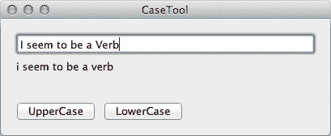

图 16-1. 最终产品

### 创建项目

你将使用 Xcode 来构建此项目，我们将逐步引导你完成整个过程。首先，需要创建项目文件。然后，我们将布局用户界面。最后，建立 UI 与代码之间的连接。

让我们开始吧：启动 Xcode 并创建一个新的 Cocoa Application 项目。运行 Xcode。在启动屏幕上，点击 Create a New Xcode Project。（如果 Xcode 已在运行，请选择 File  New  New Project。）在 Mac OS X 下的左侧表格中选择 Application（如果尚未选中）。选择 Cocoa Application（如图 16-2 所示），然后点击 Next 为我们的应用程序设置一些选项。

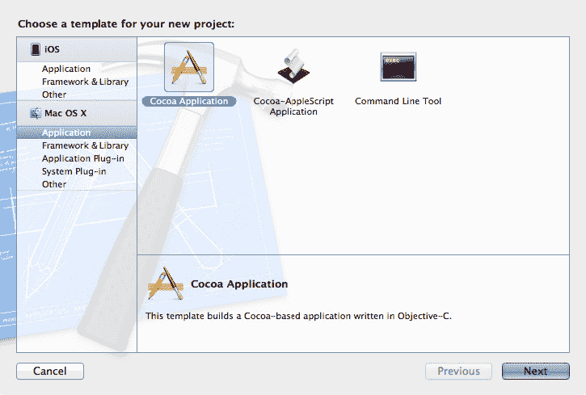

图 16-2. 创建一个新的 Cocoa Application

查看图 16-3，了解设置选项的界面。第一个选项是 Product Name；我们将输入*CaseTool*。下一个字段是 Company Identifier，用于 App Store 区分你的应用程序与其他应用程序。公司标识符通常采用**反向域名**格式；也就是说，以*com*开头，后跟句点和公司名称。在我们的示例中，我们使用`com.MySuperCompany`。此字段区分大小写，因此选择时请记住这一点。

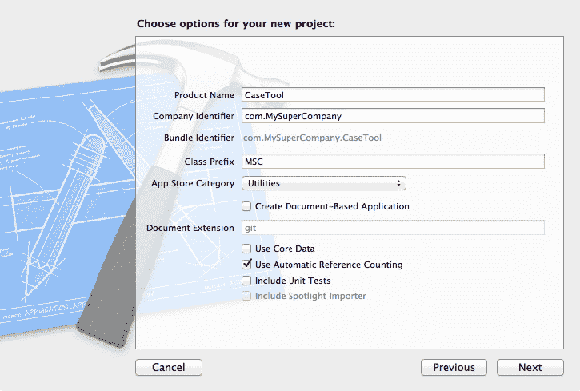

图 16-3. 命名新项目

下一个字段是 Class Prefix。习惯上，在此处输入三个或更多字符。此字符串会被添加到您创建的类名之前。我们将使用`MSC`，这当然代表“My Super Company”。例如，如果您创建一个名为`Circle`的类，Xcode 实际上会将类命名为`MSCCircle`。为什么这样做？因为 Objective-C 没有命名空间，这是一种伪命名空间，一种为你的应用程序保留一些名称的方式。这样，如果你使用第三方框架，并且它有一个名为`Circle`的类，这个名字就不会与你的冲突。

对于 App Store 类别，我们选择`Utilities`，因为这正确地描述了我们的应用程序。

对于其他选项，请务必取消选中 Create Document-Based Application、Use Core Data 和 Include Unit Tests。唯一应选中的复选框是`Use Automatic Reference Counting`。


最后，会弹出一个表单（见图 16-4），让你选择保存项目的目录。本书不讨论源代码控制，但如果你愿意，可以通过选择此表单中的“Source Control”选项来创建一个 Git 仓库。Xcode 对使用 Subversion (SVN) 和 Git 的源代码控制提供了内置支持。

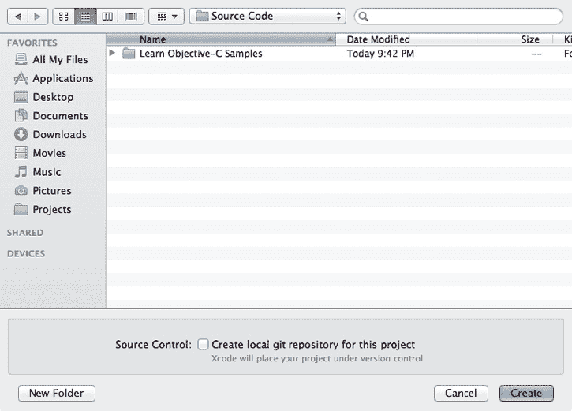

图 16-4. 指定你希望保存项目的位置

就这样——你的新项目已创建完成。如果你展开 Xcode 窗口左侧的 `CaseTool` 组，会看到项目中已经包含了一些文件：`MSCAppDelegate.h`、`MSCAppDelegate.m` 和 `MainMenu.xib`。

`MSCAppDelegate` 是我们应用程序的控制对象。

## 制作委托的 `@interface`

我们将使用 Xcode 中的 Interface Builder 编辑器来布局窗口内容，并在 `MSCAppDelegate` 和用户界面控件之间建立各种连接。Interface Builder 也用于布局 iOS 应用程序，因此无论你最终为哪个平台编程，花在 Interface Builder 上的时间都是值得的。我们将向 `MSCAppDelegate` 类添加一些内容，然后 Interface Builder 会注意到我们的添加，并让我们构建用户界面。

首先，让我们看看委托的头文件：

```
#import <Cocoa/Cocoa.h>

@interface MSCAppDelegate : NSObject <NSApplicationDelegate>

@property (assign) IBOutlet NSWindow *window;

@end
```

你会看到其中有一个叫做 `IBOutlet` 的拟关键字。这实际上并不是一个 Objective-C 关键字，而是 Apple 保留供 Interface Builder 使用的。你还会注意到，在 `IBOutlet` 这行左侧的边栏中有一个小点。点击该点可以直接跳转到 Interface Builder 中关联的对象。

另一个我们会遇到的拟关键字是 `IBAction`。`IBAction` 被定义为 `void`，这意味着声明的方法的返回类型将是 `void`（即不返回任何内容）。

如果 `IBOutlet` 和 `IBAction` 不做任何事情，那它们为什么还存在呢？答案是，它们并非为编译器而存在：`IBOutlet` 和 `IBAction` 实际上是给 Interface Builder 以及阅读代码的人看的标记。通过查找 `IBOutlet` 和 `IBAction`，Interface Builder 了解到 `MSCDelegate` 对象有两个可以连接到其他对象的实例变量，并且 `MSCDelegate` 提供了可以作为按钮点击（及其他用户界面操作）目标的方法。稍后我们将讨论这是如何工作的。

## Interface Builder

现在，是时候启动 Xcode 的 Interface Builder 编辑器了，它在朋友间被亲切地称为 IB。我们想要编辑项目自带的 `MainMenu.xib` 文件。这个文件配备了一个菜单栏，以及一个我们可以放入用户控件的窗口。

在 Xcode 项目窗口中，找到并点击 `MainMenu.xib`（见图 16-5）。

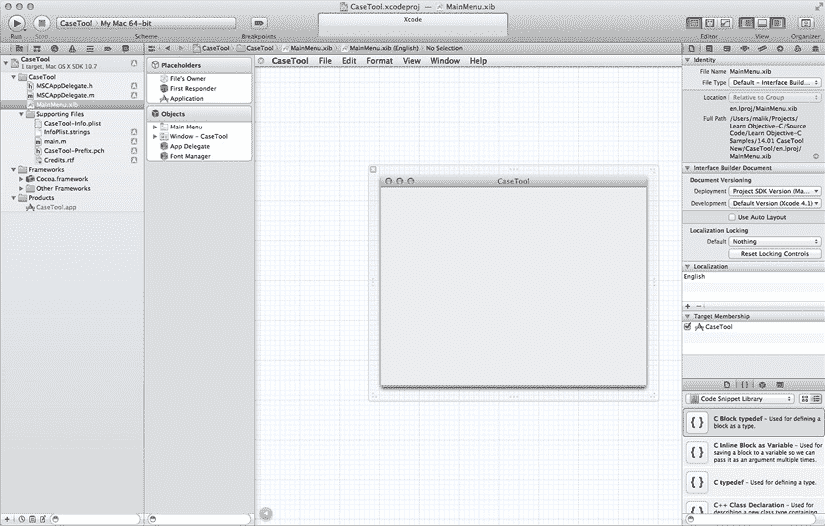

图 16-5. 打开 `MainMenu.xib` 并认识 Interface Builder 编辑器

这会在 Xcode 中打开 Interface Builder 编辑器并显示文件内容。尽管文件扩展名是 `*.xib*`，但我们称这些文件为 nib 文件。“Nib” 是 “NeXT Interface Builder” 的首字母缩写，这是 Cocoa 作为名为 NeXT 的公司一部分所留下的遗产。Nib 文件是包含冻结干燥对象的二进制文件，而 `*.xib*` 文件是 XML 格式的 nib 文件。它们在编译时会被编译成 nib 格式。

看看编辑器区域的左侧。Interface Builder 工具栏中包含了代表 nib 文件内容的图标。你可能无法一眼看出这些是什么以及它们的作用，但别担心，你很快就会弄明白的。现在，我们可以展开工具栏以显示对象的名称。看到工具栏底部那个圆圈里带箭头（看起来像播放按钮）的东西了吗？就在它右边？点击它，工具栏中的项目就会显示它们的名称。

编辑器窗口顶部是我们正在构建的应用程序的菜单栏。你可以在那里添加和编辑菜单及菜单项。在这个项目中，我们不会去修改菜单。

菜单栏下方是一个空窗口，我们将在此放置一些文本字段和按钮。这个真实、活生生的窗口对应于工具栏中那个微小的窗口形状图标。现在，我们将使用库面板，也就是之前在第 7 章讨论过的右下角区域。在库面板中，点击从左数第三个图标，那个看起来像一个盒子的图标。面板会切换显示“对象库”（见图 16-6），其中包含大量你可以拖拽到窗口中的不同类型的对象——里面的东西可真不少。你可以在底部的搜索框中输入一些文本来缩小显示范围。为了方便你使用，每种可以操作的对象都提供了相应的描述。

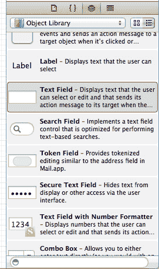

图 16-6. 库面板中的对象库

## 布局用户界面

现在，是时候布局用户界面了。在库中找到 `Text Field`，并将其拖入窗口，如图 16-7 所示。当你在窗口中拖动物体时，会看到蓝色的参考线出现。这些参考线可以帮助你按照 Apple 的用户界面规范来布局对象。

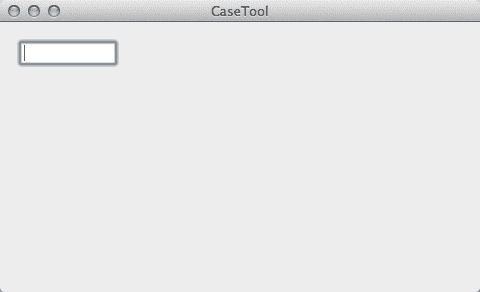

图 16-7. 拖出一个文本字段

现在，我们拖出一个标签。从库中点击 `Label`，并将其拖入窗口，如图 16-8 所示。这里将显示大小写转换的结果。

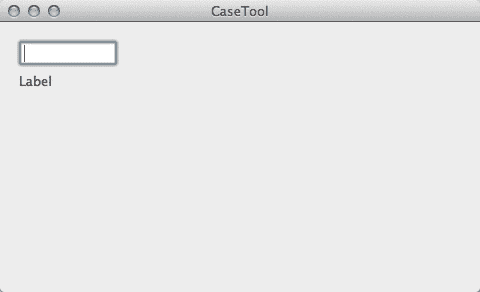

图 16-8. 拖出一个标签

接下来，在库中找到一个“Push Button”并将其拖拽过来。将其放置在标签下方，如图 16-9 所示。这很有趣，不是吗？

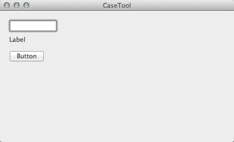

图 16-9. 将一个按钮拖入窗口

现在，双击新放置的按钮。标签变为可编辑状态。输入 `UpperCase`，然后按回车键确认编辑。图 16-10 显示了正在编辑的按钮。

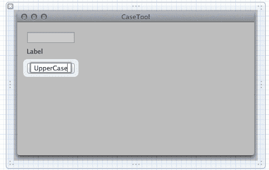

图 16-10. 编辑按钮的标签

现在，从面板中再拖出一个按钮，并将其标签改为 `LowerCase`。图 16-11 显示了添加第二个按钮后的窗口。

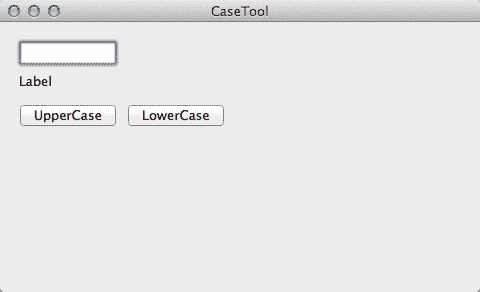

图 16-11. 所有项目都已添加

接下来，我们进行了一点内部装饰，调整了文本字段和窗口本身的大小，使其看起来更美观，如图 16-12 所示。我们还调整了标签的大小，使其跨越窗口的宽度（尽管在图中你看不到）。标签必须足够宽，以显示你输入到字段中的任何文本。现在，窗口看起来正是我们想要的样子。

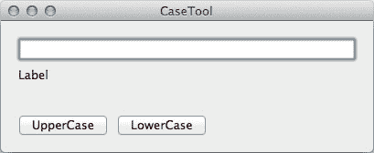

图 16-12. 窗口已清理完毕

## 建立连接


在本节中，我们将向你展示如何将代码连接至我们刚刚创建好的那些精美用户界面元素。

## 连接输出口

现在，是时候建立一些连接了。首先，我们需要告诉对象，它的 `textField` 和 `resultsField` 实例变量应该指向哪个 `NSTextField`。我们将使用辅助编辑器，这个工具我们在第 7 章中简要讨论过。在 Xcode 窗口的右上方，有一组三个按钮，上面标有“编辑器”。点击中间那个按钮，编辑器就会垂直分割成两部分；这就是辅助编辑器。如果你需要更多空间，请确保停靠栏处于最简版本，只显示图标。

接下来，按住 Control 键，从文本字段拖拽到头文件——没错，你正在跨越边界！——拖到 `@property` 这一行下方，直到出现“插入输出口或操作 (Action)”的提示（参见图 16-13）。松开指针后，会弹出一个如图 16-14 所示的对话框。在名称区域输入 `textField`，然后点击“连接”。这会在头文件中创建 `textField` 属性以及其他必需的关键字。到目前为止，我们还没有输入任何代码，但已经“编写”了一大堆代码。这非常酷。让我们对标签重复同样的连接过程，并将其命名为 `resultsField`。

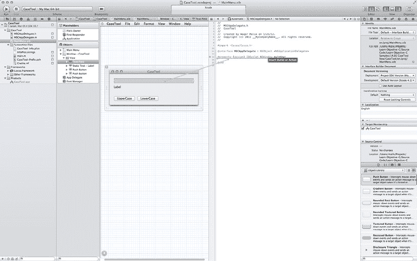

图 16-13. 开始连接

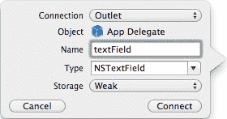

图 16-14. 编辑连接

在检查器的连接面板中仔细检查你的工作。要查看该面板，请选择“视图”  “实用工具”  “显示连接检查器”，或者点击检查器上的“连接”按钮（看起来像一个指向右方的箭头）。你会在检查器顶部看到这些连接，如图 16-15 所示。

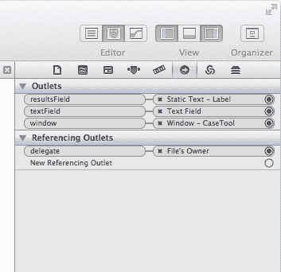

图 16-15. 仔细检查连接

## 连接操作 (Actions)

现在，我们准备将按钮连接到操作 (Actions)，以便它们能触发我们的代码。我们将再次使用 Control-拖拽来建立我们心爱的连接，这次是从按钮拖到 `MSCAppDelegate`。

**注意**：在使用 Interface Builder 时，知道拖拽连接的方向是一个常见的困惑点。拖拽的方向是*从*需要知道某些信息的对象*到*它需要了解的那个对象。

`MSCAppDelegate` 需要知道使用哪个 `NSTextField` 来接收用户的输入，所以拖拽是从 `MSCAppDelegate` 到文本字段。

按钮需要知道告诉哪个对象：“嘿！有人按了我！”。所以，你需要从按钮拖拽到 `AppController`。

按住 Control 键点击 UpperCase 按钮，然后拖拽一根连线到头文件中最后一个 `@property` 的下方，如图 16-16 所示。连接框会再次弹出。这一次，将连接类型改为“操作 (Action)”。在名称字段中输入 `uppercase`，然后点击“连接”。这会在头文件中创建方法原型，并在 `.m` 文件中创建一个空的实现。

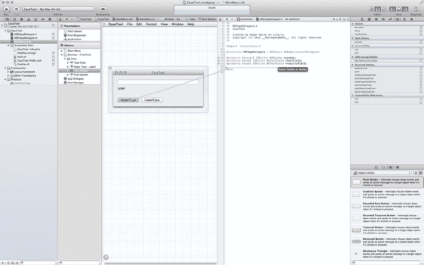

图 16-16. 连接 UpperCase 按钮

现在，每当按钮被点击时，消息 `uppercase:` 就会被发送给 `MSCAppDelegate` 实例，这正是我们一直想要的效果。然后，我们就可以在 `uppercase:` 方法中执行任何我们想要的操作了。

最后，我们通过连接 LowerCase 按钮来完成最后的连接。按住 Control 键从 LowerCase 按钮拖拽到头文件*，*并将类型改为“操作 (Action)”，名称改为 `lowercase`（见图 16-17）。至此，我们在 Interface Builder 中的工作就完成了。


## AppDelegate 实现

现在，让我们回到编码环节。是时候实现 `MSCAppDelegate` 了——但首先，简单了解一下 `IBOutlet` 的工作原理。

当加载 nib 文件时（应用启动时会自动加载 `MainMenu.xib`，你也可以自行创建并加载 nib 文件），所有存储在 nib 文件中的对象都会被重新创建。这意味着 `alloc` 和 `init` 会在后台自动完成。应用启动时，系统会分配并初始化一个 `MSCAppDelegate` 实例。在 `init` 方法执行期间，所有 `IBOutlet` 实例变量均为 `nil`。只有等到 nib 文件中*所有*对象（包括窗口、文本字段和按钮）都创建完成后，所有连接才会被建立。

一旦所有连接建立完成（这一过程仅涉及将 `NSTextField` 对象的地址存入 `MSCAppDelegate` 的实例变量），系统会向每个已创建的对象发送 `awakeFromNib` 消息。请注意，对象的创建顺序没有预定义，`awakeFromNib` 消息的发送顺序同样没有预定义。

一个非常常见的错误是在 `init` 方法中尝试操作 `IBOutlet`。由于此时所有实例变量都为 `nil`，向它们发送的所有消息都不会生效，因此你在 `init` 中尝试执行的任何操作都会在静默中失败（这是 Cocoa 可能让你失望并耗费调试时间的地方之一）。如果你怀疑遇到了这种情况，并想知道为什么代码不工作，可以使用 `NSLog` 打印实例变量的值，检查它们是否全部为 `nil`。

接下来我们继续实现 `MSCAppDelegate`。以下是必要的准备工作：

```objc
#import "MSCAppDelegate.h"

@implementation MSCAppDelegate
```

接下来是我们定义的属性。但这些代码从何而来？我们并没有添加它们。嗯，算是我们间接添加的：当我们将项目从 nib 文件拖拽到头文件时，Interface Builder 为我们添加了这些代码。

接下来我们将添加一个 `init` 方法。我们并非真正需要它，只是想演示在 `init` 时输出口尚未赋值。

```objc
- (id) init
{
    if (nil != (self = [super init]))
    {
        NSLog (@"init: text %@ / results %@", _textField, _resultsField);
    }
    return self;
}
```

为了获得更友好的用户界面，我们应该将文本字段设置为合理的默认值，而不是显示为 `Label`。诚然，这是准确的默认值，但实在没什么趣味。我们将在文本字段中填入 `Enter text here`，并将结果字段预设为 `Results`。`awakeFromNib` 是执行此操作的理想位置（尽管我们也可以在 Interface Builder 中完成设置）。

```objc
- (void)awakeFromNib
{
    NSLog (@"awake: text %@ / results %@", _textField, _resultsField);
    [_textField setStringValue:@"Enter text here"];
    [_resultsField setStringValue:@"Results"];
}
```

`NSTextField` 有一个名为 `setStringValue:` 的方法，该方法接收一个 `NSString` 作为参数，并更改文本字段的内容以显示该字符串值。我们正是使用这个方法来让文本字段显示更吸引用户的内容。

现在来看操作方法——首先是 `uppercase`：

```objc
- (IBAction) uppercase: (id) sender
{
    NSString *original = [_textField stringValue];
    NSString *uppercase = [original uppercaseString];
    [_resultsField setStringValue:uppercase];
} // uppercase
```

我们通过向 `_textField` 发送 `stringValue` 消息获取原始字符串，然后创建其大写版本。`NSString` 为我们提供了便捷的 `uppercaseString` 方法，该方法会根据接收字符串的内容创建一个新字符串，并将每个字母转换为大写。最后将该字符串设置为 `_resultsField` 的内容。


现在我们例行检查内存管理：一切顺利吗？当然没问题。创建的两个新对象（原始字符串和大写字符串）都来自非 `alloc`、`copy` 或 `new` 的方法，因此它们位于自动释放池中，会被自动清理。`setStringValue:` 方法负责复制或保留传入的字符串，至于它具体怎么做，那是它自己的事。我们只需确认自己的内存管理是正确的。

`lowercase:` 方法与 `uppercase:` 类似，只是用于转换为小写。

```
- (IBAction) lowercase: (id) sender {

NSString *original = [_textField stringValue];

NSString *lowercase = [original lowercaseString];

[_resultsField setStringValue:lowercase];

} // lowercase
```

就是这样！运行程序时，你会看到窗口出现。输入一个字符串，然后切换其大小写，如图 16-18 所示。

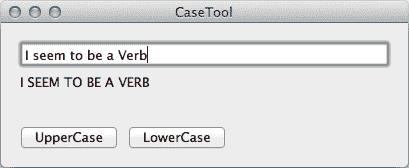

图 16-18。完成的 `CaseTool` 程序正常运行。

## 本章小结

本章是一次旋风式的概览，仅触及了 Interface Builder 和 Application Kit 的表面。我们只直接使用了一个 AppKit 类（`NSTextField`），并间接使用了两个类（用于驱动按钮的 `NSButton`，以及控制窗口的 `NSWindow`）。实际上，AppKit 中包含超过 100 个不同的类可供你探索，其中许多都会在 Interface Builder 中出现。

到目前为止，你已经完全具备深入学习 Cocoa 书籍或项目的能力。下一章，我们将继续探讨 Cocoa 中用于保存和加载文件的一些特性。

---

