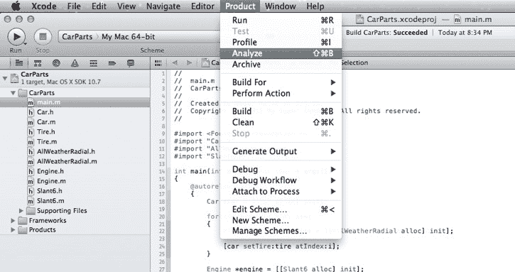
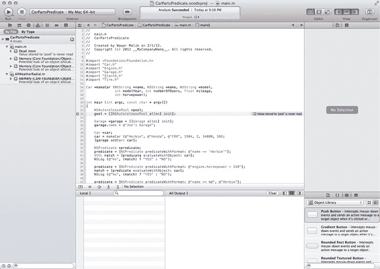
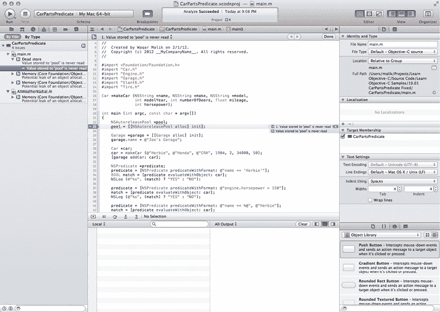
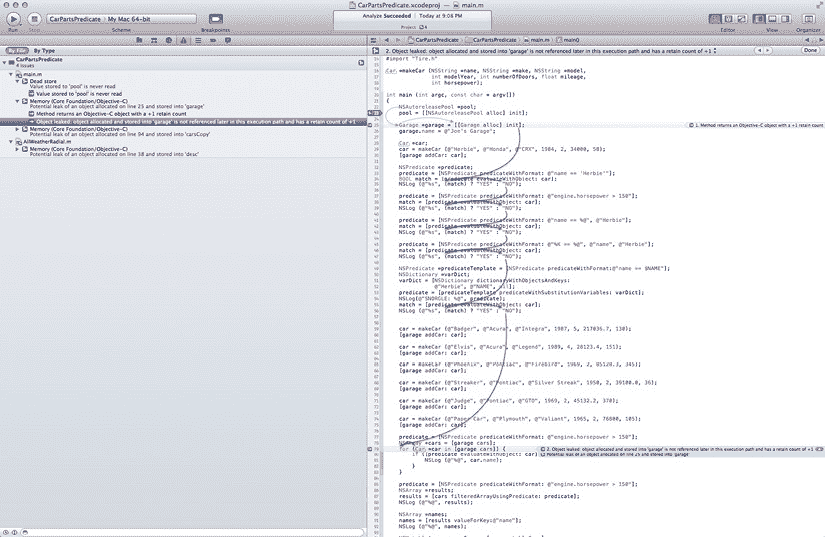
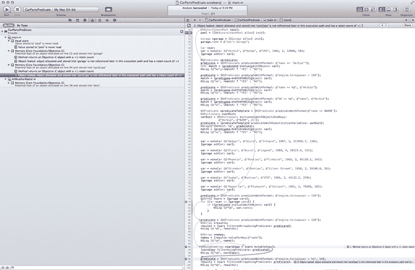
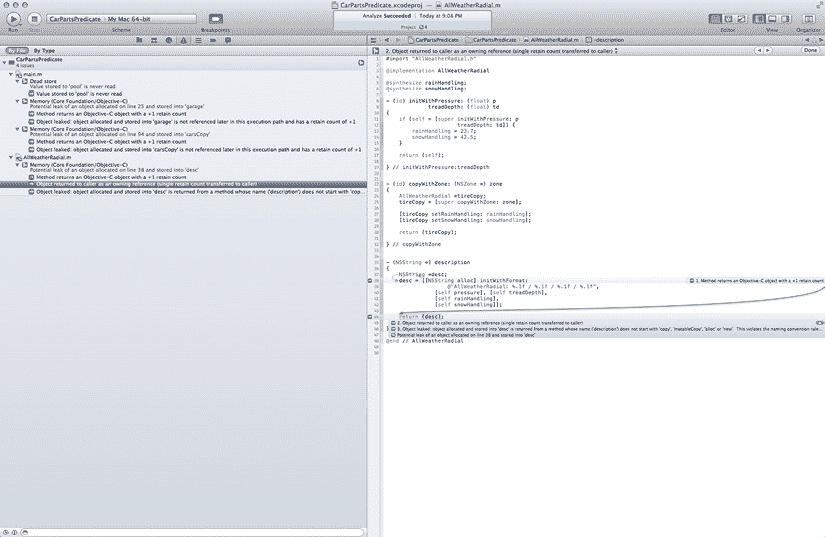

# 第 19 章 使用静态分析器

当你构建应用程序时，大多数编译器可以检测看起来可疑的代码并发出警告，指示可能在运行时变成错误的代码。为了超越这种警告，几年前，Apple 在 Xcode 3.2 版本中添加了一个**静态分析器**。静态分析器是一种在不实际运行代码的情况下逻辑检查代码的工具，寻找可能变成错误的缺陷。在本章中，我们将了解如何使用静态分析器来发现代码中的问题。

## 开始静态分析

静态分析器是做什么的？它是如何工作的？静态分析器非常了解 Objective-C 程序应该如何工作，然后根据这些知识检查你的程序。它不仅仅查看你的源代码；它实际上会在应用程序中的代码路径中移动，寻找逻辑错误，然后将这些错误报告给你。你可以在构建和运行之前修复它们。

静态分析器可以发现各种类型的错误：

*    安全问题，例如内存泄漏和缓冲区溢出
*    并发问题，例如竞态条件（当两个或多个任务可能因时序问题而失败时）
*    逻辑问题，包括死代码和各种不良编码实践

这太棒了！但是，除了好处之外，使用分析器也有一些缺点。

*    它会减慢你的构建过程，因为执行分析需要时间。
*    分析器有时会产生误报，告诉你存在的问题实际上并不是问题。
*    它会改变你熟悉的工作流程，因为你必须弄清楚如何将之融入。

## 进入分析

好吧，即使有这些缺点，听起来也不是那么糟糕。让我们试一试。我们如何开始使用这个奇特的工具？

实际上再简单不过了。首先打开一个项目；我们将使用`*19-01 CarParts Error*`。点击**Product**菜单并选择**Analyze**（见图 19-1），或按 + shift + B。就这样！你已被分析。但你还没有完成——这只是你与这个工具交互的开始。



**图 19-1.** 从 **Product** 菜单中选择 **Analyze**

当我们构建`*19.01 CarParts Error*`时，我们看到它编译没有错误，并且运行良好。经过静态分析步骤，你可能会注意到我们的程序编译时间稍长。

毫无疑问，你也注意到分析器有一些要报告的内容，由分支箭头图标指示。静态分析器为我们发现了四个我们之前不知道的问题。酷——让我们来看看。

问题导航器（见图 19-2）列出了分析器发现的问题。我们将逐一检查这些错误。



**图 19-2.** 分析器发现了四个问题

## 死存储不是吸血鬼买牛奶的地方


第一个提示是“Dead store”。“Dead store”的描述意味着我们创建了一个对象（此处命名为`pool`），但从未在代码中直接访问它——我们从未向它发送方法调用，也未曾尝试修改它（请见图 19-3）。



图 19-3. 导致分析器报告问题的代码

尽管我们的程序在技术上正确，但分配和释放内存的过程需要时间，并且（显而易见地）会占用存储空间，这两点在 iOS 中尤其重要。借助分析器，我们可以从应用中移除这个变量，使程序效率得到小幅提升。

## 密封车库

现在，我们来讨论第二个问题。该问题指出存在“对象潜在泄漏”，具体指 `garage` 对象。但这怎么可能呢？我们在 `main` 函数的末尾，释放 `pool` 之前刚刚释放了 `garage`。事情变得复杂了。

为了查明原因，我们点击嵌入在代码行中的分析器气泡。点击后，出现了如图 19-4 所示的神奇波浪线图示。



图 19-4. 分析器展示的代码执行路径

图 19-4 向您展示了代码的执行路径，显而易见，该路径从未到达释放 `garage` 的那一行。再仔细看，我们发现第 177 行有一个多余的 `return` 语句，它在清理内存之前就结束了函数。

令人惊讶的是，这种错误非常普遍。它通常发生在您过早地从方法或函数返回，而没有释放已分配的对象时。

## 记住你的停车位

解决了两个问题，还剩两个。下一个分析器问题指出，我们泄漏了一个存储到 `carsCopy` 中的对象。进一步查看发现，我们让 `carsCopy` 成为了 `cars` 的一个 `mutableCopy`，但从未释放这个副本（请见图 19-5）。我们可以在 `main` 函数末尾释放 `carsCopy` 来解决此问题。



图 19-5. 我们创建了 `carsCopy` 但从未释放

## 生不带来，死不带去

我们还剩一个分析器问题，即 `AllWeatherRadial` 中的泄漏。查看此问题时，我们发现 `description` 方法分配了一个字符串 `desc`，但在返回前从未释放它（请见图 19-6）。

这种情况下，我们可以通过编辑 `return` 语句，将其改为 `return [desc autorelease]`，来告诉池子在准备好的时候释放它。



图 19-6. 我们分配了 `desc` 但从未释放

## 协助分析器

静态分析器是一个强大的工具，但它并非完美无缺。为了给分析器提供一些线索以帮助其更好地工作，您可以在方法中使用一些关键字来避免误报。这些关键字可以让您告诉分析器：“我知道这看起来不太对劲，但我保证自己清楚在做什么，所以请不要对我大喊大叫。”

## 返回一个保留对象

您可以使用 `NS_RETURNS_RETAINED` 来标记一个返回保留计数大于零的对象的方法。假设您有以下方法：

```
- (NSMutableArray *)superDuperArrayCreator
{
    NSMutableArray *myArray = [[NSMutableArray alloc] init];
    // … 处理 myArray
    return myArray;
}
```

您知道您希望此方法返回 `myArray`，并且您计划在获取数组后释放它。但分析器不知道这一点；它只知道，按照惯例，您必须在分配内存的地方清理它。

为了安抚分析器，您可以用 `NS_RETURNS_RETAINED` 来标记该方法。代码如下：

```
- (NSMutableArray *)superDuperArrayCreator NS_RETURNS_RETAINED;
```


类似地，你可以对 C 对象使用 Core Foundation 版本。要返回此类对象，可以使用关键字 `CF_RETURNS_RETAINED`。例如，对于以下代码：

```
- (CFMutableArrayRef)superDuperArrayCreator

{

    CFMutableArrayRef myArrayRef = CFArrayCreateMutable(kCFAllocatorNull, 10, NULL);

    // … 处理 myArray

    return myArrayRef;

}
```

你的方法将如下所示：

```
- (CFMutableArrayRef)superDuperArrayCreator CF_RETURNS_RETAINED;
```

## 返回非保留对象

你也可以将分析器指向相反的方向，让它在尝试返回*非保留*对象时发出警告。此处的关键字是 `NS_RETURNS_NOT_RETAINED` 和 `CF_RETURNS_NOT_RETAINED`。

给定以下定义：

```
- (NSMutableArray *)superDuperArrayCreator NS_RETURNS_NOT_RETAINED;
```

如果我们返回一个已保留的对象，分析器将会提出一个问题。

## 返回空值

为了确保方法返回 `void`（空值），你可以在定义方法时使用关键字 `CLANG_ANALYZER_NORETURN`。在这种情况下，如果尝试返回一个值，分析器将会产生一个问题。

**那是什么声音？** 最后那个关键字中的 “CLANG” 前缀从何而来？Clang 是一个开源项目，它增强了 C 编译器，并为 Xcode 中的静态分析器提供了基础。有关 Clang 的更多信息，可以查阅 [`clang.llvm.org`](http://clang.llvm.org)。

## 进一步分析

静态分析器在我们的这个小程序中发现了四种不同的问题。在本节中，我们将描述静态分析器能够揭示的其他几种问题。

### 比较错误

Objective-C 程序中的一种常见模式是在条件语句（如 `if` 和 `while`）中同时获取值并进行测试。

```
if(myValue = [self getValue])

{

// 执行某些操作

}
```

对于 `if` 语句有两种解读方式：

*   为 `myValue` 赋值，然后测试其是否为 `nil`。
*   `myValue` 等于该方法返回的值。

由于这里存在歧义，并且分析器（目前）无法读懂我们的想法，因此分析器会将其标记为一个问题。如果我们确实想要第一种含义，可以将其重写为 `if((myValue = [self getValue]))` 或 `if(nil != (myValue = [self getValue]))`。

如果我们想要第二种含义，那这确实是一个错误，我们需要通过正确比较这两个值来修复它：

```
if(myValue == [self getValue])
```

### 内存泄漏

让我们看看这段代码：

```
- (void)myMethod

{

    NSString *string = [[NSString alloc] initWithFormat:@"%d, %d", 1, 2];

    if(nil == string)

    {

        return;

    }

    NSArray *array = [[NSArray alloc] initWithObjects:string, nil];

    if(nil == array)

    {

        return;

    }

    // 执行一些操作

    // 很久以后

    [array release];

    [string release];

}
```

乍一看，这段代码看起来非常不错。我们表现得像个好公民，分配了内存，然后在方法结束时释放了它们。一切都很完美，对吧？并非如此！分析器揭示了残酷的真相。

代码中的一条路径会导致内存泄漏。如果 `array` 的内存分配失败，方法无法继续执行，会立即返回。但在这一点上，我们已经分配了 `string`，而它不会被释放，因为我们从未到达方法末尾那个甜蜜的释放点。这指出了一条普遍的最佳实践：每当你退出一个方法时，应该思考哪些对象已经被分配但尚未释放。

为了解决这个问题，我们像下面这样修改第二个 `if` 语句：

```
if(nil == array)

{

    [string release];

    return;

}
```

### 过度释放

通常你会创建一个对象，使用它，然后最终发送一个 `autorelease` 消息，这样当方法结束时，对象就会被销毁。

```
NSString *myString = [[[NSString alloc] initWithFormat:…] autorelease];

// 在同一个应用程序的后续位置

[myString autorelease];
```

在这个例子中，`myString` 的初始 retain 计数为 0，但我们却再次告诉编译器释放它，静态分析器会指出这个问题。要修复它，我们移除其中一个 `autorelease` 即可。

### 对 nil 进行同步


