# 第 2 章：Hello, World

您可能很清楚，将任何编程书籍的第一个项目命名为“Hello, World”已成为一种传统。遵循“如果没坏，就别修”的准则，我们将延续这一传统。

### 构建“Hello, World”

现在，您应该已经在机器上安装了 Xcode。您还应该已将 `Learn Cocoa Projects` 文件夹安全地存放在硬盘的某个位置。如果由于某些原因您没有这么做，请直接返回第 1 章（不要经过起点，不要领取 200 美元）并重新阅读相关章节。

我们将要处理的第一个项目位于 `Chapter02/Chapter2` 文件夹中。启动位于 `Applications` 文件夹中的 Xcode。以防您从未使用过 Xcode，我们将引导您完成创建新项目的流程。

首先，从“文件”菜单中选择“新建项目”，或者键入 `N`。当“新建项目助理”弹出时（图 2-1），在左列“Mac OS X”标题下选择 *Application*，然后在右上方面板中选择 *Cocoa Application* 图标，并点击“下一步”。

图 2-1。从 Xcode 的“新建项目助理”中选择 Cocoa Application 项目模板

一个 *Project Options* 窗口提供了多个选项（图 2-2）。我们需要为应用程序指定一个名称。“Chapter2”是个不错的选择。我们还需要提供一个公司标识符，其格式类似于反向域名（很像 Java 包名或 C# 命名空间）。如果我们使用 `megacorp.com` 域名，那么这里可以填写 `com.megacorp`。Mac OS X 会使用产品名称和公司标识符的组合，作为我们程序在整个系统以及 Mac App Store 中的唯一名称。不过，由于我们不会将本应用分发到自己的电脑之外，所以我们可以任意选择。这里最后一个重要的字段是类前缀。我们会看到，许多 Cocoa 类都以 `NS` 或 `CF` 作为前缀。在这些类中，Xcode 会为我们生成一些文件，作为创建新项目的一部分，它将使用我们在此处提供的前缀。现在，请输入“Book”。本章中我们不会用到其他字段，因此可以保留默认值。点击“下一步”。

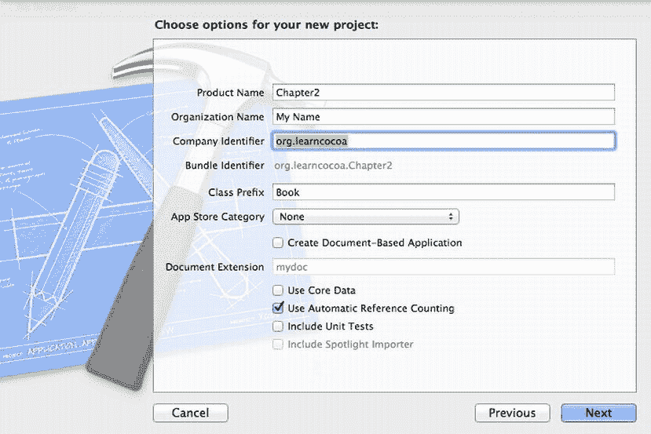

图 2-2。从 Xcode 的“新建项目助理”中为新 Cocoa 应用指定选项

接下来，会弹出标准的“保存”窗口，用于设置项目的位置（图 2-3）。Xcode 会在我们选择的位置创建一个以项目名称命名的新文件夹：可以是我们的“文档”文件夹，也可以是我们自己创建的一个用于存放 Xcode 项目的新独立文件夹。Xcode 项目保存在哪里其实并不重要，但如果我们始终将所有项目保存在一个地方，以后会更容易找到它们。我们还可以选择让 Xcode 使用 Git（一个强大的开源分布式版本控制系统）为项目配置版本控制。现在，我们也可以保留默认设置。

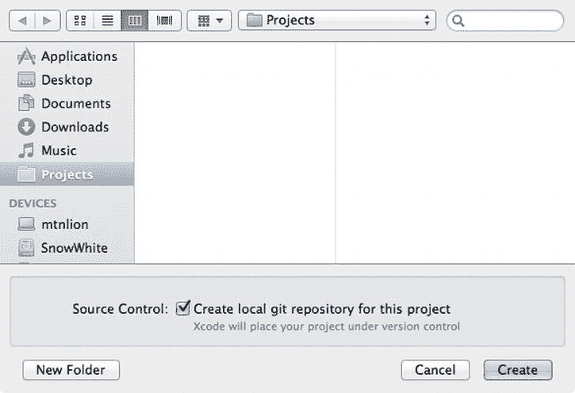

图 2-3。为项目命名并选择保存位置

一旦我们选择了位置，一个新项目窗口就会出现（如图 2-4 所示）。虽然您可能已经熟悉了 Xcode，但请花点时间看看这个项目窗口。这是我们即将长时间面对的环境，所以确保我们达成共识。与许多为 Mac OS X 10.7 Lion 及更新版本构建的应用程序一样，Xcode 包含一个全屏选项。由于 Xcode 是一个复杂的应用程序，因此它需要较大的屏幕空间才能达到最佳效果。我们应该立即点击窗口右上角的箭头使其全屏显示。

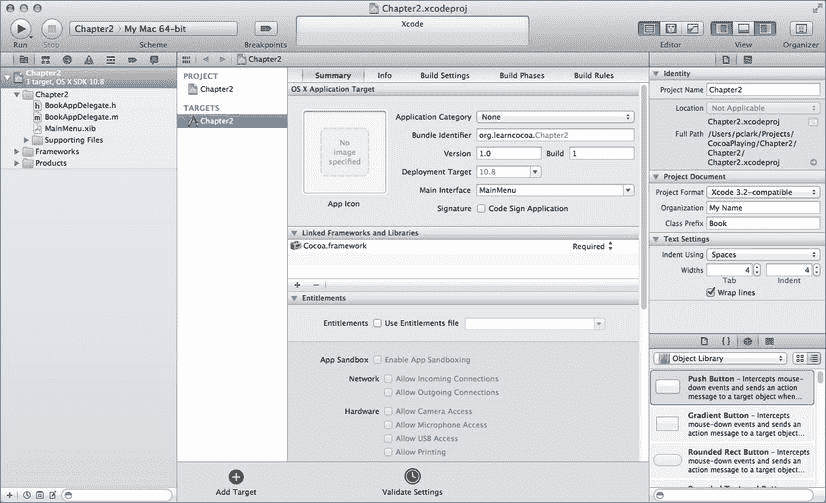

图 2-4。我们在 Xcode 中的项目主窗口

我们的项目窗口顶部有一个工具栏，让我们可以快速访问一组常用命令。在工具栏下方，窗口被划分为三个主要部分，即窗格。

沿着窗口左侧向下延伸的窗格称为 *Navigator*（导航器）区域。构成我们项目的所有资源以及许多相关的项目设置都分组在此处。点击项目左侧的小三角可以展开该项目，显示其所有可用的子项。再次点击已展开项目左侧的小三角则会隐藏其子项。

右侧窗格称为 *Utility*（实用工具）区域，它显示在 *Navigator* 区域中选中项目的详细信息。

对于源代码文件，此区域会显示标识和类型信息、文件在文件系统中的完整路径、本地化信息、使用所选文件的构建目标、编码信息以及版本控制信息。其他类型的文件会显示与其类型相符的信息。根据在`Navigator`窗格中选择的文件类型，此区域顶部可能会有一行小图标，允许我们选择要在此处显示的几种不同信息视图。信息窗格下方是`Library`库。稍后我们将在此处进行更多探索。中央窗格称为`Editor`编辑器窗格。如果我们在`Navigator`窗格中选择了一个文件，并且`Xcode`知道如何显示或编辑该类型的文件，则该文件的内容将显示在`Editor`窗格中。我们将在此处编写和编辑应用程序的所有源代码。

**注意** 许多开发人员喜欢在使用编辑器时隐藏`Utility`工具区域，以便将更多屏幕空间用于代码编辑；我们可以通过按下0 来切换`Utility`工具区域的显示。

现在，让我们看看`Xcode`窗口左侧的`Project Navigator`项目导航器区域。其中有几个文件夹和三个自动为我们创建的文件。我们暂时忽略这些文件夹和前两个文件（稍后会重新介绍它们）。第三个文件名为`MainMenu.xib`。

点击`MainMenu.xib`。`Editor`编辑器窗格将切换到`Interface Builder`界面生成器模式，这是专门为编辑`.xib`文件而设计的编辑器（图 2-5）。在`Xcode 4`之前，`Interface Builder`是一个独立的应用程序，但现在它已集成到`Xcode`中，这为将用户界面连接到底层代码带来了很多好处。`MainMenu.xib`文件被称为“`nib`文件”。嗯？一个`nib`文件？为什么不是`xib`文件？首先，“`xib`”很难发音。但更重要的是，“`nib`”这个术语是早期更简单时代的遗留物。`Cocoa`和现代`Xcode`开发工具的前身是由`NeXT`公司开发的，这是一家由`Steve Jobs`在 1985 年创立的公司。“`nib`”这个名字最初代表`NeXT Interface Builder`。随着时间的推移，`NeXT`被`Apple`收购，`nib`格式演变为一种更新的、基于`XML`的格式。这种`XML`和`Interface Builder`的结合产生了新的`.xib`扩展名。尽管如此，“`nib`文件”这个名字还是保留了下来，大多数开发人员仍然称他们的`xib`文件为“`nib`文件”。

**警告** 你会在`Xcode`中创建的每个`Cocoa`项目中找到`MainMenu.xib`文件。这是一个特殊文件。请如此对待它。除非我们告诉你，否则不要移动、重命名或以其他方式骚扰该文件。当你的应用程序启动时，它会自动将`MainMenu.xib`的内容加载到内存中。`MainMenu.xib`包含关键信息，包括应用程序的菜单栏和主窗口（如果有的话）。随着时间的推移，你将了解关于`nib`文件的所有信息，并能自己创建它们。目前，请保持耐心——并且不要动手。

### 探索 Nib 文件

`Interface Builder`模式提供了强大的功能，所以让我们花点时间看看事情的布局。`Interface Builder`的`Editor`编辑区域看起来像一张方格纸，我们的应用程序的菜单栏横跨其顶部（图 2-5）。沿着左侧，方格纸的边缘外侧，有一系列图标停靠在边栏中。这些是构成我们`Cocoa`应用程序用户界面的对象。靠近底部是一个“播放”按钮，可以将停靠栏展开为大纲模式，以便我们获取有关这些对象的更多信息。

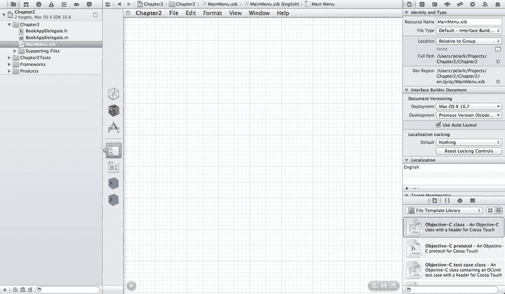

图 2-5. 准备编辑的`MainMenu.xib`

请注意，沿着`Xcode`窗口右侧`Utility`工具区域顶部的一行图标已从两个扩展到八个；这些对象比文件更具可配置性。

这些图标中的每一个都代表`Inspector`检查器的一种不同模式。我们稍后将详细介绍此处显示的不同类型的信息。在其下方是`Library`库，有一行四个小图标，可将视图切换到不同类型的项目。将鼠标悬停在每个图标上会显示一个工具提示，描述每种视图显示的项目类型。`Inspector`检查器用于设置构成用户界面的对象的参数，而`Library`库是我们添加新对象以布局界面的地方。

`Editor`编辑器顶部的菜单栏属于我们的应用程序，在此处的更改将反映在应用程序启动时出现的菜单栏中。我们可以点击菜单标题，它们会展开以显示下面的菜单项；新的`nib`文件免费提供了`Mac`标准的“文件”、“编辑”、“格式”、“视图”、“窗口”和“帮助”菜单，但如有必要，我们可以添加更多并修改默认值。停靠栏中看起来像下拉菜单的图标（从上数第四个）是代表主菜单的对象。在图 2-5 中，它有一个高亮边框，表示它已被选中。

在停靠栏的主菜单图标下方，是一个看起来像窗口的图标，事实上它就是一个窗口。我们用来创建此项目的`Cocoa Application`项目模板假设我们的应用程序至少有一个窗口，并且它为我们创建了该窗口。我们将使用此窗口来布置程序启动时将显示的窗口内容。选择窗口图标，我们应用程序新的、空的主窗口将出现在方格纸上。

### 库（Library）

右下角的`Library`库窗格充当一个调色板，其中包含可用于构建应用程序界面的对象集合。在`Mountain Lion`中，这里有 134 种不同的对象类型可供使用。`Library`库最初显示“文件模板”库，但这里有四种可以显示的资源类型：文件模板、代码片段、对象和媒体。我们想要使用的所有用户界面元素都在`Objects`对象视图中。我们滚动浏览库，找到要使用的项目，然后将该项目拖入相应的`Xcode`窗格。选择代表`Object Library`对象库视图的图标，或按3。屏幕应看起来像图 2-6。

图 2-6. 显示我们新的空窗口和对象库的`MainMenu.xib`

花一分钟时间滚动浏览库中的不同`UI`对象：按钮、滑块、文本字段、标签、浏览器，甚至还有`OpenGL`视图！

### 拖出一个标签

`Object Library`对象库窗格将显示一个项目列表，这些项目可以拖到我们的应用程序窗口中以构建应用程序的界面。我们现在拖一个过去。我们将使用一个名为`Label`标签的对象，它用于显示静态文本——用户无法编辑的文本。将一个标签拖到窗口上。

在`Object Library`对象库视图中，向下滚动大约十二个项目，找到一个名为`Label`的标签。直接点击库中的`Label`并将其拖到应用程序的主窗口（标记为`Chapter2`的窗口）上。这样做会将一个新标签添加到我们的应用程序窗口中（图 2-7）。

图 2-7. 将一个标签拖到窗口上

**提示** 与其像我们刚才那样向下滚动列表，我们只需在`Library`库窗格底部的搜索字段中输入单词“`label`”。这将过滤列表，只显示库中名称或描述中包含单词“`label`”的对象。

现在我们已经有了一个标签，让我们更改它。双击该标签。

它应该变为可编辑并处于选中状态。由于现有文本已被选中，我们只需直接输入新文本，它就会替换之前的内容。请继续输入“Hello, World!”，这可比“Label”有趣多了。（如果你想要反叛一点，你也可以输入别的，但要是提基神来找你麻烦，可别怪我们！）

### 使用蓝色参考线

编辑完标签后，按`return`确认更改，这将使标签退出编辑模式。接下来，点击并将标签拖向窗口的左侧边缘。当它靠近窗口左边缘时，文本左侧会出现一条蓝色的虚线（Figure 2-8）。界面构建器使用这些蓝色参考线来指示拖动的项目与周围项目对齐正确。在此例中，该参考线指示标签与窗口左边缘的距离是合适的。

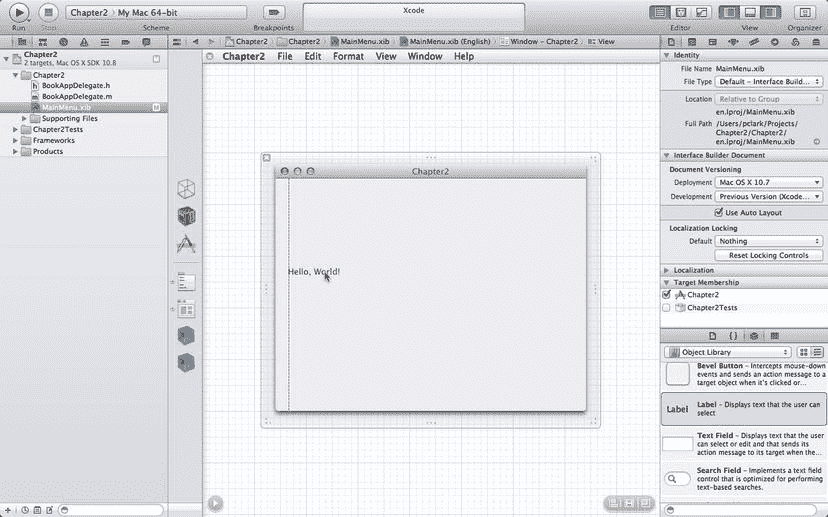

Figure 2-8。当我们把对象靠近边缘时，蓝色参考线就会出现

**注意**  多年来，让 Mac 的使用体验如此愉悦的原因之一便是用户界面的一致性。在绝大多数 Mac 应用程序中，无论你正在使用哪个程序，都可以依赖按W 来关闭窗口，按S 来保存，以及按P 来打印。如果你要为 Mac 编写软件，就应该了解这些“一致性规则”。苹果在其《人机界面指南》（也称为*HIG*）中阐述了这些规则。界面构建器的蓝色参考线正是为了让你更容易遵守《人机界面指南》而存在的。你可以在`http://developer.apple.com/library/mac/#documentation/UserExperience/Conceptual/AppleHIGuidelines`找到一份*HIG*的副本。

### 检查器

*库*区域占据了 Xcode 窗口右侧实用区域的下部大约三分之一。另一个重要的界面构建器工具位于*库*的正上方，占据了右侧实用区域的上部三分之二。这被称为*检查器*。*检查器*是一个上下文相关的窗格，用于显示当前选中对象的信息。点击窗口，检查器会显示该窗口的信息（Figure 2-9）。点击标签，*检查器*会显示该标签的信息。你明白了吧。

Figure 2-9。显示窗口属性的检查器

看看 Figure 2-9 中显示的*检查器*面板。注意横跨面板顶部的八个图标。按下每个图标，面板都会转变为八种不同的检查器类型之一。

每个*检查器*也都有一个键盘快捷键，从按1 跳到最左侧的检查器（*文件检查器*）到按8 跳到最右侧的*检查器*。在界面构建器模式下工作时，*属性*和*连接检查器*将是我们最常用的。Table 2-1 列出了八个检查器各自的命令键快捷键。

Table 2-1。界面构建器检查器的按键组合快捷键

| 按键组合 | 检查器 |
| --- | --- |
| 1 | 文件检查器 |
| 2 | 快速帮助检查器 |
| 3 | 身份检查器 |
| 4 | 属性检查器 |
| 5 | 大小检查器 |
| 6 | 连接检查器 |
| 7 | 绑定检查器 |
| 8 | 视图效果检查器 |

### 属性检查器

让我们先来看看*属性检查器*。（如果你看不到它，请按4 在*实用*区域显示该窗格，然后单击你的标签。）*检查器*应该看起来像 Figure 2-10。

Figure 2-10。显示可以在界面构建器中编辑的标签所有属性的属性检查器

我们可以使用*属性检查器*来更改标签的外观。我们可以更改文本对齐、边框和滚动行为等属性。有趣的是，其中几个字段实际上不会产生任何效果。请继续在占位符字段中输入一些内容。标签的外观一点也没变，对吧？

这是怎么回事？当我们从库中拖出一个标签时，我们获取的是`NSTextField`类的一个实例。`NSTextField`类用于静态文本字段和可编辑文本字段。在可编辑文本字段中，占位符是我们在某些空文本字段中看到的灰色文本，它告诉我们该字段是做什么用的。

当一个文本字段被配置为标签时，就不需要占位符了。提供一个占位符没有坏处，但也没有好处。

本书中无法枚举所有特定于上下文的属性，但我们会讲解那些不太明显的属性。随着你阅读本书的深入，你将逐渐熟悉自己常用的那些大多数属性。

让我们更改标签的大小。如果标签未被选中，单击它以将其选中。标签两侧应该会出现一个点。这些点是尺寸调整手柄，允许我们更改选中项目的大小。界面构建器中的大多数对象都有四个尺寸调整手柄，每个角落一个，这允许我们在所有四个方向上调整大小。某些项目，如标签，只有两个尺寸调整手柄。标签的属性（特别是其字体大小）决定了标签的垂直尺寸。我们不会通过调整大小来改变标签的高度。我们只使用尺寸调整手柄来更改标签的宽度。

让我们居中标签。确保标签左侧与窗口左边缘附近的蓝色参考线对齐。然后，抓住右侧尺寸调整手柄并向外拖动标签，直到到达窗口右边缘附近的蓝色参考线。完成后，标签应该看起来像 Figure 2-11。

Figure 2-11。调整大小后，我们在界面构建器中的应用窗口

现在，在标签仍处于选中状态的情况下，在*属性检查器*中寻找一行标有“对齐”的按钮，然后选择“居中文本”按钮（Figure 2-12）。另外，找一个标有*行为*的弹出菜单，并将其设置为“可选择”，这告诉 Cocoa 我们允许用户根据需要将此标签复制到剪贴板。默认情况下，标签是不可选择的，但我们刚刚更改了这一点。

Figure 2-12。标签的属性检查器中的对齐按钮，设置为居中文本

### 更改标签的颜色和字体

让我们对我们的窗口内容做最后一个更改：更改文本的字体、大小和颜色。如果我们查看*属性检查器*，我们大概能弄清楚如何更改文本的颜色，但在设置字体和大小方面还有一些技巧。

首先，让我们设置颜色。在*属性检查器*中寻找一个标有“文本颜色”的颜色井。

点击后，将弹出标准的 Mac OS X 颜色选择器（图 2-13），然后我们可以为文本选择所需的颜色。现在就去操作一下，挑选你喜欢的任何颜色。

图 2-13. 标准的 Mac OS X 颜色选择器，用于在 Cocoa 应用程序中选择颜色。这里，我们在 Interface Builder 中使用它来设置文本的颜色。

Xcode 本身是使用 Cocoa 构建的，并利用了 Cocoa 的大量内置功能，例如标准颜色选择器。Apple 的工程师和您一样不想重复造轮子。在编写自己的应用程序时，您只需几行代码，或者在某些情况下完全不用编写代码，就能使用这个完全相同的颜色选择器。

另一个您可以在应用程序中使用的 Mac OS X 内置功能是标准字体窗口，它允许您更改所选文本的字体、大小和属性。在创建要分发给其他人的应用程序时，务必要意识到您可能会选择用户未安装的字体。通常，对于标准的 GUI 组件，最好根本不要更改字体。一致的字体使用是 Mac 著名的 GUI 一致性的重要组成部分。大多数标签、按钮和其他控件默认使用 Lucida Grande 字体。您可以更改某些标签的大小，并在粗体和常规之间切换以突出显示不同内容，但请保持字体本身不变。

Xcode 在*属性检查器*的字体字段中提供了指导，如图 2-14 所示。尽管字体面板可用，但 Xcode 还提供了一个带有快速访问系统默认字体的标注窗口。如果您确定需要当前系统字体的粗体版本，可以轻松地从该标注窗口的字体下拉菜单中获取。通常，对于常见的用户界面元素，您会希望使用这种方法，而不是显式设置字体。

图 2-14. Xcode 有一个特殊的字体选择器标注，用于轻松访问默认字体。

在 Xcode 中按下 `NT` 可调出字体窗口。确保我们的标签仍然被选中（寻找调整大小的手柄），并且确保我们应用程序的主窗口仍然是最前面的窗口。

一旦我们将标签调整到满意的样子，我们将为应用程序进行最后的润色，然后运行它。我们快完成了！

## 创建应用程序图标

所有应用程序都需要一个图标。Mac OS X 为图标使用了一种特殊格式，该格式将多个图像打包在一起，以便在缩放时和为配备 Retina 显示屏的设备提供多种尺寸和分辨率的图像。不过，Xcode 会为我们准备这种格式。我们只需要恰当地命名图像，并将它们放入一个扩展名为 `.iconset` 的文件夹中。

命名约定相当简单直接。一个示例图像名称是 `icon_128x128@2x.png`。每个图像的名称以 `icon_` 开头，后跟分辨率，再后跟一个可选的标记以指示高分辨率素材，最后是文件扩展名，例如 `.png`。Cocoa 使用的全套尺寸是 16 × 16、32 × 32、128 × 128、256 × 256 和 512 × 512。每一个都可以选择加上 `@2x` 的高分辨率标记。请注意，尺寸是以屏幕点为单位，而不是像素；一个 512 × 512 的 `@2x` 文件的实际像素尺寸是 1024 × 1024 像素。Cocoa 知道我们的应用是否运行在配备 Retina 或其他高分辨率显示屏的机器上，并将根据屏幕像素密度和所需尺寸选择最佳的位图。

如果我们没有提供 Cocoa 所需的图像，它会缩放我们提供的某个图像。我们可以提供一个细节丰富的超大图像，用于在配备 Retina 显示屏的 Mac 上运行，但这可能看起来不完全是我们想要的样子。对多个图像的支持意味着我们可以定制图标在较小尺寸下的显示效果。

我们需要在图像编辑程序（如 Photoshop、Pixelmator 或 GIMP）中创建我们的图标。原始文件尺寸应为 1024 × 1024 像素，并保存为支持 Alpha 通道（透明度）的标准图像格式，例如 TIFF、PSD 或 PNG。在本示例中，我们使用的是 `.png` 文件。我们将其保存为 `icon_512x512@2x.png`。然后，我们可以使用任何最有效的方法来缩小图像。通常的做法是使用图像编辑器的调整大小功能，然后根据需要进行手动清理。

为免去您自行创建图标的麻烦，我们提供了一个包含图像的 `hello world.iconset` 文件夹，您可以将它添加到您的项目中。您可以在第 2 章的下载项目文件中找到这个文件夹。如果您想自己创建，请继续，使用 `hello world.iconset` 文件夹中相同的命名约定来命名您的图像。

## 将图标添加到项目

无论您是自己创建了图标还是使用我们的图标，是时候将图标添加到 Xcode 项目中了。为此，请在屏幕左侧的*导航器*区域中选择项目。它将是*项目导航器*视图中的最顶层项目；在我们的例子中，它标记为“Chapter2”。项目摘要信息将显示在窗口中间的*编辑器*区域中，并且应已选中 Chapter2 目标。将 `hello world.iconset` 文件夹从 Finder 拖放到窗口中间的 Xcode 的 App 图标放置区，如图 2-15 所示。这告诉 Xcode 我们要将此文件导入到项目中。

图 2-15. 将文件拖放到 App 图标放置区以将图标添加到 Xcode 项目。

松开鼠标按钮后，`.iconset` 文件将被复制到项目目录中，并添加到文件列表中。我们也可以让 Xcode 使用项目目录之外的文件，但现在我们希望将所有内容放在一个地方。

## 属性列表

`Info.plist` 是一种特殊类型的文件，称为*属性列表*。属性列表在整个 OS X 中被广泛使用。虽然最终用户很少看到它们，但它们在 Cocoa 开发的许多部分中都会用到，所以您会经常见到它们。

属性列表文件由一系列条目组成。每个条目由一个键和一个值组成。图 2-16 显示了 Xcode 内置的属性列表编辑器正在编辑 `Chapter2-Info.plist` 文件。每一行代表一个单独的条目。如您所见，属性列表由三列组成。左列标记为*键*，右列标记为*值*。中间的列标记为*类型*，表示数据类型；大多数属性列表的值是字符串，但有时也可能看到其他类型。

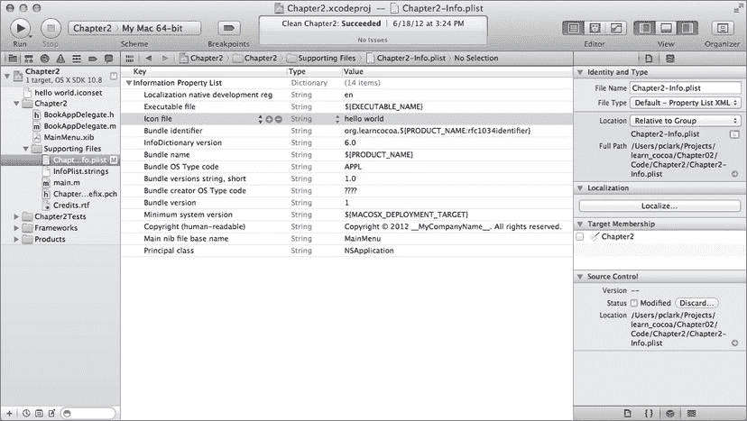

图 2-16. 在编辑窗格中打开的 `Chapter2-Info.plist`，以便我们查看此应用程序图标文件的名称。

**注意** 属性列表还能够在单个键下存储多个值。可以在单个键下存储一个项目数组（或列表），甚至可以在一个键下存储另一整套键值对。您可能还需要一段时间才需要用到这个功能，但我们认为您应该知道它是可行的。

在图 2-16 中，键为 `Icon file` 的条目被高亮显示。

请注意，属性列表中的图标文件条目已自动设置为我们导入的`iconset`目录。准备好编写代码了吗？猜猜看？其实不需要写任何代码。我们的应用已经完成了。

**运行应用**

点击 Xcode 窗口左上角的“运行”按钮来构建并运行应用。Xcode 将构建我们的应用（可能需要一点时间），然后运行它。一个包含居中着色标签的窗口应该会出现。如果我们查看 Mac 主屏幕底部的程序坞，会看到我们的应用由导入项目中的图标表示。但等等，还有更多！

从 Chapter2 菜单中选择“关于 Chapter2”，关于对话框将出现（图 2-17）。我们不仅免费获得了一个关于对话框，而且它还包含我们的图标。

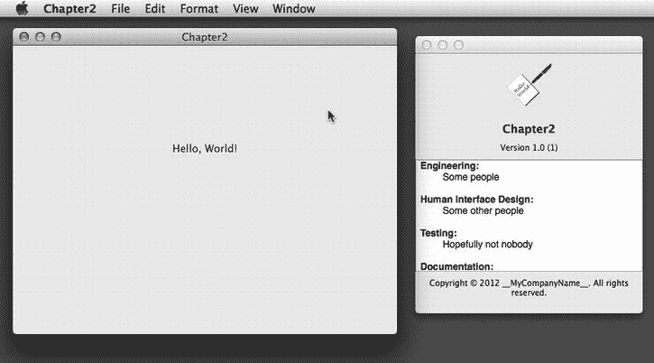

图 2-17. 我们的应用在多个位置使用我们的图标，包括关于对话框

我们还没结束。将鼠标移到应用主窗口中的“Hello, World!”文字上。光标应该从箭头变为文本光标。因为我们使标签可选中，Cocoa 会自动更改光标，作为提示用户可以选择此文本。请继续双击“Hello”一词，它会被高亮。现在如果我们选择“编辑”菜单，会看到“复制”菜单项并未变灰。如果选择它，我们的程序会将“Hello”一词复制到剪贴板，然后我们可以将其粘贴到任何其他接受文本的应用程序中。当“Hello”仍处于选中状态时，选择“编辑”菜单，然后选择“语音”子菜单，再选择“开始朗读”。应用将使用 Mac 的文本转语音功能读出“Hello”。

无需编写一行代码，我们的应用就支持将文本复制到剪贴板以及文本转语音。几乎零工作，我们的应用就表现得像真正的 Mac 应用，带有窗口和菜单栏，并响应常用键盘命令，比如`⌘Q`退出。应用的主窗口可以移动、最小化到程序坞，甚至可以关闭。我们可以隐藏应用，或隐藏所有其他应用。所有这些功能都是免费获得的，无需任何代价。这就是 Cocoa 的力量。如果你的计算机已经知道如何做某事，你很可能不需要编写太多代码来实现它，有时甚至根本不需要编写任何代码。

**与世界分享我们的创作**

退出 Hello, World。还有最后一件事要介绍。我们现在已经创建了应用，但它在哪里？如果我们想将应用赠予（或出售）给他人，以便他们能在自己的机器上运行，该怎么做？

首先，如果我们希望他人使用我们的应用，我们需要以略有不同的方式编译它。在 Xcode 中，如果我们点击“产品”菜单，会看到 Xcode 构建应用的五种不同方式：运行、测试、分析、性能分析和归档。要分发应用，我们需要进行归档构建。现在选择“归档”，让 Xcode 再次编译应用。但这次，构建完成后，我们将看到管理器的*归档*标签页（图 2-18）。

图 2-18. Xcode 的归档窗口

要准备分发应用，点击“分发”按钮，并选择导出为“应用”。其他选项（提交到 App Store 和导出为开发者 ID 签名的应用）现在可以忽略。点击“下一步”，Xcode 会提示我们选择代码签名身份。选择“不要重新签名”，再次点击“下一步”。Xcode 会询问我们想要保存应用的位置。

在 Finder 中打开该文件夹，我们会看到我们的程序。

但这还不是全部。每次我们进行归档构建时，Xcode 都会保留该构建的副本以供将来参考。它不会保留源码在归档中（源码由源码控制系统保管），但如果我们需要支持程序的多个版本，保留确切分发包的副本非常有用。当然，当旧版本不再有用时，我们可以清理它们。

在离开这个话题之前，我们应该对构建配置有所了解。“产品”菜单下的每个不同选项都与一个构建配置相关联。Xcode 为新建项目提供了两种配置：调试和发布。默认情况下，当我们在 Xcode 中工作时，我们使用的是调试配置。以这种方式构建应用时，Xcode 会添加额外内容，以便更容易地排除应用故障。例如，这些调试符号允许我们在程序运行时检查和更改不同变量的值，或者使用调试器逐行逐步执行源代码。当我们点击运行按钮时，我们使用的是调试配置。

另一方面，归档构建过程使用发布配置。发布配置不包含调试信息，并且会对最终程序进行更多优化。它还可以配置为进行多架构构建，以生成 32 位和 64 位的 x86 二进制文件，这也会减慢构建过程。在为他人运行准备应用时，我们通常希望这样做，但在积极开发时则不然。必要时我们可以定义其他配置，但本应用无需这样做。

恭喜！你现在是一名开发者了。你正在查看的是一款完整的应用，就像“应用程序”文件夹中的所有应用一样。你可以通过电子邮件将其发送给你的阿姨贝西或最好的朋友，以此炫耀你现在已经成为一名真正的 Mac OS X 应用开发者。

**再见，Hello World**

在本章中，我们介绍了 Xcode——Cocoa 软件创作工具的强力核心。我们在没有编写一行代码的情况下设计了一款完整的应用。我们学习了如何向应用的主窗口添加文本标签、更改标签属性、为应用设置图标，甚至还看到了如何构建应用的分发版本。

在本章中，我们通过了解无需编写任何代码就能实现的功能，初次体验了 Cocoa 的强大。在接下来的章节中，我们将看到当我们真正开始编写代码时，事情会变得多么强大。

**第 3 章 灯光、相机……动作！（以及输出口，也是）**

在了解一些理论之后，我们将构建一个应用。我们的应用将有一个包含标签、文本字段和滑块的单一窗口。当用户移动滑块时，文本字段会自动更新以反映滑块的值。在本章中，我们仍然不会编写任何代码；所有操作都将使用 Interface Builder 完成——但请耐心等待，因为我们将在下一章启用 Objective-C 编译器。Cocoa 用户界面与应用程序代码交互的方式，正是 Cocoa 控件相互交互的方式。我们将从将 Cocoa 控件连接在一起开始，以了解其工作原理，然后在下一章开始将它们连接到我们自己的代码。

这个应用很简单，但创建它所使用的机制与您几乎在 Cocoa 中所有用户交互中使用的机制相同，因此理解本章内容非常重要。

**框架，无处不在**

在 Mac OS X 中，Apple 将代码和支持文件分组到称为框架的特殊文件夹（或称*包*）中。框架类似于大多数平台上使用的库，但它们更灵活，因为它们是文件夹而非平面文件。

框架可以包含图像、声音和影片，甚至还能包含其他框架。尽管 OS X 支持传统的 Unix 库，但操作系统的绝大部分功能，以及几乎所有让 OS X 独具特色的功能，都包含在这些框架中。构成核心操作系统的框架足有数十个之多，它们通常按功能进行分组。

**提示** 你可以通过查看 `/System/Library/Frameworks` 文件夹来了解构成 Mac OS X 的框架。这些框架绝对、永远都不能碰，所以只管看，然后悄悄退出文件夹，别让它们察觉到你的存在。如果你触碰了它们，框架可能会变成麻烦的小捣蛋鬼。你也可以通过查看 `/Library/Frameworks` 来了解系统中已安装的第三方和可选框架。你 Mac 上安装的程序所需的框架通常都存放在这里。再次提醒，看看就好，不要触碰，否则可能会搞乱某些重要的东西。事实上，如果你运行的是 Mountain Lion 系统，那么 ` /Library` 目录在 Finder 中默认是隐藏的。

尽管框架数量众多，但在 Cocoa 中编程时，你绝大部分时间都只使用其中少数几个框架的对象。实际上，你将用到的大部分对象都来自于一个名为（猜对了！）Cocoa 框架的单一框架。

还记得我们说过框架可以包含其他框架吗？没错，Cocoa 框架实际上只是另外三个框架的包装器，这三个框架承载了编写 Cocoa 应用程序时你将用到的大部分功能，它们是：Foundation 框架、AppKit 框架和 Core Data 框架。

你偶尔会用到其他框架的功能。例如，你可能使用 Core Animation 框架为用户界面添加一些炫酷的动画，或者使用 Core Image 框架进行一些高强度图像处理。但你使用的大部分对象仍将来自构成 Cocoa 的那三个框架。我们将在第 7 章开始讨论 Core Data 框架，现在先花点时间简要了解另外两个框架，我们将在本章中用到它们。

## Foundation 框架

Foundation 框架名副其实。它包含了几乎所有其他功能所依赖的对象。Foundation 框架在 Cocoa 和 Cocoa Touch 之间是共享的。尽管 Foundation 框架不断发展，但它包含的许多对象自 NeXTStep 早期就已存在，并且它们的基本用法并未发生太大变化。Foundation 包含诸如 ` NSString` （用于在 Cocoa 中表示文本的类）以及像 ` NSArray` 和 ` NSDictionary` 这样的集合类。通过学习了 Objective-C，你应该已经对 Foundation 框架有一定了解。

## AppKit 框架

看看你 Mac 的屏幕。你看到的几乎所有东西都属于 AppKit 的领域，AppKit 是“应用程序工具包”的缩写。这个框架包含了用于创建或管理用户界面的所有对象。这里有创建按钮、窗口、文本字段、标签栏等对象。你在多个应用程序中都见过的任何用户界面元素，很可能都是 AppKit 框架的一部分。上一章中你免费获得的所有那些酷炫功能？没错，都是 AppKit 的。我们将在本章中构建的应用程序，也全是基于 AppKit 的。

## Cocoa 之道：模型-视图-控制器

在深入探讨如何使用这些框架之前，我们需要讨论一个非常重要的理论基础。Cocoa 的设计者们遵循了一个名为“模型-视图-控制器”（MVC）的概念，这是一种将构成 GUI 应用程序的代码进行逻辑划分的非常合理的方式。

如今，几乎所有面向对象的应用程序框架都在某种程度上遵循 MVC 模式，但很少有像 Cocoa 这样如此忠实地遵循 MVC 模型，或者像它一样运用该模型如此之久。

MVC 模型将所有功能划分为以下三个不同的类别：

-   *模型*：持有应用程序数据的类。
-   *视图*：用户可以看到并与之交互的窗口、控件和其他元素。
-   *控制器*：将模型和视图绑定在一起的部分，包含决定如何处理用户输入的应用程序逻辑。

MVC 的目标是让实现这三种代码类型的对象彼此尽可能区分开来。你编写的任何对象都应当能够清晰地识别为属于这三个类别之一，并且其内部很少或根本没有可归入其他两个类别的功能。例如，实现按钮的对象不应包含用于在点击按钮时处理数据的代码，而实现银行账户的代码不应包含用于绘制表格以显示其交易记录的代码。

MVC 有助于确保最大限度的可重用性。一个实现通用按钮的类可以在任何应用程序中使用。而一个实现点击后执行特定计算的按钮类，则只能在其最初编写的应用程序中使用。

当你编写 Cocoa 应用程序时，你将主要使用 Interface Builder 创建视图组件，尽管有时你也会通过代码修改界面，或者你可能继承现有的视图和控件类来创建新的类。

模型将使用名为 Core Data 的东西来创建，或者通过编写 Objective-C 类来持有应用程序的数据。我们不会在本章的应用程序中创建任何模型对象，因为我们还不打算存储任何数据，但从下一章开始，我们将介绍非常简单的模型对象，并在第 8 章开始使用 Core Data 时，过渡到功能完善的模型对象。

控制器组件通常包含我们创建且特定于应用程序的类。控制器可以是完全自定义的类（ ` NSObject` 的子类），这是 Cocoa 中的传统做法。几年前，Apple 开始在 AppKit 框架中引入一些通用控制器类，用于为我们处理某些基本任务，例如处理要在列表中显示的对象数组。这些对于最小化样板代码非常有用。

随着我们对 Cocoa 的深入了解，你会很快看到 AppKit 框架的类是如何遵循 MVC 原则的。如果在开发时你始终将这一概念铭记在心，你将创建出更干净、更易于维护的代码。

## 插座变量、动作和方法、控制器

显然，如果你无法将数据传入或传出用户界面，或者无法通过代码更改其外观，那么用户界面就没有多大用处。在 Cocoa 中，我们使用称为*插座变量*和*动作*的东西与我们在 Interface Builder 中设计的用户界面进行交互。

-   插座变量是指向 nib 文件中对象的指针。插座变量允许我们从代码中访问 nib 中的对象。
-   动作是可以直接响应用户交互（例如点击按钮）而执行的方法。无论这些对象是框架类还是我们自己的代码，它们都是应用程序对象响应用户输入的方式。

插座变量和动作通常包含在控制器类中（尽管它们有时也用于其他地方）。在本章中，我们将使用两个 AppKit 类—— ` NSSlider` 和 ` NSTextField` 暴露的插座变量和动作——来演示如何操作。在下一章中，我们将自己编写它们。

### 插座变量

插座变量是使用特殊关键字 ` IBOutlet` 进行声明的 Objective-C 实例变量。

出口（Outlet）本质上不过是一个对象指针，用于指向用户界面中的某个对象。由于 Cocoa 对象是 Objective-C 对象，它们拥有实例变量和方法。`IBOutlet` 关键字用于向 Xcode 的 Interface Builder 指明哪些实例变量将用于构建用户界面。

### 动作（Actions）

动作是可直接从应用程序用户界面调用的 Objective-C 方法。它们与我们编写过的其他 Objective-C 方法一样，都是方法，但在用户界面元素被操作时才会执行。例如，如果我们将一个按钮链接到一个动作方法，那么每当该按钮被点击时，动作方法中的代码就会被触发。如果我们将一个文本字段链接到一个动作，那么每当用户通过 Tab 键离开该文本字段，或移动到其他控件时，其动作方法就会被触发。具体什么操作会导致方法触发，取决于链接到该方法的对象类型，有时也取决于该对象属性的设置方式。例如，一个滑块可能只在用户释放鼠标按钮后触发一次动作方法，也可能在滑块被拖动的过程中反复触发动作方法，具体取决于我们在 Interface Builder 中如何设置滑块实例。本章我们将尝试这两种操作模式。

动作的创建方式与其他 Objective-C 方法完全相同，但必须使用特殊的返回类型进行声明：`IBAction`。动作必须接受一个参数（通常声明为 `id` 类型）。这个参数用于告知方法是由哪个界面元素调用了它。

### 出口与动作的实践

理论已经足够，让我们通过编写另一个 Cocoa 应用来亲自动手实践。搭建新项目的步骤将与上一章相同，因此这应该会让人感到熟悉。如果你尚未打开 Xcode，请重新打开它。现在，按下 `N` 或从“文件”菜单中选择“新建项目”。再次选择“Cocoa 应用程序”模板。确保“Core Data”和“基于文档的应用程序”复选框已关闭，“使用自动引用计数”复选框已打开，然后在提示输入项目名称时，输入“Chapter3”（请参见图 3-1）。在这个示例中，我们使用“Book”作为类前缀设置。

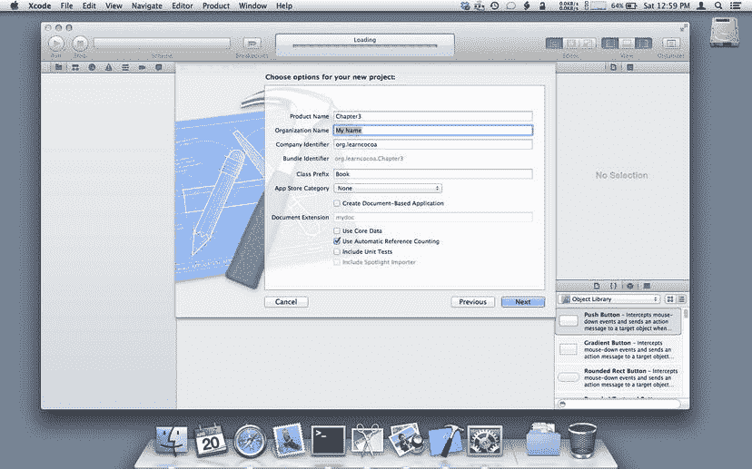

图 3-1. 在 Xcode 中为新 Cocoa 应用设置初始属性

Xcode 将为你生成一个名为 `BookAppDelegate` 的应用代理类，以及一个 `MainMenu.xib` 文件，并会将你置于项目设置视图（图 3-2）。

图 3-2. 配置项目设置

我们所有的工作都将在 `MainMenu.xib` 文件中进行，因此请在窗口左侧的导航区域单击它，它应该会在 Interface Builder 模式下打开（图 3-3）。如果双击，它会在一个新窗口中打开，这不是我们想要的。如果发生这种情况，请关闭它，然后再次单击 `MainMenu.xib`。

图 3-3. Xcode 中的 Interface Builder 模式

单击 Interface Builder 编辑器窗格左侧的“主窗口”图标。这会打开一个已命名为 Chapter3 的空窗口。由于本章不需要导航区域，请通过单击标记为“视图”的组中最左侧的图标将其隐藏。这样可以提供更多的屏幕空间用于工作，并且界面也更简洁。我们可以通过单击工具栏中“视图”部分最左侧的图标随时取消隐藏。

我们将重点放在右侧的实用工具区域。

首先，查看 Xcode 窗口右侧底部的对象库窗格。滚动对象列表找到“标签”；它应该位于列表顶部向下大约十几个对象的位置。在对象库中单击“标签”，然后将其拖到窗口的左上角。当我们靠近左上角时，会出现蓝色参考线，当我们释放鼠标按钮时，标签应自动吸附到位（图 3-4）。

图 3-4. 向 第 3 章 的窗口添加标签

通过按下 `4` 或单击实用工具区域顶部的相应按钮，将检查器窗格切换到“属性检查器”。然后，双击我们刚刚拖入的标签，它应该变为可编辑状态。将标签的文本更改为“神奇数字是：”（图 3-5）。

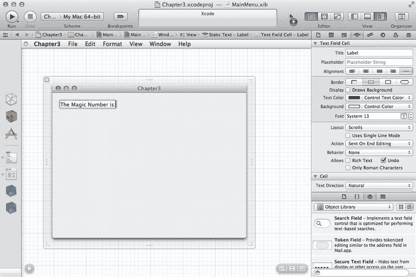

图 3-5. 编辑标签文本

由于目前还没有显示神奇的数字，这个标签显得有些名不副实，因此我们需要添加一个用户界面组件来显示它。在对象库窗格中，再向下滚动一点找到“文本字段”；它应该直接在“标签”对象下方。如果在库中单击某个对象并悬停在它上面，将会看到一个有用的弹出窗口，其中显示有关该控件的更多信息，包括该控件底层对应的 AppKit 类（参见图 3-6）。对于文本字段来说，这个类是 `NSTextField`。在此弹出窗口处于激活状态时，我们可以单击对象库中的其他组件来查看每个组件的信息。如果单击“标签”，我们会发现标签也是 `NSTextField` 实例，只是初始显示和可编辑性设置不同。在您学习 AppKit 类时，了解对象库中给定组件对应哪个类是很有用的；许多类身兼数职。

图 3-6. Xcode 可以显示对象库中对象的弹出信息

单击回“文本字段”，然后将一个文本字段实例拖到我们的窗口上。将其放置在标签右侧相对的位置，让蓝色参考线引导您，并在参考线指示的位置让其吸附到位（图 3-7）。

图 3-7. Xcode 参考线有助于布局用户界面控件

查看实用工具区域中此文本字段的属性检查器（图 3-8）。它显示与我们之前拖入的标签检查器相同的控件——这很合理，因为实际上它们是同一个 Cocoa 对象。不可编辑的标签和可编辑的文本字段都是 `NSTextField` 对象的实例，只是对象绘制方式的参数不同。我们可以根据应用需求来调整对象的行为方式。对于这个应用，我们希望阻止用户通过在字段中输入来更改神奇数字，因为那样它就不再神奇了。要进行此更改，请单击“行为”下拉菜单，将其从“可编辑”更改为“可选取”。这样用户将无法更改它，但可以用鼠标选中并复制它。

图 3-8.

## 文本字段的属性检查器

让我们把包含神奇数字的窗口调小一点；在不必要时，我们不想占用太多屏幕空间。窗口可通过其外围透明边框上的调整手柄进行缩放，如图 3-9 所示。点击其中一个调整手柄并将窗口缩小；我们将看到窗口宽度和高度的指示器，并且在缩放过程中窗口会实时重绘，以便观察缩放对内容的影响。

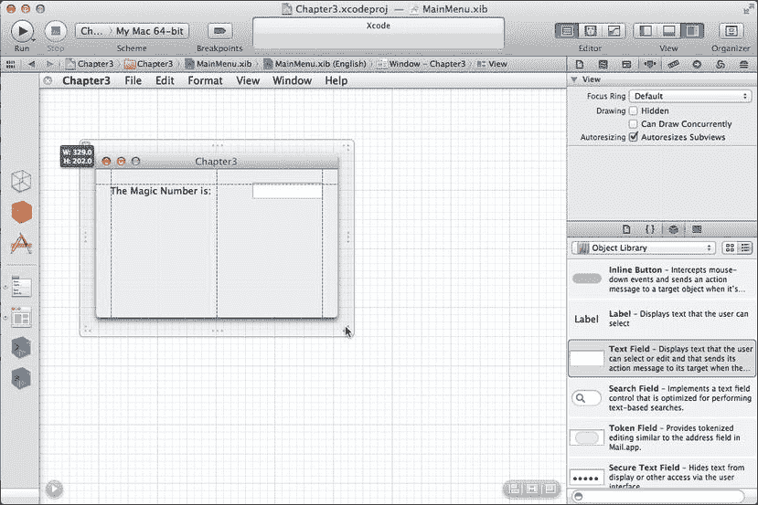

图 3-9. 在 Xcode 中缩放应用程序主窗口

当窗口缩小到一定程度后，我们可以继续布局。接下来要添加一个水平滑块。在**对象库**中查找它；我们可以向下滚动对象列表直到找到它，或者在**对象库**下方的搜索框中输入几个字符。输入“hor”或“sli”可以快速缩小范围，方便找到该控件。当列表中出现“水平滑块”后，将其拖拽到窗口左侧中部（图 3-10）。蓝色参考线会指示放置位置。

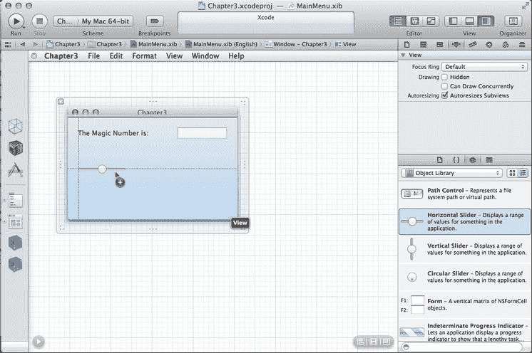

图 3-10. 向应用程序窗口添加滑块

由于滑块并未填满窗口，请单击滑块一次，以显示其两侧的调整手柄。从滑块右侧拖拽，将其拉伸至窗口右侧边界的蓝色参考线处（图 3-11）。

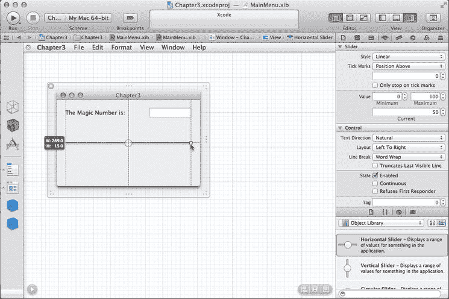

图 3-11. 调整滑块大小以填满窗口

在**实用工具**区域中查看滑块的**属性检查器**（参见图 3-12）。默认情况下，滑块的值范围是 0 到 100，但我们可以根据需要将其更改为任何整数值。在**控件**部分下，勾选标有**连续**的复选框。

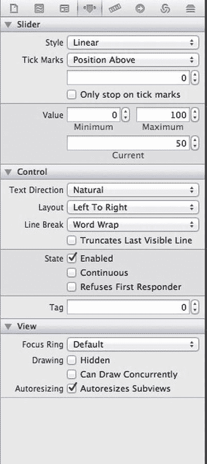

图 3-12. 滑块的属性检查器

现在我们即将施展一些魔法。我们将把滑块连接到文本字段。按住 Control 键，同时点击滑块。继续按住 Control 键和鼠标按钮，将光标向上移动到文本字段。此时会有一条蓝线从滑块延伸到鼠标位置。将这条线拖拽到文本字段上。当鼠标悬停在文本字段上时，该字段会高亮显示为蓝色（图 3-13）。

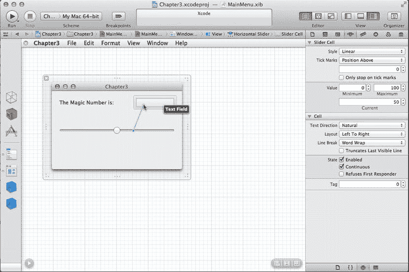

图 3-13. 从滑块按住 Control 键拖拽到文本字段以建立连接

文本字段高亮后，松开鼠标。将出现一个小灰色窗口，列出“插座”、“辅助功能”和“已接收操作”（图 3-14）。选择 `takeDoubleValueFrom:`，文本字段会闪烁几次以确认连接。随后蓝线消失。毫不意外，这种操作被称为**按住 Control 键拖拽**，它是我们在 Interface Builder 中连接插座和操作的主要机制。

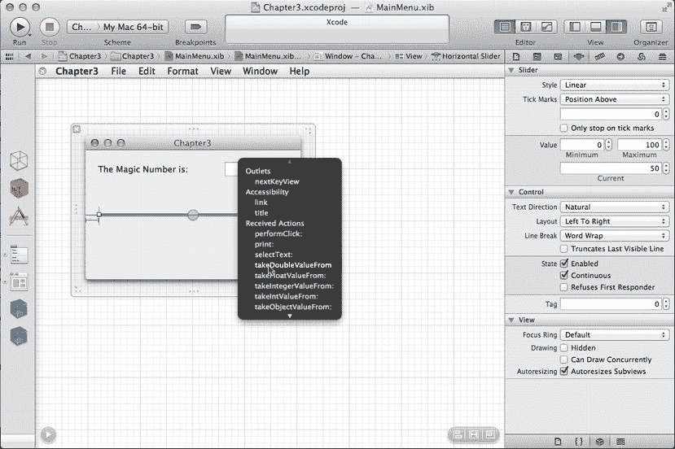

图 3-14. 设置滑块与文本字段之间的连接操作

要查看我们刚刚建立的连接，请在**实用工具**区域选择**连接检查器**。

在**已发送操作**下会有一个条目，显示 `takeDoubleValueFrom:` 已连接到文本字段（图 3-15）。

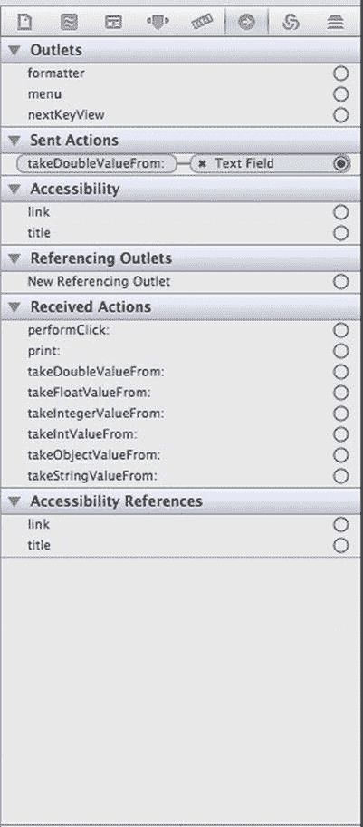

图 3-15. 滑块的连接检查器，显示在文本字段上调用的操作

我们刚才做了什么？我们做的是在滑块和文本字段之间建立了一个连接。现在文本字段是滑块的“目标”。当滑块值改变时，它会调用我们设置在其目标上的方法。在这个例子中，我们选择了 `takeDoubleValueFrom:`。这个方法指示文本字段向滑块请求其值（类型为 double），然后文本字段将自身的值设置为从滑块获取的值并重新绘制。为滑块勾选“连续”复选框意味着，当滑块被来回拖拽时，它将反复调用其目标上的操作方法。

至此已经做了大量设置。现在，让我们看看我们的操作实际运行的效果！在 Xcode 的“编辑器”菜单（不是“编辑”菜单，而是“编辑器”）中，从底部选择“模拟文档”。Xcode 将运行一个名为 Cocoa Simulator 的程序，该程序会加载我们程序的 `.xib` 文件，让我们可以与之交互。点击滑块，并来回拖拽。随着拖拽，文本字段中的值应当会改变，以反映滑块的位置，如图 3-16 所示。由于我们指示文本字段使用来自滑块的 double 值，因此显示的值将带有一位小数。注意，我们仍然没有编写任何代码；我们所做的只是将两个 Cocoa 控件连接在一起。

图 3-16. 当滑块移动时，文本字段自动更新

操作完滑块后，退出 Cocoa Simulator 并返回 Xcode。再次从滑块按住 Control 键拖拽到文本字段，这次从灰色窗口中选择 `takeIntValueFrom:` 操作（图 3-17）。注意，实际上有两个名称相似的操作：`takeIntValueFrom:` 和 `takeIntegerValueFrom:`。它们的区别在于文本字段是以 `int` 还是 `NSInteger` 类型向滑块请求其值。任选一个都能满足我们的需求。这将替换我们之前建立的连接，因为滑块一次只能有一个目标。

图 3-17. 将操作从 `takeDoubleValueFrom:` 更改为 `takeIntValueFrom:`

再次运行“模拟文档”，并再次拖拽滑块。这次，文本字段中显示的数字应该是一个整数，不带小数点，如图 3-18 所示。退出 Cocoa Simulator，因为我们已经完成了！

图 3-18. 滑块更新文本字段，但现在只显示整数值

## 总结

在本章中，我们学习了如何使用插座和操作将对象相互连接，了解了一些关于 OS X 框架的背景知识，并获得了在 Xcode 中布局用户界面的更多实践。插座和操作是构建 Cocoa 应用程序的基本概念，在接下来的章节中我们将进行大量按住 Control 键拖拽的操作。然而，这可能还不太像编程。你的耐心即将得到回报，因为在下一章中，我们将实际编写一些代码，实现我们自己的操作方法，并了解如何将 Cocoa 界面对象连接到我们自己的代码，而不仅仅是相互连接。

