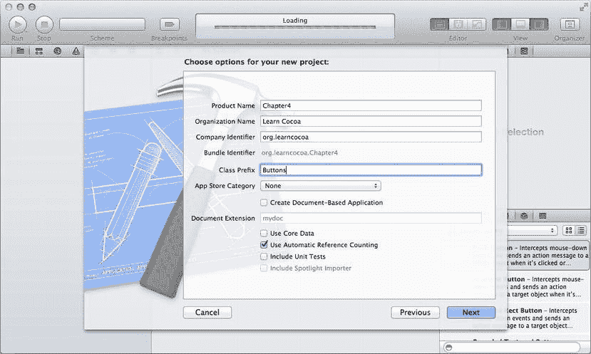
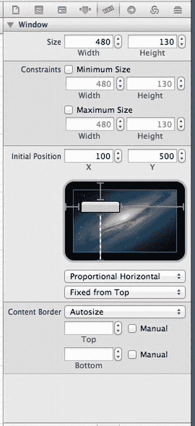
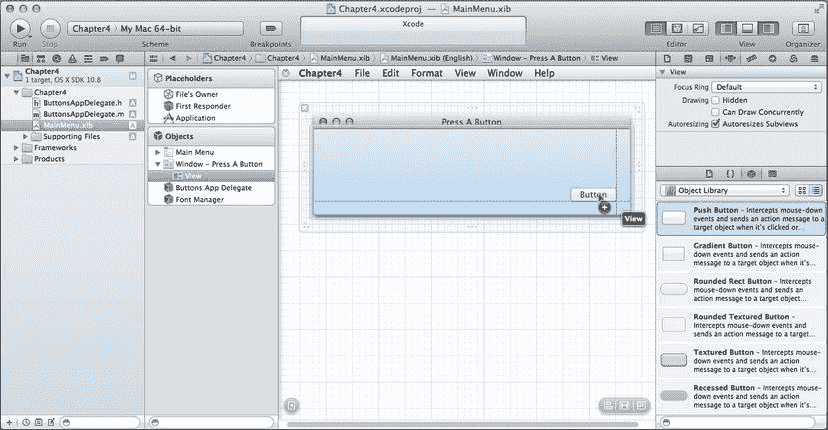
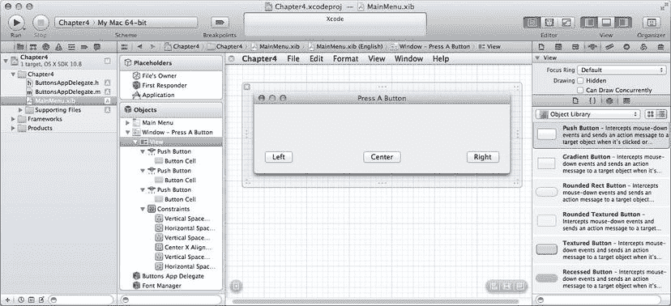
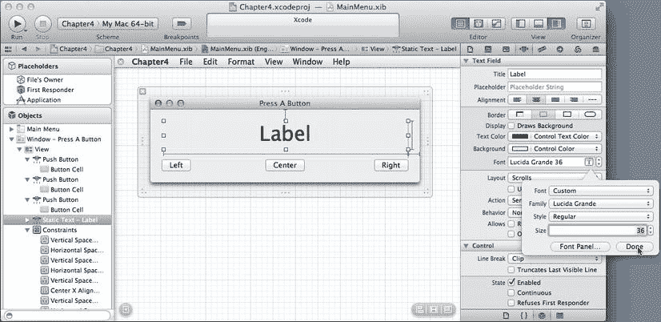

# 第 4 章

## 行动的号角

正如我们在前两章中所见，Cocoa 免费提供的所有功能确实令人惊叹。


## 输出口与操作

但在前两个应用中，缺少了一个大多数应用都需要的非常重要的功能：与用户交互的能力。上一章我们在 Interface Builder 中看到，有一个完整的库，里面装满了文本字段和按钮之类的对象，我们可以用它们来组装界面，但如果无法得知这些界面对象何时被使用或更改它们包含的数据，它们就毫无用处。在本章中，我们将了解如何通过这些对象的输出口和操作，让用户与我们的应用进行交互。

### 声明输出口与操作

回顾上一章的内容，Cocoa 使用所谓的*输出口*和*操作*来连接用户界面中的对象和我们代码中的对象。输出口是我们 nib 文件中指向对象的指针，它允许我们的代码访问和操作 nib 中的对象。操作是我们编写的方法，可以直接响应用户交互而执行，例如点击按钮或用户选择菜单项。输出口和操作通常包含在我们的控制器类中（尽管有时也会在其他地方使用）。

#### 声明输出口

输出口是 Objective-C 的实例变量，使用一个特殊关键字 `IBOutlet` 声明。输出口是一个指针，可以链接到用户界面中的对象。因此，例如，我们的控制器类可以像这样声明一个指向可编辑文本字段的输出口：

```objc
@property (weak) IBOutlet NSTextField *nameField;
```

在这个例子中，就我们的代码而言，`nameField` 是一个指针，指向我们在 Interface Builder 中链接到的任何文本字段。它的行为与我们自己分配和初始化的对象指针完全相同。一旦输出口链接到一个对象，我们就可以检索或设置其值、隐藏它、禁用它，或者执行该对象支持的任何其他操作。稍后我们将看到如何在 nib 文件中建立输出口和对象之间的链接。

属性 `(weak)` 包含在 Xcode 在 `.h` 文件中生成输出口代码中。它意味着控制器不“拥有” `nameField`；该 `nameField` 可能会被释放，如果发生这种情况，该属性将设置为 `nil`。属性上还可以设置其他属性，涉及内存语义和命名。当我们手动添加属性时，我们需要熟悉可用于注释它们的各种属性。目前，只需保留 Xcode 生成的方式即可。

你可以在 Mark Dalrymple 和 Scott Knaster 合著的第二版 *Learn Objective-C on the Mac*（Apress, 2012）以及 *The Objective-C Programming Language* 一书中了解更多关于新的 Objective-C 属性的信息，后者可在 Xcode 和 Apple 开发者网站 `https://developer.apple.com/library/mac/documentation/Cocoa/Conceptual/ObjectiveC/ObjC.pdf` 上找到。

#### 声明操作

如前一章所述，操作是可以直接从应用用户界面调用的 Objective-C 方法。我们的对象中的操作通过在 Interface Builder 中从用户界面控件拖拽到我们代码中的方法来连接到用户界面。

操作的创建方式与其他 Objective-C 方法完全相同，但它们必须符合特定的结构。特别是，操作方法声明必须如下所示：

```objc
-(IBAction)doSomething:(id)sender;
```

方法的名称可以是任何我们想要的，但返回类型必须是 `IBAction`，并且该方法必须接受一个类型为 `id` 的参数，它将是指向触发该操作的对象的指针。如果此方法因用户点击按钮而被调用，那么 `sender` 将是指向所按下按钮的指针。一个操作可以是多个用户界面对象的目标，并且 `sender` 参数让我们知道使用了哪个控件。

**注意** 操作方法是一个 Cocoa 和 Cocoa Touch 存在差异的领域。

在 Cocoa Touch 中，操作方法可以具有三种不同的方法签名之一，分别接受零个、一个或两个参数。但这不适用于 Cocoa 中的操作，后者必须且只能接受一个参数。

## 但它们到底是什么？

`IBAction` 和 `IBOutlet` 到底是什么？它们是 Objective-C 语言的一部分吗？

不，它们只是老式的 C 预处理器宏。如果我们进入 `AppKit.framework` 并查看 `NSNibDeclarations.h` 头文件，我们会发现它们是这样定义的：

```c
#ifndef IBOutlet
#define IBOutlet
#endif
#ifndef IBAction
#define IBAction void
#endif
```

困惑吗？这两个关键字对编译器来说绝对没有任何作用。`IBOutlet` 在编译器看到它们之前就被完全从代码中删除了。`IBAction` 解析为一个 `void` 返回类型，这只是意味着操作不返回值。那么，这是怎么回事？

答案其实很简单：`IBOutlet` 和 `IBAction` 不是给编译器用的。它们是给 Interface Builder 用的。Interface Builder 使用这些关键字来解析可用的输出口和操作。Interface Builder 只能看到以 `IBAction` 开头的方法，以及以 `IBOutlet` 开头的变量或属性。此外，这些关键字的存在告诉将来查看我们代码的其他程序员，所涉及的变量和方法并非完全通过代码处理。他们需要深入研究相关的 nib 文件，才能了解事物是如何连接和使用的。

## 输出口与操作实际运用，第二幕

没有什么比实际操作更能理解这些概念了，因此我们将编写另一个 Cocoa 应用。在这个应用中，我们将自己编写一些代码。设置新项目的步骤与上一章中使用的步骤相同，所以应该会感觉很熟悉。实际上，我们每次创建新项目时都会重复这些步骤。

如果你不在 Xcode 中，请重新打开它。现在，按下 `N` 或从**文件**菜单中选择**新建项目**。再次选择*Cocoa 应用*模板。确保*Core Data* 和*基于文档的应用*复选框已关闭，*使用自动引用计数*复选框已打开，并在提示输入项目名称时，输入"Chapter4"（图 4-1）。对于此示例，我们将使用 `Buttons` 作为类前缀设置。再次点击下一步，并为项目选择一个文件夹。点击创建，Xcode 会带我们进入项目设置面板。Xcode 还为我们生成了一个名为 `ButtonAppDelegate` 的类和一个名为 `MainMenu.xib` 的 nib 文件。



图 4-1. 在 Xcode 中设置新 Cocoa 应用的初始属性

我们将从布局界面开始，因此在*导航器*窗格中单击 `MainMenu.xib`。这将在 Interface Builder 编辑窗格中打开 nib 文件（图 4-2）。


图 4-2. Xcode 的 Interface Builder 编辑器中 MainMenu.xib 窗口的初始视图

在 Interface Builder 窗格的左下方有一个小的灰色三角形，像一个播放按钮。点击它，Interface Builder 窗格左边界上的一组图标将展开为一组*占位符*和一组*对象*（图 4-3）。我们将处理*对象*部分中名为 `Window - Chapter4` 的对象。


图 4-3. 将 nib 内容展开为占位符和对象

### 占位符对象

不过，在此之前，请花点时间看一下 nib 中的前三个对象。


这些图标将始终存在于 Cocoa nib 文件中。我们无法删除它们，并且与其他图标不同，它们在加载 nib 时不会导致创建对象实例。这三个图标被称为*占位符对象*，它们允许此 nib 中的对象与某些已存在的对象建立连接。

任何 nib 文件中的第一个图标称为 `File’s Owner`。此图标是一个占位符，指向从磁盘加载 nib 的对象实例，换句话说，就是“拥有”该 nib 的对象实例。在应用程序的 `MainMenu.xib` 文件中（就像我们这里一样），`File’s Owner` 图标始终指向 `NSApplication` 的一个实例，该类代表整个应用程序，接收输入并确保根据该输入调用相应的代码。对于其他 nib 文件，`File’s Owner` 可能是不同的类，例如文档类的实例，或代表插件的类。

此文件以及任何其他 nib 文件中的第二个图标称为 `First Responder`。我们将在第 10 章中更详细地讨论响应者，但第一响应者是用户当前正在交互的对象。例如，如果光标正在文本字段中键入，则该文本字段就是当前的第一响应者。第一响应者会随着用户与界面的交互而改变，而 `First Responder` 图标为我们提供了一种便捷的方式，可以与当前具有焦点的任何控件或视图进行交互，而无需编写代码来确定是哪个控件或视图。

第三个图标称为 `Application`（或应用程序占位符），是 Cocoa nib 文件中相对较新的添加项。此对象指向此应用程序的唯一一个 `NSApplication` 实例。在 `MainMenu.xib` 文件中，应用程序代理和 `File’s Owner` 占位符始终指向完全相同的对象。应用程序占位符使我们能够从任何 nib 文件访问应用程序的 `NSApplication` 实例，即使是那些 `File’s Owner` 不是 `NSApplication` 的 nib 文件。对于本章，我们可以暂时忽略应用程序占位符，因为这个 nib 的 `File’s Owner` 已经提供了对该对象的访问。

## 设置窗口

现在我们可以开始布局窗口了。在 *Objects* 部分，选择标记为 `Window - Chapter4` 的图标，该窗口将显示在 Interface Builder 窗格中，并带有一个蓝色框，表示它已被选中。*Utility* 区域中的 *Inspector* 窗格将显示可以为窗口调整的设置（图 4-4）。我们将对默认设置进行一些更改。


图 4-4. 显示窗口可用选项的属性检查器

将窗口的标题从“Chapter4”更改为“Press a Button”。*Title* 下方的字段标记为 *Autosave*。如果我们在此字段中提供一个值，我们的应用程序将自动在用户偏好设置中保存窗口的位置、大小和其他信息，这样当用户再次启动应用程序时，他将发现窗口正好位于上次关闭时的位置。我们在此处输入什么值并不重要，只要它对应用程序中的每个窗口都是唯一的即可。如果我们对任何两个对象使用相同的自动保存名称，其中一个将无法保存。在此处输入 `mainWindow`。

在 *Autosave* 字段正下方，有三个复选框，用于控制窗口的一些基本行为。*Close* 复选框用于启用或禁用关闭窗口的功能。在只有一个窗口的实用程序应用程序中，我们可以取消选中此框，这样窗口就无法关闭。如果此框未选中，则窗口标题栏中的红色关闭按钮和 **Close** 菜单项都将被禁用。如果我们允许关闭窗口，我们应该提供一种使窗口再次可见的方法。

或者，如果我们的应用程序是一个仅包含一个窗口的实用程序，那么允许在窗口关闭时退出应用程序也是可以接受的。在本章稍后部分，我们将配置我们的应用程序在关闭此窗口时退出，因此保持 *Close* 复选框的当前状态。在后面的章节中，我们将学习如何使关闭的窗口重新可见。

*Minimize* 复选框控制是否可以使用窗口标题栏中的黄色按钮或从 **Window** 菜单中选择 *Minimize* 来将窗口最小化到 Dock。通常，窗口应该能够最小化。但也有一些例外，例如仅在我们的应用程序处于最前面时才可见的实用程序窗口，但绝大多数情况下我们应该保持此复选框选中。

第三个框称为 *Resize*，它控制用户是否可以通过拖动右下角来更改窗口的大小。对于此应用程序，我们将禁用此窗口的调整大小功能，因此取消选中 *Resize*。我们将在本书后面学习如何处理可调整大小的窗口中的控件。

现在保持其余属性不变。表示窗口的类是一个非常灵活的类，其他属性为我们提供了对应用程序外观以及它如何响应 OS X 中一些更高级的用户功能（如 Exposé、Spaces 和全屏模式）的巨大控制能力，但对于大多数窗口来说，默认设置就是我们想要的。

现在，按 5 调出 *Size Inspector*（图 4-5）。在这里我们可以设置选定对象的尺寸以及与尺寸相关的属性。正如我们在上一章中看到的，可以使用鼠标移动和调整对象大小，但此检查器为我们提供了对对象大小和位置更精确的控制。



图 4-5. 应用程序窗口的尺寸检查器

将我们窗口的宽度设置为 480 像素，高度设置为 130 像素。将窗口的 x 值设置为 100，这表明我们希望窗口的初始位置位于屏幕的左侧。由于 Mac 显示器的几何特性，y 值可能有点棘手。Mac 屏幕上的坐标系以屏幕左下角为 0，随着我们向屏幕顶部移动，y 值会增大。这里的问题是，并非每个人都有相同尺寸的显示器，因此任何给定的 y 值在不同尺寸的显示器上相对于屏幕顶部的位置都会不同。

幸运的是，Cocoa 会自动调整窗口的位置，以便窗口始终在屏幕上启动，即使我们指定的位置可能导致窗口位于屏幕之外，并且因为我们为窗口指定了自动保存名称，每当用户在第一次之后启动应用程序时，窗口将位于我们上次退出应用程序时的位置。但有时窗口相对于屏幕顶部从特定位置启动非常重要。

请注意尺寸检查器底部的小图表；它根据我们自己的屏幕尺寸，以可视方式呈现窗口的初始位置。小白框代表窗口，大框代表屏幕减去菜单栏。白框四边的小红工字形标记让我们可以控制窗口相对于屏幕边缘的相对位置。我们可以将窗口放在屏幕上的所需位置，然后使用工字形标记将位置锁定在屏幕的左侧和顶部。点击工字形标记将允许窗口相对于屏幕的那一侧成比例移动。点击底部的工字形标记将使窗口从底部浮动，但保持与屏幕顶部的固定距离。


单击顶部和底部的 I 形梁，窗口将在屏幕上垂直居中。我们需要设置一个 y 值，将窗口放置在菜单栏附近，但不要紧贴菜单栏。最简单的方法是使用“大小检查器”中的屏幕表示，将应用程序的主窗口移动到我们想要的位置。如有必要，我们还可以通过数字方式微调大小和位置。一旦窗口的初始位置符合要求，单击底部的 I 形梁，使其变为条纹状。我们也可以通过选择“初始位置”部分底部的弹出菜单，并将其从“垂直比例”更改为“距顶部固定”来进行此更改。

## 设计窗口的界面

在“对象库”中，选择“对象库”弹出菜单，然后选择“控件”。这将显示许多我们可以使用的不同按钮和文本字段（图 4-6）。底部列表中的第一个项目应该是“下压按钮”（`Push Button`），这是标准的 OS X 按钮。


图 4-6. Xcode 实用工具区域中的对象库视图

抓取其中一个并将其拖到窗口的界面上。将出现蓝色辅助线，指示按钮位于左边缘、右边缘或中心的最佳位置。使用蓝色辅助线将按钮放置在窗口的右下部分（图 4-7）。一旦按钮位于正确位置，松开鼠标，我们就在窗口上获得了一个按钮。现在双击该按钮，这将允许我们编辑按钮的标题。将其标题从“`Button`”更改为“`Right`”。



图 4-7. 向主窗口添加按钮

从库中拖出第二个按钮，并使用蓝色辅助线将其放置在窗口的左下方。放置此按钮后，双击它，并将此按钮的标题更改为“`Left`”。

再拖入一个按钮，并使用底部蓝色辅助线将按钮放置在距窗口底部正确距离的位置。将其放置在窗口的水平中心，同样，会出现一条蓝色辅助线来帮助我们正确定位。放置好后，双击第三个按钮，并将其标签更改为“`Center`”。窗口现在应该如图 4-8 所示。



图 4-8. 窗口应如图所示，三个按钮均已布局

请注意，当我们向窗口添加控件时，Interface Builder 窗格左侧的“对象”显示区域会展开，以显示控件的添加以及视图的约束集，这在图 4-8 中也可见。约束部分控制了控件布局在窗口调整大小时如何响应。

接下来，我们需要一个标签，以便告知用户单击了哪个按钮。标签是一个 GUI 对象，可以以我们选择的字体和大小显示一段文本。在我们的应用程序代码中，我们可以随时以编程方式更改标签的文本。从库中抓取一个标签。您可能需要向下滚动控件列表，或者直接使用搜索框。将标签拖到窗口的左上角，并使用辅助线将其正确放置在上边距和左边距处。

单击标签右侧的调整大小手柄，向右拖动，直到到达窗口右侧的蓝色辅助线，然后松开。在选中标签的情况下，按 `4` 调出“实用工具”窗格中的“属性检查器”，并使用“文本对齐”按钮将文本居中。

然后，单击“字体”设置右侧的小 T 图标。这将调出一个特殊的字体面板，如图 4-9 所示。将字体大小更改为 36，可以直接输入数字，也可以使用“大小”字段右侧的小箭头按钮。完成此操作后，剩下的就是双击标签，使其进入编辑模式，然后按 Delete 键删除文本。我们希望在按下按钮之前，此标签不显示任何内容。



图 4-9. 更改标签的字体

至此，用户界面部分完成，所以现在我们需要编写一些代码，以便在按下三个按钮中的任何一个时更新标签中的文本。

## 创建控制器类

我们将向 `ButtonAppDelegate` 类添加一些代码。这个类将作为控制器，处理我们所有三个按钮的点击动作。在我们刚刚布局的窗口中，我们设置了三个按钮和一个文本字段。当用户按下其中一个按钮时，文本字段的值应该被更新。因为我们需要更改文本字段显示的文本，所以需要一个指向它的输出口（`outlet`）。此外，我们还需要一个供按钮触发的操作方法（`action`）。因为操作方法会接收触发它的对象的指针，所以我们可以为所有三个按钮使用一个单一的操作方法。现在让我们来设置输出口和操作方法。

为此，我们需要在用户界面元素和我们的代码之间建立一些连接。在上一章中，我们讨论了如何从一个 UI 元素按住 Control 键拖到另一个 UI 元素。这里我们将做类似的事情。

在 nib 文件编辑器仍然打开的情况下，我们还需要打开一个显示代码的窗格。单击主 Xcode 窗口工具栏右侧“编辑器”组中的“助理”按钮（看起来像一个管家的躯干）。我们也可以通过输入  来打开助理编辑器。通过选择**视图**  **助理编辑器**下的不同选项，可以将该窗格并排或放置在 nib 编辑器窗格下方。

“助理编辑器”窗格会在编辑器区域上方的跳转栏中显示当前文件的名称。选择文件名，一个弹出菜单将显示名称 `ButtonsAppDelegate.h` 和 `ButtonsAppDelegate.m`。如果尚未选中，请选择 `ButtonAppDelegate.h`。我们将看到 Xcode 为我们生成的类接口。生成的代码如下所示（忽略文件顶部的注释块）：

```objectivec
#import <Cocoa/Cocoa.h>

@interface ButtonsAppDelegate : NSObject <NSApplicationDelegate>

@property (assign) IBOutlet NSWindow *window;

@end
```

在上一章中，我们从一个用户界面对象按住 Control 键拖到另一个对象。这次，我们将从 nib 文件按住 Control 键拖到我们的代码中。在 nib 编辑器窗格中，单击我们添加到窗口的标签。现在，从标签按住 Control 键拖到 `.h` 文件中，向下拖到 `@property` 行下方的空行处，文本编辑器中会延伸出一条蓝线，指示“插入输出口或操作”（`Insert Outlet or Action`），如图 4-10 所示。松开鼠标按钮，会出现一个小弹出窗口，我们可以在其中配置这个新连接。


图 4-10. 从 nib 对象按住 Control 键拖到代码编辑器以连接输出口或操作

在此弹出窗口中，将连接标记为“输出口”（`Outlet`），并将名称设置为“`label`”。将其他字段保留为默认设置，然后单击“连接”（`Connect`）。Xcode 将在 `.h` 文件中添加一行新代码，内容如下：

```objectivec
@property (weak) IBOutlet NSTextField *label;
```

该属性声明在我们的类中创建了一个名为 `label` 的新属性。


## 声明中包含 `IBOutlet` 关键字

该声明还包含 `IBOutlet` 关键字，这将使 Xcode 能够找到我们的插座，并使其在 Interface Builder 中可用。Xcode 还在类实现中添加了一行代码，我们可以通过点击跳转栏中的文件名并选择 `ButtonsAppDelegate.m` 来查看。此文件现在看起来如下：

```objc
#import "ButtonsAppDelegate.h"

@implementation ButtonsAppDelegate

- (void)applicationDidFinishLaunching:(NSNotification *)aNotification {
    // Insert code here to initialize your application
}

@end
```

根据你的 Xcode 版本，你可能还会看到一行代码为 `@synthesize label`。如果你确实看到了，它指示编译器为 `label` 属性生成 getter 和 setter 方法。最新版本的 Xcode 不会生成这一行，因为编译器现在可以自动推断何时需要生成属性的 getter 和 setter 方法，但你会在此前的代码中看到它，包括苹果的许多示例代码项目中。无论你是否看到它，由于我们将这个插座连接到了窗口中的标签上，当 nib 文件被加载时，`label` 属性将自动连接到标签 `NSTextField` 对象。

## 实现动作方法

我们将执行相同的操作来在我们的类中创建一个动作。在可以尝试运行程序之前，剩下的唯一任务是实际编写当按钮被点击时将被调用的代码，我们现在就来完成它。这段代码将检查 sender 参数以确定被点击按钮的标题，使用该标题创建一个字符串，然后使用我们的标签插座来显示该字符串。

在跳转栏中，选择显示 `ButtonsAppDelegate.h`。接着，选择我们命名为“Left”的按钮。按住 Control 键从 Left 按钮拖拽到代码中，拖到我们之前创建的 `@property` 那一行下方。这次，选择连接类型为 Action。将动作命名为 `buttonPressed:`，其余字段保留默认值。当我们点击 Connect 时，Xcode 将为我们创建一个遵循动作约定的新实例方法。与我们添加的属性一样，当 nib 文件被加载时，它也将自动连接。

如果我们切换回 `.m` 文件，会看到一个看起来如下的新空方法：

```objc
- (IBAction)buttonPressed:(id)sender { }
```

我们将用代码填充这个方法，以在标签中显示按下了哪个按钮。将以下代码输入到方法体中：

```objc
- (IBAction)buttonPressed:(id)sender {
    NSString *title = [sender title];
    NSString *labelText = [NSString stringWithFormat:@"%@ button pressed.", title];
    [self.label setStringValue:labelText];
}
```

该方法首先获取调用它的按钮的标题。然后它使用该标题创建一个新字符串，接着使用该字符串来更新标签。该方法使用*点表示法*来访问属性，这只是表示 `[self label]` 的简写形式。

### 嵌套消息

一些 Objective-C 开发者会深度嵌套他们的消息调用。你在编程过程中可能会遇到如下代码：

```objc
[self.label setStringValue:[NSString stringWithFormat:@"%@ button pressed.",
  [sender title]]];
```

这一行代码的功能与我们 `buttonPressed:` 方法中的三行代码完全相同。为了清晰起见，在本书的代码示例中，我们通常不会将 Objective-C 消息嵌套得这么深，但 `alloc` 和 `init` 的调用除外，按照长期以来的惯例，它们几乎总是被嵌套使用。

## 运行应用

在上一章中，我们使用了“模拟文档”命令来操作我们设置好的控件和连接。那一章之所以能成功，是因为我们没有代码。这次我们有一些代码，所以需要实际编译和链接应用。点击 Xcode 窗口左上角的 Run 按钮，或按下R。

如果这是你第一次尝试运行自定义代码，可能会弹出一个窗口，询问你是否要在本 Mac 上启用开发者模式。继续点击确认启用；出于安全考虑，系统会提示你输入密码。你的代码应该能干净地编译，然后你会看到“按下一个按钮”窗口。如果你点击 Left 按钮，标签应更新显示“Left button pressed.”。如果你点击中间或右边的按钮，什么都不会发生，因为你还没有连接这些按钮。我们稍后会处理，但现在请注意，你已经让一个包含你自定义代码的 Cocoa 应用运行起来了！

退出应用，你应该会回到 Xcode，保持原样。你应该仍能在窗口一侧看到 nib 编辑器面板，另一侧是 Assistant 编辑器并打开 `.m` 文件。我们将设置 Center 和 Right 按钮与 `buttonPressed:` 动作之间的连接。实际上，我们可以通过 `.h` 或 `.m` 文件将连接建立到现有动作上。

在 nib 中选择 Center 按钮，然后按住 Control 键拖拽到 `.h` 或 `.m` 文件中的 `buttonPressed:` 方法上。当指针到达有效动作时，动作会以蓝色轮廓高亮显示，并出现一个小窗口显示“Connect Action”。松开鼠标，连接就建立好了。对 Right 按钮执行相同操作。

和之前一样，点击 Xcode 窗口左上角的 Run 按钮，应用将编译并启动。这次，点击三个按钮中的任何一个都会更新标签。这一个动作方法就能妥善处理所有三个按钮。将窗口移动到新位置，然后退出应用。按下R 再次启动程序，窗口应该会出现在我们退出程序时完全相同的位置。如果我们点击标题栏中的黄色最小化按钮，窗口将缩小到我们的 Dock 中（在 Dock 中点击它以最大化窗口），如果我们按下W 或点击窗口中的红色关闭按钮，窗口将关闭。遗憾的是，应用仍在运行，但无法重新打开窗口。现在让我们通过配置应用在窗口关闭时退出来解决这个问题。为此，我们将需要使用一个名为*应用委托*的对象。

## 应用委托

每个 Cocoa 应用有且只有一个 `NSApplication` 类的实例。我们不需要过多地与 `NSApplication` 直接交互。它是由系统为我们创建的，并处理事件循环（应用中负责监听来自鼠标和键盘的用户输入，并通过发送消息将输入传递给适当对象的部分）以及大部分底层细节，我们无需过多操心。

展开项目导航器窗格中的 Supporting Files 文件夹，单击 `main.m`。在该文件中是我们的应用的 `main()` 函数，这是应用启动时被调用的函数。该函数只包含一行代码，它调用了一个名为 `NSApplicationMain()` 的函数。这个 Cocoa 框架中的函数会自动为我们创建一个 `NSApplication` 的实例。该 `NSApplication` 实例进入一个循环，持续轮询来自键盘、鼠标、操作系统和其他应用的事件，然后响应这些事件（现在不必担心具体细节；我们将在本书后面学习更多关于事件的知识）。当它检测到表示应用应退出的事件时，事件循环停止，应用的执行结束。

`NSApplication` 允许我们指定一个可选对象作为其委托。简而言之，委托是一个代表另一个类处理特定任务的类。


## 应用委托与 GUI 组件

## 应用委托

应用委托允许我们的应用程序在生命周期中的特定时刻执行操作，从而避免必须子类化 `NSApplication` 带来的混乱。应用委托可以是任何类的任何实例，但只有一个对象能成为应用委托。几乎每个应用程序都需要一个应用委托对象。由于这是一种常见模式，为我们创建的 `ButtonsAppDelegate` 类已经在 nib 文件中被配置为应用委托。`ButtonsAppDelegate.h` 文件中的 `ButtonsAppDelegate` 类声明指出，该类实现了 `NSApplicationDelegate` 协议。

### 配置应用程序在窗口关闭时退出

单击 `ButtonsAppDelegate.m` 文件，添加一个名为 `applicationShouldTerminateAfterLastWindowClosed:` 的方法，如下文加粗所示：

```objc
#import "ButtonsAppDelegate.h"

@implementation ButtonsAppDelegate

- (void)applicationDidFinishLaunching:(NSNotification *)aNotification {
    // 在此处插入代码以初始化应用程序
}

- (BOOL)applicationShouldTerminateAfterLastWindowClosed:(NSApplication *)sender {
    return YES;
}

- (IBAction)buttonPressed:(id)sender {
    NSString *title = [sender title];
    NSString *labelText = [NSString stringWithFormat:@"%@ button pressed.", title];
    [self.label setStringValue:labelText];
}
@end
```

这个新方法是那些特殊的应用委托方法之一。在应用程序运行期间的某些预设时刻，`NSApplication` 会检查其委托是否实现了某个特定方法。如果委托实现了，`NSApplication` 就会调用该方法。我们刚刚实现的这个方法允许我们改变 `NSApplication` 的行为，而无需对其进行子类化。默认行为是 `NSApplication` 持续运行，直到被明确告知退出，即使没有窗口打开也是如此。不过，应用程序在最后一个（或唯一）窗口关闭时退出也是可以接受的，而此方法正是专门为了让委托修改这种默认行为而提供的。

再次运行应用程序，当主窗口出现后将其关闭。由于应用程序的唯一窗口已被关闭，应用程序现在应该会退出。

### 使用文档浏览器

那么，我们如何知道这些应用委托方法是什么？如果我们不知道这些方法，就难以实现它们。幸运的是，它们通常很容易找到。查看我们刚刚添加的方法，它接受一个参数，该参数是一个指向调用该方法的 `NSApplication` 实例的指针。按住 Option 键，然后在编辑窗格中双击 `NSApplication` 一词。这将打开文档浏览器，定位到我们刚点击的词的定义，即 `NSApplication`（图 4-11）。


图 4-11。Xcode 中的文档浏览器，显示 NSApplication 类参考

然而，在本例中，我们不会在这个文件中找到 `NSApplication` 的委托方法文档。从 OS X 10.6 开始，苹果开始将委托方法重构到独立的协议中，并将这些方法的文档迁移到该协议的文档中。许多 Cocoa 类都有相关联的委托协议——例如 `NSApplication`、`NSBrowser`、`NSToolbar`、`NSWindow` 等。在阅读某个类的文档时，务必同时查找同名的关联委托协议：`NSApplication` 的委托协议名为 `NSApplicationDelegate`。

要浏览文档树，请在 NSApplication 类参考文档中右键单击，然后选择“在库中显示”。这将显示文档树，其中 `NSApplication` 处于选中状态。

在 NSApplication 类参考下方是 NSApplicationDelegate 协议参考，其中包含我们正在寻找的文档。

花几分钟浏览一下应用委托方法是值得的，这样你就会了解有哪些方法可用。文档浏览器是你的好帮手。在学习 Cocoa 的过程中，你会经常使用它，所以请熟悉它。还有一种更简洁的查看文档的方式：按住 Option 键单击一个类或方法名，会弹出一个小型文档窗口，显示你点击内容的简短摘要以及相关文档的链接。总的来说，Xcode 中包含的文档是 Cocoa、Xcode 以及所有其他苹果开发技术的终极百科全书。**务必查阅文档**（RTFM）！你以后会庆幸自己这么做的。

### 小结

本章在前两章内容的基础上进行了扩展。我们了解了如何通过 Control 拖拽在 Interface Builder 中建立用户界面元素之间的输出口和目标/动作连接，以及如何在自己的代码中实现动作。我们用不到十行代码构建了一个完整的 GUI 应用程序。诚然，这个应用程序功能有限，但这些基本理念是 Cocoa 所提供功能的基础，也是 Cocoa 成为如此高效开发环境的原因所在。在下一章中，我们将使用按钮和文本字段之外的更多用户界面元素，并会发现配置和使用它们的方式与本章中按钮和文本字段的使用方式完全相同。

