# 第 5 章：GUI 组件

在第 3 章和第 4 章中，我们介绍了在 Interface Builder 中创建用户界面以及使用目标/动作将其连接到 Xcode 中编写的应用程序代码的一些基础知识。到目前为止，我们仅仅触及了表面，但你应该很高兴地知道，你在前两章中学到的目标/动作系统几乎被 Cocoa 中所有的用户界面对象所使用。如果你不太清楚这有什么了不起，你可能想再复习一遍第 3 章，以确保你掌握了目标/动作的概念。

到现在为止，你一定已经注意到了 Interface Builder 的“对象库”面板中列出的丰富多样的用户界面对象。现在是时候深入挖掘 Cocoa 的锦囊妙计，探索其中的一些类了。Cocoa 中可用的用户界面类涵盖了广泛的使用场景，并尽可能为其功能提供一致的 API，因此一旦你学会了如何对一个类进行某种操作，通常就能迅速推测出如何用另一个类实现类似的结果。特别是，你经常使用的许多类都是 `NSControl` 的子类，而大部分工作都会用到在该类中声明的方法。不同的子类与用户交互的方式不同，但与你自己代码交互的方式基本相同。

本章将介绍 Cocoa 提供的一些最常见的用户界面类，展示它们的基本用法以及如何在适当的情况下对其进行定制以满足我们的需求。在此过程中，我们还将了解一些辅助性的 Cocoa 类，它们可能没有明显的屏幕表现形式，但仍为我们的应用程序提供重要的服务。我们将重点介绍以下类（参见图 5-1，了解这些对象在屏幕上的样式示例）：

- `NSTextField`：许多应用程序的基本文本输入方法。响应按键并渲染文本，为用户提供很大的编辑灵活性。
- `NSButton`：基本的鼠标触发的 GUI 组件。尽管在操作和外观上存在差异，但单选按钮、复选框和普通的旧按钮都是 `NSButton` 的实例。


*   `NSPopUpButton`：当我们需要用户从一组字符串中选择时，`NSPopUpButton` 通常是首选方案。
*   `NSComboBox`：与 `NSPopUpButton` 类似，但额外允许用户输入列表中未提供的值。
*   `NSMatrix`：一个将一系列相似控件组合成单个单元的对象。
*   `NSLevelIndicator`：通常用于显示预定义范围内的数值，但也可用于输入数据。
*   `NSImageView`：用户只需将来自访达或其他应用程序中的任意图像拖放至该类控件上，即可轻松将其导入到应用程序中。
*   `NSTextView`：这几乎是一个完整的文本编辑器，它允许用户编辑具有多种字体、格式、标尺等内容的文本。

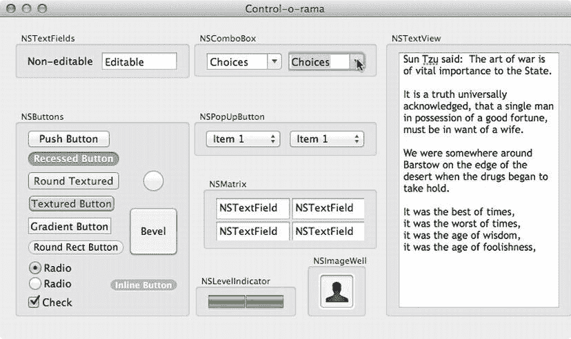

图 5-1。 Cocoa UI 元素示例

**注意** 在本书中，我们有时会使用 Cocoa 类名（例如 `NSButton`），有时则会使用它们常用的通俗名称（例如 button）。通常，在讨论代码时我们会使用类名，而在其他大多数情况下则使用通俗名称，但无论哪种情况，我们实际上指的都是同一种东西。

我们将使用这些类来创建一个模拟数据库应用的简单程序。用户可以通过一些简单的 GUI 控件来编辑和创建对象，但编辑结果不会被保存（这就是“模拟”的由来）。在后面的章节中，我们将学习如何使用 Core Data 将对象保存到磁盘，但现在我们将专注于 GUI。

## 创建 VillainTracker 应用程序

本章要创建的应用程序名为 `VillainTracker`。它是一个简单的应用程序，用于追踪超级反派、他们最后已知的下落、特殊能力等信息。对于任何称职的超级英雄团队来说，这都是一款应该安装在电脑系统中的应用，因此对于我们这样的英雄来说，它显然是一个入门应用。我们将把 `VillainTracker` 的开发分为两个阶段：第一阶段，我们将创建一个简单的应用程序，用于编辑单个反派的信息；第二阶段（参见第 6 章），我们将添加管理整个反派列表的功能。这将演示基于模型-视图-控制器（MVC）设计模式开发应用程序的基础知识，该模式已被开发者们使用多年。无论您对此模式是否有经验，了解 MVC 在 Cocoa 应用中的典型实现方式都非常重要，因为它确实是 Cocoa 中良好应用设计的基石。

与之前的应用程序一样，我们首先在 Xcode 中创建一个新的应用程序项目。我们将在 Interface Builder 模式下创建 GUI，然后通过使用 control-drag 的强大功能在生成的类中创建输出口和操作，将其与生成的代码连接起来。然后，我们将回到 Xcode，学习如何编写代码来设置和获取值——即 GUI 控件中显示的值——每次学习一个类，以便了解每个类的工作方式。通常，在构建 Cocoa 应用时，我们会在构建和修改 GUI 与实现代码之间来回切换：先布置一些 UI，然后实现其背后的代码，检查它是否按预期工作，然后迭代。由于这个应用相对简单，我们将先布置 GUI，然后再实现其背后的功能。

**注意** 在讨论 GUI 问题时，术语“视图”和“控件”通常可以互换使用。从技术上讲，大多数 Cocoa 用户界面类既是视图也是控件，至少在 Cocoa 的意义上是这样。

`NSView` 是一个允许在屏幕上绘图的类；`NSControl` 是 `NSView` 的子类，它通过响应用户事件、在目标对象中触发操作等方式扩展了 `NSView`。因此，我们应用中视图层的大部分将由“控件”对象组成，这当然不能与控制器层混淆。如果这听起来令人困惑，只需记住“控件”是视图的一种特定类型，而“控制器”是控制器层中协调视图和模型对象的对象。我们保证，过一段时间，这一切都会变得非常清晰。

那么，让我们创建一个新的应用程序项目。与之前的章节一样，启动 Xcode，如果它已经在运行则切换到它，然后按下 `N`，或者从 **文件** 菜单中选择 **新建项目**。在新建项目辅助工具中，在左侧的 OS X 下，单击 *应用程序*；然后在右侧的大窗格中，单击 *Cocoa 应用程序*，然后单击“下一步”。

标准的 Xcode 新建项目选项面板将提示我们输入应用程序的标识信息。在“产品名称”中输入“VillainTracker”，并在相应的两个框中输入您选择的组织名称和公司标识符。本次的类前缀，我们的示例也将使用字符串“VillainTracker”。确保选中 *使用自动引用计数*，并取消选中其他复选框。单击“下一步”。

接下来看到的标准保存面板允许我们导航到选择的目录并在那里创建新项目。使用控件导航到您主目录或桌面上的合适位置，然后单击“创建”。现在，Xcode 会在指定位置创建一个名为 `VillainTracker` 的新文件夹，其中包含一些默认内容，例如 `VillainTracker.xcodeproj` 项目文件，并打开一个新窗口，显示我们项目的设置。

## 构建界面

我们将从使用 Interface Builder 编辑项目的主 nib 文件开始，为 `VillainTracker` 创建 GUI。我们将添加 GUI 控件来捕获我们需要了解的每个宿敌的信息，并学习如何将控件组织成逻辑组，以及如何在调整窗口大小时让它们正确地重新定位。我们还将把它们连接到控制器类，在控制器中创建输出口，并将所有内容连接在一起。

首先在 Xcode 的导航器窗格（屏幕左侧的项目导航器窗格中）中找到 `MainMenu.xib`。单击 `MainMenu.xib`，它将在 Xcode 的中央窗格中以 Interface Builder 模式打开。我们将看到新应用程序的默认菜单集，以及在 Interface Builder 编辑器区域左侧的 Dock 中的几个图标——三个占位对象（文件所有者、第一响应者和应用程序）和另外四个对象（主菜单、窗口 - VillainTracker、VillainTrackerAppDelegate 和字体管理器）。单击“窗口 - VillainTracker”对象，一个空白的窗口将在编辑器区域中打开。

### 摆弄文本字段

现在可以开始构建 GUI 了。我们将一次构建一小部分，但可以参考图 5-2 中窗口的完成版本，以了解布局。


图 5-2。 完整的 `VillainTracker` 窗口看起来是这样的

我们要设置的第一个控件是几个 `NSTextField`。`NSTextField` 是一个非常有用的类，它提供堪比成熟文本编辑器的文本编辑能力，即使在仅输入几个字符的场景下也是如此。在 Xcode 窗口右侧实用工具面板的 *对象库* 区域中，确保顶部选中了 *对象* 选项卡，然后在其中选择 *对象库* 或其子项 Cocoa。然后点击窗口底部的搜索字段，输入“text field”。


库中可用的对象列表缩减到只有几个，其中包括一个名为`Text Field`的对象。它应该位于列表顶部附近。将其中一个（`Text Field`，不是`Text Field Cell`，后者是一个略有不同的对象，我们将在第 6 章和第 7 章中遇到）拖到我们空白的窗口上，并将其放置在窗口的左上角附近。我们将在字段的左侧添加一个项目，因此请在字段和窗口边缘之间留出一些空间。现在，在选中新的文本字段的情况下，通过按`⌘D`复制它。一个新的文本字段会出现，并覆盖前一个。将新的文本字段向下拖动一点，窗口中会出现一些蓝色参考线，帮助将其对齐到前一个字段的下方。当它看起来大致如图 5-3 所示时，松开鼠标。

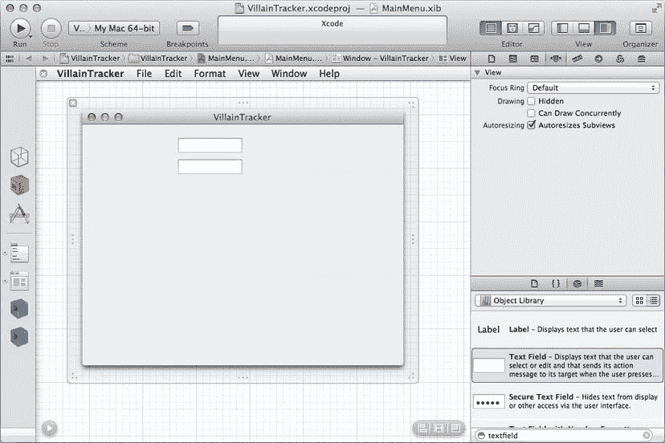

**图 5-3.** `VillainTracker`的前两个文本字段

现在我们需要标记这些对象，以便用户知道它们代表什么。回到`Object Library`窗格，点击搜索字段（如有必要，删除已有的文本），并输入单词“label”。它应该会显示一个名为`Label`的对象。将一个标签拖到窗口上，放在我们创建的第一个文本字段的左侧。同样，当我们拖到另一个对象附近时，会出现蓝色线条，帮助我们将其定位；这些参考线有助于我们相对于标签旁边的文本字段进行顶部、中心、文本基线或底部的对齐。当我们在 Interface Builder 中编辑此标签时，它会水平调整大小以匹配其内容。这没问题——只是默认情况下文本是水平居中的，这意味着在编辑时，它会向两个方向扩展并开始与右侧的`NSTextField`重叠。为避免这种情况，打开`Attributes Inspector`窗格（`⌘4`），找到并点击`Text Field`设置下的`Align Right`按钮（提示：它看起来与大多数文字处理器中对应的按钮一样）。这样做将使标签在更改其内容时仍能保持其右边距。

将标签中的文本编辑为“Name:”，然后通过按`⌘D`复制此标签。将新标签向下拖动一点，使其与下方的文本字段对齐，将其编辑为“Last Known Location:”，这样我们就完成了！如果你在标签中没有为那么多文本留出足够的空间，它会与文本字段重叠。可以随意移动对象，使布局更整洁。

### 让用户选择日期

我们要准备的下一个 GUI 对象是一个日期选择器，它将允许用户指定反派最后一次出现的日期。日期选择器克服了解析和呈现日期时可能遇到的模棱两可和相互竞争的日期格式标准，这是一个令人头疼的问题，而且我们在 Cocoa 中有一个很棒的内置日期选择器，所以我们就用它吧。

在`Object Library`窗格的搜索字段中，输入“date”并查看出现的内容。应该有一个名为`Date Picker`的条目。抓住它，将其拖入我们的窗口，并放在我们之前创建的`NSTextFields`下方，再次使用拖动到目标位置附近时出现的蓝色参考线。此控件的默认宽度小于其上方`NSTextFields`的默认宽度，因此它不会占用相同的水平空间，但这没关系。只需使其与其他控件的左边缘对齐即可。现在点击之前创建的某个标签，通过按`⌘D`再次复制它。将其向下拖动，与日期选择器对齐，并将文本更改为“Last Seen:”。图 5-4 显示了窗口现在应该是什么样子。


**图 5-4.** 我们有了一个良好的开端，为窗口添加控件和标签

### 创建组合框

现在该创建组合框了。如果我们有一组预定义的有效字符串值可供选择，但又希望允许用户输入他们自己的值，那么这个控件非常有用。这对于反派的`Sworn Enemy`属性来说非常完美。我们可以提供一些默认的超级英雄名字供选择，同时仍然允许用户输入我们未预料到的名字。

转到`Object Library`窗格，在搜索字段中输入“combo”，会看到一个`Combo Box`出现在列表中。将其拖到我们的窗口中，放在`NSTextFields`和`NSDatePicker`下方。再次使用蓝色参考线，使其与上方控件的左边缘对齐。再次复制一个现有的标签，将其放置在组合框的左侧，并将其重命名为“Sworn Enemy:”。

现在，让我们用一些默认值填充组合框。我们希望用户能够指定任何超级英雄，甚至是那些我们不知道的（这就是我们选择组合框的原因），但为了方便起见，我们应该用一些流行超级英雄的名字预加载此控件，因为流行的超级英雄往往也是最招致敌人的。

点击我们刚添加的组合框，并打开`Attributes Inspector`窗格（`⌘4`）。在上部区域有一个标有`Items`的位置，我们可以在其中添加将出现在组合框中的项目。图 5-5 显示了检查器此部分的操作。使用`+`按钮添加一个新项目，然后双击出现的“Item”文本，并将其更改为“Superman”。现在重复此过程，使用`+`按钮添加几个项目，每次编辑“Item”文本并将其更改为你喜欢的某个超级英雄的名字。


**图 5-5.** 在 Interface Builder 中配置`NSComboBox`

添加完超级英雄列表后，通过从**Editor**菜单中选择**Simulate Document**来测试界面。我们的窗口应该会出现，我们可以验证为组合框创建的项目在点击时是否出现。我们还可以在任何字段（包括组合框）中输入文本，并与日期选择器进行交互。完成后，按`⌘Q`返回 Xcode。

### 使用级别指示器显示评级

我们要创建的下一个控件是`NSLevelIndicator`，我们将用它来显示和指定任何反派的邪恶程度。我们将允许用户为此值指定 0 到 10 的星级评分，而`NSLevelIndicator`实际上会将其显示为一行星星。

回到`Object Library`窗格，在底部的搜索字段中输入“level”。出现的一个类是`NSLevelIndicator`，我们应该将其拖出并放入窗口中，再次使用蓝色参考线使其与先前控件的左边缘对齐，正好位于上一步添加的组合框下方。

现在我们需要稍微配置一下这个新对象。`NSLevelIndicator`类具有许多内置的显示样式，适用于不同的用途。在 Interface Builder 中创建的新实例的默认样式称为“Discrete”，但我们要更改它以匹配我们要显示的内容，这相当于一种评级。调出`Attributes Inspector`（`⌘4`），我们将看到第一个选项是一个标有`Style`的弹出菜单（见图 5-6）。点击弹出菜单，改为选择`Rating`。级别指示器会立即变为显示几颗星星的视图。

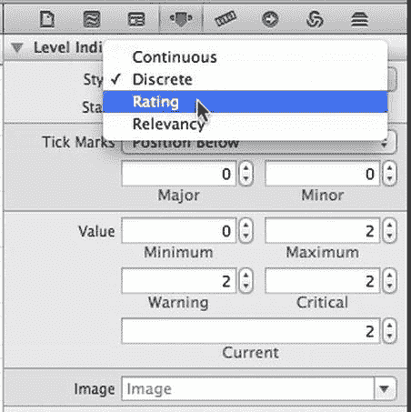

**图 5-6.**


## 配置 NSLevelIndicator 以显示星级评分

我们还需要为此控件指定有效的最大值和最小值，以便它知道如何显示给定的值。仍在*属性检查器*中，找到标有*值*的部分，其中包含用于设置最小值和最大值的控件。将最小值设为 0，最大值设为 10，可以通过在这些字段中输入数字或使用小的向上/向下按钮来设置。在这些文本字段下方稍低一点的位置，有一个标有*当前*的字段。将其设置为 10，这样我们就可以看到控件中星星的完整范围，并勾选*可编辑*复选框，以便用户自己编辑此值，而不仅仅是欣赏漂亮的星星。

也许控件并没有显示全部 10 颗星。在撰写本文时，从库中拖出的新 `NSLevelIndicator` 的默认宽度仅足以显示略多于 7 颗星，无法显示更多。幸运的是，Xcode 提供了一个方便的快捷方式，可以帮助我们调整视图的大小，使其完美适应其内容。从菜单中选择**编辑器**  **使大小适应内容**，或者按 = 键，使级别指示器扩展到恰好能显示全部 10 颗星的正确大小。根据我们相对于其他字段布局 `NSLevelIndicator` 的方式，我们可能已经创建了在 `NSLevelIndicator` 和其他字段之间建立大小关系的约束。如果在调整 `NSLevelIndicator` 大小时其他字段也调整了大小，那也没关系。我们可以按撤销 (Z) 并将 `NSLevelIndicator` 重新定位到远离其他字段的位置以打破约束，然后按照上述方法调整其大小，最后再将其重新定位到与其他字段左边缘对齐的位置。

**注意**  对于此应用，我们可以忽略警告和临界值，因为它们对 `NSLevelIndicator` 的评分样式没有任何影响。这些值确实会影响 `NSLevelIndicator` 在离散和连续样式下的绘制方式；我们还可以将 `NSLevelIndicator` 改回离散或连续样式，然后使用模拟文档查看效果，但继续操作前需要将其改回评分样式。

最后，是时候再次复制窗口中已有的标签之一了。将其拖放到级别指示器的左侧，并将文本更改为“邪恶程度：”。

现在可能是再次通过选择**模拟文档**来测试界面的好时机。我们应该能够点击星星线上的任意位置，使控件仅高亮显示相应数量的星星。

## 在矩阵中添加单选按钮

接下来，我们将为`主要动机`属性创建图形用户界面。通过对漫画书多年的仔细研究，我们了解到每个反派都有一个导致他们作恶的主要驱动因素，而这种动机总是可以归结为以下五种之一：贪婪、复仇、嗜血、虚无主义或疯狂。当然，有些反派可能同时受多种邪恶力量驱动，但我们将为每个追踪的反派选择一个主要动机。

我们将使用一组*单选按钮*来让用户选择主要动机。单选按钮通常被分组在一个共同工作的集合中，这样选择一个按钮会同时取消选择所有其他按钮。如果“单选按钮”这个名称对于此控件来说显得过于晦涩难懂，那么你可能太年轻，不记得 20 世纪 80 年代之前普遍存在的旧式汽车收音机调谐器控制装置——它通过按下一个机械按钮来选择电台，该按钮会将调谐器调整到特定电台，同时使之前按下的按钮弹回到“弹出”位置。无论如何，“单选按钮”这个术语将继续使用下去，当我们有一个小的、预先定义的选项列表，并且希望该列表始终显示在屏幕上时，这个控件是一个不错的选择。

在 Cocoa 中，单选按钮通常是一组位于 `NSMatrix` 内部并对齐的 `NSButtonCell` 实例。我们可以在*对象库*面板中通过在搜索字段中输入“radio”来找到这些预配置的控件。这将显示一个*单选组*。将其拖出并放到窗口中，放在其他控件下方。默认的单选按钮矩阵只包含两个单选按钮，但在本例中我们需要五个。在这里，仅通过拖拽调整手柄之一来调整矩阵大小是行不通的；那只会拉伸现有的按钮。相反，请尝试在按住 Option 键的同时向下拖动底部中央的调整手柄。这将同时调整矩阵大小并向内添加新按钮以填充空白区域。向下拖动直到出现五个按钮，然后松开鼠标按钮。

**提示**  请注意，许多 Cocoa 的 GUI 类似乎都有一个“影子”形式的*单元格类*：`NSButton` 对应 `NSButtonCell`，依此类推。这种划分源于过去的性能问题。为了加快绘图速度，部分绘图职责从视图类中移出，放入了专门的单元格类中。因此，在一个充满按钮的 `NSMatrix` 中，不是有一堆完整的 `NSButton` 实例，而是有一堆更简单的 `NSButtonCell` 实例。

现在是时候填写每个按钮标题中显示的值了。从最上面的按钮开始；双击选择“Radio”这个词，然后输入“Greed”。对剩余按钮进行相同操作，依次输入“Revenge”、“Bloodlust”、“Nihilism”和“Insanity”，如图 5-7 所示。请注意，此视图不会水平扩展以包含我们输入的文本，因此我们需要通过拖拽中央右侧的调整手柄并向右拖动，直到我们输入的所有文本都可见来自行调整。这也是**使大小适应内容**命令派上用场的情况。


图 5-7. 你生活中的主要动机是什么？

在完成之前，我们需要为每个单元格分配一个标签。我们可以使用任何整数作为每个单元格的标签，这样我们就可以通过包含该单元格的矩阵来引用它，而无需为每个单独的单元格设置一个出口。我们要为我们刚创建的矩阵中的每个单元格分配一个唯一的标签，为方便起见，让最上面的单元格从 0 开始，然后每向下一个单元格递增 1。除了遵循这个简单的模式外，这还将使我们能够在稍后创建一个字符串数组，其数组中的索引与各自的单元格标签完全匹配（因为 `NSArray` 使用从零开始的索引，第一个项目的索引为 0，第二个为 1，依此类推）。

从第一个按钮“Greed”开始。在矩阵中选择一个单元格通常需要多次点击。第一次点击选择矩阵，然后第二次点击告诉矩阵我们想要聚焦其内部，第三次点击才实际选择了单元格。一旦单元格被选中（你可以通过高亮显示来判断），在工具区的*属性检查器*中 (4)，在*单元格*属性最底部找到*标签*字段。将其设置为 0。现在选择“Revenge”按钮并将其标签设置为 1。继续向下操作矩阵，最后将“Insanity”的标签设置为 4。

现在，用于让用户指定反派主要动机的单选按钮就完成了！像之前一样，复制一个标签，将其拖下来，放在单选按钮组上方稍偏左的位置，并将其标题改为“主要动机：”。我们现在应该得到类似于 图 5-8 的结果。

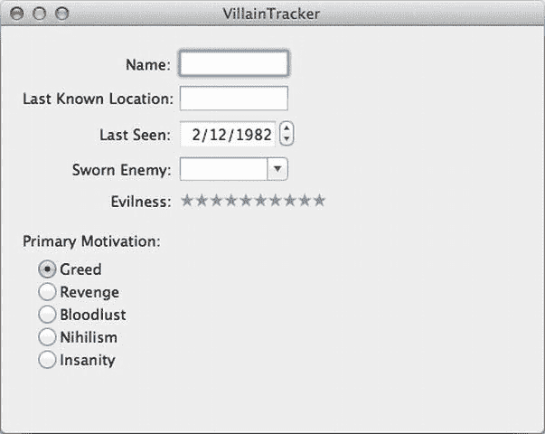

图 5-8. 多得数不过来的反派属性！


## 添加图像视图

没有反派追踪应用能缺少显示反派冷酷面容的功能。在 VillainTracker 中，我们将使用 `NSImageView` 类的实例来显示反派图片，并通过 Mac 的拖放机制接收图片作为输入。

返回对象库面板，在搜索字段中输入“image”。搜索结果中有一项是图像井（Image Well），它实际上就是 `NSImageView` 的一个实例。将其中一个拖拽到我们的窗口中，并放置在上节单选按钮矩阵的右侧稍远位置。

现在，这个图像井非常小，我们来把它放大。打开尺寸检查器（5）；注意图像井的宽度和高度都是 48。分别将这两个值编辑修改为 96，控件在窗口中的大小就会改变。我们希望用户能将图像拖入此视图，因此还需要打开属性检查器（4），并点击启用“可编辑”复选框。

现在，通过在窗口内稍微拖拽来调整图像井的位置。蓝色的对齐参考线会弹出；请注意，此控件现在与左侧的单选按钮矩阵处于同一垂直高度。将它们并排放置，然后复制另一个标签，将其放在图像视图的左上侧稍远位置，并将其标题改为“外观：”。请参考图 5-9 了解此时的粗略布局。

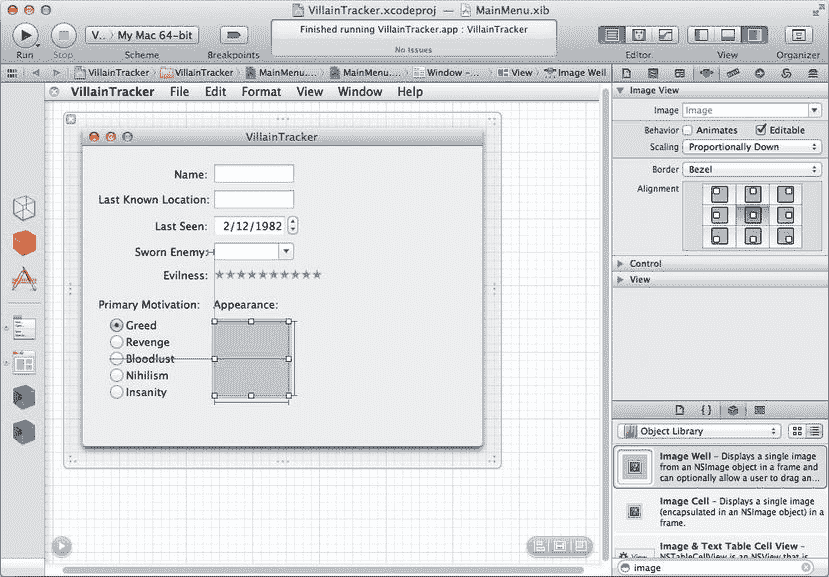

图 5-9. 图像井已就位

## 在矩阵中添加复选框

现在我们将添加一系列复选框，让用户标记每个反派的能力。与反派的主要动机类似，我们将创建一个分类系统，将所有超级反派的能力归纳到相应的类别中。我们再次使用矩阵，但这次填充的是复选框，而不是单选按钮。

再次前往*对象库*，在搜索字段中输入“check”。其中一个搜索结果将标记为*复选框*（Check Box）。抓取一个并将其拖入窗口。这会在窗口中放置一个配置为复选框工作的 `NSButton`。我们打算并排排列四个这样的复选框，但目前只有一个。现在是时候学习 Interface Builder 模式中的一个便捷技巧了：它允许我们自动选取任何可以出现在 `NSMatrix` 中的对象（例如 `NSButton`），并将其替换为一个新的 `NSMatrix`，该矩阵包含一个与原始对象配置相同的单元格。只需选中该对象（即复选框），然后在菜单中选择**编辑器** **嵌入到** **矩阵**。这个复选框现在就被包裹在一个矩阵中了，我们可以使用之前学习过的调整包含单选按钮的矩阵大小的技巧：按住 Option 键，点击底部居中的调整手柄，然后向下拖拽，直到出现四个复选框。

接下来，我们来配置这个新矩阵，使其能与一组复选框正确配合。选中矩阵本身（而不是其内部的某个复选框），然后打开实用工具区域中的*属性检查器*（4）。通过检查检查器顶部显示的名称来确认我们选中的是矩阵——它应该显示为 Matrix（矩阵），而不是 Button Cell（按钮单元格）。在检查器窗口的顶部是一个标记为“模式”（Mode）的弹出按钮。如果它没有设置为“高亮”（Highlight），我们就将其改为该模式，以获得正确的行为。

现在，为复选框填充以下（诚然不完整）能力列表的标题：“邪恶天才”、“读心者”、“近乎无敌”、“天气控制”。在点击设置这些值时，我们可能会无意中打开或关闭复选框。对此不必担心；所有这些复选框的状态最终都将由代码本身设定。

与单选按钮矩阵一样，我们需要将矩阵稍微加宽，以便按钮的完整文本都能显示出来。将中心右侧的调整手柄向外拖拽，直到所有文本都可见。

现在，我们需要为所有这些复选框设置标签，就像我们为选择主要动机的单选按钮设置标签一样。点击选中“邪恶天才”单元格，然后打开*属性检查器*（4），将标签设置为 0。接着点击“读心者”单元格，将其标签设置为 1。继续设置其余复选框，最后将“天气控制”复选框的标签设置为 3。此时，我们应该得到与图 5-10 类似的效果。

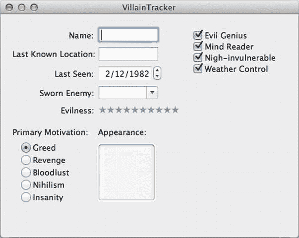

图 5-10. 为最坏的情况做准备

## 配置弹出按钮

现在我们来处理反派的能量来源，使用一个弹出按钮让用户从预定义列表中选择，以指定反派是如何获得能力的。我们再次提供几个选项：“天生”（反派天生就具备）、“意外事故”（某种“天灾”，如实验室爆炸、陨石撞击或类似事件导致变异）、“超级英雄行为”（某位超级英雄在执行任务时意外赋予了他人能力）以及“其他”。

再次前往*对象库*窗口，在搜索字段中输入“popup”。从搜索结果中抓取一个弹出按钮（Pop Up Button），将其拖入窗口，并放置在上节复选框矩阵的下方稍远位置。通过点击然后双击这个新的弹出按钮，我们可以看到默认的可选值列表。双击第一个值以编辑其文本，将其改为“天生”。继续编辑其余标题，输入上面提到的名称。输入第三个后，按钮的值就用完了；默认的弹出按钮只有三个值。点击这三个值中的某一个，按 D 键复制它，然后输入最后一个值。现在再抓取一个标签，将其放置在这个弹出按钮的左侧，并将标题改为“能力来源：”。

## 插入文本视图

现在是时候添加最后一个控件了，一个用于编辑有关当前反派自由格式笔记的文本视图。我们将使用 `NSTextView`，这是一个功能强大的文本显示和编辑类，广泛应用于 Mac OS X 界面。在 Interface Builder 画布中，抓住窗口轮廓上的调整手柄，向下拖拽以放大窗口。一些字段可能会随之移动；调整大小后，将它们重新放回应有的位置。我们可以通过按住 Shift 键单击，或者拖出选择矩形框选要移动的多个元素来同时选择它们。

腾出一些空间后，在*对象库*面板的搜索字段中输入“text view”，然后将搜索结果中的文本视图拖拽到我们窗口中的其他元素下方。调整其大小，使其填满大部分可用空间。此时的窗口布局应类似于图 5-11。

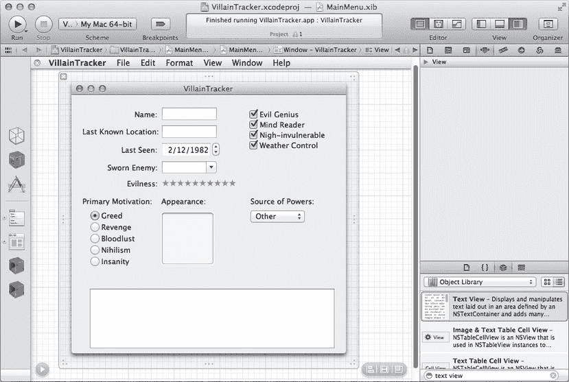

图 5-11. 所有控件都已放入窗口

## 进行逻辑分组

现在，我们所需的所有控件都已布局在窗口中，让我们退后一步，看看当前的情况。图 5-11 可能与我们现在拥有的界面看起来很相似。

这个界面可能功能齐全，标签清晰，但肯定不会赢得任何设计奖项，这一点是肯定的。我们的界面展示了大量功能，但所有控件都挤在一起，很难看出所有这些可编辑属性之间有什么逻辑分组。


通过将相关控件分组到*方框视图*中，我们可以对界面进行一些改进；Cocoa 提供了一个名为 `NSBox` 的类，它可以包含多个其他对象，并在它们周围绘制一个漂亮的边框。Xcode 包含一个便捷的快捷方式，可以让我们将现有视图放入一个大小恰好能容纳所有视图且边框精确匹配的方框中，因此为界面添加这一增强功能非常容易。

首先，选中前五个控件（位于窗口左上角）及其所有标签。最简单的操作方式是：点击窗口左上角（就在窗口的关闭/最小化/最大化控件下方），然后拖出一个选择框，框选我们想要选择的所有视图。接着从菜单中选择 **Editor**  **Embed In**  **Box**——一个漂亮的方框会环绕它们，带有深灰色背景和圆角。方框顶部有一个文本标签（显示为“Box”），可以编辑成描述方框内容的文字。双击该文本，将其改为“Basic Information”。

接下来对“Primary Motivation”部分执行相同的操作。首先，选中标签并按下 Backspace 或 Delete 键将其删除。由于我们即将创建的方框中只有一组控件，我们可以直接使用方框的标题。现在选中单选按钮矩阵，再次从菜单中选择 **Editor**  **Embed In**  **Box**。我们的单选按钮现在被包含在一个方框中。将方框的标签改为“Primary Motivation”。

对 mugshot 部分重复这些步骤：先删除现有标签，然后通过菜单创建方框，最后将方框的标签设置为“Appearance”。

接下来处理 powers and abilities。选中“Source of Powers”弹出按钮及其标签，以及能力（Abilities）部分的复选框矩阵。同样，最简单的方法可能是“画一个框”：在窗口右上角附近的背景处点击，然后向左下方拖动，直到所有相关项目都被选中。使用菜单将这些视图放入一个方框中，并将方框标题设为“Powers and Abilities”。

最后，选中为 villain 的 notes 属性创建的文本视图，将它放入一个单独的方框中，标题设为“Notes”。

现在我们已经创建了一堆方框，但它们可能彼此重叠，并且相对位置通常不太理想（如图 5-12 所示）。

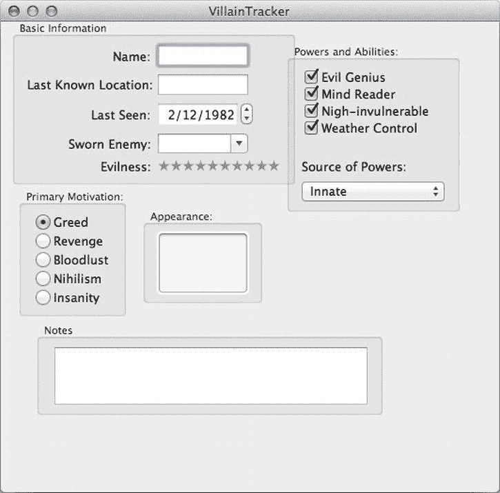

图 5-12. 并非我们见过的最佳方框布局

别担心；Xcode 的蓝色辅助线会帮助我们迅速将其整理整齐。从左上角的第一个方框开始。点击方框深色背景的任意位置（但不要点击控件或标签），然后拖动整个方框。当我们稍微移动它时，蓝色辅助线就会出现。这些辅助线可以帮助我们相对于彼此或相对于窗口本身来定位方框或任何视图。我们总可以通过沿着辅助线追踪到其末端，看它与什么相连，来判断辅助线正在对齐什么。当辅助线一直延伸到窗口边缘时，我们就知道它正在帮助我们设置距窗口边缘的推荐距离。

接着处理“Primary Motivation”方框，将其与上方方框的左边缘对齐，并保持在其下方几个像素的位置，同样利用辅助线来精确调整。然后处理“Appearance”方框，使其在垂直方向上与“Primary Motivation”方框对齐，在水平方向上与“Basic Information”方框的右边缘对齐。

继续处理其他方框，将“Powers and Abilities”方框对齐到已排好方框的右侧，然后将“Notes”方框放在所有方框的下方。

如果在移动过程中空间不足，或者你的窗口远大于所有其他视图的总尺寸，请适当调整窗口大小以容纳所有内容。

通过将“Notes”方框移入右下角留下的空隙中来完成此步骤，并调整其内部的 `NSTextView` 大小以适应新的边界和边距，同时也许还需要微调其他一些方框的尺寸，使它们能够整齐地排列在一起。图 5-13 展示了理想效果。如果尚未保存，请务必保存 nib 文件！

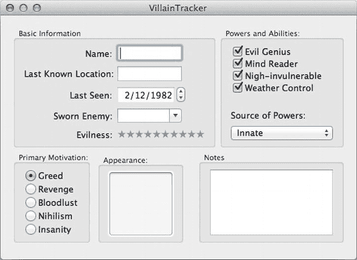

图 5-13. 终于，一个值得骄傲的窗口布局！

## 调整大小

现在我们已经有了一个漂亮的窗口，但还需要做一些额外工作来确保一切行为正常：我们需要能够处理用户调整窗口大小的情况。要理解为什么这甚至是有必要的，可以通过从 **Editor** 菜单中选择 **Simulate Document** 来测试界面。现在调整窗口大小，看看会发生什么。按照我们目前的布局，当垂直调整窗口大小时，所有控件都会保持原位，但我们可以将窗口垂直缩小到某些控件不可见的地步，并且我们根本无法水平调整窗口大小。（根据你跟随操作时布局控件的方式，调整大小的行为可能会有所不同。）我们将在下一章更深入地探讨调整大小。现在，我们将通过将窗口的最小和最大尺寸设为相同值，使窗口不可调整大小，然后继续编写代码。

Xcode 使这变得很容易。在 Interface Builder Editor 画布中选中 VillainTracker 窗口后，选择 *尺寸检查器* (5)。当前尺寸、最小尺寸和最大尺寸所给出的宽度和高度值应全部相同。勾选 *最小尺寸* 和 *最大尺寸* 约束对应的复选框，如图 5-14 所示。


图 5-14. 设置窗口的尺寸约束

## 连接 VillainTrackerAppDelegate 类

当我们创建 VillainTracker 项目时，Xcode 创建了一个名为 `VillainTrackerAppDelegate` 的类。我们将向这个类中添加代码，使其与用户界面控件连接起来，从而在模型-视图-控制器（MVC）的意义上成为一个“控制器”。更复杂的应用程序很可能会有多个控制器类，但对于像这样与单个窗口及应用程序本身交互的简单应用来说，一个控制器就足够了。我们将要添加的大部分代码都将采用输出口（outlets）和动作（actions）的形式，正如上一章所讨论的。这个控制器将拥有指向 GUI 中所有对象的输出口（以便它可以在需要时设置和检索视图对象中的值），以及用于这些对象的动作方法，以便用户在编辑某个值时通知控制器。

请记住，输出口不过是一个经过特殊标记的属性或实例变量，而动作则是任何符合特定签名的方法，它接受一个类型为 `id` 的单个参数并返回 void。注意，在源代码中，动作的返回类型通常被标记为 `IBAction` 而不是 void。`IBAction` 实际上被定义为与 void 相同，因此对于编译器来说没有任何区别。现在，假设我们有某种设计文档，其中指定了几个 villain 属性及其类型。根据它们的类型和用法，我们可以将每个属性映射到一个合适的 GUI 类（参见表 5-1）。

表 5-1.


## 反派属性映射到 GUI 类

| 属性名称 | 类型 | 视图类 |
| --- | --- | --- |
| Name | 字符串（自由格式） | `NSTextField` |
| lastKnownLocation | 字符串（自由格式） | `NSTextField` |
| lastSeenDate | 日期 | `NSDatePicker` |
| swornEnemy | 字符串（自由格式，但可从现有列表中选择） | `NSComboBox` |
| primaryMotivation | 字符串（来自预定义列表） | `NSMatrix`（包含单选按钮） |
| Powers | 字符串数组（来自预定义列表） | `NSMatrix`（包含复选框） |
| powerSource | 字符串（来自预定义列表） | `NSPopUpButton` |
| Evilness | 数字（0–10） | `NSLevelIndicator` |
| Mugshot | 图像 | `NSImageView` |
| Notes | 字符串（可能较长） | `NSTextView` |

根据此规范，我们将在 `VillainTrackerAppDelegate` 中为每个 GUI 控件添加一个 outlet 和一个 action。outlet 让我们能够访问控件，以便在必要时设置和获取其值；每个控件将调用相应的 action 方法，以在其内容发生变化时通知我们。为了使代码易于理解，我们将为 outlet 使用特定的命名约定：属性名称加上字符串 "View" 作为后缀。例如，对于名为 `lastSeenDate` 的属性，我们将有一个名为 `lastSeenDateView` 的 outlet。类似地，对于 action，我们将使用动词 "take" 作为前缀。对于属性 `lastSeenDate`，我们的 action 将被命名为 `takeLastSeenDate`。

可以通过手动创建属性或实例变量来将 outlet 添加到代码中，但更简单的方法是通过从 nib 文件按住 Control 键拖拽到代码窗口来实现。为此，我们首先需要一个包含代码的窗格。点击 Xcode 主窗口工具栏右侧编辑器图标组中的 *Assistant* 按钮（看起来像一个管家的躯干）。对于此操作，请确保 Xcode 左侧打开 nib 文件，右侧打开代码编辑器，如图 5-15 所示。我们可以通过选择 **View**  **Assistant Editor** 下的首选位置来定位 Assistant 窗口。如果尚未打开，请在 Assistant 编辑器窗格中打开 `VillainTrackerAppDelegate.h` 文件。为此，点击窗格顶部的小管家图标，它应该位于 Automatic 下的选项中。

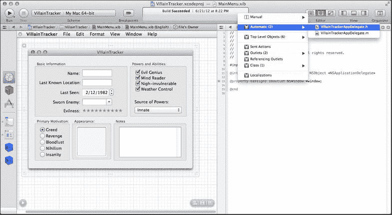

图 5-15. 准备开始创建 outlet

首先，点击标签为 Name: 旁边的文本字段。按住 Control 键拖拽到 Assistant 编辑器窗格中的代码处，拖出一条蓝线，放在现有属性 `window` 的正下方。拖拽过程中，任何可以作为有效连接终点的内容都会在鼠标下方高亮显示。当到达 Assistant 编辑器窗格中的正确位置时，会出现一个小旗帜，指示 *Insert Outlet or Action*，如图 5-16 所示。释放鼠标按钮，代码上方会弹出一个小型上下文窗口，我们可以在其中命名 outlet，并在必要时修改一些默认参数。对于此应用，我们不需要更改 outlet 的默认值。使用上述命名约定命名 outlet：对于保存名称的字段，将 outlet 命名为 `nameView`。


图 5-16. 向 VillainTracker 添加第一个 outlet

某些 UI 组件由多个元素组成：复选框矩阵、单选按钮和文本视图。对于矩阵，请确保选中整个矩阵，而不是矩阵内的某个单元格。对于文本视图，我们遇到了相反的问题。文本视图包含在滚动视图中。点击文本区域内部，直到仅文本部分高亮显示，而不是边缘的滚动条。

用于创建 outlet 的弹出窗口应指示类型为 `NSTextView`。如果它显示的是 `NSScrollView`，请点击取消，然后在 Notes 框中再点击一次 `NSTextView`。

完成后，Assistant 编辑器中的代码应如下所示：

```objc
#import <Cocoa/Cocoa.h>

@interface VillainTrackerAppDelegate : NSObject <NSApplicationDelegate>
@property (assign) IBOutlet NSWindow *window;
@property (weak) IBOutlet NSTextField *nameView;
@property (weak) IBOutlet NSTextField *lastKnownLocationView;
@property (weak) IBOutlet NSDatePicker *lastSeenDateView;
@property (weak) IBOutlet NSComboBox *swornEnemyView;
@property (weak) IBOutlet NSLevelIndicator *evilnessView;
@property (weak) IBOutlet NSMatrix *powersView;
@property (weak) IBOutlet NSPopUpButton *powerSourceView;
@property (weak) IBOutlet NSMatrix *primaryMotivationView;
@property (weak) IBOutlet NSImageView *mugshotView;
@property (weak) IBOutlet NSTextView *notesView;

@end
```

以上涵盖了 outlet，现在让我们来处理 action。过程大致相同；我们将再次从 Name 文本字段开始。按住 Control 键从 Name 文本字段拖拽到代码处，但这次在释放鼠标时，将上下文窗口中的第一个字段从 "Outlet" 更改为 "Action"。完成后，为每个剩余的 UI 元素拖拽出连接。以 `take` 前缀输入 action 名称：`takeName`、`takeLastKnownLocation`，依此类推。对于两个按钮矩阵（Primary Motivation 和 Powers），请确保连接的是矩阵本身，而不是矩阵内部的按钮单元格。窗口应如图 5-17 所示。


图 5-17. 添加 takeSwornEnemy action

完成后，Assistant 编辑器中的代码应如下所示：

```objc
#import <Cocoa/Cocoa.h>

@interface VillainTrackerAppDelegate : NSObject <NSApplicationDelegate>

@property (assign) IBOutlet NSWindow *window;
@property (weak) IBOutlet NSTextField *nameView;
@property (weak) IBOutlet NSTextField *lastKnownLocationView;
@property (weak) IBOutlet NSDatePicker *lastSeenDateView;
@property (weak) IBOutlet NSComboBox *swornEnemyView;
@property (weak) IBOutlet NSLevelIndicator *evilnessView;
@property (weak) IBOutlet NSMatrix *powersView;
@property (weak) IBOutlet NSPopUpButton *powerSourceView;
@property (weak) IBOutlet NSMatrix *primaryMotivationView;
@property (weak) IBOutlet NSImageView *mugshotView;
@property (weak) IBOutlet NSTextView *notesView;

- (IBAction)takeName:(id)sender;
- (IBAction)takeLastKnownLocation:(id)sender;
- (IBAction)takeLastSeenDate:(id)sender;
- (IBAction)takeSwornEnemy:(id)sender;
- (IBAction)takeEvilness:(id)sender;
- (IBAction)takePowers:(id)sender;
- (IBAction)takePowerSource:(id)sender;
- (IBAction)takePrimaryMotivation:(id)sender;
- (IBAction)takeMugshot:(id)sender;

@end
```

只要属性和方法存在，它们的顺序与这里看到的不同也是可以的。您可能还会注意到这里似乎缺少了一件事：没有为用于编辑 notes 属性的 `NSTextView` 定义 action 方法。原因是 `NSTextView` 实际上并不使用 target/action 范式。相反，当内容发生变化时，它会通知其委托。我们将在稍后实现所有这些 action 方法时一起实现该委托调用。

将 Assistant 编辑器窗格切换到 `VillainTrackerAppDelegate.m` 文件，以便可以看到类的实现。Xcode 已经为每个 action 生成了空的方法存根。

```objc
#import "VillainTrackerAppDelegate.h"
```


```objectivec
@implementation VillainTrackerAppDelegate

- (void)applicationDidFinishLaunching:(NSNotification *)aNotification {
    // 在此处插入代码以初始化您的应用程序
}

- (IBAction)takeName:(id)sender { }
- (IBAction)takeLastKnownLocation:(id)sender { }
- (IBAction)takeLastSeenDate:(id)sender { }
- (IBAction)takeSwornEnemy:(id)sender { }
- (IBAction)takeEvilness:(id)sender { }
- (IBAction)takePowers:(id)sender { }
- (IBAction)takePowerSource:(id)sender { }
- (IBAction)takePrimaryMotivation:(id)sender { }
- (IBAction)takeMugshot:(id)sender { }

@end
```

请注意，如果你需要在 `.h` 文件中做一些修改才能使其正确，例如删除一个命名错误的属性或一个本应是操作（action）的插座变量（outlet），那么在这里也可能需要进行相应的清理工作。

我们还有最后两个连接需要建立，它们不涉及创建代码。如上所述，文本视图在某种程度上是一种不同的存在。与窗口中的其他可编辑对象不同，`NSTextView` 并不是 `NSControl` 的子类，这意味着它不了解目标/操作模式。然而，它确实通过调用其委托中的方法来暴露大量功能。稍后，我们将在 `VillainTrackerAppDelegate` 内部实现一些委托方法，以便在文本视图的值发生更改时获得更新。现在，只需在 Interface Builder 编辑画布左侧的对象停靠栏中，将文本视图的委托插座变量连接到我们的 `VillainTrackerAppDelegate` 对象。正如我们创建插座变量时那样，由于文本视图自动包含在一个 `NSScrollView` 中，而该 `NSScrollView` 又包含在我们之前创建的 `NSBox` 中，这会使操作稍微复杂一些，因此我们可能需要单击或双击一两次，才能实际选中文本视图本身并能够从它拉出连接。

最后，为了我们的控制器类，我们还要建立一个额外的连接。当 nib 文件被加载并且应用程序本身已初始化并准备好与用户交互时，我们希望能够收到通知，以便可以准备初始显示。这可以通过使用 `NSApplication` 的委托方法来实现，因此从对象停靠栏窗口中的 Application 对象拖动一个连接到 `VillainTrackerAppDelegate`，然后从上下文菜单中选择 Delegate。

我们做了很多拖拽连接的操作，确保这些连接按预期设置是很好的实践。检查这一点的最佳方法是查看 Xcode 中的连接检查器。在 Interface Builder 编辑器左侧边缘的对象停靠栏中，选择当我们悬停时显示名称 `Villain Tracker App Delegate` 的蓝色框。然后选择连接检查器（6），它将在实用工具区域中显示。涉及应用程序委托的连接应类似于图 5-18 中所显示的内容。这显示了所有我们连线好的插座变量和操作，以及引用了该应用程序委托的对象。如果建立连接花费了不止一次尝试，或者你本想创建一个操作却创建了一个插座变量，你可能还会在这里看到一些需要修剪的残留连接。你可以将鼠标悬停在此处列出的连接上，以在 Interface Builder 编辑器窗格中高亮显示已连接的对象，并且可以单击右列中的小“x”图标来断开连接。


图 5-18。与 `VillainTrackerAppDelegate` 之间的连接

在我们开始实现这些操作之前，我们还需要解决这个难题的最后一个部分。我们将开始为我们将在本应用程序中使用的模型类铺平道路。

在一个真实的应用程序中，你会为你的反派对象拥有一个合适的模型类，这个类会包含从文件或数据库保存和加载的功能，在后面的章节中，你会看到如何使用 Core Data 来实现这一点。但对于这个我们主要关注 GUI 组件如何连接和使用的应用程序，我们将保持简单，并使用一个 `NSMutableDictionary` 来表示每个反派对象。`NSMutableDictionary` 确实非常适合这个任务，因为它使我们能够轻松地存储和检索任何类型的值，并且不需要为每个值预定义方法，因为这些值是使用代表键的简单字符串来访问的。

要将此添加到我们的类中，我们将在 notesView 属性下方声明一个名为 `villain` 的新属性。由于我们将在类内部管理这个属性，我们必须将其标记为 strong 而不是 weak。头文件应如下所示（我们正在添加的代码在此处以粗体显示）：

```objectivec
#import <Cocoa/Cocoa.h>

@interface VillainTrackerAppDelegate : NSObject <NSApplicationDelegate>

@property (assign) IBOutlet NSWindow *window;
@property (weak) IBOutlet NSTextField *nameView;
@property (weak) IBOutlet NSTextField *lastKnownLocationView;
@property (weak) IBOutlet NSDatePicker *lastSeenDateView;
@property (weak) IBOutlet NSComboBox *swornEnemyView;
@property (weak) IBOutlet NSLevelIndicator *evilnessView;
@property (weak) IBOutlet NSMatrix *powersView;
@property (weak) IBOutlet NSPopUpButton *powerSourceView;
@property (weak) IBOutlet NSMatrix *primaryMotivationView;
@property (weak) IBOutlet NSImageView *mugshotView;
@property (weak) IBOutlet NSTextView *notesView;

@property (strong) NSMutableDictionary *villain;

- (IBAction)takeName:(id)sender;
- (IBAction)takeLastKnownLocation:(id)sender;
- (IBAction)takeLastSeenDate:(id)sender;
- (IBAction)takeSwornEnemy:(id)sender;
- (IBAction)takeEvilness:(id)sender;
- (IBAction)takePowers:(id)sender;
- (IBAction)takePowerSource:(id)sender;
- (IBAction)takePrimaryMotivation:(id)sender;
- (IBAction)takeMugshot:(id)sender;

@end
```

除了从 weak 改为 strong 之外，这看起来与 Xcode 为我们生成的插座变量的代码相同。这个声明告诉编译器，我们的类将包含用于 `villain` 属性的 getter 和 setter 方法（分别称为 `villain` 和 `setVillain:`），并暗示了 setter 的语义（特别是，`strong` 意味着传递给 `setVillain:` 的值将由这个类“拥有”，这与由 nib 文件拥有的插座变量相反）。只要存在一个对象的 `strong` 引用，该对象就会保持存活。一旦没有更多的 `strong` 引用（但可能仍然存在 `weak` 引用），那么该对象将被释放，任何剩余的 `weak` 引用将被设置为 nil。注意，Xcode 生成的所有插座变量都被标记为 `weak`。我们的代码不拥有这些对象；它们由其父视图或窗口本身拥有。它还会创建一个实例变量，这将为我们节省一些输入。现在可以在代码中将此属性引用为 `self.villain`。

现在是一个好时机，按下 Xcode 中的运行按钮，确保到目前为止我们没有犯任何错误。如果我们正确输入了所有内容，我们的应用程序应该能够编译通过，没有任何警告或错误，然后启动并显示我们辛苦构建的窗口。如果没有，请查看 Xcode 显示的错误消息，并尝试修复它们所指出的问题。一般来说，编译 Objective-C 比编译 C++ 或 Java 代码要快得多，所以频繁编译不会有什么损失。在本章的其余部分，我们将频繁编译我们的应用程序并运行它，以确保我们在进入下一个功能之前，每个编码的功能确实能按预期工作。


现在我们已经完成了应用程序代码在 GUI 中显示值以及接收用户操作更新所需的所有连接。是时候开始编写应用程序了！

## 开始编码

既然 GUI 布局已经完成，我们将实现应用程序的“核心”部分。在 `VillainTracker` 中，所有这些核心功能都将包含在 `VillainTrackerAppDelegate` 类中。我们将学习如何使 `NSApplication` 的委托（例如我们的控制器类）在应用程序启动时做出反应；我们将了解用于在已创建的 GUI 对象中显示值的基本 API；我们还将学习如何通过从相关控件获取值来实现响应用户操作的方法。

### 标准化键名

在开始编写实际代码之前，最好先想出一种方法来标准化用于从模型对象访问属性的键名。无论是像我们这样将 villain 存储在只能通过键访问属性的字典中，还是在更复杂的使用真实模型对象的情况下，标准化键名对于确保我们在模型对象中正确访问属性至关重要。

我们在这里使用的技术很简单：使用标准的 C 预处理器宏来定义在编译时替换为 `NSString` 实例的名称。这消除了拼错键名的潜在问题，并且还能与 Xcode 的代码补全功能很好地配合使用。

以下代码包含了我们在应用程序中使用的所有 villain 属性的键名。有了这些定义，我们就可以（并且应该）使用定义的名称，而不是在代码中使用 `NSString` 字面量来通过键名引用属性。将以下代码放在 `VillainTrackerAppDelegate.m` 文件的顶部：

```c
#define kName @"name"
#define kLastKnownLocation @"lastKnownLocation"
#define kLastSeenDate @"lastSeenDate"
#define kSwornEnemy @"swornEnemy"
#define kPrimaryMotivation @"primaryMotivation"
#define kPowers @"powers"
#define kPowerSource @"powerSource"
#define kEvilness @"evilness"
#define kMugshot @"mugshot"
#define kNotes @"notes"
```

### 创建默认 Villain

现在是时候创建一个新的 villain 对象了，它包含用户可以在应用程序中编辑的所有属性。如前所述，我们不会创建一个“真正的”模型类来包含 villain，而是选择更简单的方案，即使用 `NSMutableDictionary`。我们将在 `NSApplication` 的委托方法 `applicationDidFinishLaunching:` 内部创建它。几乎每个 Cocoa 应用程序都需要在启动时做一些设置工作，因此 Xcode 在生成类时已经为我们创建了此方法的存根。现在我们将填充其实现。

代码如下：

```objc
- (void)applicationDidFinishLaunching:(NSNotification *)aNotification {
    self.villain = [[NSMutableDictionary alloc] initWithObjectsAndKeys:
                    @"Lex Luthor", kName,
                    @"Smallville", kLastKnownLocation,
                    [NSDate date], kLastSeenDate,
                    @"Superman", kSwornEnemy,
                    @"Revenge", kPrimaryMotivation,
                    [NSArray arrayWithObjects:@"Evil Genius", nil], kPowers,
                    @"Superhero action", kPowerSource,
                    @9, kEvilness,
                    [NSImage imageNamed:@"NSUser"], kMugshot,
                    @"", kNotes,
                    nil];
}
```

这段代码为大多数人都熟悉的默认 villain 设置了所有属性。`initWithObjectsAndKeys:` 方法用一个以 `nil` 结尾的值和键对列表来填充字典。为了清晰起见，我们将每个值/键对放在单独的一行。我们已经熟悉了使用 `@"string"` 语法来创建新的 `NSString` 字面量，但 `@9` 是新的。这是 `[NSNumber numberWithInt:9]` 的简写形式。

请注意，`mugshot` 属性被设置为一个预先存在的 `NSImage` 实例，这是 Cocoa 内置的、可供任何人在其应用程序中使用的几个图像之一。现在是在 Xcode 中再次编译应用程序的好时机，以确保到目前为止一切正确，但现在运行应用程序仍然没有意义。GUI 已经创建，但目前还没有任何功能在正常工作。

**注意**：你可能会疑惑为什么要将 `NSApplication` 委托的初始化代码放在 `applicationDidFinishLaunching:` 方法中，而不是放在 `init` 方法中。从应用程序的主 nib 文件加载的对象总是处于一种特殊的困境中：它们是在应用程序自身初始化过程中作为子步骤被初始化的，这意味着在 `init` 被主 nib 文件中的任何对象调用时，`NSApplication` 本身可能尚未完全初始化！这会产生很多影响，尤其是在用户界面方面，因此通常最好将所有初始化工作推迟到一切准备就绪后再进行。由于 `VillainTrackerAppDelegate` 被设置为 `NSApplication` 的委托，通过实现 `applicationDidFinishLaunching:` 方法，你可以方便地得知应用程序何时真正准备就绪。

### 关注细节

之前的代码创建了一个 villain 对象，但如果我们现在构建并运行应用程序，将看不到 villain 的任何迹象。窗口上的所有控件都将是空白的，因为我们还没有使用 villain 属性中的值填充它们。现在是时候改变这一点了。在 `VillainTrackerAppDelegate` 类中，我们将创建一个名为 `updateDetailViews` 的新私有方法，该方法负责设置所有 GUI 对象以显示当前 villain 的属性。我们将此功能放在一个独立的方法中（而不是直接在 `applicationDidFinishLaunching:` 内部进行设置），这样我们不仅可以在应用程序启动时，还可以在需要时刷新视图。我们将完成显示 villain 属性的过程，并熟悉与 GUI 中各种类交互的基础知识。

让我们从创建新方法的一个简单“存根”开始。我们希望此方法可以从类内部的任何地方访问，但不能从外部访问。一种方法是不将其添加到 `.h` 文件的 `@interface` 声明中。因此，在 `VillainTrackerAppDelegate.m` 文件底部的 `@end` 声明上方，插入以下代码：

```objc
- (void)updateDetailViews {
}
```

在开始实现新方法之前，我们需要确保已准备好调用它，方法是在 `applicationDidFinishLaunching:` 的末尾插入以下代码行：

```objc
// insert this at the end of applicationDidFinishLaunching:
[self updateDetailViews];
```

快速编译一下，以确保到目前为止我们的代码可以顺利编译。现在是时候开始实现 `updateDetailViews` 方法，并最终在我们的窗口中看到一些 villain 数据了！

### 设置简单值

我们将要设置显示的前两个控件是包含 villain 姓名和最后已知地点的 `NSTextField`。`NSTextField` 也可以直接接受数字和其他类型的输入，但我们这里只是使用 `setStringValue:` 为每个控件传入一个简单的字符串。将以下代码行放在 `updateDetailViews` 方法的开头（我们刚才用一对空括号定义了该方法）：

```objc
[self.nameView setStringValue:[self.villain objectForKey:kName]];
[self.lastKnownLocationView setStringValue:
                  [self.villain objectForKey:kLastKnownLocation]];
```

请注意，我们复用了之前定义的预处理器宏，因此不必担心拼错字符串值。


现在我们应该能够编译、运行此应用，并确实在窗口的文本字段中看到一些数据了！

接下来，我们将设置`NSDateView`的值。将以下代码添加到`updateDetailViews`方法的末尾：

```
[self.lastSeenDateView setDateValue:
                  [self.villain objectForKey:kLastSeenDate]];
```

这显然与我们为`NSTextFields`所做的非常相似：同样使用了预处理宏，为目标对象调用了相关方法（本例中为`setDateValue:`），等等。输入这段代码后，我们应该再次编译并运行，以确保它正常工作，并且日期视图中显示了正确的日期（今天的日期）。

现在我们了解了这里的模式，让我们迈出更大的一步，看看如何一次为所有剩余的“简单”控件设置值。我们可以在每次添加后编译并运行以检查工作进展，或者如果我们觉得运气不错，也可以一次性输入所有代码，然后在最后编译并运行。将以下代码行添加到`updateDetailViews`方法的末尾：

```
[self.evilnessView setIntegerValue:
                  [[self.villain objectForKey:kEvilness] integerValue]];
[self.powerSourceView setTitle:[self.villain objectForKey:kPowerSource]];
[self.mugshotView setImage:[self.villain objectForKey:kMugshot]];
[self.notesView setString:[self.villain objectForKey:kNotes]];
```

这里唯一的复杂之处在于`evilnessView`。该视图期望一个`NSInteger`来设置其值，但我们的反派角色的邪恶度值是以`NSNumber`的形式存储在字典中的，因此我们多了一个步骤，需要将对象转换为`NSInteger`。

### 复杂控件中的值

在我们将要显示的剩余属性中，有两个是简单值（`swornEnemy`和`primaryMotivation`），而第三个属性`powers`是一个“复合值”：一个字符串数组。所有这些属性都在比之前的属性更复杂的视图中显示，因此我们将花更多时间分别处理它们。

首先，让我们处理`swornEnemy`属性，它显示在`NSComboBox`中。组合框维护一个项目列表，如果我们想向其中添加新值，必须手动编辑。每当我们显示一个反派角色，其`swornEnemy`是在 Xcode 中设置组合框时未曾预料到的人时，我们就需要这样做。在以下代码中，我们首先检查组合框是否包含与我们要显示的名称匹配的项目。如果没有，则添加一个。之后，我们告诉组合框选择相应的项目。将以下代码添加到`updateDetailViews`方法的末尾：

```
if ([self.swornEnemyView indexOfItemWithObjectValue:
      [self.villain objectForKey:kSwornEnemy]] == NSNotFound) {
    [self.swornEnemyView addItemWithObjectValue:
      [self.villain objectForKey:kSwornEnemy]];
}
[self.swornEnemyView selectItemWithObjectValue:
      [self.villain objectForKey:kSwornEnemy]];
```

现在编译并运行，组合框应该显示正确的值，本例中为“Superman”。我们可以通过修改`applicationDidFinishLaunching:`方法中的相关行，将其引用为 nib 文件中不存在的其他超级英雄名字，然后重新编译并运行，来验证这对于未包含在 nib 文件组合框中的项目也能正常工作。

接下来，让我们处理显示在单选按钮矩阵中的`primaryMotivation`属性。`NSMatrix`类允许我们通过指定其标签来选择单个单元格，而且由于这些是单选按钮，其他单元格将自动取消选择。我们要做的第一件事是定义一个方法，该方法返回一个字符串数组，包含我们为反派角色考虑的所有动机。这些字符串的排列顺序应与 nib 文件中复选框矩阵中单元格的顺序相同，以便它们的索引值与为每个单元格指定的标签相匹配。此方法应添加到`updateDetailViews:`方法之后。

```
+ (NSArray *)motivations {
    static NSArray *motivations = nil;
    if (!motivations) {
        motivations = [[NSArray alloc] initWithObjects:@"Greed",
          @"Revenge", @"Bloodlust", @"Nihilism", @"Insanity", nil];
    }
    return motivations;
}
```

关于这个新方法，有几点值得注意，每一点都可能对 Cocoa 中使用的设计模式和哲学有所启示：

*   这是一个类方法，而不是实例方法（由开头的`+`而不是`-`表示），因此这里发生的一切都应用于整个类，无论我们创建了多少个实例。这在许多情况下是合适的，尤其是当方法不处理任何特定于实例的内容（例如实例变量）时。
*   我们使用了一个局部定义的静态变量来指向我们创建的对象。初始赋值`nil`仅在方法第一次被调用时发生。这与标准 C 函数中静态局部变量的使用完全相同，它让我们定义一段代码块（`if`子句内的所有内容），该代码块仅在此方法第一次被调用时执行。
*   我们遵循一个称为*懒加载*的原则。我们不是在类初始化时创建数组，而是在第一次需要它时才创建。这样，如果没有人调用这个方法，数组就永远不会被创建。

乍一看，遵循这些原则可能有些小题大做。毕竟，我们只会有一个控制器类的实例，所以为什么要把它做成类方法呢？而且我们知道需要初始化那个数组，为什么要懒加载呢？

当然，在这个人为设计的例子中，我们可以选择走“更简单”的路线。我们可以直接获取`NSArray`创建代码，并将其插入到我们需要查看动机列表的任何地方！然而，从长远来看，用“简单”的方式做事常常会适得其反，最终变得一点也不简单。事实上，看到相同的代码片段在整个程序中重复出现几乎总是一个危险信号。除非不可避免，否则请*不要重复自己*——让你的代码保持`DRY`！请记住，你构建的系统未来可能会增长和扩展——方式可能是你今天无法预料的。用“正确”的方式做事是为你的代码提供将来保障的好方法，这样以后查看代码的人（例如，试图找到在哪里添加动机列表）能够理解发生了什么，并找到他们需要修改的那一个地方，而不是手动搜索并替换所有创建相同数组的地方。

有了我们的`motivations`方法，我们现在就可以从中获取一个索引号，以标识我们想要在 GUI 中选择的单元格的标签。以下是实现此目的的一种方法，准备添加到`updateDetailViews:`的末尾：

```
[self.primaryMotivationView selectCellWithTag:
  [[[self class] motivations] indexOfObject:
    [self.villain objectForKey:kPrimaryMotivation]]];
```

好吧，我们意识到如果你不习惯这种写法，它看起来有点乱；甚至可能让一些人回想起在计算机科学教育中不得不学习，并且多年来一直试图忘记的 Lisp 或 Scheme（这些感觉是正常的，并且会随着时间的推移而消退）。为了清晰起见，我们将稍微拆解一下，并展示上述代码的另一种版本，其中一些中间值被赋值给了变量。

```
NSArray *motivations = [[self class] motivations];
id primaryMotivation = [self.villain objectForKey:kPrimaryMotivation];
int motivationIndex = [motivations indexOfObject:primaryMotivation];
[self.primaryMotivationView selectCellWithTag:motivationIndex];
```

这非常直接了当，所以你可能想知道我们为什么要先给你看那个所有代码都挤在一起的第一版。


基本上，第一个版本是一种 Objective-C 风格，你*迟早*会在实际开发中遇到它，所以能够大致看懂它是有好处的。这并不是因为它在技术上有什么优越性（实际上没有），而仅仅是因为有些人认为这种高度嵌套的版本在某些方面更易读，并且更倾向于这样写代码。方括号的位置，结合 Xcode 文本编辑器的特性，让你可以轻松地对前一个版本执行一些操作，而这些操作在后一个版本中会花费更多时间。例如，在 Xcode 中双击一个方括号会选中整个括号表达式，包括括号本身，这意味着你可以通过一次双击轻松选中整个方法调用，包括接收者、方法名和所有参数。这在编辑代码以及浏览或阅读代码时都非常有用。

另一方面，我们向你展示的第二种形式在调试应用程序时非常有帮助。只需设置一个断点，你就拥有了一整套的中间变量，随时准备向你展示它们的内容。最终，你倾向于哪种风格取决于个人喜好和实用性。在当下情况下，使用最适合你的方法即可。在你积累更多 Cocoa 经验之前，最好还是坚持使用后一种风格，因为它能更清晰地显示执行的顺序。现在，`updateDetailViews` 方法末尾使用的上述任何一种替代方案都应该能正常工作。编译并运行，验证 GUI 中显示的正确主要动机是“Revenge”。

最后，是时候显示 powers 属性了。与 `primaryMotivation` 类似，反派的能力显示在一个按钮单元矩阵中。不过，这次按钮单元是复选框，并且可以选择（或“勾选”）任意数量的复选框。powers 属性不是一个单独的字符串，而是一个 `NSArray`，其中包含你所查看反派的**所有**相关字符串。

我们将从与我们为 `primaryMotivation` 属性添加的内容非常相似的东西开始：一个名为 `powers` 的新类方法：

```objectivec
+ (NSArray *)powers {
    static NSArray *powers = nil;
    if (!powers) {
        powers = [[NSArray alloc] initWithObjects:@"Evil Genius",
                  @"Mind Reader", @"Nigh-invulnerable", @"Weather Control", nil];
    }
    return powers;
}
```

与 `motivations` 方法类似，此方法创建一个字符串数组，数组中字符串的索引对应 nib 文件中矩阵中定义的标签。现在我们只需添加一段代码来有选择地“勾选”所有适当的复选框。将以下代码添加到 `updateDetailViews` 方法的末尾：

```objectivec
[self.powersView deselectAllCells];

for (NSString *power in [[self class] powers]) {
    if ([[self.villain objectForKey:kPowers] containsObject:power]) {
        [[self.powersView cellWithTag:
          [[[self class] powers] indexOfObject:power]]
          setState:NSOnState];
    }
}
```

这段代码现在应该很容易理解。首先，它取消选择所有单元，这样我们就从所有复选框都未勾选的干净状态开始。然后，它遍历我们能力主列表中的每个命名能力，检查我们反派的能力属性是否包含匹配的字符串，如果包含，则将该单元的状态设置为 `NSOnState`，这意味着复选框被勾选。这里需要注意的一个新东西是特殊的 `for` 结构。这被称为**快速枚举**，是 Objective-C 最新版本中的一个新增特性，其工作方式不同于 C 语言中任何形式的 `for`，但你可能会熟悉它，因为它在 Java 或 C# 中作为 `foreach` 循环出现。它基本上接收 `in` 右侧的一个集合（通常是一个 `NSArray`），并对其进行迭代，一次一个地将集合中的每个对象赋值给 `in` 左侧指定的变量，然后执行后面花括号包裹的代码。

现在编译并运行应用程序，相关的复选框应该会在显示中被选中（对于 Lex Luthor 来说是“Evil Genius”）。

## 响应输入

既然我们能够显示所有这些反派属性，现在是时候反过来编写代码，让我们能够注意到用户对这些字段所做的更改。我们之前创建了由各种 GUI 控件触发的空操作方法；现在是我们填充这些方法并让它们做有用事情的时候了！此外，我们将实现一个委托方法，以便获取窗口中不能通过 target/action 工作的那个视图（`NSTextView`）的编辑值。

让我们从用于显示和编辑反派名称的 `NSTextField` 开始，它会触发 `takeName:` 方法。将方法改为如下所示：

```objectivec
- (IBAction)takeName:(id)sender {
    [self.villain setObject:[sender stringValue] forKey:kName];
    NSLog(@"current villain properties: %@", self.villain);
}
```

此方法首先从发送者（即文本字段本身）获取字符串值，并将其传递给反派对象以设置其名称。因为我们包含了 `@synthesize villain` 指令，所以可以直接引用 `villain`，而不需要输入 `self.villain`。最后，我们进行一些日志记录，以显示反派的所有当前属性。这有助于调试，并且在运行时也可以作为我们代码的测试，以便我们能看到它确实在按照预期工作。`NSLog` 函数将其第一个参数作为一个 `NSString` 来定义输出格式，并为字符串中的每个格式化标签（以 `%` 符号开头的特殊序列）提供一个额外的参数。这与 C 语言中的标准 `printf` 函数非常相似，只是增加了 `%@` 标签，用于打印任何 Objective-C 对象的描述。`NSLog` 的输出显示在 Xcode 的控制台窗口中，该窗口通常在我们从 Xcode 内部启动应用程序时自动出现。

**提示** 操作方法总是会传递一个发送者对象，该对象通常是用户点击或编辑的、触发方法调用的对象。如果我们的操作方法可能被多个 GUI 对象触发，我们可以通过检查 `sender`、将其与我们的实例变量进行比较等方式来确定它来自哪个对象。

编译并运行应用程序，然后选择包含 Lex Luthor 名字的文本字段。以某种方式更改名称，按 Tab 键（或单击窗口中的另一个控件），代码中指定的输出应该会打印到 Xcode 的输出窗格中。如果你在运行应用程序时在 Xcode 中没有看到任何输出窗口，请切换到 Xcode 并按 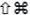NC（或选择**视图**  **调试区域**  **激活控制台**）打开控制台窗口。反派字典的输出格式使得你可以看到每个键及其关联的值。你应该能够找到 Name 键，并看到其值已更改为你输入的新值。

我们其余的大多数操作方法都与 `takeName:` 方法类似，应该是不言自明的。它们每个都只是完成我们在 `updateDetailViews` 方法中所做工作的逆过程，从 GUI 中获取值并将其应用到我们的模型对象中。以下是所有“简单”操作方法的代码：

```objectivec
- (IBAction)takeLastKnownLocation:(id)sender {
    [self.villain setObject:[sender stringValue] forKey:kLastKnownLocation];
    NSLog(@"current villain properties: %@", self.villain);
}

- (IBAction)takeLastSeenDate:(id)sender {
    [self.villain setObject:[sender dateValue] forKey:kLastSeenDate];
    NSLog(@"current villain properties: %@", self.villain);
}

- (IBAction)takeSwornEnemy:(id)sender {
    [self.villain setObject:[sender stringValue] forKey:kSwornEnemy];
    NSLog(@"current villain properties: %@", self.villain);
}
```


- (IBAction)takePrimaryMotivation:(id)sender {  
    [self.villain setObject:[[sender selectedCell] title]  
        forKey:kPrimaryMotivation];  
    NSLog(@"当前反派属性: %@", self.villain);  
}  

- (IBAction)takePowerSource:(id)sender {  
    [self.villain setObject:[sender title] forKey:kPowerSource];  
    NSLog(@"当前反派属性: %@", self.villain);  
}  

- (IBAction)takeEvilness:(id)sender {  
    [self.villain setObject:[NSNumber numberWithInteger:[sender  
        integerValue]] forKey:kEvilness];  
    NSLog(@"当前反派属性: %@", self.villain);  
}  

- (IBAction)takeMugshot:(id)sender {  
    [self.villain setObject:[sender image] forKey:kMugshot];  
    NSLog(@"当前反派属性: %@", self.villain);  
}  

```  
将所有这些代码输入到 `VillainTrackerAppDelegate` 的 `@implementation` 部分，然后编译并运行应用。现在，我们应该能够编辑到目前为止处理的所有字段，并在输出日志中看到它们的值发生变化。要为头像设置图片，只需从 Mac 上的任意位置拖拽任意图片（来自 Finder 的图片文件、iPhoto 中的照片、Safari 中的图片等）并将其放入头像视图中。

请注意，对于 `swornEnemy` 组合框和 `primaryMotivation` 单选按钮矩阵，虽然设置值的步骤稍显复杂，但从它们中检索值却非常简单，只需一行代码即可完成。

剩下的复杂视图——Powers 复选框矩阵，检索值也稍微复杂一些，因为我们需要找到所有选中的复选框并获取其关联的字符串。以下代码可以完成此任务：

```  
- (IBAction)takePowers:(id)sender {  
    NSMutableArray *powers = [NSMutableArray array];  
    for (NSCell *cell in [sender cells]) {  
        if ([cell state]==NSOnState) {  
            [powers addObject:[cell title]];  
        }  
    }  
    [self.villain setObject:powers forKey:kPowers];  
    NSLog(@"当前反派属性: %@", self.villain);  
}  
```  

编译并运行应用，在 Powers 矩阵中点击各个复选框，输出日志应该会相应地更新。

最后，我们需要实现一个方法，用于从 Notes 视图（即`NSTextView` 的实例）中检索值。`NSTextView` 提供了许多委托方法，让我们能够根据用户编辑文本时的操作执行多种不同操作。我们将采用一种非常简单的方法：每次用户编辑文本时（即每次按键后！）都获取值的副本。对于大型文档视图，这样做可能过于极端（且效率极低），需要考虑性能影响；但对于旨在容纳少量笔记的小型文本视图，这种简单方法不会带来任何问题：

```  
- (void)textDidChange:(NSNotification *)aNotification {  
    [self.villain setObject:[[self.notesView string] copy] forKey:kNotes];  
    NSLog(@"当前反派属性: %@", self.villain);  
}  
```  

这里发生了一件不寻常的事情：我们正在创建从 `notesView` 的 `string` 方法返回结果的副本。这样做的原因是，在内部，`NSTextView` 会保留自己的字符串用于编辑和显示，而其 `string` 方法实际上返回的是指向该内部字符串对象的指针。如果我们不创建副本，该字符串将被我们的 `villain` 直接引用，这可能会导致之后在这些 GUI 对象显示不同反派时出现混乱。最终，多个反派会引用同一个字符串，编辑任何一个反派的笔记都会同时修改所有反派的笔记！`NSTextField` 不会引起此类问题，因为其 `stringValue` 方法返回的是副本，而非内部字符串对象。

另需指出的是，我们实现的 `NSTextView` 委托方法有一个奇特的方法签名，并且传递了一个 `NSNotification` 作为参数。

这里我们看到了 Cocoa 中通用通知系统的一点影子。使用名为 `NSNotificationCenter` 的类，我们可以配置任何对象在特定事件发生时接收来自其他对象的通知。当我们为 `NSTextView` 设置委托时（仅举一例，其他一些类也存在此模式），我们可以选择实现的一些委托方法是委托专有的，只能在该处实现；但其中一些是此类通知方法，理论上也可以在能够访问 `NSTextView` 并已配置好接收其通知的任何其他类中实现。我们将在本书后面更详细地讨论此主题。

## 总结

本章涵盖了大量的内容。我们学习了对任何 Cocoa 应用都至关重要的一些基础知识：如何在应用启动时执行我们自己的初始化代码；如何使用 Xcode 的 Interface Builder 编辑器在窗口中布局视图，包括指定调整大小行为；如何使用各种 Cocoa GUI 类的基础知识；等等。在下一章中，我们将以目前所做的工作为基础，扩展 VillainTracker 应用，使其能够处理表格中列出的一系列反派。

# 第 6 章：使用表格视图

第 4 章和第 5 章涵盖了一些 Cocoa 最常用的 GUI 组件，从按钮和简单的输入字段到功能齐全的文本编辑器。我们还没有谈到 Cocoa 最大、最复杂的视图类之一：`NSTableView`。本章将介绍如何使用 `NSTableView` 来显示整个组件集合的数据，如何响应用户通过点击行来更改表格选择，以及如何直接在表格中编辑值。

我们将通过扩展第 5 章中的 VillainTracker 应用来学习如何使用表格视图。本章将要创建的 VillainTracker 新版本将维护一个反派数组，在一个表格中显示所有反派，并允许用户点击表格中的条目来编辑所选反派的所有属性。我们将从使用 Xcode 扩展 `VillainTrackerAppDelegate` 类的接口开始，使其包含一个反派数组。既然无论如何都要处理这段代码，我们还将研究通过手动添加一些新出口的方法，用于连接新的表格视图和窗口本身，以及用于添加和删除反派的操作方法。然后，我们将在 Interface Builder 模式下扩展 nib 文件，添加一个表格视图并进行连线。之后，我们将返回 Xcode 修改控制器的实现以处理表格。图 6-1 显示了最终结果。


图 6-1. 完成的应用窗口

在前面的章节中，我们通过从 GUI 控件拖拽到代码中，并让 Xcode 生成相应的存根来创建新的出口和操作。在本章中，由于我们是在扩展现有代码，我们将手动创建存根。这两种方法都是完全有效的，了解这两种方法可以让您根据情况选择最方便的一种。

### 为处理多个反派准备 VillainTrackerAppDelegate

在 Xcode 中，打开我们在第 4 章创建的项目，导航到 `VillainTrackerAppDelegate.h`，以便更新类的接口以适应即将进行的更改。首先，我们将添加所需的新实例变量。因为我们要维护一个反派列表，所以我们将创建一个名为 `villains` 的 `NSMutableArray` 来包含所有反派。我们还将添加一个名为 `villainsTableView` 的出口，以便访问我们即将用来展示反派列表的 `NSTableView`。

我们还将添加 `newVillain:` 和 `deleteVillain:` 的声明，这是我们两个新的操作方法。


下面的代码展示了进行这些更改后`VillainTrackerAppDelegate.h`的状态（新增的行以**粗体**显示）：

```objectivec
#import <Cocoa/Cocoa.h>

@interface VillainTrackerAppDelegate : NSObject <NSApplicationDelegate>

@property (assign) IBOutlet NSWindow *window;
@property (weak) IBOutlet NSTextField *nameView;
@property (weak) IBOutlet NSTextField *lastKnownLocationView;
@property (weak) IBOutlet NSDatePicker *lastSeenDateView;
@property (weak) IBOutlet NSComboBox *swornEnemyView;
@property (weak) IBOutlet NSLevelIndicator *evilnessView;
@property (weak) IBOutlet NSMatrix *powersView;
@property (weak) IBOutlet NSPopUpButton *powerSourceView;
@property (weak) IBOutlet NSMatrix *primaryMotivationView;
@property (weak) IBOutlet NSImageView *mugshotView;
@property (unsafe_unretained) IBOutlet NSTextView *notesView;
@property (weak) IBOutlet NSTableView *villainsTableView;

@property (strong) NSMutableDictionary *villain;
@property (strong) NSMutableArray *villains;

- (IBAction)takeName:(id)sender;
- (IBAction)takeLastKnownLocation:(id)sender;
- (IBAction)takeLastSeenDate:(id)sender;
- (IBAction)takeSwornEnemy:(id)sender;
- (IBAction)takeEvilness:(id)sender;
- (IBAction)takePowers:(id)sender;
- (IBAction)takePowerSource:(id)sender;
- (IBAction)takePrimaryMotivation:(id)sender;
- (IBAction)takeMugshot:(id)sender;

- (IBAction)newVillain:(id)sender;
- (IBAction)deleteVillain:(id)sender;

@end
```

这些新声明的结构与上一章中我们通过控制拖拽到`VillainTrackerAppDelegate`类时，Xcode 生成的属性和方法相同。Xcode 会注意到这些代码已被添加，并且这些输出口和操作方法与 Xcode 生成的同样有效。实际上，请注意代码编辑器窗格左边距中出现的小圆圈。这些圆圈是我们可以通过控制拖拽连接到的端点，这表明 Xcode 识别了我们所做的事情，即创建了一个输出口或操作方法。在布局用户界面时，通过控制拖拽来创建它们非常方便，因为我们可以同时建立连接并创建存根。然而，在调整现有代码时，手动操作可能更快。

现在，我们将在`VillainTrackerAppDelegate.m`中为新的操作方法添加两个方法实现（目前只是空壳）。将这些行添加到`@implementation VillainTrackerAppDelegate`部分：

```objectivec
- (IBAction)newVillain:(id)sender {}
- (IBAction)deleteVillain:(id)sender {}
```

现在，我们已经向`VillainTrackerAppDelegate`的接口添加了所需内容，并向实现添加了一些空的存根方法。点击“运行”按钮以确保编译无误，然后我们将继续调整 GUI，为表格腾出空间。

## 为表格视图腾出空间

在 Xcode 的*项目导航器*面板中，单击`MainMenu.xib`以在 Interface Builder 模式下打开它（我们也可以双击`MainMenu.xib`文件在新窗口中打开它）。我们将放大窗口，添加一个表格视图和几个按钮，重新组织布局，并调整所有`NSBoxes`的调整大小特性，以便表格视图可以在两个维度上完全调整大小，而其他盒子将相应地移动。

首先调整窗口大小，使其宽度增加约 300 像素（大约是原来宽度的一半），但高度保持不变。我们将遵循西方从左到右的阅读习惯来安排布局，使得左侧的选项（在表格视图中）决定右侧显示的内容（所有其他视图），因此您还应该将所有现有视图拖到窗口的右侧。请参见图 6-2 了解目标布局。在选中窗口的情况下，打开*属性检查器*（4），并勾选“调整大小”复选框。


图 6-2. 使您的窗口看起来像这样，为表格视图做准备

现在，在*实用工具*区域（它可能折叠在*检查器*窗格下方）中打开*对象库*窗格（4），然后在搜索字段中输入“table”。搜索结果之一应该是“表格视图”，它是包含在`NSScrollView`中的`NSTableView`类的一个实例。将“表格视图”拖到窗口左上方空间，让蓝色参考线出现，将其定位到距离窗口边框的推荐距离。表格视图的默认大小比我们放置它的空间小得多，但暂时不要调整它来填充可用空间，我们稍后会处理。

我们要对这个表格视图做的第一件事是配置其列。默认情况下，新的表格视图有两列，但我们希望它有**三列**，以便在列表中显示每个反派的名字、最后一次出现日期和头像。要添加一列，我们必须“深入”浏览几层视图。打开*属性检查器*（4）以帮助导航；它总是显示关于所选对象的一些信息，最关键的是类名。第一次单击窗口中的表格视图时，我们会看到*属性检查器*顶部显示“滚动视图”。这是因为我们从库中拖出的表格视图实际包含在`NSScrollView`中。再次单击，检查器将显示“表格视图”。

检查器中可见的属性之一是列数。将其从 2 改为 3。当列数更改时，表格视图中会短暂闪过一个水平滚动条，但很容易错过。除了那个闪烁和表格标题边缘的调整大小栏提示外，表格视图在视觉上并不会真正反映现在有三列；我们稍后会处理这个问题。同时，还需要对表格视图进行另外两项更改。第一项是将*列调整大小*行为从“仅调整最后一列大小”更改为“仅调整第一列大小”。我们的第一列将存放反派的名字，而反派名字的宽度比日期或头像变化更大，因此我们希望调整大小时扩展该列。默认情况下，用户将能够随意调整列宽。

第二项是使用列数上方的弹出菜单，将表格视图的*内容模式*从基于单元格更改为基于视图。请注意，表格中占位符的名称已从“文本单元格”变为“表格视图单元格”。不幸的是，`NSTableView`中最初显示的对象的命名有点令人困惑。文本单元格是`NSTextFieldCell`，它是`NSCell`的子类。然而，表格视图单元格是`NSTableCellView`的实例，它是`NSView`的子类，而不是`NSCell`，尽管默认标题中使用了“cell”一词。在本书中，我们使用表格视图所做的一切都将基于视图的表格视图。

**注意** 我们在上一章中简要介绍了单元格。这里提供更多背景信息。在 33Mhz 处理器被视为快速的时代，AppKit 的设计者发现为矩阵或表格中的每个单元格使用单独的视图对象开销太大。为了解决这个问题，他们为这些用户界面部分发明了“单元格”对象的概念。单元格只是表示控件状态的数据承载对象，具有自己的目标和操作输出口，但没有绘图、文本管理和事件管理的开销。单元格不是`NSView`的子类，这使它们成为更轻量级的对象。这意味着基于单元格的用户界面控件必须处理视图（实际可以在屏幕上绘制并响应用户操作）与单元格（不能）之间的状态协调。


好的，作为一名高级文档工程师和翻译员，我将严格遵循您提供的注意事项和示例格式，将给定的英文文本翻译成中文。


在 iOS 中，这种分离已不复存在，苹果似乎也在将 Cocoa 推向这个方向；`NSTableView` 现在支持使用单元格（像传统 Cocoa 一样）或视图（像 iOS 一样）作为其子视图。`NSMatrix` 目前尚未支持此功能，但未来版本可能会实现。让我们看看能否找到第三列。在窗口中的表格视图外单击以取消选中它，然后再次单击表格视图以选中包含它的滚动视图。你的 Xcode 中的 Interface Builder 窗格应类似于图 6-3。单击表格视图的右边缘并稍稍展开，使所有三列都可见。继续展开，直到它卡入到旁边显示反派基本信息的信息框位置。出现蓝色参考线，其向下延伸的范围仅与基本信息框大小一致。


图 6-3：我们选中了滚动视图

最后一列需要进行一些额外配置，因为它将显示图像而非文本。幸运的是，Cocoa 提供了一个类来简化此操作。在实用工具区域中，打开*标识检查器*（3），以便我们看清当前位置。单击最后一列，直到选中表格视图单元格。可能需要点击四次才能到达——依次穿过滚动视图、表格视图、表格列和表格单元格视图。到达后，我们会在*标识检查器*中看到 `NSTableCellView` 作为类名。然而，在费尽周折选中它之后，是时候删除它了。按下 Delete 键将其删除。我们将用一个图像井来替换它。在*对象库*搜索框中输入 Image，顶部项应是一个图像井。将其从*对象库*拖拽到表格视图的第三列。当鼠标移到一个可放置的位置时，光标应变为绿色加号，并且该列会以蓝色边框高亮显示。松开鼠标按钮，搞定！该表格列现在已准备好显示图像。

由于图像井比其他两列的表格视图单元格视图更高，请将每个表格视图单元格的大小调整为与图像井相同的高度。它们的高度都应设置为 48 点。要调整大小，请单击每列中显示“Table View Cell”的文本，直到表格视图单元格本身变为蓝色，并在底部显示一个调整手柄。向下拖拽调整手柄，会弹出一个实用工具窗口，显示当前尺寸。

在完成表格视图的处理之前，我们需要配置这些表格列的标识符，使其与反派对象中的 `name`、`lastSeenDate` 和 `mugshot` 值相对应。具体做法是为每一列提供一个与要显示的属性键名相同的标识符。稍后，我们将在代码中看到如何利用此标识符轻松准备要显示的值。通过单击表格视图中“Table View Cell”文本下方的空白区域，选中第一列。在*标识检查器*（3）中，`NSTableColumn` 应为类名。在 Identifier 字段中输入“name”。切换到*属性检查器*（4），在 Title 字段中输入“Name”；这将决定列标题中显示的文字。对第二列重复此过程，输入“lastSeenDate”作为标识符，“Last Seen”作为标题。再对第三列重复，输入“mugshot”作为标识符，“Mugshot”作为标题。

现在，我们要添加两个按钮，一个用于在列表中添加新反派，另一个用于删除选中的反派。回到*对象库*窗格，在搜索字段中输入“button”；结果中会显示数量惊人的按钮列表。苹果公司里一定有非常喜欢设计按钮的人！

尽管外观各不相同，但此列表中的几乎每个按钮本质上都是一个 `NSButton`，其核心功能始终相同。其中一些按钮被预配置为不同的模式，以用作复选框或展开三角形，但除此之外，它们的基本功能都一样：在被点击时，调用目标对象中的操作方法。从列表中选择前几个按钮之一（例如“Push Button”或“Rounded Rect Button”），将其拖拽到我们的窗口中，放在表格视图的正下方。这将作为我们的“添加反派”按钮。我们不直接用文本“Add Villain”作为按钮标题，而是使用 Cocoa 内置的图形图像，使其外观类似于其他应用程序中的添加按钮。在按钮仍处于选中状态时，调出*属性检查器*，找到*图像*组合框。单击组合框右侧的小三角形，开始输入“nsaddtemplate”。当你看到它自动补全为“NSAddTemplate”时，按回车键，你会看到新按钮上现在显示一个 + 图标，叠加在“Add Villain”标签上。在*图像*组合框下方是另一个标注为*替代*的组合框。将其也设置为“NSAddTemplate”。再下方是一组标注为*位置*的按钮，用于指示图像（显示为正方形）相对于按钮标题（显示为一条线）的位置。选择一个只显示正方形而不带文字的项目，按钮标题将消失。水平调整按钮大小，使其刚好能容纳图像，然后复制该按钮（按 D）以创建另一个按钮。选中这第二个按钮，再次转到*属性检查器*中的*图像*组合框，开始输入“nsremovetemplate”，这将在按钮中提供一个减号（-）图标。同样地，也将*替代*图像设置为“NSRemoveTemplate”。

现在，选中添加按钮，将其拖拽到窗口底部边缘的正上方，利用蓝色参考线使其左边缘与表格视图的左边缘对齐，底部边缘与窗口底部保持建议的距离。将删除按钮拖放到添加按钮的右侧——它会自动吸附到与添加按钮合适的间距位置。调整表格视图的大小，使其填满窗口中剩余的空间。此时窗口应类似于图 6-4。


图 6-4：表格视图已放置在我们期望的位置

我们需要在刚添加的按钮与 `VillainTrackerAppDelegate` 对象之间建立一些连接，以便当用户点击按钮时，`VillainTrackerAppDelegate` 对象能收到通知。经过最近几章的学习，你可能已经猜到该如何操作了。选中带加号的按钮，按住 Control 键从该按钮拖出一条连接线，连接到 Interface Builder 区域左侧 dock 中的 `VillainTrackerAppDelegate` 对象。将出现一个实用工具窗口，其中列出了 `VillainTrackerAppDelegate` 暴露的所有可用操作。选择我们之前添加的 `newVillain:` 操作。接下来，选中带减号的按钮，按住 Control 键拖出一条连接线到 `VillainTrackerAppDelegate`。这次，选择 `deleteVillain:` 操作。

我们还需要在 `VillainTrackerAppDelegate` 和表格视图之间建立连接。选中左侧 dock 中的 `VillainTrackerAppDelegate`，按住 Control 键从它拖出一条连接线到表格视图。当鼠标经过表格视图时，它会高亮显示。松开鼠标，会显示一个可用输出口的列表。选择 `villainsTableView`。现在，我们需要从反方向建立两个连接，即从表格视图连接到 `VillainTrackerAppDelegate`。选中窗口中的表格视图（需要点击两次，才能从滚动视图向下深入到表格视图）。


从表格视图（Table View）按住 Control 键拖拽至 `VillainTrackerAppDelegate`，然后从选项列表中选择 `dataSource`。接着重复操作，这次选择 `Delegate`。如此一来，连接便已就绪！

现在来看看它在运行时的表现如何。点击 Xcode 窗口左上角的“运行”按钮。试着拖动窗口的右下角来调整大小，看看会发生什么。小心，因为接下来是……

## 糟糕的调整大小意外，或者说，约束来救场！

第一次运行重新布局后的程序时，你很可能看到像图 6-5 那样相当难看的画面。这是通过调整大小手柄垂直拉伸窗口并水平缩小的结果。观察图片中的窗口，表格视图状态良好，“能力与属性”框和“主要动机”框也是如此。“外观”框向下扩展了。“备注”框水平缩小了，“基本信息”框也一样。实际上，“基本信息”框简直一团糟。你的布局可能会以不同于图示的方式崩溃，但很可能无法完全按你预期的方式工作。你可能希望使用本章提供的源代码来进行试验。

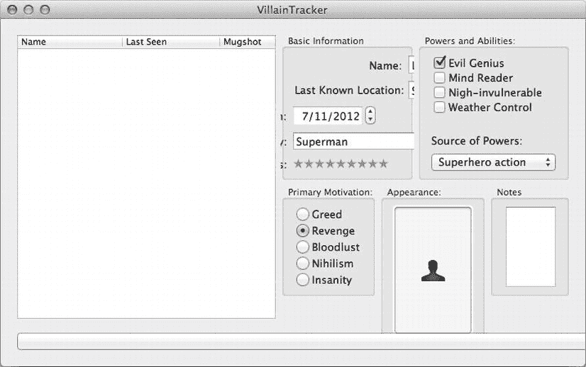

图 6-5。唉！这可不美观

在修复这个问题之前，让我们先想想我们希望达到的效果。对于这个程序，我们希望上一章的所有原始 UI 元素（`NSBoxes` 中的所有项目）保持相同大小，并固定在窗口右侧。两个新按钮应保持相同大小，彼此间距不变，并固定在窗口左侧表格视图的下方。新表格视图应在窗口扩展时同时垂直和水平扩展，它应紧贴窗口左侧，并且在任何方向上都不能缩小到当前尺寸以下。表格视图右侧的几个框应与表格视图保持距离。

为了实现这一切，我们必须了解 Cocoa 如何处理大小调整。从 Mac OS X Lion 开始，大小调整通过一个名为 Cocoa 自动布局（Cocoa Auto Layout）的系统进行。自动布局中的调整行为使用带优先级的约束来指定，这意味着你可以声明视图的最小或最大尺寸、需要保留的子视图之间的关系、视图与其父视图之间的关系等等。当用户调整窗口大小时，约束满足引擎会根据优先级顺序动态尝试确定最佳布局，以尽可能保留约束。这些约束还处理用户界面在从右到左书写系统（如阿拉伯语和希伯来语）中的行为。

每个约束都表达一种关系，例如“等于”、“小于”或“大于”，以及一对视图或一个视图与一个常量。一个非常简单的约束是“`myButton` 的宽度 = 87”。显然，这会将按钮宽度固定为 87 点。约束不必是等式；一个有效的约束可以是“`myButton` 的高度 >= 32”，这表示按钮的高度不能小于 32。系统会更倾向于较小尺寸而非较大尺寸；一个宽度必须大于或等于 32 的按钮通常会是 32（满足不等式的最小值）。

更复杂的一对约束如下：“`myButton` 的前边缘与窗口前边缘之间的水平间距 = 10”和“`myButton` 的后边缘与窗口后边缘之间的水平间距 = 15”。为了在调整大小时保持这两个约束成立，按钮需要随窗口一起放大和缩小。注意，我们使用了“前”和“后”而非“左”和“右”。在从左到右的书写系统中，前边缘是左侧。然而，在从右到左的书写系统中，前边缘是右侧。

每个约束还有一个优先级，范围从 1 到 1000。优先级高的约束会在优先级低的约束之前被满足，如果两个冲突的约束无法同时满足，优先级高的胜出，优先级低的会被违反。例如：“`myButton` 的宽度 >= 32，优先级 1000”和“`myButton` 的宽度 = `someField` 的宽度 - 40，优先级 750”。只要 `someField` 的宽度大于 72，这两个约束都能得到满足，`myButton` 将比 `someField` 小 40 点。然而，如果 `someField` 缩小到低于 72 点，优先级高的约束将胜出，`myButton` 将不再缩小。

每个视图还具有内容拥抱优先级（Content Hugging Priority）和内容压缩阻力优先级（Content Compression Resistance Priority）。这些属性描述了视图如何相对于最合适的尺寸（即其固有尺寸）进行大小调整。对于按钮而言，固有尺寸是显示其标签（以及图标，如果适用）而不发生裁剪所需的尺寸。内容拥抱控制视图在被要求大于其固有尺寸时如何调整大小。压缩阻力控制视图在被要求小于其固有尺寸时如何调整大小。通常，这些优先级的默认值是不错的选择，在本章中，我们将保持它们不变。

## 创建和编辑约束

Interface Builder 允许我们指定控制每个视图调整大小行为的约束。事实上，我们一直通过 Interface Builder 在我们拖动新控件到窗口时显示的蓝色虚线引导线来做到这一点。约束最初是在 Interface Builder 中根据控件定位时高亮显示的蓝色引导线创建的，并且如果控件被重新定位，约束可能会改变。例如，当我们把表格视图拖到窗口右上角时，当我们靠近边缘时会出现一条垂直和水平的蓝色虚线。这表明表格视图应固定在该角落，并创建一对约束，指示表格视图应与窗口顶部和左边缘保持恒定距离。像我们这样的复杂窗口，可能包含几十个约束。

为了确定哪些约束合适，我们首先需要决定窗口的适当调整行为。针对我们的窗口，假设我们希望新的表格视图在窗口放大时同时水平和垂直调整大小。我们希望所有框保持大小不变，并在用户调整窗口时向右侧弹性移动。最后，我们希望按钮保持彼此相同大小，并固定在窗口底部。我们需要设置新的约束来实现这一点，并可能移除一些非预期的约束。顺便提一下，处理调整大小是一个迭代过程。结合在 Interface Builder 模式下试验窗口调整大小以及使用 Xcode 中的“模拟文档”功能进行试错，通常是打磨它的方法。花时间试验调整大小并观察约束如何交互，将比你从书本中读到的任何内容都更能加深你的理解。

这些约束可以在 Xcode 内部进行编辑；我们可以在屏幕上、实用工具区域（Utility area）的“大小检查器”（Size Inspector）中以及 Interface Builder 窗格左侧边缘的图标停靠栏中看到它们。选择隐藏在 Interface Builder 窗格左下角的小展开三角形，图标停靠栏将展开，显示窗口中视图的完整层次结构。每个视图都有一组关联的约束，而我们的窗口有很多视图。在实用工具区域中，选择“大小检查器”（

**图 6-6.** 外观框的调整大小约束

在**尺寸检查器**中，我们可以看到影响外观框的九个约束，至少到目前为止我们是这样布局的。（根据你布局窗口的方式，你的约束可能顺序不同或常量略有不同。）每条从该框延伸出的蓝线也代表一个与另一个视图相关联的调整大小约束。并非所有约束都与另一个视图相关，因此实际激活的约束比蓝线可视化的要多。

外观框的问题在于，当窗口在调整大小过程中被拉长时，它会向下扩展，同时拉长图像视图。查看**尺寸检查器**中的约束列表，其中一条显示为“与父视图的底部间距等于：29”。此约束意味着外观框的底部应保持在窗口底部上方 29 点处。另一个与垂直大小相关的约束显示为“与框的顶部间距 – 基本信息等于：默认”。这意味着该框的上边缘应保持与基本信息框底部的系统默认距离。约束左侧的紫色图标表示这些是系统创建的约束——即我们之前在 Interface Builder 中定位该框时设置的约束。当我们之前将外观框对齐到窗口底部附近出现的蓝色参考线时，我们隐式地创建了那个底部间距约束。然而，如果我们点击底部间距约束旁的齿轮图标，会发现**删除**菜单项是禁用的。要删除它，我们需要换个思路。

让我们稍微试验一下。在 Interface Builder 中，抓住窗口底部并向下拖动以放大它。外观框确实在垂直方向上变大了。底部间距约束导致该框增长，以保持距离窗口底部 29 点。将窗口重新调整回 364 点高度以恢复所有内容（或者松开鼠标然后按撤销（Z）来撤销调整大小操作）。

既然我们不能直接删除外观框上的约束，我们将改变导致系统最初创建它的条件，我们通过利用（或避免使用）蓝色参考线来实现这一点。最简单的方法是将外观框从窗口底部边缘移开。请按照以下步骤操作：

1.  创建一个新的约束来保持外观框的当前大小。为此，选择该框，然后从菜单栏中选择**编辑器**  **固定**  **高度**。
2.  将外观框移至窗口顶部附近，远离底部。这将移除将框底部固定在窗口底部的约束。
3.  向下缩小窗口以腾出更多空间。
4.  将外观框放回原位，使其框标题与窗口底部区域的其他两个框对齐，并在它们之间均匀间隔。由于窗口底部更远了，我们应该避免创建该约束。窗口应该看起来像图 6-7。
5.  将窗口调整回原来的大小。


**图 6-7.** 重新布置外观框的约束

当垂直调整大小时，窗口的行为符合我们的预期。

现在，在水平调整大小方面，我们有两个问题需要处理：表格视图没有伸缩，但最右边的两个框（备注，以及能力和特性）却在伸缩。我们可以通过选择**编辑器**  **模拟文档**来检查是否出现这种情况。

我们先检查表格视图。在 Interface Builder 中选择表格视图，查看其约束。没有前导或尾随间距约束会固定其大小，所以问题一定出在右边的两个框上。因为我们希望它们保持大小，而不是在窗口调整大小时扩大，所以选择能力和特性框，然后选择**编辑器**  **固定**  **宽度**。对所有其他框执行相同操作。

选择**编辑器**  **模拟文档**并尝试水平调整大小。窗口完全不动了。我们有一些约束固定了布局，需要找出并移除它们。对于每个框，查看**尺寸检查器**中列出的约束，找到那些说“到父视图的前导间距”且值为任意值的约束。你可以通过选择该框并查看是否有从左边缘延伸到窗口边缘的蓝线来判断这些约束是否存在。删除那些可删除的约束，可以通过从框的**尺寸检查器**中该约束条目的齿轮图标下的菜单选择**删除**，或者选择蓝线并按**删除**键。

移除所有约束后，再次选择**编辑器**  **模拟文档**并尝试水平调整大小。这次窗口应该按我们期望的方式调整大小，如图 6-8 所示。

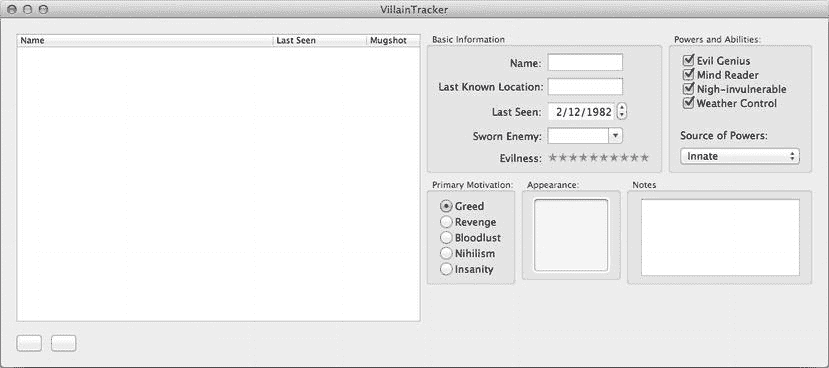

**图 6-8.** 终于，调整大小成功了！

在继续实现代码之前，这里还有几点关于调整大小的补充说明。调试调整大小问题几乎总是一个迭代、试错的过程。我们在这里已经触及了一些可行的方法：

*   在 Interface Builder 中调整窗口大小，观察各元素相对于窗口如何调整。
*   如果窗口设计已经演变，尝试移动用户界面元素以重置约束。
*   尝试使用“模拟文档”功能并进行实验。
*   通过蓝线和尺寸检查器，查看 Interface Builder 中约束的可视化表示。

关于约束和 Cocoa Auto Layout 还有很多要学习的内容；这些只是基础。更多详情和调试技巧，请查阅 Apple Developer Connection 网站和 Xcode 文档中的 *Cocoa Auto Layout 指南*。

**注意**：Cocoa Auto Layout 是在 Mac OS X 10.7 中引入的。在此之前，调整大小是通过一种称为“弹簧和支柱”的机制来控制的，该机制控制视图相对于包含它们的窗口如何调整大小。在 10.7 及更高版本中，旧的弹簧和支柱调整大小行为会在后台转换为约束；应用程序可以同时包含使用约束的 nib 文件和使用弹簧和支柱的 nib 文件。但是，如果你遇到 2011 年之前的 Cocoa 代码，你几乎肯定会遇到不使用约束的 nib 文件。

## 为表格视图腾出空间：代码篇

连接建立完毕且调整大小问题已得到控制，我们现在可以将注意力转向驱动表格视图并响应“添加”和“移除”按钮点击所需的代码。为此，我们需要离开 Interface Builder 模式并回到我们的代码中。打开**项目导航器**（1），如果它尚未打开的话。单击`VillainTrackerAppDelegate.m`文件的条目，编辑器区域应从 Interface Builder 更改为一个显示我们对象代码的代码窗口。


## 章节标题：为反派数组添加支持

上一章的基础工作已经就绪，为反派数组添加支持的过程出奇地简单。基本流程是：我们先创建一个数组，在需要显示内容时告知表格视图（当内容发生变化时），实现几个 `dataSource` 方法来向表格视图提供数据，再实现一个 `delegate` 方法用于在表格视图选择项发生变化时被调用（这样我们就能更新所有其他视图以匹配所选反派）。最后，我们还会添加一对方法来实现向数组中添加和删除反派。大功告成！

首先，我们初始化一个用于存储反派的数组，并通知表格视图加载其内容。通过向 `applicationDidFinishLaunching:` 方法中添加如下代码（加粗部分）即可实现。首先创建一个包含所有反派的数组（初始时仅包含我们之前在代码中创建的第一个反派），并将其赋值给我们的反派实例变量。然后通知表格视图加载内容，并选中其第一行。

通知表格视图选择哪一行其实比表面看起来要复杂。我们使用的 `NSTableView` 方法名为 `selectRowIndices:byExtendingSelection:`。由于表格视图可以同时选中多行，且选中的行不必连续，因此该方法需要传入一个索引集合来指定要选中的行。在我们的场景中，只需要选中一行，因此我们动态构建一个仅包含单个元素的集合。

```
- (void)applicationDidFinishLaunching:(NSNotification *)aNotification {
    self.villain = [[NSMutableDictionary alloc] initWithObjectsAndKeys:
                    @"莱克斯·卢瑟", kName,
                    @"斯莫维尔", kLastKnownLocation,
                    [NSDate date], kLastSeenDate,
                    @"超人", kSwornEnemy,
                    @"复仇", kPrimaryMotivation,
                    [NSArray arrayWithObjects:@"邪恶天才", nil], kPowers,
                    @"超级英雄行动", kPowerSource,
                    @9, kEvilness,
                    [NSImage imageNamed:@"NSUser"], kMugshot,
                    @"", kNotes,
                    nil];
    /* 新增代码开始 */
    self.villains = [NSMutableArray arrayWithObject:self.villain];
    [self.villainsTableView reloadData];
    [self.villainsTableView selectRowIndexes:[NSIndexSet indexSetWithIndex:0] byExtendingSelection:NO];
    /* 新增代码结束 */

    [self updateDetailViews];
}
```

我们还需要在 `takeName:`、`takeLastSeenDate:` 和 `takeMugshot:` 方法的末尾添加 `[villainsTableView reloadData]` 调用，这样当用户编辑这些属性的控件时，表格视图会相应更新。只需复制该行代码并粘贴到每个方法的末尾即可。仅仅因为单个值发生变化就去调用一个看起来会重新加载整个数据表的方法，似乎有些过度，但请放心：`NSTableView` 采用*懒加载*机制，通常只在某行即将显示时才会请求该行的内容。即使你有上百万行数据，但只要不滚动到前 30 行之后，表格视图最多只会加载前 30 行。同理，通知表格视图重新加载数据只会立即加载可见行，其余行仅在滚动显示时才会重新加载。

至此，我们应该能够编译并运行应用，看到与上一章结束时大致相同的界面，只是多了一个空的表格视图和两个不起作用的按钮。是时候用反派来填充这个表格视图了！

## 表格视图需要辅助

我们已经通知表格视图加载内容，但在连接了表格视图 `dataSource` 和 `delegate` 输出的对象（即我们的 `VillainTrackerAppDelegate`）中，必须实现 `NSTableDataSource` 和 `NSTableViewDelegate` 协议中的某些方法，表格视图才能正常工作。`NSTableDataSource` 和 `NSTableViewDelegate` 是非正式协议，与大多数委托协议类似，这意味着我们无需声明类遵循这些协议。因此，在 Objective-C 中实现这些方法是可选的。尽管如此，表格视图要显示内容，实际上有几个方法是必需的：`NSTableViewDataSource` 中的 `numberOfRowsInTableView:` 和 `NSTableViewDelegate` 中的 `tableView:viewForTableColumn:row:`，这两个方法用于表格视图准备显示内容。以下是它们在 `VillainTrackerAppDelegate.m` 中的实现方式：

```
- (NSInteger)numberOfRowsInTableView:(NSTableView *)aTableView {
    return [self.villains count];
}

- (NSView *)tableView:(NSTableView *)aTableView
    viewForTableColumn:(NSTableColumn *)tableColumn
                   row:(NSInteger)row {

    NSMutableDictionary *thisVillain = [self.villains objectAtIndex:row];
    NSString *thisColName = [tableColumn identifier];

    NSView *result = nil;

    // 根据当前使用的列，我们需要执行不同的操作。
    // 通过 [tableColumn identifier] 调用 makeViewWithIdentifier 可以确保
    // 获取到已在 IB 中为该列配置好的视图，AppKit 会为我们管理这些。
    if ([thisColName isEqualToString:kName]) {
        NSTableCellView *thisCell = [aTableView makeViewWithIdentifier:thisColName owner:self];
        thisCell.textField.stringValue = [thisVillain objectForKey:kName];
        result = thisCell;
    } else if ([thisColName isEqualToString:kLastSeenDate]) {
        NSTableCellView *thisCell = [aTableView makeViewWithIdentifier:thisColName owner:self];
        thisCell.textField.stringValue = [thisVillain objectForKey:kLastSeenDate];
        result = thisCell;
    } else if ([thisColName isEqualToString:kMugshot]) {
        NSImageView *thisCell = [aTableView makeViewWithIdentifier:thisColName owner:self];
        [thisCell setImage:[thisVillain objectForKey:kMugshot]];
        result = thisCell;
    }

    // 返回结果。
    return result;
}
```

第一个方法不言自明：我们只需返回数组的大小，这样表格视图就知道需要显示多少行。第二个方法会在表格中每个单元格即将显示时被调用。表格视图会告诉我们它想显示哪个列和行索引。行索引与内容数组中相关对象的索引相同，因此调用 `[villains objectAtIndex:rowIndex]` 可以从反派数组中返回相应的模型对象。你可能还记得，我们使用的模型对象实际上是 `NSMutableDictionary` 实例，所有值都可通过键访问。在配置表格视图中每列的标识符属性时，我们使用了与模型对象相同的键名。根据列的标识符，我们通过 `makeViewWithIdentifier:owner:` 方法向表格视图请求创建该列对应的 `NSView` 子类实例。然后根据模型对象中的相应值配置该视图，最后将视图返回给表格视图。

例如，当 `名称` 列顶部单元格即将显示时，该方法会以 `rowIndex` 为 0 且 `TableColumn` 指向 `名称 NSTableColumn` 的参数被调用。


我们使用`0`来从`villains`数组中获取指定的反派，然后利用表格列标识方法的返回值`@"name"`，从选中的反派中检索对应的值。我们请求表格视图获取该列（该列已在 Interface Builder 中配置）的适当`NSView`实例，然后以该`NSView`支持的任何方式填充它。最后，返回该视图，表格视图会将其绘制出来。现在我们应该能够编译并运行 VillainTracker，并看到默认反派既显示在控件中，也作为表格视图的唯一一行显示。此外，如果我们编辑反派的名字、最后出现日期或头像，这些新值应能反映在表格视图中。然而，我们目前仍然只有一个反派，也无法追踪更多反派。让我们立即改变这一点。

## 添加更多反派

我们之前已存根了`newVillain:`方法。现在来实现它。`newVillain:`方法向反派数组添加一个新的“空”反派对象，通知表格重新加载，并告知表格视图选择哪一行（最后一行，因为这是我们刚刚添加的）。

```objectivec
- (IBAction)newVillain:(id)sender {
    [_window endEditingFor:nil];
    [self.villains addObject:[NSMutableDictionary dictionaryWithObjectsAndKeys:
        @"", kName,
        @"", kLastKnownLocation,
        [NSDate date], kLastSeenDate,
        @"", kSwornEnemy,
        @"Greed", kPrimaryMotivation,
        [NSArray array], kPowers,
        @"", kPowerSource,
        [NSNumber numberWithInt:0], kEvilness,
        [NSImage imageNamed:@"NSUser"], kMugshot,
        @"" , kNotes,
        nil]];

    [self.villainsTableView reloadData];

    [self.villainsTableView selectRowIndexes:[NSIndexSet indexSetWithIndex:[villains count]-1]
                      byExtendingSelection:NO];
}
```

这里唯一可能不熟悉的代码是第一个方法调用`[_window endEditingFor:nil]`。让我们看看它的两个部分。首先，`_window`实例变量从何而来？Xcode 通过一个声明的属性（在`VillainTrackerAppDelegate.h`文件中生成）为我们构建了它，并自动连接到窗口：

```objectivec
@property (assign) IBOutlet NSWindow *window;
```

由于我们没有通过`@synthesize`声明给出显式名称，Xcode 默认创建了一个带下划线前缀的实例变量。其次，我们在窗口上调用的方法是`endEditingFor:`。这简单地告诉窗口：是时候结束用户当前正在进行的任何其他编辑行为（例如在文本字段中打字）了。我们需要调用此方法，以便将编辑后的值“保存”到其底层反派对象中，因为稍后在`newVillain:`中，我们将更改表格视图的选择，这反过来可能会清空各个控件中显示的值！

## 选择一个反派

我们应用的详情部分仍然只显示列表中的第一个反派。为了更新详情视图，我们需要实现一个委托方法，该方法在表格视图选择发生变化时被调用。这让我们能注意到用户选择了哪一行，将我们的反派实例变量指向反派数组中的相应行，并重新显示所有其他控件以匹配新的选择。将以下方法添加到`VillianTrackerAppDelegate.m`的`@implementation`部分：

```objectivec
- (void)tableViewSelectionDidChange:(NSNotification *)aNotification {
    if ([self.villainsTableView selectedRow] > -1) {
        self.villain = [self.villains objectAtIndex:[self.villainsTableView selectedRow]];
        [self updateDetailViews];
        NSLog(@"current villain properties: %@", self.villain);
    }
}
```

请注意，该方法的核心部分被包裹在一个`if`子句中。这是必要的，因为表格视图可能告诉我们它当前没有任何选中的行，这通过从其`selectedRow`方法返回`–1`来表示。除此之外，你现在应该能理解其中的逻辑了。

现在编译并运行应用，会发现+按钮现在确实能产生效果，如图 Figure 6-9 所示。此外，我们应该能够点击表格视图中的不同反派，并看到其他控件中的值随之变化。


Figure 6-9. +按钮现在可以添加反派了

## 阻止你的邪恶行径！

能够删除反派会很不错。一旦我们的英雄说服某个反派停止作恶，我们可能想将其从数据库中移除。或者可能只是我们打错了字。无论如何，让我们添加删除反派的功能。我们已经存根了`deleteVillain:`方法，下面是该方法应实现的功能。（我们添加了注释来展示不同的部分，代码后将进行描述。）

```objectivec
- (IBAction)deleteVillain:(id)sender {

    // 第 1 部分：
    //
    [_window endEditingFor:nil];
    NSInteger selectedRow = [self.villainsTableView selectedRow];

    // 第 2 部分：
    //
    [self.villains removeObjectIdenticalTo:self.villain];
    [self.villainsTableView reloadData];

    // 第 3 部分：
    //
    if (selectedRow >= [self.villains count]) {
        selectedRow = [self.villains count]-1;
    }

    // 第 4 部分：
    //
    if (selectedRow > -1) {
        // 取消选中所有行，以确保表格视图认为选择已“更改”，
        // 即使可能仍然是同一行索引。

        // 第 5 部分：
        //
        [self.villainsTableView deselectAll:nil];
        [self.villainsTableView selectRowIndexes:[NSIndexSet indexSetWithIndex:selectedRow]
                          byExtendingSelection:NO];

        [self updateDetailViews];
    }
}
```

这个方法比本书到目前为止展示的大部分代码都要复杂一些，因此需要稍作额外解释。

在第 1 部分，我们告诉窗口完成任何正在进行的编辑，然后获取表格当前选中行的索引——即将要被删除的行。注意，我们已经知道选中了哪个反派（因为它存储在一个实例变量中），但拥有行索引对于确保删除后选择的合理性至关重要（我们将在第 4 部分处理）。

在第 2 部分，我们从`villains`数组中删除选中的对象（由`villain`属性指向），然后通知表格视图重新加载。请注意从数组中移除反派的方法`removeObjectIdenticalTo:`。此方法让`NSMutableArray`通过比较对象的实际内存地址与它所包含对象的地址来扫描自身，从而找到并只移除我们传入的精确对象。否则，如果我们使用更常用的`removeObject:`方法，它会通过发送`isEqual:`方法来比较对象，后者则比较值。在这种情况下，任何属性与选中反派相同的其他反派对象也存在被删除的风险。

在第 3 部分，我们做一个小调整。如果之前的选中行索引是数组中的最后一行，那么现在我们已经从数组中移除了一个对象，该索引就已越界。


此时，我们将其重置为指向当前最后一个对象。接下来，第 4 节检查`selectedRow`是否为 0 或更高。这个检查很重要，因为第 3 节确实有可能将其设置为-1！想象一下这种情况：数组中只有一个对象，然后点击“移除”按钮：起初`selectedRow`为 0（数组中唯一行的索引），但经过第 3 节后它将变为-1，第 4 节通过直接跳过方法剩余部分来处理这种情况。最后，第 5 节取消表格视图中的所有选中项，然后选中当前需要选择的行，最后根据当前选择更新所有视图。这看起来可能不明显，但先取消选中表格视图中的所有行很重要，否则`tableViewSelectionDidChange:`委托方法可能不会被总是调用（因为删除一行后，选中的行索引通常还是同一个数字，而表格视图无法知道我们已经从内容数组中删除了一个对象，导致该行索引现在指向了不同的对象）。

现在编译并运行应用程序；我们可以删除选中的反派，并且控件中的值将随之更新以匹配新的选中项。我们只剩下最后一个功能要实现。用户还不能直接在表格视图中编辑值。现在就来解决这个问题。

## 在表格视图中编辑

用户应该能够编辑反派的名字，或将新的头像拖拽到表格视图中的任意行，并更新相应的反派。由于表格视图的列是`NSViews`，表格视图中的每个单元格都可以在 Interface Builder 中指定目标和动作；表格视图内部的用户界面元素与其他视图的工作方式完全相同。当用户在表格视图中编辑值时，该动作可以连接到我们的代码，通知我们发生了更改。限制在于目标必须是表格视图的委托，但这对本应用程序来说不是问题。此外，我们现有的`takeName:`和`takeMugshot:`方法仍然可用，但需要做一些小的调整。这些方法针对选中的反派进行操作，但如果用户没有选中行（即选中反派），就无法在表格视图中编辑值。然而，这些方法目前只期望从详细信息视图中的控件调用，但现在我们增加了从多个位置进行设置的能力。对于本应用，我们将只允许在行内编辑名字和头像，并禁止编辑最后出现日期。

还有一个小障碍需要解决。默认情况下，表格视图单元格是不可编辑的。在 Xcode 中可以轻松更改此设置。

要建立连接，我们需要从每个列中的视图按住 Control 键拖拽到`VillianTrackerAppDelegate`实例。但是，表格视图单元格嵌套在窗口视图层次结构的较深层，因此我们将采用另一种方式来建立连接，这样更易于找到正确的用户界面组件。

回到 Xcode，打开`MainMenu.xib`文件，该文件将在 Interface Builder 画布中打开。点击屏幕左下角的小展开三角形，这将把屏幕左侧的对象停靠栏展开为窗口视图层次结构的轮廓。同时，打开实用工具区域中的*属性检查器*。

深入轮廓到`Name`列的文本字段；从外到内的路径是：Window – Villain Tracker  View  Scroll View – Table View  Table View  Table Column – Name  Table Cell View  Static Text – Table View Cell  Text Field Cell – Table View Cell。随着深入，您还会在编辑器画布上方的跳转栏中看到此路径。

点击**Text Field Cell – Table View Cell**，然后按住 Control 键拖拽到停靠栏中更下方的**Villain Tracker App Delegate**实例，如图 6-10 所示。出现实用工具窗口时，从动作列表中选择`takeName:`。在继续之前，查看*属性检查器*，也在图 6-10 中显示。有一个标记为 Behavior 的弹出菜单，当前值为 None。选择它并更改为 Editable。

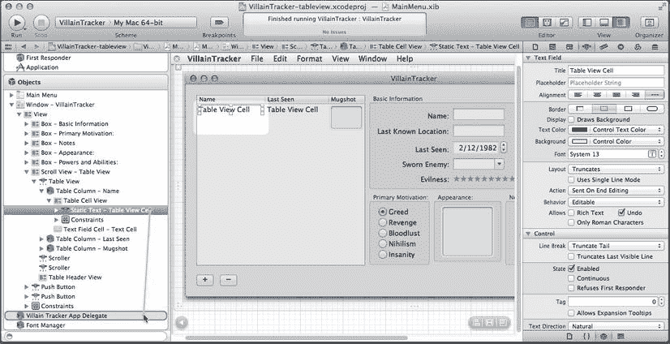

图 6-10. 使用停靠栏进行 Control 拖拽

最后，对图像井执行相同操作。到图像井的路径是：Window – Villain Tracker  View  Scroll View – Table View  Table View  Table Column – Mugshot  Image Well  Image Cell。从`Image Well`行（不是`Image Cell`行，而是它上面那一行）按住 Control 键拖拽到 Villain Tracker App Delegate，并选择`takeMugshot:`。要使图像井可编辑，*属性检查器*顶部附近有一个复选框。如果愿意，您还可以启用 Animates。如果反派头像包含动画信息或多帧，例如反派 MySpace 页面上的动图 GIF，则显示时会播放动画。

如前所述，`takeName:`和`takeMugshot:`方法都期望从详细信息视图中进行更新的控件调用。之前，我们在每个方法的末尾添加了对`[villainsTableView reloadData]`的调用。现在我们需要在之后添加另一个调用。在`takeName:`和`takeMugshot:`中，在末尾添加对`[self updateDetailViews]`的调用。这确保了无论用户在何处进行编辑（在表格视图或详细信息视图中），更改都会在两个位置得到反映。

是时候再次编译并运行应用程序，看看我们是否能在表格视图中编辑了。此时，我们应该能够添加新的反派、编辑其属性，然后将其删除。我们仍然无法保存关于反派的任何信息；这将是下一章的主题。

## 总结

本章通过一个简单的示例，演示了如何维护一个项目列表、在表格视图中显示它们，并在独立的控件集中编辑选中项的详细信息。我们学习了关于`NSTableView`如何使用其`dataSource`来访问显示和编辑的项目，并了解了当选择发生变化时，它如何通知其委托，从而使我们能够手动更新依赖于表格视图选择的其他视图中的内容。

如果您熟悉其他桌面 GUI 开发环境，其中一些内容可能看起来有些陌生，但我们希望您能看到 Cocoa 所支持方法中的一些优势，例如在代码和 GUI 布局之间提供了清晰的划分。然而，此时我们需要坦白：到目前为止我们所采用的方式并不一定是 Cocoa 中处理这类事情的最佳方法。尽管目前一切都很简单，但实际上我们一直是在向您展示解决这些问题的笨办法！在过去几年中，一种新的 GUI 编程方法已经在 Cocoa 社区中扎根，并且变得越来越普遍。这项技术称为 Cocoa 绑定，它是第 7 章的主题。

# 第 7 章 Cocoa 绑定

第 5 章和第 6 章介绍了如何将控制器对象连接到各种视图对象，既用于显示值，也用于响应用户动作来获取新值。


```markdown

在我们的示例中，通常每个视图有一个小的操作方法（当用户编辑视图中显示的值时触发），外加一个庞大的`updateDetailViews`方法来一次性更新所有视图的内容（每当选择发生变化时调用）。这对于简单的项目来说没问题，但这种方法存在一些问题。首先，存在可扩展性问题。假设不是十个视图，而是有一百个视图。按照这种方法，我们最终会得到一个控制器，它有一百个小的操作方法，以及一个*庞大的*方法，用于将值推送到所有视图中！此外，我们的控制器与其关联视图之间确实存在紧密耦合。例如，如果我们最初使用`NSDatePicker`来显示和编辑日期，但后来决定改用`NSTextField`，该怎么办？除了修改图形用户界面，我们还必须更改输出口、相应的操作方法以及`updateDetailViews`方法。

幸运的是，Apple 早已认识到这个问题，自 Mac OS X 10.3 起，它加入了一项名为 *Cocoa bindings* 的技术，解决了其中的许多问题。Cocoa bindings 让我们可以使用 Interface Builder 来配置视图，使其或多或少自动地检索其值并将更改传回模型对象。我们所要做的就是告诉它要处理哪个控制器对象，以及它应该使用哪个字符串作为键来获取和设置值。我们可以通过自己的控制器类或使用 Cocoa 提供的通用控制器类来访问模型对象。

这导致了一种架构，其中我们自己的控制器类通常不需要知道任何关于正在使用的视图对象的具体信息。我们不需要拥有指向它们的实例变量，也不需要实现操作方法以获取它们的输入！我们的控制器最终只不过是模型对象和一堆视图对象之间的一个简单通道，并且从控制器的角度来看，有十个视图还是一百个视图都没有区别。

在本章中，我们将学习如何将 Cocoa bindings 用于简单的控件，例如复选框、滑块和文本字段，以及复杂的控件（如表视图）。我们将创建绑定，通过几个 Apple 自带的控制器类连接到模型对象。我们还将介绍如何使用`NSUserDefaults`及其支持绑定的同伴`NSUserDefaultsController`来处理应用程序中的偏好设置。

## 绑定到简单控件

本章的示例应用程序可供角色扮演游戏中的游戏主持人在随机创建角色、怪物和地牢时使用。主窗口将包含一些按钮，当用户点击时，这些按钮会创建随机游戏对象，以及一些文本字段来显示结果。我们还将创建一个偏好设置窗口，用户可以在其中指定一些用于创建游戏对象的参数。我们不会实际进行这些随机对象的“投掷”操作。我们只会在用户点击某个按钮时显示所用参数的摘要。随机游戏对象的创建对于本书来说有点偏离主题，但如果您有兴趣，这对读者来说可能是一个有趣的练习！

### 创建 DungeonThing 项目与偏好设置窗口

启动 Xcode，然后从菜单中选择 File  New Project。选择 *Cocoa Application*，并在 New Project 窗格中将其命名为 "DungeonThing"。对于这个示例应用程序，我们也使用 DungeonThing 作为类前缀。（如果输入太麻烦，您可以使用 DT，在这种情况下，您稍后在本章中遇到的所有对`DungeonThingAppDelegate`的引用，在 Xcode 中将显示为`DTAppDelegate`。）和之前一样，保持复选框的默认设置：*Use Automatic Reference Counting* 应被选中，而其他复选框（Create Document-based Application、Use Core Data 和 Include Unit Tests）应取消选中。

现在在 Xcode 中找到 `MainMenu.xib`（它位于导航区域最左侧的项目导航器中），然后单次点击以在 Interface Builder 画布中打开它。这最初是一个标准的空应用程序图形用户界面，现在看起来应该已经很熟悉了。这个 nib 文件已经包含了一个主窗口，我们稍后会处理它，但首先，我们将通过创建一个偏好设置窗口来进入正题，该窗口的图形用户界面控件将完全使用 Cocoa bindings 进行配置。

在 *Object Library* 窗格中（4），在底部的搜索框中输入 "window"，然后将结果列表中的 Window 对象拖到 Interface Builder 画布上（我们不能将其拖到 Interface Builder 中另一个窗口的上面，因此如果 nib 文件中已有的窗口在画布上处于打开状态，请先将其关闭）。这个窗口将是我们的偏好设置窗口。使用 *Attributes Inspector* （4）将窗口标题设置为 "DungeonThing Preferences"，并注意 nib 窗口中相应图标下方的标签也会发生变化。在同一检查器窗格中，点击取消选中 *Resize* 复选框，因为没有理由允许用户调整此窗口的大小。同时，点击取消选中 *Visible at Launch* 复选框，以便在 nib 加载时窗口不会立即出现在屏幕上，并点击选中 *Hide on Deactivate* 复选框，以便在用户点击离开应用程序时窗口消失。我们只希望当用户选择合适的菜单项时偏好设置窗口才出现，并且只有当 DungeonThing 是前台应用程序时才可见。

将窗口宽度调整得比默认宽度稍宽，以容纳我们将要添加的控件。按下3 调出 *Size Inspector*，通过点击其标题栏确保新窗口已被选中，然后在 *Width* 字段中输入 530。

最后一步是针对窗口本身，设置连接以便用户可以通过访问菜单中的 Preferences 项来打开此窗口。点击 Interface Builder 画布顶部的 DungeonThing 菜单项，然后单次点击 Preferences 项。此对象将通过 target/action 连接到偏好设置窗口，因此按住 Control 键从菜单项拖拽到偏好设置窗口（要么拖拽到 Interface Builder 画布左侧对象停靠区中代表窗口的图标，要么拖拽到实际窗口的标题栏），然后选择 `makeKeyAndOrderFront:` 行为。这是一个方法，它会使任何窗口成为其应用程序中最前面的窗口，并且成为“关键”窗口，准备好接收用户按下键盘按键时产生的事件（因此方法名中包含 "makeKey"）。

### 添加标签视图

我们将把应用程序的偏好设置分成三组，分别对应三个用户可以创建的游戏对象。我们将通过把控件放置在一个 `NSTabView` 中来分隔这些组，这允许用户通过选择顶部的标签列表在不同视图之间切换。在 *Object Library* 窗格中，输入 "tab"，然后将结果中的 Tab view 拖入我们空白的窗口中。调整其大小，使其几乎填满窗口（如图 7-1 所示），保留蓝色线条会愉快地为我们显示的标准边距。


图 7-1. 添加并命名标签后，DungeonThing 的偏好设置窗口看起来像这样

当我们从 *Object Library* 中拖出一个新的标签视图时，默认情况下它有两个标签，但我们希望有三个。点击 Tab view，并打开 *Attributes Inspector*（4）。注意 Tabs 字段。点击微小的向上箭头，将其值从 2 改为 3，然后就看到三个标签了。

```


双击每个标签页的标题，将其分别改为“Character Generation”、“Monster Generation”和“Dungeon Generation”。图 7-1 显示了此时窗口应有的外观。

## Character Generation Preferences

现在，我们开始向这些标签页中添加控件。首先是 Character Generation 标签页，请点击该标签页将其选中。到目前为止，你应该已经熟悉如何在 *Object Library* 中找到视图和控件，因此我们不再手把手地指导你每一步如何抓取这些对象并将其拖入窗口。对于你来说，只需查看图 7-2，就应该知道需要使用一个滑块、一个单选按钮矩阵、一个复选框矩阵，以及几个标签（包括滑块右侧的小标签）。（提醒一下，要获得复选框矩阵，请拖出一个复选框，然后选择 Editor  Embed In  Matrix。要增加矩阵的行数和列数，请按住 Option 键并拖动调整大小的手柄。）

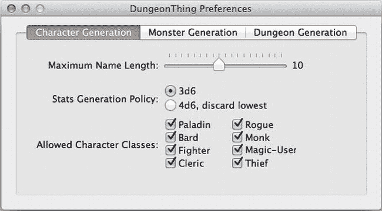

图 7-2. DungeonThing 中角色生成的首选项

从 *Object Library* 中拖出这些对象，并大致按照图 7-2 所示对齐。要使`NSSlider`的外观和行为与图中一致，请选中它并打开 *Attributes Inspector*（4）。为其设置 19 个刻度线，勾选“仅在刻度线上停止”复选框，然后将最小值设为 2，最大值设为 20，当前值设为 10。再往下一点，点击打开 *Continuous* 复选框（这样滑块将在用户拖动时持续报告其值），然后就可以了。图 7-3 显示了具体操作。

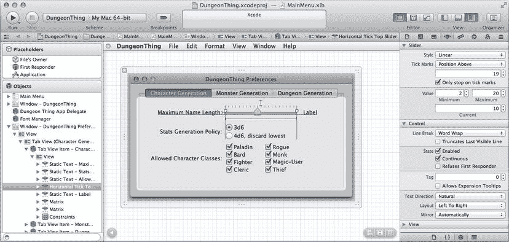

图 7-3. 用于选择 2 到 20 之间整数的 `NSSlider` 配置

另一个需要做的调整（但在截图中看不到）是使包含复选框的矩阵能够响应鼠标点击并正确行为。由于`NSMatrix`被设计为包含多种控件，当用户点击某个单元格时，它有多种与单元格交互的方式。选中复选框矩阵，然后在 *Attributes Inspector* 中，将 *Mode* 弹出菜单设置为 *Highlight*（如果尚未设置）。此模式使矩阵在点击单元格时，将该单元格的选中状态在 0 和 1 之间切换，从而打开或关闭复选框。

该标签页的最后一项配置是为两个单选按钮设置标签，以便我们稍后区分它们（复选框不需要设置标签，因为在处理绑定时会以不同的方式处理它们）。保持 *Attributes Inspector* 打开，然后依次点击两个单选按钮，在检查器中为每个按钮输入新的标签值。将第一个单选按钮单元格的标签设为 1，将第二个设为 2。

## Monster Generation Preferences

下一个标签页包含允许用户指定随机怪物生成首选项的控件，如图 7-4 所示。

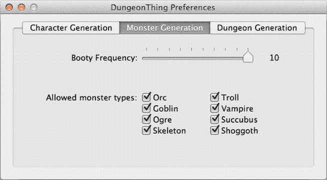

图 7-4. 怪物生成首选项

这里我们有一个滑块、一个复选框矩阵，以及几个作为标签的文本字段。滑块的配置应与 Character Generation 标签页中的滑块类似，但有几个不同的属性：最小值为 1，最大值为 10，并显示 10 个刻度线。

## Dungeon Generation Preferences

最后，我们将创建 Dungeon Generation 首选项的 GUI。这个比较简单——只有滑块和文本字段，如图 7-5 所示。这些滑块的配置应与 Monster Generation 标签页中的滑块一样，范围从 1 到 10，并显示 10 个刻度线。

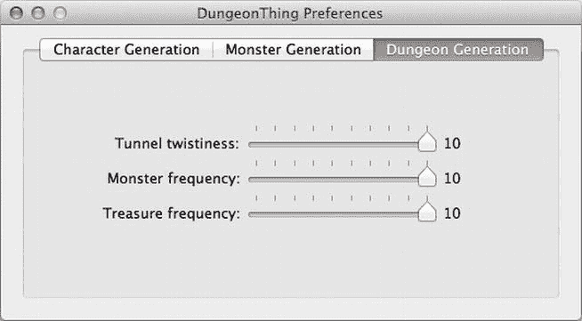

图 7-5. 地牢生成首选项标签页

## 绑定到 NSUserDefaultsController

至此，我们已经在窗口中拥有了所有这些 GUI 控件，但还没有输出口（outlets）连接它们，也没有当用户点击它们时可以调用的操作方法。那么，现在该怎么办？现在是时候创建我们的第一个绑定了！我们将使用一个名为`NSUserDefaultsController`的类，这是一个绑定就绪的通用控制器类，包含在 Cocoa 中。像这样的绑定就绪控制器让我们可以在 Interface Builder 中直接将视图对象绑定到底层模型对象。这个类的一个优点是，它以`NSUserDefaults`的形式维护自己的存储，`NSUserDefaults`是 Cocoa 应用中用于保存和检索用户应用首选项的标准类。这将允许我们将每个视图对象的值绑定到应用首选项中一个唯一键控的值。这些首选项会在用户退出应用前自动保存，并在用户下次启动应用时重新加载。

### Character Generation 的绑定

转到我们正在构建的首选项窗口，并切换回 Character Generation 窗格。点击滑块，然后打开 *Bindings Inspector*（7）。在此检查器中，我们可以看到视图对象所有可以绑定到模型对象值的属性。大多数情况下，我们会将`Value`绑定到某个东西，但每个视图类都提供自己的一组可供绑定的属性。例如，滑块可以将其`Max Value`和`Min Value`属性绑定到某些值，这允许我们根据模型对象中的值来改变这些极值。其他一些视图对象可以将文本颜色和字体绑定到模型值，并且大多数视图对象可以将其 Hidden 和 Enabled 状态绑定到模型值。目前，我们将绑定此滑块的`Value`属性，因此点击 *Value* 展开三角形以查看其配置选项。图 7-6 显示了默认设置。


图 7-6. `NSSlider`的 Value 绑定选项的默认“未绑定”状态

要建立绑定，我们至少需要配置三个东西：要绑定到的控制器对象、控制器键（controller key）和模型键路径（model key path）（其余都是可选设置，允许我们在特殊情况下优化绑定的行为，我们稍后会介绍其中一些）。从 *Bind to* 弹出列表中选择控制器对象，该列表包含我们 nib 文件中存在的所有控制器对象，包括我们自己的任何控制器、我们从库中拖入的任何通用控制器，以及像`NSUserDefaultsController`这样的特殊控制器（它在每个 nib 文件中都自动可用，并在弹出列表中显示为 Shared User Defaults Controller）。控制器键允许我们选择控制器提供的模型对象的不同“方面”。例如，`NSArrayController`（提供对对象数组的绑定访问）有不同的控制器键来提供对整个排序数组或仅当前选择的访问。模型键路径是一个字符串，用作在模型对象中获取和设置值的键。

因此，对于我们的第一个绑定，首先从弹出列表中选择 Shared User Defaults Controller。


这个控制器在任何 nib 文件中都自动可用，不过在绑定中使用之前，我们无法在任何地方看到它，一旦使用它就会出现在主 nib 窗口中。现在检查*控制器键*组合框，确保它设置为`values`。然后点击*模型键路径*组合框，并在其中输入`characterMaxNameLength`。这个字符串定义了用于将滑块值存储到`NSUserDefaults`（用户的应用程序偏好设置）中的键。按下回车键或点击离开该字段，注意检查器顶部的*绑定到*复选框会被勾选。这样就搞定了！我们暂时不需要担心其余控件；它们的默认值对我们的需求来说已经足够了。图 7-7 展示了当这个绑定配置完成后，检查器中相关配置项应该呈现的样子。

图 7-7。第一个滑块的已完成绑定

现在选择滑块右侧的小文本字段，并为其配置与滑块完全相同的绑定：共享用户默认值控制器，`values`，以及`characterMaxNameLength`。这将使其从同一个模型对象（用户的应用程序偏好设置）中的同一个位置（`characterMaxNameLength` 的值）拉取显示值。现在来感受一下 Cocoa 绑定的魔力，选择菜单中的编辑器模拟界面，点击并拖动滑块，观察右侧小文本字段中的值是否同步更新。请注意，这与我们在第 2 章中构建的功能相同，但机制不同：当我们拖动滑块时，它的值正被`NSUserDefaultsController`推送到我们的应用程序偏好设置中，该控制器同时也会将该值传递给绑定到同一键的其他对象（即这个小文本字段）。相当巧妙的技巧！但这并非什么把戏。它是 Cocoa 绑定动态特性的一个简单示例。利用这项技术，我们可以从控制器类中消除大量枯燥的代码，有时甚至能完全摒弃控制器类——仅使用 Cocoa 内置的控制器类来代替。

接下来我们处理下一个 GUI 控件，即中间的单选按钮矩阵。点击该矩阵，然后查看*绑定检查器*，我们会发现这里没有“值”选项。对于这个控件，我们将不绑定“值”，而是绑定`选定标签`属性，这意味着当用户选择一个单元格时，该单元格的标签将被推送到模型中，并且下次打开偏好设置窗口时，保存的标签将决定哪个单选按钮被选中。打开*绑定检查器*中的*选定标签*部分，再次确保选中了共享用户默认值控制器，且*控制器键*为`values`，但这次在*模型键路径*中输入`characterStatsGenerationPolicy`，然后按回车。

接下来，我们来处理“允许的角色类别”复选框。对于每一个复选框，我们将创建一个新的键名，并将其“选择”状态绑定到用户应用程序偏好设置中的一个值。点击第一个单元格“圣骑士”。检查器的标题应变为“按钮单元格绑定”。如果没有变化，就再次点击按钮直到标题改变。现在将该按钮单元格的`值`属性绑定到`characterClassAllowedPaladin`键。对其余的按钮单元格重复这些步骤，通过共享用户默认值控制器将它们每一个绑定到相应的键名上。`吟游诗人`应绑定到`characterClassAllowedBard`，`战士`应绑定到`characterClassAllowedFighter`，以此类推。当处理到`魔法师`时，为了保持一致性，请使用键名`characterClassAllowedMagicUser`，省略其中的`-`符号。

## 怪物生成器的绑定

现在切换到“怪物生成”标签页。

将滑块的*值*绑定到`monsterBootyFrequency`，并对右侧的小文本字段执行相同操作。然后按照我们在“角色生成”标签页中使用的方法配置复选框。点击“兽人”复选框，直到复选框本身被选中，并将其值绑定到`monsterTypeAllowedOrc`。继续处理其余的复选框，将每个复选框的值绑定到相应的键名：`monsterTypeAllowedGoblin`，`monsterTypeAllowedOgre`，以此类推。

## 地下城生成器的绑定

最后，切换到“地下城生成”标签页，该页面仅包含三对滑块和文本字段。在“隧道蜿蜒度”标签的右侧，将滑块和文本字段的*值*绑定都配置为`dungeonTunnelTwistiness`。将两个“怪物频率”控件的值都绑定到`dungeonMonsterFrequency`，并将两个“宝藏频率”控件的值都绑定到`dungeonTreasureFrequency`。

## 创建主窗口

现在该关注我们的主窗口了，它将包含用户点击以生成角色、怪物和地下城的按钮，以及用于显示结果的文本字段。点击主窗口的标题栏（如果主窗口尚未可见，则双击其在主窗口中的图标），然后调出*大小检查器*（5）。将窗口大小更改为 731 x 321，然后切换到*属性检查器*（4）并点击关闭*调整大小*复选框，这样我们就少了一件需要操心的事。此应用程序显示的数据集有限，因此没有理由让用户将窗口调得更大。我们现在将创建三组 GUI 组件，每组对应我们处理的三种数据类型。我们将手动布局第一组，然后复制它来完成另外两组。

首先，我们在一个框内创建一个用于显示结果的文本字段。转到*对象库*面板，在搜索字段中输入 `nsbox`。在结果中找到“框”，并将一个框拖到我们的窗口中。选中新框后，切换回*大小检查器*，将框的尺寸设置为宽 227、高 247。趁此机会，将它的 X 和 Y 值都设置为 20。这将框置于窗口的左下角，大致相当于我们将其拖到左下角并根据蓝色对齐线放置的位置。然后切换回*属性检查器*，将*标题位置*设置为“无”，这样标题就不会显示出来。

现在，回到*对象库*面板，在搜索框中输入 `label`。搜索结果中有一个“多行标签”；选中它，将其拖到与我们刚刚创建的框完全重叠的位置，然后松开鼠标。这样操作会将其放入框内。放入后，通过先将标签的左下角拖到框的左下角，再将标签的右上角拖到框的右上角，将标签拉伸以填满整个框。在这两种情况下，当拖拽到距框边缘合适的距离时，蓝色对齐线就会出现。最后，三击文本字段以选中其中的文本（`多行标签`），然后按退格键或删除键清除文本。

让我们为这个框收尾，添加一个最终能向刚创建的文本字段中填入文本的按钮。在*对象库*中找到一个按钮（标准推送按钮就很合适），并将其拖到框正上方的一个位置。拖拽时，蓝色线条会出现，显示距窗口顶部的正确距离，同时也会在按钮与框的中心垂直对齐时进行提示。这就是我们要放置的位置！双击按钮以编辑其标题，将其改为`生成角色`。根据调整大小约束的设置方式，我们之后可能需要重设框的尺寸。图 7-8 展示了此时我们应看到的效果。


  
图 7-8。我们已为主窗口创建了三组视图中的第一组。框内的文本字段被高亮显示，只是为了让我们能看到它的位置。

现在，点击窗口任意位置，然后按 `A` 选择窗口中的所有对象，从而选中我们刚刚创建的所有视图。按 `D` 复制它们，这会显示一组与原始对象完全相同、重叠且位置略有偏移的新对象。将这组对象拖动到窗口中央，使用蓝色参考线确保它们与原始对象保持相同的垂直位置，并且框之间有合适的水平间距。然后再次按 `D`，并将第三组对象拖动到窗口右侧，再次使用蓝色参考线帮助正确放置它们。最后，双击两个新按钮，分别将其标题更改为“生成怪物”和“生成地牢”。同样，根据大小限制条件的设置方式，我们可能需要将框的大小重新设为 227 x 247。图 7-9 显示了窗口现在应有的样子。

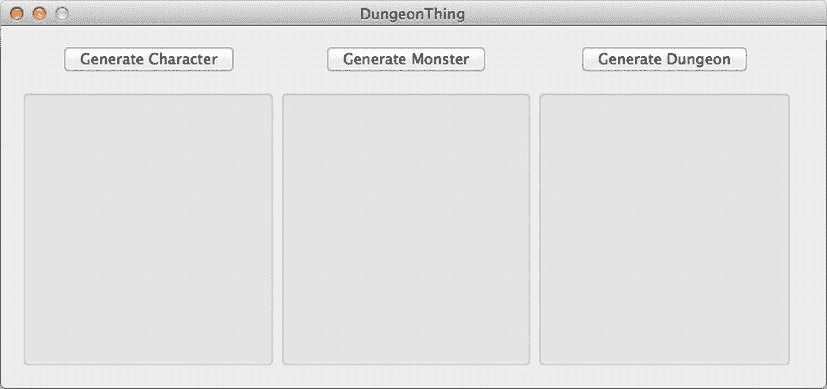  
图 7-9。DungeonThing 的完整主窗口

## 设置 DungeonThingAppDelegate

既然初始绑定已完成，主窗口也已设置好，我们可以将各个部分连接到 `DungeonThingAppDelegate`。通过点击工具栏中标记为“Editor”的图标组里那个类似管家的小图标（或使用键盘快捷键），打开一个辅助编辑器（`↵`）窗格，然后从跳转栏中选择 `DungeonThingAppDelegate.h`。一次一个地，按住 Control 键从“生成角色”按钮下方的框中的标签拖动到辅助编辑器中的 `DungeonThingAppDelegate.h` 文件，拖到预定义的窗口 `@property` 下方。到达时，会出现一个小窗口，提示可以创建新的输出口或操作。释放鼠标，创建一个名为 `characterLabel` 的新输出口。对窗口中其他两个框中的标签执行相同操作，分别创建名为 `monsterLabel` 和 `dungeonLabel` 的新输出口。

然后，按住 Control 键分别从三个按钮拖动到辅助编辑器中的 `DungeonThingAppDelegate.h` 文件，并创建名为 `createCharacter:`、`createMonster:` 和 `createDungeon:` 的新操作。此时，应该清楚哪个操作对应哪个按钮。除了将输出口和操作添加到 `DungeonThingAppDelegate.h` 文件外，这还会在 `DungeonThingAppDelegate.m` 文件中为这些操作添加方法存根。

## 定义常量

至此，GUI 已完成，相关的绑定都已配置好，这样“偏好设置”窗口中的控件都能将其值保存到用户的应用程序偏好设置中。剩下的工作就是编写操作方法，这些方法将使用 `NSUserPreferences` 来检索偏好设置值并显示它们。如前所述，我们不会真正使用这些值来生成游戏物品描述，但如果愿意，以后可以自行添加这一增强功能。

让我们从定义一些常量开始，就像我们在之前的示例中所做的那样（如果你忘记了，请参阅第 4 章中对这样做好处的讨论）。以下是与我们在 nib 文件中已设置的偏好设置键名相对应的所有常量。将这些代码插入到 `DungeonThingAppDelegate.m` 的顶部某处：

```
#define kCharacterMaxNameLength @"characterMaxNameLength"
#define kCharacterStatsGenerationPolicy \
  @"characterStatsGenerationPolicy"
#define kCharacterClassAllowedPaladin @"characterClassAllowedPaladin"
#define kCharacterClassAllowedBard @"characterClassAllowedBard"
#define kCharacterClassAllowedFighter @"characterClassAllowedFighter"
#define kCharacterClassAllowedCleric @"characterClassAllowedCleric"
#define kCharacterClassAllowedRogue @"characterClassAllowedRogue"
#define kCharacterClassAllowedMonk @"characterClassAllowedMonk"
#define kCharacterClassAllowedMagicUser \
  @"characterClassAllowedMagicUser"
#define kCharacterClassAllowedThief @"characterClassAllowedThief"

#define kMonsterBootyFrequency @"monsterBootyFrequency"
#define kMonsterTypeAllowedOrc @"monsterTypeAllowedOrc"
#define kMonsterTypeAllowedGoblin @"monsterTypeAllowedGoblin"
#define kMonsterTypeAllowedOgre @"monsterTypeAllowedOgre"
#define kMonsterTypeAllowedSkeleton @"monsterTypeAllowedSkeleton"
#define kMonsterTypeAllowedTroll @"monsterTypeAllowedTroll"
#define kMonsterTypeAllowedVampire @"monsterTypeAllowedVampire"
#define kMonsterTypeAllowedSuccubus @"monsterTypeAllowedSuccubus"
#define kMonsterTypeAllowedShoggoth @"monsterTypeAllowedShoggoth"

#define kDungeonTunnelTwistiness @"dungeonTunnelTwistiness"
#define kDungeonMonsterFrequency @"dungeonMonsterFrequency"
#define kDungeonTreasureFrequency @"dungeonTreasureFrequency"
```

**注意**  *为适应图书版式限制，同时仍展示有效代码，我们通过将反斜杠作为行末最后一个字符的方式对其中一些行进行了换行，这使得 C 预处理器将下一行的内容拼接过来，就好像它们原本就在同一行一样。你可以在自己的代码中省略这种手动换行，将每个 `#define` 都写成一行声明。*

## 指定默认偏好设置值

常量定义完成后，我们就可以开始编码了。在实现操作方法之前，我们需要先了解一下 `NSUserDefaults`。如前所述，这个类让我们可以像操作哈希表或字典一样存储和检索用户的应用程序偏好设置，键是我们自己选择的字符串。每个应用程序都应该做的一件事情是为 `NSUserDefaults` 创建一组默认值，这样在用户尚未为某个给定键设置值时，系统会使用这些默认值作为后备。例如，假设我们想存储一个值范围在 1 到 10 之间的整数，使用的键是 `@"greatness"`。为 `@"greatness"` 键设置默认值 1，可以确保用户首次运行应用程序时，当 `NSUserDefaults` 试图检索 `@"greatness"` 值时，它会找到我们在代码中指定的默认值（1）。如果不这样做，检索任何尚未被用户设置过的数值都会返回 0，而检索任何未设置过的对象值则会返回 nil。

常见的做法是在应用程序启动阶段早期调用的方法中设置这些值，通常是在包含在主 nib 文件中的类里进行。类方法 `initialize` 是一个适合做这件事的地方，因为它对每个类只调用一次，且是在该类首次被访问时。在 `initialize` 方法中尝试访问其他应用程序对象是不好的做法，因为我们不知道启动过程进展到了哪一步，但在这里我们不需要这样做。在我们的 `DungeonThingAppDelegate` 中创建这样一个方法。


```objc
+ (void)initialize {
    [[NSUserDefaults standardUserDefaults] registerDefaults:
     [NSDictionary dictionaryWithObjectsAndKeys:
      [NSNumber numberWithInt:1], kMonsterBootyFrequency,
      [NSNumber numberWithBool:YES], kMonsterTypeAllowedOrc,
      [NSNumber numberWithBool:YES], kMonsterTypeAllowedGoblin,
      [NSNumber numberWithBool:YES], kMonsterTypeAllowedOgre,
      [NSNumber numberWithBool:YES], kMonsterTypeAllowedSkeleton,
      [NSNumber numberWithBool:YES], kMonsterTypeAllowedTroll,
      [NSNumber numberWithBool:YES], kMonsterTypeAllowedVampire,
      [NSNumber numberWithBool:YES], kMonsterTypeAllowedSuccubus,
      [NSNumber numberWithBool:YES], kMonsterTypeAllowedShoggoth,
      [NSNumber numberWithInt:7], kCharacterMaxNameLength,
      [NSNumber numberWithInt:1], kCharacterStatsGenerationPolicy,
      [NSNumber numberWithBool:YES], kCharacterClassAllowedPaladin,
      [NSNumber numberWithBool:YES], kCharacterClassAllowedBard,
      [NSNumber numberWithBool:YES], kCharacterClassAllowedFighter,
      [NSNumber numberWithBool:YES], kCharacterClassAllowedCleric,
      [NSNumber numberWithBool:YES], kCharacterClassAllowedRogue,
      [NSNumber numberWithBool:YES], kCharacterClassAllowedMonk,
      [NSNumber numberWithBool:YES], kCharacterClassAllowedMagicUser,
      [NSNumber numberWithBool:YES], kCharacterClassAllowedThief,
      [NSNumber numberWithInt:3], kDungeonTunnelTwistiness,
      [NSNumber numberWithInt:7], kDungeonMonsterFrequency,
      [NSNumber numberWithInt:1], kDungeonTreasureFrequency,
      nil]];
}
```

该方法调用了 `NSUserDefaults` 的 `registerDefaults:` 方法，并传入了一个包含应用默认值的字典。我们为应用中使用的每一个键名都设置了默认值，这样在请求某个值时，我们就能确保总能得到有效的结果。

## 创建操作方法

现在我们可以开始实现操作方法了。先从 `createCharacter:` 方法开始，它会显示与角色创建相关的所有偏好设置的摘要。首先，我们获取 `NSUserDefaults` 的共享实例，然后创建一个空字符串来存放摘要文本，接着逐项创建偏好设置的摘要内容。最后，将摘要文本放入相应的 `NSTextField` 中。请注意，在方法开头，我们创建了一个具有特定容量的 `NSMutableString`，但这并非上限；`NSMutableString` 足够智能，能在必要时自动“扩容”。该方法如下所示：

```objc
- (IBAction)createCharacter:(id)sender {
    NSUserDefaults *ud = [NSUserDefaults standardUserDefaults];
    NSMutableString *result = [NSMutableString stringWithCapacity:1024];
    [result appendString:
     @"按照以下参数生成角色：\n"
      "-----------------\n"];	// 提示：可以像这样跨行分割字符串！
    [result appendFormat:
     @"最大姓名长度：%ld\n",
     [ud integerForKey:kCharacterMaxNameLength]];
    [result appendFormat:
     @"属性生成策略：%ld\n",
     [ud integerForKey:kCharacterStatsGenerationPolicy]];
    [result appendFormat:
     @"允许圣骑士：%@\n",
     [ud boolForKey:kCharacterClassAllowedPaladin] ? @"是" : @"否"];
    [result appendFormat:
     @"允许吟游诗人：%@\n",
     [ud boolForKey:kCharacterClassAllowedBard] ? @"是" : @"否"];
    [result appendFormat:
     @"允许战士：%@\n",
     [ud boolForKey:kCharacterClassAllowedFighter] ? @"是" : @"否"];
    [result appendFormat:
     @"允许牧师：%@\n",
     [ud boolForKey:kCharacterClassAllowedCleric] ? @"是" : @"否"];
    [result appendFormat:
     @"允许游荡者：%@\n",
     [ud boolForKey:kCharacterClassAllowedRogue] ? @"是" : @"否"];
    [result appendFormat:
     @"允许武僧：%@\n",
     [ud boolForKey:kCharacterClassAllowedMonk] ? @"是" : @"否"];
    [result appendFormat:
     @"允许魔法使用者：%@\n",
     [ud boolForKey:kCharacterClassAllowedMagicUser] ?
      @"是" : @"否"];
    [result appendFormat:
     @"允许盗贼：%@\n",
     [ud boolForKey:kCharacterClassAllowedThief] ? @"是" : @"否"];
    [self.characterLabel setStringValue:result];
}
```

输入这些代码后，尝试编译并运行应用。一切顺利的话，我们应该能看到主窗口，按下“生成角色”按钮，结果应类似于图 7-10 所示。

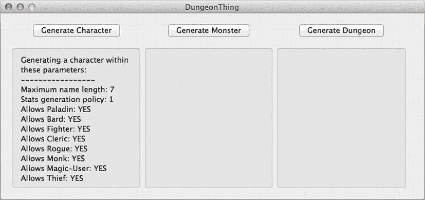

图 7-10. DungeonThing 的首次运行

下一步是打开偏好设置窗口，在“角色生成”选项卡中进行一些更改。例如，禁用某些复选框、拖动滑块等。每次更改后，再次点击主窗口中的“生成角色”按钮，显示的参数会相应变化，以反映偏好设置窗口的内容。

现在这部分功能已经正常工作了，我们来填充 `createMonster:` 和 `createDungeon:` 的方法体，如下所示。这两个方法的工作方式与之前展示的 `createCharacter:` 方法相同。

```objc
- (IBAction)createMonster:(id)sender {
    NSUserDefaults *ud = [NSUserDefaults standardUserDefaults];
    NSMutableString *result = [NSMutableString stringWithCapacity:1024];
    [result appendString:@"按照以下参数生成怪物：\n-----------------\n"];
    [result appendFormat:
     @"战利品频率：%ld\n",
     [ud integerForKey:kMonsterBootyFrequency]];
    [result appendFormat:
     @"允许兽人：%@\n",
     [ud boolForKey:kMonsterTypeAllowedOrc] ? @"是" : @"否"];
    [result appendFormat:
     @"允许地精：%@\n",
     [ud boolForKey:kMonsterTypeAllowedGoblin] ? @"是" : @"否"];
    [result appendFormat:
     @"允许食人魔：%@\n",
     [ud boolForKey:kMonsterTypeAllowedOgre] ? @"是" : @"否"];
    [result appendFormat:
     @"允许骷髅：%@\n",
     [ud boolForKey:kMonsterTypeAllowedSkeleton] ? @"是" : @"否"];
    [result appendFormat:
     @"允许巨魔：%@\n",
     [ud boolForKey:kMonsterTypeAllowedTroll] ? @"是" : @"否"];
    [result appendFormat:
     @"允许吸血鬼：%@\n",
     [ud boolForKey:kMonsterTypeAllowedVampire] ? @"是" : @"否"];
    [result appendFormat:
     @"允许魅魔：%@\n",
     [ud boolForKey:kMonsterTypeAllowedSuccubus] ? @"是" : @"否"];
    [result appendFormat:
     @"允许修格斯：%@\n",
     [ud boolForKey:kMonsterTypeAllowedShoggoth] ? @"是" : @"否"];
    [self.monsterLabel setStringValue:result];
}

- (IBAction)createDungeon:(id)sender {
    NSUserDefaults *ud = [NSUserDefaults standardUserDefaults];
    NSMutableString *result = [NSMutableString stringWithCapacity:1024];
    [result appendString:@"按照以下参数生成地牢：\n-----------------\n"];
    [result appendFormat:
     @"通道曲折度：%ld\n",
     [ud integerForKey:kDungeonTunnelTwistiness]];
    [result appendFormat:
     @"怪物密度：%ld\n",
     [ud integerForKey:kDungeonMonsterFrequency]];
    [result appendFormat:
     @"宝藏密度：%ld\n",
     [ud integerForKey:kDungeonTreasureFrequency]];
    [self.dungeonLabel setStringValue:result];
}
```

将这些方法补充完整后，我们应该能够编译并运行 DungeonThing，修改偏好设置窗口中每个选项卡下的所有值，并看到输出文本字段中反映出修改后的值。DungeonThing 的第一个版本现在完成了！

**注意** 我们使用了 `NSUserDefaults` 对象来存储偏好设置窗口中的设置。几乎所有 Cocoa 应用都使用 `NSUserDefaults` 来保存用户设置。我们尚未讨论如何使用终端程序访问 Unix 命令行，但 `NSUserDefaults` 系统的一个特性是支持命令行访问。如果你对此感兴趣，可以打开 `Terminal.app`（在 Finder 中，可以在“应用程序”下的 `实用工具` 文件夹中找到它），然后输入 `defaults read com.learncocoa.`。


`DungeonThing` 如果你输入 `defaults domains`，就会列出所有在 `NSUserDefaults` 系统中存储默认设置的应用，你可以查看其中任意应用的存储设置。祝你好运！

## 绑定到表视图

`DungeonThing` 就其功能而言是没问题的（当然，它不会真正生成游戏对象），但如果你“在实际生产环境”中使用这样的系统（比如在玩《龙与地下城》或类似游戏时），你很快就会遇到一个主要问题：随机生成的游戏对象根本无法持久保存！例如，一旦你点击按钮创建一个新的随机角色，上一个角色就会直接被抹去，并且你再也无法看到它。

对于 `DungeonThing` 的下一个迭代版本，我们将添加一些表视图来显示所有已创建游戏对象的列表。在表视图中点击某个游戏对象，将在相应的文本字段中显示其值。与第 6 章 中我们演示如何在自己的代码中处理表视图不同，这里我们将演示如何使用 `NSArrayController` 类，这是 Cocoa 自带的一个通用控制器类，借助 Cocoa 绑定，无需编写自定义代码即可管理这些表视图的显示。我们需要为 `DungeonThingAppDelegate` 类添加一些出口和其他实例变量，用于管理三个 `NSArrayController` 实例和三个数组（每种游戏对象类型一个数组）。我们还将移除刚刚添加的 `NSTextField` 出口，因为这些也将通过绑定来配置，以显示其内容。最后，我们稍微修改动作方法，将每个创建的对象插入到相应的数组中。完成后，源代码的大小几乎相同，因为表视图的所有配置都是在 nib 文件中完成的。

我们将首先为 `DungeonThingAppDelegate` 添加一些属性，并修改我们的 `create:` 方法，以便使用这些新属性。在 Interface Builder 中使用绑定之前，我们需要先在代码中进行设置。然后，我们将切换到 Interface Builder 来连接绑定，再回到代码进行一些清理工作。

## 使代码支持绑定

首先，让我们在头文件中进行必要的修改。为了维护生成对象的列表，我们的 `DungeonThingAppDelegate` 需要三个新的 `NSMutableArray` 实例变量，每种游戏对象一个。这些变量无法从 Interface Builder 内部创建；我们需要显式声明它们。每个数组将由 nib 文件中的一个 `NSArrayController` 管理，稍后我们将在 Interface Builder 中创建和配置它们。我们将这三个 `NSMutableArray` 声明为属性，以便 `NSArrayControllers` 可以随时访问它们。我们需要在 `DungeonThingAppDelegate.h` 中进行的修改如下：

```objectivec
#import <Cocoa/Cocoa.h>

@interface DungeonThingAppDelegate : NSObject <NSApplicationDelegate>

// 添加以下三个：
@property (strong) NSMutableDictionary *characters;
@property (strong) NSMutableDictionary *monsters;
@property (strong) NSMutableDictionary *dungeons;

@property (assign) IBOutlet NSWindow *window;
@property (weak) IBOutlet NSTextField *characterLabel;
@property (weak) IBOutlet NSTextField *monsterLabel;
@property (weak) IBOutlet NSTextField *dungeonLabel;

- (IBAction)createCharacter:(id)sender;
- (IBAction)createMonster:(id)sender;
- (IBAction)createDungeon:(id)sender;

@end
```

添加完这三个属性声明后，我们需要在 `DungeonThingAppDelegate.m` 文件中完成 `NSMutableArray` 实例的设置。我们将初始化 `NSMutableArray` 实例本身，并修改动作方法，将创建的值推送到我们的数组中，而不是直接在文本字段中显示值。

首先，让我们实现一个新的 `init` 方法来包含数组的初始化。

将以下代码放在 `.m` 文件中 `@implementation DungeonThingAppDelegate` 部分的顶部附近：

```objectivec
- (id)init {
    if ((self = [super init])) {
        self.characters = [NSMutableArray array];
        self.monsters = [NSMutableArray array];
        self.dungeons = [NSMutableArray array];
    }
    return self;
}
```

### 标准 INIT 方法

上面的代码片段展示了一个为类的实例变量创建值的 `init` 方法示例。这种 `init` 方法的形式相当标准，你可能在你看到的大多数 Objective-C 类中都会看到类似的写法，但它做了一些乍一看很奇怪的事情，因此值得稍作解释。这个方法以这样一个奇特的 `if` 语句开头：

`if ((self = [super init])) {`

这个 `if` 语句实际上是一举两得（甚至多得）。首先，它调用了超类的 `init` 实现，并将其返回值赋给特殊变量 `self`。然后，它检查赋值本身的值（即赋值后 `self` 的值），并且仅在该值不为假值（例如空指针 nil）时才执行后面的代码块。

这种使用 `self` 并为其赋值的方式确实很特殊。事实上，我们唯一可能看到为 `self` 赋值的代码地方，就是像这样的 `init` 方法中。这样做是为了应对一种可能性，尽管可能性很小，即超类的 `init` 方法可能会返回一个与最初 `self` 指向的不同值。一方面，超类可能发现由于某种原因无法正确初始化自身，并通过从 `init` 方法返回 nil 来表示这一点，这是处理对象初始化失败的“标准”方式（而不是抛出异常）。在这种情况下，子类会注意到 nil 值并跳过 `if` 语句后面的块，直接跳到最后，返回 `self` 指向的值，现在这个值是 nil。

超类 `init` 方法返回另一个值的另一种可能性是返回一个完全不同的实例。其思想是超类可能有一个智能方案，用于在私有池中回收对象，而不是不断地释放和创建新对象，该方案的一部分是，`init` 方法有时会返回一个旧的、二手对象，而不是我们刚刚尝试创建的崭新对象。这种情况是否现实，是 Cocoa 程序员之间偶尔争论的话题。在这里，我们通过编写允许这种可能性的 `init` 方法，采取了谨慎的态度。

就是这样——所有需要在 Interface Builder 中连接对象的代码修改已完成！请注意，与第 6 章中的示例不同，这里的代码完全不需要操作表视图。无需实现 `delegate` 或 `dataSource` 方法，无需指向表视图的出口，什么都不需要。得益于绑定和 `NSArrayController`，表视图将自行管理一切。

## 配置表视图和文本视图

现在，我们准备转到 nib 文件。我们将创建一些表视图，添加一些数组控制器对象，并将它们的绑定设置到我们添加到 `DungeonThingAppDelegate` 的新数组上。我们还将配置现有的文本字段，使其通过绑定获取数据。在 Xcode 中单击 `MainMenu.xib` 文件，返回 Interface Builder 画布。

我们将从修改主应用程序窗口开始。第一步是在窗口中为新的表视图腾出空间。我们将创建三个“历史记录”表视图，分别放在每组现有视图的下方，因此我们需要使窗口更高（但可以保持当前宽度不变）。


使用窗口右下角的调整控件，将窗口高度增加约一倍。蓝色辅助线将帮助我们保持当前宽度。

在*对象库*面板中搜索“table”，将出现的表格视图拖入窗口。将其放置在最左侧方框左下角下方，然后抓住表格视图右下角的调整手柄，向下拖动，直到表格填满窗口底部的大部分可用空间，其左右边缘与上方方框的边缘对齐，如图 7-11 所示。


图 7-11. 向窗口中添加表格

在我们的历史记录表格中，我们只打算显示对象创建的时间。用户随后可以点击某一行，在表格上方的文本字段中查看相关对象。这意味着我们只需要表格中有一列。因此，打开*属性检查器*（4）。选择表格视图（它位于滚动视图内部，因此需要点击两次才能选中表格视图本身）。在检查器中，将列数改为 1，并将*内容模式*设置为基于视图而非基于单元格。

接下来，调整剩余的列，使其填满表格的宽度。为此，点击表格标题，直到整个表格标题被选中。然后将鼠标悬停在标记表格列标题边缘的垂直线上，向右拖动，直到该列填满整个表格。

最后，禁用剩余列的编辑功能，因为我们不希望用户更改已创建对象的时间戳。点击表格列直到其被选中，然后打开*属性检查器*（4），点击取消*可编辑*复选框的勾选。接下来，将调整大小方式从“两者”改为“随表格自动调整大小”，因为没理由让用户调整表格视图的唯一列。

此时，表格视图及其列已按图形方式布局完毕，除了绑定之外的所有配置已完成。这是复制我们刚刚为显示角色而制作的表格的好时机，这样我们就可以为怪物和地牢使用完全相同的配置。点击窗口背景，然后点击一次表格视图以选中它（以及其包含的`NSScrollView`）。现在按下D 复制表格视图，并将新复制的表格视图拖动到中间视图组底部的适当位置。然后再次按下D，并将最后一个表格视图拖到窗口右下角的适当位置。对于这两个表格视图，我们当然会使用蓝色辅助线来帮助正确对齐。图 7-12 显示了最终布局。

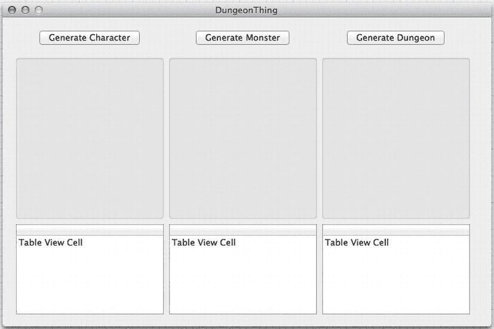

图 7-12. DungeonThing 窗口的最终布局

### 创建并配置数组控制器

现在是时候添加一个`NSArrayController`，以便为第一组对象（角色）配置一些绑定。在*对象库*面板中搜索“array”。注意搜索结果中出现的“Array Controller”；这是`NSArrayController`对象的一个实例。将其中的一个拖到 Interface Builder 画布最左侧的对象停靠区域。如果该停靠区域尚未展开，请单击 Interface Builder 画布左下角的展开三角形以展开它。`NSArrayController`需要一个更有意义的名称，因此缓慢点击“Array Controller”文本两次（就像在 Finder 中重命名文件一样）来编辑名称。我们将使用此控制器来提供对角色数组的访问，因此将其命名为“characters”。

为此顶级 nib 对象指定一个唯一的名称，将有助于稍后我们在此 nib 中添加另外两个数组控制器时使用。（请注意，在 Xcode 4.5 的初始版本中，更改名称后，对象停靠区域中的名称可能不会刷新。如果是这样，我们可以通过单击对象停靠区域的展开三角形两次来使新名称显示出来。）

为了让我们的`DungeonThingAppDelegate`能够使用这些`NSArrayController`实例，我们需要向应用程序委托添加输出口。像之前一样，打开一个助理编辑器窗格，并显示`DungeonThingAppDelegate.h`文件。按住 Control 键，从新的角色数组控制器拖到`DungeonThingAppDelegate.h`文件中，并创建一个名为`characterArrayController`的新输出口。

接下来，再次点击数组控制器，打开*属性检查器*（4）。我们将在顶部看到一些选项，可以微调数组控制器的行为，但现在我们保持它们不变。我们需要配置的是检查器下半部分的*对象控制器*部分。确保*模式*设置为 Class，并且*类名*为“NSMutableDictionary”。此配置告诉控制器，它正在处理的模型对象是`NSMutableDictionary`的实例，这是一个“普通”类（而不是实体，我们将在第 7 章中作为 Core Data 的一部分进行介绍）。在其下方，我们将看到一个列出数组控制器应能在模型对象中访问的属性的表格视图。点击表格视图下方的 + 按钮，输入“createdObject”，然后再次点击 +，输入“timestamp”。图 7-13 显示了数组控制器的完整属性配置。


图 7-13. 第一个 NSArrayController 的已配置属性

是的，这些就是我们在每次用户点击按钮时，用于创建`NSMutableDictionary`的代码中使用的键。我们现在将使用这些键为 GUI 对象创建绑定。

接下来，我们需要配置一个绑定，但不是针对 GUI 对象，而是针对数组控制器本身！实际上，`NSArrayController`不仅仅是提供对模型对象的、支持绑定的访问的提供者。它本身也是一个消费者，通过 Cocoa 绑定从另一个对象获取其内容数组。在我们的例子中，它将从`DungeonThingAppDelegate`的角色数组中获取内容。保持数组控制器被选中，打开*绑定检查器*（7）。点击*Content Array*旁边的展开三角形以打开它，并通过从弹出列表中选择“Dungeon Thing App Delegate”，在*模型键路径*字段中输入“characters”，然后按回车键，来设置所需的绑定。请注意，我们的`DungeonThingAppDelegate`不需要任何特殊准备就能支持绑定。我们所需要做的只是将一个实例变量作为属性暴露出来（就像我们为三个内容数组所做的那样），然后我们就可以立即使用它来绑定其他对象了！

现在，我们已经添加了一个`NSArrayController`，并将其配置为从`DungeonThingAppDelegate`访问正确的数据。是时候将一些 GUI 对象绑定到这个新控制器了。

### 通过数组控制器绑定表格显示

首先，我们将为表格视图设置一个单一的绑定。我们将表格视图的 Content 绑定绑定到角色数组（通过数组控制器），然后让表格视图单元格从每个模型对象中获取时间戳属性。

方法如下：通过 Interface Builder 画布左侧的对象停靠区域向下钻取，点击表格视图，然后在*绑定检查器*（7）中打开*Value*绑定配置部分。


从弹出列表中选择`characters`，然后在*Controller Key*组合框中选择`arrangedObjects`。这将把表格视图连接到数组控制器，并为数组控制器管理的每个对象在表格视图中创建一行，并设置该行的`objectValue`属性。我们之前提到过，*Controller Key*组合框允许我们选择所绑定控制器对象的不同方面。在这种情况下，通过`arrangedObjects`进行绑定意味着我们绑定到整个已排序的对象数组。这种绑定通常只适用于能够显示整个内容数组的视图对象，例如表格。

接下来，展开*Selection Indices*绑定配置部分（就在*Value*部分下方）。再次从弹出列表中选择`characters`，这次在*Controller Key*组合框中输入`selectionIndices`。这会告诉数组控制器表格视图中选择了哪一行（或多行），并将选择状态传递给绑定到该数组控制器的任何其他对象。特别是，当选择发生变化时，文本字段将通过这种方式更新。

现在，我们需要为表格视图中包含的每个子视图建立绑定，以便从`objectValue`中提取适当的信息。由于我们只有一个列且其中只有一个视图（一个`NSTableCellView`），这很简单。`NSTableCellView`内嵌了一个`NSTextField`，这正是我们需要绑定的对象。在表格视图内的表格单元格视图中选择“Static Text - Table View Cell”条目（从左侧展开的对象停靠栏中选择最方便）。在*Bindings Inspector*中，选择*Bind to*为`Table Cell View`，然后在*Model Key Path*中输入`objectValue.timestamp`。这告诉`NSTextField`使用嵌入该文本字段的`NSTableCellView`所绑定对象的`timestamp`属性。

### 通过数组控制器的选择绑定文本字段

对于`characters`部分需要完成的最后一个绑定是显示值的文本字段。此绑定也将通过数组控制器完成，从控制器的选定对象中获取`createdObject`属性。

单击选择左侧框中的文本字段。第一次单击可能会选择框本身，再次单击将选择文本字段。现在再次查看*Bindings Inspector*，找到*Value*绑定配置。从弹出列表中选择`characters`，从*Controller Key*组合框中选择`selection`，从*Model Key Path*组合框中选择`createdObject`，然后勾选*Bind*复选框。请注意，通过选择`selection`作为*Controller Key*，我们指定数组控制器仅将选定的对象提供给此控件，而不是像表格列那样提供整个对象数组。

### 填充数组

现在我们需要回到代码中。在编辑窗格中打开`DungeonThingAppDelegate.m`。为了让表格视图显示内容，我们需要向`NSArrayController`中放入一些数据。为此，我们将修改`createCharacter:`操作方法末尾的一行代码。我们不直接将方法生成的摘要文本放入文本字段，而是将每个摘要添加到一个数组中，并使用`NSArrayController`来完成此操作，这样所有依赖视图（任何通过同一个`NSArrayController`进行绑定的视图）也会自动更新。我们不是将裸字符串插入数组，而是创建一个包含创建对象和当前时间的`NSMutableDictionary`，将该字典作为最简单的模型对象，包含两个键值。在`createCharacter:`末尾实施此更改，将

```
[self.characterLabel setStringValue:result];
```

更改为

```
[self.characterArrayController addObject:[NSMutableDictionary dictionaryWithObjectsAndKeys:  
    result, @"createdObject",  
    [NSDate date], @"timestamp",  
    nil]];
```

回想一下，我们在 Interface Builder 中设置的`NSArrayController`中使用了`createdObject`和`timestamp`作为键，并且用于表格视图中文本字段的绑定。通过使用这些键名将对象放入数组，我们可以让绑定将其提取出来。

实际上，在修改代码的同时，我们还可以在`DungeonThingAppDelegate.h`文件中移除`characterLabel`的`@property`声明。代码中已不再有任何对该属性的引用，保持代码整洁是一个好习惯。

### 确保一切正常

好了，准备工作很多。启动应用程序看看效果吧；继续构建并运行应用程序。我们应该能够创建新角色，并看到它出现在文本字段中，同时表格下方会有一条时间戳记录。修改一些偏好设置，再创建另一个角色，查看文本字段中新的参数摘要以及表格视图中新的时间戳。通过点击行来切换选择，观察文本字段中的值相应变化。

如果上述任何功能无法正常工作，请返回 nib 文件并仔细检查绑定的配置，以及`DungeonThingAppDelegate`与数组控制器的连接。

### 重复实践

既然我们已经完全通过绑定来处理角色，我们可以回过头来对怪物和地牢做同样的事情。通过复制`characters`数组控制器（从而保留其现有配置，包括我们已经输入的键名）创建一个新的`NSArrayController`，并将其命名为`monsters`以保持一致性。与我们之前对`characters`数组控制器的操作类似，通过创建一个名为`monsterArrayController`的新插口将`monsters`连接到`DungeonThingAppDelegate`，将其*Content Array*和*Selected Indices*绑定配置为连接到`DungeonThingAppDelegate`中的`monsters`属性，并通过`monsters`数组控制器配置两个相关的 GUI 对象（表格列和文本字段），所有操作如前所述。最后，通过将`createMonster:`操作方法中的最后一行从

```
[self.monsterLabel setStringValue:result];
```

更改为

```
[self.monsterArrayController addObject:[NSMutableDictionary dictionaryWithObjectsAndKeys:  
    result, @"createdObject",  
    [NSDate date], @"timestamp",  
    nil]];
```

构建并运行应用程序，确保一切正常，然后对地牢再重复一次整个过程。

一旦创建了所有三个`NSArrayController`并设置了绑定，我们就可以移除`DungeonThingAppDelegate.h`中引用了文本字段的`monsterLabel`和`dungeonLabel`的`@property`声明，因为这些现在已通过绑定进行填充。

### 好吧，但这到底是如何工作的？

既然你已经初步接触了 Cocoa 绑定，你可能会觉得自己刚刚目睹了一场魔术表演——并且想知道这些技巧究竟是如何运作的！这是一种完全可以理解的感觉。我们程序员习惯于必须详细说明数据的每一次移动以及屏幕的每一次更新，但突然发现仅仅在某处设置一个值，就会有一些看不见的力量将该值传播到屏幕上的其他视图。本节将通过解释键值编码和键值观察的 Cocoa 概念，以及 Cocoa 绑定如何利用它们实现其魔法，来帮助你澄清这个过程。

### 键值编码

首先，让我们谈谈键值编码（KVC）。KVC 背后的思想是允许我们通过使用与属性名或某些 getter 和 setter 方法名相匹配的字符串来引用对象的属性。


假设我们有一个名为 `Person` 的类，它包含 `firstName` 的概念，可能以名为 `firstName` 的实例变量形式存在，也可能以名为 `firstName` 和 `setFirstName:` 的一对方法形式存在。使用 KVC，我们可以通过以下咒语来访问一个人的 `firstName` 属性：

```
[myPerson setValue:@"Frodo" forKey:@"firstName"];
```

给定键名 `firstName`，这个方法调用首先会检查该对象是否有一个名为 `setFirstName:` 的方法，如果有，则调用它来设置值。如果找不到该方法，它会检查是否存在名为 `firstName` 的实例变量，并尝试直接设置它。

我们也可以用类似的方式检索值：

```
myNameString = [myPerson valueForKey:@"firstName"];
```

这种情况下也会发生类似的查找顺序。它首先查找名为 `firstName` 的方法，如果没有，则尝试查找同名的实例变量。

这一切的结果是，KVC 为我们提供了一种以极其通用的方式来谈论对象属性的途径。对象的属性存储方式对我们来说是透明的，甚至连从外部访问属性的方式我们也不必担心。它可能会发生变化，甚至在程序运行期间改变，而我们也察觉不到差别。

`setValue:forKey:` 和 `valueForKey:` 方法定义在 `NSObject` 中（并为 `NSArray` 和 `NSSet` 等集合类提供了额外的扩展），它们会尝试根据键的名称动态确定访问值的最佳方式。这意味着它们在 Cocoa 的每一个类中都可以直接使用。

关于 KVC 还需补充的一点是，用作键的字符串实际上可以作为一种路径，用来遍历对象之间的关系。例如，假设我们的 `Person` 类还包含一个名为 `mother` 的属性，它是一个指向另一个 `Person` 对象的指针。如果我们想设置 `myPerson` 的母亲的 `firstName`，在常规代码中，我们可能会这样做：

```
myPerson.mother.firstName = @"Anne"; 
[myPerson.mother setFirstName:@"Anne"]; 
[[myPerson mother] setFirstName:@"Anne"];
```

使用 KVC，我们还有另一种方式来实现：

```
[myPerson setValue:@"Anne" forKeyPath:@"mother.firstName"];
```

KVC 方法足够智能，能够解析键字符串，按路径将其拆分，并遍历路径中提到的所有对象关系。因此，上面这行代码最终会执行类似这样的操作：

```
[[myPerson valueForKey:@"mother"] setValue:@"Anne" forKey:@"firstName"];
```

虽然 KVC 的这两种方式在我们自己的代码中常规使用时都不太有吸引力（因为“常规”版本读起来更顺眼），但在需要更高灵活性的场景下，它们却能发挥巨大优势。例如，想象一个界面，它允许我们仅仅通过输入属性路径的名称，就能配置视图中要显示哪些值，而无需编译任何源代码或其他东西。听起来是不是很熟悉？

## 键值观察

问题的下一个部分是键值观察（KVO）。通过 KVO，一个对象可以向另一个对象注册，以便在值发生变化时得到通知。例如，接续上一个例子，我们可以让 `myPerson` 在其 `firstName` 属性值发生变化时通知我们，就像这样：

```
[myPerson addObserver:self forKeyPath:@"firstName" options:nil context:NULL];
```

相应地，每当 `firstName` 属性发生变化时，无论这种变化是通过 `setValue:forKey:` 方法还是通过调用 `setFirstName:` 方法引起的，`myPerson` 都会在观察者中调用一个名为 `observeValueForKeyPath:ofObject:change:context:` 的方法。

这种实现方式非常巧妙，涉及到 Cocoa 内部的一些元编程：在运行时创建一个 `Person` 的子类，重写 `setFirstName:` 方法，并在值发生变化后向所有观察者传递消息。这一过程如此顺畅，以至于我们永远也不会怀疑存在一个隐藏的 `Person` 子类——除非我们特意去寻找它，并且要相当深入地在恰当地点挖掘。因此，我们实际上不需要了解这些实现细节。只需庆幸我们进入 Cocoa 编程世界时，这项技术已经相当成熟即可，因为它在刚出现时还是有些粗糙之处的！

归根结底，我们可能根本不需要直接处理 KVO。几乎所有我们想用 KVO 做的事情，都可以通过构建在其之上并提供更高层接口的 Cocoa 绑定更干净、更轻松地完成。这正是我们专注于 Cocoa 绑定的功能，而不直接使用 KVO 进行编程的原因。

## Cocoa 绑定：它是如何工作的

虽然对 Cocoa 绑定的实现进行完整而准确的描述超出了本书的范围，但更全面地了解它如何利用 KVC 和 KVO 来完成工作，可能会对理解很有帮助。既然我们已经对 KVC 和 KVO 有了初步了解，接下来就看看这些部分是如何结合在一起的。

当我们在 Interface Builder 中建立绑定时（就像本章中我们已经多次做的那样），实际上是在定义一个契约。我们声明的是：当这个 nib 文件被加载并且这些对象被设置好时，会触发一系列事件，在对象之间建立一些 KVO 关系。这个过程使用键路径字符串（通过 KVC）来定义每个绑定关注的是哪个属性，同时还会附带其他信息，以标识“接收端”（通常是一个 GUI 控件）的哪个方面（例如显示的值、启用状态等）应受底层值变化的影响。在运行时，Cocoa 会进行设置，使得控件（或我们已建立绑定的任何其他对象）能够根据相关键来观察控制器中的变化，同时控制器也会被设置为观察控件选定方面的变化。

## 总结

绑定是一项非常强大的技术。回顾一下，你可能已经发现，使用 Cocoa 绑定几乎可以实现前面章节中展示的所有内容，从而创建出一个几乎无需任何自定义代码的应用！然而，这丝毫不会削弱前面章节所展示技巧的实用性。事实是，有时候你仍然希望在由目标-动作调用的方法中手动访问 GUI 中的值。一个通用的经验法则是：如果你处于一个没有明显的模型对象可供使用的情况（无论是简单的应用还是大型应用的子组件），那么使用带有输出口和目标/动作连接的“老方法”可能是最佳选择。但总的来说，从现在开始，Cocoa 绑定是开发 Mac 应用的首选方法。

接下来的几章将演示如何结合 Core Data 来做更多与绑定相关的事情。Core Data 的功能与 Cocoa 绑定是正交互补的：Cocoa 绑定让你省去一些枯燥的控制器代码，而 Core Data 则负责处理你原本需要为模型类编写的许多基础架构代码，为你提供存储后端、内置的撤销/重做支持，以及更多功能。Cocoa 绑定和 Core Data 结合在一起，可以让你如此高效地构建大量软件，以至于让其他人眼花缭乱！


# 第 8 章 Core Data 基础

在之前的章节中，我们展示了 Cocoa 在视图对象中显示数据的多种方式：从根据模型对象内容手动获取和设置值，到使用 Cocoa 绑定自动同步模型与视图对象之间的数据（从而省去大量枯燥的控制器代码）。现在，是时候学习 Core Data 了——这个强大的框架为我们的模型对象提供了一整套内置功能。

我们将首先探讨 Core Data 是什么，以及它如何与 Cocoa 的其他部分协同工作。接着，我们将使用 Core Data 创建一个名为 MythBase 的全功能数据库应用程序，其中包含一个允许我们创建、搜索、编辑和删除条目的图形用户界面（GUI），全程无需编写一行代码（运行中的 MythBase 截图见图 8-1）。然后，我们将探索创建 Core Data 项目时自动生成的代码资源，最后演示如何为模型对象添加功能（"业务逻辑"）。

## 我们一直缺失的能力

前几章的所有示例中，我们都使用了`NSMutableDictionary`的实例来替代真正的模型对象。什么是"真正的模型对象"？除了能够保存数据（这正是`NSMutableDictionary`擅长的工作——通过字段名或键访问数据）之外，真正的模型对象还应包含以下特性：

- **归档**：模型对象应具备内置的保存到磁盘及后续重新加载的机制。
- **业务逻辑**：应能为模型对象提供响应输入值的自定义行为。
- **验证**：每个模型对象应能自动验证输入值。

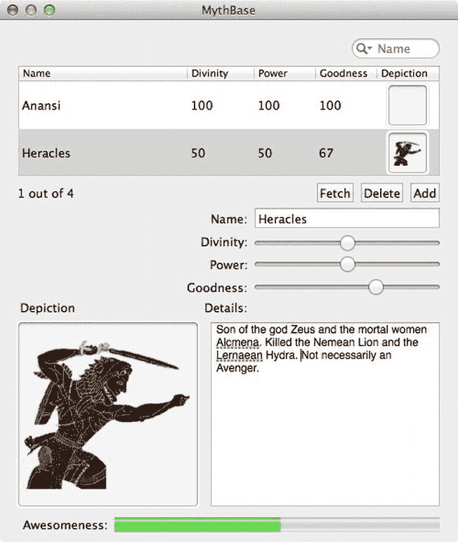

图 8-1. MythBase 应用程序的全貌

过去，遵循 MVC 原则的 Mac 应用程序开发者通常需要为这些常见需求自行设计解决方案。但 Core Data 不仅提供了上述所有功能，还额外提供了以下关键特性：

- **撤销/重做支持**：Core Data 处理值的机制已与 Mac OS X 的标准撤销功能集成。这一内建特性免去了我们自行实现该通用功能的大量额外工作。
- **与 Cocoa 绑定集成**：结合 Cocoa 绑定，Core Data 提供了一种通过通用控制器对象连接视图与模型的机制，从而消除了大量乏味的粘合代码。
- **持久化**：Core Data 提供了多种将对象持久化到磁盘的方式，允许我们在程序运行之间保存和加载对象状态。

总而言之，这些特性为应用程序核心提供了坚实的基础架构。我们可以使用 Core Data 构建图形界面应用（无论是否使用 Cocoa 绑定）、命令行工具、游戏，或任何其他能通过传统对象建模技术定义的软件系统。换句话说，几乎适用于所有类型的应用程序。

## 创建 MythBase

现在，让我们开始创建 MythBase——一个用于维护神话人物数据库的 GUI 应用程序。我们将使用 Core Data 作为模型层，并借助 Cocoa 绑定处理大部分控制器功能。过程中会遇到一些新概念和术语，我们会在涉及每个部分时逐一解释。

在第一轮迭代中，我们将使用 Xcode 内的专用工具定义应用程序的模型，并通过 Xcode 的助手创建一个简单的 GUI。在第二轮迭代中，我们将优化 GUI 以改善用户体验。随后，在解释应用程序的其他方面之后，我们将进行第三轮功能迭代，为应用程序的模型层添加业务逻辑。

首先，创建一个新的应用程序项目。在 Xcode 中，选择 File  New Project，在窗口左侧选择 OS X/Application，从项目模板列表中选取**Cocoa Application**，然后点击 Next。将产品名称设为 MythBase，类前缀设为 MB，勾选**Use Core Data**和**Use Automatic Reference Counting**复选框（见图 8-2），然后点击 Next。导航到合适的目录保存项目，点击 Create。


图 8-2. 创建新应用程序项目，并启用 Core Data 选项

## 定义模型

此时，我们拥有一个全新的项目，与之前创建的项目类似。选择使用 Core Data 会使 Xcode 采用略有不同的项目模板，因此这个项目会包含一些旧项目中未曾见过的内容。Xcode 的导航面板中新增了一个名为`MythBase.xcdatamodeld`的文件，这就是空的 Core Data 模型文件。模型文件包含应用程序模型层的元数据。我们使用 Xcode 内置的图形工具创建模型文件，应用程序在运行时读取该文件。另外，若我们在项目导航区中搜索，会发现`CoreData.framework`已被添加至 Frameworks/Other Frameworks 下。

### 建模：是什么？

接下来，我们假设您对对象建模或数据库建模有一定了解。但如果您对此完全困惑，这里提供一个非常简短的总结。其核心思想是：应用程序所处理的"内容"——即应用程序"关乎"的数据——可以通过建模技术拆分为独立的块，并组织成合理的结构。使用 Core Data 时，您需要按以下思路组织数据：

- **实体（Entity）**：实体用于描述应用程序中可唯一标识的"事物"，即能够独立存在、描述和识别的事物。实体通常是系统中的主要"名词"。例如：人、公司、货币交易都是实体。而眼睛颜色、市值、交易金额则不是实体。
- **属性（Attribute）**：任何看似实体描述性特征、且不涉及其他事物的内容，很可能就是该实体的属性。眼睛颜色、市值、交易金额很可能分别是上述人、公司、货币交易的属性。而一个人的当前账户余额、公司 CEO 的电话号码、收款人的电子邮件地址**不是**我们所述实体的属性。这些内容更适合通过遍历指向其他实体的**关系**来访问其属性。
- **关系（Relationship）**：使用关系建立实体之间的关联。关系可以是一对多（一个人可以是多笔交易的收款人）、多对一（多人可受雇于同一家公司）、一对一（每人只能有一个配偶），或多对多（一家公司可以有多个客户，同时一个人也可以是多家公司的客户）。

模型文件包含的信息对于任何从事过对象建模、数据库建模或实体关系建模的人来说都不陌生。首先，**实体**的概念大致对应于对象建模中的类或数据库建模中的表。每个实体由多个**属性**组成，实体之间可以通过**关系**相互连接。


## 排版后的文本

在 Xcode 和文档中，属性和关系统称为**属性**，Objective-C 2.0 中对同一术语的这种复用并非巧合。在模型对象内部，每个属性和每个关系都可以通过一个 Objective-C 属性访问，该属性的名称与模型文件中定义的属性名称相同。在我们将要为 MythBase 构建的模型中，我们将创建一个包含多个属性的单一实体。我们将在第 9 章中介绍关系。

## 使用 Xcode 的模型编辑器

首先，在 Xcode 的导航面板中单击 `MythBase.xcdatamodeld` 文件。这将在 Xcode 内置的模型编辑器中打开模型文件，该编辑器列出了三个表格视图：*属性*、*关系*和*获取属性*，以及左侧的*实体*、*获取请求*和*配置*的大纲视图。按 3 打开*数据模型检查器*；由于我们尚未为实体定义任何结构，它将初始显示为“未选择”，如图 8-3 所示。模型编辑器有两种不同的视图样式：一种是最初包含三个表格视图的视图，另一种是类似于一张空白方格纸的视图。我们将使用默认的表格视图样式，如图 8-3 所示，因为我们只有一个模型类。当处理复杂模型时，方格纸视图对于概览所有不同的实体及其相互关系非常有用。

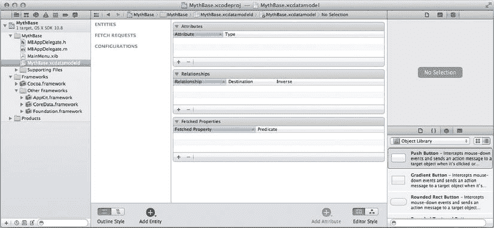

图 8-3. 创建任何实体之前的新模型文件

## 创建实体

对于 MythBase，我们将创建一个名为 `MythicalPerson` 的单一实体，并包含少量属性。首先，通过单击窗口底部附近的“添加实体”按钮来创建一个新实体。正如您所料，这将在左侧的实体列表中创建一个名为 Entity 的新实体。选中新实体后，其详细信息将在右侧的表格视图中可见。将新实体的名称更改为“MythicalPerson”，其余控件保持默认状态。我们的实体是一个名为 `NSManagedObject` 的类的实例，这是 Core Data 中包含的一个通用类，为 Core Data 的模型对象提供了所有基本功能。稍后，我们将需要为该实体编写一些代码，届时我们将创建 `NSManagedObject` 的自定义子类，但目前这个通用类就足够了。

现在让我们创建我们的实体。我们已经做了一些对象建模，并提出了一个神话人物可能具备的几个特征。

`MythicalPerson` 实体将包含六个属性。这些属性见表 8-1，其中包含每个属性类型的一般描述以及相应的 Core Data 存储类型。

表 8-1. MythicalPerson 属性

| 属性名称 | 通用类型 | Core Data 类型 |
| --- | --- | --- |
| 姓名 | 字符串 | String |
| 详情 | 字符串 | String |
| 神性 | 整数 (0-100) | Integer 16 |
| 善良度 | 整数 (0-100) | Integer 16 |
| 力量值 | 整数 (0-100) | Integer 16 |
| 图像 | 图片 | Transformable |

Core Data 包含 `String` 和 `Date` 类型，以及一系列数字类型：`Integer 16`、`Integer 32`、`Integer 64`、`Float`、`Double`、`Decimal` 和 `Bool`。此外，它还包含一种 `Binary` 类型，允许通用存储我们可能想要附加到实体的任何数据（我们自行将其打包成二进制块），以及一种特殊的 `Transformable` 类型，允许许多原本不受支持的 Cocoa 类（例如 `NSImage`）与 Core Data 一起存储（稍后会详细介绍）。请注意，Core Data 存储类型与 Cocoa 中的值类（如 `NSString`、`NSNumber` 等）名称不同。

当 Core Data 属性被读入正在运行的应用程序时，它们会被转换为最接近的 Cocoa 等价物，这意味着，例如，所有数字类型在应用程序中最终都会变成 `NSNumber`，并在保存时转换回底层的存储格式。

## 创建属性

让我们开始创建 `MythicalPerson` 的属性。在 Xcode 中打开 `MythBase.xcdatamodeld` 文件，单击以选中 `MythicalPerson` 实体，然后单击窗口顶部属性表格视图左下角的小 + 号。一个新建属性将出现在表格视图中。将其名称设置为“name”，类型设置为 String，然后按下回车键。

现在查看右侧检查器中的复选框，分别标有*可选*、*瞬态*和*已索引*。默认情况下，*可选*处于选中状态，其他则未选中。*可选*的含义很明确。选中它意味着用户在创建或编辑对象时可以选择不为该属性输入值。至于其他复选框，选中*瞬态*可配置该属性不随其他数据一起保存（尽管 Core Data 仍会跟踪对该属性的更改以提供撤销/重做支持），而选中*已索引*则为该属性启用索引，从而允许基于该属性快速搜索 Core Data 存储后端。对于 `name` 属性，请确保*已索引*被选中，而其他选项未被选中。

在复选框下方，您可以使用弹出列表指定属性的类型（这与表格视图中的弹出列表设置相同）。如果我们在主表格视图中将“name”指定为 String，那么在其正下方的空间中将出现一些附加选项。在这里，我们可以指定简单的验证规则，例如字符串的长度。我们还可以指定默认值，该值将在每次创建新的 `MythicalPerson` 实例时出现。为默认值输入“Name”，其他字段留空。

现在我们来处理 `details` 属性，它旨在保存所讨论的 `MythicalPerson` 的文本描述。单击*属性*表格视图下方的 + 按钮以添加一个新属性，并将新属性的名称更改为“details”。我们将以与 name 属性略有不同的方式来配置此属性。它应该是 String 类型（从弹出列表中选择），并且*已索引*复选框应被选中，但在此情况下，*可选*复选框也应被选中，以便用户可以选择根据需要将此字段留空。此外，我们将默认值留空。

接下来，我们将处理 `MythicalPerson` 的数字属性：`divinity`、`goodness` 和 `power`。创建一个新属性并将其命名为“divinity”，并将其类型设置为 `Integer 16`，这是 Core Data 支持的最小整数类型。这次配置复选框，使其为可选，但既不是瞬态也不是已索引（因为我们预计没有实际需要使用神性值作为搜索参数来搜索 MythicalPerson）。显示界面将发生变化，显示一些适用于所选类型的附加配置。在这里，我们可以通过指定最小值和最大值来设置一些自动验证规则，还可以指定此属性的默认值。

在表 8-1 中，我们将神性定义为 0 到 100 之间的整数值，其理念是将角色定位在从人类到神祇的某个尺度上。例如，希腊神祇宙斯的神性值为 100，他的儿子赫拉克勒斯（其母阿尔克墨涅是普通人类）的神性值为 50，而普通人类（例如赫拉克勒斯的母亲）的神性值为 0。通过为属性指定最小值和最大值，我们让 Core Data 帮助我们确保无法保存这些属性的无效值。输入 0 作为最小值，100 作为最大值，50 作为默认值。参见图 8-4。


### 排版后内容

图 8-4 展示了正在编辑的实体/属性。  
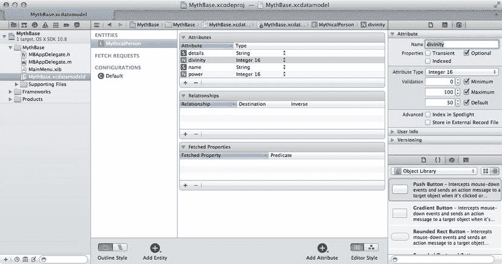  
图 8-4：这是在 Core Data 模型文件中编辑实体时的外观。

接下来我们将创建另外两个数值属性：`goodness` 和 `power`。它们同样以 0 到 100 的范围表示每个 `MythicalPerson` 的特性，并且其配置与 `divinity` 完全相同（当然，属性名称除外）。创建这些属性最简便的方法是：在表格视图中点击选中 `divinity` 属性，然后复制（ `C`），再粘贴两次（ `V`），得到两个名为 "divinity1" 和 "divinity2" 的新属性。将它们分别重命名为 "goodness" 和 "power" 即可 – 这两个新属性将具有与原始属性相同的最小值和最大值。

### 不支持类型的属性

最后一个需要配置的属性是 `depiction`。如前所述，`depiction` 属性用于存储图像，而 Core Data 并不了解 Cocoa 中通常使用的 `NSImage` 类。幸运的是，Core Data 的 Transformable 类型提供了一种简单的方式来存储图像。创建一个新属性，命名为 "depiction"，然后将类型选择为 Transformable。注意，检查器（Inspector）会随之变化，显示 Transformable 的配置选项。在检查器中，勾选 *Optional* 复选框（并取消其他选项）。Transformable 的配置选项非常简单：只有一个标签为 *Value Transformer Name* 的文本字段。但实际上这里比表面上看起来更复杂。其原理是：Transformable 属性保存的是 Core Data 并不真正理解的数据块；当 Core Data 从存储中读取这块数据时，会将其放入一个 `NSData` 对象（一个可以容纳任意数据块、充当 Objective-C “包装器”的对象），然后通过一个转换器（transformer）—— 一个知道如何将一种对象转换为另一种对象的特殊类。在相反的方向，当对象即将被保存到存储中时，Core Data 会获取新值并通过同一个转换器，只不过这次进行反向转换。

在本例中，我们将使用一个名为 `NSKeyedUnarchiveFromData` 的转换器。它能够根据包含对象键归档版本的 `NSData` 对象，生成任何类型的对象。什么是键归档？这里不做详细说明，但本质上键归档是一种以类字典格式归档或序列化对象所有实例变量的方式，以便日后重构该对象。这项技术在 Cocoa 中有多种应用，Cocoa 的所有类都内置了此功能。这意味着我们可以获取一个 `NSImage` 或任何其他 Cocoa 类的实例，并利用 `NSKeyedUnarchiveFromData` 的反向转换将其塞入一个 `NSData` 对象中。如果我们通过实现 `NSCoding` 协议来以键值方式保存和加载我们自己的类的实例变量，我们也可以以相同方式归档自己的对象。

回到 `depiction` 字段，其思路是将转换器类的名称写入 *Value Transformer Name* 文本字段中。事实证明，键归档非常普遍，以至于在这种情况下（在 Xcode 的建模工具中为属性指定转换器），它被用作默认值。如果我们将该字段留空，实体将被配置为使用 `NSKeyedUnarchiveFromData` 来将模型属性值与 `NSData` 相互转换以便存储。

至此，我们已经为本章的 MythBase 应用程序定义了完整的模型，接下来让我们继续创建 GUI。

---

## 设计 GUI

由于我们已经使用 Interface Builder 设计过几个用户界面，这里将快速讲解基本操作，并且不再提供每个检查器的快捷键。这个应用程序与 第 6 章 中的 VillainTracker 应用程序类似。我们的用户界面将允许用户搜索神话人物数据库、添加和删除人物，以及更改他们的特性。此外，我们将使用 Cocoa 绑定来完成连接。

### 自动生成 GUI

Xcode 3 包含一个名为 Core Data Entity Interface Assistant 的功能，可以根据 Core Data 模型自动生成带有基本 CRUD（增删改查）功能的 GUI。这个功能在 Xcode 4 中被移除了，因此我们必须手动完成。事实证明这非常简单，而且通过前面章节的学习，这个过程应该感觉熟悉。不仅如此，Xcode 生成的 UI 通常也需要大量清理工作。

### 创建 MythBase 显示界面

首先，在 Xcode 中单击 `MainMenu.xib` 文件。在左侧的对象停靠栏中，打开名为 "Window - MythBase" 的主窗口。我们将拖拽出一个表格视图和一组字段，以便创建和编辑数据库中管理的神话人物的属性，因此我们首先将窗口拉高。将其拖拽至 500 像素高。接着，在对象库中，于检查器底部的搜索字段中输入 "search"。对象库应显示一个对象：搜索字段。将搜索字段拖出对象库，放置到 MythBase 主窗口的右上角，让蓝色参考线指示其位置。接下来，在对象库搜索字段中输入 "table"。将一个表格视图拖拽到 MythBase 窗口，将其放置在窗口的左边缘。将其拉宽以填充窗口宽度，直到它与右侧的垂直蓝色参考线连接。将表格视图放置在搜索字段下方，它将自动吸附在搜索字段下方几个像素的位置。

打开 *Attributes Inspector*（属性检查器），将表格视图的 *Content Mode*（内容模式）设置为基于视图（view-based）。将 *Column Sizing*（列大小调整）设置为 "First Column Only"（仅第一列）。在 *Content Mode* 下方，将表格视图设置为 5 列。在设置表格视图为 5 列时，您可能会注意到表格视图下方闪过一个水平滚动条。新增加的列将位于表格视图的右侧之外，因此点击第二列并将其调整得更窄，直到所有五列都可见，如图 8-5 所示。

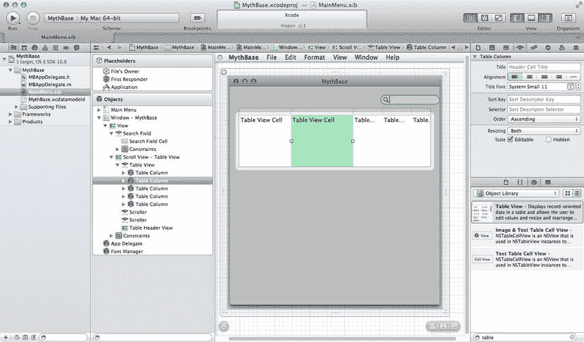  
图 8-5：为 MythBase 布局表格视图

表格视图将显示我们为 `MythicalPerson` 实体定义的所有属性（`details` 除外），因此我们需要设置列标题的标签。在表格视图中，点击第一列的标题，直到它变为可编辑的文本字段。在该文本字段中输入 "Name" 以设置列标题。点击下一列，将其名称设置为 "Divinity"。将接下来三列的标题分别设置为 "Power"、"Goodness" 和 "Depiction"。

接下来，我们将添加一个指示器，用于显示搜索时找到的结果数量。在对象库搜索字段中输入 "Label"，然后将一个标签字段拖拽到窗口左侧、表格视图下方。一如既往，蓝色参考线会指示放置位置。将标签的标题设置为 "# out of #"，并调整其大小以使所有文本可见。

我们下一组控件将是用于搜索、添加和删除记录的按钮。在对象库搜索字段中输入 "Button"。Cocoa 有多种按钮样式，我们将得到一系列选择。对于这个应用，我们使用渐变按钮。


拖出一个并将其放置在表格视图下方，与上一步中的文本字段平行。将其标题命名为“Fetch”。再拖出两个按钮，放置在 Fetch 按钮右侧。将这些新按钮分别命名为“Delete”和“Add”。命名后，将它们放置在表格视图下方，并与窗口右侧边缘对齐。布局应与图 8-6 一致。  
  
图 8-6 添加结果计数器和按钮  

**显示详细信息**  
我们现在需要布局用于显示所选神话人物详细信息的控件。Core Data 实体具有`name`、`divinity`、`power`、`goodness`、`depiction`和`details`属性，这些属性将显示在用户界面中。首先，在按钮下方靠近窗口中心线处找到并拖出一个标签。双击它，将其标题设置为“Name:”。在 *对象库* 中，找到并拖出一个文本字段（在搜索框中输入“field”），放置在 Name: 标签旁边。将其拉伸至大约窗口宽度的三分之一，即约 200 像素。将其拖至按钮下方并与屏幕右侧边缘对齐。蓝色参考线会帮助您将其对齐。将 Name: 标签拖到文本字段左侧，使其对齐。  

单击标签一次，按 C 复制，再按 V 在其下方粘贴一个新标签。粘贴的标签将出现在第一个标签的右下方。将其拖至第一个标签正下方；它会在适当距离处对齐。重复此操作两次，使第一个标签下方有四个标签排列成一列。选中全部四个标签，选择 Editor  Align  Right Edges（）。最后，将这些标签的标题分别设置为“Divinity:”、“Power:”和“Goodness:”。标签会自动调整大小以显示完整标题，同时保持右边缘对齐。  

`divinity`、`power`和`goodness`属性都是数值类型，因此我们将使用滑块来设置它们。在 *对象库* 中搜索“slider”，然后在 Divinity: 标签旁边、Name 文本字段下方拖出一个水平滑块。将其拉伸至与文本字段相同的宽度。蓝色参考线会指示位置。在 *属性检查器* 中，确保滑块的最小值为 0，最大值为 100，默认值为 50，这与我们在 Mythical Person Core Data 实体上创建的`divinity`属性一致。同时勾选 *属性检查器* 中的 *Continuous* 复选框。与处理标签类似，选中此滑块并按 C 复制，然后按 V 在其下方粘贴一个新滑块。将新滑块重新定位，使其与 Divinity 滑块对齐，并与 Power: 标签对齐。再次按 V 粘贴另一个滑块，将其放置在前两个滑块下方，并与 Goodness: 标签对齐。窗口应如图 8-7 所示。  
  
图 8-7 添加用于管理神话细节的控件  

尚未显示控件的两个属性是`depiction`和`details`。我们将为它们使用图像框和文本框。在 *对象库* 的搜索框中输入“image”，然后将一个 Image Well 拖出到屏幕左下角，让它吸附到角落的蓝色参考线上。将其大小调整为 150 像素高、200 像素宽。在 *属性检查器* 中，将图像框设置为可编辑。这将允许用户将图像拖入图像框。  

接下来，在 *对象库* 的搜索框中输入“text”，然后将一个 Text View 拖出到右下角。将其大小调整为 150 像素高、250 像素宽，这个宽度应足够填充窗口边缘与图像框之间的空间，并留出美观的间隙。当接近正确位置时，您会看到蓝色参考线，文本视图会自动对齐。我们需要对其属性进行一项重要更改。`NSTextView`默认能够显示富文本，这是一个很强大的功能，但代价是：在 Cocoa 中，富文本由`NSAttributedString`实例表示，这个类比`NSString`复杂得多，我们在这里不想深入讨论。为了使文本视图能够将其显示值绑定到普通字符串，我们必须关闭富文本处理。因此，在 *属性检查器* 中，单击取消选中 *Rich Text* 复选框（如果看不到，您可能选中了文本视图的父视图，即`NSScrollView`。再单击一次文本视图以选择内部的`NSTextView`）。您还可以将 *Find* 设置更改为 *Uses Bar*，并勾选 *Incremental Search*，以便文本搜索利用 OS × 10.7 中引入的 Find Bar 功能。  

这些控件需要标签，因此在 *对象库* 搜索框中输入“label”，然后将一个标签拖出到图像框上方，与图像框左边缘对齐。将其文本更改为“Depiction”。再拖出另一个标签放在文本视图上方，并将其标题设置为“Details”。将 Details 标签对齐，使其右边缘与滑块标签的右边缘对齐。  

最后要做的任务是配置表格视图的列。五列中有四列将显示文本或数字，因此默认配置即可。然而，对于 Depiction 列，我们想要显示图像，因此需要将该列中当前的`NSTextField`替换为图像框。使用左侧的对象停靠栏选择 Depiction 列表格视图单元格中包含的“Static Text”对象，如图 8-8 所示。选中后，按 Delete 键将其删除。在 *对象库* 的搜索框中输入“image”，然后将一个 Image Well 拖入表格视图 Depiction 列的空表格单元格视图中。图像框会被裁剪为表格单元格视图的高度，因此将表格视图单元格的高度扩展为 48 像素，使其足以显示整个图像。  
  
图 8-8 在对象停靠栏中选择 Depiction 文本字段  

至此，GUI 布局完成。它很美观，不是吗？现在我们需要将其连接到数据源以填充内容。我们将使用上一章讨论的 Cocoa 绑定来实现。  

**设置 Cocoa 绑定**  
当我们告诉 Xcode 要创建一个 Core Data 应用程序时，它生成了一个应用程序委托类（名为`MBAppDelegate`），其中包含用于处理 Core Data 的特殊支持。这种支持的一部分是，生成的`MBAppDelegate`类现在有一个`managedObjectContext`属性。Managed Object Context 是一个对象，它允许数组控制器（或您自己的代码）通过 Core Data 访问模型对象（`NSManagedObject`或其子类的实例）的源。我们稍后检查创建项目时自动放置的控制器代码时，将看到应用程序控制器如何提供此功能。与上一章一样，我们将使用`NSArrayController`来管理数据，但此处创建的`NSArrayController`将通过 Core Data（而不是`NSMutableDictionary`）访问其数据。并且，像上一章一样，我们将使用 Cocoa 绑定将其连接到用户界面。


## 绑定数组控制器

首先，我们需要在应用中添加一个数组控制器。在*对象库*的搜索框中搜索“array”，结果中会出现一个数组控制器。将其拖拽到界面构建器画布上，可以放置在编辑器面板的任意位置。无论在何处放置，它都会显示在界面构建器画布左侧的对象停靠区中。在对象停靠区中选中它，并将其重命名为“神话人物数组控制器”。打开*属性检视器*，将其模式从“类”（Class）改为“实体名称”（Entity Name）。在*实体名称*字段中输入“MythicalPerson”，这与我们在模型编辑器中使用的名称一致。最后，勾选*准备内容*（Prepares Content）复选框。这会在应用启动时触发数组控制器加载数据。

接下来，我们将把数组控制器链接到 `managedObjectContext`。在对象停靠区中仍选中数组控制器的状态下，选择*绑定检视器*。展开*参数*（Parameters）部分，然后从弹出列表中选择*应用代理*（App Delegate）。之后，勾选弹出列表旁边的*绑定到*（Bind to）复选框。接着，在*模型键路径*（Model Key Path）字段中输入“managedObjectContext”。这将把数组控制器连接到应用代理中的 Core Data 管道。

现在我们已经连接好数组控制器，接下来需要设置与 UI 控件的绑定。我们将从基本控件（文本字段和滑块）开始，然后处理更复杂的控件（图像显示区域和表格视图），最后完成按钮的连线。

第一个绑定是针对“名称”（Name）文本字段的。选择名称文本框，然后打开*绑定检视器*。展开*值*（Value）部分，勾选*绑定到*复选框，然后从下拉菜单中选择“神话人物数组控制器”。确保*控制器键*（Controller Key）框显示为“selection”，并在*模型键路径*字段中输入“name”，如图 8-9 所示。这将把文本字段连接到数组控制器所选对象的 name 属性。

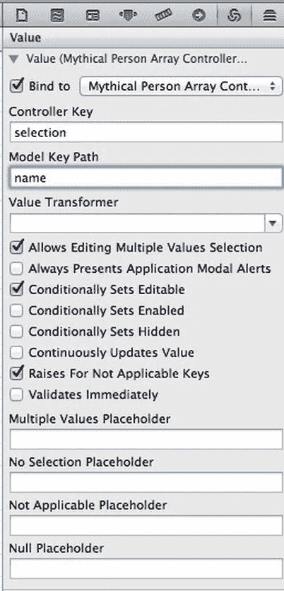

图 8-9. 用于将名称文本字段连接到神话人物数组控制器的绑定检视器

滑块的绑定设置类似；我们将建立到神话人物数组控制器所选项的绑定，并根据控件的相应属性设置不同的*模型键路径*。对于三个滑块，这分别对应我们在模型文件中创建的 `divinity`、`power` 和 `goodness` 属性。要设置这些绑定，请选择“神性”（Divinity）滑块并查看*绑定检视器*。展开*值*部分，勾选*绑定到*复选框，然后从下拉菜单中选择“神话人物数组控制器”。确保*控制器键*框显示为“selection”，并在*模型键路径*字段中输入“divinity”。对“力量”（Power）和“善良”（Goodness）滑块重复此操作，并相应更改*模型键路径*。

设置“图像显示区域”（Depiction）和“详情”（Details）区域的绑定会稍微复杂一些。我们先处理“详情”。选择文本视图（请记住文本视图嵌入在 `NSScrollView` 中；您需要点击滚动视图才能进入文本视图本身）。在*绑定检视器*中，与名称文本字段和滑块相比，会有不同的选项。不过，仍然有一个*值*部分，我们将使用它。展开*值*部分，勾选*绑定到*复选框，并使用“details”作为*模型键路径*。

对于“图像显示区域”，我们需要获取一个 `NSImage` 供图像井显示。Core Data 并不知道 `NSImage`，但这并不是问题。还记得我们之前讨论过的转换器和 Core Data 使用的可转换类型吗？

由于 depiction 是一个可转换属性，其值需要在 GUI 中看到的内容（一个 `NSImage`）和 Core Data 能够存储的内容（`NSData`）之间进行转换。我们将通过为此控件添加 `NSKeyedUnarchiveFromData` 到 Cocoa 绑定配置来实现这一点。选择图像井并调出*绑定检视器*。与其他字段一样，打开*值*部分。勾选*绑定到*复选框，确保*控制器键*显示为“selection”，并将*模型键路径*设置为“depiction”。为了完成从 `NSData` 到 `NSImage` 的转换，点击值转换器（Value Transformer）弹出列表，并选择 `NSKeyedUnarchiveFromData`。

## 配置表格视图的绑定

现在来处理表格视图的绑定。为基于视图的表格视图设置 Cocoa 绑定分为两步。首先，我们必须为表格视图本身设置绑定。然后，为行中的每个视图设置绑定。表格视图会施展一些“魔法”，将其绑定源暴露给其子视图，该子视图名为“表格单元格视图”（Table Cell View）。在该绑定中，有一个“objectValue”的*模型键路径*，它代表该行的对象。

首先，选择表格视图本身。在左侧的对象停靠区中选择最为方便。在*绑定检视器*中，展开*内容*（Content）部分，勾选*绑定到*复选框，确保下拉菜单显示为“神话人物数组控制器”，并且*控制器键*显示为“arrangedObjects”。对于表格视图本身，我们不需要设置*模型键路径*。我们还希望表格视图中选中的行能够传回给数组控制器。为此，请展开*绑定检视器*的*选择索引*（Selection Indices）部分。在此处勾选*绑定到*复选框，将下拉菜单设置为“神话人物数组控制器”，并将*控制器键*设置为“selectionIndexes”。您的绑定应如 图 8-10 所示。

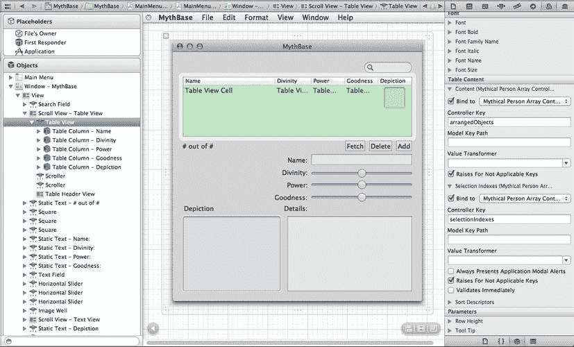

图 8-10. 设置表格视图的绑定

表格中有五列：名称、神性、力量、善良和图像显示区域。我们不直接在列上设置绑定；相反，我们将为每列中包含的视图设置绑定。对于前四列，视图是包含在 `NSTableCellView` 内的一个 `NSTextField`。对于“图像显示区域”列，视图是包含在 `NSTableCellView` 内的一个 `NSImageWell`。不幸的是，Xcode 将 `NSTableCellView` 内文本字段的默认值设置为“Table View Cell”，这似乎有意制造混淆。表格视图中的视图是 `NSTableCellView` 的实例，尽管它们的默认文本如此。文本字段和图像井将绑定到表格单元格视图的 `objectValue` 属性。

我们从“名称”列开始。在“名称”列中选择表格单元格视图，如果您在 UI 界面中点击，可能需要双击；或者通过在左侧的对象停靠区展开“表格列 - 名称”（Table Column - Name）条目，并逐级深入其中的“静态文本 - 表格单元格视图”（Static Text - Table View Cell）条目。在*绑定检视器*中，展开*值*部分。勾选*绑定到*复选框，确保下拉菜单显示为“表格单元格视图”（Table Cell View），并将*模型键路径*设置为“objectValue.name”。*控制器键*应为空。

“神性”、“力量”和“善良”的绑定设置类似。依次选择每列并逐级深入其中的静态文本字段。像设置“名称”列一样设置值绑定：打开*值*部分，勾选*绑定到*复选框，确保下拉菜单显示为“表格单元格视图”，并根据情况将*模型键路径*设置为“objectValue.divinity”、“objectValue.power”或“objectValue.goodness”。

接下来处理“图像显示区域”列。在“图像显示区域”列中选择表格单元格视图内的图像井。在*绑定检视器*中，打开*值*部分。


和之前一样，勾选 `Bind to` 复选框，确保下拉菜单显示的是 Table Cell View。将 `Model Key Path` 设置为 “objectValue.depiction”。正如我们对上面的 Depiction 视图所做的那样，点击 Value Transformer 弹出列表，然后选择 `NSKeyedUnarchiveFromData`，如 图 8-11 所示。至此，表格视图的配置就完成了！  
  
图 8-11. 为 Depiction 列建立绑定  

对于表格视图左下方显示匹配数量的文本字段，我们将使用一种不同的绑定方法，这样我们就可以使用格式字符串来构建文本字段的内容。在这种情况下，我们将使用 `Display Pattern Value1` 而不是 `Value`。展开 `Display Pattern Value1` 部分，勾选 `Bind to` 复选框，并将下拉菜单设置为 Mythical Person Array Controller，和之前一样。在 `Controller Key` 中输入 “selection”。这次，我们将使用一个不同的键路径（key path）。将 `Model Key Path` 设置为 “@count”，`Display Pattern` 设置为 “%{value1}@ out of %{value2}@。” 现在，在 `Display Pattern Value1` 下面出现了另一个名为 `Display Pattern Value2` 的绑定选项。展开 `Display Pattern Value2` 部分，勾选 `Bind to` 复选框，并将下拉菜单设置为 Mythical Person Array Controller，和之前一样。这次，在 `Model Key Path` 中输入 “@count”，并在 `Controller Key` 中输入 “arrangedObjects” 来替代 “selection”。`Display Pattern` 将自动填入我们在 `Display Pattern Value1` 绑定中输入的值。  

现在，我们需要连接 Fetch、Delete 和 Add 按钮。为此，我们将结合使用目标-动作连接（用于响应点击）和 Cocoa 绑定（用于适时启用或禁用按钮）。让我们从目标-动作连接开始。选择 Fetch 按钮，按住 Control 键拖出一条连接线到 Mythical Person Array Controller。数组控制器将位于对象停靠栏（Object Dock）中对象列表的底部；如果您看不到它，请将鼠标悬停在对象停靠栏底部，它会向下滚动以显示数组控制器。选择 `fetch:` 动作。对 Delete 和 Add 按钮执行相同操作，分别选择 `remove:` 和 `add:` 动作。  

接下来，我们将为 Add 和 Remove 按钮的 Enabled 属性建立绑定。选择 Add 按钮并打开`绑定检查器`（Bindings Inspector）。展开`可用性`（Availability）下的`已启用`（Enabled）部分。您能猜到下一步是什么吗？没错，勾选 `Bind to` 复选框，确保下拉菜单显示为 Mythical Person Array Controller。但是，这次将 `Controller Key` 字段改为 “canAdd”。当您在 `Controller Key` 字段中开始输入时，将会看到一个可能的补全列表。对 Remove 按钮执行相同操作，将 `Controller Key` 改为 “canRemove”。  

我们现在已经构建了足够多的用户界面，在继续之前应该先测试一下。让我们来试试。保存 nib 文件并点击 Run。您应该能够点击 Add 按钮，并在表格视图中看到空白行。您还应该能够编辑名称并移动滑块，这些更改会反映在表格视图的选定行中。如果不是这样，请检查 nib 文件中的绑定和连接，确认它们是否与说明相符。  

## 完成绑定：保存和搜索  
我们的应用程序应该能够处理多条记录，并允许创建和删除神话人物。但我们还不能保存或搜索，这使得它成为一个相当糟糕的数据库。现在让我们来解决这个问题。  

保存很简单。Xcode 生成的应用程序委托（Application Delegate）类为我们处理了这件事；我们只需要告诉它何时保存。在主菜单（Main Menu）中，有一个包含保存菜单项（Save menu item）的文件菜单（File menu）。保存菜单项已经预先绑定到了  S 键快捷键上。我们的应用也将使用这个快捷键。  

在 Interface Builder 的对象停靠栏中，展开 Main Menu 对象，然后展开 File 菜单，再展开 Menu Item – Save 项目。注意，我们讨论的是对象停靠栏中的对象，而不是 Xcode 自己的菜单！按住 Control 键拖出一条连接线到对象停靠栏中的 App Delegate，然后从列表中选择 `saveAction:` 动作。完成！  

搜索就没那么直接了，首先需要介绍一些术语。Core Data 的搜索支持基于*谓词*（predicates）。一个谓词由属性名称、运算符和一个搜索值组成；一个搜索字段可以支持多个谓词。谓词的两个例子是 `name contains Heracles` 或 `goodness greater than 75`。如果您熟悉 SQL，SQL 命令的 `WHERE` 子句就是由谓词构成的。对于 MythBase 来说，MythicalPerson 实体的所有属性（depiction 除外）都应该可搜索，因此我们需要定义几个谓词。我们不能搜索 depiction，因为二进制和可转换属性本质上是不可搜索的。谓词可以在`绑定检查器`中定义，我们接下来就要去那里操作。  

我们将从定义一个用于搜索 name 属性的谓词开始。选择屏幕右上角的搜索字段，然后打开`绑定检查器`。在`绑定检查器`底部附近有一个名为`谓词`（Predicate）的部分。展开它并勾选 `Bind to` 复选框，将其绑定到 Mythical Person Array Controller。`Controller Key` 应该显示为 “filterPredicate”。将`显示名称`（Display Name）设置为 “Name”，谓词格式（predicate format）设置为 “name contains[c] $value”，其中 `$value` 表示搜索框的内容，name 表示应该被搜索的 MythicalPerson 实体属性。运算符 `contains[c]` 表示我们想要返回任何 name 属性包含 `$value` 所代表值的记录，并且使用不区分大小写的搜索——这就是末尾的 `[c]` 的含义。如果没有 `[c]`，搜索就是区分大小写的。  

请注意，现在创建了一个新的名为 `Predicate2` 的绑定。我们将用它来定义一个谓词，以搜索实体中所有可搜索的字段。打开 `Predicate2`，和第一个一样，勾选 `Bind to` 复选框，将其绑定到 Mythical Person Array Controller。`Controller Key` 应该显示为 “filterPredicate”。对于 `Predicate2`，将`显示名称`设置为 “All”，并将谓词格式设置为以下冗长的字符串：“(name contains $value) or (divinity.description contains $value) or (power.description contains $value) or (goodness.description contains $value) or (details contains[c] $value)。” 请注意，现在出现了一个名为 `Predicate3` 的新绑定。  

我们已经展示了如何搜索一个或多个属性。如果您希望能够搜索其他特定字段，例如 name 或 details，请随意按照上述相同模式添加更多谓词，并相应更改谓词格式值中的字段名称。构建搜索谓词的可能性比我们在这里讨论的要多得多，Apple 在 Xcode 文档中提供了一个谓词编程指南（Predicate Programming Guide）章节，对此进行了详细介绍。  

好了，完成所有这些之后，是时候运行应用程序了。按下 Xcode 窗口左上角的 Run 按钮，您应该能够创建一些 Mythical Person 记录，将图片拖入大的图片框以显示图片，使用文件（File） 保存（Save）菜单项来保存记录，以及搜索数据库。搜索字段左侧边缘的问号图标应该能让您选择哪个搜索谓词处于活动状态。当您退出并重新运行应用程序时，记录应该会被保留并在启动时重新加载。  

我们仅仅通过定义模型和构建图形用户界面（GUI）就制作出了一个看起来相当酷的应用程序。值得注意的是，我们一行代码也没有写！


这是`Cocoa`一直以来所支持的视觉编程模型的一个绝佳示例，并且随着过去几年`Cocoa bindings`和`Core Data`的加入，它变得更加完整。当然，这一切的基础是那些让这些“魔法”在`Xcode`中得以实现的框架和 API，而有时你也会希望或需要从代码中访问`Core Data`的功能。本章的其余部分将介绍使用`Core Data`进行编程（在传统的、基于代码的意义上）的一些方面，首先从浏览`Application Delegate`类中生成的代码开始。

## 探究模板代码

当我们创建`MythBase`项目时，系统为我们创建了一个名为`MBAppDelegate`的应用程序委托类。这个类包含加载我们应用程序中包含的`Core Data`模型文件中的模型信息的代码。它还打开了磁盘上的存储空间，`Core Data`在此读取和写入其模型对象，如果该存储空间不存在，则创建它。最后，它通过一个`NSManagedObjectContext`提供对数据存储的访问，其他对象可以依次绑定到该上下文（例如我们 nib 文件中的数组控制器），以便从存储中读取和写入数据。

此处显示的所有代码都已重新格式化，以更好地适应本书的版式，因此您的版本可能略有不同，但语法上应该是相同的。

### 应用程序委托接口

让我们直接开始，查看头文件`MBAppDelegate.h`，如下清单所示。这是由`Xcode 4.5`为 Mountain Lion 自动生成的代码。不同版本的`Xcode`生成的代码可能略有不同，如果您愿意，可以将其修改为与此处显示的版本一致：

```
#import <Cocoa/Cocoa.h>

@interface MBAppDelegate : NSObject <NSApplicationDelegate>

@property (assign) IBOutlet NSWindow *window;

@property (readonly, strong, nonatomic) NSPersistentStoreCoordinator *persistentStoreCoordinator;
@property (readonly, strong, nonatomic) NSManagedObjectModel *managedObjectModel;
@property (readonly, strong, nonatomic) NSManagedObjectContext *managedObjectContext;

- (IBAction)saveAction:(id)sender;

@end
```

这段代码声明了一个包含四个属性和一个方法的简单类。`window`变量的属性声明中也包含了`IBOutlet`，使其成为一个可用于连接到`Interface Builder`中窗口的出口。另外三个属性是一些重要的`Core Data`类的实例：

- `NSPersistentStoreCoordinator`管理后端存储，提供对一个或多个`NSPersistentStore`实例的访问，每个实例代表一个存储位置（在文件中或内存中）。协调器的目的是让应用程序可以访问多个持久化存储，就好像它们是一个整体一样。某些应用程序可能希望使用它来将应用程序数据分区到多个存储中。例如，你可能希望区分常规实体（其对象保存到磁盘）和临时实体（其对象仅保存在内存中，用户退出应用程序时就会消失）。即使没有保存到磁盘，临时对象仍然可以受益于`Core Data`的其他功能（简单的`Undo`支持、与`Cocoa bindings`的集成等）。
- `NSManagedObjectModel`从一个或多个模型文件（通常包含在您的应用程序包中）加载关于实体及其属性的信息，并充当一种元数据仓库，包含应用程序托管对象的结构。许多应用程序永远不需要直接与之交互。
- `NSManagedObjectContext`负责管理所有托管对象（我们通过`Core Data`存储的模型对象）的生命周期。它通过`NSPersistentStoreCoordinator`访问对象本身，并提供用于创建、读取、更新和删除对象的高级功能。

大多数应用程序都会在某个时候使用`NSManagedObjectContext`来创建对象、保存更改等。

当我们查看实现文件时，我们将看到每个对象是如何被使用的。头文件中的最后一个声明是`saveAction:`方法，当用户从`MythBase`菜单中选择文件保存时，会调用该方法。我们将在下一节了解其工作方式。

### 应用程序委托实现

现在让我们切换到`MythBase_AppDelegate.m`，看看它做了什么。除了实现接口中声明的`saveAction:`方法外，它还需要确保为其声明的属性实现了适当的访问器。这包括`window`的 getter 和 setter，以及其他属性（被声明为只读）的 getter。与头文件一样，这段代码是使用 Mountain Lion 上的`Xcode 4.5`自动生成的。如果您使用的是其他版本，您看到的代码可能会略有不同。

#### `applicationSupportDirectory` 方法

文件开头如下所示：

```
#import "MBAppDelegate.h"

@implementation MBAppDelegate

@synthesize persistentStoreCoordinator = _persistentStoreCoordinator;
@synthesize managedObjectModel = _managedObjectModel;
@synthesize managedObjectContext = _managedObjectContext;

- (void)applicationDidFinishLaunching:(NSNotification *)aNotification {
    // 在此处插入代码以初始化您的应用程序
}

// 返回应用程序用于存储 Core Data 存储文件的目录。此代码使用用户 Application Support 目录中名为 "com.learncocoa.MythBase" 的目录。
- (NSURL *)applicationFilesDirectory {
    NSFileManager *fileManager = [NSFileManager defaultManager];
    NSURL *appSupportURL = [[fileManager URLsForDirectory:NSApplicationSupportDirectory inDomains:NSUserDomainMask] lastObject];
    return [appSupportURL URLByAppendingPathComponent:@"com.learncocoa.MythBase"];
}
```

类实现中首先展示的是一些`@synthesize`指令，它们负责处理头文件中声明的属性的 getter 和 setter。接下来是`applicationDidFinishLaunching:`方法的存根，我们之前见过，这对于任何应用程序委托类都是标准的。之后是一个名为`applicationFilesDirectory`的方法的实现，它返回一个包含目录名称的`NSURL`，应用程序可以将数据保存到该目录中（在我们的例子中，是`Core Data`保存其持久化存储的位置）。通常，此方法返回`Application Support`目录子目录的完整路径，该子目录位于用户主目录下的`Library`目录中（`/Users/somebody/Library/Application Support/MythBase`）。

`applicationFilesDirectory:`方法是一个“辅助”方法，在类实现的其他地方被调用。请注意，该方法既未在头文件中声明，也未在私有类别或类似结构中声明。在`Objective-C`实现代码块中，代码可以调用同一实现代码块中之前出现的任何方法，即使它们没有在任何地方声明。当你想要稍微重构代码，将一些功能提取到自己的方法中，但又不需要在当前类实现之外的任何地方访问它时，这有时是一个便捷的捷径。

#### `managedObjectModel` 访问器方法

接下来是`managedObjectModel`方法。该方法作为`managedObjectModel`属性的 getter。

```
// 如有必要则创建，并返回应用程序的托管对象模型。
```


- (NSManagedObjectModel *)managedObjectModel {
    if (_managedObjectModel) {
        return _managedObjectModel;
    }

    NSURL *modelURL = [[NSBundle mainBundle] URLForResource:@"MythBase" withExtension:@"momd"];
    _managedObjectModel = [[NSManagedObjectModel alloc] initWithContentsOfURL:modelURL];
    return _managedObjectModel;
}

该方法简单地检查`managedObjectModel`是否已经创建。如果是，则返回它；如果不是，则通过读取应用程序包中的`MythBase.momd`资源文件来创建它。这个文件是由 Xcode 根据我们在本章开头创建的模型文件生成的。任何需要访问模型元数据的代码都可能调用`managedObjectModel:`方法。特别是，在创建`NSPersistentStoreCoordinator`时会被调用，该协调器需要读取或为我们的模型创建存储，因此它需要这些详细信息。

## 使用 NSError 进行错误处理

这里展示的一些代码使用了`NSError`对象来处理可能发生的错误。我们还没有介绍`NSError`，所以这里提供一个简要的说明。

`NSError`的基本思想是：某些方法需要在不使用返回值的情况下，告知调用方可能发生的潜在错误。为了实现这一点，您传入一个指向`NSError`指针的指针（在 C 语言中有时称为“句柄”），以便该方法可以创建一个`NSError`对象并将指针指向它，大致如下：

```
NSError *error = nil;
[someObject doSomething:&error];
if (error) {
    // handle the error somehow!
}
```

关于`NSError`的更多细节，请参见第 14 章。

## persistentStoreCoordinator 访问器方法

接下来是相当长的`persistentStoreCoordinator`方法：

```objective-c
// Returns the persistent store coordinator for the application.
// This implementation creates and returns a coordinator, having added the store for the application to it.
// (The directory for the store is created, if necessary.)

- (NSPersistentStoreCoordinator *)persistentStoreCoordinator {
    if (_persistentStoreCoordinator) {
        return _persistentStoreCoordinator;
    }

    NSManagedObjectModel *mom = [self managedObjectModel];
    if (!mom) {
        NSLog(@"%@:%@ No model to generate a store from", [self class], NSStringFromSelector(_cmd));
        return nil;
    }

    NSFileManager *fileManager = [NSFileManager defaultManager];
    NSURL *applicationFilesDirectory = [self applicationFilesDirectory];
    NSError *error = nil;

    NSDictionary *properties = [applicationFilesDirectory resourceValuesForKeys:@[NSURLIsDirectoryKey] error:&error];

    if (!properties) {
        BOOL ok = NO;
        if ([error code] == NSFileReadNoSuchFileError) {
            ok = [fileManager createDirectoryAtPath:[applicationFilesDirectory path] withIntermediateDirectories:YES attributes:nil error:&error];
        }
        if (!ok) {
            [[NSApplication sharedApplication] presentError:error];
            return nil;
        }
    } else {
        if (![properties[NSURLIsDirectoryKey] boolValue]) {
            // Customize and localize this error.
            NSString *failureDescription = [NSString stringWithFormat:@"Expected a folder to store application data, found a file (%@).", [applicationFilesDirectory path]];

            NSMutableDictionary *dict = [NSMutableDictionary dictionary];
            [dict setValue:failureDescription forKey:NSLocalizedDescriptionKey];
            error = [NSError errorWithDomain:@"YOUR_ERROR_DOMAIN" code:101 userInfo:dict];

            [[NSApplication sharedApplication] presentError:error];
            return nil;
        }
    }

    NSURL *url = [applicationFilesDirectory URLByAppendingPathComponent:@"MythBase.storedata"];
    NSPersistentStoreCoordinator *coordinator = [[NSPersistentStoreCoordinator alloc] initWithManagedObjectModel:mom];
    if (![coordinator addPersistentStoreWithType:NSXMLStoreType configuration:nil URL:url options:nil error:&error]) {
        [[NSApplication sharedApplication] presentError:error];
        return nil;
    }
    _persistentStoreCoordinator = coordinator;

    return _persistentStoreCoordinator;
}
```

这个方法看起来有点吓人，但我们将逐步分析它。它首先检查`persistentStoreCoordinator`实例变量中是否已存在对象，如果存在则返回它。否则，它需要自己初始化协调器，因此继续调用同名方法来获取`managedObjectModel`。如果该模型不存在，则应用程序不包含模型，此方法会记录错误，实际上放弃并返回`nil`。

否则，它会继续检查由`applicationFilesDirectory`方法返回的路径所指定的目录是否存在，该目录用于存放应用的 Core Data 存储。它通过调用`applicationFilesDirectory`返回的`NSURL`上的`resourceValuesForKeys:error:`方法来实现这一点，该方法返回一个包含所请求属性信息的`NSDictionary`。在这个例子中，我们请求`NSURLIsDirectoryKey`键的资源值，询问该 URL 是否代表一个目录（而不是文件）。

如果目录根本不存在（例如应用程序首次运行时），`resourceValuesForKeys:error:`方法可能返回`nil`。如果是这种情况，代码会检查`NSError`的内容，看路径是否不存在。如果路径不存在，它会尝试创建目录，然后检查目录创建是否成功。如果创建失败，则报告错误并返回`nil`。另一方面，如果`resourceValuesForKeys:error:`确实返回了一个属性对象，那么它会检查该对象的内容，看路径是否存在但不代表一个目录。如果存在一个同名的文件，就可能出现这种情况。如果这样，该方法会（在查找本地化错误消息后）报告错误并返回`nil`。

如果通过了所有这些边界情况（通常都会），那么该方法会构建一个指向存储文件应存放位置的 URL，创建一个`NSPersistentStoreCoordinator`，并告诉协调器根据该 URL 添加一个新存储。协调器足够智能，可以检查该 URL 是否已经存在持久化存储，如果不存在，则为我们创建一个。如果在过程中遇到任何错误，它会告诉我们，应用程序会向用户报告错误。

关于这个方法有几个值得关注的点：首先，这里是应用程序数据存储的实际文件名（当前为`MythBase.storedata`，不过在早期版本的 Mac OS/X 中默认是`MythBase.xml`）被指定的地方。如果您想将文件命名为其他名称，就需要在这里更改。

此外，这里还指定了后端存储的类型，就是在调用`addPersistentStoreWithType:configuration:URL:options:error:`方法时设置的。当前设置为`NSXMLStoreType`，这意味着存储的数据将以 XML 格式的文件存在。在开发应用程序时，这种存储方式很方便，因为生成的文件易于使用其他工具解析，或者直接用肉眼查看。然而，在交付最终应用程序之前，考虑到文件大小、速度和其他因素，您可能需要考虑将数据存储改为其他类型。


## 核心数据存储类型及相关委托

我们还有其他选择：`NSBinaryStoreType`（以二进制格式保存数据，占用更少的磁盘空间且读写速度更快）和`NSSQLiteStoreType`（除具备`NSBinaryStoreType`的优势外，还免去了持久化存储一次性将整个对象图加载到内存的负担；它仅在访问对象时进行加载）。在处理大型数据集时，这一差异变得至关重要。鉴于这一优势，我们建议在发布应用程序前，将存储类型从`NSXMLStoreType`切换为`NSSQLiteStoreType`。还有一种存储类型是`NSInMemoryStoreType`，可用于维护一个永不保存到磁盘的内存对象图。

默认的 Core Data 应用程序模板在隐藏数据存储方面做得相当出色，让你无需过多操心，但在发布应用前的某个时刻，你必须决定使用哪种格式来存储应用数据。我们已给出了推荐，但建议你在决定如何处理此问题前，查阅 Xcode 中的文档（搜索“core data programming guide”）以加深理解。

关于`persistentStoreCoordinator`，最后需要指出的是：如果你想将数据划分到不同的存储中（例如，一个存储在磁盘上，另一个仅保存在内存中，应用终止时数据消失），那么你需要在此处进行修改，将每个持久化存储添加到协调器中。

## managedObjectContext 访问器方法

现在我们来查看`managedObjectContext`方法，它是同名只读属性的 getter 方法：

```
// 返回应用程序的托管对象上下文（该上下文已绑定到应用程序的持久化存储协调器）。
- (NSManagedObjectContext *)managedObjectContext {
    if (_managedObjectContext) {
        return _managedObjectContext;
    }

    NSPersistentStoreCoordinator *coordinator = [self persistentStoreCoordinator];
    if (!coordinator) {
        NSMutableDictionary *dict = [NSMutableDictionary dictionary];
        [dict setValue:@"Failed to initialize the store" forKey:NSLocalizedDescriptionKey];
        [dict setValue:@"There was an error building up the data file." forKey:NSLocalizedFailureReasonErrorKey];
        NSError *error = [NSError errorWithDomain:@"YOUR_ERROR_DOMAIN" code:9999 userInfo:dict];
        [[NSApplication sharedApplication] presentError:error];
        return nil;
    }
    _managedObjectContext = [[NSManagedObjectContext alloc] init];
    [_managedObjectContext setPersistentStoreCoordinator:coordinator];

    return _managedObjectContext;
}
```

与我们看到的其他作为属性 getter 的方法类似，此方法首先检查实例变量是否已设置，若已设置则直接返回。否则，它会通过调用`persistentStoreCoordinator`方法来检查持久化存储协调器的存在性。如果该方法返回 nil，则本方法报告错误并返回 nil。如果协调器存在，则只需创建一个托管对象上下文，设置其持久化存储协调器，然后返回该上下文。

这段代码非常直接，除了可能自定义错误报告之外，你可能不会过多关注它。

## NSWindow 委托方法

接下来是一个名为`windowWillReturnUndoManager`的`NSWindow`委托方法。

```
// 返回应用程序的 NSUndoManager。在此情况下，返回的管理器是应用程序托管对象上下文的管理器。
- (NSUndoManager *)windowWillReturnUndoManager:(NSWindow *)window {
    return [[self managedObjectContext] undoManager];
}
```

此方法允许我们指定负责处理包含 GUI 的窗口的撤销/重做操作的对象。

我们将在后续章节讨论撤销/重做系统，但目前你需要知道的是，此方法会告知系统使用 Core Data 的撤销管理器，该管理器通过托管对象上下文进行访问。

## saveAction: 操作方法

接下来是`saveAction:`方法，当用户点击相关菜单项时调用。

```
// 执行应用程序的保存操作，即向应用程序的托管对象上下文发送 save: 消息。任何遇到的错误都会呈现给用户。
- (IBAction)saveAction:(id)sender {
    NSError *error = nil;

    if (![[self managedObjectContext] commitEditing]) {
        NSLog(@"%@:%@ unable to commit editing before saving", [self class], NSStringFromSelector(_cmd));
    }

    if (![[self managedObjectContext] save:&error]) {
        [[NSApplication sharedApplication] presentError:error];
    }
}
```

此方法非常简单。它首先通知上下文确保所有待处理的编辑都已提交到底层模型对象，并在提交失败时打印警告。无论提交成功还是失败，它接着会通知上下文将所有模型对象保存到存储中。如果保存失败，则会向用户显示错误信息。

## NSApplication 委托方法

现在我们来看这个类的最后一个方法，即`NSApplication`委托方法`applicationShouldTerminate:`。当用户从菜单中选择“退出”时，应用程序会调用此方法，它为委托提供了保存更改、检查自身状态、询问用户是否真的想退出等机会。此方法的返回值决定了应用程序是否真正终止。代码如下：

```
- (NSApplicationTerminateReply)applicationShouldTerminate:(NSApplication *)sender {
    // 在应用程序终止前，保存应用程序托管对象上下文中的更改。

    if (!_managedObjectContext) {
        return NSTerminateNow;
    }

    if (![[self managedObjectContext] commitEditing]) {
        NSLog(@"%@:%@ unable to commit editing to terminate", [self class], NSStringFromSelector(_cmd));
        return NSTerminateCancel;
    }

    if (![[self managedObjectContext] hasChanges]) {
        return NSTerminateNow;
    }

    NSError *error = nil;
    if (![[self managedObjectContext] save:&error]) {

        // 自定义此代码块以包含特定于应用程序的恢复步骤。
        BOOL result = [sender presentError:error];
        if (result) {
            return NSTerminateCancel;
        }

        NSString *question = NSLocalizedString(@"Could not save changes while quitting. Quit anyway?", @"Quit without saves error question message");
        NSString *info = NSLocalizedString(@"Quitting now will lose any changes you have made since the last successful save", @"Quit without saves error question info");
        NSString *quitButton = NSLocalizedString(@"Quit anyway", @"Quit anyway button title");
        NSString *cancelButton = NSLocalizedString(@"Cancel", @"Cancel button title");
        NSAlert *alert = [[NSAlert alloc] init];
        [alert setMessageText:question];
        [alert setInformativeText:info];
        [alert addButtonWithTitle:quitButton];
        [alert addButtonWithTitle:cancelButton];

        NSInteger answer = [alert runModal];

        if (answer == NSAlertAlternateReturn) {
            return NSTerminateCancel;
        }
    }

    return NSTerminateNow;
}
```

与`persistentStoreCoordinator`方法类似，我们将逐段分析这段代码。首先，它检查是否确实存在需要处理的`managedObjectContext`。如果不存在，则立即返回`NSTerminateNow`，应用程序终止。如果存在`managedObjectContext`，则通知上下文提交所有待处理的更改。


如果失败，它会记录一条错误消息并返回`NSTerminateCancel`，这会使应用程序中止当前的终止过程并继续其正常操作。然后，它会检查`managedObjectContext`是否实际有任何待处理的更改，如果没有，则返回`NSTerminateNow`。最后，它会执行关键步骤，指示上下文保存其更改。如果保存失败，则会触发最终的大的条件块。该块会构造一个`NSAlert`，它是一种特殊的窗口类型，会出现在所有其他应用程序窗口的前面，并强制您通过点击按钮做出选择（您将在第 11 章中了解更多关于`NSAlert`和其他窗口的信息）。在这种情况下，它会告知用户他们的更改未被保存，并询问他们是选择“无论如何退出应用程序”还是“取消终止并返回正常状态”。根据此请求的返回值，它要么返回`NSTerminateCancel`，要么“直接通过”并返回`NSTerminateNow`。

是时候指出此方法中的一个小错误了：在接近末尾处，当方法检查“取消”按钮是否被按下时，它实际上是将`answer`与错误的值进行比较。它应该是`NSAlertSecondButtonReturn`，而不是`NSAlertAlternateReturn`。这可能不是什么大问题，并且我们不会为示例应用程序费心去修复它，但逻辑中的这个错误使得当应用程序处于特定的无效状态时无法避免退出。哎呀！

一个值得注意的有趣之处是此方法中使用了`NSLocalizedString`。`NSLocalizedString`是一种让我们的代码在可用时使用本地化资源的简单方式。它是一个 C 函数，接受两个参数：一个默认字符串和一个用于查找本地化字符串的键。例如，在`NSLocalizedString(@"Cancel", @"Cancel button title")`这样的调用中，`NSLocalizedString`会首先检查用户偏好的语言，然后检查是否存在以`@"Cancel button title"`为键的该语言的本地化字符串，如果存在则返回它。否则，它只会返回第一个参数`@"Cancel"`。

## 添加业务逻辑

既然我们已经了解了使用 Core Data 构建应用程序的基本思路，包括定义模型、配置 GUI 以及了解项目中模板提供的代码，现在是时候学习如何使用 Core Data 在我们的模型对象中实际实现一些“有趣”的功能了：即我们应用程序的“业务逻辑”。

部分业务逻辑直接在模型文件中指定，例如整数的`min`和`max`大小，而有些功能则需要一些代码。幸运的是，`NSManagedObject`提供了一些“钩子”，让我们可以测试对象的属性以验证它们并确保它们没问题。然而，为了使用这些钩子，我们首先需要创建一个`NSManagedObject`的子类来表示我们的`MythicalPerson`实体。到目前为止，我们一直使用的是`NSManagedObject`本身，但要添加代码，我们需要创建一个子类。

### 创建 MythicalPerson 类

Xcode 会愉快地为我们创建`NSManagedObject`的子类。为此，请点击 File  New  File（或按 N）。在模板选择器中，从左侧的 OS X 部分选择 *Core Data*。然后，在主窗口中选择 *NSManagedObject subclass*。点击 Next。在出现的表格视图中，勾选`MythBase`的复选框，这表示我们将创建一个与`MythBase`数据模型中描述的实体一起工作的`NSManagedObject`子类。点击 Next。下一个选择是指定要为哪个实体创建`NSManagedObject`类。由于我们只定义了一个实体，这里只有一个选择：`MythicalPerson`。勾选它，然后点击 Next。最后，系统会询问我们将文件保存到哪里。文件面板应默认指向`MythBase`的主目录，这正是我们想要的位置。

保持其他选项为默认值，并点击 Create。现在我们有了一个`MythicalPerson.h`和一个`MythicalPerson.m`文件可供使用。

`MythicalPerson.h`文件内容如下：

```objc
#import <Foundation/Foundation.h>
#import <CoreData/CoreData.h>

@interface MythicalPerson : NSManagedObject

@property (nonatomic, retain) id depiction;
@property (nonatomic, retain) NSString * details;
@property (nonatomic, retain) NSNumber * divinity;
@property (nonatomic, retain) NSNumber * goodness;
@property (nonatomic, retain) NSString * name;
@property (nonatomic, retain) NSNumber * power;

@end
```

我们为模型中定义的每个实体属性都提供了属性，并为其内容指定了合适的类。

在`MythicalPerson.m`文件中，我们看到以下内容：

```objc
#import "MythicalPerson.h"

@implementation MythicalPerson

@dynamic depiction;
@dynamic details;
@dynamic divinity;
@dynamic goodness;
@dynamic name;
@dynamic power;

@end
```

我们之前没有见过`@dynamic`指令。这告诉 Xcode，即使我们没有包含`@synthesize`指令，也不要自动合成它们，并且当它找不到访问器方法的实现时，不要产生警告。Core Data 会在运行时生成相应的访问器。

## 验证单个属性

假设我们想为`MythBase`添加一个特殊约束，以确保任何`MythicalPerson`都不能被命名为“Bob”。为此，我们只需将此处显示的方法添加到`MythicalPerson.m`的`@implementation`部分：

```objc
- (BOOL)validateName:(id *)ioValue error:(NSError **)outError {
  if (*ioValue == nil) {
    return YES;
  }
  if ([*ioValue isEqualToString:@"Bob"]) {
    if (outError != NULL) {
      NSString *errorStr = NSLocalizedString(
        @"You're not allowed to name a mythical person 'Bob'.  "
          " 'Bob' is a real person, just like you and me.",
        @"validation: invalid name error");
      NSDictionary *userInfoDict = [NSDictionary dictionaryWithObject:errorStr
        forKey:NSLocalizedDescriptionKey];
      NSError *error = [[NSError alloc] initWithDomain:@"MythicalPersonErrorDomain"
        code:13013 userInfo:userInfoDict];
      *outError = error;
    }
    return NO;
  }
  return YES;
}
```

请注意此方法的名字`validateName:error:`。这个命名约定来自于在 Cocoa 中无处不在的键值编码模型。Core Data 中的属性验证是通过使用名为`validate<Key>:error:`的方法来实现的。在将更改保存到数据存储时，会（如果存在的话）在每个托管对象上调用这些方法。在此方法中，我们应检查建议的值，如果没问题则返回`YES`。如果不是，则返回`NO`，并且还应该创建一个描述错误的`NSError`对象，并将传入的`NSError **`指向它。请注意，在创建错误时，我们需要指定一个标识错误名称的字符串和一个指明具体是哪个错误的整数。在一个更大的应用程序中，最好以某种方式标准化这些值。这样做可以帮助我们追踪用户可能报告的错误，还可以让我们捕获一些重复出现的错误并单独处理它们（例如，在应用控制器的`saveAction:`方法中）。我们将在第 12 章中进一步讨论这一点。

至此，我们可以编译并运行`MythBase`，一切应该和之前一样……直到我们将某个`MythicalPerson`的名字改为“Bob”并尝试保存更改，此时我们会被告知这是一个无效值。

## 验证多个属性

有时，我们需要能够同时验证多个属性，确保它们的组合有意义。


好的，作为高级文档工程师和翻译员，我将遵循您提供的注意事项和示例，将以下英文文本翻译成中文。


例如，假设我们为每个 `MythicalPerson` 设定了一个新约束：只有当 `divinity` 属性的值为 100（意味着只有处于完全“上帝模式”的人才能拥有高于 50 的 `power` 等级）时，`power` 属性的值才能超过 50。推荐的做法不是在 `validatePower:error:` 或 `validateDivinity:error:` 中检查此条件，而是在创建或编辑新托管对象时调用的另外两个验证方法中检查：`validateForInsert:` 和 `validateForUpdate:`。由于我们要在两个地方检查相同的内部一致性问题（即 `power > 50` 且 `divinity < 100`），我们将把该项检查放到我们自己的方法 `validateConsistency:` 中，并由另外两个方法调用它。

首先，让我们在 `MythicalPerson.m` 中实现这两个 Core Data 验证方法：

```
- (BOOL)validateForInsert:(NSError **)error {
  BOOL propertiesValid = [super validateForInsert:error];
  BOOL consistencyValid = [self validateConsistency:error];
  return (propertiesValid && consistencyValid);
}

- (BOOL)validateForUpdate:(NSError **)error {
  BOOL propertiesValid = [super validateForUpdate:error];
  BOOL consistencyValid = [self validateConsistency:error];
  return (propertiesValid && consistencyValid);
}
```

这两种方法的工作方式相同。首先，它们调用父类的同名方法；这非常重要，因为该方法会实际调用每个被更改属性的所有 `validate:error:` 方法。然后，会调用我们自己的 `validateConsistency:` 方法。如果这两个调用的返回值都是 `YES`，那么该方法本身返回 `YES`；否则返回 `NO`。

现在让我们看看 `validateConsistency:` 是什么样的。

```
- (BOOL)validateConsistency:(NSError **)error {
  int divinity = [[self valueForKey:@"divinity"] intValue];
  int power = [[self valueForKey:@"power"] intValue];
  if (divinity < 100 && power > 50) {
    if (error != NULL) {
      NSString *errorStr = NSLocalizedString(
        @"Power cannot exceed 50 unless divinity is 100",
        @"validation: divinity / power error");
      NSDictionary *userInfoDict = [NSDictionary dictionaryWithObject:errorStr
        forKey:NSLocalizedDescriptionKey];
      NSError *divinityPowerError = [[NSError alloc]
        initWithDomain:@"MythicalPersonErrorDomain" code:182
        userInfo:userInfoDict];
      if (*error == nil) {
        // 没有之前的错误，返回新错误
        *error = divinityPowerError;
      }
      else {
        // 将之前的错误与新错误合并
        *error = [self errorFromOriginalError:*error
          error:divinityPowerError];
      }
    }
    return NO;
  }
  return YES;
}
```

这个方法比单属性的验证方法稍微复杂一些。我们以同样的方式检查问题，如果一切正常则返回 `YES`，否则构造一个 `NSError`，将错误参数指向它，然后返回 `NO`。然而，为了与 Core Data“友好相处”，我们必须检查是否已存在错误，如果存在，则将其与我们自己的错误合并成一种特殊类型的错误。这使得 Core Data 最终能够在尝试保存时报告它发现的所有错误。这种错误合并是通过我们自己的另一个方法 `errorFromOriginalError:error:` 完成的，我们应该将其添加到我们的类中。

```
- (NSError *)errorFromOriginalError:(NSError *)originalError
    error:(NSError *)secondError {
  NSMutableDictionary *userInfo = [NSMutableDictionary dictionary];
  NSMutableArray *errors = [NSMutableArray
    arrayWithObject:secondError];

  if ([originalError code] == NSValidationMultipleErrorsError) {
    [userInfo addEntriesFromDictionary:[originalError userInfo]];
    [errors addObjectsFromArray:[userInfo
      objectForKey:NSDetailedErrorsKey]];
  }
  else {
    [errors addObject:originalError];
  }
  [userInfo setObject:errors forKey:NSDetailedErrorsKey];
  return [NSError errorWithDomain:NSCocoaErrorDomain
                             code:NSValidationMultipleErrorsError
                         userInfo:userInfo];
}
```

基本上，此方法检查 `originalError` 参数是否已包含多个错误，如果是，则只需将新错误添加到列表中。否则，它将两个单个错误合并到一个新的多错误对象中。

完成所有这些之后，我们现在应该能够编译并运行，选择一个 `MythicalPerson`，将其 `power` 设置为高于 50，`divinity` 设置为低于 100，然后尝试保存。我们会看到一个错误，告知我们问题所在。我们还可以通过保持 power/divinity 的不一致性，将名称更改为“Bob”，然后尝试保存，来确保多问题的报告功能正常工作。我们应该会看到一个警告面板，告知我们发生了多个验证错误，但不会看到其中任何一个的详细信息。这为将来扩展应用委托的 `saveAction:` 和 `applicationShouldTerminate:` 方法提供了一个好思路：想出一种显示多个错误的方法，而不是像当前这样只调用 `presentError:`。这是一个可以在空闲时处理的问题！

## 创建自定义属性

另一种常见的简单“业务逻辑”是基于对象属性中包含的值来创建自定义属性。例如，如果我们有一个具有 `firstName` 和 `lastName` 属性的实体，我们可能想要创建一个名为 `fullName` 的自定义属性，将两者组合在一起。

这种事情对于 Core Data 来说是小菜一碟。在我们的例子中，假设我们想为 `MythicalPerson` 添加一个名为 `awesomeness` 的属性，它将根据 `MythicalPerson` 的 `power`、`divinity` 和 `goodness` 计算得出。首先，我们在 `MythicalPerson` 的实现中定义一个名为 `awesomeness` 的方法：

```
- (int)awesomeness {
  int awesomeness = [[self valueForKey:@"divinity"] intValue] * 10 +
    [[self valueForKey:@"power"] intValue] * 5 +
    [[self valueForKey:@"goodness"] intValue];
  return awesomeness;
}
```

完成此操作后，我们可以对任何 `MythicalPerson` 调用 `awesomeness` 方法并获取结果。当然，这同样适用于 Cocoa 绑定，因此我们可以轻松地将 GUI 控件的值绑定到此新属性。返回到 Xcode，将窗口和框稍微放大一些，然后从库窗口中添加一个标签和一个级别指示器，类似于图 8-12。


图 8-12. MythBase，现已添加神威值

现在选择“神威值”控件，并打开*属性检查器*。将*样式*设置为“连续”，将*最小值*和*最大值*分别设置为 0 和 1600。现在切换到*绑定检查器*，通过神话人物数组控制器绑定级别指示器的值，控制器键为“selection”，模型键为“awesomeness”。Xcode 不知道神威值是什么，所以我们必须自己输入，而不是从组合框中选取；我们相信您会同意，为了神威值，这点小代价是值得的。

保存更改，切换回 Xcode，单击“运行”，然后出发。在表格视图的不同行之间切换，查看神威值柱状图的变化。


## Core Data 关系与迁移

## 理解 Core Data 中的依赖关系

拖动滑块，现在稍等片刻：`Awesomeness` 值竟然没有变化！原因是 Core Data 中的任何部分——无论是我们的模型文件、`MythicalPerson` 类，还是使用的控制器——都不知道 `Awesomeness` 依赖于其他值，并且在它们发生变化时需要重新计算。通过在 `MythicalPerson` 中实现一个额外的小方法即可解决这个问题：

```
+ (NSSet *)keyPathsForValuesAffectingAwesomeness {
    return [NSSet setWithObjects:@"divinity", @"power", @"goodness",
        nil];
}
```

这是另一个根据访问器名称动态构建的方法名称。我们在验证单个属性时也见过这种模式。在这个方法中，我们返回一组属性名称，这些属性是 `awesomeness` 属性所依赖的。有了这个设置，Core Data 会在应用生命周期的某个早期阶段自动调用此方法，并妥善处理，使得对该集合中任何属性的更改也会触发控制器更新所有绑定到 `awesomeness` 属性的对象。注意方法签名中用的是加号而非减号——这表明 `keyPathsForValuesAffectingAwesomeness` 是一个类方法，而非实例方法。这是 Cocoa 键值观察系统的一部分。Cocoa KVO 会查找这种结构的方法，如果存在，则进行调用。

构建并运行应用，现在当我们拖动其他滑块时，绿色条会随之变化。太棒了！

## 总结

在本章中，我们涵盖了关于 Core Data 的相当广泛的内容。我们学习了如何在 Xcode 中创建模型文件，以及如何使用 Core Data 和 Cocoa 绑定的组合快速构建一个像样的图形用户界面。我们还了解了 Core Data 存储数据的一些底层原理，并学习了实现自定义业务逻辑的一些基础知识。在第 9 章中，我们将在此基础上进一步学习如何通过添加关系来完善数据模型。

# 第 9 章：Core Data 关系

上一章介绍了 Core Data 工作原理的许多基础知识，但我们使用的数据模型极其简单，只包含单个实体。在本章中，我们将扩展数据模型以包含多个实体，并定义这些实体之间的关系。我们还将创建一个图形用户界面来显示这些关系，并允许我们进行编辑。在这个过程中，我们将初步了解 Core Data 如何处理多个不兼容版本的数据模型，以及如何将数据存储从一个模型版本迁移到下一个版本。

所有这些工作将在扩展第 7 章的 MythBase 项目时完成，我们将在其中添加一些讨论神话英雄和神灵时经常被忽视的数据：他们曾经演出的传奇乐队！阿喀琉斯和希腊配方乐队在旧帕特农舞厅那晚的震撼演出堪称传奇，谁又能忘记四诺斯曼人在克朗塔夫晚餐俱乐部的告别音乐会呢？我们在本章中对 MythBase 所做的改进（见图 9-1）将帮助我们记录这些关键信息。


图 9-1 . 本章将要创建的全新改进版 MythBase 应用

我们将首先在数据模型中添加所有想要的新实体和关系，然后继续设置图形用户界面以允许编辑所有内容。为了准备本章后续内容，请前往 Finder，复制上一章最终的 MythBase 项目目录，然后进入新目录，双击 `MythBase.xcodeproj` 在 Xcode 中打开。

## 建模新实体与关系

我们将向 MythBase 添加三个新实体：`MythicalBand`、`MythicalGig` 和 `MythicalVenue`。我们还将为其中几个实体定义关系。

完成后，我们的数据模型将如图 9-2 所示。


图 9-2 . 新的数据模型

## 模型版本控制与迁移

在我们开始对数据模型进行更改之前，有一个重要问题需要解决：迁移。我们这里讨论的不是人们从一个国家迁移到另一个国家，也不是鸟儿南飞过冬；而是关于我们的数据。如果你曾经开发过数据库应用程序，你会熟悉将数据从一个部署版本“迁移”到下一个版本的概念。这通常需要编写某种脚本来更改数据库结构本身（添加、删除或修改表和列），并用适当的值填充新字段。使用 Core Data 时，你不需要真正编写脚本，但思路是相同的。在数据存储中，Core Data 保存了一些关于数据模型结构的元数据。当你的应用运行时，Core Data 会尝试从数据存储中读取数据。如果它发现应用拥有结构不同的新版本数据模型，它会自动更新数据存储以匹配最新的数据模型。让我们看看这是如何工作的。

### 准备多模型版本

我们首先需要做的是将当前模型转换为一种特殊的多版本格式。这将允许我们在 Xcode 项目中以及在 MythBase 自身中存储多个版本的数据模型。在 Xcode 的导航面板中，打开 `Models` 组并选择 `MythBase.xcdatamodeld`。然后从菜单中选择 `Editor`  `Add Model Version`。会出现一个对话框，询问新版本的名称，默认名为 `MythBase 2`。这个默认名称没问题，所以点击“完成”。Xcode 刚刚为我们创建了一个数据模型的副本，这样我们就可以在保留旧版本的同时扩展它。在导航面板中，`MythBase.xcdatamodeld` 的名称左侧出现了一个小的展开三角形。

点击三角形展开内容，注意它包含了我们模型文件的两个版本：`MythBase.xcdatamodel` 和 `MythBase 2.xcdatamodel`。`MythBase.xcdatamodel` 是原始数据模型，它在导航面板中旁边有一个绿色的小复选框，表示这是 Xcode 当前使用的版本。文件名末尾带有“2”的是我们将在其中进行一些更改的新版本。首先，我们需要将 MythBase 2 设置为模型的当前版本。选择 `MythBase.xcdatamodeld` 文件（包含展开三角形的父行，而不是下面的两个数据模型之一）。在*文件检查器*中，有一个名为*版本化 Core Data 模型*的部分，如图 9-3 所示。将*当前版本*设置为 MythBase 2。当我们这样做时，绿色复选框将移动到导航面板中的 `MythBase 2.xcdatamodel` 文件。下次我们构建 MythBase 时，这个包含模型多个版本的新复合模型将被复制到应用中，并且应用将尝试使用我们设置为当前版本的模型。


图 9-3 . 文件检查器中的版本化 Core Data 模型控件

### 添加新实体

我们不仅希望能够记录某些神话人物曾经演奏过的乐队，还想记录他们演出的场馆，甚至具体演出的日期，因此我们将添加三个新实体：`MythicalBand`、`MythicalVenue` 和 `MythicalGig`。概览请参见图 9-4。

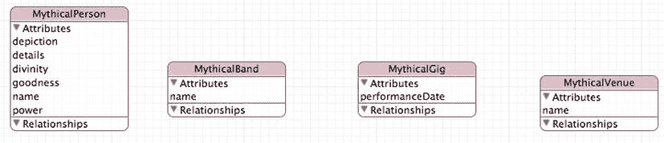

图 9-4 .


下面是我们将定义的所有实体及其属性。确保已选中新的模型文件，然后创建一个新实体并将其命名为 `MythicalBand`。为该实体添加一个名为 `name` 的新属性，将其类型设置为 `String`，然后点击关闭*可选*复选框，并打开*已索引*复选框。现在创建另一个名为 `MythicalVenue` 的新实体，同样为其添加一个名为 `name` 的 String 类型单一属性，该属性同样应设为*已索引*且非*可选*。最后，创建一个名为 `MythicalGig` 的实体。与我们添加的其他实体不同，演出没有名称。`MythicalGig` 的唯一区别特征在于它与乐队和演出场地的关系（我们稍后会讲到）以及演出的日期。添加一个新属性，将其命名为 `performanceDate`，并将其类型更改为 `Date`。我们可以将 `performanceDate` 保留为*可选*（因为某些古老演出的确切日期可能已从记忆中消失），并且也无需为其开启索引。

## 添加关系

现在是时候添加关系了，这样每个对象就可以关联到其他相关对象。我们将定义从 `MythicalBand` 到 `MythicalPerson` 的一对多关系，从 `MythicalBand` 到 `MythicalGig` 的一对多关系，以及从 `MythicalVenue` 到 `MythicalGig` 的另一个一对多关系。概览请参见图 9-5。

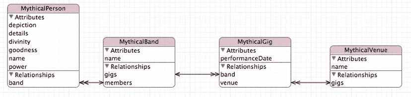

图 9-5。添加关系后，模型将如下所示。

在这一点上，我们应该稍微澄清一下我们的术语。在 Core Data 中，每个关系实际上都是单向的，并且它们不是用“一对多”、“一对一”、“多对多”等术语来定义的。相反，每个 Core Data 关系要么是**对一**，要么是**对多**。为了在 Core Data 中创建通常用法中（如果你接受任何形式的计算机程序员行话都是“正常”的这种说法）所谓的一对多关系，我们实际上必须创建两个关系：一个根植于第一个实体并终止于第二个实体的对多关系，以及一个根植于第二个实体并终止于第一个实体的对一关系。然后，我们在模型中指定这两个关系互为逆向关系，Core Data 就会理解我们所配置的这种双向性质。如果需要，这种设置允许我们创建一个真正单向的关系，尽管在实践中是否真的可取值得怀疑。本书中的示例都使用双向关系。

那么，让我们创建这些关系，从 `MythicalBand` 到 `MythicalPerson` 的一对多关系开始。选中 `MythicalBand`，然后点击*关系*表视图左下角的小 `+` 按钮。这将创建一个新关系，其配置选项（参见图 9-6）看起来与我们创建属性时见到的略有不同。

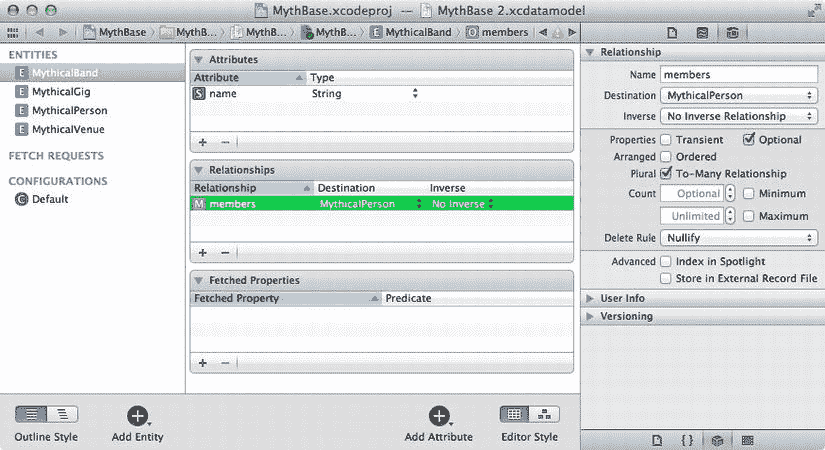

图 9-6。新关系的配置选项。

这里有一个*名称*字段以及*可选*和*瞬态*复选框，但除此之外都完全不同。*目标*弹出菜单让我们可以选择关系的另一端指向何处，设置后，*逆向*弹出菜单让我们可以选择使用哪个其他关系（如果有的话）来创建双向关系。一个复选框允许我们指定这是一个对多关系，如果选中该复选框，则会启用两个字段，让我们可以方便地约束关系另一端可以关联的对象的最小和最大数量。最后，*删除规则*弹出菜单让我们决定如果关系的“源端”被删除，关系另一端的对象应发生什么情况。

最常见的选项是 `Nullify`（这意味着源端会从目标元素中的任何逆向关系中移除）、`Cascade`（这意味着目标对象也会被删除）和 `Deny`（这意味着如果存在此关系，源对象将完全拒绝被删除）。第四种选择 `No Action` 会保持逆向关系不变，将处理它的任务留给开发者（否则可能导致数据完整性问题）。我们不会使用这个选项。

将我们刚刚创建的关系命名为 `members`，并将其目标实体设置为 `MythicalPerson`。点击打开*对多关系*复选框，并将*删除规则*保持为 `Nullify`（这是默认值）。太好了，我们刚刚创建了第一个单向关系！完成这个简单的步骤后，`MythicalBand` 实体获得了一个新的 `members` 属性，并附带一整套新特性。每个乐队现在都可以提供一个 `MythicalPerson` 对象数组，并且该数组将根据我们配置的选项自动维护。在图表纸视图中，有一条从 `MythicalBand` 指向 `MythicalPerson` 的、带有双箭头的单向箭头。

现在让我们创建这个关系的逆向关系。选中 `MythicalPerson` 实体，并添加一个新关系。将其命名为 `memberOf`，目标实体设置为 `MythicalBand`，然后将其逆向关系设置为 `members`。其余默认值可以保持不变。现在，`MythicalPerson` 和 `MythicalBand` 之间出现了一个双向箭头，在乐队一端是单箭头。

接下来是 `MythicalBand` 和 `MythicalGig` 之间的一对多关系。选中 `MythicalBand`，创建一个名为 `gigs` 的新关系，目标为 `MythicalGig`，并选中*对多关系*复选框。由于一场没有乐队的演出对我们毫无用处，因此将*删除规则*设置为 `Cascade`。这样，如果一个乐队被删除，其所有演出也会被删除。现在选中 `MythicalGig` 并创建一个名为 `band` 的新关系，目标为 `MythicalBand`，并选择 `gigs` 作为其逆向关系。这里，我们可以将*删除规则*保留为其默认值 `Nullify`。这仅仅意味着如果一场演出被删除，该演出在关联乐队的关系另一端的所有痕迹都会被清除，但乐队本身将保持不变。

最后，是 `MythicalVenue` 和 `MythicalGig` 之间的一对多关系。选中 `MythicalVenue`，创建一个名为 `gigs` 的新关系，目标为 `MythicalGig`，并选中*对多关系*复选框。因为没有场地的演出和没有乐队的演出一样毫无意义，因此我们在此也将*删除规则*设置为 `Cascade`，这样删除一个场地也会删除其所有演出。现在选中 `MythicalGig` 并创建一个名为 `venue` 的新关系，目标为 `MythicalVenue`，并选择 `gigs` 作为其逆向关系。

现在，我们已经为 MythBase 的新版本创建了所有需要的关系，我们的模型应该看起来类似于我们之前在图 9-4 中看到的。

## 创建简单迁移

假设您之前已经完成了第 8 章的内容，并使用该版本的 MythBase 保存了一些数据，那么在此阶段运行新版本会遇到一些问题。启动时您会看到一些关于数据存储版本不匹配的错误消息，并且在原本应该显示您之前创建的 `MythicalPerson` 对象的地方，您只会得到一个空的表视图。如果您添加一些新对象并尝试保存，您只会遇到更多的错误！原因是当前版本的应用程序数据模型与之前用于保存数据的版本有相当大的差异；Core Data 足够智能，可以检测到这一点，通知应用程序委托，并阻止您用新数据覆盖旧版本。


不仅如此，它还足够智能，可以自动“升级”现有的数据存储，以与你新的模型版本配合使用。这被称为*迁移*。Core Data 提供了两种迁移方式。第一种是*轻量级迁移*，由 Core Data 自动推断完成。Core Data 能够识别数据模型版本之间的许多常见变化（例如添加、删除或重命名属性、实体和关系），并能够自动计算出如何进行前向迁移。如果你使用 iCloud 存储数据，这是唯一可用的迁移方式。对于更复杂的数据模型演变，Core Data 可能无法推断出变化之间的映射关系，你就需要创建一个*映射模型*，或许还需要编写一些 Objective-C 代码来处理迁移。映射模型描述了旧模型中的实体和属性在新模型中的表示方式，但如果你做出了大幅度的更改，可能还需要编写代码。在本例中，我们将使用轻量级迁移策略，无需任何额外配置即可完成。

### 运行时机

在迁移发生之前，我们需要对应用程序的源代码做一个小改动。在当前版本中，应用尝试从其数据存储中加载数据，如果存储数据的结构与数据模型最新版本描述的结构不匹配，就会出现问题，应用会向用户显示一个错误。要修复此问题并使应用程序升级数据存储，我们只需在加载数据存储的方法中传入一个配置选项即可。打开`MBAppDelegate.m`，找到`persistentStoreCoordinator`方法。在该方法的末尾附近，有一组代码行类似这样：

```
if (![coordinator addPersistentStoreWithType:NSXMLStoreType
    configuration:nil
    URL:url
    options:nil
    error:&error]){
```

接下来我们要创建一个选项字典，并将其传递到该方法调用中。这个字典包含两对键值，它们告诉存储协调器应尝试更新现有数据以匹配当前数据模型，并且应尝试自动推断映射关系。将上面显示的代码行替换为以下内容：

```
NSDictionary *optionsDictionary = [NSDictionary dictionaryWithObjectsAndKeys:
  [NSNumber numberWithBool:YES], NSMigratePersistentStoresAutomaticallyOption,
  [NSNumber numberWithBool:YES], NSInferMappingModelAutomaticallyOption, nil];
if (![coordinator addPersistentStoreWithType:NSXMLStoreType
    configuration:nil
    URL:url
    options:optionsDictionary
    error:&error]){
```

现在，有了这段代码，我们应该能够构建并运行我们的应用程序，它会正常运行！我们会看到之前用 MythBase 第 8 章版本存储的旧数据，现在已经转换为我们应用的最新数据模型。当然，我们不会看到模型中创建的任何新实体——事实上，如果一切按计划进行，我们根本不会看到与第 8 章有任何不同的地方，但底层结构现在已经被修改，包含了新的实体和关系。

那么，这是如何发生的呢？你可能还记得在第 8 章中，`MBAppDelegate`的`persistentStoreCoordinator`方法里有一个方法调用：

```
[persistentStoreCoordinator addPersistentStoreWithType:NSXMLStoreType
                            configuration:nil
                            URL:url
                            options:optionsDictionary
                            error:&error]
```

这可能不太明显，但正是这个方法调用触发了数据迁移。当上述代码被执行时，通常会发生的情况是数据存储被打开并准备使用。

然而，如果数据存储的结构与协调器的数据模型（即你在 Xcode 中指定的当前版本）的结构不匹配，就会触发一个完全不同的事件链。Core Data 首先会查找一个与磁盘上数据存储中编码的版本信息相匹配的模型。如果找到了，Core Data 会查找应用包中是否存在一个映射模型，该模型可以将数据存储从旧结构转换为新结构。如果找不到，它会尝试通过推断映射关系来进行轻量级迁移。如果无法推断出映射关系，该过程将停止，方法会返回`nil`，并在`error`参数中返回一个错误。如果发生这种情况，下一行代码是`[[NSApplication sharedApplication] presentError:error]`，这会导致应用程序显示一个错误，内容为“用于打开持久化存储的受管对象模型版本与创建该持久化存储时使用的版本不兼容。”但在我们的例子中，MythBase 确实有两个可用的模型，并且映射关系可以推断，因此轻量级迁移会自动执行，旧数据文件会先被备份，以防出现严重问题。得益于这一自动过程，我们的用户无需担心导入或转换数据。当他们运行我们应用的新版本时，以前存储的数据会自动转换，并且除非数据存储非常庞大，否则转换速度很快。

### 更新用户界面

现在，我们已经有了更新后的数据模型，接下来要创建用户界面。我们将保持现有窗口基本不变，并添加几个新窗口，一个专注于`MythicalBands`，另一个专注于`MythicalVenues`。

#### 创建乐队窗口

首先，我们将创建一个新窗口来显示`MythicalBands`的列表。与第 8 章中展示的过程类似，我们将使用一些`NSTableView`、一个`NSArrayController`和 Cocoa 绑定来连接所有元素。我们首先将表格视图连接到乐队列表，确保它能正常工作，然后再考虑将一些`MythicalPersons`连接到乐队。

要开始，请在 Xcode 中打开`MainMenu.xib`。从*对象库*中拖出一个新的`NSWindow`。使用*属性检查器*将这个窗口命名为“Mythical Bands”。从*对象库*中拖出一个`NSTableView`，将其放入窗口的左上角，让蓝色参考线指示放置位置。在*属性检查器*中，将其设置为基于视图的，并且只有一列，而不是两列。将其向右扩展，直到到达窗口右侧边缘附近的蓝色参考线，这样表格视图就几乎填满了窗口的宽度。将其向下移动一点，以便为搜索字段留出空间，这是接下来要添加的。

现在，将一个搜索字段拖到表格视图上方的空间，靠近窗口的右边缘。将其定位，使得字段的底部边缘和右侧边缘都有蓝色参考线。这样设置后，搜索字段会紧贴在窗口顶部，而表格视图则在其下方调整大小。

接下来，我们需要两个按钮，用于“移除”和“添加”。保持外观一致性很重要，因此使用与主窗口中相同的渐变按钮。将一个渐变按钮拖到表格视图下方的空间。将按钮的右边缘与表格视图的右边缘对齐。蓝色参考线会将其定位到表格视图下方适当距离，并与右边缘对齐。双击按钮中的文本，将标签更改为“Add”。在“Add”按钮左侧再拖出另一个按钮。


很多蓝色参考线会在垂直对齐“添加”按钮时亮起，然后它会自动吸附到左侧的正确距离上。双击按钮内的文本，将其重新标记为“Remove”。这让我们获得了足够用于处理乐队列表的用户界面，但我们还需要一个对象来将所有内容整合在一起，那就是一个`NSArrayController`。从*对象库*中拖出一个数组控制器（在搜索框中输入“array”以缩小列表范围），并将其拖放到“乐队 (Band)”窗口下方的图谱画布上。它会消失，并出现在界面构建器窗格左侧的对象停靠区中。缓慢双击新的数组控制器，将其重命名为“Mythical Bands”。选中“Mythical Bands”对象，打开*属性检查器*。在*对象控制器*部分，将*模式*从“类 (Class)”更改为“实体名称 (Entity Name)”。在*实体名称*字段中输入字符串`MythicalBand`，并勾选*准备内容 (Prepares Content)*复选框。完成后，我们的 Xcode 窗口应看起来像图 9-7 所示。 图 9-7 M* M* M* Mythical Band 窗口的开端  

### 设置 Cocoa 绑定

现在我们已经布置好了对象，需要设置合适的 Cocoa 绑定，以便将 UI 控件与 Core Data 管理的乐队列表真正连接起来。我们从数组控制器开始，因为它已经被选中。切换到*绑定检查器*，展开*参数 (Parameters)*部分。勾选*绑定到 (Bind to)*复选框，然后从下拉菜单中选择 App Delegate。接着，在*模型键路径 (Model Key Path)*字段中输入“`managedObjectContext`”。这将数组控制器连接到 App Delegate 中的 Core Data 机制。

现在来处理表格视图的绑定。由于这个表格视图只有一列，所以会比“Mythical Persons”窗口中的那个省事一些。首先选中表格视图本身。这最好在左侧对象停靠区的大纲视图中完成。选中后，转到*绑定检查器*（应该还开着），展开*表格内容 (Table Content)*标题下的*内容 (Content)*部分。勾选*绑定到*复选框，并确保下拉菜单显示`Mythical Bands`，且*控制器键 (Controller Key)*显示`arrangedObjects`。和之前一样，我们也希望表格视图中选中的行能传回给数组控制器。为此，展开*绑定检查器*的*选择索引 (Selection Indices)*部分。在此处勾选*绑定到*复选框，将下拉菜单设置为`Mythical Bands`，并将*控制器键*设置为`selectionIndexes`。这看起来很像前一章节中的图 8-10。

表格视图本身的绑定设置好之后，我们可以为列设置绑定。在对象停靠区中，展开表格视图的子视图，直到显示出一个标有“Static Text – Table View Cell”的视图。在*绑定检查器*中，展开*值 (Value)*部分，勾选*绑定到*复选框，将下拉菜单设置为`Table Cell View`，并将*模型键路径*设置为`objectValue.name`。这应该看起来像图 9-8 所示。然后，切换到*属性检查器*，将“行为 (Behavior)”弹出菜单从“无 (None)”更改为“可编辑 (Editable)”。如果不做此更改，我们将无法在表格视图中实际输入新乐队的名称。

 图 9-8 M* M* M* 为 Mythical Bands 表格视图设置绑定  

最后，我们来处理搜索框。选择屏幕右上角的搜索字段，打开*绑定检查器*。在*绑定检查器*的底部附近有一个名为“谓词 (Predicate)”的章节。展开它，勾选*绑定到*复选框，将其绑定到`Mythical Bands`。*控制器键*应为`filterPredicate`。将*显示名 (Display Name)*设置为“`Name`”，并将谓词格式设置为`name contains[c] $value`，其中`$value`表示搜索框的内容，`name`表示应被搜索的`MythicalBand`实体属性。这就像我们在第 8 章中对搜索字段所做的绑定一样。

对于按钮，我们将使用与上一章节相同的过程，结合 target-action 和 Cocoa 绑定。我们会用 target-action 来处理按钮按下事件，用 Cocoa 绑定来根据需要启用或禁用按钮。先从操作开始。选中“添加 (Add)”按钮，按住 Control 键拖拽到`Mythical Bands`数组控制器。从弹出菜单中选择`add:`操作。然后，选中“移除 (Remove)”按钮，按住 Control 键拖拽到同一位置。这次，选择`remove:`操作。为了根据表格视图中的选择来启用或禁用按钮，我们需要使用*绑定检查器*。选中“添加”按钮，打开*绑定检查器*，展开*可用性 (Availability)*下的*已启用 (Enabled)*部分。勾选*绑定到*复选框，将下拉菜单设置为`Mythical Bands`，并将*控制器键*字段修改为`canAdd`。对于“移除”按钮，执行同样的操作，但在*控制器键*字段中使用`canRemove`。

现在保存更改，并运行应用程序。新窗口出现了，我们可以添加一些乐队，直接在表格视图中编辑它们的名称，并保存更改。

### 为数组控制器指定有用的名称

我们建议您在 nib 文件中做一个更改，这在配置我们即将创建的新绑定时会很有帮助。它不会影响应用程序的行为，但您很可能会因为做了这个更改而感到高兴，并且后续的文本也假定您已进行此更新。

Core Data 基础设施与用户界面之间的连接都是通过一个`NSArrayController`来运行的。我们在上一章节中设置的`NSArrayController`被命名为`Mythical Person Array Controller`。这个名字很长，超出了 Xcode 中绑定检查器（Binding Inspector）实际设计的显示长度。事实上，它勉强能挤进绑定检查器的弹出按钮中，并且这导致每个绑定属性的摘要信息溢出，部分文本被省略号代替。对于`Mythical Bands`数组控制器，我们并没有在其名称中包含“Array Controller”，这使得它更容易操作。

您可以通过更改控制器的名称来改善这种情况。更改名称不会修改您已配置的任何绑定，也不会对应用程序的用户产生任何影响。能看到这个变化的只有您自己，但请记住，您也很重要。就像以易于浏览和查找所需内容的方式格式化源代码很重要一样，尽您所能简化在 Interface Builder 中的编辑体验将为您节省时间和减少挫折。

因此，如果您想进行此更改，请转到主 nib 窗口，确保您查看的是左侧的对象停靠区，找到您的`Mythical Person Array Controller`。点击它的名称，将其改为`Mythical Person`。这样做可以删除一些没有实际价值的词语（例如“Array”和“Controller”），这些词语可能会广泛分布在您的 nib 文件和代码中，最终留下的显示内容希望能让您的大脑和眼睛更快速扫描和理解。

### 将人员放入乐队

现在，让我们通过向`MythicalPerson`显示界面添加一个简单的弹出按钮，实现将人员关联到乐队的功能，这将允许我们为选定的`MythicalPerson`选择一个`MythicalBand`。


弹窗按钮将通过 Cocoa 绑定连接，这意味着它不仅能像其他控件一样，始终自动更新以显示选中人物的正确值，还能自动更新以始终显示当前的乐队列表，并在用户在“神话乐队”窗口中做出更改时自动改变其内容。这需要通过为弹窗按钮配置几个绑定来实现，同时使用“神话人物”和“神话乐队”控制器。

首先，对原始窗口进行一项更改，使其与新窗口更加匹配。打开原始窗口（标题为`MythBase`的窗口），然后点击其标题栏选中窗口，并使用*属性检查器*将其重命名为“`Mythical People`”。这样，两个窗口就具有了相同的外观。每个窗口都围绕一个特定实体居中设计，但都没有被区分成“主窗口”。

现在，选中滑块下方的所有视图，并将它们整体向下拖动一点。在腾出的空间中，从*对象库*拖出一个标签（命名为“`Member of Band:`”）和一个弹窗按钮。将它们排列整齐，使其大致看起来像图 9-9。

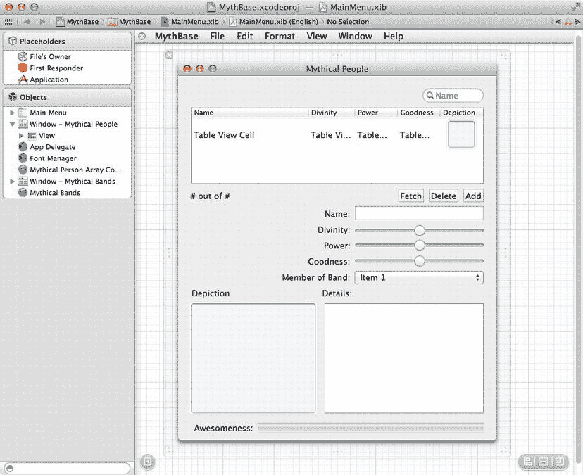

图 9-9. 全新且改进的“神话人物”窗口

现在剩下的工作就是为弹窗按钮配置一些绑定。与文本字段或滑块不同，弹窗按钮的显示需要多个绑定才能使其以有用的方式工作。考虑到一个弹窗按钮需要有一个要显示的字符串数组（这里将显示所有可用的乐队名称）、一个这些字符串所属的底层对象数组（乐队本身），以及一些指示列表中被选中项的内容（通过选中人物的`band`关系）。前两项将通过“神话乐队”控制器绑定，通过它我们可以轻松绑定到所有乐队或所有乐队名称的数组。第三项将通过“神话人物”控制器绑定。

首先，选中弹窗按钮并打开*绑定检查器*。展开列表顶部的*Content*绑定配置，在弹出列表中选择`Mythical Bands`，将*Controller Key*设置为“`arrangedObjects`”，并勾选复选框。这告诉了弹窗按钮在哪里找到底层对象列表。

接下来，展开*Content Values*绑定的配置。再次在弹出列表中选择`Mythical Bands`，*Controller Key*设置为“`arrangedObjects`”，但这次将*Model Key Path*设置为“`name`”。这告诉弹窗按钮，它应通过获取同一个数组（`arrangedObjects`）并询问每个对象的`name`来填充其显示值。

最后，展开*Selected Object*绑定的配置。在这里，从弹出列表中选择`Mythical Persons`，*Controller Key*设置为“`selection`”，*Model Key Path*设置为“`memberOf`”。弹窗列表将自动连接各项，以便当“神话人物”控制器的选择发生变化时，弹窗按钮会注意到新选中人物的乐队，在`Content`数组（从“神话乐队”控制器获取）中查找该乐队，并显示`Content Values`数组（也来自“神话乐队”控制器）中对应的字符串。通过保存更改、在 Xcode 中点击运行并测试来验证其是否有效。对于每个选中的`MythicalPerson`，我们可以选择一个`MythicalBand`来关联他们（参见图 9-10）。


图 9-10. 将赫拉克勒斯设置为“希腊配方”乐队的成员

**显示乐队成员**

既然我们可以将人物添加到乐队，那么能否查看乐队中所有成员的列表呢？

让我们将其添加到“神话乐队”窗口中。这很简单：我们将手动添加一个表格视图和一个数组控制器，并将它们连接起来。

首先，从*对象库*中拖出一个`NSArrayController`，并将其拖到主 nib 窗口中。就像处理其他数组控制器一样，我们希望给这个控制器起一个简短但有意义的名字。这个控制器将处理`MythicalPersons`的列表，但我们已经有名为“神话人物”的数组控制器了，而且我们想让它更容易看出这其中的上下文（它只会显示选中乐队的成员），所以我们在主 nib 窗口中将其命名为“`Band Members`”。

然后，在选中新数组控制器的情况下，打开*属性检查器*，在*Object Controller*部分将*Mode*设置为“`Entity`”，*Entity Name*设置为“`MythicalPerson`”。勾选*Prepares Content*复选框。这将确保当 nib 文件加载时，控制器的内容会被自动获取。

现在切换到*绑定检查器*，我们将在此配置两个绑定，使这个控制器能够根据选中的`MythicalBand`自动获取其内容。首先，在最底部，展开*Managed Object Context*的配置。在弹出菜单中选择`App Delegate`，*Model Key Path*设置为“`managedObjectContext`”，这应会自动勾选*Bind to*复选框。此配置与我们所有数组控制器的配置相同，允许它们连接到 Core Data 存储。接下来，在*Controller Content*部分，展开*Content Set*绑定的配置，在弹出菜单中选择`Mythical Bands`，*Controller Key*设置为“`selection`”，*Model Key Path*设置为“`members`”。这样做会使控制器的内容依赖于选中的乐队。

现在，为成员列表腾出空间。调出“神话乐队”窗口，将其拉高一些，几乎增加一倍的高度，以便在当前内容下方放置另一个表格视图。然后，从*对象库*拖出一个表格视图，点击以选中表格视图本身（而不是包含它的滚动视图，拖动后默认选中的是滚动视图）。这里只显示乐队成员的名字，因此表格只需要一列。调出*属性检查器*，找到顶部的*Content Mode*设置，将*Content Mode*更改为`view-based`。接下来，找到*Content Mode*下方的*Columns*设置，将其更改为 1。然后，按照前几章的做法，通过将列标题设置为“`Member Name`”并使其填满表格宽度，来美化列标题。最后，加上一个“`Band Members`”标签，这样用户就能知道他们看到的是什么。图 9-11 展示了您期望的布局。


图 9-11. 向“神话乐队”窗口添加乐队成员

剩下要做的就是为“乐队成员”表格配置绑定。我们将把表格绑定到`NSArrayController`，然后再把列绑定到表格。首先，选中表格本身。在*绑定检查器*中，展开*Table Content*下的*Content*部分。然后，勾选*Bind to*复选框，并将下拉菜单设置为`Band Members`。默认的*Controller Key*（`arrangedObjects`）就很好。接下来配置列。使用左侧的对象停靠区大纲视图，向下钻取到表格视图中的“`Static Text - Table View Cell`”。在*绑定检查器*中，展开*Value*部分。下拉菜单应显示`Table Cell View`。勾选*Bind to*复选框，*Model Key Path*设置为“`objectValue.name`”，*Controller Key*字段留空。图 9-11 中窗口右侧的*绑定检查器*显示了最终的配置。


```markdown

图 11 显示了这在 Xcode 中的样子。好了，这个窗口的工作就完成了。现在该保存我们的工作，在 Xcode 中点击“运行”，然后查看新功能：为一个人指定乐队会将此人添加到该乐队的 `members` 数组中，当我们在“Mythical Band”窗口中选择该乐队时，就会看到这个效果。

### 创建一个“Venue”窗口

现在，是时候再创建一个用于显示和编辑 `MythicalVenues` 的窗口了。制作这个窗口的过程与我们制作“Mythical Bands”窗口时非常相似：需要一个窗口、一个表视图、几个按钮以及一个 `NSArrayController`。由于真正的神话级场地并不多，我们省去了这个窗口上的搜索框。而且，由于我们已经做过一次，所以会加快速度。

首先，从*对象库*中拖出一个窗口到 Interface Builder 画布上。在*属性检查器*中，将其标题设置为“Mythical Venues”。这个窗口比我们需要的要大一点，所以我们可以在垂直方向上将其缩小到大约三分之二的高度，并稍微收窄一些。拖出一个表视图，将其放置在屏幕的左上角，让蓝色参考线告诉我们放置的位置。将表视图展开以填满窗口，如图 9-1 所示。在表视图的*属性检查器*中，将其*内容模式*更改为基于视图，并将其设置为一列。展开这一列以填满表视图的宽度。

拖出一个渐变按钮到窗口上，将其放置在表视图的右下边缘下方。这将是我们的“添加”按钮，所以双击它并将标题改为“Add”。再拖出另一个按钮，将其放置在“添加”按钮的左侧，并将此按钮标题设置为“Remove”。和往常一样，蓝色参考线是我们正确定位的帮手。

接下来我们需要一个 `NSArrayController`。从*对象库*中抓取一个，并将其拖到 Interface Builder 画布上。在左侧的对象停靠区中，将其标题设置为“Mythical Venues”。在*属性检查器*中，将其*模式*设置为“Entity Name”，将实体名称设置为“MythicalVenue”，并勾选*Prepares Content*复选框，以便在加载 nib 文件时获取所有场地。我们还需要将“Mythical Venues”数组控制器连接到 App Delegate 提供的托管对象上下文。在*绑定检查器*中，展开底部的*参数*部分。勾选*Bind to*复选框，将下拉菜单设置为“App Delegate”，并将*模型键路径*设置为“managedObjectContext”。

现在我们需要将所有内容连接起来。让我们从表视图开始。选中表视图（记住它嵌入在一个滚动视图中）。在*绑定检查器*中，展开*表内容*下的*内容*部分。然后，勾选*Bind to*复选框并将下拉菜单设置为“Mythical Venues”。默认的控制器键 `arrangedObjects` 就很好。现在处理列。正如我们之前对“Band Members”表视图所做的那样，深入到表视图内部的“Static Text – Table View Cell”。在*绑定检查器*中，展开*值*部分。下拉菜单应该显示“Table Cell View”。勾选*Bind to*复选框，将*模型键路径*设置为“objectValue.name”，同时将*控制器键*字段留空。在这里，我们切换到*属性检查器*，将*行为*设置从“None”更改为“Editable”，这样当我们创建新场地时，就可以在表视图内设置名称。

接下来，我们将处理按钮。选中“添加”按钮，按住 Control 键并拖拽到“Mythical Venues”数组控制器上。从弹出菜单中选择 `add:` 操作。然后，选中“移除”按钮，按住 Control 键并拖拽到同一个位置。这次，选择 `remove:` 操作。为了根据表视图中的选择来启用或禁用按钮，我们需要使用*绑定检查器*。

选中“添加”按钮，打开*绑定检查器*，展开*可用性*下的*已启用*部分。勾选*Bind to*复选框，将下拉菜单设置为“Mythical Venues”，并将*控制器键*字段改为“canAdd”。对于“移除”按钮，执行相同操作，但在*控制器键*字段中使用“canRemove”。

再次，保存我们的工作，在 Xcode 中点击“运行”，然后查看新功能：我们可以添加和删除新的神话级场地。

### 向“Band”窗口添加“Gig”列表

我们需要添加的最后一项功能是能够创建 `MythicalGigs`。`MythicalGigs` 位于 `MythicalBands` 和 `MythicalVenues` 之间，每个乐队和场地都可能有多场演出。同时，每场演出恰好与一个乐队和一个场地相关联。我们将添加另一个表视图来包含所需功能，将其放置在“Mythical Band”窗口中的成员表视图旁边。表视图的每一行将包含用于显示演出的 `performanceDate` 和 `venue` 的字段。我们还将在此表视图下方设置一个详细信息区域，以便编辑这些字段（参见图 9-12）。


图 9-12 . 这是最终的“Mythical Bands”窗口的样子

首先，在*对象库*中找到一个 `NSArrayController`。将其拖到主 nib 窗口，并命名为“Gigs”。打开*属性检查器*，将*模式*设置为“Entity”，并在*实体名称*中输入“MythicalGig”，然后点击以打开*Prepares Content*复选框。现在切换到*绑定检查器*。将新数组控制器的*托管对象上下文*绑定到 App Delegate 的 `managedObjectContext`，并将其*内容集合*通过“Mythical Bands”进行绑定，将*控制器键*设置为“selection”，将*模型键路径*设置为“gigs”。

接下来，我们将设置 GUI 本身。从*对象库*中拖出另一个表视图到“Mythical Bands”窗口，并拖出一个“Gigs”标签，按照图 9-12 所示进行布局。这个表视图将显示一列日期和一列场地名称。默认的表视图单元格对此就完全适用。首先，在*属性检查器*中将表视图的*模式*设置为基于视图。然后，切换到*绑定检查器*，展开*表内容*下的*内容*区域。将其绑定到“Gigs”，将*控制器键*保留为“arrangedObjects”，并将*模型键路径*留空。我们还需要绑定*选择索引*。也将其绑定到“Gigs”，将*控制器键*设置为“selectionIndices”，并将*模型键路径*留空。

表格列的标题应该有名称——左列为“Date”，右列为“Venue”——现在就去设置它们。然后，在对象停靠区中展开对象层级，深入到“Date”列的“Static Text – Table View Cell”对象。在*绑定检查器*中，将其绑定到“Table Cell View”，并将*模型键路径*设置为“objectValue.performanceDate”。然后，展开“Venue”列下方的对象层级，深入到该列的“Static Text – Table View Cell”。在*绑定检查器*中，将其绑定到`objectValue.venue.name`。这就涵盖了表视图所需做的所有工作！

我们还需要添加和移除按钮，以便用户创建和删除演出。选择并复制窗口上部的两个按钮，将新按钮拖到演出表视图的下方。按住 Control 键从“添加”按钮拖拽到“Gigs”控制器并选择 `add:` 操作，然后按住 Control 键从“移除”按钮拖拽到“Gigs”控制器并选择 `remove:` 操作。作为最后的润色，我们可以通过使用一些简单的绑定，让这些按钮根据表视图的内容和选择变化自动启用或禁用。

```


选择“Add”按钮，打开`Bindings Inspector`，并将其`Enabled`属性绑定到 Gigs 控制器的`canAdd`控制器键。然后选择“Remove”按钮，并将其绑定到 Gigs 控制器的`canRemove`控制器键。

现在，我们需要设置其下方的详细信息区域。从日期显示开始。从`Object Library`中拖出一个日期选择器，并将其放置到左侧表格视图的下方。在`Attributes Inspector`中，将日期选择器设置为带步进器的文本模式 (Textual with Stepper) 而非图形模式 (Graphical)，将`Elements`设置为月份、日期和年份，并勾选纪元 (Era) 旁边的复选框（因为很可能有些演出在公元前）。在`Bindings Inspector`中，展开`Value`部分。从下拉菜单中选择“Gigs”，并勾选`Bind to`复选框。默认的`Controller Key`（即“selection”）正是我们需要的。在`Model Key Path`字段中输入“performanceDate”。

接下来是场馆 (Venues) 菜单。从`Object Library`中拖出一个弹出按钮 (Popup Button)，并将其放置在日期选择器旁边，即表格视图右侧的下方。这个按钮的绑定稍微复杂一些。我们需要为这个弹出按钮配置三个绑定。首先，将`Content`绑定到 Mythical Venues 控制器的`arrangedObjects`。接下来，将`ContentValues`绑定到 Mythical Venues 控制器的`arrangedObjects`，这次需要在`Model Key Path`中指定“name”。最后但同样重要的是，将`Selected Object`绑定到 Gigs 控制器，使用“venue”作为`Model Key Path`，并将`Controller Key`保留为“selection”。

最后，让我们将这两个字段放入一个盒子中，以便在视觉上对它们进行分组。这不会对它们的行为产生任何影响，纯粹是为了外观。为此，同时选中日期选择器和弹出按钮。从`Editor`菜单中，选择`Embed In`  `Box`，将这两个字段分组在一起。将盒子的标题设置为“Gig Details”。调整盒子的大小使其与 Gigs 表格视图的宽度相同。完成此操作后，我们可能需要调整盒子内控件的大小以充分利用空间。我们将根据需要整理尺寸，然后就大功告成了！

现在保存这项工作，在 Xcode 中点击运行，然后拭目以待！假设所有配置都正确，我们现在应该能够将演出添加到每个乐队的信息中。

## 总结 (Wrap Up)

在本章中，我们扩展了旧的数据模型，将其从一个单独的实体发展为一组通过关系相互关联的完整实体。我们还看到了如何将这些关系中的每一个在 GUI 中表达出来（例如，使用弹出列表来选择对一关系的远端，并使用表格视图来展示对多关系的所有内容），并通过 Cocoa 绑定进行配置和管理。

关于这种可视化编程的方式，我们并非老生常谈，但值得重复的是，本章中的所有操作都是在没有编写一行代码的情况下完成的。请注意，我们使用的术语“可视化编程”与微软在其开发工具中所使用的“Visual”一词无关。可视化编程背后的理念是允许程序或其部分使用图形化组件来构建，这些组件不需要传统用于编写软件的文本式、过程式编程。Cocoa 在一定程度上支持可视化编程，允许您仅使用 Xcode 数据建模器和 Interface Builder 来构建应用程序原型甚至整个应用程序。然而，它并非旨在构成一个完整的可视化编程系统，因此，对于您构建的每个 Cocoa 应用程序，您将不可避免地需要沉下心来编写一些代码！

此外，这些使用模式同样可以很好地应用于您自己的应用程序。仅仅是建模您的问题域、定义实体和关系，往往就能开始让您了解如何构建 GUI。

随着您在应用程序开发过程中取得进展，您肯定会找到更多使用 Cocoa 绑定将不同类型的控件连接到数据的方法，并且有时您也会发现需要通过编写代码来连接事物和在对象之间传输数据。

在您学习本书剩余部分的过程中，您将看到更多将 Core Data 和 Cocoa 绑定作为其架构核心部分的应用程序示例，因此您将看到更多使用这些技术的方法。下一章是专门讨论 Core Data 的最后一章，将向您展示如何限制在 GUI 中显示内容的范围，这对于处理大量数据的任何应用程序来说都是绝对必要的。

# 第 10 章 使用条件进行搜索和检索 Core Data

第 8 章和第 9 章中的 MythBase 示例演示了 Core Data 的基本工作原理，让我们能够轻松地从后端存储中创建、检索、更新和删除对象。到目前为止，我们在 MythBase 中主要处理完整的数据集。对于使用的大部分实体（`MythicalPerson`、`MythicalBand`和`MythicalVenue`），每个实体的所有对象都在应用程序启动期间加载，并在应用程序的整个生命周期内保持在内存中。对于像 MythBase 这样维护小型数据库的应用程序来说，这没问题，但如果我们的某个主要实体在后端存储中包含成千上万个实例呢？我们的应用程序会在启动时加载所有数据，这很可能导致应用程序耗尽所有可用内存、转而使用磁盘交换等问题。除了这个问题，我们还可能最终导致糟糕的用户体验，因为一个显示 20 个对象时易于导航的 GUI，在有数千个条目时可能会变得难以有效使用。

这个问题的解决方案涉及一个重要的功能：一种提供搜索条件的方法，以便我们能够限制控制器从存储中读取的对象。本章将介绍使用`NSPredicate`来将搜索限制为给定`Entity`所有对象的一个子集。我们将在 Interface Builder 和源代码中指定一个硬编码的`NSPredicate`，并让用户使用`NSPredicateEditor`为条件定义值。

### 创建 QuoteMonger

我们将通过创建一个名为 QuoteMonger 的应用程序来演示`NSPredicate`的使用，该应用程序允许我们跟踪所有最喜欢的节目及其中的著名台词。它将是一个包含两个实体的 Core Data 应用程序，外加一个支持数据输入和灵活查询的 GUI。图 10-1 显示了完成后的应用程序视图。


图 10-1. QuoteMonger 的数据输入和搜索窗口

**注意** 到现在为止，您已经掌握了创建 Xcode 项目和文件的基础知识，因此对于某些您已经做过多次的操作，我们不会再给出逐一点击的详细说明，而是将最详细的描述保留给每章涵盖的新主题。

### 创建项目及其数据模型

首先在 Xcode 中创建一个新的 Core Data 项目，并将其命名为`QuoteMonger`。然后编辑`QuoteMonger.xcdatamodel`文件，并添加两个实体，分别命名为`Show`和`Quote`。我们在前两章中已经介绍过这个步骤，所以如果遇到困难，请翻阅回前几页进行回顾。

为`Show`添加一个名为`name`的属性，类型为`String`。关闭`Optional`复选框，并打开`Indexed`复选框。然后为`Quote`添加两个`String`类型的属性，分别命名为`quoteText`和`character`。


```markdown

对于其中的每一项，打开 `Indexed` 复选框，但仅对 `quoteText` 取消勾选 `Optional` 复选框，对 `character` 则保持勾选（因为有可能你无法完全记住或确定某句话是谁说的，但仍想将其作为引文存储）。最后，在 `Show` 和 `Quote` 之间建立一对多关系（记住，这意味着要创建两个关系——从 `Show` 到 `Quote` 的名为 `quotes` 的对多关系，以及从 `Quote` 到 `Show` 的名为 `show` 的对一关系——并将它们配置为互为逆关系）。生成的数据模型应类似于图 10-2。


图 10-2. QuoteMonger 的数据模型

## 数据录入窗口

数据模型就位后，就该开始构建 GUI 了。其中有趣的部分（也是本章的主要内容）是搜索窗口。但在有数据可搜索之前，我们无法进行任何搜索，因此我们将从创建 GUI 中允许我们进行数据录入的部分开始。我们将为此构建一个非常基本的 GUI——在单个窗口中显示节目和引文，并且只显示与当前选中节目相关联的引文。

### 两部分的窗口

在 Xcode 项目中双击 `MainMenu.xib`，在 Interface Builder 窗格中打开它。这会调出我们之前使用过的标准空应用程序 nib。在主 nib 窗口中选择 `NSWindow` 实例，然后使用调整大小控件使其更高（大约为初始高度的两倍）。我们需要这个空间，因为我们要在这里放置两组视图，一组用于 `Show` 实体，另一组用于 `Quote` 实体。

#### 显示节目

我们将从 `Show` 的视图开始。从*对象库*中拖出一个 `NSTableView`，并将其放置在窗口顶部附近。调整其大小以占据大部分空间。这次不要担心蓝色辅助线；实际上，使其比辅助线建议的尺寸略小一些。我们将把它与一些其他控件一起分组到一个盒子中，因此尺寸调整目前还不关键。打开*属性检查器*，将表格视图设置为基于视图，并带有一列。调整列本身的大小以占据表格视图的宽度，并将列的名称设置为“Name”。拖出一个按钮，将其放置在表格视图的右下角下方，并将其标签设置为“Add”。再拖出一个相同类型的按钮，将其放置在 Add 按钮的左侧，并将该按钮标签设置为“Remove”。选择所有这三个控件，并将它们分组到一个盒子中（选择 **Editor**  **Embed In**  **Box**）。将盒子的标题设置为“Show”。现在我们可以相对于窗口调整盒子的大小，然后调整盒子内部的表格视图，以获得一个令人满意的布局。

既然我们有了一个列出节目的位置，我们需要将它们连接到核心数据模型，我们将使用 Cocoa 绑定和一个 `NSArrayController` 作为粘合剂。从*对象库*中拖出一个数组控制器，并将其命名为“Shows”。在*属性检查器*中，将*模式*下拉菜单设置为“Entity Name”，然后在*实体名称*字段中输入“Show”，以将其连接到模型编辑器中的 `Show` 实体。勾选*准备内容*复选框，这将指示数组控制器在启动时加载所有 `Show`。切换到*绑定检查器*。将*托管对象上下文*（位于绑定列表底部）绑定到 App Delegate，并将*模型键路径*设置为 `managedObjectContext`。

对于绑定，我们从表格视图开始。选择表格视图，然后打开*绑定检查器*。展开*表内容*下的*内容*部分，并勾选*绑定到*旁边的复选框。下拉菜单应显示“Shows”。默认的*控制器键* `arrangedObjects` 就是我们想要的，*模型键路径*中无需输入内容。

我们还希望数组控制器知道选中的行，因此将*选择索引*绑定绑定到 Shows，并将此处的*控制器键*设置为 `selectionIndexes`。然后，在表格视图内的视图层次结构中，使用对象停靠区向下深入到“静态文本 - 表格视图单元格”。在*属性检查器*中，将*行为*更改为可编辑。然后，在*绑定检查器*中，将“值”绑定到表格单元格视图，并将其*模型键路径*设置为 `objectValue.name`。

这样就完成了表格视图的设置。为了完成窗口中处理 `Show` 的部分，我们需要连接按钮。这就像上一章一样完成——结合使用目标-动作来处理点击，以及使用 Cocoa 绑定来适当地启用或禁用按钮。我们先做目标-动作部分。按住 Control 键从 Add 按钮拖动到 Shows 数组控制器，并选择 `add:` 作为接收的动作。对 Remove 按钮执行相同操作，这次选择 `remove:` 作为接收的动作。再次选择 Add 按钮，然后转到*绑定检查器*。勾选*绑定到*复选框，将按钮连接到 Shows 控制器，并输入 `canAdd` 作为*控制器键*。对 Remove 按钮重复此操作，将其绑定到 `canRemove` *控制器键*。

窗口应类似于图 10-3。请注意实用区域中的 Outlets Inspector 视图，它显示了数组控制器的绑定和目标-动作连接。当事情没有按预期工作时，此视图对于故障排除非常有用！


图 10-3. 数据录入窗口的部分布局

#### 录入引文

现在我们将在 Show 框的下方重复大部分相同设置，用于引文。和之前一样，拖出一个表格视图和两个按钮，将它们放置在窗口的下半部分，并按之前的方式给按钮设置标签。然而，对于这个表格视图，我们将保留两列。像之前一样将其更改为基于视图，并勾选标签为“交替行颜色”的复选框，这将使内容更易于阅读。将左列标题设置为“Quote Text”，右列标题设置为“Character”，并调整大小以为 Quote Text 列提供更多空间。在 Quote Text 列中，双击列内的“Table View Cell”文本，并将其更改为“Quote”。对 Character 列中的“Table View Cell”文本执行相同操作，将其更改为“Character”。这将在稍后帮助我们区分这两列。像之前一样将这些三个控件分组到一个盒子中，并将盒子标题设置为“Quote”。

窗口的这一部分也将使用一个 `NSArrayController`，但其配置将与 Shows 数组控制器略有不同。拖出一个控制器，并将其命名为“Quotes”。在*属性检查器*中，将其*模式*设置为 Entity Name，然后将*实体名称*字段设置为 Quote（与我们在模型编辑器中定义的实体名称相同）。然后，切换到*绑定检查器*。默认情况下，每个数组控制器将获取对应实体的所有对象。我们将更改此设置，使其仅根据选中的 Show 获取引文。打开*内容集*绑定，在下拉列表中选择“Shows”，在*控制器键*组合框中选择“selection”，并在*模型键路径*组合框中输入“quotes”。最后，按回车键以启用绑定。我们还需要将其连接到由 App Delegate 提供的托管对象上下文。将*托管对象上下文*（位于绑定列表底部）绑定到 App Delegate，并将*模型键路径*设置为 `managedObjectContext`。

现在我们可以将这个表格视图绑定到 Quotes 控制器。选择表格视图，然后打开*绑定检查器*。展开*表内容*下的*内容*部分，并勾选*绑定到*旁边的复选框。下拉菜单应显示“Quotes”。

```


”默认的“arrangedObjects”的`Controller Key`正是我们需要的。和之前一样，需要让数组控制器知道选中的行，因此将`Selection Indexes`绑定到`Quotes`，并将此处的`Controller Key`设置为“selectionIndexes”。要绑定这两个列，需在表视图内使用对象停靠区深入到视图层次结构中，直到“Static Text – Quote”条目。在*Attributes Inspector*中，将*Behavior*改为`Editable`。然后，在*Bindings Inspector*中，将*Value*绑定到`Table Cell View`，并将其*Model Key Path*设置为“objectValue.quoteText”。切换到对象停靠区中的“Static Text – Character”条目，将其*Mode*改为`Editable`，然后将其绑定到`Table Cell View`，并将其*Model Key Path*设置为“objectValue.character”。

最后，我们需要连接按钮。从每个按钮按住`Control`拖拽到`Quotes`控制器，根据情况将动作设置为`add:`或`remove:`。根据情况，将每个按钮的`enabled`绑定到`Quotes`控制器上的`canAdd`或`canRemove`的`Controller Key`。

布局应类似于图 10-4。

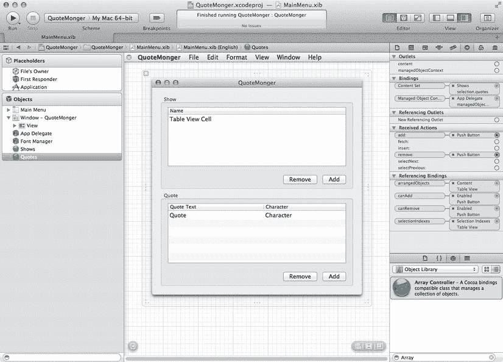

图 10-4. 数据录入窗口的完成布局

## 输入一些初始引用

保存更改并点击运行。应用程序应启动并显示数据录入窗口。选择上方表格视图下方的“Add”按钮添加一个剧集，然后双击表格视图中高亮区域编辑剧集名称。重复此操作几次，创建几个`Show`实例。现在，选中一个剧集后，在下方表格中添加一条引用，直接在表格中编辑文本和任何角色的名称。如果您添加的引用包含两个或多个角色之间的对话，请在“Character”字段中输入所有相关角色的名称。稍后我们启用基于角色名称的搜索时，它将与您输入的所有名称一起工作。再添加几条引用，分布在几个不同的剧集中。请注意，当您选择不同的剧集时，引用列表会发生变化；如果您退出并重新启动`QuoteMonger`，您应该看到您输入的所有内容都已保存。

另一方面，如果似乎没有任何效果，请检查 Xcode 中的调试日志，查看应用程序是否引发了异常。常见的问题包括：忽略了为数组控制器上的托管对象上下文设置绑定，或者输错了`Controller Key`或`Model Key Path`绑定的名称。

## 创建引用查找器窗口

现在是时候为搜索窗口打下基础了。回到 Xcode 的 Interface Builder 面板中，从*Object Library*拖出一个新窗口，并将其放到画布上。Xcode 提供了多种窗口类型，但我们只需要一个普通的平面窗口。（您可能还想关闭`QuoteMonger`窗口以将其移开，方法是点击 Interface Builder 画布上窗口左上角的小`x`。）

选择新窗口，转到*Attributes Inspector*。将新窗口标题设为“Quote Finder”。此窗口上将有两个可见控件：一个表格视图和一个文本视图。表格视图将显示匹配引用的列表，文本视图将显示所选引用的内容。稍后，我们还将使用一个名为“谓词编辑器”的新工具来定义搜索条件。谓词编辑器用于在`Mail.app`中定义过滤规则以及在 iTunes 中创建智能播放列表。它是一个通用的 Cocoa 组件，我们也可以使用它。不过，我们现在还不会用到它。

让我们开始吧！从*Object Library*拖出一个表格视图，并将其定位在窗口顶部附近。在*Attributes Inspector*中，将其设置为基于视图，并赋予它三个列。分别将这三个列标题设为“Quote Text”、“Character”和“Show”。

此外，编辑每个字段中的文本以反映列的名称。我们还可以为此表格视图勾选*Alternating Rows*复选框，以防搜索返回大量匹配项。此表格视图不会放入框中，因此我们可以调整其大小以填满窗口宽度，让蓝色参考线告诉我们何时停止。

现在，从*Object Library*拖出一个文本视图（在库区域底部的搜索字段中输入“text view”），并将其放置在表格视图下方。将其展开至与表格视图相同的宽度。在*Attributes Inspector*中，关闭*Editable*和*Rich Text*复选框。对于“Find”，将弹出菜单设置为*Uses Bar*，并勾选*Incremental Searching*复选框。这将使大文本视图能够使用 Mac OS/X 10.7 中引入的嵌入式搜索栏。窗口应类似于图 10-5。

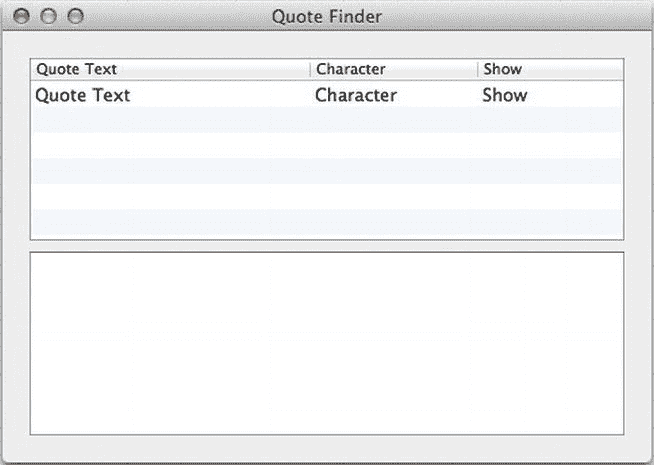

图 10-5. 查询查找器窗口的第一版

接下来，拖出一个数组控制器并将其命名为“FoundQuotes”。在*Attributes Inspector*中，将其*Mode*设置为`Entity Name`，并将“Quote”作为要使用的*Entity Name*。同时勾选*Prepares Content*复选框。在这些设置上方，在*Attributes Inspector*的数组控制器块中，勾选*Auto Rearrange Content*复选框。这将使得每当用户在`Quotes`控制器中进行更改时，它都能正确地重新加载和重新过滤其内容。在*Bindings Inspector*中，将其*Managed Object Context*绑定到`App Delegate`，并将*Model Key Path*设置为“managedObjectContext”。

现在，我们需要为用户界面控件——表格视图和文本视图——设置绑定。像往常一样，我们从表格视图开始。将表格视图的*Content*和*Selection Indexes*绑定到`FoundQuotes`控制器。将*Content*绑定到`arrangedObjects`的*Controller Key*，并将*Selection Indexes*绑定到`selectionIndexes`的*Controller Key*。然后，深入到表格视图内部的“Static Text - Quote Text”字段。将其*Value*绑定配置为绑定到`Table Cell View`，并使用“objectValue.quoteText”作为*Model Key Path*。将“Static Text – Character”字段的*Value*绑定配置为绑定到`Table Cell View`，并使用“objectValue.character”作为*Model Key Path*。最后，选择表格视图内的“Static Text – Show”字段，将其*Value*绑定配置为绑定到`Table Cell View`，并使用“objectValue.show.name”作为*Model Key Path*。

对于文本视图，情况稍微简单一些。选择文本视图，将其*Value*绑定到`FoundQuotes`。使用“selection”作为*Controller Key*，使用“quoteText”作为*Model Key Path*。

现在点击运行，注意两个窗口。新的查询查找器窗口仅显示我们在数据录入窗口中输入的所有引用。本章剩余部分将介绍如何使用`NSPredicate`来改变这一点，以便只有用户搜索的引用才会显示在这个窗口中。

## 使用`NSPredicate`限制结果

如前所述，我们可以通过使用`NSPredicate`来限制`NSArrayController`为显示准备哪些记录。我们可以直接在 Interface Builder 中为数组控制器分配一个谓词；在初始化或条件发生变化需要重新获取时，通过应用程序代码进行分配；或者通过 Cocoa 绑定来实现，这意味着对谓词的更改可以自动传播到控制器。我们将在本章中探讨所有这些选项。

### 创建谓词

创建`NSPredicate`最简单的方法是使用一个包含属性名称、比较符和要比较的值的格式字符串。谓词的定义看起来很像 SQL 中的`WHERE`子句，并且服务于大致相同的目的。谓词不仅限于 Core Data 的使用，还可以应用于 Mac OS X 的其他领域，例如 Spotlight。


```objectivec
在最基本的形式中，我们可以这样定义一个 `NSPredicate`：
```
NSPredicate *p = [NSPredicate predicateWithFormat:
    @"(quoteText CONTAINS[cd] 'missed') OR "
     "(character CONTAINS[cd] 'kramer') OR "
     "(show.name CONTAINS[cd] 'trek')"];
```

**注意：** 在 C 语言中，如果代码中有多个内联字符串常量且它们之间仅由空格（包括回车符）分隔，这些常量会被拼接成一个字符数组，这有助于在代码中格式化长字符串。这一技巧同样适用于内联的 `NSString` 常量——只需在第一个字符串前加上一个 `@` 符号即可，如前所示。

在这个示例中，我们实际上是通过 `OR` 连接了三个条件，并用括号将它们包裹起来，就像在应用程序代码中那样。每个条件都使用了 `CONTAINS` 比较器（其功能正如你所想），并带有所述的 `[cd]` 选项。其中 `c` 使比较不区分大小写，而 `d` 使比较不区分变音符号。例如，指定了这两个选项的相等比较会将 “ramon” 和 “Ramón” 视为相等。

`CONTAINS` 只是谓词中可用的几个比较器之一。所有属性都可以使用 `=`、`<`、`>`、`>=`、`<=`、`!=` 和 `BETWEEN` 比较器。（注意，`==`、`=>`、`=<` 和 `<>` 分别等同于 `=`、`>=`、`<=` 和 `!=`。）字符串属性可以使用 `BEGINSWITH`、`CONTAINS`、`ENDSWITH`、`LIKE` 和 `MATCHES` 比较器。

**注意：** 这些比较器大多不言自明，但有几点需要特别说明：`BETWEEN` 允许我们指定一对上下限，因此其右侧的值应通过一个包含两个元素的 `NSArray` 来替换；`LIKE` 允许我们进行通配符匹配；`MATCHES` 允许我们使用正则表达式进行高级比较。然而，`MATCHES` 不能与 SQLite 后端一起使用，因此在从 Core Data 存储中获取数据时作用不大。

如果我们在应用程序中确实需要针对某些特殊目的进行固定查询，硬编码选项是可以的，但有时我们需要根据用户输入或其他当前数据创建查询。幸运的是，`NSPredicate` 类提供了一种简单的方法，使用我们刚才看到的同一个 `predicateWithFormat:` 方法来插入值。例如，

```
// 假设这些变量已存在，并指向有效对象
NSString *quoteInput;
NSString *characterInput;
NSString *showNameInput;
NSPredicate *p = [NSPredicate predicateWithFormat:
    @"(quoteText CONTAINS[cd] %@) OR "
     "(character CONTAINS[cd] %@) OR "
     "(show.name CONTAINS[cd] %@)",
    quoteInput, characterInput, showNameInput];
```

当这段代码运行时，三个变量的值将被放入最终的谓词中。请注意，格式字符串中的 `%@` 占位符没有用单引号括起来，而之前的示例中直接的值是用了单引号的。

**在 Xcode 中为 `NSAppController` 指定谓词**

让我们尝试一种最基本的使用谓词的方法：在 Xcode 中将其直接附加到一个控制器。回到 Xcode 中的 `MainMenu.xib` 文件，在主要 Nib 窗口中选择 FoundQuotes 控制器，并打开*属性检查器*。底部有一个标记为“获取谓词”的文本视图，我们可以在其中添加一些文本来定义谓词。尝试输入以下内容：

```
show.name CONTAINS[cd] 'trek'
```

然后保存更改，切换回 Xcode，并点击运行。现在搜索窗口不一定显示您输入的所有引用。如果您输入了一些《星际迷航》的引用，它将只显示那些引用；但如果您没有输入任何《星际迷航》的引用，那么现在搜索窗口中什么都不会显示。当然，您可能只输入了《星际迷航》的引用，这种情况下，这个视图看起来和之前一样。

如果是这种情况，请从另一个节目输入一些引用来验证谓词是否正在过滤它们（同时，也确实，电视节目不止《星际迷航》）。

**用户定义的谓词**

在 Nib 中定义的谓词适用于特殊用途，例如 GUI 的某个部分应始终显示数据的特定子集，但我们追求的是让用户自己定义搜索参数的能力。理想情况下，他们应该能够选择多个搜索参数，编辑要比较的值，甚至更改比较器本身（而不是一直只使用 `CONTAINS`）。幸运的是，Cocoa 提供了一个名为 `NSPredicateEditor` 的 GUI 控件，正好能实现这一点！

正如我们之前暗示的，通过 `NSPredicateEditor`，我们可以制作一个类似于 iTunes 中的智能播放列表或 Mail 中的智能邮箱功能的 GUI。用户可以添加和删除搜索条件，结果将实时更新。参见图 10-6。


图 10-6. QuoteMonger 的谓词编辑器运行中

`NSPredicateEditor` 和 `NSArrayController` 都可以通过绑定来设置和检索其 `NSPredicate` 的值，因此我们要做的是将一个 `NSPredicate` 作为应用代理的一个属性，并进行适当的绑定。这样，当用户在谓词编辑器中进行任何更改时，更新后的谓词会自动传递给数组控制器。

**向应用代理添加谓词**

首先，向应用代理添加一个新属性。打开 `QMAppDelegate.h` 文件，该文件看起来就像为 MythBase 生成的默认应用代理头文件。添加一个名为 `searchPredicate` 的新属性。接口声明现在应如下所示（新行以粗体显示）：

```
@interface QMAppDelegate : NSObject <NSApplicationDelegate>

@property (assign) IBOutlet NSWindow *window;

@property (readonly, strong, nonatomic) NSPersistentStoreCoordinator *persistentStoreCoordinator;
@property (readonly, strong, nonatomic) NSManagedObjectModel *managedObjectModel;
@property (readonly, strong, nonatomic) NSManagedObjectContext *managedObjectContext;

@property (strong) NSPredicate *searchPredicate;

- (IBAction)saveAction:(id)sender;

@end
```

现在切换到 `QMAppDelegate.m`，并在靠近顶部、紧跟在 Xcode 生成的 `@synthesize` 指令之后添加以下代码。新行以粗体显示。

```
@implementation QMAppDelegate

@synthesize persistentStoreCoordinator = _persistentStoreCoordinator;
@synthesize managedObjectModel = _managedObjectModel;
@synthesize managedObjectContext = _managedObjectContext;

#define DEFAULT_PREDICATE @"(quoteText CONTAINS[cd] 'space') OR " \
                           "(character CONTAINS[cd] 'Knight')"

- (id)init {
    if ((self = [super init])) {
        self.searchPredicate = [NSPredicate predicateWithFormat:DEFAULT_PREDICATE];
    }
    return self;
}
```

`init` 方法仅为 `searchPredicate` 属性创建了一个默认值。现在让我们连接我们的控制器以使用这个新的谓词。回到 Interface Builder 画布，选择 FoundQuotes 控制器，并打开*属性检查器*。选中*获取谓词*文本视图中的所有文本并删除，然后切换到*绑定检查器*。在*控制器内容参数*部分，打开*过滤谓词*绑定信息。在弹出的菜单中选择 App Delegate，在*模型键路径*组合框中输入 “searchPredicate”，然后按 Return 键来启用绑定。

保存工作，回到 Xcode，并点击运行。您现在应该会看到一组不同的结果：由名为 “Knight” 的角色说出的引用，或包含单词 “space” 的引用。如果没有匹配项，则添加一个具有这些特征之一的引用来测试搜索窗口。
```


## 向搜索窗口添加谓词编辑器

现在，我们有了一个 `FoundQuotes` 控制器，它根据应用程序委托“拥有”的谓词内容来获取值。下一步是向搜索窗口添加一个 `NSPredicateEditor`，并配置它，让用户能够编辑谓词。

在 Xcode 中，调出“引文查找器”窗口。将整个窗口稍微拉高一些，然后将现有的表格视图和文本视图拖到底部。接着在*对象库*中找到`NSPredicateEditor`，将其拖入窗口顶部的空白区域，并调整其大小使其填满可用空间。图 10-7 展示了这一布局。

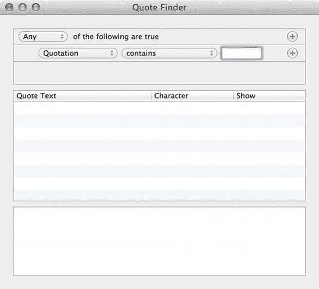

图 10-7。谓词编辑器已就位于我们的搜索窗口中

## 配置谓词编辑器

现在，需要将编辑器绑定到应用程序委托的谓词实例。选中`NSPredicateEditor`（别忘了额外点击一次以选中编辑器本身，而不是包含它的滚动视图），打开*绑定检查器*，然后检查*值*绑定信息。在弹出的菜单中选择“App Delegate”，然后在*模型键路径*组合框中输入“searchPredicate”，并按回车键激活此绑定。

此时，要启用此谓词编辑器的搜索功能，我们只需再做一件事：根据我们想要搜索的属性对编辑器进行定制。`NSPredicateEditor`是一个相当复杂的控件，幸运的是，其大部分有趣的功能都可在 Xcode 中直接配置。谓词编辑器显示一个或多个`NSPredicateEditorRowTemplate`对象，每个对象都可以配置为以多种方式进行搜索。我们可以创建行模板，允许用户指定数字或日期来与对象值进行比较，或者从预定义字符串列表中选取。在我们的例子中，我们将配置一个行模板，允许用户在文本字段中输入字符串，以便按角色名称、剧集名称和引文内容进行搜索。这个行模板可以复用，允许用户同时指定多个搜索条件。此外，另一个行模板将让用户选择搜索结果中的引文是必须满足所有条件（布尔`AND`），还是只要任意匹配成功即可（布尔`OR`）。

在 Interface Builder 画布中，点击两个可见行中较低的那个（即包含显示“名称”和“包含”的弹出按钮的那一行），深入查看谓词编辑器。选中该行模板后，调出*属性检查器*。注意那些复选框，它们让我们可以选择允许用户使用哪些比较器；还有弹出按钮，让我们可以选择比较器两侧表达式的性质（键路径、字符串、常量值等）。默认设置（左侧为键路径，右侧为字符串）非常适合我们的需求，但我们确实需要根据搜索需求调整键路径。

编辑 *Left Exprs* 键路径下方列出的三个默认值，将它们修改为 `quoteText`、`character` 和 `show.name`。接着，点击选中*忽略大小写*和*忽略变音符号*复选框（参见图 10-8）。


图 10-8。配置 `NSPredicateEditorRowTemplate`

然后，检查行模板本身的弹出按钮。这里会显示三个条目，名称与我们刚刚输入的键路径相同。将它们改为更易读的名称：“引文”、“角色名称”和“剧集名称”。

现在点击上方的行模板，即显示“以下任意一项为真”的那一个。它的配置非常简单。复选框让我们可以选择是否允许用户使用布尔 `AND`、`OR` 和 `NOT` 进行搜索。

启用所有这些选项以获得最大的实用性。

现在，还有最后一项配置需要完成。默认情况下，`NSPredicateEditor` 允许用户删除所有行，直至最后一行，此时将不再有 + 按钮来添加新行。通过选中谓词编辑器本身（而不是某个行模板），并在*属性检查器*中点击取消勾选*可移除所有行*复选框来更改此行为。

保存工作，在 Xcode 中点击运行，尽情享受 QuoteMonger 的强大功能吧！现在，我们可以使用在谓词编辑器中配置的三个条件，轻松搜索所有已保存的引文。

## 保存谓词

在收工之前，让我们再添加一项最后的润色，使 QuoteMonger 为用户带来友好的使用体验。目前，每次用户启动应用时，它都会使用我们设定的默认查询。如果它能显示上次运行时的最后一个查询，岂不是很好？事实证明，这非常简单。`NSPredicate` 有一个便捷的方法叫做 `predicateFormat`，它以字符串形式返回谓词的值。因此，我们可以在用户退出应用时，使用 `NSUserDefaults` 保存当前 `searchPredicate` 的字符串表示形式，并在应用启动时检查是否有保存的字符串。打开 `QMAppDelegate.m`，对其实现的第一部分进行如下修改（只需添加所有以粗体显示的行）：

```
#import "QMAppDelegate.h"

@implementation QMAppDelegate

@synthesize persistentStoreCoordinator = _persistentStoreCoordinator;
@synthesize managedObjectModel = _managedObjectModel;
@synthesize managedObjectContext = _managedObjectContext;

#define DEFAULT_PREDICATE @"(quoteText CONTAINS[cd] 'missed') OR " \
                           "(character CONTAINS[cd] 'kramer')"
#define STORED_PREDICATE_KEY @"storedPredicateFormat"

- init {
  if ((self = [super init])) {
    NSString *format = [[NSUserDefaults standardUserDefaults]
        objectForKey:STORED_PREDICATE_KEY];
    if (format)
      self.searchPredicate = [NSPredicate predicateWithFormat: format];
    else
      self.searchPredicate = [NSPredicate predicateWithFormat: DEFAULT_PREDICATE];
  }
  return self;
}

- (void)applicationWillTerminate:(NSNotification *)aNotification {
  NSString *format = [self.searchPredicate predicateFormat];
  [[NSUserDefaults standardUserDefaults] setObject:format forKey:STORED_PREDICATE_KEY];
}
```

我们首先定义了一个字符串，它将用作通过 `NSUserDefaults` 在用户偏好设置中存储和检索谓词的键。然后，我们增强了 `init` 方法，以便查找已存储的谓词。它首先检查是否存在已存储的谓词字符串，如果存在，则使用该格式字符串创建一个新的谓词来填充 `searchPredicate` 实例变量。如果没有存储的谓词，则创建默认谓词。

最后，我们实现了 `applicationWillTerminate:` 方法。当用户退出应用程序时，这个方法会被自动调用，让我们有机会进行一些最后的清理工作。在这里，我们将当前的搜索参数（保存在 `searchPredicate` 实例变量中）转换为字符串，并将该字符串保存到用户的偏好设置中，以便用户下次运行应用时，相同的搜索条件会再次出现。

保存，运行，然后修改搜索词。退出应用并再次运行，之前的搜索词会再次出现。

## 总结

本章展示了如何使用 `NSPredicate` 来缩小 Core Data 结果集的基本知识。我们了解了如何在代码中、在 Xcode 中、或者通过用户与 `NSPredicateEditor` 的交互来构造 `NSPredicate`。我们还初步了解了如何保存这些谓词以供以后使用，就像 iTunes 和 Mail 对智能播放列表和智能文件夹所做的那样。这些技术可以帮助你轻松地为自己的应用程序带来新的功能层次。

[第 8 章](#9781430245421_Ch08.


# 第 11 章：窗口、菜单与面板

第 1 章到第 10 章涵盖了开始使用 Core Data 所需的主要概念。现在让我们转向其他主题。不过我们不会完全抛开 Core Data，它仍会在后续的一些练习中发挥作用，虽然程度不同。本书篇幅有限，无法将每个示例都变成完整的应用程序。然而，即使在没有使用 Core Data 的情况下，您也可以思考它如何融入我们接下来章节演示的内容。既然您已经熟练掌握了 Core Data，那么对于应用开发的某些方面，您可能会产生全新的见解，而这些方面您以前可能会用不同的方式解决。说到视图，这正是第 11 章的主题——我们将探讨 Cocoa 及其他框架中最突出、最常用的视图组件：窗口、菜单和面板。

在过去的几章中，我们一直专注于可视为 Cocoa 编程“后端”的内容——即提供功能来维护应用基础设施的模型和控制器类。现在该把注意力转向 Cocoa 的“前端”，更多地关注 MVC 架构中的视图部分了。

在本章中，我们将重点讨论窗口（不是微软那种）、菜单（不是餐厅那种）、面板（不是太阳能那种）和表单（不是床单那种），这些都是高级 GUI 对象，几乎没有哪个 Cocoa 应用能离开它们。窗口为视图对象的绘制提供了基础。在 Cocoa 中，这些由`NSWindow`、其直接子类`NSPanel`以及几个专用子类表示。菜单提供了熟悉的屏幕顶部访问系统范围和特定应用用户操作的途径，这是大多数 Mac 应用都有的功能，由`NSMenu`和`NSMenuItem`对象的层级结构表示。表单提供了一种替代经典自由浮动模态窗口的方式——它将模态窗口作为覆盖层附着在现有窗口上，为用户提供更连贯的界面。

我们将通过一个“实验室”来探索这三个领域，这是一个没有实际用途的玩具应用，仅用于演示某些功能并让我们了解这些组件的工作原理。

## NSWindow 与 NSPanel

首先，使用 Cocoa 应用模板创建一个新的 Xcode 项目，并将其命名为`WindowLab`。我们将用这个项目作为测试平台来演示各种窗口功能。

在 Mac OS X 中，屏幕上几乎所有的显示内容都是通过窗口呈现的。许多窗口很容易识别，顶部有标准控件，背后有投影。

但有些窗口并不那么明显。例如，如果启动一个全屏显示的游戏，即使它呈现的是与 Cocoa 无关的自定义控件，这一切也都发生在一个窗口中。屏幕底部的 Dock 显然是一个窗口。如果将一个文件图标从一个 Finder 窗口拖到另一个窗口，拖动的图标实际上是被一个透明的小窗口“携带”着！

在所有这些情况下，我们看到并与交互的都是`NSWindow`及其子类的实例。`NSWindow`是一个非常通用的类，它允许我们直接配置多种行为，并通过子类化实现更多功能。通常，如果我们想改变窗口本身的外观——无论是其“镀铬装饰”（标题栏和左上角控件）、透明度还是形状——我们可能需要子类化`NSWindow`，但在其他情况下几乎不需要这样做。在本书中，我们将坚持使用可直接使用的窗口类型，并遵循苹果的人机界面指南，不会通过子类化`NSWindow`来改变它们的外观。

**提示** 人机界面指南（常简称为“HIG”）是苹果为应用开发者提供的一系列建议。HIG 就像一种风格指南，当你担心应用看起来有点“不对劲”时可以查阅。它并非严格的规定，也没有人会阻止你违反 HIG。实际上，包括苹果自家应用在内的许多应用，都会以各种方式偏离指南。然而，它提供了一个良好的基准，描述了各种组件应如何使用。

我们在第 2 章已经提到过 HIG，但值得再次指出。你可以在`http://developer.apple.com/library/mac/#documentation/UserExperience/Conceptual/AppleHIGuidelines/Intro/Intro.html`在线找到 HIG。

图 11-1 展示了当今大多数 Cocoa 应用中常见的主要窗口类型。`NSWindow`包含两种绘制风格：“普通”外观和“纹理”外观（后者有点像闪亮的金属片）。`NSWindow`的任一风格都可以配置为支持全屏模式，这会在标题栏右端添加箭头。`NSPanel`可以配置为工具模式（此时标题栏更小、阴影更小，并浮动在应用的其他窗口之上），也可以看起来像普通窗口。在这两种情况下，普通外观与纹理外观的选择也同样适用，与`NSWindow`类似。`NSPanel`的另一个选项是 HUD（平视显示器）模式，此时面板的配色方案反转，标题栏和底部边缘被修改，整个窗口变得略微透明。这种模式（没有纹理选项）旨在让用户透过界面的部分区域看到背后的内容，并在像 iPhoto 这样的应用中得到了很好的应用——你可以调出一个包含可调颜色设置的 HUD 面板，透过它仍然可以看到正在查看的照片。


图 11-1. Cocoa 中可直接使用的主要窗口类型示例

与某些其他 GUI 工具包不同——它们创建新应用时首先要做的就是子类化某种应用类和某种窗口类——Cocoa 允许模型、视图和控制器部分真正分离。窗口只需要知道如何显示自身并为视图提供图形上下文，仅此而已。任何处理应用运行时窗口状态变化的代码（例如从 nib 文件加载、被拖过屏幕或被用户关闭）通常都可以由窗口的委托对象（即其控制器）来处理。

## 处理输入

除了为视图提供显示内容的框架外，`NSWindow`还处理来自鼠标和键盘的用户输入。`NSWindow`中的任何鼠标操作（点击、拖动、移动、释放等）都会触发`NSWindow`中的一个方法，该方法在其内容中查找适当的视图对象，并在视图上调用相同的方法。这种对称性之所以有效，是因为`NSWindow`和`NSView`都继承自`NSResponder`，而处理这些事件的方法正是在该类中定义的。同样，当用户按下或释放键盘上的某个键时，应用程序会调用应用“关键窗口”（即当前拥有键盘焦点的窗口；通常是用户最后点击的窗口）中的方法，该方法进而确定哪个视图当前拥有键盘焦点，并将责任移交出去，在焦点视图中调用相同的方法。


## 使用面板还是不用面板？

由于我们不会修改窗口的基本外观，因此将使用 `NSWindow` 或其子类 `NSPanel` 来显示应用程序中的控件和其他视图。我们应用程序的核心元素通常位于 `NSWindow` 中，而 `NSPanel` 则用于辅助窗口，例如 Finder 中的“显示查看选项”面板。从用户的角度来看，`NSWindow` 和 `NSPanel` 之间只有几个关键区别：

- `NSPanel` 实例通常在其他应用程序成为活动应用程序时变为不可见，并在其自身应用程序再次成为活动状态时重新出现。
- `NSPanel` 可以设置为“浮动”在其应用程序的所有其他窗口（包括主窗口）之前。
- `NSPanel` 可以轻松配置为不会不必要地成为关键窗口，这样用户就可以点击辅助面板中的按钮，然后继续在主窗口中输入。

## 窗口属性

在 Xcode 的 WindowLab 项目中，导航到 *MainMenu.xib* 文件并单击以在 Interface Builder 画布中打开它。与往常一样，应用程序 nib 文件中包含的对象之一是一个窗口。单击以在主 nib 窗口中选择它，然后打开 *属性检查器*，以便我们能够对其进行一些探索（参见图 11-2）。在之前的章节中，我们使用此检查器来设置窗口的标题，但当然我们还可以在这里做更多事情。


图 11-2. NSWindow 的属性检查器

我们已经熟悉了 *标题* 文本字段。其正下方是 *自动保存* 字段，它提供了非常不错的功能：在此字段中输入一个文本字符串，窗口将使用该字符串作为 `NSUserDefaults` 系统中的键，并基于该键存储和检索其位置。这意味着当用户重新排列我们应用程序中的窗口时，窗口位置会保存在用户的偏好设置中，并且下次运行我们的应用程序时，窗口将出现在相同的位置。而我们要做的就是为应用中的每个窗口填写此文本字段，并为每个窗口输入一个唯一的值。

接下来，有一些复选框允许我们关闭某些标准窗口控件。请注意，关闭这些复选框不会从窗口的标题栏中移除相应的按钮；它只会在我们的应用程序运行时使它们永久显示为灰色且不可用。其下方是一些用于调整窗口外观的复选框，包括启用纹理模式、禁用窗口后的投影等。这里提到 *工具栏* 的选项指的是可附加到窗口的可选 `NSToolbar`，我们将在本章稍后部分进行解释。我们还可以移除窗口的标题栏。这通常是一个坏主意，因为用户将无法重新定位窗口，但对于像全屏游戏这样的应用程序可能有用。

下一组复选框允许我们以多种方式微调窗口的行为，其中大部分不言自明。一个例外是 *自动重新计算视图循环* 复选框，它的名称令人费解。其概念是：每个窗口都维护一个包含所有视图对象的列表，用户可以通过 Tab 键在这些视图之间切换。如果选中此复选框，则在应用程序运行时添加到窗口的任何视图都将自动插入到这个“循环”中的某个位置。另一个例外是 *可恢复* 复选框。启用 *可恢复* 会告诉 Cocoa，我们的窗口应尝试在应用程序启动之间恢复到相同的状态。

在我们的帮助下，我们的应用程序可以重新打开用户退出时处于打开状态的窗口，甚至可以将它们恢复到用户退出时的相同滚动位置和选择状态。

在其下方，您会找到一系列处理窗口如何与桌面交互的菜单。Mac 桌面环境有一个叫做 *Mission Control* 的功能（位于“系统偏好设置”应用中），它允许用户拥有多个桌面（或空间）并在它们之间移动窗口，以及显示所有窗口或单个应用程序的所有窗口。在先前版本的 Mac OS/X 中，Mission Control 是两个独立的功能，分别称为 Spaces 和 Exposé，属性检查器中仍然沿用这些名称。

通常，我们应将这些设置为 *推断行为*，这意味着窗口行为正常。对于 Spaces，其他选项是 *可以加入所有空间*，这意味着窗口将始终可见，或 *移动到活动空间*，这意味着窗口在变为活动状态时将移动到当前空间，而不是将活动桌面切换到窗口所在的桌面。对于 Exposé，*推断行为* 等同于 *托管行为*，这意味着窗口对 Exposé 操作正常响应。其他选项是 *瞬态*，这会导致在激活 Exposé 时隐藏窗口（这是面板的默认设置），以及 *固定*，这意味着窗口完全忽略 Exposé。下一个选项涉及此窗口是否应包含在用户可以使用 **窗口**  **循环浏览窗口** (-``) 命令旋转浏览的窗口集合中。接下来是窗口是否支持全屏选项，窗口会扩展到自己独立的空间并占据整个显示屏，就像 iOS 应用程序一样，包括隐藏菜单栏。如果此项设置为 *主窗口*，则标题栏右侧会显示一个特殊控件以激活全屏模式。

最后，有一些与窗口内存使用相关的选项。最好保持 *延迟* 开启，因为这会跳过为窗口分配一些内部内存，直到它即将实际显示窗口为止。此外，我们应该保持 *一次性* 关闭。如果打开，则该内部内存在窗口关闭后会立即释放，因此只有在涉及的窗口是临时窗口（如启动画面）且每个会话只能显示一次时，才应打开此选项。最后，一个弹出式窗口提供了将窗口的“后备存储”从 *缓冲* 切换到 *保留* 或 *非保留* 的功能。永远不要这样做！*保留* 和 *非保留* 选项仅用于支持特定类型的遗留代码，所有新的 Cocoa 应用程序都应该为每个窗口将此设置保留为 *缓冲*。

现在，从 *对象库* 窗口中拉出一个 `NSPanel`，再次查看 *属性检查器*；注意除了我们检查 `NSWindow` 时看到的选项外，还有一个样式弹出式菜单和几个新增的复选框。此处的样式选项是 *实用工具*，如果选择它，会使面板具有独特的外观，并使其浮动在应用程序的其他窗口之上；以及 *HUD*，它会给窗口带来更加独特的“平视”外观。尝试一些这些样式，看看它们如何影响面板的外观。面板的行为也可能与窗口不同。面板可以在 *全屏* 下拉菜单中标记为辅助窗口，这意味着它将在同一空间中浮动在全屏模式窗口之上。这对于影响另一个窗口中文档的“查找”或“信息”面板之类的东西非常有用。探索后，从 nib 文件中删除该面板。

## 标准系统面板

除了为我们填充自己的视图和控件而设计的通用窗口类之外，Cocoa 还包含一些专门的窗口子类，供我们在应用程序中使用。


这些旨在满足各种应用的需求，因此使用它们可以免费获得大量功能，同时为我们的用户提供可能在其他应用程序中使用过的熟悉界面。

**颜色面板**

首先，让我们看看`NSColorPanel`。这个面板提供了一个界面，允许用户选择一种颜色。我们将通过在我们的控制器类中实现一个方法来使用颜色面板设置屏幕文本的颜色，该方法在用户在颜色面板中选择一种颜色时被调用。

假设我们在 Xcode 中创建的`WindowLab`项目中，`MainMenu.xib`文件仍然打开，让我们看看 nib 文件中的主窗口对象。从*对象库*中拖出一个换行标签（也称为多行标签），并将其放到窗口上。再拖出一个按钮，并将其放置在标签下方。使用`显示颜色面板`作为标题。布局应如图 11-3 所示。

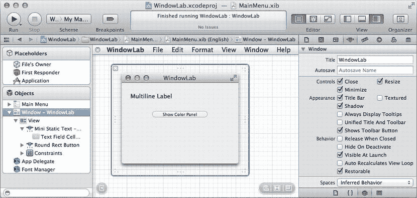

图 11-3。一个非常简单的窗口布局

Xcode 也会为我们创建一个 App Delegate 类。如果我们使用`WL`作为类前缀，那么它将被命名为`WLAppDelegate`。在 Xcode 中，在 Interface Builder 面板旁边打开一个辅助编辑器窗格（我们在第 5 章中讨论过辅助编辑器窗格；点击 Xcode 工具栏中*编辑器*标签图标块中看起来像管家背心和领结的图标）。很可能打开此窗格时会预加载`WLAppDelegate.h`文件，但如果未加载，请使用窗格顶部的导航栏打开它。我们将添加一个名为`title`的 outlet 和一个名为`showColorPanel:`的 action。为此，从*多行标签*拖拽到`WLAppDelegate.h`文件，目标指向现有`@property`声明的正下方。添加一个新的 Outlet 并将其命名为`title`。然后，从*显示颜色面板*按钮拖拽到新添加的 outlet 正下方，并添加一个名为`showColorPanel:`的 Action（我们需要将连接类型更改为*Action*）。

完成后，`WLAppDelegate.h`文件应如下所示：

```objc
#import <Cocoa/Cocoa.h>

@interface WLAppDelegate : NSObject <NSApplicationDelegate>

@property (assign) IBOutlet NSWindow *window;
@property (weak) IBOutlet NSTextField *title;
- (IBAction)showColorPanel:(id)sender;

@end
```

现在切换到`.m`文件，并添加以下`showColorPanel:`方法的实现，以及一个名为`changeColor:`的方法，如下所示：

```objc
#import "WLAppDelegate.h"

@implementation WLAppDelegate

- (void)applicationDidFinishLaunching:(NSNotification *)aNotification {
    // Insert code here to initialize your application
}

- (IBAction)showColorPanel:(id)sender {
    // create the color panel
    NSColorPanel *panel = [NSColorPanel sharedColorPanel];
    // bring the color panel to the front of the screen
    [panel orderFront:nil];
}

- (void)changeColor:(id)sender {
    // in this method, the "sender" parameter is the NSColorPanel
    // itself.  We just ask it for its color, and pass it along to
    // the "title" object.
    [self.title setTextColor:[sender color]];
}

@end
```

**注意**：尽管我们之前见过，但请仔细查看`WLAppDelegate.h`文件中的`@property`声明。大多数情况下，当添加一个连接到用户界面元素的属性时，该属性包含`weak`注释。但对于指向窗口的引用，情况并非如此。该属性被标记为`assign`。这有一个很好的理由：注释控制着自动引用计数（ARC）如何处理引用。标记为`strong`的引用表示对对象的所有权。

标记为`weak`的引用不表示所有权，并且当指向某对象的所有强引用被释放且该对象被回收时，弱引用将被清零。但是，ARC 不能与重写`release`和`retain`的类一起工作，这包括`NSWindow`。由于`NSWindow`不支持 ARC，该属性被赋予了`assign`注释。这实际上意味着与`weak`相同，但适用于非 ARC 启用的类。应用代理并不拥有该窗口，因此应用代理与窗口的连接不应阻止窗口在适当时被释放和回收。

`showColorPanel:`方法将由 GUI 中的简单按钮点击调用，而当我们从按钮拖拽时 Xcode 已经为我们连接好了。但是，`changeColor:`方法将在用户点击颜色面板中的颜色时被调用，即使颜色面板和我们的代码之间没有任何直接连接。这种“魔法”之所以有效，归功于一个名为响应者链的 Cocoa 概念（参见侧边栏）。

**响应者链**

响应者链是一个特别的对象集合，在应用程序生命周期中按需动态收集，可以查询它们是否实现了特定的 action。这使得某些 action 可以以通用方式配置，以便在运行时，它们将被调用到在当时最有意义的对象上。该链按特定性顺序排列，从“最接近” action 的对象开始，一直延续到最通用的对象。在 Interface Builder 中，通过将操作连接到 nib 的*第一响应者*图标上的 action 来配置使用响应者链的对象，该图标只不过是响应者链中第一个对象的代理，当被询问是否实现了特定方法时，该对象在运行时说“是的，我可以”。

由于每个窗口都有自己的“第一响应者”概念（通常是用户最后交互的控件或视图，从而使其成为接收按键等操作的可能候选者），这使得这一切变得更加令人困惑。

让我们尝试通过一个例子来澄清这一点。考虑一个按钮的情况，其目标/操作被配置为调用*第一响应者*上一个名为`showThing:`的方法。当用户点击按钮时，会按顺序询问列表中的每个对象是否实现了`showThing:`方法，直到其中一个回答`YES`，此时将调用该对象的`showThing:`方法，响应者链的工作就完成了。以下是响应者链可能的样子示例：

1.  窗口的“第一响应者”（当前聚焦并接受键盘输入的视图）、其父视图、父视图的父视图，依此类推，一直向上到窗口内的视图层次结构
2.  窗口本身
3.  窗口的代理
4.  应用程序对象，`NSApp`
5.  应用程序对象的代理

响应者链可能还包含其他对象，特别是如果我们在处理基于文档的应用程序，那么打开的文档及其控制器也会在链中占有一席之地。更多内容请参见第 12 章。

一旦这些对象中的任何一个表示实现了`showThing:`，那么就会在该对象上调用该方法，搜索结束。

现在保存工作并点击**运行**。我们的新应用将出现，点击按钮将调出颜色面板。点击一些不同的颜色，所选文本的颜色将立即更改以反映新的选择。

那么，考虑到颜色面板与我们的应用代理没有直接连接，有理由怀疑：这是如何工作的？我们应用代理中的`changeColor:`方法是如何被调用的？关键在于使用如前所述的响应者链。


`NSColorPanel`使用响应者链来查找实现了`changeColor:`方法的对象。作为应用程序的委托，我们的小控制器对象是被查询是否实现了该方法的最后一个对象之一，由于它实现了，所以该方法会被调用。请注意，如果窗口本身实现了该方法，或者窗口的委托实现了该方法，那么这些方法之一会被优先调用。

现在我们需要以一个现实检验来结束本节。实际上，我们刚才所做的事情可以通过使用`NSColorWell`更轻松（也更美观）地完成，这是一个特殊的控件，点击时会启动`NSColorPanel`。我们只需要编写代码在控制器类中声明一个属性来包含`NSColor`，然后使用 Cocoa 绑定将`NSColorWell`的*Value*属性和`NSTextField`的*Text Color*属性绑定到控制器中的这个属性。此示例在此处原样保留，主要是为了向您展示如何从自己的代码中使用颜色面板，并让您初步了解响应者链的概念。

## 字体面板

接下来要介绍的特殊面板是`NSFontPanel`。与颜色面板不同，字体面板没有匹配的控件来启动它。不过，它可以相当容易地与系统“格式”菜单的内容集成，我们稍后会看到这一点。

我们在这里要做的是向`WindowLab`窗口添加一个按钮，该按钮将触发一个打开字体面板的操作方法，以及另一个将更新文本字段的方法。首先，让`WindowLab`窗口变得更高一些。然后，选择打开颜色面板的按钮，并复制它。将新按钮标题设为“Show Font Panel”。打开一个助理编辑器窗格，显示`WLAppDelegate.h`文件，并从按钮按住 Control 键拖动到助理编辑器窗格，目标位置在现有操作方法下方。插入一个新的操作，并将其命名为`showFontPanel`。

添加该操作将导致以下方法声明被添加到类的`@interface`块中，位于`WLAppDelegate.h`文件内：

```
- (IBAction)showFontPanel:(id)sender;
```

以下存根将被添加到`WLAppDelegate.m`文件中的`@implementation`部分：

```
- (IBAction)showFontPanel:(id)sender { }
```

切换到`.m`文件，并在`@implementation`部分填写以下代码：

```
- (IBAction)showFontPanel:(id)sender {
    NSFontPanel *panel = [NSFontPanel sharedFontPanel];
    NSFontManager *manager = [NSFontManager sharedFontManager];
    [manager setSelectedFont:[self.title font] isMultiple:NO];
    [panel orderFront:nil];
}

- (void)changeFont:(id)sender {
    // 这里，'sender' 是共享的 NSFontManager 实例
    NSFont *oldFont = [self.title font];
    NSFont *newFont = [sender convertFont:oldFont];
    [self.title setFont:newFont];
}
```

这遵循与颜色面板相同的使用模式。当用户点击字体时，字体面板使用响应者链查找实现了`changeFont:`操作方法的对象，并且它成功在我们的应用程序委托中找到了它。这里的情况稍微复杂一些，因为在这两个方法中，我们都使用了`NSFontManager`类的共享实例。运行中的应用程序对所选或当前字体的概念保存在这个共享实例中，我们首先在`showFontPanel:`中使用它，间接告诉`NSFontPanel`它应该开始显示哪个字体，然后在`changeFont:`中再次使用它来获取新的所选字体。我们通过将旧字体传递给字体管理器的`convertFont:`方法来获取新字体，该方法将旧字体的特性与用户在字体面板中的选择状态结合起来（例如，如果旧字体是 Lucida Grande/Bold/36，而用户选择了 Times New Roman，其他保持不变，转换后的字体将是 Times New Roman/Bold/36）。

现在，保存工作，返回 Xcode，然后点击**Run**。

我们现在可以更改显示文本的颜色和字体（参见图 11-4）。

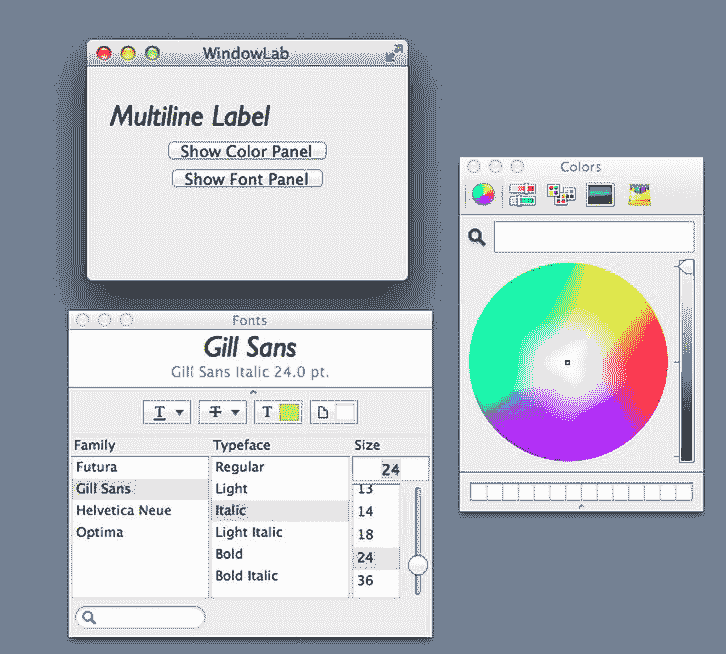

图 11-4 设置标签的颜色和字体

## 拥有独立 Nib 文件的控制器

接下来，我们将演示一个在 Cocoa 开发中经常出现的简单模式：创建一个加载自己 nib 文件的控制器类，成为文件中所有对象的“所有者”。在我们迄今为止创建的所有应用程序中，所有 GUI 元素都包含在应用程序的单个`.xib`文件中。这对于简单应用程序来说效果很好，但有其局限性。首先，我们在 nib 文件中只有一个窗口实例和一个控制器实例。其次，整个主 nib 文件在应用程序启动时一次性加载，nib 文件中的内容越多，启动阶段就会越慢且占用更多内存。诚然，在拥有数 GB RAM 的现代计算机上，这可能不是一个大问题，但作为程序员，总是应该尽量避免随意浪费 CPU 和 RAM。最后，将太多顶级对象（如窗口、控制器等）放入单个 nib 文件会给程序员带来困难，因为更难看出哪些控制器和窗口属于一起。

这两个问题的解决方案是将部分 GUI 对象分发到其他 nib 文件中，并通过加载这些 nib 文件的控制器类来管理它们的使用。许多 Cocoa 应用程序使用此技术，通常将偏好设置、文档、工具等窗口拆分为单独的 nib 文件。以下部分将演示两种不同的实现方式，复杂度递增。

### 使用 NSWindowController 加载 Nib 文件

第一种也是最简单的方法是使用 Cocoa 的`NSWindowController`类加载 nib 文件并成为其所有者。我们将向主窗口添加一个按钮来触发加载新的 nib 文件，并向`WLAppDelegate`添加一个`NSMutableArray`来持有对新加载 nib 文件的引用。如果没有东西持有对新加载 nib 的引用，ARC 系统会导致它们被立即释放。

首先，打开`WLAppDelegate.h`文件，并添加以下属性（以粗体显示）：

```
@interface WLAppDelegate : NSObject <NSApplicationDelegate>

@property (assign) IBOutlet NSWindow *window;
@property (weak) IBOutlet NSTextField *title;
@property (strong) NSMutableArray *subWindows;
```

然后，在`.m`文件的`applicationDidFinishLaunching:`方法中添加这一行：

```
- (void)applicationDidFinishLaunching:(NSNotification *)aNotification {
    self.subWindows = [[NSMutableArray alloc] init];
}
```

接下来，打开`MainMenu.xib`文件，并在主窗口中已有的两个按钮下方添加一个新按钮。将其标签设为“Load Easy Window”。打开一个*Assistant Editor*窗格（如果尚未打开），并在其中打开`WLAppDelegate.h`文件。从新按钮按住 Control 键拖动到`.h`文件，并添加一个名为`loadEasyWindow`的新操作。然后，在`WLAppDelegate`的`.m`文件中为存根填写以下实现：

```
- (IBAction)loadEasyWindow:(id)sender {
    NSWindowController *easyController = [[NSWindowController alloc]
        initWithWindowNibName:@"EasyWindow"];
    // 需要持有对该对象的引用。
    [self.subWindows addObject:easyController];
    [easyController window];
}
```

在该方法中，我们首先初始化一个新的控制器，并告诉它要使用的 nib 文件名。然后，我们将对该控制器的引用存储到在`applicationDidFinishLaunching:`方法中创建的`subWindows NSMutableArray`中，这样新的控制器就不会在方法结束时被释放。


如果我们不保留对它的引用，当它超出作用域时就会被释放，新加载的 nib 文件也会随之释放。当然，在实际应用中，我们需要一种机制来适时地从该列表中移除对象，但我们暂时先忽略这一点。然后我们调用它的 `window` 方法，该方法实际加载 nib 文件并显示窗口。当然，我们还没有创建 EasyWindow nib 文件，所以现在就来创建它。

在 Xcode 中通过选择 **File**  **New**  **New File** 创建一个全新的 nib 文件。在模板选择器中，选择 OS X 下的 *User Interface*，然后选择 *Window* 模板，该模板包含一个可供我们使用的 `NSWindow`。将新文件命名为 EasyWindow，并在 *Group* 弹出菜单中选择 WindowLab 文件夹。*Group* 弹出菜单会显示五个项目，前三个分别是带 Xcode 项目图标的 WindowLab、带文件夹图标的 WindowLab 以及带文件夹图标的 Supporting Files。这些对应着 Xcode 导航区域中的文件分组。选择带文件夹图标的 *WindowLab* 条目，然后点击 *Create*。

我们新建的 xib 文件会作为新文件出现在 Xcode 的 *Navigator* 区域中，因此从那里打开该文件。在 nib 文件中选中 Window，然后打开 *Attributes Inspector*。给窗口设置标题为“Easy Window”。

在前面的章节中，我们创建的每个控制器都已作为顶层对象添加到 nib 文件中，但当你自己加载 nib 文件时，可以指定一个对象作为其“所有者”，在 Interface Builder 中，这通过主 nib 窗口中的 *File’s Owner* 对象来表示。`NSWindowController`（我们控制器的类）在加载文件时已经自动将自己设置为 nib 文件的所有者，但我们仍需要在 Interface Builder 中手动配置，以便能够利用它。为此，选中 *File’s Owner* 图标并打开 *Identity Inspector*。在该检查器的顶部，我们可以设置希望成为文件所有者的对象的类。默认情况下它设置为 `NSObject`，但我们通常希望它设置为 `NSWindowController` 本身或 `NSWindowController` 的自定义子类。现在，将其 *Custom Class* 设置为 `NSWindowController`，如图 11-5 所示。最后，从 *File’s Owner* 图标按住 Control 键拖拽到窗口上，并将其分配给 *File’s Owner* 的 `window` 输出口。我们需要这样做，以便 `NSWindowController` 知道众多 `NSWindow` 对象中哪个是 nib 的“主”窗口。


图 11-5. 设置 File’s Owner 的类

保存然后点击 **Run**。应用的新按钮将允许我们每次按下按钮时创建新窗口（参见图 11-6）。

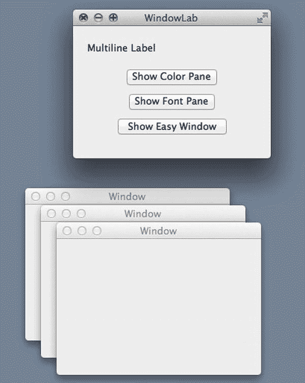

图 11-6. 一些简易窗口

每次它实际创建一个新的 `NSWindowController` 实例，该实例会加载一份全新的 nib 文件副本，包括其中的所有对象。在这个例子中，我们只拥有一个窗口，但你可以将任何你喜欢的内容放入这些 nib 文件中，例如用于访问 Core Data 的控制器对象。

## Subclassing NSWindowController

当然，你通常需要在控制器类中添加一些自己的代码。你也可以通过子类化 `NSWindowController` 来轻松满足需求。下一步，我们将创建一个子类，并为其创建一个新的 nib 文件来加载，然后设置一种从主窗口和控制器调用它的方式。

在 Xcode 中，通过从菜单中选择 **File**  **New File** 并在模板选择器的 OS X 部分选择 *Cocoa*，在 WindowLab 项目中创建一个名为 `NotSoEasyWindowController` 的新类。

选择 *Objective-C class*，然后指定我们要创建 *NSWindowController* 的子类。Xcode 会建议使用 `WLWindowController` 作为名称，但你应该将其改为 `WLNotSoEasyWindowController`。勾选 *With XIB for user interface* 复选框，Xcode 还会为我们生成一个 `WLNotSoEasyWindowController.xib` 文件，其中 *File’s Owner* 设置为我们的新子类，并且 *window* 输出口已预先连接好。Xcode 会提示你保存 nib 文件，并询问将其添加到哪个分组。使用我们之前用于 Easy Window nib 文件的同一分组，即 WindowLab 文件夹。Xcode 会为我们生成包含一些方法的 `WLNotSoEasyWindowController.h` 和 `WLNotSoEasyWindowController.m` 文件，但我们需要在这些文件上做一些工作。

我们在这里创建自己的类，并且它只负责管理一个 nib 文件。因此，我们可以将 nib 文件的名称内置到类中，这样任何使用该类的用户只需了解该类，而无需知道 nib 文件本身的名称。我们还可以让调用者更轻松：假设任何创建此类实例的人都希望加载 nib 文件，我们就把对 `window` 的调用直接构建到 `init` 方法中。通过创建以下 `init` 方法来实现这一点：

```
- init {
	if ((self = [super initWithWindowNibName:@"WLNotSoEasyWindowController"])) {
		[self window];
	}
	return self;
}
```

这是标准 `init` 方法的推荐形式，我们调用超类中的另一个 `init` 方法，如果成功则执行特定于我们实例的工作，最后返回指向 `self` 的指针。趁现在，让我们删除 Xcode 为我们生成的 `initWithWindow:` 方法，因为永远不需要调用它。

现在切换到 `MainMenu.xib`。再次将窗口调高一些，复制最后一个按钮，并将其命名为“Not So Easy”。然后在 Assistant Editor 中打开 `WLAppDelegate.h`，从按钮按住 Control 键拖拽到 `WLAppDelegate.h` 上，并添加一个名为 `loadNotSoEasyWindow` 的新操作。打开 `WLAppDelegate.m` 文件，为该操作添加以下实现：

```
// 添加到 WLAppDelegate.m 中：
- (IBAction)loadNotSoEasyWindow:(id)sender {
    WLNotSoEasyWindowController *notSoEasyController = [[WLNotSoEasyWindowController alloc] init];
    [self.subWindows addObject:notSoEasyController];
}
```

我们还需要在 `WLAppDelegate.m` 顶部添加以下 `#import` 指令，以便编译器在编译应用委托时知道这个新类：

```
#import "WLNotSoEasyWindowController.h"
```

完成这些后，让我们为窗口控制器类添加一点功能，以便在创建 nib 文件后，我们可以确保窗口按预期与其正确连接：一个简单的方法，当被调用时让电脑发出蜂鸣声。不幸的是，我们需要手动添加它，但这很容易做到。

在 `WLNotSoEasyWindowController.h` 中添加以下方法声明：

```
- (IBAction)beep:(id)sender;
```

`WLNotSoEasyWindowController.m` 的整个内容应如下所示，其中添加了新的 `beep:` 操作方法：

```
#import "WLNotSoEasyWindowController.h"

@interface WLNotSoEasyWindowController ()
@end

@implementation WLNotSoEasyWindowController

- init {
    if ((self = [super initWithWindowNibName:@"WLNotSoEasyWindowController"])) {
        [self window];
    }
    return self;
}

- (void)windowDidLoad {
    [super windowDidLoad];
    
    // 实现此方法以处理窗口控制器的窗口从其 nib 文件加载后的任何初始化。
}

- (IBAction)beep:(id)sender {
    NSBeep();
}

@end
```

在 Interface Builder 画布中打开 `WLNotSoEasyWindowController.nib` 文件，从 *Object Library* 中拖出一个按钮，并将其标题设置为“Beep!”。从 Beep! 按钮按住 Control 键拖拽到 Object Dock 中的 *File’s Owner* 图标上，然后选择我们刚刚添加的 `beep:` 操作。


Xcode 会自动注意到我们添加了一个新操作，并使其可供使用。保存更改并选择**运行**；新的按钮将让我们能够创建窗口，当按下其中的按钮时会发出哔哔声，如图 Figure 11-7 所示。

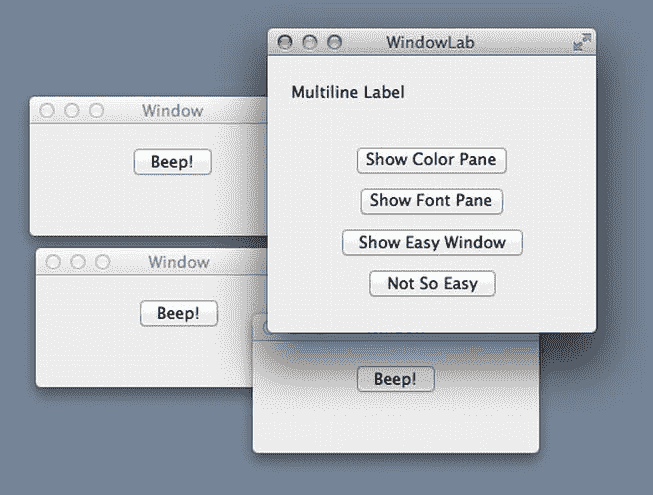

图 11-7. 这些窗口的按钮会向我们发出哔哔声。

## 模态窗口

现在我们将继续讨论一种特殊的 GUI 元素，即*模态窗口*。每个人都曾使用过模态窗口，但如果你对桌面 GUI 编程不熟悉，这个术语可能对你是新的。基本上，模态窗口是一种使应用程序进入特定“模式”的窗口。具体来说，在这种模式下，应用程序只能通过模态窗口本身的控件接受输入，而在应用程序中的任何其他位置点击都只会使其发出哔哔声。由于其干扰性，模态窗口应谨慎使用——仅在应用程序在没有用户回答某种问题（例如，“有五个打开的文档带有未保存的更改。您确定要退出吗？”）的情况下无法自行推进时使用。如果应用程序需要用户提供的信息仅与单个窗口或文档相关，则最好使用工作表（本章后面会介绍），它锁定的是单个窗口而不是整个应用程序。

### NSAlert 函数

Cocoa 中最简单的模态窗口是警报面板，只需一次函数调用即可创建和运行。当用户点击其中一个按钮时，该函数返回，然后我们可以检查返回值以确定他们点击了哪个按钮。根据我们调用函数的方式，可能会显示一个、两个或三个按钮供用户选择。

最常用的模态警报函数是 `NSRunAlertPanel`。它有几个变体，称为 `NSRunCriticalAlertPanel` 和 `NSRunInformationalAlertPanel`，它们用于 Apple 用户界面指南中概述的特定目的，但我们可以放心地使用 `NSRunAlertPanel`。这些函数中的每一个都需要五个或更多参数：首先是显示在面板顶部的标题，然后是要显示的完整文本（它提供一些信息或向用户提问），然后是三个包含按钮标题的字符串（可能为 `nil`）。设为 `nil` 的按钮标题将不会显示，除非它们全部为 `nil`，在这种情况下，面板上会包含一个“确定”按钮。

要查看一些警报面板的实际效果，请在 Interface Builder 窗格中打开 `MainMenu.xib`，然后在 Assistant Editor 窗格中打开 `WLAppDelegate.h`。向 WindowLab 窗口添加一个新按钮，并将其标题设置为“运行模态警报”。按住 Control 键从新按钮拖动到 Assistant Editor 以添加一个新操作。将新操作命名为 `runModalAlerts`。然后，在 Xcode 生成的存根内的 `WLAppDelegate.m` 中实现以下方法：

```objc
- (IBAction)runModalAlerts:(id)sender {
   NSRunCriticalAlertPanel(@"基本用法", @"这是一个简单的警报面板。", nil, nil, nil);
   NSRunAlertPanel(@"三个按钮", @"我们可以设置按钮标题：",
     @"真的吗？", @"哦，多么令人愉快！", @"随便吧。");
   NSRunAlertPanel(@"格式化字符串", @"我们也可以进行一些格式化，%@ %@",
     nil, nil, nil, @"将值放在末尾进行插入，", @"在三个按钮值之后。");
   switch (NSRunAlertPanel(@"注意选择",
             @"当然，我们可以检测到点击了哪个按钮。",
             @"默认", @"备用", @"其他")) {
     case NSAlertDefaultReturn:
       NSRunInformationalAlertPanel(@"结果：", @"您按下了默认按钮",
          nil, nil, nil);
       break;
     case NSAlertAlternateReturn:
       NSRunInformationalAlertPanel(@"结果：", @"您按下了备用按钮",
         nil, nil, nil);
       break;
     case NSAlertOtherReturn:
       NSRunInformationalAlertPanel(@"结果：", @"您按下了其他按钮",
         nil, nil, nil);
       break;
     default:
       break;
   }
}
```

试试看！保存，点击**运行**，然后试一试。

### 打开面板和保存面板

Cocoa 中另一个最常用的模态面板可能是用于打开和保存文件的面板，即 `NSOpenPanel` 和 `NSSavePanel`。使用这些面板通常不仅仅是一行代码。我们首先需要配置面板上的各种选项（例如，它是否允许用户选择多个文件进行打开，还是只允许选择一个），然后运行面板，检查返回值（它指示用户最终是点击了“打开”或“保存”按钮，还是取消了），然后从面板中获取结果文件名。请注意，这些面板实际上并不执行任何文件 I/O；它们只是提示用户输入文件名并返回结果。Cocoa 使用 `NSURL` 而不是 `NSString` 来表示文件路径，这使得打开和保存对话框可以引用本地文件系统之外的内容（例如 iCloud）。

要查看其工作原理的示例，请考虑以下方法，该方法模拟复制文件。此方法使用 `NSOpenPanel` 提示用户选择要复制的文件，然后使用 `NSSavePanel` 让用户指定文件的目标位置：

```objc
- (IBAction)copyFile:(id)sender {
     NSOpenPanel *openPanel = [NSOpenPanel openPanel];
     [openPanel setTitle:@"选择要复制的文件："];
     
     if ([openPanel runModal] == NSOKButton) {
         // 获取第一个（也是唯一一个）选定的文件名
         NSURL *openPath = [[openPanel URLs] objectAtIndex:0];
         // 仅提取文件名，不包括目录路径
         NSString *openFilename = [openPath lastPathComponent];
         
         NSSavePanel *savePanel = [NSSavePanel savePanel];
         
         [savePanel setTitle:@"输入目标文件名："];
         [savePanel setNameFieldStringValue:openFilename];
         
         // 在其默认目录中运行保存面板，并将打开的文件名作为建议。
         if ([savePanel runModal] == NSOKButton) {
             NSURL *savePath = [savePanel URL];
             NSString *message = [NSString stringWithFormat:
                                  @"您已经打开了该文件：\n\n%@\n\n 并将其保存到此处：\n\n%@\n\n",
                                  openPath, savePath];
             NSRunAlertPanel(@"复制文件（并非真的复制）", message, nil, nil, nil);
         }
     }
}
```

和之前一样，在主窗口中添加一个按钮（将这个称为“复制文件”），然后按住 Control 键拖动到 `WLAppDelegate.h` 文件以添加一个操作。将操作命名为 `copyFile`。然后将上面的代码复制到 `WLAppDelegate.m` 中，替换 Xcode 生成的操作存根。保存更改，点击**运行**，然后尝试新按钮。标准的打开面板会出现，接着是一个标准的保存面板。请注意，保存面板甚至具有内置功能，可以在我们选择现有文件时发出警告，并询问我们是否确实要覆盖它（请记住，在此示例中确认覆盖文件是完全安全的，因为我们实际上并没有复制任何内容）。

这里可能值得提一下一个不那么明显的事实：`NSOpenPanel` 实际上是 `NSSavePanel` 的子类。这意味着如果你在 `NSOpenPanel` 的文档或头文件中找不到预期的功能，你可能也需要查看 `NSSavePanel`。


## 系统菜单

我们已经了解了 Cocoa 中窗口的一些基本用法，接下来让我们花点时间探讨 Mac OS X 的另一个无处不在的特性——应用程序菜单。与大多数其他现代操作系统不同，Mac OS X 将菜单放置在屏幕顶部而非每个窗口顶部。这种布局有一些显著的优点：由于无需在每个打开窗口的顶部预留横向条幅，仅需屏幕顶部的一条横向菜单即可显示当前活动应用的菜单，从而节省了屏幕空间。此外，鼠标操作菜单更加轻松快捷——我们只需将鼠标向上甩动即可定位菜单，随后只需左右微调就能找到想要选择的顶层菜单项。

然而，这种布局并非没有复杂性。在典型的 Windows 应用程序中，可能会有多个不同的窗口，每个窗口都有自己的菜单，菜单项仅与当前窗口内容相关。虽然在 Mac OS X 应用程序中技术上可以实现类似功能（在不同窗口被选中时改变菜单结构），但这种做法并不被提倡，并且可能会打扰那些早已习惯 Mac 上应用行为一致性的用户。相反，我们可以实现一种完全受支持且推荐的行为：根据当前选中的窗口（或者更确切地说，窗口内当前选中的对象）来启用或禁用菜单项。在本节中，我们将演示如何实现这一点，但首先，我们将简要介绍 Cocoa 自带且大多数应用程序通用的系统菜单。

## 标准应用程序菜单项

苹果的指南定义了一组大多数应用程序都应包含的菜单和菜单项。在 Xcode 中创建一个新应用程序，命名为 `MenuLab`，并使用 `ML` 作为类前缀。我们将在此进行一些菜单项实验。打开刚创建的 `MainMenu.xib` 文件，Interface Builder 画布将显示顶部预定义的菜单集合。该集合包含应用程序自身的顶层条目，其后依次是"文件"、"编辑"、"格式"、"显示"、"窗口"和"帮助"菜单，每个菜单都包含各自的项目。打开*连接检查器*检查这些项目，查看它们连接到何处。只需依次点击各个菜单项，每次点击后观察检查器。其中有一些例外，例如*显示字体*菜单项，但大多数项目都连接到了我们之前讨论过的*第一响应者*代理。请注意，将菜单项连接到*第一响应者*不仅会让该菜单项在最相关的对象中调用其操作方法，还会根据响应者链中的内容自动启用或禁用该菜单项。

## 自定义菜单

标准菜单包含了大量功能：从调出应用程序的"关于"窗口，到编辑和格式化文本，再到处理窗口，所有功能都已配置完毕。然而，许多应用程序需要一些额外的功能——某些功能不适合附加到窗口，或者会占用窗口过多空间。解决这个问题的常见方法是在"显示"和"窗口"菜单之间添加一个或多个额外的顶层菜单项。例如，Finder 中有一个"前往"菜单，Xcode 有三个额外的顶层菜单："导航"、"编辑器"和"产品"。在我们的应用中，只需添加一个额外的菜单即可，我们将把它添加到 MenuLab 项目中。

## 使用绑定启用/禁用

我们要做的第一件事是设置一对菜单项，用于控制应用委托中的布尔属性。我们可以用它们来控制某种影响应用全局设置的开关。

在此，我们将创建一个名为 `turbo` 的属性，它假定能让一切运行得更快（在 MenuLab 中这很容易实现，因为它实际上并不执行任何操作）。我们将创建两个菜单项，分别标记为"Turbo On"和"Turbo Off"，并将它们连接到应用委托中的操作方法，以执行实际的切换。然后，我们将使用绑定来适当地启用和禁用它们，这样当 `turbo` 为 `YES` 时，只有"Turbo Off"项可点击；当 `turbo` 为 `NO` 时，只有"Turbo On"项可点击。

首先在 Xcode 中向应用委托添加 `turbo` 属性，以及一个用于切换属性值的操作方法。我们需要对 `MLAppDelegate.h` 和 `MLAppDelegate.m` 两个文件进行的修改如下所示（格式稍作精简，删除了空行）。我们只需添加以粗体显示的行。

```
#import <Cocoa/Cocoa.h>

@interface MLAppDelegate : NSObject <NSApplicationDelegate>

@property (assign) IBOutlet NSWindow *window;
@property (assign) BOOL turbo;
- (IBAction)toggleTurbo:(id)sender;

@end
```

对于 `MLAppDelegate.m`：

```
#import "MLAppDelegate.h"

@implementation MLAppDelegate

- (void)applicationDidFinishLaunching:(NSNotification *)aNotification {
    // 在此插入代码以初始化你的应用程序
}

- (IBAction)toggleTurbo:(id)sender {
    self.turbo = !self.turbo;
}

@end
```

现在切换回 Interface Builder 画布中的 `MainMenu.xib`。打开 nib 文件的空白窗口，将其标题更改为"Turbo Switch"，然后从*对象库*中拖入一个复选框，放置好后将其标题更改为"Turbo!"。我们放置此复选框是为了直接查看应用委托的 `turbo` 属性中存储的值，从而轻松检查并确认菜单项行为正确。打开*绑定检查器*，配置复选框的*值*绑定，使用 `turbo` 键路径将其连接到 `MLAppDelegate`。

接下来，是时候创建一些菜单项了（图 11-8 展示了完成后的效果）。首先，在*对象库*中搜索"Menu"以缩小范围。将一个子菜单项拖入菜单，将其放置在"显示"和"窗口"菜单之间。双击我们刚刚添加的新顶层菜单项，将其标题更改为"工具"。再次点击它会发现其中已包含一个项目（标题为"Item"）。点击选中它，然后按 `⌘D` 复制，会在其下方放置一个相同的项目。

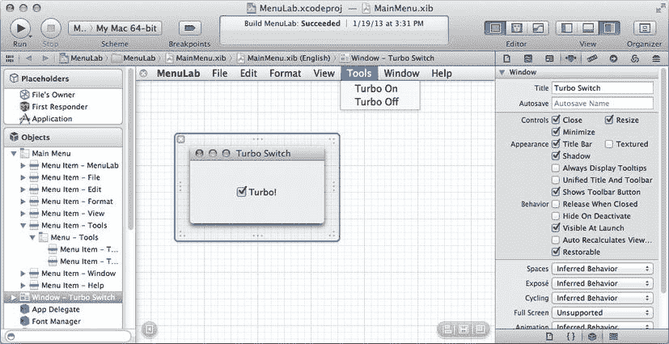

图 11-8. 设置用于切换布尔属性的菜单项

此时，应该选中了两个新菜单项中下方的那个。双击选中标题文本，将其重命名为"Turbo Off"。按住 Control 键从中拖拽到主窗口中的应用委托图标，连接到 `toggleTurbo:` 操作。现在打开*绑定检查器*，配置菜单项的*已启用*绑定，使用 `turbo` 键路径连接到应用委托。这确保了只有应用委托的 `turbo` 属性值为 `YES` 时，该菜单项才会被启用。

现在回到上方的菜单项，将其重命名为"Turbo On"，并像处理"Turbo Off"一样将其连接到应用委托的 `toggleTurbo:` 操作。由于此菜单项启用或禁用的条件与"Turbo Off"菜单项相反，因此绑定会稍有不同。它也应该使用应用委托和 `turbo` 键路径配置*已启用*绑定，但在下方还需要指定 `NSNegateBoolean` 作为*值转换器*。

保存更改并点击**运行**。应会出现包含一个复选框的"Turbo Switch"窗口。


好的，作为高级文档工程师和翻译员，我将严格遵循您提供的注意事项和示例格式，为您翻译这段英文文本。


我们的应用应该有一个包含“Turbo 开”和“Turbo 关”两个菜单项的“工具”菜单，每次只能启用其中一个；点击已启用的菜单项应切换复选框状态并更改两个菜单项的状态，使得只有另一个菜单项被启用。此外，点击复选框应适当地影响每个菜单项的启用/禁用状态。这是一种通过绑定来启用和禁用菜单项的简单方法，但我们不能避而不谈的是，这种用法有点刻意，并非处理菜单中应用级布尔值的常规方式。在这种情况下，相比于两个菜单项（其中一个始终被禁用），你更可能使用一个带有复选框的单个菜单项来指示状态，就像我们窗口中的复选框一样。事实证明，这比我们已经做的还要容易。回到`MainMenu.xib`，在 Interface Builder 画布中打开“工具”菜单，从*对象库*中拖出一个新的菜单项到“工具”菜单上。将此新项目命名为“Turbo”，并配置其*值*绑定，使用`turbo`键路径连接到 App Delegate。这样就完成了！我们不需要通过 Control-拖拽来设置菜单项的操作；Cocoa Bindings 会为我们管理一切。保存、**运行**并进行测试。请注意，这种快速方法甚至不需要`toggleTurbo:`方法，因此如果需要，我们可以删除该方法以及“Turbo 开”和“Turbo 关”菜单项。

### 使用 First Responder 启用/禁用

现在，我们将展示一种更常见的自动启用和禁用菜单项的方法，该方法为我们提供了更细粒度的控制，以便可以根据选中的窗口、窗口中选中的文本字段或其他控件等，自动更新每个菜单项的启用状态。这种方法使用响应者链，与本章前面描述的“颜色面板如何查找对象以传递所选颜色”有些类似。在这种情况下，沿着响应者链搜索的方法是`validateUserInterfaceItem:`，其声明如下：

```
- (BOOL)validateUserInterfaceItem:
    (id <NSValidatedUserInterfaceItem>)anItem;
```

如果该方法在响应者链的对象中实现，它会在适当的时候被调用来确定用户界面项（本例中为菜单项）是否应被启用。在实现此方法时，我们可以使用`anItem`获取有关即将被启用或禁用的对象的一些信息；我们可以查询它的操作（以便与我们的某个方法进行比较）和它的标签（如果我们更愿意与在对象上设置的控制标签进行比较）。通常我们只想使用操作。我们将很快演示这是如何工作的，但首先我们可能需要澄清一下这个方法何时被调用。

基本思路如下：每当 Cocoa 即将绘制菜单时（通常是在用户点击菜单栏时），都会对每个菜单项进行一些检查，以确定它应该被启用还是禁用。图 11-9 中的流程图粗略地概述了事件的顺序。


图 11-9. 菜单系统如何决定菜单项是否应被启用

这一切的要点是，菜单项的目标对象（无论是显式配置的还是通过响应者链找到的）决定了菜单项当前是否应被启用。这意味着我们可以对每个菜单项进行完全动态控制。

通过在我们每个包含由菜单项调用的方法（无论是直接调用还是通过响应者链）的类中实现`validateUserInterfaceItem:`，我们可以定义一些逻辑，菜单系统会在适当的时候调用这些逻辑，并根据我们返回的结果自动启用或禁用每个菜单项。

让我们用一个例子来说明这一点。我们将在 nib 文件中创建一个新窗口，并为其匹配一个专门管理该窗口的新委托类，该类将实现`validateUserInterfaceItem:`来处理菜单项的状态。在真实的应用程序中，你可能会基于模型对象的内容来决定，但为了简单起见，我们将根据窗口中选中的内容来启用或禁用菜单项。

首先，在 Xcode 中创建一个新类，一个普通的`NSObject`子类，名为`MLListWindowDelegate`。为此，请选择**文件**  **新建**  **文件**，然后在左侧的 OS X 标题下选择*Cocoa*。选择*Objective-C Class*。将类名设置为`MLListWindowDelegate`，并将其设置为*NSObject*的子类。在其头文件中，在顶部添加一行`#import <Cocoa/Cocoa.h>`，然后定义一个名为`selectedTag`的整数属性，我们稍后会将其绑定到一个 GUI 对象（添加用粗体显示的行）：

```
// MLListWindowDelegate.h
#import <Foundation/Foundation.h>
#import <Cocoa/Cocoa.h>

@interface MLListWindowDelegate : NSObject
@property (assign) NSInteger selectedTag;
@end
```

在匹配的`MLListWindowDelegate.m`文件中，我们将实现一个`specialAction:`方法（菜单项将通过 First Responder 代理以 target/action 方式连接到该方法），并实现`validateUserInterfaceItem:`方法。Xcode 会自动为我们合成`selectedTag`属性的 getter 和 setter。

```
// MLListWindowDelegate.m
#import "MLListWindowDelegate.h"
@implementation MLListWindowDelegate

- (BOOL)validateUserInterfaceItem:
  (id <NSValidatedUserInterfaceItem>)anItem {
    // set the default response to YES, in case it's not the action we care about
    BOOL result = YES;
    SEL theAction = [anItem action];
    if (theAction == @selector(specialAction:) ) {
        if (self.selectedTag != 13013) {
            result = NO;
        }
    }
    return result;
}

- (void)specialAction:(id)sender {
    NSRunAlertPanel(@"Boy Howdy!",
                    @"That's some mighty special action you got there!",
                    nil, nil, nil);
}
@end
```

关于`validateUserInterfaceItem:`方法，我们需要指出几点。首先，请注意我们使用该项的操作（action）来确定它被点击时会调用哪个方法。在代码中，一个操作（或任何方法）可以通过 Objective-C 的`SEL`类型来引用。从技术上讲，`SEL`不是方法，而是一个“选择器”，它是方法名称的一种哈希，为了性能考虑而有所修改，Objective-C 运行时可以用它来查找方法的实际实现。除了查找方法之外，一个`SEL`可以与另一个`SEL`进行比较，比如代码中`@selector(specialAction:)`构造返回的选择器。在我们的方法中，我们测试相关菜单项是否指向我们关心的操作方法，如果是，则进行深入检查。如果操作匹配，我们接着根据某些内部状态（以`selectedTag`属性的形式）进行简单检查，以确定是否允许启用此菜单项。如果选择器不匹配，则默认返回`YES`。

现在，让我们创建一个 GUI 来让这段代码工作起来。在 Interface Builder 画布中打开`MainMenu.xib`文件，然后从*对象库*中拖拽一个普通的`NSObject`到 nib 窗口（在*对象库*搜索框中搜索`NSObject`）。它将出现在屏幕左侧的对象停靠栏中。使用*身份检查器*将其类更改为`MLListWindowDelegate`。


接着，从*对象库*中拖出一个新窗口，并将其 `delegate` 连接口连接到我们刚刚设置的 `MLListWindowDelegate` 对象上。现在，在*对象库*中找到*单选组*，将其拖入新窗口。将此项包含在窗口中，为我们提供了一种为窗口及其委托提供某种选择的基本方法。将组的*选定标签*绑定到 `ListWindowDelegate` 的 *selectedTag* 属性。这样，每当有人点击某个单选按钮时，委托就会收到通知。现在，通过按住 Option 键向下拖动手柄，将单选组展开以包含更多单选按钮，直到有七八个按钮为止。然后，点击中间附近的一个按钮，使用*属性检查器*将其标题更改为“特殊选择”，并将其标签改为 13013，即我们将在代码中查找的“魔法数字”。

剩下的工作就是配置一个新的菜单项，通过第一响应者调用 `specialAction:` 方法。首先，在 nib 窗口中选择第一响应者项，然后打开*属性检查器*。在这里，我们可以手动添加任何我们希望这个代理对象知道的动作方法。我们会看到一个用户定义动作的列表，起初是空的。点击 + 按钮添加我们自己的动作，并将其名称改为 `specialAction:`（别忘了冒号！）。现在是菜单项：在*对象库*中找到普通的*菜单项*，将其拖入我们之前创建的“工具”菜单中。将其标题设置为“特殊操作”，然后通过按住 Control 键拖拽到 nib 窗口中的第一响应者项，并从结果列表中选择 `specialAction:`，来配置其目标/动作。

现在是时候看看实际效果了。保存工作并点击**运行**。该应用程序现在有一个新窗口，我们可以在其中选择一个单选按钮。点击几个单选按钮，每次点击“工具”顶层菜单项，看看“特殊操作”项是否启用。只有在选择了*特殊选择*按钮时，它才应该被启用。如果选择了其他单选按钮，或者选择了应用程序的其他窗口（带有 Turbo 复选框的旧窗口），则菜单项应被禁用。

这个基本概念可以按你的需求任意扩展。关键在于，启用和禁用菜单项实际上非常简单。你永远不需要在应用程序中发生各种事件时手动启用或禁用单个菜单项；你只需编写当菜单项即将显示时自动调用的代码，并在那时处理它即可。

## 工作表

本章要介绍的最后一个主题是工作表的概念。工作表只是一个临时附加到另一个窗口并以半模态方式运行的窗口，这样“另一个窗口”就不会收到任何事件。其理念是，一个应用程序可以有多个窗口，它们之间不会因用户注意力的需求而相互影响。例如，在 Mac OS X 自带的文本编辑应用程序中，你可以让“另存为”面板作为一个工作表出现在一个文档上，“打印”面板作为另一个工作表出现在另一个文档上，同时还能在第三个文档中继续打字。

你可能不会在你构建的每个 Cocoa 应用程序中都使用工作表，但在你的应用程序需要针对特定窗口获取某种用户输入，并且你不想使用会阻止应用程序其他部分输入的模态面板时，它们非常有用。例如，在刚刚展示的例子中，如果不使用工作表，那个“保存”面板可能会以模态方式运行，从而阻止所有其他窗口的输入，直到用户关闭它。而使用工作表，用户可以暂时搁置正在进行的保存操作，在确认保存之前与应用程序进行其他交互。

工作表在 Cocoa 中并不由特定的类来表示。相反，它们是以特殊方式使用的普通窗口。每个 `NSWindow` 都可以附加一个工作表，而通常以模态方式使用的每个窗口或面板也可以用作工作表。

让我们通过在一个名为 SheetLab 的新应用程序中将 `NSOpenPanel` 附加到一个普通窗口，来了解使用工作表的基础知识。在 Xcode 中创建一个新的 Cocoa 应用程序项目，使用 SL 作为类前缀，并将其保存为 *SheetLab*。现在，编辑 `SLAppDelegate.h`，添加一个 `openDocument:` 动作方法：

```
#import <Cocoa/Cocoa.h>
@interface SLAppDelegate : NSObject <NSApplicationDelegate>
@property (assign) IBOutlet NSWindow *window;
- (IBAction)openDocument:(id)sender;
@end
```

然后编辑 `SLAppDelegate.m`，添加以下方法实现：

```
#import "SLAppDelegate.h"
@implementation SLAppDelegate
- (IBAction)openDocument:(id)sender {
    NSOpenPanel *panel = [NSOpenPanel openPanel];
    [panel setCanChooseDirectories:NO];
    [panel setAllowsMultipleSelection:NO];
    [panel setMessage:@"请选择一个文件进行导入。"];

    // 将面板附加到文档的窗口上显示。
    [panel beginSheetModalForWindow:self.window completionHandler:^(NSInteger result){
        if (result == NSFileHandlingPanelOKButton) {
            // 将窗口标题设置为所选文件的文件名。
            NSArray* urls = [panel URLs];
            NSString *selectedFile = [[urls lastObject] lastPathComponent];
            [self.window setTitle:selectedFile];
        }
    }];
}
@end
```

我们在这个类中声明了一个名为 `openDocument:` 的方法。`openDocument:` 是**文件**  **打开**菜单项使用的动作。当用户点击**文件**  **打开**（或 -O）时，响应者链会被遍历，直到找到一个响应对应 `openDocument:` 的对象。由于应用程序委托在响应者链中，并且应用程序中没有其他对象响应 `openDocument:`，我们的代码将被调用。`openDocument:` 方法会获取标准的打开面板，将其设置为只允许选择一个文件（不能是目录，也不能是多选），并向面板添加一条消息。然后，它使用 `beginSheetModalForWindow:completionHandler:` 方法，告诉面板以模态方式附加到一个窗口上运行（使用 `window` 属性）。此方法的第二个参数是一个 Objective-C *块*，这是我们之前没有接触过的新概念。它指定了面板运行完成后应执行的操作。在这种情况下，如果用户选择了文件并点击了确定，我们将获取所选文件的 URL，然后将窗口的 `title` 设置为路径的最后一部分，也就是文件名本身。

**注意**  *块*代表一段代码（除此之外还有其他用途），它可作为参数传递给方法。在其他语言中，它被称为*闭包*或*lambda*。在 Cocoa 中，使用块（而非传递指向回调函数的指针）正变得越来越普遍。块可以访问声明时作用域内的所有变量，并且具有在使用点声明的优势。块是在 OS X 10.6 和 iOS 4 中引入的。你可以在 Xcode 中的 Apple 开发者文档中，或访问 `https://developer.apple.com/library/mac/#documentation/Cocoa/Conceptual/Blocks/Articles/00_Introduction.html#//apple_ref/doc/uid/TP40007502` 了解更多关于块的信息。

保存更改，点击**运行**，应用程序将启动。按下 -O 会弹出模态打开面板，并作为工作表附加在应用程序窗口之上。当我们选择一个文件时，窗口的名称将设置为该文件的名称！

## 总结

本章介绍了 Cocoa 图形用户界面体验的几个关键部分，以及一些关于如何使用响应者链的示例。这些特性对于制作专业品质的 Mac 应用程序至关重要。Mac 用户在应用程序在无正当理由的情况下使用非标准行为时往往相当苛刻，因此，了解如何以用户熟悉的方式处理窗口和菜单非常重要。


# 文档排版结果

在下一章中，我们将基于这些知识探索 Cocoa 中用于处理文档及其关联窗口的类。

## 第 12 章 基于文档的应用程序

到目前为止，我们在本书中构建的应用程序都有一个共同的重大缺陷：它们都以某种“全有或全无”的方式工作。我们要么在应用程序使用的唯一后端存储中拥有一份特定的数据（如果它使用了存储的话），要么在没有任何地方拥有它。这些应用都没有任何概念允许我们将数据分割成离散的、不相关的存储单元——即我们所说的“文档”。虽然将所有内容放在一个数据库中对于某些目的来说是有益的，但对于其他目的来说却是一个巨大的障碍。如果我们只想与他人分享我们数据的一部分呢？如果我们希望能够并排查看多个相同类型的 Core Data 实体的详细信息，以便相互比较呢？大多数人对于这些可能性并不陌生，因为他们使用过任何现代应用程序，这些应用程序可以同时打开多个文档，且对一个文档的操作不会影响其他文档。

事实证明，Apple 的工程师们多年前就考虑到了这一点，并将文档支持直接内置到 Cocoa 中，其核心是`NSDocument`和`NSDocumentController`类。Cocoa 的文档架构让我们能够访问大量原本需要我们自己构建的基础设施，例如管理窗口及其标题栏、处理打开面板和保存面板等。如果你在应用程序中使用了 Core Data，它甚至会自动处理实际的打开和保存操作，因此你的应用程序代码甚至不需要接触文档文件。

本章将介绍如何创建一个基于文档的 Cocoa 应用程序的基础知识，包括使用 Core Data，我们将通过创建一个名为 ColorMix 的应用程序来学习。ColorMix 允许用户使用标准的系统颜色面板选择两种颜色，然后显示一个颜色样本网格，展示将这两种颜色混合在一起的不同方法。每组选定的两种颜色（以及其 15 种混合颜色）都可以保存在一个文档中，该文档就像任何其他文件一样，可以保存在你喜欢的任何位置，并在以后重新打开。除了学习 Cocoa 如何处理文档之外，我们还将构建一个简单的视图类来绘制彩色矩形，并在我们的代码中与 Core Data 进行交互。图 12-1 展示了 ColorMix 应用程序完成后的外观。


图 12-1 . ColorMix 应用程序的完成界面

如果你使用过 Photoshop 或 Gimp 等图形软件，你可能对这些混合模式中的一些比较熟悉。每种模式都使用特定的公式，取两种颜色的红色、绿色和蓝色分量，并产生一个输出颜色。我们不会在此处描述这些混合模式，但你可以在`http://en.wikipedia.org/wiki/Blend_modes`和其他地方找到它们的详细描述和示例。我们在这里要做的是展示如何构建一个应用程序，让用户以动手的方式探索所有这些模式，一次选择两种颜色。

我们将使用的混合模式都内置在 Core Graphics 中，这是 Cocoa 图形架构的一个重要部分，我们将在第 13 章中详细讨论。使用这种内置功能让我们无需自己进行任何颜色计算；我们只需要调用 Core Graphics 函数来设置混合模式并绘制矩形。

## 创建 ColorMix 应用程序

首先在 Xcode 中创建一个新应用程序，使用新建项目助手中的 *OS X / Application* 部分的 *Cocoa Application* 模板。点击 *Next* 后，将新应用程序命名为 *ColorMix*，并将类前缀设置为 `CM`。

新应用程序将同时使用`NSDocument`架构和 Core Data，因此我们需要在创建应用程序时正确配置项目。确保 *Create Document-Based Application* 和 *Use Core Data* 复选框都被选中。请注意，启用文档复选框也会激活 *Document Extension* 文本字段。这让我们可以设置应用程序在保存文件时将使用的默认文件扩展名。在此处也输入 `ColorMix`，以便我们可以轻松识别我们创建的文档。

ColorMix 应用程序将有一些我们之前从未见过自动创建的项目。特别是，它有一个名为`CMDocument`的类（`NSPersistentDocument`的子类，而`NSPersistentDocument`本身是`NSDocument`的子类，我们稍后会解释这两个类），以及一个匹配的 *CMDocument.xib* 资源。这是两个关键元素，我们将扩展它们以定义我们文档的行为和外观。除此之外，我们还会看到一个模型文件，我们将在其中设置此应用程序的 Core Data 实体和属性信息。

## 检查默认的 Nib 文件

在我们开始创建任何内容之前，在 Interface Builder 中打开 *MainMenu.xib* 文件。注意这个 nib 文件与我们之前创建的每个其他 *MainMenu.xib* 文件相比有什么不同吗？它不包含任何窗口！打开文件会显示各种代理对象、菜单本身，仅此而已。这是另一个线索，表明我们在创建基于文档的应用程序时正在处理一种不同类型的“生物”，因为这样的应用程序（例如 Xcode、Microsoft Office、Garage Band 等）通常没有“主窗口”的概念，而是将应用程序的主体部分放入一个或多个文档窗口中。

打开连接检查器（Connections Inspector），花点时间点击一些菜单项，看看它们是如何连接起来的。*File* 菜单中的许多项都连接到 *First Responder*，调用的动作名称中包含单词“document”（例如`newDocument:`、`openDocument:`等）。事实证明，其中几个动作是在`NSDocumentController`类中实现的。这是一个特殊的类，在运行时有一个共享实例，用于管理应用程序的所有打开的文档。我们不会在这个 nib 文件或任何其他地方看到这个共享实例，甚至看不到它的代理。`NSApplication`在应用程序启动期间创建此对象，并将其添加到响应者链中，以便它可以处理这些动作。

查看一番之后，我们可以基本上忽略这个应用程序的 *MainMenu.xib*，因为我们再也不需要打开它了。请记住，里面唯一真正的内容是菜单，并且大多数菜单项都连接到 *First Responder* 上的动作，这意味着它们会在适当的时候找到通往相关窗口控制器或共享的`NSDocumentController`的路径。

现在打开 *CMDocument.xib*，看看它提供了什么。一个`NSWindow`等着我们去填充一些内容，如果我们打开身份检查器（Identity Inspector），我们会看到 *File’s Owner* 是`CMDocument`的一个实例。除此之外，它是一张空白画布，我们稍后将在这上面留下我们的印记。

## 定义模型

在我们开始构建任何类型的图形用户界面之前，让我们先创建用于表示文档的数据模型。这是一个极其简单的模型，包含一个具有两个属性的单一实体。我们将在每个文档中只创建该实体的一份实例，但你在本章中学到的关于文档的所有内容同样适用于大型、复杂的数据模型。

打开 *CMDocument.xcdatamodeld*。创建一个实体并将其命名为 *ColorSet*。保持新实体处于选中状态，创建一个属性，将其命名为 *color1*，将其类型设置为 *Transformable*，然后点击取消选中 *Optional* 复选框。


接下来，创建第二个属性，命名为 `color 2`，并像第一个属性一样配置它：类型为 `Transformable`，且取消勾选 `Optional`。这两个属性代表用户将为每个文档选择的两种颜色。它们各自包含一个 `NSColor` 实例，而 `NSColor` 不属于 Core Data 支持的数据类型，因此需要按照第 8 章所述，使用 `Transformable` 类型。保存模型，这部分工作就完成了。这真是个极其简单的模型，不是吗？

## 设置两种颜色

现在该开始构建图形用户界面了。记住，这发生在文档窗口中，因此请切换回 Interface Builder 中的 `CMDocument.xib`。默认窗口包含一个 `NSTextField`（内容为“Your document contents here”），在继续之前，我们应该将其删除。接下来，我们要向 nib 文件中添加一个 `NSObjectController`，用它来连接一些 GUI 对象与底层文档。请按照以下步骤进行设置。

使用库面板找到 `NSObjectController`，将其拖拽到 Dock 区，它会和 `File’s Owner`、`Window` 以及其他顶层对象并列。选中这个新对象（现在标签名为“Object Controller”），打开**属性检查器**。检查器最顶部是 `Mode` 下拉菜单，将其从 `Class` 改为 `Entity Name`，然后在下方出现的 `Entity Name` 字段中输入“ColorSet”。

保持新添加的 `Object Controller` 处于选中状态，切换到**绑定检查器**。我们需要告诉这个控制器从哪里获取数据，方法是将其 `managedObjectContext` 绑定到一个合适的值。因此，请在 `Parameters` 标题下找到 `Managed Object Context` 项。如果该绑定的详情不可见，请点击其展开三角形以显示它们。使用 `Bind To` 下拉菜单选择 `File’s Owner`，然后在 `Model Key Path` 文本字段中输入“managedObjectContext”，并按 `Enter` 键创建绑定。对这个对象控制器的最后一步操作是：在 Dock 区选中它，并将其名称改为“colorset”。这不会改变应用运行时的任何内容，但能为将来查看此 nib 的程序员（很可能就是你自己；从现在开始记录文档，你以后会感谢自己的）增加一些清晰度。

## 最简单的图形用户界面

现在该构建一个简单的 GUI 了，它让我们能够查看 `ColorSet` 对象的核心细节，也就是它包含的两种颜色。使用**库**找到 `UILabel` 对象，将其拖入我们的 `Window`。选中它的文本，将其改为 `Mix Color 1`。然后按 `D` 复制该标签，将其稍微移开一点，并将其文本改为 `Mix Color 2`。现在，在**库**中找到一个 `NSColorWell`，将其拖拽到我们正在构建的文档窗口中。放置好后，按 `D` 复制它，然后重新排列标签和颜色选择器，使其看起来像图 12-2 所示。

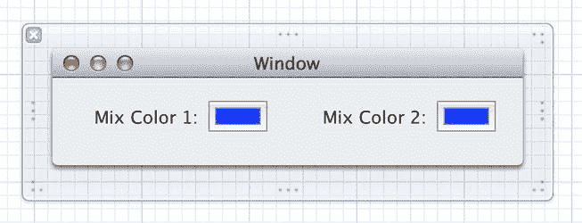

图 12-2 .  用于选择两种颜色的最低限度 GUI

现在选中左侧的颜色选择器，打开**绑定检查器**，配置其 Value 绑定，使其使用 `colorset` 控制器，控制器键为 `selection`，模型键路径为 `color1`。选中右侧的颜色选择器，配置其 Value 绑定，使其也使用 `colorset` 控制器，控制器键为 `selection`，但这次模型键路径为 `color2`。保存工作，然后点击**运行**按钮。应用启动了，一个新且空白的“Untitled”文档窗口出现了，但颜色选择器竟然不可点击！我们急于让某些内容显示在屏幕上，却忽略了创建一个非常重要的东西：一个模型对象！

## 创建默认的 ColorSet

我们需要做的是编写一些代码，使得每当创建新文档时，都能向对象控制器中插入一个新的 `ColorSet` 对象。

我们将在 `CMDocument` 类中实现此功能，通过添加一些方法来访问我们添加到 nib 文件中的对象控制器，并跟踪文档是从头创建还是从文件加载的。选择将要添加这些新代码的 `CMDocument.m` 文件。首先，我们要添加一个属性，一个名为 `objectController` 的出口，用于指向我们一两页前放入 nib 文件中的 `NSObjectController`。我们不将其添加到头文件中，而是可以使用 *类扩展* 在 `.m` 文件中声明此属性。类扩展看起来就像类目声明，但括号内没有类目名称。在 `@implementation` 块之前添加以下代码：

``` 
@interface CMDocument () 
@property (weak) IBOutlet NSObjectController *objectController; 
@end 
```

任何我们可以在类的 `@interface` 块中声明的内容（实例变量、属性、方法等），都可以改为在类扩展中声明。这样做的好处是保持类接口的整洁。我们可以选择只公开其他类真正需要的部分，而将剩余部分作为仅在类内部使用的私有 API。

我们还将添加一个实例变量，一个名为 `isNew` 的 `BOOL` 类型变量，用来跟踪每个文档是刚刚创建的，还是从文件加载的。遵循刚才使用类扩展时信息隐藏的思路，我们将揭示另一个巧妙的技巧：实例变量可以在类的 `@implementation` 块中声明，而不是在头文件的 `@interface` 中。通过添加下面加粗的代码来实现这一点：

``` 
@implementation CMDocument { 
    BOOL isNew; 
} 
```

现在，快速浏览这个 `.m` 文件的其余部分。该文件包含一些现成的方法，并附有注释说明我们可以在哪里扩展它们的行为。我们将在 `init` 和 `windowControllerDidLoadNib:` 方法中实现一些功能，同时还将实现 `initWithType:error:` 方法，稍后我们会解释这个方法。这里预定义的方法都来自 `NSDocument`，它为我们处理了大部分与文档相关的功能。然而，`CMDocument` 的直接父类是 `NSPersistentDocument`，它实现了额外的功能，用于将文档存储为 Core Data 存储后端。首先，添加这个方法：

``` 
- (id)initWithType:(NSString *)typeName error:(NSError **)outError { 
  if (self = [super initWithType:typeName error:outError]) { 
    isNew = YES; 
  } 
  return self; 
} 

- (NSString *)windowNibName { 
    return @"CMDocument"; 
} 
```

然后，将下面加粗的行添加到 `windowControllerDidLoadNib:` 方法中：

``` 
- (void)windowControllerDidLoadNib:(NSWindowController *)windowController { 
    [super windowControllerDidLoadNib:windowController]; 
    // 在此处添加任何需要在 windowController 加载了文档窗口之后执行的代码。
    if (isNew) { 
        id newObj = [_objectController newObject]; 
        [newObj setValue:[NSColor redColor] forKey:@"color1"]; 
        [newObj setValue:[NSColor yellowColor] forKey:@"color2"]; 
        [_objectController addObject:newObj]; 
    } 
} 
```

这些加粗的代码片段在创建新文档时执行。第一个方法 `initWithType:error:` 仅当从头开始创建新文档时才会被调用。这是理想情况下我们想要初始化模型对象的地方，但所有对模型对象的访问都通过 `NSObjectController` 来中介，而这个控制器在 nib 文件中，此时 nib 文件尚未加载。因此，我们只需将 `isNew` 标志设置为 `YES`，然后继续。稍后，在 `CMDocument` 的 nib 文件加载完成后，会调用 `windowControllerDidLoadNib:` 方法。在这里，我们使用 `objectController` 创建一个新的模型对象，为其两个属性设置值，然后将这个新对象添加到控制器中。


至此，剩下的工作就是将 *CMDocument.xib* 中 `CMDocument` 的 `objectController` 输出口连接起来。回到那里，按住 Ctrl 键从 *File*’*s Owner* 拖拽到颜色集对象控制器，然后选择 `objectController` 输出口。保存工作，接着点击**运行**按钮。两个颜色井中的红色和黄色应该可见，点击其中一个会弹出颜色面板，让我们可以更改颜色。不仅如此，现在通过菜单可以完整使用文档功能。我们能够保存文档、关闭文档、访问最近使用的文档、打开文档等等。

## 确定文件格式

做到这一步，你可能已经注意到，保存文档时，会有一个弹出列表让你选择将文件保存为*二进制*、*SQLite* 或 *XML* 格式，文件扩展名也会相应设置。虽然这种灵活性在开发期间可能有点用，但对于一个发布的成品应用，最好只选择一种格式并坚持使用，以免让用户感到困惑。总的来说，对于大多数应用，SQLite 可能是最佳选择。你还应该将文件扩展名改为能体现应用用途的名称，而不是使用默认扩展名。所有这些选项都在 Xcode 的 Target 设置中配置。回到 Xcode，在导航窗格中选择最顶层的 `ColorMix` 组，点击 `ColorMix` target，然后点击视图顶部的 Info 选项卡查看 target 设置。展开 *Document Types* 组，会看到一个视图，其中包含所有三个预配置的文件格式。删除*二进制*和 *XML* 选项（使用每个版块右上角的“x”按钮），只保留 *SQLite* 选项。通过编辑 *Extensions* 列中显示的值，将此保留格式的文件扩展名改为 `ColorMix`。现在保存工作，构建并运行，然后保存一个颜色集，验证我们已无法选择保存为哪种文件格式。

## 添加色彩

现在文档功能都正常工作了，但我们拥有的是一个非常无聊的应用，完全没有任何有趣的功能。让我们让应用完成本章开头承诺的功能：使用所有 Core Graphics 预定义的混合模式，显示由两种选定颜色混合而成的一系列颜色。

为此，我们将创建一个名为 `CMColorBlendView` 的新类，它直接继承自 `NSView`。在 `NSView` 子类中通常会做的主要事情之一就是重写 `drawRect:` 方法，以精确指定要绘制的内容。我们正是要这样做，并用混合后的颜色填充每个视图。为了进行混合，每个 `CMColorBlendView` 实例需要知道使用哪种混合模式以及要混合哪两种颜色。我们将手动为每个 `CMColorBlendView` 设置混合模式，但两种颜色的值将通过 Cocoa Bindings 填充，这样一旦用户更改了选定的颜色之一，窗口中所有的 `CMColorBlendView` 对象都会立即重绘。

## `CMColorBlendView` 类

首先在项目中创建一个新类。在 *New File* 助手中，从 OS X - *Cocoa* 部分选择 *Objective-C class*，然后点击 Next。将新类命名为 `CMColorBlendView.m`，并使其成为 `NSView` 的子类。

现在编辑 `CMColorBlendView.h`，添加下面代码中加粗的行：

```objective-c
#import <Cocoa/Cocoa.h>

@interface CMColorBlendView : NSView

@property (strong, nonatomic) NSColor *color1;
@property (strong, nonatomic) NSColor *color2;
@property (assign, nonatomic) CGBlendMode blendMode;

@end
```

这为我们的类提供了两个 `NSColor` 对象（将由 Cocoa Bindings 填充），以及一个 `CGBlendMode`（将在 `MyController` 类加载 nib 文件时设置）。

我们为所有这些属性使用了 `nonatomic` 关键字，这是一种声明方式，表明这些属性的 getter 和 setter 不会采取额外的线程安全预防措施。由于我们知道这个简单应用中的所有代码都仅在主线程上使用，因此使用 `nonatomic` 足够安全，并且性能略好。

现在切换到 `CMColorBlendView.m`，我们要做的第一件事是为已声明的属性定义方法。本书之前声明的大多数属性都是通过显式的 `@synthesize` 行来创建方法的，但这里情况有点特殊，因为我们希望视图在每次属性值发生变化时都重绘。所以我们将为每个属性提供显式的 setter 方法。如果存在显式方法，它们总是会取代任何合成的方法。实际上，这也引出了我们在属性声明中使用 `nonatomic` 的另一个原因：如果没有它，编译器不太允许我们将合成的 getter 与显式的 setter 混合使用，因此会产生警告。

在完成所有这些新工作的同时，我们将介绍 LLVM 编译器中的一项新功能。任何时候我们在接口中声明一个属性，实际上可以完全省略 `@synthesize` 行！如果这样做，编译器仍然会为我们创建一个实例变量，其名称将是属性名前加下划线。我们可以在下面的代码中看到这一点，这些代码应添加到类的 `@implementation` 部分：

```objective-c
// 将这些放在 @implementation 块的开头
- (void)setBlendMode:(CGBlendMode)bm {
    if (_blendMode != bm) {
        _blendMode = bm;
        [self setNeedsDisplay:YES];
    }
}
- (void)setColor1:(NSColor *)c {
    if (![c isEqual:_color1]) {
        _color1 = c;
        [self setNeedsDisplay:YES];
    }
}
- (void)setColor2:(NSColor *)c {
    if (![c isEqual:_color2]) {
        _color2 = c;
        [self setNeedsDisplay:YES];
    }
}
```

有一点需要注意：`[self setNeedsDisplay:YES]` 调用。我们将在后续涉及 Cocoa 绘图的章节中更详细地讨论这一点，但基本思想是：当我们要在 `NSView` 中绘制某些内容时，调用此方法，它会设置一个标记，当我们的应用处理完当前正在处理的任何事件后，它会遍历打开的窗口，检查是否有窗口被标记为需要重绘，这最终会导致调用 `drawRect:` 方法。

说到这个，我们在这个类中需要实现的另一个方法就是 `drawRect:` 方法本身。

```objective-c
- (void)drawRect:(NSRect)dirtyRect {
  // 如果没有两个有效的颜色，则不绘制任何内容。
  if (!self.color1 || !self.color2) return;

  CGColorRef cgColor1 = genericRGBWithNSColor(self.color1);
  CGColorRef cgColor2 = genericRGBWithNSColor(self.color2);

  CGContextRef myContext = [[NSGraphicsContext currentContext] graphicsPort];
  CGContextSaveGState(myContext);

  CGContextSetFillColorWithColor(myContext, cgColor1);
  CGContextSetBlendMode(myContext, kCGBlendModeNormal);
  CGContextFillRect(myContext, NSRectToCGRect(dirtyRect));

  CGContextSetFillColorWithColor(myContext, cgColor2);
  CGContextSetBlendMode(myContext, self.blendMode);
  CGContextFillRect(myContext, NSRectToCGRect(dirtyRect));

  CGContextRestoreGState(myContext);

  CGColorRelease(cgColor1);
  CGColorRelease(cgColor2);
}
```

不要过于纠结这里的细节。只要阅读注释并相信代码正在执行注释所说的事情就足够了。在学习了后面一些涉及图形的章节后，这会变得更有意义。现在要注意的是，在我们完成下一步之前，这段代码会产生一些编译器错误。


为了这个类能够正常工作，最后需要添加一个转换例程，以便用户从颜色面板中选择的`NSColor`可以转换为 Core Graphics 函数所需的`CGColorRef`。由于某些原因，Cocoa 并未提供任何一行就能完成此转换的函数或方法调用，但以下函数可以很好地完成这项工作。将此函数插入到`.m`文件的顶部附近，位于`drawRect:`方法之上即可。不过为了保持结构清晰，我们建议将其放在`@implementation`块的正上方，以明确该函数并非类的一部分。

``` static CGColorRef genericRGBWithNSColor (NSColor *color) {  
    CGColorRef cgColor = NULL;    
    NSColorSpace *nsColorSpace = [NSColorSpace genericRGBColorSpace];  
    NSColor *deviceRGBColor = [color colorUsingColorSpace: nsColorSpace];  
    if (deviceRGBColor != nil) {  
        CGFloat components[4];  
        [deviceRGBColor getRed: &components[0] green: &components[1]  
                          blue: &components[2] alpha: &components[3]];  
        cgColor = CGColorCreate([nsColorSpace CGColorSpace], components);  
    }    
    return cgColor;  
} ```

至此，`CMColorBlendView`类就完成了。保存工作并点击`Build`，它应能顺利编译。我们要求你现在点击`Build`只是为了确保到目前为止没有输入错误；我们尚未设置 GUI，因此现在点击`Build & Run`没有意义。

## 向 GUI 中添加混合色

现在是为文档窗口添加混合色样块的时候了。首先，在`CMDocument.h`文件中为每个样块添加一个`outlet`。此处显示的每个新`outlet`最终都将连接到`CMColorBlendView`的一个实例。我们还在顶部附近添加了一行`@class`声明，它告诉编译器下一个标记（`CMColorBlendView`）是一个类的名称。这足以让编译器处理指向该类实例的实例变量和方法参数，而无需导入该类的头文件。在头文件中始终使用这些前向声明而不是`#import`，可以略微缩短编译时间，并使头文件更稳健，因为它们之间的依赖关系更少。然而，在实现文件中，当我们调用这些类的方法时，则需要导入头文件。

``` #import <Cocoa/Cocoa.h>  
@class CMColorBlendView;  

@interface CMDocument : NSPersistentDocument  

@property (weak) IBOutlet CMColorBlendView *multiplyBlendView;  
@property (weak) IBOutlet CMColorBlendView *screenBlendView;  
@property (weak) IBOutlet CMColorBlendView *overlayBlendView;  
@property (weak) IBOutlet CMColorBlendView *darkenBlendView;  
@property (weak) IBOutlet CMColorBlendView *lightenBlendView;  
@property (weak) IBOutlet CMColorBlendView *colorDodgeBlendView;  
@property (weak) IBOutlet CMColorBlendView *colorBurnBlendView;  
@property (weak) IBOutlet CMColorBlendView *softLightBlendView;  
@property (weak) IBOutlet CMColorBlendView *hardLightBlendView;  
@property (weak) IBOutlet CMColorBlendView *differenceBlendView;  
@property (weak) IBOutlet CMColorBlendView *exclusionBlendView;  
@property (weak) IBOutlet CMColorBlendView *hueBlendView;  
@property (weak) IBOutlet CMColorBlendView *saturationBlendView;  
@property (weak) IBOutlet CMColorBlendView *colorBlendView;  
@property (weak) IBOutlet CMColorBlendView *luminosityBlendView;  

@end ```

现在返回`CMDocument.xib`，将窗口放大至约 350×500，并在顶部保留两个颜色选择器。从对象库中找到`Custom View`（实际上是普通的`NSView`实例），将其拖入窗口，并使用`Identity Inspector`将其类更改为`CMColorBlendView`。然后使用`Size Inspector`将`CMColorBlendView`的大小调整为约 90×50。

为了区分该视图所代表的混合模式，从对象库中拖一个标签到窗口，放在`CMColorBlendView`下方。使用控制手柄使标签与其上方的视图等宽，并使用`Attributes Inspector`将标签文本居中（见图 12-3）。

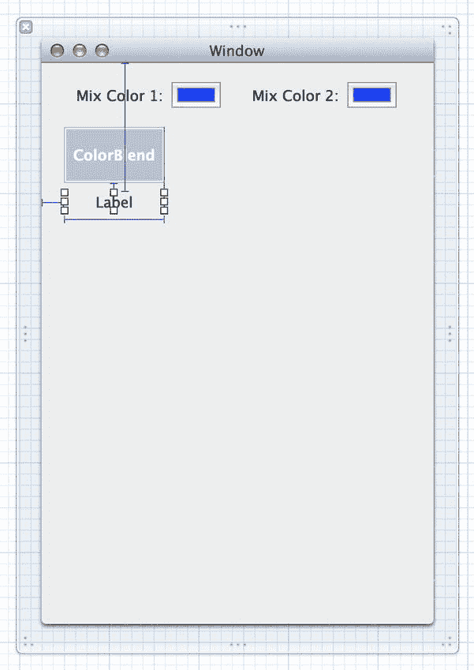

图 12-3 . 放置第一个`CMColorBlendView`

同时选中`CMColorBlendView`和标签，按D 进行复制，并将新复制的视图稍微向右对齐。再次按D，并将新的一组继续向右对齐。现在选中全部三个`ColorBlendView`和全部三个标签，按D，并将新复制的一组放在旧的一组下方。重复此操作，直到有五排标签，每排三个。然后遍历所有标签，设置其标题，如图 12-4 所示。

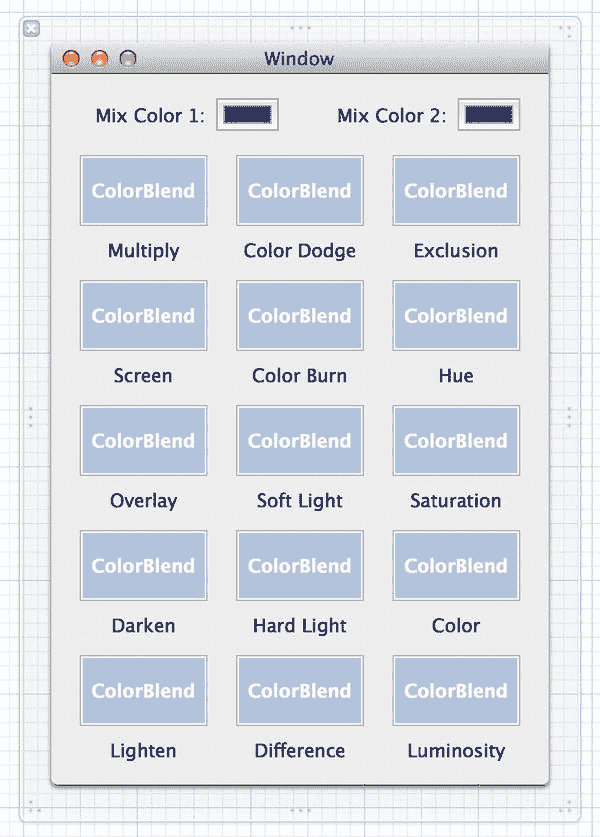

图 12-4 . 即将混合颜色的网格

布局完成后，需要进行大量的连接。最简单的方法是调出`Connections Inspector`，然后选择`File’s Owner`对象（它是文档类的代理）。这样做会在检查器中显示文档的所有`outlet`。只需将每个`outlet`的圆点拖到我们在窗口中创建的对应`CMColorBlendView`上，并以标签名称作为指引，如图 12-5 所示。


图 12-5 . 大约完成了一半的连接。事情终于开始变得明朗！

然后返回`CMDocument.m`。我们将添加代码来为每个`CMColorBlendView`配置正确的混合模式，并手动配置绑定，以便当用户选择颜色时，每个`CMColorBlendView`都能得到更新。首先，导入`CMColorBlendView`类的头文件，以便调用其方法。在`CMDocument.m`顶部附近添加以下行：

``` #import "CMColorBlendView.h" ```

接下来，修改`windowControllerDidLoadNib:`方法，如下所示：

``` - (void)windowControllerDidLoadNib:(NSWindowController *)windowController {  
    [super windowControllerDidLoadNib:windowController];  
    if (isNew) {  
        id newObj = [_objectController newObject];  
        [newObj setValue:[NSColor redColor] forKey:@"color1"];  
        [newObj setValue:[NSColor yellowColor] forKey:@"color2"];  
        [_objectController addObject:newObj];  
    }    
    _multiplyBlendView.blendMode = kCGBlendModeMultiply;  
    _screenBlendView.blendMode = kCGBlendModeScreen;  
    _overlayBlendView.blendMode = kCGBlendModeOverlay;  
    _darkenBlendView.blendMode = kCGBlendModeDarken;  
    _lightenBlendView.blendMode = kCGBlendModeLighten;  
    _colorDodgeBlendView.blendMode = kCGBlendModeColorDodge;  
    _colorBurnBlendView.blendMode = kCGBlendModeColorBurn;  
    _softLightBlendView.blendMode = kCGBlendModeSoftLight;  
    _hardLightBlendView.blendMode = kCGBlendModeHardLight;  
    _differenceBlendView.blendMode = kCGBlendModeDifference;  
    _exclusionBlendView.blendMode = kCGBlendModeExclusion;  
    _hueBlendView.blendMode = kCGBlendModeHue;  
    _saturationBlendView.blendMode = kCGBlendModeSaturation;  
    _colorBlendView.blendMode = kCGBlendModeColor;  
    _luminosityBlendView.```


`blendMode = kCGBlendModeLuminosity;`  
`NSArray *allBlendViews = @[_multiplyBlendView, _screenBlendView, _overlayBlendView, _darkenBlendView, _lightenBlendView, _colorDodgeBlendView, _colorBurnBlendView, _softLightBlendView, _hardLightBlendView, _differenceBlendView, _exclusionBlendView, _hueBlendView, _saturationBlendView, _colorBlendView, _luminosityBlendView];`  

```
for (CMColorBlendView *cbv in allBlendViews) {  
    [cbv bind:@"color1"  
     toObject:_objectController  
   withKeyPath:@"selection.color1"  
       options:nil];  
      
    [cbv bind:@"color2"  
     toObject:_objectController  
   withKeyPath:@"selection.color2"  
       options:nil];  
}
```

这段代码的第一部分为每个视图逐一设置了混合模式。第二部分为每个 `CMColorBlendView` 配置了绑定。由于所有视图的绑定都相同，我们遍历一个包含所有 `ColorBlendView` 的数组（该数组在 `for` 循环之前即时创建），并为每个视图执行绑定。

这是我们第一次要求您在代码中进行大量的 GUI 配置。使用 Cocoa 内建的对象，您可以直接在 Interface Builder 中配置许多内容，但对于自定义类来说，这并不总是那么简单。

请注意，调用 `bind:toObject:withKeyPath:` 实现了与在 Interface Builder 中配置绑定相同的效果。事实上，您在 Interface Builder 中配置的每个绑定更像是一个动词而非名词。当您的应用程序加载包含绑定的 nib 文件时，每个已保存的绑定都会触发一个您在此处看到的调用。还需要注意，Interface Builder 中表示为 *Controller Key* 和 *Model Key Path* 的内容，最终会合并为一个字符串，用于 `bind:toObject:withKeyPath:` 调用。

好了，理论部分到此为止。现在保存工作，点击运行，您应该会看到类似图 12-6 的效果。


图 12-6。最终，我们看到了混合后的颜色。如果您阅读的是本书的黑白印刷版，那么请想象这里有一组炫丽多彩的颜色阵列。

点击其中一个颜色块打开颜色面板，并开始拖动里面的滑块，您会发现所有 15 种混合颜色都会随着您设置的颜色同步更新。非常棒！

现在应用程序已经运行起来，我们可以使用标准菜单项来创建多个文档、为每个文档指定不同的颜色、保存文档、关闭文档、管理其窗口等等。Cocoa 的文档架构负责处理实例化文档和文档控制器、加载 nib 文件、使用保存面板等细节。所有这些功能都可以由开发者增强（例如，我们可以通过各种方式自定义文档保存的过程），但仅使用基本功能也能让我们走得很远，这些功能开箱即用。

## 关于撤销与重做

现在，我们应该提一下 `NSUndoManager`，它负责处理 Cocoa 中的撤销/重做支持。请注意，我们在 ColorMix 中执行的操作（实际上只是更改颜色）都可以通过“编辑”菜单中的项目进行撤销和重做。另外，请注意这些撤销和重做操作是文档相关的；在一个文档中进行的更改和撤销与其他文档中发生的任何事情完全独立。然而，可能不太清楚的是，究竟是什么启用了这种功能；我们并没有编写任何处理撤销和重做的代码，但它却神奇地出现了。简单的答案是：在 Core Data 应用程序中，基本的撤销/重做通常由系统为我们处理，我们无需做任何事情。负责管理模型对象的托管对象上下文能够注意到对象何时被编辑，并将反向操作添加到“撤销栈”中。

这样做的好处是，对于大多数现代 Cocoa 应用程序，我们免费获得了撤销和重做功能。

然而，这是一本关于编程的书，而不是关于罗列框架酷炫特性的书。至少，我们需要对底层工作原理有所了解，以便在必要时知道在哪里进行调整。因此，以下是对 Cocoa 中撤销/重做支持如何工作，以及 Core Data 和 `NSDocument` 如何协同使其自动工作的速成教程。

## 撤销栈

许多程序员可能从未深入思考过撤销和重做在应用程序中通常是如何实现的。这已经成为一种被普遍接受和期望的功能，以至于它似乎只是自然秩序的一部分。基本原理如下：每次我们在应用程序中编辑内容时，都需要创建一个代表编辑操作反向操作的项目。因此，如果用户在文本末尾添加了字母“X”，就需要有一段代码创建一个表示相反操作的项目，即一个可以删除那个“X”的操作。然后，该表示被放置到某处类似的项目的栈中（“撤销栈”）。调用“撤销”命令包括从撤销栈顶部弹出最近的项目，并执行它所描述的操作。同时，调用撤销命令最终会创建另一个项目，即来自撤销栈的反向项目的反向操作（实际上与原始编辑相同），并将其放置在“重做栈”上，以备用户后来想要撤销这个撤销操作。

这种架构存在多种变体，例如限制栈大小，或者根本没有栈而是只有单个撤销项目，但基本架构在大多数平台上都非常相似。Cocoa 实现此方式的一个特别之处在于，它不是将每个撤销项目以一种需要稍后以某种方式解码的特殊形式来表示，而是使用目标对象、要对该对象调用的方法选择器以及所需的任何参数，隐式地构造每个撤销项目。当触发撤销命令时，没有任何类型的解码或查找。该方法就像任何其他 Objective-C 方法一样被简单调用。

让我们来看一个例子。假设有以下方法，放在一个具有可设置名称的类中：

```
- (void)setName:(NSString *)newName {
    if (![newName isEqual:name]) {
        name = newName;
    }
}
```

现在假设我们希望设置名称成为一个可撤销的操作。通过添加以下以粗体显示的行，可以轻松实现这一点：

```
- (void)setName:(NSString *)newName {
    if (![newName isEqual:name]) {
        NSUndoManager *undoManager = ...
        [undoManager registerUndoWithTarget:self
                selector:@selector(setName:)
                object:name];
        [undoManager setActionName:@"名称更改"];
        name = newName;
    }
}
```

请注意，我们省略了实际获取撤销管理器的代码部分。在实际应用程序中，撤销管理器可能来自几个不同的地方，具体取决于应用程序是否具有 Core Data 和 `NSDocument` 支持。在 Core Data 应用中，我们可以随时向共享的 `NSManagedObjectContext` 对象请求一个撤销管理器；而在同时支持 Core Data 和文档的应用中，每个文档都有自己的撤销管理器。

这种方式的最终体现出现在 Core Data 应用程序中，它实际上代表我们实现了类似上述的功能。请注意，上面的 `setName:` 方法非常公式化。Core Data 在幕后实现了一些魔法，这样我们就不必实现那个 `setName:` 方法。只要模型对象发生任何编辑，Core Data 就会注意到并为我们设置撤销。

## 总结

我们刚刚从头开始创建了第一个基于 `NSDocument` 的应用程序。我们还学习了一些在 `NSView` 上绘图和处理颜色的知识，这些都是适用于各种应用领域的有用技能。


在后面的章节中，我们会基于这些技能进行更深入的探索，特别是 Cocoa 真正大放异彩的有趣图形编程。然而，在下一章中，我们得暂时放下乐趣，学习当应用中出现问题时会发生什么——以及如何使用 `NSError` 和 `NSException` 来应对这些问题。

## 第 13 章 异常、信号、错误与调试

任何做过编程的人都知道，事情有时并不会按计划进行。你忘记处理某个特定的边缘情况，或者一个系统调用以一种你从未料到的方式失败，然后你的程序就突然崩溃了。每种编程语言和开发环境都有处理这些问题的方法，而 Cocoa 也不例外。

本章将介绍 Cocoa 用于创建和处理异常与错误的机制，这是两个听起来相似但在概念上截然不同的系统。我们将学习它们各自不同的使用方式、如何处理它们，以及如何自己发起它们。我们还将了解某些内存滥用是如何导致信号（Signal）发生的，这通常会导致崩溃。最后，我们会窥探一下 Xcode 内置的调试器，它可以帮助我们解决这些问题。

## 异常处理

让我们从异常处理开始。*异常*（exception）是一种特殊的对象，可以在程序的一部分中创建，以告知另一部分出现了问题；这被称为“抛出”（raising）异常，在代码中看起来可能像这样：

```objc
// 想象我们正在一个方法中，该方法有一个参数 "index"，其值不能为负数。
if (index < 0) {
    [NSException raise:NSRangeException format:
        @"I can't take all this negativity! (index == %d)", index];
}
```

在这个例子中，我们使用 `NSException` 类的一个类方法，一步创建并抛出了一个异常。该方法的第一个参数是一个字符串，用于指定异常的名称（此处为 `NSRangeException`，它是 Cocoa 中预定义的异常名称），这允许对异常进行一般性分类。与许多其他异常处理环境不同，`NSException` 很少被子类化，因此其名称用于区分不同类型的异常。我们传递的第二个参数是异常“原因”（reason）的格式字符串，这是一个人类可读的描述性字符串。这个格式与我们可以传递给 `NSLog` 的参数列表类型相同，其中第一个是 `NSString`，其他参数根据字符串的指定进行插值。

### 捕获异常

当那段代码被执行时，如果 `index < 0`，程序的正常流程就会被中断。程序不会继续执行该方法的其余部分，而是会沿着调用栈向下查找一个称为*异常处理器*（exception handler）的特殊代码构造。异常处理器会执行包含在一对花括号内的所有代码，这些代码以 `@try` 关键字为前缀。如果在执行期间抛出了异常，执行将跳转到由 `@catch` 关键字标记的相邻代码块，并执行其中包含的代码。这被称为*处理异常*。最后，我们可以选择性地包含第三个由 `@finally` 关键字标记的代码块，无论 `@try` 和 `@catch` 部分中发生了什么，该代码块都会被执行，以执行任何必要的清理工作。

下面的示例创建了与之前相同的异常，但现在是在一个 `@try` 块内。我们在 `@catch` 块中捕获它并输出一条错误消息，然后进入 `@finally` 部分，无论发生什么，该部分都会被执行。在这个简单的例子中，我们不需要 `@finally` 部分，可以忽略它，但在某些情况下，例如某个资源在 `@try` 块中被初始化并需要释放时，它会非常有用。

```objc
@try {
    if (index < 0) {
        [NSException raise:NSRangeException format:
            @"I can't take all this negativity! (index == %d)", index];
    }
} @catch (NSException *e) {
    NSLog(@"Encountered exception %@ with reason %@",
        [e name],
        [e reason]);
} @finally {
    // 我们这里实际上没有什么可做的。
}
```

这个示例在同一方法中处理了抛出的异常，但这实际上相当罕见。更常见的情况是，没有找到本地的异常处理器，因此系统会遍历调用栈寻找异常处理器，首先在当前方法的调用者中查找，然后是*那个*方法的调用者，依此类推。这个搜索会沿着调用栈一直进行，直到找到异常处理器为止。如果找不到，可以配置一个特殊场景来处理未捕获的异常。默认情况下，遇到未捕获异常的 Cocoa 应用会将有关异常的一些信息打印到控制台日志，然后尝试照常继续运行。

### Cocoa 中有限的异常角色

在 Cocoa 中，异常用于在发生不应该在程序运行时出现的严重问题时，让方法跳出其正常的操作流程。通常，如果你的代码导致抛出了异常，那就说明你有一个 bug。除极少数例外情况，一个编写得当的 Cocoa 程序应该能够永远运行而不抛出任何一个异常。

如果你有 Java、Ruby、Python 或 C++ 的背景，这可能会显得有些限制。在许多其他环境中，异常的使用更为自由，例如一个文件读取方法抛出异常来告诉调用者它已经读到了文件末尾（仔细想想，这根本就不是什么异常状况，因为每个文件都有末尾）。在 Python 中，遍历数组的一种常见习语是递增索引，尝试从数组中读取索引值，并在读取超出末尾时捕获由此产生的异常。然而，在 Cocoa 中，这种做法是不被提倡的，异常通常仅用于报告可能由程序中的 bug 引起的意外结果。

由于异常在 Cocoa 中的作用相当有限，你通常不会在 Cocoa 应用中看到大量的异常处理代码。与 Java 不同，Objective-C 不要求（甚至不允许）其方法指定它们可能抛出哪些类型的异常，理论上你根本*不必*处理它们。默认情况下，你创建的每个 Cocoa 应用都会有一个顶层的异常处理器，它只是简单地将有关异常的一些信息输出到系统日志，然后让应用尽力继续运行。不幸的是，这算不上什么好策略，因为发生异常时应用正在做的事情很可能是在响应用户的上一个操作（点击按钮、按键等），而该操作在此之后本应执行的其他操作都被直接跳过了，这可能会使应用程序处于未定义或不一致的状态！

有些应用程序会安装自己的特殊顶层异常处理器来处理这些情况。例如，Xcode 偶尔会遇到异常（是的，即使是 Xcode 也有 bug！），这时它通常会为用户提供退出应用的机会，并意识到可能有些事情搞砸了。

## 创建一个测试平台

让我们构建一个小的应用程序，演示 Cocoa 程序员可能遇到的几种常见异常。在 Xcode 中，创建一个新的 Cocoa 应用程序（这次不涉及 Core Data 或文档），命名为 “ExceptionCity”，并指定 “EC” 作为类前缀。我们创建的应用程序将自动包含一个名为 `ECAppDelegate` 的类。

我们的应用委托将是一个非常简单的类，包含 `applicationDidFinishLaunching:` 委托方法，该方法会调用三个不同的“工具”方法，每个方法都演示一个可能导致运行时抛出异常的常见 Cocoa 陷阱。


### 排版后内容

如果所有三个方法都成功完成并返回，我们将看到一个祝贺性的警告面板（这正是我们一直想要的）。然而，每个实用方法都存在一个问题，会引发异常。我们的目标是找到并修复每个问题。以下是`ECAppDelegate.m`文件的完整内容：

```objc
#import "ECAppDelegate.h"

@implementation ECAppDelegate

- (void)invalidArgumentException_unrecognizedSelector {
    // The downside of dynamism is the occasional type mismatch.
    // For instance, it's sometimes hard to be sure what's coming
    // out of an array.  Imagine this array is created somewhere...
    NSArray *nameComponents = @[@"Thurston",
                                @"Howell",
                                [NSNumber numberWithInt:3]];

    // ... and accessed later on, by code that just assumes all the
    // array's items are strings:
    NSInteger nameComponentLength = 0;
    for (NSString *component in nameComponents) {
        nameComponentLength += [component length];
    }
    NSLog(@"Total length of all name components: %ld",
          (long)nameComponentLength);
}

- (void)invalidArgumentException_insertNil {
    // Assuming we have an array to put things into...
    NSMutableArray *array = [NSMutableArray array];

    // ... we can add an object to it.
    id object1 = @"hello";
    [array addObject:object1];

    // But suppose we take a method parameter or instance variable
    // whose value we haven't checked to make sure it wasn't nil...
    id object2 = nil;

    // ... and try to add it to the array?
    [array addObject:object2];
    NSLog(@"inserted all the objects I could!");
}

- (void)rangeException {
    // Assuming we have an array of things...
    NSArray *array = @[@"one", @"two", @"three"];

    // ... we can ask for the index of an item...
    NSUInteger indexOfTwo = [array indexOfObject:@"two"];

    // ... and we can later retrieve that value using the same index.
    NSLog(@"found indexed item %@", array[indexOfTwo]);

    // But, what if we try to find the index for something that's not
    // there?
    NSUInteger indexOfFive = [array indexOfObject:@"five"];

    // And we forget to check the return value to make sure it's not
    // NSNotFound?
    NSLog(@"found indexed item %@", array[indexOfFive]);
}

- (void)applicationDidFinishLaunching:(NSNotification *)aNotification {
    [self invalidArgumentException_unrecognizedSelector];
    [self invalidArgumentException_insertNil];
    [self rangeException];
    NSRunAlertPanel(@"Success", @"Hooray, you fixed everything!",
                    nil, nil, nil);
}

@end
```

运行这段代码。承诺的警告面板不会出现（但默认 nib 文件中包含的空窗口会出现）。然而，会发生的是，类似下面的内容将出现在 Xcode 的调试输出中：

```
2013-02-07 00:25:12.756 ExceptionCity[43532:303] -[__NSCFNumber length]: unrecognized selector sent to instance 0x387
```

如果你回顾一下`invalidArgumentException_unrecognizedSelector`方法及其注释，你大概能看出问题出在哪里：我们的数组包含一个`NSNumber`，它没有`length`方法，因此引发了一个异常。我们没有做任何事情来显式处理异常，它最终沿着调用栈一直往下，没有得到处理，这导致了之前提到的默认行为：关于异常的一些信息（具体是它的`reason`）被记录，应用程序跳过当前事件的剩余部分。在此例中，正在处理的事件是应用程序启动，此时启动已经完成。

如果我们没有为你指出那个方法，情况就不会那么清楚。

记录的异常信息没有告诉我们异常来自哪里、异常的名称，或者其他任何可能帮助我们找到触发异常的代码部分的信息。这时，我们的新朋友——Xcode 调试器——就派上用场了。调试器允许我们在所有异常上设置断点，这样我们就可以在异常被抛出的那一刻暂停程序并尝试定位问题。

### 调试器

大多数开发者可能都熟悉调试器的概念，它允许你在应用程序运行时检查其状态，以便诊断问题。如果你之前没有接触过调试器，这里快速介绍一些关键概念：

- **断点** (*breakpoint*) 允许你指定程序应暂停的位置，可以是源代码中的行号，也可以是方法或函数的名称。你当前设置的所有断点都会显示在项目窗口左侧的“断点导航器”（Breakpoint Navigator）中。当程序在断点处停止时，你可以检查程序执行到该位置时的所有 CPU 寄存器。如果你有程序的源代码，你还可以访问在该位置相关的任何变量（局部变量、实例变量或其他）。所有 CPU 寄存器和可用变量都显示在项目窗口底部 Xcode 调试区（Debug Area）的表格视图中。
- **调用栈** (*call stack*) 是任何时刻正在运行的所有嵌套方法和函数的列表。它显示在项目窗口左侧 Xcode 调试导航器（Debug Navigator）的表格视图中。当程序暂停时，当前方法或函数位于调用栈的顶部，调用它的方法或函数位于其下方，以此类推。你可以选择调用栈中的特定条目或“帧”来切换焦点，此时调试区将显示当该方法或函数调用调用栈中其上方的函数时的 CPU 寄存器和变量。
- 调试器包含一些按钮，允许你对当前高亮的代码行执行某些操作。你可以**单步跳过**当前行（执行当前行剩余部分，然后在下一行暂停）、**单步进入**下一个方法或函数（将在被调用的下一个方法或函数的开头暂停）、**单步跳出**当前方法或函数（在调用者中返回后暂停），或者**继续**或**停止**程序。
- 调试器包含一个名为`lldb`的命令行界面（它是`gdb`命令的现代分支/重写版，`gdb`历史上是大多数基于 UNIX 的操作系统的标准命令），它允许你使用之前提到的所有功能，以及执行任意代码并检查结果。你可以通过像在源代码中那样输入 C 函数和 Objective-C 方法的名称来调用它们，并使用正在运行的程序的变量值作为消息接收者和参数。

有关使用 Xcode 调试器的更多详细信息，请参阅 Xcode 文档中包含的“调试和优化你的应用”文档。

在 Xcode 中，通过选择 **View**  **Navigators**  **Show Breakpoint Navigator** 或按下 **6** 来打开断点导航器视图。这会使得导航面板显示所有当前的断点（参见图 13-1）。

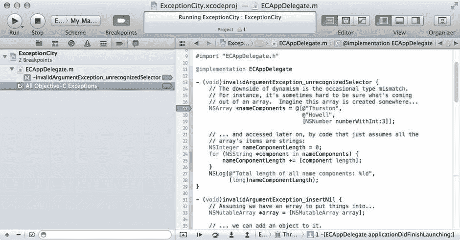

图 13-1 .  Xcode 的断点导航器，显示了一些断点。第一次使用时，左侧会有一个空列表

断点导航器显示了 Xcode 当前为我们的项目配置的所有断点。由于我们刚刚创建了一个全新的项目，这个列表应该是空的！我们将通过添加一个异常断点来捕获应用程序中抛出的任何异常，从而改变这一状况。


请记住，每一次引发的异常都是某个 bug 的结果，很可能就是我们自己的 bug，并且我们想要抓住每一个机会停下来，看看它来自哪里。  
点击断点导航器（Breakpoint Navigator）最左下角的 `+` 符号来创建一个新的断点。会弹出一个小菜单，询问要创建哪种类型的断点。选择“添加异常断点”（Add Exception Breakpoint），然后会弹出一个更大的视图，其中包含新断点的选项。将异常（Exception）弹出菜单设置为 `Objective-C`，并确保中断（Break）弹出菜单设置为抛出时（On Throw），然后点击完成（Done）。  

现在，我们有了一个断点，它会在任何抛出的 Objective-C 异常处停止 Xcode。完美！通过从菜单中选择 **Product**  **Run** 重新启动 `ExceptionCity` 应用程序，如果它还在运行，先将其退出。这次，当应用程序遇到有问题的代码时，它会在异常抛出的地方暂停执行。图 13-2 大致展示了此时 Xcode 的样子。  

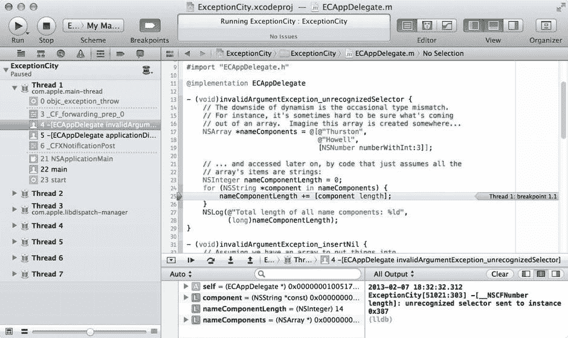  

图 13-2.  Xcode 在断点处停止  

左侧的导航面板切换为调试导航器（Debug Navigator），并显示调用堆栈，顶部是我们断点的位置（一个名为 `objc_exception_throw` 的函数，这是 Xcode 实际放置异常断点的地方），下方是所有调用者。注意，我们有源代码可用的帧以黑色文本呈现，而那些停留在闭源库中的帧则以灰色文本显示。灰色的帧仍然可以访问，但只能以汇编语言的形式。我们还可以通过查看左侧的帧编号序列发现，并非所有帧都显示出来。默认情况下，Xcode 仅显示我们有源代码的帧，而其他帧被压缩成水平虚线。我们可以使用调试导航器底部的水平滑块来改变这一点，根据需要让 Xcode 显示更多或更少的帧。  

项目窗口底部是调试区（Debug Area），分为两部分。左侧显示所有可用的变量和寄存器值，我们可以立即看到一些简单的值。右侧显示 `lldb` 控制台界面，我们可以在那里查看程序的输出（由 `NSLog` 等生成），并在 `lldb` 提示符下输入命令。如果你看不到底部视图，可以通过从菜单中选择 **View**  **Debug Area**  **Activate Console** 来使其显示。  

主编辑器视图显示所选堆栈帧的源代码或编译后的汇编代码，并用一个箭头和高亮标出其停止的行。  

此时，在异常被抛出的那一刻暂停下来，看看这个异常是什么会很有趣。但怎么做呢？当 Xcode 暂停时，它会指向包含我们源代码的最顶层堆栈帧。那是我们程序中问题所在的位置，但我们无法在那里“看到”异常。也就是说，从那里我们无法通过局部变量或任何全局可用的结构来查看异常本身。  

相反，我们需要关注程序真正停止的最顶层堆栈帧，即 `objc_exception_throw` 函数。点击它来看看情况。它应该看起来像图 13-3。  

  

图 13-3.  源代码？谁需要它！  

我们看到的只是一堆汇编代码，没有任何变量名或其他东西来指引我们。幸运的是，有一种调用约定我们可以利用。  

在针对 Mac OS X（在 64 位 Intel 硬件上）编译的代码中，任何函数的返回值都临时存储在一个名为 `rax` 的 CPU 寄存器中，在 `lldb` 中可以通过一个名为 `$rax` 的特殊变量访问。当我们的程序在 `objc_exception_throw` 函数中暂停时，`$rax` 寄存器恰好包含了新的异常，所以我们都准备好了！`lldb` 调试器包含 `po` 命令，用于以可读格式打印对象的值（它实际做的是调用该对象的 `description` 方法，该方法返回一个 `NSString`，然后打印该字符串值）。在 `lldb` 提示符下试试这个：  

```  
(lldb) po $rax  
$1 = 4296302928 -[__NSCFNumber length]: unrecognized selector sent to instance 0x387  
```  

看起来眼熟吗？这基本上就是我们在之前输出中看到的相同文本。知道我们在这里可以访问到 `NSException` 后，我们可以利用 `lldb` 的实时 Objective-C 方法执行来询问更多信息：  

```  
(lldb) po [$rax name]  
$2 = 0x00007fff783e0a30 NSInvalidArgumentException  
(lldb) po [$rax reason]  
$3 = 0x0000000100136650 -[__NSCFNumber length]: unrecognized selector sent to instance 0x387  
```  

这里我们看到 `reason` 方法的返回值与 `description` 的返回值相同，但 `name` 方法返回了名称，你可能记得它通常被用作异常的类型或类别。在这个例子中，我们正在查看 Cocoa 中最常遇到的异常类型之一：`NSInvalidArgumentException`。  

`NSInvalidArgumentException`  

理论上，任何判断其参数在某些方面无效的方法都可能引发此异常。实际上，大多数 Cocoa 开发者在某个时候会遇到两种典型情况，而我们刚刚遇到了第一种。回想一下，我们的代码遍历数组中的所有元素，并尝试对每个元素调用 `length` 方法，如下所示：  

```  
for (NSString *component in nameComponents) {  
    nameComponentLength += [component length];  
}  
```  

在这种情况下，问题出现在尝试对一个没有 `length` 方法的对象调用 `length` 时。我们的代码尝试对 `NSCFNumber`（`NSNumber` 的一个具体子类，当我们以通常方式创建 `NSNumber` 时会用到它）调用 `length` 方法，而该类没有实现该方法，所有这些我们都可以从异常的 `reason` 中合理推断出来。我们可以现在吹毛求疵地抱怨苹果确实应该在这里使用一个不同的异常名称，以便清楚地告诉我们异常与某个方法名称有关，但这似乎是我们目前只能接受的现实。  

无论如何，我们可以通过使用 Xcode 中的图形调试器进一步探索。在显示调用堆栈的表格中，点击标记为“*-[ECAppDelegate invalidArgumentException_unrecognizedSelector]*”的行，切换回异常抛出之前执行的最后一段代码。编辑器面板切换回相关的源代码文件，变量视图现在显示了在程序该点上我们可以访问的变量（参见图 13-4）。  

  

图 13-4.  在调用堆栈中选择不同的条目，可以让我们访问正在运行程序的不同部分。注意，底部的命令行界面显示了在调用堆栈顶层（`objc_exception_throw` 内部）执行的命令。如果我们在当前堆栈帧聚焦时输入相同的命令，`$rax` 将有不同的值  

根据我们获得的关于异常以及触发异常的代码部分的信息，我们应该能够找出问题所在。我们甚至可以通过输入 `po component` 来打印 `for` 循环当前正在查看的对象的摘要信息，从而进一步检查程序的当前状态。


我们还可以利用左下角的变量视图来查看当前可用的变量。例如，点击 `nameComponents` 变量旁的展开三角形，查看其内容。在本例中，结构非常简单：我们的数组包含一个 `NSNumber`，而它没有 `length` 方法。

此时，我们需要决定如何修复这个问题。我们仍希望实现同一个基本算法：累加每个组件中字符串的长度；我们只需确保将 `NSNumber` 的值（此处为 `3`）转换为字符串（`@"3"`）。这时可以使用 `description` 方法，该方法定义在 `NSObject` 上，因此所有 Cocoa 对象都可使用。顺便提一下，当你使用 `po` 命令查看对象值时，lldb 调用的正是 `description` 方法。对于大多数类，调用 `description` 会得到由 `NSObject` 实现定义的结果（通常类似 `<NameOfObjectClass: 0x10cdb0>`），但某些类（如 `NSString` 和 `NSNumber`）会重写该方法以返回其他内容。`NSString` 的实现直接返回自身，而 `NSNumber` 的实现则将数值转换为 `NSString` 并返回。

因此，为了让程序正常工作，请修改 `invalidArgumentException_unrecognizedSelector` 方法，将 `for` 循环内的那一行改为以下内容：

```
nameComponentLength += [[component description] length];
```

由于我们知道 `NSObject`（以及所有对象）都实现了 `description` 方法并返回一个字符串，因此这个调用现在总能成功。即使有人混入了其他类型的对象，无法像 `NSString` 和 `NSNumber` 那样返回简洁紧凑的结果，至少我们知道这个方法是存在的，并且会被调用！

完成修改后，重新运行应用，查看 Xcode 输出控制台显示的内容。

```
2013-02-10 23:51:08.291 ExceptionCity[71675:303] Total length of all name components: 15
(lldb)
```

哎呀，又出错了！我们的应用执行了一些代码，触发了另一个异常。由于我们已经设置了异常断点，程序就此暂停，并返回到 lldb 提示符。和之前一样，在调试导航器中选择顶层栈帧（`objc_exception_throw`），然后再次在 lldb 提示符下输入一些命令，获取异常的相关信息：

```
(lldb) po $rax
$0 = 4327021824 *** -[__NSArrayM insertObject:atIndex:]: object cannot be nil
(lldb) po [$rax name]
$1 = 0x00007fff783e0a30 NSInvalidArgumentException
```

如果我们沿着调用栈向下查看，寻找第一个显示为黑色而非灰色的位置，会发现 `-[ECAppDelegate invalidArgumentException_insertNil]`，这正是触发异常的那段代码所在位置。点击该行，代码编辑器窗口会高亮显示 `invalidArgumentException_insertNil` 中的这一行：

```
[array addObject:object2];
```

查看该行上方的代码，问题出现了：`object2` 是一个指向 `nil` 的指针，而 `NSMutableArray` 不允许我们向其中插入 `nil`。在复杂的应用中，你可能需要追踪根本原因（空指针从何而来？`nil` 对该变量而言是否是有效值？），但在本例中，我们只需在添加对象前添加一项安全检查即可解决该问题，如下所示：

```
if (object2 != nil) {
    [array addObject:object2];
}
```

这样就解决了问题。`NSInvalidArgumentException` 是 Cocoa 中最常遇到的异常之一，而刚才我们见到的正是触发它的两种最常见情况：对未实现该方法的类调用方法，以及试图向数组中插入 `nil`。

再次运行应用，准备迎接下一个问题。

### NSRangeException

之前的异常已经解决，但看看现在发生了什么：

```
2009-09-16 23:44:33.038 ExceptionCity[8881:10b] Total length of all name components: 15
2009-09-16 23:44:33.065 ExceptionCity[8881:10b] inserted all the objects I could!
2009-09-16 23:44:33.066 ExceptionCity[8881:10b] found indexed item two
2009-09-16 23:44:33.066 ExceptionCity[8881:10b] *** -[NSCFArray objectAtIndex:]: index (2137483647( or possibly larger)) beyond bounds (3)
2013-02-10 23:57:55.575 ExceptionCity[71731:303] Total length of all name components: 15
2013-02-10 23:57:55.576 ExceptionCity[71731:303] inserted all the objects I could!
2013-02-10 23:57:55.576 ExceptionCity[71731:303] found indexed item two
(lldb)
```

由于又一个异常，程序再次暂停。和之前一样，在调试导航器中点击 `objc_exception_throw` 行，检查异常以找出问题。

```
(lldb) po $rax
$0 = 4300330528 *** -[__NSArrayI objectAtIndex:]: index 9223372036854775807 beyond bounds [0 .. 2]
(lldb) po [$rax name]
$1 = 0x00007fff783e0a10 NSRangeException
```

天哪！这个索引值可真大。现在查看调用栈，点击我们代码中最高层的项目：`-[ECAppDelegate rangeException]`。这将高亮显示文本编辑器中的以下行：

```
NSLog(@"found indexed item %@", array[indexOfFive]);
```

这一行实际上调用了两个方法：首先是 `objectAtIndex:` 方法（内含于 Apple 从 Xcode 4.5 开始引入的新 Objective-C 数组访问器语法中），然后调用 `NSLog` 函数。快速查看调用栈可以发现，`objectAtIndex:` 方法正在报错。显然，它不喜欢 `indexOfFive` 中包含的值。如果我们在变量视图中查看，或者输入 `p indexOfFive`（注意对标准 C 类型使用 `p`，而对 Objective-C 对象使用 `po`），将会看到 `9223372036854775807`。这个值确实有点大！如果查看设置该值的代码（就在上面两行），我们会看到这样一行：

```
NSUInteger indexOfFive = [array indexOfObject:@"five"];
```

这行代码向 `array` 询问一个它实际上并不包含的对象的索引。在这种情况下，`NSArray` 会返回一个名为 `NSNotFound` 的特殊整数值，它被定义为可能的最大整数值。在 64 位模式下运行的 Mac OS X 上，该值就是 `9223372036854775807`。这个值用于告知调用者：“嘿，你想查找索引的那个对象？我这里没有。”了解这一点非常有用！这意味着，每当我们从 `indexOfObject:` 获取结果时，都必须检查它是否是 `NSNotFound`。在本例中，我们确切地知道问题出在哪里，因此可以直接检查第二次调用，但养成始终检查返回值的习惯是件好事，所以我们将整个方法更新如下：

```
- (void)rangeException {
    // 假设我们有一个数组...
    NSArray *array = @[@"one", @"two", @"three"];

    // ... 我们可以询问某个项目的索引...
    NSUInteger indexOfTwo = [array indexOfObject:@"two"];

    if (indexOfTwo != NSNotFound) {
        // ... 之后我们可以使用相同的索引检索该值。
        NSLog(@"found indexed item %@", array[indexOfTwo]);
    }

    // 但是，如果我们尝试查找不存在的对象的索引会怎样？
    NSUInteger indexOfFive = [array indexOfObject:@"five"];

    if (indexOfFive != NSNotFound) {
        // 并且我们忘记检查返回值以确保它不是 NSNotFound？
        NSLog(@"found indexed item %@", array[indexOfFive]);
    }
}
```

完成这些修改，运行应用，然后注意到祝贺弹窗的奖励。哦，甜蜜的成功！

解决了这些问题后，我们已经经历并修复了每个 Cocoa 程序员在某个阶段都会遇到的主要运行时异常类型。仅此而已！


对于来自其他异常处理更频繁的开发环境的人来说，这可能令人惊讶，但正如我们所说，在 Cocoa 中，异常很少使用，而且几乎总是用于表示程序员犯了错误。`NSRangeException` 和 `NSInvalidArgumentException`（针对上述两种原因）实际上构成了你可能遇到的大部分异常。

## 其余异常

好吧，Cocoa 应用中可能引发的异常不止这些。例如，`NSException.h` 中定义了更多预定义的异常名称，但你很可能不会遇到它们。`NSGenericException` 有时会在使用 SQLite 或 Apple Events 时出现，而如果你重写了本不该重写的方法（例如文档警告你不要这样做的时候），`NSInternalInconsistencyException` 极少情况下会露出其狰狞面目，但在实际开发中，这些情况确实很难遇到。

你可能会看到异常发生的一个场景是使用 Apple 的分布式对象技术，该技术使用异常的方式比 Cocoa 的其他部分要宽松得多。例如，如果 DO 失去了与它所连接的进程的连接，它会引发异常来警告你。事实上，Cocoa 定义的大多数预定义异常名称都是专门给 DO 使用的。本书中不介绍 DO 的使用，所以我们不会对这些异常多做阐述，但了解一下是有好处的，以防你将来某天用到它。

## 比异常更糟：信号致死

现在我们已经了解了如何通过代码级操作（如捕获异常）来处理一些错误，接下来我们来看看由于对象指针使用不当而引发的另一种问题。在 Cocoa 中，每个 Objective-C 对象都是通过一个指向特定 C 结构体的指针来引用的，该结构体定义了 Objective-C 对象的基本结构。如果该指针指向的要么不是包含有效对象的一块内存，要么不是 nil，那么几乎必然会发生某种形式的内存访问错误，导致产生一个*信号*，最终杀死我们的应用。

Cocoa 程序员无意中导致信号杀死应用的方式有两种。第一种是尝试向一个未初始化的对象指针发送消息。默认情况下，当我们在 Objective-C 方法中将一个新指针声明为局部变量时，我们不能指望它会自动指向 nil 或其他无害的东西。实际上，我们常常发现它指向的完全是些不合适的东西，比如一个甚至没有映射到系统中的内存地址（实例变量、静态局部变量和全局变量则不同，它们实际上会被初始化为 nil 值）。

很难故意用一个未初始化的指针来触发这种行为，因为这种指针有可能恰好包含一个零值，而零值就是 nil，nil 当然是一个有效的消息接收者。不过，我们可以人为地模拟这种情况，通过在应用委托中添加以下方法：
```
- (void)uninitializedObject {
    NSMutableString *string = (__bridge NSMutableString *)(void *)0xdeadbeef;
    [string appendFormat:@"foo"];
}
```
因为我们使用的是 ARC，它对这些事情非常敏感，我们必须绕一些弯路才能把垃圾数据真正放入我们的指针中，先将其强制转换为 `void*`，然后再转换为 `NSMutableString*`。添加 `__bridge` 限定符告诉编译器忽略此赋值的内存管理含义。

现在我们有了一个指向垃圾内存位置的 `NSMutableString` 指针。所以当它尝试调用 `appendFormat:` 方法时，接收者不是一个有效的对象，这会导致问题。要查看效果，请在 `applicationDidFinishLaunching:` 方法中添加这行代码：
```
[self uninitializedObject];
```
运行应用，然后观察。

程序将停止，并显示类似于 图 13-5 的内容。

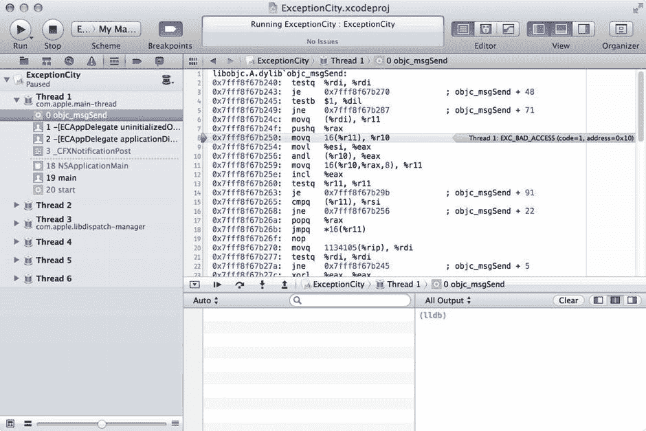

图 13-5 . 程序在收到信号时停止

根据这个垃圾指针具体指向什么，你可能会看到不同的信号名称，例如 `SIGSEGV` 或 `SIGILL`。更糟糕的是，它甚至可能指向我们程序中的其他有效对象，也许恰好是一个 `NSMutableString`，这使得追踪变得异常困难。具体细节其实并不重要；关键在于我们遇到了一个未初始化的指针（或者在此特定演示案例中，是一个指向错误内存位置的指针）。这个问题可以通过应用一条通用规则轻松解决：无论何时你在一个方法内部声明一个 Objective-C 对象指针，都要立刻给它赋值，即使只是 nil 也行。

所以，通过将字符串声明行修改为以下内容来修复此问题：
```
NSMutableString *string = nil;
```
构建并运行应用，一切顺利。在 Objective-C 中向 nil 指针发送消息是完全安全的（这基本上是一个空操作，并且向 nil 发送消息的返回值通常是 nil、0 或 NO），所以，虽然修复后的方法实际上不会*做*任何事情，但也不会导致崩溃。

现在，还有一个需要在这里提及的内存问题来源：向一个已经被释放的对象发送消息。在本书中，我们为创建的每个应用都使用了 ARC，这几乎完全消除了这种类型的错误，但如果你将来某个时候在一个使用手动引用计数（使用 retain 和 release）的项目中工作，了解是什么导致了这类问题是很有好处的。

没有 ARC，Objective-C 对象的内存管理通过手动引用计数来处理。长话短说：任何时候我们使用 `alloc` 或 `copy` 方法创建一个对象，或者通过向对象发送 `retain` 消息将其标记为“正在使用”，它的引用计数就会增加。我们必须在某个时候（当我们使用完该对象后）向该对象发送 `release` 或 `autorelease` 消息，两者都会减少其引用计数。当引用计数降至零时，该对象就会被释放。

当我们使用 ARC 时，相同的 `retain` 和 `release` 调用会被内置到我们的应用中，但不是由我们将其写入源代码，而是由编译器为我们完成。事实证明，计算机在始终如一地遵守 `retain`/`release` 规则方面比我们做得更好！

如果我们不使用 ARC，可能出现的问题是，如果我们没有正确执行这些操作，我们最终可能会陷入这样的境地：一个变量包含一个指向内存空间的指针，该内存空间曾经被一个“存活”的对象占据，但现在可能包含一个已释放的对象，或者可能已被用于其他目的。ARC 在处理这个问题上非常出色，以至于在启用 ARC 的情况下很难构造出出现这种情况的场景。因此，为了进行下一个演示，让我们暂时关闭 ARC。为此，在项目导航器中选择顶层的 *ExceptionCity* 项目，然后选择“构建设置”标签。使用顶部的搜索字段搜索“automatic”，然后关闭 *Objective-C Automatic Reference Counting*。图 13-6 显示了操作界面。

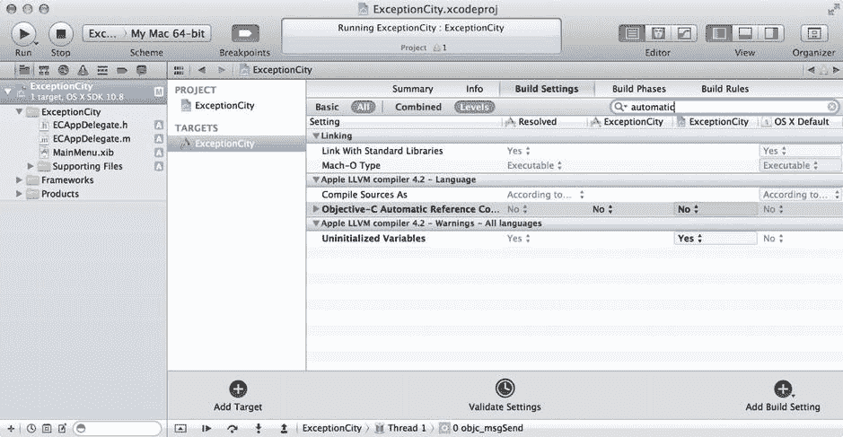

图 13-6 . 摆弄构建设置。你应该知道你想这么做

现在，在应用委托类中添加以下方法。这展示了一种简化版的不良行为，这种行为在 ARC 出现之前可能会给我们带来麻烦。
```
- (void)freedObject {
    NSString *object = [[NSString alloc] initWithCString:"hi there"
                                                encoding:NSUTF8StringEncoding];
    [object release];
    NSLog(@"Where is my object?
```


一个高级文档工程师接手了以下文本，并进行排版。

---

然后添加一行`[self freedObject];`到`applicationDidFinishLaunching:`方法中，运行 App，观察结果。程序将停止并显示类似图 13-7 的内容。

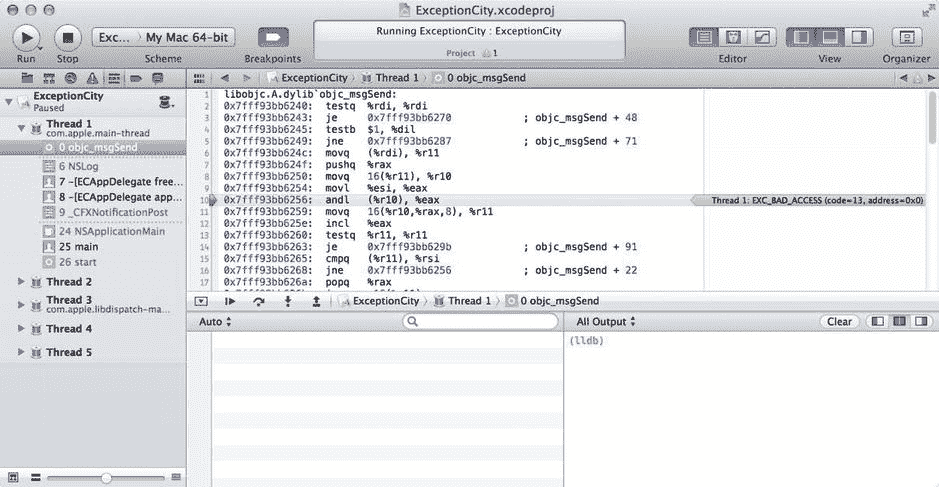

图 13-7 中绿色条表示程序停止的位置。这不太有用！幸好我们还有其他栈帧可以查看。

与之前的信号生成 bug 一样，程序可能会收到与此处所示不同的信号，但它肯定会收到某个信号。如果我们查看调用栈中顶层包含我们代码的栈帧，会发现其中同时包含了我们的`freedObject`方法和它正在调用的`NSLog`函数。

与前一个案例一样，修复方法在于自律：每当我们向某个对象发送`release`或`autorelease`消息时，如果变量中仍持有指向该对象的指针，应立即将该变量指向`nil`！发送`release`或`autorelease`不一定总会立即释放对象（因为其他代码可能也增加了它的引用计数），但在每个方法内部，我们应将已释放的对象视为禁区，并尽快清除所有指向它的悬垂指针。

在这种情况下，解决方案是在`[object release];`行后面添加以下代码：

```
object = nil;
```

添加该行后，再次运行 App，一切恢复正常！再次提醒，这种类型的 bug 只会在未使用 ARC 的情况下发生。并且，除了释放对象后将指针设为`nil`这一相对简单的经验法则外，非 ARC 应用还可能因其他方式陷入类似情况，例如忘记保留稍后要使用的对象。这些 bug 可能是一些最难追踪的问题，这也是尽可能使用 ARC 的最有力理由之一。

在继续之前，我们需要在项目中重新启用 ARC。再次选择项目导航器中的顶级项目项，在“构建设置”选项卡中找到`Objective-C Automatic Reference Counting`，并将其开启。此外，由于 ARC 不允许我们显式调用`release`，我们需要从 App 委托的`freedObject`方法中删除`[object release];`这一行。

## `NSError`

现在您知道，Cocoa 中的异常通常不用于流程控制，而是主要用于指出 bug。如今使用的一些其他语言和框架，会将异常用于各类非 bug，但可能是开发者无法直接控制条件的副作用，例如尝试访问文件时的文件相关错误，或尝试从套接字读取数据时的网络错误。在 Cocoa 中，这类情况通常使用一个名为`NSError`的类来处理。在本节中，我们将学习`NSError`对象的内容、导致其创建的情况以及如何在代码中处理它，包括赋予应用程序重试某些触发错误的操作的能力。

### 域和代码

传统上，每个操作系统都有自己的系统错误报告方式，通常提供一个整数值，我们可以将其与头文件中的预定义列表进行比较，以确定如何应对。例如，在基于 UNIX 的系统中，我们可以在每次系统调用（包括打开文件、读取文件、写入文件等函数）后检查`errno`的值（`errno`是一个全局变量，或一个调用函数的符号，这取决于我们在此不展开讨论的多个因素）。其理念是，如果任何系统函数遇到问题，它会将一个整数值放入`errno`，以告知我们错误的性质。

在“经典 Mac OS”编程（OS X 之前的所有产品）中，情况略有不同。许多系统函数不填充全局变量，而是返回一个`OSStatus`类型，这同样归结为一个整数，我们应在每次调用函数后检查它，以确保没有发生意外。

OS X 是一种混合操作系统。其底层深深植根于 UNIX，并且如您所知，它包含了构成 Cocoa 的所有 Objective-C 框架。它还包含 Carbon，这是一套从旧版 Mac OS 改编而来的大型 API 和技术。此外，还有为 OS X 和 iOS 完全用 C 编写的现代 API。每个“世界”都包含一个或多个需要用某种方式报告错误代码的函数或方法，并且由于这些世界是分别发展的，错误代码集之间当然存在一些重叠。在某个时候，Apple 意识到用统一方式处理来自这些不同世界的错误消息可能有益，让它们各自继续使用它们一直使用的相同错误代码（确保与现有软件的二进制兼容性），同时通过用字符串为每个错误标记其域来避免混淆风险。

这正是我们在`NSError`类中拥有的内容，它基本上将系统级错误代码封装在一个 Objective-C 对象中。每个`NSError`实例都有一个`NSString`来指定其“域”的名称（通常，它来自哪个库或框架），一个整数来指定相关的错误代码，以及一个可选的`NSDictionary`，其中可以包含关于该错误的附加信息。由于这些是普通的 Objective-C 对象，它们可以像任何其他对象一样被处理：传递、放入`NSArray`等。

Cocoa 包含一些预定义的字符串常量，用于对 Cocoa 框架中`NSError`对象的主要来源进行分类。作为 Cocoa 程序员，您最可能遇到的域如下：

* `NSPOSIXErrorDomain`：UNIX 错误（属于 POSIX 标准一部分的错误）。
* `NSOSStatusErrorDomain`：来自 Carbon 函数的错误（这些函数通常返回`OSStatus`）。
* `NSCocoaErrorDomain`：直接来自 Cocoa 自身类的错误。

每当一个 Cocoa 方法给我们一个`NSError`时，它的域很可能是这些之一。如果您开始在代码中创建自己的`NSError`实例，您可能希望定义自己的域和错误代码，以便在应用程序中更容易处理它们。

每个预定义的错误域都有一个相关的错误代码列表，定义在一个或多个头文件中。适用于`NSPOSIXErrorDomain`的错误代码在`errno.h`中。`NSOSStatusErrorDomain`的错误代码在`MacErrors.h`中；`NSCocoaErrorDomain`使用的错误代码包含在`FoundationErrors.h`、`AppKitErrors.h`和`CoreDataErrors.h`中。在 Xcode 中，通过调出“快速打开”窗口（ O）并输入文件名，可以轻松找到这些头文件。

### 识别错误

现在我们了解了`NSError`类的一些知识。但是，`NSError`实例从哪里来，以及它们在应用程序运行时如何影响应用程序？与异常不同，`NSError`对象不会对代码流程做出任何改变。通常，`NSError`实例通过方法调用返回给我们，不是作为返回值，而是通过引用我们传入的一个指针。这种参数弄巧成拙的方式在 C 中并不罕见，但在 Objective-C 中相当不常见。其理念是，一个容易出错的方法应该接收一个指向`NSError`指针的指针作为参数。这意味着我们不传入一个指向`NSError`的指针，而是一个指向指针的指针（我们指针的地址），以便接收方法可以创建一个`NSError`实例并将我们的指针指向它！（这听起来可能令人困惑，但一旦您看到这个模式，事情就会变得清晰。）


以`NSFileManager`类为例。文件管理器允许我们执行某些磁盘操作，例如创建目录、访问文件属性等。它有一个方法，其签名如下所示：

```
- (NSDictionary *)attributesOfItemAtPath:(NSString *)path error:(NSError **)error
```

我们可以使用此方法获取一个字典，该字典包含`path`参数指定的文件或目录的大量相关文件系统信息。注意第二个参数`error`的类型是`NSError**`，这意味着我们传入一个指向可以指向`NSError`对象的变量的指针。如果该方法确实遇到错误情况，它将创建一个`NSError`对象，并将其地址存储在`error`指定的位置。如果我们想忽略此类方法产生的任何错误，可以传入特殊的`NULL`指针作为最后一个参数。

下面的方法展示了从调用者角度看这看起来是什么样的。我们创建一个用于指向`NSError`对象的变量，并将其初始化为指向`nil`。然后，我们将该变量的地址传递给一个可能产生错误的方法，之后检查该变量，看它是否仍然指向`nil`。如果不是，我们知道该方法遇到了错误，并请求应用程序向用户呈现该错误。

```
- (void)fileError {
    NSFileManager *fileManager = [NSFileManager defaultManager];
    
    // 声明一个变量并将其指向 nil
    NSError *fileError = nil;
    
    // 将 fileError 变量的地址传递给该方法
    NSDictionary *attributes = [fileManager
                                attributesOfItemAtPath:@"/tmp" error:&fileError];
    
    // 检查前一个方法调用是否给了我们一个 NSError
    if (fileError == nil) {
        // 显示属性
        NSRunAlertPanel(@"Found file attributes",
                        [attributes description], nil, nil, nil);
    } else {
        // 报告错误
        [NSApp presentError:fileError];
    }
}
```

为简单起见，在探索`NSError`时，我们将继续构建我们正在使用的项目。将前面显示的`fileError`方法添加到应用程序委托类中，并在`applicationDidFinishLaunching:`方法中添加一行`[self fileError];`。运行应用程序，我们将看到类似 Figure 13-8 中所示的警告面板。


Figure 13-8 . 没有错误！

现在返回并编辑`fileManager`调用，将字符串参数从`@"/tmp"`更改为`@"/tmpfoo"`或某个其他不存在的路径。这将导致`fileManager`遇到错误并将其返回给我们，存储在传入地址的`fileError`变量中。它将注意到此错误并将其传递给`NSApp`，从而产生 Figure 12-5 中所示的警告面板。


Figure 13-9 . 出现错误了

这没问题，但看看那个警告面板中的文字：“*文件“tmpfoo”无法打开，因为没有这样的文件。*”这是否看起来有点……不够技术性？我们不是习惯于在计算机系统中使用更专业、更行话的语言吗？毕竟，这个错误是由一个低级系统例程触发的，它只报告了一个错误号，没有其他信息。那段文字是从哪里来的？

事实证明，`NSError`有一个名为`localizedDescription`的方法，它为我们提供了对错误的一个很好的、人类可读的解释。这个描述最终由`reportError:`方法显示出来。

让我们通过使用调试器来进一步探索一下。

在 Xcode 中，通过单击文本编辑器中该行左侧的装订线（显示行号的空间），在包含`[NSApp presentError:fileError]`的行上设置一个断点。这是在我们的代码中设置断点的最直接方法。然后再次运行应用程序。应用程序将在选定行处暂停，在输出控制台中留下`lldb`提示符。让我们深入挖掘一下，通过在`lldb`提示符下执行命令来询问错误的域和错误代码：

```
 (lldb) po [fileError domain]
 $0 = 0x00007fff7cdab110 NSCocoaErrorDomain
 (lldb) p (int)[fileError code]
 (int) $1 = 260
 (lldb) po [fileError localizedDescription]
 $2 = 0x0000000102327470 The file "tmpfoo" couldn't be opened because there is no such file.
```

注意我们可以使用`po`命令打印`NSString`的值，使用`p`命令打印任何基本 C 类型的值。通常在使用`p`命令时，`lldb`会抱怨它不知道我们试图显示的值的类型，所以我们在方法调用前放一个小的`(int)`，告诉`lldb`期望什么。

现在我们知道了错误代码和域。快速查看`FoundationErrors.h`会发现以下信息：

```
NSFileReadNoSuchFileError = 260,    // Read error (no such file)
```

这仍然可能让你想知道这一切是如何结合在一起的。回想一下，当你创建一个`NSError`时，你需要指定一个域、一个代码，以及一个可选地包含附加信息的字典。这个字典是谜题的关键部分。如果你传递给这个方法的字典对于键`@"NSLocalizedDescriptionKey"`有一个值，那么无论何时调用`localizedDescription`，都会返回该值。

那么，让我们看看`userInfo`字典包含什么。

```
(lldb) po [fileError userInfo]
$3 = 0x0000000102118850 {
    NSFilePath = "/tmpfoo";
    NSUnderlyingError = "Error Domain=NSPOSIXErrorDomain Code=2 \"The operation couldn\U2019t be completed. No such file or directory\"";
}
```

嗯，显然这不是答案。`userInfo`字典没有指定本地化的描述，但它确实包含了一些其他东西：我们试图访问的文件的路径，以及看起来像是另一个`NSError`的内容。一个错误包裹在另一个错误里面！让我们看看内部那个错误的`domain`、`code`、`userInfo`和`localizedError`是什么样的。我们从另一个`lldb`命令`expression`开始，它只是执行行上的其余语句，就像它们是源代码一样，但不像`po`或`p`命令那样打印结果。在这种情况下，我们将内部错误对象的地址分配给一个我们称为`$inner`的新变量。这是`lldb`的一个很好的特性，允许我们保留执行的查询结果，让值保留下来，并在以后节省一些输入工作。我们将从`fileError`中获取`userInfo`字典，然后立即使用 Objective-C 的新字典查找语法来访问底层错误。

```
(lldb) expression id $inner = [fileError userInfo][@"NSUnderlyingError"]
(lldb) po $inner
$inner = 0x000000010210a9e0 Error Domain=NSPOSIXErrorDomain Code=2 "The operation couldn't be completed. No such file or directory"
```

将对象的地址分配给新变量后，使用`po`命令查看新变量的地址及其内容，即它指向的对象。从现在开始，我们可以将那个内部错误简称为`$inner`，就像这样：

```
 (lldb) po [$inner domain]
 $9 = 0x00007fff7cdab0b0 NSPOSIXErrorDomain
 (lldb) p (int)[$inner code]
 (int) $10 = 2
 (lldb) po [$inner userInfo]
 $11 = 0x00000001001039d0 { }
 (lldb) po [$inner localizedDescription]
 $12 = 0x000000010011d2c0 The operation couldn't be completed. No such file or directory
```

这给我们带来了又一个谜题。


好的，作为高级文档工程师和翻译员，我将严格遵循您的注意事项和示例格式，将给定的英文文本翻译成中文。


## 当我们查看一个根本没有 `userInfo` 字典的根本性错误时，它仍然会提供一个人类可读的 `localizedDescription`，而这仅通过查看域和代码是无法直接看出的。实际上，我们可以像这样创建自己的内部和外部错误：

```
NSError *innerError = [NSError errorWithDomain:NSPOSIXErrorDomain
                                          code:2 userInfo:nil];
NSDictionary *outerInfo = @{NSUnderlyingErrorKey: innerError,
                            NSFilePathErrorKey: @"/tmpfoo"};
NSError *outerError = [NSError errorWithDomain:NSCocoaErrorDomain
                                          code:260 userInfo:outerInfo];
```

这些错误的行为将*完全*类似于由 `NSFileManager` 生成的错误，包括显示我们未在任何地方指定的人类可读文本！事实证明，这种魔法似乎源自 `NSError` 类本身。它显然内置了足够多的关于 Cocoa 错误域和错误代码的具体知识，能够为程序可能遇到的许多错误生成有意义的句子。这意味着，通常情况下，由 Cocoa 方法调用提供给我们的错误，无需经过美化即可直接展示给用户。

## 展示错误

既然如此，我们顺便来看看如何向用户展示错误？在这里，我们一直通过调用 `[NSApp presentError:e]` 来让应用程序显示一个模态窗口，但还有其他一些选择。实际上，`presentError:` 方法是在 `NSResponder`、`NSDocument` 和 `NSDocumentController` 中实现的，这意味着只要发生错误，我们就可以将其传递给附近或最相关的对象，然后它会沿着一个类似于响应者链的责任链向上传递，直到某个对象实际显示该错误。这为以不同方式显示错误信息（例如使用文档模态工作表警告）提供了可能性。

## 总结

我们现在已经了解了 Cocoa 应用程序处理各种“不愉快情况”的主要方式、如何避免一些常见错误，以及如何使用 `lldb` 来帮助追踪问题。我们还看到了方法如何利用 `NSError` 实例，以可控的方式处理问题。随着我们更深入地学习 Cocoa 编程，所有这些都将派上用场。

## 第 14 章：Cocoa 中的绘图

到目前为止，我们已经学习了许多强大的 Cocoa 技术，用于处理数据、优化布局应用程序的类，以及使用 Cocoa 提供的各种屏幕控件和其他视图。现在是时候开始学习如何使用 Cocoa 来创建我们自己的视图类，从而完全控制文本和图形的显示了。Mac 应用程序通常以包含“视觉糖果”而闻名——这不仅是为了绘制不必要的图形装饰，也是为了为用户创造更沉浸式的交互体验。作为 Cocoa 程序员，我们可以使用的图形技术能够帮助我们以惊人的少量努力实现一些同样的效果。

`Core Graphics` 提供了丰富的功能，用于渲染路径、操纵坐标系等等。`Core Graphics` 的一个主要部分是一组名为 `Quartz` 的 API。事实上，`Quartz` 在 `Core Graphics` 中占据了如此重要的地位，以至于这两个术语有时可以互换使用。`Core Animation` 则更进一步，让我们能够以极其简单的方式为视图添加动画。

本章将介绍坐标系和向 `NSView` 实例绘图的一些基础知识，并演示如何通过将视图放入滚动视图中，来显示一个比窗口中可用空间更大的视图。它还将触及如何轻松地为我们的应用程序添加基本的打印支持。

## 基础概念

在本节中，我们将介绍 Cocoa 绘图 API 中使用的一些基本概念。

如果你有过任何类型的图形编程经验，那么对 Cocoa 中可用的绘图方式可能会相当熟悉。毕竟，计算机图形学的大部分基本概念在几十年前就已经定型了。Cocoa 的突出之处在于其渲染的质量（包括文本和图形基元的抗锯齿功能）以及为更复杂概念提供的高级抽象能力。

在本章中，我们将始终使用点（point）而不是像素（pixel）。Cocoa 中的绘图通常是基于矢量且与分辨率无关的。随着高像素密度显示器（也称为 HiDPI 或 Retina 显示器）的出现，绘图模型中的一个点实际上可能由显示器上的一个或四个像素表示。在可能的情况下，最好让底层操作系统自行决定如何从绘图基元转换为实际像素。这样做的话，图像在高分辨率显示器上会自动看起来很棒。如果你在编写与像素相关的代码，那就不那么容易了，你需要担心点和像素之间的区别，以及如何适当地缩放位图。不过，现在我们只讨论点。

## 视图坐标系

Cocoa 的绘图系统使用 x-y 坐标系，默认情况下，原点 (0,0) 位于左下角，x 轴指向右方（值增大表示向右移动），y 轴指向上方（值增大表示在屏幕上向上移动）。这与数学中传统的图形绘制方式类似，但与许多其他计算机图形系统相反，在那些系统中 y 轴指向下方（值增大表示在屏幕上向下移动）。虽然在 Cocoa 中翻转 y 轴是可行的，有时也是可取的，但在我们的示例中不会这样做。

绘图通常由 `NSView` 子类的实例完成。视图存在于一个层次结构中。如果层次结构中最顶层的视图被设置为 `NSWindow` 的 *contentView*，那么该层次结构中的所有视图都会在该窗口内显示。窗口中的顶层视图（即 *contentView*）可以跨越窗口的整个区域进行绘制。对于层次结构中的其他所有视图，其绘图区域仅限于其框架（frame），即其父视图坐标系内的一个空间（参见 图 14-1）。

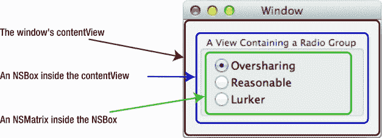

图 14-1. 一个简单的视图层次结构。窗口的 contentView 包含一个 NSBox，该 NSBox 又包含一个包含单选按钮的 NSMatrix

## 框架矩形 vs. 边界矩形

对于窗口中的每个视图，都有几个重要的矩形（通常称为 *rect*）定义了大量关于其绘图特性的信息：框架矩形和边界矩形。框架矩形简单地指定了视图在其父视图坐标系中的位置和大小。例如，想象一下窗口中的顶层视图。我们称它为 A。如果 A 有一个名为 B 的子视图，该子视图从点 (10,20) 延伸到点 (40,60)，那么 B 的框架矩形的原点为 (10,20)，大小为 (30,40)。

除了决定视图在其父视图中出现的位置和范围的框架外，每个视图还有一个边界矩形，它定义了其自身的内部坐标空间。例如，前面描述的视图 B 默认情况下会有一个边界矩形，其原点为 (0,0)，大小为 (30,40)。如果需要，我们可以轻松更改这一点。例如，假设我们有一堆点要绘制，其 x 和 y 值都在 0.0 到 10.0 之间。通过更改 B 的边界矩形，将其大小设置为 (10,10)，这些点将精确地填充 B 所占用的空间，无论 B 在屏幕上实际占用多大空间（参见 图 14-2）。

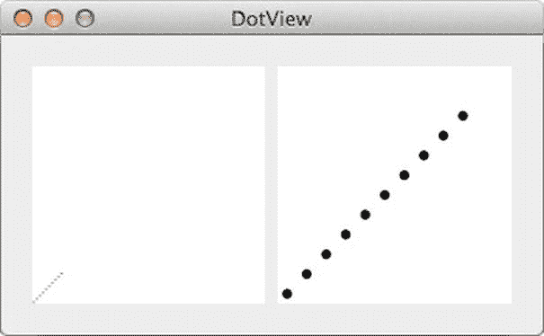

图 14-2.


## 图形绘制基础

## 视图边界与坐标点

在左侧，使用默认边界的视图绘制来自较窄范围的点。在右侧，相同点绘制在边界较小的视图中。

## 矩形、点和尺寸

在 Cocoa 中，矩形由名为 `NSRect` 的 C 结构体表示，该结构体包含一个表示原点的 `NSPoint` 和一个表示大小的 `NSSize`。原点和大小各自包含两个 `CGFloat` 类型的值，`CGFloat` 是 Cocoa 绘图 API 中广泛使用的基本 C 类型；原点包含 `x` 和 `y`，大小包含 `width` 和 `height`。

更令人困惑的是，Core Graphics 中的许多函数使用等效的结构体 `CGRect`、`CGPoint` 和 `CGSize`，它们具有相同的结构布局，并且都由 `CGFloat` 元素组成。这种划分的历史原因并不特别有趣，只要我们不是在处理 32 位遗留应用程序，这些 C 结构体具有相同的布局，并可以通过内联函数（例如 `NSRectToCGRect`、`NSSizeFromCGSize` 等）来回转换，这些函数实际上不过是类型转换。在本章中，我们将主要使用 `NS` 前缀的版本。

## 路径基础

Cocoa 的绘图机制包含路径的概念，路径可以包含任意数量的直线或曲线段。每个路径不必是连续的。我们可以在一个点“拿起笔”，然后在另一个点重新开始绘制。在实际绘制路径之前，我们可以指定线宽、颜色等值。这些设置将应用于路径的每个部分。由路径各部分勾勒出的任何形状也可以用单独的颜色或图案进行填充。

## 创建 `NSView` 子类

让我们通过创建一个能够绘制非常开心的笑脸的应用程序来开始探索（参见图 14-3）。在 Xcode 中，创建一个名为 *MrSmiley* 的新 Cocoa 项目。我们将为 Mr Smiley 应用使用 `MS` 作为类前缀，并保持启用*自动引用计数*。

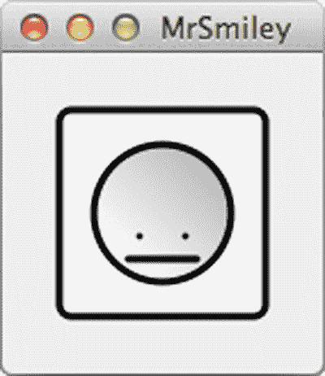

图 14-3. Mr Smiley 非常非常开心

现在创建一个新的 Objective-C 类，作为 `NSView` 的子类，并将其命名为 `MSSmileyView`。通过选择 **文件**  **新建**  **文件...**（****-N），或右键单击 Xcode 窗口左侧的项目导航器窗格并选择弹出菜单中的 **新建文件...** 来完成此操作。Xcode 将为我们创建类的文件，包括 `MSSmileyView.m`，本节所有工作将在此文件中进行。

在开始编码之前，打开项目的 `MainMenu.xib` 文件。从*库*窗口中抓取一个自定义视图，并将其拖入默认创建的空白窗口中。使用*身份检查器*将视图的类更改为 *MSSmileyView*（在*自定义类*标题下），然后使用*大小检查器*将其宽度和高度更改为 100×100。最后，选择窗口并按 **-=** 使窗口自动调整大小以完美适应视图。然后保存更改。

## 基本绘制方法：`drawRect:`

现在开始编写代码。Xcode 创建的 `MSSmileyView.m` 文件包含一个空的 `drawRect:` 方法，我们将在此方法中开始编写代码。`drawRect:` 方法通常不会直接调用，除非我们在实现现有视图的子类时调用 `[super drawRect:rect]` 让父类完成其绘制工作。相反，当应用的主运行循环确定视图需要重绘时（通常在视图被创建或调整大小后，或者我们自己的代码在视图上调用了 `setNeedsDisplay:` 并传递 `YES` 作为参数），`drawRect:` 方法会被自动调用。

`drawRect:` 方法接受一个参数，即表示视图哪部分“脏”并需要重绘的矩形。这可用于优化复杂视图的绘制，但在我们的示例中，我们将忽略这一点，而是使用视图的边界矩形进行绘制。

## 图形状态

Cocoa 中的所有绘制都发生在特定的上下文中，该上下文由 `NSGraphicsContext` 类表示。根据上下文的不同，我们可能直接绘制到窗口缓冲区，或绘制到一块离屏内存中以供后续使用。除此之外，上下文还有一些自身的状态信息，这些信息会随时间变化，例如当前用于任何绘制命令的颜色。当视图需要绘制自身时，它应该以将图形状态恢复到绘制开始时的状态的方式进行绘制。

幸运的是，`NSGraphicsContext` 为我们提供了一种简单的方法来实现这一点。它的 `saveGraphicsState` 方法会将所有相关的状态信息推入栈中，而 `restoreGraphicsState` 方法会将状态从栈中弹出。我们可以像下面的代码片段那样，使用这两个方法调用来“包围”实际的绘制代码，从而确保我们不会让图形上下文处于意外状态。

```
- (void)drawRect:(NSRect)dirtyRect {
    [NSGraphicsContext saveGraphicsState];
    // 绘制代码放在这里。
    [NSGraphicsContext restoreGraphicsState];
}
```

## 路径辅助工具

要绘制本节开头所示的视图，我们将首先绘制背景，然后绘制脸部本身。对于这两个元素中的每一个，我们将先填充背景，然后绘制边缘。所有这些都使用 `NSBezierPath` 类完成。贝塞尔路径允许我们定义任意复杂度的路径，包括直线、点、曲线等。`NSBezierPath` 类的一个便利之处在于，它提供了用于创建表示常见形状（如矩形、椭圆等）的贝塞尔路径的便捷快捷方式。

让我们从创建一个定义视图可见边缘的路径开始，使用 `NSBezierPath` 上的一个类方法来获取一个圆角矩形。下面以粗体显示的行创建了一个路径，用白色填充它，然后“勾勒”路径（以黑色绘制其边缘）：

```
- (void)drawRect:(NSRect)dirtyRect {
    [NSGraphicsContext saveGraphicsState];

    NSRect bRect = CGRectInset([self bounds], 5, 5);
    NSBezierPath *border = [NSBezierPath bezierPathWithRoundedRect:bRect
        xRadius:5 yRadius:5];
    [[NSColor whiteColor] set];
    [border fill];

    [border setLineWidth:3];
    [[NSColor blackColor] set];
    [border stroke];

    [NSGraphicsContext restoreGraphicsState];
}
```

第一步使用 `CGRectInset` 函数缩小我们的边界矩形，为其留出一些余量，以便我们可以绘制带有粗线的圆角矩形，而不会被边缘裁剪。然后，我们创建一个表示圆角矩形的路径，指定矩形的基本几何形状以及用于定义圆角椭圆曲线大小的两个数字。之后，我们发出简单的命令来设置颜色、线宽并执行一些绘制。

## 颜色与图形上下文

请注意，指定用于绘制操作的颜色是与绘制操作本身分开的步骤，设置线宽也是如此。此外，虽然设置线宽是通过路径上的方法完成的，但设置颜色看起来像是一种自由浮动操作。我们只需向任何颜色发送 `set` 消息，它就会立即成为当前颜色！实际上发生的是，`NSColor` 的 `set` 方法与底层图形上下文交互，设置将用于后续绘制操作的颜色。其一个后果是，只有当存在当前图形上下文时（例如在 `drawRect:` 方法内），`NSColor` 的 `set` 方法才会执行有用的操作。


## 图形上下文中的颜色管理与路径绘制

另一个结果是，当前颜色是图形上下文的一个属性（在一般意义上，如果不是在 Objective-C 语言意义上），因此，在我们方法开始时调用`[NSGraphicsContext saveGraphicsState]`会保存之前设置的颜色，并在方法结束时调用`[NSGraphicsContext restoreGraphicsState]`恢复，从而将一切恢复原状。

此时，如果在 Xcode 中*运行*该应用，我们会看到它绘制了一个带有黑色轮廓的白色矩形（Figure 14-4）。


Figure 14-4. 事物的形状

## 超越颜色

现在让我们开始绘制头部。在`drawRect:`方法中，靠近末尾但仍位于`[NSGraphicsContext restoreGraphicsState]`调用之前，添加以下代码行：

```objectivec
NSRect hRect = CGRectInset([self bounds],20,20);
NSBezierPath *head = [NSBezierPath bezierPathWithOvalInRect:hRect];
NSGradient *faceGradient = [[NSGradient alloc]
  initWithStartingColor:[NSColor whiteColor]
  endingColor:[NSColor lightGrayColor]];
[faceGradient drawInBezierPath:head angle:45];
[head setLineWidth:3];
[head stroke];
```

在这里，我们再次使用`CGRectInset`创建一个比边界矩形更小的新矩形，这次是为了给笑脸先生的头部创建一个椭圆形。在创建贝塞尔路径后，我们创建了一些新的东西：`NSGradient`的一个实例，它知道如何获取两种或多种颜色并在它们之间绘制平滑渐变。在这个示例中，它可以在贝塞尔路径的内表面绘制自身。*运行*这段代码；视图现在包含一个带有渐变阴影的圆形“头部”（Figure 14-5）。


Figure 14-5. 基本头部特写

## 手动路径构建

现在剩下的就是绘制面部特征（一个简单的嘴巴和眼睛）。在`drawRect:`的末尾（但在最终的`[NSGraphicsContext restoreGraphicsState]`调用之前）添加以下代码行：

```objectivec
NSBezierPath *features = [NSBezierPath bezierPath];
[features moveToPoint:NSMakePoint(35, 30)];
[features lineToPoint:NSMakePoint(65, 30)];
[features moveToPoint:NSMakePoint(40, 40)];
[features lineToPoint:NSMakePoint(40, 40)];
[features moveToPoint:NSMakePoint(60, 40)];
[features lineToPoint:NSMakePoint(60, 40)];
[features setLineCapStyle:NSRoundLineCapStyle];
[features setLineWidth:3];
[features stroke];
```

这里，我们没有使用`NSBezierPath`上的便捷类方法来直接获取完整形状，而是使用了一些更基本的方法，从零开始构建路径。`moveToPoint:`方法将虚拟的“笔”定位在指定点，而不绘制线条到该点。而`lineToPoint:`方法则从路径的当前点绘制一条线到新点。实际上，这些方法并不执行任何绘制；它们只是构建了贝塞尔路径结构，稍后由`stroke`方法进行绘制。

这里的一个额外技巧是我们设置了线条端点样式。此设置定义了线条末端会发生什么。这对于眼睛尤其重要，因为眼睛被绘制为单个点。使用默认设置（在线段末端精确切断所有内容）时，眼睛完全不可见，但使用`NSRoundLineCapStyle`为每只眼睛提供了完美的小圆圈。点击*运行*查看最终结果（Figure 14-6）。

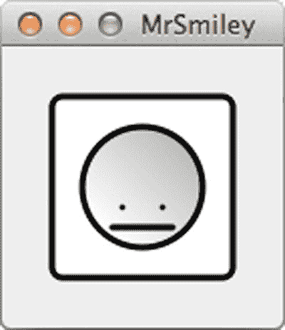

Figure 14-6. 笑脸先生。他真的很开心！

## 边界问题

既然`MSSmileyView`绘制了一个完美的笑脸，我们自然会希望能够调整其大小以适应不同的位置。

当我们将窗口适配内容时，`MSSmileyView`自定义视图应该会自动设置约束，使视图随窗口改变大小。通过查看从自定义视图边缘延伸到窗口的蓝色线条，我们可以判断出这种情况，如 Figure 14-7 所示。如果不是这种情况，我们可以使用边缘的调整手柄调整`MSSmileyView`的大小，直到蓝色引导线出现在所有四个边上。这将自定义视图定位在距窗口边框四周内嵌 20 点的位置。


Figure 14-7. 调整大小约束已就位

保存工作，点击*运行*，并调整视图大小。它应该看起来像 Figure 14-8。


Figure 14-8. 哎呀，你的头倒过来了！

这看起来不对劲，对吧？问题在于，在`drawRect:`方法中，我们在指定路径几何时采用了一种混合匹配的方法。对于轮廓和头部形状，我们一切基于边界矩形，但对于面部特征，我们硬编码了数字像素宽度。当视图调整大小时，我们的边界矩形会自动随之调整大小。这使得轮廓和头部拉伸以适应新的边界，而面部特征仍然困在它们僵硬的微小世界里。

另外，请注意，调整大小后线条的粗细完全相同，这意味着它们相对于视图整体大小的相对粗细已经改变。如果我们把这个视图做得非常大，线条会显得异常细。

幸运的是，有一个简单的方法可以解决所有这些问题。回想一下本章前面提到的视图的`frame`和`bounds`矩形之间的区别？`frame`定义了视图在其父视图中的位置和大小。而`bounds`则决定了视图内坐标系的范围和位置。如果我们能配置使得视图的`bounds`矩形永远不变，那么它就会始终绘制完全相同的内容，但完美地拉伸以匹配它实际绘制的`frame`！

为此，我们只需要在每次视图调整大小时手动将`bounds`设置回原始矩形。因此，让我们向`MSSmileyView.h`添加一个属性（用于保存我们想要的边界），完善`initWithFrame:`方法，并实现`setFrameSize:`方法，如下所示：

```objectivec
// A portion of MSSmileyView.h:
#import <Cocoa/Cocoa.h>
@interface MSSmileyView : NSView
@property NSRect preferredBounds;
@end

// A portion of MSSmileyView.m:
- (id)initWithFrame:(NSRect)frame {
    self = [super initWithFrame:frame];
    if (self) {
        self.preferredBounds = NSMakeRect(0, 0, 100, 100);
    }

    return self;
}

- (void)setFrameSize:(NSSize)newSize {
    [super setFrameSize:newSize];
    [self setBounds:self.preferredBounds];
}
```

`setFrameSize:`方法是在用户调整窗口大小期间进行实时拖拽时被调用的。我们在这里做的是每一步都重置视图的`bounds`矩形，这样当需要绘制时，所有绘制都将基于原始的`bounds`进行。现在点击*运行*，调整窗口大小，见证奇迹（Figure 14-9）。

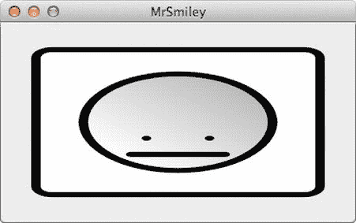

Figure 14-9. 真正的拉伸

如您所见，一切都能完美地按比例拉伸，包括线条的宽度。此外，所有内容都会根据实际显示分辨率进行渲染。我们可以任意拉伸它，并且始终能看到完美抗锯齿的曲线。我们为`bounds`指定的任何几何图形都将被调整以匹配我们所处的`frame`。我们在这里看到的，实际上是一个二维变换。


