# 排版后

除了作为处理尺寸调整的一种便捷方式外，这种内置的变换能力意味着我们只需设置边界矩形，就能以自己舒适的任何比例进行绘图。如果我们想以像素分辨率绘制图形，完全可以这样做；但如果我们要绘制一条取值范围在 0.0 到 0.1 之间的数学曲线细节，就可以相应地设置边界，而无需将所有显示值乘以某个系数来匹配屏幕坐标。

## LOLmaker

现在，我们对如何在 `NSView` 中绘图以及操纵其几何属性有了基本了解，接下来进入一个新项目：LOLmaker。LOLmaker 是一个简单的应用程序，只需拖入一张图片并输入想要显示的文本，就能创建属于自己的 LOLcat 风格图像。这并非什么高深的技术，但它会引导我们了解在 `NSView` 中绘图时涉及的更多问题。

### 关于 LOLcats 的一点说明

如果你完全错过了 LOLcat 这个网络迷因，或者是在 LOLcat 已被遗忘的未来世界中阅读本书，那么这里简单介绍一下：LOLcat 基本上就是一张带有幽默字幕的猫（或其他动物）图片，其文字风格通常模仿 21 世纪初的网络俚语。

我们喜欢 LOLcat 仅仅因为它们是我们看了会大笑的猫咪图片。请千万别以为我们会堕落到为了多卖几本书而在书中加入 LOLcat 的内容！众所周知，大多数 LOLcat 粉丝同时也是盗版者，他们只会通过偷来的 PDF 文件阅读本书。

### LOL 第一步

首先在 Xcode 中创建一个新的基础 Cocoa 项目，开启自动引用计数，但这次不需要文档或 Core Data 支持。虽然这两项功能在这个项目中也能派上用场，但我们目前只专注于绘图方面。这个项目实际上不会保存任何内容。将项目命名为 LOLmaker，并使用 LOL 作为类前缀。

现在，编辑 `LOLAppDelegate.h` 文件，添加以下加粗的行：

```objectivec
#import <Cocoa/Cocoa.h>
#import "LOLView.h"

@interface LOLAppDelegate : NSObject <NSApplicationDelegate>

@property (assign) IBOutlet NSWindow *window;
@property (weak) IBOutlet LOLView *lolView;
@property (strong) NSImage *image;
@property (copy) NSString *text;

@end
```

这些属性将与 Cocoa 绑定配合使用，让用户可以拖入图片并输入文本，文本会自动关联到我们的控制器对象，而控制器对象又会更新视图。请注意（Xcode 也会注意到），我们导入了一个 `LOLView.h` 头文件，并声明了一个 `LOLView*` 类型的属性，尽管 `LOLView` 类尚未完成。立即解决这个问题：再创建一组新的类文件，这次为 `LOLView` 创建一个 `NSView` 子类。

我们稍后就会实现 `LOLView`，但现在先配置图形界面。点击 `MainMenu.xib` 在 Interface Builder 画布中打开它，使用资源库将一个自定义视图、一个图像框和一个文本字段拖入空白窗口。使用身份检查器将自定义视图的类设置为 LOLView，并使用属性检查器打开图像框的“可编辑”复选框。最后，将应用程序代理的 *lolView* 出口连接到窗口中的 `LOLView`。布局完成后，窗口应类似于图 14-10。

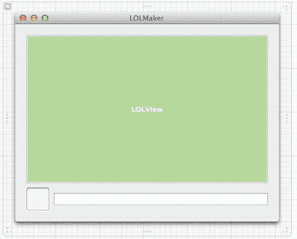

图 14-10。我们的 LOLmaker 窗口布局

这个窗口允许用户拖入一张图片（到拖放区域）并输入一条消息，消息将显示在图片之上。`LOLView` 会检测到拖入的图片和编辑后的文本，并通过 Cocoa 绑定触发自身的重绘。绑定的一半将在 Interface Builder 中配置，另一半通过代码完成。

首先，选择图像框并切换到绑定检查器。为“值”属性创建一个绑定，在弹出的列表中选择应用程序代理，并在“模型键路径”字段中输入 `self.image`。然后选择文本字段，为其“值”属性创建一个绑定，同样在弹出的列表中选择应用程序代理，这次在“模型键路径”字段中输入 `self.text`。

这样就完成了控件的绑定设置，但由于 Interface Builder 不知道 `LOLView` 及其可绑定的值，因此我们需要在代码中为其设置绑定。回到 Xcode，编辑 `LOLAppDelegate.m`，在 `@implementation` 部分添加以下方法：

```objectivec
- (void)applicationDidFinishLaunching:(NSNotification *)aNotification {
    [self.lolView bind:@"image" toObject:self withKeyPath:@"image"
               options:nil];
    [self.lolView bind:@"text" toObject:self withKeyPath:@"text"
               options:nil];
}
```

至此，应用程序中所有对象之间的基本通信就完成了。用户对窗口中控件的编辑会通过 Cocoa 绑定传递给应用程序代理，再从那里传递到 `LOLView`。我们应用的“管道”现已搭建完成！

## LOLView

那么，`LOLView` 本身呢？首先，它会有几个属性，就像应用程序代理的属性一样，用于存放来自用户的值。不过，在这种情况下，我们希望每次某个值发生变化时都触发重绘，以便 `LOLView` 能够重新绘制。因此，我们自行实现 setter 方法，而不是使用编译器生成的默认 setter。由于我们使用自定义 setter，但允许编译器生成 getter，因此必须将属性标记为 `nonatomic`。编译器生成的 getter 和 setter 包含同步代码，以确保这些方法永远不会返回构造了一半的对象。由于我们构建了自己的 setter，编译器无法提供这种保证，但这个应用程序中我们无需关心。按指示将以下代码分别添加到 `LOLView.h` 和 `LOLView.m` 中：

```objectivec
// LOLView.h:
#import <Cocoa/Cocoa.h>
@interface LOLView : NSView
@property (strong, nonatomic) NSImage *image;
@property (copy, nonatomic) NSString *text;
@end

// LOLView.m:
#import "LOLView.h"
@implementation LOLView
- (id)initWithFrame:(NSRect)frame {
    self = [super initWithFrame:frame];
    if (self) {
        // 初始化代码写在这里。
    }
    return self;
}

- (void)drawRect:(NSRect)dirtyRect {
    // 绘图代码写在这里。
}

- (void)setImage:(NSImage *)i {
    if (![i isEqual:_image]) {
        _image = i;
        [self setNeedsDisplay:YES];
    }
}

- (void)setText:(NSString *)t {
    if (![t isEqual:_text]) {
        _text = [t copy];
        [self setNeedsDisplay:YES];
    }
}
```

在两个 setter 中，我们直接使用了属性生成的实例变量。默认情况下，实例变量的名称是属性名加下划线前缀，但你可以根据需要控制名称，并且可以控制是否合成实例变量。在 `setText:` 方法中，我们对传入代码的 `NSString` 进行了显式复制。我们必须这样做，因为我们在属性声明中已经声明（注意它标记为 `copy` 而非 `strong` 或 `weak`）。一般来说，在接收 `NSString` 这样的对象时这是一个好做法，因为调用者实际传递给你的可能是一个可变字符串，可能会被其他代码修改。

### 绘制位图

现在，我们来进入 `LOLView` 类的“核心”：绘制图片并在其上叠加文本。


让我们先从图像开始。通过在我们创建类时预置的 `drawRect:` 方法中添加几行代码，我们可以快速将图像复制到位：

```
- (void)drawRect:(NSRect)dirtyRect {
  NSRect srcImageRect = NSMakeRect(0, 0, [self.image size].width,
    [self.image size].height);
  [self.image drawAtPoint:[self bounds].origin fromRect:srcImageRect
    operation:NSCompositeCopy fraction:1.0];
}
```

我们在这里做的第一件事是创建一个名为 `srcImageRect` 的矩形，其原点为 (0,0)，大小与图像尺寸相等。然后，我们向图像本身发送一条消息，告诉它将 `srcImageRect` 指定的图像部分（此处为整张图像）绘制到当前图形上下文中，该上下文位于视图边界矩形的原点位置。简而言之，整张图像被复制，其左下角将精确地位于视图的左下角。我们在此使用的绘制方法还允许我们指定一个操作，该操作决定源图像和目标图像中透明度的合并方式，以及一个介于 0.0 和 1.0 之间的整数，作为整张图像的整体 alpha 级别。任何低于 1.0 的值都会使图像变得部分透明；一直降到 0.0 会使图像完全不可见。

现在，*运行*应用程序，看看我们目前做到了什么程度。应用程序打开后，显示一个几乎空白的窗口，底部是图像拖放区和文本字段。找一张好看的 LOLcat 风格的图片（我们使用的是通过 Flickr 找到的美国国家档案馆的非版权图片），并将其拖入图像拖放区，效果应类似于图 14-11。

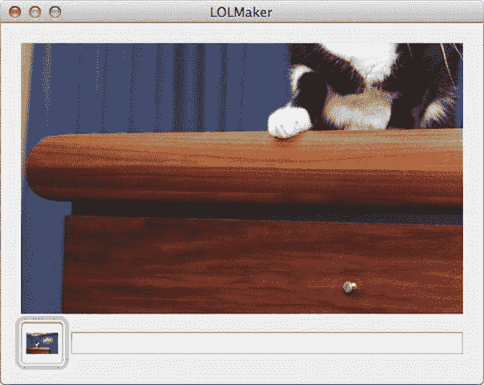

图 14-11。这里可没什么好笑的

嘿，这可不是很令人满意！我们只看到了拖入图片的左下角！要是能有办法看到整张图片就好了……

## 让它滚动起来

当然，是有办法的。Cocoa 包含一个名为 `NSScrollView` 的类，在这里可以提供帮助。通过将视图放入 `NSScrollView` 内部，我们可以获得水平和垂直滚动条，用户可以使用它们来滑动视图。滚动视图负责处理所有繁重的工作。我们放入其中的任何视图的绘制代码都不需要更改！将 `LOLView` 放入 `NSScrollView` 出奇地简单。我们只需要添加一点代码，并在 Interface Builder 中做一些调整。

首先，在 Xcode 中打开 nib 文件以准备滚动视图本身。选择 `LOLView`，然后从菜单中选择 **Editor**  **Embed in**  **Scroll View**。我们的 `LOLView` 现在被包裹在一个滚动视图中，但定位和大小有些偏差。移动滚动视图，直到蓝色参考线在窗口左上角闪烁，然后使用右下角的调整控件稍微调整大小，直到该侧的蓝色参考线闪烁。该视图应几乎填满窗口的宽度，并带有通常的边框，并且向下延伸足够的距离，以便在其他控件上方留出合适的边距（参见图 14-12）。

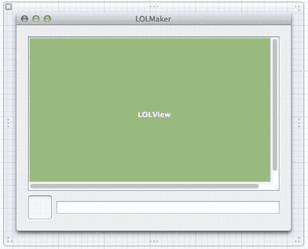

图 14-12。为滚动调整后的 LOLmaker 窗口

我们还可以免费获得滚动视图的一些有用的缩放行为，这对于支持用户双指捏合缩放的多点触控触控板非常有用。既然它是免费的，我们就利用一下。选中滚动视图，打开*属性检查器*。其中一个选项是“放大”。勾选*允许*旁边的复选框，代码部分我们就完成了。

我们需要添加的代码实际上是 `setImage:` 方法的另一部分。

我们要做的是在每次设置新图像时调整 `LOLView` 的大小，使视图的大小与图像大小匹配。之后，当 `LOLView` 被包含在 `NSScrollView` 中时，滚动视图会注意到新的视图大小，并自动重新渲染包括滚动条在内的所有内容。新代码如下所示：

```
- (void)setImage:(NSImage *)i {
  if (![i isEqual:_image]) {
    if (i) {
      NSRect newImageFrame = NSMakeRect(0, 0, [i size].width,
        [i size].height);
      [self setFrame:newImageFrame];
    }
    _image = i;
    [self setNeedsDisplay:YES];
  }
}
```

保存所有工作，点击*运行*，滚动视图就完成啦！拖入一张大图片，注意它起始于左下角，但滚动条已经出现，我们可以拖动到任何想要的位置，如果硬件支持，我们还可以双指捏合缩放！在图 14-13 中查看实际效果。

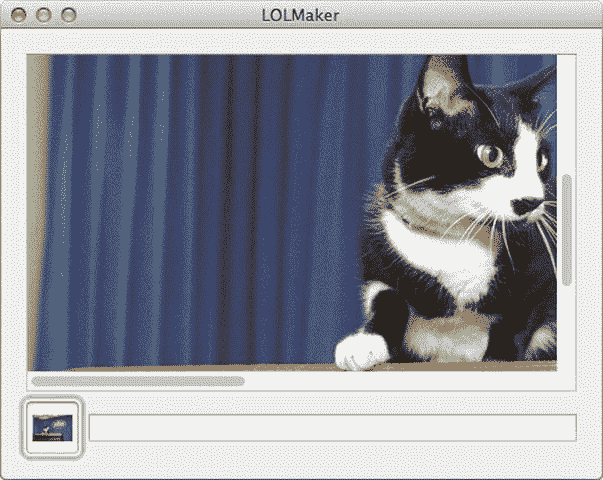

图 14-13。滚动条：如此简单，连猫都会

## 绘制文字

好了，让我们进入最后一步，绘制文字。在 LOLcats 社区中，传统上使用 Impact 字体并以黑色阴影的白色文字作为标题。这种字体随 Mountain Lion 系统安装，因此我们所有的用户都应该拥有它。这应该轻而易举。唯一稍微棘手的一点是选择字号。由于图像可能有各种尺寸，我们需要动态选择字号，以便标题在视图内占据合适的位置，而不会延伸到侧面。我们将通过测试几种字号来实现这一点，从 1 开始，每次将大小加倍，直到达到文本宽度会超过视图本身的程度。然后我们将字号稍稍调小一些，再绘制文本。所有这些都通过添加下面显示的加粗行来完成：

```
- (void)drawRect:(NSRect)dirtyRect {
  // 此处的绘制代码。
  NSRect srcImageRect = NSMakeRect(0, 0, [self.image size].width,
    [self.image size].height);
  [self.image drawAtPoint:[self bounds].origin fromRect:srcImageRect
    operation:NSCompositeCopy fraction:1.0];

  if (self.text != nil && [self.text length] > 0) {
    NSPoint textLocation = NSMakePoint(0,0);
    NSShadow *textShadow = [[NSShadow alloc] init];
    [textShadow setShadowOffset:NSMakeSize(0,0)];
    [textShadow setShadowColor:[NSColor blackColor]];
    [textShadow setShadowBlurRadius:10];
    NSMutableDictionary *textAttributes =
      [NSMutableDictionary dictionaryWithObjectsAndKeys:
        [NSFont fontWithName:@"Impact" size:40], NSFontAttributeName,
        [NSColor whiteColor], NSForegroundColorAttributeName,
        textShadow, NSShadowAttributeName,
        nil];

    // 找到最佳字号
    CGFloat fontSize;
    NSSize testSize = NSMakeSize(0, 0);
    for(fontSize=1; testSize.width < [self.image size].width; fontSize*=2)
    {
      [textAttributes setObject:[NSFont fontWithName:@"Impact"
        size:fontSize]
        forKey:NSFontAttributeName];
      testSize = [self.text sizeWithAttributes:textAttributes];
    }
    [textAttributes setObject:[NSFont fontWithName:@"Impact"
      size:fontSize/4]
      forKey:NSFontAttributeName];

    // 然后绘制文本
    [self.text drawAtPoint:textLocation
      withAttributes:textAttributes];
  }
}
```

现在点击*运行*，将一张图片拖入图像拖放区，并写入一些文字。瞧！它应该看起来像图 14-14。

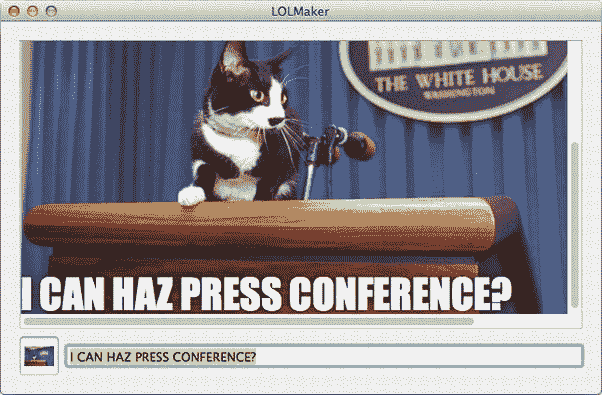

图 14-14。我能搞个新闻发布会吗？

## 总结

在本章中，我们深入了解了 `NSView`、`NSBezierPath` 以及一些其他处理绘图的类和数据结构的工作原理。


## 高级绘图主题

然而，Cocoa 的绘图功能远不止于此，我们还能绘制更复杂的曲线、让绘图响应鼠标事件以及为视图添加动画效果，这些内容都将在下一章中介绍。

第 14 章提供了 Cocoa 核心绘图概念的基础知识，例如使用路径描述形状、将图像复制到屏幕以及渲染文本。本章将在此基础上进一步展开，演示一些让图形活灵活现的技巧。第一部分将介绍如何让视图响应鼠标事件，使用户能够与自定义视图进行交互。第二部分将简要介绍 Core Animation，这项令人兴奋的技术只需几行代码就能创建流畅的动画效果。

## 编辑曲线

第 14 章介绍了用于绘制圆角矩形、椭圆、直线和点的`NSBezierPath`类。如果你在 Photoshop 或其他应用中使用过贝塞尔绘图工具，可能会好奇这些形状与贝塞尔曲线究竟有何关联！贝塞尔曲线本质上是一系列描述路径的点，以及描述点之间曲线的控制点。因此，基本上任何能用笔（现实世界中的笔，或计算机图形系统中的虚拟笔）绘制的形状，包括直线和锯齿形角度，都可以描述为贝塞尔曲线。

然而，通俗地说，贝塞尔曲线通常指的是类似图 15-1 中所示的形状。图中黑色曲线即为贝塞尔曲线，它由两个端点（左下角和右上角）以及两个控制点定义，这些控制点以杆端巨大的圆圈表示。用户通过拖拽控制点来改变曲线的形状。此类视图可用作节奏控制器，用于确定某些数值随时间变化的速率，例如物体从一点移动到另一点的运动。将曲线变成直线可实现完美的线性过渡，或制作出 S 形曲线，使数值开始变化缓慢，中途快速上升，接近目标值时再减慢速度（有时称为“缓入/缓出”过渡）。这就是我们将在本节中实现的控制功能。

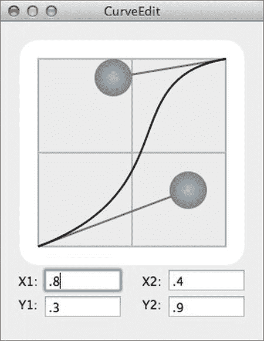

图 15-1. 贝塞尔曲线

## 准备工作

在 Xcode 中新建一个 Cocoa 项目，并将其命名为`CurveEdit`。确保勾选*自动引用计数*，并将此类前缀设置为`CE`。

本应用的核心部分将全部位于视图对象中，但首先让我们处理视图周围的基础架构。我们将在此项目中坚持使用 MVC 架构，这将有助于确保我们创建的视图能够作为独立组件使用。用于显示每个控制点 x 和 y 值的文本字段将通过 Cocoa 绑定连接到我们的控制器对象，自定义视图本身也是如此。此应用中的模型将只是控制器类中的一组实例变量，但如果我们选择使用或创建真实的模型对象，所有视图同样可以轻松地绑定到该模型对象上。

新建一个名为`CECurveView`的`NSView`子类，暂时保持其实现不变。我们很快就会回头处理它。打开`MainMenu.xib`。从*对象库*中拖出一个*自定义视图*，并使用*身份检查器*将其类设置为`CECurveView`。将其大小调整为约 240 x 240。接下来，我们需要连接应用代理和我们刚刚放入窗口的视图。为此，在辅助编辑器中打开`CEAppDelegate.h`文件，然后按住 Control 键从`CECurveView`自定义视图拖拽到辅助编辑器窗口中的`CEAppDelegate.h`代码处。拖拽到现有`@property`声明下方时，应出现“插入输出口”提示。将新输出口命名为`curveView`。

我们还需要进行一些其他更改。我们将添加一个导入语句来引入`CECurveView`头文件，以及一些稍后通过 Cocoa 绑定使用的额外属性。在`.h`文件中添加以下内容：

```objc
#import <Cocoa/Cocoa.h>
#import "CECurveView.h"

@interface CEAppDelegate : NSObject <NSApplicationDelegate>

@property (assign) IBOutlet NSWindow *window;
@property (weak) IBOutlet CECurveView *curveView;

@property (assign) CGFloat cp1X;
@property (assign) CGFloat cp1Y;
@property (assign) CGFloat cp2X;
@property (assign) CGFloat cp2Y;

@end
```

然后切换到`.m`文件，并添加以下行：

```objc
#import "CEAppDelegate.h"

@implementation CEAppDelegate

- (void)applicationDidFinishLaunching:(NSNotification *)aNotification {
    // 让 CECurveView 注意到我的更改
    [self.curveView bind:@"cp1X" toObject:self withKeyPath:@"cp1X"
        options:nil];
    [self.curveView bind:@"cp1Y" toObject:self withKeyPath:@"cp1Y"
        options:nil];
    [self.curveView bind:@"cp2X" toObject:self withKeyPath:@"cp2X"
        options:nil];
    [self.curveView bind:@"cp2Y" toObject:self withKeyPath:@"cp2Y"
        options:nil];
    // 让我注意到 CECurveView 的更改
    [self bind:@"cp1X" toObject:self.curveView withKeyPath:@"cp1X"
        options:nil];
    [self bind:@"cp1Y" toObject:self.curveView withKeyPath:@"cp1Y"
        options:nil];
    [self bind:@"cp2X" toObject:self.curveView withKeyPath:@"cp2X"
        options:nil];
    [self bind:@"cp2Y" toObject:self.curveView withKeyPath:@"cp2Y"
        options:nil];
    // 设置初始值
    self.cp1X = 0.5;
    self.cp1Y = 0.0;
    self.cp2X = 0.5;
    self.cp2Y = 1.0;
}

@end
```

如您所见，控制器类非常简单。它所做的只是声明用于访问控制点 x 和 y 值的属性，以及一个用于连接到`CECurveView`本身的`IBOutlet`，代表我们的`curveView`建立一些绑定（因为我们无法在 Interface Builder 中完成这些操作），并为控制点设置一些默认起始值。由于我们通过代码设置了此对象的绑定，因此`CECurveView`实例现在已经准备就绪（就我们的 nib 文件而言）。至此，我们可以关闭辅助编辑器。

返回*对象库*，拖出一个标签，将其放置在`CECurveView`下方。将标签的标题更改为`X1:`。同时拖出一个文本字段，将其放置在标签旁边，让蓝色参考线指示正确的对齐方式。同时选中标签和文本字段，然后按`⌘D`复制它们。将新一组放置在第一个组下方，并将标签标题更改为`Y1:`。此表单将显示贝塞尔曲线中第一个控制点的 x 和 y 值。为两个文本字段分别创建绑定。对于每个字段，我们想将其 Value 属性绑定到`CEAppDelegate`对象，分别使用模型键路径`cp1X`和`cp1Y`。

同时选中两个标签和两个文本字段，复制它们（`⌘D`），并将新副本放置在第一组的右侧。这些字段将显示第二个控制点的值，因此将标签重命名为`X2:`和`Y2:`，并设置类似于第一组的绑定，但改用`cp2X`和`cp2Y`作为键路径。

请参考图 15-1 查看预期效果，妥善布局，并调整窗口大小以容纳新增内容。保存文件，然后*运行*项目，确保此时没有错误。最终的应用将允许我们编辑四个文本字段的内容。


系统还会提示错误：`CECurveView` 对于键 `cp1X` 不符合键值编码规范，确实如此——我们还没有将其添加到 `CECurveView` 类中，但马上就会修改！

**贝塞尔曲线的底层架构**

现在开始为 `CECurveView` 类建立基础设施。`CECurveView` 需要跟踪两个控制点，我们将其设置为四个浮点数，每个浮点数都通过属性访问，这与控制器类的做法类似。我们还要采用一种与第 14 章中 `MrSmiley` 类似的技术，使 GUI 能够按比例缩放，以适应其渲染尺寸。这一次，我们将设置固定的边界，以便始终能在平面上 (0,0) 到 (1,1) 之间的正方形区域内绘制曲线，并留出一点额外的周边空间。为此，我们将添加一些代码，将边界设置为 (-0.1,-0.1) 到 (1.1,1.1) 之间的正方形区域，并且无论视图如何调整大小，都保持这些边界不变。通过添加以下粗体行来实现这一切：

```objectivec
// CECurveView.h:
#import <Cocoa/Cocoa.h>
@interface CECurveView : NSView {
    NSRect myBounds;
}
@property (assign, nonatomic) CGFloat cp1X;
@property (assign, nonatomic) CGFloat cp1Y;
@property (assign, nonatomic) CGFloat cp2X;
@property (assign, nonatomic) CGFloat cp2Y;
@end
```

然后将这些行添加到 `.m` 文件中：

```objectivec
// CECurveView.m:
#import "CECurveView.h"
@implementation CECurveView

- (void)setCp1X:(CGFloat)f {
    self.cp1X = MAX(MIN(f, 1.0), 0.0);
    [self setNeedsDisplay:YES];
}
- (void)setCp1Y:(CGFloat)f {
    self.cp1Y = MAX(MIN(f, 1.0), 0.0);
    [self setNeedsDisplay:YES];
}
- (void)setCp2X:(CGFloat)f {
    self.cp2X = MAX(MIN(f, 1.0), 0.0);
    [self setNeedsDisplay:YES];
}
- (void)setCp2Y:(CGFloat)f {
    self.cp2Y = MAX(MIN(f, 1.0), 0.0);
    [self setNeedsDisplay:YES];
}

- (id)initWithFrame:(NSRect)frame {
    self = [super initWithFrame:frame];
    if (self) {
        // 初始化代码写在这里。
        myBounds = NSMakeRect(-0.1, -0.1, 1.2, 1.2);
        [self setBounds:myBounds];
    }
    return self;
}
- (void)setFrameSize:(NSSize)newSize {
    [super setFrameSize:newSize];
    [self setBounds:myBounds];
}
- (void)drawRect:(NSRect)rect {
    // 绘制代码写在这里。
}
@end
```

请注意，我们正在为这些属性实现自己的设置方法，因此需要将属性标记为 `nonatomic`。编译器会注意到我们没有实现自己的获取方法，所以编译器仍会为我们生成这些方法。在设置方法中，我们将对输入值实施范围限制，使其保持在 0.0 到 1.0 之间。我们还会使用 `setNeedsDisplay:` 将窗口标记为“脏”（需重绘），从而在属性发生变化时强制系统重绘窗口。

**绘制曲线**

现在进入有趣的部分：绘制曲线本身。我们将使用预处理器的 `#define` 来定义颜色和线宽的值，这样便于查找和调整这些值以优化外观。在 `CECurveView.m` 中靠近顶部的位置添加以下行：

```objectivec
#define CP_RADIUS 0.1
#define CP_DIAMETER (CP_RADIUS*2)
#define BACKGROUND_COLOR [NSColor whiteColor]
#define GRID_STROKE_COLOR [NSColor lightGrayColor]
#define GRID_FILL_COLOR [NSColor colorWithCalibratedWhite:0.9 alpha:1.0]
#define CURVE_COLOR [NSColor blackColor]
#define LINE_TO_CP_COLOR [NSColor darkGrayColor]
#define CP_GRADIENT_COLOR1 [NSColor lightGrayColor]
#define CP_GRADIENT_COLOR2 [NSColor darkGrayColor]
```

我们将按照以下示例实现 `drawControlPointAtX:y:` 和 `drawRect:` 方法。绘制控制点的代码演示了 `NSGradient` 类的使用，该类可以用于填充贝塞尔路径的内部，而不仅仅是进行纯色填充。

```objectivec
- (void)drawControlPointAtX:(CGFloat)x y:(CGFloat)y {
    NSBezierPath *cp = [NSBezierPath bezierPathWithOvalInRect:
        NSMakeRect(x - CP_RADIUS, y - CP_RADIUS,
                   CP_DIAMETER, CP_DIAMETER)];
    NSGradient *g;
    g = [[NSGradient alloc] initWithStartingColor:CP_GRADIENT_COLOR1
                             endingColor:CP_GRADIENT_COLOR2];
    [g drawInBezierPath:cp
       relativeCenterPosition:NSMakePoint(0.0, 0.0)];
}

- (void)drawRect:(NSRect)rect {
    [NSGraphicsContext saveGraphicsState];

    // 绘制背景
    NSBezierPath *bg = [NSBezierPath bezierPathWithRoundedRect:myBounds
                                    xRadius:0.1 yRadius:0.1];
    [BACKGROUND_COLOR set];
    [bg fill];

    // 绘制网格
    NSBezierPath *grid1 = [NSBezierPath bezierPath];
    [grid1 moveToPoint:NSMakePoint(0.0, 0.0)];
    [grid1 lineToPoint:NSMakePoint(1.0, 0.0)];
    [grid1 lineToPoint:NSMakePoint(1.0, 1.0)];
    [grid1 lineToPoint:NSMakePoint(0.0, 1.0)];
    [grid1 lineToPoint:NSMakePoint(0.0, 0.0)];

    [grid1 moveToPoint:NSMakePoint(0.5, 0.0)];
    [grid1 lineToPoint:NSMakePoint(0.5, 1.0)];
    [grid1 moveToPoint:NSMakePoint(0.0, 0.5)];
    [grid1 lineToPoint:NSMakePoint(1.0, 0.5)];
    [GRID_FILL_COLOR set];
    [grid1 fill];
    [GRID_STROKE_COLOR set];
    [grid1 setLineWidth:0.01];
    [grid1 stroke];

    // 绘制指向控制点的连线
    NSBezierPath *cpLines = [NSBezierPath bezierPath];
    [cpLines moveToPoint:NSMakePoint(0.0, 0.0)];
    [cpLines lineToPoint:NSMakePoint(self.cp1X, self.cp1Y)];
    [cpLines moveToPoint:NSMakePoint(1.0, 1.0)];
    [cpLines lineToPoint:NSMakePoint(self.cp2X, self.cp2Y)];
    [LINE_TO_CP_COLOR set];
    [cpLines setLineWidth:0.01];
    [cpLines stroke];

    // 绘制曲线本身
    NSBezierPath *bp = [NSBezierPath bezierPath];
    [bp moveToPoint:NSMakePoint(0.0, 0.0)];
    [bp curveToPoint:NSMakePoint(1.0, 1.0)
      controlPoint1:NSMakePoint(self.cp1X, self.cp1Y)
      controlPoint2:NSMakePoint(self.cp2X, self.cp2Y)];
    [CURVE_COLOR set];
    [bp setLineWidth:0.01];
    [bp stroke];

    // 绘制控制点
    [self drawControlPointAtX:self.cp1X y:self.cp1Y];
    [self drawControlPointAtX:self.cp2X y:self.cp2Y];

    [NSGraphicsContext restoreGraphicsState];
}
```

这种绘制代码可能会导致方法非常长，但通常它非常简单，就像前面展示的 `drawRect:` 方法一样。整个方法中没有循环或 `if` 结构！请注意，与第 14 章中的 Mr. Smiley 代码不同，这个绘制代码完全没有引用我们视图的边界矩形。因为我们知道边界总是被调整为包含一个从 (0,0) 到 (1,1) 的正方形，所以我们使用简单的硬编码值在这个单位正方形内及其周围绘制图形。

点击 *运行* 来运行应用；它看起来应该类似于图 15-1。我们应该能够编辑文本字段中的值（0.0 到 1.0 之间的任何值都适用），并看到控制点和曲线随之变化。

**监听鼠标操作**

但通过文本字段输入数值并不是本练习的目的；我们希望可以拖动这些控制点。事实证明，这非常简单。`NSView` 包含一些方法，当用户通过点击、拖动等方式与视图交互时，这些方法会被自动调用。我们只需要重写几个方法，就可以对鼠标的每一次点击、拖动和释放做出响应。

首先，让我们在视图中添加一对 `BOOL` 类型的属性，用于跟踪其中一个控制点是否正在被拖动。在 `CECurveView.h` 的 `@interface` 声明中添加以下两行：

```objectivec
@property (assign) BOOL draggingCp1;
@property (assign) BOOL draggingCp2;
```

现在，让我们在 `CECurveView.m` 的 `@implementation` 部分添加一些方法，以便开始拦截我们希望监听的鼠标活动。第一个方法 `mouseDown:` 将在用户点击我们的视图时被调用。


```objc
- (void)mouseDown:(NSEvent *)theEvent {
  // 获取当前鼠标位置，转换到我们的坐标空间
  // (即我们的 bounds 所表示的空间)
  NSPoint mouseLocation = [theEvent locationInWindow];
  NSPoint convertedLocation = [self convertPoint:mouseLocation
    fromView:nil];
  // 检查点击是否落入了某个控制点
  NSPoint cp1 = NSMakePoint(self.cp1X, self.cp1Y);
  NSPoint cp2 = NSMakePoint(self.cp2X, self.cp2Y);
  if (pointsWithinDistance(self.cp1, convertedLocation, CP_RADIUS)) {
    self.draggingCp1 = YES;
  } else if (pointsWithinDistance(cp2, convertedLocation, CP_RADIUS)){
    self.draggingCp2 = YES;
  }
  [self setNeedsDisplay:YES];
}
```

在`mouseDown:`方法中，我们首先向窗口请求当前鼠标位置，然后使用一个内置的`NSView`方法，将坐标从窗口的坐标系转换到我们自己的坐标系。这意味着，例如，我们单位方块右上角的一次点击，起初是距窗口左下角的水平和垂直像素数，最终将被转换为(1,1)或附近的值。然后我们执行两次测试，以查看是否点击了其中一个控制点。该测试使用以下函数完成，我们应将此函数添加到`CurveEdit.m`顶部，位于`#defines`组和`@implementation`部分之间：

```objc
static BOOL pointsWithinDistance(NSPoint p1, NSPoint p2, CGFloat d) {
  return pow((p1.x-p2.x), 2) + pow((p1.y - p2.y), 2) <= pow(d, 2);
}
```

`pointsWithinDistance`函数利用勾股定理来确定两点之间的距离（在我们的场景中，是控制点的中心和鼠标位置的距离）是否小于我们传入的距离（控制点半径）。利用这一点，我们能够检查用户是否点击了某个控制点；如果是，我们将相应的标志（`draggingCp1`或`draggingCp2`）设置为`YES`。

接下来要实现的方法是`mouseDragged:`，它在按住鼠标按钮并移动时被调用。请注意，此方法并非在鼠标拖过的每个视图中都被调用；它始终在最初发生鼠标点击的视图中被调用。从某种意义上说，接收点击的视图“拥有”之后所有的拖动操作。在此方法中，我们再次从事件中获取鼠标位置，将其转换为我们视图自己的坐标系，然后更新当前正在拖动的控制点的坐标。如果当前没有控制点被拖动，则什么也不会发生。

```objc
- (void)mouseDragged:(NSEvent *)theEvent {
  NSPoint mouseLocation = [theEvent locationInWindow];
  NSPoint convertedLocation = [self convertPoint:mouseLocation
    fromView:nil];
  if (self.draggingCp1) {
    self.cp1X = convertedLocation.x;
    self.cp1Y = convertedLocation.y;
  } else if (self.draggingCp2) {
    self.cp2X = convertedLocation.x;
    self.cp2Y = convertedLocation.y;
  }
  [self setNeedsDisplay:YES];
}
```

处理鼠标所需的最后一个方法是`mouseUp:`，它让我们处理按钮的释放。与`mouseDragged:`一样，`mouseUp:`始终在发起拖动的视图上被调用。这意味着当用户在我们的视图中点击后，无论用户在何处松开鼠标按钮，我们都会收到此消息。这里我们只需将标志设置为`NO`以指示没有东西正在被拖动。

```objc
- (void)mouseUp:(NSEvent *)theEvent {
  self.draggingCp1 = NO;
  self.draggingCp2 = NO;
}
```

完成所有这些后，*运行* 这个应用。我们应该能够拖动控制点，曲线会跟随每一次移动，文本框中的数字也会随拖动而改变。

## 一点优化

这已经很不错了，但正如我们在尝试新 GUI 设计时经常注意到的，一些小的使用体验会提示我们进行增强。

一方面，我们总是以相同的顺序绘制控制点，因此控制点 2 始终位于最上方，即使我们将控制点 1 直接拖到它上面也是如此。这感觉很不自然。幸运的是，修复方法非常简单，这也是我们将控制点绘制拆分为两个独立方法的真正、实际的原因。在`drawRect:`方法的末尾，添加如下粗体显示的行：

```objc
// 绘制控制点
if (self.draggingCp1) {
  [self drawControlPointAtX:self.cp2X y:self.cp2Y];
  [self drawControlPointAtX:self.cp1X y:self.cp1Y];
} else {
  [self drawControlPointAtX:self.cp1X y:self.cp1Y];
  [self drawControlPointAtX:self.cp2X y:self.cp2Y];
}
```

就这样！点击 *运行*。注意，无论何时我们拖动第一个控制点，它都会显示在第二个控制点的前面。

另外，高亮显示当前正在被拖动的控制点也会是不错的功能，比如用不同的颜色绘制它。这也是一个非常简单的改动，能为用户提供一些有用的反馈。首先，为新的渐变定义一些高亮颜色，在文件顶部的其他`#defines`中添加这几行：

```objc
#define CP_GRADIENT_HIGHLIGHT_COLOR1 [NSColor whiteColor]
#define CP_GRADIENT_HIGHLIGHT_COLOR2 [NSColor redColor]
```

现在，修改`drawControlPointAtX:y:`方法，添加一个额外的参数来指定是否绘制高亮变体，添加以下粗体显示的行：

```objc
- (void)drawControlPointAtX:(CGFloat)x y:(CGFloat)y dragging:(BOOL)dragging {
  NSBezierPath *cp = [NSBezierPath bezierPathWithOvalInRect:
    NSMakeRect(x - CP_RADIUS, y - CP_RADIUS, CP_DIAMETER, CP_DIAMETER)];
  NSGradient *g;
  if (dragging) {
    g = [[NSGradient alloc] initWithStartingColor:CP_GRADIENT_HIGHLIGHT_COLOR1
                            endingColor:CP_GRADIENT_HIGHLIGHT_COLOR2];
  } else {
    g = [[NSGradient alloc] initWithStartingColor:CP_GRADIENT_COLOR1
                            endingColor:CP_GRADIENT_COLOR2];
  }
  [g drawInBezierPath:cp
     relativeCenterPosition:NSMakePoint(0.0, 0.0)];
}
```

因为我们已经为控制点绘制方法添加了一个参数，所以还需要更改它在`drawRect:`末尾的调用方式，如下所示：

```objc
// 绘制控制点
if (self.draggingCp1) {
  [self drawControlPointAtX:self.cp2X y:self.cp2Y dragging:self.draggingCp2];
  [self drawControlPointAtX:self.cp1X y:self.cp1Y dragging:self.draggingCp1];
} else {
  [self drawControlPointAtX:self.cp1X y:cp1Y dragging:self.draggingCp1];
  [self drawControlPointAtX:self.cp2X y:self.cp2Y dragging:self.draggingCp2];
}
```

现在点击 *运行*，会看到原本灰色的控制点在拖动时会亮起红色，给用户一个很好的视觉提示。还要注意，当我们松开时，最近被拖动的控制点会保持红色。要修复这个问题，在`mouseUp:`方法的末尾添加：

```objc
[self setNeedsDisplay:YES];
```

## Core Animation 入门

Apple 在 Mac OS X 中包含的最激动人心的技术之一是一个名为 Core Animation 的图形系统，它让我们能够轻松地在应用程序中创建动画效果。我们可以让视图平滑、轻松地滑动、淡入淡出、旋转和缩放，通常只需几行代码。实际上，Core Animation 允许我们指定对象的一种变化——例如将其位置更改到窗口中的另一个点——这样，变化不会瞬间发生，而是被自动分割成几个由 Core Animation 随时间渲染的小动作。我们可以指定过渡的时长（以秒为单位），以及变化的定时或节奏。我们还可以将动画分组，使它们完美同步执行。

### Core Animation 基础

从技术角度来看，这一切的核心基本单元是一个名为`CALayer`的类（Core Animation 的预发布版本甚至被称为 Layer Kit）。

```markdown
每个`NSView`都可以选择性地附加一个`CALayer`，这可以通过在 Interface Builder 中切换开关或在代码中设置来实现。为视图分配图层的实际过程是通过所有视图的子视图启动递归过程，因此当一个视图有图层时，其所有子视图（以及它们的子视图，以此类推）也会获得图层。一旦图层就位，我们就可以开始为视图设置动画。在底层，每个`CALayer`都与一些用于渲染图形的 OpenGL 结构相关联。OpenGL 在快速将矩形绘制到屏幕方面做得非常出色，即使是调整大小、旋转等操作，因此使用`CALayer`可以让我们的视图执行各种屏幕上的技巧，而不会降低应用程序的速度。Core Animation API 完全将我们从 OpenGL 中屏蔽，因此它将安静地工作，我们无需过多考虑。唯一需要记住的是，每个图层都会消耗计算机图形硬件中的部分内存，因此我们最好仅在实际需要执行动画的应用程序部分使用图层，而不是将它们应用于每个窗口中的每个视图。

## 隐式动画

任何支持图层的视图都可以通过其**动画代理**（*animator proxy*）来设置动画。这是一个特殊的对象，它充当视图本身的替身，不是立即进行更改，而是根据发送给它方法设置相应的动画。例如，如果我们希望动画显示视图的移动，那么可以不这样设置其`frame`：

```objc
[myView setFrame:newFrame];
```

而是这样设置：

```objc
[[myView animator] setFrame:newFrame];
```

要查看实际效果，请创建一个新的 Cocoa 项目，将其命名为`MovingButton`，并使用`MB`作为类前缀。首先，我们将设置用户界面。在 Interface Builder 画布中打开`MainMenu.xib`，打开 MovingButton 窗口，并在空窗口中放置一个名为 Move 的按钮。接下来，打开助手编辑器，并在其中打开`MBAppDelegate.h`文件。从按钮按住 Control 键拖动到`MBAppDelegate.h`文件，在窗口的`@property`声明正下方添加一个操作。将新操作命名为`move`。

现在，让我们填充`move:`操作的实现，如下所示：

```objc
- (IBAction)move:(id)sender {
    NSRect senderFrame = [sender frame];
    NSRect superBounds = [[sender superview] bounds];
    senderFrame.origin.x = (superBounds.size.width -
        senderFrame.size.width) * drand48();
    senderFrame.origin.y = (superBounds.size.height -
        senderFrame.size.height) * drand48();
    [sender setFrame:senderFrame];
}
```

这个简单的操作方法只是为`sender`在其父视图中计算一个新的随机位置，并将其移动到那里。保存更改，*运行*项目，可以看到每次点击 Move 按钮时，它都会跳到窗口中的另一个位置。

现在，让我们为移动添加动画效果。我们只需要编辑一行，将：

```objc
[sender setFrame:senderFrame];
```

改为：

```objc
[[sender animator] setFrame:senderFrame];
```

再次点击*运行*，点击 Move 按钮，看看会发生什么。现在，每次我们点击按钮时，它都会平滑地滑到新位置，而不是瞬间切换。由`animator`方法返回的对象是一个代理，它响应`NSView`的每个 setter 方法，并调度动画以逐步应用更改。在幕后，Core Animation 会按照 setter 调用中指定的目标值，一点一点地修改相关值，直到达到该目标值。

每个线程都维护一个动画上下文，其形式为`NSAnimationContext`实例。除其他功能外，它还允许我们通过首先设置如下值来设置隐式动画所需的时间长度（以秒为单位）：

```objc
[[NSAnimationContext currentContext] setDuration:1.0];
```

如果这就是我们对动画所需的全部控制，那么可以使用隐式动画走得很远。如果需要更精细的调整，例如能够确保多个动画以同步方式发生或在动画完成时触发某些活动，那么我们需要更强大的工具，例如……

## 显式动画

Core Animation 提供了一种在代码中显式设置动画的技术，而不是使用`NSView`的`animator`方法的“魔法”。我们显式创建的每个动画都由开始和结束动画代码部分的方法来界定，这使得一切更加清晰。结合显式动画所拥有的额外功能，很明显，除了最简单的动画之外，这是所有情况下的正确方法。

为了使用 Core Animation，我们首先必须将`QuartzCore`框架添加到我们的 Xcode 项目中。在 Xcode 中，在项目导航器窗格中选择`MovingButton`项目本身：这是项目导航器中最顶部的项目。在*Targets*部分下选择`MovingButton`，如图 15-2 所示。在*Linked Frameworks and Libraries*部分中，点击表格视图底部的+按钮以添加新框架。在列表中找到`QuartzCore.framework`（使用顶部的搜索字段），并将其添加。

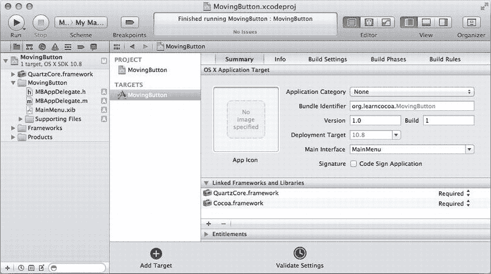

图 15-2. 向项目添加新框架

然后，在`MBAppDelegate.m`的顶部添加以下行：

```objc
#import <QuartzCore/QuartzCore.h>
```

现在，我们准备好了在我们自己的代码中引用 Core Animation 类。让我们从修改前面的示例开始，使用显式动画而不是隐式动画。为此，我们必须创建一个名为`CABasicAnimation`的 Core Animation 类实例，它可以动画显示任何可以动画化的`CALayer`属性之间的值。在我们的例子中，我们不是对`frame`进行动画处理，而是对图层的`position`属性进行动画处理。我们使用动画的`toValue`和`fromValue`属性显式设置位置的开始和结束位置。请注意，这些属性期望一个适当的对象，而不仅仅是像`NSPoint`这样的结构，因此我们必须将每个`NSPoint`值包装在一个`NSValue`实例中。创建动画后，我们将其与一个键一起添加到视图的图层中。这个键与我们正在动画化的属性无关，它仅用于以后可能需要标识此动画时提供帮助。最后，我们在视图对象本身上更改`frame`，因为动画仅影响视图图层的绘制。我们希望视图实际上也移动，因此我们必须手动设置其目标`frame`。以下是完成所有这些操作的代码：

```objc
- (IBAction)move:(id)sender {
    NSRect senderFrame = [sender frame];
    NSRect superBounds = [[sender superview] bounds];
    CABasicAnimation *a = [CABasicAnimation
                           animationWithKeyPath:@"position"];
    a.fromValue = [NSValue valueWithPoint:senderFrame.origin];
    senderFrame.origin.x = (superBounds.size.width -
        senderFrame.size.width)*drand48();
    senderFrame.origin.y = (superBounds.size.height -
        senderFrame.size.height)*drand48();
    a.toValue = [NSValue valueWithPoint:senderFrame.origin];
    [[sender layer] addAnimation:a forKey:@"position"];
    [[sender animator] setFrame:senderFrame];
    [sender setFrame:senderFrame];
}
```

请注意，我们还从此方法中删除了`[[sender animator] setFrame:senderFrame];`行，因为我们这次不希望触发隐式动画。在这一切生效之前，我们需要额外完成一步，而之前的隐式动画已经替我们完成了：为需要动画化的视图建立图层。
```


使用动画代理器自动实现了这一点，但现在我们必须为任何将要进行动画的视图（包括任何将要移动的视图的父视图）手动开启该功能。在我们的例子中，这意味着按钮的父视图（窗口的内容视图）需要被赋予一个图层，而该图层又会为其子视图层级（即按钮本身）建立图层。最简单的方法是回到`MainMenu.xib`，在窗口中选择按钮，然后打开*视图效果检查器*（8）。该检查器顶部有一个名为*核心动画图层*的章节，其中显示了一个视图对象列表（参见图 15-3）。

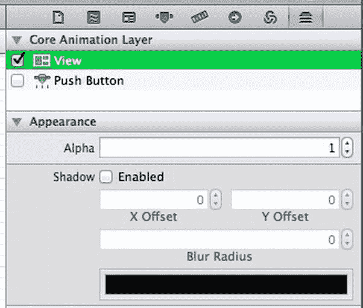
图 15-3. 建立动画图层

选中的对象（按钮）位于列表底部，而其所有父视图（本例中只有一个视图，即窗口的内容视图）则堆叠在其上方。点击复选框为该视图开启图层。我们可以让按钮的复选框保持未选中状态，因为其父视图会为它建立图层。

现在保存所有内容，运行应用程序，我们将看到与之前完全相同的行为。因此，这个新版本以增加几行代码为代价实现了相同的结果。目前看来这似乎算不上什么优势。但别急，还有更多功能！通过动画类（如`CABasicAnimation`）进行的显式动画，让我们能够完成几项隐式动画无法实现的关键操作。

首先，我们可以设置动画的持续时间。在将动画添加到图层（使用`[[sender layer] addAnimation:a forKey:@"position"]`）之前，添加以下代码行，以使此动画运行得稍慢一些：

```
a.duration = 1.0;
```

在代码就位的情况下*运行*，我们会看到按钮的过渡速度变慢了。我们还可以更改动画的节奏，使其不再严格按线性方式从一个点移动到下一个点。让我们将其设置为“缓入、缓出”运动，如下所示：

```
a.timingFunction = [CAMediaTimingFunction functionWithName:
                    kCAMediaTimingFunctionEaseInEaseOut];
```

*现在运行*，我们会看到，当我们点击按钮时，它开始缓慢移动，然后逐渐加速并移动得更快，最终在接近目标时减速。在底层，这些时序函数通过提供一个从 0.0 到 1.0 的值的简单映射来工作，使用一对控制点来描述两者之间的曲线。这听起来是不是很熟悉？这似乎正是我们在本章前半部分实现的曲线编辑控件的完美用途！我们可以使用曲线编辑器来定义每次点击按钮时将应用于按钮移动的时序。

首先，从之前的项目中添加`CECurveView`类文件。在*MovingButton*项目中，右键单击`MovingButton`文件夹，然后从上下文菜单中选择“将文件添加到“MovingButton””。导航到`CECurveView.h`和`CECurveView.m`的位置，选中它们，然后点击*添加*按钮。在出现的表单中，点击以打开“将项目复制到目标组的文件夹中”复选框，并确保在表单下部选中了*MovingButton*目标（参见图 15-4）。


图 15-4. 将现有文件添加到项目

这次，我们不为该控件设置绑定，而是在控制器定义中添加一个出口，以便能够访问我们将要设置的`CECurveView`。修改`MBAppDelegate.h`，在此添加粗体行：

```
#import <Cocoa/Cocoa.h>
@class CECurveView;

@interface MBAppDelegate : NSObject <NSApplicationDelegate>
@property (assign) IBOutlet NSWindow *window;
@property (weak) IBOutlet CECurveView *curveView;
- (IBAction)move:(id)sender;
@end
```

现在在 Interface Builder 画布中重新打开`MainMenu.xib`。我们将添加一个小的`NSPanel`，作为按钮动画的检查器。从*对象库*中拖出一个`NSPanel`，然后向新面板中拖入一个自定义视图。将自定义视图的大小调整为 100×100，并将其类更改为`CECurveView`。Interface Builder 中的 GUI 现在应该类似于图 15-5 所示。


图 15-5. 添加一个`CECurveView`以配置我们的动画

现在，将应用程序委托的`curveView`出口连接到我们刚刚创建的`CECurveView`实例，然后切换回`MBAppDelegate.m`文件。在应用程序委托实现文件的顶部某处导入`CECurveView`头文件，添加以下代码行：

```
#import "CECurveView.h"
```

按如下方式更新`move:`方法：

```
- (IBAction)move:(id)sender {
    NSRect senderFrame = [sender frame];
    NSRect superBounds = [[sender superview] bounds];
    CABasicAnimation *a = [CABasicAnimation
                          animationWithKeyPath:@"position"];
    a.fromValue = [NSValue valueWithPoint:senderFrame.origin];
    senderFrame.origin.x = (superBounds.size.width -
                            senderFrame.size.width)*drand48();
    senderFrame.origin.y = (superBounds.size.height -
                            senderFrame.size.height)*drand48();

    a.toValue = [NSValue valueWithPoint:senderFrame.origin];
    a.duration = 1.0;
    a.timingFunction = [CAMediaTimingFunction
                        functionWithControlPoints:self.curveView.cp1X
                        :self.curveView.cp1Y
                        :self.curveView.cp2X
                        :self.curveView.cp2Y];

    // add it to the layer
    [[sender layer] addAnimation:a forKey:@"position"];
    [sender setFrame:senderFrame];
}
```

现在，每次用户点击*Move*按钮时，生成的动画的时序函数将由`CECurveView`控件中的值决定。保存文件，运行应用程序，我们应该会看到这种情况发生。拖动控制柄以创建不同的曲线形状，点击*Move*按钮，看看它如何移动。

## 动画分组

我们现在已经初步了解了 Core Animation 的工作原理，但这是在一个让按钮在屏幕上随机移动的略显滑稽的背景下。这可不是我们推荐的 GUI 设计！在现实世界中，Core Animation 最常用于在不同视图之间制作过渡动画。你可能已经在 iPhone（Core Animation 最初为之构建的平台，之后才被“反向移植”到 Mac OS X）上反复看到过这种用法。iPhone 界面中所有平滑的滑动、缩放和淡入淡出效果都是通过 Core Animation 实现的。在 Mac OS X 中，Core Animation 虽然不那么无处不在，但在诸如日历的周过渡以及 Mission Control 中的屏幕过渡等地方得到了很好的应用。在本节中，我们将通过将动画组合在一起以使其同时运行，来了解如何实现一些不错的过渡效果。

在 Xcode 中，创建一个名为*FlipIt*的新 Cocoa 项目，类前缀为`FI`。我们要做的是呈现一个 GUI，用户可以在其中切换多个“页面”，而 Core Animation 将在它们之间进行流畅的动画。我们将在 nib 文件的空窗口中使用一个框来显示内容页面，这些页面本身将保存在一个`NSTabView`中。我们不会显示选项卡视图本身，只是将其用作内容页面的便捷容器。

我们首先在`MainMenu.xib`中布局视图，因此在 Interface Builder 画布中打开该文件。


从`Object Library`中拖拽一个按钮到 GUI 空白窗口的底部。然后复制该按钮，并将两个按钮分别命名为`Previous`和`Next`。将它们并排放置在窗口底部中央。在`FIAppDelegate.h`文件中打开一个`Assistant Editor`窗格。在接下来的步骤中，我们将使用此`Assistant Editor`进行连接。首先，从每个按钮按住 Control 键拖拽到`Assistant Editor`窗口，并创建名为`next`和`previous`的新操作，以匹配这两个按钮。最终结果应如图 Figure 15-6 所示。

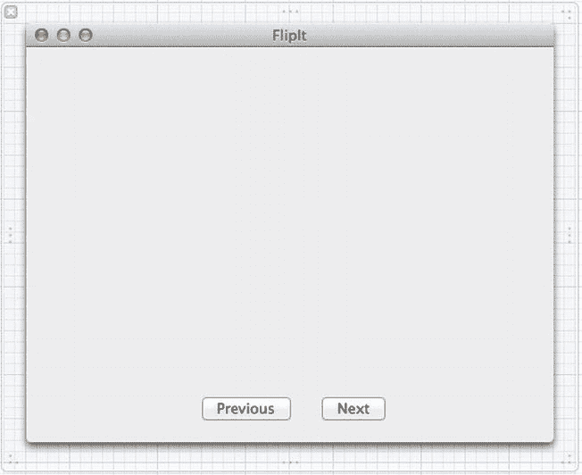

Figure 15-6. 准备窗口

现在从`Object Library`中找到一个`NSBox`，将其拖拽到空白窗口中，放置在按钮上方，并调整其大小以填充屏幕大部分区域。使用`Attributes Inspector`，通过将`Title Position`弹出菜单设置为`None`来移除盒子的标题（见图 Figure 15-7）。然后从盒子按住 Control 键拖拽到`Assistant Editor`中的`FIAppDelegate.h`代码，并创建一个名为`box`的新输出口，以便我们可以从类中访问该盒子。

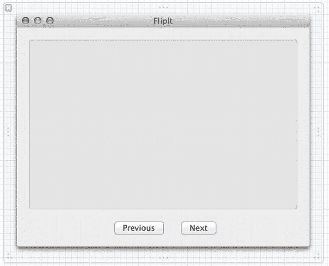

Figure 15-7. 显示窗口现已准备就绪

我们的下一步操作是设置一组视图，用于在主视图中切换进出。我们将为此使用`NSTabView`，因为它可以方便地在 Xcode 中构建一系列视图，并在应用程序运行时作为离屏视图列表进行维护。在`Object Library`中找到一个`NSTabView`，但将其一直拖拽到左侧，并放入`Object Dock`中，位于`App Delegate`和`Font Manager`对象下方。注意，选项卡视图会作为顶级图标出现在 nib 窗口中，与应用程序委托、窗口及其他项目并列（见图 Figure 15-8）。

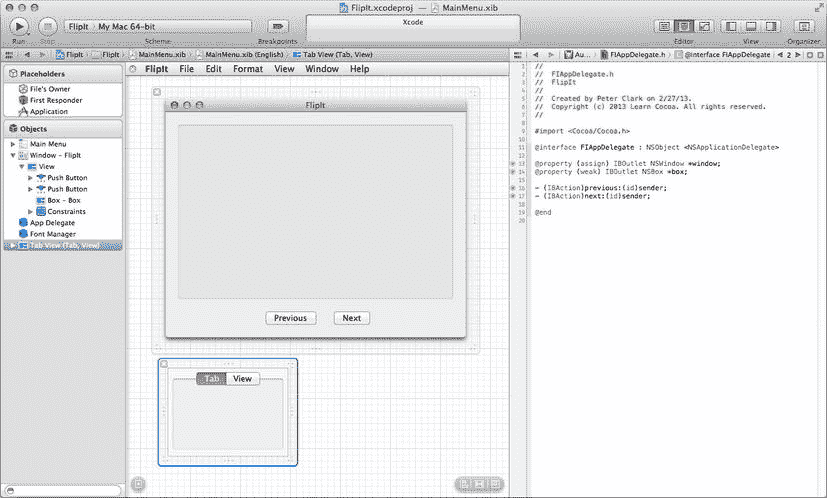

Figure 15-8. 这是一个不寻常的地方，但选项卡视图就在那里

放置在 nib 文件顶层的选项卡视图（或任何其他`NSView`子类）在加载 nib 时不会显示，但只要我们有一个指向它的输出口，就可以以任何方式访问和使用它，包括将其放入窗口的视图层级中。在我们的例子中，我们永远不会将选项卡视图本身显示出来，只显示它包含的内容视图。为了获取内容视图，我们需要将其连接到 App Delegate 类。从`Object Dock`中的选项卡视图按住 Control 键拖拽到`Assistant Editor`中的`FIAppDelegate.h`文件，并创建一个名为`tabView`的输出口，以便以后可以访问它。

双击`Object Dock`中的选项卡视图条目，可以看到选项卡视图在没有窗口的情况下显示，如 Figure 15-8 中 Interface Builder 画布的底部所示。它仍然带有调整大小的框架，我们可以像调整窗口大小一样在 Interface Builder 中调整其大小。现在调整它的大小，使其与之前放入主窗口的`NSBox`大小大致相同。

现在让我们向这个选项卡视图中放入一些内容，即我们可以翻动的“页面”。默认情况下，选项卡视图只包含两个内容视图，但让我们增加这个数量（使用`Attributes Inspector`），以便有更多视图可供切换。实际内容并不重要，只要每个页面有独特的元素，以便我们能够轻松看到内容从一页切换到下一页。一个好的开始是从`Object Library`中抓取一个标签，给它一个漂亮的大号字体，并将其文本更改为单词“One”。然后复制此标签并粘贴到每个其他视图中（我们可以像往常一样使用顶部的选项卡在这些视图之间切换），每次相应地更改文本。为了增加趣味性，还可以为每个页面添加一些独特的项目（此处为一个表格视图，彼处为一组按钮），这样应用程序完成后，在页面间切换时我们将看到更多动态效果。

现在是完善控制器类界面的时候了，因此我们将注意力转向`FIAppDelegate.h`文件。它当前声明了三个属性。第一个连接到主窗口。另外两个是我们为需要管理的两个视图添加的：`tabView`（包含我们将要显示的视图的对象）和`box`（屏幕上用于显示这些视图的视图）。我们需要添加五个额外的属性。其中三个是`weak`属性，用于指向正在主动切换进出的视图。我们还需要添加一个`strong`属性来引用包含所有可用视图的选项卡视图数组，以及一个`NSInteger`标量属性来标识当前聚焦的视图。

将以下加粗的行添加到`FIAppDelegate.h`中以添加所有这些内容。

```objectivec
@interface FIAppDelegate : NSObject <NSApplicationDelegate>

@property (assign) IBOutlet NSWindow *window;
@property (weak) IBOutlet NSBox *box;
@property (weak) IBOutlet NSTabView *tabView;

@property (weak) NSView *leftView;
@property (weak) NSView *rightView;
@property (weak) NSView *middleView;
@property (strong) NSArray *items;
@property NSInteger currentTabIndex;

- (IBAction)previous:(id)sender;
- (IBAction)next:(id)sender;

@end
```

现在让我们开始在`FIAppDelegate.m`中实现我们的应用程序委托类。这个类将包含许多方法，用于准备过渡：通过设置下一个视图显示在盒子的一侧、将新视图过渡到位置以及将当前视图过渡到另一侧。由于我们希望能够根据是向右还是向左翻转来进行双向过渡，因此每个方法都有两种形式：设置并执行向右翻转或向左翻转。此外，我们将实现两个启动过渡的操作方法，以及一个设置初始视图的启动方法（`applicationDidFinishLaunching:`）。如果您仍然同时打开了 Interface Builder 画布和 Assistant Editor，您可能希望关闭它们，并将`FIAppDelegate.m`作为 Xcode 中的主视图。

让我们首先创建一个预处理定义`ANIM_DURATION`，用于定义我们将要创建的动画的持续时间（以秒为单位）。通过将其放在文件顶部的一个位置，我们可以轻松地进行实验，调整此设置直到找到我们喜欢的速度。定义如下：

```objectivec
#define ANIM_DURATION 1.0
```

现在让我们继续实现`applicationDidFinishLaunching:`方法。在此方法中，我们从`tabView`获取视图列表，并将其存储在我们的`items`属性中。`items`属性需要是`strong`引用，因为`tabView`返回的是其内部数组的副本，而不是数组本身的引用。这意味着我们的代码现在拥有`tabViewItems`调用返回的`NSArray`的所有权。如果我们不将其放入`strong`引用中，则数组副本将没有任何强引用，并且在自动引用计数清理时会被释放。

我们还设置`currentTabIndex`指向数组的末尾，以便第一个项目能够对齐（稍后会详细介绍）。然后我们调用第一个内部方法`prepareRightSide`，该方法将设置下一个视图以显示在盒子的右侧。然后我们使用`ANIM_DURATION`值，用它来指定我们在当前动画上下文中创建的任何动画的持续时间。


然后我们调用另一个内部方法 `transitionInFromRight`，它会启动动画，将下一个视图移动到正确的位置。最后，我们将 `currentTabIndex` 设置为指向第零项（`items` 数组中的第一个对象）。

```
- (void)applicationDidFinishLaunching:(NSNotification *)aNotification {
    self.items = [self.tabView tabViewItems];
    self.currentTabIndex = [self.items count]-1;
    [self prepareRightSide];
    [[NSAnimationContext currentContext] setDuration:ANIM_DURATION];
    [self transitionInFromRight];
    self.currentTabIndex = 0;
    self.middleView = self.rightView;
}
```

当你输入这些代码时，Xcode 会抱怨找不到名为 `prepareRightSide` 和 `transitionInFromRight` 的方法。所以，我们现在就来编写这两个内部方法的代码。我们无需费心将这些方法放入单独的协议或其他东西中。在 Objective-C 中，代码可以自由调用同一 `@implementation` 块中声明的任何其他方法，即使这些方法没有在任何 `@interface` 中声明，因此我们只需将这些内部方法放在 `@implementation` 块中的某个位置——`applicationDidFinishLaunching:` 的实现下方就是一个好位置。

其中第一个方法 `prepareRightSide` 首先确定要显示的下一个视图的索引。我们通过将 `currentTabIndex` 加一，然后对新索引进行简单的边界检查来计算这个索引，如果索引过高则将其重置为零。然后我们使用该索引获取下一个视图，并将其 frame 设置为与 `box` 相同的大小，但向右偏移正好 `box` 的宽度，使其刚好不可见。我们将其 alpha 值设置为 `0.0`，使其实际上不可见，最后我们将该视图添加为 `box` 的子视图，这样它就能实际显示出来了。

```
- (void)prepareRightSide {
    NSInteger nextTabIndex = self.currentTabIndex + 1;
    if (nextTabIndex >= [self.items count])
        nextTabIndex = 0;

    self.rightView = [[self.items objectAtIndex:nextTabIndex] view];

    NSRect viewFrame = [self.box bounds];
    viewFrame.origin.x += viewFrame.size.width;

    [self.rightView setFrame:viewFrame];
    [self.rightView setAlphaValue:0.0];
    [self.box addSubview:self.rightView];
}
```

下一个方法 `transitionInFromRight` 会获取 `rightView` 并将其滑动到位，使其完美贴合 `box` 提供的空间。它还将 alpha 值设置为 `1.0`，使其完全不透明。请注意，与上一个方法不同，这里使用了 `rightView` 的 `animator` 方法来访问视图的动画代理，这样设置这些值就能为我们创建隐式动画。

```
- (void)transitionInFromRight {
    [[self.rightView animator] setFrame:[self.box bounds]];
    [[self.rightView animator] setAlphaValue:1.0];
}
```

在继续之前，我们先检查一下工作成果。运行应用程序，你会看到标签视图中的第一个项目滑动到位，并从不可见状态淡入到完全不透明状态，如图 15-9 所示。

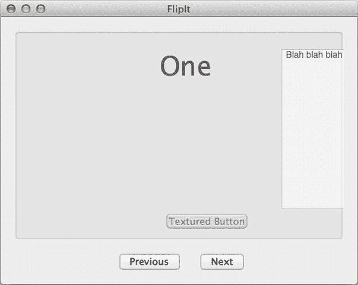  

图 15-9. 第一个“页面”正在滑入视野。请注意盒子中对象略显淡化的外观，此时它们都处于约 50% 的不透明度

这是一个开始！现在让我们继续列表中的下一项：为 `next:` 方法提供实现。这段代码的某些部分与我们在 `applicationDidFinishLaunching:` 方法中的代码类似。我们准备右侧，启动一些过渡（包括调用另一个新的内部方法 `transitionOutToLeft`，我们稍后会实现它），并在最后更新索引（包括另一次边界检查）和一些指针。

这里最大的不同在于，执行动画的方法都被夹在 `[NSAnimationContext beginGrouping]` 和 `[NSAnimationContext endGrouping]` 调用之间，这两个调用协同工作形成一种事务。在这两个调用之间，任何添加到默认动画上下文中的动画，包括所有隐式动画，都将被设置为同时运行。这意味着当我们在内部方法中创建隐式动画时，它们都会被设置为同时触发。如果没有这一步，我们创建的动画将按创建顺序一个接一个地顺序运行。通常情况下，这不会有太大区别，但完全有可能在创建这些动画时发生一些意外事件，例如另一个进程突然占用 CPU，这可能导致这些动画以轻微交错的方式运行，在开始和结束时间上出现差异。通过像这样将它们包装在一个分组中，就消除了这个潜在问题。

```
- (IBAction)next:(id)sender {
    [self prepareRightSide];

    [NSAnimationContext beginGrouping];
    [[NSAnimationContext currentContext] setDuration:ANIM_DURATION];
    [self transitionInFromRight];
    [self transitionOutToLeft];
    [NSAnimationContext endGrouping];

    self.currentTabIndex++;
    if (self.currentTabIndex >= [self.items count])
        self.currentTabIndex = 0;
    self.leftView = self.middleView;
    self.middleView = self.rightView;
}
```

`next:` 方法还调用了另一个内部方法 `transitionOutToLeft`，该方法会将当前视图向左移出。其实现如下所示：

```
- (void)transitionOutToLeft {
    NSRect newFrame = [self.middleView frame];
    newFrame.origin.x -= newFrame.size.width;
    [[self.middleView animator] setFrame:newFrame];
    [[self.middleView animator] setAlphaValue:0.0];
}
```

完成这些后，我们现在可以再次运行了。这次我们会看到，不仅初始视图设置正常工作，而且我们还可以点击 **Next** 按钮来过渡到下一个视图！非常流畅。见图 15-10。

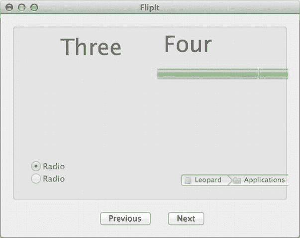  

图 15-10. 视图三正在退出，视图四几乎已经进入一半

现在剩下的就是为向右的过渡实现匹配的方法。这些方法与前面的方法都非常相似，此处直接给出，不再赘述，但有一点需要注意：你可能会想复制粘贴现有的方法，然后找出需要修改的地方，但一定要小心！有些差异很细微但却很重要。

```
- (void)prepareLeftSide {
    NSInteger previousTabIndex = self.currentTabIndex-1;
    if (previousTabIndex < 0)
        previousTabIndex = [self.items count]-1;

    self.leftView = [[self.items objectAtIndex:previousTabIndex] view];

    NSRect viewFrame = [self.box bounds];
    viewFrame.origin.x -= viewFrame.size.width;

    [self.leftView setFrame:viewFrame];
    [self.leftView setAlphaValue:0.0];
    [self.box addSubview:self.leftView];
}

- (void)transitionInFromLeft {
    [[self.leftView animator] setFrame:[self.box bounds]];
    [[self.leftView animator] setAlphaValue:1.0];
}

- (void)transitionOutToRight {
    NSRect newFrame = [self.middleView frame];
    newFrame.origin.x += [self.box bounds].size.width;
    [[self.middleView animator] setFrame:newFrame];
    [[self.middleView animator] setAlphaValue:0.0];
}

- (IBAction)previous:(id)sender {
    [self prepareLeftSide];

    [NSAnimationContext beginGrouping];
    [[NSAnimationContext currentContext] setDuration:ANIM_DURATION];
    [self transitionInFromLeft];
    [self transitionOutToRight];
    [NSAnimationContext endGrouping];

    self.currentTabIndex--;
    if (self.currentTabIndex < 0)
        self.currentTabIndex = [self.items count]-1;
    self.rightView = self.middleView;
    self.middleView = self.leftView;
}
```


`currentTabIndex = [self.items count]-1`;  
`self.rightView = self.middleView`;  
`self.middleView = self.leftView`;  

```
现在点击*运行*；我们应该能够实现双向转场动画了。
```

## 总结

希望前一章和本章为你打下了坚实的 Cocoa 绘图技术基础，包括贝塞尔曲线的多种用法、通过鼠标使视图可交互、以及利用 Core Animation 实现相当轻松的动画。本书的篇幅不允许我们深入探讨这些主题，但要知道，尤其是在图形和动画领域，唯一的限制就是你的想象力！我们提供了基本工具。如果你想在图形方面有更多作为，应该深入探索你最感兴趣的领域，看看你能用 Cocoa 提供的 API 实现什么。这才是真正的乐趣所在！

## 第 16 章

