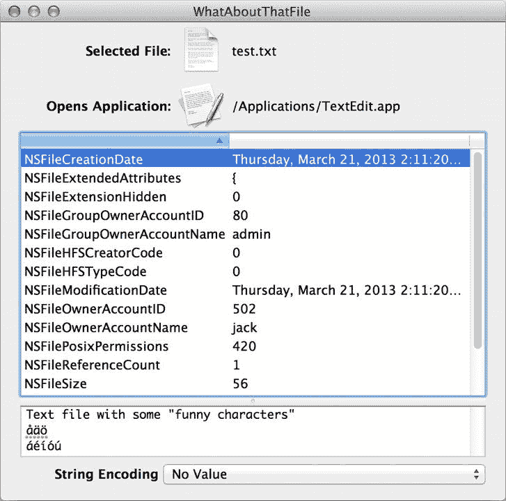
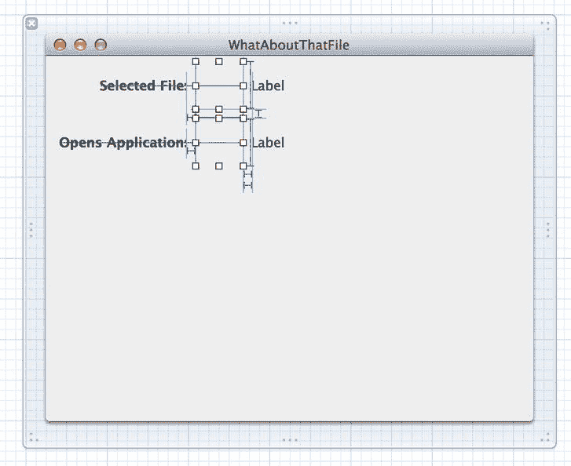
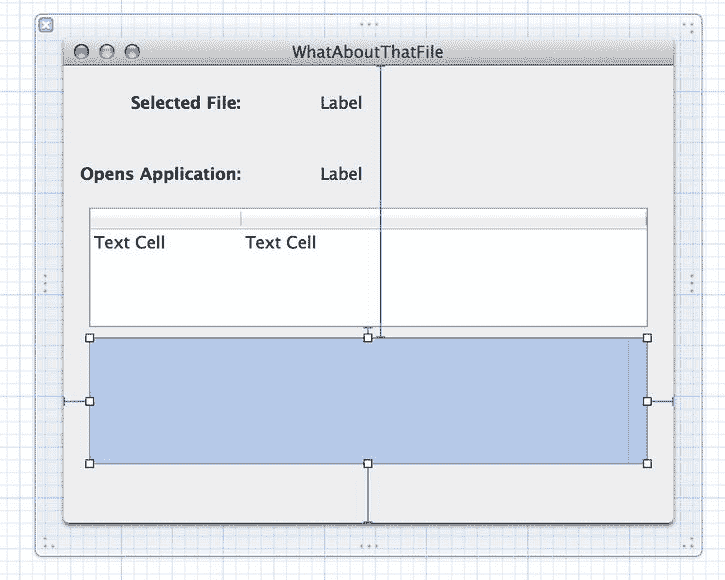
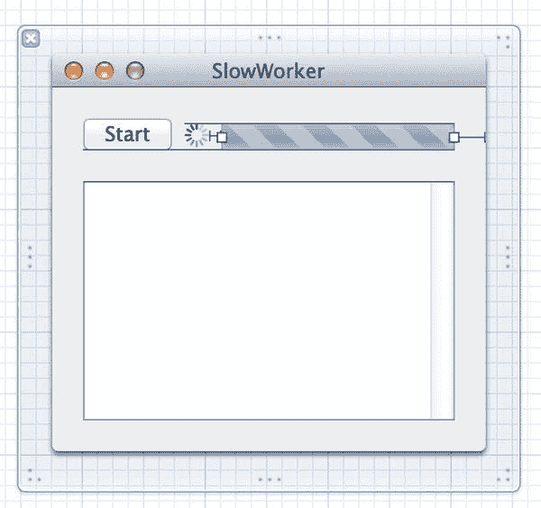

# 文件操作

大多数应用程序都需要以某种方式处理存储在磁盘上的文件。到目前为止，本书实际上并未深入探讨这个主题（除了对 Core Data 及其数据存储的一点讨论），所以现在让我们来弥补这个缺失。Cocoa 实际上包含几个非常有用的类，可以以多种方式处理文件。有些类提供的 API 模拟了用户在 Finder 中通常能执行的操作，另一些类则以抽象方式表示文件。还有一些类内置了读写文件的功能。本章将概述这些机制的工作原理。

### 隐式文件访问

Cocoa 中的几个类，例如 `NSString`、`NSData`、`NSArray` 和 `NSDictionary`，提供了直接从文件读取数据或将内容写入文件的方法，只需使用包含文件完整路径的字符串即可。例如，如果我们想将整个文件内容读入一个字符串，可以像这样简单地实现：

```
NSError *myError;
NSStringEncoding encoding;
NSString *myString = [NSString stringWithContentsOfFile:@"/path/to/something"
                      usedEncoding:&encoding error:&myError];
```

这段代码会自动处理打开文件并读取其内容的繁琐工作。它甚至能告诉我们解释文件内容为字符串时使用了哪种文本编码，并反馈发生的任何错误，但前提是我们为第二和第三个参数传入非`NULL`值。除了与文件相关的错误（例如访问权限不足）外，此方法还能报告与将数据处理为字符串相关的错误，例如当文件包含二进制数据时的文本编码错误。本章后面我们将看到它的实际应用。

`NSArray` 和 `NSDictionary` 有类似的方法，但由于某种原因，它们不包含 `NSString` 那样的错误报告机制，因此如果失败，它们只会返回一个 `nil` 指针，让你无从得知原因。这些方法也更具专用性，因为它们旨在从 Apple 专有的属性列表格式存储的文件中读取值。`NSDictionary` 的 `dictionaryWithContentsOfFile:` 类方法的一个常见用途是从文本编辑器或 Xcode 的 plist 编辑器中创建的配置文件中读取数据。Cocoa 还包含一个名为 `NSPropertyListSerialization` 的专用类来处理属性列表格式。如果我们需要以通用方式解析属性列表，并希望获得完整的错误报告和更多控制权，我们可以使用其类方法 `propertyListWithData:options:format:error:`。

在本节开头提到的类中，`NSData` 提供了最通用的文件访问方式。它可以读取磁盘上的任何类型的数据，并将其表示为字节数组供我们使用。这是处理二进制数据的理想方式。

`NSData` 甚至提供了一个选项，用于提示应将文件映射到虚拟内存中（以防我们已知文件非常大，不希望一次性全部加载到内存中），如下所示：

```
NSData *myData = [NSData dataWithContentsOfFile:@"/path/to/something"
                      options:NSDataReadingMappedIfSafe error: &myError];
```

这里提到的每个类都包含一个名为 `writeToFile:atomically:` 的方法，其第二个参数是一个 `BOOL` 值，指定是否应先将数据写入一个辅助文件，待所有数据写入完成后，再用该辅助文件替换原始文件。`NSString` 的这个方法版本实际上已被弃用，因此我们应该改用 `writeToFile:atomically:encoding:error:`，它强制我们指定要使用的文本编码，并让我们有机会检查可能发生的任何错误。`NSData` 提供了类似的 `writeToFile:options:error:`，它同样让我们可以在写入文件时查看发生的任何错误。

### 高级文件操作

除了基本的文件读写功能外，Cocoa 还提供了许多类，让我们能够以类似于 Finder 处理文件的方式来处理文件。我们可以访问文件系统属性、获取文件图标、查看默认打开此文件的应用程序等。本章的剩余部分将通过一个名为“关于那个文件？”的新应用程序（见图 16-1）来探讨其中一些功能。



图 16-1 . 完成的“关于那个文件？”应用程序

此应用程序允许用户选择一个文件，然后显示该文件的一些信息，以及以字符串形式显示的文件内容。如果文件包含无法表示为字符串的数据，它会告知用户。否则，用户可以使用一个包含的下拉列表来更改读取磁盘文件时使用的文本编码，并显示生成的字符串。

### “关于那个文件？”：代码实现

使用 Xcode 创建一个新的 Cocoa 应用程序（这次不启用文档支持或 Core Data），命名为 `WhatAboutThatFile`，并执行常规步骤，确保启用了 ARC 并为项目分配了一个类前缀，这里使用 `WAT`。这将创建一个简单的项目，仅包含一个 `WATAppDelegate` 类和一个名为 `MainMenu.xib` 的 xib 文件。在前面的章节中，我们一步步地构建应用程序，但现在我们已经走到了这一步，让我们来处理更大的应用程序代码块。我们将呈现应用程序的完整代码，并穿插一些注释，然后描述如何使用 Cocoa 绑定在 Interface Builder 中连接所有内容。首先，这是应用程序委托的头文件，它声明了大量用于通过 Cocoa 绑定访问值的属性。它还声明了一个动作方法，允许用户从菜单中打开一个文件。

```
//
//  WATAppDelegate.h
//

#import <Cocoa/Cocoa.h>

@interface WATAppDelegate : NSObject <NSApplicationDelegate>

@property (assign) IBOutlet NSWindow *window;

@property (strong) NSFileWrapper *fileWrapper;
@property (strong) NSURL *fileURL;
@property (assign) NSStringEncoding chosenEncoding;

@property (readonly) NSDictionary *fileAttributes;
@property (readonly) NSString *filename;
@property (readonly) NSImage *fileIcon;
@property (readonly) NSImage *opensAppIcon;
@property (readonly) NSString *opensAppName;
@property (weak) NSString *stringEncodingName;
@property (readonly) NSString *fileStringValue;
@property (readonly) NSDictionary *encodingNames;

- (IBAction)chooseFile:(id)sender;

@end
```

现在让我们转到 `.m` 文件。默认情况下，它包含 `applicationDidFinishLaunching:` 方法，但我们不需要在应用程序运行时配置任何东西，所以可以忽略它，继续我们自己的业务。


`chooseFile:` 方法使用 `NSOpenPanel` 类来让用户选择要检查的文件。如果用户确实选择了文件，我们会根据所选内容设置所有实例变量。`chosenEncoding` 属性类型为 `NSStringEncoding`（本质上就是一个无符号整数），被设置为 `0`。这不是一个有效的字符串编码类型，因此我们可以在后续阶段让系统尝试为我们推断字符串编码类型。之后，我们根据打开面板中的选择设置 `fileURL`，最后设置 `fileWrapper`，这是 `NSFileWrapper` 类的一个实例，它简单地封装了一个文件，并让我们根据 `fileURL` 的值获取一些关于它的元数据。如果所选文件存在问题，我们还包含了一些错误处理逻辑。

```objc
- (IBAction)chooseFile:(id)sender {
    NSOpenPanel *openPanel = [NSOpenPanel openPanel];
    [openPanel setCanChooseFiles:YES];
    [openPanel setCanChooseDirectories:NO];
    [openPanel setResolvesAliases:NO];
    [openPanel setAllowsMultipleSelection:NO];
    if ([openPanel runModal] == NSFileHandlingPanelOKButton) {
        self.chosenEncoding = 0;
        self.fileURL = [openPanel URL];
        NSError *fileError;
        self.fileWrapper = [[NSFileWrapper alloc] initWithURL:self.fileURL
                                                      options:0
                                                        error:&fileError];
        if (!self.fileWrapper) {
            NSRunAlertPanel(@"Couldn't access file",
                            [fileError localizedDescription], nil, nil, nil);
        }
    }
}
```

接着，我们有 `filename` 和 `fileIcon` 方法，这些方法将被窗口中最上层的 GUI 对象读取。请注意，这种读取是通过 Cocoa 绑定进行的，因此我们采用提供名为 `keyPathsForValuesAffectingFilename` 和 `keyPathsForValuesAffectingFileIcon` 的类方法的惯例，以确保对某个绑定友好值的更改会导致另一个值被重新获取。我们上一次使用这种技术是在 Core Data 模型类的上下文中，但它在这里同样适用，确保每当 `fileURL` 或 `fileWrapper` 值发生变化时，任何将其内容绑定到 `filename` 或 `fileIcon` 的视图都会自动重新加载其内容。`filename` 和 `fileIcon` 方法都使用先前创建的 `fileWrapper` 来访问要显示的值。

```objc
+ (NSSet *)keyPathsForValuesAffectingFilename {
    return [NSSet setWithObjects:@"fileURL", @"fileWrapper", nil];
}

- (NSString *)filename {
    return [self.fileWrapper filename];
}

+ (NSSet *)keyPathsForValuesAffectingFileIcon {
    return [NSSet setWithObjects:@"fileURL", @"fileWrapper", nil];
}

- (NSImage *)fileIcon {
    return [self.fileWrapper icon];
}
```

我们提供了类似的功能来显示关于应用程序的信息，该应用程序将在用户于 Finder 中双击所选文件时启动。这次，我们使用的是 `NSWorkspace` 类，它代表与 Finder 本身类似的东西。`NSWorkspace` 可以做很多事情，例如启动应用程序和操作文件。在 `opensAppName` 中，我们使用工作区来获取作为所选文件默认“打开程序”的应用程序名称。在 `opensAppIcon` 中，我们做同样的事情，然后向工作区请求该应用程序的图标。我们再次使用 `keyPathsForValuesAffectingXxx` 惯例来确保在选择新文件时这些值会被正确刷新。

```objc
+ (NSSet *)keyPathsForValuesAffectingOpensAppName {
    return [NSSet setWithObjects:@"fileURL", @"fileWrapper", nil];
}

- (NSString *)opensAppName {
    NSWorkspace *workspace = [NSWorkspace sharedWorkspace];
    NSString *appName = nil;
    [workspace getInfoForFile:self.fileURL.path application:&appName type:NULL];
    return appName;
}

+ (NSSet *)keyPathsForValuesAffectingOpensAppIcon {
    return [NSSet setWithObjects:@"fileURL", @"fileWrapper", nil];
}

- (NSImage *)opensAppIcon {
    NSWorkspace *workspace = [NSWorkspace sharedWorkspace];
    NSString *appName = nil;
    [workspace getInfoForFile:self.fileURL.path application:&appName type:NULL];
    return appName ? [workspace iconForFile:appName] : nil;
}
```

在接下来的代码片段中，`fileAttributes` 访问器返回一个字典，该字典来自 `fileWrapper`。这个字典包含十几个或多个文件系统属性，将通过使用 `NSDictionaryController` 在 GUI 的表格视图中显示。

```objc
+ (NSSet *)keyPathsForValuesAffectingFileAttributes {
    return [NSSet setWithObjects:@"fileURL", @"fileWrapper", nil];
}

- (NSDictionary *)fileAttributes {
    return [self.fileWrapper fileAttributes];
}
```

现在我们进入字符串编码这个稍微棘手的问题。如前所述，`NSString` 提供了从文件读取字符串并猜测应使用哪种字符串编码的功能。这在大多数情况下可能是正确的，但有时，可以说，通过另一套不同的镜片来查看字符串的内容可能会很有用。例如，看看一个现代的 UTF8 文档在某个其他平台上没有字符串编码概念且始终使用其唯一可用字符串编码的古老应用程序中会如何显示，可能会很有启发性。

我们首先定义 `encodingNames` 方法。此方法将为 GUI 中的弹出按钮提供所有系统定义的编码名称列表，并且还将作为内部查找机制，用于在编码名称与其代码级表示 `NSStringEncoding` 类型之间进行映射。作为键，此字典使用每个编码的数值，这些数值包装在 `NSString` 中。您可能会认为，考虑到这些值的数值性质，将它们包装在 `NSNumber` 对象中会更合理，如果不是因为一个小问题，您是对的：如果您在键值观察者上下文中使用 `NSDictionary`，例如 Cocoa 绑定，您*必须*使用字符串作为键！因为我们正在使用此字典通过 Cocoa 绑定填充一个对象，所以我们正在这样做。

```objc
- (NSDictionary *)encodingNames {
    static NSDictionary *encodingNames = nil;
    if (!
```


`encodingNames) {  
    encodingNames = @{@"1" : @"NSASCIIStringEncoding",  
                      @"2" : @"NSNEXTSTEPStringEncoding",  
                      @"3" : @"NSJapaneseEUCStringEncoding",  
                      @"4" : @"NSUTF8StringEncoding",  
                      @"5" : @"NSISOLatin1StringEncoding",  
                      @"6" : @"NSSymbolStringEncoding",  
                      @"7" : @"NSNonLossyASCIIStringEncoding",  
                      @"8" : @"NSShiftJISStringEncoding",  
                      @"9" : @"NSISOLatin2StringEncoding",  
                      @"10" : @"NSUnicodeStringEncoding",  
                      @"11" : @"NSWindowsCP1251StringEncoding",  
                      @"12" : @"NSWindowsCP1252StringEncoding",  
                      @"13" : @"NSWindowsCP1253StringEncoding",  
                      @"14" : @"NSWindowsCP1254StringEncoding",  
                      @"15" : @"NSWindowsCP1250StringEncoding",  
                      @"21" : @"NSISO2022JPStringEncoding",  
                      @"30" : @"NSMacOSRomanStringEncoding",  
                      @"2415919360" : @"NSUTF16BigEndianStringEncoding",  
                      @"2483028224" : @"NSUTF16LittleEndianStringEncoding",  
                      @"2348810496" : @"NSUTF32StringEncoding",  
                      @"2550137088" : @"NSUTF32BigEndianStringEncoding",  
                      @"2617245952" : @"NSUTF32LittleEndianStringEncoding"};  
    }  
    return encodingNames;  
}
```

接下来，我们继续处理字符串编码相关的工作，定义 `stringEncodingName` 的访问器，这次还会添加一个设置器（因为该值可通过弹出按钮进行设置）。和之前一样，我们实现 `keyPathsForValuesAffectingStringEncodingName`，并将 `chosenEncoding` 添加为需要监听的键之一。

`stringEncodingName` 方法有两条主要执行路径。如果 `chosenEncoding` 已经设置（即用户从弹出列表中选择了编码），我们就简单地从之前定义的字典中查找所选编码的名称。否则，就需要使用 `stringWithContentsOfFile:usedEncoding:error:` 实际读取文件内容，并利用得到的编码在字典中查找该编码的名称（如果未能发现任何编码，则返回简要的问题描述）。

`setStringEncodingName:` 方法相当简单。我们在字典中进行反向查找，找到与所选编码对应的键（一个包含编码整数值的字符串）。当用户在弹出菜单中选择编码名称时，会调用此方法。

```
+ (NSSet *)keyPathsForValuesAffectingStringEncodingName {  
    return [NSSet setWithObjects:@"fileURL", @"fileWrapper",  
            @"chosenEncoding", nil];  
}  

- (NSString *)stringEncodingName {  
    if (!self.fileURL) return nil;  
    if (self.chosenEncoding != 0) {  
        return [[self encodingNames] objectForKey:  
                @(self.chosenEncoding).stringValue];  
    } else {  
        NSStringEncoding encoding = 0;  
        NSError *err = nil;  
        [NSString stringWithContentsOfFile:self.fileURL.path  
                              usedEncoding:&encoding error:&err];  
        if (encoding==0) {  
            return @"No encoding detected.  Perhaps a binary file?";  
        }  
        return [[self encodingNames] objectForKey:  
                @(self.chosenEncoding).stringValue];  
    }  
}  

- (void)setStringEncodingName:(NSString *)name {  
    NSString *key = [[[self encodingNames] allKeysForObject:name]  
                     lastObject];  
    self.chosenEncoding = [key longLongValue];  
}
```

最后，是 `fileStringValue` 及其对应的 `keyPathsForValuesAffectingFileStringValue` 方法。这里同样有两条主要代码路径。第一种情况，当 `chosenEncoding` 已设置时，我们会尝试使用所选编码从指定文件中读取字符串值。

另一种情况，当未选择编码时，会尝试读取字符串值，但让系统自行判断使用哪种编码。无论哪种情况，我们都会进行一些错误检查，并在遇到特定字符串编码错误时显示一个警告面板。

```
+ (NSSet *)keyPathsForValuesAffectingFileStringValue {  
    return [NSSet setWithObjects:@"fileURL", @"fileWrapper",  
            @"chosenEncoding", nil];  
}  

- (NSString *)fileStringValue {  
    if (!self.fileURL) return nil;  
    NSError *err = nil;  
    NSString *value = nil;  
    if (self.chosenEncoding != 0) {  
        value = [NSString stringWithContentsOfFile:self.fileURL.path  
                                          encoding:self.chosenEncoding error:&err];  
    } else {  
        NSStringEncoding encoding = 0;  
        value = [NSString stringWithContentsOfFile:self.fileURL.path  
                                      usedEncoding:&encoding error:&err];  
    }  
    if (err)  {  
        if ([err code]==NSFileReadInapplicableStringEncodingError &&  
            [[err domain] isEqual:NSCocoaErrorDomain]) {  
            NSRunAlertPanel(@"Invalid string encoding",  
                            [err localizedDescription], nil, nil, nil);  
        }  
        NSLog(@"encountered error: %@", err);  
    }  
    return value;  
}
```

## 文件部分呢：GUI

代码部分就这些了。现在让我们设置图形用户界面（GUI）。打开 `MainMenu.xib`，我们需要先建立连接，以便菜单项可以调用我们应用程序委托的 `chooseFile:` 方法。打开主 Nib 编辑区域内的菜单，进入 *文件* 菜单，按住 Ctrl 键从 *打开* 项拖一条连接线到主 Nib 窗口中代表应用程序委托的图标上。然后从弹出的小菜单中选择 `chooseFile:`。

现在可以开始构建窗口本身了，双击坞中的窗口图标，使其显示在编辑区域中。这个 GUI 完全由 Cocoa 绑定（Cocoa Bindings）驱动。我们的控制器没有任何输出口指向此窗口中的任何对象，该窗口中的任何内容也不会调用我们控制器中的任何操作方法。我们将逐个介绍所有绑定，但首先，请查看 图 16-2，它展示了在 Interface Builder 中看到的完整窗口视图，所有对象均已选中。


图 16-2 .  我们所有的窗口组件，已高亮显示以便查看

请注意，在表格视图和大文本视图之间有一个小的“凹陷”。这实际上是 `NSSplitView` 的可拖拽控件，它允许我们将两个视图垂直或水平堆叠，并通过一次拖拽同时调整两者大小。这种控件在 Xcode 和其他地方经常使用，稍后我们将看到如何在此处进行设置。

现在，让我们开始一个部分、一个部分地创建这个窗口，并一路连接好所有绑定。前几个对象最终应该看起来像 图 16-3 所示，所以可以先往前看一下以获取一些指导。在窗口顶部附近，放置几个标签，并将左侧标签的标题改为“已选文件:”。然后在它们之间放置一个 `NSImageView`。要找到这个类，请在 *库* 中搜索“NSImageView”、“image well”或“image view”。通过选中左侧标签，然后从菜单中选择 **编辑**  **格式**  **字体**  **粗体**，使其文字以粗体显示，并将右侧的标签拉伸，使其几乎延伸到窗口的右边缘。我们希望由图像视图显示的文件图标看起来像是悬浮在窗口背景之上，因此选中该图像视图，并使用 *属性检查器*，在 *边框* 弹出菜单中选择 *无* 来移除其边框。


此外，还需将“缩放”弹出菜单改为“按比例放大或缩小”，这样一来，无论系统提供的是小图标还是大图标，它都会缩放以适应当前可用空间。此时的 GUI 应如图 16-3 所示。

 图 16-3. 用于显示所选文件图标和路径的 GUI。此截图已选中图像视图；否则它将不可见。

现在，是时候为图像视图和右侧标签设置绑定了。选中图像视图，打开*绑定检查器*，使用 `self.fileIcon` 键路径将其*值*绑定到应用委托。然后选中右侧的标签，使用 `self.filename` 键路径将其*值*绑定到应用委托。

窗口的下一个部分看起来就像我们之前创建的一样。实际上，添加这些对象最快的方法是通过拖拽一个框选中上述三个对象，按下 *D* 复制选中的对象，然后将新对象拖到下方，与之前的对象对齐。将新左侧标签的标题改为“打开应用：”，并在必要时调整其位置。图 16-4 展示了此效果。

 图 16-4. GUI 的这一部分将让我们看到文件将使用哪个应用打开。此处两个图像视图都显示出来了，否则，就像之前一样，它们会不可见。

重新配置新图像视图的绑定，使用 `self.opensAppIcon` 键路径将其*值*连接到应用委托，然后将右侧标签的*值*使用 `self.opensAppName` 键路径连接到应用委托。

接下来，我们继续处理表格视图。从库中拖出一个表格视图，并将其加宽以匹配图 16-5。

 图 16-5. 这里我们将显示文件的所有属性。

这个表格视图将包含系统提供给我们的所有文件属性。这些属性以字典形式提供，这正好是 Apple 的 `NSDictionaryController` 类的理想用途。使用 `NSDictionaryController`，我们只需通过 Cocoa 绑定进行连接，就能在表格视图中将所选文件的所有属性以键值对的形式显示出来。

在*库*中搜索 `NSDictionaryController`，并拖一个到 Interface Builder 的停靠栏中，以将其添加到 nib 文件中。然后点击停靠栏中其图标旁边的文本，将其重命名为 `attrDict`，以便稍后绑定时能轻松识别。与其他包含的控制器类一样，字典控制器类能够通过绑定获取其内容。使用*绑定检查器*将其*内容字典*（位于*控制器内容*组中）绑定到应用委托的 `self.fileAttributes` 键路径。

现在，我们只需将表格视图的列绑定到新的控制器。选中左列，使用*绑定检查器*将其*值*列绑定到 `attrDict`，使用 `arrangedObjects` 作为控制器键，`key` 作为键路径。这将使左列显示字典中每个键值对的键。现在选中右列，将其*值*列绑定到 `attrDict`，使用 `arrangedObjects` 作为*控制器键*，`value` 作为*模型键路径*。

接下来，从*库*中抓取一个 `NSTextView` 并将其拖入我们正在创建的窗口中，放置在靠近底部的位置。我们的窗口开始显得有些拥挤了！减小表格视图和文本视图的高度，使它们能够舒适地上下排列，并在下方留出相当大的空间，因为我们后面会用到。

然后调整文本视图的大小，使其宽度与表格视图相同。所有这些都显示在图 16-6 中。

 图 16-6. 将文本视图正确放置在表格视图下方后，窗口应呈现的样子。

当我们从*库*中拖出一个文本视图时，它实际上包含在一个滚动视图中，因此需要额外点击一次以选中滚动视图内部的文本视图。然后使用*属性检查器*取消选中*可编辑*复选框（我们只想在此处显示文件内容，而非编辑它）以及*富文本*复选框。现在是引入 `NSSplitView` 的好时机，正如之前所暗示的那样。确保表格视图和文本视图（实际上是包含它的滚动视图）大小大致相同，并上下对齐。然后同时选中它们，从菜单中选择**编辑器**  **嵌入于**  **分割视图**。这样做会将它们紧密排列，并在它们之间绘制一个小小的凹痕。

现在再次仅选中文本视图。请记住，我们可以通过按住 Shift-Ctrl 点击文本视图，然后从显示的对象堆栈中选择文本视图，来避免在视图层次结构中选中正确对象时的歧义和额外步骤。切换到*绑定检查器*，将文本视图的*值*绑定到应用委托的 `self.fileStringValue` 键路径。

最后，我们为字符串编码列表提供一个 GUI，用于重新解释所选文件的内容。为此，我们需要从库中获取一个标签和一个弹出按钮。按照显示的方式布局它们，包括超宽的弹出按钮，因为列表中的一些条目会非常长（参见图 16-7）。

 图 16-7. 说真的，谁不希望自己的弹出按钮足够宽，能完整显示“NSUTF32LittleEndianStringEncoding”呢？

弹出按钮列表的值将从应用委托的 `encodingNames` 方法中获取，因此我们无需在 Interface Builder 中输入它们。这里我们将再次使用 `NSDictionaryController`，这次只显示 `encodingNames` 字典中的值。为此，我们需要先从*库*中拖拽另一个 `NSDictionaryController` 到 nib 窗口，同时将其重命名为 `strEncs`，并将其*内容字典*绑定到应用委托的 `self.encodingNames` 键路径。然后，将弹出按钮的*内容*绑定到 `strEncs`，使用 `arrangedObjects` 作为*控制器键*，`value` 作为*模型键路径*。

最后，我们需要建立一个绑定，以便应用委托能够感知用户在弹出按钮中设置的值，从而让应用委托使用所选编码重新显示文本。通过将弹出按钮的“选定对象”绑定到应用委托，并使用 `self.stringEncodingName` 作为键路径来实现这一点。

现在保存所有更改，并**构建并运行**应用程序。我们应该能看到我们构建的 GUI，包括一个**文件**  **打开**菜单项，它允许我们选择一个文件，并显示文件的属性及其内容。从弹出列表中选择另一种编码将使应用使用所选编码在文本视图中重新显示数据。

## 总结

在本章中，我们了解了如何使用 Cocoa 访问文件及其元数据。我们还学习了一些关于字符串编码的知识，以及 Cocoa 如何处理它们。更重要的是，我们看到了另一个由 Cocoa 绑定驱动的 GUI 示例。除了打开文件的菜单项外，这里发生的一切都通过绑定完成，包括在弹出列表中设置一个值，这最终会导致文本字段重新加载内容。


# 第 17 章 并发

这是一个相当复杂的交互过程，在你适应之前，由于 Cocoa 绑定在幕后完成部分工作，它的运行方式并不直观。如果你对它的工作原理不太理解，不妨重新阅读本章，看看是否能更接近"恍然大悟"的临界点。否则，请继续阅读下一章，学习如何使用并发让我们的应用程序响应更迅速。

软件开发中最大的挑战之一，就是编写能够同时处理多项任务的软件。几十年来，计算机通过高速切换任务制造出并发的假象，让人以为它们能同时处理多件事情（实际上它们只是在任务间快速切换，一次只"关注"一个任务）。如今，计算机通常包含两个或更多计算核心，因此它们确实能够同时执行多项任务——在所有核心上同时执行指令。

然而，即使计算机硬件和操作系统能够支持多核心工作，编写能有效利用多核心的应用软件在技术上仍具挑战性。在大多数开发环境中，默认假设代码是顺序执行的（一个接一个操作），而分解任务以实现并发执行往往是一项艰巨的工作。

本章将举例说明 Cocoa 应用常见的受益于并发的情况，并演示具体实现方法。你一定见过 OS X 中那个旋转的光标（有时被称为"死亡的沙滩球"），它会在应用无法响应用户操作时出现。通常，当我们点击某个按钮或菜单项触发耗时超过几秒的处理时，这个光标就会出现。OS X 检测到进程未处理输入事件，便会显示旋转光标提醒用户。当应用完全停止响应用户操作并濒临崩溃（或被用户强制退出）时，也会出现这种情况。因此，当应用停止响应并显示旋转光标时，许多用户的直接反应是恐慌——他们怀疑应用即将崩溃！

所以，为了用户也为了我们自己，必须确保应用中任何长时间运行的操作都能以不影响用户交互的方式处理——即让操作在后台执行，同时应用照常处理用户输入事件。本章将演示如何用最省事的方式为 Cocoa 应用添加此类并发功能。我们将使用 Foundation 框架中的`NSOperation`和`NSOperationQueue`类，还会学习如何通过 Grand Central Dispatch（以下简称 GCD）实现，这是所有 OS X 应用（无论是否基于 Cocoa）都能使用的 C 语言 API。

## SlowWorker

作为演示这些并发选项的平台，我们将创建一个名为 SlowWorker 的简单应用，模拟从服务器获取数据并执行计算等长时间运行的操作。该应用提供一个按钮让用户启动任务，并在文本视图中显示结果（见图 17-1）。


图 17-1 SlowWorker 在运行中（还是静止中？）

首先，在 Xcode 中新建一个 Cocoa 应用。命名为 SlowWorker，使用`SW`作为类前缀。无需 Core Data 或文档支持。完成这些后，在*SWAppDelegate.h*中添加以下粗体代码：

```objc
#import <Cocoa/Cocoa.h>

@interface SWAppDelegate : NSObject <NSApplicationDelegate>

@property (assign) IBOutlet NSWindow *window;
@property (weak) IBOutlet NSButton *startButton;
@property (assign) IBOutlet NSTextView *resultsTextView;
@property (assign) BOOL isWorking;

- (IBAction)doWork:(id)sender;

@end
```

这定义了 GUI 中两个可见对象的输出口、一个名为`isWorking`的布尔标志（稍后用于跟踪后台是否有任务执行），以及一个由按钮触发的操作方法。

**注意** 眼尖的读者会发现`resultsTextView`属性用`assign`而非`weak`声明。这是因为`NSTextView`禁止在弱引用上下文中使用，就像第 11 章讨论的`NSWindow`一样。OS X 中具有此限制的类并不多，但有一点可以放心：当你尝试对不支持的类使用`weak`时，Xcode 会给出令人困惑的"禁止合成 weak 不可用属性"的提示。这就是向后兼容的代价。

现在，将以下代码块中的粗体方法添加到*SWAppDelegate.m*中：

```objc
#import "SWAppDelegate.h"

@implementation SWAppDelegate

- (void)applicationDidFinishLaunching:(NSNotification *)aNotification {
    // 在此处插入初始化应用代码
}

- (NSString *)fetchSomethingFromServer {
    sleep(1);
    return @"你好";
}

- (NSString *)processData:(NSString *)data {
    sleep(2);
    return [data uppercaseString];
}

- (NSString *)calculateFirstResult:(NSString *)data {
    sleep(3);
    return [NSString stringWithFormat:@"字符数: %ld",
            [data length]];
}

- (NSString *)calculateSecondResult:(NSString *)data {
    sleep(4);
    return [data stringByReplacingOccurrencesOfString:@"E"
                                          withString:@"e"];
}

- (IBAction)doWork:(id)sender {
    NSDate *startTime = [NSDate date];
    
    NSString *fetchedData;
    NSString *processed;
    NSString *firstResult;
    NSString *secondResult;

    self.isWorking = YES;

    fetchedData = [self fetchSomethingFromServer];
    _resultsTextView.string = [_resultsTextView.string stringByAppendingFormat:
                               @"已获取: %@\n", fetchedData];
    
    processed = [self processData:fetchedData];
    _resultsTextView.string = [_resultsTextView.string stringByAppendingFormat:
                               @"已处理: %@\n", processed];
    
    firstResult = [self calculateFirstResult:processed];
    secondResult = [self calculateSecondResult:processed];
    _resultsTextView.string = [_resultsTextView.string stringByAppendingFormat:
                               @"第一结果: [%@]\n 第二结果: [%@]\n\n",
                               firstResult, secondResult];

    NSDate *endTime = [NSDate date];
    NSLog(@"耗时 %f 秒完成",
          [endTime timeIntervalSinceDate:startTime]);
    self.isWorking = NO;
}

@end
```

注意，该类的工作被拆分为多个小模块。这些代码仅用于模拟缓慢操作，实际上这些方法本身并不耗时。为了让效果更明显，每个方法都调用了`sleep()`函数，使程序（具体来说是调用该函数的线程）在指定秒数内暂停且不执行任何操作。`doWork:`方法还在开头和结尾包含计算总耗时的代码。

现在，打开*MainMenu.xib*，在空白窗口中放置一个`NSButton`和一个`NSTextView`，布局如图 17-1 所示。将应用代理的两个输出口连接到相关控件，并将按钮的动作连接到应用代理的`doWork:`方法。


接下来，我们对 `NSTextView` 稍作配置，从视图中删除示例文本，并在*属性检查器*中取消勾选*可编辑*复选框。现在保存工作，然后在 Xcode 中点击**运行**。应用程序应该会启动，点击按钮后，它大约会运行十秒钟（所有睡眠时间的总和），然后显示结果。大约五六秒后，鼠标光标会变成旋转磁盘光标，并一直保持这种状态，直到工作完成。我们放在窗口中的 `NSTextView` 会一直保持空白直到最后，尽管我们的代码偶尔会尝试更新其内容，因为需要重新绘制显示的主线程 “卡住” 了，正在执行我们所有的后台处理。此外，在整个过程中，应用程序的菜单以及窗口控件都毫无响应。实际上，除了通过 Mac OS X 的*强制退出*窗口来杀死它之外，我们唯一能与应用程序交互的方式就是移动它的窗口，因为操作系统本身会处理这个操作。这正是我们想要避免的状况！在这个特定例子中，情况还不算太糟，因为应用程序似乎只挂起了几秒钟。然而，如果你的应用经常以这种方式出现“沙滩球”现象且持续时间更长，那么你将面临一些不满的用户——甚至可能成为前用户！

## 线程基础

在我们开始实现解决方案之前，先来回顾一下并发处理中的一些基础知识。这远非对 OS X 线程或一般线程的完整描述。要了解完整信息，你需要查阅其他资料。我们只想解释足够的内容，让你理解本章中我们将要做的事情。

在大多数现代操作系统中（当然包括 OS X），除了包含存储在磁盘上的程序运行实例的“进程”这个概念之外，还有“执行线程”这个概念。每个进程可以包含多个同时运行的线程。如果只有一个处理器核心，操作系统会在执行多个线程之间进行切换，就像它在执行多个进程之间进行切换一样。如果有多个可用核心，线程会像进程一样被分配到各个核心上。

一个进程中的所有线程共享相同的可执行程序代码和相同的全局数据。每个线程也可以拥有一些专属于该线程的数据。线程可以利用一种称为 *mutex*（互斥锁的简称）或锁的特殊结构，它可以确保特定的代码块不会被多个线程同时运行。当多个线程同时访问同一数据时，这在确保正确结果方面非常有用：当一个线程正在更新某个值（在所谓的代码“临界区”内）时，它会锁定其他线程。例如，假设我们的应用程序实现了一个银行系统，其中账户余额可以作为交易的一部分进行修改。在多线程系统中，我们需要保护对账户余额进行加减操作的代码段，以消除两个线程同时修改它的可能性。否则，两个线程可能会几乎同时读取旧余额，然后两个线程又各自写回它们自己计算出的新余额，对另一个线程试图做出的更改毫不知情，从而导致最终状态不正确；最后设置值的线程是“赢家”，而另一个线程对余额的更改就这样丢失了。

处理线程时的一个常见问题就是代码的*线程安全性*。有些软件库在编写时就考虑了并发性，它们的所有临界区都用互斥锁进行了恰当的保护。而有些代码库则没有。例如，在 Cocoa 中，AppKit 框架（包含专门用于构建 GUI 应用程序的类，如 `NSApplication`、`NSView` 及其所有子类等）在很大程度上就*不是*线程安全的。

这意味着，在运行中的 Cocoa 应用程序里，所有涉及任何 AppKit 对象的方法调用都应该在同一个线程内执行，这个线程通常被称为主线程。如果我们从另一个线程访问 AppKit 对象，一切都无法保证；我们很可能会遇到看似无法解释的 bug。默认情况下，我们 Cocoa 应用程序的所有操作（例如处理由用户事件触发的操作）都发生在主线程上，因此对于简单的应用程序，我们无需担心这一点。用户触发的操作方法已经在主线程中运行。到本书目前这个阶段，我们的代码一直在主线程上运行，但这种状况即将改变。

## 工作单元

刚才描述的线程模型的问题在于，对于普通程序员来说，编写无错误的多线程代码几乎是不可能的。这并非是对我们行业或普通程序员能力的批评；这只是一种观察结果。在跨多个线程同步数据和操作时，我们必须在代码中考虑到的复杂交互对于大多数人来说实在是难以应付。想象一下，只有 5% 的人有能力编写软件。而这 5% 中只有一小部分人真正有能力承担编写重量级多线程应用程序的任务。即使是成功做到过的人，也常常会建议其他人不要效仿他们的做法！

幸运的是，希望并未完全破灭。我们可以在不进行太多底层线程操作的情况下实现一些并发处理。就像我们能够不直接往显存中写入比特位就在屏幕上显示数据，以及不直接与磁盘控制器交互就能从磁盘读取数据一样，存在一些软件抽象，可以让我们在多个线程上运行代码，而无需我们直接对线程做太多工作。Apple 鼓励我们使用的解决方案，其核心思想是将长时间运行的任务拆分成工作单元，并将这些单元放入队列中执行。系统为我们管理这些队列，并在多个线程上执行工作单元。我们不需要直接启动和管理后台线程，并且从通常涉及实现并发应用程序的许多“簿记”工作中解放出来。系统会为我们处理这些。

## 操作队列

自 OS X 10.5 发布以来，Apple 为我们提供了两个类：`NSOperation` 和 `NSOperationQueue`，它们协同工作以提供操作队列。其思路是将我们的计算任务分解成块或工作单元，将每个单元封装到一个 `NSOperation` 中，然后将每个操作放入一个 `NSOperationQueue`。我们还可以建立操作间的依赖关系，指定一个操作在另一个操作完成之前不会开始执行。然后 `NSOperationQueue` 会尽其所能地处理这些单元，它会使用操作添加到队列的顺序以及我们指定的依赖关系来决定其执行计划。如果我们指定的依赖关系允许某些操作同时执行，并且有足够多的可用核心来运行它们，那么操作队列将使用多个线程来同时执行多个操作。

## 成为块专家

使用 Apple 的并发 API（无论是通过 `NSOperationQueue` 还是 GCD）最直接的方法之一就是使用块（blocks）。块最初随 GCD 一起发布，是 Apple 添加到 C 语言本身（并由此扩展到 Objective-C 和 C++）的一些新语法。这种新的语言特性，在其他一些语言中也被称为*闭包*，对于充分利用 GCD 至关重要。块背后的思想是让特定的代码块能够像任何其他 C 语言类型一样被处理。


代码块（block）可以赋值给变量、作为参数传递给函数或方法，并且通常可以像其他 Objective-C 对象一样被处理。与 C 语言中其他大多数类型不同，代码块还可以被执行。我们可以在一个对象中创建代码块，然后将其传递给另一个对象，让它在之后执行。通过这种方式，代码块可以作为 Objective-C 中委托模式或 C 语言中回调函数的替代方案。

与方法或函数非常相似，代码块可以接受一个或多个参数，并指定一个返回值。为了声明一个代码块变量，我们使用脱字符（`^`）符号，并配合一些额外的括号来声明参数和返回类型。定义代码块本身时，做法大致相同，但随后需要用花括号包裹定义代码块的实际代码。以下是一些相关的示例：

```
// 声明一个名为 "loggerBlock" 的代码块变量，无参数，无返回值。
void (^loggerBlock)(void);

// 将代码块赋值给上面声明的变量。像这样无参数且无返回值的代码块，
// 不需要像前面变量声明中使用 void 那样的“修饰”。
loggerBlock = ^{
    NSLog(@"我很庆幸他们没有把它叫做闭包");
};

// 执行代码块，就像调用函数一样。
loggerBlock();  // 这会在控制台产生一些输出
```

如果你做过很多 C 语言编程，可能会认识到这类似于 C 语言中的函数指针概念。然而，两者有几个关键的区别。也许最大的区别在于，代码块可以在函数或方法体内内联定义。我们可以在代码块将要赋值给变量、或者传递给另一个方法或函数的地方直接定义它。

另一个重要区别是，代码块可以访问其创建所在作用域内的变量。默认情况下，代码块会以只读方式复制我们以这种方式访问的任何变量，保持原始变量不变。同时，它会自动增加从周围作用域使用的任何 Objective-C 对象的引用计数，并在代码块执行完毕后再次减少引用计数。但是，我们可以通过在任何外部变量的声明前加上 `__block`，使其变成可读写的。

```
// 定义一个可以被代码块修改的变量
__block int a = 0;

// 定义一个试图修改其作用域中变量的代码块
void (^sillyBlock)(void) = ^{
    a = 47;
};

// 在调用代码块前检查我们的变量值
NSLog(@"a == %d", a); // 输出 "a == 0"

// 执行代码块
sillyBlock();

// 在调用代码块后再次检查我们的变量值
NSLog(@"a == %d", a); // 输出 "a == 47"
```

如前所述，代码块在与 GCD 一起使用时才能真正大放异彩。GCD 包含一组函数，这些函数可以完成与 `NSOperation` 和 `NSOperationQueue` 类似的事情，但采取了不同的方式。主要区别在于，我们不是显式创建一堆操作、可选地声明操作间依赖关系、然后将操作添加到队列中，而是使用 GCD 调用一个函数，该函数接收一个代码块并将其添加到队列中，一步到位。我们稍后会讨论这个，但首先，我们将展示如何使用操作队列来处理并发。

## 激活 SlowWorker

为了了解操作队列的工作原理，让我们在 SlowWorker 中对它们进行测试。在开始之前，先复制包含 SlowWorker 项目的整个文件夹。在本章后面，我们将使用原始版本的 SlowWorker 作为另一种实现并发方式的起点，所以请保留一份副本。

回想一下，这个应用的问题在于，单一的 action 方法顺序调用了几个其他方法，这导致的总耗时足以让应用感觉停止响应。

我们要做的是，将其他每个方法放入一个操作中，将所有操作放入一个队列，然后让队列自行处理。

`doWork:` 方法是我们将要进行所有修改的地方。首先，我们给所有本地的 `NSString` 变量加上 `__block` 存储限定符。然后，我们将每一小段工作封装在一个代码块内，声明一些依赖关系以确保它们按正确顺序执行，然后将它们交给一个新的队列去执行。请看一下此处加粗的行（当然，也请将它们添加到我们的方法中），然后我们再稍微详细地讨论细节：

```
- (IBAction)doWork:(id)sender {
    NSDate *startTime = [NSDate date];
    
    __block NSString *fetchedData;
    __block NSString *processed;
    __block NSString *firstResult;
    __block NSString *secondResult;
    
    self.isWorking = YES;

    NSBlockOperation *fetch = [NSBlockOperation blockOperationWithBlock:^{
        fetchedData = [self fetchSomethingFromServer];
        _resultsTextView.string = [_resultsTextView.string stringByAppendingFormat:
                                   @"已获取: %@\n", fetchedData];
    }];
    
    NSBlockOperation *process = [NSBlockOperation blockOperationWithBlock:^{
        processed = [self processData:fetchedData];
        _resultsTextView.string = [_resultsTextView.string stringByAppendingFormat:
                                   @"已处理: %@\n", processed];
    }];
    
    NSBlockOperation *calcFirst = [NSBlockOperation blockOperationWithBlock:^{
        firstResult = [self calculateFirstResult:processed];
    }];
    
    NSBlockOperation *calcSecond = [NSBlockOperation blockOperationWithBlock:^{
        secondResult = [self calculateSecondResult:processed];
    }];
    NSBlockOperation *showResults = [NSBlockOperation blockOperationWithBlock:^{
        _resultsTextView.string = [_resultsTextView.string stringByAppendingFormat:
                                   @"第一个结果: [%@]\n 第二个结果: [%@]\n\n",
                                   firstResult, secondResult];

        NSDate *endTime = [NSDate date];
        NSLog(@"在 %f 秒内完成",
              [endTime timeIntervalSinceDate:startTime]);
              self.isWorking = YES;

    }];
    
    [process addDependency:fetch];
    [calcFirst addDependency:process];
    [calcSecond addDependency:process];
    [showResults addDependency:calcFirst];
    [showResults addDependency:calcSecond];
    
    NSOperationQueue *queue = [[NSOperationQueue alloc] init];

    [queue addOperations:@[fetch, process, calcFirst, calcSecond, showResults]
       waitUntilFinished:NO];
}
```

我们做的第一件事是给一些局部变量添加 `__block` 存储限定符。这样，每个 `NSString` 指针仍然是单一的、唯一的指针，每个代码块都可以对其进行读取和写入。在此上下文中，“写入”意味着将指针赋值以指向一个不同的对象。没有 `__block`，每个代码块都会获得自己的新指针，并且所有指针都指向同一个初始对象，而且没有一个是可写的！所以 `__block` 为我们提供了一种在代码块之间共享数据的方式。

接下来，我们创建一些操作。现在不是简单地直接执行每个工作方法，而是为每个方法创建一个 `NSBlockOperation`。`NSBlockOperation` 只是 `NSOperation` 的一个类，设计用于从一个代码块创建。

然后我们定义这些操作之间的一组依赖关系，这样 `process` 仅在 `fetch` 完成后才执行，`calcFirst` 和 `calcSecond` 仅在 `process` 完成后才执行，而 `showResults` 仅在所有其他操作完成后才执行。

最后，我们创建一个新的 `NSOperationQueue`，并将包含我们所有操作的数组传递给它。队列会查看这些操作之间的所有依赖关系，并确定如何以正确的顺序执行它们。

## 要求主线程

然而，我们还没有完全准备好。


## 排版后的文档

请记住，AppKit 类（例如所有窗口和视图类）通常不是线程安全的。对它们的所有访问应仅在主线程上执行。但目前，我们正在从多个操作中访问 `NSTextView`。很可能，其中一些操作在时机成熟时会在其他线程上运行！即使在这个简单的测试应用中可能“可行”，但这并不是一个真正安全的基础。我们需要调整每个操作，以确保对 `NSTextView` 的所有访问都发生在主线程上。

为此，我们将把每次这样的访问包裹在另一个 block 中，这个 block 将直接传递给一个特殊的队列，该队列始终在主线程上运行其操作。这里的粗体代码显示了我们需对 `doWork:` 方法所做的最终修改：

```
- (IBAction)doWork:(id)sender {
    NSDate *startTime = [NSDate date];

    __block NSString *fetchedData;
    __block NSString *processed;
    __block NSString *firstResult;
    __block NSString *secondResult;

    self.isWorking = YES;

    NSBlockOperation *fetch = [NSBlockOperation blockOperationWithBlock:^{
        fetchedData = [self fetchSomethingFromServer];
        [[NSOperationQueue mainQueue] addOperationWithBlock:^{
            _resultsTextView.string = [_resultsTextView.string stringByAppendingFormat:
                                       @"Fetched: %@\n", fetchedData];
        }];
    }];

    NSBlockOperation *process = [NSBlockOperation blockOperationWithBlock:^{
        processed = [self processData:fetchedData];
        [[NSOperationQueue mainQueue] addOperationWithBlock:^{
            _resultsTextView.string = [_resultsTextView.string stringByAppendingFormat:
                                       @"Processed: %@\n", processed];
        }];
    }];

    NSBlockOperation *calcFirst = [NSBlockOperation blockOperationWithBlock:^{
        firstResult = [self calculateFirstResult:processed];
    }];

    NSBlockOperation *calcSecond = [NSBlockOperation blockOperationWithBlock:^{
        secondResult = [self calculateSecondResult:processed];
    }];

    NSBlockOperation *showResults = [NSBlockOperation blockOperationWithBlock:^{
        [[NSOperationQueue mainQueue] addOperationWithBlock:^{
            _resultsTextView.string = [_resultsTextView.string stringByAppendingFormat:
                                       @"First Result: [%@]\nSecond Result: [%@]\n\n",
                                       firstResult, secondResult];

            NSDate *endTime = [NSDate date];
            NSLog(@"Completed in %f seconds",
                  [endTime timeIntervalSinceDate:startTime]);
            self.isWorking = NO;
        }];
    }];

    [process addDependency:fetch];
    [calcFirst addDependency:process];
    [calcSecond addDependency:process];
    [showResults addDependency:calcFirst];
    [showResults addDependency:calcSecond];

    NSOperationQueue *queue = [[NSOperationQueue alloc] init];

    [queue addOperations:@[fetch, process, calcFirst, calcSecond, showResults]
       waitUntilFinished:NO];
}
```

现在我们应该能够运行我们的应用了，并且按下 *Start* 按钮后，我们可能会注意到一些不同之处：按钮会立即恢复到非点击状态，菜单仍然有效。前两个操作在完成时会向 `NSTextView` 中写入一些文本。大约七秒后（相对于第一个版本所用的十秒有所缩短，因为现在某些工作方法同时运行），最终输出会出现在文本视图中。这一切都很好，但我们还可以通过使用 Cocoa Bindings 和我们一开始创建的 `isWorking` 属性来轻松地让应用响应更快。再次打开 *MainMenu.xib*，并使用对象库找到循环进度指示器。然后将其添加到我们的窗口中，如 图 17-2 所示。


图 17-2 . 添加进度指示器

选中进度指示器后，使用*属性检查器*确保其*停止时显示*复选框处于关闭状态。然后切换到*绑定检查器*，展开其 *Animate* 参数的视图，并将其绑定到 App Delegate，在模型键路径（Model Key Path）中输入 `isWorking`。接着选择窗口中的 *Start* 按钮，我们将进行类似的配置。将按钮的 *Enabled* 属性绑定到应用委托，键路径为 `isWorking`，并这次添加一个 `NSNegateBoolean` 作为*值转换器*。

保存更改，然后点击 **Run**；当我们点击 *Start* 按钮时，它变为禁用状态，循环进度指示器出现并开始旋转。当工作完成时，进度指示器消失，按钮恢复正常。

现在让我们更进一步：添加一个水平进度指示器（一种水平移动，告诉我们事情正在发生，例如在软件安装程序中）。进度视图将从 0 到 4，每个工作方法都会增加一点数值。与循环进度指示器一样，这将完全使用 Cocoa Bindings 进行配置。

首先，在 *SWAppDelegate.h* 中添加一个名为 `completed` 的新属性：

```
//  SWAppDelegate.h
//  Insert this after the @interface line
@property (assign) NSInteger completed;
```

接下来，切换到 *SWAppDelegate.m*。在 `doWork:` 方法顶部附近添加以下代码，以便在用户点击 Start 按钮时立即重置此计数器：

```
self.completed = 0;
```

现在，每个工作方法在完成后都需要递增这个变量。我们可以将以下代码行添加到每个工作方法中：

```
self.completed = self.completed + 1;
```

然而，这正是那些棘手的多线程问题出现的地方。在这行代码中，实际发生的是：它首先通过调用 `[self completed]` 获取 `completed` 属性的当前值，然后加 1，再通过调用 `[self setCompleted:]` 将结果存储回 completed 属性。在多线程环境中，这可能导致不正确的行为。例如，假设两个线程大约同时执行这样一行代码会怎样？假设 `completed` 的初始值为 2。如果两个线程都在它们写入自己的结果之前读取了当前值，那么每个线程都会将自己的值副本加 1，然后每个线程都会将本地的和（3）写回 completed 属性，结果该属性包含的是值 3，而不是正确的值 4。

解决这个问题的方法之一是使用 Objective-C 的 `@synchronized` 关键字，它允许我们指定一段代码一次只能由一个线程运行。在应用委托的 `@implementation` 部分的某处输入以下方法：

```
- (void)incrementCompleted {
  @synchronized(self) {
    self.completed = self.completed + 1;
  }
}
```

我们在这里所做的是将之前考虑的相同代码包裹在一个安全区域内。`@synchronized` 关键字将其唯一参数作为一个对象，用于确定同步限制的范围。基本上，任何使用相同值的调用都会尝试获取相同的锁。如果其他线程已经占用了该锁，当前线程必须等待，直到其他线程完成。在这种情况下，由于我们使用了 `self`，对同一实例上的此方法的任何调用都会尝试获取相同的锁。我们只有一个应用委托实例，所以这实际上是一个全局锁，但就我们的目的而言，这没问题。

要使此功能生效，需要做的编码工作就是将以下代码行添加到每个工作方法中，位于每个方法中的 `return` 之前：

```
[self incrementCompleted];
```

最后，我们需要配置 GUI。回到 *MainMenu.*


在 Interface Builder 中打开`xib`文件，并在*Library*中搜索进度指示器。除了我们已经使用的圆形进度指示器外，还有一个标记为*Indeterminate Progress Indicator*的水平进度指示器。将其拖到窗口中，并按图 17-3 所示进行布局。



图 17-3 .  最终的 GUI 收尾工作

现在打开*Attributes Inspector*。点击关闭*Display When Stopped*和*Indeterminate*复选框，然后将*Minimum*和*Current*值设为 0，将*Maximum*值设为 4。接下来切换到*Bindings Inspector*，我们将配置两个绑定。首先，将其*Animate*属性绑定到 App delegate 的`isWorking`键，就像我们对圆形进度指示器所做的那样。然后，将其*Value*属性绑定到 App delegate 的`completed`键。

保存工作，**Run**，然后点击*Start*按钮。在圆形进度指示器旁边，会同时出现一个水平进度指示器，随着每个工作方法的完成，会有一个进度条移动。

就是这样：相对无痛的并发。诚然，这个人为构造的示例与大型应用程序相比不算什么，但这些概念可以扩展以处理更复杂的情况。我们展示的内容在当今的 OS X 和 iOS 应用程序中运行良好，但苹果并没有止步于此。从 Snow Leopard 开始，`NSOperation`和`NSOperationQueue`的大部分设计已在操作系统底层重新实现，形成了一项名为 Grand Central Dispatch 的出色技术。

## GCD：底层队列

将工作单元放入可以在后台执行的队列中，由系统为我们管理线程，这种想法非常强大，并且极大地简化了许多需要并发的开发场景。似乎一旦这项技术以`NSOperationQueue`的形式在 Leopard 中启动并运行，苹果就决定构建一个更通用的解决方案，使其不仅可以从 Objective-C 使用，还可以从 C 和 C++ 使用。从 Snow Leopard 开始，这个名为 Grand Central Dispatch（以下简称 GCD）的解决方案已准备就绪。GCD 将`NSOperationQueue`的大多数核心概念——工作单元、无痛后台处理、自动线程管理——放入一个可以从所有基于 C 的语言中使用的 C 接口。这意味着它不仅仅适用于 Cocoa 程序员。现在，即使是使用 C 编写的低级命令行实用程序也可以利用这些特性。`NSOperationQueue`本身在 Snow Leopard 中使用 GCD 重写，更棒的是，苹果已经使其 GCD 的实现开源，以便它也可以移植到其他类 Unix 操作系统上。

`NSOperationQueue`与 GCD 中队列的设计之间的主要区别在于，`NSOperationQueue`可以处理其`NSOperation`之间任意复杂的依赖关系以确定执行顺序，而 GCD 队列是严格的 FIFO（先进先出）。添加到 GCD 队列的工作单元将始终按照它们放入队列的顺序启动。话虽如此，但它们可能不会总是以相同的顺序完成，因为 GCD 队列会自动将其工作分配到多个线程中。

使用 GCD，每个队列都可以访问一个在应用程序生命周期内可重用的线程池。GCD 将始终尝试维护一个适合机器架构的线程池，当有工作要做时，通过利用更多的处理器核心自动利用更强大的机器。

## 第二次改进 SlowWorker

为了了解其工作原理，让我们来看看 SlowWorker 的`doWork:`方法的原始形式。要查看它，请打开我们之前制作的原始 SlowWorker 项目目录的副本，并用于我们将要展示的其余更改。

这是原始方法：

```objective-c
- (IBAction)doWork:(id)sender {
    NSDate *startTime = [NSDate date];
    
    NSString *fetchedData;
    NSString *processed;
    NSString *firstResult;
    NSString *secondResult;
    
    self.isWorking = YES;
    
    fetchedData = [self fetchSomethingFromServer];
    _resultsTextView.string = [_resultsTextView.string stringByAppendingFormat:
                               @"Fetched: %@\n", fetchedData];
    
    processed = [self processData:fetchedData];
    _resultsTextView.string = [_resultsTextView.string stringByAppendingFormat:
                               @"Processed: %@\n", processed];
    
    firstResult = [self calculateFirstResult:processed];
    secondResult = [self calculateSecondResult:processed];
    _resultsTextView.string = [_resultsTextView.string stringByAppendingFormat:
                               @"First Result: [%@]\nSecond Result: [%@]\n\n",
                               firstResult, secondResult];
    
    NSDate *endTime = [NSDate date];
    NSLog(@"Completed in %f seconds",
          [endTime timeIntervalSinceDate:startTime]);
    self.isWorking = NO;
}
```

我们可以通过将所有代码包装在一个块中并将其传递给一个名为`dispatch_async`的 GCD 函数，来使这个方法完全在后台运行。该函数接受两个参数：一个 GCD 调度队列（概念上类似于`NSOperationQueue`）和一个要分配给该队列的块。与另一种方法一样，我们也会为我们的局部变量添加`__block`存储限定符。请看：

```objective-c
- (IBAction)doWork:(id)sender {
    NSDate *startTime = [NSDate date];
    
    __block NSString *fetchedData;
    __block NSString *processed;
    __block NSString *firstResult;
    __block NSString *secondResult;
    
    self.isWorking = YES;
    
    dispatch_async(dispatch_get_global_queue(0, 0), ^{
        fetchedData = [self fetchSomethingFromServer];
        _resultsTextView.string = [_resultsTextView.string stringByAppendingFormat:
                                   @"Fetched: %@\n", fetchedData];
        
        processed = [self processData:fetchedData];
        _resultsTextView.string = [_resultsTextView.string stringByAppendingFormat:
                                   @"Processed: %@\n", processed];
        
        firstResult = [self calculateFirstResult:processed];
        secondResult = [self calculateSecondResult:processed];
        _resultsTextView.string = [_resultsTextView.string stringByAppendingFormat:
                                   @"First Result: [%@]\nSecond Result: [%@]\n\n",
                                   firstResult, secondResult];
        
        NSDate *endTime = [NSDate date];
        NSLog(@"Completed in %f seconds",
              [endTime timeIntervalSinceDate:startTime]);
        self.isWorking = NO;
    });
}
```

这种方法首先使用`dispatch_get_global_queue()`函数获取一个始终可用的预存在全局队列（与`NSOperationQueue`不同，使用 GCD 时总有一个全局队列可用，随时准备将工作分派到后台线程）。该函数接受两个参数：第一个参数允许我们指定优先级，第二个参数当前未使用，应始终为 0。如果我们在第一个参数中指定不同的优先级，例如`DISPATCH_QUEUE_PRIORITY_HIGH`或`DISPATCH_QUEUE_PRIORITY_LOW`（传递 0 等同于传递`DISPATCH_QUEUE_PRIORITY_DEFAULT`），我们实际上会获得一个不同的全局队列，系统将对其进行不同的优先级排序。现在，我们继续使用默认的全局队列。

然后将该队列与后面的代码块一起传递给`dispatch_async()`函数。GCD 随后将整个块传递到后台线程，在那里它将一步接一步地执行，就像它在主线程中运行时一样。

## 不要忘记那个主线程

这里有一个问题：AppKit 的线程安全性。


切记，从后台线程向任何 GUI 对象（包括我们的 `resultsTextView`）发送消息是不允许的。幸运的是，GCD 也为我们提供了处理这个问题的方法。在块内部，我们可以调用另一个调度函数，将任务传回主线程！为此，我们再次调用 `dispatch_async()`，这次传入的是由 `dispatch_get_main_queue()` 函数返回的队列。该函数始终为我们提供驻留在主线程上的特殊队列，随时准备执行那些需要用到主线程的块。添加此处所示的粗体代码行，将使所有 AppKit 调用都在主线程上执行：

```
- (IBAction)doWork:(id)sender {
    NSDate *startTime = [NSDate date];
    
    __block NSString *fetchedData;
    __block NSString *processed;
    __block NSString *firstResult;
    __block NSString *secondResult;

    self.isWorking = YES;

    dispatch_async(dispatch_get_global_queue(0, 0), ^{
        fetchedData = [self fetchSomethingFromServer];
        dispatch_async(dispatch_get_main_queue(), ^{
            _resultsTextView.string = [_resultsTextView.string stringByAppendingFormat:
                                       @"Fetched: %@\n", fetchedData];
        });
        
        processed = [self processData:fetchedData];
        dispatch_async(dispatch_get_main_queue(), ^{
            _resultsTextView.string = [_resultsTextView.string stringByAppendingFormat:
                                       @"Processed: %@\n", processed];
        });
        
        firstResult = [self calculateFirstResult:processed];
        secondResult = [self calculateSecondResult:processed];
        dispatch_async(dispatch_get_main_queue(), ^{
            _resultsTextView.string = [_resultsTextView.string stringByAppendingFormat:
                                       @"First Result: [%@]\nSecond Result: [%@]\n\n",
                                       firstResult, secondResult];
        });
        
        NSDate *endTime = [NSDate date];
        NSLog(@"Completed in %f seconds",
              [endTime timeIntervalSinceDate:startTime]);
        self.isWorking = NO;
    });
}
```

## GCD 中的并发块

为了使这个程序的行为与之前使用 `NSOperationQueue` 的版本保持一致，且运行速度至少不慢于它，我们还需要再做一处修改。还记得吗？当我们设置队列中的操作时，我们通过依赖关系让 `calculateFirstResult` 和 `calculateSecondResult` 能够同时运行。我们声明了它们各自依赖于对 `processData` 的前一个调用，而随后的 `finishWorking` 调用则依赖于它们两个。这样一来，操作队列就能够在可能的情况下同时运行这两个操作。但目前在我们的 GCD 版本中，情况并非如此。代码完全按顺序依次执行，总是在 `calculateFirstResult:` 完成之后才调用 `calculateSecondResult:`。

幸运的是，GCD 又一次提供了实现相同目标的方法，即使用所谓的*调度组*。在组上下文中异步调度的所有块都会尽可能快地执行，包括在可能的情况下分发到多个线程以进行并发执行。我们还可以使用 `dispatch_group_notify()` 来指定一个额外的块，该块将在组中的所有块都执行完毕后运行。

如下所示：

```
- (IBAction)doWork:(id)sender {
  NSDate *startTime = [NSDate date];
  dispatch_async(dispatch_get_global_queue(0, 0), ^{
    NSString *fetchedData = [self fetchSomethingFromServer];
    NSString *processed = [self processData:fetchedData];
    __block NSString *firstResult;
    __block NSString *secondResult;
    dispatch_group_t group = dispatch_group_create();
    dispatch_group_async(group, dispatch_get_global_queue(0, 0), ^{
      firstResult = [self calculateFirstResult:processed];
    });
    dispatch_group_async(group, dispatch_get_global_queue(0, 0), ^{
      secondResult = [self calculateSecondResult:processed];
    });
    dispatch_group_notify(group, dispatch_get_global_queue(0, 0), ^{
      NSString *resultsSummary = [NSString stringWithFormat:
        @"First: [%@]\nSecond: [%@]", firstResult, secondResult];
      dispatch_async(dispatch_get_main_queue(), ^{
        [_resultsTextView setString:resultsSummary];
      });
      NSDate *endTime = [NSDate date];
      NSLog(@"Completed in %f seconds",
        [endTime timeIntervalSinceDate:startTime]);
    });
  });
}
```

完成所有这些设置后，我们应该能够**运行**我们的应用程序，并看到与第一组改进后相同的运行表现和性能，但看不到我们使用 Cocoa Bindings 在工作执行期间改善 GUI 行为所做的额外改动。将相关改动应用到 GCD 增强版的 SlowWorker 这一任务，留给读者作为练习。

## 小并发，大不同

现在，我们已经看到了一些具体的例子，展示了如何使用 `NSOperationQueue` 和 GCD 在应用程序中提供基本的并发支持。我们简单的示例项目并没有做什么有趣的事，但这些技术可以应用于任何涉及长时间活动、且我们不想让用户看到旋转的忙碌光标的情况。我们还学习了一些关于新块语法，以及如何利用它来创建准备在后台线程运行的工作单元的知识。

使用这些技术可以对您应用的**用户体验**产生巨大影响。当您的用户正在等待应用执行某些任务时，您都应该使用它们！选择使用 `NSOperationQueue` 还是 GCD，由您自己决定。请记住，自 OS X 10.6 起，每一版发布中 `NSOperationQueue` 都是基于 GCD 实现的，因此无论选择哪种方式，您的应用都会拥有相似的性能特征。最终使用哪种方式，由您自行决定。

# 第 18 章

## 未来之路

现在，你已经到达了《在 Mac 上学习 Cocoa》的最后一章！希望你已对 Cocoa 的工作原理，以及如何使用其各个部分编写各种有趣的桌面应用程序有了很好的理解。然而，Cocoa 框架确实非常庞大，我们对于所涉及的大多数类和概念的介绍，仅仅是蜻蜓点水。本书从不是一本包罗万象的 Cocoa 参考手册（你的电脑上已经随 Xcode 安装了一份），而是一本旨在引导你找到入门之路的指南。秉承这一精神，我们将以介绍其他技巧和资源作为本书的结尾，这些内容将帮助你在我们已学的基础上，更进一步地拓展你的 Cocoa 开发能力。

我们将首先对之前提过但值得更多关注的一些设计模式稍作展开。接着，我们来看看如何使用 Objective-C 以外的语言进行 Cocoa 编程。最后，我们将探讨一些方法，将你辛苦学到的 Cocoa 技能应用到 Mac OS X 桌面以外的领域。

## 更多 Cocoa 特性

本书中，我们花了大量篇幅讨论 MVC 模式，它帮助我们**将**应用程序**划分**为逻辑层；以及委托模式，它允许我们在控制器层中定义某些 GUI 对象的行为，而无需对 GUI 对象本身进行子类化。


这些技术利用语言特性和约定来定义使用模式。沿着这条思路，Cocoa 还有更多妙招。其中之一是通知的概念（在某些圈子里被称为**观察者模式**），它允许一个对象在事件发生时通知一组其他对象。另一个是使用`block`来简化代码，避免使用完整的 delegate 甚至单个方法造成过度设计。我们在本书的其他地方已经看到了`block`的应用，但这里我们还会介绍一些其他有趣的用途。

### 通知

Cocoa 的`NSNotification`和`NSNotificationCenter`类提供了一种方式，让一个对象可以向一组其他对象发送消息，而这些对象之间无需互相了解。它们真正需要知道的只是通知的名称，这个名称可以是任何我们喜欢的内容。想要被通知的对象会提前注册为特定通知名称的观察者，而想要广播通知的对象则使用该名称向任何正在监听的观察者发送其消息。

例如，假设我们应用的多个部分需要在某个特定事件发生时进行更新，比如网络代码从 Web 服务器读取响应。使用通知，我们的网络代码无需知道每个想要获取信息的其他对象。相反，我们可以为网络代码和观察者定义一个共用的通知名称，最好放在一个所有相关类都能包含的头文件中，如下所示：

```objectivec
#define DATA_RECEIVED @"dataReceived"
```

观察者可以在任何时候注册接收通知，但通常这发生在对象的初始化过程中。

```objectivec
- (id)init {
    if ((self = [super init])) {
        [[NSNotificationCenter defaultCenter] addObserver:self
                                                 selector:@selector(receiveNetworkData:)
                                                     name:DATA_RECEIVED
                                                   object:nil];
    }
    return self;
}
```

这会告诉应用中唯一的`NSNotificationCenter`实例，当有人发布`DATA_RECEIVED`通知时，它应该通过调用调用者的`receiveNetworkData:`方法来通知它。注意最后一个参数我们传入了`nil`：如果我们在这里指定了一个对象，那么通知观察将仅限于该特定对象。其他任何对象发布相同的通知都不会产生任何效果。

为了使这项工作生效，观察者还需要实现注册时指定的方法。该方法始终接收`NSNotification`本身作为参数。

```objectivec
- (void)receiveNetworkData:(NSNotification *)notification {
    NSLog(@"received notification: %@", notification);
}
```

最后，任何将自己设为观察者的对象通常应该在稍后将其从观察者列表中移除。一种常见的惯用法是在任何曾经注册为观察者的类的`dealloc`方法中执行如下操作：

```objectivec
- (void)dealloc {
    [[NSNotificationCenter defaultCenter] removeObserver:self];
}
```

现在，回到通知的发送者本身，在我们的例子中，就是将要广播其状态的网络读取对象。这一过程非常简单：

```objectivec
if (some condition is met) {
    [[NSNotificationCenter defaultCenter]
        postNotificationName:DATA_RECEIVED
                      object:self];
}
```

其思想是，发送者可以像这样抛出一个通知，而通知中心负责实际的投递。

发送者还可以通过一个字典的形式传递附加信息，供观察者检索，如下所示：

```objectivec
// 在发送者中
NSDictionary *info = @{@"data" : someData};
[[NSNotificationCenter defaultCenter]
    postNotificationName:DATA_RECEIVED
                  object:self
                userInfo:info];

// 在观察者中
NSLog(@"received data %@", [[notification userInfo] objectForKey:@"data"]);
```

通知是一种非常实用的方式，让应用的各个独立部分无需使用正式的 API 就能相互通信。我们只需要决定几个代表各种事件的字符串，然后开始观察和发布即可。

### Blocks

第 11 章和第 17 章介绍了`block`，这是苹果几年前为 C 语言增加的一项特性。我们主要将`block`与 Grand Central Dispatch 提供的并发特性一起使用，`block`在这方面非常契合，但`block`还有更多用途。似乎每当 OS X 发布一个重要的新版本时，苹果都会扩展几个 Cocoa 类，添加一些以`block`作为参数的新方法。让我们来看看其中的一些。

#### 枚举

让我们从简单的东西开始：枚举。你可能已经熟悉了基于 C 的标准列表遍历方式，也许使用过`NSEnumerator`，甚至是从 OS X 10.5 开始提供的快速枚举（“for-in”循环）。现在，`block`提供了另一种实现相同功能的方式。

```objectivec
NSArray *array = @[@"zero", @"one", @"two", @"three"];

// C 风格枚举
int i;
for (i = 0; i < [array count]; i++) {
    NSLog(@"C enumeration accessing object: %@", array[i]);
}

// NSEnumerator，经典的 Cocoa 枚举方式
NSEnumerator *aEnum = [array objectEnumerator];
id classicEnumerated;
while ((classicEnumerated = [aEnum nextObject])) {
    NSLog(@"NSEnumerator accessing object: %@", classicEnumerated );
}

// "快速枚举"，随 OS X 10.5 发布
id fastEnumerated;
for (fastEnumerated in array) {
    NSLog(@"Fast enumeration accessing object: %@", fastEnumerated );
}

// "Block 枚举"，随 OS X 10.6 发布
[array enumerateObjectsUsingBlock:^(id blockEnumerated, NSUInteger i, BOOL *stop) {
    NSLog(@"Block enumeration accessing object: %@", blockEnumerated);
}];
```

我们传递给`enumerateObjectsUsingBlock:`的`block`接受三个参数并返回空值。这是该方法声明的`block`签名，我们必须遵循它。传入`block`的三个参数分别是：来自数组的一个对象、一个包含该对象在数组中索引的整数，以及一个通过引用传递的`BOOL`，我们可以通过将其值设置为`YES`来停止枚举。

这样看来，一开始可能不明显为什么`block`版本比其他版本更好，但事实上它确实结合了其他所有枚举方式的最佳特性。首先，它提供了当前对象的索引，这是之前基于 Objective-C 的两种方式都没有的。如果我们想要做一些事情，比如打印出数组中项目的编号列表，这将非常方便。我们无法告诉你为了轻松访问每个对象的索引值，我们有多少次又回到了 C 风格的迭代！此外，该方法还有一个变体，允许我们指定选项来定义枚举的运行方式，例如使其并发运行，如下所示：

```objectivec
[array enumerateObjectsWithOptions:NSEnumerationConcurrent
    usingBlock:^(id blockEnumerated, NSUInteger i, BOOL *stop) {
    NSLog(@"Block enumeration accessing object: %@", blockEnumerated);
}];
```

这个方法实际上使用了 GCD 将工作分布到所有可用的处理器核心上，这将使我们的应用运行得更快，并更好地利用系统资源。而且，我们无需额外付出就能得到这一切！


类似的枚举方法也存在于 `NSSet` 类中，只是没有索引参数（因为集合中的对象在定义上就是无序的）。`NSDictionary` 也通过一些新方法引入了强大的块操作，例如 `enumerateKeysAndObjectsUsingBlock:`（以及其支持并发的带选项变体），让我们可以指定一个同时获取键和值的块。这比之前枚举字典内容的方法要好得多，之前的方法通常需要遍历所有键，然后查找每个键对应的值。

## 使用块观察通知

我们知道在之前几页已经向你介绍过通知，但猜猜看：Apple 也已经将块概念应用到了 `NSNotification` 类中，该类提供了一个方法，让我们可以指定一个块而不是选择器，就像这样：

```
id observe = [[NSNotificationCenter defaultCenter] addObserverForName:DATA_RECEIVED
                                                     object:nil queue:nil usingBlock:^(NSNotification *notification){
                                                         NSLog(@"received notification: %@", notification);
                                                     }];
```

这在几个方面都很酷。首先，它让我们摆脱了为通知处理代码创建方法的负担，转而允许我们将代码内联到设置它的地方，这可以使我们的代码更易读。另一个所有块都具备的酷炫特性是，因为我们创建的块会从其定义的位置获取上下文，所以它不仅可以访问实例变量，还可以访问同一方法中之前定义的局部变量。这意味着我们的块可以用设置时可用的某些值来创建，并在稍后块运行时使用，而无需显式地将它们放入实例变量或通过其他手动方式传递。

请注意，这个版本返回一个类型为 `id` 的值，我们将其存储到一个名为 `observe` 的变量中。块通知观察者需要像其他观察者一样被移除，因此我们可以利用这个返回值，在适当的时候调用以下代码进行清理：

```
[[NSNotificationCenter defaultCenter] removeObserver:observe];
```

以这种方式使用块时需要注意的一点是，在 `dealloc` 方法中进行清理可能不够好；如果块显式或间接地使用了 `self` 指针，那么就会发生一种循环引用，导致对象永远无法释放！这引出了我们下一个关于块的主题。

## 为块弱化指针

回到上一个主题，想象我们有一个类，它包含一个名为 `observation` 的实例变量，以及如下的 `init` 和 `dealloc` 方法：

```
@implementation MyController {
    id observation;
}

- (id)init {
    if ((self = [super init])) {
        observation = [[NSNotificationCenter defaultCenter]
                       addObserverForName:@"ESCHATON"
                       object:nil
                       queue:nil
                       usingBlock: ^(NSNotification *notification){
                           NSLog(@"notified observer: %@", self);
                       }];

    }
    return self;
}

- (void)dealloc {
    [[NSNotificationCenter defaultCenter] removeObserver:observation];
}

@end
```

乍一看这似乎没问题，但存在一个微妙的问题。这种设置创建了一个循环引用链，这意味着 `MyController` 实例和 `observation` 对象都永远无法被释放！原因在于，当执行 `init` 并创建块（我们将其传递给 `NSNotificationCenter`）时，会发生一系列特殊事件。在幕后，ARC 会确保块内部访问的任何变量都处于“块就绪”状态。这意味着对于普通的 C 类型（`int`、`float` 等），会为块内使用准备一个新的只读变量槽位，而 Objective-C 对象指针会收到一条 `retain` 消息，从而在整个块的生命周期内增加其引用计数。

同时，被赋值给 `observation` 的返回值也由 ARC 妥善处理，它会向其发送一条 `retain` 消息，防止其消失。结果如下：

*   `MyController` 实例持有对 `observation` 的强引用。
*   `observation` 对象持有对其块的强引用，因为它“拥有”该块。
*   该块持有对我们`MyController` 实例的强引用。

打破这个循环的方法是将其中一个强引用变为弱引用。最好的方法是将 `init` 修改如下：

```
- (id)init {
    if ((self = [super init])) {
        __weak id weakSelf = self;
        observation = [[NSNotificationCenter defaultCenter]
                       addObserverForName:@"ESCHATON"
                       object:nil
                       queue:nil
                       usingBlock: ^(NSNotification *notification){
                           NSLog(@"notified observer: %@", self);
                           NSLog(@"notified observer: %@", weakSelf);
                       }];

    }
    return self;
}
```

这里我们声明了一个指向 `self` 的新弱指针，存储在一个名为 `weakSelf` 的新变量中。这个新指针会在块内部使用。当编译器看到这个时，它理解这是一个弱指针，因此不应该被块保留。这意味着 `self` 永远不会收到额外的 `retain`，所以它可以在不再使用时被释放。当发生这种情况时，`dealloc` 方法会被执行，`observation` 对象被释放，它所拥有的块也随之被释放。

同样重要的是要认识到：一个块会捕获其代码中引用的任何对象，但对于实例变量，被保留的并非实例变量本身，而是 `self` 指针！原因在于，即使我们在代码中看不到，实例变量是通过一种 C 风格的结构体访问的。实际上，

```
[tableView reloadData];
```

本质上等同于

```
[self->tableView reloadData];
```

面对这种情况，编译器的 ARC 规则要求保留 `self`。

即使我们可能不常遇到这种情况，理解这个机制的工作原理以及我们为何必须诉诸这种变通方法仍然很重要。那些会立即执行并释放的块（例如与枚举器一起使用时）可能不需要这种程度的审查。然而，一旦我们将块传递给另一个对象，并且我们知道它可能会是一个长期存在的对象，或者不确定时，我们就应该格外小心地检查我们的块，确保我们没有意外地为自己埋下隐患。

## 过滤

Apple 添加到 Cocoa 中的块另一个用途是 `NSArray` 的 `indexesOfObjectsPassingTest:` 方法。这个方法允许我们声明一个块，该块会检查一个对象，并根据我们自己的标准，决定它是否应该包含在输出的索引集合中（然后可以用这个集合从原始数组中提取“符合条件的”对象）。例如，假设我们有一个人员数组，我们可以像这样找到所有名为“Bob”的人：

```
NSArray *people;  // <- 假设这个数组已存在
NSIndexSet *bobIndexes = [people indexesOfObjectsPassingTest:
    BOOL ^(id obj, NSUInteger idx, BOOL *stop){
    return [obj.firstName isEqual:@"Bob"];
}];
NSArray *bobs = [people objectsAtIndexes:bobIndexes];
```

尽管块的使用一开始可能看起来很棘手，但过一段时间它们就会变得得心应手，一旦你开始使用，你可能会发现越来越多的使用方式。对于每一位 Cocoa 程序员来说，它们都是一个非常重要的工具。


## 异域风味的 Cocoa

尽管我们中有些人热爱 Objective-C，但它并非唯一的选择，有些人更愿意使用其他语言来开发 Cocoa 应用。也许是因为你有一个特定的代码库想要利用，或者只是你更喜欢其他语言。好消息是，存在一些语言能够很好地与 Objective-C 对接，通过使用所谓的“桥接”技术，在它们与 Objective-C 之间搭建桥梁，从而进行一些 Cocoa 开发。

坏消息（至少对某些人而言）是，两个最大、最流行的语言（C++ 和 Java）并不在其中。你可能想知道为什么。嗯，简单来说：C++ 和 Java 太不灵活了。它们缺乏与 Cocoa 这样复杂的 Objective-C 类库完全对接所需的运行时内省能力。也许从技术上讲，Java 具备这种能力。事实上，苹果在 Mac OS X 最初的几个版本中就包含了一个用于构建 Cocoa 应用的 Java 桥接。但程序员们并未趋之若鹜地使用它，再加上实现和维护 Java 桥接的技术挑战，使得这项投入得不偿失，因此苹果在几年前放弃了该项目。而且，由于我们实际上可以通过 Objective-C++ 的形式将 Objective-C 和 C++ 结合起来，这在一定程度上降低了对桥接的需求。但这里有一些实际限制。例如，我们不能以 C++ 类的形式实现 Objective-C 代理，因此需要创建一些“胶水类”，通常成对跨边界（一个 C++ 类，一个 Objective-C 类），每个类都能处理自己领域的事务并为对方翻译内容。这虽然可行，但编写和维护这类代码并不有趣。

回到好消息方面，一批流行的脚本语言（Ruby、Python 和 JavaScript）拥有稳定、可用的桥接，使我们能够用它们进行真正的 Cocoa 开发。

## PyObjC

将非 Objective-C 语言与 Cocoa 框架桥接的最早项目之一是 PyObjC，它让我们可以用 Python 进行大量的 Cocoa 开发。至此你应该很清楚，Objective-C 的语法，特别是方法名和参数的交错，有些不同寻常，而大多数其他语言并没有等价物。PyObjC 所做的是为 Cocoa 中包含的所有 Objective-C 类中的所有方法提供映射，以便我们可以从 Python 中调用它们。这些映射由一个非常简单的规则决定：整个 Objective-C 方法名被压缩成一个单一的符号，方法名中的每个冒号都被替换为下划线字符。所有方法参数都被放在括号中传达，就像标准的 C 函数一样。所有对象都自动桥接，这样我们就可以直接从 Python 中使用所有标准的 Cocoa 类。

例如，让我们来看一段关于通知的代码。这是 Objective-C 版本：

```
[[NSNotificationCenter defaultCenter]
  postNotificationName:DATA_RECEIVED object:self];
```

使用 PyObjC 的 Python 版本大致如下：

```
center = NSNotificationCenter.defaultCenter()
center.postNotificationName_object_(DATA_RECEIVED, self);
```

如你所见，缺少了交错的方法名部分和参数，确实影响了可读性。此外，总体而言，它相当“非 Python 化”，所以，虽然它在其功能上运行良好，但各方都有些不满意之处。

PyObjC 似乎在几年前达到了稳定状态，最近几个版本主要集中在修复 bug 上。在 `http://packages.python.org/pyobjc/` 上可用的版本似乎状态良好，并且正在实际项目中使用。

## MacRuby

在 Ruby 方面，有几种方法可以桥接到 Objective-C。多年来，一个名为 RubyCocoa 的项目一直可用，它在许多方面与 PyObjC 类似。

然而，RubyCocoa 似乎已经停滞不前，大部分发展势头已转移到一个名为 MacRuby 的新项目。这个由苹果赞助的项目旨在以一种完全不同的方式将 Ruby 语法引入 Cocoa。MacRuby 没有桥接相似的类，而是采取了不同的方法，基本上抛弃了所有现有的 Ruby 标准库类，转而使用 Cocoa 中的等价类，并且经常为它们提供名称与 Ruby 世界中等价类相匹配的新方法。这意味着，投身于 MacRuby 项目的有经验的 Ruby 开发者可能会发现，他们许多最喜爱的类和方法要么缺失，要么有细微差别。

MacRuby 与 PyObjC 和 RubyCocoa 的一个有趣区别在于，MacRuby 会多走一步，使方法调用的感觉更接近 Objective-C 中的方式，同时仍在 Ruby 语法内工作。这通过巧妙使用 Ruby 的关键字参数来实现，使用被调用的 Ruby 方法名和参数键来寻找匹配的 Objective-C 方法。回到之前的例子：

```
[[NSNotificationCenter defaultCenter]
  postNotificationName:DATA_RECEIVED object:self];
```

在 MacRuby 中写成这样：

```
center = NSNotificationCenter.defaultCenter
center.postNotificationName(DATA_RECEIVED, object:self)
```

当 MacRuby 处理第二行代码时，它会使用方法名（`postNotificationName`）和参数键（`object`）在接收者（`center`）中寻找名为 `postNotificationName:object:` 的 Objective-C 方法，找到它，然后调用它。如果我们没有包含 `object` 的关键字参数，或者包含了不属于我们目标底层方法的其他关键字参数，那么这个方法调用将找不到匹配的 Objective-C 方法并失败。

除此之外，MacRuby 还提供了一些其他有趣的功能，例如编译成本地代码，既支持即时编译也支持提前编译。它也已经脱离了传统的 Ruby 虚拟机，转而采用一个构建在 LLVM 之上的新运行时，你们中的一些人会认出 LLVM 是 Xcode 能使用的最现代的编译器之一。

在撰写本文时，MacRuby 尚未发布 1.0 版本，但绝对值得通过 `www.macruby.org` 关注。

## Nu

在这个背景下，另一个有趣的语言是 Nu。与 PyObjC 和 MacRuby 不同，这里不是将现有语言与 Objective-C 对接的问题。实际上，Nu 本质上是一种全新的语言（实际上是 Lisp 的一个变体），它是专门为与 Objective-C 互操作而设计的，因此它具有同样的交织方法名和参数语法。让我们再次举出那个例子。Objective-C：

```
[[NSNotificationCenter defaultCenter]
  postNotificationName:DATA_RECEIVED object:self];
```

Nu：

```
((NSNotificationCenter defaultCenter)
  postNotificationName:DATA_RECEIVED object:self)
```

怎么样！当然，它并非完全相同。即使忽略从方括号到圆括号的变化，在声明类、方法等方面还有许多其他语法变化，这通常源于 Nu 作为基于 Lisp 的语言的起源。不过，总的来说，这里有很多是 Objective-C 开发者一眼就能认出的。

除了语言本身，Nu 还包含一个命令行 shell（`nush`）、一个类似 make 的工具（`nuke`）等等。这些工具组合成一个软件包，让我们可以启动一个 shell，并利用我们熟知并喜爱的 Cocoa 类进行一些临时脚本编写。我们可以与活动对象交互，并采用探索性的方法来研究 Cocoa 框架。请访问 `http://programming.nu` 下载它，并了解更多关于 Cocoa 和 Lisp 这个有趣交集的信息。

## JavaScript

从某种意义上说，这里格格不入的是 JavaScript。每个人都知道 JavaScript 可以用于编写网页脚本，但你知道你也可以用它来为你的应用编写脚本吗？


Mac OS X 自带的 `WebKit` 框架不允许我们完全用 JavaScript 创建应用，但它允许我们包含一个脚本层（无论是否使用 Web 视图），让熟悉 JavaScript 的人能够定义应用中的部分行为。我们最可能将它与 Web 视图结合使用。通过 WebKit 中的 `WebView` 类，我们可以“穿透”到 `WebScriptObject`，这让我们能够从 Objective-C 调用 JavaScript 函数，同时也允许我们将一个 Objective-C 对象暴露给 JavaScript 解释器，使 JavaScript 代码能够调用 Objective-C 方法，其方法到函数的映射方式类似于我们为 `PyObjC` 描述的那样。如果我们希望使用 `WebView` 来布局 GUI，但仍需在 GUI 中包含能够影响 JavaScript 环境外部事物的控件，这主要会很有用。

但等等，还有更多！除了 WebKit 提供的 JavaScript 支持外，还有一个名为 `JSCocoa` 的第三方选项，它使用与 WebKit 相同的 JavaScript 引擎（`JavaScriptCore`）将 JavaScript 与 Cocoa 完全桥接。这让我们可以用 JavaScript 编写完整的 Cocoa 应用，就像用 Python 或 Ruby 一样。`JSCocoa` 的一个优秀特性（它与本章最后一节描述的 `Cappuccino` 共享此特性）是，除了在 JavaScript 风格函数名与 Objective-C 方法名之间进行转换外，`JSCocoa` 实际上还允许我们使用一种与 Objective-C 惊人相似的语法来编写 JavaScript。

```
[[NSNotificationCenter defaultCenter] postNotificationName:DATA_RECEIVED object:self];
```

`JSCocoa`：

```
[[NSNotificationCenter defaultCenter] postNotificationName:DATA_RECEIVED object:self]
```

没错——唯一的区别是少了分号，因为在 JavaScript 中，如果一行的结尾也是一个有效的语句结束符，我们就不需要分号。我们第一个承认这看起来像一个 JavaScript 奇迹：我们没有足够的 JavaScript 知识来理解这个技巧是如何实现的，可能永远也不会，但这没关系。想了解更多信息，请访问 `http://inexdo.com/JSCocoa`。

**F-Script**

如果不提及 `F-Script`，关于 Cocoa 编程的替代语言的讨论就不完整。与大多数最终旨在让我们用另一种语言构建 Cocoa 应用的语言桥不同，`F-Script` 似乎有几个互补的目的。首先，我们可以将 `F-Script` 嵌入到我们的应用中，从而为应用添加用户脚本支持，包括用于输入和尝试以 `F-Script` 语言（基于 Smalltalk，因此与 Objective-C 非常相似）编写的脚本的 GUI 组件。

`F-Script` 的另一个（或许更有用的）特性是它为开发者提供的工具，即一个交互式命令外壳，让我们能探索正在运行的应用。这包括一个图形浏览器，可以让我们在应用的对象之间导航，检查它们的属性，遍历与其他对象的关系，等等。这就像是把 Xcode 调试器的交互性提升到了最高档。

不仅如此，我们还可以将 `F-Script` 注入任何正在运行的 Cocoa 应用，并使用相同的工具探索其对象！虽然在没有目标应用源码的情况下，这一功能没那么有用，但能够浏览其他应用的结构可以极具教育意义——而且也很有趣。所有 Cocoa 开发者都应该对这个工具有所了解。请访问 `http://www.fscript.org` 亲自尝试一下。

**移植的 Cocoa**

本书主要介绍 Mac 软件开发（书名就说明了这一点），但如果不提及其他可能应用 Cocoa 及类 Cocoa 技术的领域，那就对不住您了。

**Cocoa Touch**

如今，随着 iPhone 开发的飞速发展，想必本书的每位读者都了解一些 iPhone 开发模型，以及它基于 Objective-C 的事实。事实上，很有把握地说，您很可能在试水 Mac 开发之前就已经做过一些 iPhone 开发了。尽管如此，还是值得提一下 iPhone 的 `Cocoa Touch` 框架，以及它与我们一直在介绍的 `Cocoa` 框架有何不同。

Cocoa 的核心类分布在两个框架中：`Foundation` 包含所有在各种开发中都很有用的基础类（如 `NSString`、`NSArray` 等），而 `AppKit` 包含所有特定于桌面 GUI 应用开发的类（如 `NSApplication`、`NSView`、`NSWindow` 等）。在 iPhone 的 `Cocoa Touch` 中，`Foundation` 框架基本相同，但 `AppKit` 被移除，并由 `UIKit` 取代。

`UIKit` 的许多基础与 `AppKit` 相似，但做了一些调整，使其能在支持加速计的小型触摸屏设备上轻松工作。每个应用都有一个单一的 `UIWindow`，所有绘制都在其中进行，而这个 `UIWindow` 包含一个 `UIView` 子类（如 `UIButton`、`UITextField` 等）的层级结构。尽管 `AppKit` 仅有的原生用户输入方式是鼠标和键盘，但 `UIKit` 也提供了类似的基于事件的输入，用于处理多个屏幕触摸以及设备移动。

在其他方面，`UIKit` 有点像“AppKit 2.0”。苹果趁机抛弃了一些累赘，这些 API 和类可能在一二十年前看起来是个好主意，但现在已显得多余。例如，与视图不同的单元格类（如 `NSCell` 类所展示的）整个概念现已不复存在。唯一名称中包含 *cell* 的 `UIKit` 类是 `UITableViewCell`，它实际上是一个用于绘制表格视图某一块的 `UIView` 子类（因此得名）。此外，`UIKit` 以一种 `AppKit` 从未有过的方式接受了 Objective-C 2.0 的属性，为大多数可配置属性提供了声明的属性。

除此之外，Cocoa 中还有一些重要部分在 `Cocoa Touch` 中不可用（至少写作本书时是这样）。具体来说，就您在本书中读到的内容而言，最大的缺失部分是 `Cocoa Bindings`。`KVC` 和 `KVO` 是存在的，所以如果您雄心勃勃，构建自己的绑定技术的基础是有的。如果不这样做，您会发现 iOS 应用中有很大一部分是样板代码，用于将模型对象的值推送到各种视图和控件中。

**GNUstep 和 Cocotron**

另一个可以运行类 Cocoa 应用的平台是 `GNUstep` 及其较新的兄弟项目 `Cocotron`。`GNUstep` 项目已经存在很长时间了，其最初目标是为 Linux 和其他 Unix 机器提供桌面应用编程环境。开发库基于 `OpenStep` API，这是一个已发布的标准，列出了属于今天 `Foundation` 和 `AppKit` 框架子集的类和 API。而这又源于 1990 年代中期 NeXT 与 Sun 的合作，当时 Sun 希望为其 `Solaris` 操作系统提供一个应用开发环境，所有这些都发生在苹果后来收购 NeXT 之前，NeXT 的操作系统和软件后来演变成了 Mac OS X。

所以，时至今日，`GNUstep` 仍活跃在开源社区中。`GNUstep` 持续发展，随着志愿者重新实现苹果添加到 Mac OS X 的最新功能而获取新的 API，但其主要目标一直是实现旧的 `OpenStep` API，新增功能只是锦上添花。到目前为止，`GNUstep` 在知名项目方面还没有太多可吹嘘的，但作为将 Cocoa 应用移植到其他 Unix 变体或 Windows 的一种方式，值得关注 `www.gnustep.org` 上的 `GNUstep`。

几年前，出现了一个名为 `Cocotron` 的新替代方案。


## Cocotron

Cocotron 的关注点略有不同（它试图紧跟苹果所有最新的类和 API 变更），其部署目标也不同（它主要关注 Windows 而非 Unix）。不过，如果你想把应用移植到 Windows 上，它也值得考虑。此外，它的许可证比 GNUstep 更为宽松，这意味着你可以自由地将 Cocotron 集成到你自己的闭源应用中。Cocotron 的官方网站 `www.cocotron.org` 似乎已近乎停摆，但一些开发工作仍在进行，这从该项目 Google 群组 (`http://groups.google.com/group/cocotron-dev/`) 的讨论中可见一斑。

## Cappuccino/Objective-J

过去几年中另一个有趣的发展是 Cappuccino 开发环境。与我们提到的其他环境不同，Cappuccino 专注于开发 Web 应用，而非桌面应用。因此，Cappuccino 应用不是在桌面上运行，而是托管在 Web 服务器上，在 Web 浏览器中运行。Cappuccino 开发的核心是让软件在客户端运行，使用在单个 HTML 页面上下文中执行的 JavaScript，而不是像传统 Web 开发框架那样，逐页地提供内容。

Cappuccino 包含的类库在名称和功能上模仿了 Foundation 和 AppKit 的许多特性，甚至还能神奇地在 JavaScript 中实现 Objective-C 的大部分语法，正如我们在提到 JSCocoa 时描述的那样。使用 Cappuccino 创建的应用可以发布到任何 Web 服务器上，并在任何现代浏览器中运行，就像其他任何 Web 应用一样。这种在 JavaScript 中实现 Objective-C 的方式被称为 Objective-J，它是使 Cappuccino 运转起来的关键部分。

Cappuccino 最初是一个奇怪的混合体，其核心是包含 JavaScript 框架的开源代码，以及一个原本打算作为商业 IDE 的名为 Atlas 的工具（它本身就是一个 Cappuccino 应用）。然而，这个创意背后的公司在其 Atlas 发布之前就被收购了。如今，这个开源项目已经扩展，包含了让你可以直接在 Xcode 的 Interface Builder 中为你的 Cappuccino 应用构建 GUI 的工具。请访问 `www.cappuccino-project.org` 了解最新动态。

## 一切终章

至此，我们结束了对你在提升 Cocoa 技能时可以采取的后续路径的讨论；同时也结束了本书。我们希望本书带你到达了你想要去的地方，但请不要认为这个终点就是最终目的地！请访问 *Learn Cocoa on the Mac* 网站，在那里你会找到与其他 Cocoa 开发者讨论的论坛、本书所有示例的源代码等等。另外，请务必访问我们的网站 `http://learncocoa.org`，我们将竭尽全力帮助你学到更多知识！

## 索引

  A
alloc/copy 方法
Animator 代理
Apple 开发者连接 (ADC)
applicationDidFinishLaunching: 方法
applicationDidFinishLaunching: 委托方法
applicationWillTerminate: 方法
Assistant 编辑器
属性
    details 属性
    神性，善性
    编辑
    MythicalPerson 实体
    可选
    力量
    瞬态
    不支持的属性类型
属性检查器

  B
绑定检查器

  C
Cappuccino
捕获异常
CMColorBlendView 类
    将混合颜色输出到 GUI
        绑定配置
        bind:toObject:withKeyPath:
        @class 声明
        CMDocument.h 文件
        CMDocument.m
        最终输出
        #imports
        连接列表
        大小检查器
        待混合的颜色网格
        windowControllerDidLoadNib: 方法
    CGColorRefs
    CMColorBlendView.m
    drawRect: 方法
    drawRect: 模式
    编辑 CMColorBlendView.h
    @implementation 部分
    @implementation
    nonatomic
    NSColor 对象
    NSView 类的子类
    @synthesize
CMDocument 类
Cocoa
    类
    绘图
        自动引用计数
        贝塞尔曲线
        贝塞尔路径
        CEAppDelegate.h 文件
        CECurveView
        控制点
        核心动画 (*参见* 核心动画)
        曲线绘制
        CurveEdit
        自定义视图
        边框矩形 *vs*. 边界矩形
        基础知识
        .h 文件
        LOLmaker (*参见* LOLmaker)
        .m 文件
        鼠标活动
        NSRect
        NSSize
        NSView 子类 (*参见* NSView 子类)
        路径
        视图坐标系
    learncocoa.org 网站
    Mac 应用
    NeXTStep AppKit
    Objective-C
    面向对象框架
    OS X 用法
    编程知识
    源代码
    Xcode
[Cocoa 绑定](#9781430245421_Ch06.xhtml#cXXX.


## 索引

- DungeonThing 项目与偏好设置窗口
    - 属性检查器
    - 角色生成偏好设置
    - 地牢生成偏好设置
    - MainMenu.xib
    - 怪物生成偏好设置
    - 对象库面板
    - 标签视图添加
- 主窗口创建
    - 属性检查器
    - DungeonThingAppDelegate（*参见* DungeonThingAppDelegate）
    - 对象库面板
    - 尺寸检查器
    - 文本字段创建
- NSUserDefaultsController NSUserDefaultsController（*参见* NSUserDefaultsController）
- 表格视图
    - 数组控制器
    - 配置
    - DungeonThingAppDelegate.h
    - DungeonThingAppDelegate.m 文件
    - init 方法
    - 键值编码
    - 键值观察
    - 表格显示
    - 文本字段

- Cocoa 技能
    - 块
        - 过滤
        - Grand Central Dispatch
        - init 和 dealloc 方法
        - MyController 实例
        - 通知处理代码
        - NSEnumerator
        - NSNotification
        - 观察
        - 观察对象
        - weakSelf
    - 外语
        - F-Script
        - JavaScript
        - MacRuby
        - Nu
        - Objective-C 和 C++
        - PyObjC
    - GUI 对象
    - MVC 模式
    - NSNotification
    - 移植（*参见* 移植的 Cocoa）

- Cocoa Touch

- Cocotron

- ColorMix 应用
    - 混合模式
    - CMColorBlendView 类（*参见* CMColorBlendView 类）
    - CMDocument 类
    - Core Data
    - Core Graphics
    - 数据模型
    - 文件格式
    - nib 文件
    - NSDocument 架构
    - 设置两种颜色
        - ColorSet 创建
        - GUI 创建
        - NSObjectController
        - NSTextField
    - 撤销与重做

- ColorSet 对象

- 并发
    - GCD（*参见* Grand Central Dispatch (GCD)）
    - SlowWorker
        - 定义
        - doWork: 方法
        - 可编辑复选框
        - 无操作
        - isWorking
        - Mac OS X 强制退出窗口
        - NSBlockOperation
        - 单一操作方法
        - SWAppDelegate.h
        - SWAppDelegate.m
    - 线程
        - AppKit 类
        - 属性检查器
        - 闭包
        - doWork: 方法
        - GCD
        - 不确定进度指示器
        - 主线程
        - 互斥锁
        - NSTextView
        - 操作系统
        - 操作队列
        - 开始按钮：方法
        - SWAppDelegate.h
        - SWAppDelegate.m
        - 线程安全
        - 工作单元
        - 值转换器

- contentView

- 核心动画
    - 基础
    - 显式动画
        - 动画图层
        - animator 代理
        - CABasicAnimation 类
        - CECurveView
        - MovingButton 目标
        - NSPanel
        - QuartzCore 框架
        - 时间函数
    - 动画分组
        - ANIM_DURATION
        - applicationDidFinishLaunching: 方法
        - 辅助编辑器
        - 属性检查器
        - currentTabIndex
        - 显示窗口
        - FIAppDelegate.h 文件
        - FIAppDelegate.m 类
        - FlipIt
        - [@implementation 块](#9781430245421_Ch15.xhtml#cXXX.


- items 属性
- 匹配方法
- NSArray
- NSBox
- NSInteger 标量属性
- NSTabView
- NSView 子类
- 对象坞
- prepareRightSide 方法
- transitionInFromRight 方法
- transitionOutToLeft 方法
- 转场
- 隐式动画
- Core Data
    - 业务逻辑
        - 自定义属性创建
        - 多属性验证
        - MythicalPerson 类
        - 单属性验证
    - Cocoa
        - 绑定检查器
        - managedObjectContext
        - MBAppDelegate
        - 模型键路径字段
        - NSArrayController
        - NSImage
        - NSMutableDictionary
        - 谓词
        - saveAction
        - 表格视图
    - GUI
        - 属性检查器
        - 列大小调整
        - MainMenu.xib 文件
        - Mythical Details 管理
        - NSScrollView
        - NSTextField
        - NSTextView
        - 对象库
        - 表格视图
    - 与 Cocoa 绑定的集成
    - MythBase 创建
        - 属性 (*参见* 属性)
        - 自动引用计数
        - 实体
        - 实体创建
        - 关系
        - Xcode 的模型编辑器
    - NSMutableDictionary
    - 持久化
    - 模板代码 (*参见* 模板代码)
    - 撤销/重做支持
- Core Data 关系
    - 数组控制器
    - 实体模型
        - 属性
        - 配置选项
        - 删除规则弹出菜单
        - 目的地弹出菜单
        - 迁移
        - 多模型版本
        - MythBase
        - 一对多关系
        - 运行
        - 对多关系
        - 版本控制与迁移
    - GUI 更新
        - arrangedObjects
        - 属性检查器
        - 乐队 Grecian Formula
        - 乐队窗口
        - 绑定检查器
        - Cocoa 绑定
        - 内容模式
        - 演出列表
        - 模型键路径
        - Mythical Bands 控制器
        - Mythical Bands 窗口
        - Mythical People 窗口
        - NSArrayController
        - 弹出按钮
        - 场地窗口
    - MythBase 应用程序
-  D
    - DATA_RECEIVED 通知
    - dealloc 方法
    - dispatch_async
    - dispatch_get_global_queue() 函数
    - 分布式对象 (DO) 技术
    - 基于文档的应用程序
        - ColorMix (*参见* ColorMix 应用程序)
        - NSDocument 类
    - doWork: 方法
    - DungeonThingAppDelegate
        - 动作方法
        - 常量定义
        - 默认偏好设置值规范
-  E
    - ECAppDelegate
    - enumerateKeysAndObjectsUsingBlock:
    - enumerateObjectsUsingBlock:
    - esNSDocumentController 类
    - 异常处理
        - 捕获异常
        - Cocoa
        - 调试器
        - 调试导航器
        - 定义
        - ECAppDelegate
        - invalidArgumentException_unrecognizedSelector 方法
        - NSException 类
        - NSInvalidArgumentException
        - NSRangeException
        - objc_exception_throw 函数
        - rax
        - Xcode 的断点导航器
-  F
    - fileError 方法
    - 文件处理
        - 高级文件操作 (*参见* WhatAboutThatFile 应用程序)
        - 隐式文件访问
            - [类](#9781430245421_Ch16.xhtml#cXXX.


## 索引

## G

- GNUstep
- Grand Central Dispatch (GCD)
    - `NSOperationQueue`
    - `SlowWorker`
        - 并发块
        - `dispatch_get_main_queue()` 函数
    - `SlowWorker` 的 `doWork:` 方法
- GUI 组件
    - Cocoa UI 元素
    - 编码
        - 默认反派
        - 输入
        - 键名
        - `updateDetailViews` (*参见* `updateDetailViews`)
    - `NSButton`
    - `NSControl`
    - `VillainTrackerAppDelegate` 类
        - 连接检查器
        - 委托方法
        - GUI 类
        - `notesView` 属性
        - `NSMutableDictionary`
        - 出口/动作
        - 运行按钮
        - `self.villain`
        - `setVillain`
        - `takeLastKnownLocation`
        - `takeLastSeenDate`
    - `VillainTracker` 应用程序
        - 框视图
        - 复选框
        - 组合框
        - 日期选择器
        - 图像视图
        - 级别指示器
        - `MainMenu.xib`
        - MVC 设计
        - `NSView`
        - 弹出按钮
        - 单选按钮
        - 调整大小
        - 文本字段
        - 文本视图
        - `VillainTracker.xcodeproj`

## H

- 人机界面指南 (HIG)

## I

- 标识检查器
- `@implementation` 块
- 不确定进度指示器
- `@interface` 块
- `init` 方法
- `initWithObjectsAndKeys` 方法
- `initWithType:error:`
- `invalidArgumentException_unrecognizedSelector` 方法
- `isWorking`

## J

- JavaScript
- JSCocoa

## K

- `keyPathsForValuesAffectingFileIcon` 类
- `keyPathsForValuesAffectingFilename` 类

## L

- `localizedDescription`
- `LOLmaker`
    - 属性检查器
    - 绑定检查器
    - 位图绘制
    - 标识检查器
    - `LOLAppDelegate.h` 文件
    - `LOLAppDelegate.m`
    - `LOLcat` 风格图像
    - `LOLView`
    - 滚动
    - 文本绘制
    - 数值属性
    - 窗口

## M

- MacRuby
- MacRuby 语言
- `MainMenu.xib`
- Mission Control
- 模态窗口
    - 警报函数
    - 打开和保存面板
    - 运行模态警报
- 模型-视图-控制器 (MVC)
- 互斥锁 (Mutex)
- `MyController` 类
- `MythBase`

## N

- nib 定义的谓词
- Nib 文件
    - 属性检查器
        - 对齐按钮
        - 字体和大小
        - Interface Builder
        - 标签的属性
        - Mac OS X 颜色选择器
        - `NSTextField` 类
        - 系统默认字体
    - 蓝色对齐线
    - 编辑器
    - 检查器
        - 属性
        - 定义
        - Interface Builder 的检查器
        - 用户界面
    - Interface Builder 模式
    - 标签
    - 库
- `NSArrayController`
- `NSArray` 的 `indexesOfObjectsPassingTest:` 方法
- `NSCocoaErrorDomain`
- `NSDocument` 类
- `NSDocumentController` 类
- `NSError`
    - `applicationDidFinishLaunching:` 方法
    - 域和代码
    - 错误生成方法

## 其他

- 603) 内容解释
- `NSData`
- `NSPropertyListSerialization` 类
- 属性列表格式
- `writeToFile`
- 文件系统属性
- `FlipIt`
- `freedObject` 方法
- F-Script


## 索引

## F

- `fileError` 方法
- `fileManager`
- 文件相关错误
- `localizedDescription`
- `NSFileManager` 类
- `NSString`
- `po` 命令
- `presentError:` 方法

## I

- `NSInvalidArgumentException`

## M

- `NSManagedObjectContext` 对象
- `NSOperation`
- `NSOperationQueue`
- `NSOSStatusErrorDomain`
- `NSPersistentDocument`
- `NSPOSIXErrorDomain`

## N

- `NSPredicate`
- 创建
- `NSAppController`，Xcode
- `QuoteMonger`（*参见* `QuoteMonger`）
- 保存
- 用户定义的谓词
  - 应用委托
  - 编辑器配置
  - nib 定义的谓词
  - `NSPredicateEditor`
  - 搜索窗口
- `NSPredicateEditor`
- `NSPredicateEditorRowTemplate`
- `NSPropertyListSerialization` 类
- `NSRangeException`
- `NSRect`
- `NSTableCellView`
- `NSTextField` 类
- `NSUserDefaults`
- `NSUserDefaultsController`
  - 角色生成
    - `characterClassAllowedBard`，`Fighter`
    - `characterClassAllowedPaladin` 键
    - `characterMaxNameLength`
    - 最大值
    - 最小值
    - `NSUserDefaults`
    - `NSUserDefaultsController`
    - 选中标记属性
  - 地下城生成
  - 怪物生成
- `NSView` 子类
  - 边界
    - `initWithFrame:` 方法
    - 调整大小
    - `setFrameSize:` 方法
    - 拉伸
    - 视图位置和大小
  - `CGRectInset`
  - `drawRect:` 方法
  - 图形上下文
  - 图形状态
  - 标识检查器
  - `MainMenu.xib` 文件
  - 手动路径构建
  - 路径辅助器
  - 尺寸检查器
- `NSWindow` 与 `NSPanel`
  - Apple 人机界面指南
  - 输入处理
  - 面板使用
  - 系统面板（*参见* 系统面板）
  - 窗口属性
  - 窗口示例
- `NSWindowController`
  - Nib 加载
    - ARC 系统
    - 简易窗口
    - 文件所有者
    - 加载简易窗口
  - 子类化
- `NSWorkspace` 类

## N（续）

- Nu 语言

## O

- `objc_exception_throw` 函数
- `objectAtIndex:` 方法
- `objectController`
- Objective-C 编译器
  - 控制器类创建
    - 辅助编辑器
    - `ButtonAppDelegate` 类
    - `ButtonsAppDelegate.m`
    - 拖拽连线
    - 实现
    - 标签属性
    - nib 文件
    - Xcode
  - 委托应用
    - `ButtonAppDelegate` 类
    - 配置
    - 文档浏览器
    - `main()` 函数
    - `NSApplication`
  - 出口与动作
    - 属性检查器
    - 自动保存字段
    - Cocoa 应用程序
    - 拖拽连线
    - `IBAction`
    - I 形光标
    - `IBOutlet`
    - 界面构建器
    - `MainMenu.xib`
    - 方法
    - 最小化复选框控件
    - `nameField`
    - 占位对象
    - 调整大小控件
    - 尺寸检查器
    - 窗口界面（*参见* 窗口界面）
    - Xcode
- Objective-J

## P

- `po` 命令
- 移植的 Cocoa
  - Cappuccino/Objective-J
  - Cocoa Touch
  - GNUstep 与 Cocotron
  - Mac 软件
- `presentError:` 方法
- PyObjC 语言


## 索引

- image Q
    - `QMAppDelegate.h` 文件
    - `QMAppDelegate.m`
    - `Quartz`
    - `Quote` 实体
    - `QuoteMonger`
        - 数据录入窗口
            - 初始引用
            - `MainMenu.xib`
            - `NSWindow` 实例
            - `Quote` 实体
            - 引文查找窗口
            - 引用引文
            - `Show` 实体
            - 显示节目
        - 项目与数据模型创建
        - 搜索窗口
-  R
    - 响应者链
    - `resultsTextView` 属性
-  S
    - `searchPredicate` 属性
    - `setName:` 方法
    - 表单
    - `Show` 实体
    - `Signal`
        - `alloc/copy` 方法
        - `applicationDidFinishLaunching:` 方法
        - ARC
        - Cocoa 程序员
        - `freedObject` 方法
        - `NSMutableString*`
        - Objective-C 对象
        - `release` 或 `autorelease` 消息
        - `SIGSEGV/SIGILL`
    - 尺寸检查器
    - `SlowWorker`
    - `stringEncodingName` 方法
    - `SWAppDelegate.h`
    - `SWAppDelegate.m`
    - 系统菜单
        - 绑定
            - 布尔属性
            - 菜单项设置
            - `turbo` 属性
            - 值绑定
            - 值转换器
        - 第一响应者
            - 操作方法
            - 流程图
            - 菜单项
            - 新建窗口
            - 对象库
            - 响应者链
        - 自有菜单
        - 单水平条
        - 标准应用程序菜单
        - Windows 应用程序
    - 系统面板
        - 颜色面板
            - 多行标签
            - 响应者链
            - 显示颜色面板
            - 文本颜色
            - 窗口布局
        - 字体面板

- image T
    - 表格视图
        - 添加和删除方法
        - 属性检查器
        - 代码编辑
            - 列标识方法
            - `dataSource` 和 `delegate` 插座变量
            - 委托方法
            - `deleteVillain:` 方法
            - 编辑
            - `isEqual:` 方法
            - 懒加载
            - 方法
            - 项目导航器
            - `selectRowIndices`
            - 反派添加
            - 反派选择
            - `VillainTrackerAppDelegate.m`
        - 列尺寸
        - 内容模式
        - 数据集合
        - 身份检查器
        - 图像组合框
        - 面部照片
        - `NSAddTemplate`
        - `NSTableColumn`
        - 对象库
        - 项目导航器面板
        - 调整大小/约束
            - 外观框
            - 蓝色参考线
            - Cocoa Auto Layout
            - 内容抗压缩控制
            - 编辑
            - 界面构建器面板
            - `myButton`
            - 调整大小手柄
        - 滚动视图选择
        - 表格视图单元格
        - `VillainTrackerAppDelegate`
        - `VillainTrackerAppDelegate` 类的接口
        - `VillainTrackerAppDelegate` 准备
    - 模板代码
        - 应用委托实现
            - 操作方法
            - `applicationSupportDirectory` 方法
            - `managedObjectContext` 访问方法
            - `managedObjectModel` 访问方法
            - `NSApplication` 委托方法
            - `NSWindow` 委托方法
            - `persistentStoreCoordinator` 访问方法
        - 应用委托接口
-  U
    - `UILabel` 对象
    - 撤销栈
    - `updateDetailViews`
        - `applicationDidFinishLaunching` 方法
        - `evilnessView`
        - 快速枚举
        - 懒加载
        - `powers`


- `primaryMotivation`
- `setStringValue:`
- `swornEnemy`
- `用户界面控件`
- `用户界面`
  - `控制器类`
  - `框架`
    - `AppKit`
    - `Cocoa 框架`
    - `定义`
    - `基础框架`
    - `MVC 模型`
    - `OS X 特有`
  - `插座变量与动作`
    - `动作方法`
    - `akeIntValueFrom`
    - `属性检查器`
    - `BookAppDelegate`
    - `Cocoa 模拟器`
    - `连接检查器`
    - `控件拖拽`
    - `整数值`
    - `Interface Builder 模式`
    - `标签属性`
    - `布局用户界面控件`
    - `NSTextField 类`
    - `对象库`
    - `插座变量定义`
    - `项目设置`
    - `调整大小`
    - `滑块`
    - `takeDoubleValueFrom`
    - `文本字段`
    - `视图部分`
    - `Xcode`
- `VillainTrackerAppDelegate 类`
  - `连接检查器`
  - `委托方法`
  - `GUI 类`
  - `notesView 属性`
  - `NSMutableDictionary`
  - `插座变量/动作`
  - `运行按钮`
  - `self.villain`
  - `setVillain`
  - `takeLastKnownLocation`
  - `takeLastSeenDate`
- `VillainTracker 应用程序`
  - `框视图`
  - `复选框`
  - `组合框`
  - `日期选择器`
  - `图像视图`
  - `级别指示器`
  - `MainMenu.xib`
  - `MVC 设计`
  - `NSView`
  - `弹出按钮`
  - `单选按钮`
  - `调整大小`
  - `文本字段`
  - `文本视图`
  - `VillainTracker.xcodeproj`
- `weakSelf`
- `WhatAboutThatFile 应用程序`
  - `字符串`
  - `代码`
    - `applicationDidFinishLaunching 方法`
    - `chooseFile 方法`
    - `chosenEncoding 属性`
    - `Cocoa 绑定`
    - `encodingNames 方法`
    - `错误检查`
    - `错误处理`
    - `fileAttributes`
    - `keyPathsForValuesAffectingFileIcon`
    - `keyPathsForValuesAffectingFilename`
    - `MainMenu.xib`
    - `NSString`
    - `NSWorkspace 类`
    - `setStringEncodingName 方法`
    - `stringEncodingName 方法`
    - `WATAppDelegate 类`
  - `图形用户界面`
    - `arrangedObjects 控制器键`
    - `文件属性`
    - `文件选择`
    - `MainMenu.xib`
    - `NSDictionaryController 类`
    - `打开应用程序`
    - `弹出按钮`
    - `字符串编码`
    - `文本视图`
    - `窗口组件`
- `windowControllerDidLoadNib:`方法
- `窗口界面`
  - `蓝色参考线`
  - `字体面板`
  - `GUI 对象`
  - `Interface Builder 窗格`
  - `对象库`
- `writeToFile 方法`
- X, Y, Z
  - `Xcode`
    - `归档构建过程`
    - `Cocoa 应用程序图标`
    - `编辑器窗格`
    - `图标应用程序`
    - `Mac App Store`
    - `MainMenu.xib`
    - `导航器窗格`
    - `nib 文件（*参见* Nib 文件）`
    - `项目选项`
    - `项目主窗口`
    - `属性列表`
    - `运行`
    - `保存位置`
    - `基于 XML 的格式`

