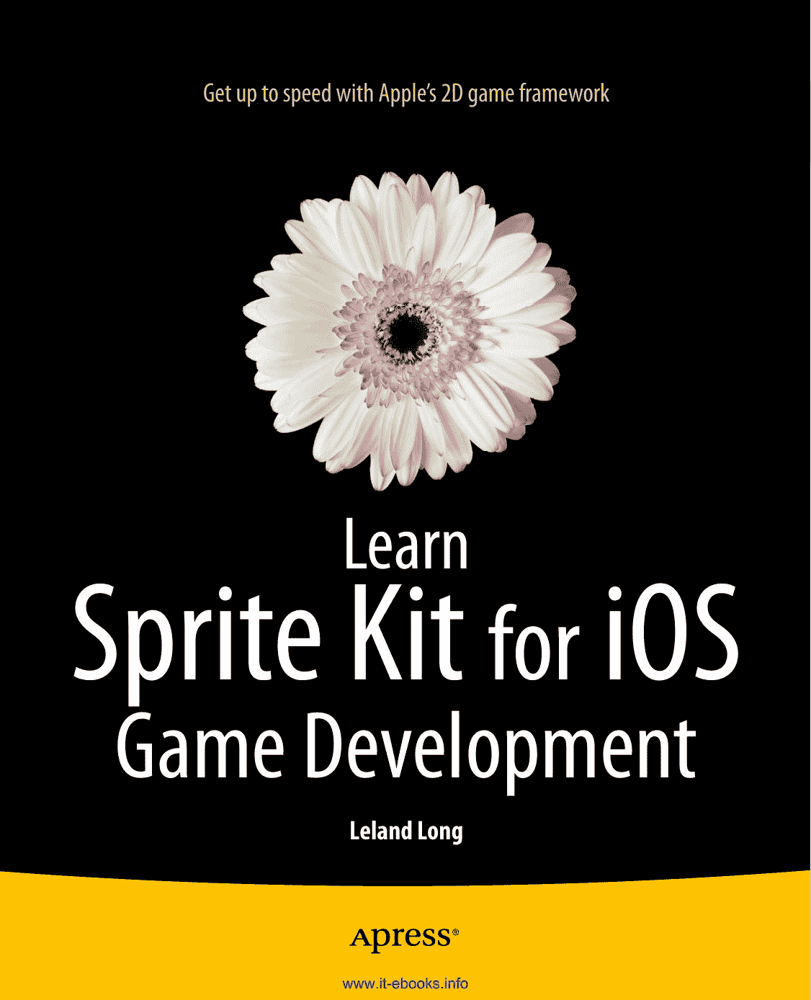
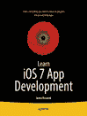
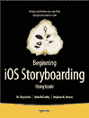
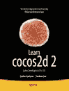
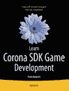

专业人士为专业人士编写的书籍

**随书**

®

**电子书**

**提供**

*L* 快速上手苹果的 2D 游戏框架

**L** *学习 iOS 游戏开发的 Sprite Kit* 将向您展示如何使用苹果的 **earn** 新框架来打造 2D 游戏杰作。

泰德系列

通过*学习 iOS 游戏开发的 Sprite Kit*，您将发现使用苹果的全新 Sprite Kit 框架创建 2D 游戏是多么简单。您会了解到创建场景、添加动画精灵、融入边缘、播放音效以及创建粒子特效是多么容易。您还将使用触摸事件来控制精灵，实现内置的物理引擎，处理精灵碰撞与接触，等等。

为了帮助您学习如何使用 Sprite Kit 的所有这些酷炫功能，我们将一起为 iPhone 构建一个完整的 2D 游戏。当您读完这本书时，您将制作出自己的 2D 游戏，并掌握开始创作下一个杰作所需的一切知识。

**通过*学习 iOS 游戏开发的 Sprite Kit*，您将学会以下内容：**

- 在游戏场景中添加动画精灵
- 使用 TouchEvents 让精灵对触摸输入做出反应
- 为游戏场景和角色应用逼真的物理效果
- 处理精灵与其他游戏元素的碰撞与接触
- 优化精灵交互、计分、关卡等方面的游戏逻辑

本书专为具备一定面向对象编程基础的初学者，以及希望快速上手 Sprite Kit 的中级 iOS 开发者而设计。

Leland Long

*学习 iOS 游戏开发的 Sprite Kit*

**随书**

**电子书**

ISBN 978-1-4302-6439-2

分类：移动计算

提供源代码在线访问

用户级别：初级–中级

**www.apress.com**

[www.it-ebooks.info](http://www.it-ebooks.info/)

为方便您阅读，Apress 已将部分前言材料置于索引之后。请使用书签和“内容一览”链接进行访问。

[www.it-ebooks.info](http://www.it-ebooks.info/)

**内容一览**

关于作者 ���������������������������������������������������������������������������������������������������������������� xiii

关于技术审校 ���������������������������������������������������������������������������������������������������������� xv

致谢 ���������������������������������������������������������������������������������������������������������� xvii

引言 ������������������������������������������������������������������������������������������������������������������� xix

第 1 章：Hello World ����������������������������������������������������������������������������������������������������1

第 2 章：SKActions 与 SKTextures：你的第一个动画精灵 ���������������������������������13

第 3 章：响应玩家输入的精灵移动 �������������������������������������������������29

第 4 章：边缘、边界与平台 �������������������������������������������������������������������49

第 5 章：更多动画精灵：“敌人”与“奖励” ������������������������������������������77

第 6 章：Cr

**v**

[www.it-ebooks.info](http://www.it-ebooks.info/)

**引言**

## 本书内容

本书旨在指导你制作自己的 iPhone 游戏。目标是帮助你利用苹果公司提供的新编程框架“Sprite Kit”，从零开始创建一个简单的 2D 游戏。使用 Sprite Kit 来创建游戏，你会发现许多通常需要自己编码实现的内容，框架已经为你处理好了。你会惊奇地发现，只需很少的代码就能创建出（精灵）动画角色，这些角色在屏幕上移动时还能相互交互。

在阅读本书的过程中，你将创建一个相对简单（老式风格）的 iPhone 2D 游戏，允许用户通过手指在触摸屏上控制角色。我们会加入一些敌人，为角色提供特定的挑战，以及一些用户可收集以获取额外分数的奖励物品。为了保持简单，我们不会涉及屏幕滚动的复杂性，而是使用固定屏幕，并添加一些平台，让角色有更多空间跑来跑去，而不仅仅是沿着屏幕底部移动。

每一章都旨在突出 Sprite Kit 的特定功能和基本的游戏开发概念，这将帮助你理解如何控制或与这些功能和概念进行交互。读完本书后，你将广泛了解 Sprite Kit 的全貌，并且在编码之余休息时，你将拥有一款很酷的游戏可以玩，而这款游戏或许就是你即将大卖的作品的前身。

## 为何购买本书

为什么不直接研究苹果为 Sprite Kit 开发者提供的优秀示例游戏“Adventure”呢？因为对于初学者来说，要剖析和理解它可能过于复杂和困难。它更适合经验丰富的游戏开发者使用，以便他们能够利用现有知识，通过新的 Sprite Kit API（应用程序编程接口）比以前更快、更容易地制作下一款游戏。我认为经验较少的开发者需要更直接的方式来入门 Sprite Kit。

从简单的开始，一旦你理解了基础，再转向更大、更好的游戏开发。

**xix**

[www.it-ebooks.info](http://www.it-ebooks.info/)

**xx**

**引言**

## 你需要了解什么

本书假设你已基本了解如何使用 Xcode 为 iPhone 创建应用程序。你不会花时间学习编程风格或技巧。你将专注于使用 Xcode 作为工具来制作游戏。我们假设你可以下载、安装并使用最新版本的 Xcode 来创建应用程序并在 iPhone 模拟器上运行它。

## 你需要准备什么

在硬件方面，你需要一台运行 Mountain Lion（OS X 10.8）或更高版本的 Intel 架构 Macintosh 电脑。

在软件方面，你需要 Xcode 5.0 或更高版本，因为这是第一个包含 Sprite Kit API 的版本。你可以从 `http://developer.apple.com` 下载 Xcode。

## 本书章节概览

以下是本书各章的简要概述：

- **第 1 章**，你将从一个模板开始，该模板为你提供一个介绍屏幕和一个主游戏屏幕，这将成为你在 Sprite Kit 中后续操作的基础。

- **第 2 章**，你将添加一些基本的物理特性，这样你的角色就不会在屏幕上飘来飘去。然后你会使用 `SKTexture` 来处理动画的图形部分，并使用 `SKAction` 来处理动画的时序和移动部分。

- **第 3 章**，你将处理用户交互来控制角色移动。

- **第 4 章**，我们将介绍一些关于如何添加角色可以与之交互的环境对象（例如可以跑动的平台和边界，以便处理屏幕环绕）的思路。

- **第 5 章**，你将添加一些敌人和奖励。我们喜欢奖励！

- **第 6 章**，我们将介绍一种创建“角色阵容”的方法，用于处理敌人和奖励的生成时机。你肯定不希望所有角色同时出现在舞台上！

- **第 7 章**，全部是关于分数的！毕竟分数才是最重要的，对吧？！

- **第 8 章**，你将处理精灵之间的交互。你肯定不希望你的角色只是满屏幕乱跑，直接“穿过”敌人和障碍物吧？

- **第 9 章**，你将添加更多关卡。毕竟，你想要游戏随着时间的推移逐渐变难，以保持挑战性和趣味性。

- **第 10 章**，我们将进行收尾工作，并为你指明后续方向，帮助你让游戏更有趣、更复杂。

撇开所有这些技术细节，让我们用代码大干一场吧！赶快翻页！:)

[www.it-ebooks.info](http://www.it-ebooks.info/)

