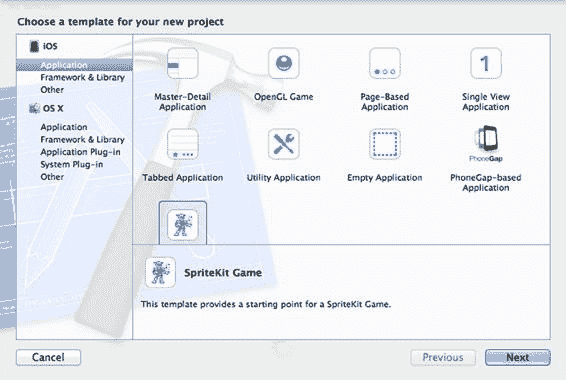
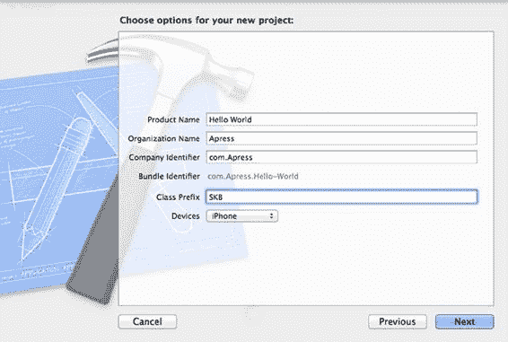
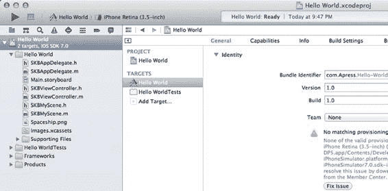
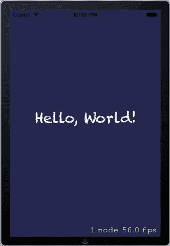
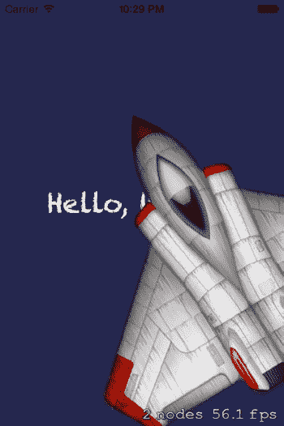
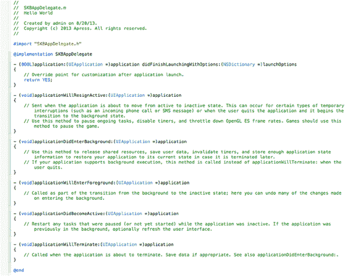
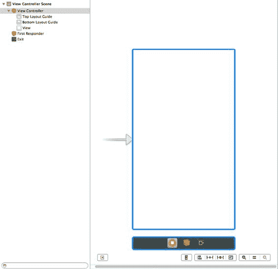
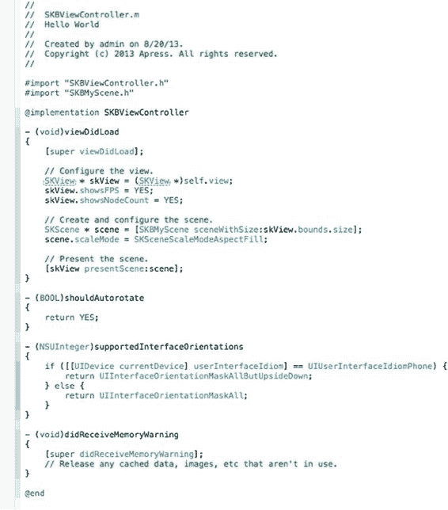
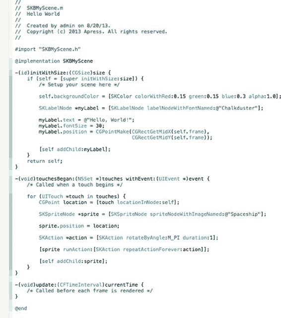

# 第 1 章：Hello World

## 我们热爱游戏

*“哇卡哇卡哇卡！”（吃豆人）*

我的青少年时期是在玩街机游戏和观看其他孩子玩电子游戏中度过的。

往投币口里塞进一枚 25 美分硬币，你就会被传送到一个超棒的地方，在你躲避敌人、努力生存、手指在控制按键上飞舞时，感受肾上腺素的飙升。

最好的去处是五分钱游戏厅，你只需要支付象征性的入场费，然后每局游戏只需花五分钱！一张十美元的钞票可以让你玩上好几个小时！

当钱花光了，我们不得不回到现实世界时，我们就自己制作游戏。我的电脑只有 3KB 的可编程内存，所以它们确实是些非常小的游戏。

绝不用注释来浪费代码空间——哦不！变量名都是单个字母（当然，`$x` 是最常用的）。啊啊啊，那些日子啊！

快进 30 年，情况发生了些许变化。大公司制作的游戏让你沉浸在 3D 世界中，其故事情节足以让小说相形见绌。现在的移动设备和台式电脑拥有过去难以想象的内存和图形处理能力。然而，即使有如此强大的功能和复杂性主导着游戏世界，你仍然可以找到并享受那些简单、悦目、同时又因其所带来的挑战而吸引人的游戏。我们称之为“老式游戏”。这些游戏并未消亡，它们只是与最新的大型游戏属于不同的类别。

## 传统

你可能知道，将任何编程书中的第一个项目命名为“Hello World”已成为一种传统。我们可不想在这里打破这个传统，免得冒犯了你的编程格调！

**1**

[www.it-ebooks.info](http://www.it-ebooks.info/)



**2**

**第 1 章：Hello World**

## 设置

现在，你应该已经启动了 Xcode，并想知道我们打算从哪里开始。如果你还没有启动 Xcode，现在就启动它吧。

在“欢迎使用 Xcode”屏幕中，你需要选择“创建一个新的 Xcode 项目”，或者如果你已经打开 Xcode，导致欢迎屏幕不再可见，则从“文件”菜单中选择“新建项目”。


在“新建项目模板”表单中（见图 1-1），请确保左侧列表中选中了`iOS - Application`，接着点击`Sprite Kit Game`模板图标，然后点击`Next`按钮。需要注意的是，如果你加载了不同的组件，显示选项可能会略有差异。

例如，此处屏幕展示了`PhoneGap`，但你的显示器上可能并非如此。

***图 1-1.** 项目模板选择表单，创建新项目时可从中选择各种模板。*

如图 1-2 所示，填写项目详细信息表单中的各个字段。在`Organization Name`（组织名称）处输入你的姓名；在`Company Identifier`（公司标识符）处输入`com.yourname`。

[www.it-ebooks.info](http://www.it-ebooks.info/)



## 第 1 章：你好，世界

**3**

***图 1-2.** 项目详细信息表单。为简单起见，请使用这些设置。*

这些字段可以任意填写。我们提供的这些数据仅作为示例，但请注意，如果你选择输入与我们建议不同的值，你的代码将无法与本书中的示例匹配。此外，在选择输入内容时，请记住生成的捆绑标识符（以灰色显示）必须符合 URL 规范且唯一。我们选择`SKB`作为类前缀，以避免与 Apple（保留所有两个字母前缀的使用权）以及我们可能使用的其他开发者的代码产生命名冲突。对于本书中的项目，我们将使用前缀`SKB`，它代表 Sprite Kit Book。

点击`Next`按钮后，你将看到标准的“保存”窗口，你可以选择存储新项目的位置。是否选中`Source Control`（源代码控制）复选框由你决定。如果你不熟悉它是什么或如何工作，可以在继续之前随意取消选中。做出选择后，准备好就点击`Create`（创建）按钮。

现在，你的新项目已经创建、保存并打开，你可能会看到图 1-3 中所示的一些目标设置。

[www.it-ebooks.info](http://www.it-ebooks.info/)





**4**

## 第 1 章：你好，世界

***图 1-3.** 项目窗口。在左侧选中项目后，你将在中央窗格中看到目标详细信息。*

使用此模板和 Xcode 的默认设置，接着运行应用程序——你肯定想试试！

构建完成后，模拟器应该会启动并显示在前。应用程序的启动动画随后会呈现，并以其全部内容展示应用，如图 1-4 所示。

***图 1-4.** iOS 模拟器窗口。你的游戏正在运行！*

[www.it-ebooks.info](http://www.it-ebooks.info/)

## 第 1 章：你好，世界

**5**

你在这里看到的不仅仅是屏幕上的文本。它不是标准的`UIView`上放置了一个`UILabel`，就像你在开发 iPhone 应用时可能已经习惯的那样。

相反，我们这里有四个新对象，我们将介绍它们。

第一个对象是背景。它是`SKScene`的一个实例。游戏中的内容被组织成场景，由`SKScene`对象表示。该`SKScene`的父级是一个`SKView`，它有一个`SKViewController`作为其控制器。

第二个对象`SKLabelNode`是在运行时动态创建的，而不是使用 Interface Builder 静态放置的。它被分配了一个字体、确定了大小、声明了位置，然后整个对象作为子对象被添加到场景中。

第三个对象是`SKSpriteNode`，使用已添加到项目中的图像文件构建。鼠标或手指在屏幕上按下的点决定了它在屏幕上的位置。

第四个对象是`SKAction`，在本例中是一个旋转动作。精灵对象被告知要对自身持续执行此动作。然后，这个完整的精灵对象作为子对象被添加到场景中。

正如你可能已经从命名约定中推断出的那样，这四个对象都是 Sprite Kit API 的一部分。毫无疑问，可探索的对象远不止这四个，但它们是一个很好的介绍，让我们继续吧。

你可能想知道右下角挂着的那些额外信息。这些都是应我们的请求而显示的，可以随时根据需要打开或关闭。当你开始向场景中添加更多精灵时，它们会非常有用，因为它们提供了节点计数和当前帧率（以 fps 即帧每秒衡量）的详细信息。你可以使用这些值来帮助确定可能存在的卡顿和游戏性能问题的原因。

但是等等，还有更多！

点击游戏屏幕的任意位置。哦，那太酷了！一艘旋转的宇宙飞船应该会突然不知从何处出现（见图 1-5）。然后再点击另一个位置。是的，另一艘宇宙飞船出现了。如果你像大多数程序员一样天生具有无尽的好奇心，那么现在你可能正在屏幕各处点击，而宇宙飞船正在疯狂旋转。你看到节点数和 FPS 值在变化吗？在帧率变得糟糕之前，有多少个节点是可见的？嗯，别忘了，在你的速度飞快的 Mac 台式机或笔记本上运行的模拟器比实际的 iPhone 要快一点点，所以不要假定当你最畅销的游戏在实际设备上运行时，你可以在屏幕上同时拥有 3000 个巨大比例的精灵并期望获得出色的帧率。我们只是提醒一下……

[www.it-ebooks.info](http://www.it-ebooks.info/)



**6**

## 第 1 章：你好，世界

***图 1-5.** iOS 模拟器窗口。点击游戏屏幕后，你的第一个动画精灵出现。*

好了，点击 Xcode 中的`Stop`（停止）按钮退出游戏。让我们检查一些模板代码。

在 Xcode 窗口左侧的项目导航器中，选择`SKBAppDelegate.m`文件（见图 1-6）。

[www.it-ebooks.info](http://www.it-ebooks.info/)



## 第 1 章：你好，世界

**7**

***图 1-6.** `SKBAppDelegate.m`文件，在代码编辑器中打开。*

如你所见，里面内容不多。有很多注释提醒你可以在其中放入和使用什么，但目前没有太多有趣的东西。

选择`Main.storyboard`文件（见图 1-7）。这里也没什么可看的。只有一个视图控制器和我们之前介绍过的一个视图。现在或许是时候提一下，你可以为整个游戏使用这个单一的视图控制器。仅使用这一个控制器，你就可以随心所欲地添加和切换游戏场景。

[www.it-ebooks.info](http://www.it-ebooks.info/)



**8**

## 第 1 章：你好，世界

***图 1-7.** `Main.storyboard`文件，在故事板编辑器中打开。*

接下来，选择`SKBViewController.m`文件（见图 1-8）。现在你开始接触到一些有用的内容。首先看一下`viewDidLoad`方法。这里配置了视图和场景，并将场景呈现在`SKView`中，从而显示在屏幕上。

[www.it-ebooks.info](http://www.it-ebooks.info/)



## 第 1 章：你好，世界

**9**

***图 1-8.** `SKBViewController.m`文件，在编辑器中打开。*

注意视图配置部分中的以下两行代码：

```
skView.showsFPS = YES;
skView.showsNodeCount = YES;
```

这就是你之前看到的游戏画面右下角显示的两个值的开启或关闭的地方。

[www.it-ebooks.info](http://www.it-ebooks.info/)



**10**

## 第 1 章：你好，世界


