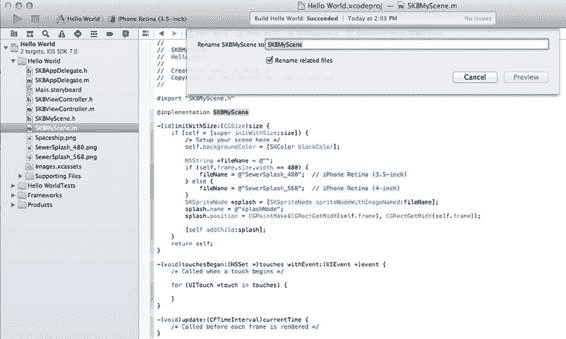
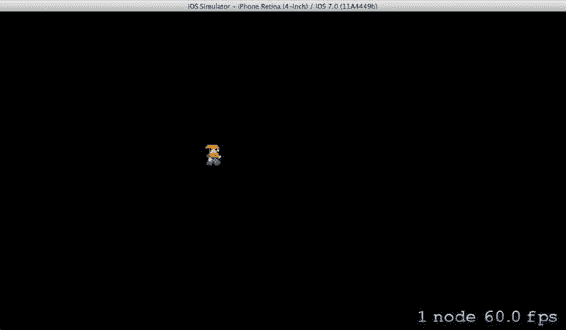

# 文档排版

`-(void)touchesBegan:(NSSet *)touches withEvent:(UIEvent *)event` {

`/* 当触摸开始时调用 */`

`for (UITouch *touch in touches) {`

`}`

`}`

重命名此`SKScene`对象，使其在项目中更具描述性。在`SKBMyScene.m`文件中，靠近顶部位置，双击`SKBMyScene`（位于`@implementation`之后）。然后右键单击它以打开子菜单，向下滚动到`重构`并选择`重命名`（或从`编辑`菜单中选择`重构`，然后选择`重命名`）。显示`重命名`表单后，您可以将名称更改为更具描述性的内容，例如`SKBSplashScene`（参见图 2-4）。确保选中`重命名相关文件`，然后单击`预览`按钮。根据需要检查更改，然后单击`保存`按钮。

[www.it-ebooks.info](http://www.it-ebooks.info/)



**第 2 章: SKActions 和 SKTextures: 你的第一个动画精灵** **21**

***图 2-4.** 重命名表单*

接下来的选项由您决定。您将可以选择让 Xcode 在重构前自动拍摄快照。从某种意义上说，这可以让您通过恢复到之前的快照来撤销像这样的重大更改。通过单击`启用`或`禁用`按钮做出选择以继续。

该对象及相关文件都已重命名为更具描述性的名称。对于那些注重细节的人来说，您可能会注意到有一个区域未受更改影响：两个文件头部的注释。如果您希望保持一致，可以随时手动更改这些注释。

### 创建新场景

从`文件`菜单中选择`新建文件`。确保左侧选中了`iOS`和`Cocoa Touch`，从图标列表中选择`Objective-C class`，然后单击`下一步`按钮。单击名为`Subclass of`的下拉箭头，将其更改为`SKScene`，然后为新类命名为`SKBGameScene`。单击`下一步`按钮，将出现标准的保存对话框。默认位置即可。只需验证`目标 - Sewer Bros`已选中，然后单击`创建`按钮。两个新文件——`SKBGameScene.h`和`SKBGameScene.m`——将被创建并显示在左侧的项目导航器中。

[www.it-ebooks.info](http://www.it-ebooks.info/)

**22**

**第 2 章: SKActions 和 SKTextures: 你的第一个动画精灵** 它相当简陋，不是吗？从`SplashScene`复制并粘贴一些代码，使其可以投入使用。您将把所有三个方法添加到`SKBGameScene.m`中，最终结果如下：

```
#import "SKBGameScene.h"

@implementation SKBGameScene

-(id)initWithSize:(CGSize)size {
    if (self = [super initWithSize:size]) {
        /* 在此处设置你的场景 */
        self.backgroundColor = [SKColor blackColor];
    }
    return self;
}

-(void)touchesBegan:(NSSet *)touches withEvent:(UIEvent *)event {
    /* 当触摸开始时调用 */
    for (UITouch *touch in touches) {
    }
}

-(void)update:(CFTimeInterval)currentTime {
    /* 在每一帧渲染之前调用 */
}

@end
```

现在，您将看到如何在用户触摸屏幕时添加场景之间的精美过渡动画。您将使用`SKAction`和`SKTransition`类来创建一些动画效果。

### 使用 SKActions 进行动画过渡

大多数情况下，您通过使用动作让精灵在场景中移动。Sprite Kit 中的大多数操作都是对节点进行更改，比如您之前创建的`SKSpriteNode`。让我们创建一个`SKAction`来描述您想要应用于该节点的更改，然后告诉节点运行该动作。当场景渲染时，动作将被执行，并且会随时间进行动画，直到动作完成。

在`SKBSplashScene.m`的第一个场景实现中，在编辑器顶部`#import`行的正下方添加一行代码，使其看起来像这样：

```
#import "SKBSplashScene.h"
#import "SKBGameScene.h"

@implementation SKBSplashScene
```

[www.it-ebooks.info](http://www.it-ebooks.info/)

**第 2 章: SKActions 和 SKTextures: 你的第一个动画精灵** **23**


在`touchesBeganWithEvent`方法的`for`循环中添加以下代码，如下所示：
```
for (UITouch *touch in touches) {
    SKNode *splashNode = [self childNodeWithName:@"splashNode"];
    if (splashNode != nil) {
        splashNode.name = nil;
        SKAction *zoom = [SKAction scaleTo: 4.0 duration: 1];
        [splashNode runAction: zoom completion:^{
            SKBGameScene *nextScene = [[SKBGameScene alloc] initWithSize:self.size];
            SKTransition *doors = [SKTransition doorwayWithDuration:0.5];
            [self.view presentScene:nextScene transition:doors];
        }];
    }
}
```

让我们回顾一下这里发生了什么。你使用了`SKScene`对象的便捷方法（`childNodeWithName`）来创建一个名为`splashNode`的`SKNode`。现在你可以明白为什么在`initWithSize`方法中创建节点时要为它命名了；因为现在你可以创建一个指向它的引用对象。

你验证了假设存在的对象确实存在。如果不存在，它将是一个`nil`指针，你可以跳过触摸事件并继续执行。

如果对象确实存在，你将`name`属性设置为`nil`，因为你不希望这个过渡发生超过一次——如果用户连续触摸屏幕多次，这种情况可能会发生。

然后你创建了一个`SKAction`对象，使用便捷方法创建了`SKAction`，并设置了两个参数：一个浮点值（你希望纹理（图像）放大到的比例）以及缩放动画的持续时间（以秒为单位）。换句话说，就是在一秒的时间范围内将纹理放大到 400%。

接着你告诉节点在其自身上运行动作。当希望节点执行动作时，你有三种方法可供选择：

- `runAction`——仅执行动作。
- `runAction: completion`——执行动作并在完成时调用提供的代码块。
- `runAction: withKey`——执行动作并传入一个字符串作为该动作的引用。稍后可用于检查某个引用的动作是否仍在运行。

在这个例子中，你将使用第二种选项`runAction: completion`，让动作执行并在完成后运行一段代码块。

查看缩放动作完成时运行的代码块，你会发现你创建了一个自定义类`SKBGameScene`的对象。然后你创建了一个`SKTransition`，使用了多种可用过渡类型之一（完整列表请参阅`SKTransition`的 Xcode 文档），并将其持续时间设置为 0.5 秒。

最后，你告诉当前场景使用刚刚创建的过渡来呈现刚刚创建的新场景。

---

现在构建并运行程序。你会看到一个启动画面，当点击屏幕时，会过渡到新场景（目前是纯黑色的）。不过你会注意到，先是播放缩放动画，然后才执行门框过渡。

### 组合多个动作

完全可以将多个动作组合起来同时执行。让我们在现有的缩放动作中添加一个`fadeAway`动作，看看如何实现。

在缩放动作创建代码下方，将代码修改为如下所示：
```
SKAction *zoom = [SKAction scaleTo: 4.0 duration: 1];
SKAction *fadeAway = [SKAction fadeOutWithDuration: 1];
SKAction *grouped = [SKAction group:@[zoom, fadeAway]];
[splashNode runAction: grouped completion:^{
```

这里你创建了一个动作，该动作会使对应节点在一秒内淡出。然后你创建了一个动作，它仅仅是一个包含其他已创建动作的数组。接着你告诉节点运行这个组合动作，而不是缩放动作。

构建并运行程序来查看效果。你可能会注意到，由于第二个场景目前是纯黑色的，门框过渡变得不可见了。接下来看看一旦在游戏场景中添加更多精灵后，这种情况是否会改变。

### 使用`SKTexture`实现动画帧

当你创建启动画面的`SKSpriteNode`对象时，你使用了便捷方法`spriteNodeWithImageNamed`来创建一个你不打算更改的静态精灵。这对于需要静态图像的情况来说没问题，但对于需要附带某种动画的精灵（例如一个包含多个图像帧的奔跑角色）来说就完全没用了。对于将使用多个帧（或图像）进行动画显示的精灵，你需要使用`SKTexture`对象来创建精灵。

主角英雄有四个帧，你将使用它们来动画化其奔跑行为。你需要为这四个图像分别创建单独的`SKTexture`，然后创建一个包含所有纹理的`NSArray`，最后创建一个`SKAction`，使用纹理数组来对精灵进行动画。

首先，将这四张图片添加到项目中。在 Xcode 中，从 File 菜单中选择 Add Files to “Sewer Bros”。导航到`Player_Right1.png`文件并单击选中。然后按住 Shift 键单击第三个文件`Player_Right4.png`，这样所有四个文件都被选中。确保勾选了“Destination: Copy Items Into Destination’s Group Folder (if Needed)”和“Add to Targets: Sewer Bros”。点击 Add 按钮。

如果成功，你会在窗口左侧的项目导航器中看到添加的文件。如果需要，你可以依次单击它们查看外观。

接下来，在`SKBGameScene.h`文件中，在`@interface`和`@end`之间为玩家的`SKSpriteNode`对象添加一个属性，如下所示：
```
@interface SKBGameScene : SKScene
@property (strong, nonatomic) SKSpriteNode *playerSprite;
@end
```

现在，在`SKBGameScene.m`文件中，将以下代码添加到`touchesBeganWithEvent`方法的`for`循环中，如下所示：
```
for (UITouch *touch in touches) {
    CGPoint location = [touch locationInNode:self];
    // 4 animation frames stored as textures
    SKTexture *f1 = [SKTexture textureWithImageNamed: @"Player_Right1.png"];
    SKTexture *f2 = [SKTexture textureWithImageNamed: @"Player_Right2.png"];
    SKTexture *f3 = [SKTexture textureWithImageNamed: @"Player_Right3.png"];
    SKTexture *f4 = [SKTexture textureWithImageNamed: @"Player_Right4.png"];
    // an array of these textures
    NSArray *textureArray = @[f1,f2,f3,f4];
    // our player character sprite & starting position in the scene
    _playerSprite = [SKSpriteNode spriteNodeWithTexture:f1];
    _playerSprite.position = location;
    // an Action using our array of textures with each frame lasting 0.1 seconds
    SKAction *runRightAction = [SKAction animateWithTextures:textureArray timePerFrame:0.1];
    // don't run just once but loop indefinitely
    SKAction *runForever = [SKAction repeatActionForever:runRightAction];
    // attach the completed action to our sprite
    [_playerSprite runAction:runForever];
    // add the sprite to the scene
    [self addChild:_playerSprite];
}
```

现在构建并运行程序，点击一次以关闭启动画面，然后在黑色场景上点击以生成一个奔跑的角色（见图 2-5）。在此阶段多次点击会生成多个玩家角色，稍后你将学习如何修复此问题。



**图 2-5.** 一个已生成并正在动画的精灵

现在让我们详细说明一下你所做的工作。
```
CGPoint location = [touch locationInNode:self];
```
这一行捕获了用户的触摸点，这样你稍后可以将其用作角色可能生成的位置。


`SKTexture *f1 = [SKTexture textureWithImageNamed: @"Player_Right1.png"]; SKTexture *f2 = [SKTexture textureWithImageNamed: @"Player_Right2.png"]; SKTexture *f3 = [SKTexture textureWithImageNamed: @"Player_Right3.png"]; SKTexture *f4 = [SKTexture textureWithImageNamed: @"Player_Right4.png"];` 这段代码创建了四个 `SKTexture` 对象，每个对应一帧动画。这些对象由项目内存储的图像创建，因此必须精确拼写以避免错误。

`NSArray *textureArray = @[f1,f2,f3,f4];`

你创建了一个由这些纹理组成的 `NSArray` 数组。

[www.it-ebooks.info](http://www.it-ebooks.info/)

