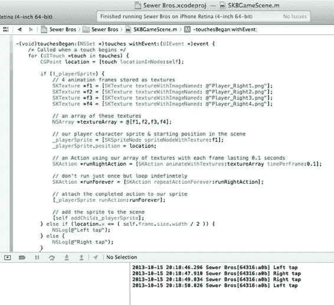
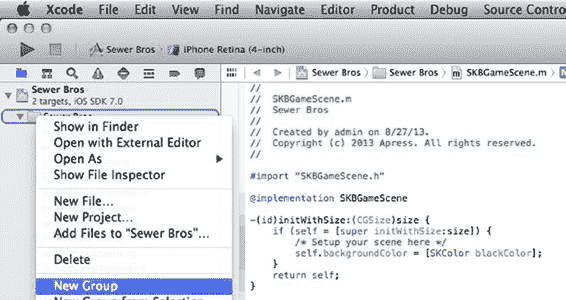
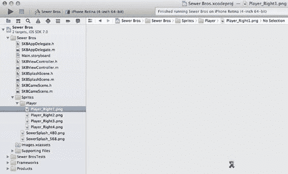
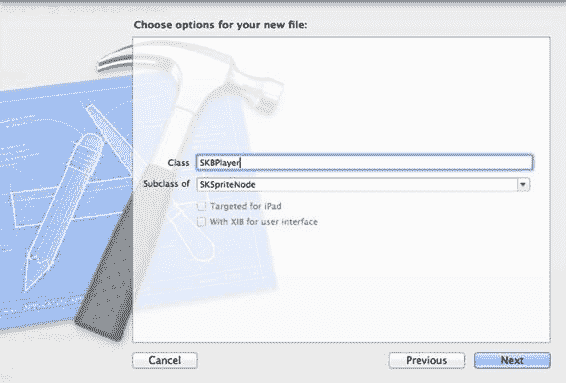
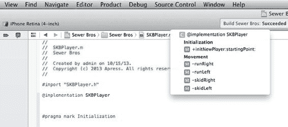
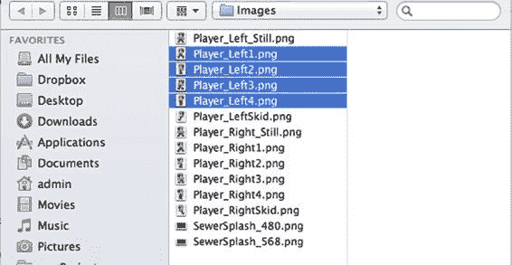
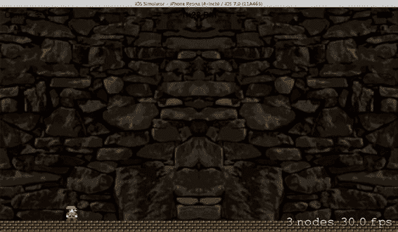
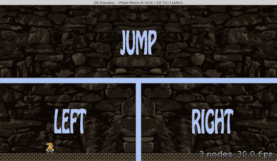

# 第 3 章：精灵移动：响应用户输入

## 跑起来！

到目前为止，游戏屏幕显示后（初始为纯黑色背景），用户点击屏幕时，一个动画精灵会出现在屏幕上。这还不错，但你才刚刚开始。现在，你要为其增加移动功能！

首先，你将学习如何添加代码来检测用户点击的位置，并将屏幕划分为两个兴趣区域：左侧区域和右侧区域。当用户点击左侧区域时，你让精灵向左移动，反之亦然。你将通过获取游戏屏幕区域并除以二的方式，在代码中确定左右区域。如果用户触摸位置小于该结果数值，则为左侧区域点击；若大于该数值，则为右侧区域点击。

在 `SKBGameScene.m` 文件中，修改 `touchesBeganWithEvent` 方法，在第一个 `SKTexture` 赋值之前添加一个 `if()` 语句，如下所示：

```
if (!_playerSprite) {
// 4 个存储为纹理的动画帧
SKTexture *f1 = [SKTexture textureWithImageNamed: @"Player_Right1.png"];
```

然后，将以下突出显示的代码添加到同一方法中现有代码的末尾：

```
// 将精灵添加到场景中
[self addChild:_playerSprite];
} else if (location.x <= ( self.frame.size.width / 2 )) {
NSLog(@"左侧点击");
} else {
NSLog(@"右侧点击");
}
```

[www.it-ebooks.info](http://www.it-ebooks.info/)



现在，如果你构建并运行程序，其行为将与之前相同——至少在你拥有一个动画精灵在屏幕上时是这样。此后，每次用户点击屏幕（或你在模拟器游戏屏幕上点击），你应该能在 Xcode 控制台中看到新的一行输出（参见图 3-1）。如果你没有看到控制台输出，请返回 Xcode 并选择 **View** ➤ **Debug Area** ➤ **Activate Console**。调整你的窗口位置，以便能同时看到控制台和模拟器屏幕。

**图 3-1.** 显示点击事件的控制台输出

那么这里发生了什么？

首先，你确保只有在精灵尚未存在时，才将其添加到场景中。这样，屏幕上最终只有一个动画精灵，而不是每次点击都生成多个精灵。

接着，你检查了用户点击位置的 X 坐标，并将其与场景总宽度的一半进行比较。如果小于该数值，则表示用户点击了屏幕左侧；否则，视为右侧点击。

这非常简单。现在，你要对这些点击做出响应。

修改 `touchesBeganWithEvent` 方法，在现有的 `if()` 和 `else` 语句中添加以下六行代码：

```
} else if (location.x <= ( self.frame.size.width / 2 )) {
NSLog(@"左侧点击");
SKAction *moveLeft = [SKAction moveByX:-100 y:0 duration:1];
SKAction *moveForever = [SKAction repeatActionForever:moveLeft];
[self runAction:moveForever];
} else {
NSLog(@"右侧点击");
SKAction *moveRight = [SKAction moveByX:100 y:0 duration:1];
SKAction *moveForever = [SKAction repeatActionForever:moveRight];
[self runAction:moveForever];
}
```

现在，如果你构建并运行，你会看到左侧和/或右侧的点击会使精灵沿水平（即 X 轴）方向在屏幕上移动。你也会很快发现，一旦精灵跑出屏幕边缘，它将永远消失，不会再出现。

这种行为是符合预期的，实际上它能帮助你清理或移除那些不再绘制在屏幕上的精灵。这些精灵会占用宝贵的内存空间，试想一下，如果屏幕上有十二个精灵，但已有数百个精灵离开了屏幕，那将造成多大的浪费！Sprite Kit 为你完成了这项工作，它会清除不再绘制在屏幕上的精灵，从而保持你宝贵的内存整洁高效。

[www.it-ebooks.info](http://www.it-ebooks.info/)


你可能会注意到，你的精灵在“月球漫步”方面很擅长；无论它是向左还是向右移动，它总是面朝右。要解决这个问题，你需要添加更多的纹理。不过，在此之前，你将了解如何重新组织代码，以避免它变得难以控制。

### 代码重组

让我们通过将纹理图像移动到它们自己的文件夹中开始重组。这样做纯粹是为了组织上的目的。随着你向项目添加更多图像，如果你将它们添加到一个指定的文件夹中，使其与代码分离，会让你的工作更轻松。这有助于保持项目文件夹的整洁和精简。

单击一次 `Sewer Bros` 文件夹，它是项目导航器窗格顶部起的第二项。

右键单击该文件夹，然后选择 `New Group`，或者从 `File` 菜单中选择 `New ➤ Group`（见图 3-2）。这会在你的项目文件夹内创建一个新文件夹。它现在已准备好让你为其命名，因此将其命名为 `Sprites`。

[www.it-ebooks.info](http://www.it-ebooks.info/)





**32**

**第 3 章：精灵移动：响应用户输入**

***图 3-2.** 选择新组*

现在，将两个 `SewerSplash` 图像和四个 `Player_Right` 图像移动到这个新文件夹中。你可以通过单击一次 `Spaceship` 图像并按 `Delete` 键来删除它。

如果需要，你可以将 `Sprites` 文件夹移动到 `SKBObject` 文件下方。

现在，在 `Sprites` 文件夹内添加另一个文件夹，仅用于存放玩家文件。你可以按照创建 `Sprites` 文件夹时的相同步骤来操作。将这个新文件夹的名称设为 `Player`（见图 3-3）。

***图 3-3.** 新文件夹结构*

[www.it-ebooks.info](http://www.it-ebooks.info/)



**第 3 章：精灵移动：响应用户输入**

**33**

### 玩家新类

接下来，你将创建一个单独的类，用于处理玩家及其相关代码。当你在玩家被“杀死”后生成新玩家时，这会让事情更简单。

从 `File` 菜单中选择 `New`，然后选择 `File` 以创建一个新文件。确保在左侧选择了 `iOS` 和 `Cocoa Touch`，从图标列表中选取 `Objective-C class`，然后点击 `Next` 按钮。点击 `Subclass of` 的下拉箭头，将其更改为 `SKSpriteNode`。（不必在这个很长的类列表中滚动，你可以在此下拉菜单中输入 `SK`。它会快速跳转到 Sprite Kit 类组，然后继续输入 `sprite` 或从下拉列表中选择它。）然后，将这个新类命名为 `SKBPlayer`（见图 3-4）。

点击 `Next` 按钮，将出现标准的保存对话框。默认位置是完美的；只需确认 `Targets - Sewer Bros` 已勾选，然后点击 `Create` 按钮。两个新文件被创建，并显示在左侧的项目导航器中。

***图 3-4.** 创建新类文件*

[www.it-ebooks.info](http://www.it-ebooks.info/)

**34**

**第 3 章：精灵移动：响应用户输入**

向 `SKBPlayer.h` 文件添加如下三行新代码：

```objc
#import <SpriteKit/SpriteKit.h>

@interface SKBPlayer : SKSpriteNode

+ (SKBPlayer *)initNewPlayer:(SKScene *)whichScene startingPoint:(CGPoint)location;
- (void)runRight;
- (void)runLeft;

@end
```

将 `SKBPlayer.m` 文件修改为如下内容：

```objc
@implementation SKBPlayer

#pragma mark 初始化

+ (SKBPlayer *)initNewPlayer:(SKScene *)whichScene startingPoint:(CGPoint)location;
{
    // 4 个动画帧存储为纹理
    SKTexture *f1 = [SKTexture textureWithImageNamed: @"Player_Right1.png"];
    SKTexture *f2 = [SKTexture textureWithImageNamed: @"Player_Right2.png"];
    SKTexture *f3 = [SKTexture textureWithImageNamed: @"Player_Right3.png"];
    SKTexture *f4 = [SKTexture textureWithImageNamed: @"Player_Right4.png"];

    // 这些纹理的数组
    NSArray *textureArray = @[f1,f2,f3,f4];
```


```objectivec
// 我们的玩家角色精灵及其在场景中的起始位置
`SKBPlayer *player = [SKBPlayer spriteNodeWithTexture:f1];`
`player.position = location;`

// 一个使用纹理数组的动作，每帧持续 0.1 秒
`SKAction *runRightAction = [SKAction animateWithTextures:textureArray timePerFrame:0.1];`

// 不要只运行一次，而是无限循环
`SKAction *runForever = [SKAction repeatActionForever:runRightAction];`

// 将完成的动作附加到我们的精灵上
`[player runAction:runForever];`

// 将精灵添加到场景中
`[whichScene addChild:player];`

`return player;`
```

[www.it-ebooks.info](http://www.it-ebooks.info/)



## 第 3 章：响应玩家输入的精灵移动

35

```objectivec
#pragma mark 移动

- (void)runRight
{
    NSLog(@"向右跑");
    SKAction *moveRight = [SKAction moveByX:100 y:0 duration:1];
    SKAction *moveForever = [SKAction repeatActionForever:moveRight];
    [self runAction:moveForever];
}

- (void)runLeft
{
    NSLog(@"向左跑");
    SKAction *moveLeft = [SKAction moveByX:-100 y:0 duration:1];
    SKAction *moveForever = [SKAction repeatActionForever:moveLeft];
    [self runAction:moveForever];
}
@end
```

你会注意到，你只是将现有代码从 `touchesBeganWithEvent` 方法移到了新的 `Player` 类中。以 `#pragma mark` 开头的代码行仅用于组织目的，对游戏代码本身没有影响。想看看它们的作用，可以尝试点击编辑器顶部类文件右侧的下拉菜单，你会看到 pragma 标记（初始化 和 移动）在那里高亮显示（见图 3-5）。

**图 3-5.** 类方法列表中显示的 Pragma 标记

现在你可以修改 `SKBGameScene.h` 文件以使用新代码：

```objectivec
#import <SpriteKit/SpriteKit.h>
#import "SKBPlayer.h"

@interface SKBGameScene : SKScene
```

[www.it-ebooks.info](http://www.it-ebooks.info/)

36

## 第 3 章：响应玩家输入的精灵移动

```objectivec
@property (strong, nonatomic) SKBPlayer *playerSprite;

@end
```

修改 `SKBGameScene.m` 文件，使其与以下内容匹配：

```objectivec
-(void)touchesBegan:(NSSet *)touches withEvent:(UIEvent *)event {
    /* 当触摸开始时调用 */
    for (UITouch *touch in touches) {
        CGPoint location = [touch locationInNode:self];
        if (!_playerSprite) {
            _playerSprite = [SKBPlayer initNewPlayer:self startingPoint:location];
        } else if (location.x <= ( self.frame.size.width / 2 )) {
            [_playerSprite runLeft];
        } else {
            [_playerSprite runRight];
        }
    }
}
```

现在如果你构建并运行程序，你会看到一切仍然正常工作，但组织结构更加清晰。你将图片移入了文件夹，并且处理精灵移动的方法已被放入一个专门的类中，该类专门处理玩家的精灵。

## 替换静态值

现在，你将移除代码中的静态值。在开发游戏时，在代码中直接添加静态值很容易，但随着代码行数急剧增加，后期想要修改微小的细节会变得非常困难。与其一页页地搜索代码——例如，因为你想要改变每个绘制周期中精灵移动的距离——不如将这些值放在你的类代码顶部，这样会轻松得多。

为此，在 `SKBPlayer.h` 文件的顶部添加一行，如下所示：

```objectivec
#import <SpriteKit/SpriteKit.h>
#define kPlayerRunningIncrement 100

@interface SKBPlayer : SKSpriteNode
```

然后在 `SKBPlayer.m` 文件中修改你之前用于“跑动”速度的那两个静态值，如下所示：

```objectivec
- (void)runRight
{
    NSLog(@"向右跑");
    SKAction *moveRight = [SKAction moveByX:kPlayerRunningIncrement y:0 duration:1];
    SKAction *moveForever = [SKAction repeatActionForever:moveRight];
    [self runAction:moveForever];
}
```

[www.it-ebooks.info](http://www.it-ebooks.info/)

## 第 3 章：响应玩家输入的精灵移动

37

```objectivec
- (void)runLeft
{
    NSLog(@"向左跑");
    // ... (代码继续)
```


`SKAction *moveLeft = [SKAction moveByX:-kPlayerRunningIncrement y:0 duration:1];`  
`SKAction *moveForever = [SKAction repeatActionForever:moveLeft];`

`[self runAction:moveForever];`

当你想改变玩家的移动速度时，只需在代码中修改一个地方即可。

这样好多了！

## 为纹理创建新类

你已经对代码进行了大幅清理，但在添加纹理之前还有一项改动：创建一个新类来处理所有玩家的纹理。毕竟，在完成之前你还会添加更多纹理，因此这个类将提供一个集中管理所有细节的地方。

和之前创建玩家类一样，你需要为纹理新建一个文件和类。从 **File** 菜单中选择 **New File**。确保左侧选中了 **iOS** 和 **Cocoa Touch**，然后从图标列表中选择 **Objective-C Class**，并点击 **Next** 按钮。点击 **Subclass of** 的下拉箭头，将其改为 **NSObject**，然后将新类命名为 `SKBSpriteTextures`。点击 **Next** 按钮，标准保存对话框会弹出。默认位置即可，只需确认 **Targets - Sewer Bros** 已勾选，然后点击 **Create** 按钮。两个新文件会被创建，并显示在左侧的 **Project Navigator** 中。

现在，将 `SKBSpriteTextures.h` 文件修改为如下内容：

```objc
#import <Foundation/Foundation.h>
#import <SpriteKit/SpriteKit.h>

#define kPlayerRunRight1FileName @"Player_Right1.png"
#define kPlayerRunRight2FileName @"Player_Right2.png"
#define kPlayerRunRight3FileName @"Player_Right3.png"
#define kPlayerRunRight4FileName @"Player_Right4.png"

@interface SKBSpriteTextures : NSObject

@property (nonatomic, strong) NSArray *playerRunRightTextures;

- (void)createAnimationTextures;

@end
```

现在，将 `SKBSpriteTextures.m` 文件修改为如下内容：

```objc
@implementation SKBSpriteTextures

- (void)createAnimationTextures
{
    // 动画数组
    // 向右奔跑
    SKTexture *f1 = [SKTexture textureWithImageNamed:kPlayerRunRight1FileName];
    SKTexture *f2 = [SKTexture textureWithImageNamed:kPlayerRunRight2FileName];
    SKTexture *f3 = [SKTexture textureWithImageNamed:kPlayerRunRight3FileName];
    SKTexture *f4 = [SKTexture textureWithImageNamed:kPlayerRunRight4FileName];
    _playerRunRightTextures = @[f1,f2,f3,f4];
}

@end
```

请注意，这里你将静态文件名替换为定义的变量，就像之前为玩家奔跑速度所做的那样。这样在后续修改图形时会更加方便，也有助于你保持代码的一致性与条理性。

现在修改 `SKBPlayer.h` 文件，添加一个实例变量，用于通过新的纹理类来持有纹理数组：

```objc
#import <SpriteKit/SpriteKit.h>
#import "SKBSpriteTextures.h"

#define kPlayerRunningIncrement 100

@interface SKBPlayer : SKSpriteNode

@property (nonatomic, strong) SKBSpriteTextures *spriteTextures;

+ (SKBPlayer *)initNewPlayer:(SKScene *)whichScene startingPoint:(CGPoint)location;
```

现在修改 `SKBPlayer.m` 文件，以使用新的纹理类：

```objc
+ (SKBPlayer *)initNewPlayer:(SKScene *)whichScene startingPoint:(CGPoint)location;
{
    // 初始化并创建精灵纹理
    SKBSpriteTextures *playerTextures = [[SKBSpriteTextures alloc] init];
    [playerTextures createAnimationTextures];

    // 初始帧
    SKTexture *f1 = [SKTexture textureWithImageNamed:kPlayerRunRight1FileName];

    // 玩家角色精灵及场景中的起始位置
    SKBPlayer *player = [SKBPlayer spriteNodeWithTexture:f1];
    player.position = location;
    player.spriteTextures = playerTextures;

    // 将精灵添加到场景中
    [whichScene addChild:player];

    return player;
}
```

```objc
- (void)runRight
{
    NSLog(@"向右奔跑");
}
```


```objc
SKAction *walkAnimation = [SKAction animateWithTextures:_spriteTextures.playerRunRightTextures timePerFrame:0.05];
SKAction *walkForever = [SKAction repeatActionForever:walkAnimation];
[self runAction:walkForever];

SKAction *moveRight = [SKAction moveByX:kPlayerRunningIncrement y:0 duration:1];
SKAction *moveForever = [SKAction repeatActionForever:moveRight];
[self runAction:moveForever];
}

- (void)runLeft
{
NSLog(@"run Left");

SKAction *walkAnimation = [SKAction animateWithTextures:_spriteTextures.playerRunRightTextures timePerFrame:0.05];
SKAction *walkForever = [SKAction repeatActionForever:walkAnimation];
[self runAction:walkForever];

SKAction *moveLeft = [SKAction moveByX:-kPlayerRunningIncrement y:0 duration:1];
SKAction *moveForever = [SKAction repeatActionForever:moveLeft];
[self runAction:moveForever];
}
```

这些修改带来的一个小变化是：当精灵第一次出现在屏幕上时，它现在是静止不动的。一旦发生点击并开始移动，四个动画帧就会开始并无限循环播放。重构已经完成，现在你可以添加更多纹理，让精灵能够双向奔跑。

## 添加纹理

首先，让我们将四张朝左的玩家图片和两张静止图片添加到项目中。为了将它们自动添加到已为所有纹理文件创建的文件夹中，请单击 `Sprites` 文件夹内的 `Player` 文件夹选中它。从 File 菜单中选择 `Add Files to “Sewer Bros”`。导航到名为 `Player_Left1.png` 的文件并单击选中。然后按住 Shift 键点击最后一个所需文件 `Player_Left4.png`，这样四个文件都会被选中（参见图 3-6）。

[www.it-ebooks.info](http://www.it-ebooks.info/)



**第 40 章 第 3 章：响应玩家输入的精灵移动**

***图 3-6.** 添加图像时选择多个文件* 确保勾选了 `Destination: Copy Items into Destination’s Group Folder (if Needed)`，确保勾选了 `Add to Targets: Sewer Bros`，然后单击 `Add` 按钮。对另外两张名为 `Player_Right_Still` 和 `Player_Left_Still` 的图像执行相同操作。

然后，在 `SKBSpriteTextures.h` 文件中的 `kPlayerRunRight4FileName` 正下方添加文件名常量：

```objc
#define kPlayerRunRight4FileName @"Player_Right4.png"
#define kPlayerStillRightFileName @"Player_Right_Still.png"
#define kPlayerRunLeft1FileName @"Player_Left1.png"
#define kPlayerRunLeft2FileName @"Player_Left2.png"
#define kPlayerRunLeft3FileName @"Player_Left3.png"
#define kPlayerRunLeft4FileName @"Player_Left4.png"
#define kPlayerStillLeftFileName @"Player_Left_Still.png"
```

现在为朝左的纹理和静止纹理添加实例变量：

```objc
@property (nonatomic, strong) NSArray *playerRunRightTextures, *playerStillFacingRightTextures;
@property (nonatomic, strong) NSArray *playerRunLeftTextures, *playerStillFacingLeftTextures;
```

现在切换到 `SKBSpriteTextures.m` 文件，并在现有的 `playerRunRightTextures` 数组下方添加新的数组生成代码：

```objc
_playerRunRightTextures = @[f1,f2,f3,f4];

// 右向，静止
f1 = [SKTexture textureWithImageNamed:kPlayerStillRightFileName];
_playerStillFacingRightTextures = @[f1];
```

[www.it-ebooks.info](http://www.it-ebooks.info/)

**第 41 章 第 3 章：响应玩家输入的精灵移动**

```objc
// 左向，奔跑
f1 = [SKTexture textureWithImageNamed:kPlayerRunLeft1FileName];
f2 = [SKTexture textureWithImageNamed:kPlayerRunLeft2FileName];
f3 = [SKTexture textureWithImageNamed:kPlayerRunLeft3FileName];
f4 = [SKTexture textureWithImageNamed:kPlayerRunLeft4FileName];
_playerRunLeftTextures = @[f1,f2,f3,f4];

// 左向，静止
f1 = [SKTexture textureWithImageNamed:kPlayerStillLeftFileName];
_playerStillFacingLeftTextures = @[f1];
```

现在你只需要对 `SKBPlayer.m` 文件中已有的玩家 `runLeft` 方法做一个小改动：

```objc
SKAction *walkAnimation = [SKAction animateWithTextures:self.spriteTextures.playerRunLeftTextures timePerFrame:0.05];
```

当你构建并运行项目时，玩家精灵在左右移动时的朝向会随之改变。实现这一点的方法是，在一个纹理类中存储两个数组，分别持有动画帧。当你想让精灵向左跑时，使用朝左的纹理数组创建一个重复动作；当你想让它向右跑时，则使用朝右的纹理数组创建一个重复动作。

## 改变方向

精灵当前的行为在改变方向时看起来不太对劲。如果它正在向右跑，而你点击了屏幕左侧，精灵会停止移动（这很好），但奔跑动画仍在继续，变成了原地奔跑。这不是你想要的效果。你希望精灵在静止时停止所有动画。

为此，你需要跟踪精灵当前的状态。你将创建一个实例变量和一个枚举列表来实现这一点。按如下方式将其添加到 `SKBPlayer.h` 文件中：

```objc
#define kPlayerRunningIncrement 100

typedef enum : int {
    SBPlayerFacingLeft = 0,
    SBPlayerFacingRight,
    SBPlayerRunningLeft,
    SBPlayerRunningRight
} SBPlayerStatus;

@interface SKBPlayer : SKSpriteNode

@property (nonatomic, strong) SKBSpriteTextures *spriteTextures;
@property SBPlayerStatus playerStatus;

+ (SKBPlayer *)initNewPlayer:(SKScene *)whichScene startingPoint:(CGPoint)location;
```

[www.it-ebooks.info](http://www.it-ebooks.info/)

**第 42 章 第 3 章：响应玩家输入的精灵移动**

现在，在 `SKBPlayer.m` 文件中的 `runLeft` 和 `runRight` 方法内部捕获这两个奔跑状态：

```objc
NSLog(@"run Right");
_playerStatus = SBPlayerRunningRight;

SKAction *walkAnimation = [SKAction animateWithTextures:_spriteTextures.playerRunRightTextures timePerFrame:0.05];
...
NSLog(@"run Left");
_playerStatus = SBPlayerRunningLeft;

SKAction *walkAnimation = [SKAction animateWithTextures:_spriteTextures.playerRunLeftTextures timePerFrame:0.05];
```

最后，最大的改动将在 `SKBGameScene.m` 文件中的 `touchesBeganWithEvent` 方法内：

```objc
if (!_playerSprite) {
    playerSprite = [SKBPlayer initNewPlayer:self startingPoint:location];
} else if (location.x <= ( self.frame.size.width / 2 )) {
    // 用户触摸了屏幕左侧
    if (_playerSprite.playerStatus == SBPlayerRunningRight) {
        _playerSprite.playerStatus = SBPlayerFacingRight;
        // 通过切换为单帧来停止奔跑
        [_playerSprite removeAllActions];
        SKAction *standingFrame = [SKAction animateWithTextures:
                                    _playerSprite.spriteTextures.playerStillFacingRightTextures timePerFrame:0.05];
        SKAction *standForever = [SKAction repeatActionForever:standingFrame];
        [_playerSprite runAction:standForever];
    } else {
        [_playerSprite runLeft];
    }
} else {
    // 用户触摸了屏幕右侧
    if (_playerSprite.playerStatus == SBPlayerRunningLeft) {
        _playerSprite.playerStatus = SBPlayerFacingLeft;
        // 通过切换为单帧来停止奔跑
        [_playerSprite removeAllActions];
        SKAction *standingFrame = [SKAction animateWithTextures:
                                    _playerSprite.spriteTextures.playerStillFacingLeftTextures timePerFrame:0.05];
        SKAction *standForever = [SKAction repeatActionForever:standingFrame];
        [_playerSprite runAction:standForever];
    } else {
        [_playerSprite runRight];
    }
}
```

[www.it-ebooks.info](http://www.it-ebooks.info/)

**第 43 章 第 3 章：响应玩家输入的精灵移动**


## 你所做的操作

这里最好通过一个例子来说明。假设精灵正在向右奔跑，用户点击了屏幕左侧。此时精灵的状态为 `SBPlayerRunningRight`，因此你需要将其状态改为 `SBPlayerFacingRight`。你使用名为 `removeAllActions` 的 `SpriteNode` 方法来移除所有之前的动作（动画和沿 X 轴的移动），这会让精灵停止移动，即原地静止。接着，你使用单帧动画创建一个新动作，并将其应用到精灵上。这样做是为了能够控制在精灵静止时使用哪一帧动画。如果你仅仅使用 `removeAllActions` 方法让精灵停止并静止，它将会显示奔跑时的最后一帧画面。相反，你可以强制使用你指定的静止帧。

如果你现在编译并运行程序，会发现奔跑动画和方向变化看起来好多了。不过，还有一处小改动需要处理。当精灵已经向左奔跑时，点击屏幕左侧会导致其速度加倍，向右奔跑时点击右侧同理。你不希望精灵拥有超能力，所以让我们移除这个特殊能力。

在屏幕左右触摸部分的最终 `else` 子句中添加两个 `if()` 语句，使完整的 `if()` 语句如下所示：

```
if (!_playerSprite) {
    _playerSprite = [SKBPlayer initNewPlayer:self startingPoint:location];
} else if (location.x <= ( self.frame.size.width / 2 )) {
    // 用户点击了屏幕左侧
    if (_playerSprite.playerStatus == SBPlayerRunningRight) {
        _playerSprite.playerStatus = SBPlayerFacingRight;
        // 通过切换为单帧来停止奔跑
        [_playerSprite removeAllActions];
        SKAction *standingFrame = [SKAction animateWithTextures:
            _playerSprite.spriteTextures.playerStillFacingRightTextures timePerFrame:0.05];
        SKAction *standForever = [SKAction repeatActionForever:standingFrame];
        [_playerSprite runAction:standForever];
    } else if (_playerSprite.playerStatus != SBPlayerRunningLeft) {
        [_playerSprite runLeft];
    }
} else {
    // 用户点击了屏幕右侧
    if (_playerSprite.playerStatus == SBPlayerRunningLeft) {
        _playerSprite.playerStatus = SBPlayerFacingLeft;
        // 通过切换为单帧来停止奔跑
        [_playerSprite removeAllActions];
        SKAction *standingFrame = [SKAction animateWithTextures:
            _playerSprite.spriteTextures.playerStillFacingLeftTextures timePerFrame:0.05];
        SKAction *standForever = [SKAction repeatActionForever:standingFrame];
        [_playerSprite runAction:standForever];
    } else if (_playerSprite.playerStatus != SBPlayerRunningRight) {
        [_playerSprite runRight];
    }
}
```

现在，当玩家向右奔跑并点击屏幕右侧时，什么都不会发生。

---

## 滑行停止

你将让玩家短暂滑行一段距离后完全停止，而不是瞬间停止。这在后续引入敌人时会带来一点小小的挑战。

你需要在 `Texture` 类中添加两个额外的图像和实例变量。像之前一样，从 **File** 菜单中选择 **Add Files to "Sewer Bros"**，然后选择 `Player_RightSkid.png`。

对第二张名为 `Player_LeftSkid.png` 的图像执行相同操作。

将高亮代码添加到 `SKBSpriteTextures.h` 文件中：

```
#define kPlayerRunRight4FileName @"Player_Right4.png"
#define kPlayerSkidRightFileName @"Player_RightSkid.png"
#define kPlayerStillRightFileName @"Player_Right_Still.png"
.
.
.
#define kPlayerRunLeft4FileName @"Player_Left4.png"
#define kPlayerSkidLeftFileName @"Player_LeftSkid.png"
#define kPlayerStillLeftFileName @"Player_Left_Still.png"
.
.
.
@property (nonatomic, strong) NSArray *playerRunRightTextures, *playerSkiddingRightTextures,
    *playerStillFacingRightTextures;
@property (nonatomic, strong) NSArray *playerRunLeftTextures, *playerSkiddingLeftTextures,
    *playerStillFacingLeftTextures;
```

然后将高亮代码添加到 `SKBSpriteTextures.m` 文件中：

```
_playerRunRightTextures = @[f1,f2,f3,f4];
// right, skidding
f1 = [SKTexture textureWithImageNamed:kPlayerSkidRightFileName];
_playerSkiddingRightTextures = @[f1];
// right, still
.
.
.
_playerRunLeftTextures = @[f1,f2,f3,f4];
// left, skidding
f1 = [SKTexture textureWithImageNamed:kPlayerSkidLeftFileName];
_playerSkiddingLeftTextures = @[f1];
// left, still
```

接下来，你将添加两个新值来追踪精灵的当前状态。在 `SKBPlayer.h` 文件中，修改枚举定义如下：

```
typedef enum : int {
    SBPlayerFacingLeft = 0,
    SBPlayerFacingRight,
    SBPlayerRunningLeft,
    SBPlayerRunningRight,
    SBPlayerSkiddingLeft,
    SBPlayerSkiddingRight
} SBPlayerStatus;
```

你还要添加一个静态值来保存每次滑行的距离：

```
#define kPlayerRunningIncrement 100
#define kPlayerSkiddingIncrement 20
```

该文件中的另一项修改是添加两个新的公共方法：

```
- (void)runRight;
- (void)runLeft;
- (void)skidRight;
- (void)skidLeft;
```

现在转到 `SKBPlayer.m` 文件，添加新方法的实现。将它们插入到现有的 `runLeft` 方法之后：

```
- (void)skidRight
{
    NSLog(@"skid Right");
    [self removeAllActions];
    _playerStatus = SBPlayerSkiddingRight;
    NSArray *playerSkidTextures = _spriteTextures.playerSkiddingRightTextures;
    NSArray *playerStillTextures = _spriteTextures.playerStillFacingRightTextures;
    SKAction *skidAnimation = [SKAction animateWithTextures:playerSkidTextures timePerFrame:1];
    SKAction *skidAwhile = [SKAction repeatAction:skidAnimation count:0.2];
    SKAction *moveLeft = [SKAction moveByX:kPlayerSkiddingIncrement y:0 duration:0.2];
    SKAction *moveAwhile = [SKAction repeatAction:moveLeft count:1];
    SKAction *stillAnimation = [SKAction animateWithTextures:playerStillTextures timePerFrame:1];
    SKAction *stillAwhile = [SKAction repeatAction:stillAnimation count:0.1];
    SKAction *sequence = [SKAction sequence:@[skidAwhile, moveAwhile, stillAwhile]];

    [self runAction:sequence completion:^{
        NSLog(@"skid ended, still facing right");
        _playerStatus = SBPlayerFacingRight;
    }];
}

- (void)skidLeft
{
    NSLog(@"skid Left");
    [self removeAllActions];
    _playerStatus = SBPlayerSkiddingLeft;
    NSArray *playerSkidTextures = _spriteTextures.playerSkiddingLeftTextures;
    NSArray *playerStillTextures = _spriteTextures.playerStillFacingLeftTextures;
    SKAction *skidAnimation = [SKAction animateWithTextures:playerSkidTextures timePerFrame:1];
    SKAction *skidAwhile = [SKAction repeatAction:skidAnimation count:0.2];
    SKAction *moveLeft = [SKAction moveByX:-kPlayerSkiddingIncrement y:0 duration:0.2];
    SKAction *moveAwhile = [SKAction repeatAction:moveLeft count:1];
    SKAction *stillAnimation = [SKAction animateWithTextures:playerStillTextures timePerFrame:1];
    SKAction *stillAwhile = [SKAction repeatAction:stillAnimation count:0.1];
    SKAction *sequence = [SKAction sequence:@[skidAwhile, moveAwhile, stillAwhile]];

    [self runAction:sequence completion:^{
        NSLog(@"skid ended, still facing left");
        _playerStatus = SBPlayerFacingLeft;
    }];
}
```

那么这里做了什么操作呢？

```
[self removeAllActions];
```

首先，你使用 `removeAllActions` 方法清除了所有正在运行的动作。


```objc
NSArray *playerSkidTextures = _spriteTextures.playerSkiddingLeftTextures;
NSArray *playerStillTextures = _spriteTextures.playerStillFacingLeftTextures;
```

你创建了两组纹理数组：一组用于滑行状态，另一组用于静止状态。正如在 `Textures` 类中所见，这些纹理目前实际上都是单帧纹理。

```objc
SKAction *skidAnimation = [SKAction animateWithTextures:playerSkidTextures timePerFrame:1];
SKAction *skidAwhile = [SKAction repeatAction:skidAnimation count:0.2];
```

你使用了滑行纹理数组来创建一个新的 `SKAction`，然后创建了另一个动作来处理帧的动画播放。严格来说，或许可以移除第二个 `SKAction`，但如果你以后改变主意想增加更多帧，这样做可能会导致程序出错。保留在此处或许能帮你省去日后的麻烦和时间。

```objc
SKAction *moveLeft = [SKAction moveByX:-kPlayerSkiddingIncrement y:0 duration:0.2];
SKAction *moveAwhile = [SKAction repeatAction:moveLeft count:1];
```

你创建了另一组 `SKAction` 来处理滑行时的实际移动。

```objc
SKAction *stillAnimation = [SKAction animateWithTextures:playerStillTextures timePerFrame:1];
SKAction *stillAwhile = [SKAction repeatAction:stillAnimation count:0.1];
```

接着，你为滑行结束（即精灵将处于静止状态时）创建了一组新的动作。稍后你会看到，当滑行结束时，这个方法会同时处理滑行帧和静止帧。

```objc
SKAction *sequence = [SKAction sequence:@[skidAwhile, moveAwhile, stillAwhile]];
```

现在，我将向你介绍一种新的动作方法：序列（sequence）。*序列*是一组按顺序连续执行的动作。当一个 `SKNode` 运行一个序列时，这些动作会按先后顺序被触发。

当一个动作完成后，下一个动作会立即开始。当序列中的最后一个动作完成时，整个序列动作也就完成了。因此，你将刚创建的三个动作构建成了一个数组。`skidAwhile` 将运行其定义的 0.2 秒，随后 `moveAwhile` 运行 1 秒，最后 `stillAwhile` 运行 0.1 秒。

```objc
[self runAction:sequence completion:^{
    NSLog(@"滑行结束，仍然面向左侧");
    _playerStatus = SBPlayerFacingLeft;
}];
```

`runAction:completion:` 方法与 `runAction:` 方法相同，区别在于动作完成后，你的回调代码块（block）会被调用。只有当动作顺利执行完毕时，这个回调才会被触发。如果动作在完成之前被移除，则完成处理程序永远不会被调用。因此，当序列按流程执行完毕且精灵静止时，回调代码块会向控制台发送一条消息，并相应更改状态。

你最后一步修改是在 `SKBGameScene.m` 文件中。（有几行代码已被删除，因此请修改 `touchesBeganWithEvent` 方法以匹配以下内容。）

```objc
if (!_playerSprite) {
    _playerSprite = [SKBPlayer initNewPlayer:self startingPoint:location];
} else if (location.x <= ( self.frame.size.width / 2 )) {
    // 用户触摸了屏幕左侧
    if (_playerSprite.playerStatus == SBPlayerRunningRight) {
        [_playerSprite skidRight];
    } else if (_playerSprite.playerStatus != SBPlayerRunningLeft) {
        [_playerSprite runLeft];
    }
} else {
    // 用户触摸了屏幕右侧
    if (_playerSprite.playerStatus == SBPlayerRunningLeft) {
        [_playerSprite skidLeft];
    } else if (_playerSprite.playerStatus != SBPlayerRunningRight) {
        [_playerSprite runRight];
    }
}
```

现在，当你编译并运行程序时，精灵将对用户的输入做出流畅的反应。

在停止过程中，精灵会滑行一小段距离。一切正开始初具雏形。

---

## 总结

本章介绍了如何处理用户输入以产生期望反应的一些思路。用户需要能做些什么，而不仅仅是观看预设好的动画序列——毕竟这不是电影。在这个例子中，你让用户控制了一个奔跑角色（或精灵）的动作。

在此过程中，你学到了一些组织不断增长代码库的方法。你创建了一些自定义类来保存重要数据，并尝试消除那些你以后可能想要更改的硬编码静态值。

最终的结果是，你有了一个出现在屏幕上的游戏角色，当用户触摸屏幕时，它会响应用户的控制输入并在屏幕上四处奔跑。嗯，至少是来回移动。

下一章，我将向你介绍 Sprite Kit 自带的强大物理引擎。你将学习这个引擎如何让你轻松地与其他对象交互，比如添加“地面”，让你的角色有坚实的平面来奔跑。你还会添加一些浮动的平台，并赋予精灵跳跃的能力，使其能够到达那些平台。开始吧！

---

## 第四章：边缘、边界和平台

### 物理效果

你可以想象，为了添加能够相互交互以及与游戏世界交互的复杂精灵，需要编写大量代码。在这款游戏中，你会希望诸如重力之类的基本物理原理能够影响你添加到游戏中的每个角色。你还会希望你的精灵有墙壁或平台可以沿着奔跑。然而，处理所有这些基于物理的交互所需的编码是令人望而生畏的。幸运的是，Sprite Kit 自带了一个内建的物理世界。

让我们从你的精灵及其世界开始探索这个功能。

在 `SKBPlayer.m` 文件的 `initNewPlayer` 方法中添加一行代码：

```objc
player.position = location;
player.spriteTextures = playerTextures;

// 物理效果
player.physicsBody = [SKPhysicsBody bodyWithRectangleOfSize:player.size];

// 将精灵添加到场景中
```

编译并运行。当点击屏幕添加精灵时，你可能想选择一个靠近屏幕顶部的位置。然后退出并再次运行。它不会在屏幕上停留太久！

那么这里发生了什么？又是为什么？原因是你已将 Sprite Kit 物理引擎应用到了游戏中，而物理世界是存在重力的。因此，精灵“凭空出现”后便立即开始下落。正如你之前所学，当精灵跑动或掉落超出屏幕边界时，它就会消失，这可以从屏幕上显示的节点数看出来。

```objc
player.physicsBody = [SKPhysicsBody bodyWithRectangleOfSize:player.size];
```

为像精灵这样的基于体积的节点创建 `SKPhysicsBody` 时，你有三个选项：`bodyWithRectangleOfSize`、`bodyWithCircleOfRadius` 和 `bodyWithPolygonFromPath`。你需要选择与你精灵的基本大小和形状最匹配的选项。对于像这样较小的精灵，圆形或矩形选项会更容易使用。

现在创建另一个 `SKPhysicsBody` 并将其应用到你的场景中。像这样修改 `SKBGameScene.m` 文件中的 `initWithSize` 方法：

```objc
-(id)initWithSize:(CGSize)size {
    if (self = [super initWithSize:size]) {
        /* 在此处设置你的场景 */
        self.backgroundColor = [SKColor blackColor];
        self.physicsBody = [SKPhysicsBody bodyWithEdgeLoopFromRect:self.frame];
    }
    return self;
}
```

为像场景边界这样的基于边缘的节点创建 `SKPhysicsBody` 时，你有四个选项：`bodyWithEdgeLoopFromRect`、`bodyWithEdgeFromPoint:toPoint`、`bodyWithEdgeLoopFromPath` 和 `bodyWithEdgeChainFromPath`。同样，本例使用了更简单的矩形变体，在游戏屏幕（即场景）的四周创建了一条边缘。

编译并运行。这次，精灵无法跑出或掉落出边界了。仅用两行代码，你就极大地改变了游戏！

### 物理体的属性


对于与你的精灵或`SKNodes`关联的每个`SKPhysicsBody`，你都可以调整多个属性。这些属性包括`质量`、`密度`、`摩擦力`、`线性阻尼`等真实世界属性，你可以根据需要自由更改。当然，你可以查阅 Xcode 文档了解完整细节，但让我们先调整几个参数，看看效果和原理。

在`SKBPlayer.m`文件的`initNewPlayer`方法中添加以下三行代码：

```objc
// 物理属性
player.physicsBody = [SKPhysicsBody bodyWithRectangleOfSize:player.size];
player.physicsBody.density = 0.1;
player.physicsBody.linearDamping = 1.0;
player.physicsBody.restitution = 1.0;
```

编译并运行。你的小精灵会变得轻如鸿毛，并像超级球一样富有弹性。可以随意尝试调整这些数值；但请记住，这些属性的期望值在`0.0`到`1.0`之间。调整结束后，请将它们恢复为默认值：

```objc
// 物理属性
player.physicsBody = [SKPhysicsBody bodyWithRectangleOfSize:player.size];
player.physicsBody.density = 1.0;
player.physicsBody.linearDamping = 0.1;
player.physicsBody.restitution = 0.2;
```

## 添加背景图

既然精灵已经开始在一个比之前更真实的环境中奔跑，你应该为其环境增添一些场景。它不是在太空中漂浮并击落外星人或小行星；而是在下水道的地底奔跑。让我们添加一张背景图片来体现这一点。

像你之前多次操作的那样，将名为`Backdrop_568.png`和`Backdrop_480.png`的两张图片添加到你的项目中，并将它们移动到`Sprites`文件夹中。

现在按如下方式修改`SKBGameScene.m`文件中的`initWithSize`方法：

```objc
self.backgroundColor = [SKColor blackColor];
self.physicsBody = [SKPhysicsBody bodyWithEdgeLoopFromRect:self.frame];
NSString *fileName = @"";
if (self.frame.size.width == 480) {
    fileName = @"Backdrop_480"; // iPhone Retina (3.5 英寸)
} else {
    fileName = @"Backdrop_568"; // iPhone Retina (4 英寸)
}
SKSpriteNode *backdrop = [SKSpriteNode spriteNodeWithImageNamed:fileName];
backdrop.name = @"backdropNode";
backdrop.position = CGPointMake(CGRectGetMidX(self.frame), CGRectGetMidY(self.frame));
[self addChild:backdrop];
```

编译并运行，来查看这个新的游戏世界。

### 接触与碰撞

你将为本游戏添加的功能之一，是实现精灵从屏幕左右两侧穿过的能力。这会给游戏带来一种经典街机游戏的感觉，并使游戏世界看起来比实际更广阔。换句话说，当精灵向左跑并最终撞到左侧墙壁时，你会立即将其包裹起来，使它瞬间从屏幕右侧重新出现，仿佛正在不受限制地持续奔跑。

为了实现这一点，你需要同时设置边界和角色`SpriteNode`的`physicsBody`属性，以便它们能处理彼此的接触事件。通过使用位掩码，你可以设置每个`SpriteNode`，使其允许或处理彼此之间的接触和/或碰撞。你可能希望某些精灵“穿过”其他精灵（无接触或碰撞），而另一些则相互碰撞。

首先，你需要创建一些用于位掩码的常量。由于这些常量需要被多个类访问，你将把它们添加到`AppDelegate`中。将以下三行代码添加到`SKBAppDelegate.h`文件中：

```objc
#import <UIKit/UIKit.h>

// 全局项目常量
static const uint32_t kPlayerCategory = 0x1 << 0;
static const uint32_t kWallCategory = 0x1 << 1;

@interface SKBAppDelegate : UIResponder <UIApplicationDelegate>
```

现有的两个类（`SKBGameScene`和`SKBPlayer`）需要访问这些常量，因此你需要确保它们能访问到`AppDelegate`。因此，将这行代码添加到`SKBGameScene.h`文件中：

```objc
#import <SpriteKit/SpriteKit.h>
#import "SKBAppDelegate.h"
#import "SKBPlayer.h"
```

并将同样的代码行添加到`SKBPlayer.h`文件中：

```objc
#import <SpriteKit/SpriteKit.h>
#import "SKBAppDelegate.h"
#import "SKBSpriteTextures.h"
```

现在，你需要在`SKBPlayer.m`文件中为你的玩家添加接触属性：

```objc
// 物理属性
player.physicsBody = [SKPhysicsBody bodyWithRectangleOfSize:player.size];
player.physicsBody.categoryBitMask = kPlayerCategory;
player.physicsBody.contactTestBitMask = kWallCategory;
player.physicsBody.density = 1.0;
player.physicsBody.linearDamping = 0.1;
player.physicsBody.restitution = 0.2;
```

`categoryBitMask`告诉物理引擎，该节点属于`kPlayerCategory`类型。`contactTestBitMask`告诉物理引擎，该节点可以与提供的节点类型发生接触。任何未在`contactTestBitMask`中列出的节点类型都将被忽略。尽管你在此处的`contactTestBitMask`中只提供了一种节点类型，但你可以传入任意数量的、希望引擎关注的节点类型（使用管道符`|`作为分隔符）。稍后你会添加更多类型。

为了处理接触和碰撞，你需要一个委托来处理它们。你将指定`SKBGameScene`来承担此职责。将`SKPhysicsContactDelegate`协议添加到`SKBGameScene.h`文件中：

```objc
@interface SKBGameScene : SKScene <SKPhysicsContactDelegate>
```

现在，你在`SKBGameScene.m`文件的`initWithSize`方法中，为边界添加`categoryBitMask`属性，并将`contactDelegate`设置为`SKBGameScene`：

```objc
self.backgroundColor = [SKColor blackColor];
self.physicsBody = [SKPhysicsBody bodyWithEdgeLoopFromRect:self.frame];
self.physicsBody.categoryBitMask = kWallCategory;
self.physicsWorld.contactDelegate = self;
```

然后，你可以添加委托方法`didBeginContact`来处理接触和碰撞（将其添加到`SKBGameScene.m`文件中）：

```objc
- (void)didBeginContact:(SKPhysicsContact *)contact
{
    SKPhysicsBody *firstBody, *secondBody;
    if (contact.bodyA.categoryBitMask < contact.bodyB.categoryBitMask)
    {
        firstBody = contact.bodyA;
        secondBody = contact.bodyB;
    }
    else {
        firstBody = contact.bodyB;
        secondBody = contact.bodyA;
    }

    // 玩家 / 侧墙
    if ((((firstBody.categoryBitMask & kPlayerCategory) != 0) && ((secondBody.categoryBitMask & kWallCategory) != 0)))
    {
        NSLog(@"玩家触碰到了边界");
    }
}
```

当此方法被调用时，会传入一个`SKPhysicsContact`对象，其中描述了具体细节。有四个属性可供使用：`bodyA`、`bodyB`、`contactPoint`和`collisionImpulse`。目前，你对接触的确切位置（或点）以及碰撞的力度并不感兴趣，你感兴趣的是确定涉及了哪两个精灵，以便采取相应行动。

这里使用的第一个`if()`语句确保了你之前声明类别常量（`kPlayerCategory`和`kWallCategory`）时的顺序决定了变量`firstBody`和`secondBody`的顺序。换句话说，如果玩家精灵与墙壁接触，玩家精灵总会被设置为`firstBody`，而墙壁总会被设置为`secondBody`。它们永远不会颠倒。这样一来，当你后续检查哪个精灵接触了哪个其他精灵时，可以使用更少的`if()`语句。

第二个`if()`语句检查`firstBody`是否为玩家，`secondBody`是否为墙壁。如果是，你将在控制台输出一条消息。

编译并运行。尝试各种输入，观察控制台，看看何时会触发这个接触事件。

## 添加砖块地基


您可能已经注意到，当精灵落下并触碰到屏幕底部时，它会触发与边缘的接触事件。让我们添加一个图像作为其奔跑的凸起底座，这样最终只会剩下左右两侧的边缘接触事件。

将图像`Base_600.png`添加到项目中，并将其移动到`Sprites`文件夹中。

您需要在`SKBAppDelegate.h`文件中添加一个额外的位掩码常量，由于您要将其插入到现有的`kWallCategory`之前，因此还需要更改其值（这些值需要是连续的）：

```objectivec
// Global project constants

static const uint32_t kPlayerCategory = 0x1 << 0; 
static const uint32_t kBaseCategory = 0x1 << 1; 
static const uint32_t kWallCategory = 0x1 << 2;
```

您需要更新`SKBPlayer.m`文件，以便玩家能够处理与新底座的接触：

```objectivec
player.physicsBody.categoryBitMask = kPlayerCategory;
player.physicsBody.contactTestBitMask = kBaseCategory | kWallCategory; 
player.physicsBody.density = 1.0;
```

然后，您需要将适用代码添加到`SKBGameScene.m`文件的`initWithSize`方法中，以将底座添加为新的`SKNode`：

```objectivec
backdrop.position = CGPointMake(CGRectGetMidX(self.frame), CGRectGetMidY(self.frame));
[self addChild:backdrop];

// brick base
SKSpriteNode *brickBase = [SKSpriteNode spriteNodeWithImageNamed:@"Base_600"];
brickBase.name = @"brickBaseNode";
brickBase.position = CGPointMake(CGRectGetMidX(self.frame), brickBase.size.height/2);
brickBase.physicsBody = [SKPhysicsBody bodyWithRectangleOfSize:brickBase.size];
brickBase.physicsBody.categoryBitMask = kBaseCategory;
brickBase.physicsBody.dynamic = NO;
[self addChild:brickBase];
}
return self;
```

您必须将此节点创建为基于体积的节点（`bodyWithRectangleOfSize`），而不是基于边缘的节点（`bodyWithEdgeLoopFromRect`），因为边缘节点允许从其边界内部（如您在上一节中创建的墙壁）进行移动，而不是从外部。这个基于体积的节点充当一堵有体积的实心砖墙。您应该注意到，我们在该对象上定义了`physicsBody.dynamic`属性并将其设置为`NO`。这样做是为了让它不受重力影响，并且在角色下落与其碰撞时不会移动；它成为一个不可移动的物体。

构建并运行，看看这个图像如何成为玩家奔跑的坚实表面（参见图 4-1）。

[www.it-ebooks.info](http://www.it-ebooks.info/)



**第 4 章：边缘、边界和壁架**

**55**

***图 4-1.** 玩家站在砖制底座上*

尽管目前并非必要，但您可以向委托方法`didBeginContact`中添加一个`if()`语句（如下所示），以便在必要时稍后使用，并与处理所有接触事件保持一致。这不是必须的，即使省略它也不会导致任何失败——可以将其视为一个以后可以使用的占位符。

```objectivec
// Player / Base
if ((((firstBody.categoryBitMask & kPlayerCategory) != 0) && ((secondBody.categoryBitMask & kBaseCategory) != 0)))
{
    // Not interested in this contact event
}

// Player / sideWalls
if ((((firstBody.categoryBitMask & kPlayerCategory) != 0) && ((secondBody.categoryBitMask & kWallCategory) != 0)))
{
    NSLog(@"player contacted edge");
}
```

[www.it-ebooks.info](http://www.it-ebooks.info/)

**56**

**第 4 章：边缘、边界和壁架**

### 确定与边缘的接触

为了在精灵接触左边缘或右边缘时正确处理环绕，您需要确定接触的是哪一侧。您将修改`didBeginContact`方法（位于`SKBGameScene.m`文件中），以便能够确定这一点：

```objectivec
// Player / sideWalls
if ((((firstBody.categoryBitMask & kPlayerCategory) != 0) && ((secondBody.categoryBitMask & kWallCategory) != 0))) {
    if (firstBody.node.position.x < 100) {
        NSLog(@"player contacted left edge");
    } else {
        NSLog(@"player contacted right edge");
    }
}
```


你沿水平轴或 X 轴（`position.x`）检测精灵的位置，以判断它当前位于屏幕的左侧还是右侧。这段代码将其 x 坐标与一个小于 100 的值进行了比较，但你也可以使用 50、200 甚至 300。它不会再触发屏幕底部的边缘接触，因为精灵正沿着砖块底座运行，从而避免与底座接触。因此，通过它接触到边缘的事实，你可以推断出其`position.x`值将会相当大或相当小。

编译并运行以查看变化。控制台应能准确响应适用的左边缘和右边缘接触。

## 处理精灵环绕

现在你可以添加环绕处理程序，使你的精灵能够从屏幕的两侧边缘环绕到另一侧。为了当前及未来的便利，你将使用`SKNode`的`name`属性来保存一个唯一字符串，用于在各种方法中标识受影响的节点。因此，在你的`SKBPlayer.m`文件的`initNewPlayer`方法中添加以下代码：

```
// 我们的玩家角色精灵及场景中的起始位置
SKBPlayer *player = [SKBPlayer spriteNodeWithTexture:f1];
player.name = @"player1";
player.position = location;
player.spriteTextures = playerTextures;
```

现在你需要在`initNewPlayer`和`runRight`方法之间插入一个新的`wrapPlayer:where`方法：

```
#pragma mark 屏幕环绕
- (void)wrapPlayer:(CGPoint)where
{
    SKPhysicsBody *storePB = self.physicsBody;
    self.physicsBody = nil;
    self.position = where;
    self.physicsBody = storePB;
}
```

[www.it-ebooks.info](http://www.it-ebooks.info/)

**第 4 章：边缘、边界与壁架** **57**

我先在此暂停，解释这个有趣的方法。在开发这个游戏时，我发现试图简单地改变精灵的位置并不会如预期般生效。不过，我也发现了一种绕过此限制的快速简便方法：从精灵身上移除物理体（将其存储在一个临时变量中），改变位置，然后恢复物理体。查看你刚刚添加的代码，你会发现这正是我所做的。有点狡猾，但它确实能满足需求：即瞬间传送到屏幕上的另一个点。在本节末尾运行游戏时，你将立即看到这一效果。不过，你还需要先做一些其他修改。

继续，你需要将此方法设为公开，以便能从`SKScene`类中调用它。为此，请在`SKBPlayer.h`文件中添加以下代码行：

```
+ (SKBPlayer *)initNewPlayer:(SKScene *)whichScene startingPoint:(CGPoint)location;
- (void)wrapPlayer:(CGPoint)where;
- (void)runRight;
```

现在，转到`SKBGameScene.m`文件中的`didBeginContact`方法，添加一个变量来保存`firstBody`的接触名称：

```
else {
    firstBody = contact.bodyB;
    secondBody = contact.bodyA;
}
// 接触体名称
NSString *firstBodyName = firstBody.node.name;
// 玩家 / 底座
```

然后你可以使用此名称来验证受影响的接触体是否是玩家的精灵，如果是，则调用`wrapPlayer:where`方法来处理实际的环绕：

```
// 玩家 / 侧墙
if ((((firstBody.categoryBitMask & kPlayerCategory) != 0) && ((secondBody.categoryBitMask & kWallCategory) != 0))) {
    if ([firstBodyName isEqualToString: @"player1"]) {
        if (_playerSprite.position.x < 20) {
            NSLog(@"玩家接触到左边缘");
            [_playerSprite wrapPlayer:CGPointMake(self.frame.size.width-10, _playerSprite.position.y)];
        } else {
            NSLog(@"玩家接触到右边缘");
            [_playerSprite wrapPlayer:CGPointMake(10, _playerSprite.position.y)];
        }
    }
}
```

你可能会注意到，在计算要传递给`wrapPlayer:where`方法的 x 轴坐标时，你对其进行了加或减 10 点的处理。这大约是玩家精灵宽度的一半，这额外的缓冲有助于确保精灵在屏幕另一侧出现时不会触发另一个边缘接触事件。


构建并运行，即可欣赏全新的屏幕包裹效果！

[www.it-ebooks.info](http://www.it-ebooks.info/)



## 第 4 章：边缘、边界与平台

### 跳跃

你很快将添加一些平台，玩家角色可以跳上去并沿着它们奔跑。为此，精灵需要具备跳跃能力，所以先来实现这一点。

跳跃需要用户提供额外输入，但输入从何而来？你已经将屏幕分为左右两个输入区域，现在需要对此进行调整。你将把屏幕下半部分再分割为左右两个区域，从而形成三个输入区域（见图 4-2）。

***图 4-2.** 三个输入区域*

你需要修改 `SKBGameScene.m` 文件中的 `touchesBegan:withEvent` 方法，以处理这一变化：

```
if (!_playerSprite) {
    _playerSprite = [SKBPlayer initNewPlayer:self startingPoint:location];
} else if (location.y >= (self.frame.size.height / 2 )) {
    // 用户触摸屏幕上半部分（底部为 0）
    NSLog(@"jump");
} else if (location.x <= ( self.frame.size.width / 2 )) {
```

当用户在屏幕上任意位置触摸时，若 y 轴坐标大于屏幕高度的一半（即上半部分），控制台便会输出跳跃消息。

现在输入处理已符合预期，接下来可以让精灵从地面起跳了。

为此，你将使用`SKPhysicsWorld`中的方法对物理体施加力或冲量。共有六种方法可选：`applyForce`、`applyTorque`、`applyForce:atPoint`、`applyImpulse`、`applyAngularImpulse`和`applyImpulse:atPoint`。冲量通常用于瞬间改变物体的速度，而力则用于持续作用效果。根据 Sprite Kit 文档，使用`applyImpulse`可以对物理体均匀施加冲量，而`applyForce:atPoint`则针对物理体上的特定点施加冲量。因此，实现跳跃能力的最佳选择是`applyImpulse`。

在`SKBPlayer.h`文件中添加一个静态值：

```
#define kPlayerSkiddingIncrement 20
#define kPlayerJumpingIncrement 10
```

同一文件中，你还需要对新跳跃方法进行公开声明：

```
- (void)skidRight;
- (void)skidLeft;
- (void)jump;
@end
```

然后，在`SKBPlayer.m`文件中，于现有的`skidLeft`方法之后插入新的跳跃方法：

```
- (void)jump
{
    NSLog(@"jump");
    [self.physicsBody applyImpulse:CGVectorMake(0, kPlayerJumpingIncrement)];
}
```

接着修改`SKBGameScene.m`文件中的`touchesBegan:withEvent`方法：

```
} else if (location.y >= (self.frame.size.height / 2 )) {
    // 用户触摸屏幕上半部分（底部为 0）
    [_playerSprite jump];
} else if (location.x <= ( self.frame.size.width / 2 )) {
```

构建并运行，测试新的跳跃能力。精灵的肌肉力量惊人，对吧？哇！

经过多次跳跃测试，你会发现一些需要调整的小细节。首先，需要改变跳跃期间的动画，防止精灵在空中依然保持“奔跑”状态；其次，必须禁止精灵在完成前一次跳跃前再次触发强力跳跃。

你将使用单帧图像作为跳跃动画，因此先把`Player_LeftJump.png`和`Player_RightJump.png`图片添加到项目中，并移动至`Player`文件夹。

然后在`SKBSpriteTextures.h`文件中添加两个实例变量：

```
@property (nonatomic, strong) NSArray *playerRunRightTextures, *playerJumpRightTextures;
@property (nonatomic, strong) NSArray *playerSkiddingRightTextures, *playerStillFacingRightTextures;
@property (nonatomic, strong) NSArray *playerRunLeftTextures, *playerJumpLeftTextures;
```


在 `SKBSpriteTextures.h` 文件中添加以下静态文件名：

```objectivec
#define kPlayerRunRight4FileName @"Player_Right4.png"
#define kPlayerJumpRightFileName @"Player_RightJump.png"
#define kPlayerSkidRightFileName @"Player_RightSkid.png"
#define kPlayerRunLeft4FileName @"Player_Left4.png"
#define kPlayerJumpLeftFileName @"Player_LeftJump.png"
#define kPlayerSkidLeftFileName @"Player_LeftSkid.png"
```

然后在 `SKBSpriteTextures.m` 文件中修改 `createAnimationTextures` 方法：

```objectivec
// 向右，滑行
f1 = [SKTexture textureWithImageNamed:kPlayerSkidRightFileName];
_playerSkiddingRightTextures = @[f1];
_playerRunRightTextures = @[f1, f2, f3, f4];

// 向右，跳跃
f1 = [SKTexture textureWithImageNamed:kPlayerJumpRightFileName];
_playerJumpRightTextures = @[f1];

// 向右，静止
f1 = [SKTexture textureWithImageNamed:kPlayerStillRightFileName];
_playerStillFacingRightTextures = @[f1];

// 向左，滑行
f1 = [SKTexture textureWithImageNamed:kPlayerSkidLeftFileName];
_playerSkiddingLeftTextures = @[f1];

// 向左，跳跃
f1 = [SKTexture textureWithImageNamed:kPlayerJumpLeftFileName];
_playerJumpLeftTextures = @[f1];

// 向左，静止
f1 = [SKTexture textureWithImageNamed:kPlayerStillLeftFileName];
_playerStillFacingLeftTextures = @[f1];
```

在 `SKBPlayer.h` 文件的枚举列表中添加更多状态值：

```objectivec
typedef enum : int {
    SBPlayerFacingLeft = 0,          // 面向左
    SBPlayerFacingRight,             // 面向右
    SBPlayerRunningLeft,             // 向左跑
    SBPlayerRunningRight,            // 向右跑
    SBPlayerSkiddingLeft,            // 向左滑行
    SBPlayerSkiddingRight,           // 向右滑行
    SBPlayerJumpingLeft,             // 向左跳
    SBPlayerJumpingRight,            // 向右跳
    SBPlayerJumpingUpFacingLeft,     // 跳起时面朝左
    SBPlayerJumpingUpFacingRight      // 跳起时面朝右
} SBPlayerStatus;
```

通过略微修改 `SKBGameScene.m` 文件中的 `touchesBeganWithEvent:` 方法，可以移除精灵在完成上一次跳跃之前再次跳跃的能力：

```objectivec
for (UITouch *touch in touches) {
    CGPoint location = [touch locationInNode:self];
    SBPlayerStatus status = _playerSprite.playerStatus;
    
    if (!_playerSprite) {
        _playerSprite = [SKBPlayer initNewPlayer:self startingPoint:location];
    } else if (location.y >= (self.frame.size.height / 2)) {
        // 用户触摸了屏幕上半部分（零点为屏幕底部）
        if (status != SBPlayerJumpingLeft && status != SBPlayerJumpingRight && status != SBPlayerJumpingUpFacingLeft && status != SBPlayerJumpingUpFacingRight) {
            [_playerSprite jump];
        }
    } else if (location.x <= (self.frame.size.width / 2)) {
        // 用户触摸了屏幕左侧
        if (status == SBPlayerRunningRight) {
            [_playerSprite skidRight];
        } else if (status == SBPlayerFacingLeft || status == SBPlayerFacingRight) {
            [_playerSprite runLeft];
        }
    } else {
        // 用户触摸了屏幕右侧
        if (status == SBPlayerRunningLeft) {
            [_playerSprite skidLeft];
        } else if (status == SBPlayerFacingLeft || status == SBPlayerFacingRight) {
            [_playerSprite runRight];
        }
    }
}
```

最后，对 `SKBPlayer.m` 文件中的 `jump` 方法进行以下重大修改：

```objectivec
- (void)jump
{
    NSArray *playerJumpTextures = nil;
    SBPlayerStatus nextPlayerStatus = 0;
    
    // 确定方向和下一阶段
    if (self.playerStatus == SBPlayerRunningLeft || self.playerStatus == SBPlayerSkiddingLeft) {
        NSLog(@"向左跳跃");
        self.playerStatus = SBPlayerJumpingLeft;
        playerJumpTextures = _spriteTextures.playerJumpLeftTextures;
        nextPlayerStatus = SBPlayerRunningLeft;
    } else if (self.playerStatus == SBPlayerRunningRight || self.playerStatus == SBPlayerSkiddingRight) {
        NSLog(@"向右跳跃");
        self.playerStatus = SBPlayerJumpingRight;
        playerJumpTextures = _spriteTextures.playerJumpRightTextures;
        nextPlayerStatus = SBPlayerRunningRight;
    } else if (self.playerStatus == SBPlayerFacingLeft) {
        NSLog(@"竖直跳跃，面朝左");
    }
}
```


