# 排版后的内容

```objectivec
self.playerStatus = SBPlayerJumpingUpFacingLeft;

playerJumpTextures = _spriteTextures.playerJumpLeftTextures;

nextPlayerStatus = SBPlayerFacingLeft;

} else if (self.playerStatus == SBPlayerFacingRight) {

NSLog(@"jump up, facing right");

self.playerStatus = SBPlayerJumpingUpFacingRight;

playerJumpTextures = _spriteTextures.playerJumpRightTextures;

nextPlayerStatus = SBPlayerFacingRight;

} else {

NSLog(@"SKBPlayer::jump encountered invalid value...");

}

// 适用的动画
SKAction *jumpAnimation = [SKAction animateWithTextures:playerJumpTextures timePerFrame:1]; SKAction *jumpAwhile = [SKAction repeatAction:jumpAnimation count:1.0];

// 执行跳跃动作，完成后处理下一阶段
[self runAction:jumpAwhile completion:^{

if (nextPlayerStatus == SBPlayerRunningLeft) {

[self removeAllActions];

[self runLeft];

} else if (nextPlayerStatus == SBPlayerRunningRight) {

[self removeAllActions];

[self runRight];

} else if (nextPlayerStatus == SBPlayerFacingLeft) {

NSArray *playerStillTextures = _spriteTextures.playerStillFacingLeftTextures; SKAction *stillAnimation = [SKAction animateWithTextures:playerStillTextures timePerFrame:1];

SKAction *stillAwhile = [SKAction repeatAction:stillAnimation count:0.1];

[self runAction:stillAwhile];

self.playerStatus = SBPlayerFacingLeft;

} else if (nextPlayerStatus == SBPlayerFacingRight) {

NSArray *playerStillTextures = _spriteTextures.playerStillFacingRightTextures; SKAction *stillAnimation = [SKAction animateWithTextures:playerStillTextures timePerFrame:1];

SKAction *stillAwhile = [SKAction repeatAction:stillAnimation count:0.1];

[self runAction:stillAwhile];

self.playerStatus = SBPlayerFacingRight;

} else {

NSLog(@"SKBPlayer::jump completion block encountered invalid value...");

}

}];

// 施加跳跃冲量
[self.physicsBody applyImpulse:CGVectorMake(0, kPlayerJumpingIncrement)];
}
```

让我们来看看这里做了什么。

```objectivec
NSArray *playerJumpTextures = nil;
SBPlayerStatus nextPlayerStatus = 0;
```

你创建了两个局部变量，用于存储动画纹理数组以及跳跃动画完成时将使用的状态。

```objectivec
if (self.playerStatus == SBPlayerRunningLeft || self.playerStatus == SBPlayerSkiddingLeft) {
    NSLog(@"jump left");
    self.playerStatus = SBPlayerJumpingLeft;
    playerJumpTextures = _spriteTextures.playerJumpLeftTextures;
    nextPlayerStatus = SBPlayerRunningLeft;
```

如果玩家正在向左奔跑或滑行，你会在控制台记录一条消息，表明已触发向左跳跃，并相应更改状态。然后，你将跳跃动画纹理数组设置为适用的纹理集。当动画完成后，玩家将继续向左奔跑。

```objectivec
else if (self.playerStatus == SBPlayerRunningRight || self.playerStatus == SBPlayerSkiddingRight) {
    NSLog(@"jump right");
    self.playerStatus = SBPlayerJumpingRight;
    playerJumpTextures = _spriteTextures.playerJumpRightTextures;
    nextPlayerStatus = SBPlayerRunningRight;
```

这部分处理了面向右侧方向时的奔跑和滑行条件，与你刚才为左侧方向完成的操作相对应。

```objectivec
else if (self.playerStatus == SBPlayerFacingLeft) {
    NSLog(@"jump up, facing left");
    self.playerStatus = SBPlayerJumpingUpFacingLeft;
    playerJumpTextures = _spriteTextures.playerJumpLeftTextures;
    nextPlayerStatus = SBPlayerFacingLeft;
```

这部分为原地站立跳跃时应用了相应的状态和纹理，因此不会产生侧向移动。玩家将通过原地站立并面向左侧来完成跳跃。

```objectivec
else if (self.playerStatus == SBPlayerFacingRight) {
    NSLog(@"jump up, facing right");
    self.playerStatus = SBPlayerJumpingUpFacingRight;
    playerJumpTextures = _spriteTextures.playerJumpRightTextures;
```


`nextPlayerStatus = SBPlayerFacingRight;`

这段代码处理从静止状态向右侧方向跳跃的情况，你刚才已为左侧方向完成了相同功能的实现。

```
else {
  NSLog(@"SKBPlayer::jump encountered invalid value...");
}
```

这一行并非绝对必要，但如果你遗漏了某些编程逻辑，它可以帮助你之后调试潜在问题。像这样添加额外的代码行，可以让你不必回头翻查代码来找出奇怪或意外结果的原因，从而节省时间。

```
// 适用的动画
SKAction *jumpAnimation = [SKAction animateWithTextures:playerJumpTextures timePerFrame:1];
SKAction *jumpAwhile = [SKAction repeatAction:jumpAnimation count:1.0];
```

这段代码创建了精灵跳跃时使用的跳跃动画纹理。此动画帧会持续一整秒，然后才切换到其他动画。代码中没有回调来指示冲量已完成并且精灵已落回地面。因此，这种基于时间的动作允许你大致确定在运行另一组动作之前，为跳跃预留的固定时间量。

```
// 运行跳跃动作，完成后处理下一阶段
[self runAction:jumpAwhile completion:^{
```

这段代码启动了动画并设置了一秒的跳跃动画等待期，尽管你尚未触发跳跃冲量，使精灵开始向屏幕顶部腾空而起。

注意这里使用了 `SKAction runAction` 方法的完成块选项，它可以让你在该动作完成时执行一些代码。

```
if (nextPlayerStatus == SBPlayerRunningLeft) {
  [self removeAllActions];
  [self runLeft];
} else if (nextPlayerStatus == SBPlayerRunningRight) {
  [self removeAllActions];
  [self runRight];
```

这个 `if()` 块检查你设置的、在跳跃完成时应用的下一状态的值；这两个表达式分别测试向左或向右跑。如果精灵应该跑步，它会移除所有先前的动作，并将精灵设置为向相应方向跑动。（如果你没有调用 `removeAllActions` 方法，并且在调用另一个 `runLeft` 或 `runRight` 方法时精灵已经在跑步，其速度会加倍。）

[www.it-ebooks.info](http://www.it-ebooks.info/)

**第 4 章：边缘、边界和岩架**

**65**

```
else if (nextPlayerStatus == SBPlayerFacingLeft) {
  NSArray *playerStillTextures = _spriteTextures.playerStillFacingLeftTextures;
  SKAction *stillAnimation = [SKAction animateWithTextures:playerStillTextures timePerFrame:1];
  SKAction *stillAwhile = [SKAction repeatAction:stillAnimation count:0.1];
  [self runAction:stillAwhile];
  self.playerStatus = SBPlayerFacingLeft;
} else if (nextPlayerStatus == SBPlayerFacingRight) {
  NSArray *playerStillTextures = _spriteTextures.playerStillFacingRightTextures;
  SKAction *stillAnimation = [SKAction animateWithTextures:playerStillTextures timePerFrame:1];
  SKAction *stillAwhile = [SKAction repeatAction:stillAnimation count:0.1];
  [self runAction:stillAwhile];
  self.playerStatus = SBPlayerFacingRight;
```

这两个表达式处理完成跑步后的静止状态。它们的工作方式类似，只是根据向左或向右的方向略有不同。它们创建静止纹理数组，将这些数组附加到一个 `SKAction` 上以显示一段时间（在新动作被触发前保持静止），然后设置相应的玩家状态。

```
else {
  NSLog(@"SKBPlayer::jump completion block encountered invalid value...");
}
```

同样，这一行并非绝对必要，但如果你遗漏了某些编程逻辑，它可以帮助你之后调试潜在问题。

```
// 应用跳跃冲量
[self.physicsBody applyImpulse:CGVectorMake(0, kPlayerJumpingIncrement)];
```

最后，你执行冲量，让精灵腾空而起。

编译并运行。你会看到精灵的跳跃能力已具备所需特性，并且你已修复了之前提到的那些小问题。虽然代码改动很多，但希望现在一切看起来都合情合理。

为了更规整，你将修复精灵的起始纹理和状态，使其在创建时面朝右侧并带有正确的属性。修改 `SKBPlayer.m` 文件中的 `initNewPlayer` 方法：

```
// 初始帧
SKTexture *f1 = [SKTexture textureWithImageNamed:kPlayerStillRightFileName];

// 我们的玩家角色精灵及在场景中的起始位置
SKBPlayer *player = [SKBPlayer spriteNodeWithTexture:f1];
player.name = @"player1";
player.position = location;
player.spriteTextures = playerTextures;
player.playerStatus = SBPlayerFacingRight;
```

[www.it-ebooks.info](http://www.it-ebooks.info/)

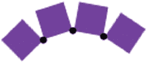

**66** **第 4 章：边缘、边界和岩架**

### 岩架与连接

到目前为止，玩家可以沿着砖砌基座奔跑，到达边缘时绕到屏幕另一侧，还能以惊人的肌肉力量跳跃。为了更刺激，精灵还需要一些与场景互动的元素。为此，你将在精灵上方增加几层供其奔跑的平台。这也会为后续添加敌人时提供一个跑道。

你不会为地下污水管道环境创建实心岩架，而是创建一些由连接件组合起来的灵活方块，完工后它们将在数字世界中相当于绳索桥。这将帮助你很好地理解 Sprite Kit 的 `SKPhysicsJoint` 功能，它允许你将不同的 `PhysicsBodies` 连接在一起，使它们在物理世界中共同模拟。

连接物体时，有五种关节类型可供使用：`SKPhysicsJointFixed`、`SKPhysicsJointSliding`、`SKPhysicsJointSpring`、`SKPhysicsJointLimit` 和 `SKPhysicsJointPin`。你将使用 `SKPhysicsJointPin` 类型来创建岩架，这样它们可以在单个锚点处连接，就像被钉在一起一样（见图 4-3）。

***图 4-3.** 四个 **SKSpriteNode** 之间的三个 **SKPhysicsJointPin** 连接*

你将创建由许多单独方块组成的多个岩架，因此需要单独创建一个类来处理所有细节。

和之前几次一样，继续创建一个名为 `SKBLedge` 的新类，作为 `NSObject` 的子类。修改 `SKBLedge.h` 文件，使其内容如下：

```
#import <Foundation/Foundation.h>
#import <SpriteKit/SpriteKit.h>
#import "SKBAppDelegate.h"

#define kLedgeBrickFileName @"LedgeBrick.png"
#define kLedgeBrickSpacing 9
#define kLedgeSideBufferSpacing 4

@interface SKBLedge : NSObject

- (void)createNewSetOfLedgeNodes:(SKScene *)whichScene startingPoint:(CGPoint)leftSide withHowManyBlocks:(int)blockCount startingIndex:(int)indexStart;

@end
```

将 `LedgeBrick.png` 添加到项目中，并将其移动到 `Sprites` 文件夹。

[www.it-ebooks.info](http://www.it-ebooks.info/)

**第 4 章：边缘、边界和岩架** **67**

现在，你将 `createNewSetOfLedgeNodes` 方法添加到新的 `SKBLedge.m` 文件中：

```
- (void)createNewSetOfLedgeNodes:(SKScene *)whichScene startingPoint:(CGPoint)leftSide withHowManyBlocks:(int)blockCount startingIndex:(int)indexStart
{
  // 岩架节点
  SKTexture *ledgeBrickTexture = [SKTexture textureWithImageNamed:kLedgeBrickFileName];
  CGPoint where = leftSide;

  // 节点，等距分布
  for (int index=0; index < blockCount; index++) {
    SKSpriteNode *theNode = [SKSpriteNode spriteNodeWithTexture:ledgeBrickTexture];
    theNode.name = [NSString stringWithFormat:@"ledgeBrick%d", indexStart+index];
    NSLog(@"%@ created", theNode.name);
    theNode.position = where;
    theNode.anchorPoint = CGPointMake(0.5,0.5);
    where.x += kLedgeBrickSpacing;
    [whichScene addChild:theNode];
  }
}
```


```markdown

您加载了将用于所有方块的纹理。平台的左侧是起始位置，方法参数指定了起始点。您创建了一个`for()`循环，从零开始，直到达到传入的`blockCount`参数。每次循环都会使用纹理创建一个节点，通过将`for()`循环的索引值附加到`ledgeBrick`字符串末尾来为其赋予唯一名称，将名称记录到控制台，设置其位置和锚点，递增下一个方块的位置，并将该节点作为子节点添加到场景中。

现在修改`SKBGameScene.h`文件，以便引用和使用新类：

```
#import "SKBPlayer.h"
#import "SKBLedge.h"
```

```
@interface SKBGameScene : SKScene <SKPhysicsContactDelegate>
```

在`SKBGameScene.m`文件的`initWithSize`方法中追加以下代码，以便在场景初始化时创建平台：

```
[self addChild:brickBase];

// ledge
SKBLedge *sceneLedge = [[SKBLedge alloc] init];
[sceneLedge createNewSetOfLedgeNodes:self startingPoint:CGPointMake(kLedgeSideBufferSpacing, 80) withHowManyBlocks:23 startingIndex:0];
```

这段代码创建了一个新的`SKBLedge`对象，调用其`createNewSetOfLedgeNodes`方法，将平台左边缘几乎对齐屏幕边缘（从底部向上 80 点，由 23 个方块组成），并从索引 0 开始。

构建并运行它，查看新的平台（见图 4-4）。

[www.it-ebooks.info](http://www.it-ebooks.info/)

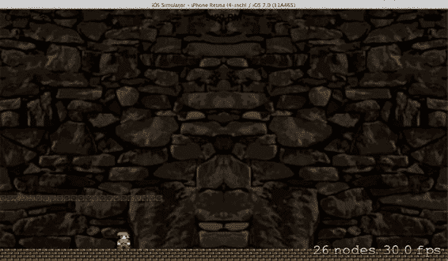

**68**  
**第 4 章：边缘、边界和平台**  
***图 4-4.** 由 23 个方块组成的平台*

精灵还不能与之交互；它目前只是作为背景的一部分。

查看控制台，您可以看到每个节点方块在创建和添加到场景时生成的唯一名称。

现在，向`SKBAppDelegate.h`文件添加一个新的位掩码值，以便处理与平台方块的接触事件：

```
static const uint32_t kBaseCategory = 0x1 << 1;
static const uint32_t kWallCategory = 0x1 << 2;
static const uint32_t kLedgeCategory = 0x1 << 3;
```

每个平台节点方块都需要一个物理体，因此在`SKBLedge.m`文件的`createNewSetOfLedgeNodes`方法的`for()`循环内添加：

```
where.x += kLedgeBrickSpacing;

// physicsBody
theNode.physicsBody = [SKPhysicsBody bodyWithRectangleOfSize:theNode.size];
theNode.physicsBody.categoryBitMask = kLedgeCategory;

[theLedge addChild:theNode];
```

构建并运行它，查看为每个节点添加物理体后的效果。有点滑稽，不是吗？这肯定不是您所期望的，但您理解为什么会这样吗？每个方块都与玩家一样受到重力和物理属性的影响。

[www.it-ebooks.info](http://www.it-ebooks.info/)

**第 4 章：边缘、边界和平台**  
**69**

让我们稍微修改一下，改变平台节点物理体的`affectedByGravity`属性（默认为`YES`）：

```
theNode.physicsBody.categoryBitMask = kLedgeCategory;
theNode.physicsBody.affectedByGravity = NO;

[theLedge addChild:theNode];
```

再次构建并运行。这次方块不会掉落到地面上。现在让玩家跳到它们上面；您会看到一些剧烈的结果！

方块四处飞散，每个方块都对外力作出反应，这些外力是在其他物体与它们接触和碰撞时施加的。就像台球桌上的球被球杆击打一样，方块会立即对力作出反应，这一切都由物理引擎处理。至于玩家精灵，它也会对所有施加的力作出反应，很可能结果失控，因为没有任何动画或边缘处理器为所有这些可能性做好准备。

现在，在节点方块之间添加关节，看看它们能为您做什么。

```
- (void)createNewSetOfLedgeNodes:(SKScene *)whichScene startingPoint:(CGPoint)leftSide withHowManyBlocks:(int)blockCount startingIndex:(int)indexStart
{
    // ledge nodes
```

```


`SKTexture *ledgeBrickTexture = [SKTexture textureWithImageNamed:kLedgeBrickFileName];`  
`NSMutableArray *nodeArray = [[NSMutableArray alloc] initWithCapacity:blockCount-1];`  
`CGPoint where = leftSide;`

`// 节点，均匀分布`

```
for (int index=0; index < blockCount; index++) {
    SKSpriteNode *theNode = [SKSpriteNode spriteNodeWithTexture:ledgeBrickTexture];
    theNode.name = [NSString stringWithFormat:@"ledgeBrick%d", indexStart+index];
    NSLog(@"%@ created", theNode.name);

    theNode.position = where;
    theNode.anchorPoint = CGPointMake(0.5,0.5);
    where.x += kLedgeBrickSpacing;

    // 物理实体
    theNode.physicsBody = [SKPhysicsBody bodyWithRectangleOfSize:theNode.size];
    theNode.physicsBody.categoryBitMask = kLedgeCategory;
    theNode.physicsBody.affectedByGravity = NO;

    [nodeArray insertObject:theNode atIndex:index];
    [whichScene addChild:theNode];
}
```

`// 节点之间的连接`

```
for (int index=0; index <= (blockCount-2); index++) {
    SKSpriteNode *nodeA = [nodeArray objectAtIndex:index];
    SKSpriteNode *nodeB = [nodeArray objectAtIndex:index+1];
    SKPhysicsJointPin *theJoint = [SKPhysicsJointPin jointWithBodyA:nodeA.physicsBody
                                                              bodyB:nodeB.physicsBody
                                                            anchor:CGPointMake(nodeB.position.x, nodeB.position.y)];
    [whichScene.physicsWorld addJoint:theJoint];
}
```

在创建节点时，你需要添加一个数组来保存所有节点，并在每次循环运行时将它们插入其中，以便稍后用于创建连接。一旦节点创建完毕并添加到场景中，就可以开始创建连接了。从第 1 个和第 2 个方块之间的第一个连接开始。第一个节点方块成为`nodeA`，第二个节点成为`nodeB`。创建`SKPhysicsJointPin`对象并将其添加到场景中。

像之前一样构建并运行。让玩家角色跳到或撞到平台方块上，观察变化。

现在，平台被视作一组由橡皮筋连接的方块。这应该能让你初步了解连接件的众多应用之一。

虽然这种行为看起来很酷，但它并不是你想要的最终结果。你希望平台能够响应物理效果，但又能基本保持原位，不会在屏幕上四处飘动。要解决这个问题，你需要把两端的零件固定住。

修改`createNewSetOfLedgeNodes`方法，使其与以下代码一致：

```
theNode.physicsBody.categoryBitMask = kLedgeCategory;
theNode.physicsBody.affectedByGravity = NO;

// 指定左右边缘部件
if (index == 0) {
    // 第一个节点保持固定不动；锚点
    theNode.physicsBody.dynamic = NO;
} else if (index == (blockCount-1)) {
    // 最后一个节点保持固定不动；锚点
    theNode.physicsBody.dynamic = NO;
} else {
    // 边缘部件之间的所有其他节点
    theNode.physicsBody.dynamic = YES;
}

[nodeArray insertObject:theNode atIndex:index];
[whichScene addChild:theNode];
```

通过将`physicsBody`属性设置为 NO（默认设置为 YES），物理实体将忽略所有施加于其上的力和冲量。

构建并运行。和之前一样，让精灵跳到或撞到平台方块上。这次端点被锁定，因此平台不会移动位置，但中间的所有方块仍然像之前一样响应物理力。这个改动带来的副作用是，角色现在可以沿着平台方块顶部奔跑。但一个明显的问题是玩家角色很容易翻倒，这往往会搞砸事情。你可以通过一行代码来解决这个问题。

在`SKBPlayer.m`的`initNewPlayer`方法中添加以下代码行：

```
player.physicsBody.restitution = 0.2;
player.physicsBody.allowsRotation = NO;
```

`// 将精灵添加到场景中`

`[whichScene addChild:player];`

构建并运行。你会发现确实取得了不错的进展。


为了让突出部分的关节运动看起来迟缓，同时仍具有绳索桥的效果，你需要在`SKBLedge.m`文件中添加一些动态属性：

```
theNode.physicsBody.categoryBitMask = kLedgeCategory;
theNode.physicsBody.affectedByGravity = NO;
theNode.physicsBody.linearDamping = 1.0;
theNode.physicsBody.angularDamping = 1.0;
```

...

```
SKPhysicsJointPin *theJoint = [SKPhysicsJointPin jointWithBodyA:nodeA.physicsBody bodyB:nodeB.physicsBody anchor:CGPointMake(nodeB.position.x, nodeB.position.y)];
theJoint.frictionTorque = 1.0;
theJoint.shouldEnableLimits = YES;
theJoint.lowerAngleLimit = 0.0000;
theJoint.upperAngleLimit = 0.0000;
[whichScene.physicsWorld addJoint:theJoint];
```

构建并运行以查看这些更改的效果。是不是有点像一条迟缓的绳索桥？很棒！

在添加另一个突出部分之前，在`SKBGameScene.m`的`initWithSize`方法中稍微修改现有的突出部分生成代码：

```
// Ledges
SKBLedge *sceneLedge = [[SKBLedge alloc] init];
int ledgeIndex = 0;
// ledge, bottom left
int howMany = 0;
if (CGRectGetMaxX(self.frame) < 500)
    howMany = 18;
else
    howMany = 23;
[sceneLedge createNewSetOfLedgeNodes:self startingPoint:CGPointMake(kLedgeSideBufferSpacing, brickBase.position.y+80) withHowManyBlocks:howMany startingIndex:ledgeIndex];
ledgeIndex = ledgeIndex + howMany;
```

你添加了一个整型变量`ledgeIndex`来跟踪随着更多突出块添加时的索引值。你添加了一个屏幕尺寸检查，以便在较小屏幕上压缩突出部分的尺寸。

现在，你可以更轻松地添加更多突出部分。在`initWithSize`方法中，紧接着刚才修改的行之后插入这些代码行：

```
// ledge, bottom right
if (CGRectGetMaxX(self.frame) < 500)
    howMany = 18;
else
    howMany = 23;
[sceneLedge createNewSetOfLedgeNodes:self startingPoint:CGPointMake(CGRectGetMaxX(self.frame)-kLedgeSideBufferSpacing-((howMany-1)*kLedgeBrickSpacing), brickBase.position.y+80) withHowManyBlocks:howMany startingIndex:ledgeIndex];
ledgeIndex = ledgeIndex + howMany;
```

这里唯一困难的部分是确定新突出部分的左侧位置。使用`kLedgeBrickSpacing`和`howMany`值，你可以计算出新突出部分的总宽度，然后从屏幕框架的最右侧减去它。其余代码与之前相同。

构建并运行以查看这两个突出部分（见图 4-5）。

***图 4-5.** 两个突出部分*

现在，你将添加游戏中的其余突出部分——总共七个（见图 4-6）。在这些代码下方插入：

```
// ledge, middle left
if (CGRectGetMaxX(self.frame) < 500)
    howMany = 6;
else
    howMany = 8;
[sceneLedge createNewSetOfLedgeNodes:self startingPoint:CGPointMake(CGRectGetMinX(self.frame)+kLedgeSideBufferSpacing, brickBase.position.y+142) withHowManyBlocks:howMany startingIndex:ledgeIndex];
ledgeIndex = ledgeIndex + howMany;
```

```
// ledge, middle middle
if (CGRectGetMaxX(self.frame) < 500)
    howMany = 31;
else
    howMany = 36;
[sceneLedge createNewSetOfLedgeNodes:self startingPoint:CGPointMake(CGRectGetMidX(self.frame)-((howMany * kLedgeBrickSpacing) / 2), brickBase.position.y+152) withHowManyBlocks:howMany startingIndex:ledgeIndex];
ledgeIndex = ledgeIndex + howMany;
```

```
// ledge, middle right
if (CGRectGetMaxX(self.frame) < 500)
    howMany = 6;
else
    howMany = 9;
[sceneLedge createNewSetOfLedgeNodes:self startingPoint:CGPointMake(CGRectGetMaxX(self.frame)-kLedgeSideBufferSpacing-((howMany-1)*kLedgeBrickSpacing), brickBase.position.y+142) withHowManyBlocks:howMany startingIndex:ledgeIndex];
ledgeIndex = ledgeIndex + howMany;
```

```
// ledge, top left
if (CGRectGetMaxX(self.frame) < 500)
    howMany = 23;
else
```


```objectivec
howMany = 28;

[sceneLedge createNewSetOfLedgeNodes:self startingPoint:CGPointMake(CGRectGetMinX(self.frame)+kLedgeSideBufferSpacing, brickBase.position.y+224) withHowManyBlocks:howMany startingIndex:ledgeIndex];
ledgeIndex = ledgeIndex + howMany;

// ledge, top right
if (CGRectGetMaxX(self.frame) < 500)
    howMany = 23;
else
    howMany = 28;

[sceneLedge createNewSetOfLedgeNodes:self startingPoint:CGPointMake(CGRectGetMaxX(self.frame)-kLedgeSideBufferSpacing-((howMany-1)*kLedgeBrickSpacing), brickBase.position.y+224) withHowManyBlocks:howMany startingIndex:ledgeIndex];
ledgeIndex = ledgeIndex + howMany;
```

构建并运行它（见图[4-6]）。效果很棒。游戏角色有了大量可以奔跑的空间。不过有一个小问题，就是顶部边缘。碰到它会导致角色意外地传送到一侧或另一侧。

[www.it-ebooks.info](http://www.it-ebooks.info/)

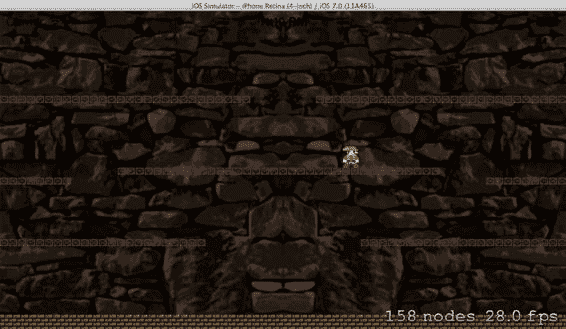

**第 4 章：边缘、边界和壁架**

***图 4-6.** 七个壁架*

你可以做一些小调整，让效果更接近最终成品，同时看看能否修复顶部边缘的问题。

首先，在 `SKBPlayer.h` 文件中修改精灵的跳跃高度：

```objectivec
#define kPlayerRunningIncrement 100
#define kPlayerSkiddingIncrement 20
#define kPlayerJumpingIncrement 8
```

接下来，在 `SKBPlayer.m` 文件的 `jump` 方法中，缩短跳跃持续的时间：

```objectivec
// 适用的动画
SKAction *jumpAnimation = [SKAction animateWithTextures:playerJumpTextures timePerFrame:0.2];
SKAction *jumpAwhile = [SKAction repeatAction:jumpAnimation count:4.0];
```

你可以调整这两个数值，直到尽可能接近最终效果。

[www.it-ebooks.info](http://www.it-ebooks.info/)

**第 4 章：边缘、边界和壁架**

最后，调整 `SKBGameScene.m` 文件的 `initWithSize` 中创建的场景边缘：

```objectivec
self.backgroundColor = [SKColor blackColor];
CGRect edgeRect = CGRectMake(0.0, 0.0, 568.0, 420.0);
self.physicsBody = [SKPhysicsBody bodyWithEdgeLoopFromRect:edgeRect];
self.physicsBody.categoryBitMask = kWallCategory;
```

这会创建一个比游戏画面高 100 点的矩形，且原点仍在屏幕左下角。这实际上将天花板提升了 100 点。这样玩家就几乎不可能撞到这块抬高的天花板了。

## 总结
本章一开始，你快速深入了解了 `PhysicsWorld` 场景和 `PhysicsBody` 节点。你无需太多操作就亲身体验了这两个元素的强大功能和多样性。你对这些对象的某些属性（包括密度、线性阻尼和弹性）进行了调整，然后观察了其效果。你开始探索如何设置和处理碰撞事件，以便实现屏幕环绕效果。随后，你向玩家精灵施加了一个脉冲力，使其按指令跳跃，并更新了动画以匹配其动作。最后，你通过制作一组砖块，并用关节将它们连接起来（当它们被添加到场景的物理引擎中时，这些关节像橡皮筋一样发挥作用），添加了一些可供奔跑的壁架。

因此，你取得了不少成果。你的精灵拥有一个广阔的世界以及多个障碍物，可以在其间奔跑并与之互动。但游戏有点孤单，还需要更多可做的事情。下一章将通过教你如何在游戏画面中添加更多精灵，很好地满足精灵的愿望！

[www.it-ebooks.info](http://www.it-ebooks.info/)

## 章节：更多动画精灵：“敌人”与“奖励道具”

### 对立面

到目前为止，这个游戏还只是单枪匹马地无尽奔跑和跳跃，没有任何明确目标。用我小表弟的话说：“太逊了！”这说法稍微有点悲观，但确实一针见血。好吧，是时候改变这一切了。在本章中，你将生成一些坏蛋来活跃一下气氛。


```markdown
在执行此操作之前，你需要移动部分代码，以提升可读性并优化组织结构。

你需将平台和砖块基座的创建过程从 `initWithSize` 方法中提取出来，放入一个名为 `createSceneContents` 的独立方法中。该方法位于 `SKBGameScene.m` 文件内，并紧接在 `initWithSize` 下方插入：

```
[self addChild:backdrop];

[self createSceneContents];
}

return self;

}

#pragma mark 场景创建

- (void)createSceneContents
{

// 砖块基座
SKSpriteNode *brickBase = [SKSpriteNode
spriteNodeWithImageNamed:@"Base_600"];
brickBase.name = @"brickBaseNode";
brickBase.position = CGPointMake(CGRectGetMidX(self.frame),
brickBase.size.height/2);
brickBase.physicsBody = [SKPhysicsBody
bodyWithRectangleOfSize:brickBase.size];
brickBase.physicsBody.categoryBitMask = kBaseCategory;
brickBase.physicsBody.dynamic = NO;
[self addChild:brickBase];

// 平台
SKBLedge *sceneLedge = [[SKBLedge alloc] init];
int ledgeIndex = 0;

// 平台，左下角
int howMany = 0;
if (CGRectGetMaxX(self.frame) < 500)
howMany = 18;
else
howMany = 23;

[sceneLedge createNewSetOfLedgeNodes:self
startingPoint:CGPointMake(kLedgeSideBufferSpacing,
brickBase.position.y+80) withHowManyBlocks:howMany
startingIndex:ledgeIndex];
ledgeIndex = ledgeIndex + howMany;

// 平台，右下角
.
.
.

// 平台，右上角
if (CGRectGetMaxX(self.frame) < 500)
howMany = 23;
else
howMany = 28;

[sceneLedge createNewSetOfLedgeNodes:self
startingPoint:CGPointMake(CGRectGetMaxX(self.frame)-
kLedgeSideBufferSpacing-((howMany-1)*kLedgeBrickSpacing),
brickBase.position.y+224) withHowManyBlocks:howMany
startingIndex:ledgeIndex];
ledgeIndex = ledgeIndex + howMany;

}
```

优化纹理生成
-----------------------------

目前，精灵纹理是在玩家生成到场景中时创建的。请将其移至场景的 `initWithSize` 方法中，并在精灵生成时，将纹理传递给它们。随着你开始向游戏中添加更多精灵和角色，精灵纹理将包含所有这些精灵的纹理，因此你最好在游戏场景启动时初始化精灵纹理，而不是在玩家精灵生成时。

在 `SKBGameScene.h` 文件中为已完成的精灵添加一个实例变量：

```objc
@interface SKBGameScene : SKScene <SKPhysicsContactDelegate>

@property (strong, nonatomic) SKBPlayer *playerSprite;
@property (strong, nonatomic) SKBSpriteTextures *spriteTextures;
```

在 `SKBGameScene.m` 文件中，修改 `initWithSize` 以包含此更改：

```objc
self.physicsWorld.contactDelegate = self;

// 初始化并创建我们的精灵纹理
_spriteTextures = [[SKBSpriteTextures alloc] init];
[_spriteTextures createAnimationTextures];

NSString *fileName = @"";
```

然后，从 `SKBPlayer.m` 文件的 `initNewPlayer` 方法中移除相同的代码块，以及向局部实例变量的赋值：

```objc
// 初始化并创建我们的精灵纹理
SKBSpriteTextures *playerTextures = [[SKBSpriteTextures alloc] init];
[playerTextures createAnimationTextures];

// 初始帧
SKTexture *f1 = [SKTexture textureWithImageNamed: kPlayerStillRightFileName];

// 我们玩家角色的精灵 & 在场景中的起始位置
SKBPlayer *player = [SKBPlayer spriteNodeWithTexture:f1];
player.name = @"player1";
player.position = location;
player.spriteTextures = playerTextures;
player.playerStatus = SBPlayerFacingRight;
```

由于你很快将需要在玩家类中引用游戏场景，你应向 `SKBPlayer.m` 文件添加必要的 `#import` 方法：

```objc
#import "SKBPlayer.h"
#import "SKBGameScene.h"

@implementation SKBPlayer
```
```


现在你向`SKBPlayer`类添加一个方法，用于将现有的精灵纹理应用于新生成的玩家精灵。首先在`SKBPlayer.h`文件中添加一个公共方法声明：

```objc
+ (SKBPlayer *)initNewPlayer:(SKScene *)whichScene
          startingPoint:(CGPoint)location;

- (void)spawnedInScene:(SKScene *)whichScene;

- (void)wrapPlayer:(CGPoint)where;
```

然后在`SKBPlayer.m`文件中，紧接在`initNewPlayer`方法下方插入该方法：

```objc
// add the sprite to the scene
[whichScene addChild:player];
return player;
}

- (void)spawnedInScene:(SKScene *)whichScene
{
    SKBGameScene *theScene = (SKBGameScene *)whichScene;
    _spriteTextures = theScene.spriteTextures;
}
```

要完成对玩家精灵的此次修改，在`SKBGameScene.m`文件中修改`touchesBegan`方法，在适当时间调用此新方法：

```objc
if (!_playerSprite) {
    _playerSprite = [SKBPlayer initNewPlayer:self startingPoint:location];
    [_playerSprite spawnedInScene:self];
} else if (location.y >= (self.frame.size.height / 2 )) {
```

对用户而言，什么都没有改变；但在底层，你已建立了一个基础，可以更轻松地添加更多精灵。你的代码也更易于阅读和理解。

## 敌人“Ratz”类

名为“ratz”的新敌人精灵拥有自己的一系列动画帧。你需要将这些帧添加到项目中，并移入`Sprites`文件夹。你可能还想在`Sprites`文件夹内专门为新角色创建一个新的组（文件夹）。从`Images`文件夹中添加所有以`Ratz_`为前缀的 10 张图片。

现在你可以在`SKBSpriteTexture`类中的纹理生成方法中使用它们了。首先，需要添加一些头文件（`SKBSpriteTextures.h`）：

```objc
#define kPlayerStillLeftFileName @"Player_Left_Still.png"
#define kRatzRunRight1FileName @"Ratz_Right1.png"
#define kRatzRunRight2FileName @"Ratz_Right2.png"
#define kRatzRunRight3FileName @"Ratz_Right3.png"
#define kRatzRunRight4FileName @"Ratz_Right4.png"
#define kRatzRunRight5FileName @"Ratz_Right5.png"
#define kRatzRunLeft1FileName @"Ratz_Left1.png"
#define kRatzRunLeft2FileName @"Ratz_Left2.png"
#define kRatzRunLeft3FileName @"Ratz_Left3.png"
#define kRatzRunLeft4FileName @"Ratz_Left4.png"
#define kRatzRunLeft5FileName @"Ratz_Left5.png"

@interface SKBSpriteTextures : NSObject

@property (nonatomic, strong) NSArray *playerRunRightTextures,
                                  *playerJumpRightTextures;
@property (nonatomic, strong) NSArray *playerSkiddingRightTextures,
                                  *playerStillFacingRightTextures;
@property (nonatomic, strong) NSArray *playerRunLeftTextures,
                                  *playerJumpLeftTextures;
@property (nonatomic, strong) NSArray *playerSkiddingLeftTextures,
                                  *playerStillFacingLeftTextures;
@property (nonatomic, strong) NSArray *ratzRunLeftTextures,
                                  *ratzRunRightTextures;

- (void)createAnimationTextures;
```

然后修改`SKBSpriteTextures.m`文件中的`createAnimationTextures`方法：

```objc
// left, still
f1 = [SKTexture textureWithImageNamed:kPlayerStillLeftFileName];
_playerStillFacingLeftTextures = @[f1];

// Ratz
// right, running
f1 = [SKTexture textureWithImageNamed:kRatzRunRight1FileName];
f2 = [SKTexture textureWithImageNamed:kRatzRunRight2FileName];
f3 = [SKTexture textureWithImageNamed:kRatzRunRight3FileName];
f4 = [SKTexture textureWithImageNamed:kRatzRunRight4FileName];
SKTexture *f5 = [SKTexture textureWithImageNamed:kRatzRunRight5FileName];
_ratzRunRightTextures = @[f1,f2,f3,f4,f5];

// left, running
f1 = [SKTexture textureWithImageNamed:kRatzRunLeft1FileName];
f2 = [SKTexture textureWithImageNamed:kRatzRunLeft2FileName];
f3 = [SKTexture textureWithImageNamed:kRatzRunLeft3FileName];
f4 = [SKTexture textureWithImageNamed:kRatzRunLeft4FileName];
f5 = [SKTexture textureWithImageNamed:kRatzRunLeft5FileName];
_ratzRunLeftTextures = @[f1,f2,f3,f4,f5];
```

你还需要在`SKBAppDelegate.h`文件中添加另一个位掩码类别：

```objc
static const uint32_t kLedgeCategory = 0x1 << 3;
static const uint32_t kRatzCategory = 0x1 << 4;
```

完成后，你将像创建主玩家精灵一样，为第一个敌人类型创建一个`SKSpriteNode`的自定义子类。新建一个名为`SKBRatz`的类，作为`SKSpriteNode`的子类。

修改`SKBRatz.h`文件以匹配以下内容：

```objc
#import <SpriteKit/SpriteKit.h>
#import "SKBAppDelegate.h"
#import "SKBSpriteTextures.h"

#define kRatzRunningIncrement 40

typedef enum : int {
    SBRatzRunningLeft = 0,
    SBRatzRunningRight
} SBRatzStatus;

@interface SKBRatz : SKSpriteNode

@property int ratzStatus;
@property (nonatomic, strong) SKBSpriteTextures *spriteTextures;

+ (SKBRatz *)initNewRatz:(SKScene *)whichScene startingPoint:(CGPoint)location ratzIndex:(int)index;
- (void)spawnedInScene:(SKScene *)whichScene;
- (void)wrapRatz:(CGPoint)where;
- (void)runRight;
- (void)runLeft;

@end
```

现在你将一次性为`Ratz`精灵添加初始代码，包括初始化、环绕和双向运行的方法：

```objc
#import "SKBRatz.h"
#import "SKBGameScene.h"

@implementation SKBRatz

#pragma mark Initialization

+ (SKBRatz *)initNewRatz:(SKScene *)whichScene startingPoint:(CGPoint)location ratzIndex:(int)index
{
    SKTexture *ratzTexture = [SKTexture textureWithImageNamed:kRatzRunRight1FileName];
    SKBRatz *ratz = [SKBRatz spriteNodeWithTexture:ratzTexture];
    ratz.name = [NSString stringWithFormat:@"ratz%d", index];
    ratz.position = location;
    ratz.physicsBody = [SKPhysicsBody bodyWithRectangleOfSize:ratz.size];
    ratz.physicsBody.categoryBitMask = kRatzCategory;
    ratz.physicsBody.contactTestBitMask = kWallCategory | kBaseCategory;
    ratz.physicsBody.density = 1.0;
    ratz.physicsBody.linearDamping = 0.1;
    ratz.physicsBody.restitution = 0.2;
    ratz.physicsBody.allowsRotation = NO;
    [whichScene addChild:ratz];
    return ratz;
}

- (void)spawnedInScene:(SKScene *)whichScene
{
    SKBGameScene *theScene = (SKBGameScene *)whichScene;
    _spriteTextures = theScene.spriteTextures;
    // set initial direction and start moving
    if (self.position.x < CGRectGetMidX(whichScene.frame))
        [self runRight];
    else
        [self runLeft];
}

#pragma mark Screen wrap

- (void)wrapRatz:(CGPoint)where
{
    SKPhysicsBody *storePB = self.physicsBody;
    self.physicsBody = nil;
    self.position = where;
    self.physicsBody = storePB;
}

#pragma mark Movement

- (void)runRight
{
    _ratzStatus = SBRatzRunningRight;
    SKAction *walkAnimation = [SKAction animateWithTextures:_spriteTextures.ratzRunRightTextures
                                               timePerFrame:0.05];
    SKAction *walkForever = [SKAction repeatActionForever:walkAnimation];
    [self runAction:walkForever];
    SKAction *moveRight = [SKAction moveByX:kRatzRunningIncrement y:0 duration:1];
    SKAction *moveForever = [SKAction repeatActionForever:moveRight];
    [self runAction:moveForever];
}

- (void)runLeft
{
    _ratzStatus = SBRatzRunningLeft;
    SKAction *walkAnimation = [SKAction animateWithTextures:_spriteTextures.ratzRunLeftTextures
                                               timePerFrame:0.05];
    SKAction *walkForever = [SKAction repeatActionForever:walkAnimation];
    [self runAction:walkForever];
    SKAction *moveLeft = [SKAction moveByX:-kRatzRunningIncrement y:0 duration:1];
    SKAction *moveForever = [SKAction repeatActionForever:moveLeft];
    [self runAction:moveForever];
}

@end
```

你可能会注意到，这段代码与玩家精灵的大部分代码相同，只有少量小改动。

## 时机


现在您需要决定在何时何地生成新的敌人精灵。暂时，您会让敌人从屏幕顶部（可能还有左侧）掉落到下水道区域。它的出现将与玩家的出现同步，而目前玩家是在用户触摸屏幕时出现的。为了引入`SKAction`的`waitForDuration`方法，您将在玩家出现后、敌人精灵生成前添加四秒延迟。

您需要在游戏场景中引用新类，因此在`SKBGameScene.h`文件中添加必要的`#import`：

```
#import "SKBPlayer.h"
#import "SKBRatz.h"
#define kEnemySpawnEdgeBufferX 60
```

在`SKBGameScene.m`文件的`touchesBegan`方法中添加以下五行代码：

```
if (!_playerSprite) {
    _playerSprite = [SKBPlayer initNewPlayer:self startingPoint:location];
    [_playerSprite spawnedInScene:self];

    SKAction *spawnDelay = [SKAction waitForDuration:4];
    [self runAction:spawnDelay completion:^{
        SKBRatz *newEnemy = [SKBRatz initNewRatz:self
                                  startingPoint:CGPointMake(50, 280)
                                       ratzIndex:0];
        [newEnemy spawnedInScene:self];
    }];
} else if (location.y >= (self.frame.size.height / 2 )) {
```

构建并运行程序，您会看到新敌人在玩家出现四秒后生成（见图 5-1）。

[www.it-ebooks.info](http://www.it-ebooks.info/)

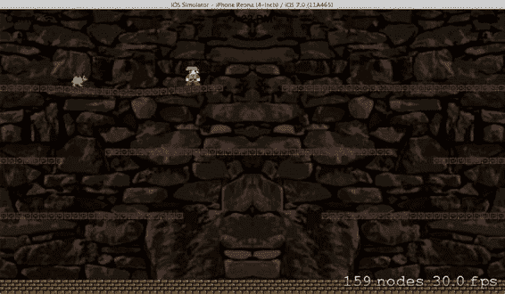

**第 5 章：更多动画精灵：“敌人”和“奖励”**  
**85**  
**图 5-1.** 敌人精灵已生成

与您之前使用的其他`SKAction`一样，`waitForDuration`对于游戏中的事件计时非常有用。您将其与一个完成块结合使用，以便在等待计时完成时触发特定代码的执行。这只是生成敌人的一种临时方式，以便您能快速看到刚刚修改和添加的所有代码的效果。在下一章中，您将创建更好的敌人生成解决方案。

---

### 环绕

您可能已经注意到，接下来需要考虑的事项之一是敌人精灵的屏幕环绕。您已经准备好了处理环绕的代码，但尚未在`didBeginContact`方法中添加必要的代码来触发它。现在，您将在`SKBGameScene.m`文件中添加这些代码：

```
NSLog(@"player contacted right edge");
[_playerSprite wrapPlayer:CGPointMake(10,
                                      _playerSprite.position.y)];
}
}
}

// Ratz / sideWalls
if ((((firstBody.categoryBitMask & kWallCategory) != 0) && ((secondBody.categoryBitMask & kRatzCategory) != 0))) {
    SKBRatz *theRatz = (SKBRatz *)secondBody.node;
    if (theRatz.position.x < 100) {
        [theRatz wrapRatz:CGPointMake(self.frame.size.width-11,
                                      theRatz.position.y)];
    } else {
        [theRatz wrapRatz:CGPointMake(11, theRatz.position.y)];
    }
}
```

构建并运行程序，查看敌人屏幕环绕功能是否成功实现。

---

### Update 方法

在 Sprite Kit 渲染循环的每一帧中，您可以使用一个名为`update`的方法。您可以使用此方法来实现游戏逻辑或敌人的人工智能（A.I.）。这里是处理敌人精灵生成的好地方，无需将它们绑定到触摸或接触事件中。因此，您将把精灵生成过程移到此处。

您需要几个实例变量，因此首先在`SKBGameScene.h`文件中添加它们：

```
@property (strong, nonatomic) SKBPlayer *playerSprite;
@property (strong, nonatomic) SKBSpriteTextures *spriteTextures;
@property int spawnedEnemyCount;
@property BOOL enemyIsSpawningFlag;
@end
```

在`SKBGameScene.m`文件中，删除旧的敌人精灵生成代码，使修改后的`touchesBegan`方法如下所示：

```
if (!_playerSprite) {
    _playerSprite = [SKBPlayer initNewPlayer:self startingPoint:location];
    [_playerSprite spawnedInScene:self];
} else if (location.y >= (self.frame.size.height / 2 )) {
```


```objectivec
// 用户触摸了屏幕上半部分（0 = 屏幕底部）
if (status != SBPlayerJumpingLeft && status != SBPlayerJumpingRight && status != SBPlayerJumpingUpFacingLeft && status != SBPlayerJumpingUpFacingRight) {
    [_playerSprite jump];
}
} else ...
```

在 `createSceneContents` 方法的顶部添加一些变量初始化代码：

```objectivec
- (void)createSceneContents
{
    // 初始化敌人与调度
    _spawnedEnemyCount = 0;
    _enemyIsSpawningFlag = NO;

    // 砖块基底
    SKSpriteNode *brickBase = [SKSpriteNode spriteNodeWithImageNamed:@"Base_600"];
```

然后，通过在提供的 `update:` 方法中添加生成代码，即可完成更改：

```objectivec
-(void)update:(CFTimeInterval)currentTime {
    /* 每帧渲染前调用 */
    if (!_enemyIsSpawningFlag && _spawnedEnemyCount < 5) {
        _enemyIsSpawningFlag = YES;
        int castIndex = _spawnedEnemyCount;
        int scheduledDelay = 5;
        int startX = 50;
        int startY = 280;

        // 开始延迟，完成后生成新敌人
        SKAction *spacing = [SKAction waitForDuration:scheduledDelay];
        [self runAction:spacing completion:^{
            // 创建并生成新敌人
            _enemyIsSpawningFlag = NO;
            _spawnedEnemyCount = _spawnedEnemyCount + 1;
            SKBRatz *newEnemy = [SKBRatz initNewRatz:self
                                       startingPoint:CGPointMake(startX, startY)
                                          ratzIndex:castIndex];
            [newEnemy spawnedInScene:self];
        }];
    }
}
```

构建并运行程序，验证此时是否每五秒生成五个敌人，且不受触摸屏幕生成玩家的影响。那么这是如何实现的呢？

`_spawnedEnemyCount = 0;`
`_enemyIsSpawningFlag = NO;`

当场景首次创建时，这两个变量被设置。

`if (!_enemyIsSpawningFlag && _spawnedEnemyCount < 5) {`

第一次调用 `update:` 方法时，此 `if()` 表达式返回 true，因此会执行其中的代码。

`_enemyIsSpawningFlag = YES;`
`int castIndex = _spawnedEnemyCount;`

你立即将 `enemyIsSpawningFlag` 设置为 true，这样下一次调用 `update:` 方法时就不会再触发 `if()` 语句。你将使用 `spawnedEnemyCount` 来跟踪已生成的敌人数量。

`int scheduledDelay = 5;`
`int startX = 50;`
`int startY = 280;`

这些变量决定了生成敌人的间隔时间（以秒为单位），并设置了起始位置。

```objectivec
// 开始延迟，完成后生成新敌人
SKAction *spacing = [SKAction waitForDuration:scheduledDelay];
[self runAction:spacing completion:^{
    // 创建并生成新敌人
    _enemyIsSpawningFlag = NO;
    _spawnedEnemyCount = _spawnedEnemyCount + 1;
    SKBRatz *newEnemy = [SKBRatz initNewRatz:self startingPoint:CGPointMake(startX, startY) ratzIndex:castIndex];
    [newEnemy spawnedInScene:self];
}];
```

这与之前你在 `touchesBegan` 事件中使用的方法类似。你创建了一个 `SKAction`，在五秒延迟期间不执行任何操作，完成后触发敌人生成。在此过程中，你将 `enemyIsSpawningFlag` 重置为 false，以便下一次调用 `update:` 方法时开始下一次敌人生成。同时，你将敌人数加一。这一切都非常直接易懂。

现在，你可以玩得更有趣一些！将 `scheduledDelay` 改为 2，并将最大敌人限制改为 25：

```objectivec
if (!_enemyIsSpawningFlag && _spawnedEnemyCount < 25) {
    _enemyIsSpawningFlag = YES;
    int castIndex = _spawnedEnemyCount;
    int scheduledDelay = 2;
    int startX = 50;
```

构建并运行程序。突然之间，你得到了类似旅鼠的效果。注意观察，随着时间的推移，它们会互相叠在一起，就像玩家和老鼠精灵（ratz sprites）在 ledge 顶部奔跑时发生的情况一样（参见图 5-2）。

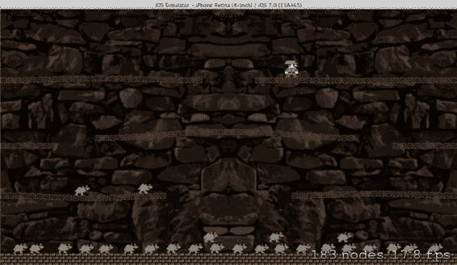
```


***图 5-2.** 相互踩踏*

**碰撞**

你只需添加一行代码就能改变这种混乱的行走方式。将以下代码插入到 `SKBRatz.m` 的 `initNewRatz` 方法中：

```
ratz.physicsBody.categoryBitMask = kRatzCategory;
ratz.physicsBody.contactTestBitMask = kWallCategory | kBaseCategory ;
ratz.physicsBody.collisionBitMask = kBaseCategory | kWallCategory | kLedgeCategory ;
ratz.physicsBody.density = 1.0;
ratz.physicsBody.linearDamping = 0.1;
```

现在构建并运行你的程序。不再出现互相踩踏的情况。事实上，你还能看到这一改变的另一个结果——它们之间不再发生碰撞。它们可以彼此穿越而过。

你指定了感兴趣与之碰撞的节点类型。任何未包含的类型将突然对这些类型的碰撞不再产生影响。

在 `SKBPlayer.m` 文件的 `initNewPlayer` 方法中添加以下代码：

```
player.physicsBody.contactTestBitMask = kBaseCategory | kWallCategory;
player.physicsBody.collisionBitMask = kBaseCategory | kWallCategory | kLedgeCategory ;
player.physicsBody.density = 1.0;
```

现在构建并运行程序，尝试让玩家角色穿过成群的敌人。你会发现没有任何效果。

既然谈到了接触和碰撞，你最好同时移除玩家和敌人精灵的 `kBaseCategory` 接触位掩码，因为你不需要处理 `kBaseCategory` 类型节点的接触事件。你只需要它们用于 `kWallCategory` 事件：

```
player.physicsBody.contactTestBitMask = kWallCategory;
ratz.physicsBody.contactTestBitMask = kWallCategory ;
```

> **注意** 请注意，尽量保持这些位掩码的简洁有助于略微提高帧率。

现在你将改变设置，使敌人在生成时交替出现在两侧。首先需要在 `SKBGameScene.h` 文件中定义几个常量：

```
#import "SKBRatz.h"

#define kEnemySpawnEdgeBufferX 60
#define kEnemySpawnEdgeBufferY 60

@interface SKBGameScene : SKScene <SKPhysicsContactDelegate>
```

然后修改 `SKBGameScene.m` 文件 `update` 方法中的起始点代码：

```
int scheduledDelay = 2;
int leftSideX = CGRectGetMinX(self.frame)+kEnemySpawnEdgeBufferX;
int rightSideX = CGRectGetMaxX(self.frame)-kEnemySpawnEdgeBufferX;
int topSideY = CGRectGetMaxY(self.frame)-kEnemySpawnEdgeBufferY;
int startX = 0;

// 交替切换两侧生成
if (castIndex % 2 == 0)
    startX = leftSideX;
else
    startX = rightSideX;

int startY = topSideY;

// 开始延迟，延迟完成后生成新敌人
SKAction *spacing = [SKAction waitForDuration:scheduledDelay];
```

构建并运行程序，你会发现现在生成敌人精灵时会交替出现在两侧。它们的初始移动方向已在 `SKBRatz` 类的 `SpawnedInScene` 方法中处理：

```
// 设置初始方向并开始移动
if (self.position.x < CGRectGetMidX(whichScene.frame))
    [self runRight];
else
    [self runLeft];
```

你简单运用了一个数学函数（取模运算符 `%`），使得当 `castIndex` 值为偶数时 `if()` 语句条件成立。条件成立时，敌人精灵在屏幕左侧生成；不成立时则在右侧生成。就是这么简单。

现在敌人朝不同方向移动了，你可以着手处理碰撞。目前，所有角色都能互相穿行，仿佛都是幽灵。但你想让它们在相遇时改变方向。该怎么做呢？很好，你将使用 `SKBGameScene.m` 文件中现有的 `didBeginContact` 方法来检测碰撞并进行适当处理。


# 排版后的内容

首先，你需要在 `SKBRatz.m` 文件的 `initNewRatz` 方法中，将 `kRatzCategory` 添加到敌人精灵的 `contactTestBitMask` 和 `collisionBitMask` 属性中：

```
ratz.physicsBody.contactTestBitMask = kWallCategory | kRatzCategory;
ratz.physicsBody.collisionBitMask = kBaseCategory | kWallCategory |
kLedgeCategory | kRatzCategory;
ratz.physicsBody.density = 1.0;
```

你希望在发生碰撞时运行一些特定的代码，因此需要向敌人类别中添加两个方法。你需要在 `SKBRatz.h` 文件中声明这些公有方法：

```
- (void)runRight;
- (void)runLeft;
- (void)turnRight;
- (void)turnLeft;
@end
```

然后，将这些方法添加到 `SKBRatz.m` 文件中，将它们插入到 `runLeft` 方法之后：

```
[self runAction:moveForever];
}

- (void)turnRight
{
    self.ratzStatus = SBRatzRunningRight;
    [self removeAllActions];
    SKAction *moveRight = [SKAction moveByX:5 y:0 duration:0.4];
    [self runAction:moveRight completion:^{[self runRight];}];
}

- (void)turnLeft
{
    self.ratzStatus = SBRatzRunningLeft;
    [self removeAllActions];
    SKAction *moveLeft = [SKAction moveByX:-5 y:0 duration:0.4];
    [self runAction:moveLeft completion:^{[self runLeft];}];
}
@end
```

[www.it-ebooks.info](http://www.it-ebooks.info/)

## 第 5 章：更多动画精灵：“敌人”与“奖励”

然后，在 `SKBGameScene.m` 文件的 `didBeginContact` 方法中，在“Ratz/侧墙”的 `if()` 语句之后插入一个新的 `if()` 语句：

```
// Ratz / sideWalls
if ((((firstBody.categoryBitMask & kWallCategory) != 0) &&
     ((secondBody.categoryBitMask & kRatzCategory) != 0))) {
    SKBRatz *theRatz = (SKBRatz *)secondBody.node;
    if (theRatz.position.x < 100) {
        [theRatz wrapRatz:CGPointMake(self.frame.size.width-11,
                                       theRatz.position.y)];
    } else {
        [theRatz wrapRatz:CGPointMake(11, theRatz.position.y)];
    }
}

// Ratz / Ratz
if ((((firstBody.categoryBitMask & kRatzCategory) != 0) &&
     ((secondBody.categoryBitMask & kRatzCategory) != 0))) {
    SKBRatz *theFirstRatz = (SKBRatz *)firstBody.node;
    SKBRatz *theSecondRatz = (SKBRatz *)secondBody.node;
    NSLog(@"%@ & %@ have collided...", theFirstRatz.name, theSecondRatz.name);

    // 使第一个 Ratz 转向并改变方向
    if (theFirstRatz.ratzStatus == SBRatzRunningLeft) {
        [theFirstRatz turnRight];
    } else if (theFirstRatz.ratzStatus == SBRatzRunningRight) {
        [theFirstRatz turnLeft];
    }

    // 使第二个 Ratz 转向并改变方向
    if (theSecondRatz.ratzStatus == SBRatzRunningLeft) {
        [theSecondRatz turnRight];
    } else if (theSecondRatz.ratzStatus == SBRatzRunningRight) {
        [theSecondRatz turnLeft];
    }
}
```

构建并运行程序，查看这些变化的效果。敌人精灵不再互相穿过，当它们彼此碰撞时，会暂停并转身（见图 5-3）。

[www.it-ebooks.info](http://www.it-ebooks.info/)

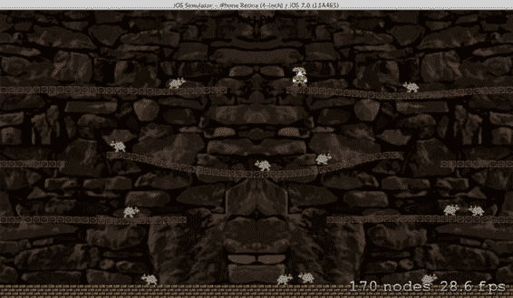

**第 5 章：更多动画精灵：“敌人”与“奖励”**

**93**

***图 5-3.** 交替生成点与碰撞反弹*

```
- (void)turnRight
{
    self.ratzStatus = SBRatzRunningRight;
    [self removeAllActions];
    SKAction *moveRight = [SKAction moveByX:5 y:0 duration:0.4];
    [self runAction:moveRight completion:^{[self runRight];}];
}
```

如果查看 `turnRight` 和 `turnLeft` 方法的代码，可以看到你创建了一个 `SKAction`，使它们稍微分开。当该动作完成后，会触发它们向相反方向运行。

`NSLog(@"%@ & %@ have collided...", theFirstRatz.name, theSecondRatz.name);` 你在 `didBeginContact` 方法中触发该调用时添加了一个 `NSLog` 方法调用，以便在控制台中查看哪些敌人受到了影响。你可以随时注释掉这些 `NSLog` 调用，因为它们可能会迅速产生过多需要关注的数据。

这些调用仅用于帮助你理解添加的任何新代码片段，并用于调试目的。

[www.it-ebooks.info](http://www.it-ebooks.info/)


# 第 5 章：更多动画精灵：“敌人”与“奖励金币”

## 奖励金币

英雄在被敌人满屏追赶的同时，也需要收集一些好东西——也就是奖励金币。在地面层（即下水道游戏区域上方）游荡的人类总会掉落零钱，当这些钱滚进下水道时，玩家可以尝试收集它们。这与添加敌人精灵的流程类似，而这些金币将包含几个动画帧。现在要将这些动画帧添加到项目中，并将它们移入`Sprites`文件夹。

你可能还希望在`Sprites`文件夹内为这个新精灵添加一个新组（文件夹）。从`Images`文件夹中添加三张以`Coin_`为前缀的图片。

现在你可以在`SKBSpriteTexture`类的纹理生成方法中使用它们了。首先需要在头文件中添加一些声明（`SKBSpriteTexures.h`）：

```
#define kRatzRunLeft4FileName @"Ratz_Left4.png"
#define kRatzRunLeft5FileName @"Ratz_Left5.png"
#define kCoin1FileName @"Coin1.png"
#define kCoin2FileName @"Coin2.png"
#define kCoin3FileName @"Coin3.png"

@interface SKBSpriteTextures : NSObject

@property (nonatomic, strong) NSArray *playerRunRightTextures, *playerJumpRightTextures;
@property (nonatomic, strong) NSArray *playerSkiddingRightTextures, *playerStillFacingRightTextures;
@property (nonatomic, strong) NSArray *playerRunLeftTextures, *playerJumpLeftTextures;
@property (nonatomic, strong) NSArray *playerSkiddingLeftTextures, *playerStillFacingLeftTextures;
@property (nonatomic, strong) NSArray *ratzRunLeftTextures, *ratzRunRightTextures;
@property (nonatomic, strong) NSArray *coinTextures;
```

然后在`SKBSpriteTextures.m`文件的`createAnimationTextures`方法中添加：

```
_ratzRunLeftTextures = @[f1,f2,f3,f4,f5];

// 金币
f1 = [SKTexture textureWithImageNamed:kCoin1FileName];
f2 = [SKTexture textureWithImageNamed:kCoin2FileName];
f3 = [SKTexture textureWithImageNamed:kCoin3FileName];
_coinTextures = @[f1,f2,f3,f2];
}

@end
```

[www.it-ebooks.info](http://www.it-ebooks.info/)

# 第 5 章：更多动画精灵：“敌人”与“奖励金币”

动画纹理完成后，你可以为奖励金币类型创建一个`SKSpriteNode`的新自定义子类，就像为主角和敌人精灵所做的那样。创建一个名为`SKBCoin`的新类，作为`SKSpriteNode`的子类。将`SKBCoin.h`文件修改为以下内容：

```
#import <SpriteKit/SpriteKit.h>
#import "SKBAppDelegate.h"
#import "SKBSpriteTextures.h"

#define kCoinRunningIncrement 40

typedef enum : int {
    SBCoinRunningLeft = 0,
    SBCoinRunningRight
} SBCoinStatus;

@interface SKBCoin : SKSpriteNode

@property int coinStatus;
@property (nonatomic, strong) SKBSpriteTextures *spriteTextures;
+ (SKBCoin *)initNewCoin:(SKScene *)whichScene startingPoint:(CGPoint)location coinIndex:(int)index;
- (void)spawnedInScene:(SKScene *)whichScene;
- (void)wrapCoin:(CGPoint)where;
- (void)runRight;
- (void)runLeft;
- (void)turnRight;
- (void)turnLeft;

@end
```

你还需要在`SKBAppDelegate.h`文件中添加另一个位掩码类别。你会注意到我们将其插入在 ledge 和 ratz 条目之间，但顺序*并不*重要，只要数值唯一即可！（这纯属个人偏好，用通俗的话说，就是“强迫症”问题。）

```
static const uint32_t kLedgeCategory = 0x1 << 3;
static const uint32_t kCoinCategory = 0x1 << 4;
static const uint32_t kRatzCategory = 0x1 << 5;
```

如同对`Ratz`类所做的那样，一次性为`Coin`精灵添加初始代码，包括用于初始化、环绕以及两个方向运动的函数：

```
#import "SKBCoin.h"
#import "SKBGameScene.h"

@implementation SKBCoin
```

[www.it-ebooks.info](http://www.it-ebooks.info/)

# 第 5 章：更多动画精灵：“敌人”与“奖励金币”

```
#pragma mark 初始化

+ (SKBCoin *)initNewCoin:(SKScene *)whichScene startingPoint:(CGPoint)location coinIndex:(int)index
{
```


`SKTexture *coinTexture = [SKTexture textureWithImageNamed:kCoin1FileName];` `SKBCoin *coin = [SKBCoin spriteNodeWithTexture:coinTexture];`

`coin.name = [NSString stringWithFormat:@"coin%d", index];` `coin.position = location;`

`coin.physicsBody = [SKPhysicsBody bodyWithRectangleOfSize:coin.size];` `coin.physicsBody.categoryBitMask = kCoinCategory;`

`coin.physicsBody.contactTestBitMask = kWallCategory | kCoinCategory;` `coin.physicsBody.collisionBitMask = kBaseCategory | kWallCategory | kLedgeCategory | kCoinCategory;`

`coin.physicsBody.density = 1.0;`

`coin.physicsBody.linearDamping = 0.1;`

`coin.physicsBody.restitution = 0.2;`

`coin.physicsBody.allowsRotation = NO;`

`[whichScene addChild:coin];`

`return coin;`

```
- (void)spawnedInScene:(SKScene *)whichScene
{
    SKBGameScene *theScene = (SKBGameScene *)whichScene;
    _spriteTextures = theScene.spriteTextures;

    // 设置初始方向并开始移动
    if (self.position.x < CGRectGetMidX(whichScene.frame))
        [self runRight];
    else
        [self runLeft];
}
```

#pragma mark 屏幕包裹

```
- (void)wrapCoin:(CGPoint)where
{
    SKPhysicsBody *storePB = self.physicsBody;
    self.physicsBody = nil;
    self.position = where;
    self.physicsBody = storePB;
}
```

#pragma mark 移动

```
- (void)runRight
{
    _coinStatus = SBCoinRunningRight;
    SKAction *walkAnimation = [SKAction animateWithTextures:_spriteTextures.coinTextures timePerFrame:0.05];
    SKAction *walkForever = [SKAction repeatActionForever:walkAnimation];
    [self runAction:walkForever];

    SKAction *moveRight = [SKAction moveByX:kCoinRunningIncrement y:0 duration:1];
    SKAction *moveForever = [SKAction repeatActionForever:moveRight];
    [self runAction:moveForever];
}

- (void)runLeft
{
    _coinStatus = SBCoinRunningLeft;
    SKAction *walkAnimation = [SKAction animateWithTextures:_spriteTextures.coinTextures timePerFrame:0.05];
    SKAction *walkForever = [SKAction repeatActionForever:walkAnimation];
    [self runAction:walkForever];

    SKAction *moveLeft = [SKAction moveByX:-kCoinRunningIncrement y:0 duration:1];
    SKAction *moveForever = [SKAction repeatActionForever:moveLeft];
    [self runAction:moveForever];
}

- (void)turnRight
{
    self.coinStatus = SBCoinRunningRight;
    [self removeAllActions];
    SKAction *moveRight = [SKAction moveByX:5 y:0 duration:0.4];
    [self runAction:moveRight completion:^{[self runRight];}];
}

- (void)turnLeft
{
    self.coinStatus = SBCoinRunningLeft;
    [self removeAllActions];
    SKAction *moveLeft = [SKAction moveByX:-5 y:0 duration:0.4];
    [self runAction:moveLeft completion:^{[self runLeft];}];
}
```

`@end`

快速浏览`Coin`类的代码可以看到，它与你之前创建的其他精灵类有很多相似之处，只做了针对该精灵类型的一些小改动。

现在，你已经准备好一切来生成奖励硬币，接下来需要确定何时生成它们。为了快速实现这一点，你可以简单地让每第五个敌人生成一枚硬币。像这样将新类导入`SKBGameScene.h`文件：

```
#import "SKBPlayer.h"
#import "SKBCoin.h"
#import "SKBRatz.h"
```

然后，像这样修改`SKBGameScene.m`文件中的 update 方法：

```
[self runAction:spacing completion:^{
    // 创建并生成新敌人
    _enemyIsSpawningFlag = NO;
    _spawnedEnemyCount = _spawnedEnemyCount + 1;

    if (castIndex % 5 == 0) {
        SKBCoin *newCoin = [SKBCoin initNewCoin:self
                                    startingPoint:CGPointMake(startX, startY)
                                        coinIndex:castIndex];
        [newCoin spawnedInScene:self];
    } else {
        SKBRatz *newEnemy = [SKBRatz initNewRatz:self
                                    startingPoint:CGPointMake(startX, startY)
                                        ratzIndex:castIndex];
        [newEnemy spawnedInScene:self];
    }
}];
```


这些金币需要能够包裹起来，因此需要按如下方式修改 `SKBGameScene.m` 文件中的 `didBeginContact` 方法：

```
} else if (theSecondRatz.ratzStatus == SBRatzRunningRight) {
    [theSecondRatz turnLeft];
    }
}

// Coin / sideWalls
if ((((firstBody.categoryBitMask & kWallCategory) != 0) && ((secondBody.categoryBitMask & kCoinCategory) != 0))) {
    SKBCoin *theCoin = (SKBCoin *)secondBody.node;
    if (theCoin.position.x < 100) {
        [theCoin wrapCoin:CGPointMake(self.frame.size.width-6, theCoin.position.y)];
    } else {
        [theCoin wrapCoin:CGPointMake(6, theCoin.position.y)];
    }
}
```

构建并运行程序。现在游戏会在每第五个敌人生成时生成一个奖励金币（见图 5-4）。

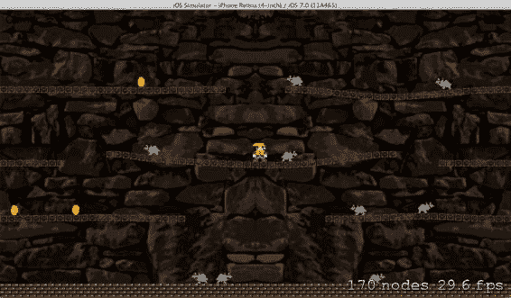

**图 5-4.** 每第五次出现时生成的金币

与敌人精灵类似，你需要为生成的金币添加碰撞检测，以便它们相互碰撞时会转向。你大部分的相关代码已就位；只需在 `SKBGameScene.m` 文件的 `didBeginContact` 方法中插入碰撞检查即可：

```
} else {
    [theCoin wrapCoin:CGPointMake(6, theCoin.position.y)];
    }
}

// Coin / Coin
if ((((firstBody.categoryBitMask & kCoinCategory) != 0) && ((secondBody.categoryBitMask & kCoinCategory) != 0))) {
    SKBCoin *theFirstCoin = (SKBCoin *)firstBody.node;
    SKBCoin *theSecondCoin = (SKBCoin *)secondBody.node;
    NSLog(@"%@ & %@ have collided...", theFirstCoin.name, theSecondCoin.name);
    // 导致第一个金币转向并改变方向
    if (theFirstCoin.coinStatus == SBCoinRunningLeft) {
        [theFirstCoin turnRight];
    } else if (theFirstCoin.coinStatus == SBCoinRunningRight) {
        [theFirstCoin turnLeft];
    }
    // 导致第二个金币转向并改变方向
    if (theSecondCoin.coinStatus == SBCoinRunningLeft) {
        [theSecondCoin turnRight];
    } else if (theSecondCoin.coinStatus == SBCoinRunningRight) {
        [theSecondCoin turnLeft];
    }
}
```

## 敌机与金币的碰撞

现在你已经让敌人之间可以相互反弹、金币之间也可以相互反弹，接下来可以修改代码，使敌机精灵和金币也能相互反应。实现此效果所需的改动并不多。

你需要在这两个受影响类的 `categoryBitMask` 和 `collisionTestBitMask` 属性中添加一个位掩码值。首先，在 `SKBRatz.m` 文件的 `initNewRatz` 方法中：

```
ratz.physicsBody.categoryBitMask = kRatzCategory;
ratz.physicsBody.contactTestBitMask = kWallCategory | kRatzCategory | kCoinCategory;
ratz.physicsBody.collisionBitMask = kBaseCategory | kWallCategory | kLedgeCategory | kRatzCategory | kCoinCategory;
ratz.physicsBody.density = 1.0;
```

其次，在 `SKBCoin.m` 文件的 `initNewCoin` 方法中：

```
coin.physicsBody.categoryBitMask = kCoinCategory;
coin.physicsBody.contactTestBitMask = kWallCategory | kCoinCategory | kRatzCategory;
coin.physicsBody.collisionBitMask = kBaseCategory | kWallCategory | kLedgeCategory | kCoinCategory | kRatzCategory;
coin.physicsBody.density = 1.0;
```

然后只需在 `SKBGameScene.m` 文件的 `didBeginContact` 方法中添加一个 `if()` 语句：

```
} else if (theSecondCoin.coinStatus == SBCoinRunningRight) {
    [theSecondCoin turnLeft];
    }
}

// Coin / Ratz
if ((((firstBody.categoryBitMask & kCoinCategory) != 0) && ((secondBody.categoryBitMask & kRatzCategory) != 0))) {
    SKBCoin *theCoin = (SKBCoin *)firstBody.node;
    SKBRatz *theRatz = (SKBRatz *)secondBody.node;
    NSLog(@"%@ & %@ have collided...", theCoin.name, theRatz.name);
}
```


// 使金币转向并改变方向

if (`theCoin.coinStatus == SBCoinRunningLeft`) {
    [`theCoin turnRight`];
} else if (`theCoin.coinStatus == SBCoinRunningRight`) {
    [`theCoin turnLeft`];
}

// 使老鼠转向并改变方向

if (`theRatz.ratzStatus == SBRatzRunningLeft`) {
    [`theRatz turnRight`];
} else if (`theRatz.ratzStatus == SBRatzRunningRight`) {
    [`theRatz turnLeft`];
}

再次构建并运行程序。现在，敌人和金币会按照预期的方式相互交互。

## 总结

本章向你介绍了碰撞和/或接触事件这一重要概念，以及如何使用它们。在每个游戏中，你都会在屏幕上添加角色、墙壁、敌人、奖励道具和各种其他对象，而你总是希望这些不同的对象能够相互交互。现在，你应该对如何实现这一点有了更深入的理解。

除了墙壁和平台之外，你还添加了两种类型的精灵（`ratz`和`coins`）到屏幕上，以创造更多玩家可以与之交互的元素。虽然距离让这款游戏变得完整还有一段路要走，但游戏已经进展神速。

在下一章中，你将学习如何改变引入（生成）敌人和金币精灵的方式。你不会像现在这样创建一个静态的生成模式，而是会创建一个“角色阵容”，以更动态的方式在游戏区域内生成精灵。那么，翻到下一页吧！

[www.it-ebooks.info](http://www.it-ebooks.info/)

# 第六章：创建角色阵容

## 静态 vs 动态角色

迄今为止，敌人生成的解决方案是在`SKBGameScene`类中使用`update`方法，在重复循环中创建新的精灵，直到达到静态定义的上限。虽然这对于在添加新敌人类别时快速查看即时效果来说不错，但从长远来看，这并不是一个优雅或高效的解决方案。你需要一种能够灵活地将角色引入游戏的方式，让你可以轻松改变主意而无需修改代码，从而避免每次添加、删除或调整生成方案时都不得不重新构建项目。换句话说，你需要一个动态的“角色阵容”。

实现这一点的方法是让生成数据驻留在一个在构建过程中不会被编译的文件中。

如果这是一款桌面游戏，你可能会认为这个解决方案是一个在运行时加载的、包含生成数据的独立数据文件。这也可能开辟出一种可能性，即允许最终用户以类似关卡编辑器的方式创建和修改数据。

目前你还不需要做如此复杂的事情，但希望这能让你更清楚地理解本章将要学习的内容。

### 文件格式

由于这是一个 iOS 应用程序，你将把这个文件存储在本地沙盒中。这样你就能知道文件的位置和文件名。接下来要确定的是这个外部文件的格式。从文件中保存和检索数据最简单的方法之一是使用属性列表（`plist`）格式，它在底层只是一个 XML 文件。当你使用这种格式时，一旦从磁盘读取数据，就无需编写大量代码来解析它。你只需将其视为一个`NSDictionary`，这样既简单又明了。

[www.it-ebooks.info](http://www.it-ebooks.info/)

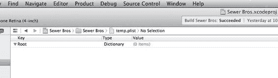

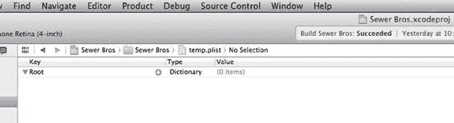

## 创建文件

1. 从**文件**菜单中选择**新建文件**。
2. 确保左侧选中了**iOS**和**资源**，从图标列表中选择**属性列表**，然后点击**下一步**按钮。
3. 将出现标准的“保存”对话框。将其命名为`CastOfCharacters`。
4. 默认位置即可。确认已勾选**目标 - Sewer Bros**，然后点击**创建**按钮。

现在你将在中心窗格中看到属性列表编辑器。它显示了一个默认条目，包含`Root`键、`Dictionary`类型，以及值为 0 个项目（参见图 6-1）。

***图 6-1.*** 属性列表编辑器

刚开始在这个编辑器中输入值可能会有点令人困惑，但随着你使用得越来越多，它底层的逻辑会逐渐显现出来，所以请对它保持一点耐心。添加新元素时得到的结果部分取决于展开三角形的状态。（在图 6-1 的示例中，它是`Root`键左侧的那个箭头，在这种情况下是向下的。）要添加一个元素，你需要移动鼠标，使其指向你要添加元素的那一行（参见图 6-2）。

***图 6-2.*** 将鼠标悬停在`Root`行上会显示`+`按钮

[www.it-ebooks.info](http://www.it-ebooks.info/)

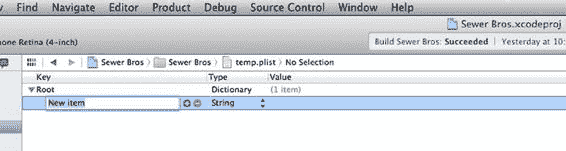

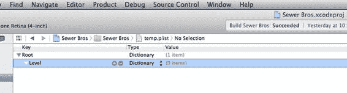

当鼠标悬停在一行上时，`+`和`–`按钮（如果该元素可以删除，才会显示减号按钮）会出现在**键**列的右侧（参见图 6-3）。

***图 6-3.*** `Root`字典中的新元素

点击`+`按钮添加一个元素，如图 6-3 所示。将名称从`New Item`改为`Level`。然后将类型从`String`改为`Dictionary`，并点击展开箭头以打开该字典（箭头向下，如图 6-4 所示）。

***图 6-4.*** 编辑新元素

将鼠标悬停在`Level`元素行上，点击两次`+`按钮，在`Level`字典中创建两个新元素（参见图 6-5）。

[www.it-ebooks.info](http://www.it-ebooks.info/)

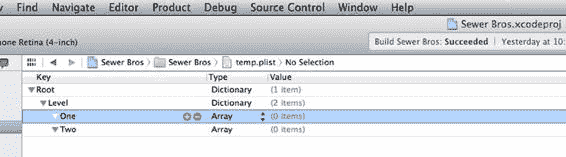

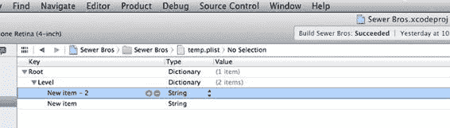

***图 6-5.*** `Level`元素中的两个新元素

将第一个新元素的名称（双击它）从`New Item - 2`改为`One`，并将类型从`String`改为`Array`。点击展开箭头以打开该数组（参见图 6-6）。同样，将第二个新元素的名称从`New Item`改为`Two`，并将类型从`String`改为`Array`。点击展开箭头以打开该数组（参见图 6-6）。

***图 6-6.*** `Level`字典中的两个新数组元素

将鼠标悬停在新的`One`数组行上，点击六次`+`按钮，在`One`数组中创建六个新元素（参见图 6-7）。然后，将鼠标悬停在新的`Two`数组行上，点击一次`+`按钮，在`Two`数组中创建一个新元素（参见图 6-7）。

[www.it-ebooks.info](http://www.it-ebooks.info/)

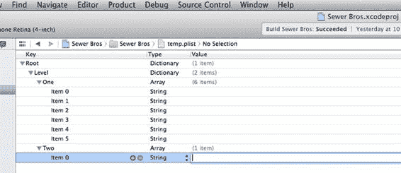

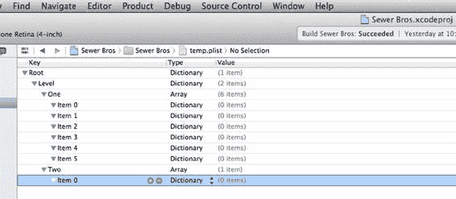

***图 6-7.*** 七个新元素：六个在第一关，一个在第二关

将所有七个新元素从`String`改为`Dictionary`，并在每个元素上点击展开三角形（向下）以全部展开（参见图 6-8）。

***图 6-8.*** 七个新元素，全部改为`Dictionary`类型

将鼠标悬停在`Item 0`字典行上（紧接在`One`键下方），点击三次`+`按钮，在`Item 0`字典中创建三个新元素（参见图 6-9）。

[www.it-ebooks.info](http://www.it-ebooks.info/)

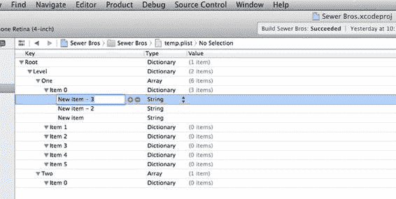


***图 6-13.** 完成后的文件，包含所有新增与修改内容*

将鼠标悬停在新添加的 `Item 1 Dictionary` 行上，点击三次 `+` 按钮，在 `Item 1 Dictionary` 中创建三个新元素。重复此操作五次，即可在七个 `Array` 项目中的每个项目内创建三个新元素（见图 6-10）。

[www.it-ebooks.info](http://www.it-ebooks.info/)

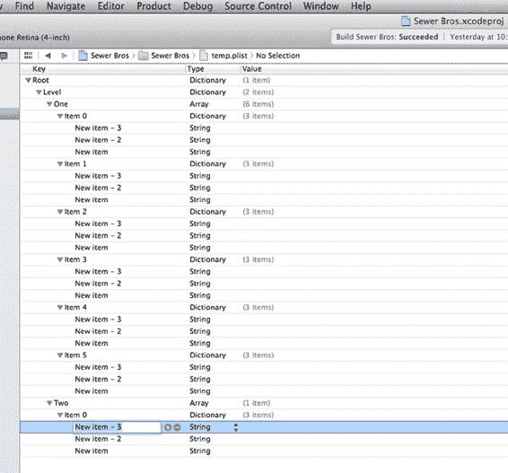

# 第 6 章：创建角色阵容

**109**

***图 6-10.** 每个项目内的三个新元素*

将所有 21 个新元素从 `String` 类型改为 `Number` 类型。对于每个新的 `Number` 元素，将键字符串从 `New Item – 3` 改为 `Type`，`New Item – 2` 改为 `Delay`，`New Item` 改为 `StartXindex`（见图 6-11）。

[www.it-ebooks.info](http://www.it-ebooks.info/)

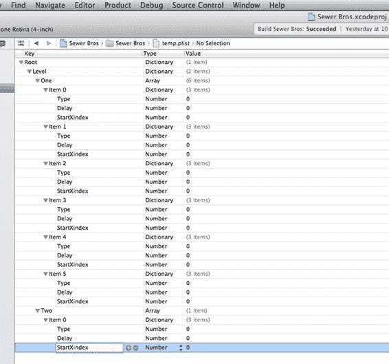

**110**

# 第 6 章：创建角色阵容

***图 6-11.** 具有新键值的二十一个新元素*

现在处理 `Number` 值。在 `Level One` 的 `Item 0` 中，将三个 `Number` 值分别改为 1、3 和 0（见图 6-12）。

[www.it-ebooks.info](http://www.it-ebooks.info/)

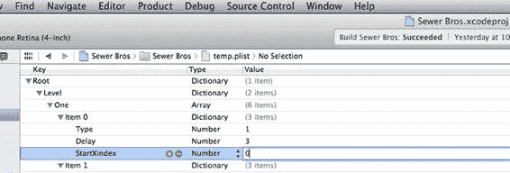

# 第 6 章：创建角色阵容

**111**

***图 6-12.** Level One 中 Item 0 的值*

在 `Level One` 的 `Item 1` 中，将三个 `Number` 值分别改为 1、3 和 1。
在 `Level One` 的 `Item 2` 中，将三个 `Number` 值分别改为 0、3 和 0。
在 `Level One` 的 `Item 3` 中，将三个 `Number` 值分别改为 1、3 和 1。
在 `Level One` 的 `Item 4` 中，将三个 `Number` 值分别改为 1、3 和 0。
在 `Level One` 的 `Item 5` 中，将三个 `Number` 值分别改为 0、3 和 1。
在 `Level One` 的 `Item 0` 中，将三个 `Number` 值分别改为 1、3 和 0。

最终结果显示在图 6-13 中。

[www.it-ebooks.info](http://www.it-ebooks.info/)

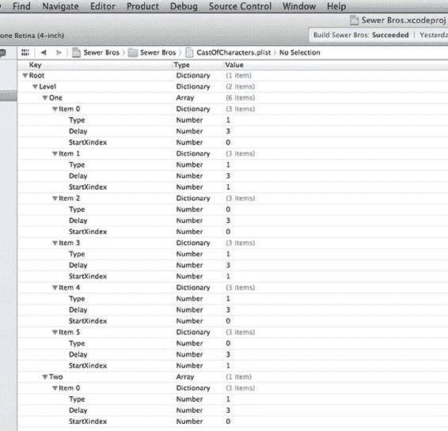

**112**

# 第 6 章：创建角色阵容

***图 6-13.** 完成后的文件，包含所有新增与修改内容*

### XML 格式

在另一个支持读取 XML 文件的应用程序中打开此文件，即可看到实际保存的数据（见图 6-14）。如果您之前处理过 XML 文件，会发现这些内容非常熟悉。只要遵循正确的格式，您甚至可以在基本文本编辑器中创建此文件。Xcode 内置的 `Property List Editor` 提供了一种便捷的方法来创建此类文件，无需过多关注开闭标签（见图 6-14）。

[www.it-ebooks.info](http://www.it-ebooks.info/)

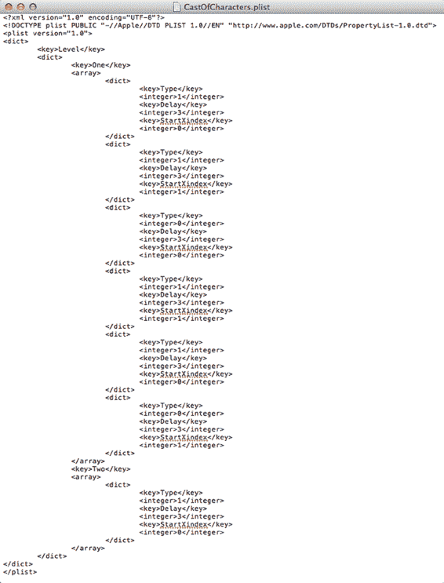

# 第 6 章：创建角色阵容

**113**

***图 6-14.** 以标准 XML 格式查看的属性列表文件*

[www.it-ebooks.info](http://www.it-ebooks.info/)

**114**

# 第 6 章：创建角色阵容

### 加载文件

现在，文件已生成并包含您在游戏中生成精灵所需的所有数据，接下来需要将文件中的数据加载到代码中。

首先，在 `SKBGameScene.m` 文件中创建一个名为 `loadCastOfCharacters` 的新方法，并在 `initWithSize` 方法中调用它：

```objective-c
SKSpriteNode *backdrop = [SKSpriteNode spriteNodeWithImageNamed:fileName]; 
backdrop.name = @"backdropNode";
backdrop.position = CGPointMake(CGRectGetMidX(self.frame),
                                CGRectGetMidY(self.frame));

// 将背景图像添加到屏幕
[self addChild:backdrop];

// 将表面添加到屏幕
[self createSceneContents];

// 从属性列表构建角色阵容
[self loadCastOfCharacters];
}
return self;
```

将新方法插入到现有的 `createSceneContents` 和 `didBeginContact` 方法之间：

```objective-c
[sceneLedge createNewSetOfLedgeNodes:self
                      startingPoint:CGPointMake(CGRectGetMaxX(self.frame)-
                                                kLedgeSideBufferSpacing-((howMany-1)*kLedgeBrickSpacing),
                                                brickBase.position.y+224) 
                    withHowManyBlocks:howMany
                       startingIndex:ledgeIndex];
ledgeIndex = ledgeIndex + howMany;
}

#pragma mark
- (void)loadCastOfCharacters
{
}

#pragma mark Contact / Collision / Touches
```


```objectivec
- (void)didBeginContact:(SKPhysicsContact *)contact
{
    SKPhysicsBody *firstBody, *secondBody;
}
```

[www.it-ebooks.info](http://www.it-ebooks.info/)

# 第 6 章：创建角色阵容

**115 页**

为避免在大量代码中使用静态文件名，请在`SKBAppDelegate.h`文件中添加一个常量：

```objectivec
#import <UIKit/UIKit.h>

#define kCastOfCharactersFileName @"CastOfCharacters"

// 全局项目常量
static const uint32_t kPlayerCategory = 0x1 << 0;
```

从文件加载数据后，需要将结果数据存储到某些实例变量中，因此需要在`SKBGameScene.h`文件中添加一些属性：

```objectivec
@property (strong, nonatomic) SKBPlayer *playerSprite;
@property (strong, nonatomic) SKBSpriteTextures *spriteTextures;
@property (strong, nonatomic) NSArray *cast_TypeArray, *cast_DelayArray, *cast_StartXindexArray;
@property int spawnedEnemyCount;
@property BOOL enemyIsSpawningFlag;
```

然后在`SKBGameScene.m`文件的新`loadCastOfCharacters`方法中添加从磁盘读取数据的代码：

```objectivec
- (void)loadCastOfCharacters
{
    // 从 plist 文件加载角色阵容
    NSString *path = [[NSBundle mainBundle]
                      pathForResource:kCastOfCharactersFileName ofType:@"plist"];
    NSDictionary *plistDictionary = [NSDictionary
                                     dictionaryWithContentsOfFile:path];
    if (plistDictionary) {
        NSLog(@"成功从磁盘获取数据：%@", plistDictionary);
    } else {
        NSLog(@"未能从'%@'加载 plist", kCastOfCharactersFileName);
    }
}
```

构建并运行程序。如果未发生错误，您将在控制台看到从 plist 文件中提取的内部数据详情（见图 6-15）。到目前为止，plist 数据对游戏没有影响，但这是验证所有更改和 plist 数据是否正确输入并按预期读取的好时机。`if()` 语句用于确认 `NSDictionary` 已按要求创建，如果成功，数据将在控制台中显示。否则，将在控制台中显示错误信息。

[www.it-ebooks.info](http://www.it-ebooks.info/)

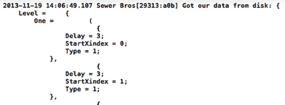

**116 页** 第 6 章：创建角色阵容

***图 6-15.** 从 plist 文件提取到本地字典的数据，显示在控制台中*

## 解析数据

`NSDictionary` 包含生成数据，您需要解析出实现实际生成所需的各个部分。由于此 `NSDictionary` 中包含多层数据，您将分阶段进行解析，以便更轻松地理解您为何以特定方式构建属性列表文件，以及如何解析它以使其可用。

最初从文件中检索到了根字典。其中包含一个名为 `Level` 的 `NSDictionary`，那么让我们先解析它。在 `SKBGameScene.m` 文件的 `loadCastOfCharacters` 方法中现有的 `if()` 语句内（用于验证数据是否正确获取且无错误），添加以下代码：

```objectivec
if (plistDictionary) {
    NSDictionary *levelDictionary = [plistDictionary valueForKey:@"Level"];
    if (levelDictionary) {
        NSLog(@"成功从磁盘获取数据：%@", levelDictionary);
    } else {
        NSLog(@"未找到 levelDictionary");
    }
} else {
    NSLog(@"未能从'%@'加载 plist", kCastOfCharactersFileName);
}
```

构建并运行程序，以便您可以看到这一额外阶段按预期工作。如果遇到任何错误，说明您未完全按照之前描述的方式创建文件。请返回并检查结构。对照属性列表编辑器截图或 XML 文件截图，您需要仔细对比细节以找出错误所在。

在此 `Level` 字典中包含两个 `NSArray`，目前您可以仅提取第一个（可以创建更多数组，每个游戏关卡对应一个）：

```objectivec
if (levelDictionary) {
    NSArray *levelOneArray = [levelDictionary valueForKey:@"One"];
    if (levelOneArray) {
```


# 排版后的内容

`NSLog(@"Got our data from disk: %@", levelOneArray);`

`} else {`

[www.it-ebooks.info](http://www.it-ebooks.info/)

# 第 6 章：创建角色阵容

**117**

`NSLog(@"No levelOneArray");`

`}`

} else {

`NSLog(@"No levelDictionary");`

}

在这个 `levelOneArray` 内部包含六个 `NSDictionary`。每个字典包含要在本游戏关卡中生成的每个敌人生成器的数据。添加数组对象会导致在该游戏关卡中生成更多的敌人单位。为了解析这些数据，你将使用一个 `for()` 循环，这样即使添加或删除敌人字典，也不会出现问题：

```objc
// 从 plist 文件加载角色阵容，仅限第一关

NSString *path = [[NSBundle mainBundle]
                  pathForResource:kCastOfCharactersFileName ofType:@"plist"];
NSDictionary *plistDictionary = [NSDictionary dictionaryWithContentsOfFile:path];
if (plistDictionary) {

    NSDictionary *levelDictionary = [plistDictionary valueForKey:@"Level"];
    if (levelDictionary) {

        NSArray *levelOneArray = [levelDictionary valueForKey:@"One"];
        if (levelOneArray) {

            NSDictionary *enemyDictionary = nil;
            NSMutableArray *newTypeArray = [NSMutableArray
                                            arrayWithCapacity:[levelOneArray count]];
            NSMutableArray *newDelayArray = [NSMutableArray
                                             arrayWithCapacity:[levelOneArray count]];
            NSMutableArray *newStartArray = [NSMutableArray
                                             arrayWithCapacity:[levelOneArray count]];
            NSNumber *rawType, *rawDelay, *rawStartXindex;
            int enemyType, spawnDelay, startXindex = 0;

            for (int index=0; index<[levelOneArray count]; index++) {

                enemyDictionary = [levelOneArray objectAtIndex:index];

                // 从字典中获取 NSNumber 对象
                rawType = [enemyDictionary valueForKey:@"Type"];
                rawDelay = [enemyDictionary valueForKey:@"Delay"];
                rawStartXindex = [enemyDictionary
                                  valueForKey:@"StartXindex"];

                // 本地整型变量
                enemyType = [rawType intValue];
                spawnDelay = [rawDelay intValue];
                startXindex = [rawStartXindex intValue];

                // 长期存储
                [newTypeArray addObject:rawType];
                [newDelayArray addObject:rawDelay];
                [newStartArray addObject:rawStartXindex];

                NSLog(@"%d, %d, %d, %d", index, enemyType, spawnDelay, startXindex);
            }

            [www.it-ebooks.info](http://www.it-ebooks.info/)

            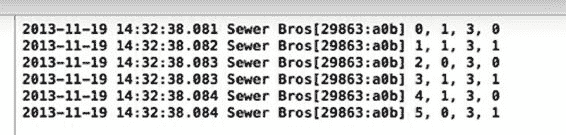

            **118**

            ## 第 6 章：创建角色阵容

            // 本地存储数据
            _cast_TypeArray = [NSArray arrayWithArray:newTypeArray];
            _cast_DelayArray = [NSArray arrayWithArray:newDelayArray];
            _cast_StartXindexArray = [NSArray arrayWithArray:newStartArray];

        } else {

            NSLog(@"No levelOneArray");

        }

    } else {

        NSLog(@"No levelDictionary");

    }

} else {

    NSLog(@"No plist loaded from '%@'", kCastOfCharactersFileName);

}
```

构建并运行程序以查看最终的解析结果（参见图 6-16）。

***图 6-16.** 所有数据已按预期解析完毕*

## 实现新的生成流程

现在你需要使用获取到的数据来处理生成过程。在 `SKBAppDelegate.h` 文件中添加一个新的枚举列表：

```objc
static const uint32_t kCoinCategory = 0x1 << 4;
static const uint32_t kRatzCategory = 0x1 << 5;
typedef enum : uint8_t {
    SKBEnemyTypeCoin = 0,
    SKBEnemyTypeRatz
} SKBEnemyTypes;

@interface SKBAppDelegate : UIResponder <UIApplicationDelegate>
```

[www.it-ebooks.info](http://www.it-ebooks.info/)

# 第 6 章：创建角色阵容

**119**

然后修改 `SKBGameScene.m` 文件中的 `update` 方法（同时移除不需要的 `scheduledDelay` 整型变量）：

```objc
-(void)update:(CFTimeInterval)currentTime {

    /* 每帧渲染前调用 */

    if (!_enemyIsSpawningFlag && _spawnedEnemyCount < [_cast_TypeArray count]) {

        _enemyIsSpawningFlag = YES;

        int castIndex = _spawnedEnemyCount;
        int leftSideX = CGRectGetMinX(self.frame)+kEnemySpawnEdgeBufferX;
        int rightSideX = CGRectGetMaxX(self.frame)-kEnemySpawnEdgeBufferX;
        int topSideY = CGRectGetMaxY(self.frame)-kEnemySpawnEdgeBufferY;

        // 从 castOfCharacters 文件中读取敌人类型
        NSNumber *theNumber = [_cast_TypeArray objectAtIndex:castIndex];
        int castType = [theNumber intValue];

        // 从 castOfCharacters 文件中读取敌人延迟时间

    }
```


`theNumber = [_cast_DelayArray objectAtIndex:castIndex];`

`int castDelay = [theNumber intValue];`

`// 来自 castOfCharacters 文件，精灵的起始 X 坐标索引`

`int startX = 0;`

`// 确定方向`

`theNumber = [_cast_StartXindexArray objectAtIndex:castIndex];`

`if ([theNumber intValue] == 0)`
    `startX = leftSideX;`
`else`
    `startX = rightSideX;`

`int startY = topSideY;`

`// 开始延迟，延迟完成后生成新敌人`
`SKAction *spacing = [SKAction waitForDuration:castDelay];`
`[self runAction:spacing completion:^{`
    `// 创建并生成新敌人`
    `_enemyIsSpawningFlag = NO;`
    `_spawnedEnemyCount = _spawnedEnemyCount + 1;`
    `if (castType == SKBEnemyTypeCoin) {`
        `SKBCoin *newCoin = [SKBCoin initNewCoin:self`
            `startingPoint:CGPointMake(startX, startY)`
            `coinIndex:castIndex];`
        `[newCoin spawnedInScene:self];`
    `} else if (castType == SKBEnemyTypeRatz) {`
        `SKBRatz *newEnemy = [SKBRatz initNewRatz:self`
            `startingPoint:CGPointMake(startX, startY)`
            `ratzIndex:castIndex];`
        `[newEnemy spawnedInScene:self];`
    `}`
`}];`

[www.it-ebooks.info](http://www.it-ebooks.info/)

# 第 6 章：创建角色阵容

构建并运行程序，查看生成过程变化后的最终效果。

接下来，进入`CastOfCharacters.plist`文件，对前几个敌人的参数值进行一些修改，比如将延迟值从“3”改为“1”，以便让它们更快地生成。然后再次构建并运行程序。看，代码没有任何改动，但敌人的生成却根据你修改的值发生了变化。非常棒——动态生成！

## 本章小结

本章并未向你介绍任何 Sprite Kit 的新功能，而是阐述了一种实现游戏角色生成过程的方法。当然，还有其他方式可以完成这项任务，但希望本章对你有所帮助并带来启发。

接下来，你将添加一些自定义纹理，以便使用自己的字体样式来呈现文本（在这里是数字）。iOS 平台可用的字体选项有限，下一章将揭示如何突破这一限制。

此外，你还将开始为游戏添加一些音效。可以肯定地说，没有那些叮叮当当、砰砰作响的音效，就不能称之为一个完整的游戏。

[www.it-ebooks.info](http://www.it-ebooks.info/)

# 第 7 章：分数与计分

## 分数有什么用？

游戏需要一个目标——玩家需要达成的目标。就本游戏而言，玩家为了获取分数而游戏，最高分者获胜！

玩家的任务是清除下水道中的某个房间里的害虫。玩家既没有激光枪，也没有 AK-47，只能将老鼠踢入砖砌底座下方流淌的河水中。

玩家每从下水道区域驱逐一只害虫就能获得分数，还可以通过收集偶尔掉落在游戏区域内的金币来获得额外分数。

## 分数显示

你将在屏幕顶部显示玩家的分数。但正如上一章末尾所暗示的，你将使用一种 iOS 开发环境中不常用的自定义字体。为此，你将使用自定义纹理图片（而非基本文本）来显示构成玩家分数的各个字符。

### SKLabelNode

在此之前，我将向你展示在`SKScene`中添加基本文本的简单方法。我们将回到启动画面，添加一个显示“按此开始”的文本块。

请在`SKBSplashScene.m`文件的`initWithSize`方法中插入以下代码：

```
SKSpriteNode *splash = [SKSpriteNode spriteNodeWithImageNamed:fileName];
splash.name = @"splashNode";
splash.position = CGPointMake(CGRectGetMidX(self.frame),
                               CGRectGetMidY(self.frame));
[self addChild:splash];
```

```
SKLabelNode *myText = [SKLabelNode labelNodeWithFontNamed:@"Chalkduster"];
myText.text = @"按此开始";
myText.name = @"startNode";
myText.fontSize = 30;
```

[www.it-ebooks.info](http://www.it-ebooks.info/)


```objc
myText.position = CGPointMake(CGRectGetMidX(self.frame),
                               CGRectGetMidY(self.frame)-100);
[self addChild:myText];
```
```
return self;
```

`An SKLabelNode` 是一个简单的 `SKNode`，用于绘制字符串。你可以通过指定字体名称、设置 `text` 属性（字符串）、根据需要设置一些可选属性（颜色和大小），最后设置其 `position` 来创建它。实现起来非常简单。

构建并运行程序，以查看新的文本块。请注意，当你按照指示点击屏幕时，动画过渡到新场景的过程并未包含新的 `SKLabelNode`。让我们通过在 `touchesBegan` 方法中添加以下代码来修复这个问题：

```objc
for (UITouch *touch in touches) {
    SKNode *splashNode = [self childNodeWithName:@"splashNode"];
    SKNode *startNode = [self childNodeWithName:@"startNode"];
    if (splashNode != nil) {
        splashNode.name = nil;
        SKAction *zoom = [SKAction scaleTo: 4.0 duration: 1];
        SKAction *fadeAway = [SKAction fadeOutWithDuration: 1];
        SKAction *grouped = [SKAction group:@[zoom, fadeAway]];
        [startNode runAction:grouped];
        [splashNode runAction: grouped completion:^{
            SKBGameScene *nextScene = [[SKBGameScene alloc]
                initWithSize:self.size];
            SKTransition *doors = [SKTransition doorwayWithDuration:0.5];
            [self.view presentScene:nextScene transition:doors];
        }];
    }
}
```

再次构建并运行程序，以查看完整的新增功能。你只需创建一个指向 `startNode` 节点的引用，并在 `splashNode` 上运行相同动画组的同时，将该动画组应用于它。

## 自定义字体纹理

现在是时候添加 10 张图片了，每张图片代表一个数字，你可以将它们组合起来，在屏幕上绘制任何你想要的数字。

让我们将这些图片添加到项目中，并将它们移动到 `Sprites` 文件夹。你可能还想在 `Sprites` 文件夹中为这些新图片添加一个新组（文件夹）（命名为 `Numbers`）。从 `Images` 文件夹中添加 11 张图片，所有图片均以 `Text_` 为前缀（额外的一张图片是分数标题图片）。

[www.it-ebooks.info](http://www.it-ebooks.info/)

## 第 7 章：点数与计分

**123**

现在，你将创建一个新类来处理计分过程。创建一个名为 `SKBScores` 的新类，作为 `NSObject` 的子类。修改 `SKBScores.h` 文件，使其与以下内容匹配：

```objc
#import <Foundation/Foundation.h>
#import <SpriteKit/SpriteKit.h>

#define kTextPlayerHeaderFileName @"Text_PlayerScoreHeader.png"
#define kTextNumber0FileName @"Text_Number_0.png"
#define kTextNumber1FileName @"Text_Number_1.png"
#define kTextNumber2FileName @"Text_Number_2.png"
#define kTextNumber3FileName @"Text_Number_3.png"
#define kTextNumber4FileName @"Text_Number_4.png"
#define kTextNumber5FileName @"Text_Number_5.png"
#define kTextNumber6FileName @"Text_Number_6.png"
#define kTextNumber7FileName @"Text_Number_7.png"
#define kTextNumber8FileName @"Text_Number_8.png"
#define kTextNumber9FileName @"Text_Number_9.png"
#define kScoreDigitCount 5
#define kScoreNumberSpacing 16
#define kScorePlayer1distanceFromLeft 10
#define kScoreDistanceFromTop 10

@interface SKBScores : NSObject
@property (nonatomic, strong) NSArray *arrayOfNumberTextures;
- (void)createScoreNodes:(SKScene *)whichScene;
- (void)updateScore:(SKScene *)whichScene newScore:(int)theScore;
@end
```

现在修改 `SKBScores.m` 文件，使其与以下内容匹配：

```objc
#import "SKBScores.h"

@implementation SKBScores

- (void)createScoreNumberTextures
{
    NSMutableArray *textureArray = [NSMutableArray arrayWithCapacity:10];
    SKTexture *numberTexture = [SKTexture
        textureWithImageNamed:kTextNumber0FileName];
    [textureArray insertObject:numberTexture atIndex:0];
    numberTexture = [SKTexture textureWithImageNamed:kTextNumber1FileName];
    [textureArray insertObject:numberTexture atIndex:1];
    numberTexture = [SKTexture textureWithImageNamed:kTextNumber2FileName];
    [textureArray insertObject:numberTexture atIndex:2];
    numberTexture = [SKTexture textureWithImageNamed:kTextNumber3FileName];
```


`[textureArray insertObject:numberTexture atIndex:3];`

[www.it-ebooks.info](http://www.it-ebooks.info/)

**124**

**第 7 章：点数与计分**

`numberTexture = [SKTexture textureWithImageNamed:kTextNumber4FileName];`

`[textureArray insertObject:numberTexture atIndex:4];`

`numberTexture = [SKTexture textureWithImageNamed:kTextNumber5FileName];`

`[textureArray insertObject:numberTexture atIndex:5];`

`numberTexture = [SKTexture textureWithImageNamed:kTextNumber6FileName];`

`[textureArray insertObject:numberTexture atIndex:6];`

`numberTexture = [SKTexture textureWithImageNamed:kTextNumber7FileName];`

`[textureArray insertObject:numberTexture atIndex:7];`

`numberTexture = [SKTexture textureWithImageNamed:kTextNumber8FileName];`

`[textureArray insertObject:numberTexture atIndex:8];`

`numberTexture = [SKTexture textureWithImageNamed:kTextNumber9FileName];`

`[textureArray insertObject:numberTexture atIndex:9];`

`_arrayOfNumberTextures = [NSArray arrayWithArray:textureArray];` `NSLog(@"NumberTextures created...");`

`}`

```
- (void)createScoreNode:(SKScene *)whichScene
{
    if (!_arrayOfNumberTextures) {
        [self createScoreNumberTextures];
    }
    
    SKTexture *headerTexture = [SKTexture
        textureWithImageNamed:kTextPlayerHeaderFileName];
    CGPoint startWhere =
        CGPointMake(CGRectGetMinX(whichScene.frame)+
            kScorePlayer1distanceFromLeft, CGRectGetMaxY(whichScene.frame)-
            kScoreDistanceFromTop);
    
    // Header
    SKSpriteNode *header = [SKSpriteNode spriteNodeWithTexture:headerTexture];
    header.name = @"score_player_header";
    header.position = startWhere;
    header.xScale = 2;
    header.yScale = 2;
    header.physicsBody.dynamic = NO;
    [whichScene addChild:header];
    
    // Score, 5-digits
    SKTexture *textNumber0Texture = [SKTexture
        textureWithImageNamed:kTextNumber0FileName];
    for (int index=1; index <= kScoreDigitCount; index++) {
        SKSpriteNode *zero = [SKSpriteNode
            spriteNodeWithTexture:textNumber0Texture];
        zero.name = [NSString stringWithFormat:@"score_player_digit%d", index];
        zero.position = CGPointMake(startWhere.x+20+(16*index),
            CGRectGetMaxY(whichScene.frame)-kScoreDistanceFromTop);
        zero.xScale = 2;
        zero.yScale = 2;
```

[www.it-ebooks.info](http://www.it-ebooks.info/)

**第 7 章：点数与计分**

**125**

```
        zero.physicsBody.dynamic = NO;
        [whichScene addChild:zero];
    }
}

- (void)updateScore:(SKScene *)whichScene newScore:(int)theScore
{
    NSString *numberString = [NSString stringWithFormat:@"00000%d", theScore];
    NSString *substring = [numberString substringFromIndex:[numberString length]
        - 5];
    for (int index = 1; index <= 5; index++) {
        [whichScene enumerateChildNodesWithName:[NSString
            stringWithFormat:@"score_player_digit%d", index]
            usingBlock:^(SKNode *node, BOOL *stop) {
                NSString *charAtIndex = [substring
                    substringWithRange:NSMakeRange(index-1, 1)];
                int charIntValue = [charAtIndex intValue];
                SKTexture *digitTexture = [_arrayOfNumberTextures
                    objectAtIndex:charIntValue];
                SKAction *newDigit = [SKAction animateWithTextures:@[digitTexture]
                    timePerFrame:0.1];
                [node runAction:newDigit];
            }];
    }
}
@end
```

该类已创建完毕，可供使用。现在需要在 `SKScene` 中添加一个属性来显示分数，以及另一个属性来存储玩家的分数值。将这两个属性添加到 `SKBGameScene.h` 文件中：

```
@property int spawnedEnemyCount;
@property BOOL enemyIsSpawningFlag;
@property (nonatomic, strong) SKBScores *scoreDisplay;
@property int playerScore;
@end
```

现在，你可以在 `SKBGameScene.m` 文件的 `createSceneContents` 方法底部插入计分初始化代码：

```
[sceneLedge createNewSetOfLedgeNodes:self
    startingPoint:CGPointMake(CGRectGetMaxX(self.frame)-
        kLedgeSideBufferSpacing-((howMany-1)*kLedgeBrickSpacing),
        brickBase.position.y+224) withHowManyBlocks:howMany
    startingIndex:ledgeIndex];
ledgeIndex = ledgeIndex + howMany;
```

[www.it-ebooks.info](http://www.it-ebooks.info/)

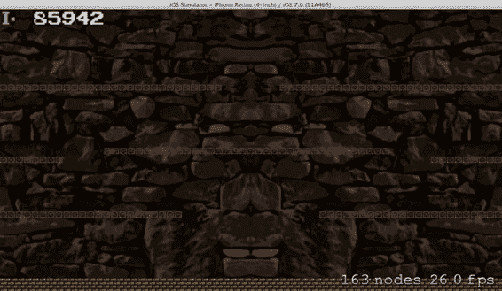

**126**


# 第 7 章：分数与计分

## // 计分

`SKBScores *sceneScores = [[SKBScores alloc] init];`

`[sceneScores createScoreNode:self];`

`_scoreDisplay = sceneScores;`

`_playerScore = 85942;`

`[_scoreDisplay updateScore:self newScore:_playerScore];`

构建并运行程序，即可看到新的计分显示正常工作（见图 7-1）。

***图 7-1.** 计分显示*

那么你在这里做了什么？

你创建了自定义类的新实例，运行了名为`createScoreNode`的显示创建方法，并将其附加到本地存储的实例变量`scoreDisplay`上。

```
if (!_arrayOfNumberTextures) {
    [self createScoreNumberTextures];
}
```

`createScoreNode`方法会懒加载（仅在需要时加载）纹理——如果它们尚不存在的话。`createScoreNumberTextures`方法会创建纹理并存储到数组中，就像你对其他精灵所做的那样。

```
// 标题
SKSpriteNode *header = [SKSpriteNode spriteNodeWithTexture:headerTexture];
header.name = @"score_player_header";
header.position = startWhere;
header.xScale = 2;
header.yScale = 2;
header.physicsBody.dynamic = NO;
[whichScene addChild:header];
```

这里你创建了一个小型的 I- 图像并添加到场景中，作为玩家分数的标题。

不需要`physicsBody`，因为这些计分数字不会在屏幕上浮动，不会受重力影响，也不会与其他精灵交互。不过你确实做了一些不同的事：将图像的缩放比例从默认值 1 改为了 2。这会使所有像素加倍，让图像比原始尺寸大 100%。正如你看到的`xScale`和`yScale`这两个属性，你并不需要按比例缩放。当然这不是必需的，但你可以自行决定是否使用。在这个例子中，它给游戏增添了一点经典像素风格。

```
// 分数，5 位数字
SKTexture *textNumber0Texture = [SKTexture textureWithImageNamed:kTextNumber0FileName];
for (int index=1; index <= kScoreDigitCount; index++) {
    SKSpriteNode *zero = [SKSpriteNode spriteNodeWithTexture:textNumber0Texture];
    zero.name = [NSString stringWithFormat:@"score_player_digit%d", index];
    zero.position = CGPointMake(startWhere.x+20+(kScoreNumberSpacing*index), CGRectGetMaxY(whichScene.frame)-kScoreDistanceFromTop);
    zero.xScale = 2;
    zero.yScale = 2;
    zero.physicsBody.dynamic = NO;
    [whichScene addChild:zero];
}
```

这里你创建了五张数字图像，使用`for()`循环按比例间隔放置。

常量`kScoreDigitCount`可以随意更改，将数字位数从 5 位改为任意所需数量。这段代码用了点巧妙的数学运算来动态确定每个数字的位置，将缩放比例改为 2，并将它们添加到场景中。

这相当直接，现在你应该已经非常熟悉了。在游戏过程中，分数会不断变化，`updateScore`方法将负责处理显示的更新。

```
NSString *numberString = [NSString stringWithFormat:@"00000%d", theScore];
NSString *substring = [numberString substringFromIndex:[numberString length] - 5];
```

这个巧妙的小技巧给当前分数前面加了一串前导零，然后只截取最后五位数字。这强制分数有足够的前导零，总共凑够五位数。

```
for (int index = 1; index <= 5; index++) {
    [whichScene enumerateChildNodesWithName:[NSString stringWithFormat:@"score_player_digit%d", index]
                                usingBlock:^(SKNode *node, BOOL *stop) {
```

你开始了一个`for()`循环，遍历五个数字，并使用一个对你而言是全新的`SKScene`方法。`enumerateChildNodesWithName`顾名思义：它会遍历所有已添加到场景的子节点，寻找`name`属性与给定名称匹配的任何节点。如果找到任何节点，就会运行你提供的代码块。因此，这个循环在每次`for()`循环迭代中都会成功找到一个子节点。每个被找到的节点都是一个精灵，使用我们的自定义字体纹理之一在屏幕上显示一个分数数字。

```
NSString *charAtIndex = [substring substringWithRange:NSMakeRange(index-1, 1)];
int charIntValue = [charAtIndex intValue];
SKTexture *digitTexture = [_arrayOfNumberTextures objectAtIndex:charIntValue];
SKAction *newDigit = [SKAction animateWithTextures:@[digitTexture] timePerFrame:0.1];
[node runAction:newDigit];
```

这段代码块依次处理每个数字，并根据当前分数将当前纹理替换为新纹理。由于纹理数组保存着数字 0 到 9 的图像，你只需通过请求数组中与所需数字相同索引的对象，即可轻松获取想要的数字图像。例如，如果你想要数字 5 的图像，它就位于数组的索引 5 处。简单得很。

## 状态栏 = 关闭

你可能已经注意到（尽管从项目开始就这样了），场景中残留着 iPhone 顶部状态栏的痕迹，它显示着电量和信号水平。之前这算是个小麻烦，但现在它干扰了分数的显示。让我们把它去掉。

你可能已经发现，在首次创建该项目时，默认的“部署目标”选项中“在应用启动时隐藏状态栏”（见图 7-2）并没有按你期望的方式工作。

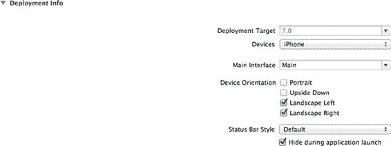

***图 7-2.** 部署目标设置*

你需要在项目的`Info.plist`文件中添加一个条目。

在左侧的项目导航窗口中，你会找到一个名为“Supporting Files”的文件夹。该文件夹内有一个名为`Sewer Bros-Info.plist`的文件。单击该文件，即可在编辑窗口中查看其内容（这是一个属性列表文件，就像你在上一章中创建的那个）。在左侧项目列表中右键单击，然后选择“添加行”。将默认文本"Application Category"修改为"View Controller-Based Status Bar Appearance"。将其类型更改为"Boolean"，值更改为"NO"（见图 7-3）。

构建并运行程序，状态栏就会像预期那样消失。

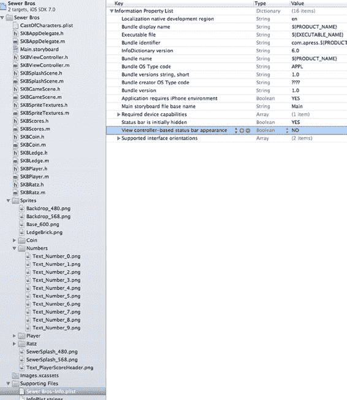

***图 7-3.** 修改后的 Info.plist 文件*

## 另一种“分数”

现在你有了“分数”，还需要添加“乐谱”——什么？

你已经具备了在游戏窗口中显示玩家分数的能力，但现在你需要一份乐谱。啊，一语双关。确实如此！

当英雄跑来跑去把害虫推入河中时，游戏迫切需要一些能让耳朵享受的东西。或许不是无限循环的背景主题音乐，至少这次不是，但也许可以在启动画面中播放一段“小曲”，并在游戏中触发不同动作时播放各种音效。这样效果会很好。

## 播放声音文件

那么如何播放声音文件呢？很方便的是，你可以在 Sprite Kit 中实现。你可能会惊讶于这竟然如此简单。


你可能想在项目内新建一个名为 `Sounds` 的文件夹组，专门用来存放音效。将第一个音效文件 `Theme.caf` 添加到项目中（方式与添加精灵图片相同；务必勾选“目标”框），并将其移入 `Sounds` 文件夹。音效添加至项目后，你只需在 `SKBSplashScene.m` 文件的 `initWithSize` 方法中添加以下两行代码：

```
myText.position = CGPointMake(CGRectGetMidX(self.frame),
CGRectGetMidY(self.frame)-100);
```

```
SKAction *themeSong = [SKAction playSoundFileNamed:@"Theme.caf"
waitForCompletion:NO];
[self runAction:themeSong];
[self addChild:myText];
```

构建并运行程序。悦耳动听的音乐响起，你有了主题曲！是不是很简单。

由此可见，要播放一个小型音效文件，你只需使用便捷方法 `playSoundFileNamed` 创建一个 `SKAction`，该方法会选择要播放的音效文件，并在当前场景中运行该动作。这真是出奇的简洁优雅！

## CAF 音频格式

在继续之前，我需要停下来简单解释一下 `.caf` 音频格式。这个缩写代表“Core Audio Format”（核心音频格式），由苹果公司开发，旨在克服旧式数字音频格式的局限性。

在为这个游戏创建音效文件时，我找到了一种免费且简单的方法来生成这种 `.caf` 格式的文件。你只需通过终端，就能从常见的 `.aif` 格式转换而来。

大多数常见的音频转换工具都可以保存为 `.aif` 格式。一旦你获得了扩展名为 `.aif` 的音效文件，就可以在终端中运行以下命令：`mbp:desktop admin$ afconvert -f caff -d ima4 Theme.aif Theme.caf`

这会在桌面上创建一个名为 `Theme.caf` 的新文件，这个文件就是你将在游戏项目中使用的文件。

**注意：** 如果你熟悉终端的使用，你会注意到我是在桌面目录下执行此操作的。当我首次启动终端时，它默认位于用户文件夹，我用来切换到桌面文件夹的命令是：

```
mbp:~ admin$ cd desktop
mbp:desktop admin$
```

## 玩家生成音效

现在，你可以添加更多音效文件，并将它们用于绑定特定游戏动作的音效。

你将开始一次性添加多个音效文件。将以下六个音效文件添加到项目中：`Run.caf`、`Jump.caf`、`Skid.caf`、`SpawnPlayer.caf`、`SpawnEnemy.caf` 和 `SpawnCoin.caf`。将它们移入 `Sounds` 文件夹。

你需要一些新的常量来引用文件名，因此将它们添加到 `SKBPlayer.h` 文件中：

```
#import <SpriteKit/SpriteKit.h>
#import "SKBAppDelegate.h"
#import "SKBSpriteTextures.h"

#define kPlayerSpawnSoundFileName @"SpawnPlayer.caf"
#define kPlayerRunSoundFileName @"Run.caf"
#define kPlayerSkidSoundFileName @"Skid.caf"
#define kPlayerJumpSoundFileName @"Jump.caf"
#define kPlayerRunningIncrement 100
#define kPlayerSkiddingIncrement 20
#define kPlayerJumpingIncrement 8
```

为了在 `SKBPlayer` 类中本地存储音效文件，请将以下属性添加到 `SKBPlayer.h` 文件中：

```
@property (nonatomic, strong) SKBSpriteTextures *spriteTextures;
@property SBPlayerStatus playerStatus;
@property (nonatomic, strong) SKAction *spawnSound;
@property (nonatomic, strong) SKAction *runSound, *jumpSound, *skidSound;
+ (SKBPlayer *)initNewPlayer:(SKScene *)whichScene
startingPoint:(CGPoint)location;
- (void)spawnedInScene:(SKScene *)whichScene;
```

然后，在 `SKBPlayer.m` 文件的 `spawnedInScene` 方法中，将它们加载并存储到实例变量中：

```
- (void)spawnedInScene:(SKScene *)whichScene
{
SKBGameScene *theScene = (SKBGameScene *)whichScene;
_spriteTextures = theScene.spriteTextures;
// 音效
_spawnSound = [SKAction playSoundFileNamed:kPlayerSpawnSoundFileName
waitForCompletion:NO];
```


`_runSound = [SKAction playSoundFileNamed:kPlayerRunSoundFileName waitForCompletion:YES];`

`_jumpSound = [SKAction playSoundFileNamed:kPlayerJumpSoundFileName waitForCompletion:NO];`

`_skidSound = [SKAction playSoundFileNamed:kPlayerSkidSoundFileName waitForCompletion:YES];`

```
// 播放音效
[self runAction:_spawnSound];
```

构建并运行程序，在玩家生成到场景中时聆听新添加的音效。

## 玩家奔跑音效

当玩家精灵奔跑时，程序实际上会无限重复一个动作序列，直到另一个动作将其替换。要为该动作添加音效，你需要一个非常短的音频文件，该文件可以与动画帧一起无限重复。这种重复音效听起来应该像玩家奔跑时的脚步声。

`SKBPlayer.m` 文件中的 `runRight` 和 `runLeft` 方法需要修改：

```
- (void)runRight
{
    NSLog(@"向右奔跑");
    _playerStatus = SBPlayerRunningRight;

    SKAction *walkAnimation = [SKAction
        animateWithTextures:_spriteTextures.playerRunRightTextures
        timePerFrame:0.05];
    SKAction *walkForever = [SKAction repeatActionForever:walkAnimation];
    [self runAction:walkForever];

    SKAction *moveRight = [SKAction moveByX:kPlayerRunningIncrement y:0
        duration:1];
    SKAction *moveForever = [SKAction repeatActionForever:moveRight];
    [self runAction:moveForever];

    // 奔跑音效
    SKAction *shortPause = [SKAction waitForDuration:0.01];
    SKAction *sequence = [SKAction sequence:@[_runSound, shortPause]];
    SKAction *soundContinuous = [SKAction repeatActionForever:sequence];
    [self runAction:soundContinuous withKey:@"soundContinuous"];
}

- (void)runLeft
{
    NSLog(@"向左奔跑");
    _playerStatus = SBPlayerRunningLeft;

    SKAction *walkAnimation = [SKAction
        animateWithTextures:_spriteTextures.playerRunLeftTextures
        timePerFrame:0.05];
    SKAction *walkForever = [SKAction repeatActionForever:walkAnimation];
    [self runAction:walkForever];

    SKAction *moveLeft = [SKAction moveByX:-kPlayerRunningIncrement y:0
        duration:1];
    SKAction *moveForever = [SKAction repeatActionForever:moveLeft];
    [self runAction:moveForever];

    // 奔跑音效
    SKAction *shortPause = [SKAction waitForDuration:0.01];
    SKAction *sequence = [SKAction sequence:@[_runSound, shortPause]];
    SKAction *soundContinuous = [SKAction repeatActionForever:sequence];
    [self runAction:soundContinuous withKey:@"soundContinuous"];
}
```

我在播放音效之间还加入了一个短暂的 0.01 秒暂停，以帮助改善玩家奔跑时听到的最终音效。我为该动作设置了一个键，以便之后需要停止音效时引用。

构建并运行程序，在玩家在场景中奔跑时聆听新添加的音效。

## 玩家跳跃音效

当玩家精灵跳跃时，它实际上仍在奔跑，但施加了一个冲量，并且动画帧会暂时改变。跳跃完成后，玩家会从跳跃触发前的位置继续动作。因此，要添加音效，你需要中断正在播放的奔跑音效。

这次需要修改 `SKBPlayer.m` 文件中的 `jump` 方法：

```
- (void)jump
{
    // 停止奔跑音效
    [self removeActionForKey:@"soundContinuous"];

    NSArray *playerJumpTextures = nil;
    SBPlayerStatus nextPlayerStatus = 0;

    // 确定方向和下一阶段
    if (self.playerStatus == SBPlayerRunningLeft || self.playerStatus ==
        SBPlayerSkiddingLeft) {
        NSLog(@"向左跳跃");
        self.playerStatus = SBPlayerJumpingLeft;
        playerJumpTextures = _spriteTextures.playerJumpLeftTextures;
        nextPlayerStatus = SBPlayerRunningLeft;
    } else if (self.playerStatus == SBPlayerRunningRight || self.playerStatus ==
        SBPlayerSkiddingRight) {
        NSLog(@"向右跳跃");
        self.playerStatus = SBPlayerJumpingRight;
        playerJumpTextures = _spriteTextures.playerJumpRightTextures;
        nextPlayerStatus = SBPlayerRunningRight;
    }
}
```


```objectivec
} else if (self.playerStatus == SBPlayerFacingLeft) {

NSLog(@"jump up, facing left");

self.playerStatus = SBPlayerJumpingUpFacingLeft;

playerJumpTextures = _spriteTextures.playerJumpLeftTextures;

nextPlayerStatus = SBPlayerFacingLeft;

} else if (self.playerStatus == SBPlayerFacingRight) {

NSLog(@"jump up, facing right");

self.playerStatus = SBPlayerJumpingUpFacingRight;

playerJumpTextures = _spriteTextures.playerJumpRightTextures;

nextPlayerStatus = SBPlayerFacingRight;

} else {

NSLog(@"SKBPlayer::jump encountered invalid value...");

}

// 适用的动画

SKAction *jumpAnimation = [SKAction animateWithTextures:playerJumpTextures timePerFrame:0.2];

SKAction *jumpAwhile = [SKAction repeatAction:jumpAnimation count:4.0]; 
SKAction *groupedJump = [SKAction group:@[_jumpSound, jumpAwhile]];

// 执行跳跃动作，完成后处理下一阶段

[self runAction:groupedJump completion:^{

if (nextPlayerStatus == SBPlayerRunningLeft) {

[self removeAllActions];

[self runLeft];

} else if (nextPlayerStatus == SBPlayerRunningRight) {

[self removeAllActions];

[self runRight];

} else if (nextPlayerStatus == SBPlayerFacingLeft) {

NSArray *playerStillTextures =

_spriteTextures.playerStillFacingLeftTextures;

SKAction *stillAnimation = [SKAction

animateWithTextures:playerStillTextures timePerFrame:1];

SKAction *stillAwhile = [SKAction repeatAction:stillAnimation

count:0.1];

[self runAction:stillAwhile];

self.playerStatus = SBPlayerFacingLeft;

} else if (nextPlayerStatus == SBPlayerFacingRight) {

NSArray *playerStillTextures =

_spriteTextures.playerStillFacingRightTextures;

SKAction *stillAnimation = [SKAction

animateWithTextures:playerStillTextures timePerFrame:1];

SKAction *stillAwhile = [SKAction repeatAction:stillAnimation

count:0.1];

[self runAction:stillAwhile];

self.playerStatus = SBPlayerFacingRight;

} else {

NSLog(@"SKBPlayer::jump completion block encountered invalid value...");

}

}];

// 施加跳跃冲量

[self.physicsBody applyImpulse:CGVectorMake(0, kPlayerJumpingIncrement)];

}
```

这段代码包含一个组合动作，它将同时运行另外两个动作：`_jumpSound` 和 `jumpAwhile`。

构建并运行程序，聆听玩家跳跃时的新音效。

## 玩家滑行停止音效

当玩家精灵停止奔跑时，它会滑行至停止。因此，要添加音效，你需要停止奔跑音效并添加一个短促的滑行音效。

为此，你需要修改 `SKBPlayer.m` 文件中的 `skidLeft` 和 `skidRight` 方法：

```objectivec
- (void)skidRight
{

NSLog(@"滑行向右");

[self removeAllActions];

_playerStatus = SBPlayerSkiddingRight;

NSArray *playerSkidTextures = _spriteTextures.playerSkiddingRightTextures; 
NSArray *playerStillTextures =

_spriteTextures.playerStillFacingRightTextures;

SKAction *skidAnimation = [SKAction animateWithTextures:playerSkidTextures timePerFrame:1];

SKAction *skidAwhile = [SKAction repeatAction:skidAnimation count:0.2]; 
SKAction *moveLeft = [SKAction moveByX:kPlayerSkiddingIncrement y:0

duration:0.2];

SKAction *moveAwhile = [SKAction repeatAction:moveLeft count:1];

SKAction *stillAnimation = [SKAction animateWithTextures:playerStillTextures timePerFrame:1];

SKAction *stillAwhile = [SKAction repeatAction:stillAnimation count:0.1];

SKAction *sequence = [SKAction sequence:@[skidAwhile, moveAwhile,

stillAwhile]];

SKAction *group = [SKAction group:@[sequence, _skidSound]];

[self runAction:group completion:^{

NSLog(@"滑行结束，仍面朝右");

_playerStatus = SBPlayerFacingRight;

}];

}

- (void)skidLeft
{

NSLog(@"滑行向左");

[self removeAllActions];

_playerStatus = SBPlayerSkiddingLeft;

NSArray *playerSkidTextures = _spriteTextures.playerSkiddingLeftTextures; 
NSArray *playerStillTextures =

_spriteTextures.playerStillFacingLeftTextures;

SKAction *skidAnimation = [SKAction animateWithTextures:playerSkidTextures timePerFrame:1];
```


```objc
SKAction *skidAwhile = [SKAction repeatAction:skidAnimation count:0.2];
SKAction *moveLeft = [SKAction moveByX:-kPlayerSkiddingIncrement y:0 duration:0.2];
SKAction *moveAwhile = [SKAction repeatAction:moveLeft count:1];
SKAction *stillAnimation = [SKAction animateWithTextures:playerStillTextures timePerFrame:1];
SKAction *stillAwhile = [SKAction repeatAction:stillAnimation count:0.1];
SKAction *sequence = [SKAction sequence:@[skidAwhile, moveAwhile, stillAwhile]];
SKAction *group = [SKAction group:@[sequence, _skidSound]];
[self runAction:group completion:^{
    NSLog(@"滑行结束，仍面向左侧");
    _playerStatus = SBPlayerFacingLeft;
}];
```

这段代码再次使用了组动作，它同时运行另外两个动作：`_skidSound` 和 `sequence`。这与序列动作不同，后者按顺序依次运行那三个动作。

构建并运行程序，在玩家滑行停止时聆听新添加的音效。

[www.it-ebooks.info](http://www.it-ebooks.info/)

## 敌人出现音效

为了在 `Ratz` 精灵进入场景时播放独特的音效，你需要为文件名定义一个新的常量。你可以将该常量添加到 `SKBRatz.h` 文件中：

```objc
#import "SKBSpriteTextures.h"
#define kRatzSpawnSoundFileName @"SpawnEnemy.caf"
#define kRatzRunningIncrement 40
```

为了在 `SKBRatz` 类中本地存储音效，请将属性添加到 `SKBRatz.h` 文件中：

```objc
@property int ratzStatus;
@property (nonatomic, strong) SKBSpriteTextures *spriteTextures;
@property (nonatomic, strong) SKAction *spawnSound;
+ (SKBRatz *)initNewRatz:(SKScene *)whichScene startingPoint:(CGPoint)location ratzIndex:(int)index;
- (void)spawnedInScene:(SKScene *)whichScene;
```

然后在 `SKBRatz.m` 文件的 `spawnedInScene` 方法中，加载并将该属性存储到实例变量中：

```objc
- (void)spawnedInScene:(SKScene *)whichScene
{
    SKBGameScene *theScene = (SKBGameScene *)whichScene;
    _spriteTextures = theScene.spriteTextures;
    // 音效
    _spawnSound = [SKAction playSoundFileNamed:kRatzSpawnSoundFileName waitForCompletion:NO];
    [self runAction:_spawnSound];
    // 设置初始方向并开始移动
    if (self.position.x < CGRectGetMidX(whichScene.frame))
        [self runRight];
    else
        [self runLeft];
}
```

构建并运行程序，在 `Ratz` 进入场景时聆听新添加的音效。

[www.it-ebooks.info](http://www.it-ebooks.info/)

## 金币出现音效

此时你要添加的最后一个音效，是当奖励 `Coin` 精灵进入场景时播放的。

同样，你需要为文件名定义一个新的常量，因此可以将其添加到 `SKBCoin.h` 文件中：

```objc
#import "SKBSpriteTextures.h"
#define kCoinSpawnSoundFileName @"SpawnCoin.caf"
#define kCoinRunningIncrement 40
```

为了在 `SKBCoin` 类中本地存储音效，请将属性添加到 `SKBCoin.h` 文件中：

```objc
@property int coinStatus;
@property (nonatomic, strong) SKBSpriteTextures *spriteTextures;
@property (nonatomic, strong) SKAction *spawnSound;
+ (SKBCoin *)initNewCoin:(SKScene *)whichScene startingPoint:(CGPoint)location coinIndex:(int)index;
- (void)spawnedInScene:(SKScene *)whichScene;
```

然后在 `SKBCoin.m` 文件的 `spawnedInScene` 方法中，加载并将该属性存储到实例变量中：

```objc
- (void)spawnedInScene:(SKScene *)whichScene
{
    SKBGameScene *theScene = (SKBGameScene *)whichScene;
    _spriteTextures = theScene.spriteTextures;
    // 音效
    _spawnSound = [SKAction playSoundFileNamed:kRatzSpawnSoundFileName waitForCompletion:NO];
    [self runAction:_spawnSound];
    // 设置初始方向并开始移动
    if (self.position.x < CGRectGetMidX(whichScene.frame))
        [self runRight];
    else
        [self runLeft];
}
```

构建并运行程序，在奖励金币进入场景时聆听新触发的音效。

[www.it-ebooks.info](http://www.it-ebooks.info/)

## 总结

现在你有了一个显示区域和自定义字体，用来展示玩家的得分。你还拥有了多种声音和音效，在游戏逐渐精彩的过程中播放。这款游戏已经摆脱了“平庸”的状态，开始绽放光彩。

然而，你还没有完成！在下一章中，你将开始处理玩家与周围出现的所有敌人和奖励之间的交互。你的玩家将不再能自由漫步而不被那些讨厌的 `Ratz` 骚扰。但另一方面，玩家最终也将能够收集那些金币。那么，让我们开始吧！

[www.it-ebooks.info](http://www.it-ebooks.info/)

# 第 8 章：接触与碰撞

## 这部分内容之前不是讲过了吗？

是的，我之前确实已经讲过不少相关内容了。早在第 5 章，我就介绍了接触与碰撞，这样你就可以让 `Ratz` 和金币相互弹开。但这还不够。你需要一种方法，让敌人无法在基础关卡上四处游荡。你需要玩家能够收集金币，并在击晕害虫后将它们踢下 ledge。

此外，为了增加挑战性，如果英雄撞到当前未昏迷的害虫，就会“死亡”。所有这些新增内容都需要谨慎处理接触与碰撞。

## 接触 vs. 碰撞

那么，这两个事件之间到底有什么区别呢？我们可以用一个极度简化的方式来理解：*碰撞* 是在物理世界中处理的，而 *接触* 则是代码中用于逻辑路由碰撞事件的触发器。在本游戏中，你对金币精灵接触到 ledge 砖块不感兴趣。你希望物理世界为你处理它们，允许金币沿着 ledge 顶部滚动。当金币与相应的 ledge 相互接触时，你不需要应用任何游戏逻辑。

## 格栅

让我们继续，在游戏中为敌人的出现添加一个视觉位置，而不是凭空出现。你将在屏幕两侧、计分显示的正下方放置一些图片。

这些图片代表游戏世界地表层的下水道格栅，这些小动物和金币正是从那里掉落的。

将名为 `Grate.png` 的图片添加到项目中，并将其移动到 `Sprites` 文件夹中。你不需要在头文件中添加任何内容，因为你不会在场景中存储这些图片的本地引用。就像你处理砖块底座一样，你只需创建几个 `SKSpriteNode` 并将它们作为子节点添加到场景中。这是在 `SKBGameScene.m` 文件的 `createSceneContents` 方法中完成的：

```objc
howMany = 28;
[sceneLedge createNewSetOfLedgeNodes:self
                      startingPoint:CGPointMake(CGRectGetMaxX(self.frame)-
                                                kLedgeSideBufferSpacing-((howMany-1)*kLedgeBrickSpacing),
                                                brickBase.position.y+224)
                    withHowManyBlocks:howMany
                       startingIndex:ledgeIndex];
ledgeIndex = ledgeIndex + howMany;

// 格栅
SKSpriteNode *grate = [SKSpriteNode spriteNodeWithImageNamed:@"Grate.png"];
grate.name = @"grate1";
grate.position = CGPointMake(30, CGRectGetMaxY(self.frame)-25);
[self addChild:grate];

grate = [SKSpriteNode spriteNodeWithImageNamed:@"Grate.png"];
grate.name = @"grate2";
grate.position = CGPointMake(CGRectGetMaxX(self.frame)-30,
                             CGRectGetMaxY(self.frame)-25);
[self addChild:grate];

// 计分
SKBScores *sceneScores = [[SKBScores alloc] init];
[sceneScores createScoreNode:self];
```

为了让敌人精灵看起来是从这些格栅中掉落的，你需要改变它们的生成位置。这些数据存储在 `SKBGameScene.h` 文件的两个常量中，因此将它们的值修改为以下内容：

```objc
#import "SKBRatz.h"
#define kEnemySpawnEdgeBufferX 30
#define kEnemySpawnEdgeBufferY 30
```


# `@interface SKBGameScene : SKScene <SKPhysicsContactDelegate>`

构建并运行程序，即可看到新的格栅以及敌人以仿佛从这些格栅上掉落的方式生成（见图 8-1）。

***图 8-1.** 敌人从上方通过格栅落下*

### 管道

此时，当敌人精灵向砖砌底部游荡时，它们会卡在底层。您需要让它们离开这一层，并重新出现在顶部，以便再次开始游荡。为此，您将在底部添加一些管道，使它们消失在管道中，然后从上面的格栅重新出现。

首先，需要在 `SKBAppDelegate.h` 文件中添加一个新的位掩码值。然后，需要将 `SKBGameScene.h` 文件中决定敌人精灵生成位置的常量移动一下：

```
// 全局项目常量

static const uint32_t kPlayerCategory = 0x1 << 0;
static const uint32_t kBaseCategory = 0x1 << 1;
static const uint32_t kWallCategory = 0x1 << 2;
static const uint32_t kPipeCategory = 0x1 << 3;
static const uint32_t kLedgeCategory = 0x1 << 4;
static const uint32_t kCoinCategory = 0x1 << 5;
static const uint32_t kRatzCategory = 0x1 << 6;

#define kEnemySpawnEdgeBufferX 30
#define kEnemySpawnEdgeBufferY 30

typedef enum : uint8_t {
    SKBEnemyTypeCoin = 0,
    SKBEnemyTypeRatz
} SKBEnemyTypes;
```

请务必删除或注释掉 `SKBGameScene.h` 文件中的 `kEnemySpawnEdgeBufferX` 和 `kEnemySpawnEdgeBufferY` 常量。

如前所述，位掩码值的具体顺序在此处并不重要，它们只需是唯一的值即可。顺序真正起作用的地方是在 `didBeginContact` 方法中，因为它决定了 `firstBody` 和 `secondBody` 节点的顺序。不过，我们有点操之过急了。

添加两个以 `PipeLwr` 为前缀的图片，并将它们移动到 `Sprites` 文件夹中。就像您刚才处理两个格栅那样，将它们添加到 `SKBGameScene.m` 文件的 `createSceneContents` 方法中：

```
grate.name = @"grate2";
grate.position = CGPointMake(CGRectGetMaxX(self.frame)-30,
                             CGRectGetMaxY(self.frame)-25);
[self addChild:grate];

// 管道
SKSpriteNode *pipe = [SKSpriteNode spriteNodeWithImageNamed:@"PipeLwrLeft.png"];
pipe.name = @"pipeLeft";
pipe.position = CGPointMake(9, 25);
pipe.physicsBody = [SKPhysicsBody bodyWithRectangleOfSize:pipe.size];
pipe.physicsBody.categoryBitMask = kPipeCategory;
pipe.physicsBody.dynamic = NO;
[self addChild:pipe];

pipe = [SKSpriteNode spriteNodeWithImageNamed:@"PipeLwrRight.png"];
pipe.name = @"pipeRight";
pipe.position = CGPointMake(CGRectGetMaxX(self.frame)-9, 25);
pipe.physicsBody = [SKPhysicsBody bodyWithRectangleOfSize:pipe.size];
pipe.physicsBody.categoryBitMask = kPipeCategory;
pipe.physicsBody.dynamic = NO;
[self addChild:pipe];

// 计分
SKBScores *sceneScores = [[SKBScores alloc] init];
[sceneScores createScoreNode:self];
```

如果现在构建并运行程序，您将看到两个额外的管道。目前还没有任何东西与它们交互（见图 8-2）。这将是下一步的内容。

***图 8-2.** 管道已添加*

现在，您需要修改敌人初始化方法，以通知物理世界您对这个新类别感兴趣。在 `SKBCoin.m` 文件的 `initNewCoin` 方法中，向 `contactTestBitMask` 添加该类别：

```
coin.physicsBody.categoryBitMask = kCoinCategory;
coin.physicsBody.contactTestBitMask = kWallCategory | kPipeCategory |
                                      kCoinCategory | kRatzCategory;
coin.physicsBody.collisionBitMask = kBaseCategory | kWallCategory |
                                    kLedgeCategory | kCoinCategory | kRatzCategory;
```

对 `SKBRatz.m` 文件中的 `initNewRatz` 方法执行相同操作：

```
ratz.physicsBody.categoryBitMask = kRatzCategory;
ratz.physicsBody.contactTestBitMask = kWallCategory | kPipeCategory |
                                      kCoinCategory | kRatzCategory;
```

[www.it-ebooks.info](http://www.it-ebooks.info/)


`kRatzCategory | kCoinCategory` ;

```objective-c
ratz.physicsBody.collisionBitMask = kBaseCategory | kWallCategory | kLedgeCategory | kRatzCategory | kCoinCategory ;
```

现在，这些敌方精灵与任何一个管道节点发生接触时，代码将触发一个接触事件。让我们在两个类中添加一些方法来处理交互。对于 `Coin` 类，在 `SKBCoin.h` 文件中添加一个公有方法声明：

```objective-c
- (void)wrapCoin:(CGPoint)where;
- (void)coinHitPipe;
- (void)runRight;
```

然后在 `SKBCoin.m` 文件中，在现有的 `wrapCoin` 方法之后立即插入新的方法代码：

```objective-c
- (void)wrapCoin:(CGPoint)where
{
    SKPhysicsBody *storePB = self.physicsBody;
    self.physicsBody = nil;
    self.position = where;
    self.physicsBody = storePB;
}

- (void)coinHitPipe
{
    [self removeFromParent];
}
```

正如你所见，当金币撞到管道时，它会消失。你通过将其从场景（其父级）中移除来创建这种效果。这将迫使英雄迅速收集金币，因为它们不会停留太久。

对于 `Ratz` 类，在 `SKBRatz.h` 文件中添加两个公有方法：

```objective-c
- (void)wrapRatz:(CGPoint)where;
- (void)ratzHitLeftPipe:(SKScene *)whichScene;
- (void)ratzHitRightPipe:(SKScene *)whichScene;
- (void)runRight;
```

然后在 `SKBRatz.m` 文件中，在现有的 `wrapRatz` 方法之后立即插入新的方法代码：

```objective-c
- (void)wrapRatz:(CGPoint)where
{
    SKPhysicsBody *storePB = self.physicsBody;
    self.physicsBody = nil;
    self.position = where;
    self.physicsBody = storePB;
}

- (void)ratzHitLeftPipe:(SKScene *)whichScene
{
    int leftSideX = CGRectGetMinX(whichScene.frame)+kEnemySpawnEdgeBufferX;
    int topSideY = CGRectGetMaxY(whichScene.frame)-kEnemySpawnEdgeBufferY;
    SKPhysicsBody *storedPB = self.physicsBody;
    self.physicsBody = nil;
    self.position = CGPointMake(leftSideX, topSideY);
    self.physicsBody = storedPB;
    [self removeAllActions];
    [self runRight];
    // 播放生成音效
    [self runAction:self.spawnSound];
}

- (void)ratzHitRightPipe:(SKScene *)whichScene
{
    int rightSideX = CGRectGetMaxX(whichScene.frame)-kEnemySpawnEdgeBufferX;
    int topSideY = CGRectGetMaxY(whichScene.frame)-kEnemySpawnEdgeBufferY;
    SKPhysicsBody *storedPB = self.physicsBody;
    self.physicsBody = nil;
    self.position = CGPointMake(rightSideX, topSideY);
    self.physicsBody = storedPB;
    [self removeAllActions];
    [self runLeft];
    // 播放生成音效
    [self runAction:self.spawnSound];
}
```

快速浏览刚刚添加的代码，你应该会看到与精灵撞到侧壁时的包裹代码有相似之处。你暂时禁用并存储 `physicsBody` 精灵，以便将其传送到新位置，然后再恢复 `physicsBody`。接着，你确保所有动画和移动都重置为新值，并播放生成音效。

现在你只需要在 `SKBGameScene.m` 文件的 `didBeginContact` 方法中添加适用的代码，首先针对 `Coin` 类，然后针对 `Ratz` 类：

```objective-c
// 金币 / 侧壁
if ((((firstBody.categoryBitMask & kWallCategory) != 0) && ((secondBody.categoryBitMask & kCoinCategory) != 0))) {
    SKBCoin *theCoin = (SKBCoin *)secondBody.node;
    if (theCoin.position.x < 100) {
        [theCoin wrapCoin:CGPointMake(self.frame.size.width-6, theCoin.position.y)];
    } else {
        [theCoin wrapCoin:CGPointMake(6, theCoin.position.y)];
    }
}

// 金币 / 管道
if ((((firstBody.categoryBitMask & kPipeCategory) != 0) && ((secondBody.categoryBitMask & kCoinCategory) != 0))) {
    SKBCoin *theCoin = (SKBCoin *)secondBody.node;
    [theCoin coinHitPipe];
}
```

然后针对 `Ratz` 类：

```objective-c
// Ratz / 侧壁
```


```objc
if ((((firstBody.categoryBitMask & kWallCategory) != 0) && ((secondBody.categoryBitMask & kRatzCategory) != 0))) {

    SKBRatz *theRatz = (SKBRatz *)secondBody.node;

    if (theRatz.position.x < 100) {
        [theRatz wrapRatz:CGPointMake(self.frame.size.width-11,
        theRatz.position.y)];
    } else {
        [theRatz wrapRatz:CGPointMake(11, theRatz.position.y)];
    }
}
```

```objc
// Ratz / 管道
if ((((firstBody.categoryBitMask & kPipeCategory) != 0) && ((secondBody.categoryBitMask & kRatzCategory) != 0))) {
    SKBRatz *theRatz = (SKBRatz *)secondBody.node;
    if (theRatz.position.x < 100) {
        [theRatz ratzHitLeftPipe:self];
    } else {
        [theRatz ratzHitRightPipe:self];
    }
}
```

```objc
// Ratz / Ratz
```

构建并运行程序。当金币到达下层任一侧管道时便会消失，而 Ratz 则隐入管道并从上方格栅中重新出现。

## 偶尔卡住的敌人

偶尔你会看到一些敌人卡在原地不动。在继续之前，我们先来解决这个问题。

`SKBGameScene.m` 文件中的 `update` 方法是检查每个敌人精灵是否卡住的最佳位置。你不需要每次 `update` 方法运行时都进行检查，但可以每隔大约 20 帧检查一次。如果发现某个敌人精灵的位置与 20 帧前相同，就可以强制它立即转向并朝反向移动。

要比较精灵的当前位置与之前的位置，需要为每个节点本地存储数据，因此让我们为这些敌人类和奖励类添加一些属性。

在 `SKBCoin.h` 文件中添加以下两个属性：

```objc
@property int coinStatus;
@property int lastKnownXposition, lastKnownYposition;
@property (nonatomic, strong) SKBSpriteTextures *spriteTextures;
```

在 `SKBRatz.h` 文件中执行相同操作：

```objc
@property int ratzStatus;
@property int lastKnownXposition, lastKnownYposition;
@property (nonatomic, strong) SKBSpriteTextures *spriteTextures;
```

为了每隔 20 帧（而非每帧）进行检查，你需要在 `SKBGameScene.h` 文件中添加一个新的局部变量：

```objc
@property int frameCounter;
@property int spawnedEnemyCount;
@property BOOL enemyIsSpawningFlag;
```

现在，在 `SKBGameScene.m` 文件的 `update` 方法中，插入处理 20 帧计数器和触发逻辑的新代码：

```objc
SKBRatz *newEnemy = [SKBRatz initNewRatz:self
                           startingPoint:CGPointMake(startX, startY)
                              ratzIndex:castIndex];
[newEnemy spawnedInScene:self];
```

```objc
// 每 20 帧检查一次卡住的敌人
_frameCounter = _frameCounter + 1;
if (_frameCounter >=20) {
    _frameCounter = 0;
}
```

在这个 `if()` 语句内部，你可以插入检查卡住敌人的代码。首先检查场景中的所有金币。你可以使用 `enumerateChildNodesWithName` 方法按节点名称进行搜索——这些名称已被确保唯一且拥有共同前缀。将此枚举方法放在一个 `for()` 循环中，该循环将遍历场景中的所有子节点。这里有一个新知识点：你将使用 `stop` 选项。如果将方法中的 `stop` 布尔变量设为 `YES`，它将搜索所有子节点并在第一个正向结果处停止；若设为 `NO`，则不会在第一个正向结果处停止，而是继续遍历所有子节点。由于你为每个敌人赋予了唯一名称，每个正向结果只会出现一次，因此将布尔值设为 `YES`：

```objc
if (_frameCounter >=20) {
    _frameCounter = 0;
    for (int index=0; index <= _spawnedEnemyCount; index++) {
        // 金币
        [self enumerateChildNodesWithName:[NSString
            stringWithFormat:@"coin%d", index] usingBlock:^(SKNode
            *node, BOOL *stop) { *stop = YES; }];
    }
}
```

现在添加执行位置检查并处理卡住敌人的代码：


### 优化排版后的文本

调用`[self enumerateChildNodesWithName:[NSString stringWithFormat:@"coin%d", index] usingBlock:^(SKNode *node, BOOL *stop) { *stop = YES; SKBCoin *theCoin = (SKBCoin *)node; int currentX = theCoin.position.x; int currentY = theCoin.position.y; if (currentX == theCoin.lastKnownXposition && currentY == theCoin.lastKnownYposition) { NSLog(@"%@ appears to be stuck...", theCoin.name); if (theCoin.coinStatus == SBCoinRunningRight) { [theCoin removeAllActions]; [theCoin runLeft]; } else if (theCoin.coinStatus == SBCoinRunningLeft) { [theCoin removeAllActions]; [theCoin runRight]; } } theCoin.lastKnownXposition = currentX; theCoin.lastKnownYposition = currentY;`。

然后对`Ratz`类添加相同的代码。以下是`update`方法的完整更改，以便清晰起见：

```
// check for stuck enemies every 20 frames
_frameCounter = _frameCounter + 1;
if (_frameCounter >=20) {
    _frameCounter = 0;
    for (int index=0; index <= _spawnedEnemyCount; index++) {
        // Coins
        [self enumerateChildNodesWithName:[NSString stringWithFormat:@"coin%d", index] 
                               usingBlock:^(SKNode *node, BOOL *stop) {
            *stop = YES;
            SKBCoin *theCoin = (SKBCoin *)node;
            int currentX = theCoin.position.x;
            int currentY = theCoin.position.y;
            if (currentX == theCoin.lastKnownXposition && currentY == theCoin.lastKnownYposition) {
                NSLog(@"%@ appears to be stuck...", theCoin.name);
                if (theCoin.coinStatus == SBCoinRunningRight) {
                    [theCoin removeAllActions];
                    [theCoin runLeft];
                } else if (theCoin.coinStatus == SBCoinRunningLeft) {
                    [theCoin removeAllActions];
                    [theCoin runRight];
                }
            }
            theCoin.lastKnownXposition = currentX;
            theCoin.lastKnownYposition = currentY;
        }];

        // Ratz
        [self enumerateChildNodesWithName:[NSString stringWithFormat:@"ratz%d", index] 
                               usingBlock:^(SKNode *node, BOOL *stop) {
            *stop = YES;
            SKBRatz *theRatz = (SKBRatz *)node;
            int currentX = theRatz.position.x;
            int currentY = theRatz.position.y;
            if (currentX == theRatz.lastKnownXposition && currentY == theRatz.lastKnownYposition) {
                NSLog(@"%@ appears to be stuck...", theRatz.name);
                if (theRatz.ratzStatus == SBRatzRunningRight) {
                    [theRatz turnLeft];
                } else if (theRatz.ratzStatus == SBRatzRunningLeft) {
                    [theRatz turnRight];
                }
            }
            theRatz.lastKnownXposition = currentX;
            theRatz.lastKnownYposition = currentY;
        }];
    }
}
```

构建并运行程序，观察控制台，以便在检测到任何卡住的敌人时查看效果。

我还发现，有时需要在`SKBGameScene.m`文件的`didBeginContact`方法中调整与侧墙碰撞时的 X 轴位置，以防止敌人在墙边卡住：

```
[theRatz wrapRatz:CGPointMake(self.frame.size.width-11, theRatz.position.y)];
} else {
[theRatz wrapRatz:CGPointMake(11, theRatz.position.y)];
```

在这种情况下，硬编码的值`11`被改为`13`或其他值，直到它们不再沿边缘卡住。

### 设置玩家的起始位置

到目前为止，玩家在用户点击屏幕之前都不会出现。这在最初开发游戏时没问题，但现在需要改变这一点。让玩家从屏幕左下角开始，面向右侧。

在`SKBGameScene.m`文件的`createSceneContents`方法末尾插入以下初始化代码：

```
// Scoring
SKBScores *sceneScores = [[SKBScores alloc] init];
[sceneScores createScoreNode:self];
_scoreDisplay = sceneScores;
_playerScore = 85942;
[_scoreDisplay updateScore:self newScore:_playerScore];

// Player
_playerSprite = [SKBPlayer initNewPlayer:self startingPoint:CGPointMake(40, 25)];
[_playerSprite spawnedInScene:self];
```

尽管一切运行正常，但如果保留`touchesBegan`方法，可以移除不再需要的玩家生成代码，使其如下所示：

```
-(void)touchesBegan:(NSSet *)touches withEvent:(UIEvent *)event {
    /* Called when a touch begins */
    for (UITouch *touch in touches) {
        CGPoint location = [touch locationInNode:self];
        SBPlayerStatus status = _playerSprite.playerStatus;

        if (location.y >= (self.frame.size.height / 2 )) {
            // user touched upper half of the screen (zero = bottom of screen)
            if (status != SBPlayerJumpingLeft && status != SBPlayerJumpingRight && status != SBPlayerJumpingUpFacingLeft && status != SBPlayerJumpingUpFacingRight) {
                [_playerSprite jump];
            }
        } else if (location.x <= ( self.frame.size.width / 2 )) {
            ...
        }
    }
}
```

构建并运行程序，你将看到玩家在游戏开始时立即出现，而无需等待用户点击屏幕。

### 收集金币

让英雄能够捕获并收集金币以获取奖励积分。

首先，在`SKBPlayer.m`文件中为金币类别添加`contactTestBitMask`属性：

```
player.physicsBody.categoryBitMask = kPlayerCategory;
player.physicsBody.contactTestBitMask = kWallCategory | kCoinCategory;
player.physicsBody.collisionBitMask = kBaseCategory | kWallCategory | kLedgeCategory;
```

然后在`SKBCoin.h`文件中添加一个公开方法声明：

```
- (void)wrapCoin:(CGPoint)where;
- (void)coinHitPipe;
- (void)coinCollected:(SKScene *)whichScene;
- (void)runRight;
```

现在，将新方法的代码插入`SKBCoin.m`文件中现有的`coinHitPipe`方法下方：

```
#pragma mark Contact
- (void)coinHitPipe
{
    [self removeFromParent];
}

- (void)coinCollected:(SKScene *)whichScene
{
    NSLog(@"%@ collected", self.name);
    [self removeFromParent];
}
```

然后在`SKBGameScene.m`文件的`didBeginContact`方法中添加接触测试和处理代码：

```
// Player / Coins
if ((((firstBody.categoryBitMask & kPlayerCategory) != 0) && ((secondBody.categoryBitMask & kCoinCategory) != 0))) {
    SKBCoin *theCoin = (SKBCoin *)secondBody.node;
    [theCoin coinCollected:self];
}

// Ratz / sideWalls
if ((((firstBody.categoryBitMask & kWallCategory) != 0) && ((secondBody.categoryBitMask & kRatzCategory) != 0))) {
    ...
}
```

构建并运行程序，验证你的玩家现在能够捕获金币。接着需要修复计分系统。

首先，将玩家的初始分数调整为`0`。该值在`SKBGameScene.m`文件的`createSceneContents`方法中设置：

```
// Scoring
SKBScores *sceneScores = [[SKBScores alloc] init];
[sceneScores createScoreNode:self];
_scoreDisplay = sceneScores;
_playerScore = 0;
[_scoreDisplay updateScore:self newScore:_playerScore];
```

在`SKBCoin.h`文件中添加一个常量，决定每个收集的金币的分数值：

```
#define kCoinSpawnSoundFileName @"SpawnCoin.caf"
#define kCoinRunningIncrement 40
#define kCoinPointValue 60
```

由于玩家分数是`GameScene`类中的局部变量，因此需要在`GameScene`类中调整分数，而不是在`Coin`类中。因此，在`SKBGameScene.m`文件的`didBeginContact`方法中添加以下计分调整代码：

```
// Player / Coins
if ((((firstBody.categoryBitMask & kPlayerCategory) != 0) && ((secondBody.categoryBitMask & kCoinCategory) != 0))) {
    SKBCoin *theCoin = (SKBCoin *)secondBody.node;
    [theCoin coinCollected:self];
    // Score some bonus points
    _playerScore = _playerScore + kCoinPointValue;
    [_scoreDisplay updateScore:self newScore:_playerScore];
}
```

构建并运行程序，验证英雄在收集金币时是否获得奖励积分。

### 收集金币的音效


让我们为收集金币时添加一个音效。将名为 `CoinCollected.caf` 的音效文件添加到项目中，并移至 `Sounds` 文件夹。在 `SKBCoin.h` 文件中为文件名添加常量：

```
#define kCoinSpawnSoundFileName @"SpawnCoin.caf"
#define kCoinCollectedSoundFileName @"CoinCollected.caf"
#define kCoinRunningIncrement 40
#define kCoinPointValue 60
```

在 `SKBCoin.h` 文件中添加一个局部变量来保存新音效：

```
@property (nonatomic, strong) SKBSpriteTextures *spriteTextures;
@property (nonatomic, strong) SKAction *spawnSound**, *collectedSound**;

+ (SKBCoin *)initNewCoin:(SKScene *)whichScene startingPoint:(CGPoint)location coinIndex:(int)index;
```

然后在 `SKBCoin.m` 文件的 `spawnedInScene` 方法中添加初始化代码：

```
// Sound Effects
_collectedSound = [SKAction playSoundFileNamed:kCoinCollectedSoundFileName waitForCompletion:NO];
_spawnSound = [SKAction playSoundFileNamed:kCoinSpawnSoundFileName waitForCompletion:NO];
[self runAction:_spawnSound];
```

最后，在 `SKBCoin.m` 文件的 `coinCollected` 方法中添加播放音效的代码：

```
NSLog(@"%@ collected", self.name);
// Play sound
[whichScene runAction:_collectedSound];
[self removeFromParent];
```

编译并运行程序，聆听新的音效。

## 金币收集点数显示

在本节中，您将创建一小段文字，用于告知用户金币的点数值。这是游戏中的常见功能，与其在此尝试描述，不如直接看到效果更容易理解。

将以下代码添加到 `SKBCoin.m` 文件的 `coinCollected` 方法中：

```
- (void)coinCollected:(SKScene *)whichScene
{
    NSLog(@"%@ collected", self.name);
    [self removeFromParent];
    // Play sound
    [whichScene runAction:_collectedSound];
    // show amount of winnings
    SKLabelNode *moneyText = [SKLabelNode labelNodeWithFontNamed:
                              @"Courier-Bold"];
    moneyText.text = [NSString stringWithFormat:@"$%d", kCoinPointValue];
    moneyText.fontSize = 9;
    moneyText.fontColor = [SKColor whiteColor];
    moneyText.position = CGPointMake(self.position.x-10, self.position.y+28);
    [whichScene addChild:moneyText];
    SKAction *fadeAway = [SKAction fadeOutWithDuration:1];
    [moneyText runAction:fadeAway completion:^{ [moneyText removeFromParent]; }];
}
```

编译并运行程序，查看您完成的效果。当您看到它时，希望您能大声说出“酷！”让周围的人都好奇您在兴奋什么。因为它确实很酷，不是吗？但稍等，还有一件事可以提升酷炫指数。

### 粒子效果

现在是时候向您介绍 Sprite Kit 一个激动人心的功能：粒子生成。*粒子*由 `SKEmitterNode` 对象创建，用于生成雨、火、爆炸等视觉效果。Xcode 内置了 `SKEmitterNode` 编辑器，允许您创建和调整构成粒子效果的各种设置。那么，让我们制作一个粒子效果，并将其用作金币收集的视觉特效。

从“文件”菜单中选择“新建文件”，确保左侧列表中选中了 iOS 资源，选择“SpriteKit Particle File”，然后点击“下一步”按钮。从“模板”下拉菜单中选择“Spark”，然后点击“下一步”按钮。将其命名为 `CoinCollected`，并点击“创建”按钮。

在 Xcode 窗口左侧的项目导航器中，您会看到为您生成了两个新文件：`CoinCollected.sks` 和 `spark.png`。在项目中创建一个新组，并将其命名为 `Emitters`。将这两个新文件移动到 `Emitters` 文件夹中（见图 8-3）。

***图 8-3.** 新创建的 Emitters 文件夹及其中的新文件*

在中央编辑器窗格中，您可以看到新的 `SKEmitterNode` 正在生成大量粒子，它们


# “烟花”式的效果（只要在左侧导航器中选中即可）。要编辑此编辑器中提供的众多值，你需要确保将 Xcode 窗口右侧的`文件检查器`切换为`SKNode 检查器`，方法是点击窗格顶部第三个按钮（见图 8-4）。

***图 8-4.** 选择 SKNode 检查器*

现在你应该能看到许多可供调整的控制选项和设置，让`SKEmitterNode`产生恰到好处的效果。

[www.it-ebooks.info](http://www.it-ebooks.info/)

**156**

# 第 8 章：接触与碰撞

对于金币收集功能，你需要一个相当小的效果，并且持续时间要短。

将设置更改为以下值（见图 8-5）：

| **属性** | **值** |
|--------------|-----------|
| 粒子，生成速率 | 0.235 |
| 粒子，最大值 | 0 |
| 生命周期，起始值 | 0.235 |
| 生命周期，范围 | 0 |
| 位置范围，X | 7.592 |
| 位置范围，Y | 6.825 |
| 角度，起始值 | 89.381 |
| 角度，范围 | 360.39 |
| 速度，起始值 | 86.125 |
| 速度，范围 | 0.883 |
| 加速度，X | 0 |
| 加速度，Y | 0 |
| 透明度，起始值 | 0.8 |
| 透明度，范围 | 0.2 |
| 透明度，速度 | -0.35 |
| 缩放，起始值 | 0.5 |
| 缩放，范围 | 0.5 |
| 缩放，速度： | 1.107 |
| 旋转，起始值： | 0 |
| 旋转，范围： | 0 |
| 旋转，速度： | 0 |
| 颜色混合，因子： | 0 |
| 颜色混合，范围： | 0 |
| 颜色混合，速度： | 0 |

[www.it-ebooks.info](http://www.it-ebooks.info/)

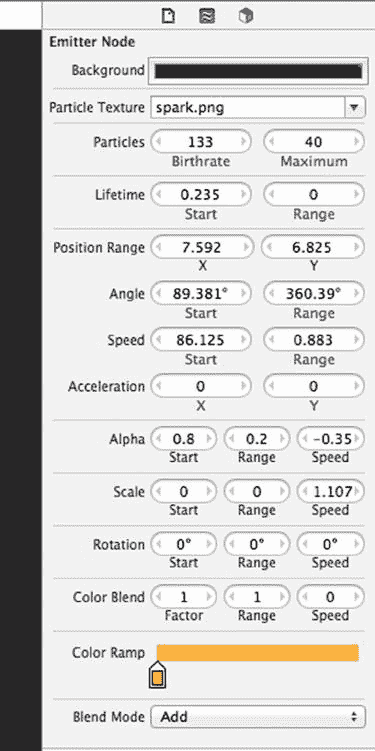

# 第 8 章：接触与碰撞

**157**

***图 8-5.** 修改后的粒子设置*

[www.it-ebooks.info](http://www.it-ebooks.info/)

# 第 8 章：接触与碰撞

**158**

现在，你需要在 `SKBCoin.m` 文件的 `coinCollected` 方法中添加代码来实现新的发射器。确保将 `removeFromParent` 方法调用从该方法的开头移动到末尾：

```objc
- (void)coinCollected:(SKScene *)whichScene
{
    NSLog(@"%@ collected", self.name);
    
    // 播放音效
    [whichScene runAction:_collectedSound];
    
    // 显示赢得的金额
    SKLabelNode *moneyText = [SKLabelNode labelNodeWithFontNamed:@"Courier-Bold"];
    moneyText.text = [NSString stringWithFormat:@"$%d", kCoinPointValue];
    moneyText.fontSize = 9;
    moneyText.fontColor = [SKColor whiteColor];
    moneyText.position = CGPointMake(self.position.x-10, self.position.y+28);
    [whichScene addChild:moneyText];
    
    SKAction *fadeAway = [SKAction fadeOutWithDuration:1];
    [moneyText runAction:fadeAway completion:^{
        [moneyText removeFromParent];
    }];
    
    // 粒子特效
    NSString *emitterPath = [[NSBundle mainBundle]
                             pathForResource:@"CoinCollected" ofType:@"sks"];
    SKEmitterNode *bling = [NSKeyedUnarchiver
                            unarchiveObjectWithFile:emitterPath];
    bling.position = self.position;
    bling.name = @"coinCollected";
    bling.targetNode = self.scene;
    [whichScene addChild:bling];
    
    [self removeFromParent];
}
```

构建并运行程序，查看完成的金币收集过程（见图 8-6）。

[www.it-ebooks.info](http://www.it-ebooks.info/)

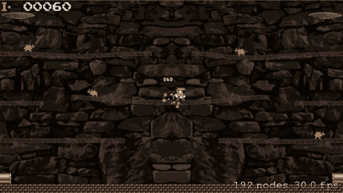

# 第 8 章：接触与碰撞

**159**

***图 8-6.** 金币收集特效*

## 壁架下方的金币接触

你希望主角能够收集金币，不仅是通过碰到金币，还可以通过跳起并从金币下方撞击壁架来实现。这需要更复杂一些，因为你需要测试玩家与壁架砖块之间的接触，同时还要检查是否有金币与该特定壁架砖块接触。

要开始这一改动，你需要在 `SKBPlayer.m` 文件中，将 `kLedgeCategory` 添加到玩家的 `contactTestBitMask` 属性中：

```objc
player.physicsBody.categoryBitMask = kPlayerCategory;
player.physicsBody.contactTestBitMask = kWallCategory | kLedgeCategory |
                                        kCoinCategory;
player.physicsBody.collisionBitMask = kBaseCategory | kWallCategory |
                                      kLedgeCategory;
```

当你确认玩家与壁架砖块之间存在接触事件时，需要调用一个新方法来执行实际的检查。在 `SKBGameScene.m` 文件中，紧接在现有的 `didBeginContact` 方法之前插入这个新方法。


`# pragma mark 接触/碰撞/触碰`

`- (void)checkForEnemyHits:(NSString *)struckLedgeName`

`{`

`SKNode *nodeStruck = [self childNodeWithName:struckLedgeName];`

`// 金币`

`for (int index=0; index <= _spawnedEnemyCount; index++) {`

`[self enumerateChildNodesWithName:[NSString stringWithFormat:@"coin%d", index] usingBlock:^(SKNode *node, BOOL *stop) {`

`*stop = YES;`

`SKBCoin *theCoin = (SKBCoin *)node;`

`// struckLedge 检查`

`if ([theCoin intersectsNode:nodeStruck]) {`

`NSLog(@"玩家击中了 %@，其中 %@ 是已知的", struckLedgeName, theCoin.name);`

`[theCoin coinCollected:self];`

`}`

`}];`

`}`

`}`

`- (void)didBeginContact:(SKPhysicsContact *)contact`

这段代码看起来应该相当熟悉，因为它与你之前使用过的代码类似。

`enumerateChildNodesWithName`方法会查找游戏中的每一枚金币，并逐一检查它们是否与玩家碰触并触发该方法的那个 ledge 砖块发生接触。这里唯一的新内容是`SKNode`类的`intersectsNode`方法。该方法返回一个布尔值，用于指示当前节点（`theCoin`）是否与指定节点（`nodeStruck`）相交。当它们的框架相交时，即为相交。因此，如果金币当前与 ledge 节点接触，该方法返回`true`，你便在控制台发送一条`NSLog()`消息并收集金币，就像玩家撞到它一样。

你需要在`SKBGameScene.m`文件的`didBeginContact`方法中添加另一个`if()`语句来触发这个新方法：

```
// 玩家/Ledges

if ((((firstBody.categoryBitMask & kPlayerCategory) != 0) && ((secondBody.categoryBitMask & kLedgeCategory) != 0)))

{

SKSpriteNode *theStruckLedge = (SKSpriteNode *)secondBody.node;

[self checkForEnemyHits:theStruckLedge.name];

}
```

## 玩家/金币

构建并运行程序，然后尝试从 ledge 下方击中一枚金币。

## 从 ledge 下方击中 Ratz

现在你希望英雄能够像击中金币一样，从 ledge 下方击中敌人精灵。当接触成功时，敌人应陷入昏迷状态。敌人精灵在昏迷时会上下翻转，但只会保持这种状态一小段时间，之后它就会翻转回来并继续行动。

这一改动需要再添加一些图片和纹理数组，所以我们先以`Ratz_KO_`为前缀的 10 张图片添加到项目中，并将它们移入`Ratz`文件夹。

接下来，你在`SKBSpriteTextures.h`文件中再添加 10 个文件名常量和两个数组：

```
#define kRatzRunLeft5FileName @"Ratz_Left5.png"

#define kRatzKOfacingLeft1FileName @"Ratz_KO_L_Hit1.png"

#define kRatzKOfacingLeft2FileName @"Ratz_KO_L_Hit2.png"

#define kRatzKOfacingLeft3FileName @"Ratz_KO_L_Hit3.png"

#define kRatzKOfacingLeft4FileName @"Ratz_KO_L_Hit4.png"

#define kRatzKOfacingLeft5FileName @"Ratz_KO_L_Hit5.png"

#define kRatzKOfacingRight1FileName @"Ratz_KO_R_Hit1.png"

#define kRatzKOfacingRight2FileName @"Ratz_KO_R_Hit2.png"

#define kRatzKOfacingRight3FileName @"Ratz_KO_R_Hit3.png"

#define kRatzKOfacingRight4FileName @"Ratz_KO_R_Hit4.png"

#define kRatzKOfacingRight5FileName @"Ratz_KO_R_Hit5.png"

#define kCoin1FileName @"Coin1.png"
```

...

```
@property (nonatomic, strong) NSArray *ratzRunLeftTextures, *ratzRunRightTextures;

@property (nonatomic, strong) NSArray *ratzKOfacingLeftTextures, *ratzKOfacingRightTextures;

@property (nonatomic, strong) NSArray *coinTextures;
```

然后，你在`SKBSpriteTextures.m`文件的`createAnimationTextures`方法中添加新的数组初始化器：

```
_ratzRunLeftTextures = @[f1,f2,f3,f4,f5];

// 被击晕，面朝左
```


`f1 = [SKTexture textureWithImageNamed:kRatzKOfacingLeft1FileName];`  
`f2 = [SKTexture textureWithImageNamed:kRatzKOfacingLeft2FileName];`  
`f3 = [SKTexture textureWithImageNamed:kRatzKOfacingLeft3FileName];`  
`f4 = [SKTexture textureWithImageNamed:kRatzKOfacingLeft4FileName];`  
`f5 = [SKTexture textureWithImageNamed:kRatzKOfacingLeft5FileName];`  
`_ratzKOfacingLeftTextures = @[f1,f2,f5,f5,f5,f5,f5,f5,f5,f5,f5,f5,f5,f5,f5,f5,f5,f5,f5,f5,f5,f5,f3,f2,f3,f2,f3,f2,f1];`  

`// 击晕状态，面向右侧`  

`f1 = [SKTexture textureWithImageNamed:kRatzKOfacingRight1FileName];`  
`f2 = [SKTexture textureWithImageNamed:kRatzKOfacingRight2FileName];`  
`f3 = [SKTexture textureWithImageNamed:kRatzKOfacingRight3FileName];`  
`f4 = [SKTexture textureWithImageNamed:kRatzKOfacingRight4FileName];`  
`f5 = [SKTexture textureWithImageNamed:kRatzKOfacingRight5FileName];`  
`_ratzKOfacingRightTextures = @[f1,f2,f5,f5,f5,f5,f5,f5,f5,f5,f5,f5,f5,f5,f5,f5,f5,f5,f5,f5,f5,f5,f3,f2,f3,f2,f3,f2,f1];`  

你需要在 `SKBRatz.h` 文件的 `SBRatzStatus` 类型声明中添加两个新的枚举值：

```objc  
typedef enum : int {  
    SBRatzRunningLeft = 0,  
    SBRatzRunningRight,  
    SBRatzKOfacingLeft,  
    SBRatzKOfacingRight  
} SBRatzStatus;  
```  

你需要在 `SKBRatz.h` 文件中添加一个公开方法声明：

```objc  
- (void)ratzHitRightPipe:(SKScene *)whichScene;  
- (void)ratzKnockedOut:(SKScene *)whichScene;  
- (void)runRight;  
```  

你还需要在 `SKBRatz.m` 文件中添加新方法来处理该事件，可以将其插入到现有的 `runRight` 方法之前：

```objc  
#pragma mark Contact  

- (void)ratzKnockedOut:(SKScene *)whichScene  
{  
    [self removeAllActions];  

    NSArray *textureArray = nil;  

    if (_ratzStatus == SBRatzRunningLeft) {  
        _ratzStatus = SBRatzKOfacingLeft;  
        textureArray = [NSArray arrayWithArray:_spriteTextures.ratzKOfacingLeftTextures];  
    } else {  
        _ratzStatus = SBRatzKOfacingRight;  
        textureArray = [NSArray arrayWithArray:_spriteTextures.ratzKOfacingRightTextures];  
    }  

    SKAction *knockedOutAnimation = [SKAction animateWithTextures:textureArray timePerFrame:0.2];  
    SKAction *knockedOutForAwhile = [SKAction repeatAction:knockedOutAnimation count:1];  

    [self runAction:knockedOutForAwhile completion:^{  
        if (_ratzStatus == SBRatzKOfacingLeft) {  
            [self runLeft];  
        } else {  
            [self runRight];  
        }  
    }];  
}  

#pragma mark Movement  
```  

浏览这段代码，你会发现它判断了精灵当前奔跑的方向，将状态更新为对应的新状态，并获取相应的纹理数组。这是迄今为止你用到过的最大的纹理数组，它创建了一个复杂的动画序列，稍后你将看到这一点。你为纹理数组创建了一个 `SKAction`，并为计时器创建了另一个动作，计时器将在动画完成后将状态恢复为奔跑状态。

现在，你需要在 `SKBGameScene.m` 文件的 `checkForEnemyHits` 方法中添加检测平台与 Ratz 节点相交的代码：

```objc  
- (void)checkForEnemyHits:(NSString *)struckLedgeName  
{  
    SKNode *nodeStruck = [self childNodeWithName:struckLedgeName];  

    // 金币  
    for (int index=0; index <= _spawnedEnemyCount; index++) {  
        [self enumerateChildNodesWithName:[NSString stringWithFormat:@"coin%d", index] usingBlock:^(SKNode *node, BOOL *stop) {  
            *stop = YES;  
            SKBCoin *theCoin = (SKBCoin *)node;  

            // 被击中平台检测  
            if ([theCoin intersectsNode:nodeStruck]) {  
                NSLog(@"玩家击中了 %@，其中 %@ 已知", struckLedgeName, theCoin.name);  
                [theCoin coinCollected:self];  
            }  
        }];  
    }  

    // Ratz  
    for (int index=0; index <= _spawnedEnemyCount; index++) {  
        [self enumerateChildNodesWithName:[NSString stringWithFormat:@"ratz%d", index] usingBlock:^(SKNode *node, BOOL *stop) {  
            *stop = YES;  
            SKBRatz *theRatz = (SKBRatz *)node;  

            // 被击中平台检测  
            if ([theRatz intersectsNode:nodeStruck]) {  
```


`NSLog(@"玩家击中了 %@，已知 %@ 位于此处", struckLedgeName, theRatz.name);`

`[theRatz ratzKnockedOut:self];`

`}`

`}]);`

`}`

}

构建并运行程序，然后尝试从平台下方击中一个 Ratz 敌人精灵。

程序运行得还算不错，但你需要做一个小的改动：只有当玩家位于平台下方，而不是站在或跑在平台上时，才触发这些平台与玩家的接触事件。

解决这个问题的好方法是，仅当玩家正处于跳跃过程中时，才关注平台接触事件。

[www.it-ebooks.info](http://www.it-ebooks.info/)

**164**

# 第 8 章：接触与碰撞

对 `SKBGameScene.m` 文件中的 `didBeginContact` 方法进行如下小幅修改：

```
// 玩家 / 平台
if ((((firstBody.categoryBitMask & kPlayerCategory) != 0) &&
     ((secondBody.categoryBitMask & kLedgeCategory) != 0))) {
    if (_playerSprite.playerStatus == SBPlayerJumpingLeft ||
        _playerSprite.playerStatus == SBPlayerJumpingRight ||
        _playerSprite.playerStatus == SBPlayerJumpingUpFacingLeft ||
        _playerSprite.playerStatus == SBPlayerJumpingUpFacingRight) {
        {
            SKSpriteNode *theStruckLedge = (SKSpriteNode *)secondBody.node;
            [self checkForEnemyHits:theStruckLedge.name];
        }
    }
}
```

构建并运行程序，验证这一小改动是否达到了预期效果。

## 交集检测不够灵敏

如果你运行这个游戏并玩上一段时间，甚至反复多次，你会开始注意到 `checkForEnemyHits` 方法不够灵敏。触发一次成功的接触太难了！你需要改变这一点。

问题可能在于，平台节点与敌人节点之间实际发生的交集，并没有我们假设的那么频繁。由于它们之间是作为碰撞相互作用的，物理引擎可能不允许产生太多交集，这一点思考得越多就越容易理解。当它们相互碰撞时，会被彼此分开。

让我们改变判断敌人节点是否从平台下方被击中的过程。你将添加敌人节点与平台节点的接触处理，并在 `checkForEnemyHits` 方法中存储一个可用的相关平台节点名称引用。

首先，你在敌人类别中添加一个实例变量。从 `SKBCoin.h` 文件开始：

```
@property int lastKnownXposition, lastKnownYposition;
@property (nonatomic, strong) NSString *lastKnownContactedLedge;
@property (nonatomic, strong) SKBSpriteTextures *spriteTextures;
```

然后在 `SKBRatz.h` 文件中做同样的操作：

```
@property int lastKnownXposition, lastKnownYposition;
@property (nonatomic, strong) NSString *lastKnownContactedLedge;
@property (nonatomic, strong) SKBSpriteTextures *spriteTextures;
```

接下来，你可以在 `SKBCoin.m` 文件的 `initNewCoin` 方法中添加一个接触位掩码值：

```
coin.physicsBody.categoryBitMask = kCoinCategory;
coin.physicsBody.contactTestBitMask = kWallCategory | kLedgeCategory |
    kPipeCategory | kCoinCategory | kRatzCategory ;
coin.physicsBody.collisionBitMask = kBaseCategory | kWallCategory |
    kLedgeCategory | kCoinCategory | kRatzCategory ;
```

[www.it-ebooks.info](http://www.it-ebooks.info/)

**165**

# 第 8 章：接触与碰撞

然后在 `SKBRatz.m` 文件的 `initNewRatz` 方法中做同样的操作：

```
ratz.physicsBody.categoryBitMask = kRatzCategory;
ratz.physicsBody.contactTestBitMask = kWallCategory | kLedgeCategory |
    kPipeCategory | kRatzCategory | kCoinCategory ;
ratz.physicsBody.collisionBitMask = kBaseCategory | kWallCategory |
    kLedgeCategory | kRatzCategory | kCoinCategory ;
```

在 `SKBGameScene.m` 文件的 `didBeginContact` 方法中，在 Ratz / Ratz 和 Coin / 侧墙的 `if()` 块之间，插入 Coin 的接触处理程序：

```
} else if (theSecondRatz.ratzStatus == SBRatzRunningRight) {
    [theSecondRatz turnLeft];
}
```

```
// Coin / 平台
```


```objc
if ((((firstBody.categoryBitMask & kLedgeCategory) != 0) && ((secondBody.categoryBitMask & kCoinCategory) != 0))) {
    SKBCoin *theCoin = (SKBCoin *)secondBody.node;
    SKNode *theLedge = firstBody.node;
    //NSLog(@"%@ contacting %@", theCoin.name, theLedge.name);
    theCoin.lastKnownContactedLedge = theLedge.name;
}
// Coin / sideWalls
```

然后对 Ratz 的接触处理器执行相同操作，将其插入到 Player / Coins 和 Ratz / Sidewalls 的 `if()` 块之间：

```objc
[_scoreDisplay updateScore:self newScore:_playerScore];
}

// Ratz / ledges
if ((((firstBody.categoryBitMask & kLedgeCategory) != 0) && ((secondBody.categoryBitMask & kRatzCategory) != 0))) {
    SKBRatz *theRatz = (SKBRatz *)secondBody.node;
    SKNode *theLedge = firstBody.node;
    //NSLog(@"%@ contacting %@", theCoin.name, theLedge.name);
    theRatz.lastKnownContactedLedge = theLedge.name;
}
// Ratz / sideWalls
```

最后，修改 `SKBGameScene.m` 文件中的 `checkForEnemyHits` 方法（同时删除 `SKNode *nodeStruck` 这一行）：

```objc
- (void)checkForEnemyHits:(NSString *)struckLedgeName
{
    // Coins
    for (int index=0; index <= _spawnedEnemyCount; index++) {
        [self enumerateChildNodesWithName:[NSString stringWithFormat:@"coin%d", index] usingBlock:^(SKNode *node, BOOL *stop) {
            *stop = YES;
            SKBCoin *theCoin = (SKBCoin *)node;

            // struckLedge check
            if ([theCoin.lastKnownContactedLedge isEqualToString:struckLedgeName]) {
                NSLog(@"Player hit %@ where %@ is known to be", struckLedgeName, theCoin.name);
                [theCoin coinCollected:self];
            }
        }];
    }

    // Ratz
    for (int index=0; index <= _spawnedEnemyCount; index++) {
        [self enumerateChildNodesWithName:[NSString stringWithFormat:@"ratz%d", index] usingBlock:^(SKNode *node, BOOL *stop) {
            *stop = YES;
            SKBRatz *theRatz = (SKBRatz *)node;

            // struckLedge check
            if ([theRatz.lastKnownContactedLedge isEqualToString:struckLedgeName]) {
                NSLog(@"Player hit %@ where %@ is known to be", struckLedgeName, theRatz.name);
                [theRatz ratzKnockedOut:self];
            }
        }];
    }
}
```

我在这些代码片段中加入了若干 `NSLog()` 行，以便让你了解发生了什么以及何时发生。你应当尽快将它们注释掉，因为大量日志数据写入控制台很快就会变得毫无用处。

构建并运行程序，验证这一改动是否显著提升了游戏的灵敏度。

## 基座行径者

你可能注意到的另一个怪癖是，即使敌人节点在基座砖块上移动，它仍会保留 `lastKnownContactedLedge` 值。你需要添加一个接触位掩码并进行测试，以便当它在基座上移动时能够清除该值。

在 `SKBRatz.m` 文件的 `initNewRatz` 方法中添加位掩码值：

```objc
ratz.physicsBody.categoryBitMask = kRatzCategory;
ratz.physicsBody.contactTestBitMask = kBaseCategory | kWallCategory | kLedgeCategory | kPipeCategory | kRatzCategory | kCoinCategory;
ratz.physicsBody.collisionBitMask = kBaseCategory | kWallCategory | kLedgeCategory | kPlayerCategory | kRatzCategory | kCoinCategory;
```

然后在 `SKBGameScene.m` 文件的 `didBeginContact` 方法中，在 Player / Coins 和 Ratz / Ledges 之间插入一个 `if()` 语句：

```objc
// Score some points
_playerScore = _playerScore + kRatzPointValue;
[_scoreDisplay updateScore:self newScore:_playerScore];
}

// Ratz / BaseBricks
if ((((firstBody.categoryBitMask & kBaseCategory) != 0) && ((secondBody.categoryBitMask & kRatzCategory) != 0))) {
    SKBRatz *theRatz = (SKBRatz *)secondBody.node;
    theRatz.lastKnownContactedLedge = @"";
}
// Ratz / ledges
```

构建并运行程序，验证撞击下部壁架边缘不会影响当前正在基座砖块上移动的敌人。问题解决！

## 玩家踢击敌人


```markdown
当那些讨厌的害虫（敌人）从壁架下方被击倒并掀翻时，你的英雄需要能够沿着壁架奔跑并将它们踢入下方的水中。成功完成此操作即可消除关卡中的该敌人，当然，还会奖励玩家一些分数。

要完成此任务，你需要检测玩家节点与敌人节点是否相交。当检测返回肯定结果时，你将面临两种需要处理的可能性：玩家撞上一个奔跑中的敌人，以及玩家撞上一个已被击倒的敌人。当与奔跑中的敌人节点发生接触时，英雄将会“死亡”，这会导致其复生在起始位置并触发各种其他细节。（本章稍后会处理奔跑中的敌人场景，但目前我们先专注于已击倒敌人的场景。）

首先，你需要在 `SKBRatz.h` 文件中新建一个常量，用于确定每只收集到的害虫的分数值：

```c
#define kRatzRunningIncrement 40
#define kRatzPointValue 100

typedef enum : int {
```

向 `SKBRatz.h` 文件中添加一个新的公开方法声明：

```objc
- (void)ratzKnockedOut:(SKScene *)whichScene;
- (void)ratzCollected:(SKScene *)whichScene;
- (void)runRight;
```

[www.it-ebooks.info](http://www.it-ebooks.info/)

