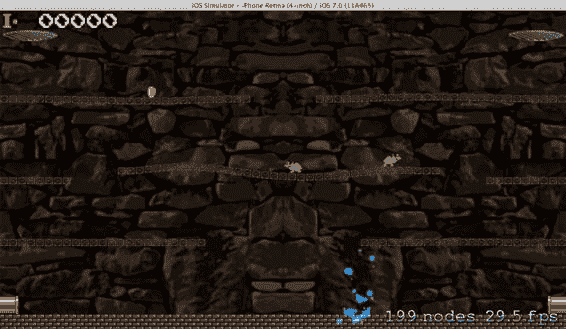
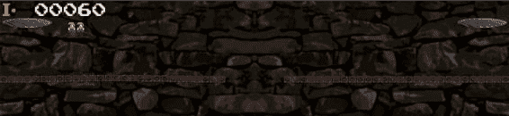
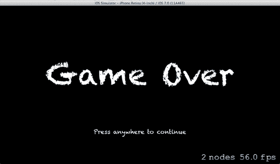
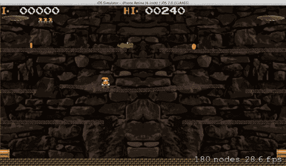

# 第 8 章：接触与碰撞

### 169

### 老鼠收集音效

让我们为收集老鼠时添加一个音效，并回头为老鼠从下方被击中导致昏迷时也添加一个音效。将名为 `EnemyCollected.caf` 和 `EnemyKO.caf` 的音效文件添加到项目中，并将它们移动到 Sounds 文件夹中。

在 `SKBRatz.h` 文件中为这些文件名添加几个常量：

```c
#define kRatzSpawnSoundFileName @"SpawnEnemy.caf"
#define kRatzKOSoundFileName @"EnemyKO.caf"
#define kRatzCollectedSoundFileName @"EnemyCollected.caf"
#define kRatzRunningIncrement 40
#define kRatzPointValue 100
```

在 `SKBRatz.h` 文件中添加几个局部变量来保存新的音效：

```objc
@property (nonatomic, strong) SKBSpriteTextures *spriteTextures;
@property (nonatomic, strong) SKAction *spawnSound, *koSound, *collectedSound;
+ (SKBRatz *)initNewRatz:(SKScene *)whichScene startingPoint:(CGPoint)location ratzIndex:(int)index;
```

然后在 `SKBRatz.m` 文件的 `spawnedInScene` 方法中添加初始化代码：

```objc
// 音效
_koSound = [SKAction playSoundFileNamed:kRatzKOSoundFileName
                      waitForCompletion:NO];
```
```


`_collectedSound = [SKAction playSoundFileNamed:kRatzCollectedSoundFileName waitForCompletion:NO];`

`_spawnSound = [SKAction playSoundFileNamed:kRatzSpawnSoundFileName waitForCompletion:NO];`

`[self runAction:_spawnSound];`

最后，在 `SKBRatz.m` 文件的 `ratzCollected` 方法中添加播放声音的代码：`NSLog(@"%@ collected", self.name);`

```
// 播放音效
[whichScene runAction:_collectedSound];
```

构建并运行程序，即可听到新的音效。

[www.it-ebooks.info](http://www.it-ebooks.info/)

# 第 8 章：接触与碰撞

### Ratz 收集点数显示

让我们显示一段文字，向玩家表明收集 Ratz 时的分值。在 `SKBRatz.m` 文件的 `ratzCollected` 方法中添加以下代码：

```
// 播放音效
[whichScene runAction:_collectedSound];

// 显示获胜金额
SKLabelNode *moneyText = [SKLabelNode labelNodeWithFontNamed:@"Courier-Bold"];
moneyText.text = [NSString stringWithFormat:@"$%d", kRatzPointValue];
moneyText.fontSize = 9;
moneyText.fontColor = [SKColor whiteColor];
moneyText.position = CGPointMake(self.position.x-10, self.position.y+28);
[whichScene addChild:moneyText];

SKAction *fadeAway = [SKAction fadeOutWithDuration:1];
[moneyText runAction:fadeAway completion:^{
    [moneyText removeFromParent];
}];

[self removeFromParent];
```

构建并运行程序，感受你刚刚为游戏过程添加的视听效果。进展不错！

### 被踢飞

目前，敌人在被“收集”时会直接消失。这样太不够刺激了，你不觉得吗？让我们增加一些视觉趣味，让敌人在飞出平台并在空中旋转后，消失在屏幕底部。

你需要为敌人状态添加一个新的枚举值，因此在 `SKBRatz.h` 文件中添加：

```
SBRatzKOfacingLeft,
SBRatzKOfacingRight,
SBRatzKicked
} SBRatzStatus;
```

然后在 `SKBRatz.h` 文件中添加一个静态变量：

```
#define kRatzRunningIncrement 40
#define kRatzKickedIncrement 5
#define kRatzPointValue 100
```

[www.it-ebooks.info](http://www.it-ebooks.info/)

# 第 8 章：接触与碰撞

你需要更新 `SKBRatz.m` 文件中 `initNewRatz` 方法的 `collisionBitMask` 值：

```
ratz.physicsBody.contactTestBitMask = kWallCategory | kLedgeCategory |
kPipeCategory | kRatzCategory | kCoinCategory ;

ratz.physicsBody.collisionBitMask = kBaseCategory | kWallCategory |
kLedgeCategory | kPlayerCategory | kRatzCategory | kCoinCategory ;
ratz.physicsBody.density = 1.0;
```

接下来，你将更新 `SKBPlayer.m` 文件中 `initNewPlayer` 方法的玩家接触与碰撞位掩码值：

```
player.physicsBody.categoryBitMask = kPlayerCategory;
player.physicsBody.contactTestBitMask = kWallCategory | kLedgeCategory |
kCoinCategory | kRatzCategory;
player.physicsBody.collisionBitMask = kBaseCategory | kWallCategory |
kLedgeCategory | kRatzCategory ;
player.physicsBody.density = 1.0;
```

最大的变化将在 `SKBRatz.m` 文件的 `ratzCollected` 方法中：

```
- (void)ratzCollected:(SKScene *)whichScene
{
    NSLog(@"%@ collected", self.name);

    // 更新状态
    _ratzStatus = SBRatzKicked;

    // 播放音效
    [whichScene runAction:_collectedSound];

    // 显示获胜金额
    SKLabelNode *moneyText = [SKLabelNode labelNodeWithFontNamed:@"Courier-Bold"];
    moneyText.text = [NSString stringWithFormat:@"$%d", kRatzPointValue];
    moneyText.fontSize = 9;
    moneyText.fontColor = [SKColor whiteColor];
    moneyText.position = CGPointMake(self.position.x-10, self.position.y+28);
    [whichScene addChild:moneyText];

    SKAction *fadeAway = [SKAction fadeOutWithDuration:1];
    [moneyText runAction:fadeAway completion:^{
        [moneyText removeFromParent];
    }];

    // 施加向上的冲量
    [self.physicsBody applyImpulse:CGVectorMake(0, kRatzKickedIncrement)];

    // 被踢飞时使其旋转
    SKAction *rotation = [SKAction rotateByAngle:M_PI duration:0.1];
    // 2*pi = 360 度, pi = 180 度
    SKAction *rotateForever = [SKAction repeatActionForever:rotation];
```


**[self runAction:rotateForever];**

[www.it-ebooks.info](http://www.it-ebooks.info/)

172

# 第 8 章：接触与碰撞

```
// 在被踢飞并旋转时，等待一小段时间再修改 physicsBody
SKAction *shortDelay = [SKAction waitForDuration:0.5];
[self runAction:shortDelay completion:^{
    // 创建一个新的、小得多的物理体，以免在下落时影响壁架等物体...
    self.physicsBody = [SKPhysicsBody bodyWithRectangleOfSize:CGSizeMake(1, 1)];
    self.physicsBody.categoryBitMask = kRatzCategory;
    self.physicsBody.collisionBitMask = kWallCategory;
    self.physicsBody.contactTestBitMask = kWallCategory;
    self.physicsBody.linearDamping = 1.0;
    self.physicsBody.allowsRotation = YES;
}];
```

当这个方法被触发时，你对节点施加一个冲量（类似于玩家跳跃），并创建一个旋转`SKAction`，让 Ratz 开始旋转并飞向空中。重力接管后，它便开始下落。你会设定一个短暂的延迟，以便在对`physicsBody`属性进行大幅修改之前，所有动作都有时间启动。你创建一个尺寸更小的新`SKPhysicsBody`，以帮助它避开其他屏幕对象，比如壁架。

在这个过程中，唯一需要关心的碰撞和接触事件是与周围墙壁的接触，因此你需要相应地设置这些值。你更改了`linearDamping`的默认值 (0.0)，这会减缓它的运动速度。这个`linearDamping`属性用于模拟节点上的液体或空气摩擦力，所以这项改动会使它在下落到底部时速度稍慢一些。

现在，你可以修改`SKBGameScene.m`文件中的`didBeginContact`方法，以处理敌人撞击屏幕底部时的下落情况：

```
// Ratz / 侧壁
if ((((firstBody.categoryBitMask & kWallCategory) != 0) && ((secondBody.categoryBitMask & kRatzCategory) != 0))) {
    SKBRatz *theRatz = (SKBRatz *)secondBody.node;
    if (theRatz.ratzStatus != SBRatzKicked) {
        if (theRatz.position.x < 100) {
            [theRatz wrapRatz:CGPointMake(self.frame.size.width-13, theRatz.position.y)];
        } else {
            [theRatz wrapRatz:CGPointMake(13, theRatz.position.y)];
        }
    } else {
        // 接触到底部墙壁（已被踢飞并已落下）
        NSLog(@"%@ 撞到屏幕底部，正在被移除", theRatz.name);
        [theRatz removeFromParent];
    }
}
```

[www.it-ebooks.info](http://www.it-ebooks.info/)

# 第 8 章：接触与碰撞

173

构建并运行程序，以查看当英雄踢飞一个昏迷敌人时触发的新动画序列。

## 落水

当害虫撞到屏幕底部时，你应该添加一个视觉效果，使其看起来像溅入水中。为此，你将创建另一个粒子效果。

让我们创建一个新的 Ratz 类方法，以处理害虫生命周期的最后这一幕。

在`SKBRatz.h`文件中添加公开声明：

```
- (void)ratzCollected:(SKScene *)whichScene;
- (void)ratzHitWater:(SKScene *)whichScene;
- (void)runRight;
```

然后在`SKBRatz.m`文件中现有的`ratzCollected`方法之后插入实现：

```
self.physicsBody.linearDamping = 1.0;
self.physicsBody.allowsRotation = YES;
}];
```

```
- (void)ratzHitWater:(SKScene *)whichScene
{
    NSLog(@"%@ 撞到屏幕底部，正在被移除", self.name);
    [self removeFromParent];
}
```

现在修改`SKBGameScene.m`文件的`didBeginContact`方法中的`Ratz / 侧壁` `if()` 语句：

```
} else {
    // 接触到底部墙壁，因此已被踢飞并落到屏幕底部
    [theRatz ratzHitWater:self];
}
```

现在基础已经搭好，你可以创建新的粒子了。

从**文件**菜单选择**新建文件**，确保左侧列表中选中了**iOS 资源**，选择**SpriteKit 粒子文件**，然后点击**下一步**按钮。从**模板**下拉菜单中选择**火花**，然后点击**下一步**按钮。将其命名为`Splashed`，然后点击**创建**按钮。

[www.it-ebooks.info](http://www.it-ebooks.info/)

174


**第 8 章：接触与碰撞**

在 Xcode 窗口左侧的项目导航器中，你会发现已为你生成的新文件：`Splashed`。将此新文件移动到 `Emitters` 组文件夹中。在中央编辑器面板中，你可以看到新的 `SKEmitterNode` 正在生成大量粒子。现在需要编辑参数值，以创建模拟水花飞溅的粒子流。请按以下数值更改设置：

| 属性 | 值 |
| --- | --- |
| 粒子，出生率 | 0 |
| 粒子，最大数量 | 0 |
| 生命周期，起始 | 0.378 |
| 生命周期，范围 | 0.093 |
| 位置范围，X | 38.768 |
| 位置范围，Y | 0.008 |
| 角度，起始 | 89.928 |
| 角度，范围 | 1.77 |
| 速度，起始 | 53.92 |
| 速度，范围 | 0 |
| 加速度，X | 0 |
| 加速度，Y | 0 |
| 透明度，起始 | 1 |
| 透明度，范围 | 0.2 |
| 透明度，速度 | 0 |
| 缩放，起始 | 0.1 |
| 缩放，范围 | 0.2 |
| 缩放，速度 | 0.17 |
| 旋转，起始 | 0 |
| 旋转，范围 | 0 |
| 旋转，速度 | 0 |
| 颜色混合，因子 | 1 |
| 颜色混合，范围 | 0 |
| 颜色混合，速度 | 0 |

接着将颜色选择器中的默认橙色改为蓝色调，使其看起来更像水。

当然，你需要一个音效与视觉效果相配，因此将 `Splash.caf` 音效文件添加到项目中，并将其移动到 `Sounds` 组文件夹中。

在 `SKBRatz.h` 文件中为音效文件名添加一个新常量：

```objc
#define kRatzCollectedSoundFileName @"EnemyCollected.caf"
#define kRatzSplashedSoundFileName @"Splash.caf"
#define kRatzRunningIncrement 40
```

然后在 `SKBRatz.h` 文件中添加一个新的实例变量来存储音效：

```objc
@property (nonatomic, strong) SKBSpriteTextures *spriteTextures;
@property (nonatomic, strong) SKAction *spawnSound, *koSound, *collectedSound, *splashSound;
+ (SKBRatz *)initNewRatz:(SKScene *)whichScene startingPoint:(CGPoint)location ratzIndex:(int)index;
```

在 `SKBRatz.m` 文件的 `spawnedInScene` 方法中添加这个新变量的初始化代码：

```objc
// 音效
_splashSound = [SKAction playSoundFileNamed:kRatzSplashedSoundFileName waitForCompletion:NO];
_koSound = [SKAction playSoundFileNamed:kRatzKOSoundFileName waitForCompletion:NO];
```

然后在 `SKBRatz.m` 文件的 `ratzHitWater` 方法中添加将所有功能整合在一起的代码：

```objc
- (void)ratzHitWater:(SKScene *)whichScene
{
    // 播放音效
    [whichScene runAction:_splashSound];

    // 水花特效
    NSString *emitterPath = [[NSBundle mainBundle] pathForResource:@"Splashed" ofType:@"sks"];
    SKEmitterNode *splash = [NSKeyedUnarchiver unarchiveObjectWithFile:emitterPath];
    splash.position = self.position;
    NSLog(@"水花位置 (%f,%f)", splash.position.x, splash.position.y);
    splash.name = @"ratzSplash";
    splash.targetNode = whichScene.scene;
    [whichScene addChild:splash];

    [self removeFromParent];
}
```

构建并运行程序，看看当怪物被踢下平台掉入水中会发生什么。

**敌人击杀玩家**

现在该提高一下游戏难度了。主角目前一直过得太轻松——拥有至高权力且不死之身。是时候改变这一切了。

你已经在 `SKBGameScene.m` 文件的 `didBeginContact` 方法中编写了检测玩家与敌人接触的测试代码，因此只需稍作修改即可处理这个新事件：

```objc
// 玩家 / 怪物
if ((((firstBody.categoryBitMask & kPlayerCategory) != 0) && ((secondBody.categoryBitMask & kRatzCategory) != 0))) {
    SKBRatz *theRatz = (SKBRatz *)secondBody.node;
    if (theRatz.ratzStatus == SBRatzKOfacingLeft || theRatz.ratzStatus == SBRatzKOfacingRight) {
        // 怪物昏迷，将其踢下平台
        [theRatz ratzCollected:self];
        // 增加分数
        _playerScore = _playerScore + kRatzPointValue;
        [_scoreDisplay updateScore:self newScore:_playerScore];
    } else if (theRatz.ratzStatus == SBRatzRunningLeft || theRatz.ratzStatus == SBRatzRunningRight) {
        // 哎呀，玩家死亡
        [_playerSprite playerKilled:self];
    }
}
```


你可以在 `SKBPlayer.m` 文件中现有的 `wrapPlayer` 方法之后插入这个新方法：

```
- (void)wrapPlayer:(CGPoint)where
{
    SKPhysicsBody *storePB = self.physicsBody;
    self.physicsBody = nil;
    self.position = where;
    self.physicsBody = storePB;
}
```

```
#pragma mark Contact
- (void)playerKilled:(SKScene *)whichScene
{
    NSLog(@"Player has died...");
}
```

```
#pragma mark Movement
- (void)runRight
```

别忘了在 `SKBPlayer.h` 文件中进行公开声明：

- `(void)wrapPlayer:(CGPoint)where;`
- `(void)playerKilled:(SKScene *)whichScene;`
- `(void)runRight;`

构建并运行程序，测试新的死亡功能。

## 玩家死亡音效

现在基础已经打好，你可以把内容“美化”一下了。我们先从音效开始。

将名为 `Playerbitten.caf` 的声音文件添加到项目中，并将其移到 Sounds 文件夹中。在 `SKBPlayer.h` 文件中为这个文件名添加一个常量：

```
#define kPlayerSpawnSoundFileName @"SpawnPlayer.caf"
#define kPlayerBittenSoundFileName @"Playerbitten.caf"
#define kPlayerRunSoundFileName @"Run.caf"
```

在 `SKBPlayer.h` 文件中添加一个局部变量来存放新的声音：

```
@property SBPlayerStatus playerStatus;
@property (nonatomic, strong) SKAction *spawnSound, *bittenSound;
@property (nonatomic, strong) SKAction *runSound, *jumpSound, *skidSound;
```

然后在 `SKBPlayer.m` 文件的 `spawnedInScene` 方法中添加初始化代码：

```
_spawnSound = [SKAction playSoundFileNamed:kPlayerSpawnSoundFileName waitForCompletion:NO];
_bittenSound = [SKAction playSoundFileNamed:kPlayerBittenSoundFileName waitForCompletion:NO];
_runSound = [SKAction playSoundFileNamed:kPlayerRunSoundFileName waitForCompletion:YES];
```

最后，在 `SKBPlayer.m` 文件的 `playerKilled` 方法中添加播放声音的代码：

```
NSLog(@"Player has died...");
// 播放音效
[whichScene runAction:_bittenSound];
```

构建并运行程序，听听新的音效。

## 玩家跌落平台

可以说，你的英雄已经倒下了。一只恶毒的老鼠咬了他，他现在会像敌人一样掉进水里。

你需要为玩家状态添加一个新的枚举值，因此请在 `SKBPlayer.h` 文件中添加：

```
SBPlayerJumpingUpFacingLeft,
SBPlayerJumpingUpFacingRight,
SBPlayerFalling
} SBPlayerStatus;
```

同时在 `SKBPlayer.h` 文件中添加一个新的常量：

```
#define kPlayerRunningIncrement 100
#define kPlayerSkiddingIncrement 20
#define kPlayerJumpingIncrement 8
#define kPlayerBittenIncrement 5
```

接下来，修改 `SKBPlayer.m` 文件中的 `playerKilled` 方法：

```
- (void)playerKilled:(SKScene *)whichScene
{
    NSLog(@"Player has died...");
    [self removeAllActions];
    // 更新状态
    _playerStatus = SBPlayerFalling;

    // 播放音效
    [whichScene runAction:_bittenSound];

    // 施加向上的冲量
    [self.physicsBody applyImpulse:CGVectorMake(0, kPlayerBittenIncrement)];

    // 在上飞过程中，短暂延迟后修改 physicsBody
    SKAction *shortDelay = [SKAction waitForDuration:0.5];
    [self runAction:shortDelay completion:^{
        // 创建一个非常非常小的新物理学体，以便在他下落时不影响平台边缘...
        self.physicsBody = [SKPhysicsBody bodyWithRectangleOfSize:CGSizeMake(1, 1)];
        self.physicsBody.categoryBitMask = kPlayerCategory;
        self.physicsBody.collisionBitMask = kWallCategory;
        self.physicsBody.contactTestBitMask = kWallCategory;
        self.physicsBody.linearDamping = 1.0;
        self.physicsBody.allowsRotation = NO;
    }];
}
```

你会注意到，这个方法与你之前在 `SKBRatz.m` 文件的 `ratzCollected` 方法中应用的方法非常相似。

在 `SKBPlayer.h` 文件中添加一个新的公开方法声明：

- `(void)playerKilled:(SKScene *)whichScene;`
- `(void)playerHitWater:(SKScene *)whichScene;`
- `(void)runRight;`


```markdown

在`SKBPlayer.m`文件中，在现有的`playerKilled`方法之后插入新的方法：

```objectivec
- (void)playerKilled:(SKScene *)whichScene
{
    NSLog(@"Player has died...");
    // Play sound
    [whichScene runAction:_bittenSound];
}

- (void)playerHitWater:(SKScene *)whichScene
{
    NSLog(@"Player has fallen and hit the water...");
    [self removeFromParent];
}
```

修改`SKBGameScene.m`文件中的`didBeginContact`方法，确保如果玩家已死亡和/或正在落入水中，则忽略玩家与敌人的任何接触：

```objectivec
// Player / Ratz
if ((((firstBody.categoryBitMask & kPlayerCategory) != 0) && ((secondBody.categoryBitMask & kRatzCategory) != 0))) {
    SKBRatz *theRatz = (SKBRatz *)secondBody.node;
    if (_playerSprite.playerStatus != SBPlayerFalling) {
        if (theRatz.ratzStatus == SBRatzKOfacingLeft || theRatz.ratzStatus == SBRatzKOfacingRight) {
            // ratz unconscious so kick 'em off the ledge
            [theRatz ratzCollected:self];
            // Score some points
            _playerScore = _playerScore + kRatzPointValue;
            [_scoreDisplay updateScore:self newScore:_playerScore];
        } else if (theRatz.ratzStatus == SBRatzRunningLeft || theRatz.ratzStatus == SBRatzRunningRight) {
            // oops, player dies
            [_playerSprite playerKilled:self];
        }
    }
}
```

[www.it-ebooks.info](http://www.it-ebooks.info/)



**180 第 8 章：接触与碰撞**

现在，您可以修改`SKBGameScene.m`文件中的`didBeginContact`方法，以处理坠落的玩家撞击屏幕底部的情况：

```objectivec
// Player / sideWalls
if ((((firstBody.categoryBitMask & kPlayerCategory) != 0) && ((secondBody.categoryBitMask & kWallCategory) != 0))) {
    if ([firstBodyName isEqualToString: @"player1"]) {
        if (_playerSprite.playerStatus != SBPlayerFalling) {
            if (_playerSprite.position.x < 100) {
                //NSLog(@"player contacted left edge");
                [_playerSprite wrapPlayer:CGPointMake(self.frame.size.width-10, _playerSprite.position.y)];
            } else {
                //NSLog(@"player contacted right edge");
                [_playerSprite wrapPlayer:CGPointMake(10, _playerSprite.position.y)];
            }
        } else {
            // contacted bottom wall (has been killed and has fallen)
            [_playerSprite playerHitWater:self];
        }
    }
}
```

构建并运行程序，查看当英雄被敌人精灵杀死时触发的新动画序列（参见图 8-7）。

**图 8-7.** *玩家溅入水中*

[www.it-ebooks.info](http://www.it-ebooks.info/)

**第 8 章：接触与碰撞 181**

**玩家在水中**

由于坠落的英雄已经进入水中，很明显当精灵撞到水底时，您应该对其应用相同的粒子特效和音效。

这两个必要的文件已经在您的项目中，因此只需少量代码更改即可实现。

在`SKBPlayer.h`文件中添加音效文件名常量：

```objectivec
#define kPlayerBittenSoundFileName @"Playerbitten.caf"
#define kPlayerSplashedSoundFileName @"Splash.caf"
#define kPlayerRunSoundFileName @"Run.caf"
```

同时，在`SKBPlayer.h`文件中添加一个属性来存储音效：

```objectivec
@property (nonatomic, strong) SKAction *spawnSound, *bittenSound, *splashSound;
@property (nonatomic, strong) SKAction *runSound, *jumpSound, *skidSound;
```

在`SKBPlayer.m`文件的`spawnedInScene`方法中添加初始化代码：

```objectivec
_bittenSound = [SKAction playSoundFileNamed:kPlayerBittenSoundFileName waitForCompletion:NO];
_splashSound = [SKAction playSoundFileNamed:kPlayerSplashedSoundFileName waitForCompletion:NO];
_runSound = [SKAction playSoundFileNamed:kPlayerRunSoundFileName waitForCompletion:YES];
```

现在，在`SKBPlayer.m`文件的`playerHitWater`方法中添加特效：

```objectivec
- (void)playerHitWater:(SKScene *)whichScene
{
    NSLog(@"Player has fallen and hit the water...");
    // Play sound
    [whichScene runAction:_splashSound];
    // splash eye candy
    NSString *emitterPath = [[NSBundle mainBundle] pathForResource:@"Splashed" ofType:@"sks"];
    SKEmitterNode *splash = [NSKeyedUnarchiver unarchiveObjectWithFile:emitterPath];
    splash.position = self.position;
```

```


## 排版后内容

`//NSLog(@"splash (%f,%f)", splash.position.x, splash.position.y);`  
`splash.name = @"playerSplash";`

`splash.targetNode = whichScene.scene;`

`[whichScene addChild:splash];`

`[self removeFromParent];`

构建并运行程序，看看你的英雄是如何倒下的。

[www.it-ebooks.info](http://www.it-ebooks.info/)

# 第 8 章：接触与碰撞

## 本章小结

你在本章中添加了大量代码，其中大部分用于处理此类游戏的所有逻辑。

在本章开始时，你拥有了一个由用户控制的玩家精灵，它可以在岩架之间奔跑和跳跃，同时你还生成了多个敌方精灵和奖励物品，它们也在"下水道"环境中游荡。本章处理了所有这些角色之间的交互。至此，你应该对接触和碰撞事件非常熟悉，并且能够理解两者之间的区别。

你添加了许多音效，并在适当的时候触发它们播放。此外，你还创建了一些粒子特效。

第一个游戏关卡会随时间生成五个敌方/奖励精灵。你需要更多关卡！

这正是你将在下一章学习的内容，同时还包括处理多条玩家生命以及管理游戏结束的逻辑。

[www.it-ebooks.info](http://www.it-ebooks.info/)

# 第 9 章：添加更多场景和关卡

### 多条玩家生命

在开始为游戏添加更多关卡之前，你还需要实现一些额外的细节。

例如，你希望玩家在游戏中能够"死亡"多次而不至于游戏结束。你将让游戏开始时拥有多条生命，这样当一只恶心的害兽攻击到玩家时，玩家可以在几秒后重新出现，准备再次迎战。毕竟，意外总会发生，害兽凶恶，下水道臭气熏天，但你的英雄坚韧不拔，必将存活！希望如此。

首先，你需要添加一个常量，用来确定玩家每局游戏开始时的生命数量。在`SKBGameScene.h`文件的顶部添加以下代码行：

```
#import "SKBRatz.h"

#define kPlayerLivesMax 3

@interface SKBGameScene : SKScene <SKPhysicsContactDelegate>
```

现在，你需要在场景中添加一些属性，以便跟踪玩家的生命状态，这些也添加到`SKBPlayer.h`文件中：

```
@property int spawnedEnemyCount;
@property BOOL enemyIsSpawningFlag;
@property BOOL playerIsDeadFlag;
@property int playerLivesRemaining;
```

在`SKBGameScene.m`文件的`createSceneContents`方法中初始化这些实例变量：

```
// Player（玩家）
_playerSprite = [SKBPlayer initNewPlayer:self startingPoint:CGPointMake(80, 245)]; // 40,25
[_playerSprite spawnedInScene:self];
_playerLivesRemaining = kPlayerLivesMax;
_playerIsDeadFlag = NO;
```

然后，在`SKBGameScene.m`文件的`didBeginContact`方法中，在`Player / Ratz if()`语句内部修改相应的变量：

```
} else if (theRatz.ratzStatus == SBRatzRunningLeft || theRatz.ratzStatus ==
SBRatzRunningRight) {
    // 哎呀，玩家死亡
    [_playerSprite playerKilled:self];
    _playerLivesRemaining--; // 计数器减一
}
```

现在一切就绪，你只需要找一个合适的位置来检查玩家剩余的生命数量，并触发游戏结束。最合适的检查位置是在`SKBGameScene.m`文件的`update`方法中：

```
/* 在每一帧渲染之前调用 */
// 检查游戏是否结束
if (_playerLivesRemaining == 0) {
    NSLog(@"玩家没有剩余生命，触发游戏结束");
} else if (_playerIsDeadFlag) {
    // 处理玩家死亡
    _playerIsDeadFlag = NO;
    // 短暂延迟后复活（如果适用）
    SKAction *shortDelay = [SKAction waitForDuration:2];
    [self runAction:shortDelay completion:^{
        NSLog(@"玩家复活（剩余%d 条生命）", _playerLivesRemaining);
        _playerSprite = [SKBPlayer initNewPlayer:self
                                startingPoint:CGPointMake(40, 25)];
        [_playerSprite spawnedInScene:self];
    }];
}
```


**}];**  

**} else {**  

**// 游戏正在运行**  

```  
// 敌人和奖励精灵的生成  
if (!_enemyIsSpawningFlag && _spawnedEnemyCount < [_cast_TypeArray count]) {  
```

**注意**：由于你在现有 `if()` 语句的前面新增了一个 `if()` 语句，因此需要在该方法的末尾添加一个右花括号，以避免构建时出现错误。  

## 第 9 章：添加更多场景与关卡  

你在此处的操作是检查 `playerLivesRemaining` 变量是否已归零，如果归零，则触发游戏结束。（本章后续会详细介绍这一点。）如果玩家还有剩余生命，你需要检查 `playerIsDeadFlag` 是否已被设置，如果已设置，则开始在起始位置复活一个新的玩家精灵。不过在此之前，你需要创建一个短暂的延迟，这样玩家在死亡后不会立即重新出现。这能让游戏流程更自然，也让玩家在再次尝试前能喘口气、伸展一下。当延迟结束后，就像游戏开始时那样，创建一个新的玩家精灵。  

当玩家的状态变为 `SBPlayerFalling`，或者玩家已死亡但尚未复活时，你需要确保不允许用户交互打断这些过程。  

因此，你需要在 `SKBGameScene.m` 文件的 `touchesBegan` 方法中添加一个 `if()` 语句：  

```  
if (_playerSprite.playerStatus != SBPlayerFalling && !_playerIsDeadFlag) {  
    if (location.y >= (self.frame.size.height / 2 )) {  
        // 用户触摸了屏幕上半部分（零点为屏幕底部）  
        if (status != SBPlayerJumpingLeft && status != SBPlayerJumpingRight &&  
            status != SBPlayerJumpingUpFacingLeft && status != SBPlayerJumpingUpFacingRight) {  
            [_playerSprite jump];  
        }  
    } else if (location.x <= (self.frame.size.width / 2 )) {  
        // 用户触摸了屏幕左侧  
        if (status == SBPlayerRunningRight) {  
            [_playerSprite skidRight];  
        } else if (status == SBPlayerFacingLeft || status == SBPlayerFacingRight) {  
            [_playerSprite runLeft];  
        }  
    } else {  
        // 用户触摸了屏幕右侧  
        if (status == SBPlayerRunningLeft) {  
            [_playerSprite skidLeft];  
        } else if (status == SBPlayerFacingLeft || status == SBPlayerFacingRight) {  
            [_playerSprite runRight];  
        }  
    }  
}  
```  

构建并运行程序，测试新的多生命功能。  

### 添加可视化生命计量器  

现在你已编写好处理多条生命的代码，但此时玩家在界面上看不到任何内容。  

你可以通过在屏幕上为玩家剩余的每条生命添加一个“身体”图标来解决这个问题。  

在 `SKBGameScene.m` 文件中现有的 `loadCastOfCharacters` 方法之后，插入新的 `playerLivesDisplay` 方法：  

```  
} else {  
    NSLog(@"未从'%@'加载 plist 文件", kCastOfCharactersFileName);  
}  

#pragma mark 生命显示  

- (void)playerLivesDisplay  
{  
    SKTexture *lifeTexture = [SKTexture textureWithImageNamed:kPlayerStillRightFileName];  
    CGPoint startWhere = CGPointMake(CGRectGetMinX(self.frame) + kScorePlayer1distanceFromLeft + 60,  
                                     CGRectGetMaxY(self.frame) - kScoreDistanceFromTop - 20);  

    // 首先清除所有生命图标  
    for (int index = 1; index <= kPlayerLivesMax; index++) {  
        [self enumerateChildNodesWithName:[NSString stringWithFormat:@"player_lives%d", index]  
                               usingBlock:^(SKNode *node, BOOL *stop) {  
                                   *stop = YES;  
                                   [node removeFromParent];  
                               }];  
    }  

    // 每剩余一条生命显示一个身体图标  
    for (int index = 1; index <= _playerLivesRemaining; index++) {  
        SKSpriteNode *lifeNode = [SKSpriteNode spriteNodeWithTexture:lifeTexture];  
        lifeNode.name = [NSString stringWithFormat:@"player_lives%d", index];  
        lifeNode.position = CGPointMake(startWhere.x + (kScorePlayer1distanceFromLeft * index),  
                                        startWhere.y);  
        lifeNode.xScale = 0.5;  
        lifeNode.yScale = 0.5;  
        [self addChild:lifeNode];  
    }  
}  

#pragma mark 接触/碰撞/触摸  
```


该方法使用现有图像创建一个 `SKSpriteNode`，并以分数显示为参考点计算起始位置。然后，它会遍历屏幕上可能已存在的所有生命图标，并将其从场景中移除。最后，它遍历当前剩余的生命数量，创建一个图标，为其赋予动态名称和位置，将缩放比例调整为原始尺寸的 50%，并将其添加到场景中。由于你在之前的章节中已经做过类似的操作，这一切对你来说应该不难理解。

[www.it-ebooks.info](http://www.it-ebooks.info/)



# 第 9 章：添加更多场景和关卡

**187**

现在你已经创建了显示方法，需要在几个地方触发它。首先，你需要在游戏开始时运行它，因此我们将其添加到 `SKBGameScene.m` 文件中 `createSceneContents` 方法的末尾：

```
// 玩家
_playerSprite = [SKBPlayer initNewPlayer:self startingPoint:CGPointMake (40, 25)];
[_playerSprite spawnedInScene:self];
_playerLivesRemaining = kPlayerLivesMax;
_playerIsDeadFlag = NO;
[self playerLivesDisplay];
```

然后，将显示方法添加到 `SKBGameScene.m` 文件中 `didBeginContact` 方法内的 `Player / Ratz` if() 语句中：

```
} else if (theRatz.ratzStatus == SBRatzRunningLeft || theRatz.ratzStatus ==
SBRatzRunningRight) {
    // 糟糕，玩家死亡
    [_playerSprite playerKilled:self];
    _playerLivesRemaining--; // 计数器减一
    [self playerLivesDisplay];
}
```

构建并运行程序，查看新的显示效果，它会显示玩家还剩多少条命（见图 [9-1]（#index_split_002.html#p189））。

***图 9-1.** 显示两条命的生命计量器*

### 游戏结束

现在你需要处理游戏的结束，通过给玩家一些视觉提示来表明游戏已结束，然后允许他们开始一个全新的游戏。

首先，你需要一个新的属性，将其添加到 `SKBGameScene.h` 文件中：

```
@property int playerLivesRemaining;
@property BOOL gameIsOverFlag;
@property (nonatomic, strong) SKBScores *scoreDisplay;
```

[www.it-ebooks.info](http://www.it-ebooks.info/)

**188**

**第 9 章：添加更多场景和关卡**

然后，你可以在 `SKBGameScene.m` 文件的 `createSceneContents` 方法中对其进行初始化：

```
- (void)createSceneContents
{
    // 初始化敌人与调度
    _gameIsOverFlag = NO;
    _spawnedEnemyCount = 0;
    _enemyIsSpawningFlag = NO;
```

你将要带玩家回到启动画面，因此需要在 `SKBGameScene.m` 文件的顶部添加一个 `#import`：

```
#import "SKBGameScene.h"
#import "SKBSplashScene.h"

@implementation SKBGameScene
```

现在，你可以在 `SKBGameScene.m` 文件中现有的 `playerLivesDisplay` 方法之后插入新的 `gameIsOver` 方法：

```
lifeNode.xScale = 0.5;
lifeNode.yScale = 0.5;
[self addChild:lifeNode];
}

#pragma mark 游戏结束
- (void)gameIsOver
{
    NSLog(@"游戏结束！");
    _gameIsOverFlag = YES;
    [self removeAllActions];
    [self removeAllChildren];
    SKLabelNode *gameOverText = [SKLabelNode
        labelNodeWithFontNamed:@"Chalkduster"];
    gameOverText.text = @"Game Over";
    gameOverText.fontSize = 60;
    gameOverText.xScale = 0.1;
    gameOverText.yScale = 0.1;
    gameOverText.position = CGPointMake(CGRectGetMidX(self.frame),
        CGRectGetMidY(self.frame));
    SKLabelNode *pressAnywhereText = [SKLabelNode
        labelNodeWithFontNamed:@"Chalkduster"];
    pressAnywhereText.text = @"Press anywhere to continue";
    pressAnywhereText.fontSize = 12;
    pressAnywhereText.position = CGPointMake(CGRectGetMidX(self.frame),
        CGRectGetMidY(self.frame)-100);
```

[www.it-ebooks.info](http://www.it-ebooks.info/)

**第 9 章：添加更多场景和关卡**

**189**

```
    SKAction *zoom = [SKAction scaleTo:1.0 duration:2];
    SKAction *rotate = [SKAction rotateByAngle:M_PI duration:0.5];
    // 2*pi = 360 度, pi = 180 度
    SKAction *rotateAbit = [SKAction repeatAction:rotate count:4];
    SKAction *group = [SKAction group:@[zoom,rotateAbit]];
    [gameOverText runAction:group];
    [self addChild:gameOverText];
```


# [self addChild:pressAnywhereText];

`}`

## 接触/碰撞/触摸

这个方法可能不需要太多解释。你将游戏标记为结束。当代码从场景中移除所有子节点时，屏幕变黑，因为这会清除所有现有的游戏节点。然后你创建两个文本节点。一个是静态的，另一个会旋转并在几秒内逐渐变大，然后停止。这为玩家呈现了一些动画文本。

现在，在 `SKBGameScene.m` 文件的更新方法中添加触发新方法的代码：

```
// 检查游戏是否结束

if (_gameIsOverFlag) {

    NSLog(@"update, gameIsOverFlag is TRUE...");

} else if (_playerLivesRemaining == 0) {

    NSLog(@"玩家没有剩余生命了，触发游戏结束");

    [self gameIsOver];

} else if (_playerIsDeadFlag) {

    // 处理玩家死亡
```

构建并运行程序，看看游戏结束时的效果（参见图 9-2）。你会注意到，当玩家最后一次死亡且屏幕变黑后，控制台会反复显示 `(@"update, gameIsOverFlag is TRUE...");`，直到用户点击屏幕，返回启动画面。这是因为当此 `SKScene` 处于活动状态时，更新方法中检查游戏结束的 `if()` 语句会持续被触发。这是一件好事，因为它可以防止在此状态下运行剩余的更新代码。只需注释掉 `NSLog()`，就能让控制台不那么繁忙。

[www.it-ebooks.info](http://www.it-ebooks.info/)



**190**

# 第 9 章：添加更多场景和关卡

**图 9-2.** 游戏结束画面

## 最高分

游戏结束时，你应该获取玩家的分数，将其与之前的游戏分数进行比较，并在游戏过程中显示当前最高分。

为了从“磁盘”存储和检索最高分，你将使用 `NSUserDefaults` 类，这样关闭游戏后最高分仍然保留。

首先，你需要一个新属性来跟踪当前最高分；将其添加到 `SKBGameScene.h` 文件中：

```
@property (nonatomic, strong) SKBScores *scoreDisplay;

@property int playerScore, highScore;

@end
```

你将把所有最高分图形代码添加到现有的 `SKBScores` 类中。在 `SKBScores.h` 文件中添加一个文件名常量：

```
#define kTextPlayerHeaderFileName @"Text_PlayerScoreHeader.png"

#define kTextHighHeaderFileName @"Text_HighScoreHeader.png"

#define kTextNumber0FileName @"Text_Number_0.png"
```

[www.it-ebooks.info](http://www.it-ebooks.info/)

**第 9 章：添加更多场景和关卡**

**191**

然后将图片 `Text_HighScoreHeader.png` 添加到项目中，并将其移动到 Sprites 文件夹中。

修改 `SKBScores.h` 文件中 `updateScore` 方法的公共声明：

```
- (void)updateScore:(SKScene *)whichScene newScore:(int)playerScore hiScore:(int)highScore;
```

然后修改 `SKBScores.m` 文件中的 `createScoreNode` 方法：

```
- (void)createScoreNode:(SKScene *)whichScene

{

    if (!_arrayOfNumberTextures) {

        [self createScoreNumberTextures];

    }

    // 玩家分数

    SKTexture *headerTexture = [SKTexture

                                textureWithImageNamed:kTextPlayerHeaderFileName];

    CGPoint startWhere = CGPointMake(CGRectGetMinX(whichScene.frame)+

                                     kScorePlayerDistanceFromLeft, CGRectGetMaxY(whichScene.frame)-

                                     kScoreDistanceFromTop);

    // 标题头

    SKSpriteNode *header = [SKSpriteNode spriteNodeWithTexture:headerTexture];

    header.name = @"score_player_header";

    header.position = startWhere;

    header.xScale = 2;

    header.yScale = 2;

    header.physicsBody.dynamic = NO;

    [whichScene addChild:header];

    // 分数，5 位数字

    SKTexture *textNumber0Texture = [SKTexture

                                     textureWithImageNamed:kTextNumber0FileName];

    for (int index=1; index <= kScoreDigitCount; index++) {

        SKSpriteNode *zero = [SKSpriteNode

                              spriteNodeWithTexture:textNumber0Texture];

        zero.name = [NSString stringWithFormat:@"score_player_digit%d", index];

        zero.position = CGPointMake(startWhere.x+20+(kScoreNumberSpacing*index),

                                    CGRectGetMaxY(whichScene.frame)-kScoreDistanceFromTop);

        zero.xScale = 2;
```


`zero.yScale = 2;`

`zero.physicsBody.dynamic = NO;`

`[whichScene addChild:zero];`

}

**// 高分**

`headerTexture = [SKTexture textureWithImageNamed:kTextHighHeaderFileName];`
`startWhere = CGPointMake(startWhere.x+200, startWhere.y);`

`www.it-ebooks.info`

**192**

**第 9 章：添加更多场景和关卡**

**// 标题**

`header = [SKSpriteNode spriteNodeWithTexture:headerTexture];`
`header.name = @"score_high_header";`
`header.position = startWhere;`
`header.xScale = 2;`
`header.yScale = 2;`
`header.physicsBody.dynamic = NO;`
`[whichScene addChild:header];`

**// 分数，5 位数**

`textNumber0Texture = [SKTexture textureWithImageNamed:kTextNumber0FileName];`
`for (int index=1; index <= kScoreDigitCount; index++) {`
`SKSpriteNode *zero = [SKSpriteNode`
`spriteNodeWithTexture:textNumber0Texture];`
`zero.name = [NSString stringWithFormat:@"score_high_digit%d", index];`
`zero.position = CGPointMake(startWhere.x+20+(kScoreNumberSpacing*index),`
`CGRectGetMaxY(whichScene.frame)-kScoreDistanceFromTop);`
`zero.xScale = 2;`
`zero.yScale = 2;`
`zero.physicsBody.dynamic = NO;`
`[whichScene addChild:zero];`
`}`
`}`

正如你所见，此方法以及下一个方法所做的全部工作，就是复制玩家得分节点并做一些修改。高分图形将与玩家得分节点错开，位于其右侧。

修改 `SKBScores.m` 文件中的 `updateScore` 方法，使其与以下代码一致：

```
- (void)updateScore:(SKScene *)whichScene newScore:(int)playerScore hiScore:(int)highScore

{

  // 玩家得分

  NSString *numberString = [NSString stringWithFormat:@"00000%d", playerScore];

  NSString *substring = [numberString substringFromIndex:[numberString length]

  - 5];

  for (int index = 1; index <= 5; index++) {

    [whichScene enumerateChildNodesWithName:[NSString

      stringWithFormat:@"score_player_digit%d", index]

      usingBlock:^(SKNode *node, BOOL *stop) {

        NSString *charAtIndex = [substring

          substringWithRange:NSMakeRange(index-1, 1)];

          int charIntValue = [charAtIndex intValue];

          SKTexture *digitTexture = [_arrayOfNumberTextures

            objectAtIndex:charIntValue];

          SKAction *newDigit = [SKAction animateWithTextures:@[digitTexture]

            timePerFrame:0.1];

          [node runAction:newDigit]; }];

  }

  // 高分

  numberString = [NSString stringWithFormat:@"00000%d", highScore];

  substring = [numberString substringFromIndex:[numberString length] - 5];

  for (int index = 1; index <= 5; index++) {

    [whichScene enumerateChildNodesWithName:[NSString

      stringWithFormat:@"score_high_digit%d", index]

      usingBlock:^(SKNode *node, BOOL *stop) {

        NSString *charAtIndex = [substring

          substringWithRange:NSMakeRange(index-1, 1)];

          int charIntValue = [charAtIndex intValue];

          SKTexture *digitTexture = [_arrayOfNumberTextures

            objectAtIndex:charIntValue];

          SKAction *newDigit = [SKAction animateWithTextures:@[digitTexture]

            timePerFrame:0.1];

          [node runAction:newDigit]; }];

  }

}
```

由于你向 `updateScore` 方法添加了一个参数，因此需要更改 `SKBGameScene.m` 文件中对该方法的调用。在 `createSceneContents` 方法中，进行如下修改：

```
// 计分

SKBScores *sceneScores = [[SKBScores alloc] init];

[sceneScores createScoreNode:self];

_scoreDisplay = sceneScores;

_playerScore = 0;

[_scoreDisplay updateScore:self newScore:_playerScore hiScore:_highScore];
```

在 `didBeginContact` 方法中，你调用了它两次。首先是在玩家/金币的 `if()` 语句块中：

```
// 奖励一些分数

_playerScore = _playerScore + kCoinPointValue;

[_scoreDisplay updateScore:self newScore:_playerScore hiScore:_highScore];
```

然后是在玩家/Ratz 的块中：

```
// 奖励一些分数

_playerScore = _playerScore + kRatzPointValue;

[_scoreDisplay updateScore:self newScore:_playerScore hiScore:_highScore];
```

接着，你在 `SKBGameScene.m` 文件的 `gameIsOver` 方法中添加代码，以触发高分更新：


```objc
[self removeAllActions];
[self removeAllChildren];
```

[www.it-ebooks.info](http://www.it-ebooks.info/)

**194**

# 第 9 章：添加更多场景与关卡

```objc
// 处理最高分
if (_playerScore > _highScore) {
    _highScore = _playerScore;
    NSLog(@"最高分: %d", _highScore);
    [_scoreDisplay updateScore:self newScore:_playerScore hiScore:_highScore];

    // 写入磁盘
    NSNumber *theScore = [NSNumber numberWithInt:_highScore];
    NSUserDefaults *userDefaults = [NSUserDefaults standardUserDefaults];
    [userDefaults setObject:theScore forKey:@"highScore"];
    [[NSUserDefaults standardUserDefaults] synchronize];
}
```

`SKLabelNode *gameOverText = [SKLabelNode labelNodeWithFontNamed:@"Chalkduster"];` 你需要将最高分的 `int` 值转换为 `NSNumber` 对象，以便存储到磁盘。

接下来，你需要在每次游戏开始时从磁盘读取该值。

修改 `SKBGameScene.m` 文件中的 `createSceneContents` 方法，以读取存储的值：

```objc
[self addChild:pipe];

// 从磁盘读取最高分（如果前一次游戏已写入）
NSNumber *theScore = [[NSUserDefaults standardUserDefaults]
                      objectForKey:@"highScore"];
_highScore = [theScore intValue];

// 计分
```

构建并运行程序，即可看到最高分已被写入磁盘，并在每次游戏启动时读取。

## 关卡完成判定

现在你需要检测并处理关卡完成的情况——当最后一个生成的敌人或奖励精灵被收集，主角无事可做时，即视为关卡完成。

你将新增一个属性，用于追踪当前屏幕上活跃的敌人精灵数量。

在 `SKBGameScene.h` 文件中声明该属性：

```objc
@property int frameCounter;
@property int spawnedEnemyCount, activeEnemyCount;
@property BOOL enemyIsSpawningFlag;
```

然后在 `SKBGameScene.m` 文件的 `update` 方法中递增该计数：

```objc
// 创建并生成新敌人
_enemyIsSpawningFlag = NO;
_spawnedEnemyCount = _spawnedEnemyCount + 1;
_activeEnemyCount++;

if (castType == SKBEnemyTypeCoin) {
```

[www.it-ebooks.info](http://www.it-ebooks.info/)

**第 9 章：添加更多场景与关卡**

**195**

接着，当金币被收集时，需要递减该计数。在 `SKBGameScene.m` 文件的 `didBeginContact` 方法中，向 `Player / Coins if()` 语句添加如下代码：

```objc
// 玩家 / 金币
if ((((firstBody.categoryBitMask & kPlayerCategory) != 0) && ((secondBody.categoryBitMask & kCoinCategory) != 0))) {
    SKBCoin *theCoin = (SKBCoin *)secondBody.node;
    [theCoin coinCollected:self];
    _activeEnemyCount--;

    // 奖励分数
    _playerScore = _playerScore + kCoinPointValue;
    [_scoreDisplay updateScore:self newScore:_playerScore];
}
```

然后，在 `Coin / Pipes if()` 语句中也添加该计数递减：

```objc
// 金币 / 管道
if ((((firstBody.categoryBitMask & kPipeCategory) != 0) && ((secondBody.categoryBitMask & kCoinCategory) != 0))) {
    SKBCoin *theCoin = (SKBCoin *)secondBody.node;
    [theCoin coinHitPipe];
    _activeEnemyCount--;
}
```

接着，在 `Ratz / Sidewalls if()` 语句中也添加：

```objc
} else {
    // 接触到底部墙壁（已被踢落并坠落）
    [theRatz ratzHitWater:self];
    _activeEnemyCount--;
}
```

最后，在 `SKBGameScene.m` 文件的 `checkForEnemyHits` 方法的 `Coin` 部分添加以下代码：

```objc
// 平台碰撞检测
if ([theCoin.lastKnownContactedLedge isEqualToString:struckLedgeName]) {
    NSLog(@"玩家击中了 %@，而 %@ 已知位于该位置", struckLedgeName, theCoin.name);
    [theCoin coinCollected:self];
    _activeEnemyCount--;
}
```

触发器设置完成后，你只需在 `SKBGameScene.m` 文件的 `update` 方法中测试该变量的值：

```objc
} else if (_playerIsDeadFlag) {
    // 处理玩家死亡
    _playerIsDeadFlag = NO;
```

[www.it-ebooks.info](http://www.it-ebooks.info/)

**196**

**第 9 章：添加更多场景与关卡**

```objc
    // 短暂延迟后复活（如适用）
    SKAction *shortDelay = [SKAction waitForDuration:2];
    [self runAction:shortDelay completion:^{
        NSLog(@"玩家复活（剩余 %d 条命）", _playerLivesRemaining);
        _playerSprite = [SKBPlayer initNewPlayer:self
```

```objectivec
startingPoint:CGPointMake(40, 25)];

[_playerSprite spawnedInScene:self];

}];

**} else if (_activeEnemyCount == 0** **&&** **_spawnedEnemyCount == [_cast_TypeArray** **count]) {**

**NSLog(@"关卡结束");**

} else {

// 游戏正在运行
```

构建并运行程序，查看关卡完成测试的效果如何。

## 关卡完成效果

既然测试已经能按预期运行，你可以添加一些细节来美化这一过程。

首先在 `SKBGameScene.h` 文件中添加一个属性：

```objectivec
@property int playerLivesRemaining;
@property BOOL gameIsOverFlag**, gameIsPaused**;
@property (nonatomic, strong) SKBScores *scoreDisplay;
```

然后在 `SKBGameScene.m` 文件的 `createSceneContents` 方法顶部添加初始化代码：

```objectivec
// 初始化敌人与调度
_gameIsOverFlag = NO;
**_gameIsPaused = NO;**
_spawnedEnemyCount = 0;
_enemyIsSpawningFlag = NO;
```

接着在 `SKBGameScene.m` 文件的 `update` 方法中添加另一个 `else if()` 语句，并修改关卡完成的 `if()` 语句：

```objectivec
**} else if (_gameIsPaused) {**
**// 暂停时不做任何操作**
} else if (_activeEnemyCount == 0 && _spawnedEnemyCount ==
[_cast_TypeArray count]) {
**[self levelCompleted];**
} else {
// 游戏正在运行
```

此时 `gameIsPaused` 变量的作用有限，主要是防止 `update` 方法在应用关卡效果时执行其他操作。

我们有一个专门用于关卡完成例程的新音效文件，可以将 `LevelCompleted.caf` 文件添加到项目中，并移至 Sound 分组文件夹。然后，在 `SKBGameScene.m` 文件现有的 `playerLivesDisplay` 方法之后插入一个新的 `levelCompleted` 方法：

```objectivec
[self addChild:lifeNode];
}

**#pragma mark 关卡结束**

**- (void)levelCompleted**
**{**
**NSLog(@"关卡已完成！");**
**[self removeAllActions];**
**_gameIsPaused = YES;**

**// 从场景中移除玩家精灵**
**[self enumerateChildNodesWithName:[NSString stringWithFormat:@"player1"]**
**usingBlock:^(SKNode *node, BOOL *stop) {**
***stop = YES;**
**[node removeFromParent];**
**}];**

**// 播放音效**
**SKAction *completedSong = [SKAction playSoundFileNamed:@"LevelCompleted.caf"**
**waitForCompletion:NO];**
**[self runAction:completedSong];**

**SKLabelNode *levelText = [SKLabelNode**
**labelNodeWithFontNamed:@"Chalkduster"];**
**levelText.text = @"关卡完成";**
**levelText.fontSize = 48;**
**levelText.position = CGPointMake(CGRectGetMidX(self.frame),**
**CGRectGetMidY(self.frame));**

**SKAction *fadeIn = [SKAction fadeInWithDuration:0.25];**
**SKAction *fadeOut = [SKAction fadeOutWithDuration:0.25];**
**SKAction *sequence = [SKAction sequence:@[fadeIn,fadeOut,fadeIn,fadeOut,** **fadeIn,fadeOut,fadeIn,fadeOut,fadeIn,fadeOut,fadeIn,fadeOut]];**

**[self addChild:levelText];**
**[levelText runAction:sequence completion:^{**
**[levelText removeFromParent];**

**// 玩家在起始位置重新出现**
**_playerSprite = [SKBPlayer initNewPlayer:self**
**startingPoint:CGPointMake(40, 25)];**
**[_playerSprite spawnedInScene:self];**
**}];**
**}**
```

#pragma mark 游戏结束

该方法从场景中移除玩家精灵，播放新的音效文件，创建一个文本节点并使其多次淡入淡出，呈现出脉冲闪烁的效果。当该 `SKAction` 完成后，代码会将玩家重新生成到起始位置。

构建并运行程序，查看关卡完成后的变化。

## 无限关卡

在为游戏添加更多关卡之前，你需要确保当达到最大关卡数时，同一关卡会重复进行，直到玩家的生命值耗尽。这将确保无论游戏包含多少个关卡，玩家都能继续玩下去。

为此，你需要一个常量和变量来追踪关卡数量和当前关卡。

将这些添加到 `SKBGameScene.h` 文件中：

```objectivec
#import "SKBRatz.h"
```


`#define kNumberOfLevelsMax 1`

`#define kPlayerLivesMax 3`

`#define kPlayerLivesSpacing 10`

...

`@property BOOL gameIsOverFlag, gameIsPaused;`

`@property int currentLevel;`

`@property (nonatomic, strong) SKBScores *scoreDisplay;`

然后，你修改`SKBGameScene.m`文件中的`initWithSize`方法，以初始化新变量并将其传递给`loadCastOfCharacters`方法：

```
// add surfaces to screen
[self createSceneContents];

// start at level 1
_currentLevel = 1;

// compose cast of characters from propertyList
[self loadCastOfCharacters:_currentLevel];
```

现在，你可以修改`loadCastOfCharacters`，使其根据传入的值动态加载数据：

```
- (void)loadCastOfCharacters:(int)levelNumber
{
    // load cast from plist file, just a single Level
    NSString *path = [[NSBundle mainBundle]
        pathForResource:kCastOfCharactersFileName ofType:@"plist"];
    NSDictionary *plistDictionary = [NSDictionary
        dictionaryWithContentsOfFile:path];

    if (plistDictionary) {
        NSDictionary *levelDictionary = [plistDictionary valueForKey:@"Level"];
        if (levelDictionary) {
            NSArray *singleLevelArray = [NSArray arrayWithObject:path];
            // temp object
            switch (levelNumber) {
                case 1:
                    singleLevelArray = [levelDictionary valueForKey:@"One"];
                    break;
                case 2:
                    singleLevelArray = [levelDictionary valueForKey:@"Two"];
                    break;
                default:
                    singleLevelArray = [levelDictionary valueForKey:@"Two"];
                    break;
            }

            if (singleLevelArray) {
                NSDictionary *enemyDictionary = nil;
                NSMutableArray *newTypeArray = [NSMutableArray
                    arrayWithCapacity:[singleLevelArray count]];
                NSMutableArray *newDelayArray = [NSMutableArray
                    arrayWithCapacity:[singleLevelArray count]];
                NSMutableArray *newStartArray = [NSMutableArray
                    arrayWithCapacity:[singleLevelArray count]];

                NSNumber *rawType, *rawDelay, *rawStartXindex;
                int enemyType, spawnDelay, startXindex = 0;

                for (int index=0; index<[singleLevelArray count]; index++) {
                    enemyDictionary = [singleLevelArray objectAtIndex:index];

                    // NSNumbers from dictionary
                    rawType = [enemyDictionary valueForKey:@"Type"];
                    rawDelay = [enemyDictionary valueForKey:@"Delay"];
                    rawStartXindex = [enemyDictionary
                        valueForKey:@"StartXindex"];

                    // local integer values
                    enemyType = [rawType intValue];
                    spawnDelay = [rawDelay intValue];
                    startXindex = [rawStartXindex intValue];

                    // long term storage
                    [newTypeArray addObject:rawType];
                    [newDelayArray addObject:rawDelay];
                    [newStartArray addObject:rawStartXindex];
                }

                // store data locally
                _cast_TypeArray = [NSArray arrayWithArray:newTypeArray];
                _cast_DelayArray = [NSArray arrayWithArray:newDelayArray];
                _cast_StartXindexArray = [NSArray arrayWithArray:newStartArray];
            } else {
                NSLog(@"No singleLevelArray");
            }
        } else {
            NSLog(@"No levelDictionary");
        }
    } else {
        NSLog(@"No plist loaded from '%@'", kCastOfCharactersFileName);
    }
}
```

除了更改存储所有关卡数据的数组名称外，你还添加了一个`switch()`语句来处理 plist 文件中保存的所有关卡。这里需要注意的重点是`switch()`语句的默认值。你将此值改为 plist 文件中存储的最后一个关卡，这样无论玩家通关多少关卡，最后一个关卡都会无限重复。因此，如果你在 plist 文件中只保存了两个关卡的数据，玩家从第三关开始，就会反复看到第二关的敌人编队，第四关、第五关以此类推。这同时也确保了当传入的值大于 plist 文件中实际存储的值时，此方法不会出错。

至此，你可以修改`SKBGameScene.m`文件中的`levelCompleted`方法，以触发下一关的开始：

```
[levelText runAction:sequence completion:^{
    [levelText removeFromParent];
    // Player reappears at starting location
}];
```


`_playerSprite = [SKBPlayer initNewPlayer:self startingPoint:CGPointMake (40, 25)];`

`[_playerSprite spawnedInScene:self];`

`// 触发新关卡及其角色阵容`
`_currentLevel++;`
`[self loadCastOfCharacters:_currentLevel];`
`_gameIsPaused = NO;`
`_spawnedEnemyCount = 0;`
`_enemyIsSpawningFlag = NO;`
`}];`

构建并运行程序。你会看到游戏现在拥有无限的可能性。要增加更多关卡的敌人生成速率和变化，只需将它们添加到 plist 文件中，然后更新 `loadCastOfCharacters` 方法中的 `switch()` 语句即可。

## 新型敌人

`Ratz` 敌人虽然令人讨厌，但相当容易消灭。为了让游戏更具挑战性，你需要一种新的敌人。隆重介绍强大的 `Gatorz`！

新敌人将作为一个新类添加，但该类的大部分代码与 `Ratz` 类非常相似，你应该会感到很熟悉。

将前缀为 `Gatorz_` 的图片添加到项目中，在 `Sprites` 分组文件夹内创建一个名为 `Gatorz` 的新分组文件夹，并将这些图片移至新文件夹中。

在 `SKBSpriteTextures.h` 文件中需要添加新的文件名常量：

```objc
#define kRatzKOfacingRight3FileName @"Ratz_KO_R_Hit3.png"
#define kRatzKOfacingRight4FileName @"Ratz_KO_R_Hit4.png"
#define kRatzKOfacingRight5FileName @"Ratz_KO_R_Hit5.png"
#define kGatorzRunRight1FileName @"Gatorz_Right_1.png"
#define kGatorzRunRight2FileName @"Gatorz_Right_2.png"
#define kGatorzRunRight3FileName @"Gatorz_Right_3.png"
#define kGatorzRunRight4FileName @"Gatorz_Right_4.png"
#define kGatorzRunRight5FileName @"Gatorz_Right_5.png"
#define kGatorzRunLeft1FileName @"Gatorz_Left_1.png"
#define kGatorzRunLeft2FileName @"Gatorz_Left_2.png"
#define kGatorzRunLeft3FileName @"Gatorz_Left_3.png"
#define kGatorzRunLeft4FileName @"Gatorz_Left_4.png"
#define kGatorzRunLeft5FileName @"Gatorz_Left_5.png"
#define kGatorzKOfacingLeft1FileName @"Gatorz_KO_L_Hit1.png"
#define kGatorzKOfacingLeft2FileName @"Gatorz_KO_L_Hit2.png"
#define kGatorzKOfacingLeft3FileName @"Gatorz_KO_L_Hit3.png"
#define kGatorzKOfacingLeft4FileName @"Gatorz_KO_L_Hit4.png"
#define kGatorzKOfacingRight1FileName @"Gatorz_KO_R_Hit1.png"
#define kGatorzKOfacingRight2FileName @"Gatorz_KO_R_Hit2.png"
#define kGatorzKOfacingRight3FileName @"Gatorz_KO_R_Hit3.png"
#define kGatorzKOfacingRight4FileName @"Gatorz_KO_R_Hit4.png"
#define kCoin1FileName @"Coin1.png"
#define kCoin2FileName @"Coin2.png"
#define kCoin3FileName @"Coin3.png"
```

在 `SKBSpriteTextures.h` 文件中需要添加新的纹理变量：

```objc
@property (nonatomic, strong) NSArray *ratzRunLeftTextures,
*ratzRunRightTextures;
@property (nonatomic, strong) NSArray *ratzKOfacingLeftTextures,
*ratzKOfacingRightTextures;
@property (nonatomic, strong) NSArray *gatorzRunLeftTextures,
*gatorzRunRightTextures;
@property (nonatomic, strong) NSArray *gatorzKOfacingLeftTextures,
*gatorzKOfacingRightTextures;
@property (nonatomic, strong) NSArray *coinTextures;
```

现在，将纹理生成代码添加到 `SKBSpriteTextures.m` 文件的 `createAnimationTextures` 方法中：

```objc
_ratz KOfacingRightTextures = @[f1,f2,f5,f5,f5,f5,f5,f5,f5,f5,f5,f5,f5,f5,f5,f5,f5,f5,f5,f5,f5,f5,f3
,f2,f3,f2,
f3,f2,f1];

// Gatorz
// 向右，奔跑
f1 = [SKTexture textureWithImageNamed:kGatorzRunRight1FileName];
f2 = [SKTexture textureWithImageNamed:kGatorzRunRight2FileName];
f3 = [SKTexture textureWithImageNamed:kGatorzRunRight3FileName];
f4 = [SKTexture textureWithImageNamed:kGatorzRunRight4FileName];
f5 = [SKTexture textureWithImageNamed:kGatorzRunRight5FileName];
_gatorzRunRightTextures = @[f1,f2,f3,f4,f5];

// 向左，奔跑
```


`f1 = [SKTexture textureWithImageNamed:kGatorzRunLeft1FileName];`  
`f2 = [SKTexture textureWithImageNamed:kGatorzRunLeft2FileName];`  
`f3 = [SKTexture textureWithImageNamed:kGatorzRunLeft3FileName];`  
`f4 = [SKTexture textureWithImageNamed:kGatorzRunLeft4FileName];`  
`f5 = [SKTexture textureWithImageNamed:kGatorzRunLeft5FileName];`  
`_gatorzRunLeftTextures = @[f1,f2,f3,f4,f5];`

```objc
// 被击倒，面向左
f1 = [SKTexture textureWithImageNamed:kGatorzKOfacingLeft1FileName];
f2 = [SKTexture textureWithImageNamed:kGatorzKOfacingLeft2FileName];
f3 = [SKTexture textureWithImageNamed:kGatorzKOfacingLeft3FileName];
f4 = [SKTexture textureWithImageNamed:kGatorzKOfacingLeft4FileName];
_gatorzKOfacingLeftTextures = @[f1,f2,f4,f4,f4,f4,f4,f4,f4,f4,f4,f4,f4,f4,f4,f4,
f4,f4,f4,f4,f4,f4,f3,f2,f3,f2,f3,f2,f1];
```

```objc
// 被击倒，面向右
f1 = [SKTexture textureWithImageNamed:kGatorzKOfacingRight1FileName];
f2 = [SKTexture textureWithImageNamed:kGatorzKOfacingRight2FileName];
f3 = [SKTexture textureWithImageNamed:kGatorzKOfacingRight3FileName];
f4 = [SKTexture textureWithImageNamed:kGatorzKOfacingRight4FileName];
_gatorzKOfacingRightTextures = @[f1,f2,f4,f4,f4,f4,f4,f4,f4,f4,f4,f4,f4,f4,f4,
f4,f4,f4,f4,f4,f4,f4,f3,f2,f3,f2,f3,f2,f1];
```

```objc
// 金币
f1 = [SKTexture textureWithImageNamed:kCoin1FileName];
```

[www.it-ebooks.info](http://www.it-ebooks.info/)

# 第 9 章：添加更多场景和关卡

**第 203 页**

你还需要在`SKBAppDelegate.h`文件中添加一个新的常量类别值：  
`static const uint32_t kRatzCategory = 0x1 << 6;`  
`static const uint32_t kGatorzCategory = 0x1 << 7;`

```objc
#define kEnemySpawnEdgeBufferX 30
#define kEnemySpawnEdgeBufferY 30
```

将新类别添加到`SKBCoin.m`文件中的`initNewCoin`方法里：  
`coin.physicsBody.contactTestBitMask = kWallCategory | kLedgeCategory |`  
`kPipeCategory | kCoinCategory | kRatzCategory | kGatorzCategory;`  
`coin.physicsBody.collisionBitMask = kBaseCategory | kWallCategory |`  
`kLedgeCategory | kCoinCategory | kRatzCategory | kGatorzCategory;`

同时，将新类别添加到`SKBPlayer.m`文件中的`initNewPlayer`方法里：  
`player.physicsBody.contactTestBitMask = kWallCategory | kLedgeCategory |`  
`kCoinCategory | kRatzCategory | kGatorzCategory;`  
`player.physicsBody.collisionBitMask = kBaseCategory | kWallCategory |`  
`kLedgeCategory | kRatzCategory | kGatorzCategory;`

还要将新类别添加到`SKBRatz.m`文件中的`initNewRatz`方法里：  
`ratz.physicsBody.contactTestBitMask = kBaseCategory | kWallCategory |`  
`kLedgeCategory | kPipeCategory | kRatzCategory | kGatorzCategory |`  
`kCoinCategory;`  
`ratz.physicsBody.collisionBitMask = kBaseCategory | kWallCategory |`  
`kLedgeCategory | kPlayerCategory | kRatzCategory | kGatorzCategory |`  
`kCoinCategory;`

创建一个名为`SKBGatorz`的新类，作为`SKSpriteNode`的子类。修改`SKBGatorz.h`文件，使其内容如下：

```objc
#import <SpriteKit/SpriteKit.h>
#import "SKBAppDelegate.h"
#import "SKBSpriteTextures.h"

#define kGatorzSpawnSoundFileName @"SpawnEnemy.caf"
#define kGatorzKOSoundFileName @"EnemyKO.caf"
#define kGatorzCollectedSoundFileName @"EnemyCollected.caf"
#define kGatorzSplashedSoundFileName @"Splash.caf"
#define kGatorzRunningIncrement 30
#define kGatorzKickedIncrement 5
#define kGatorzPointValue 150

typedef enum : int {
    SBGatorzRunningLeft = 0,
    SBGatorzRunningRight,
    SBGatorzKOfacingLeft,
    SBGatorzKOfacingRight,
    SBGatorzKicked
} SBGatorzStatus;

@interface SKBGatorz : SKSpriteNode

@property int gatorzStatus;
@property int lastKnownXposition, lastKnownYposition;
@property (nonatomic, strong) NSString *lastKnownContactedLedge;
@property (nonatomic, strong) SKBSpriteTextures *spriteTextures;
@property (nonatomic, strong) SKAction *spawnSound, *koSound, *collectedSound,
*splashSound;

+ (SKBGatorz *)initNewGatorz:(SKScene *)whichScene
```

[www.it-ebooks.info](http://www.it-ebooks.info/)

**第 204 页**

**第 9 章：添加更多场景和关卡**


`startingPoint:(CGPoint)location gatorzIndex:(int)index;`

```objectivec
- (void)spawnedInScene:(SKScene *)whichScene;
- (void)wrapGatorz:(CGPoint)where;
- (void)gatorzHitLeftPipe:(SKScene *)whichScene;
- (void)gatorzHitRightPipe:(SKScene *)whichScene;
- (void)gatorzKnockedOut:(SKScene *)whichScene;
- (void)gatorzCollected:(SKScene *)whichScene;
- (void)gatorzHitWater:(SKScene *)whichScene;
- (void)runRight;
- (void)runLeft;
- (void)turnRight;
- (void)turnLeft;
@end
```

然后修改 `SKBGatorz.m` 文件以匹配以下内容：

```objectivec
#import "SKBGatorz.h"
#import "SKBGameScene.h"

@implementation SKBGatorz

#pragma mark 初始化

+ (SKBGatorz *)initNewGatorz:(SKScene *)whichScene
          startingPoint:(CGPoint)location gatorzIndex:(int)index
{
    SKTexture *gatorzTexture = [SKTexture
        textureWithImageNamed:kGatorzRunRight1FileName];
    SKBGatorz *gatorz = [SKBGatorz spriteNodeWithTexture:gatorzTexture];
    gatorz.name = [NSString stringWithFormat:@"gatorz%d", index];
    gatorz.position = location;
    gatorz.xScale = 1.5;
    gatorz.yScale = 1.5;
    
    gatorz.physicsBody = [SKPhysicsBody bodyWithRectangleOfSize:gatorz.size];
    gatorz.physicsBody.categoryBitMask = kGatorzCategory;
    gatorz.physicsBody.contactTestBitMask = kBaseCategory | kWallCategory |
        kLedgeCategory | kPipeCategory | kGatorzCategory | kRatzCategory
        | kCoinCategory;
    gatorz.physicsBody.collisionBitMask = kBaseCategory | kWallCategory |
        kLedgeCategory | kPlayerCategory | kGatorzCategory |
        kRatzCategory | kCoinCategory;
    gatorz.physicsBody.density = 1.0;
    gatorz.physicsBody.linearDamping = 0.1;
    gatorz.physicsBody.restitution = 0.2;
    gatorz.physicsBody.allowsRotation = NO;
    [whichScene addChild:gatorz];
    return gatorz;
}

- (void)spawnedInScene:(SKScene *)whichScene
{
    SKBGameScene *theScene = (SKBGameScene *)whichScene;
    _spriteTextures = theScene.spriteTextures;
    
    // 音效
    _splashSound = [SKAction playSoundFileNamed:kGatorzSplashedSoundFileName
                              waitForCompletion:NO];
    _koSound = [SKAction playSoundFileNamed:kGatorzKOSoundFileName
                           waitForCompletion:NO];
    _collectedSound = [SKAction playSoundFileNamed:kGatorzCollectedSoundFileName
                                  waitForCompletion:NO];
    _spawnSound = [SKAction playSoundFileNamed:kGatorzSpawnSoundFileName
                              waitForCompletion:NO];
    [self runAction:_spawnSound];
    
    // 设置初始方向并开始移动
    if (self.position.x < CGRectGetMidX(whichScene.frame))
        [self runRight];
    else
        [self runLeft];
}

#pragma mark 屏幕环绕

- (void)wrapGatorz:(CGPoint)where
{
    SKPhysicsBody *storePB = self.physicsBody;
    self.physicsBody = nil;
    self.position = where;
    self.physicsBody = storePB;
}

- (void)gatorzHitLeftPipe:(SKScene *)whichScene
{
    int leftSideX = CGRectGetMinX(whichScene.frame) + kEnemySpawnEdgeBufferX;
    int topSideY = CGRectGetMaxY(whichScene.frame) - kEnemySpawnEdgeBufferY;
    SKPhysicsBody *storedPB = self.physicsBody;
    self.physicsBody = nil;
    self.position = CGPointMake(leftSideX, topSideY);
    self.physicsBody = storedPB;
    [self removeAllActions];
    [self runRight];
    // 播放生成音效
    [self runAction:self.spawnSound];
}

- (void)gatorzHitRightPipe:(SKScene *)whichScene
{
    int rightSideX = CGRectGetMaxX(whichScene.frame) - kEnemySpawnEdgeBufferX;
    int topSideY = CGRectGetMaxY(whichScene.frame) - kEnemySpawnEdgeBufferY;
    SKPhysicsBody *storedPB = self.physicsBody;
    self.physicsBody = nil;
    self.position = CGPointMake(rightSideX, topSideY);
    self.physicsBody = storedPB;
    [self removeAllActions];
    [self runLeft];
    // 播放生成音效
    [self runAction:self.spawnSound];
}

#pragma mark 接触

- (void)gatorzKnockedOut:(SKScene *)whichScene
{
    [self removeAllActions];
```


```objc
NSArray *textureArray = nil;

if (_gatorzStatus == SBGatorzRunningLeft) {
    _gatorzStatus = SBGatorzKOfacingLeft;
    textureArray = [NSArray
        arrayWithArray:_spriteTextures.gatorzKOfacingLeftTextures];
} else {
    _gatorzStatus = SBRatzKOfacingRight;
    textureArray = [NSArray
        arrayWithArray:_spriteTextures.gatorzKOfacingRightTextures];
}
```

`SKAction *knockedOutAnimation = [SKAction animateWithTextures:textureArray timePerFrame:0.2];`

`SKAction *knockedOutForAwhile = [SKAction repeatAction:knockedOutAnimation count:1];`

`[self runAction:knockedOutForAwhile completion:^{
    if (_gatorzStatus == SBGatorzKOfacingLeft) {
        [self runLeft];
    } else {
        [self runRight];
    }
}];`

```objc
- (void)gatorzCollected:(SKScene *)whichScene
{
    NSLog(@"%@ collected", self.name);

    // 更新状态
    _gatorzStatus = SBGatorzKicked;

    // 播放音效
    [whichScene runAction:_collectedSound];

    // 显示奖励金额
    SKLabelNode *moneyText = [SKLabelNode labelNodeWithFontNamed:@"Courier-Bold"];
    moneyText.text = [NSString stringWithFormat:@"$%d", kGatorzPointValue];
    moneyText.fontSize = 9;
    moneyText.fontColor = [SKColor whiteColor];
    moneyText.position = CGPointMake(self.position.x-10, self.position.y+28);
    [whichScene addChild:moneyText];

    SKAction *fadeAway = [SKAction fadeOutWithDuration:1];
    [moneyText runAction:fadeAway completion:^{ [moneyText removeFromParent]; }];

    // 施加向上的冲量
    [self.physicsBody applyImpulse:CGVectorMake(0, kGatorzKickedIncrement)];

    // 让它在被踢时旋转
    SKAction *rotation = [SKAction rotateByAngle:M_PI duration:0.1];
    // 2*pi = 360 度, pi = 180 度
    SKAction *rotateForever = [SKAction repeatActionForever:rotation];
    [self runAction:rotateForever];

    // 在被踢向上并旋转时，短暂等待后再修改物理体
    SKAction *shortDelay = [SKAction waitForDuration:0.25];
    [self runAction:shortDelay completion:^{
        // 创建一个非常非常小的新物理体，使其下落时不再影响平台边缘...
        self.physicsBody = [SKPhysicsBody bodyWithRectangleOfSize:CGSizeMake(1,1)];
        self.physicsBody.categoryBitMask = kGatorzCategory;
        self.physicsBody.collisionBitMask = kWallCategory;
        self.physicsBody.contactTestBitMask = kWallCategory;
        self.physicsBody.linearDamping = 1.0;
        self.physicsBody.allowsRotation = YES;
    }];
}
```

```objc
- (void)gatorzHitWater:(SKScene *)whichScene
{
    // 播放音效
    [whichScene runAction:_splashSound];

    // 溅水视觉效果
    NSString *emitterPath = [[NSBundle mainBundle] pathForResource:@"Splashed" ofType:@"sks"];
    SKEmitterNode *splash = [NSKeyedUnarchiver unarchiveObjectWithFile:emitterPath];
    splash.position = self.position;
    NSLog(@"溅水 (%f,%f)", splash.position.x, splash.position.y);
    splash.name = @"gatorzSplash";
    splash.targetNode = whichScene.scene;
    [whichScene addChild:splash];
    [self removeFromParent];
}
```

## 移动

```objc
- (void)runRight
{
    _gatorzStatus = SBGatorzRunningRight;

    SKAction *walkAnimation = [SKAction
        animateWithTextures:_spriteTextures.gatorzRunRightTextures
        timePerFrame:0.05];
    SKAction *walkForever = [SKAction repeatActionForever:walkAnimation];
    [self runAction:walkForever];

    SKAction *moveRight = [SKAction moveByX:kGatorzRunningIncrement y:0 duration:1];
    SKAction *moveForever = [SKAction repeatActionForever:moveRight];
    [self runAction:moveForever];
}
```

```objc
- (void)runLeft
{
    _gatorzStatus = SBGatorzRunningLeft;

    SKAction *walkAnimation = [SKAction
        animateWithTextures:_spriteTextures.gatorzRunLeftTextures
        timePerFrame:0.05];
    // ...（原始中未提供其余代码）
}
```


```objectivec
SKAction *walkForever = [SKAction repeatActionForever:walkAnimation];

[self runAction:walkForever];

SKAction *moveLeft = [SKAction moveByX:-kGatorzRunningIncrement y:0 duration:1];

SKAction *moveForever = [SKAction repeatActionForever:moveLeft];

[self runAction:moveForever];
}

- (void)turnRight
{
    _gatorzStatus = SBGatorzRunningRight;
    [self removeAllActions];
    SKAction *moveRight = [SKAction moveByX:5 y:0 duration:0.4];
    [self runAction:moveRight completion:^{[self runRight];}];
}

- (void)turnLeft
{
    _gatorzStatus = SBGatorzRunningLeft;
    [self removeAllActions];
    SKAction *moveLeft = [SKAction moveByX:-5 y:0 duration:0.4];
    [self runAction:moveLeft completion:^{[self runLeft];}];
}

@end
```

构建项目并验证这些更改后没有任何错误。至此，新类的所有基础工作均已就绪。现在只需将其整合到场景中即可。

[www.it-ebooks.info](http://www.it-ebooks.info/)

## 第九章：添加更多场景和关卡

现在将敌人类型添加到第二关的 plist 文件中。修改 `CastOfCharacters.plist` 文件中第二关的部分，使其包含以下六个条目：

**键** **值**

项目 0（字典）  
“类型”（数字）：  
“延迟”（数字）：  
“起始 X 索引”（数字）：

项目 1（字典）  
“类型”（数字）：  
“延迟”（数字）：  
“起始 X 索引”（数字）：

项目 2（字典）  
“类型”（数字）：  
“延迟”（数字）：  
“起始 X 索引”（数字）：

项目 3（字典）  
“类型”（数字）：  
“延迟”（数字）：  
“起始 X 索引”（数字）：

项目 4（字典）  
“类型”（数字）：  
“延迟”（数字）：  
“起始 X 索引”（数字）：

项目 5（字典）  
“类型”（数字）：  
“延迟”（数字）：  
“起始 X 索引”（数字）：

`Type` 字段的新值 `2` 将用于新的 Gatorz 敌人（请记住 `0` 代表金币，`1` 代表 Ratz）。

修改 `SKBGameScene.h` 文件，导入新类的头文件并更改关卡计数常量：

```objectivec
#import "SKBRatz.h"
#import "SKBGatorz.h"
#define kNumberOfLevelsMax 2
```

[www.it-ebooks.info](http://www.it-ebooks.info/)

## 第九章：添加更多场景和关卡

```objectivec
#define kPlayerLivesMax 3
#define kPlayerLivesSpacing 10
```

需要更新 `SKBGameScene.m` 文件中 `loadCastOfCharacters` 方法的 `switch()` 语句：

```objectivec
switch (levelNumber) {
    case 1:
        singleLevelArray = [levelDictionary valueForKey:@"One"]; break;
    case 2:
        singleLevelArray = [levelDictionary valueForKey:@"Two"]; break;
    default:
        singleLevelArray = [levelDictionary valueForKey:@"Two"]; break;
}
```

可以在 `SKBGameScene.m` 文件的 `checkForEnemyHits` 方法中为新的敌人添加一个判断块：

```objectivec
// struckLedge 检查
if ([theRatz.lastKnownContactedLedge isEqualToString:struckLedgeName]) {
    NSLog(@"玩家在 %@ 处击中了已知位于此的 %@", struckLedgeName, theRatz.name);
    [theRatz ratzKnockedOut:self];
}
}];

// Gatorz
for (int index=0; index <= _spawnedEnemyCount; index++) {
    [self enumerateChildNodesWithName:[NSString stringWithFormat:@"gatorz%d", index] usingBlock:^(SKNode *node, BOOL *stop) {
        *stop = YES;
        SKBGatorz *theGatorz = (SKBGatorz *)node;
        // struckLedge 检查
        if([theGatorz.lastKnownContactedLedge isEqualToString:struckLedgeName]){
            NSLog(@"玩家在 %@ 处击中了已知位于此的 %@", struckLedgeName, theGatorz.name);
            [theGatorz gatorzKnockedOut:self];
        }
    }];
}
```

然后需要在 `didBeginContact` 方法中添加几个新的 `if()` 语句块。

[www.it-ebooks.info](http://www.it-ebooks.info/)

## 第九章：添加更多场景和关卡

在 `SKBGameScene.m` 文件的 `didBeginContact` 方法中，在现有的 Player / Ratz 块之后插入一个新的 `if()` 语句：

```objectivec
// 玩家 / Gatorz
if ((((firstBody.categoryBitMask & kPlayerCategory) != 0) && ((secondBody.categoryBitMask & kGatorzCategory) != 0))) {
    SKBGatorz *theGatorz = (SKBGatorz *)secondBody.node;
    if (_playerSprite.playerStatus != SBPlayerFalling) {
        if (theGatorz.gatorzStatus == SBGatorzKOfacingLeft ||
            theGatorz.gatorzStatus == SBGatorzKOfacingRight) {
```


// 将 Gatorz 击晕，然后将其踢下边缘

```
[theGatorz gatorzCollected:self];
```

// 增加分数

```
_playerScore = _playerScore + kGatorzPointValue;

[_scoreDisplay updateScore:self newScore:_playerScore];
```

```
} else if (theGatorz.gatorzStatus == SBGatorzRunningLeft ||
           theGatorz.gatorzStatus == SBGatorzRunningRight) {
    // 哎呀，玩家死亡
    [_playerSprite playerKilled:self];
    _playerLivesRemaining--; // 计数器减一
    [self playerLivesDisplay];
}
```

在现有的 Ratz / Ratz 块之后插入这一组 `if()` 语句：

```
// Ratz / Gatorz
if ((((firstBody.categoryBitMask & kRatzCategory) != 0) && ((secondBody.categoryBitMask & kGatorzCategory) != 0))) {
    SKBRatz *theFirstRatz = (SKBRatz *)firstBody.node;
    SKBGatorz *theSecondGatorz = (SKBGatorz *)secondBody.node;

    //NSLog(@"%@ 与 %@ 发生了碰撞...", theFirstRatz.name, theSecondGatorz.name);

    // 导致第一个 Ratz 转向并改变方向
    if (theFirstRatz.ratzStatus == SBRatzRunningLeft) {
        [theFirstRatz turnRight];
    } else if (theFirstRatz.ratzStatus == SBRatzRunningRight) {
        [theFirstRatz turnLeft];
    }

    // 导致第二个 Gatorz 转向并改变方向
    if (theSecondGatorz.gatorzStatus == SBGatorzRunningLeft) {
        [theSecondGatorz turnRight];
    } else if (theSecondGatorz.gatorzStatus == SBGatorzRunningRight) {
        [theSecondGatorz turnLeft];
    }
}
```

---

**第 9 章：添加更多场景和关卡**

```
// Gatorz / BaseBricks
if ((((firstBody.categoryBitMask & kBaseCategory) != 0) && ((secondBody.categoryBitMask & kGatorzCategory) != 0))) {
    SKBGatorz *theGatorz = (SKBGatorz *)secondBody.node;
    theGatorz.lastKnownContactedLedge = @"";
    //NSLog(@"x- %f, y- %f", theGatorz.position.x, theGatorz.position.y);
}

// Gatorz / 边缘
if ((((firstBody.categoryBitMask & kLedgeCategory) != 0) && ((secondBody.categoryBitMask & kGatorzCategory) != 0))) {
    SKBGatorz *theGatorz = (SKBGatorz *)secondBody.node;
    SKNode *theLedge = firstBody.node;
    //NSLog(@"%@ 正在接触 %@", theGatorz.name, theLedge.name);
    theGatorz.lastKnownContactedLedge = theLedge.name;
}

// Gatorz / 侧墙
if ((((firstBody.categoryBitMask & kWallCategory) != 0) && ((secondBody.categoryBitMask & kGatorzCategory) != 0))) {
    SKBGatorz *theGatorz = (SKBGatorz *)secondBody.node;
    if (theGatorz.gatorzStatus != SBGatorzKicked && theGatorz.position.y > 20){
        if (theGatorz.position.x < 100) {
            [theGatorz wrapGatorz:CGPointMake(self.frame.size.width - theGatorz.size.width, theGatorz.position.y)];
        } else {
            [theGatorz wrapGatorz:CGPointMake(theGatorz.size.width, theGatorz.position.y)];
        }
    } else {
        // 接触到底部墙壁（已被踢落并坠落）
        [theGatorz gatorzHitWater:self];
        _activeEnemyCount--;
    }
}

// Gatorz / 管道
if ((((firstBody.categoryBitMask & kPipeCategory) != 0) && ((secondBody.categoryBitMask & kGatorzCategory) != 0))) {
    SKBGatorz *theGatorz = (SKBGatorz *)secondBody.node;
    if (theGatorz.position.x < 100) {
        [theGatorz gatorzHitLeftPipe:self];
    } else {
        [theGatorz gatorzHitRightPipe:self];
    }
}

// Gatorz / Gatorz
if ((((firstBody.categoryBitMask & kGatorzCategory) != 0) && ((secondBody.categoryBitMask & kGatorzCategory) != 0))) {
    SKBGatorz *theFirstGatorz = (SKBGatorz *)firstBody.node;
    SKBGatorz *theSecondGatorz = (SKBGatorz *)secondBody.node;

    //NSLog(@"%@ 与 %@ 发生了碰撞...", theFirstGatorz.name, theSecondGatorz.name);

    // 导致第一个 Gatorz 转向并改变方向
    if (theFirstGatorz.gatorzStatus == SBGatorzRunningLeft) {
        [theFirstGatorz turnRight];
    }
}
```


```objectivec
} else if (theFirstGatorz.gatorzStatus == SBGatorzRunningRight) {
    [theFirstGatorz turnLeft];
}

// 导致第二个 Gatorz 转向并改变方向
if (theSecondGatorz.gatorzStatus == SBGatorzRunningLeft) {
    [theSecondGatorz turnRight];
} else if (theSecondGatorz.gatorzStatus == SBGatorzRunningRight) {
    [theSecondGatorz turnLeft];
}
```

## 金币/平台

然后在 `SKBGameScene.m` 文件中 `didBeginContact` 方法里现有的 Coin / Ratz 代码块之后，插入另一个 `if()` 语句：

```objectivec
// 金币 / Gatorz
if ((((firstBody.categoryBitMask & kCoinCategory) != 0) && ((secondBody.categoryBitMask & kGatorzCategory) != 0))) {
    SKBCoin *theCoin = (SKBCoin *)firstBody.node;
    SKBGatorz *theGatorz = (SKBGatorz *)secondBody.node;
    //NSLog(@"%@ & %@ have collided...", theCoin.name, theGatorz.name);

    // 导致金币转向并改变方向
    if (theCoin.coinStatus == SBCoinRunningLeft) {
        [theCoin turnRight];
    } else if (theCoin.coinStatus == SBCoinRunningRight) {
        [theCoin turnLeft];
    }

    // 导致 Gatorz 转向并改变方向
    if (theGatorz.gatorzStatus == SBGatorzRunningLeft) {
        [theGatorz turnRight];
    } else if (theGatorz.gatorzStatus == SBGatorzRunningRight) {
        [theGatorz turnLeft];
    }
}
```

现在，处理新敌人类型的接触和碰撞事件所需的一切都已就绪。剩下的唯一工作就是处理新敌人的生成逻辑。

你需要在 `SKBAppDelegate.h` 文件中添加一个新的枚举值：

```objectivec
typedef enum : uint8_t {
    SKBEnemyTypeCoin = 0,
    SKBEnemyTypeRatz,
    SKBEnemyTypeGatorz
} SKBEnemyTypes;
```

然后在 `SKBGameScene.m` 文件的 `update` 方法中添加新的 `if()` 语句：

```objectivec
if (castType == SKBEnemyTypeCoin) {
    SKBCoin *newCoin = [SKBCoin initNewCoin:self
                            startingPoint:CGPointMake(startX, startY) coinIndex:castIndex];
    [newCoin spawnedInScene:self];
} else if (castType == SKBEnemyTypeRatz) {
    SKBRatz *newEnemy = [SKBRatz initNewRatz:self
                              startingPoint:CGPointMake(startX, startY) ratzIndex:castIndex];
    [newEnemy spawnedInScene:self];
} else if (castType == SKBEnemyTypeGatorz) {
    SKBGatorz *newEnemy = [SKBGatorz initNewGatorz:self
                                    startingPoint:CGPointMake(startX, startY) gatorzIndex:castIndex];
    [newEnemy spawnedInScene:self];
}
```

最后，在 `SKBGameScene.m` 文件的 `update` 方法末尾附近添加一个新的 `if()` 语句，用于处理任何卡住的 Gatorz：

```objectivec
theRatz.lastKnownXposition = currentX;
theRatz.lastKnownYposition = currentY;
}];

// Gatorz
[self enumerateChildNodesWithName:[NSString stringWithFormat:@"gatorz%d", index] usingBlock:^(SKNode *node, BOOL *stop) {
    *stop = YES;
    SKBGatorz *theGatorz = (SKBGatorz *)node;
    int currentX = theGatorz.position.x;
    int currentY = theGatorz.position.y;
    if (currentX == theGatorz.lastKnownXposition && currentY == theGatorz.lastKnownYposition) {
        //NSLog(@"%@ appears to be stuck...", theGatorz.name);
        if (theGatorz.gatorzStatus == SBGatorzRunningRight) {
            [theGatorz turnLeft];
        } else if (theGatorz.gatorzStatus == SBGatorzRunningLeft) {
            [theGatorz turnRight];
        }
    }
    theGatorz.lastKnownXposition = currentX;
    theGatorz.lastKnownYposition = currentY;
}];
```

现在构建并运行程序，即可查看你的新敌人（见图 9-3）。进入第二关场景。虽然添加了很多代码，但所有代码与 Ratz 类代码非常相似。



**图 9-3.** 新的 Gatorz 敌人类型

## 两次打击而非一次

既然新敌人已在场景中移动，接下来就要让它更具攻击性。这个敌人需要从下方打击两次才能使其失去意识。

为此，你需要在 `SKBGatorz.h` 文件中添加一个属性：

```objectivec
@interface SKBGatorz : SKSpriteNode
@property int gatorzStatus, hitCount;
```


`@property int lastKnownXposition, lastKnownYposition;`

然后，在`SKBGatorz.m`文件的`spawnedInScene`方法中初始化该变量：`SKBGameScene *theScene = (SKBGameScene *)whichScene;`

`_spriteTextures = theScene.spriteTextures;`

```
// Ivar initialization
_hitCount = 0;
```

// 音效

[www.it-ebooks.info](http://www.it-ebooks.info/)

## 第 9 章：添加更多场景与关卡

**217**

然后，修改`SKBGameScene.m`文件中的`checkForEnemyHits`方法：

```
// struckLedge check
if ([theGatorz.lastKnownContactedLedge isEqualToString:struckLedgeName]) {
    NSLog(@"Player hit %@ where %@ is known to be", struckLedgeName, theGatorz.name);
    if (theGatorz.hitCount == 0) {
        theGatorz.hitCount++;
        NSLog(@"%@ has been hit once", theGatorz.name);
    } else if (theGatorz.hitCount == 1) {
        theGatorz.hitCount = 0;
        [theGatorz gatorzKnockedOut:self];
    }
}
```

现在，为了让 Gatorz 被击中一次但尚未被击倒的情况更明显，您将更改动画纹理为一组新纹理，这会轻微改变 Gatorz 的外观。新图像将使 Gatorz 的脸部变为淡红色调，以表示其生气或恼怒。

将前缀为`Gatorz_Mad_`的新图像添加到项目中（如果之前未添加），并将它们移动到`Gatorz`文件夹。然后将 10 个新的文件名常量添加到`SKBSpriteTextures.h`文件中：

```
#define kGatorzRunLeft5FileName @"Gatorz_Left_5.png"
#define kGatorzMadRunRight1FileName @"Gatorz_Mad_Right_1.png"
#define kGatorzMadRunRight2FileName @"Gatorz_Mad_Right_2.png"
#define kGatorzMadRunRight3FileName @"Gatorz_Mad_Right_3.png"
#define kGatorzMadRunRight4FileName @"Gatorz_Mad_Right_4.png"
#define kGatorzMadRunRight5FileName @"Gatorz_Mad_Right_5.png"
#define kGatorzMadRunLeft1FileName @"Gatorz_Mad_Left_1.png"
#define kGatorzMadRunLeft2FileName @"Gatorz_Mad_Left_2.png"
#define kGatorzMadRunLeft3FileName @"Gatorz_Mad_Left_3.png"
#define kGatorzMadRunLeft4FileName @"Gatorz_Mad_Left_4.png"
#define kGatorzMadRunLeft5FileName @"Gatorz_Mad_Left_5.png"
```

您还需要将新纹理的属性添加到`SKBSpriteTextures.h`文件中：

```
@property (nonatomic, strong) NSArray *gatorzRunLeftTextures,
*gatorzRunRightTextures;
@property (nonatomic, strong) NSArray *gatorzMadRunLeftTextures,
*gatorzMadRunRightTextures;
@property (nonatomic, strong) NSArray *gatorzKOfacingLeftTextures,
*gatorzKOfacingRightTextures;
```

[www.it-ebooks.info](http://www.it-ebooks.info/)

## 第 9 章：添加更多场景与关卡

**218**

然后，将新的初始化代码插入到`SKBSpriteTextures.m`文件的`createAnimationTextures`方法中：

```
_gatorzRunLeftTextures = @[f1,f2,f3,f4,f5];

// 向右，愤怒奔跑
f1 = [SKTexture textureWithImageNamed:kGatorzMadRunRight1FileName];
f2 = [SKTexture textureWithImageNamed:kGatorzMadRunRight2FileName];
f3 = [SKTexture textureWithImageNamed:kGatorzMadRunRight3FileName];
f4 = [SKTexture textureWithImageNamed:kGatorzMadRunRight4FileName];
f5 = [SKTexture textureWithImageNamed:kGatorzMadRunRight5FileName];
_gatorzMadRunRightTextures = @[f1,f2,f3,f4,f5];

// 向左，愤怒奔跑
f1 = [SKTexture textureWithImageNamed:kGatorzMadRunLeft1FileName];
f2 = [SKTexture textureWithImageNamed:kGatorzMadRunLeft2FileName];
f3 = [SKTexture textureWithImageNamed:kGatorzMadRunLeft3FileName];
f4 = [SKTexture textureWithImageNamed:kGatorzMadRunLeft4FileName];
f5 = [SKTexture textureWithImageNamed:kGatorzMadRunLeft5FileName];
_gatorzMadRunLeftTextures = @[f1,f2,f3,f4,f5];

// 击倒，面朝左
```

现在，您需要修改`SKBGatorz.m`文件中的`runRight`方法：

```
SKAction *walkAnimation = [SKAction animateWithTextures:
_spriteTextures.gatorzRunRightTextures timePerFrame:0.05];
if (_hitCount == 1) {
    walkAnimation = [SKAction animateWithTextures:
    _spriteTextures.gatorzMadRunRightTextures timePerFrame:0.05];
}
```


`SKAction *walkForever = [SKAction repeatActionForever:walkAnimation];` 然后你需要在 `SKBGatorz.m` 文件中修改 `runLeft` 方法：  
`SKAction *walkAnimation = [SKAction animateWithTextures:_spriteTextures.gatorzRunLeftTextures timePerFrame:0.05];`

```
if (_hitCount == 1) {
    walkAnimation = [SKAction animateWithTextures:_spriteTextures.gatorzMadRunLeftTextures timePerFrame:0.05];
}
```

`SKAction *walkForever = [SKAction repeatActionForever:walkAnimation];` 最后一个需要修改的地方是 `SKBGameScene.m` 文件中的 `checkForEnemyHits` 方法：`NSLog(@"%@ has been hit once", theGatorz.name);`

```
// 强制纹理变换
if (theGatorz.gatorzStatus == SBGatorzRunningLeft) {
    [theGatorz runLeft];
} else if (theGatorz.gatorzStatus == SBGatorzRunningRight) {
    [theGatorz runRight];
}
} else if (theGatorz.hitCount == 1) {
```

再次构建并运行程序，查看对 Gatorz 类的更改。

## 第三关和第四关

让我们在 `CastOfCharacters.plist` 文件中再添加两个关卡：第三关和第四关。

在 plist 文件的 `levelDictionary` 中添加两个新项目，然后为每个新关卡添加六个项目，就像之前创建文件时那样。修改这些项目，使其与以下条目匹配：

**三（数组）**

- 项目 0（字典）  
  “Type”（数字）：  
  “Delay”（数字）：  
  “StartXindex”（数字）：

- 项目 1（字典）  
  “Type”（数字）：  
  “Delay”（数字）：  
  “StartXindex”（数字）：

- 项目 2（字典）  
  “Type”（数字）：  
  “Delay”（数字）：  
  “StartXindex”（数字）：

- 项目 3（字典）  
  “Type”（数字）：  
  “Delay”（数字）：  
  “StartXindex”（数字）：

- 项目 4（字典）  
  “Type”（数字）：  
  “Delay”（数字）：  
  “StartXindex”（数字）：

- 项目 5（字典）  
  “Type”（数字）：  
  “Delay”（数字）：  
  “StartXindex”（数字）：

**四（数组）**

- 项目 0（字典）  
  “Type”（数字）：  
  “Delay”（数字）：  
  “StartXindex”（数字）：

- 项目 1（字典）  
  “Type”（数字）：  
  “Delay”（数字）：  
  “StartXindex”（数字）：

- 项目 2（字典）  
  “Type”（数字）：  
  “Delay”（数字）：  
  “StartXindex”（数字）：

- 项目 3（字典）  
  “Type”（数字）：  
  “Delay”（数字）：  
  “StartXindex”（数字）：

- 项目 4（字典）  
  “Type”（数字）：  
  “Delay”（数字）：  
  “StartXindex”（数字）：

- 项目 5（字典）  
  “Type”（数字）：  
  “Delay”（数字）：  
  “StartXindex”（数字）：

现在你需要修改 `SKBGameScene.m` 文件中的 `loadCastOfCharacters` 方法，以处理新的关卡：

```
switch (levelNumber) {
    case 1:
        singleLevelArray = [levelDictionary valueForKey:@"One"];
        break;
    case 2:
        singleLevelArray = [levelDictionary valueForKey:@"Two"];
        break;
    case 3:
        singleLevelArray = [levelDictionary valueForKey:@"Three"];
        break;
    case 4:
        singleLevelArray = [levelDictionary valueForKey:@"Four"];
        break;
    default:
        singleLevelArray = [levelDictionary valueForKey:@"Four"];
        break;
}
```

构建并运行程序，测试你新的四关游戏。如果玩家完成了第四关，游戏将继续，并为每个新关卡重复使用这内部的第四关角色阵容。

## 玩家说明

你可以通过首次游戏前提供说明来帮助新玩家。对你而言，游戏是合乎逻辑的，因为你正在创建它。然而，如果你把游戏交给朋友或家人，你可能会发现他们并不总是明白如何“消灭”敌人。

要向玩家提供一套说明，你将在他们点击屏幕开始游戏后显示一个大图形。将 `Instructions.png` 图片添加到项目中，并将其移动到 Sprites 文件夹中。然后修改 `SKBSplashScene.m` 文件中的 `touchesBegan` 方法，使其与以下内容匹配：

```
for (UITouch *touch in touches) {
    SKNode *instructionNode = [self childNodeWithName:@"instructionNode"];
    if (instructionNode != nil) {
        // 第二次点击——进入游戏
        // 移除说明画面
        [instructionNode removeFromParent];
```


```objectivec
// 过渡到游戏场景
SKNode *splashNode = [self childNodeWithName:@"splashNode"];
SKNode *startNode = [self childNodeWithName:@"startNode"];
if (splashNode != nil) {
    splashNode.name = nil;
    SKAction *zoom = [SKAction scaleTo:4.0 duration:1];
    SKAction *fadeAway = [SKAction fadeOutWithDuration:1];
    SKAction *grouped = [SKAction group:@[zoom, fadeAway]];
    [startNode runAction:grouped];
    [splashNode runAction:grouped completion:^{
        SKBGameScene *nextScene = [[SKBGameScene alloc] initWithSize:self.size];
        SKTransition *doors = [SKTransition doorwayWithDuration:0.5];
        [self.view presentScene:nextScene transition:doors];
    }];
} else {
    // 首次点击 - 显示操作说明
    SKSpriteNode *instruction = [SKSpriteNode spriteNodeWithImageNamed:@"Instructions"];
    instruction.name = @"instructionNode";
    instruction.position = CGPointMake(CGRectGetMidX(self.frame), CGRectGetMidY(self.frame));
    [self addChild:instruction];
}
```

构建并运行程序，即可看到游戏开始前呈现的操作说明（如图 9-4 所示）。

**图 9-4.** 操作说明图形

## 本章小结

你在本章中添加了许多功能。主角现在拥有多条生命，玩家可以看到一个显示剩余生命数量的计量表。游戏现在能够检测并在玩家生命耗尽时处理游戏结束，并将玩家带回启动画面，让他们选择重新开始游戏。玩家的最高分会保存在磁盘上，并在每次游戏启动时读取。当玩家成功踢飞所有敌人后，游戏会判定他们已完成一个关卡并启动新关卡。这些关卡是无限的，最后一个已定义的关卡会无限循环。

你添加了一种新的敌人类型，并增加了将他们踢入水中的难度。最后，你在游戏开始时加入了操作说明图形，以帮助新玩家理解游戏目标。

现在，你拥有了一款功能完整的游戏。

# 章节：接下来该怎么做

## 继续探索 Sprite Kit

你已经读到了本书的结尾，并从零开始构建了一款激动人心的游戏。在此过程中，你深入理解了 Sprite Kit 的 API，并实现了它的许多功能。

毫无疑问，与刚开始时相比，你现在已经懂得更多了。

由于 Sprite Kit 仍然是一套较新的 API（在撰写本书时），我们都希望未来能看到对其进行的各种补充和调整，从而引入我们尚未设想过的功能。幸运的是，在接下来的几年里，我们有望看到由专业和业余开发者共同制作的大量新游戏——这一切都归功于令人兴奋且易于使用的 Sprite Kit API。

## 让游戏变得更好

在当前状态下，这款游戏尚未达到黄金时段发布的水平。然而，如果你投入更多时间和精力，或许能将它变成下一款爆款游戏。

以下是一些改进游戏的建议：

- 只有四个关卡，游戏略显不足。新玩家无需花费太多精力就能轻松通关所有关卡。你肯定希望添加更多关卡，让游戏更刺激、更具挑战性。
- 你或许需要引入更多类型的反派角色。下水道里需要清除的敌人不可能只有 Ratz 和 Gatorz，因此请发挥想象力，扩充角色阵容。
- 添加多种奖励，让玩家能应对更丰富的精灵组合，从而吸引他们的注意力。
- 使用 Game Kit API 添加多人游戏功能。每个人都喜欢与其他人对战，这能激发玩家的竞争精神。


[www.it-ebooks.info](http://www.it-ebooks.info/)

## 第 10 章：下一步该往哪走

### 资源

当你继续添加这些建议的功能（以及其他功能）时，你不可避免地会遇到一些看似无法克服的错误和问题。不妨暂时离开电脑一会儿，甚至隔一夜，答案也许就会浮现。令人惊讶的是，这一策略曾多次成功帮助众多开发者。

但如果这招未能奏效，你可能需要查阅外部资料。此外，你可能还想为你的项目添加音效，这时就需要一些帮助来寻找种类繁多且免费或低成本的音效。以下是一份资源列表，可以在这些方面为你提供帮助：

- Xcode 内置的帮助和文档
- Apple 开发者论坛：http://devforums.apple.com
- 官方 Sprite Kit 文档：https://developer.apple.com/library/IOs/documentation/GraphicsAnimation/Conceptual/SpriteKit_PG/Introduction/Introduction.html
- 游戏创意：http://gameideas.wikia.com/wiki/Game_Ideas_Wiki
- 免版税音乐：http://www.playonloop.com/2012-music-loops/gunman/
- 免费音效：http://www.noiseforfun.com/browse-sound-effects/page/3/

### 告别

我很高兴你选择与我一同踏上这段关于创作游戏和启迪灵感的旅程。希望你能够成为下一位杰出的 iOS 游戏开发者！

[www.it-ebooks.info](http://www.it-ebooks.info/)

# 索引

### A

### B

- `SKBGameScene.m` 文件，第 148 页
- `update` 方法，第 149–150 页

### 动画精灵。*参见* 敌人与奖励

- 敌人杀死玩家，第 176 页

### C

- 格栅，第 142 页

### D

- `if()` 语句，第 160 页

### 角色创建

- `initNewCoin` 方法，第 164 页
- `didBeginContact` 方法，第 114 页
- `initNewRatz` 方法，第 165–166 页

### 文件格式

### 启动过程

- 数组元素，第 106–112 页
- `didBeginContact` 方法，第 172 页
- 属性列表编辑器，第 104 页
- `initNewPlayer` 方法，第 171 页
- 根字典，第 105 页
- `ratzCollected` 方法，第 171 页
- 沙盒，第 103 页
- `SKBRatz.h` 文件，第 170 页
- `loadCastOfCharacters`，第 114, 116 页

### 粒子效果

- `NSArrays`，第 116–118 页
- 金币收集过程，第 159 页
- `SKBAppDelegate.h` 文件，第 115–116 页
- 创建发射器文件夹，第 155 页
- 生成过程实现，第 118–120 页
- 修改，第 157 页
- 静态 *vs.* 动态，第 103 页
- `removeFromParent` 方法，第 158 页
- `XML` 格式，第 112–113 页
- `SKEmitterNode`，第 156 页

### 接触与碰撞

- `SKNode` 检查器，第 155 页
- `checkForEnemyHits` 方法，第 163–165 页
- Xcode，第 154 页

### 金币收集

### 管道

- `coinCollected` 方法，第 154 页
- `Coin` 类，第 144 页
- `createSceneContents` 方法，第 152 页


`createSceneContents` 方法, 143  
`didBeginContact` 方法, 152–153  
`didBeginContact` 方法, 146–147  
`public method declaration`（公共方法声明）, 151  
`initNewCoin` 方法, 144  
Sounds 文件夹, 153  
`Ratz` 类, 145  
`contactTestBitMask` 属性（接触测试位掩码属性）, 159  
`SKBGameScene.h` 文件, 143  
`createAnimationTextures` 方法, 161  
`wrapCoin` 方法, 145  
`createSceneContents` 方法, 142  
玩家死亡音效, 177  
定义, 141  
`playerHitWater` 方法, 181  
`didBeginContact` 方法, 159, 164–165  
玩家踢敌人, 167  
179–180  
`playerKilled` 方法, 178  
敌人卡住  
玩家溅水，水花效果, 181  
`for()` 循环, 148  
玩家起始位置设置, 150  
`if()` 语句, 148  
公共方法声明, 162  
位置检查与处理, 149  
`ratzCollected` 方法, 179  
`SKBCoin.h` 文件, 147  
Ratz 收集  

**227**  
[www.it-ebooks.info](http://www.it-ebooks.info/)  

**228**  
**索引**  

接触与碰撞（*续*）  

F  
■  

`ratzCollected` 方法, 169–170  
Sounds 文件夹, 169  
告别, 226  
`spawnedInScene` 方法, 169  
`For()` 循环, 67  

河流  
`didBeginContact` 方法, 173  

G  
■  

粒子流创建, 174  
游戏改进, 225  
公共方法声明, 173  
`ratzCollected`, 173  

H, ■ I, J  

`ratzHitWater` 方法, 175  
`spawnedInScene` 方法, 175  
Hello world 设置  
`Splash.caf` 声音文件, 174  
`addChild` 方法, 11  
`runRight` 方法, 162  
背景对象, 5  
`SKBSpriteTextures.h` 文件, 161  
半圆旋转, 12  
Core Audio 格式, 131  
`initWithSize` 方法, 11  
iOS 模拟器窗口, 4, 6  

E  
■  

`main.storyboard` 文件, 7–8  
项目详情表, 3  

敌人与奖励  
以及金币碰撞, 100–101  
碰撞  
`castIndex` 值, 91  
`didBeginContact` 方法, 92  
属性, 91  
`runLeft` 方法, 91  
`SKBGameScene.h` 文件, 90  
`SKBRatz.h` 文件, 91  
`spawnedInScene` 方法, 90  
生成点, 93  
类型, 89  
`rotateByAngle` 参数, 12  
`SKBAppDelegate.m` 文件, 7  
`SKBMyScene.m` 文件, 10  
`SKBViewController.m` 文件, 9  
`SKEffectNode` 对象, 10  
`SKSpriteNode` 对象, 12  
源代码控制复选框, 3  
旋转的宇宙飞船, 5  
Sprite Kit API, 5  
模板选择, 2  
符合 URL 规范的


**唯一**项，3

`didBeginContact` 方法，98–99

`initWithSize` 方法，77–78

K,

■ L, M

`ratz` 类，95–97

`createAnimationTextures` 方法，81

`kBaseCategory` 类型，90

初始化、封装和运行，82–84

`kLedgeBrickSpacing`，72

`SKBRatz.h` 文件，82

纹理生成方法，80–81, 94

N,

■ O

`SKBAppDelegate.h` 文件，95

`NSLog` 方法，93

`SKBGameScene.h` 文件，79, 97

`SKBGameScene.m` 文件，80

P

■ , Q

`SKBRatz.m` 文件，100–101

`SKSpriteNode`，95

**物理**

`SKBSpriteTexture` 类，94

位掩码值，68

精灵纹理，79–80

砖块基底

时机，84–85

`didBeginContact`

`update` 方法，86–88, 98

方法，55

封装程序，85–86

`initWithSize` 方法，54

枚举定义，45

`kWallCategory`，54

[www.it-ebooks.info](http://www.it-ebooks.info/)

**索引**

**229**

**接触与碰撞**

不同分数，131

`contactTestBitMask`，52

敌人生成，138

特性，51

`jump` 方法，134

`SKBAppDelegate.h` 文件，52

`playSoundFileNamed`，131

`SKBGameScene.h` 文件，52

积分，121

`SKPhysicsContact` 对象，53

`runLeft` 方法，133

`didBeginContact` 方法，56

`runRight` 方法，133

`for()` 循环，67

分数显示，121

`initNewPlayer` 方法，49

滑行音效

`initWithSize` 方法，51, 71

`skidLeft` 方法，136

**跳跃**

`skidRight` 方法，136

动画纹理，64

`SKLabelNode`

`applyImpulse`，59

`initWithSize` 方法，122

`createAnimationTextures`

`splashNode`，122

方法，60

`touchesBegan` 方法，122

`initNewPlayer` 方法，65

生成音效，132

`removeAllActions` 方法，65

状态栏，128

需求，58

`Sewer Bros-Info.plist`，130

运行/滑行，63

目标设置，129

`SKBSpriteTextures.h` 文件，60

`touchesBeganWithEvent`

R

■

方法，58–59, 61–63

`ratzKnockedOut` 方法，168

**壁架与关节**

**资源**，226

`affectedByGravity` 属性，69

位掩码值，68

S

■

编码，72–75

`createNewSetOfLedgeNodes` 方法，67

**场景与关卡**

`createNewSetOfLedgeNodes` 方法，70

`CastOfCharacters.plist` 文件，219

`for()` 循环，67

游戏结束


```markdown
`initWithSize` 方法，71

`createSceneContents`

`node` 块，69–70

方法，188

`SKPhysicsJointPin`，66

`NSLog()`，189

`SKBPlayer.m` 方法，70

`playerLivesDisplay`，188

`SSKBLedge.h` 文件，66

屏幕，190

包装处理程序，56–57

`SKBGameScene.h` 文件，187

`playerKilled` 方法，177–178

`update` 方法，189

玩家的分数

最高分，190

金币生成，139

关卡完成

Core Audio 格式 (CAF)，131

效果，196

自定义字体纹理

测试，194

`createScoreNode` 方法，127

生命值指示器

`kScoreDigitCount` 常量，127

`createSceneContents`

计分显示，126

方法，187

`SKBGameScene.h` 文件，125

`didBeginContact` 方法，187

`SKBGameScene.m` 文件，125

`loadCastOfCharacters` 方法，186

`SKBScores.h` 文件，123

`playerLivesDisplay` 方法，186

`SKBScores.m` 文件，123

`SKSpriteNode` 方法，186

[www.it-ebooks.info](http://www.it-ebooks.info/)

**230**

**索引**

场景与关卡（*续*）

将多个动作分组，24

多条生命功能

初出茅庐，13

`createSceneContents` 方法，183

`initWithSize` 方法，16， 18

`didBeginContact` 方法，184

新场景创建

`playerIsDeadFlag`，185

Portrait 复选框，16

`playerLivesRemaining` 变量，185

下水道兄弟，15

`SBPlayerFalling`，185

`SewerSplash`，17

`SKBGameScene.h` 文件，183

`SKBSplashScene`，20

`SKBGameScene.m` 文件，184

启动画面，18–20

玩家

`supportedInterfaceOrientations`

指令图形，222

方法，15

`touchesBegan` 方法，221

趣闻，14

Ratz 敌人

`touchesBeganWithEvent` 方法，20， 23

`createAnimationTextures` 方法，202

视图控制器，16

`SKBAppDelegate.h` 文件，203

`SKBAppDelegate.m` 文件，6

`SKBCoin.m` 文件，203

`SKBPlayer.m` 文件，49

`SKBGatorz.m` 文件，204

Source Control 复选框，3

`SKBPlayer.m` 文件，203

`spawnedInScene` 方法，153， 177

`SKBRatz.m` 文件，203

Sprite Kit，225

`SKBSpriteTextures.h` 文件，201

`SKSpriteNode`，203

T

■

`SKBGatorz.h` 文件

`touchesBeganWithEvent` 方法，20， 35， 47，

`checkForEnemyHits` 方法，217–218

58， 151

`createAnimationTextures` 方法，218

`SKBSpriteTextures.h` 文件，217

■U

`spawnedInScene` 方法，216

无尽关卡

用户输入，精灵移动，29

`initWithSize` 方法，198

代码重组，31–32

`switch()` 语句，200](#index_split_003.html#p202)

定义，29

`SewerSplash`，17

方向变化

SKActions 与 SKTextures

`SKBPlayer.h` 文件，41

锚点设置，19–20

`runLeft` 和 `runRight` 方法，42

动画过渡

`if()` 和 `else` 语句，43

`nil` 指针，23

`enum` 定义，45

`runAction` 方法，23

`if()` 和 `else` 语句，31](#index_split_000.html#p35)

`SKBSplashScene.m`，22

新建类文件

`touchesBeganWithEvent` 方法，23

创建，33

动画帧，24

pragma 标记，35

`SKBGameScene.h` 文件，25

`SKBPlayer.h` 文件，34–35， 37

`SKSpriteNode` 创建，27

`SKSpriteNode`，33

`SKTexture` 对象，24， 26

`runLeft` 方法，45–46

精灵动画，26

序列，47

`touchesBeganWithEvent` 方法，25

`SKBSpriteTextures.h` 文件，37–39， 44

自动快照，Xcode，21

`SKBSpriteTextures.m` 文件，44

背景颜色，18

`SKTexture` 赋值，29

[www.it-ebooks.info](http://www.it-ebooks.info/)

**索引**

**231**

静态值，36–37

V

■

纹理数组，46

纹理文件

`viewDidLoad` 方法，16

数组生成代码，40–41

图像，40

`runLeft` 方法，41

W

■，X，Y，Z

`SKBSpriteTextures.h` 文件，40

`wrapCoin` 方法，145

Xcode 控制台，30

`wrapRatz` 方法，145

[www.it-ebooks.info](http://www.it-ebooks.info/)


学习 Sprite Kit 进行 iOS 游戏开发

Leland Long

[www.it-ebooks.info](http://www.it-ebooks.info/)

**学习 Sprite Kit 进行 iOS 游戏开发**

版权所有 © 2014 Leland Long

本作品受版权保护。出版商保留所有权利，无论是整体还是部分材料的权利，特别是翻译、重印、重用插图、朗诵、广播、缩微胶片复制或任何其他物理方式，以及电子改编、计算机软件、或现在已知或以后开发的类似或不相似方法的传输或信息存储与检索的权利。
```


此法律保留条款不适用于与评论或学术分析相关的简短摘录，或专为在计算机系统上输入和执行而提供的材料，仅供本作品购买者专用。复制本出版物或其部分内容，仅允许在出版商所在地现行版权法的规定下进行，且使用许可必须始终从 Springer 处获得。使用许可可通过版权清算中心的`RightsLink`获取。违反者将根据相应版权法被起诉。

`ISBN-13 (平装本): 978-1-4302-6439-2`
`ISBN-13 (电子版): 978-1-4302-6440-8`

本书中可能出现商标名称、标识和图像。我们不会在每次出现商标名称、标识或图像时都使用商标符号，而是仅在编辑风格中使用这些名称、标识和图像，以利于商标所有者，且无意侵犯商标权。

本出版物中使用的商品名、商标、服务标记和类似术语，即使未标明为商标，也不应被视作对其是否受专有权利保护的立场表达。

尽管本书中的建议和信息在出版时被认为是真实准确的，但作者、编辑和出版商均不对可能出现的任何错误或遗漏承担法律责任。出版商对本书所包含的内容不作任何明示或暗示的保证。

出版商：Heinz Weinheimer
采购编辑：Michelle Lowman
开发编辑：Gary Schwartz
技术审校：Matthew Knott
编辑委员会：Steve Anglin, Mark Beckner, Ewan Buckingham, Gary Cornell, Louise Corrigan, Jim DeWolf, Jonathan Gennick, Jonathan Hassell, Robert Hutchinson, Michelle Lowman, James Markham, Matthew Moodie, Jeff Olson, Jeffrey Pepper, Douglas Pundick, Ben Renow-Clarke, Dominic Shakeshaft, Gwenan Spearing, Matt Wade, Steve Weiss
协调编辑：Mark Powers
文字编辑：Kezia Endsley
排版：`SPi Global`
索引编制：`SPi Global`
美术设计：`SPi Global`
封面设计：Anna Ishchenko

本书由 Springer Science+Business Media New York 在全球图书贸易中发行，地址：233 Spring Street, 6th Floor, New York, NY 10013。电话：1-800-SPRINGER，传真：(201) 348-4505，电子邮件：`orders-ny@springer-sbm.com`，或访问 `www.springeronline.com`。Apress Media, LLC 是加利福尼亚州的有限责任公司，其唯一成员（所有者）是 Springer Science + Business Media Finance Inc (`SSBM Finance Inc`)。`SSBM Finance Inc`是一家特拉华州公司。

如需了解翻译信息，请发送电子邮件至 `rights@apress.com`，或访问 `www.apress.com`。Apress 和 friends of ED 的书籍可批量购买用于学术、企业或促销用途。大多数标题也提供电子书版本和许可证。更多信息，请参考我们的特殊批量销售–电子书许可网页：`www.apress.com/bulk-sales`。

作者在本文中引用的任何源代码或其他补充材料，读者可在 `www.apress.com/9781430264392` 获取。有关如何定位本书源代码的详细信息，请访问 `www.apress.com/source-code/`。

`www.it-ebooks.info`

*献给威廉“比尔”范贝尔*
*感谢他引导一位年轻的计算机科学学生走进苹果的世界*

`www.it-ebooks.info`

## 目录

关于作者
关于技术审校
致谢
引言

**第 1 章：Hello World**

我们热爱游戏
传统
设置
总结

**第 2 章：SKActions 与 SKTextures：你的第一个动画精灵**

卑微的开始
移除不必要的琐碎内容
设备方向
微调视图控制器
更多不必要的模板文本
可供下载的图片
背景颜色
启动画面
锚点
回到启动画面
场景间切换
创建新场景
使用`SKActions`实现动画过渡
将多个动作分组
使用`SKTextures`实现动画帧


# 摘要

第 3 章：根据用户输入移动精灵

逃离现场！

代码重组

为玩家创建新类

替换静态数值

为纹理创建新类

添加纹理

改变方向

滑行至停止

摘要

第 4 章：边缘、边界与壁架

物理引擎

物理体的属性

添加背景

接触与碰撞

添加砖块底座

检测边缘接触

处理精灵环绕

跳跃

壁架与关节

摘要

第 5 章：更多动画精灵：“敌人”与“奖励”

对手


# 优化纹理生成

“Ratz” 敌人类

时间控制

包裹处理

更新方法

碰撞检测

奖励金币

敌人与金币碰撞

本章小结

# 第六章：创建角色阵容

静态角色与动态角色

文件格式

XML 格式

加载文件

解析数据

实现新的生成流程

本章小结

# 第七章：分数与计分

分数有何意义？

分数显示

`SKLabelNode`

自定义字体纹理

状态栏 = 关闭

另一种分数形式

播放音效文件

`CAF` 音频格式

玩家生成音效

玩家跑步音效

玩家跳跃音效

玩家滑行音效

敌人生成音效

金币生成音效

本章小结

# 第八章：接触与碰撞

这部分不是已经讲过了吗？

接触与碰撞的区别

格栅

管道

偶尔卡住的敌人

设置玩家的初始位置

收集金币

金币收集音效

金币得分显示

粒子效果

从 ledge 下方接触金币

从 ledge 下方接触 Ratz

交集检测不够灵敏


# 基础跑者 166  
# 玩家踢敌人 167  
# 老鼠收集音效 169  
# 老鼠收集得分显示 170  

[www.it-ebooks.info](http://www.it-ebooks.info/)  

# 被踢出局 170  
# 坠入河中 173  
# 敌人击杀玩家 176  
# 玩家死亡音效 177  
# 玩家跌落悬崖 177  
# 玩家在水中 181  
# 小结 182  

# 第 9 章：添加更多场景与关卡 183  
## 多条玩家生命 183  
## 添加视觉生命值指示器 185  
## 游戏结束 187  
## 高分记录 190  
## 关卡完成测试 194  
## 关卡完成特效 196  
## 无限关卡 198  
## 新敌人类型 201  
## 一击变两击 216  
## 第三关与第四关 219  
## 玩家操作说明 221  
## 小结 223  

# 第 10 章：接下来的方向 225  
## 使用 Sprite Kit 继续前进 225  
## 让游戏更完善 225  
## 资源推荐 226  
## 告别 226  

# 索引 227  

[www.it-ebooks.info](http://www.it-ebooks.info/)  

  

**关于作者**  

**利兰·朗**的编程生涯始于一台 VIC-20 电脑。随后他升级到 Apple IIe，接着又用上了 Mac 512，并开始使用 Lightspeed Pascal 编写更精致、更复杂的游戏。  

作为编程爱好者，利兰多年来用 BASIC 和 Pascal 写过程序，但他从未尝试学习更主流的语言（如 C）或面向对象概念。iPhone SDK 的发布改变了一切！以此为契机，利兰一头扎进所有能学到的 Objective-C 和 iOS 编程知识中。他目前是南卡罗来纳州一家地板安装公司的 IT 总监，与最小的女儿同住。他的大女儿和四个孙辈住得不远，让生活始终充满乐趣。  

[www.it-ebooks.info](http://www.it-ebooks.info/)  

  

**关于技术审校**  

**马修·诺特**从记事起就开始写代码——从惊叹于 BBC Micro 屏幕上移动的像素，到在过热的 ZX Spectrum 48k 上为母亲编写糟糕的文字冒险游戏。马修过去 12 年一直从事专业软件开发，其中六年服务于教育领域，如今他进入了有时令人望而生畏的管理层（不过一旦大家看到他搞砸的预算，这个职位恐怕也干不长）。马修的工作和爱好基本是一回事，但闲暇时，他与妻子丽莎、两个孩子米奇和夏洛特一起，享受威尔士美丽地区的惬意生活。  

[www.it-ebooks.info](http://www.it-ebooks.info/)  

**致谢**  

没有 Apress 出版社勤勉的工作人员，本书无法问世。史蒂夫·安格林启动了项目，米歇尔·洛曼处理了整个接收流程中的各项工作。当其他同事无法抽身时，路易丝·科里根伸出援手。马克·鲍尔斯确保本书沿着正确轨道推进，加里·施瓦茨沿途提供了极佳的反馈。致 Apress 所有优秀的员工：万分感谢！  

特别感谢技术审校马修·诺特，他测试了书中的所有代码，确保一切按描述运行无误。  

[www.it-ebooks.info](http://www.it-ebooks.info/)  

# 文档大纲


*   内容速览
*   目录
*   关于作者
*   关于技术审校
*   致谢
*   引言
*   第 1 章：Hello World
    *   我们热爱游戏
    *   传统
    *   环境搭建
    *   总结
*   第 2 章：SKActions 与 SKTextures：你的第一个动画精灵
    *   初窥门径
    *   移除不必要的模板内容
    *   设备方向
    *   微调视图控制器
    *   更多无用的模板文本
    *   可供下载的图片资源
    *   背景颜色
    *   启动画面
    *   锚点
    *   回到启动画面
    *   场景切换
    *   创建新场景
    *   使用 SKActions 实现动画过渡
    *   组合多个动作
    *   使用 SKTextures 实现动画帧
    *   总结
*   第 3 章：响应玩家输入的精灵移动
    *   快跑！
    *   代码重构
    *   为玩家创建新类
    *   替换静态数值
    *   为纹理创建新类
    *   添加纹理
    *   改变方向
    *   滑动停止
    *   总结
*   第 4 章：边缘、边界与平台
    *   物理引擎
    *   物理体的属性
    *   添加背景
    *   接触与碰撞
    *   添加砖块基底
    *   检测与边缘的接触
    *   处理精灵环绕
    *   跳跃
    *   平台与关节
    *   总结
*   第 5 章：更多动画精灵：“敌人”与“奖励”
    *   对立角色
    *   优化纹理生成
    *   敌人“Ratz”类
    *   时间控制
    *   环绕逻辑
    *   `Update` 方法
    *   碰撞处理
    *   奖励金币
    *   敌人与金币的碰撞
    *   总结
*   第 6 章：创建角色阵容
    *   静态角色 vs. 动态角色
    *   文件格式
    *   XML 格式
    *   加载文件
    *   解析数据
    *   实现新的生成流程
    *   总结
*   第 7 章：分数与计分
    *   意义何在？
    *   分数显示
    *   SKLabelNode
    *   自定义字体纹理
    *   隐藏状态栏
    *   另一种分数形式
    *   播放音效文件
    *   CAF 音频格式
    *   玩家生成音效
    *   玩家奔跑音效
    *   玩家跳跃音效
    *   玩家滑行音效
    *   敌人生成音效
    *   金币生成音效
    *   总结
*   第 8 章：接触与碰撞
    *   不是已经讲过了吗？
    *   接触 vs. 碰撞
    *   格栅
    *   管道
    *   偶尔卡住的敌人
    *   设置玩家起始位置
    *   收集金币
    *   金币收集音效
    *   金币收集分数显示
    *   粒子特效
    *   平台下方的金币接触
    *   平台下方的 Ratz 接触
    *   交集检测不够灵敏
    *   基础奔跑者
    *   玩家踢飞敌人
    *   Ratz 收集音效
    *   Ratz 收集分数显示
    *   被踢出屏幕
    *   坠入河流
    *   敌人杀死玩家
    *   玩家死亡音效
    *   玩家坠落平台
    *   玩家落入水中
    *   总结
*   第 9 章：添加更多场景与关卡
    *   多条玩家生命
    *   添加可视化生命指示器
    *   游戏结束
    *   最高分
    *   关卡完成检测
    *   关卡完成特效
    *   无尽关卡
    *   新敌人类型
    *   一击换两击
    *   第三关与第四关
    *   玩家操作指南
    *   总结
*   第 10 章：下一步该做什么
    *   使用 Sprite Kit 继续前进
    *   让游戏更好玩
    *   资源推荐
    *   告别
*   索引
