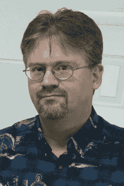
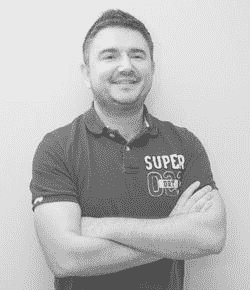

# 关于技术审校

**利兰·朗**的编程生涯始于一台 VIC-20 电脑。他先后升级到 Apple IIe 和 Mac 512，并在后者的平台上开始使用 Lightspeed Pascal 编写更精美、更复杂的游戏。

作为爱好者，利兰多年来用 BASIC 和 Pascal 编写过一些程序，但从未深入学习更主流的语言（如 C）或面向对象概念。iPhone SDK 的发布改变了这一切！基于这一契机，利兰一头扎进 Objective-C 和 iOS 编程的学习中。他目前在南卡罗来纳州一家地板安装公司担任 IT 总监，与最小的女儿同住。他的另外两个女儿和六个孙辈住得足够近，让生活充满乐趣。

**马丁·沃尔什**是一名独立游戏开发者，也是初创游戏工作室 Pedro 的联合创始人。他还是流行开源游戏框架 Cocos2D 和 SpriteBuilder 开发套件的定期贡献者。不写代码时，他通常会用 Oculus Rift 鼓捣 VR，焊接老式复古街机电路板，或阅读合成生物学方面的文章。马丁还是一名频繁的 Kickstarter 支持者。

大多数时候，你可以在 SpriteBuilder 论坛找到他，帮助其他开发者，并在 twitter.com/martin64k 分享资源。

