# 引言

在我将上一本书《学习 cocos2d 2》更新至第三版（2012 年末出版）后，我完全没有再写技术书的打算，尤其不是关于 Cocos2D 的。

首先，写书工作量巨大，眼见它在出版前就已过时更是痛苦——这是许多技术书籍的共同命运。

另一方面，Cocos2D 的 2.x 版本相当稳定，似乎也未停滞不前。当时它仅处于维护阶段，新功能的开发并非最符合社区利益，而是最符合当时已将开源项目 Cocos2D 收归内部的公司利益。

2013 年秋，苹果发布了 iOS 7，随之而来的 Sprite Kit 是一款与当时 Cocos2D 非常相似的 2D 渲染引擎。人们对 Cocos2D 的兴趣迅速消退。

就在那时，Apportable 接手了 Cocos2D。它从社区聘请开发者来改进 Cocos2D，最终目标是让它在各个方面超越 Sprite Kit。于是，3.x 分支的开发工作开始了。

与此同时，SpriteBuilder 不仅要成为众多编辑器之一，更要成为 Cocos2D 的*可视化编辑器*。它集成良好，没有古怪的设置步骤，也无需等待它赶上对更新版 Cocos2D 的支持。

2014 年间，SpriteBuilder 和 Cocos2D 合二为一。激动人心的新功能被加入：完全集成的 Objective-C 版 Chipmunk 物理引擎，一个透明支持 OpenGL 和 Metal 的新渲染器 API，以及无需编写任何着色器代码的内置着色效果。

Cocos2D 如今比以往任何时候都更有活力。

当 Apportable 向我提出写一本关于 SpriteBuilder 和 Cocos2D 的书的构想时，我很快接受了挑战。因为变化太多，我不想让它们湮没无闻，而且我兴奋地看到 SpriteBuilder 和 Cocos2D 有可能成为我一直期望的样子。

深知哪些内容最容易过时，我有信心避免大部分技术过时的陷阱，让本书在更长时间内保持有效和实用。本书主要围绕 SpriteBuilder 这一事实无疑有助于此，同样，我基于最新的开发分支来写书也有帮助。写下这些文字时正值 2014 年 11 月初，本书所涵盖的 SpriteBuilder v1.3 刚刚提交至 Mac App Store 审核。

我的下一个项目将是更新 SpriteBuilder 和 Cocos2D 的在线文档。它旨在成为一本与本书相辅相成的参考手册。我将尽最大努力指出任何自本书出版后可能发生重大变化的内容。

你可以在 [`www.cocos2d-swift.org/docs`](http://www.cocos2d-swift.org/docs) 在线找到这份文档。第一个版本将涵盖 SpriteBuilder v1.3 和 Cocos2D v3.3。我建议你在阅读本书时，在浏览器标签页中打开此链接。

就我个人而言，我很高兴现在可以通过……写更多文档来从写书的工作中恢复过来。在线文档是一种不同的格式，有着不同的要求和可能性，我也期待更新和改进那方面的内容。


#### 排版后的文档

我也非常期待在 `SpriteBuilder`（[`forum.spritebuilder.com`](http://forum.spritebuilder.com)）和 `Cocos2D`（[`forum.cocos2d-swift.org`](http://forum.cocos2d-swift.org)）论坛上收到你的反馈，以便我能将这些反馈整合到在线文档中。

谁知道呢，也许在经历又一段再也不想写书的时期之后，我会重新回来修订这本书。我开始觉得，技术写作实际上是一种容易上瘾的危险行为。

无论如何，我希望你能像我享受写作的兴奋感一样，享受阅读这本书的过程。

## 第一部分：介绍 SpriteBuilder 和 Cocos2D-iphone 第 3 版

### 第 1 章：引言

欢迎阅读*学习使用 SpriteBuilder 进行 iOS 游戏开发*。本章作为引言，解释了你将从此书中获得什么、本书使用的程序版本，以及资源文件的获取位置等几项内容。

#### 本书涵盖什么？

在本书中，你将通过实例学习 `SpriteBuilder`。本书将引导你借助 `SpriteBuilder` 和 `Cocos2D`（准确来说是 `Cocos2d-Swift`）创建一个基于物理引擎、具有视差滚动效果的游戏。示例游戏的设计主要受到了畅销应用 `Badland` 和 `Leo's Fortune` 的启发。基于关卡的结构使你即使不编写额外代码，也能向游戏中添加更多内容。

作为你的向导，我将带你逐步完成创建游戏项目所需的各个步骤。在此过程中，我会解释你很可能遇到或需要的 `SpriteBuilder` 功能、注意事项、变通方法以及有用的技巧和诀窍。

本书的项目和资源文件可在 [`www.apress.com`](http://www.apress.com) 和 [`www.spritebuilder.com`](http://www.spritebuilder.com) 下载。建议使用提供的资源，但你当然也可以自由使用自己的图片、音频和字体文件。示例项目允许你从任何章节开始或继续学习。

**注意** 本书的项目文件存放在编号从 00 到 16 的文件夹中。项目编号与章节号没有关联。你会在每个章节（通常在章节末尾附近）找到提及的对应项目。

当存在简单方法和更高效的方法时，我一定会教你高效的方法。在大多数情况下，这甚至不会在流程的任何阶段带来显著更多的工作量。如果非要选出一个能提高效率的功能，那就是通过*无贴图编辑器视图*和 `Sub File` 节点访问的预制件。尽可能地为游戏中的各个独立部分创建可复用的 `CCB` 文件至关重要。这是一种面向对象的场景设计方法。

本书并非 `SpriteBuilder` 的完整参考指南，尽管它涵盖了几乎所有重要的内容。欢迎并鼓励你自行探索 `SpriteBuilder` 的菜单、对话框、偏好设置，甚至其代码库，以了解更多。然而，这并非成功且高效使用 `SpriteBuilder` 的必要条件。

如果在任何时候你需要查找本书中未解释的内容，可以参考 `MakeGamesWith.Us` 团队维护的 `SpriteBuilder` 在线指南（[`www.makegameswith.us/docs`](https://www.makegameswith.us/docs)），或在 [`www.spritebuilder.com`](http://www.spritebuilder.com) 的 `SpriteBuilder` 论坛上提问。

#### 本书适合谁？

你已经拿起了这本书，正在阅读这一段，想看看它是否适合你。这告诉我，你对为 iOS 开发游戏或图形应用感兴趣，你倾向于更喜欢可视化工作而非一切靠编程，或者至少你觉得这个概念很有趣。又或者，你已经熟悉 `Cocos2D`，并想了解 `SpriteBuilder` 如何作为一种可视化设计工具改变你的工作流程。如果是这样，这本书就适合你。

你当然想知道这本书是否适合你的经验水平、编程和技术知识，甚至可能适合你心中应用的确切需求。这会比较难以评估，因为我不了解你，也不知道你的目标。但我确实知道，如果你对 `SpriteBuilder`、`Cocos2D` 以及一般的游戏开发感兴趣，你一定会从这本书中有所收获。

我将尝试做一些假设。

以下是我心目中认为非常适合阅读本书的三类典型开发者。初级开发者和没有 `SpriteBuilder` 经验的开发者，将能通过逐步开发一个使用 `SpriteBuilder` 的游戏获得最多收获，同时学习 `SpriteBuilder` 用户界面和 `Cocos2D` 的基础知识。

经验丰富的开发者会愉快地认识到使用像 `SpriteBuilder` 这样的图形设计工具的好处。我将在本书中展示的工作流技巧将提高你的效率。此外，你还会得到一些额外惊喜——在线很难找到的技巧和话题，例如创建软体物理、炫酷视觉效果，以及将你的 `SpriteBuilder` 游戏移植到 Android。

##### 绝对初学者

首先，假设你从未编程过移动应用，如果你对 `Xcode` 和 `Cocoa touch` 毫无经验，也完全不懂 `Objective-C`，我强烈建议你搭配一本入门书籍来阅读本书。任何从头开始教授使用 `Objective-C` 和 `Xcode` 进行 iOS 应用开发的最新书籍或教程都会有所帮助。本书假定你具备 `Objective-C` 和 `Xcode` 的实用知识，因此一本关于 `Objective-C` 和 `Xcode` 的指南或参考书会很有用。幸运的是，有很多教程和书籍可供选择。但请先查阅 Apple 开发者库。

作为初学者，你可以在 `SpriteBuilder` 中做很多事情，并大幅减少代码量。你甚至可能只用很少的编程就能创建简单的游戏。然而，我对此持谨慎态度，因为这可能会产生不切实际的期望。你可能需要降低对你第一个 `SpriteBuilder` 游戏的初始期望，特别是考虑到目前在这一点上，你几乎不可能判断什么是在 `SpriteBuilder` 中可能或不可能是的。

但是，如果你怀着学习的动力开始，并且尝试不把你最宏大的设计作为你的第一个游戏，我相信你会进展顺利。请准备好投入大量时间到所有技术当中，因为当你进入游戏应用开发领域时，这不仅仅是你开始学习的一个单一程序——它是一个由术语和技术组成的、看似庞大的整体。只要你保持耐心和求知欲，这个过程就不会令人不快。此外，还有一个友好且乐于助人的社区欢迎像你这样的新手。

##### 经验丰富的应用开发者

我的第二个假设是，你可能是一位经验丰富的 iOS 应用开发者，但尚未尝试过制作游戏，也许是因为你不想错过像 `Interface Builder` 这样的图形设计工具。对你来说，掌握 `Cocos2D` 框架的工作原理应该相当简单，毕竟有大量的文档可供查阅。你可能想专门学习游戏是如何设计的，以及这与使用 `Interface Builder` 有何不同。通过阅读本书，你将能够了解到很多这些概念。

你可能需要改变一些习惯和期望，但除此之外，如果你的目标是使用 `SpriteBuilder` 制作游戏，我看不出有什么理由你不能从阅读本书中受益。我想，如果你之前有移动游戏开发经验，只是没有使用过 `Cocos2D` 或 `SpriteBuilder`，情况也是如此。

##### 经验丰富的 Cocos2D 游戏开发者


最后，我猜你或许是一位经验丰富的 Cocos2D 开发者。也许你一直没使用最新版本的 Cocos2D，或者你只是想了解是否应该真的放弃一些编码工作，转而使用 `SpriteBuilder` 进行设计，以及具体该如何操作。

你会发现编程部分对你来说易如反掌，并且会喜欢上我将在本书中向你展示的、使用 `SpriteBuilder` 带来的工作流程优势。你甚至可能会惊讶于 *不* 编写程序代码竟然如此有趣，并且会感激能将自己的思绪从繁琐、重复的编程任务中解放出来，同时有精力去完成更多你一直没时间探索的炫酷编程技巧。

#### 要求

为了学习本书，你显然需要从 Mac App Store 免费下载 `SpriteBuilder`。要运行 `SpriteBuilder`，你需要一台运行 OS X 10.8 Mountain Lion 或更新版本的 Mac 电脑。

`Cocos2D` 与 `SpriteBuilder` 捆绑在一起——你无需单独下载。不过，单独下载仍有好处。如果你从 [`www.cocos2d-swift.org/download`](http://www.cocos2d-swift.org/download) 获取安装程序版本并安装，你将在 `Xcode` 中获得 `Cocos2D` 的 API 参考文档。你也可以在线访问：[`www.cocos2d-swift.org/docs/api`](http://www.cocos2d-swift.org/docs/api)。

**注意**  `SpriteBuilder` 可以自动更新你的 `SpriteBuilder` 项目所使用的 `Cocos2D` 版本。如果有新版本可用，系统会提示你更新，如果你允许更新，`SpriteBuilder` 会在为该特定项目安装新版本之前，创建一份 `Cocos2D` 的备份副本。但这不会更新你下载的 `Cocos2D` 副本，也不会更新 `Cocos2D` `Xcode` 文档文件。如果你想保持 `Cocos2D` `Xcode` 文档为最新版本，你将需要手动下载并安装每个新版本的 `Cocos2D`。

说到 `Xcode`：为了开发 iOS 应用，你需要安装 `Xcode`，它也可以从 Mac App Store 或苹果开发者中心免费获取：[`developer.apple.com/devcenter/ios`](https://developer.apple.com/devcenter/ios)。

iOS SDK、iOS 模拟器和 Cocoa Touch 框架与 `Xcode` 捆绑在一起。你不需要下载任何其他东西来开发 iOS 或 OS X 应用。但你可能想打开 `Xcode`  `Preferences`，然后导航到 `Downloads` 面板，下载离线文档以便更快地访问或离线访问 iOS SDK 文档。该文档也可以在线获取：[`developer.apple.com/library/ios/navigation`](https://developer.apple.com/library/ios/navigation)。

学习本书，不需要注册为苹果的 iOS 开发者。尽管如此，我仍然推荐你注册，尽管目前每年需要支付 99 美元的费用。成为苹果注册开发者有很多好处，最重要的是能够在 iOS 设备上部署和测试你的应用。如果你计划将应用发布到 App Store，你应该尽早注册，而不是拖延。

iOS 模拟器可以用来验证你的代码功能是否正常，但它无法衡量你应用的性能表现 —— 网上关于模拟器速度慢的问题比比皆是。简而言之，即使在最快的 Mac 上，iOS 模拟器的渲染性能也非常糟糕。而且，模拟器会很乐意消耗你 Mac 上数 GB 的内存和大量的 CPU 时间 —— 远超 iOS 设备所能提供的。此外，当用不精确的手指覆盖部分屏幕进行操作时，你的应用感觉会非常不同，而且你无法用 iOS 模拟器模拟加速度计或多点触控手势。

简而言之，如果不在实际设备上进行测试，你就无法可靠地测试你的游戏是否有趣、易于操作、控制精准以及性能良好。因此，虽然这不是绝对必要的，但强烈建议你注册成为开发者会员。

#### 关于 SpriteBuilder

`SpriteBuilder` 是一款免费的、开源的 OS X 可视化设计工具，专为与 `Cocos2d-Swift` 配合使用而创建。最初，它由 Viktor Lidholt 构思并命名为 `CocosBuilder`，于 2011 年发布。Viktor 在 `Apportable` 公司担任 `SpriteBuilder` 的首席开发人员，他与整个团队一起致力于 `SpriteBuilder` 和 `Cocos2D` 的开发。

许多 `SpriteBuilder` 和 `Cocos2D` 开发者实际上为 `Apportable` 工作，这是一家专门从事交叉编译 Objective-C 代码的公司，特别是针对 Android 平台的 `SpriteBuilder` 应用。在理想情况下，你只需获取你的 iOS 应用并为其构建 Android 版本，它就能像那样正常工作。你可以在第 13 章中找到关于 Android 移植过程的介绍。

`SpriteBuilder` 与 `Cocos2D` 集成得很好。现在，这两个项目的发布计划是同步的，以确保这两个工具能够和谐地协同工作。文件版本不兼容以及无意识的 `Cocos2D` 更改破坏编辑器兼容性的日子已经一去不复返了。

`SpriteBuilder` 也可以用来创建 OS X 应用。在我写这本书的时候，开发人员正在努力增加对 OS X 的支持。所以我确信，当你读到这本书的时候，你将能够使用 `SpriteBuilder` 启动 OS X 项目。你在本书中学到的大部分内容同样适用于 OS X 应用，尽管有些例外。

**提示**  如果当你读到这本书时 `SpriteBuilder` 还不支持创建 OS X 应用，你可以在这里找到关于如何启用 OS X 支持的教程：[`jademind.com/blog/posts/porting-cocos2d-game-to-osx-using-spritebuilder/`](http://jademind.com/blog/posts/porting-cocos2d-game-to-osx-using-spritebuilder/)。

#### 为何使用 SpriteBuilder？

`SpriteBuilder` 的主要好处是所见即所得（WYSIWYG）。如果你做过任何没有使用设计工具的游戏或图形编程，你会了解典型的开发周期：改变几行代码或仅仅是一个值，构建代码，将应用部署到设备或模拟器上，启动你的应用，导航到你在应用中做出修改的地方，查看修改效果，然后发现——它不太对劲。重新开始。如此循环往复。繁琐、枯燥、耗时、且容易出错。

使用 `SpriteBuilder`，你可以直观地完成许多事情，并确切地看到它们在应用中的样子。你甚至可以在模拟的设备分辨率之间切换，只需点击一下鼠标，就能测试你的更改在所有支持的分辨率下的效果。更令人惊叹的是你创建时间轴动画的方式，以及你可以直接在 `SpriteBuilder` 中实时预览它们。你可以精确地看到图层如何随时间移动到视图中并放大以填满屏幕，或者看到你的菜单按钮如何一个接一个快速滚动进入，最终停留在它们指定的位置。

此外，`SpriteBuilder` 管理应用的资源文件版本，根据不同的设备分辨率自动按需缩放它们。这使你在为多种屏幕分辨率和宽高比开发时，免去了许多繁琐且易出错的工作。这也意味着你无需使用一个或几个外部工具，每个工具只处理开发周期中一小部分工作。

所以，总而言之，可以说学习 `SpriteBuilder` 是一项值得的努力，不仅因为它能显著减少开发时间，还因为它的操作和实验本身就很有趣。最终，你不仅能更快地获得结果，还能获得更好的结果。更重要的是，对于任何你觉得编码比可视化设计更快的部分，你仍然可以编写代码。一旦加载了在 `SpriteBuilder` 中设计的节点，你就可以自由地编写代码，随心所欲地修改、替换或丢弃该节点。

#### 关于 Cocos2D

本书中提到的 `Cocos2D` 特指 `Cocos2d-Swift`。它实际上只是更名为 `Cocos2d-Swift` 的 `Cocos2d-iPhone`，因为它现在正式支持使用苹果的 Swift 编程语言制作游戏。


当然，您仍然可以使用 `Cocos2d-Swift` 来编写 100% 的 `Objective-C` 代码，并且 `Cocos2d-Swift` 的底层引擎本质上是 `Cocos2d-iPhone`，完全由 `Objective-C` 和纯 `C` 编写。但现在，您也可以用 `Swift` 编写程序代码，可以选择性地将 `Swift` 代码与 `Objective-C` 混合使用，或者完全使用 `Swift` 代码创建应用程序。

**注意** 本书将不会使用，也几乎不会提及 `Swift`。在本书写作之初，`Swift` 甚至尚未向开发者开放。

`Cocos2d-Swift` 是一个流行的、免费且开源的 2D 渲染引擎，并配备了物理框架。它最初由 `Ricardo Quesada` 在 2008 年创建为 `Cocos2d-iPhone`，并最终成为 iOS 平台上最流行的 2D 游戏引擎。它非常受欢迎，以至于到 2013 年，苹果公司在 `iOS 7` 中发布了自己的 2D 渲染框架，命名为 `Sprite Kit`。`Sprite Kit` 的许多设计和术语都借鉴了当时的 `Cocos2d-iPhone`。

`Sprite Kit` 的发布是一个出人意料且早该到来的催化剂，催生了 `Cocos2d-iPhone` 引擎的第三次重大迭代，该版本还顺带获得了一个新名称：`Cocos2d-Swift`。现在，整个开发团队基本上已经触及并改进了引擎的各个方面，使其在每个方面都优于 `Sprite Kit`。

`Cocos2D` 包含了紧密集成的 `Chipmunk` (2D) 物理引擎以及大量酷炫的新功能。例如，其渲染器现在即使不比 `Sprite Kit` 更快，也与之相当，并且可以选择使用苹果公司新的 `Metal` 渲染框架。还有一个 `CCEffectNode`，使开发者能够创建令人惊叹的视觉着色器效果，而无需编写实际的着色器代码。自定义和调试 `Cocos2D` 应用程序通常比使用 `Sprite Kit` 更容易，因为您可以单步执行、分析，并在必要时修改底层引擎的源代码。

#### 关于 Apportable

您可能会好奇：`Apportable` 是谁？他们具体是做什么的？

他们的使命宣言很简单：让开发者能够用 `Objective-C` 编写应用程序，并通过交叉编译将其移植到 `Android` 平台，同时具有原生性能。您可以在其网站 `[`www.apportable.com`](http://www.apportable.com)` 上了解更多关于 `Apportable` 的信息。

在理想情况下，使用 `Apportable` 将一个用 `Objective-C` 编写的现有 iOS 应用移植到 `Android` 无需更改任何代码。实际上，如果您没有从一开始就在 `Android` 上测试项目，您可能需要多做一点工作。具体来说，这是因为市面上有众多不同规格和特性的 `Android` 设备。

如果您查看 `Apportable` 令人印象深刻的客户名单，您会发现他们都是游戏开发者。`Apportable` 对此表示敬意，并聘请了许多现在致力于 `Cocos2D` 和 `SpriteBuilder` 开发的开发者。所有这些技术都是免费且开源的，并将保持免费和开源。只有在您想使用 `Apportable` 移植到 `Android`，并且需要超出基本功能之外的功能时，您才可能需要支付一些费用。在撰写本文时，服务条款和价格尚未确定。

拥有像 `Apportable` 这样的选择的价值在于，您能够专注于自己熟悉的平台、工具和技术，同时仍然能够在需要时让应用程序在 `Android` 设备上运行。而且，您无需重写大部分代码库，也无需因使用更古老或性能较差的编程语言而妥协。

#### 关于程序版本

在您开始阅读本书其余部分之前，我们需要讨论一下技术更新和兼容性的问题。

本书是为 `Xcode 6`、`iOS 8` 以及 `SpriteBuilder v1.3` 和 `Cocos2d-Swift v3.3` 编写并测试的。在我写下这些文字时，是 2014 年 10 月 9 日。但在您阅读本书时，这些技术中的一部分或全部可能已经更新到了下一个小版本或主要版本。

我已尽力避免使用任何（可能）特定于版本的代码或功能。然而，我预测未来变化的能力是有限的，这从我至今未能中彩票就可以看出。

根据我编写三个版本的“Learn Cocos2D”的经验，这些差异通常很小。所以，不要仅仅因为现在可能有了 `Xcode 6.2` 或 `SpriteBuilder v1.5` 就把书收起来。

对于因版本更新导致操作方法略有不同而给您带来的任何不便，我提前致歉，但我对此无能为力。不过，我可以为您提供一些方法来应对这些问题。

就 `SpriteBuilder` 和 `Cocos2D` 而言，您可以访问 `[`www.spritebuilder.com`](http://www.spritebuilder.com)`、`[`www.cocos2d-swift.org`](http://www.cocos2d-swift.org)` 或 `[`www.learn-cocos2d.com`](http://www.learn-cocos2d.com)`，了解影响本书的重大变更，并获取有关如何解决问题或如何精确修改代码以使其适应新版本的指导。

关于 `Xcode` 和 `iOS`，如果在您阅读本书时已经有了 `Xcode 7` 或 `iOS 9`，您总是可以使用 `Xcode 6`（以及 `iOS 8 SDK`）来编译本书的代码，从而完全避免任何潜在问题。

具体到 `Xcode` 的更新，问题更多不在于手册说明不再适用，而是苹果在每个新版本 `Xcode` 中不断引入新的编译器警告和错误。这些改进似乎能将曾经完全可接受的代码变成一连串“哦，不，你不能再这样做了，你疯了吗？！”的语句。对于有经验的开发者来说，编译器能捕获更多潜在问题是极受欢迎的；然而，对于那些试图通过示例代码学习，但代码并未用最新版 `Xcode` 测试过的开发者来说，这可能是一次令人清醒，甚至是令人沮丧的经历。

因此，如果您觉得没有精力去应对更新版编译器偶尔的吹毛求疵，我建议您使用 `Xcode 6`。您可以在 `[`developer.apple.com/downloads/index.action?name=Xcode%206`](https://developer.apple.com/downloads/index.action?name=Xcode%206)` 找到旧版 `Xcode`。请注意，您需要是注册的苹果 `iOS` 或 `OS X` 开发者才能访问此链接。

#### 关于 Xcode 版本

部分截图是使用 `Xcode 5.1` 截取的。在某些情况下，这是有意的；另一些时候，则仅仅是因为当时 `Xcode 6` 尚未发布。并非总是可能或可行地将截图更新到最新的 `Xcode 6` 版本。

我已验证其功能是相同的。就截图而言，`Xcode 5.1` 和 `Xcode 6.0` 之间的任何差异纯粹是视觉上的。

#### 关于示例项目

本书附带一个可下载的压缩包，您可以从本书网站 `[`www.apress.com/9781484202630`](http://www.apress.com/9781484202630)` 下载。在压缩包中，您会找到资源文件和完整的 `SpriteBuilder` 项目。每个项目都包含了项目 `Bouncy Beast` 在不同阶段的快照。

**提示** 我建议您在解压后保留该压缩包。如果您对某个项目做了破坏性的更改，可以从压缩包中恢复原始状态。

当您打开这些示例 `SpriteBuilder` 项目之一时，`SpriteBuilder` 很可能会提示您将 `Cocos2D` 更新到最新版本。我建议您不要更新 `Cocos2D`，而是继续使用该项目测试时所用的 `Cocos2D` 版本。新的 `Cocos2D` 版本可能需要您修改代码，或者可能以其他方式破坏现有代码。我假设当您打开示例项目时，您更希望看到它能正常工作，而不是需要深入进去调试和修复任何破坏性的更改。

**提示** 您随时可以稍后更新 `SpriteBuilder` 项目的 `Cocos2D` 版本，方法是在 `SpriteBuilder` 菜单中选择 `文件``更新 Cocos2D`。


SpriteBuilder 可能会要求你将项目格式转换为新的 Packages 格式。这样做通常是安全的，但不进行转换也没有坏处。Packages 本质上只会改变 SpriteBuilder 项目中资源文件的位置。Packages 是在本书接近尾声时引入的，因此大多数示例项目会要求你切换到使用 Packages。

在 SpriteBuilder 中打开示例项目后，你需要发布它。已发布的资源文件已从 Xcode 项目中剥离，以减小归档文件的大小。

当你打开 SpriteBuilder 项目的 Xcode 项目并构建时，可能会收到警告甚至错误。这些项目均使用 Xcode 6.0 测试过。如果你使用的是 Xcode 6.1 或更高版本，Apple 可能对构建设置和编译器进行了更改和优化。例如，你可能会被要求更新项目的 Build Settings 或格式。这样做通常是安全的。

**注意** 首次运行 Xcode 项目时，它可能会出现挂起或花费很长时间才能完成的情况。当你之前从未打开并发布过 SpriteBuilder 项目时，这种情况尤其可能发生。在这种情况下，Xcode 将启动 SpriteBuilder 项目的发布过程，但不会显示任何进度指示。因此，建议你先打开并发布 SpriteBuilder 项目——这样，你至少能看到一个进度指示器。

你可能会看到一些编译器警告或错误，指出代码中的潜在问题。如果警告来自某个库目标（Cocos2D、ObjectAL 或 Chipmunk），你可以忽略它们。这些警告通常不严重，甚至可能持续存在多个版本。Cocos2D 开发人员会不时清理这些警告。以前完全可接受的代码中也可能出现新的错误。这通常发生在较新的 Xcode 版本中，编译器现在会将某些警告视为错误，或者它总体上发现了新的潜在问题。只要它们只是警告，忽略它们即可。它们很可能是由于 Xcode 的进步而产生的遗留问题。

然而，如果你在库中遇到编译器错误，可以尝试更新 Cocos2D，看看警告/错误是否消失。如果项目本身的代码（Source 组中的代码）有错误，而你又无法自行修复，请访问 [`forum.spritebuilder.com`](http://forum.spritebuilder.com) 上的 SpriteBuilder 论坛，查找勘误和修复方法。

在 17 个 SpriteBuilder 项目中，大多数最初是使用 v1.3 之前的 SpriteBuilder 版本创建的。因此，编号为 00 到 13 的项目不包含为 Android 平台编译所需的代码。编号为 14 到 16 的项目则支持 Android。相应地，项目 00 到 13 在方案和平台列表中与项目 14 到 16 有不同的项目。

**提示** 你可以按照以下说明将不支持 Android 的 SpriteBuilder 项目转换为支持的项目：[`android.spritebuilder.com/#dealing-with-spritebuilder-projects-from-spritebuilder-1-2-and-earlier`](http://android.spritebuilder.com/#dealing-with-spritebuilder-projects-from-spritebuilder-1-2-and-earlier)。

#### 示例项目与章节对照

如前所述，示例项目编号与章节编号并不匹配。表 1-1 列出了章节编号和名称，以及特定项目属于哪一章。

**表 1-1.** 章节与示例项目对照

| 章节 | 项目文件夹 | 项目说明 |
| --- | --- | --- |
| 02 - 奠定基础 | 00 - 起始点 | 与创建一个新的 SpriteBuilder 项目相同。 |
| 02 - 奠定基础 | 01 - 使用按钮切换场景 | 代表第 2 章中途的项目阶段。 |
| 02 - 奠定基础 | 02 - 使用玩家预制体的关卡 | 代表第 2 章结束时的项目阶段。 |
| 03 - 控制与滚动 | 03 - 视差滚动 | 代表第 3 章结束时的项目阶段。 |
| 04 - 物理与碰撞 | 04 - 物理移动与关卡边界 | 代表第 4 章结束时的项目阶段。 |
| 05 - 时间线与触发器 | 05 - 时间线动画 | 代表第 5 章中途的项目阶段。 |
| 05 - 时间线与触发器 | 06 - 触发式动画 | 代表第 5 章结束时的项目阶段。 |
| 06 - 菜单与弹出视图 | 07 - 弹出式菜单 | 代表第 6 章结束时的项目阶段。 |
| 07 - 主场景与游戏状态 | 08 - 主菜单与设置 | 代表第 7 章结束时的项目阶段。 |
| 08 - 选择与解锁关卡 | 09 - 关卡选择滚动视图 | 代表第 8 章结束时的项目阶段。 |
| 09 - 物理关节 | 10 - 链条、绳索与弹簧 | 代表第 9 章结束时的项目阶段。 |
| 10 - 软体物理 | 11 - 软体玩家 | 代表第 10 章结束时的项目阶段。 |
| 11 - 音频与标签 | 12 - 音频、标签与本地化 | 代表第 11 章结束时的项目阶段。 |
| 12 - 视觉效果与动画 | 13 - 动画与效果 | 代表第 12 章结束时的项目阶段。 |
| 13 - 移植到 Android | 14 - HelloSpriteBuilder Android | 在第 13 章早期创建的测试项目。 |
| 13 - 移植到 Android | 15 - 在进行 Android 特定修复之前 | 第 13 章中途 Android 移植的起点。 |
| 13 - 移植到 Android | 16 - 适用于 Android 的 Bouncy Beast | 代表第 13 章结束时的项目阶段。 |

#### 关于部署目标

最终，你需要决定你的应用应该运行在哪些设备上，以及你将支持哪些 iOS 版本。

理论上，Cocos2D 应用可以运行在任何支持 OpenGL ES 2.0、且至少运行 iOS 5 的设备上。这使得 iPhone 3GS 和第一代 iPad 成为你能运行应用的最老 iOS 设备。这只是理论上的说法。

然而，iPhone 3GS 和最新款 iPhone 之间，以及第一代 iPad 和最新款 iPad 之间，性能存在巨大差异。移动技术的发展速度远快于台式电脑技术。

此外，每款较新的 iOS 设备的市场渗透率都显著高于其前代产品。因此，支持像 iPhone 3GS 这样的老旧设备，甚至可能包括非宽屏手机 iPhone 4 和 4S，并不总像表面上看起来那样是明智的财务决策。从历史上看，与 Android 市场形成鲜明对比的是，通过专门支持最新的 iOS 版本、最新型号及其独有的功能，你更有可能产生更大的销量，而不是试图尽可能向后兼容。


我的个人建议是跟随苹果的步伐，在其推出新机型并淘汰旧机型时作出选择。如果你不确定该支持哪些设备，那么在开始新项目时，支持那些能够运行最新 `iOS` 版本的设备。关于 `iOS` 设备列表及其支持的最新操作系统，请参阅维基百科上的列表：[`en.wikipedia.org/wiki/List_of_iOS_devices`](http://en.wikipedia.org/wiki/List_of_iOS_devices)。

对于 `iOS 8`，可支持的最旧设备是 `iPhone 4S` 和 `iPad 2`。已停产的 `iOS` 机型在应用销售方面很快就会淡出市场。对于 `iOS` 版本来说，情况也几乎相同。在启动新应用项目时，你完全可以将倒数第二个主要 `iOS` 版本作为最低部署目标。例如，目前 `iOS 8` 是最新的 `iOS` 版本。通过支持运行 `iOS 7.0` 及以上版本的设备，截至 2014 年 10 月 5 日，你的应用潜在可寻址市场占 `App Store` 使用量的 94%。

苹果会定期更新一张图表，展示用户访问 `App Store` 时所使用的 `iOS` 版本分布情况：[`developer.apple.com/support/appstore/`](https://developer.apple.com/support/appstore/)。该图表反映的是你的可寻址市场，而非仍在运行 `iOS 6` 及更早版本的潜在数百万台设备。这些较旧的设备大多已损坏、被盗或已被遗忘——或者大多数情况下，它们的用户几乎不再获取任何新应用。也许这些用户对现有设备非常满意，又或者他们知道新应用不太可能在他们的设备上运行。

但更重要的是，要确保你已发布的应用在受支持的最旧设备和 `iOS` 版本上能够长时间运行，以保持现有客户的满意度。仅凭这一点，就足以反对尝试支持尽可能旧版本的 `iOS` 系统，这对于游戏来说尤其如此，因为游戏对设备资源的需求比大多数其他类型的应用更苛刻。

请考虑一下，`iPhone 6` 与 `iPhone 3GS` 之间的性能差距是巨大的。在 `GeekBench` 基准测试中，`iPhone 6（Plus）`比 `iPhone 3GS` 快 10 倍以上。与 `iPhone 4S` 相比，同一基准测试中 `iPhone 6（Plus）`仍然快 7 倍以上。你可以在此处找到所有 `iOS` 设备的最新性能对比：[`browser.primatelabs.com/ios-benchmarks`](http://browser.primatelabs.com/ios-benchmarks)。

基于这一基准测试，不难预测，图形密集型游戏的开发者将停止为 `iPhone 4S` 及更早版本、`iPad（第三代）` 及更早版本以及初代 `iPad mini（非 Retina 屏）`提供游戏，或降低其画质。`iPhone 5` 代及更新的设备在性能上遥遥领先。

#### 目录

以下是本书各章节的列表及简要概述。

第 1 章—引言

你正在阅读本章。

第 2 章—打好基础

介绍 `SpriteBuilder` 及其用户界面。此处解释了最常见的任务。同时，本章包含对 `Cocos2D` 编程的快速介绍。你将最终创建一个项目，通过按下按钮即可在场景之间切换。

第 3 章—控制与滚动

在本章中，你将添加触摸输入和多个背景层的视差滚动。你将学习如何使用精灵表和预制件。引入了一个玩家预制件，其简单的移动通过移动动作来实现。

第 4 章—物理与碰撞

你将学习如何为游戏添加物理效果，特别是不可移动、不可穿透的墙壁以及动态物体。玩家移动被实际物理效果所取代。碰撞回调方法用于触发关卡退出。还将解释如何启用物理调试绘制。

第 5 章—时间线与触发器

深入解释时间线，然后使用它来动画化旋转的物理对象。你将学习如何创建触发器区域，当玩家进入时运行代码。最终项目现在可以实现简单的物理交互。

第 6 章—菜单与弹出视图

解释了一种强大且简单的方法来创建弹出式菜单，例如暂停菜单和游戏结束菜单。同样的概念可用于创建全屏菜单，而无需中断正在运行的场景。菜单通过时间线进行动画，并使用时间线委托方法在时间线结束时接收通知。

第 7 章—主场景与游戏状态

主菜单设计有动画背景，以及一个带有音频音量滑块的设置菜单。引入了一个`GameState`类，它通过`NSUserDefaults`存储全局的、用户特定的游戏数据。

第 8 章—选择与解锁关卡

借助滚动视图节点添加了关卡选择界面。详细解释了`CCScrollView`的工作原理、如何编程以及如何响应其委托方法。关卡选择页面分为多个世界，每个关卡通过完成前一关卡来解锁。

第 9 章—物理关节

本章专门介绍如何用关节（特别是链条、绳索和弹簧）创建物理对象。详细解释了关节的工作原理、用途以及应避免的操作。

第 10 章—软体物理

玩家预制件被替换为软体玩家。软体物体是一种由关节连接的可变形物理对象，其碰撞形状被分成多个较小的物体。本章还介绍了使用 `Cocos2D` 进行自定义渲染，因为玩家的纹理需要随时绘制以匹配其变形后的形状。

第 11 章—音频与标签

你将学习如何通过时间线播放简短音效，以及如何使用 `ObjectAL` 以编程方式播放音效，还将学习如何播放背景音乐。本章的另一半内容涉及`Label TTF`的属性，如阴影和轮廓，同时也解释了如何在 `SpriteBuilder` 中创建、导入和使用位图字体。

第 12 章—视觉效果与动画

你将首次创建精灵帧动画，并使其与玩家的自定义渲染类协同工作。在关于视觉效果的章节中，必须介绍粒子效果节点。最终，将使用效果节点，这些本质上是着色器程序，你可以在 `SpriteBuilder` 中添加和设计。在本章结束时，你几乎认不出原来的主菜单场景。

第 13 章—移植到 Android

首先，你将了解为 `Android` 开发所需的条件。然后，你将创建一个新项目，用于测试部署到 `Android` 设备。最后，你将转换 `Bouncy Beast` 项目，并修复出现的任何编译、启动和布局问题。你将获得关于如何最好地使用 `SpriteBuilder` 进行跨平台开发的建议。

第 14 章—调试与最佳实践

本章介绍如何使用 `Xcode` 和 `Cocos2D` 进行调试。你将学习捕获或防止编程错误的技术。基本上，这是一本自助指南，很快就会证明其价值。此外，还有一节内容讲解如何解决一些最常见的 `SpriteBuilder` 和 `Cocos2D` 问题。

#### 开始之前

如果你对 `SpriteBuilder`、`Cocos2D` 或相关技术及流程有任何疑问，请访问 `SpriteBuilder` 论坛（[`www.spritebuilder.com`](http://www.spritebuilder.com)）和 `Cocos2D` 论坛（[`www.cocos2d-swift.org`](http://www.cocos2d-swift.org)）。

我也经常在 `StackOverflow`（[`www.stackoverflow.com`](http://www.stackoverflow.com)）上回答标注了 `Cocos2D` 标签的编程问题。


那么，祝你玩得开心，享受过程，并创造出一些精彩的游戏！

## 第二章：打下基础

在本章中，你将学习使用 `SpriteBuilder` 的基础知识，包括其用户界面，以及使用 `Objective-C` 和 `Xcode` 在 `Cocos2d-Swift` 中编写程序的初步步骤。你将学习如何在 `SpriteBuilder` 中创建最重要的元素，以及 `SpriteBuilder`、`Xcode` 和 `Cocos2D` 之间是如何关联的。在本章结束时，你将拥有一个可继续扩展的骨架框架。

我假设你已经从 Mac App Store 下载并安装了 `SpriteBuilder` 和 `Xcode`：

*   `SpriteBuilder`：[`itunes.apple.com/app/spritebuilder/id784912885`](https://itunes.apple.com/app/spritebuilder/id784912885)
*   `Xcode`：[`itunes.apple.com/app/xcode/id497799835`](https://itunes.apple.com/app/xcode/id497799835)

#### 创建一个 SpriteBuilder 项目

启动 `SpriteBuilder` 后，直接前往 文件  新建  Cocos2D 项目 来开始一个新的空白项目。将其保存在你之后能找到的地方——例如，在“文稿”或“桌面”文件夹中——最好使用一个你之后能认出的名称。本书中的主要示例项目名为 `LearnSpriteBuilder.spritebuilder`。

如果你以前没有使用过 `SpriteBuilder`，你应该熟悉它的用户界面以及本书中用于描述 `SpriteBuilder` 特定区域和视图的术语。该用户界面分为四个主要区域，如图 2-1 所示。

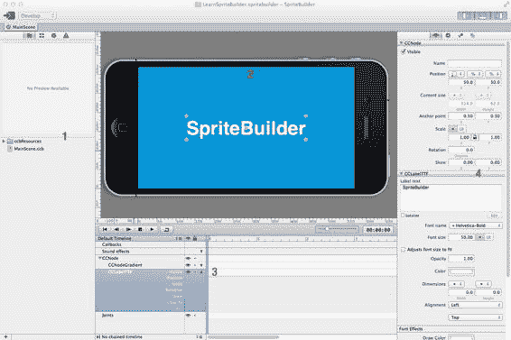

图 2-1。SpriteBuilder 用户界面

1.  **资源导航器**（左侧）。这是一个标签栏视图，你可以在其中找到以下内容：从最左边的标签到最右边的标签：在*文件视图*（如图所示）中的项目文件，包含资源预览区域和预览下方的文件列表；在*无图块编辑器视图*中的资源视觉概览；在*节点库视图*中的可用节点列表；以及*警告视图*中的任何警告或错误（希望永远不会有）。
2.  **舞台视图**（顶部中央）。舞台的内容（可以是场景、图层、节点、粒子发射器或精灵）在此显示。你可以在此视图中选择节点，并使用选择手柄来移动、调整大小或旋转所选节点。
3.  **时间轴视图**（底部中央）。舞台中的节点和关节按层级顺序列在左侧，定义了节点的绘制顺序和父子关系。右侧是实际的时间轴，带有用于创建动画的关键帧编辑器（此处的*动画*指节点的属性随时间变化）。
4.  **详情检查器**（右侧），也称为**详情视图**。这也是一个包含四个窗格的标签栏视图。从左到右分别是*项目属性*，你可以在其中找到选定项的可编辑设置和属性；*项目代码连接*，你可以在其中分配自定义类、变量和选择器；*项目物理*，你可以在其中启用物理并编辑物理体和形状属性；最后是*项目模板*标签，用于从选定节点及其属性创建命名模板，但目前仅用于粒子效果。

这个新创建的项目实际上是一个功能完备、可运行的 `SpriteBuilder` 项目。你现在可以通过选择 文件  发布 或点击工具栏上相应的发布按钮来尝试运行。

发布过程会复制、转换并缓存与 `SpriteBuilder` 项目关联的 Xcode 项目中的资源。

#### SpriteBuilder 项目的 Xcode 项目

每个 `<*项目名称*>.spritebuilder` 文件夹内都有一个 Xcode 项目，其对应名称为 `<*项目名称*>.xcodeproj`。参见图 2-2 示例。最顶层带有黄色图标、名为 `LearnSpriteBuilder.spritebuilder` 的文件夹就是项目文件夹。其内部包含项目的 `LearnSpriteBuilder.xcodeproj` 文件，而应用程序的源代码和发布的资源文件则在 `Source` 文件夹内。`SpriteBuilder Resources` 文件夹包含 `SpriteBuilder` 在其文件视图中列出的资源和 `CCB` 文件。

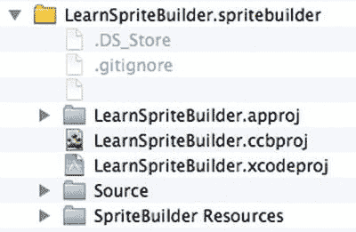

图 2-2。在 Finder 中看到的 SpriteBuilder 项目结构

**注意** `SpriteBuilder` 项目是扩展名为 `*.spritebuilder` 的文件夹。只有文件夹具有 `.spritebuilder` 后缀时，`SpriteBuilder` 才能识别该项目。如果 `SpriteBuilder` 未运行，你可以使用 Finder 手动复制、移动或重命名 `SpriteBuilder` 项目文件夹，前提是你保留 `.spritebuilder` 后缀。

双击项目的 `.xcodeproj` 文件，或通过 Xcode 的 文件  打开 命令打开它。Xcode 会显示一个类似于图 2-3 所示的用户界面。

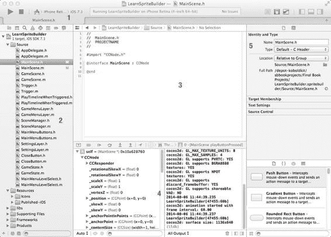

图 2-3。Xcode 用户界面

Xcode 用户界面包含以下区域：

1.  **工具栏**，带有方案和设备选择下拉菜单。使用方案下拉菜单更改应用程序应在哪个设备或模拟器上运行。
2.  **导航器区域**，包含多个标签。默认的、最左边的标签（如图所示）显示项目中的文件。其他标签允许你搜索项目文件、查看构建警告和错误、管理断点以及执行其他任务。
3.  **编辑器区域**，你在此处键入源代码。
4.  **调试区域**，显示调试信息。左侧显示运行时变量的值，右侧是控制台，日志语句会打印在此处。
5.  **实用工具区域**，包含有关选定项的信息。在这种情况下，它显示有关所选 `MainScene.m` 文件的详细信息。

你可以通过单击播放按钮（工具栏上最左边的图标）来构建并运行这个基本的 `SpriteBuilder` Xcode 项目。项目将构建并在已连接的设备或 iOS 模拟器上启动，具体取决于工具栏中选择的运行目标。你应该会在你的设备或 iOS 模拟器上看到与几秒钟前在 `SpriteBuilder` 中看到的完全相同的场景。

**提示** 如果你以前没有使用过 Xcode，并且需要更多关于如何使用它的说明，请查阅 Xcode 指南，该指南可通过 帮助  Xcode 概览 或在线访问 [`developer.apple.com/library/ios/documentation/ToolsLanguages/Conceptual/Xcode_Overview`](https://developer.apple.com/library/ios/documentation/ToolsLanguages/Conceptual/Xcode_Overview) 获取。

#### 第一个场景，第一段代码

第一个目标是创建第二个场景，然后连接按钮，这样你就可以在两个场景之间来回切换。这第二个场景将是游戏场景，而现有的 `MainScene` 将成为菜单界面。这是游戏场景和菜单场景之间一种常见的、基础性的分离。

场景包含游戏当前渲染的所有内容（节点）。其他场景可以使用过渡效果替换当前可见的场景，就像 Cocoa touch 视图可以通过动画从一个视图过渡到另一个视图一样。

**注意** 一个常见的误解是，场景和节点可以和视图互换使用。事实并非如此。`Cocos2D` 有自己的 `UIView` 类，名为 `CCGLView`，它使用 OpenGL 指令渲染所有场景和节点。因此，其他 `UIView` 实例可以完全位于 `Cocos2D` 视图及其当前显示的场景之上或之下。

##### 创建 GameScene


前往文件  新建  文件，或在预览区下方的项目导航窗格中右击，从上下文菜单中选择新建文件，以创建一个新的 SpriteBuilder 文档文件，也称为 `CCB 文件`。选择 `Scene` 类型，并输入 `GameScene.ccb` 作为文件名（如图 2-4 所示），然后点击**创建**按钮。

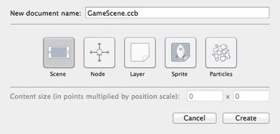

图 2-4. 创建 `GameScene.ccb`

准确来说，新建一个 `CCB 文件` 时，你可以从五种不同类型中选择。以下是它们的用途和主要区别的快速概述：

- **Scene（场景）：** 一个可呈现的场景。与你可能预期的相反，它的根节点是 `CCNode`，而不是 `CCScene`。它与 `Node` 类型的主要区别在于，它默认会在 SpriteBuilder 中围绕自身显示一个漂亮的设备边框。
- **Node（节点）：** 本质上与 `Scene` 相同，但它没有设备边框，且根节点为 `CCNode` 类。
- **Layer（层）：** 唯一一个可以设置内容大小的 `CCB 文件`类型。这使其成为任何固定尺寸图层的理想选择。同样，它的根节点属于 `CCNode` 类。
- **Sprite（精灵）：** 由于精灵在游戏中非常常见，这种 `CCB 文件` 的根节点是 `CCSprite`。除此之外，它与 `Node` 类型相同。
- **Particles（粒子）：** 与 `Sprite` 类型相同，只是其根节点使用了 `CCParticleSystem` 类。

**注意** 从技术上讲，所有 `CCB 文件` 类型都可以互换使用。`Scene`、`Node` 和 `Layer` 之间的主要区别在于术语以及它们在 SpriteBuilder 中的显示方式。`Layer` 类型是唯一允许用户自定义内容大小的类型。只有当内容需要固定、自定义的大小时（例如游戏关卡或固定大小的覆盖菜单），才需要在 `Node` 或 `Scene` 之上使用 `Layer`。

`GameScene.ccb` 将以 iPhone 设备边框的形式呈现，不含任何内容（黑屏）。是时候为其填充一些内容了。

##### 查看节点库

在资源导航窗格（左侧），点击节点库视图标签。这将弹出一个列表，其中包含可以拖放到舞台上的项目。这些项目大多是节点，继承自 Cocos2d 的基类 `CCNode`。其他类型的项目是物理引擎使用的关节。在图 2-5 中，你将找到在编写本文时可用的所有节点列表。

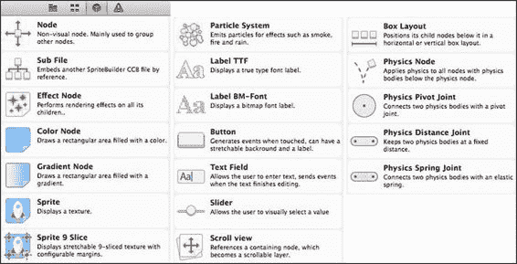

图 2-5. SpriteBuilder 中的可用节点列表

我将快速介绍各种节点类型及其用途：

- **Node（节点）：** 一个不可见的节点，用于分组（或“分层”）其他节点。可以将它们想象成包含相关项目的文件夹。这会影响绘制顺序，并且在代码中更容易访问相关项目，或者在 SpriteBuilder 时间线中排序、移动或折叠节点时非常有用。
- **Sub File（子文件）：** 用于嵌入另一个 `CCB 文件` 的占位符。这是一个非常强大的节点，因为它允许你将其他 `CCB 文件` 作为模板使用，并创建和编辑一个被多次使用（实例化）的单一 `CCB 文件`。将 `CCB 文件` 拖放到舞台上将自动创建一个 `Sub File` 节点。
- **Physics Node（物理节点）：** 这代表物理世界。任何启用了物理效果的节点必须是 `Physics Node` 的子节点或孙节点，否则最终将不会启用物理效果。通常，每个场景只应使用一个 `Physics Node`。多个物理世界是可能的，但它们的子节点将无法相互交互。
- **Color and Gradient Node（颜色与渐变节点）：** 瞧瞧这些颜色！本质上，这些只是没有图像的精灵。它们非常适合快速简易的背景，或作为尚未完成的图形的占位符。
- **Sprite（精灵）：** 任何 2D 游戏的主要构成元素。使用此工具绘制单个精灵帧、整个纹理或较大纹理的一部分。`Sprite 9 Slice`（九宫格精灵）可用于创建菜单屏幕或按钮的可调整大小背景，但由于 `Button`（按钮）节点的存在，它已经很少使用。
- **Particle System（粒子系统）：** 用于爆炸、排烟、火焰剑等效果。它根据定义粒子如何创建、随时间如何变化以及存活多久的参数，来动画化一组粒子。粒子不与物理效果交互，也无法在代码中访问单个粒子。与同等数量的精灵相比，粒子可以更高效地绘制和动画化。
- **Label TTF 和 BM-Font（TTF 标签和位图字体）：** 用于文本等内容。`TTF` 代表 *Truetype 字体*。它们的优势在于可以使用任何内置的 iOS 或自定义 `TTF` 字体。缺点是每次文本更改都会在内部创建一个新纹理，这对于分数计数器来说效率较低。`TTF` 字体最适合用于静态文本。对于动画文本，`BM-Fonts`（位图字体）更可取，但必须使用诸如 Glyph Designer 之类的外部工具创建。
- **Button（按钮）：** 一个按钮是 `Sprite 9 Slice`（背景图像）和 `Label TTF`（文本）的终极组合，用于创造出这个世界上最棒的东西——差不多是这样。嗯，你可以点击它，它可以在代码中发送一条消息，如果你设置得当，它甚至不会崩溃，反而会实际运行一些代码！
- **Text Field（文本字段）：** 一个可编辑的标签。用户可以点击它并输入一些文本，你的代码会在文本编辑结束时，甚至每次文本更改时收到一条消息。
- **Slider（滑块）：** 用户可以将滑块手柄向左或向右移动。你的代码会在滑块被拖动时收到一条消息。从技术上讲，它始终在 `0.0` 到 `1.0` 的数值范围内操作。
- **Scroll View（滚动视图）：** 尽管名称如此，但它并非用于创建滚动的游戏世界。它的设计目的是让用户拖动和移动，并创建类似于在照片库中浏览照片时的滚动和吸附效果。稍后你将使用 `Scroll View` 来创建关卡选择界面。
- **Box Layout（盒式布局）：** 使均匀排列节点这项繁琐的工作变得轻而易举。你可以将子节点水平或垂直对齐，但遗憾的是，尽管其名称如此，它本身无法将子节点排列成多行多列的网格。然而，你可以使用一个水平 `Box Layout`，其中包含多个垂直 `Box Layout` 节点作为子节点，每个垂直 `Box Layout` 节点再包含各列中的节点——或者反过来，将水平和垂直对齐的 `Box Layout` 节点互换。


从 Node Library 添加条目到舞台有两种方式。这两种方式都需要将所需条目从 Node Library 拖拽到舞台上，或者将其拖拽到时间轴视图左侧的另一个节点上。后一种方法让您可以选择节点在层级中的添加位置——换句话说，就是确定该节点的父节点。

如果将新节点直接拖放到舞台上，它将被添加为当前选中节点的同级节点；如果选中根节点或未选中任何节点，它将被添加为根节点的子节点。

**提示**：可以通过点击舞台上的节点进行选择——更准确地说，是在层级时间轴视图中选择所需节点。按住`Shift`或`Cmd`键的同时进行选择，可以一次选择多个节点。按下`Backspace`键可以删除选中的节点。您可以通过`Edit`  `Undo`撤销大多数操作（包括删除操作），直到保存文档为止。

#### 创建按钮

现在，将一个按钮拖拽到舞台或时间轴上。将其放置在舞台上的任意位置——目前这样就可以了。新按钮将被选中并标记为“Title”。

在**Item Properties**窗格（位于右侧）中，您会看到大量的值、按钮、复选框和文本字段。`Button`节点可能是所有节点中最复杂的。其属性示例如图 2-6 所示。现在可以随意调整其设置和值；您几乎不会犯错。如果确实操作失误，可以撤销或直接删除按钮，然后拖拽一个新按钮到舞台上重新开始。

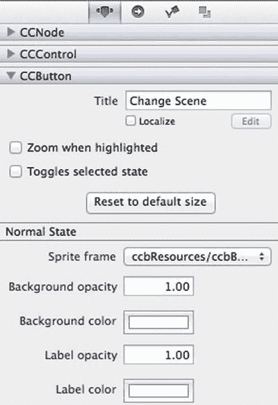

图 2-6. `CCButton`属性截选

目前，您可能唯一需要更改的是按钮的文本，可以在`CCButton`部分的`Title`文本框中编辑。输入`Change Scene`或类似文字作为标题。

##### 分配按钮选择器

真正重要的部分是右侧**Details Inspector**中的**Code Connections**标签页。现在点击此标签页。请参考图 2-7。

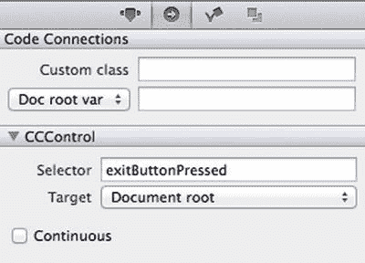

图 2-7. 按钮的`Code Connections`标签页

您会看到一个标记为`CCControl`的区域，该区域仅在用户界面节点（即按钮、文本字段和滑块节点）上可见。在这里，您可以指定一个选择器，通俗地说，就是“方法的名称”。这是当按钮被按下时发送的消息（或简单地说“被调用的方法”）。

在`Selector`文本字段中输入`exitButtonPressed`。至于`Target`，保留为`Document root`。请确保不勾选`Continuous`复选框，否则当用户持续按住或按下按钮时，该方法会在每一帧都运行。

如果现在发布并运行代码，然后按下按钮，会发生什么？该死！它仍然显示原始的`MainScene`。

#### 更改启动场景

要更改 SpriteBuilder 项目启动时加载的场景，请在 Xcode 中打开`AppDelegate.m`文件。找到`startScene`方法，并修改它，使其加载`GameScene`文件：

```
- (CCScene*) startScene
{
    return [CCBReader loadAsScene:@"GameScene"];
}
```

`CCBReader`是捆绑在`Cocos2d-Swift`中的类，负责加载 CCB 文件。

您可能常用的`CCBReader`方法是`loadAsScene`和`load`，它们分别加载指定的 CCB 文件并返回一个`CCScene`和`CCNode`实例。目前，只需注意`loadAsScene:`方法会返回一个普通的`CCScene`实例，其唯一子节点是`GameScene.ccb`的根节点。稍后我将更详细地解释这一点。

再次发布并运行应用程序。它将显示带有按钮的`GameScene`，但点击按钮目前还没有任何实际效果。

#### 为 GameScene 创建自定义类

要使代码连接正常工作（无论是在指定选择器时，还是在将节点分配为实例变量（`ivar`，“类的实例变量”的缩写）时），您必须在 SpriteBuilder 中指定一个自定义类。然后在 Xcode 中创建同名的类，其中包含相应的选择器或实例变量。反之亦然；顺序并不重要。

对于选择器和实例变量，您都可以指定一个目标，默认分别为`Document root`和`Doc root var`。这个所谓的“文档根节点”指的是包含当前编辑节点的 CCB 文件的根节点。根节点是层级中最顶层的节点——即创建 CCB 文件时就已经存在的节点。（参见图 2-8。）因此，自定义类属性必须在根节点上进行编辑。

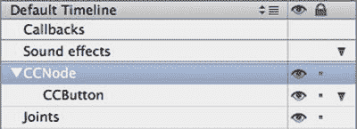

图 2-8. 选中根节点

**注意**：仅在运行时使用已存在的场景加载 CCB 内容时，才将`Owner`设置用作选择器和实例变量的目标。您可以指定一个自定义对象（所有者）作为选择器和实例变量的接收者。一个用途是将覆盖菜单 CCB 的按钮选择器映射到场景的自定义类。一个常见的误解是`Owner`设置指的是选中节点的自定义类——事实并非如此。

在`GameScene.ccb`中选择根节点，并切换到**Detail View**上的**Code Connections**标签页。根节点始终是节点层级中的第一个节点。您可以在时间轴视图中最轻松地选中它，如图 2-8 所示。

选中根节点后，在`Custom class`字段中输入`GameScene`，如图 2-9 所示。请确保大小写也匹配。如果您在自定义类文本字段中输入`gamescene`，但将类命名为`GameScene`，则代码连接将无法工作。您还必须使用有效的`Objective-C`类名。如果不确定，只需使用字母和数字，并且不要以数字开头类名，这样就没问题。

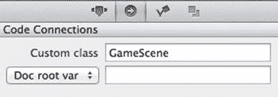

图 2-9. `GameScene.ccb`根节点，已分配自定义类

现在切换到 Xcode。您应该仍然打开着项目。如果没有，请转到`File`  `Open Recent`，并从列表中选择项目，或者像之前提到的那样在 Finder 中双击`.xcodeproj`文件。

在项目中选择`Source`组，然后从菜单中选择`File`  `New`  `File`，或右键单击并从上下文菜单中选择`New File`。在点击**Next**之前，从图 2-10 所示的项目列表中选择`Cocoa Touch Class`（Xcode 5：`Objective-C Class`）模板。

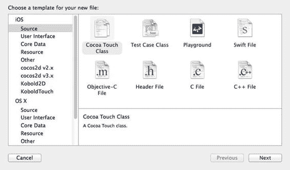

图 2-10. Xcode 文件模板对话框

将您的类命名为与在 SpriteBuilder 中完全相同的名称。在此示例中，它必须命名为`GameScene`，如图 2-11 所示。使其成为`CCNode`的子类，而不是`CCScene`，因为即使是类型为`Scene`的 CCB 文件，其根节点也是一个`CCNode`实例。点击**Next**并保存文件。

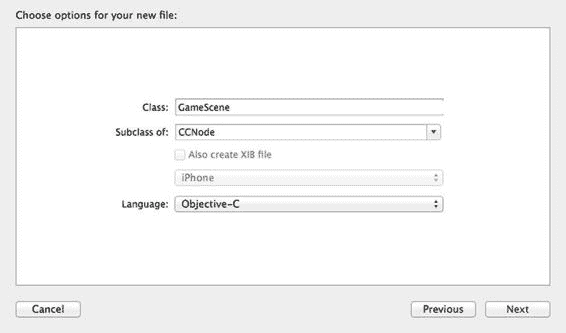

图 2-11. 创建一个名为`GameScene`的新`Objective-C`类

**提示**：如果您为类型为`Sprite`的 CCB 文件创建自定义类，则必须使该类成为`CCSprite`的子类。相应地，对于`Particles` CCB 文件，您必须使其成为`CCParticleSystem`的子类。对于所有其他 CCB 文件类型，您必须使自定义类成为`CCNode`的子类。

现在选择`GameScene.m`文件。作为快速测试类是否已创建并初始化，您可以实现`didLoadFromCCB`方法，该方法由`CCBReader`发送给它创建的每个节点。您的`GameScene.m`实现应该如下所示：

```
#import "GameScene.h"

@implementation GameScene
```


```markdown

`-(void) didLoadFromCCB
{
    NSLog(@"GameScene created");
}

@end
```

当您现在构建并运行应用程序时，可以在 Xcode 调试控制台（位于调试区域底部 Xcode 窗口底部）中找到以下日志消息。请参见图 2-3，调试控制台是标有 4 的区域右半部分。如果您看不到调试控制台，请依次点击`View` `Debug Area` `Activate Console`以显示它。调试控制台中的消息应显示如下：

```
2014-06-05 20:00:01.014 LearnSpriteBuilder[49183:60b] GameScene did load
```

#### 实现按钮选择器

现在您知道了自定义类是由读取器加载的。剩下要做的就是实现按钮选择器。创建按钮方法，并将其名称与您在按钮的`Code Connections`选择器字段中输入的完全一致。您的`GameScene`实现现在应该包含以下额外方法：

```
-(void) exitButtonPressed
{
    NSLog(@"Get me outa here!");
}
```

**提示** 您可以为`Button`、`TextField`和`Slider`节点的选择器进行可选设置，使它们将发送节点作为参数接收。为此，您只需在选择器名称后附加一个冒号——例如，`exitButtonPressed`将在节点的`Code Connections`选项卡的`Selector`字段中变为`exitButtonPressed:`。然后相应更新方法签名，为简洁起见，可在单行内完成：

`-(void) exitButtonPressed:(CCControl*)sender {  NSLog(@"Sender: %@", sender);  }`

您可以使用发送节点的特定类（例如`CCButton*`）代替`CCControl*`。`CCControl`是`Button`、`TextField`和`Slider`节点继承的父类，并且保证对所有节点都有效。

运行应用程序，轻触按钮，您将在调试控制台中看到类似如下的消息：

```
2014-06-05 20:24:02-959 LearnSpriteBuilder[49437:60b] Get me outa here!
```

#### 在按钮点击时切换场景

如果轻触按钮实际上能切换到菜单场景，那岂不更好？连接场景是一项必须由您编码完成的任务，但所有场景转换的步骤都非常直接，而且遵循相同的流程。请参见清单 2-1。

***清单 2-1*** 在按钮按下时切换场景

```
-(void) exitButtonPressed
{
    NSLog(@"Get me outa here!");

    CCScene* scene = [CCBReader loadAsScene:@"MainScene"];
    CCTransition* transition = [CCTransition transitionFadeWithDuration:1.5];
    [[CCDirector sharedDirector] presentScene:scene withTransition:transition];
}
```

**警告** 加载 CCB 文件时，不应附加`.ccb`文件扩展名。这是一个常见且可以理解的错误，但`CCBReader`将无法加载指定了`.ccb`扩展名的文件。发布的 CCB 文件会被转换为针对快速加载和紧凑存储优化的二进制格式。这种二进制文件格式的扩展名为`.ccbi`——即`.ccb`后跟一个字母`i`。纯文本格式的`.ccb`文件实际上并不在资源包中。因此，在调用`CCBReader`时省略文件扩展名非常重要。或者，为了提醒您扩展名的差异，您也可以附加`.ccbi`扩展名。

首先，使用`loadAsScene:`方法将`CCBReader`用于加载一个 SpriteBuilder CCB 文件作为场景。`loadAsScene`方法是一个便利方法。它返回一个`CCScene`对象，其中您的 CCB 文件的根节点是唯一的子节点。为了更好地理解这一点，以下是使用`load:`方法实现的与`loadAsScene`等效的代码：

```
CCNode* ccbRootNode = [CCBReader load:@"MainScene"];
CCScene* scene = [CCScene node];
[scene addChild:ccbRootNode];
```

这里的`scene`就是方法返回的内容。要访问`MainScene`的根节点，您需要编写：

```
CCNode* rootNode = scene.children.firstObject;
```

现在您有了一个`CCScene`实例，它可以附带一个可选的过渡来呈现：

```
CCTransition* transition = [CCTransition transitionFadeWithDuration:1.5];
[[CCDirector sharedDirector] presentScene:scene withTransition:transition];
```

过渡是一种为场景切换添加动画效果的方式。淡入淡出过渡先将一个场景渐变为黑色，再将新场景淡入。您也可以使用交叉淡入淡出、渐变成指定颜色以及各种移动和推入式过渡。

这些过渡方法的确切名称是什么？这些信息始终可以通过 Xcode 的代码补全建议随时获取——如果您没有看到建议，请检查该选项是否已在`Xcode Preferences` `Text Editing` `Suggest completions while typing`中开启。

一旦您开始键入类名或方法名的一部分，您应该会看到可用补全建议的列表，如图 2-12 所示。如果未显示，请在此处尝试按`ESC`键。

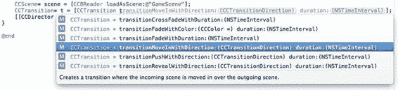

图 2-12 利用 Xcode 自动补全建议

**提示** 您还可以在 Cocos2d 类参考中找到过渡列表：[`www.cocos2d-swift.org/docs/api/Classes/CCTransition.html`](http://www.cocos2d-swift.org/docs/api/Classes/CCTransition.html)。或者在 Xcode 中任意位置输入`*CCTransition*`，然后右键单击文本并选择`Jump to Definition`。（或者，将光标放在文本任意位置，然后选择`Navigate` `Jump to Definition` from the menu。）这将打开`CCTransition`的接口，您可以在其中找到方法名称、属性及其他类详细信息，以及相关文档。

现在您已经了解了如何在`AppDelegate`中启动场景，以及如何在点击按钮时切换场景，请运行应用程序并尝试操作——如果您还没有这样做的话——我将把它作为练习留给您：将起始场景改回`MainScene`，并在`MainScene`上添加另一个按钮。这样，当`MainScene`中的按钮被轻触时，它会过渡到`GameScene`。本书在`01 - Change Scenes with Buttons`文件夹中提供了此项目状态的示例。

#### 创建关卡子文件节点

回到 SpriteBuilder——具体来说，是`GameScene.ccb`文件。我们正在构建的游戏应支持多个关卡。由于每个关卡将具有相同的基本玩法，因此为每个关卡重用`GameScene.ccb`是合理的，这样您就不必在每个关卡中单独重新实现常见功能。例如，HUD 或平视显示器——这个术语虽然有些用词不当，但通常用于指代任何非滚动内容，例如滚动世界中的暂停按钮和分数标签。

这就是子文件节点派上用场的地方。它允许您创建模板 CCB 文件，这些文件可以多次实例化，并在单个文件中进行编辑。将子文件节点视为 Objective-C 中类的等效概念。`GameScene`将包含三个子文件节点：一个用于实际关卡内容，一个用于 HUD 层，以及一个用于暂停和“游戏结束”菜单等弹出窗口。

由于在后期重新组织资源既繁琐又容易出错，因此从一个能够随项目扩展的项目结构开始非常重要。对于此练习，首先在项目中添加一个名为`Levels`的新文件夹，所有游戏关卡文件都将添加到此文件夹中。您可以通过`File` `New` `Folder`菜单，或在资源导航器视图（文件视图选项卡左下角——即列出 CCB 文件和其他资源的位置）中右键单击来创建文件夹。

```


首先，创建一个将包含关卡节点的 CCB。由于关卡需要特定大小（本例中用于确定世界的可滚动区域），因此选择 `Layer` 文档类型最为合适。在发出 文件  新建  文件命令之前，或者在右键单击 `Levels` 文件夹并选择新建文件之前，请先选中 `Levels` 文件夹。这将弹出如图 2-13 所示的对话框。

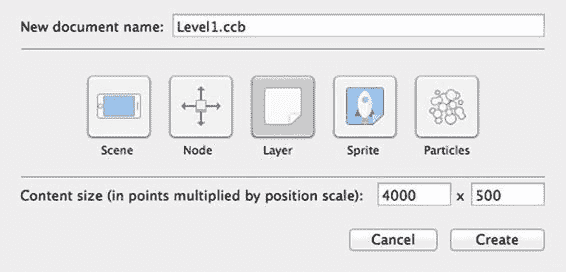

图 2-13。 `Level1.ccb` 类型为 `Layer`，并使用自定义内容大小

将新层命名为 `Level1.ccb`，并设置其大小为 `4000` x `500`。然后点击创建。最初，新的 CCB 将是空的（黑色）。

`Level1.ccb` 文件应位于名为 `Levels` 的子文件夹中。如果不在，请将 `Level1.ccb` 拖拽到 `Levels` 文件夹上，将其移动到 `Levels` 文件夹中。项目的文件层级结构必须与图 2-14 所示完全一致。

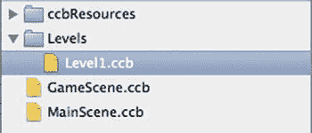

图 2-14。 `Level1.ccb` 应位于名为 `Levels` 的文件夹中

切换到节点库视图，将一个 `渐变节点` 拖拽到舞台或时间轴中的根节点上。

##### 节点选择手柄

在让这个渐变填充整个关卡之前，先来看一下节点的选择手柄。你可以很容易地在舞台上找到选中的节点，因为它的四个角都用小圆圈（即选择手柄）标记了出来。

当鼠标移到舞台上选中的节点上时，鼠标指针会变为以下图标之一，并且通过点击和拖拽可以执行相应的操作：

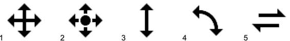

在节点的矩形区域内，鼠标指针会显示为一个四向箭头十字 (1)。当鼠标指针为此形状时，点击并拖拽即可移动节点。如果箭头十字中心有一个圆圈 (2)，说明鼠标正悬停在节点的 `anchorPoint` 附近，拖拽将会移动 `anchorPoint` 的位置。`anchorPoint` 本身常被误认为是重新定位节点的方式，但实际上它主要是节点旋转和缩放操作的中心点。通常，`anchorPoint` 要么位于节点的左下角 `(0, 0)`，要么位于其中心 `(0.5, 0.5)`。

**注意**：除非本书中特别说明，否则应将 `anchorPoint` 保留为其默认值。在开始拖拽节点前，请留意图标 1 和图标 2 之间的细微差别。

双向箭头手柄 (3) 用于缩放节点，当鼠标悬停在四个选择手柄之一上时会出现。它可能被误认为是调整节点大小，但对于 `颜色节点` 和 `渐变节点` 以外的节点，通过更改缩放比例来改变节点大小会导致图像质量下降，尤其是在通过缩放放大节点时。如果将鼠标指针稍微移到节点外部但靠近选择手柄，其形状会变为弯曲的双向箭头 (4)，此时拖拽可以旋转节点。

最后，分成两半的双向箭头 (5) 表示倾斜操作。你可以抓住两个选择手柄之间的节点边缘，沿其轴方向移动该边缘，从而形成梯形节点。

##### 编辑节点属性

对于精确的修改，鼠标拖拽操作并不合适。你可以使用“对象”菜单中的“微移”、“移动”和“对齐”命令来进行更精细的控制，但这也不能适用于所有情况。大多数情况下，当你知道某个属性的确切值时，你会希望使用详情视图右侧的“项目属性视图”。所有节点类型在顶部都显示相同的基本属性，标记为 `CCNode`，如图 2-15 所示。

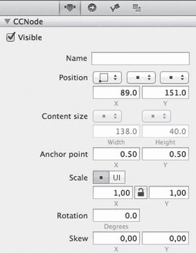

图 2-15。所有节点都使用 `CCNode` 属性

“可见”复选框不言自明，“名称”文本字段可用于为节点指定自定义名称，以便在代码中识别。

“位置”设置使用点（points）为单位，而不是像素。例如，Retina 和非 Retina iPad 的点尺寸相同，都是 `1024 x 768` 点。这使得位置对所有设备通用。为了进一步支持对齐或个人偏好，你可以更改节点的参考角点（参见图 2-16）。默认情况下，它设置为“左下”，这意味着节点的位置是相对于根节点的左下角。更改为“左上”后，节点的位置将与 `UIView` 相同，即视图的位置相对于视图、图层或屏幕的左上角。

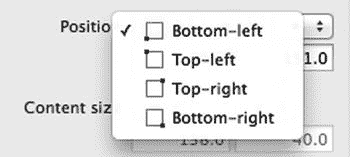

图 2-16。位置属性的角点对齐设置

位置的缩放类型也可以针对每个轴单独调整。默认情况下，坐标被视为 *以点为单位*，但在 iPad 上始终会放大。这样做的效果是，当您将文档更改为 文档  分辨率  平板电脑 时，节点在平板设备上的相对位置保持不变。

默认情况下，SpriteBuilder 假设通用应用会将 iPad 屏幕视为大致大两倍的屏幕——`1024 x 768` 的 iPad 点范围比宽屏 iPhone 5C/5S 的 `568 x 320` 尺寸宽 `1.8` 倍、高 `2.4` 倍。如果你不希望这样，则必须将节点位置更改为 *以 UI 点为单位*（参见图 2-17），以便真正能够在更大的屏幕空间上摆放更多节点。换句话说，玩家在 iPad 上实际上能够看到更多同一世界的内容。

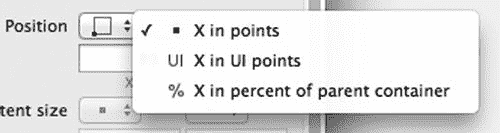

图 2-17。位置类型设置

相同的 UI 点缩放类型也可以应用于节点的缩放属性。

最后，*父容器百分比* 设置是位置设置中最重要且最常用的一项。它允许你完全忽略大多数与分辨率相关的考虑。最常见的用途是快速将节点在屏幕上居中，无论目标设备是 3.5 英寸或 4 英寸的 iPhone 还是 iPad。只需将两个坐标的位置类型都设置为父容器百分比，并输入 `50%` x `50%` 即可。

内容大小属性扩展了此缩放类型列表，增加了两个额外设置：以点为单位的内边距宽度和以 UI 点为单位的内边距宽度，如图 2-18 所示。常规点缩放与 UI 点缩放的差异如上所述。内边距将 `contentSize` 从定义节点的实际宽度和高度，更改为定义节点与父节点边缘之间的距离。

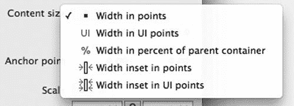

图 2-18。可用于内容大小属性的大小类型

假设一个示例节点以位置 `50%`, `50%` 和 `AnchorPoint` `0.5`, `0.5` 居中在图层上，那么 `100 x 40` 的内边距会将节点的 `contentSize` 更改为比其父节点小 `100` x `40` 点。在这个例子中，节点完美居中，因此其左右两侧各小 `50` 点，上下两侧各小 `20` 点。通过编辑位置和 `content size` 也可以达到同样的效果，只是不那么方便。

##### 更改节点绘制顺序

最后一个但同样重要的属性是绘制顺序，在 Cocos2d 中通常称为 `zOrder`。Sprite Kit 用户将其称为 `zPosition`。但是，在 `CCNode` 属性或其他任何地方都没有这个属性。这里的技巧是，在 SpriteBuilder 中，绘制顺序仅由其父容器中子节点的顺序定义。在 SpriteBuilder 中，更改绘制顺序的唯一方法是在时间轴视图中重新排列节点。


##### 排版后的文本

将`Color Node`拖放到舞台上现有`Gradient Node`的上方。时间线将如图 2-19 所示。

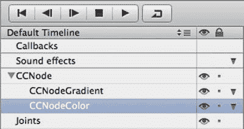

Figure 2-19. 时间线以层级视图列出 CCB 文件中的节点

现在，如果你希望`Color Node`绘制在`Gradient Node`的后面（下方），只需在时间线大纲视图中将其拖放到`Gradient Node`的上方。结果应与图 2-20 相同。

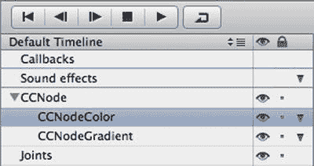

Figure 2-20. `CCNodeColor`通过拖放向上移动以反转绘制顺序

在舞台上，如果移动颜色节点，它现在应该滑到渐变节点下方。示例见图 2-21。

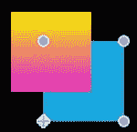

Figure 2-21. 颜色节点现在绘制在渐变节点的后面

时间线中的拖放操作也用于移动节点，使其成为另一节点的子节点，从而改变节点的父节点。值得注意的是，子节点总是绘制在其父节点的前面。

**提示** 双击时间线中的节点，你可以在`SpriteBuilder`中为其指定一个描述性的、纯信息性的名称。节点在时间线中的名称可以与其`Name`属性不同，但为了减少混淆，最佳实践是确保节点在时间线中的名称与其`Name`属性保持一致。

最后，再次删除`Color Node`，它仅用于演示绘制顺序。选中颜色节点，然后按`Backspace`键，或使用菜单：“Edit”“Delete”。

##### 用渐变填充图层

掌握了这些知识，便可以用渐变节点轻松填充整个图层。将内容尺寸缩放类型分别更改为“Width in percent of parent container”和“Height in percent of parent container”。在内容尺寸的“Width”和“Height”字段中输入`100`和`100`。假设位置和锚点均设置为默认值`0, 0`（缩放为`1, 1`，旋转为`0`），这将使渐变填充整个图层。参考图 2-22。

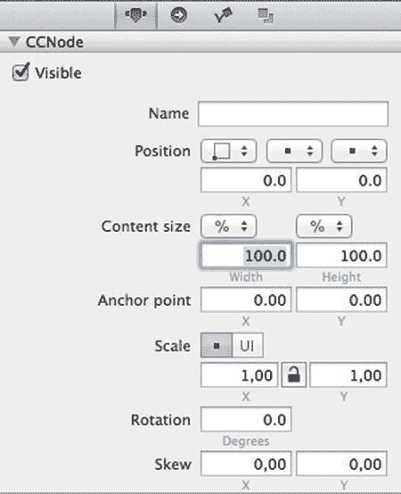

Figure 2-22. 渐变节点内容尺寸设置为`100%`以填充整个图层

由于`Level1`图层可能比屏幕更宽，你可能需要缩小视图以查看整个图层进行确认。“Zoom In”、“Zoom Out”和“Reset View”命令位于“Document”菜单中——虽然使用键盘快捷键`Cmd +`、`Cmd –`和`Cmd 0`要方便得多。你也可以按住`Cmd`键并用鼠标左键拖动舞台来平移图层。

在继续之前，可以随意尝试`CCNodeGradient`的属性。例如，更改渐变颜色和决定渐变方向的`Vector`属性。这样做也有助于你更好地观察下一章将要实现的滚动效果的早期版本。

##### 创建子文件引用

作为最后一步，你需要在`GameScene`中实际引用这个新的`Level1.ccb`。这通过`Sub File`节点实现。

你可以直接将一个`Sub File`节点拖放到舞台上，然后编辑其`CCB File`属性，指向所需的`CCB`文件。但有一个更简单的方法。这时左侧的“Tileless Editor View”资源导航器就派上用场了。

双击打开`GameScene.ccb`。然后，在“Resource Navigator”窗格中选择“Tileless Editor View”选项卡（左数第二个）。它将列出一个名为`Level1`的项——即`Level1.ccb`——和一个预览缩略图，如图 2-23 所示。

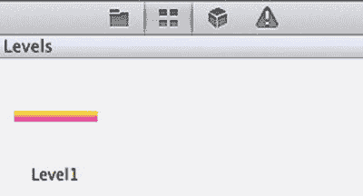

Figure 2-23. 显示`Level1.ccb`内容缩略图的“Tileless Editor View”

**注意** 缩略图仅在保存`CCB`或发布项目时更新。如果未看到缩略图或显示错误的预览图像，请尝试发布一次项目。如果`SpriteBuilder`提示，确认“Save All”文档。

你应该从“Tileless Editor View”中将`Level1`项拖放到舞台上，创建一个引用`Level1.ccb`文件内容的`Sub File`节点。如果你检查新节点的“Item Properties”选项卡，你将看到一个引用`Levels/Level1.ccb`的`CCB File`条目。在时间线中，这个新节点被标记为`CCBFile`。你可能希望双击它并赋予其一个可识别的名称——例如“level content”。

由于`Sub File`节点有自己的位置，且被引用的`Level1.ccb`被视为`Sub File`节点的子节点，因此你需要将新节点的位置更改为`0,0`，以便这个虚拟关卡与屏幕左下角正确对齐。此外，“change scene”按钮现在绘制在关卡内容的下方——只需将时间线中的`CCButton`条目拖到“level content”节点下方，如前所述。

当你创建越来越多的代表游戏单个元素的`CCB`文件时，它们都将在“Tileless Editor View”中可用。它们将成为你游戏的预制内容节点自定义库，有时被称为*prefabs*（“预制件”的简称）或模板。

##### 添加玩家精灵

第一个预制件将是玩家角色，它将会是一个精灵。精灵需要图像资源。

此外，应尽可能将精灵打包到*图集纹理*中以提高渲染性能。`Cocos2d`将图集纹理称为“spritesheets”，但它们是同一回事：一个包含多个图像的大纹理，并带有元信息，告诉`Cocos2d`在图集纹理中的何处可以找到给定名称的图像。幸运的是，`SpriteBuilder`为你自动完成了精灵表的生成以及从精灵表加载图像的过程。

**提示** 特定图像在同一场景中使用的越频繁，将其放入精灵表的好处就越大。但是，如果你添加了太多或太大的图像，生成的精灵表的尺寸可能会超过`4096 x 4096`像素的最大值。如果发生这种情况，`SpriteBuilder`将生成一条警告消息，要解决此问题，你必须删除一些图像，最好将它们添加到新的精灵表中。

##### 创建精灵表

现在你应在文件视图中创建一个新文件夹，命名为`SpriteSheets`。然后向其添加一个子文件夹，命名为`Global`。接着，右键单击`Global`文件夹以调出上下文菜单（见图 2-24），并选择“Make Smart Sprite Sheet”。

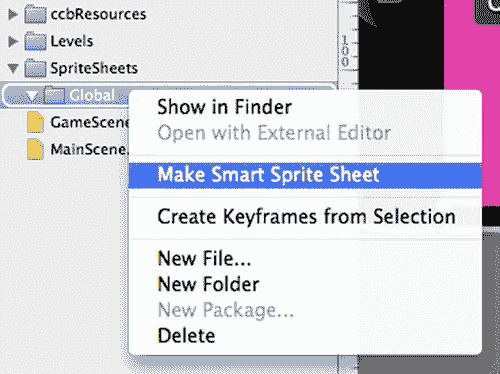

Figure 2-24. 开始操作！将文件夹转换为智能精灵表

你会注意到“Atlas”文件夹图标变成了粉红色。在其上方的预览区域中，你会获得一些额外的选项来更改精灵表的发布格式。现在，你可以保留格式为`PNG`（未压缩，无抖动），但推荐的格式是选择了“Compress”的`PVR RGBA8888`，以节省内存并显著加快这些图像的加载速度。使用压缩的`PVR`没有缺点。`Cocos2D`用户可能会通过其`.pvr.ccz`扩展名识别这种纹理格式。


**提示** 一个常见的误解是认为图像文件大小等同于内存占用，但事实远非如此。一个大小为 100 KB 的 `image.png` 文件，作为纹理时可能轻易消耗 16 MB 的内存。纹理未压缩时的最大字节数由图像属性计算得出：`宽度 x 高度 x (每像素位数 / 8)`，其中 `每像素位数` 代表“每个像素所占的比特数”。仅将颜色位深度从 32 位（每个颜色 4 字节）降低到 16 位（每个颜色 2 字节），就能将纹理的内存占用减半。压缩的 PVR 格式可在不影响图像质量的情况下进一步降低内存占用，而有损的 PVRTC 格式则以牺牲图像质量为代价，进一步降低内存占用。

本书其余部分使用哪种图集类型并不重要，但如果在应用中遇到内存不足的情况，选择图集类型就是最简便快捷地降低内存占用、甚至提升性能的方法。为此，只需选中那些带有笑脸图标的粉色精灵表单文件夹，然后更改纹理类型。例如，图 2-25 中的精灵表单使用了 `PVR RGBA8888`——这是一种 PVR 格式的纹理，每个 RGB 颜色通道占 8 位，Alpha 通道（透明度）也占 8 位。

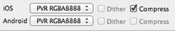

图 2-25. 精灵表单发布格式设置

**提示** `RGBA4444` 和 `RGB565` 格式将颜色位深度降低至 16 位，这可能导致“颜色渗溢”——尤其是在包含渐变的图像中。对于这些格式，你可能需要启用“抖动”复选框。`RGB565` 格式仅适用于不含任何透明度的图像——例如不透明的背景图像——因为它用额外的色彩鲜艳度换取了 Alpha 通道。PVRTC 变体是一种“最后手段”，因为它们采用了类似 JPG 的有损压缩，但能进一步降低内存占用并提升渲染性能。你应当仅考虑将 PVRTC 用于快速移动、短暂存在或小尺寸的图像——因为在这些场景中，画质降低不易察觉。例如，一个仅包含各种子弹变体的精灵表单就是 PVRTC 的理想候选。如有疑问，可以进行实验。原始图像不会受影响，你随时可以无损地还原精灵表单的导出格式。

现在，既然已经将“全局”文件夹转换为精灵表单并设置了其导出格式，你应该从访达中将本书可下载存档中提供的 `player.png` 拖放到 *Global* 精灵表单文件夹中。请务必拖动图像本身，而不是包含图像的文件夹。其他图像将在后续使用。

如果你想使用自己的玩家图像，应创建一个尺寸为 256 x 256 像素、内容为圆形形状的图像，并将其命名为 `player.png`。玩家图像是圆形的，因为本书后续内容中它将变为一个可变形的软体物理对象，而圆形图像最容易绘制到可变形体上。

**提示** 从访达将文件拖放到 SpriteBuilder 的文件视图中，是向 SpriteBuilder 添加外部资源文件的唯一方式。

#### 创建玩家预制体

现在，在文件视图的根目录下创建另一个名为 `Prefabs` 的文件夹。

选中该文件夹，然后从菜单中选择 `文件`  `新建`  `文件`，或者右键单击它并选择 `新建文件`。将新文档命名为 `Player.ccb`，然后点击 `精灵` 按钮，以 `CCSprite` 作为其根节点来创建文档。参见 图 2-26。

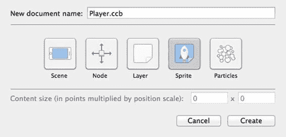

图 2-26. 创建 `Player.ccb` 作为精灵

此时，项目的文件视图应类似于 图 2-27 所示。

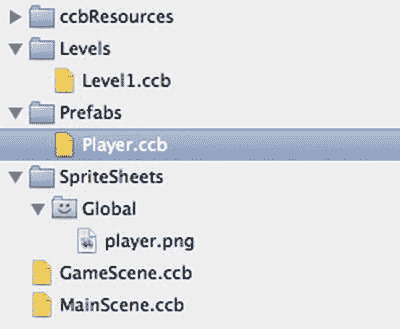

图 2-27. 截至目前项目的文件和文件夹结构

如果任何文件不在其应处的位置，现在只需拖放它们即可将其移动到正确的位置。


**Caution** 将资源移动到不同的文件夹，甚至重命名它们，都会导致 `SpriteBuilder` 丢失对该资源的所有现有引用。因此，尽早为给定项目构思一个合理的文件夹结构并坚持使用，在正确的位置创建资源至关重要。资源文件应在首次使用前就放置在适当的位置并恰当命名。虽然之后移动或重命名资源文件并非不可能，但使用该文件的次数越多，更新引用以指向新路径或名称所需进行的更改也就越多。

目前的 `Player.ccb` 看起来像是一个空无一物的黑色虚影。点击舞台下方时间线中的 `CCSprite` 根节点，或者点击舞台中央来选中该精灵。现在，你应该会在舞台上看到一个带有四个选择手柄的圆形选区，右侧的“项目属性”选项卡应该会显示该精灵节点的属性。

当前，`Sprite frame` 属性被设置为`<NULL>`，这就是你什么也看不到的原因。点击 `Sprite frame` 下拉菜单，将其更改为全局精灵表文件夹中的 `player.png`，如图 Figure 2-28 所示。

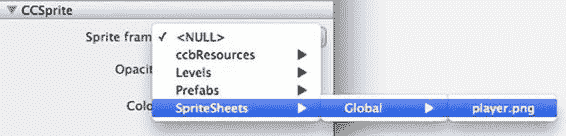

Figure 2-28. 为玩家选择正确的 `Sprite frame` 图像

现在，`player.png` 图像应显示在舞台中央。目前，`Player.ccb` 的设置到此为止。选择 `File`  `Save All` 或 `File`  `Publish` 以允许 `SpriteBuilder` 更新项目的预览图像。

#### 创建玩家预置体实例

现在，双击 `Level1.ccb` 将其打开。切换到“Tileless 编辑器视图”（左起第二个选项卡）。你会在该视图中看到 `player` 列出了多次，如图 Figure 2-29 所示。

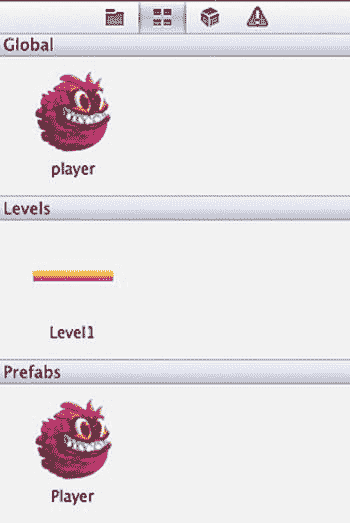

Figure 2-29. Tileless 编辑器视图中出现奇怪的重复条目

实际上，列表中同时显示了全局精灵表文件夹中的图像以及预置体文件夹中的 `Player.ccb`。

为避免意外使用玩家的图像而不是其 `Player.ccb` 预置体，你应该取消选中“Tileless 编辑器视图”下方列表中的 `Global` 复选框，参见 Figure 2-30。你还应该取消选中 `Levels` 文件夹，因为你不会再将一个关卡 `CCB` 文件拖放到另一个 `CCB` 文件中——至少在本书的课程中不会，因为切换关卡将通过代码完成。

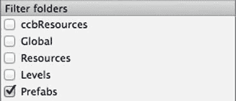

Figure 2-30. 筛选复选框用于更改“Tileless 编辑器视图”中显示哪个文件夹的内容

一旦你取消选中 `Global` 和 `Levels` 文件夹，它们的内容将不再出现在“Tileless 编辑器视图”中。

现在，你应该将 `Player` 拖放到 `Level1.ccb` 舞台上，以创建一个引用 `Player.ccb` 的子文件节点。尝试将玩家放置在关卡的非常靠左的位置，因为游戏将从左向右滚动。

要移动舞台，请按住 `Cmd` 键，然后左键单击并拖动。

如果你现在发布、构建并运行游戏，你所添加到 `Level1.ccb` 的玩家实例可能在屏幕上可见，也可能不可见，这取决于设备以及你放置玩家实例的具体位置。如果你在 `GameScene` 中看不到玩家，请将其在 `Level1.ccb` 中的位置向关卡的左下角移动，直到你可以在应用中看到它。

此状态的项目也体现在 `02 - Level with Player Prefab` 文件夹内的项目中。

#### 总结

在本章中，你学习了使用 `SpriteBuilder` 和 `Cocos2d` 的基础知识，如何创建 `CCB` 文件和节点，如何编辑它们的属性，以及如何进行代码连接。具体来说，你了解到了重要的子文件节点及其使用方法，在后续章节中，它的好处将变得更加明显。


在编程方面，您学习了如何更改起始场景、如何创建自定义类、如何响应按钮选择器、如何加载 CCB 文件以及如何在场景之间进行转换。

您现在有了一个包含两个场景的骨架应用，您可以通过点击按钮在两个场景之间来回切换。在下一章中，您将滚动关卡以确保玩家保持在屏幕中央。此外，您还将为玩家添加触摸控制和移动功能。

## 第 3 章 控制与滚动

大多数游戏都需要某种方式来控制玩家角色。您将学习使用 Cocos2D 动作来让玩家穿过您设计的关卡。由于本项目中的关卡比屏幕大，并且为了增加世界的深度感，您还将实现视差滚动。

#### 触摸即动：移动玩家

首要任务是添加响应触摸事件的代码。您将使用它来移动玩家。为此，您首先必须在`GameScene`类中建立对玩家节点的引用。

##### 通过名称查找玩家节点

在`GameScene.m`类中，在类的`@implementation`部分下方添加清单 3-1 中的括号和变量声明。

**清单 3-1**。向`GameScene`类添加这些实例变量

```
@implementation GameScene
{
    __weak CCNode* _levelNode;
    __weak CCPhysicsNode* _physicsNode;
    __weak CCNode* _playerNode;
    __weak CCNode* _backgroundNode;
}
```

这段代码声明了名为`_levelNode`、`_physicsNode`、`_playerNode`和`_backgroundNode`的私有变量（称为实例变量）。它们是私有的，因为它们是在类的`@implementation`部分声明的。私有变量对其他类不可见，甚至对子类也不可见。

`_playerNode`被声明为`CCNode`，而不是`CCSprite`。这主要是因为这里我们不需要其特定于精灵的功能，所以通过其超类来引用它是可以的。如果稍后您需要使用其`CCSprite`功能，您可以将变量定义更改为`__weak CCSprite* _playerNode`，或者像这样进行强制转换：

```
CCSprite* playerSprite = (CCSprite*)_playerNode;
```

> **提示** 如果您对 Objective-C 经验不足，可以通过阅读 Apple 的“使用 Objective-C 编程”指南来很好地理解该语言和面向对象编程的概念：[`developer.apple.com/library/mac/documentation/cocoa/conceptual/ProgrammingWithObjectiveC`](https://developer.apple.com/library/mac/documentation/cocoa/conceptual/ProgrammingWithObjectiveC)。Apress 在其库中也有几本关于 Objective-C 的书籍，网址为 [www.apress.com](http://www.apress.com)。
> 
> 如果您是一位经验丰富的程序员，并且主要面临语法上的困扰，您会发现 Ray Wenderlich 的“Objective-C 速查表”很有帮助：[`www.raywenderlich.com/4872/objective-c-cheat-sheet-and-quick-reference`](http://www.raywenderlich.com/4872/objective-c-cheat-sheet-and-quick-reference)。

`__weak`关键字向编译器发出信号，表明此变量不应保留分配给它的对象。如果您向`_playerNode`实例发送`removeFromParent`消息，它将允许释放内存，并且由于`__weak`关键字，`_playerNode`引用将自动变为`nil`。

通常，将不是由类创建或拥有的对象指针实例变量声明为`__weak`是一种良好的做法。具体在 Cocos2D 中，当引用是节点的父节点（或祖父节点等）或兄弟节点时，您应始终将对节点的引用声明为`__weak`。省略`__weak`关键字会创建一个强引用，在最坏的情况下会导致保留循环——一种情况，在其最简单的形式中，节点 A 强引用节点 B，而节点 B 也持有对节点 A 的强引用，并且两者都不释放对方，因此两者都无法释放。在`__weak`不合适的情况下，您会很快注意到，因为引用通常比预期更早变为`nil`。

> **提示** 要了解有关弱变量和强变量的更多信息，以及何时以及为何使用它们以及一般内存管理指南，您可以在 Apple 的“高级内存管理编程指南”中找到这些信息：[`developer.apple.com/library/ios/documentation/Cocoa/Conceptual/MemoryMgmt`](https://developer.apple.com/library/ios/documentation/Cocoa/Conceptual/MemoryMgmt)，特别是“实用内存管理”部分。该指南由“过渡到 ARC 发行说明”补充，可在此处找到：[`developer.apple.com/library/mac/releasenotes/ObjectiveC/RN-TransitioningToARC`](https://developer.apple.com/library/mac/releasenotes/ObjectiveC/RN-TransitioningToARC)。请注意，本书的项目、SpriteBuilder 和 Cocos2d-Swift 都使用 ARC（自动引用计数）来使内存管理更加容易。

声明了上述变量后，您应该获取对玩家节点的引用并将其分配给`_playerNode`。获取节点引用的最简单方法是通过其名称。为此，请在 SpriteBuilder 中打开`Level1.ccb`并选择玩家节点。在“项目属性”选项卡上，在“名称”文本字段中输入`player`（全部小写）。

> **注意** 只有节点的“名称”属性可用于通过其名称获取节点。仅更改时间线中节点的名称不会使其可通过此名称访问。时间线名称仅在 SpriteBuilder 中用于清晰性。

发布项目并返回 Xcode。在`GameScene.m`中，将清单 3-2 中突出显示的代码添加到已存在的`didLoadFromCCB`方法中。

**清单 3-2**。启用用户交互

```
-(void) didLoadFromCCB
{
    // enable receiving input events
    self.userInteractionEnabled = YES;

    // load the current level
    [self loadLevelNamed:nil];
}
```

第一行允许`GameScene`类接收触摸事件。接下来，将下面显示的清单 3-3 代码添加到`didLoadFromCCB`方法中。此代码将在本书后面展开；它目前尚未加载关卡。

**清单 3-3**。通过名称获取玩家节点

```
-(void) loadLevelNamed:(NSString*)levelCCB
{
    // get the current level's player in the scene by searching for it recursively
    _playerNode = [self getChildByName:@"player" recursively:YES];
    NSAssert1(_playerNode, @"player node not found in level: %@", levelCCB);
}
```

这里，返回了第一个名称为`player`的子节点。搜索是递归执行的，这意味着搜索覆盖了整个节点层次结构，包括`self`节点中所有子节点和孙节点。结果被分配给`_playerNode`实例变量。

如果无法通过名称找到`_playerNode`，这里的`NSAssert`将抛出异常并在日志中输出一条消息。像这样的安全措施是很好的做法，因为它们使您能够在出现意外情况时立即发现问题，而不是让您困惑为什么玩家不会移动。为了本书其余部分的简洁性和可读性，我将省略安全检查，但您可以在本书的第 14 章：调试和最佳实践中了解有关调试策略和防御性编程技术的更多信息。


##### 异常断点：关键的调试利器

在每个 Xcode 项目中，你都必须做一件事：添加一个异常断点，如图 Figure 3-1 所示。要添加异常断点，请点击 Xcode 中的断点导航器标签页（标签栏中高亮显示的朝右箭头状图标）。在面板底部有一个添加按钮（`+` 符号）。点击它并选择“添加异常断点”。你也可以通过右键点击来编辑该断点。在 Figure 3-1 中，它被设置为仅捕获 Objective-C 异常。当程序运行到导致错误的代码行时，异常断点会暂停程序，从而让你准确知道程序错误的位置，而不是让 Xcode 总是跳转到 `main` 方法。异常断点是关键的调试利器。

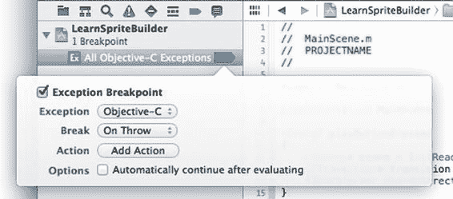

Figure 3-1. 为每个项目添加异常断点是关键的调试手段

现在，触摸事件已启用，并且 `_playerNode` 引用也已赋值，你可以轻松地将玩家移动到触摸位置。目前，使用 Listing 3-4 中的代码即可。将 Listing 3-4 的代码添加到 `GameScene.m` 实现文件中，放在 `loadLevelNamed:` 方法下方。

***Listing 3-4***. 将玩家传送至触摸位置

```
-(void) touchBegan:(UITouch *)touch withEvent:(UIEvent *)event
{
    _playerNode.position = [touch locationInNode:self];
}
```

这段代码获取触摸位置，并将其从触摸的 Cocoa 坐标系（原点在左上角）转换为 Cocos2D 使用的 OpenGL 坐标系（原点在左下角）。它还将位置转换到所提供节点的局部坐标空间中（此例中为 `self`）。转换结果直接应用到 `_playerNode` 上。现在，当你构建并运行应用时，玩家会瞬间移动到屏幕上你点击的位置。

##### 分配关卡节点实例变量

在接下来的步骤中，你需要一个对关卡节点的引用。除了像玩家那样通过名称获取外，你也可以让 SpriteBuilder 将其直接赋值给 `GameScene` 类，前提是该类已经声明了一个同名的实例变量或属性。而你的代码已经做到了这一点，因为 Listing 3-1 中已经做了声明。

通过 SpriteBuilder 分配变量和通过名称获取节点同样合适。在大多数情况下，这取决于个人偏好，不过建议不要在计划执行的 `update:` 方法中频繁使用 `getChildByName:` 方法，尤其是在涉及递归搜索和深层节点层次结构时。

**警告** 在撰写本文时，从 SpriteBuilder 内部分配变量仅适用于给定 CCB 文件的直接子级节点。它不能用于将位于通过子文件（`CCBFile`）节点导入的另一个 CCB 文件中的节点分配为实例变量或属性。这就是玩家节点通过名称获取的原因。

在 SpriteBuilder 中打开 `GameScene.ccb`，选择引用 `Levels/Level1.ccb` 的 `CCBFile` 实例。然后，在右侧的“细节检查器”中，切换到“项目代码连接”标签页。在第二行的文本字段中，输入 `_levelNode`，这是你在 Listing 3-1 中已声明的实例变量名称。将下拉菜单保留设置为“Doc root var”，如图 Figure 3-2 所示。

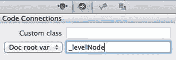

Figure 3-2. 文档根变量会将节点分配给在 CCB 根节点的自定义类中声明的同名实例变量或属性

如果你发布、构建并运行应用，`CCBReader` 会在发送 `didLoadFromCCB` 消息之前赋值 `_levelNode` 实例变量。这是创建对 CCB 文件中所包含节点引用的最简单、最高效的方式。

如果你想确认变量是否已被赋值，可以在 `didLoadFromCCB` 中添加如下日志语句：

```
NSLog(@"_levelNode = %@", _levelNode);
```

运行项目，你会在 Xcode 调试控制台中看到上面这行日志。如有必要，请在 Xcode 中通过“视图”“调试区域”“激活控制台”打开控制台。如果看到 `_levelNode = (null)`，那么 Figure 3-2 中的变量名可能与该实例变量的名称不匹配。否则，日志中的信息将类似于：

```
LearnSpriteBuilder[54443:70b] _levelNode = <CCNode = 0x9f77b30 | Name = >
```

##### 使用 `CCActionMoveTo` 移动玩家

为了将玩家平滑地移动到目标位置，你可以用 Listing 3-5 中基于动作的移动代码替换 `touchBegan:withEvent:` 方法的内容。

***Listing 3-5***. 使用移动动作平滑移动玩家

```
-(void) touchBegan:(UITouch *)touch withEvent:(UIEvent *)event
{
    CGPoint pos = [touch locationInNode:_levelNode];
    CCAction* move = [CCActionMoveTo actionWithDuration:0.2 position:pos];
    [_playerNode runAction:move];
}
```

首先，触摸位置相对于 `_levelNode` 进行转换。这一点很重要，因为它允许玩家在 `_levelNode` 的完整范围（4000x500 点）内移动，而不是局限于屏幕空间（4 英寸 iPhone 上为 568x320 点，iPad 上为 1024x768 点）。然而，这一点在游戏中尚未体现，因为还没有滚动功能；因此，玩家无法移动到初始屏幕位置以外的地方。

接下来，创建一个 `CCActionMoveTo` 动作，该动作会在一段时间内将节点移动到指定坐标。然后对该 `_playerNode` 运行此动作。请注意，如果你增加持续时间，会注意到移动动作不会堆叠，玩家最终也不会到达你最后一次点击的位置。要解决这个问题，你需要给动作分配一个标签——你可以选择任意整数。使用这个标签，你可以在运行新动作之前，停止带有相同标签的现有动作。Listing 3-6 展示了包含这一改进的更新后代码。

***Listing 3-6***. 按标签停止动作，以避免同时运行多个移动动作

```
-(void) touchBegan:(UITouch *)touch withEvent:(UIEvent *)event
{
    [_playerNode stopActionByTag:1];

    CGPoint pos = [touch locationInNode:_levelNode];
    CCAction* move = [CCActionMoveTo actionWithDuration:20.2 position:pos];
    move.tag = 1;
    [_playerNode runAction:move];
}
```

**提示** 你可以在 Cocos2d-Swift 类参考中找到所有可用的动作类。它们的类名总是以 `CCAction` 开头：[`www.cocos2d-swift.org/docs/api/index.html`](http://www.cocos2d-swift.org/docs/api/index.html)。

现在，如果构建并运行项目，你应该会看到点击屏幕时，玩家在屏幕上方平滑移动。但玩家仍然无法“离开”初始屏幕。这时就需要滚动登场了。

#### 滚动关卡

说到滚动，许多开发者会自然而然地认为是摄像机在背景上移动，从而产生滚动效果。某些引擎和工具集确实采用这种方式，尤其是以 3D 开发工具为核心的情况下。但在 2D 游戏引擎中，更常见、更实用的做法是让内容层向移动的反方向移动。

事实上，在 Cocos2D 和许多其他 2D 引擎中，并没有摄像机的概念。甚至连 Cocos2D 所依赖的渲染技术 OpenGL 也没有摄像机。只有设备屏幕。要改变屏幕上显示的内容，你就必须移动场景中的内容，因为屏幕所代表的摄像机视图是固定的——相对于虚拟世界来说是固定的。当然，你可以在现实世界中自由地移动、倾斜和放下手机，但这不会影响屏幕上显示的内容。

实际上，如果你摔了手机，可能会影响屏幕。但这完全是另一回事了。

##### 安排更新


在我们的场景中，如果玩家向右上方移动，实际上我们要做的是将`_levelNode`向左下方移动，以保持玩家在屏幕中心。这给玩家一种向右上方移动的印象，但实际上，玩家一直保持在屏幕中心，而整个关卡的内容则向左下方移动。

尽管如此，玩家的位置依然是你所期望的那样：被限制在关卡节点的范围内，并且是绝对位置。玩家的位置范围将从关卡节点的原点（左下角坐标为`0,0`）到关卡节点的完整范围，此处为`4000x500`点。

为了进行设置，请在`GameScene.m`文件底部的`@end`行上方，添加清单 3-7 中的`update:`方法。

***清单 3-7*** `update:`方法，每帧自动调用一次

```
-(void) update:(CCTime)delta
{
    // 更新滚动节点位置到玩家节点，并加偏移量以在视图中居中玩家
    [self scrollToTarget:_playerNode];
}
```

当在节点类中实现时，`update:`方法由`Cocos2D`自动调用。它在渲染节点到屏幕前的每一帧都会运行。我们需要使用该方法进行滚动，因为玩家的位置当前会随时间被`CCActionMoveTo`更新。之后，玩家的位置将由物理引擎修改。在这两种情况下，我们无法确切知道玩家位置更新的具体时间或位置；因此，滚动位置会在每一帧被重新计算。

与你之前使用旧版`Cocos2D`时不同，你不再需要显式地调度`update:`方法。你仍然可以像`CCNode`类参考文档（[`www.cocos2d-swift.org/docs/api/Classes/CCNode.html`](http://www.cocos2d-swift.org/docs/api/Classes/CCNode.html)）中描述的那样，使用节点的`schedule`和`unschedule`方法来调度其他方法或代码块。例如，要在延迟后执行一次选择器，你可以这样写：

```
[self scheduleOnce:@selector(theDelayedMethod:) delay:2.5];
```

然后在同一个类中实现对应的选择器。该选择器必须接受一个`CCTime`类型的参数：

```
-(void) theDelayedMethod:(CCTime)delta
{
    // 你的代码写在这里 ...
}
```

**警告** 你绝不应在`Cocos2D`游戏中使用`NSTimer`、任何`performSelector`变体或`Grand Central Dispatch`方法（如`dispatch_after`）来调度定时事件。这些计时方法在节点或`Cocos2D`暂停时不会自动暂停，并且除了`NSTimer`，你甚至无法手动暂停和恢复它们。你也不知道这些计时方法在更新/渲染循环中具体何时运行，或者它们是否能可靠地按相同顺序运行。你应该完全依赖前面提到的`CCNode`调度方法，或者使用包含`CCActionDelay`以及`CCActionCallBlock`或`CCActionCallFunc`的`CCActionSequence`，以便在特定时间或固定间隔后运行代码。

`delta`参数是增量时间，即自上次调用`update:`方法以来的时间差。在每秒 60 帧的情况下，`delta`时间通常约为`0.0167`。该值以秒为单位。

`delta`时间通常用于以相同速度移动节点，无论帧率如何；然而，这样做存在严重的缺点。本书中我们不会使用`delta`时间，因为我们使用`Cocos2D`的物理引擎进行移动。特别是物理游戏，在帧率降低时应该减速，而不是跳过帧并向前跳跃，导致对象在单帧内移动更远的距离。

##### 向相反方向移动关卡节点

当然，你还需要在`GameScene.m`中添加清单 3-8 中的`scrollToTarget:`方法，以完成基本的滚动功能。`target`参数是我们的`_playerNode`，但我没有直接使用`_playerNode`实例变量，而是将其作为参数传入。这使你可以滚动到不同的目标节点，以便在你完成本书学习并准备扩展项目时使用。

***清单 3-8*** 滚动到目标需要一点数学计算

```
-(void) scrollToTarget:(CCNode*)target
{
    CGSize viewSize = [CCDirector sharedDirector].viewSize;
    CGPoint viewCenter = CGPointMake(viewSize.width / 2.0, viewSize.height / 2.0);
    
    CGPoint viewPos = ccpSub(target.positionInPoints, viewCenter);
    
    CGSize levelSize = _levelNode.contentSizeInPoints;
    viewPos.x = MAX(0.0, MIN(viewPos.x, levelSize.width - viewSize.width));
    viewPos.y = MAX(0.0, MIN(viewPos.y, levelSize.height - viewSize.height));
    
    _levelNode.positionInPoints = ccpNeg(viewPos);
}
```

这看起来像数学，闻起来像几何学。而且对你的健康有好处！好吧，我想我需要一个更有说服力的理由。好吧：它其实很简单！好多了吗？

前两行只是设置代码，将视图的大小赋值给`viewSize`，该大小等于屏幕的尺寸（以点为单位）。然后计算视图的中心点并赋值给`viewCenter`。这里没有棘手的数学问题。

`viewPos`变量初始化为`target`的`positionInPoints`减去`viewCenter`。通过`ccpSub`函数进行这个减法，是使目标节点保持在视图中心的关键。如果你不这样做，滚动功能仍然有效，但目标节点会出现在屏幕的左下角。

**提示** `ccpSub`函数以及其他带有`ccp`前缀的函数都在`CGPointExtension.h`头文件中声明。你可以在 Xcode 项目的`libs/cocos2d-ios.xcodeproj/cocos2d/Support/Math`路径下找到这个文件。`ccp`函数执行许多常用的向量数学运算，如加、减、乘、点积，或计算两点之间的距离。

值得注意的一点是使用了`positionInPoints`而不是`position`。`position`值的解释方式取决于节点的`positionType`属性——例如，如果节点的`positionType`在`SpriteBuilder`中设置为“父容器百分比”，那么`position`值的范围通常是`0.0`到`1.0`。`positionInPoints`属性会根据`positionType`转换位置，并返回以点为单位的绝对位置，赋值时则反之。`contentSize`和`scale`属性都有对应的`contentSizeInPoints`和`scaleInPoints`方法，当你以点为单位进行计算时，应优先使用它们。

`levelSize`变量从`_levelNode.contentSizeInPoints`赋值。它用于接下来的两行代码中，这两行代码通过`MIN`和`MAX`宏将`viewPos`限制在关卡的大小范围内。

`viewPos`坐标首先通过内部的`MIN`宏被限制在关卡的边界内。这里从`levelSize`中减去了`viewSize`。这是一个内缩计算，因为屏幕的滚动距离不应使视图中心点比`viewCenter`更接近关卡的边缘（对于两个轴的两个方向都是如此）。关卡四个边界上的内缩距离被可视化为双向箭头，如图 3-3 所示。两个边界距离相加后恰好等于`viewSize`。或者换句话说，可滚动区域比关卡区域小两倍的`viewCenter`，即一个`viewSize`。

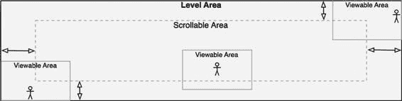

图 3-3 关卡区域与可滚动区域的关系。箭头描绘了可滚动区域的内缩范围。请注意，当靠近关卡边界时，玩家并不固定在其中心位置。该示意图未按比例绘制。


#### 视差滚动

`MIN`宏会返回`viewPos`或`levelSize 减去 viewSize`这两个值中较小的那个，并将结果传递给外层的`MAX`宏，该宏进而确保`viewPos`始终大于或等于 0.0。两者共同作用，防止`_levelNode`滚动超出其边界。

最后，系统会对`viewPos`取反（乘以–1.0），然后将其赋值给`_levelNode.positionInPoints`。还记得我之前提到的关于朝相反方向移动关卡节点的内容吗？这一行代码实现的就是这个功能。例如，如果计算出的`viewPos`为 850,340，那么`ccpNeg`方法会将坐标更改为–850,–340，从而使`_levelNode`的移动方向与玩家前进方向相反。

发布 SpriteBuilder 项目，然后构建并运行 Xcode 项目。现在，你可以在关卡区域内滚动，但无法超出该区域。

如果你无法清晰感受到滚动效果，可以返回 SpriteBuilder，更改`Level1.ccb`颜色渐变节点的 Vector 属性，使其渐变方向倾斜。或者，直接根据你的需要向`Level1.ccb`添加更多 Color Node 或 Gradient Node 实例，这样在移动玩家时就能看到一些视觉元素随之滚动。然后重新发布并运行该项目。

#### 视差滚动

既然你已经在享受滚动的乐趣，为什么不通过视差背景层让效果更出色呢？

视差是一种在 2D 游戏中营造深度感的方法，其原理是让背景层的移动速度慢于实际游戏层。有些游戏甚至会添加移动速度更快的前景层，以营造出某些物体比游戏角色更靠近摄像机的效果。

实现视差滚动有多种方式，最简单的是根据每层特定的速度系数，让各层以不同速度移动。但这种方法存在缺陷：你永远无法确切知道每层需要多大尺寸，也难以判断当玩家到达关卡中某个特定点时，哪些背景层的哪些部分会可见。

我在本书中采用的视差方法，是根据每个背景层尺寸与关卡尺寸的比例，推导出每层的滚动速度系数。这样一来，背景层也能与关卡边界完美对齐。如果玩家位于关卡的最左侧角落，背景层的左下角将与关卡的左下角对齐。其他三个角落同理。背景层既不会“超出”，也不会“过短”，其滚动速度完全取决于它们相对于关卡节点内容尺寸的内容尺寸。

##### 添加背景 CCB

首先，在 SpriteBuilder 的资源导航器中，切换到文件视图标签页，然后在 Levels 文件夹中添加一个子文件夹，命名为`Parallax`。选中该文件夹，通过 File  New  File 创建一个新的 CCB 文件，如图 3-4 所示。

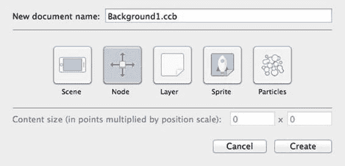

图 3-4。为背景层创建新的节点 CCB 文件

这次选择 Node 作为 CCB 类型，并将文档名称设置为`Background1.ccb`。然后点击 Create。你的文件视图应如图 3-5 所示。

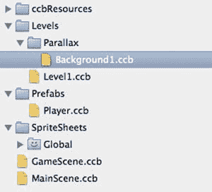

图 3-5。SpriteBuilder 中文件视图的当前状态

现在，切换到资源导航器中的节点库视图标签页，将一个 Gradient Node 拖放至舞台。你可以随意更改渐变颜色。关键部分是节点位置应设置为 0,0，并且其内容尺寸应足够大，以填充 iPhone 和 iPad 屏幕。在撰写本文时，这意味着渐变层的内容尺寸至少应为 568x384，才能覆盖当前所有设备的整个可视区域。图 3-6 展示了 Gradient Node 的属性。

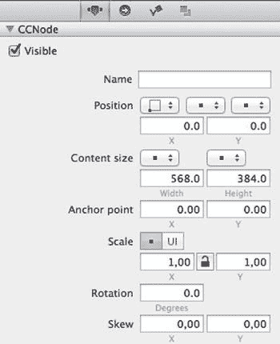

图 3-6。背景渐变节点属性

**注意** 当你创建类型为 Layer 的 CCB 时，会注意到它默认采用相同的 568x384 尺寸。568 点是 4 英寸 iPhone 的宽度，而 iPad 屏幕宽度仅为 512 点——更准确地说，SpriteBuilder 默认将 iPad 屏幕视为其点数的一半，即 512x384，而非实际的 1024x768 点。这是因为 SpriteBuilder 默认会在 iPad 上将节点位置和尺寸放大 2 倍。384 点的高度源于这样一个事实：iPad 屏幕高度为 768 点的一半后，仍略高于 320 点高的 4 英寸 iPhone 屏幕。这个略显奇怪的 568x384 内容尺寸是能适配所有 iPhone 和 iPad 屏幕尺寸的最小公倍数。它可以按 2 倍和 4 倍的比例缩放，以匹配 iPhone Retina、iPad 和 iPad Retina 分辨率——虽不完美，但已足够接近。

至于渐变颜色，如果你确实想让它们与本书图形所用的颜色完全相同，请点击“Start color”属性旁边的颜色矩形。这将打开 OS X 颜色选择对话框。在 Color Palettes 选项卡（浮动色轮对话框中的第三个选项卡）中，将 Palettes 下拉菜单设置为 Web Safe Colors。然后选择旁边带有`FFCC33`代码的橙黄色。对 End Color 执行相同操作，但选择颜色代码为`FF6699`的粉红色。

请注意，你也可以使用带有渐变图像的精灵；然而，如果除了渐变本身之外不需要更多细节，那么 Gradient Node 可能更快，而且消耗的内存肯定少得多。

##### 添加主背景精灵

本书可下载存档中还提供了一个名为`level1_background_Cerberus.png`的背景精灵。图 3-7 描绘了该图像。它将绘制在渐变之上，并且尺寸略大于渐变。背景层或图像越大，玩家在关卡中移动时其视差效果就越快。与之前一样，如果你愿意，也可以提供自己创作的图像，只要图像尺寸匹配即可。


图 3-7。Cerberus 背景图像

说到图像尺寸。由于 SpriteBuilder 默认所有图像均按 iPad Retina 分辨率设计，因此图像必须相应巨大：2375x1625 像素。SpriteBuilder 将自动为非 Retina iPad 和 Retina iPhone（1188x813 像素）以及非 Retina iPhone（594x406 像素）创建缩小版本的图像。如你所见，当缩小到非 Retina iPhone 的点尺寸时，该图像仅略大于 4 英寸 iPhone 的 568x320 点尺寸。

**提示** 这个图像的尺寸并不理想，不适合进行缩小处理，因为除以 2 或 4 时会出现像 1187.5 x 812.5 这样的小数尺寸。图像中不能存在小数像素，因此图像尺寸会四舍五入到最接近的整数值。对于像这样的巨大背景图像来说，这没什么影响，但对于较小的图像而言，选择一个能被 4 整除且没有余数的 iPad Retina 图像尺寸就很重要了。否则，在应用使用缩小版本图像的设备上，由于图像宽高比的微小差异，可能会出现瑕疵。

在添加 Cerberus 图像之前，请在文件视图中创建一个名为`Sprites`的文件夹，并在其中创建一个名为`Level1`的子文件夹。你将在此处存储该特定关卡的图像，这些图像不应置于 SpriteSheet 中。为何不应放入 SpriteSheet？原因很简单：因为该图像太大，放入 SpriteSheet 并无益处，而且它在一个关卡中只会被用到一次。它会占用过多空间，使其他会被多次使用的图像几乎没有空间存放。


现在从 Finder 中将 `level1_background_Cerberus.png` 文件拖放到 `Sprites/Level1/` 文件夹中。然后从文件视图将其拖放到 `Background1.ccb` 舞台上。将 Cerberus 精灵（sprite）的位置改为 `0,0`。由于精灵的锚点（anchor point）默认为 `0.5, 0.5`，精灵会居中于背景层的左下角，这不是你需要的，因此将锚点属性改为 `0,0`。现在 Cerberus 精灵应该位于渐变图层上方，并且比它略大。

##### 处理图像

仅靠背景渐变和精灵（sprite）图层还不足以看到视差（parallaxing）效果，但我想先深入探讨一下图像与项目设置，因为在添加更多图像之前，熟悉可用的选项非常重要。如果使用得当，你可以轻松提升性能或减小应用的 bundle 大小，并且你可能已经对这些图像设置的功能感到好奇了。

在文件视图中选中 `level1_background_Cerberus.png` 图像。在文件视图上方，你会看到预览区域，显示图像的缩略图以及额外设置，如图 3-8 所示。

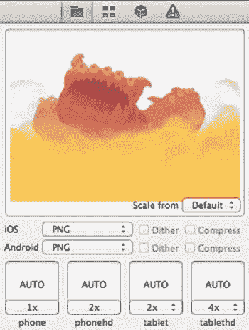

图 3-8. 图像预览及设置

如果出于某种原因，你只有适用于 iPhone Retina 和非 Retina iPad 的 2x 缩放比例版本图像，你可以将“缩放来源（Scale from）”设置从“默认（Default）”改为“2x”。这并不会节省内存；相反，SpriteBuilder 会从 2x 图像中创建出按比例缩小的 1x 版本和放大的 4x 版本。这意味着 4x 图像拥有与原始 2x 版本相同的细节水平。更改“缩放来源（Scale from）”设置也会反映在使用该图像的舞台中，如果你将“缩放来源（Scale from）”分别从 2x 改为 1x，图像在舞台上会变得两倍或四倍大。

你还可以将图像拖放到 图 3-8 中标记为 `AUTO` 的四个方块之一。这会用你拖放的图像替换特定缩放比例下的图像，例如，iPad Retina（`tablethd`）会显示一个不同的图像，或者只是同一图像的按比例缩放的版本。一个很好的例子是标题画面，当应用在 iPad 上启动时，会额外显示“HD”标注。

强烈建议你为应用支持的最高分辨率创建所有图像。尽管 SpriteBuilder 提供了完全的自由度，但最终归结为两种选择：如果你希望应用在所有 iPad 型号上运行，则以 568x384 点分辨率 4x 比例创建所有图像；如果你的应用仅针对 iPhone 尺寸设备设计，并且不作为原生 iPad 应用在 iPad 上运行，则以 iPhone 点分辨率 568x320 的 2x 比例创建图像。

例如，一个填满 iPad Retina 屏幕（SpriteBuilder 中默认为 4x 比例）的背景图像，其像素至少应为 2048x1536，而 2272x1536 像素则更佳，因为当按 2 倍和 4 倍系数缩小时，它还能覆盖整个 4 英寸 iPhone 屏幕。如果你的应用仅为 iPhone 设计（在 SpriteBuilder 中所有图像使用 2x 比例），一个填满整个 Retina 屏幕的背景图像必须是 1136x640 像素（568x320 点）。但如果你希望以后能选择制作 iPad 版本，无论如何你都应该为 iPad Retina 分辨率设计图像。

**提示** 尽管 SpriteBuilder 让你完全掌控缩放设置，但说到“摆弄”这些设置，我还是带着一丝无奈。你看，SpriteBuilder 提供了明确的 1x、2x、4x 缩放比例，分别对应 iPhone、iPhone Retina、iPad 和 iPad Retina 设备，这使得为 iOS 开发变得异常简单。如果你偏离这条路，你将需要大量额外的编码和测试工作。请不要这样做！

但老实说，iPad Retina 图像大得惊人。它们会显著增大你的 bundle 大小，这显然不是你想要的。相反，你应该尝试第 2 章的图 2-25 中所示的导出格式和压缩（Compress）设置。即使是 16 位色深，对于大多数图像来说质量仍然不错，但它能将内存使用和文件大小减少高达 50%。`PVRTC` 更进一步，但以牺牲图像质量为代价。如果这还不够，请阅读下一节“项目设置（Project Settings）”，了解减少应用大小的更多选项。

现在还有第三种选择，那就是在通用的 iPhone 加 iPad 应用中，对大多数（如果不是全部）游戏元素使用 2x 分辨率图像，并将相关节点的缩放类型改为 UI 点。这将得到一个 iPad 版本，其中世界的可见区域大约是 iPhone 设备上的两倍，世界看起来像是缩放了（游戏对象显得更小）。当然，你的游戏设计需要考虑到这一点；它必须在两种设备上都公平且可玩——尤其是要考虑到多人游戏中的不公平优势以及悬殊的难度差异。很少有游戏采用这种方法，原因也很充分——它会极大地改变 iPhone 和 iPad 版本之间的游戏体验。

##### 项目设置（Project Settings）

如果你正在开发一个仅限 iPhone 的应用，SpriteBuilder 允许你将默认缩放比例从 4x 进行调整，并更改要发布的资源。打开文件  -> 项目设置（Project Settings）对话框，如图 3-9 所示。

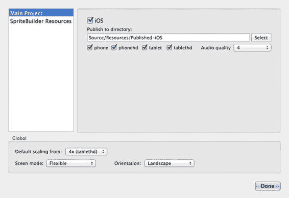

图 3-9. 项目设置对话框

如果你的应用不应在 iPad 设备上原生运行，或者你希望 iPad 版本显示比例上更大的游戏世界区域，你可以将“默认缩放来源（Default scaling from）”设置改为 `2x (phonehd)`。请注意，默认缩放比例的更改不会应用于现有图像，仅适用于此后添加到 SpriteBuilder 的新图像。对于我们的项目，请将此设置保留为 `4x (tablethd)`。

**警告** Apple 要求应用开发者支持 Retina 分辨率。据报告，有应用因在 Retina 设备上未使用 Retina 尺寸图像而导致看起来“模糊”而被拒绝，尽管 Apple 对游戏似乎不那么严格。不过，我强烈建议不要对任何图像使用 `Scale from` 设置为 `1x`，因为它在 iPad Retina 设备上会显得明显质量低下。唯一的例外是如果你在设计像素艺术游戏。

之后，如果你发现应用下载大小增长得太多，可以考虑根据需要取消勾选一个或多个发布目标复选框（`phone`、`phonehd`、`tablet` 或 `tablethd`），以减少 bundle 的大小。以下是各 iOS 设备将从哪个类别加载资源的快速概览：

*   ***`phone`***：仅由 iPhone 3GS 使用
*   ***`phonehd`***：由 iPhone 4 及更新 iPhone 使用
*   ***`tablet`***：由非 Retina iPad 使用：iPad 1 和 2，第一代 iPad mini
*   ***`tablethd`***：由第三代 iPad、第二代 iPad mini 及更新 iPad 使用

如果你的最低部署目标是 iOS 7 或更新版本，请务必取消勾选 `phone`。除了 iPhone 3GS 之外，没有其他非 Retina iPhone 设备受 Cocos2D 支持，而 3GS 支持的最高操作系统是 iOS 6。如果你的应用仅适用于 iPad，请同时取消勾选 `phone` 和 `phonehd` 复选框。同样，如果你的应用仅适用于 iPhone，则应取消勾选 `tablet` 和 `tablethd` 复选框。取消勾选不需要的发布目标可以显著减小应用的下载大小。

**注意** SpriteBuilder 应用将无法在初代 iPhone、iPhone 3G 以及相应的 iPod touch 型号（第一代和第三代，以及拥有 8 GB 闪存的第三代）上运行。

至于其他选项，为了本书的项目，请保持默认设置不变，我将快速介绍一些更不常见的选项：


###### 音频质量
- **音频质量**：这会影响发布音频文件的大小和质量。对应用大小的影响因音频文件而异。质量等级 1 会生成最小的文件，但音频质量也较低。

###### 屏幕模式
- 如果将**屏幕模式**设置更改为`Fixed`，则会禁用`SpriteBuilder`的缩放功能，使其无法适配`CCB`至设备分辨率。其主要使用场景是：当你的游戏仅针对 iPhone，并且你想将 3.5 英寸和 4 英寸的 iPhone 视为基本相同设备时，宽屏 iPhone 仅略宽一些（88 点）。在这种情况下，使用固定模式可能会稍微容易一些，但通常不推荐这样做，因为它会使屏幕布局更加困难。

###### 方向
- 最后，**方向**设置应该是自解释的。当你的游戏设计为竖屏模式运行时，请更改此项设置。本书的项目使用横屏方向。

##### 添加额外的背景层

回到视差层。显然，你需要不止一个图层才能获得所需的景深效果。此外，将每个视差层仅由一张图组成（例如刻耳柏洛斯精灵）并不是一个好主意。一个图层看起来离观察者越近，其尺寸就需要越大。这会浪费纹理内存，并且最终会达到纹理无法正常工作的临界点：一个纹理最大只能是 4096x4096 像素。这是一个硬件限制。

相反，你应该由多个独立的节点（主要是精灵）来构成这样的大图层。为了同时滚动多个精灵，你需要将它们添加到同一个图层中，这里的“图层”指的是一个充当这些精灵容器的常规节点。

**注意** 如果你之前使用过`Cocos2D`，每当我提到“图层”时，你可能会联想到“`CCLayer`”。但现在已经没有专门的`Layer`节点了。`CCLayer`类本身从来就只不过是一个增加了处理用户输入能力的普通`CCNode`。现在，用户输入功能位于`CCResponder`类中，所有节点类（包括`CCNode`）都继承自该类。这意味着，在以前使用`CCLayer`的地方，你现在只需使用`CCNode`。

从节点库中拖放三个额外的`Node`实例到舞台上。你可能希望在时间线视图中重命名这些节点（双击节点以编辑其名称），如图 3-10 所示。

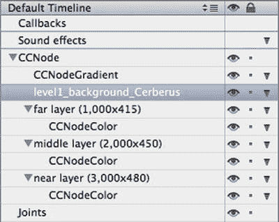

图 3-10. `Background1.ccb` 中的初始层节点

现在选择这三个节点中的每一个，并确保它们的位置设置为`0, 0`。由于目标是基于每个视差层的大小来推导视差滚动因子，请将每个节点的“内容尺寸”属性设置为一个大于或等于`568x384`但小于或等于关卡尺寸（`4000x500` 点）的值。每个节点的“内容尺寸”应大于时间线中其上方的节点。如果这让你感到困惑，只需复制图 3-10 中的内容尺寸值，我将各层的尺寸分别设置为`1000x415`、`2000x450` 和 `3000x480`。

**提示** 你也可以创建一个类型为`Node`的`CCB`文件，并将其用作视差层。我将它们添加到同一个`CCB`中，主要是因为它们是静态内容，不会在其他背景中重复使用，而且这样更容易看到每个层的相对尺寸。

当你选择每个层节点时，其选区矩形将显示背景层的大小。添加到层中的节点必须位于该区域内才能在游戏中看到。但是，一旦你选择另一个节点，选区矩形就会消失。为了在向层添加节点时能够持续直观地看到层的尺寸，你应该将一个颜色节点拖放到时间线中的每个层节点上。每个颜色节点都应该是其所在层节点的子节点。如果拖放后颜色节点没有成为该层的子节点，只需在时间线视图中将其拖拽并放到一个层节点上即可。结果应类似于图 3-10 所示。

按顺序对每个颜色节点执行以下步骤：

1.  将内容尺寸类型设置为“`% .. 相对于父容器的百分比`”（宽度和高度都设置）。
2.  将内容尺寸的宽度和高度设置为`100%`，使颜色节点扩展到其父层的大小。
3.  将颜色节点的不透明度属性设置为较低的值（如`0.1`），以便更好地看到其背后其他层的节点。
4.  将颜色属性更改为你选择的颜色。

图 3-11 显示了一个颜色节点的项目属性；其属性代表了所有三个颜色节点。

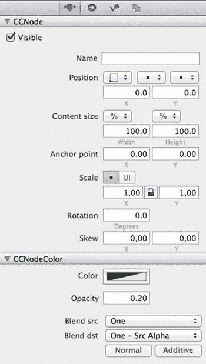

图 3-11. 颜色节点的属性，直观地高亮显示了每个层的尺寸

当你对所有三个颜色节点实例完成了这些更改后，结果将看起来像一个彩色、多层的图像，如图 3-12 所示。

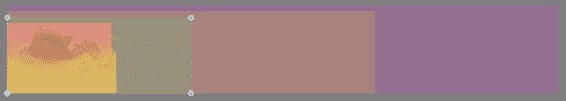

图 3-12. 使用颜色节点高亮显示的背景层

颜色节点将成为每个层永久性的可视尺寸指示器。通过取消选中它们的可见复选框（参见图 3-11），你之后可以在`SpriteBuilder`和应用程序中隐藏这些辅助节点。你可以将这些颜色节点留在`CCB`中，因为它们的显存消耗可以忽略不计，并且不可见的节点也不会影响渲染性能。

##### 为背景图形添加精灵表

此时，你应该添加本书提供的背景图片。你也可以添加自己背景图片。过程类似，但我将以本书的图形为例。

在书籍的可下载归档文件中，在`Graphics`文件夹内，你会在相应命名的文件夹`Level1a`和`Level1b`中找到名称以`level1_`开头的 PNG 图像文件。将这些文件夹拖放到`SpriteSheets`文件夹中，将它们包含的图像添加到项目中。

然后，通过依次右键单击`Level1a`和`Level1b`文件夹，并从上下文菜单中选择*制作智能精灵表*，将它们转换为`SpriteSheet`。该文件夹将变为粉色并带有一个笑脸图标，就像`Global SpriteSheet`一样。选择每个`SpriteSheet`文件夹，将导出格式更改为`PVR RGBA8888`，并为 iOS 选中`压缩`复选框，如第 2 章中的图 2-25 所示。这样做可以节省内存、提高性能，且无需任何成本。

**注意** 在撰写本文时，`SpriteSheet`文件夹内不得包含子文件夹。

在完成这些更改并发布项目后，你的文件视图和预览应如图 3-13 所示。

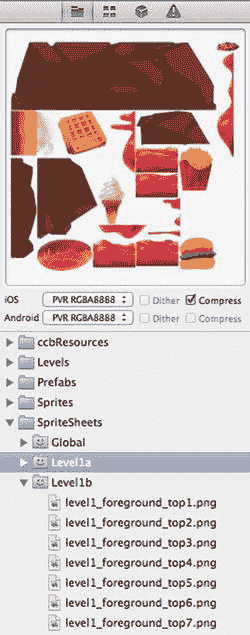

图 3-13. 包含 `Level1` 图形的 `SpriteSheet`

**注意** 之所以有两个`SpriteSheet`，是因为这些图片太大，无法放入单个`SpriteSheet`中。对于`tablethd`缩放后的图像，一个`SpriteSheet`的尺寸不得超过纹理尺寸限制`4096x4096`像素。

##### 设计背景层

现在，你可以将这些图像作为精灵添加到`Background1.ccb`的层中。你可以直接从`SpriteSheet`或从无网格编辑器视图中将图像拖放到舞台上。

**提示** 我建议首先将每个图像的一个副本放置在所需的层中，可以选择在时间线中重命名它们，并编辑任何共享属性，如不透明度或缩放比例。然后你可以选择其中一个模板精灵，并使用复制和粘贴来添加更多相同类型且使用相同名称的精灵。这种工作流程的优点是节点的副本会自动共享相同的父节点；它们会成为兄弟节点。这免去了你不小心将图像添加到根节点或错误层的麻烦。此外，由于每个副本都继承了源精灵的名称，它们很容易被识别。


我无法精确描述如何排列这些图像——请自由发挥创意。如果你没有任何可用的图片，可以直接使用`颜色节点`和`渐变节点`实例作为真实图片的占位符。最终的时间轴可能类似于图 3-14。

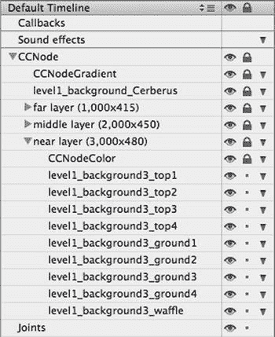

图 3-14. 包含精灵的`Background1.ccb`视差图层时间轴

**提示** 为避免意外移动或编辑图层及其包含的节点，您可以点击时间轴中的“锁定”列，使节点名称右侧出现锁定符号。当锁定激活时，节点的所有属性将不可编辑，所有“项目属性”字段将变灰，被锁定节点的子节点也同样如此。

为便于进一步编辑，点击锁定列左侧的“眼睛”列，可隐藏节点及其子节点。与`项目属性`面板中节点的`可见`属性复选框不同，“眼睛”列可用于在`SpriteBuilder`中隐藏节点。当您发布并运行应用时，没有眼睛符号的节点在应用中仍将可见。

无论您使用自己的图片、随书提供的图片，还是仅使用颜色节点，请牢记这一点：在每个图层中添加几个可见节点，并将其定位，使其至少部分位于每个图层的范围内（如您在上一步骤中添加的颜色节点所可视化呈现的那样）。否则，您将无法欣赏到视差效果。

您背景图层编辑操作的结果可能类似于图 3-15 所示。

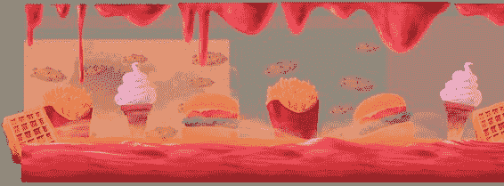

图 3-15. 向视差图层添加图形后的`Background1.ccb`内容

在开始编程实现视差滚动之前，请在`SpriteBuilder`中打开`Level1.ccb`。

此时，您应删除`Level1.ccb`中在测试滚动时可能添加的任何多余节点。同时，删除原有的背景渐变节点，因为它现在已成为`Background1.ccb`的一部分。要删除节点，请选中它，然后使用`编辑``删除`或按下`退格键`。您最终应得到一个仅包含玩家节点的空白场景。如果不小心删除了玩家，只需再次从`无图块编辑器视图`中将其拖放到场景中。

切换到`无图块编辑器视图`。列表中应有一个标记为“*视差*”的部分，其中包含`Background1.ccb`的预览图像。为简洁起见，我在图 3-16 中取消选中了当前不需要的所有`过滤器`文件夹。

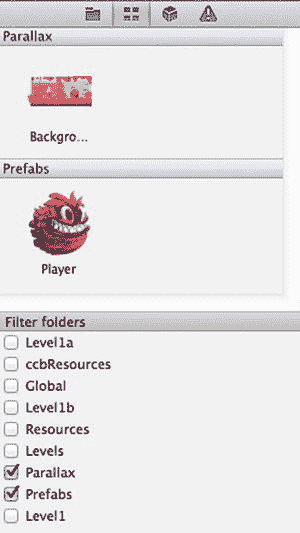

图 3-16. `无图块编辑器视图`显示`Background1.CCB`的预览图像

现在，您可以将`Background1`从`无图块编辑器视图`拖放到`Level1`场景中，创建一个引用`Background1.ccb`的`子文件`节点。然后将其位置改为`0,0`，使其与场景边框完美对齐。请确保将其`名称`属性设置为`"background"`，因为您很快将添加代码以通过此名称获取对节点的引用。`名称`属性位于`详细检查器`的`项目属性`选项卡中。在时间轴中更改节点的名称将*不会*使其通过名称在代码中可访问。

哦，嘿！玩家不见了。嗯……它现在大概在背景后面了。

在时间轴中选择玩家节点，然后拖放，使其位于时间轴层级中背景节点下方。确保它不会成为背景的子节点；它应与背景处于同一层级。图 3-17 展示了`Level1`时间轴当前应呈现的样子，其中背景节点位于玩家节点上方。

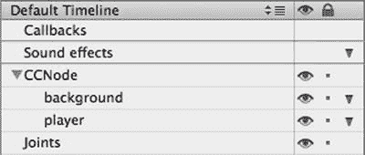

图 3-17. 当前阶段的`Level1.ccb`时间轴

您现在可以发布、构建并运行，查看新的背景。请注意，目前还没有视差效果，当您从左向右移动时，背景图层似乎会逐一消失。

**警告** 如果您此时注意到游戏在 iOS 模拟器中运行缓慢，无需担心。iOS 模拟器在渲染图形时非常慢——它是一个软件渲染器，完全不使用您 Mac 强大的图形硬件！苹果为了确保 iOS 模拟器的输出与您在设备上看到的效果完全一致，牺牲了性能。如果您想验证应用的性能，**务必**在设备上运行应用进行测试。

内存使用也是如此——iOS 模拟器可以利用 Mac 上所有可用的空闲内存，因此在 iOS 模拟器中几乎不会遇到内存不足的情况。另一方面，iOS 设备最多只有 1 GB 的 RAM，其中只有一小部分可供应用使用。您越早、越频繁地在实际设备上开始测试，效果就越好。

顺便提一下，要知道 iPhone 4 的性能明显落后于所有其他设备，包括其前辈 iPhone 3GS。iPhone 4 因其视网膜屏幕需要渲染四倍的像素，但其技术规格显示，与 iPhone 3GS 相比，CPU 和 GPU 仅快约 33%。

准备视差效果，3，2，1……

要让背景图层实现视差效果，需要一些设置步骤。首先要做的是引入一个物理节点，然后将玩家节点改为物理节点的子节点。此后，物理节点将成为关卡的内容容器，而非`Level1.ccb`本身。

**注意** 我将在下一章解释物理节点的用途。从技术上讲，您暂时可以使用任何其他节点类型，但下一章将需要物理节点。由于在`SpriteBuilder`中当前无法将节点替换为不同类型的节点，因此立即使用物理节点是合理的。

将玩家（及其他游戏对象）添加为另一个节点的子节点的主要原因，是为了能够独立于视差背景移动关卡内容。如果您继续使用`Level1.ccb`根节点作为玩家父节点，那么对玩家父节点位置所做的更改将影响所有`Level1.ccb`的子节点，包括背景。这将使背景滚动代码更复杂、更难理解，并且难以向关卡添加固定节点（例如游戏内的暂停按钮）。

从`节点库视图`中，将一个物理节点拖放到`Level1.ccb`场景中。将其位置设置为`0,0`，并将其`名称`属性改为`"physics"`（这是为下一章准备的）。在时间轴视图中，拖放玩家节点，使其成为`CCPhysicsNode`的子节点，如图 3-18 所示，方法是将它精确地拖放到`CCPhysicsNode`上。

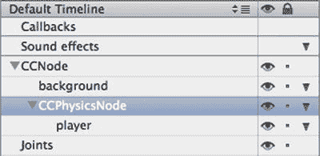

图 3-18. 玩家节点现在是`CCPhysicsNode`的子节点

**注意** 您可能已经注意到，无法将玩家节点拖放到背景节点上。这是因为背景节点是一个`子文件`（`CCBFile`）节点，它不接受子节点。还有其他一些节点不能拥有子节点：`粒子系统`、`标签 TTF`、`标签 BM-Font`、`按钮`、`文本字段`、`滑块`和`滚动视图`。这种限制适用于那些创建或管理其节点层级分支的节点。例如，按钮实际上包含一个精灵节点和一个标签节点作为子节点，而`滚动视图`和`子文件`节点则“继承”CCB 文件的节点，即使这些节点在时间轴中不可见。


现在，你需要将 `CCPhysicsNode` 引用赋值给 `_physicsNode` 实例变量，以使滚动代码与新引入的物理节点协同工作。由于 `getChildByName:` 返回的是 `CCNode` 类的引用，如果返回的节点属于其他类，则必须对节点进行强制类型转换。请在 `GameScene.m` 的 `loadLevelNamed:` 方法顶部添加以下代码：

```
_physicsNode = (CCPhysicsNode*)[self getChildByName:@"physics" recursively:YES];
```

请注意，像这样将一个对象引用强制转换为另一个类永远不会产生编译错误。但这并不意味着它总是正确的。在运行时，如果特定对象被强制转换为它不属于的类，则向此对象发送消息很容易因“无法识别的选择器发送到实例”或其他错误而导致崩溃。只有在绝对确定对象属于某个给定类时，才使用强制类型转换。如果在编译时无法确定，通常的做法是在执行强制类型转换之前，使用 `isKindOfClass:` 方法验证类的成员身份，如下列代码所示：

```
CCNode* node = [self getChildByName:@"physics" recursively:YES];
if ([node isKindeOfClass:[CCPhysicsNode class]])
{
    _physicsNode = (CCPhysicsNode*)node;
}
```

与此同时，请在 `loadLevelNamed:` 方法中添加以下行来赋值 `_backgroundNode` 引用：

```
backgroundNode = [self getChildByName:@"background" recursively:YES];
```

总结一下，你的 `loadLevelNamed:` 方法应该类似于**列表 3-9** 中的代码，不包括任何注释和错误检查代码。

***列表 3-9***. 在 `loadLevelNamed` 中分配物理节点、背景节点和玩家节点

```
-(void) loadLevelNamed:(NSString*)levelCCB
{
    _physicsNode = (CCPhysicsNode*)[self getChildByName:@"physics" recursively:YES];
    _backgroundNode = [self getChildByName:@"background" recursively:YES];
    _playerNode = [self getChildByName:@"player" recursively:YES];
}
```

你可以选择性地添加诸如 `NSAssert(_physicsNode);` 之类的语句，以验证这些节点确实已被找到并赋值。如果它们未被找到且返回了 `nil`，则说明你忘记将它们添加到关卡中，或者命名有误。在使用 SpriteBuilder 时，这两个问题都是常见的（人为）错误来源，因此使用 `NSAssert` 来验证引用是合理的。

**提示** 如果你想了解更多关于断言、断点和解决问题的通用方法，请参考本书末尾的调试章节。学会正确调试问题是完全值得投入时间的，因为它能迅速提高生产力，这远比为某个看似无法解释的问题而苦恼好得多。关于这一点，我在此保证不再唠叨，但请务必为自己考虑一下，去查阅相关内容。

观察**列表 3-9**，当你知道背景节点和物理节点是 `_levelNode` 的子节点，而玩家是物理节点的子节点时，从 `self` 开始搜索整个节点层次结构就显得有些多余了。一个稍微改进（但完全可选）的版本如**列表 3-10** 所示。

***列表 3-10***. 此版本的 `loadLevelNamed:` 避免了不必要的递归搜索

```
-(void) loadLevelNamed:(NSString*)levelCCB
{
    _physicsNode = (CCPhysicsNode*)[_levelNode getChildByName:@"physics" recursively:NO];
    _backgroundNode = [_levelNode getChildByName:@"background" recursively:NO];
    _playerNode = [_physicsNode getChildByName:@"player" recursively:YES];
}
```

请注意，在**列表 3-10** 中，首先获取 `_physicsNode` 的引用至关重要，因为它被用来搜索玩家节点，所以必须在此时完成赋值。**列表 3-10** 中的版本也没有对 `_physicsNode` 和 `_backgroundNode` 使用递归搜索，因为它们始终应该是 `_levelNode` 的直接子节点。

现在，在 `scrollToTarget:` 方法中，你需要找到最后一行：

```
_levelNode.positionInPoints = ccpNeg(viewPos);
```

将其替换为**列表 3-11** 中的行，以便将位置更新从 `_levelNode` 重新路由到 `_physicsNode`。

***列表 3-11***. 在 `scrollToTarget` 中将 `_levelNode` 替换为 `_physicsNode`

```
_physicsNode.positionInPoints = ccpNeg(viewPos);
```

这将解耦 `_backgroundNode` 的位置，使其可以独立于 `_physicsNode` 的位置进行更新，而 `_levelNode` 的位置现在将保持在 (0,0) 不变。如果你现在发布、构建并运行，会发现背景层保持固定。

要可视化当前布局，请查看**图 3-19**。这是通过调用 `[CCBReader loadAsScene:@"GameScene"]` 返回的节点层次结构。方括号内是某些节点内容来源的 CCB 文件。请注意，`GameScene`，尽管名称如此，但它是常规的 `CCNode` 子类，而不是 `CCScene` 的子类。

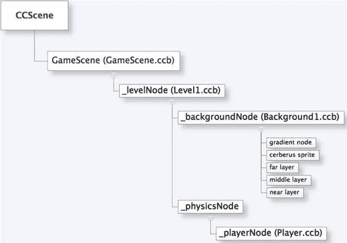

**图 3-19**. 游戏当前状态的节点层次结构

**提示** 你可以在代码中的任何位置编写 `[self walkSceneGraph:0]`，将整个节点层次结构的当前状态转储到控制台。如果你怀疑某个节点可能不在节点层次结构中的正确位置，这会很有用。另请注意，*场景图* 可与 *节点层次结构* 互换使用。

在让背景层再次滚动之前，让我们回顾一下 `scrollToTarget:` 方法中的代码。**列表 3-12** 包含了**列表 3-11** 中所做的更改。

***列表 3-12***. 将位置赋值给 `_physicsNode` 的 `scrollToTarget:` 版本

```
-(void) scrollToTarget:(CCNode*)target
{
    CGSize viewSize = [CCDirector sharedDirector].viewSize;
    CGPoint viewCenter = CGPointMake(viewSize.width / 2.0, viewSize.height / 2.0);

    CGPoint viewPos = ccpSub(target.positionInPoints, viewCenter);

    CGSize levelSize = _levelNode.contentSizeInPoints;
    viewPos.x = MAX(0.0, MIN(viewPos.x, levelSize.width - viewSize.width));
    viewPos.y = MAX(0.0, MIN(viewPos.y, levelSize.height - viewSize.height));

    _physicsNode.positionInPoints = ccpNeg(viewPos);

    // 视差滚动代码将添加在此处 ...
}
```

上述代码执行以下操作：

*   将 `viewPos` 赋值为 `target.positionInPoints` 偏移 `viewCenter` 后的值
*   对 `viewPos` 进行钳制，使滚动在由 `viewCenter` 缩进的关卡边界处停止
*   将取反后的 `viewPos` 赋值给 `_physicsNode`

你需要想办法在每次 `_physicsNode` 的位置更新后，为每个背景层派生出一个视差位置。

理解缩进部分对于理解接下来的视差滚动代码至关重要。由于你希望每个图层的位置都相对于 `_physicsNode` 的位置（在此方法中也称为 `viewPos`），因此必须考虑到 `viewPos`（视图的中心）应与关卡边界保持一定距离。这个最小距离在水平方向必须至少为 `viewCenter.width`，在垂直方向至少为 `viewCenter.height`，以防止可视区域显示关卡边界之外的区域（即空白区域）。


图 3-3 有助于理解这一点：你可以想象`viewPos`位于每个可视区域的中心。实际的可滚动区域矩形（即`viewPos`的允许位置）必须比关卡区域的左侧和底部更大，且比关卡区域的顶部和右侧更小。这个尺寸较小的可滚动区域矩形被称为较大关卡区域矩形的内嵌区域。

因此，每个背景层的相对位置不能相对于关卡完整尺寸（4000 x 500 点）来计算。相反，在计算视差因子时，必须只考虑可滚动区域。如果你对此理解有困难，请再看一下图 3-3 中的示意图。

举个例子：在 iPhone 5 上，`viewCenter` 为 284x160。因此，可滚动区域的范围如下：

```
284x160 到 4000 – 284 x 500 – 160 = 3716x340 点
```

换句话说，可滚动区域的大小等于关卡尺寸减去视图尺寸。因此，将`viewPos`除以可滚动区域（`levelSize`减去`viewSize`），就能得到`_physicsNode`在当前可滚动区域中所处位置的百分比：

```
CGPoint viewPosPercent = CGPointMake(viewPos.x / (levelSize.width - viewSize.width),
                                     viewPos.y / (levelSize.height - viewSize.height));
```

现在你得到了`_physicsNode`在 0.0 到 1.0 范围内的位置，其中 *0,0* 表示可滚动区域左下角位置 284x160，*1,1* 表示右上角位置 3716x340。接下来，你需要将这个百分比应用于每个图层，并考虑图层自身的尺寸。

请尝试在脑中或在纸上计算代码清单 3-13 中的公式，使用 568x384 作为`layerSize`的宽高，568x320 作为`viewSize`的宽高，然后告诉我当`viewPosPercent`为 0.5, 0.5 时，`layerPos`的取值是多少。

***代码清单 3-13***。计算图层相对于`viewPosPercent`的位置

```
for (CCNode* layer in _backgroundNode.children)
{
    CGSize layerSize = layer.contentSizeInPoints;
    CGPoint layerPos = CGPointMake(viewPosPercent.x * (layerSize.width - viewSize.width),
                                   viewPosPercent.y * (layerSize.height - viewSize.height));
}
```

如果你和我都没有算错，你应该会发现当`layerSize`和`viewSize`相同时，结果为 0。而 0 乘以任何数仍是 0。因此，在 x 轴上你得到的`layerPos.x`为 0，而`layerPos.y`的计算结果如下：

```
0.5 * (384 – 320) = 32 点
```

用语言描述：该图层可以在 64 点的范围内垂直移动，其当前 Y 位置偏移了 32 点。

计算出`layerPos`后，需像处理`viewPos`一样对其取反，然后赋值给图层：

```
layer.positionInPoints = ccpNeg(layerPos);
```

请务必使用`positionInPoints`，以便在需要时将位置从点正确转换到其他位置类型。为了将所有内容放在上下文中，代码清单 3-14 再次展示了完整的`scrollToTarget:`更新方法。

***代码清单 3-14***。带视差滚动的滚动方法

```
-(void) scrollToTarget:(CCNode*)target
{
    CGSize viewSize = [CCDirector sharedDirector].viewSize;
    CGPoint viewCenter = CGPointMake(viewSize.width / 2.0, viewSize.height / 2.0);

    CGPoint viewPos = ccpSub(target.positionInPoints, viewCenter);

    CGSize levelSize = _levelNode.contentSizeInPoints;
    viewPos.x = MAX(0.0, MIN(viewPos.x, levelSize.width - viewSize.width));
    viewPos.y = MAX(0.0, MIN(viewPos.y, levelSize.height - viewSize.height));

    _physicsNode.positionInPoints = ccpNeg(viewPos);

    CGPoint viewPosPercent = CGPointMake(viewPos.x / (levelSize.width - viewSize.width),
                                         viewPos.y / (levelSize.height - viewSize.height));

    for (CCNode* layer in _backgroundNode.children)
    {
        CGSize layerSize = layer.contentSizeInPoints;
        CGPoint layerPos = CGPointMake(viewPosPercent.x * (layerSize.width - viewSize.width),
                                       viewPosPercent.y * (layerSize.height - viewSize.height));
        layer.positionInPoints = ccpNeg(layerPos);
    }
}
```

最后一点，还记得你在`touchBegan:withEvent:`方法中如何使用`_levelNode`将触摸位置相对于`_levelNode`进行转换吗？你需要将这里使用的`_levelNode`也替换为`_physicsNode`，如代码清单 3-15 中的代码片段所示。

***代码清单 3-15***。在`touchBegan:withEvent`中将`_levelNode`替换为`_physicsNode`

```
CGPoint pos = [touch locationInNode:_physicsNode];
```

如果你继续使用`_levelNode`，你会发现自己无法滚动超过大约半个屏幕的范围。这是因为`_levelNode`在滚动过程中不再改变其位置，而`_physicsNode`已经取代了它的角色。

发布、构建并运行。你现在可以看到背景图层像图 3-20 中那样产生视差效果。

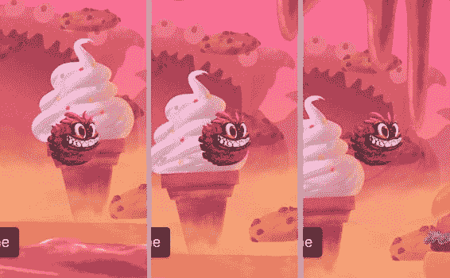

图 3-20。玩家向右上方移动时，展示了背景图层视差滚动的效果

#### 总结

在本章中，你学习了如何通过触摸和动作控制玩家，以及当玩家在关卡中移动时如何滚动关卡内容和背景图层。你还学习了许多关于图像、精灵表以及与图像转换和发布相关设置的知识。

项目的当前状态可以在 *03 - 视差滚动* 文件夹中找到。

在下一章中，你将学习更多关于`CCPhysicsNode`的知识，以及如何创建不可穿越的关卡边界，以防止玩家掉出关卡。

### 第 4 章：物理与碰撞

在本章中，你将学习更多关于使用 SpriteBuilder 编辑物理属性的方法，以及如何通过物理系统（而非动作）来控制玩家。你会添加不可穿越的物理体作为关卡边界，以防止玩家角色移动到关卡范围之外。

你还将学习如何在碰撞发生时运行代码——例如触发终止当前关卡等游戏事件——以及如何设置碰撞类别和遮罩，以允许某些物理体互相穿过。

#### 玩家物理

在上一章中，你已经向`Level1.ccb`添加了一个物理节点，并将玩家节点设置为该新物理节点的子节点。这个`CCPhysicsNode`实例充当了控制全局物理行为（尤其是重力）的物理世界。任何需要像物理对象一样移动和交互的节点，都必须作为`CCPhysicsNode`的直接子节点或子孙节点。

让我们立即尝试为玩家启用物理功能。

##### 为玩家精灵启用物理

首先尝试以下操作：打开`Level1.ccb`，选择玩家，并尝试切换到“项目物理”选项卡——即右侧细节检查器的第三个选项卡。你会注意到它是灰色的——无法选中。子文件节点通常都是这种情况：它们不支持物理功能。

相反，请打开“Prefabs”文件夹中的`Player.ccb`，并选择`CCSprite`根节点。现在你可以切换到“项目物理”选项卡，并勾选“启用物理”复选框。在后台，当 CCB 被加载时，`CCBReader`将创建一个`CCPhysicsBody`类的实例，并将其分配给节点的`physicsBody`属性。在讨论具有物理属性的节点时，当上下文特指节点的物理属性和行为时，我会将“物理体”作为“节点”的同义词使用。


当你在玩家角色的“物理属性”标签页中时，将物理形状改为圆形，并将**圆角半径**设为 32 点。其他设置保持不变，特别是应选中**动态**选项。最终设置应与图 4-1 相同。


图 4-1. 玩家精灵的物理属性设置

现在可以开始体验乐趣了：发布、构建并运行应用。你会注意到，由于物理引擎施加的重力，玩家角色会立即开始下落。不过，你仍然可以点击屏幕，让玩家角色移动到点击位置。但你无法阻止玩家角色持续加速下落。这是怎么回事？

##### 移动与旋转动作与物理引擎冲突

在内部，即使节点正在被移动动作驱动，重力也会持续累积并增加物体的速度。最终，移动动作停止，物理引擎重新接管控制权。

这是将动作与物理引擎结合使用时产生的副作用。更准确地说，影响节点位置或旋转属性的动作不应在动态物体上使用。这些动作会覆盖物理引擎对于位置和旋转的属性，同时（至少暂时）忽略物体的速度。

在某些情况下，移动和旋转动作看似有效，但最终产生的碰撞行为可能与你预期的不符，因为动作施加的移动并未反映在节点的内部状态中，或与其发生冲突。例如，移动动作不会因为途中发生碰撞而停止；相反，它会持续将节点逐步移动穿过碰撞区域，物理引擎则会在每一帧尽力解决这种冲突，从而引发各种问题。

因此，移动启用了物理引擎的节点，应完全通过向节点施加力或使用关节来实现。静态物体是此规则的例外。你可以使用移动和旋转动作（甚至 SpriteBuilder 时间轴）来对静态物体进行动画处理，并且它们会表现出正确的物理行为。我将在第 5 章：*时间轴与触发器*中对此进行更详细的说明。

还有纯粹的可视化或功能性动作，例如改变节点颜色或运行代码块。这些动作仍然可以在具有物理体的节点上不加区分地使用。

**注意** 如果你好奇为什么移动和旋转动作不能与物理引擎结合使用，不妨想象一片随风飘动的树叶。通常，像树叶这样轻盈的物体在碰到其他物体会停止。树叶质量很低，因此不会对与之碰撞的物体施加显著的力。但是，如果你使用移动动作让树叶沿着从 A 到 B 的直线路径移动，它将能够穿过更重或不可穿透的物体。那么在这种情况下，正确的物理行为应该是什么？

树叶最终应该推倒它所撞击的墙壁吗？它应该被允许穿透物体到达预定位置吗？还是它应该停在墙壁处，但因为试图继续前进直到到达目的地（或直到动作结束）而粘在墙上？这意味着树叶可能永远无法到达目的地？

解决这个问题没有唯一正确的方法。事实上，所有可能的变通方案都是错误的。有些方案只在考虑非常有限的条件或特定期望时显得更正确，但并没有普遍可接受的解决方案。

##### 通过物理引擎移动玩家角色

由于具有动态 `physicsBody` 的启用物理引擎的节点不应执行任何移动、旋转、缩放或倾斜动作，因此你需要用合适的物理移动来替换移动动作。

触摸事件需要从触摸开始时立即执行移动动作，改为仅仅更改一个标志。如果这个标志被设置，它将导致从 `update:` 方法中调用的一个函数来向给定方向加速玩家角色。

在 `GameScene.m` 文件中，在 `@implementation` 括号内添加以下四个实例变量，如代码清单 4-1 所示。

***代码清单 4-1***。物理移动所需的额外实例变量

```
@implementation GameScene
{
    __weak CCNode* _levelNode;
    __weak CCNode* _physicsNode;
    __weak CCNode* _playerNode;
    __weak CCNode* _backgroundNode;

    CGFloat _playerNudgeRightVelocity;
    CGFloat _playerNudgeUpVelocity;
    CGFloat _playerMaxVelocity;
    BOOL _acceleratePlayer;
}
```

现在找到 `touchBegan:withEvent:` 方法，并将其内容替换如下：

```
-(void) touchBegan:(UITouch *)touch withEvent:(UIEvent *)event
{
    _acceleratePlayer = YES;
}
```

这启用了“用户当前正在触摸屏幕”模式。

当然，你还需要结束此模式。为此，你需要添加 `touchesEnded:` 和 `touchesCancelled:` 方法，如代码清单 4-2 所示。

***代码清单 4-2***。当没有活跃触摸时停止加速

```
-(void) touchEnded:(UITouch *)touch withEvent:(UIEvent *)event
{
    _acceleratePlayer = NO;
}

-(void) touchCancelled:(UITouch *)touch withEvent:(UIEvent *)event
{
    [self touchEnded:touch withEvent:event];
}
```

取消变种很少被发送——例如，当手势识别器识别出一个触摸模式时。但当它被调用时，重要的是其行为必须与 `touchEnded:` 相同，否则即使用户手指不在屏幕上，玩家角色也会卡在加速模式中。

**提示** 我没有在 `touchCancelled:` 中复制 `touchEnded:` 的功能，而是直接转发消息。在这个例子中，两种方式都是一行代码，但一般来说，避免多次编写相同代码是一种好习惯。这被称为 *DRY 原则*：不要重复自己。它是唯一最重要的编程原则，甚至比“过早优化是万恶之源”更为重要，这一点你可能不知道。过早优化可以这样描述：先让程序能运行——再让它正确——最后让它快起来。按这个顺序。但这有点离题了。如果你愿意做练习，可以在网上搜索这些短语并阅读一些顶级的文章。

现在，`update:` 方法也需要修改，只要 `_acceleratePlayer` 实例变量为 `YES`，就调用 `accelerateTarget:` 方法。这在代码清单 4-3 中显示。

***代码清单 4-3***。根据需要加速玩家节点

```
-(void) update:(CCTime)delta
{
    if (_acceleratePlayer)
    {
        [self accelerateTarget:_playerNode];
    }

    [self scrollToTarget:_playerNode];
}
```

这里，在滚动之前加速玩家非常重要，因为滚动需要玩家更新后的位置。如果你反过来操作，通常也能工作，但滚动会滞后于玩家实际位置一帧。这会导致视图跟随玩家时出现微小但可能可察觉的延迟，仿佛在玩家位置后面拖拽。

另外请注意，这两个方法都将 `_playerNode` 作为输入参数，而不是仅仅依赖方法内部可访问的 `_playerNode` 实例变量。这样做的目的是在不增加额外成本的情况下，尽可能使方法具有灵活性。设想你可能想要以同样的方式加速第二个玩家节点。你只需用不同的节点调用 `accelerateTarget:` 两次即可。或者，如果玩家已经退出关卡，但摄像机仍需继续滚动到关卡中的预定义位置怎么办？你可以将发送给 `scrollToTarget:` 方法的参数从 `_playerNode` 更改为位于或正在移动到目标位置的节点。

###### 加速玩家角色

现在，在 `update:` 方法下方添加代码清单 4-4 中的代码。`accelerateTarget:` 方法将通过改变玩家精灵 `physicsBody` 组件的速度来移动它。


###### 列表 4-4 - 通过改变速度移动目标节点

```
-(void) accelerateTarget:(CCNode*)target
{
    // 临时变量
    _playerMaxVelocity = 350.0;
    _playerNudgeRightVelocity = 30.0;
    _playerNudgeUpVelocity = 80.0;

CCPhysicsBody* physicsBody = target.physicsBody;

if (physicsBody.velocity.x < 0.0)
    {
        physicsBody.velocity = CGPointMake(0.0, physicsBody.velocity.y);
    }

[physicsBody applyImpulse:CGPointMake(_playerNudgeRightVelocity,
                                          _playerNudgeUpVelocity)];

if (ccpLength(physicsBody.velocity) > _playerMaxVelocity)
    {
        CGPoint direction = ccpNormalize(physicsBody.velocity);
        physicsBody.velocity = ccpMult(direction, _playerMaxVelocity);
    }
}
```

以`_player`为前缀的变量在代码顶部被赋予了若干个值。稍后你会将它们替换成自定义属性，从而让这些值可以直接在 SpriteBuilder 中进行编辑。目前，这些赋值操作的存在仅仅是为了让代码能够正常运行。

我们来剖析一下这个方法的核心部分：

```
CCPhysicsBody* physicsBody = target.physicsBody;
```

目标的`CCPhysicsBody`实例被存储在一个局部变量中。这使得代码更易读、更简洁，并且与每次需要读取或赋值 velocity（速度）时都使用`target.physicsBody.velocity`相比，性能也能有小幅提升。这里的主要优势显然是可读性；性能提升只是一个非常非常微小但积极的副作用。

由于游戏的玩法是从左向右移动，当处于移动模式时，任何已经存在的、沿 x 轴负方向的“向左”运动都会被取消——具体做法是将 `physicsBody.velocity` 的 x 分量设置为 0：

```
if (physicsBody.velocity.x < 0.0)
{
    physicsBody.velocity = CGPointMake(0.0, physicsBody.velocity.y);
}
```

节点完全有可能正在向左移动——例如，因为外力将其向左推，或者仅仅是因为它正在一个向左倾斜的斜坡上滚动。玩家并不会一直触摸屏幕，而在她没有触摸屏幕的时候，玩家的身体可以自由地向任何方向移动。但是一旦用户触摸屏幕，你肯定不希望她为了抵消可能存在的向左速度而被迫点击更长时间。同时，应该允许通过重复或持续点击来增加向右的水平速度。

**注意** 需要注意的是，`velocity` 是 `CGPoint` 数据类型。`CGPoint` 是一个 C 语言的结构体，而不是对象引用（指针）。`CGSize` 和 `CGRect` 数据类型也是如此。这就是为什么必须使用 `CGPointMake`，而不能直接像 `physicsBody.velocity.x = 0.0;` 这样赋值。后者会产生编译错误：“Expression is not assignable”（表达式不可赋值）。因为像 `velocity.x` 这样的结构体字段并非 Objective-C 意义上的属性——它没有属性的 setter 方法。

`applyImpulse:` 方法使用之前定义的微调变量作为冲量向量。在内部，`applyImpulse:` 通过将冲量乘以物体质量的倒数来更新物体的速度：

```
[physicsBody applyImpulse:CGPointMake(_playerNudgeRightVelocity,
                                      _playerNudgeUpVelocity)];
```

你可以把冲量想象成球杆对主球的撞击。你可以轻轻一击，也可以用力猛撞。本质上，*冲量* 是在某个特定时间点施加的力。冲量的效果完全取决于物体的质量——如果你增加物体的质量，同样的冲量对物体产生的加速效果会比之前小。

如果你想施加一个忽略物体质量的冲量，可以直接修改 `physicsBody.velocity` 属性。

与应用冲量相关的一个概念是施加力。*力* 是持续施加的冲量。沿用之前的台球例子，如果击打主球相当于施加一个力，那么主球会随着时间的推移持续加速。一个力应该受到一个相反的力来平衡，比如摩擦力或一个开关（例如，火箭持续加速直到燃料耗尽），以使物理模拟保持合理的平衡。在现实世界中，你很少看到物体持续加速超过超音速。当然，除非你在航天航空领域工作。

**注意** 在本例中，`CCPhysicsNode`（玩家的父节点）在其属性中设置了默认重力。默认重力会持续将玩家向下加速，除非你通过施加上升方向的冲量来对抗这种效果。

##### 对玩家施加速度限制

最后一段代码检查 `physicsBody.velocity` 是否超过了安全值，如果超过了，则将速度改变为最大值，同时保持方向不变：

```
if (ccpLength(physicsBody.velocity) > _playerMaxVelocity)
{
    CGPoint direction = ccpNormalize(physicsBody.velocity);
    physicsBody.velocity = ccpMult(direction, _playerMaxVelocity);
}
```

对速度进行归一化会将其转化为单位向量；这是一个长度恒为 1 但方向与原始向量保持一致的向量。将此向量乘以 `_playerMaxVelocity` 可以使速度的长度等于 `_playerMaxVelocity`，同时仍保持相同的方向。这有效地防止了速度超过 `_playerMaxVelocity`。如果没有这段代码，用户可以一直将手指放在屏幕上，使玩家无限加速。

**提示**  `ccpLength`、`ccpNormalize` 和 `ccpMult` 这些 C 语言函数与其它二维向量函数一同声明在 `CGPointExtension.h` 文件中。要快速访问它们的声明，可以在 Xcode 编辑器中右键点击任何关键字，然后从上下文菜单中选择“Jump to Definition”。现在就拿你感兴趣的任何关键字、变量、属性等试试看。你会注意到，它不仅会显示其定义来源，还会将你带到相关的代码片段和文档注释中。这是了解你所使用的代码的一个绝佳方法。

到目前为止，你可能想知道速度的单位是什么。它以每秒点数（pt/s）来衡量。如果你想在横屏 iPad 游戏中，让一个物体在一秒钟内从左到右移动 1024 点的距离，那么该物体的 x 速度就必须是，你猜对了，1024。

现在就来试试看。发布、构建并运行项目。你现在可以沿抛物线轨迹移动玩家了。上升再下降，上升再下降。重力持续将玩家向下拉。点击屏幕会将玩家向右上方移动。你可以移动到关卡的整个范围，但玩家角色仍然可能离开关卡的边界并消失。

##### 将设计值暴露为自定义属性

现在，来处理那些临时变量赋值。从 `accelerateTarget:` 方法中移除列表 4-5 中显示的四行代码。

**列表 4-5** - 这些变量赋值不再需要

```
// 临时变量
_playerMaxVelocity = 350.0;
_playerNudgeRightVelocity = 30.0;
_playerNudgeUpVelocity = 80.0;
```

**注意** 保留在 `GameScene` 的 `@implementation` 下方声明的实例变量——也就是列表 4-1 中显示的那些。你仍然会用到它们。

将设计参数（如上述的微调和最大速度）设置为可在 SpriteBuilder 中编辑，这是一个好主意。如果你打算尽可能少地编写代码，或者你希望让非编程人员（有时称为*设计师*或*美术师*）能够修改设计值，那么这一点尤其重要。


为了使自定义属性在 SpriteBuilder 中可编辑，请转到 SpriteBuilder 并打开`GameScene.ccb`。然后在时间线中选择根节点。如果你查看“项目属性”选项卡，你应该会看到一个水平分隔线，上面写着“GameScene”，旁边有一个向下的三角形。顺便提一下，这个三角形允许你展开和折叠属性部分，就像 Finder 中的文件夹一样。图 4-2 显示了在“GameScene”部分上方折叠的`CCNode`属性部分，你会在那里找到此练习的目标：“编辑自定义属性”按钮。


图 4-2. 令人望而生畏的“编辑自定义属性”按钮

**注意**：“编辑自定义属性”按钮并非出现在每个节点上。它仅适用于那些在“项目代码连接”选项卡的“自定义类”字段中设置了特定类名称的节点。自定义属性将被分配给节点的自定义类。如果没有自定义类，就不能有自定义属性。

如果你点击“编辑自定义属性”按钮，会弹出一个对话框。它最初是空的，没有定义任何属性，但除此之外，它看起来与图 4-3 中显示的相同。


图 4-3. 自定义属性编辑对话框，已定义了一些属性

通过点击`+`按钮，你可以添加将分配给节点自定义类中同名实例变量（`ivar`）或属性（`property`）的属性。由于你正在编辑`GameScene.ccb`根节点（其自定义类设置为`GameScene`）的属性，因此在此处输入的变量必须在`GameScene`类中声明。这部分你已经在代码清单 4-1 中完成了。

现在你需要添加三个自定义属性。将它们命名为与代码清单 4-1 中以`_player`开头的三个实例变量完全相同的名称。将每个属性的类型更改为`Float`，并赋予它们与图 4-3 或代码清单 4-3 中相同的值。点击“完成”，并注意 SpriteBuilder 是如何将这些属性添加到“项目属性”选项卡底部的，如图 4-4 所示。现在，你可以像编辑任何其他节点属性一样编辑这些属性。


图 4-4. 自定义属性在“项目属性”选项卡中是可编辑的

**注意**：SpriteBuilder 不区分属性（`property`）和实例变量（`ivar`）。对于 SpriteBuilder 来说，自定义属性都被统称为“属性”，尽管像本例中，它们也可以被声明为实例变量。

照常发布、构建并运行。你会注意到与上一次运行相比行为没有变化。但现在这三个设计参数被存储在 SpriteBuilder 中并可在此编辑。尝试在 SpriteBuilder 中更改这些自定义属性，并观察玩家行为如何相应地改变。

如果你需要重命名或移除一个自定义属性，只需点击“编辑自定义属性”按钮，然后双击“属性名”列进行重命名，或者点击`-`（减号）按钮删除选中的属性。

**警告**：请记住，SpriteBuilder 假定你已经为每个自定义属性在节点的自定义类中声明了同名的实例变量或属性。如果你忘记声明某个属性或实例变量，拼错了某个名称，或者仅在 SpriteBuilder 中重命名了某个自定义属性，加载 CCB 将会失败，并会在调试控制台打印以`*** [PROPERTY] ERROR HINT`开头的错误。要查看控制台，请在 Xcode 中转到“视图” “调试区域” “激活控制台”。

构造关卡物理

我觉得重力有点偏低。感觉太像月球了，应该更接近地球。或者只是更强一点。如果牛顿能像在 SpriteBuilder 中一样轻松地改变重力，他一定会很高兴。

然后你将创建包围关卡的边界，防止玩家离开可玩区域，并引导其走向出口。

更改重力

要更改重力，请打开`Level1.ccb`，并在时间线中选择物理节点（如果未重命名，它会显示为`CCPhysicsNode`）。在其“项目属性”选项卡中，有一个标记为`CCPhysicsNode`的部分，其中包含“重力”属性，如图 4-5 所示。将重力`Y`值从其默认值`-100`改为`-200`。该值为负，因为在 Cocos2D 中，正`Y`轴向上延伸，而重力是向下的力。


图 4-5. 将`CCPhysicsNode`的重力增加到`-200`

请注意，重力不是一个单一值，而是一个具有`x`/`y`分量的向量。没有什么能阻止你增加一点侧向重力，尽管那会相当不寻常。

再次发布、构建并运行。看看你是否喜欢新的重力。请随时返回到`GameScene.ccb`根节点，尝试调整三个`_player`值以及重力，以感受更大或更极端的值。当你完成实验后，你可能希望分别将值恢复为图 4-4 和图 4-5 中的值。否则，不同的值可能会在本书后续内容中引入不可预测的行为，或者仅仅导致你无法完成关卡。

你应该保持“睡眠时间阈值”属性不变。它决定了物理体进入睡眠状态的速度，睡眠状态是指物体静止不动以减少 CPU 负载的状态。当对物体施加力时，睡眠中的物体会被唤醒，并且物体必须具有非常小的速度和角动量才能开始睡眠。此设置对于离开屏幕并在巨大虚空中持续下落的物体不产生效果。

插曲：处理丢失的物体

Cocos2D 永远不会自动移除节点。当前不在屏幕上的节点仍然是场景层次结构的一部分；它们会留在内存中并执行动作，尽管它们不会被渲染。

如果你编写一个游戏，其中节点被创建但从未在它们移出可玩区域时被删除，最终游戏的帧率会随着时间的推移而下降。在这种情况下，你必须编写代码来定期检查每个节点的位置是否越过了某个假想边界——例如，在`update:`方法中。如果确定某个节点位于允许边界之外，则向该节点发送`removeFromParent`消息以将其移除。代码清单 4-6 给出了一个示例。

***代码清单 4-6***. 基于`Y`坐标移除节点的示例

```
-(void) update:(CCTime)delta
{
    if (_playerNode.position.y < (-_playerNode.contentSize.height))
    {
        [_playerNode removeFromParent];
    }

// more code here ...
}
```

这里的括号`(-_playerNode.contentSize.height)`只是为了清晰起见，因为其前面有一个容易被忽略的负号。

在这个项目中，你不需要像代码清单 4-6 中那样的检查，因为你将用不可逾越的墙壁包围关卡。

创建静态关卡边界

你可能还记得本章前面提到物理体有两种模式：动态和静态。动态允许物体在世界中自由移动，并且它会响应冲量和力，包括重力。对于不可移动的物理体，你应该选择静态模式。

设置为静态的物体永远不会通过自身或通过力改变其位置或旋转，无论其他物体如何猛烈撞击它。然而，你仍然可以手动更改静态物体的位置和旋转。但是，对于这个练习，你只需要一些非动画的、刚性的墙壁。

创建墙壁模板


您将在`Level1b`精灵表中找到第一关的所有墙体图像。这些图像的名称为`level1_foreground_top1.png`到`level1_foreground_top7.png`。您也可以使用自己创建或从互联网下载的图像——操作流程相同。

准备好图像后，在`Prefabs`文件夹中新建一个子文件夹：右键点击`Prefabs`文件夹，选择“新建文件夹”选项。将新文件夹命名为`Borders`。右键点击`Borders`文件夹，创建一个新文件。

实际上，您将创建多个包含墙体模板的文件，但我仅描述第一个文件的创建过程。其余文件的创建和编辑方式相同，留作您的练习。

在“新建文件”对话框中，依次将文件命名为`Border1.ccb`，并将其类型设置为`Sprite`。然后点击“创建”。

创建`Border1.ccb`后，在时间轴中选择`CCSprite`根节点。在右侧“详细信息检查器”的“项目属性”选项卡中，将精灵的“精灵帧”属性更改为`SpriteSheets/Level1b/level1_foreground_top1.png`。

**提示**：如果您处理的是非常暗（甚至全黑）的图像，可能无法看清精灵的轮廓。这种情况下，您可以转到`Document`->`Stage Color`，选择一个对比度高的背景色。灰色通常效果不错。如果您有自虐倾向，可以试试绿色。

您可能需要放大精灵以便更容易地编辑其形状。从`Document`菜单中选择“放大”和“缩小”命令来实现。

在“项目物理”选项卡的“详细信息检查器”中，勾选“启用物理”复选框。然后将刚体的类型更改为`Static`，并确保“物理形状”设置为`Polygon`。请参考图 4-6。


图 4-6. 静态边框图像的物理设置

编辑物理形状

当物理形状设置为`Polygon`时，您可以手动修改刚体的形状。注意到选择矩形的角手柄颜色发生变化了吗？之前是灰蓝色，现在变成了粉红色，呃，就是粉色。到底是谁选的颜色？

粉色手柄表示您可以拖放各个角点来改变多边形形状。尝试点击并拖动某些选择角，创建一个类似图 4-7 所示的形状。


图 4-7. 边框图像的物理形状矩形略有修改

**提示**：当您切换到“项目物理”选项卡以外的其他“详细信息检查器”选项卡时，常规的选择矩形将出现，您将无法再编辑物理形状。要查看和编辑节点的物理形状，您必须停留在“项目物理”选项卡上。

显然，图 4-7 中图像的轮廓无法用四条边来完美建模。您可以通过点击线段上或附近的任意位置来添加点。尝试通过添加更多点并将其拖动到所需位置，来描摹图 4-8 中所示的图像轮廓。不需要完美——远远不需要。


图 4-8. 使用尽可能少的点描摹图像轮廓的最终形状

**注意**：*线段*（或简称为*段*）是具有两个定义端点的线。虽然通常您也可以称其为*线*，但从技术上讲，线具有无限长度。*线段*是两点之间的线，具有有限长度。在提及两点之间的线时，我将使用*线段*一词，但如果您更喜欢，也可以将其理解为“线”。

为了获得最佳性能，请尽量最小化多边形点的数量。根据经验，大多数形状可以用 6 到 12 个点合理地进行轮廓描摹。如果需要的顶点更多，您应该考虑更粗略地描摹图像轮廓。随着多边形点数量的增加，复杂形状的计算成本也会增加。过于精细的形状还可能导致或多或少微妙的碰撞问题，例如物体卡住或以不真实的方式相互弹开。

如果您需要删除形状上的一个点，只需右键点击该点，它就会消失。如果您想完全重新开始，请取消选中并重新选中“启用物理”复选框。这会将多边形形状重置为矩形。但是，这也会将刚体重置为`Dynamic`，并将所有其他物理属性重置为默认值；因此，请仅在万不得已时使用。

编辑多边形形状时，需要注意两点：线段绝不能交叉，并且线段不能相互平行或接近平行。`SpriteBuilder`会以红色高亮显示无效线段。

您仍然可以发布并使用包含无效线段的形状，但在碰撞检测和碰撞响应方面，它们将无法正确工作。图 4-9 显示了两个无效线段的示例：上半部分中两条线段相交（重叠），而下半部分中两条线段过于接近，形成了一个非常尖锐的边缘。


图 4-9. 此形状包含一些无效线段，在碰撞期间可能会行为异常

现在，重复创建边框`CCB`文件并编辑其余边框精灵的碰撞形状。如果您愿意，可以只制作一个额外的边框`CCB`精灵，这样至少可以增加一点多样性。

**提示**：请记住，您可以随时返回边框`CCB`并更改其碰撞形状和其他属性。对边框`CCB`所做的所有更改都将反映在该`CCB`的所有“子文件”实例中——例如，您即将添加到关卡中的几十个边框。

添加关卡边框

设置好边框元素后，您现在可以将它们添加到关卡中。

打开`Level1.ccb`。首先，从“节点库视图”中将一个常规`Node`拖到时间轴的`CCPhysicsNode`上，使其成为`CCPhysicsNode`的子节点。然后，将这个新节点重命名为`borders`。然后，您可以将所有边框节点分组到这个`borders`节点下。这样，您就可以展开和折叠其子节点，有效地将`borders`节点当作`Finder`中的文件夹使用。

编辑完关卡的边框后，您会很乐意能够折叠`borders`节点，避免边框节点堆满时间轴。此外，您可以点击`borders`节点上的眼睛或锁定符号，分别隐藏其所有子节点或将其设置为只读。

现在，切换到“Tileless 编辑器视图”选项卡，开始将边框元素拖放到舞台上。最好将第一个元素直接拖放到时间轴的`borders`节点上，使其成为`borders`节点的子节点。选中新添加的边框节点后，您可以直接将其他所有边框节点拖放到舞台上。被拖放的节点将自动成为选中节点的兄弟节点，即它们共享同一个父节点。

请确保每种边框类型只添加一次。然后在时间轴中将每个边框的名称更改为类似`border1`到`border7`的名称，以便您能在时间轴中轻松识别其类型。请参考图 4-10。


图 4-10. 添加了边框的`Level1.CCB`时间轴


然后，您可以在时间线中选择任意一个边界节点，直接复制粘贴（编辑  复制 和 编辑  粘贴）来创建一个与源节点同名的同级节点。不幸的是，复制出来的节点会位于和原始节点完全相同的位置，这意味着您不会立即看到自己已经创建了一个副本。您必须将副本拖走。尽管如此，复制粘贴仍然是快速用多个同类型节点填满一个层级并保证节点名称至少可分类的最快方法。

现在，您应该根据需要，通过复制和排列边界，用它们将墙壁覆盖起来，直到没有任何“漏洞”让玩家可能挤出去，最终离开关卡区域。

您还可以自由旋转边界来制作底部和侧面的边界。物理形状会相应地旋转，并在游戏中正确表现。缩放也是如此，尽管这会使图像模糊，特别是当至少一个轴的缩放因子为 2 或更大时。

**注意** 我之前提到过物理形状不能缩放。现在我又说可以缩放它们。那么到底是怎样呢？实际上，带有物理体的节点的缩放属性确实无法在运行时进行动画或更改。但是，您可以在 SpriteBuilder 中设置启用了物理的节点的初始缩放，因此当项目发布时，它会创建一个按比例缩放后的物理碰撞形状版本。

如果您没有耐心，想快点继续阅读本书，只需沿着 *x* 轴大幅缩放边界，这样您只需要少数几个边界节点就能用坚不可摧的边界将整个关卡包围起来。您可以稍后再回来制作一个外观不错的关卡，就像您在图 4-11 中看到的那样。


图 4-11。别管卡路里了：带有美味巧克力边界的 `Level1.ccb`

发布、构建并运行项目。如果您看不到或无法移动玩家，请确保玩家没有与边界重叠。

如果您发现任何边界正在下落，说明您忘记将它们设置为静态。在这种情况下，请打开相应的 CCB 文件，并在“项目物理”选项卡上检查是否选中了“静态”。

**提示** 您可以通过在平铺编辑器视图中双击其缩略图来快速打开 CCB 文件。

如果操作正确，玩家将不再能够移动或掉落到关卡之外。恭喜！现在您的关卡中有了碰撞。

##### 插曲：物理调试绘制

关于碰撞形状，有一个重要的方面您必须记住：物理引擎根本不关心屏幕上绘制了什么。它只考虑其内部状态。

例如，图像和碰撞形状可能并不总是完全匹配，这可能是由于 SpriteBuilder 中的编辑错误造成的，或者仅仅是因为您修改了图像内容却没有调整精灵的碰撞形状。要调试此类问题，偶尔打开物理调试绘制非常有用。

**注意** 调试绘制会降低游戏速度。如果您想评估游戏性能或仅仅是想玩游戏，请务必关闭物理调试绘制。

要开启调试绘制，请像代码清单 4-7 中那样，在 Xcode 的 `GameScene.m` 中添加一个新的 `BOOL` 变量。

***代码清单 4-7***。添加调试绘制的实例变量

```
@implementation GameScene
{
    // 其他变量已省略

    BOOL _drawPhysicsShapes;
}
```

找到同一个类中的 `loadLevelNamed:` 方法，并在 `_physicsNode` 被赋值之后，插入代码清单 4-8 中高亮显示的那行代码。

***代码清单 4-8***。在 `loadLevelNamed:` 方法中添加高亮行

```
_physicsNode = (CCPhysicsNode*)[_levelNode getChildByName:@"physics"
                                              recursively:NO];
_physicsNode.debugDraw = _drawPhysicsShapes;
```

那么...在哪里设置这个实例变量的值呢？当然是在 SpriteBuilder 中。打开 `GameScene.ccb` 并在时间线中选择其根节点。在“项目属性”选项卡上，单击“编辑自定义属性”按钮。添加一个与 `_drawPhysicsShapes` 实例变量同名的属性，但这次将类型设为 `Bool` 并将其值设为 1，如图 4-12 所示。


图 4-12。添加一个自定义属性来开启或关闭物理调试绘制

现在您可以发布、构建并运行，看看物理调试绘制的作用。或者允许我将您的注意力引向图 4-13，它提供了一个示例。


图 4-13。启用了物理调试绘制的游戏截图

您可能会注意到，您为边界编辑的多边形实际上是由多个更小的形状组成的。这是因为物理引擎内部必须使用凸形状，所以 SpriteBuilder 会尽可能地将多边形分割成少量的凸形状，以表示非凸（凹）多边形。在 SpriteBuilder 出现之前，您实际上必须确保自己不会意外创建凹形状。那可真麻烦！

**注意** 简单来说，凸形状是指形状内部或边界上任意两点之间的线段始终完全位于该形状内部。例如，圆形、三角形和矩形总是凸的，五边形、六边形以及类似的圆角形状也是凸的。另一方面，凹形状是指形状内部或边界上至少存在两点，它们之间的线段可以绘制成至少有一部分位于该形状区域之外。例如，L 形、T 形和 U 形区域是凹的。

对于动态物体，请尽可能尝试创建凸形状，以提高碰撞稳定性和性能。分解凹形状会留下微小的“裂缝”，有时会导致动态物体对碰撞做出意外响应，例如卡住。对具有分解凹形状的动态物体进行碰撞测试，计算成本也更高。

截至此时的项目状态可在 `"04 - Physics Movement and Level Borders"` 文件夹中找到。

#### 碰撞回调方法

现在是时候再次启动 Xcode，添加代码，以便在特定碰撞事件发生时运行所谓的*回调方法*。

##### 实现碰撞委托协议

在您可以接收接触回调消息之前，需要进行一些小的设置，以便将 `GameScene` 类注册到由 `_physicsNode` 实例变量引用的关卡的 `CCPhysicsBody` 中。

打开 `GameScene.h`，您会发现它看起来很基础，就像代码清单 4-9 中那样。

***代码清单 4-9***。`GameScene` 接口

```
#import "CCNode.h"

@interface GameScene : CCNode

@end
```

为了允许该类作为物理碰撞消息的接收者，它必须实现 `CCPhysicsCollisionDelegate` 协议。这只需在 `@interface` 的末尾用尖括号附加协议即可完成，如代码清单 4-10 所示。

***代码清单 4-10***。`GameScene` 现在被声明为遵循 `CCPhysicsCollisionDelegate` 协议

```
#import "CCNode.h"

@interface GameScene : CCNode <CCPhysicsCollisionDelegate>

@end
```

在 `GameScene.m` 中，您现在可以将 `self` 注册为 `_physicsNode` 的碰撞委托。在 `loadLevelNamed:` 方法中，添加代码清单 4-11 中高亮显示的那行代码。

***代码清单 4-11***。将 `GameScene` 实例分配为 `_physicsNode` 的碰撞委托


```objc
-(void) loadLevelNamed:(NSString*)levelCCB
{
    _physicsNode = (CCPhysicsNode*)[_levelNode getChildByName:@"physics"
                                                  recursively:NO];
    _physicsNode.debugDraw = _drawPhysicsShapes;
    _physicsNode.collisionDelegate = self;
    _backgroundNode = [_levelNode getChildByName:@"background" recursively:NO];
    _playerNode = [_physicsNode getChildByName:@"player" recursively:YES];
}
```

这段代码本身暂时不会执行任何操作。但它允许你在 `GameScene` 类中实现代码清单 4-12 所展示的一个或多个碰撞委托方法。在实现了`CCPhysicsCollisionDelegate`协议的类中，每种类型的方法可以出现多次，并使用不同的碰撞类型参数名称。

**代码清单 4-12.** 四种碰撞委托消息的方法声明示例

```objc
-(BOOL) ccPhysicsCollisionBegin:(CCPhysicsCollisionPair *)pair
                 collisionTypeA:(CCNode *)nodeA
                 collisionTypeB:(CCNode *)nodeB;

-(BOOL) ccPhysicsCollisionPreSolve:(CCPhysicsCollisionPair *)pair
                 collisionTypeA:(CCNode *)nodeA
                 collisionTypeB:(CCNode *)nodeB;

-(void) ccPhysicsCollisionPostSolve:(CCPhysicsCollisionPair *)pair
                 collisionTypeA:(CCNode *)nodeA
                 collisionTypeB:(CCNode *)nodeB;

-(void) ccPhysicsCollisionSeparate:(CCPhysicsCollisionPair *)pair
                 collisionTypeA:(CCNode *)nodeA
                 collisionTypeB:(CCNode *)nodeB;
```

请注意，代码清单 4-12 中的方法只是非功能性示例；在如何命名参数 `collisionTypeA` 和 `collisionTypeB` 上有一个技巧，它决定了哪些碰撞体会调用哪些方法。我稍后会解释这一点。

仔细观察，你会发现所有四个碰撞回调方法都接收相同的参数，其中两个方法返回`BOOL`值。以下列表说明了每种方法在何种情况下以及按何种顺序被调用：

-   **Begin** 方法：在两个物体首次接触时被调用。它始终是两个物体碰撞事件中第一个被调用的方法。通过返回`NO`，碰撞会被忽略，物体允许相互穿过，并且该碰撞事件的 `PreSolve` 和 `PostSolve` 方法将不会被调用。
-   **PreSolve** 方法：在两个物体保持接触期间，且在碰撞解析之前，会反复调用此方法。这允许你通过（临时）修改接触物体的属性（如摩擦力或恢复力）来调整碰撞响应。返回`NO`将不会解析碰撞，从而允许两个物体在此时穿透彼此。
-   **PostSolve** 方法：在碰撞解析后调用，这意味着物体已被分开且速度已更新。`PostSolve`可用于重置来自 `PreSolve` 步骤的任何临时修改的属性。但更重要的是，其他基于碰撞的属性（如 `totalKineticEnergy` 和 `totalImpulse`）此时已被计算出来。这允许你在必要时（例如，当冲击力超过给定阈值时）断开关节或播放声音。
-   **Separate** 方法：在两个先前接触的物体不再接触的时刻被调用。

**提示**  `Begin` 方法之后总会跟随一个对应的 `Separate` 方法，即使 `Begin` 方法返回了 `NO`。你可以通过统计 `Begin` 和 `End` 调用的次数来确定给定碰撞类型的两个物体当前是否相互接触，以及有多少个物体正在接触。

##### 碰撞类型与回调参数名称

代码清单 4-12 中的碰撞回调方法都接收相同的参数。`collisionTypeA` 和 `collisionTypeB` 参数的名称实际上在决定两个物体碰撞时哪个碰撞回调方法会被执行起到了关键作用。

如果你再次查看图 4-1 中显示的“Item Physics”选项卡，会注意到有一个“Collision type”字段。你可以在此输入任何名称，但它必须是合法的 Objective-C 标识符——也就是说，只能由字母和数字组成，除了下划线外不能包含空格或特殊字符，并且名称不能以数字开头。

然后，`Collision type` 标识符可以用作碰撞回调方法中 `collisionTypeA` 和/或 `collisionTypeB` 参数的名称。

**警告**  设置或更改“Collision type”不会影响两个物体是否能发生碰撞。“Collision type”仅用于确定当两个物体发生碰撞（且至少有一个物体的 `Collision type` 非空）时，应运行哪个回调方法（如果有的话）。

试一下：打开 `Player.ccb` 并选择玩家精灵。然后切换到“Item Physics”选项卡，在“Collision type”字段中输入 **player**。接着，你就可以实现代码清单 4-13 中的通配符回调方法，以便在玩家开始与其他形状碰撞时收到通知。

**代码清单 4-13.** 玩家与任何其他物体碰撞时运行的碰撞回调

```objc
-(BOOL) ccPhysicsCollisionBegin:(CCPhysicsCollisionPair *)pair
                         player:(CCNode *)player
                       wildcard:(CCNode *)wildcard
{
    NSLog(@"collision - player: %@, wildcard: %@", player, wildcard);
    return YES;
}
```

此方法仅向调试控制台打印一条消息。注意，第二个参数的名称是 `player`，与你输入到物体“Collision type”中的字符串相同。第三个参数的名称是特殊标识符 `wildcard`，它字面意思代表“任何物体”。

`wildcard` 参数指代任何具有物理体的节点，无论其碰撞类型如何。由于除了玩家之外，没有其他物体具有“Collision type”值，因此每当玩家接触到关卡中的任何其他物体时，上述方法都会被调用。

你应该知道，不能拥有包含两个 `wildcard` 参数的回调方法。第二个参数应始终命名为与某个 `Collision type` 标识符相同的名称；否则，回调方法将永远不会运行。不过，你不能使用 `wildcard` 作为第二个参数的名称。

换句话说，没有办法让回调方法在任何两个物体碰撞时都运行。如果你之前使用过 Cocos2D 或物理引擎，你可能已经习惯了这样做。然后在方法内部，判断哪些类型的物体正在碰撞，以及如何继续处理。使用 `Collision type` 标识符和命名回调方法参数的方法可以让你更有效地过滤这些碰撞通知，并根据物体的碰撞类型自动将碰撞事件处理代码分发到不同的方法中。

代码清单 4-13 中的第三个方法参数也可以是另一个物体的 `Collision type` 名称，例如 `exit`。例如，以下方法签名很快将用于确定玩家与出口节点之间的碰撞：

```objc
-(BOOL) ccPhysicsCollisionBegin:(CCPhysicsCollisionPair *)pair
                         player:(CCNode *)player
                           exit:(CCNode *)exit;
```

**提示**  冒号前的方法参数名称与冒号后的局部变量名称不必像代码清单 4-12 中那样完全相同。但最佳实践是在碰撞回调方法中使用相同的标识符，如代码清单 4-13 所示，以避免混淆。


#### 碰撞回调方法

碰撞回调方法始终返回一个`BOOL`值。如果返回`YES`，则告诉物理引擎碰撞体应该发生碰撞。如果返回`NO`，碰撞体会相互穿过而不受影响。然而，使用类别（`Categories`）和掩码（`Masks`）来过滤掉不需要的碰撞更为高效，这样甚至不会运行碰撞回调方法。在不需要为相关碰撞体处理额外碰撞代码的情况下，这更可取。

##### 使用类别和掩码忽略碰撞

在发送碰撞回调方法之前，物理引擎首先评估碰撞体的`Categories`和`Masks`属性。这些属性用于在实际碰撞检测、解析和回调代码执行之前过滤掉碰撞。

只要可能，最好使用碰撞类别（`Categories`）和掩码（`Masks`）来过滤掉任何非碰撞体，因为这比从`Begin`接触回调方法中返回`NO`更高效。

掩码使用与类别相同的标识符。为了帮助你更好地理解这一点，可以这样想：在本文的其余部分，将`Masks`视为“与哪些类别碰撞”的简称。

最多可以有 32 个唯一的类别标识符，它们只是你在`SpriteBuilder`中输入的任意字符串。`Categories`和`Masks`字段都可以包含多个标识符。这些设置的示例如图 4-14 所示。


图 4-14. 碰撞类别和掩码的使用示例

**提示**  在开发游戏时，你应该将类别标识符及其确切名称记录在一个列表中。这有助于你避免错误，比如错误地命名标识符，并且你可以跟踪已使用了 32 个标识符中的多少个。你还应该坚持使用复数或单数名称，这样你永远不必纠结标识符是`enemy`还是`enemies`。这使回忆它们变得更加容易。

默认情况下，`Categories`和`Masks`都是空的。令人困惑的一点是，“空”的类别意味着该碰撞体实际上是所有已定义类别的成员。同样，“空”的掩码意味着该碰撞体被设置为与所有已定义类别碰撞。这意味着物理体默认与所有其他碰撞体碰撞，除非它们的类别和掩码被设置为特定的标识符。

更令人困惑的是，碰撞体的类别和掩码都会在交叉引用测试中被考虑，并且只需要两个测试中的一个为真，碰撞就会发生。

如果你有两个碰撞体 A 和 B，要使它们碰撞，要么 A 的一个类别必须在 B 的掩码中，要么 B 的一个类别必须在 A 的掩码中。记住我之前说的：空字段被视为该字段中设置了所有标识符。这意味着如果你将 A 的类别和掩码设置为`ACat`，但只将 B 的类别设置为`BCat`，而将其掩码字段留空，两个碰撞体仍然会发生碰撞，因为 B 的空掩码字段匹配 A 的任何和所有类别。

如果你明确想要阻止碰撞体 A 和 B 碰撞，你必须同时填写两个碰撞体的`Categories`和`Masks`字段，并确保 A 的类别不在 B 的掩码中，且 B 的类别不在 A 的掩码中。请屏住呼吸，接下来是表 4-1，它将说明这一点。

表 4-1. 一个虚构的射击游戏中使用的类别和掩码，其中子弹不应相互碰撞，也不应与各自的所有者碰撞


创建两个不碰撞的碰撞体 A 和 B 的最简单方法是将碰撞体 A 的`Categories`和`Masks`字段都设置为`ACat`，并将碰撞体 B 的`Categories`和`Masks`字段都设置为`BCat`。实际用于替换`ACat`和`BCat`的字符串无关紧要；重要的是每个碰撞体的类别标识符不得在另一个碰撞体的`Masks`列表中，并且任何字段都不能为空。

**提示**  由于任何碰撞体在其`Categories`和`Masks`字段中最多可以有 32 个标识符，碰撞过滤很容易变得非常令人困惑。最好提前画出一张图表，确定哪些类型的碰撞体**不应与**哪些类型的其他碰撞体碰撞，而不是确定哪些应该碰撞。确定哪些碰撞体不应碰撞需要使用类别标识符，反之则不然，因为碰撞体默认是碰撞的。

尝试使用标识符来规划哪些碰撞体**应该碰撞**会繁琐得多。而且你很可能最终会使用更多的标识符。仅仅是因为你需要模拟那些无需标识符就已经正常工作的碰撞行为。

例如，在一个虚构的射击游戏中，你可能希望防止玩家的子弹与玩家以及其他敌人的子弹碰撞，但玩家的子弹应该与敌人碰撞——反之亦然，敌人和敌人的子弹也是如此。当然，敌人和玩家应该碰撞。

表 4-1 展示了如何使用`Categories`和`Masks`设置标识符。

如果你希望允许子弹相互碰撞，你只需要将子弹的`Categories`分别从`playerBullet`和`enemyBullet`更改为`player`和`enemy`。如果你希望子弹也能够击中它们的所有者，你只需清除玩家和敌人子弹的`Categories`字段。

`playerBullet`和`enemyBullet`标识符的存在仅仅是为了避免碰撞，这些标识符甚至在表 4-1 中未用于任何其他`Masks`字段。因此，你可以将它们合并为一个通用的`NoCollision`类别标识符，从而减少使用的总标识符数量。

**提示**  使用与对象类型或类紧密对应的类别标识符是很常见且可以理解的。如果你发现自己达到了 32 个标识符的限制，请梳理你的标识符，并尝试找出可以合并多种节点类型的类别标识符的情况。我几乎可以保证，如果你仔细思考实际的碰撞行为应该是什么，总是有减少标识符数量的空间。

设置`Categories`和`Masks`可能会很快变得非常复杂。我强烈建议你在纸上或绘图应用中绘制它们，并绘制连接箭头以直观地查看谁应该与谁碰撞。这样的表格或图表可以帮助你跟踪碰撞设置，并且更容易发现你是否需要额外的类别，或者是否可以将两个类别合并为一个。

请记住，如果两个碰撞体的`Categories`和`Masks`阻止它们碰撞，它们相应的碰撞回调方法也不会触发。同样，如果你主要关心的是确定哪些类型的碰撞体发生了碰撞以便运行自定义代码，你只需要设置碰撞类型标识符。

**提示**  只有在**阻止与某些类型的碰撞体碰撞**时，才需要编辑`Categories`和`Masks`。但是，一旦你开始为一个或多个碰撞体编辑它们，可能还需要编辑看似无关的碰撞体的`Categories`和`Masks`，以确保某些碰撞体仍然会碰撞。

##### 让玩家离开


###### 创建出口节点

在 `SpriteBuilder` 中，右键点击文件视图中的 `Prefabs` 文件夹并创建一个新文件。将文件命名为 `Exit1.ccb`，并将其类型更改为 `Sprite`，然后点击“创建”按钮。接着在时间线中选择根节点 `CCSprite`，在“项目属性”选项卡中，点击“精灵帧”下拉菜单。你可以使用任意图片，但若使用本书的示例图形，应选择 `SpriteSheets/Level1a/level1_foreground_doughnut.png`。这个甜甜圈将作为第一个世界的出口对象。

保持精灵处于选中状态，切换到“项目物理”选项卡。勾选“启用物理”复选框，并将刚体类型更改为 `Static`；这将防止出口节点因重力或其他力而移动或旋转。然后在“碰撞类型”字段中输入 `exit`。这能让你轻松判断玩家何时与此特定物体发生碰撞。将“类别”和“掩码”字段留空，确保玩家一定会与出口节点碰撞。

最后，编辑甜甜圈的多边形形状，使其大致匹配甜甜圈的轮廓，但尽量使用不超过八个顶点。甜甜圈不需要非常精确的碰撞形状。像图 4-15 中所示的形状就完全足够了。


图 4-15。这还不是出口。嗯，暂时还不是

然后切换到 `Player.ccb`，选择玩家精灵，再切换到“项目物理”选项卡。在这里你需要在“碰撞类型”字段中输入 `player`。同时，确保此处的“类别”和“掩码”字段也为空。

在开始编写代码之前，在 `SpriteBuilder` 中要做的最后一件事是打开 `Level1.ccb`，将 `Exit1` 节点从图块编辑器拖放到时间线中的 `CCPhysicsNode` 上。`Exit1` 甜甜圈必须是 `CCPhysicsNode` 的子节点。这一点很重要；否则，出口节点的物理行为（包括碰撞）将无法正常工作。

然后你可以自由旋转和定位出口甜甜圈到所需位置，通常是在关卡右端的某处。但为了测试，较好的做法是将其放置在玩家附近，以便更快地测试即将编写的代码。之后你可以再将其移动到预定位置。

###### 实现出口碰撞回调

切换到 Xcode，打开 `GameScene.m` 文件。在文件底部，`@end` 行上方添加代码清单 4-14 中的代码。

***代码清单 4-14***。这个出口碰撞处理器仅移除玩家和出口节点

```objc
-(BOOL) ccPhysicsCollisionBegin:(CCPhysicsCollisionPair *)pair
                         player:(CCNode *)player
                           exit:(CCNode *)exit
{
    [player removeFromParent];
    [exit removeFromParent];

return NO;
}
```

目前，这个方法仅将玩家和出口节点从其父节点中移除，从而有效地删除它们。返回值在此处并不起关键作用，但它返回 `NO` 以允许两个刚体相互穿透。

**提示** 与其他物理引擎（例如 `Box2D`）以及较早版本的 `Chipmunk2D`（`Cocos2D` 所使用的物理引擎）不同，在碰撞回调方法中移除正在碰撞的节点是被允许的。

构建并运行项目。将玩家移向出口甜甜圈。一旦它们相交，两者都会消失，并且视图会跳转到关卡的左下角，仅仅因为没有玩家可以居中显示。

目前，出口仅实现移除玩家的功能。如果你不喜欢这样，可以随时注释掉代码清单 4-14 中的两行 `removeFromParent` 代码。稍后你将回到此方法，创建一个弹出菜单。

#### 小结

现在你的游戏已经设置好，可以通过物理力和重力让玩家在关卡中移动，而不可穿透的静态物理墙壁则防止玩家离开关卡边界。

你甚至可以通过实现特定的物理碰撞回调方法，实现某种程度上的“离开关卡”。你还学习了如何利用“碰撞类型”属性自定义这些回调方法，以及如何通过“类别”和“掩码”标识符从一开始就防止物体发生碰撞。

---

# 第 5 章

# 时间线与触发器

`SpriteBuilder` 的主要功能之一是其能够使用关键帧创建时间线动画。它甚至可以通过关键帧为静态物理体制作动画，同时提供正确的物理碰撞，这是其他 2D 游戏引擎中闻所未闻的功能。

本章将解释如何使用 `SpriteBuilder` 创建时间线动画，以及如何使用 `CCBAnimationManager` 播放此类动画。最后，你将拥有能够推动玩家前进的旋转物理齿轮和锯片物体。

你还将创建一个可重用的触发器节点，你可以将其放置在关卡中，并配备相应的 `Trigger` 类。这使得你可以在玩家进入触发器区域时运行代码——例如，在目标节点上播放时间线动画。

#### 什么是时间线和关键帧？

到目前为止，你已将时间线视为 `SpriteBuilder` 中的一个视图（见图 5-1），以及展示 CCB 中节点层次结构的区域。你主要用它来更改节点的绘制顺序和重命名它们。但时间线也可以使用关键帧来动画化节点的属性。

关键帧动画只是记录给定关键帧处节点属性的值。假设你有三个关键帧，例如旋转属性正在被动画化。当时间线动画从一个关键帧移动到下一个关键帧时，节点的旋转属性会被持续更新。最近一个关键帧的旋转值与下一个关键帧的旋转值之间的差异，以及缓动模式，决定了旋转值随时间变化的方式。整个动画在 `SpriteBuilder` 中被称为*时间线*。

关键帧动画使你能够用相对较少的关键帧创建平滑的动画，因为中间值是通过插值计算出来的。此外，插值可以从线性变化改为动态计算两个关键帧之间值的方程。这通常被称为*缓动*，它可以实现诸如旋转在接近关键帧时减慢或加速的效果。

请查看图 5-1 中高亮显示的各种控制区域。


图 5-1。时间线动画编辑器视图及其控制项

接下来，我将为你介绍时间线中对于创建基于关键帧的动画至关重要的各种编辑控件。


1.  **时间轴控制：** 这些控制选项允许你重置、快进、快退、停止和播放动画。最右侧的按钮用于切换动画在播放时是否循环，但这不影响游戏中的播放效果。（参见**3\. 时间轴链**。）
2.  **时间轴列表：** 一个 CCB 文件可以包含多个时间轴。通过下拉菜单，你可以添加、删除、复制和重命名时间轴，并选择当前正在编辑的时间轴。在图 5-1 中，选中了 *默认时间轴*。
3.  **时间轴链：** 此控件允许你指定当前时间轴播放结束后应播放哪个时间轴。如果设置为*无链接时间轴*，则该时间轴将仅播放一次。为了在游戏中循环播放一个时间轴，你需要将此下拉菜单设置为当前正在编辑的时间轴。要在图 5-1 中循环播放时间轴，需要将链接的时间轴更改为*默认时间轴*。
4.  **时间轴缩放：** 此控件用于缩放其下方的关键帧视图。
5.  **时间轴光标：** 显示动画当前所处的时间点。你可以拖动光标手柄来手动向前或向后播放动画。
6.  **关键帧：** 这些矩形手柄代表关键帧。你可以左右拖动它们来改变其位置。如果你拖动某个手柄使其位于选定节点的一个关键帧上，则可以在“项目属性”选项卡中编辑该关键帧的属性值。两个关键帧之间是关键帧段，你可以右键单击它来更改缓动模式。

表 5-1 列出了可设置动画的属性列表。请注意，并非所有属性在所有节点类型中都可设置动画。属性是否可设置动画，一方面取决于节点类型，另一方面取决于该节点是否为 CCB 文件的根节点。根节点完全不能设置动画，但精灵 CCB 文件除外，在该类文件中，你至少可以设置 `CCSprite` 根节点的颜色、不透明度和精灵帧属性。

表 5-1. 可设置动画的属性、创建关键帧的快捷键及其可用性

| 属性 | 快捷键 | 可用性 |
| --- | --- | --- |
| 颜色 | C | 精灵、精灵 9 切片、标签 TTF 和 BM-Font、颜色和渐变节点。 |
| 透明度 | O | 精灵、精灵 9 切片、标签 TTF 和 BM-Font、颜色和渐变节点。 |
| 位置 | P | 所有节点类型。 |
| 旋转 | R | 所有节点类型。 |
| 缩放 | S | 所有节点类型。 |
| 倾斜 | K | 所有节点类型。不适用于启用了物理引擎的节点。 |
| 精灵帧 | F | 精灵和精灵 9 切片节点。 |
| 可见性 | V | 所有节点类型。 |

**注意** 在撰写本文时，Chipmunk 物理引擎不支持倾斜和缩放的节点。如果此情况仍然存在，则启用了物理引擎的节点不应同时为“倾斜”和“缩放”属性设置动画。

#### 使用时间轴编辑器

理论讲够了，让我们来实际操作一下。切换到“无图块编辑器视图”选项卡，将 `Level1a` 精灵图中的甜甜圈图像拖拽到 `Level1.ccb` 中的 `CCPhysicsNode` 上。

新的甜甜圈图像必须是 `CCPhysicsNode` 的子节点，这样它才能与其它关卡节点一起滚动。由于已经有一个使用甜甜圈图像的出口节点，可以将这个甜甜圈视为玩家进入关卡的假想位置。你可能会想把它移动到关卡最左侧的位置，以便在游戏启动时立即看到它。

在时间轴中选中甜甜圈图像后，现在可以开始添加关键帧来创建时间轴动画。但首先，将时间轴持续时间从其默认的过长 10 秒更改为 6 秒。为此，请点击时间轴右上区域显示时间戳的数字，这些数字以“分钟:秒:帧”格式显示时间轴光标的时间戳。点击此数字计数器会打开在图 5-2 中看到的*时间轴持续时间*编辑对话框。输入 6 秒并点击“完成”。


图 5-2. 更改当前时间轴的持续时间

你可能想知道“帧”字段代表什么。SpriteBuilder 以每秒 30 帧的速率播放动画。因此，当你需要时间轴持续时间少于 1 秒，或者需要 1.5 秒时，就必须编辑“帧”字段。该字段接受 0 到 29 之间的值。例如，如果你想要一个 1.5 秒的时间轴持续时间，则应在“秒”字段中输入 **1**，在“帧”字段中输入 **15**。

**注意** 你无法在 SpriteBuilder 中更改每秒 30 帧的播放速度。不过，更改帧率并非必需。关键帧动画是在每帧基础上对两个关键帧之间进行插值。假设游戏实际以 60 fps 运行，那么时间轴动画也会以游戏的 60 fps 帧率运行。如果游戏的帧率很高，将会有更多的中间插值状态，因此动画运行起来会比在 SpriteBuilder 中更流畅。

确保整个动画持续时间在时间轴中可见。使用时间轴缩放滑块或调整 SpriteBuilder 窗口大小，以使动画的 6 秒全部可见。你会注意到，在 6 秒标记的右侧有一个向右绘制的阴影——这标记着当前动画的结束。

然后将时间轴光标移到最左侧。点击并拖动光标手柄——即位于时间标尺栏上的蓝色向下箭头，从该箭头向下延伸出一条垂直线。时间戳数字应显示 `00:00:00`。最后，确保代表关卡入口点的甜甜圈图像仍被选中。

#### 添加关键帧

选中正确的节点并将时间轴光标定位到所需位置后，就可以开始添加关键帧了。你会发现一种方法是经由 `Animations`  `Insert Keyframe` 菜单，然后选择相应的关键帧类型，例如 `Position` 或 `Scale`。不过，这种方法不够便捷。相反，你应该养成使用表 5-1 中列出的键盘快捷键的习惯。

由于关卡入口的甜甜圈应该随着时间的推移稍微缩放，现在按 `S` 键为 `Scale` 属性添加一个关键帧。你会注意到，如同图 5-3 所示，甜甜圈项目会展开显示可设置动画的属性列表，其中 `Scale` 属性以粗体显示，表示该属性在当前时间轴中至少有一个关键帧。

现在将时间轴光标移动到 3 秒标记处。不需要精确到 `00:03:00`；相差几分之一秒不会产生明显的差异。再次按 `S` 键添加第二个 `Scale` 关键帧。

看到两个关键帧现在由一条粉红色的水平线连接了吗？我将两个关键帧之间的空间称为*关键帧段*，其中的粉红线直观地显示了两个关键帧之间的插值形式。有一种“即时”插值模式，当设置为该模式时，实际上会在关键帧段中隐藏粉红线。

最后，将时间轴光标移动到最右侧的 `00:06:00`，再次按 `S` 键添加第三个关键帧。现在，你拥有了一个跨度为时间轴完整 6 秒持续时间的 `Scale` 属性的关键帧动画。它应该看起来像图 5-3 中显示的那样。


图 5-3. 具有三个关键帧的 `Scale` 属性时间轴动画

**注意** 如果你要为启用了物理引擎的节点的 `Scale` 属性设置动画，这将在调试构建中触发断言。问题在于人们通常想当然地认为物理形状会随节点一起缩放，但实际上它不会。

#### 编辑动画设置


好的，这是根据您的要求排版后的 Markdown 文档。

好的，但动画是如何确定要对哪些值进行插值的呢？目前，当你播放这个动画时，什么也不会发生。

这里的关键点在于，关键帧允许你在给定时间点编辑特定属性。目前，所有关键帧的 `Scale` 属性都设置为 `1,1`，所以即使动画在运行，它也不会改变 `Scale` 属性的值。

保持甜甜圈图像被选中，切换到 `Item Properties` 选项卡。然后在 0 到 6 秒之间来回移动时间轴光标，注意 `Scale` 属性在大部分时间都是灰色的。实际上，你只有在时间轴光标恰好位于某个属性的关键帧上时，才能更改该属性值。

移动时间轴光标，使其正好位于中间的关键帧上。当 `Item Properties` 选项卡中的 `Scale` 属性值变为可编辑时，你就知道位置对了。使用时间轴缩放滑块拉远时间轴，可以更轻松地定位光标。一旦光标位于中间关键帧上并且 `Scale` 属性可编辑，就将 X 轴和 Y 轴的缩放属性值都更改为 `1.3`。

现在点击时间轴控制区域的“播放”按钮，你会看到甜甜圈放大又缩小。切换循环按钮，让动画循环播放。完成后，停止动画播放并再次拖拽时间轴光标。注意，当你在关键帧之间移动光标时，`Scale` 属性值会发生变化。这向你展示了属性值在两个关键帧之间是如何插值的。

循环动画……呜呼！

为了让动画在游戏中（而不仅仅是在 SpriteBuilder 中）循环，你必须将时间轴链接到自身。

时间轴链的功能是，告知动画在当前时间轴播放结束时，开始播放另一个时间轴动画。因此，将时间轴动画链接到自身会导致其循环。为此，点击底部的“时间轴链”下拉菜单（在 图 5-1 中显示为 *No chained timeline*），然后从列表中选择 *Default Timeline*。

你现在可以发布并运行项目，看看动画的实际效果。目前，甜甜圈是线性地进行缩放。

##### 使用缓动函数让动画更平滑

你可以使用缓动模式来平滑动画。缓动会影响两个关键帧之间的值随时间变化的方式。不同的缓动类型可以应用于每个关键帧段。

要编辑缓动模式，请在关键帧段上右键单击。通常，两个关键帧之间会有一条粉红色的线。这会弹出一个上下文菜单，其中包含所有可用的缓动模式，如 图 5-4 所示。


图 5-4。右键单击关键帧段以弹出缓动上下文菜单

通过右键单击两个关键帧段中的每一个，从列表中选择一种缓动模式。可以随意尝试不同的缓动模式组合。

请注意，选择缓动模式后，粉红色线条会略有变化。默认的“线性”缓动模式下，线条是纯粉色的。如果你选择“瞬间”缓动模式，粉红色线条会完全消失。从技术上讲，`Instant` 不是一种缓动模式；它只是将动画值设置为时间轴光标到达关键帧那一刻该关键帧的值。对于所有其他缓动模式，粉红色线条的一端或两端会变得略微有点阴影，具体取决于你选择了 `In`、`Out` 或 `In/Out` 缓动模式。

`In`、`Out` 和 `In/Out` 模式确定了缓动应用于关键帧段的位置：

*   **In：** 应用于关键帧段的开始
*   **Out：** 应用于关键帧段的结束
*   **In/Out：** 应用于关键帧段的开始和结束

这些术语可能会让人有点困惑。以 图 5-5 中看到的 Elastic `In` 缓动模式为例：第一列，第二行。

你可能会认为缓动最接近段的末端，因为那里的振幅最大。或许人们会自然地认为这是一种 `Out` 模式，但实际上，缓动是从起始处开始的，并以越来越大的振幅逐渐逼近目标值。

如果有疑问，可以参考 图 5-5 中的图表，不过，试验起来真的很简单，因为即使时间轴动画正在播放，你也可以更改缓动模式。


图 5-5。缓动模式图示

图 5-5 中的图表说明了动画属性的值如何随时间变化。以右下角的 `Back In/Out` 缓动图为例，假设每个水平边代表一个关键帧。如果你使用 `Back In/Out` 缓动模式在值 `100` 到 `200` 之间对旋转属性进行动画，图表告诉你，旋转值会先略微下降到 `100` 以下，然后增加到略高于 `200` 的值，最后收束于 `200`。两个关键帧之间的持续时间决定了该动画在多少帧上进行插值。动画越长，插值越平滑。

**警告** 如果两个关键帧之间的时间非常短——例如 `10` 帧或更少——你几乎感觉不到缓动效果。假设旋转动画有三帧要插值，即使是 `Back In/Out` 模式，第一帧会将旋转属性设为 `100`，第二帧则会设为 `150`，因为第三帧的旋转属性必须达到另一个关键帧的值 `200`。只有当两个关键帧之间至少有半秒的时间，并且游戏以 `30 fps` 或更高的帧率运行时，缓动模式才有效，并且才会呈现出 图 5-5 中的曲线。对于短于半秒的序列，你可能希望避免使用除 `Linear` 或 `Instant` 之外的缓动模式。

各种缓动模式的差异最好通过实际操作来感受，所以你一定要多试验，尤其是在几个关键帧段上组合使用不同的缓动模式和不同的持续时间。作为练习，尝试添加另一个序列，使用三个或更多关键帧对甜甜圈的旋转属性（R 键）进行动画，使甜甜圈左右轻微摇摆并回到原位。

如果添加关键帧失败（可能伴有错误提示音），则表明可能没有选中节点。

如果需要删除关键帧，请选中它的手柄，然后按 `Backspace` 键，或者右键单击关键帧手柄，然后从上下文菜单中选择 `Delete`。

单击并拖拽可以移动关键帧，以延长或缩短与前后关键帧之间的持续时间。

**提示** 为了使动画平滑循环，你需要在时间轴的两端各设置一个关键帧，并且这两个关键帧的动画属性值必须完全相同。这确保了动画在通过最后一个关键帧并继续与第一个关键帧衔接时能够平滑过渡。

如果动画在通过某个关键帧时表现异常，请检查该位置是否有两个或更多关键帧。尝试移动感觉“跳跃”的那个关键帧，看看它下面是否还藏着另一个关键帧。

#### 物理节点的关键帧动画

既然你已经了解了关键帧动画的基础知识以及如何编辑它们，那么就可以准备添加一些动态的游戏元素了。最令人惊叹的部分是，你将要对启用了物理属性的节点进行动画，并且它们在游戏中，尽管受到动作驱动，但仍然会表现得很好。

但是，对启用了物理属性的节点进行关键帧动画，只有在该节点的物理体设置为 `Static` 时才可行。

#### 添加齿轮和锯片

好的，作为一名高级文档工程师和翻译员，我已经按照您提供的注意事项和示例，将给定的英文文本翻译成了中文。


在 `SpriteBuilder` 的文件视图中，选择 `Sprite Sheets` 文件夹。右键点击它，创建一个新文件夹，并将其命名为 `GameElements`。右键点击 `GameElements` 文件夹，选择“制作智能精灵表”。你也可以选择将精灵表的发布格式更改为推荐的 `PVR RGBA8888` 格式并勾选 `Compress`。

在本书的可下载存档中，您会找到一个同名的 `GameElements` 文件夹，其中包含 `circularsaw1.png` 和 `gear1.png` 等文件。将 `GameElements` 文件夹中的所有文件从 `Finder` 拖放至 `SpriteBuilder` 中的 `GameElements` 精灵表中。

现在，重复以下步骤两次，一次针对齿轮游戏元素，另一次针对圆锯游戏元素，以创建两个新的 `ccb` 文件，分别命名为 `Gear1.ccb` 和 `Saw1.ccb`。

1.  右键点击`Prefabs`文件夹，选择新建文件。
2.  分别将文档命名为 `Gear1.ccb` 和 `Saw1.ccb`，并将其类型更改为 `Node`。我将在本列表之后解释为什么选择 `Node` 而不是精灵。然后点击创建。
3.  切换到无图块编辑器视图。打开 `Gear1.ccb`，然后将 `gear1` 拖放到舞台上。打开 `Saw1.ccb`，然后将 `saw1` 拖放到舞台上。或者，您可以将 `gear1.png` 和 `circularsaw1.png` 从 `GameElements` 精灵表拖放到各自的舞台上。此时，`Gear1.ccb` 中应有一个齿轮精灵，`Saw1.ccb` 中应有一个锯子精灵。
4.  在项目属性标签页中，将齿轮/锯子精灵的位置设置为 `0, 0`。将锚点保持在 `0.5, 0.5`。这确保了当齿轮/锯子精灵放置在关卡中时，其中心位于枢轴点上。
5.  切换到项目物理标签页。勾选启用物理复选框。将刚体类型更改为 `Static`。保持类别和蒙版为空。
6.  在碰撞类型字段中，编辑齿轮对象时输入 `gear`，编辑圆锯对象时输入 `saw`。
7.  仅针对齿轮精灵：将物理形状下拉菜单保持为 `Polygon`。按照第 4 章中的说明编辑多边形形状，使多边形轮廓大致匹配齿轮及其齿牙，如图 5-6 所示。

    

    图 5-6 齿轮多边形形状和属性

8.  仅针对锯子精灵：将物理形状下拉菜单更改为 `Circle`。将建议的半径从 `208` 更改为 `190`，大约缩小 `10%`。

还记得我之前提到过，根节点通常无法被动画化，只有 `CCSprite` 根节点可以动画化少数视觉属性：精灵帧、不透明度和颜色吗？

这就是为什么我没有使用精灵 `CCB` 文档，而是选择使用 `Node` `CCB` 文档并将精灵作为子节点的原因。这样，您可以在 `CCB` 文件中完全动画化精灵，因为精灵不是根节点。另一种方案是单独编辑和动画化关卡中的每个齿轮和锯子实例，但这根本不可行。

##### 动画化齿轮和锯子

您可以继续动画化齿轮和锯子对象。如前所述，我将以 `Gear1.ccb` 为例进行说明，您应将相同步骤也应用于 `Saw1.ccb`。当然不强制，但我建议您做两次以养成习惯。

请随意创建 `Gear1.ccb` 和 `Saw1.ccb` 的其他副本，它们的内容基本相同，但旋转动画不同。您可以改变速度，或者让对象只旋转 `180` 度然后改变方向。如果您这样做，应该为额外的 `CCB` 文件选择能描述其行为的合理名称。例如，`Gear1_180AndBack.ccb` 可能是我刚才描述的行为的一个好名字。

**提示** 请注意，目前没有“复制”命令。但未来如果有，最可能找到该命令的地方是在 `CCB` 的右键上下文菜单中。

幸运的是，您仍可以使用 `Finder` 复制 `CCB` 文件。在 `Finder` 中，您可以在项目根目录下的 `SpriteBuilder Resources` 文件夹中找到 `SpriteBuilder` 文件视图中列出的所有文件。例如，本书项目的 `Prefabs` 文件存储在 `LearnSpriteBuilder.spritebuilder/SpriteBuilder Resources/Prefabs` 文件夹中。您可以简单地复制并粘贴一个 `.ccb` 文件，在 `Finder` 中创建副本，然后在 `Finder` 或 `SpriteBuilder` 中重命名它。复制的 `CCB` 文件会立即出现在 `SpriteBuilder` 的文件视图中。如果您没有复制相应的 `.ppng` 预览图像，`SpriteBuilder` 将在您下次保存或发布项目时生成它。

这种变通方法甚至允许您在项目之间复制 `CCB` 文件，尽管其中的子文件节点和精灵帧引用很可能在此过程中丢失，需要重新设置。

不用担心创建太多副本——发布的 `CCBi` 文件非常小（最多几 `KB`），并且如果所有精灵使用相同的图像，内存使用也几乎不会增加。一个精灵实例（不包括纹理内存）不到 `1` `KB`。

对于以下描述，请在第二轮操作中打开 `Gear1.ccb` 和 `Saw1.ccb`。

根据您是在 `Gear1.ccb` 还是 `Saw1.ccb` 中，选择齿轮/锯子精灵节点，并将默认时间线的持续时间更改为 `4` 秒，如图 5-2 所示。这 `4` 秒将是完成一整圈旋转所需的时间。如果您愿意，可以稍微改变一下持续时间。

在选中齿轮/锯子精灵，且时间线光标位于最左侧的 `00:00:00` 位置时，按 `R` 键创建一个关键帧。然后将时间线光标移动到时间线的最右侧，再次按 `R` 键创建第二个关键帧。在时间线光标仍位于第二个关键帧时，在项目属性标签页中将旋转属性设置为 `360`。这将使对象顺时针旋转 `360` 度。要测试这一点，请按时间线控件中的播放按钮。请参见图 5-1。

最后，需要将时间线链从无链接时间线更改为默认时间线，以便旋转动画无限循环。请务必左键点击时间线链下拉菜单，因为右键点击无效。

根据您的需要，重复上述步骤任意多次，以创建您想要的尽可能多的旋转对象变体。

**提示** 要创建逆时针旋转动画，只需将第二个关键帧的旋转属性设置为 `–360`。或者，将第一个关键帧的旋转设置为 `360`，第二个关键帧设置为 `0`。两种方法都可以。您可能希望创建一个不同名称的 `CCB` 文件副本，以便在关卡中同时使用顺时针和逆时针旋转的对象。

理论上，您还可以将关卡中选中的齿轮或锯子对象的 `x` 缩放从 `1` 更改为 `–1`，从而有效地翻转它并反转旋转动画。但在撰写本文时，这并不能正确地旋转物理碰撞形状。一般来说，请将 `–1` 缩放牢记在心，这不仅是一种沿一个或两个轴翻转图像的简单方法，也是一种反转旋转和位置动画方向的方法。

##### 向关卡添加齿轮和锯子

现在，您应该在 `Level1.ccb` 中放置一个或多个齿轮和锯子对象。但首先，将一个 `Node` 对象从节点库视图拖放到 `CCPhysicsNode` 上。将新节点重命名为 `gears` 和 `saws` 或类似名称。这允许您一次性更改齿轮和锯子节点的绘制顺序。您还可以在时间线中隐藏齿轮和锯子，这随着您向关卡添加越来越多的节点而变得越来越重要。


您可以将齿轮和锯子对象从“Tileless Editor View”拖放到`gears and saws`节点中。对于本书的图形，我还建议您更改`gears and saws`节点的绘制顺序，使其绘制在巧克力边框之后。将`gears and saws`节点拖放到时间线中`borders`节点的上方。结果可能如图 Figure 5-7 所示。


Figure 5-7. 添加到`Level1.ccb`中的齿轮和锯子对象

顺便提一下：在`Level1.ccb`中，按下“Timeline Controls”中的“Play”按钮。您会注意到不仅关卡入口的甜甜圈有动画效果，齿轮和锯子对象也会播放各自的时间线。这允许您预览和微调动画，即便某些动画是在其他 CCB 文件中编辑的。

例如，假设您想要两个齿轮对象在旋转时牙齿互相啮合，一个顺时针旋转，另一个逆时针旋转。为此，您需要更改关卡中某个齿轮实例的`Rotation`属性，以使齿轮牙齿啮合。`Sub File`节点的`Rotation`属性将定义所引用 CCB 文件动画的起始点（或偏移量）——类似于节点位置定义了位置（移动）动画的初始起始点。然后您可以定位这两个齿轮，并按下“Timeline Play”按钮查看它们是否啮合。如果没有，请再次选择齿轮`Sub File`节点——每次按下“Play”，它都会取消选择之前所有已选中的节点——并更改齿轮的`Rotation`属性。重复此操作，直到齿轮在运动中完美啮合。

此时，您可能会产生疑问：在编辑时间线动画时，之前您无法编辑已动画化节点的属性，除非时间线光标恰好位于特定的关键帧上。但现在您可以播放和停止动画，无论时间线光标位于何处，您都可以编辑节点的属性，并且这些属性始终保持一致。这是为什么呢？

要理解这一点，请考虑您正在编辑 CCB 文件（例如`Gear1.ccb`）中某个特定节点的关键帧。在这里，您通过为特定属性添加关键帧并编辑每个关键帧的属性值，来告诉节点在动画期间要执行的操作。具体到位置、旋转和缩放动画，这些属性必须相对于节点的当前状态来考虑。

然后您将`Gear1.ccb`的一个实例放置到`Level1.ccb`中。这会创建一个引用`Gear1.ccb`的`Sub File`节点。该`Sub File`节点代表`Gear1.ccb`的一个特定实例。`Sub File`节点允许您指定被引用节点的初始位置、旋转和缩放。在播放期间，齿轮的时间线将相对于`Sub File`节点的位置、旋转和缩放进行播放。再次证明，通过简单地调整各个`Sub File`节点实例的动画起始值，就能实现更丰富的动画变化，这体现了使用多个 CCB 文件和`Sub File`节点的实用性。

在关卡中至少放置一个齿轮或锯子对象后，您应该发布并运行 Xcode 项目。如果发现动画在旋转一圈后停止，请检查时间线链是否设置为循环，方法是将其设置为`Default Timeline`。

---

##### 如何不让动画自动播放

您是否注意到到目前为止，动画在启动游戏时都会自动播放？迟早，您会遇到不希望动画自动播放的情况。比如现在。

假设您希望在游戏运行时的适当时间播放动画，这需要您进行设置和编码。要创建一个初始状态下不活动的锯子，您应该创建`Saw1.ccb`的副本。如果可以，建议使用 SpriteBuilder 的“Duplicate”命令；否则，按照之前描述的方法，使用 Finder 进行复制。将副本重命名为`Saw1_noautoplay.ccb`，并在 SpriteBuilder 中打开它。

###### 编辑时间线以取消自动播放

首先，您需要阻止动画立即启动。点击时间线列表（Timeline List）——即位于“Timeline Controls”下方、当前显示为“Default Timeline”的栏。参见 Figure 5-1。如果上下文菜单未显示或与 Figure 5-8 所示不同，我确定您是试图右键单击它。请改用鼠标左键，就像操作时间线链一样。


Figure 5-8. 单击时间线列表会弹出时间线上下文菜单，您可以在其中选择、创建、复制和编辑时间线

在时间线上下文菜单中，选择“Edit Timelines”。这将弹出一个对话框，类似 Figure 5-9 所示，但只包含`Default Timeline`条目。


Figure 5-9. 创建一个新的、未使用的`Timeline`，仅用于防止`Default Timeline`自动播放

您会注意到`Default Timeline`的“Autoplay”复选框默认是选中的。首先，尝试取消选中它，以防止此时间线自动播放。如果可行，那就一切顺利。

但如果无法取消选中（这是一个 bug），只需使用`+`按钮添加另一个时间线，并选中新时间线的“Autoplay”复选框。这将创建第二个时间线，以便您通过勾选其“Autoplay”复选框来取消`Default Timeline`的自动播放。在我使用的 SpriteBuilder 版本中，这个变通方法是必要的，但在您使用的版本中可能已不再需要。

这里的关键是，无论如何都要取消选中“Autoplay”复选框。

---

##### 以编程方式播放动画

在`Level1.ccb`中放置一个`Saw1_noautoplay.ccb`的实例，最好作为`gears and saws`的子节点，但无论如何都要放在`CCPhysicsNode`分支下。在“Item Properties”选项卡中，将锯子的名称更改为`sawNoAutoplay`。我以讲烂梗而闻名，但这次确实是无心之举。

构建并运行应用程序，您会注意到锯子没有动画。这是好事。那么，当需要时如何播放它呢？

SpriteBuilder 提供了一组工具类。您已经认识了`CCBReader`，它负责加载 CCB 文件。另一个最常用的 SpriteBuilder 类是`CCAnimationManager`。它可能更广为人知的名字是`CCBAnimationManager`，但它后来成为了 Cocos2D 引擎的内部类。它负责存储和播放动画时间线，Cocos2D 将动画时间线称为*序列*。

**注意** 序列和时间线是紧密相关的术语，但并不完全相同。Cocos2D 使用术语*序列*来表示任何一组包装在`CCActionSequence`类中的`CCAction`类，该类按顺序运行其包装的动作。例如，当一个节点从 A 移动到 B，然后旋转 90 度，再移动到 C，这就是一个序列。SpriteBuilder 中的时间线可以被认为是多个序列的复合体，因为例如，您可以在执行移动和旋转动作的同时，对节点的透明度和缩放进行动画。通常来说，一个时间线是一个或多个并行播放的序列。

每个节点实例都有一个`animationManager`属性，通过它您可以访问`CCAnimationManager`，从而按名称播放动画。为了快速测试，请在`GameScene.m`的`loadLevelNamed:`方法末尾添加 Listing 5-1 中的代码。


***清单 5-1***. 使用 `CCAnimationManager` 运行动画

```
CCNode* sawNoAutoplay = [_physicsNode getChildByName:@"sawNoAutoplay" recursively:YES];
[sawNoAutoplay.animationManager runAnimationsForSequenceNamed:@"Default Timeline"];
```

第一行代码你应该很熟悉，即通过名称获取节点的引用。随后指示动画管理器运行名为 `Default Timeline` 的序列，该名称必须与 `SpriteBuilder` 中时间轴的确切名称一致（包括大小写）。如果你构建并运行程序，会注意到非自动播放的锯子现在又开始运行动画了。

**注意** 需要特别指出的是，每个 CCB 文件都有自己的 `CCAnimationManager` 实例，其中仅存储该特定 CCB 文件的时间轴。在某个 CCB 文件中编辑的所有时间轴动画都存储在该 CCB 根节点的 `CCAnimationManager` 中，而该 CCB 的每个子节点的 `animationManager` 实例都会将动画请求转发给根节点的 `animationManager` 实例。

因此，在清单 5-1 中，如果你使用 `self`（`GameScene.ccb`）、`_physicsNode` 或 `_levelNode`（均为 `Level1.ccb`）的 `animationManager`，将无法生效。你必须使用对 `Saw1_noautoplay.ccb` 根节点或其某个子节点的引用。

##### 动画播放完成回调

`CCAnimationManager` 类允许你在动画播放结束或循环动画重复时收到通知。要接收这些通知，你需要在 `GameScene.h` 中通过添加尖括号内的协议来实现 `CCBAnimationManagerDelegate` 协议，如清单 5-2 所示。

***清单 5-2***. 向 `GameScene.h` 添加 `CCBAnimationManagerDelegate` 协议

```
#import "CCNode.h"

@interface GameScene : CCNode <CCPhysicsCollisionDelegate, CCBAnimationManagerDelegate>

@end
```

然后，按照清单 5-3 中高亮显示的行，更新清单 5-1 中的 `GameScene.m` 代码，将 `self`（`GameScene` 类实例）指定为动画管理器的委托。

***清单 5-3***. 指定动画管理器委托

```
CCNode* sawNoAutoplay = [_physicsNode getChildByName:@"sawNoAutoplay" recursively:YES];
sawNoAutoplay.animationManager.delegate = self;
[sawNoAutoplay.animationManager runAnimationsForSequenceNamed:@"Default Timeline"];
```

在 `loadLevelNamed:` 方法下方，你应该添加 `completedAnimationSequenceNamed:` 回调方法，如清单 5-4 所示。

***清单 5-4***. 该回调方法在动画结束时运行

```
-(void) completedAnimationSequenceNamed:(NSString*)name
{
    NSLog(@"completed animation sequence: %@", name);
}
```

每次该方法运行时，都会记录播放结束的动画名称。当循环动画达到其动画周期终点并重新开始时，该方法也会运行。这允许你等待循环动画播放完成，然后再停止或替换为另一个动画，以避免动画播放中出现令人不适的跳跃。

或者，你也可以设置一个在动画结束时运行的块。这样做的好处是无需在当前类中实现 `CCBAnimationManagerDelegate` 协议；缺点是你需要将 `CCAnimationManager` 作为输入，因此必须引用 `lastCompletedSequenceName` 属性来获取已结束的时间轴名称。设置动画回调块的代码也稍显繁琐，如清单 5-5 所示。

***清单 5-5***. 使用动画回调块来接收“动画结束”事件的提醒

```
[sawNoAutoplay.animationManager setCompletedAnimationCallbackBlock:^(CCAnimationManager* sender) {
    NSLog(@"completed animation sequence: %@", sender.lastCompletedSequenceName);
}];
```

是选择实现 `CCBAnimationManagerDelegate` 协议，还是使用回调块变体，这取决于个人偏好。

##### 区分不同动画

再次注意，每个 CCB 文件都有其自己的 `CCAnimationManager` 实例。在此实例中，只有 `Saw1_noautoplay.ccb` 中的动画会调用清单 5-4 中的回调方法。

同样，如果你使用 `self.animationManager.delegate = self;`，那么每次 `GameScene.ccb` 的时间轴动画结束时，清单 5-4 中的方法都会运行。但是，例如当 `Player.ccb` 或 `Background1.ccb` 的时间轴动画结束时，该方法则不会运行。

注意，一个类可以作为多个动画管理器实例的委托。如果你需要在 `GameScene` 中获知其他 CCB 的动画事件，可以这样做：

```
self.animationManager.delegate = self;
_levelNode.animationManager.delegate = self;
_playerNode.animationManager.delegate = self;
_backgroundNode.animationManager.delegate = self;
```

不过请注意，清单 5-4 中的回调方法仅接收已结束序列的名称。因此，除非你重命名了每个时间轴动画，否则无法分辨是哪个 CCB 的 `Default Timeline` 结束了。你必须像图 5-8 那样编辑时间轴，并在图 5-9 所示的对话框中双击其名称进行重命名。

##### 在碰撞时触发动画

既然阻止动画自动播放，而仅在关卡加载时播放没有太大意义，你将在玩家进入特定区域时触发动画播放。

###### 向关卡添加触发目标

首先：从 `loadLevelNamed:` 方法中移除清单 5-1 中的临时动画播放代码。

接下来，在 `SpriteBuilder` 中打开 `Level1.ccb`。假设你已经在齿轮和锯子节点中添加了一个 `Saw1_noautoplay.ccb` 实例，请再添加一个。你至少应该有两个这样的实例。

你应该重命名时间轴中现有的锯子实例，然后复制一个锯子，并根据需要摆放它们。只需确保锯子不与玩家重叠，并且玩家不能立即碰到它们，因为你稍后将让它们变得致命。

依次选中每个 `Saw1_noautoplay` 预制体实例，并在“项目属性”选项卡中将其名称属性更改为 `triggerSawRotation`。触发节点将获得相同的名称——这将在触发区域和将被触发的节点之间建立联系。

###### 创建触发 CCB

什么是好的触发节点？颜色节点可以说是最佳选择，尽管通常你可以使用任何类型的节点。触发区域在编辑时应可见，但应是透明的。节点颜色可以用来以不同颜色高亮显示不同类型的触发点。

同样，你应该将触发对象创建为模板。你应该已经熟悉这个过程，所以我会尽可能简明扼要地给出说明。

在 `Prefabs` 文件夹中新建文件，命名为 `TriggerOnce.ccb`，并将其类型更改为 `Layer`。`Layer` 类型允许你指定初始尺寸。它不应太小或太大，实际尺寸并不重要——它只会决定触发节点在关卡中的初始大小。128x128 的尺寸就很好。然后点击创建。

**注意** `Layer` 类型很重要，因为它会在你放置到关卡中时提供一个矩形选择手柄。你可能已经注意到，锯子和齿轮实例带有旋转选择手柄。当你需要频繁调整节点大小时（你需要调整触发区域的大小和矩形形状），矩形选择手柄用起来更简单。


#### 排版后的文档

从节点库视图中拖放一个`Color`节点到`TriggerOnce.ccb`舞台。在“属性”选项卡中，将位置设置为`0, 0`。然后将宽度和高度的内容大小类型更改为与根节点相同的宽度和高度（`128x128`），以使颜色节点填充图层的整个区域。此外，选择你喜欢的颜色，并将不透明度设置为`0.3`——实际值并不重要。你以后可能需要回来将不透明度和颜色更改为更合适的值，因为这很大程度上取决于使用的图形、触发区域的数量和大小，以及最重要的是个人偏好。

**注意**：你也可以将颜色节点的内容大小类型设置为`%`，并将宽度和高度设置为`100`，以填充整个关卡。然而，在撰写本文时的 SpriteBuilder 版本中，如果启用物理效果，这将创建一个`1x1`大小的多边形碰撞形状。因此我避免这样做。两种方法效果相同——毕竟`TriggerOnce.ccb`图层及其颜色节点的大小不需要改变。

在颜色节点的“物理”选项卡上，勾选“启用物理”，将类型更改为“静态”，并在碰撞类型中输入`trigger`。这将允许你单独处理与触发器的碰撞。类别和掩码可以留空——目前除了玩家之外，没有其他可能激活触发器的动态对象。

在颜色节点的“代码连接”选项卡上，输入`Trigger`作为自定义类名。这将为添加到关卡中的每个`TriggerOnce.ccb`创建一个（即将添加的）`Trigger`类的实例。

由于这个特定的触发器只需触发一次，请再次切换到“属性”选项卡。在底部，单击“编辑自定义属性”按钮，添加一个名为`triggerCount`、类型为`Int`、值为`1`的自定义属性。这将使触发器只激活一次，然后自行移除。如果省略此属性或将其设置为`0`，它将创建一个每次玩家进入时都触发的`Trigger`实例。值大于`1`将使触发器激活指定次数，然后从关卡中自行移除。

**提示**：你可以用同样的方式添加另一个触发器 CCB，将其命名为`TriggerForever.ccb`，并省略`triggerCount`参数或将其值设置为`0`。我相信你最终会找到重复可激活触发区域的用途。

请注意，也可以创建带有多边形形状的触发器，而非纯矩形形状。然而，多边形形状在 SpriteBuilder 中不会直观地反映出来，因为颜色节点填充的是矩形区域。如果你想在 SpriteBuilder 中直观地显示多边形触发器区域，则需要使用带有相应触发器图像的精灵节点。

另一方面，你几乎总是可以用多个矩形触发器来建模更复杂的触发器区域。触发器碰撞区域也通常不需要非常精确。因此，最好完全避免使用多边形形状的触发器，而是组合使用多个矩形触发器区域。

##### 向关卡添加触发器

在向`Level1.ccb`添加任何触发器之前，应首先从节点库视图中拖放另一个普通节点到`Level1.ccb`时间线中的`CCPhysicsNode`上。然后将此节点重命名为`triggers`。这将成为所有触发器节点的容器。

现在，你可以从“平铺编辑器”视图中拖放一个`TriggerOnce`到时间线中的`triggers`节点上。在“属性”选项卡中将触发器的名称属性更改为`triggerSawRotation`。该名称将触发器与同名的节点连接起来——你之前添加的锯片节点也具有`triggerSawRotation`作为其名称。当玩家（或其他节点）导致触发器激活时，目标节点将收到一条消息。

更改触发器的位置，并使用选择手柄调整（缩放）对象以最佳匹配触发器区域的所需大小。只需确保玩家能够与其发生碰撞即可。

如果你想要形成更复杂的触发器形状，也可以创建此新触发器的副本。多个触发器可以重叠而不会出现问题。

##### 创建 Trigger 类

如果你现在构建并运行 Xcode 项目，将收到一个来自`CCBReader`的错误，指出找不到自定义类`Trigger`。你可能想尝试运行该项目以熟悉该错误消息，因为你可能会不时遇到它。

要修复此错误，你需要添加一个与你之前在触发器颜色节点的“代码连接”选项卡的“自定义类”字段中输入的名称相同的类。该类名为`Trigger`，如果这不明显的话。

在 Xcode 中，选择“项目导航器”选项卡。这是最左侧的选项卡，其中以层次结构视图显示文件、组（黄色文件夹图标）和文件夹（蓝色文件夹图标），类似于 Finder 显示文件和文件夹的方式。右键单击`Source`组并选择“新文件”。这将打开与图 2-9 相同的对话框。在“iOS Cocoa Touch”部分，选择“Objective-C 类”，然后点击“下一步”，这将显示你在图 2-10 中看到的对话框。在“类”字段中输入`Trigger`，并将其设为`CCNode`的子类，然后点击“下一步”。你将获得 Xcode 项目中的两个新文件，名为`Trigger.h`和`Trigger.m`。

再次尝试运行项目，你将再次收到一个关于缺少名为`triggerCount`的属性的错误消息。`Trigger`类仍然缺少此属性或实例变量。

这次让我们使用一个合适的`@property`，因为你可能需要在运行时从其他类访问或更改此值。打开`Trigger.h`并添加`@property`，如代码清单 5-6 所示，以及定义目标节点需要实现的方法的`@protocol`。此外，添加`triggerActivatedBy:`方法的声明。

***代码清单 5-6***. 向`Trigger.h`添加`triggerCount`属性

```objc
#import "CCNode.h"

@protocol TriggerDelegate <NSObject>
-(void) didTriggerWithNode:(CCNode*)activator;
@end

@interface Trigger : CCNode

@property int triggerCount;

-(void) triggerActivatedBy:(CCNode*)activator;

@end
```

这允许你在没有错误的情况下运行项目，尽管触发器本身还不能工作。

##### 编程 Trigger 类

`Trigger.m`的实现会稍微复杂一些，但它也是一个可重用的类，你可能希望在自己的项目中使用。它在加载时收集所有触发器和目标节点。`Trigger`类将触发器碰撞事件转发给所有目标节点，更新`triggerCount`，并在必要时移除不再需要的触发器节点。

###### 初始化触发器和目标数组

首先更新`Trigger.m`，使其与代码清单 5-7 类似。

***代码清单 5-7***. 初始化触发器和目标存储字典的 Trigger 实现

```objc
#import "Trigger.h"

static NSMutableDictionary* targetArrays;
static NSMutableDictionary* triggerArrays;

@implementation Trigger
{
    BOOL _repeatsForever;
}

-(void) didLoadFromCCB
{
    if (targetArrays == nil)
    {
        targetArrays = [NSMutableDictionary dictionary];
        triggerArrays = [NSMutableDictionary dictionary];
    }

    [targetArrays removeAllObjects];
    [triggerArrays removeAllObjects];

    _repeatsForever = (_triggerCount <= 0);
}

@end
```

首先，声明了两个静态的`NSMutableDictionary`变量。关键字`static`意味着这些变量将与`Trigger`类的所有实例共享。本质上，它们是全局变量，但由于它们在实现文件的范围内声明，因此只能由`Trigger.m`文件中的代码访问。

`@implementation`部分声明了一个实例变量`_repeatsForever`，它将用于确定此特定触发器实例是否永远不会自行移除。


`didLoadFromCCB`方法包含两个全局字典的初始化和清理代码。如果`targetArrays`为`nil`，则会创建一个`NSMutableDictionary`实例并赋值。`triggerArrays`也执行相同操作，因为可以简单假设：如果`targetArrays`为`nil`，那么`triggerArrays`也将为`nil`。

接下来，两个字典都被要求执行`removeAllObjects`。乍看之下这有点奇怪，对吧？

这里体现了前瞻性：最终你将能够切换关卡。由于这两个字典是全局（静态）变量，在切换关卡并呈现其他场景时，它们及其内容将保留在内存中。因此，在每个包含至少一个`Trigger`实例的新关卡中，需要清除这些字典中所有剩余的引用。

**注意**：让每个触发器都执行`removeAllObjects`似乎效率较低，因为只需执行一次即可，但我认为这还不足以证明需要添加额外代码，在每个`Trigger`实例创建时检查`targetArrays`和`triggerArrays`是否为空。无论你是这样做，还是直接对每个实例调用`removeAllObjects`方法，最终的工作量都差不多，但会增加更多代码。

最后，`_repeatsForever`被设置为`_triggerCount`小于或等于 0 的结果。这意味着如果`_triggerCount`初始为 0 或负值，触发器将重复执行。如果在 SpriteBuilder 中省略添加`triggerCount`自定义属性，就会出现这种情况，因为实例变量会被初始化为 0。

**提示**：在 Objective-C 中，所有静态变量和实例变量始终初始化为 0。对于`BOOL`类型实例变量，0 等同于`NO`；对于`id`和 Objective-C 类指针变量，0 等同于`nil`。此外，由于每个 SpriteBuilder 项目都启用了自动引用计数（ARC），每个`id`类型和 Objective-C 类指针的局部变量也会初始化为`nil`。唯一需要在读取前赋值的变量是原始数据类型的局部变量（如`BOOL`、`int`、`CGFloat`、`double`、`NSUInteger`等）以及 C 结构体和 C 指针（如`void*`）。

此版本的项目应能构建并运行无误，但触发器尚无法工作。

###### 查找触发器与目标

下一步是为每个触发器收集一组目标。触发器只需通过触发器节点和目标节点使用相同的名称即可建立连接。同一个触发器不仅可以有多个目标，还可以有多个同名触发器激活相同的目标。

###### 查找并存储触发器

你应该将清单 5-8 添加到`Trigger.m`中的`@end`行上方。

```
-(void) onEnter
{
    [super onEnter];

    self.parent.visible = NO;

    NSAssert1(_parent.name.length > 0, @"Trigger node has no name: %@", self);
    self.name = _parent.name;

    NSPointerArray* triggers = [triggerArrays objectForKey:_name];
    if (triggers == nil)
    {
        triggers = [NSPointerArray weakObjectsPointerArray];
        [triggerArrays setObject:triggers forKey:_name];
    }

    [triggers addPointer:(void*)self];

    if ([targetArrays objectForKey:_name] == nil)
    {
        NSPointerArray* targets = [NSPointerArray weakObjectsPointerArray];
        [targetArrays setObject:targets forKey:_name];

        [self addTargetsTo:targets searchInNode:self.scene];
        NSAssert1(targets.count > 0, @"no target found for trigger named '%@'", _name);
    }
}
```

请注意，你不能使用`didLoadFromCCB`来查找所有触发器和目标；相反，你必须使用`onEnter`。由于`didLoadFromCCB`在每个节点加载后立即运行，如果你在`didLoadFromCCB`中运行清单 5-8 中的代码，很可能目标或触发器节点尚未加载。你最早可以在节点层级结构中搜索所有目标和触发器节点的时机是`onEnter`运行时。`onEnter`方法会在每个节点实例作为子节点添加到另一个节点后发送给该实例。

**注意**：请注意`onEnter`需要调用其`[super onEnter]`实现。如果你省略调用`[super onEnter]`，编译器会发出警告。如果不调用父类实现，调度和输入事件将无法正常工作或工作不正常。始终关注编译器警告！警告旨在提高代码质量并让你意识到潜在问题。如果想了解特定警告及其修复方法，请搜索确切的警告或错误文本。

清单 5-8 中的首要任务是将触发器节点的可见状态设置为`NO`。实际上，它设置的是触发器的父节点。这是因为代表触发器区域视觉效果的彩色节点是带有自定义类`Trigger`的节点，但彩色节点是`TriggerOnce.ccb`根节点的子节点。如果我想设计更复杂的触发器（例如使用多个彩色节点），我倾向于隐藏根节点。

接下来，节点接管其父节点的名称。这是因为在`Level1.ccb`中，`Name`属性被赋值给引用`TriggerOnce.ccb`的子文件节点实例。这会将此名称赋值给`TriggerOnce.ccb`根节点，即彩色节点的父节点。通过`_parent.name`赋值给`self.name`只是为了方便，因为它允许你使用在`CCNode`类中声明的`_name`实例变量。

**提示**：由于忘记给触发器命名是常见错误，我决定在此处添加一个断言，如果`_parent.name.length`为 0（意味着父节点的名称是`nil`或空字符串），它会警告你。此断言在两种情况下都会失败：如果`_parent.name`为`nil`，整个测试也会返回`nil`（即 0），因为发送给`nil`对象的消息默认返回 0。

你可能想知道为什么我没有直接赋值给`_name`实例变量，或者为什么通过`_parent.name`而不是`self.parent.name`获取名称。

根据经验法则，在仅读取变量值时，应优先使用实例变量（如果可用）。这会使代码更简洁，并且作为副作用，执行速度会稍快。但是，在为属性赋值时，最佳实践是通过`self.name`赋值给属性，而不是直接赋值给`_name`实例变量。原因在于`self.name = @".."`内部会运行属性设置器方法`[self setName:@".."]`，该方法可能会执行其他代码。绕过属性设置器可能导致各种问题。如果你对直接赋值给实例变量的潜在副作用有任何疑虑，请始终赋值给属性或运行属性设置器方法。

清单 5-8 的下一个代码片段重印在清单 5-9 中，以便你专注于接下来讨论的代码。

```
NSPointerArray* triggers = [triggerArrays objectForKey:_name];
if (triggers == nil)
{
    triggers = [NSPointerArray weakObjectsPointerArray];
    [triggerArrays setObject:triggers forKey:_name];
}

[triggers addPointer:(void*)self];
```


###### NSPointerArray 与触发/目标管理

###### 使用 NSPointerArray 设置触发器

第一行代码通过触发器 `_name` 在 `triggerArrays` 中查找对象，获取一个 `NSPointerArray`。初始状态下不存在这样的对象，因此 `triggers` 为 `nil`。如果是这种情况，`if` 代码块将创建一个 `NSPointerArray` 并赋值给 `triggers`，同时使用触发器 `_name` 作为键将其存入 `triggerArrays` 字典中。

有趣的部分无疑是 `NSPointerArray`。它听起来像是普通的 `NSArray` 或 `NSMutableArray`，但实际上不是这两者的子类。不过它的行为很像简化版的 `NSMutableArray`。它的特长是存储指针引用，并允许你存储对对象的零弱引用——这意味着触发器数组不会保留添加到其中的触发节点。如果存储在触发器数组中的触发节点被释放，Objective-C 运行时会自动将数组中对应的指针设为 `nil`，而不是留下悬空指针（使用悬空指针会导致崩溃或错误）。`weakObjectsPointerArray` 初始化器正是将数组配置为这种工作方式。

但这是为什么呢？考虑到触发节点和目标节点都可能随时从节点层级中移除，无论它们是否已被触发。触发节点不应该仅仅因为你在全局数组中维护了一个触发器列表而无法被释放。因此，将它们弱引用（不保留）存储在 `NSPointerArray` 中，允许从节点层级中移除的触发节点正常释放。

**注意**  `NSPointerArray` 仅适用于运行 iOS 6.0 或更高版本的设备。

设置好触发器数组后，剩下的就是在调用 `addPointer:` 时传入 `self`，但需要将其强制转换为 `(void*)`，因为 `NSPointerArray` 存储的是通用的 `void*` 指针值。`(void*)` 强制转换不会以任何方式改变对象引用；它只是向编译器表示 `self` 对象可以安全地表示为 `void*` 指针。

###### 查找并存储目标

为了清晰、专注于要点并保持简洁，清单 5-8 中我们尚未讨论的剩余行重新列在清单 5-10 中。

**清单 5-10**. 搜索目标

```
if ([targetArrays objectForKey:_name] == nil)
{
    NSPointerArray* targets = [NSPointerArray weakObjectsPointerArray];
    [targetArrays setObject:targets forKey:_name];

[self addTargetsTo:targets searchInNode:self.scene];
}
```

请注意，只有在 `targetArrays` 字典中没有给定 `_name` 的对应条目时，才会搜索目标。这是为了防止在存在多个同名触发器的情况下重复搜索相同的目标。只有第一个触发器需要搜索目标，因为其他触发器将引用相同的目标。

如果 `targetArrays` 中没有给定 `_name` 的数组，清单 5-10 中的代码将创建一个存储弱指针引用的 `NSPointerArray` 并赋值给 `targets`。同一个数组也会使用触发器 `_name` 作为键赋值给 `targetArrays`。接下来调用一个方法，该方法从 `self.scene` 节点开始递归执行实际搜索，将所有同名的目标节点添加到 `targets` 数组中。

`addTargetsTo:searchInNode:` 方法如清单 5-11 所示——你应该将此方法添加到 `Trigger.m` 文件中 `onEnter` 方法的下方。

**清单 5-11**. 递归搜索并收集目标节点

```
-(void) addTargetsTo:(NSPointerArray*)targets searchInNode:(CCNode*)node
{
    for (CCNode* child in node.children)
    {
        if ([child.name isEqualToString:_name])
        {
            if ([child conformsToProtocol:@protocol(TriggerDelegate)])
            {
                [targets addPointer:(void*)child];
            }
        }

[self addTargetsTo:targets searchInNode:child];
    }
}
```

`addTargetsTo:searchInNode:` 方法递归运行，尝试收集所有具有特定名称且其类遵循 `TriggerDelegate` 协议的节点实例。此处不能使用 `getChildByName:`，因为该方法只会返回第一个具有给定名称的子节点，而你需要的是所有同名节点的列表。

如果目标节点名称正确且遵循 `TriggerDelegate` 协议，则将该目标节点的引用添加到 `targets` 数组中。

最后一行通过再次调用 `addTargetsTo:searchInNode:` 方法（但以 `child` 作为参数）继续递归搜索。这确保了场景中的每个节点都会被处理一次，不会遗漏任何一个。

这也意味着当前版本的触发器系统无法识别在加载 `GameScene.ccb` 文件后添加的节点。如果你需要这个功能，我会将其留作练习供你完成。

你可以向 `Trigger` 类添加一个 `+(void) addTarget:(CCNode*)target` 方法，该方法根据目标节点的名称将其分配到存储在 `targetArrays` 中的正确目标数组。在添加目标节点之前，你应该验证该目标节点是否遵循 `TriggerDelegate` 协议。然后，你可以从任何其他类中调用 `[Trigger addTarget:aTargetNode]` 来添加目标节点，前提是你已在该类的实现文件中添加了 `#import "Trigger.h"`。

###### 将触发事件转发给目标

剩下的就是在触发器被激活时通知目标节点。这就是清单 5-12 中的 `triggerActivatedBy:` 方法发挥作用的地方。

将清单 5-12 中的代码添加到 `Trigger.m` 文件中 `addTargetsTo:searchInNode:` 方法的下方。

**清单 5-12**. 向目标发送触发消息

```
-(void) triggerActivatedBy:(CCNode*)activator
{
    NSPointerArray* targets = [targetArrays objectForKey:_name];

for (id target in targets)
    {
         [target didTriggerWithNode:activator];
    }

if (_repeatsForever == NO)
    {
        NSPointerArray* triggers = [triggerArrays objectForKey:_name];
        [self updateTriggers:triggers];
        [self cleanupTriggers:triggers];
    }
}
```

根据触发器的 `_name`，从 `targetArrays` 获取目标列表。枚举所有目标，向每个目标发送 `didTriggerWithNode:` 消息，这允许每个目标在被触发时运行自定义代码。

在 `for` 循环中使用 `id` 关键字声明 `target` 变量，允许你发送 `didTriggerWithNode:` 消息而不会导致编译器报错选择器未声明。如果出于某种原因你需要将 `target` 声明为 `CCNode*`，则必须包含 `TriggerDelegate` 协议，以告知编译器你确信该引用实现了 `TriggerDelegate` 选择器。替代的 `for` 循环应如下所示：

```
for (CCNode<TriggerDelegate>* target in targets)
```

另请注意，单个目标变量可能为 `nil`，因为 `targets` 是一个弱存储其指针的数组。幸运的是，你无需进行额外的 `nil` 检查，因为在 Objective-C 中向 `nil` 对象发送消息是合法的，这实际上会跳过所有 `nil` 目标。

**注意**  与强制转换一样，向变量声明添加协议并不会自动使对象实现该协议的选择器。因此，如果目标节点的类没有实现 `didTriggerWithNode:` 方法，仍然可能引发未声明的选择器运行时错误。

###### 清理触发器和目标

除非触发器是重复的——即其初始 `triggerCount` 设置为 1 或更多——否则需要更新并可能清理包含所有同名的 `NSPointerArray`。这就是最后两个方法的作用。

将清单 5-13 中的 `updateTriggers:` 和 `cleanupTriggers:` 方法添加到 `triggerActivatedBy:` 方法的下方。

**清单 5-13**. 更新并清理触发器


```
-(void) updateTriggers:(NSPointerArray*)triggers
{
    for (Trigger* trigger in triggers)
    {
        trigger.triggerCount--;
    }
}

-(void) cleanupTriggers:(NSPointerArray*)triggers
{
    if (_triggerCount <= 0)
    {
        for (Trigger* trigger in triggers)
        {
             [trigger.parent removeFromParent];
        }

[targetArrays removeObjectForKey:_name];
        [triggerArrays removeObjectForKey:_name];
    }
}
```

`updateTriggers:` 方法只是将每个触发器的 `triggerCount` 属性减 1。该方法假设所有同名触发器的初始 `triggerCount` 值相同；否则，某些触发器的触发频率会高于其他触发器，这可能并非你期望的结果。具体来说，该方法不允许你组合使用 `TriggerOnce.ccb` 和 `TriggerForever.ccb` 来触发相同目标。如果确实需要这样做，你必须修改 `cleanupTriggers:` 方法，使其仅移除那些 `triggerCount` 已归零且未设置为无限重复的触发器。

随后，`cleanupTriggers:` 方法会检查当前触发器刚刚递减后的 `_triggerCount`。如果该值小于等于 0，则可判定所有触发器已完成其任务并应被移除。如之前所述，每个触发器都是 `CCNode`（即 `TriggerOnce.ccb` 的根节点）的子节点，因此最佳做法是通过向其父节点发送 `removeFromParent` 消息来移除触发器所在的父节点。移除父节点也会同时移除其所有子节点，包括触发器节点本身。

考虑到这些触发器已经完成了任务，目标和触发器的 `NSPointerArray` 都不再需要。因此，将它们从 `targetArrays` 和 `triggerArrays` 中移除。

###### 通知触发器处理碰撞

接下来要做的，是在碰撞发生时向 `Trigger` 实例实际发送 `triggerActivatedBy:` 消息，并实现一个遵循 `TriggerDelegate` 协议的类，当该协议的 `didTriggerWithNode:` 方法被调用时执行自定义代码。

这正是 `TriggerOnce.ccb` 中颜色节点的 `Collision` 类型发挥作用的地方。你已经将该字段设置为 `trigger`。因此，你需要在 `GameScene.m` 中添加一个碰撞方法，其第三个参数名为 `trigger`。

在 `GameScene.m` 的末尾、`@end` 关键字之前，添加代码清单 5-14 中的代码。

***代码清单 5-14*** 响应玩家与触发器节点之间的碰撞

```
-(BOOL) ccPhysicsCollisionBegin:(CCPhysicsCollisionPair *)pair
                         player:(CCNode *)player
                         trigger:(Trigger *)trigger
{
    [trigger triggerActivatedBy:player];

// 返回 NO 以允许碰撞体相互穿透
    return NO;
}
```

注意，第三个参数是指向 `Trigger` 实例的指针，而非 `CCNode` 实例。你可以假设 `trigger` 参数始终会是一个 `Trigger` 类的实例，从而将参数声明为 `Trigger*` 而非 `CCNode*`。如果不是，将会导致“向实例发送了无法识别的选择器”错误。

你还需要在 `GameScene.m` 文件中导入 `Trigger.h`。在 `GameScene.m` 文件顶部，其他 `#import` 语句下方添加以下一行：

```
#import "Trigger.h"
```

导入 `Trigger.h` 文件将使 `GameScene` 类识别 `Trigger` 类，从而消除“使用了未声明的标识符 'Trigger'”错误。

###### 触发目标节点

每个需要被触发器激活的目标节点都必须具备以下条件：

*   在 SpriteBuilder 中给节点分配一个自定义类。
*   自定义类的头文件需要 `#import "Trigger.h"`。
*   自定义类的 `@interface` 需要遵循 `TriggerDelegate` 协议。
*   自定义类的 `@implementation` 需要包含一个具有所需功能的 `–(void) didTriggerWithNode:(CCNode*)activator` 方法。

由于通过触发器激活时播放动画是常见用例，编写一个通用类 `PlayTimelineWhenTriggered` 是合理的。但在编写这个类之前，请在 SpriteBuilder 中打开 `Saw1_noautoplay.ccb`，然后选择根节点。**不要**选择锯片精灵。切换到“Item Code Connections”选项卡，并在“Custom class”字段中输入 `PlayTimelineWhenTriggered`。

**注意** `PlayTimelineWhenTriggered` 类继承自 `CCNode`。这就是为什么它不能作为继承自 `CCSprite` 的精灵节点的自定义类。精灵节点的自定义类需要继承自 `CCSprite` 类。其他节点类型也是如此——例如，按钮的自定义类需要继承自 `CCButton`。

现在应返回 Xcode 添加 `PlayTimelineWhenTriggered` 类。

右键点击 Source 组并选择 New File。你将再次经历图 2-9 和图 2-10 中的对话框。将类命名为 `PlayTimelineWhenTriggered`，并将其设置为 `CCNode` 的子类，然后点击 Next 创建文件。打开 `PlayTimelineWhenTriggered.h` 文件，并用代码清单 5-15 中高亮显示的代码进行增强。

***代码清单 5-15*** 扩展 PlayTimelineWhenTriggered 类以使其成为 TriggerDelegate

```
#import "CCNode.h"
#import "Trigger.h"

@interface PlayTimelineWhenTriggered : CCNode <TriggerDelegate>

@property NSString* timelineName;

@end
```

遵循 `TriggerDelegate` 协议是必要的，这样才能允许 `Trigger` 类将该类的实例用作目标。`timelineName` 属性仅用于为这个类提供更多灵活性。

如果 `timelineName` 是 `nil` 或空字符串，该类在被激活时将播放默认时间线；否则，它将尝试播放 `timelineName` 指定名称的时间线。在任意节点上将 `PlayTimelineWhenTriggered` 类设置为其自定义类后，你可以添加一个类型为 String 的自定义属性 `timelineName`，用于指定要播放的时间线名称。如果不记得如何为节点添加自定义属性，可参考图 4-2 和图 4-3。

接下来让我们看看 `PlayTimelineWhenTriggered.m`，代码清单 5-16 中展示了其完整内容。我想我无需再多说：请确保你的 `PlayTimelineWhenTriggered.m` 与代码清单 5-16 中的内容一致。

***代码清单 5-16*** 被触发时播放时间线

```
#import "PlayTimelineWhenTriggered.h"

@implementation PlayTimelineWhenTriggered

-(void) didLoadFromCCB
{
    if (_timelineName.length == 0)
    {
        _timelineName = @"Default Timeline";
    }
}

-(void) didTriggerWithNode:(CCNode*)activator
{
     [self.animationManager runAnimationsForSequenceNamed:_timelineName];
}

@end
```

`didLoadFromCCB` 方法用于在 `_timelineName` 初始为空字符串或 `nil` 时将其赋值为 `@"Default Timeline"`。`_timelineName` 实例变量由编译器自动创建，只需在类的 `@interface` 中添加 `@property` 即可。当 `Trigger` 激活该节点时，`didTriggerWithNode:` 方法会播放 `_timelineName` 指定的动画。

很简单，不是吗？你可能需要创建许多实现 `TriggerDelegate` 协议的类变体，以便在触发器被激活时执行各种不同的操作。但对于每个类，你都应努力使用自定义属性，以便让您或您的团队能够调整类的行为。

如果你发布、构建并运行应用，并将玩家移动到激活 `Saw1_noautoplay.ccb` 的触发器区域，应用将会崩溃。

###### 避免“物理空间已锁定”错误

等等，我刚才说的是“崩溃”？不幸的是，确实如此：


``` 
由于 Chipmunk 错误而中止：空间被锁定时，无法手动重新索引对象。请等待当前查询或步骤完成。
    失败条件：!space->locked
```

此错误代表了大多数物理引擎的一个已知问题：在碰撞事件期间，无法修改物理世界的某些方面（在 Chipmunk 中称为*空间*）。在此例中，播放动画会更改节点的旋转角度，从而改变节点物理体的旋转。Chipmunk 不喜欢这样，因为物理世界（`space`）是*锁定*的，这意味着其中的物体正在被处理，需要处于一种连贯的状态，只有物理引擎本身才能进行更改。

思考一下播放动画的来源：一个 `Trigger` 实例发送了 `didTriggerWithNode:` 消息，该消息的 `triggerActivatedBy:` 方法由 `GameScene.m` 的碰撞回调方法 `ccPhysicsCollisionBegin:player:trigger` 执行。

幸运的是，此类问题有一个快速简便的修复方法。它非常简单，当你仅仅怀疑存在这种“*你别碰*”的问题时，就可以尝试。对于这句洗脑旋律，我深表歉意。

按代码清单 5-17 所示，更新 `PlayTimelineWhenTriggered.m` 文件中的 `didTriggerWithNode:` 方法。

***代码清单 5-17***. 修复 Chipmunk 空间  锁定错误

```
[self scheduleBlock:^(CCTimer *timer) {
    [self.animationManager runAnimationsForSequenceNamed:_timelineName];
} delay:0.0];
```

调度一个延迟为 0 的 block，会将 block 的内容推迟到下一次 Cocos2D 调度器运行已调度 block 时再执行。最晚，这会在下一帧运行。

**提示**  如果你发现经常需要使用 `scheduleBlock:` 技巧来防止*空间锁定*错误，你应该考虑更新 `Trigger.m` 文件中的 `triggerActivatedBy:` 方法，将对 `didTriggerWithNode:` 的调用直接推迟到一个已调度的 block 中。如果这样做，你就不再需要在 `TriggerDelegate` 类中调度 block 了，但另一方面，所有 `didTriggerWithNode:` 消息都会被延迟。

现在运行项目，当玩家进入触发区域时，锯子会立即开始旋转。项目的当前状态可在文件夹 `06 - Triggered Animations` 中找到。

#### 总结

在本章中，你已经学习了如何使用时间轴编辑器创建关键帧动画，以及如何通过 `CCAnimationManager` 播放这些动画。

接着，你添加了一个通用的 `Trigger` 类，使得当玩家进入指定触发区域时能够运行代码。`Trigger` 和目标节点仅通过赋予它们相同的名称来连接。

### 第 6 章：菜单与弹出视图

至此，你已经拥有了一个关卡和一些游戏元素，使游戏原则上可以运行。在扩展更多游戏元素和额外关卡之前，我想花点时间将各部分连接起来……确切地说是菜单的连接。

锯子应该能杀死玩家，但这需要一个*游戏结束*菜单，让玩家可以重试或结束关卡。你目前也无法暂停游戏，应用被发送到后台时也不会自动暂停。

你将学习如何设计能轻松适应不同屏幕分辨率的菜单，以及如何在无需切换场景的情况下，以弹出视图或全屏视图的形式呈现它们。你还会用到时间轴的*回调*功能。

#### 静态游戏内菜单

对于暂停按钮或分数显示等用户界面元素，你需要一种方法将这些元素固定到屏幕上，使它们不随关卡的滚动而移动。但在那之前，你应该先添加准备好的用户界面图形。

##### 添加菜单图形

在本书可下载存档的 `Graphics` 文件夹中，你会找到 *Menu* 和 *UserInterface* 两个文件夹。将这两个文件夹拖入 SpriteBuilder 的 *SpriteSheets* 文件夹中。然后，右键单击这两个文件夹并选择 *Make Smart Sprite Sheet*，将它们转换为精灵表。和往常一样，你应该将格式更改为 *PVR RGBA8888* 并勾选 *Compress*。

如果你想使用自己的菜单和 UI 图像，也可以。除了菜单背景（应填满整个屏幕）外，各个图像没有固定尺寸。不过，如果使用自定义图形，你可能需要对某些属性值（`position`, `content size`）使用不同的值，以使图像适配。

##### 添加静态游戏菜单层

游戏菜单层将是一个包含所有游戏内用户界面控件和标签的节点。目前，你只需要它来添加一个暂停按钮，但它也可以包含分数标签、倒计时器、玩家生命条、虚拟摇杆、激活特殊技能的按钮，或任何其他不应随关卡滚动的用户界面元素。

所有用户界面元素都应该放在它们自己的文件夹中，就像预制件一样。你的第一个任务是在 SpriteBuilder 的 *文件视图* 中添加一个新文件夹，并将其命名为 `UserInterface`。然后右键单击 `UserInterface` 文件夹，选择 *新建文件* 来创建一个新的 CCB 文档。将此文档命名为 `GameMenuLayer.ccb`，并将其类型设置为 *层*。保持大小为默认的 `568x384`，然后点击 *创建*。

##### 使用参考角点对齐按钮

将一个 *按钮* 节点从 *节点库视图* 拖放到 `GameMenuLayer.ccb` 的场景上。拖动并移动按钮，使其非常靠近（甚至接触）图层的左上角。

接下来，打开 `GameScene.ccb`，将 `GameMenuLayer` 从 *无图块编辑器视图* 拖放到场景上。然后验证其 `position` 属性是否设置为 `0,0`。

如果你在以 iPad 分辨率查看 `GameScene.ccb`，请按 `Cmd+1` 切换到手机分辨率。注意按钮是部分可见还是完全不可见。

**注意**  在查看通过子文件节点包含另一个 CCB 文件的 CCB 文件时，必须保存被引用的 CCB 文件，才能看到其最新的编辑内容。

在此例中，`GameMenuLayer.ccb` 是通过 `GameScene.ccb` 中的一个子文件节点包含进来的。每当你修改 `GameMenuLayer.ccb` 时，必须在查看 `GameMenuLayer.ccb` 时执行 文件  保存，或者发布项目，才能在 `GameScene.ccb` 中看到其当前状态。

使用 文档  分辨率  平板横向 和 文档  分辨率  手机横向 菜单项，可以在 iPad 和 iPhone 屏幕尺寸间即时切换。或者更简单，直接按 `Cmd+1` 和 `Cmd+2` 来切换可用分辨率。类型为 *场景* 的 CCB 文件还提供一个 *手机横向（短屏）*（`Cmd+3`）分辨率，代表直至 iPhone 4S 的 3.5 英寸 iPhone。

你会看到按钮在 iPad 上完全可见，但在 iPhone 上却不可见，这是因为 `GameMenuLayer.ccb` 的内容尺寸是默认的 `568x384`。这个尺寸是一个折中方案，在 iPad 上能很好缩放，但 384 点的高度使得图层比 iPhone 屏幕略高。

再次打开 `GameMenuLayer.ccb`，并选择根节点。通过在 *父容器中的百分比* 下拉列表中选择相应项，将其宽度和高度的 *内容尺寸* 属性类型都改为 `%`。宽度和高度值应自动变为 `100`；如果没有，请确保两者值均为 `100`。这会使图层随其父节点的大小缩放。在此例中，父节点是 `GameScene.ccb` 的根节点，而该根节点的内容尺寸已默认设置为 `100%`，因为这是类型为 *场景* 的 CCB 文件的默认设置。


# 排版后内容

本质上，`GameMenuLayer.ccb`的大小现在在所有设备上都等于屏幕的大小。百分比内容大小设置有效地从父节点向下传递，允许子节点采用屏幕的大小，或者如果它们所有的父节点都这样做，则采用与屏幕大小成比例的大小。

然而，将`GameMenuLayer.ccb`缩放到屏幕大小并不会自动缩放它包含的节点位置和大小。因此，选择按钮并将其参考角下拉菜单更改为*Top-Left*设置。参考角下拉菜单在图 6-1 中突出显示。然后更改按钮的位置，使其距离其参考角约 50 x 20 点。


图 6-1。按钮的参考角设置为*Top-Left*，使其位置相对于图层的左上角

更改参考角将定位按钮，使其始终相对于图层的左上角。随着图层在不同屏幕尺寸的设备上高度增加或减少，按钮的位置将保持在水平方向向内 50 点，以及屏幕左上角下方 20 点处。

更改参考角并使图层随场景尺寸缩放，是将节点对齐到屏幕各角的最佳方式，无论设备如何。虽然您可以使用百分比位置类型而不更改参考角来实现类似效果，但在 iPhone 和 iPad 设备之间切换时，这样做可能会导致明显的布局问题。

例如，假设按钮的参考角仍设置为*Bottom-Left*，并且 Y 位置设置为*95%*。这将使按钮在 iPhone 上出现在`320 – 320 * 95% = 16`点距离屏幕顶部边缘下方。而在 iPad 上，按钮将在`768 – 768 * 95% = 38`点距离屏幕顶部边缘下方。不完全正确：考虑到`SpriteBuilder`在从 iPhone 切换到 iPad 时对位置应用 2 倍缩放，这在 iPad 上会得到绝对距离为 19 点位于屏幕顶部边缘下方。

这种百分比位置将导致 iPhone 和 iPad 屏幕之间 Y 位置相差 3 点（16 点 vs. 19 点）。虽然在许多情况下这可能*足够接近*，但在需要精确定位时，您必须更改参考角并以点为单位指定位置。

##### 编辑按钮属性

您添加到`GameMenuLayer.ccb`的按钮目前有点难看且毫无特色。选择该按钮，切换到*Item Properties*选项卡，然后对其众多属性感到惊叹，这些属性分为四个部分：`CCNode`、`CCControl`、`CCButton`和`CCLabelTTF`。从哪里开始呢？

您已经完成了`CCNode`属性的编辑，并且通过编辑其他任何节点应该对它们很熟悉。无需进一步更改它们。那么，让我们看看其余属性部分。

###### CCControl 属性

图 6-2 中所示的`CCControl`属性无需更改。尽管如此，我还是会快速解释一下，因为您反正就想知道。我说得对吗？

请注意，所有继承自`CCControl`的节点都提供这些属性。`CCControl`节点包括*Button*、*Text Field*和*Slider*。


图 6-2。`CCControl`属性定义了`CCControl`节点的最小和最大尺寸

*Preferred size*应该被命名为*minimum size*，因为它决定了控件的最小可能尺寸——在本例中，即按钮。相应地，*Max size*决定了最大尺寸，除非将其设置为 0 以允许按钮的尺寸无限制增长。

这些设置主要用于标题会以编程方式更改的按钮，因为按钮的大小会随其标签文本的大小而增长或缩小。

*User Interaction Enabled*应该是自解释的。如果未选中，按钮将不会响应触摸或点击，除非通过将`userInteractionEnabled`属性设置为`YES`以编程方式启用用户交互。所有节点都从`CCResponder`继承此属性，该属性控制节点的自定义类是否会接收触摸和加速度计事件。

###### CCButton 属性

`CCButton`属性是您需要施展编辑技巧的地方。最重要的是，*Title*应该反映按钮的功能；将其更改为*PAUSE*，如图 6-3 所示。暂时忽略*Localize*复选框，它将在“标签与本地化”章节中解释。


图 6-3。设置了正确标题和自定义图形的`CCButton`属性

当选中时，*Zoom when highlighted*将在用户长按按钮时放大按钮（包括背景和标签）。这是一个遗留特性，因为 Cocos2D 过去对所有菜单按钮都这样做，不论好坏。我认为这是一个粗糙的效果，所以尽量避免使用。相反，我将简要解释一些巧妙技巧，您可以借助它们在不依赖缩放或更改背景图像的情况下给用户视觉提示。

选中*Toggles selected state*会使按钮变成一个切换按钮，每次点击时都会从其正常状态切换到选中状态，再切换回来。当按钮处于选中状态时，将使用*Selected State*部分的属性。因此，如果您想制作一个切换按钮，请确保为*Normal State*和*Selected State*使用不同的属性；否则，您将无法判断按钮是开还是关，是正常还是选中。

图 6-3 下半部分的*Normal State*部分代表了按钮所有可能的状态属性。所有按钮状态都具有相同的*Sprite frame*、*Background*和*Label*属性。共有四种按钮状态：

- **Normal:** 默认状态。
- **Highlighted:** 在触摸按钮期间（长按）生效。
- **Disabled:** 当通过编程方式将按钮的`enabled`属性设置为`NO`，或者通过添加一个自定义属性（请参阅下面的提示框）来指示该按钮当前无法使用时生效。
- **Selected:** 当选中*Toggles selected state*且按钮被点击一次后，以及随后的每次反选点击时使用。

> **提示** Disabled 状态与*User Interaction Enabled*复选框不对应，您不能在 SpriteBuilder 中编辑`enabled`属性。除非您想向按钮添加一个自定义属性，将其命名为`enabled`，并将其类型设置为`Bool`，值设置为`0`。可惜，除非您在*Item Code Connections*选项卡上指定一个*Custom class*，否则您不能添加自定义属性。但谁说过这个类必须是一个真正的*自定义*类呢？
>
> 事实上，您可以在*Custom class*字段中输入节点的原始类（此处为`CCButton`）（由 Cocos2D 提供），以使*Edit Custom Properties*按钮出现在*Item Properties*选项卡底部。然后，您可以添加该类中通常不能在 SpriteBuilder 中编辑的任何`Bool`、`Int`、`Float`和`String`属性。

在这种情况下，按钮仅使用*Normal*和*Highlighted*状态。当使用本书的图形时，点击*Sprite frame*下拉菜单并选择`SpriteSheets/UserInterface/P_exit.png`。对正常和高亮的精灵帧属性都执行此操作。当使用您自己的图形时，只需确保两个状态的精灵帧都设置为相同的图像即可。

为了给用户一个视觉提示，表明她当前正在触摸按钮，只需将正常状态的*Background opacity*和*Label opacity*更改为略低于 1.0 的值，例如 0.8。这会使按钮略微透明，仅在触摸时变为完全不透明。


##### 视觉高亮的另一种选择

另一种视觉高亮选项是，除了将正常状态或高亮状态的一个或两个颜色属性设置为非默认值外，其他所有正常状态和高亮状态的设置均保留默认值。这样，按钮的背景和/或标签会在高亮时改变颜色——例如，从正常状态下的浅灰色变为亮白色。在这种情况中，该效果也通过将按钮的`Label color`设置为正常状态下的浅灰色来实现。

**提示** 使用颜色进行高亮时，最佳效果是通过细微的颜色变化实现的。例如，你可以使用同一颜色的浅色和深色版本。将背景或标签颜色从绿色改为红色……好吧，这只会看起来很丑。

##### `CCLabelTTF`属性

按钮的`CCLabelTTF`属性与常规`Label TTF`节点的属性相同。Figure 6-4 中的图片未显示`Font Effects`部分；这将在“标签与本地化”章节中详细讨论。


Figure 6-4。`CCLabelTTF`属性

标签的`Font name`、`Font size`和`Alignment`属性应该是不言自明的。点击`Font size`的`UI`按钮以及内边距属性，可以防止这些属性在 iPad 上运行时按 2 倍缩放，从而保持按钮与 iPhone 上相同的大小，而不是放大。你可以尝试此操作，然后使用`Cmd+1`和`Cmd+2`切换屏幕尺寸来查看效果。但请通过点击 Figure 6-4 中所示的圆点图标，将其恢复为点缩放。

`Horizontal padding`和`Vertical padding`设置允许你将按钮的标签声明为宽和高增加两倍的点数。如 Figure 6-4 所示的 20 点水平内边距，使标签总宽度增加 40 点，这也会相应地扩展按钮的背景图像。内边距主要用于控制标签与背景图像边框的缩进距离。

在这种情况下，将`Horizontal padding`从默认的 10 设置为 20，以确保标签的字母完全打印在背景图像的纯灰色区域内，而不是绘制在背景图像形状不规则的边框上或附近。

##### 分配按钮选择器

在按钮的`Item Code Connections`选项卡中，在`CCControl`部分的`Selector`字段中输入`shouldPauseGame`。请参见 Figure 6-5。`Target`下拉菜单应设置为`Document root`。


Figure 6-5。暂停按钮将运行`shouldPauseGame`选择器

还有一个`Continuous`复选框，你不应该勾选它；如果勾选，只要用户手指按住按钮，按钮就会每帧运行一次选择器。这对于快速射击或方向键按钮可能有用，但在这里是不需要的。

**提示** 我喜欢在用户发起的操作前加上“should”前缀，因为它们可以被视为请求，而不是必须无条件执行的命令。如果这听起来矛盾，请考虑一个平台游戏，你可以跳跃和二段跳，且跳跃按钮始终处于激活状态。用户通过让跳跃按钮运行`shouldJump`选择器来请求跳跃。该方法首先检查玩家是否在地面上，如果是，则发起跳跃。如果请求是在玩家在空中时发送的，`shouldJump`选择器将发起二段跳或忽略该请求。

最佳实践是双重检查所有用户交互的有效性。例如，如果你没有在按下按钮时立即禁用暂停按钮，用户可能不小心再次点击暂停按钮，可能导致问题，比如动画运行两次。因此，使用“should”前缀命名选择器是一个很好的指示，表明应执行某个操作，但也可以根据某些条件被拒绝或以不同方式解释。

##### 分配`GameMenuLayer`类和实例变量

按钮的`shouldPauseGame`选择器被发送到`Document root`。文档根节点是`GameMenuLayer.ccb`的根节点。因此，`GameMenuLayer.ccb`的根节点需要有一个自定义类，在该类中可以实现选择器。

**警告** 一个常见的错误是设置按钮本身的自定义类，从而创建`CCButton`的子类来处理按钮选择器。按钮永远不会作为其自身选择器的接收者。

在`GameMenuLayer.ccb`中选择根节点，并切换到`Item Code Connections`选项卡。在`Custom class`字段中输入`GameMenuLayer`。

此外，你还需要从`GameScene`类中访问`GameMenuLayer`根节点。打开`GameScene.ccb`，选择引用`GameMenuLayer.ccb`的子文件节点，然后将`Doc root var`设置为`_gameMenuLayer`。这会将`GameMenuLayer.ccb`根节点的引用分配给`GameScene`实例变量`_gameMenuLayer`，你将在下一步中添加该变量。

**警告** 另一个常见错误是编辑`GameMenuLayer.ccb`根节点的`Doc root var`字段，而不是其在`GameScene.ccb`中的引用。这样做实际上会在`GameMenuLayer`实例变量中创建一个自引用。将变量类型更改为`Owner var`也不起作用，因为所有者是你在使用`CCBReader`方法`load:owner:`时在代码中指定的引用。

##### 编程实现`GameMenuLayer`

是时候再次启动 Xcode，添加`GameMenuLayer`类和`shouldPauseGame`方法了。

你的首要目标始终是让新的代码连接尽快在技术上发挥作用，并验证它们是否工作。在未确认连接的选择器确实运行且实例变量或属性被正确分配之前，就开始编写代码是潜在的时间浪费。你可能会倾向于在逻辑中寻找缺陷，从而可能在错误的地方浪费大量时间寻找问题。这相当于编程中的“你插电了吗？”问题。

###### 实现并确认代码连接

创建一个新的 Objective-C 类，就像上一章创建`Trigger`和`PlayTimelineWhenTriggered`类一样。这一次，将新类命名为`GameMenuLayer`，并使其成为`CCNode`的子类。如果需要回忆，请查看 Figure 2-10 和 Figure 2-11。

添加该类满足了将`GameMenuLayer`分配为`GameMenuLayer.ccb`根节点自定义类的要求。你可以通过添加 Listing 6-1 中的代码来确认该类至少被实例化一次，该代码仅在`CCBReader`加载了使用此类的节点时记录日志。

***Listing 6-1***。日志记录确认至少加载了一个使用`GameMenuLayer`类的节点

```
#import "GameMenuLayer.h"
#import "GameScene.h"

@implementation GameMenuLayer

-(void) didLoadFromCCB
{
    NSLog(@“YAY! didLoadFromCCB: %@", self);
}

-(void) shouldPauseGame
{
    NSLog(@"BUTTON: should pause game");
}

@end
```

为了满足将`_gameMenuLayer`变量分配给`GameScene.ccb`根节点的要求，打开`GameScene.m`，导入新的`GameMenuLayer`类，并在文件顶部添加`_gameMenuLayer`实例变量，如 Listing 6-2 中高亮显示的部分。


您还将添加一个`_popoverMenuLayer`引用，它将用作当前暂停关卡时绘制在关卡上方的弹出层（popover layer）的引用。此游戏的弹出层会在以下情况下显示：玩家死亡、玩家到达出口，或点击暂停按钮调出暂停菜单。

***列表 6-2***. 向`GameScene.m`添加`_gameMenuLayer`实例变量

```
#import "GameScene.h"
#import "Trigger.h"
#import "GameMenuLayer.h"

@implementation GameScene
{
    // 为简洁起见，现有实例变量已省略……

    __weak GameMenuLayer* _gameMenuLayer;
    __weak GameMenuLayer* _popoverMenuLayer;
}
```

现在您可以构建并运行项目，确认其能无错误启动。检查日志中加载时是否出现`YAY!`消息，以确认`GameMenuLayer`实例已创建。点击暂停按钮也应能在***列表 6-1***的`shouldPauseGame`选择器中记录该消息。

##### 为`GameMenuLayer`分配`GameScene`引用

您已向`GameScene`类中的`_gameMenuLayer`实例变量分配了`GameMenuLayer`类的引用。但您还需要在`GameMenuLayer`类中有一个指向`GameScene`实例的反向引用。为此，您需要在`GameMenuLayer`类中添加一个`GameScene*`属性。

打开`GameMenuLayer.h`，并添加***列表 6-3***中高亮显示的代码，以添加一个名为`gameScene`的弱引用作为属性。

***列表 6-3***. `GameMenuLayer`获得一个弱引用的`GameScene*`属性

```
@class GameScene;

@interface GameMenuLayer : CCNode

@property (weak) GameScene* gameScene;

@end
```

注意使用了`@class GameScene;`这一行。它告知编译器`GameScene`是一个 Objective-C 类，而无需导入其头文件。在 Objective-C 的头文件中，尽可能优先使用`@class`而非`#import`是一个好习惯。这能最大限度地降低循环导入的风险——其最简单的形式是：接口 A 声明了一个指向类 B 的属性并导入了头文件 B，同时接口 B 声明了一个指向类 A 的属性并导入了头文件 A。当出现循环导入时，编译器会完全混淆，并报出未知类型名错误。

您仍然需要在`GameMenuLayer.m`实现文件中`#import`相应类的头文件，这一点已在***列表 6-1***中完成。但能够将`#import`从头文件（接口）移动到实现文件是防止循环导入的最佳策略。

**注意**：对于`@property`，存储标识符不带前导下划线。因此，属性使用`weak`，而实例变量使用`__weak`。我也经常看到开发者使用`assign`存储标识符，可能是因为他们遵循了过时的教程。对于启用 ARC 的应用，`assign`关键字等同于`unsafe_unretained`，它既不会保留引用，也不会在对象释放时将其设置为`nil`，从而留下一个野指针，可能导致`EXC_BAD_ACCESS`崩溃。对于启用 ARC 的应用，对于属性和实例变量，您应几乎只使用`weak`存储标识符，或者不写（默认为`strong`）存储标识符。

现在，您只需要在`GameScene.m`的`didLoadFromCCB`方法中将`self`赋值给`gameScene`属性，如***列表 6-4***所示。

***列表 6-4***. 将`self`赋值给`GameMenuLayer`的`gameScene`属性

```
-(void) didLoadFromCCB
{
    _gameMenuLayer.gameScene = self;

// 其余代码已省略……
}
```

**警告**：`didLoadFromCCB`方法按反向层级顺序运行。这意味着子节点的`didLoadFromCCB`总是在其父节点的`didLoadFromCCB`之前运行。在这种情况下，`_gameMenuLayer`是`GameScene`节点的子节点。这意味着`_gameMenuLayer.gameScene`属性是在`GameMenuLayer`的`didLoadFromCCB`方法运行之后才被赋值的。因此，`GameMenuLayer`中需要有效`_gameScene`引用的代码必须延迟执行——例如，直到`onEnter`方法运行时。

如果您快速需要一个对`GameScene`自定义类的引用，也可以使用以下代码片段从除节点的`init`和`didLoadFromCCB`方法之外的任何位置获取引用，因为在这些方法中，`self.scene`仍然为`nil`：

```
GameScene* gameScene = (GameScene*)self.scene.children.firstObject;
```

#### 显示和移除弹出菜单

在 Xcode 中，让我们在您实际创建相应的 CCB 文件之前，继续实现一些代码。目标是按名称显示一个弹出屏幕——在本例中，是在点击暂停按钮时显示暂停菜单弹出层。

在`GameMenuLayer.m`中，更新`shouldPauseGame`方法，如***列表 6-5***所示。

***列表 6-5***. 显示暂停弹出菜单

```
-(void) shouldPauseGame
{
    [_gameScene showPopoverNamed:@"UserInterface/Popovers/PauseMenuLayer"];
}
```

这调用了一个尚未在`GameScene`类中定义的方法`showPopoverNamed:`。由于我们还需要移除弹出菜单，因此使用***列表 6-6***中高亮显示的方法声明来更新`GameScene.h`接口。

***列表 6-6***. 声明用于显示和移除弹出层的方法

```
#import "CCNode.h"

@interface GameScene : CCNode<CCPhysicsCollisionDelegate,CCBAnimationManagerDelegate>

-(void) showPopoverNamed:(NSString*)popoverName;
-(void) removePopover;

@end
```

在类的`@interface`部分声明方法允许这些方法从其他类中调用，而不会引发编译器警告。

现在，在`GameScene.m`中添加***列表 6-7***中的`showPopoverNamed:`方法。将其添加到文件的最底部，紧接在`@end`行之上。

***列表 6-7***. 显示弹出菜单

```
-(void) showPopoverNamed:(NSString*)name
{
    if (_popoverMenuLayer == nil)
    {
        GameMenuLayer* newMenuLayer = (GameMenuLayer*)[CCBReader load:name];
        [self addChild:newMenuLayer];

        _popoverMenuLayer = newMenuLayer;
        _popoverMenuLayer.gameScene = self;

        _gameMenuLayer.visible = NO;
        _levelNode.paused = YES;
    }
}
```

检查`_popoverMenuLayer`是否为`nil`可确保同一时间只存在一个可见的弹出菜单，即使该方法因意外情况连续运行两次。然后使用`CCBReader load:`方法按名称加载 CCB。返回值被转换为`GameMenuLayer*`，这假设所有弹出菜单都使用`GameMenuLayer`作为其自定义类。然后，在将`newMenuLayer`赋值给实例变量`_popoverMenuLayer`之前，将其添加为子节点。

您可能想知道：“为什么不直接赋值给`_popoverMenuLayer`，然后移除局部变量`newMenuLayer`？”原因是`_popoverMenuLayer`被声明为`__weak`，因此它不会保留任何赋值给它的引用。但当`CCBReader load:`返回时，即使只有很短的时间，也没有强引用持有返回的节点。因此，ARC 会释放该节点，并将`_popoverMenuLayer`引用设置为`nil`，甚至会在下一行`addChild:`运行之前发生！准确地说：在调试配置中，根据设备不同，它可能工作也可能不工作，但在发布配置中肯定不工作。

**提示**：我建议在`addChild:`行之前直接添加一行`NSAssert`来验证`newMenuLayer`不为`nil`。弹出层可能位于不同的文件夹，CCB 名称中可能有拼写错误，或者弹出层 CCB 文件根本尚未创建或发布。这些是常见且经常重复出现的问题，不仅限于此示例游戏。尽早尝试捕获这些问题是一个好主意。

与之前的`_gameMenuLayer.gameScene`类似，`_popoverMenuLayer.gameScene`被赋值为`self`，以允许`GameMenuLayer`类内部的方法向`GameScene`实例发送消息。


#### 排版后的文档

当弹出菜单显示时，暂停按钮和其他静态用户界面元素应被隐藏。将`_gameMenuLayer.visible`设置为`NO`可有效隐藏该层，从而隐藏暂停按钮，进而使该按钮处于非激活状态。可以说，看不见的按钮就是无法触摸的按钮。

暂停`_levelNode`会暂停`levelNode`的所有子节点，从而阻止游戏继续运行。暂停一个节点会暂停其时间线动画、正在运行的动作以及计划的调度器。由于`_physicsNode`是`_levelNode`的子节点，物理世界也将被暂停。

要移除弹出菜单，你还需要在`showPopoverNamed:`方法下方添加来自 Listing 6-8 的`removePopover`方法。该方法只是将节点从其父节点（`GameScene`节点）中移除，并将`_popoverMenuLayer`实例变量设置为`nil`，以允许新的弹出菜单出现。尽管`_popoverMenuLayer`应该会立即自动变为`nil`，但显式地为其赋值为`nil`是提醒自己这是有意为之的好习惯。

**示例 6-8**。移除弹出菜单

```
-(void) removePopover
{
    if (_popoverMenuLayer)
    {
        [_popoverMenuLayer removeFromParent];
        _popoverMenuLayer = nil;

_gameMenuLayer.visible = YES;
        _levelNode.paused = NO;
    }
}
```

最后，包含暂停按钮的`_gameMenuLayer`再次变为可见，并且`_physicsNode`被取消暂停。

通过此设置，你可以干净利落地显示和隐藏弹出菜单。只剩下一件事需要准备。在`GameMenuLayer.m`中，你应该在`shouldPauseGame`方法下方添加示例 6-9 中的两个方法。

**示例 6-9**。使`GameMenuLayer`能够通过播放特定时间线动画来恢复游戏

```
-(void) shouldResumeGame
{
    CCAnimationManager* am = self.animationManager;
    if ([am.runningSequenceName isEqualToString:@"resume game"] == NO)
    {
        [am runAnimationsForSequenceNamed:@"resume game"];
    }
}

-(void) resumeGameDidEnd
{
    [_gameScene removePopover];
}
```

这里的思路是，`shouldResumeGame`运行一个名为`resume game`的特定时间线。但前提是这个特定的时间线当前没有在运行，以防止用户快速连续多次点击恢复按钮，从而意外地重新启动该时间线。

**注意**：时间线名称区分大小写。因此，建议为所有时间线名称遵循一个通用规则——例如，全部使用小写字母或使用驼峰命名法（每个单词以大写字母开头）。

##### 暂停游戏

剩下要做的就是创建一个实际的暂停菜单弹出窗口，作为`Layer`类型的 CCB 文件。在其中，创建一个名为`resume game`的时间线动画，该动画有一个`Callbacks`关键帧，用于运行`resumeGameDidEnd`选择器。

##### 创建暂停菜单弹出窗口

对于此弹出菜单以及后续的弹出菜单，在 SpriteBuilder 的*文件视图*中的`UserInterface`文件夹下添加一个名为`Popovers`的子文件夹。然后右键单击`Popovers`文件夹，选择*新建文件*，创建一个类型为`Layer`的 CCB 文档，命名为`PauseMenuLayer.ccb`。

对于此弹出菜单和所有其他弹出菜单 CCB，你应做的第一件事是将根节点的*内容大小*属性设置为宽度和高度均为`100%`，以便将其缩放以匹配每个设备的屏幕尺寸。保持根节点选中状态，选择*项目代码连接*选项卡，并在*自定义类*中输入`GameMenuLayer`。这与`GameMenuLayer`的类是相同的。

**注意**：对所有弹出菜单（包括`GameMenuLayer`本身）使用相同类的原因是，它们都共享大量公共代码。例如，它们都会暂停游戏，并且都有一个重启按钮。此外，`GameMenuLayer`中的代码简短明了。

接下来，你需要添加一个比任何设备屏幕都稍小的背景图形，以便它可以轻松地在所有设备上居中。大约`320x240`是一个不错的尺寸。使用比任何屏幕尺寸都小的背景可以大大简化用户界面设计。你只需居中内容，完全忽略任何屏幕尺寸的考虑。只有从图层背景到屏幕边缘的距离会变化。

从*节点库视图*中拖放一个*精灵*到舞台上，并将其*精灵帧*更改为`SpriteSheets/UserInterface/P_bg.png`。或者，你也可以从*无碎片编辑器视图*中拖放`P_bg`；你可能需要在*无碎片编辑器视图*下方的*筛选文件夹*列表中勾选*UserInterface*复选框。无论你如何创建精灵，都应将其位置类型设置为`%`，并将两个位置值都设置为`50`，以便精灵居中。

**提示**：如果你因为图像太暗而难以看到精灵图像，请转到文档  舞台颜色，并为舞台选择不同的背景颜色。

你也必须为所有后续节点使用`%`位置。标签和按钮的实际布局由你决定，重要的是使图层中的所有节点成为背景精灵的子节点，这样它们的位置始终相对于背景精灵的左下角，而不是相对于屏幕的左下角。这样，如果你决定背景不应该居中而是稍微偏移，你可以将精灵与背景一起移动。

从*节点库视图*添加一个*TTF 标签*，使其成为`P_bg`精灵的子节点，并将其位置类型更改为`%`。将其拖放到你喜欢的位置。哦，还要将*标签文字*字段改为类似`游戏暂停`的内容。你可能还想选择不同的字体或更改字体大小。

接下来，从*节点库视图*中依次添加三个*按钮*节点。使它们成为`P_bg`精灵的子节点，并将它们的位置类型也改为`%`。然后将它们移动到适当的位置。参见图 6-6 了解可能的结果。


**图 6-6**。完成的`PauseMenuLayer.ccb`

对于每个按钮，在*项目属性*选项卡上执行以下步骤：

*   根据正在编辑的按钮，将*标题*设置为`重新开始`、`退出`或`继续`。
*   将*正常状态*和*高亮状态*的*精灵帧*都更改为相同的图像。你可能想使用来自`SpriteSheets/UserInterface`的以下图像：`P_restart.png`、`P_exit.png`、`P_resume.png`。
*   对于*高亮状态*，将*背景颜色*和*标签颜色*都更改为灰色——例如，十六进制代码为`#999999`的网页颜色。这将在触摸按钮时提供视觉提示：在高亮状态下，它们会显得更暗。
*   在*CCLabelTTF*部分，根据需要编辑*字体名称*和*字体大小*。你可能需要增加*水平内边距*，甚至增加*垂直内边距*，以使背景图像稍大，从而按钮文本完全包含在背景框中。

编辑属性后，切换到*项目代码连接*选项卡。对于每个按钮，输入相应的*选择器*：`shouldRestartGame`、`shouldExitGame`和`shouldResumeGame`。

你现在可以发布、构建并运行项目。然后点击暂停按钮查看你的新弹出菜单。请注意，在此阶段点击图层上的任何按钮都会导致崩溃。

如果节点不在它们应该的位置，请验证父子关系是否正确，并且所有节点的位置类型都已设置为`%`。参考图 6-6 进行对照。

##### 幕间：全屏弹出窗口

一个仅临时替换当前场景的游戏内菜单是常见需求，开发者常常不知道如何实现它。


通常，开发者会寻求使用场景推入（`push`）和弹出（`pop`）方法，甚至在保存和恢复游戏状态时替换场景。虽然这两种方法各有用途，但在不切换场景的情况下，在当前场景之上创建一个非破坏性的全屏“场景”其实非常简单。只需对你刚刚创建的弹出层进行少量增强即可实现。让我们来试试。

从“节点库视图”（*Node Library View*）中拖拽一个“颜色节点”（*Color Node*）到`PauseMenuLayer.ccb`的画布上。将时间轴中的颜色节点移动到`P_bg`背景精灵的上方。确保颜色节点不是背景精灵的子节点。然后将颜色节点的位置设置为`0,0`，并将“内容大小”（*Content size*）改为使用“%”类型，同时将宽度和高度的值都设为`100`。这样颜色节点就会扩展以填满整个屏幕。

如果你在游戏中运行并点击暂停按钮，游戏视图会突然消失。这是因为你看到的是一个具有纯色背景的全屏弹出菜单。如果你喜欢，也可以使用“渐变节点”（*Gradient Node*）来代替颜色节点。

**提示**  如果在显示此类全屏弹出层时因帧率低而注意到卡顿，只需将背景中`_levelNode`的可见属性（`visible`）设置为`NO`。这将防止它在弹出层之后被渲染，从而提高渲染性能。

但等等，还有更多功能！除了全屏弹出层，你还可以在弹出层显示时调暗关卡视图。这很容易实现，只需将颜色节点的“颜色”（`Color`）属性改为黑色，然后将其“不透明度”（`Opacity`）设置为大约`0.5`即可。

你还可以调整颜色节点的“混合源”（`Blend src`）和“混合目标”（`Blend dst`）设置来创建额外的效果。尝试将“混合源”设置为`One`，将“混合目标”设置为`One - Dst Color`以获得伪彩色效果。同时尝试更改颜色节点的颜色和不透明度。

或者，将“混合源”设置为`One - Dst Color`，将“混合目标”设置为`Src Alpha Saturate`，并将“不透明度”设置为`1`，颜色设置为白色，以创建照片负片效果，如图 6-7 所示。


图 6-7. 在游戏中呈现的`PauseMenuLayer`，通过使用混合模式应用了照片负片效果

**注意**  缩写`src`和`dst`分别代表“源”（*source*）和“目标”（*destination*）。这些属性指的是 OpenGL 混合模式，它们会影响重叠的源和目标缓冲区中像素颜色的混合方式。

混合模式在渐变节点或任何其他节点上可能工作方式不同，甚至完全无效。在 SpriteBuilder 中更改混合模式也不会显示它们在游戏中的实际效果——你必须在模拟器或设备上测试混合模式的设置。

当然，你也可以使用一个背景图像足够大以覆盖最大屏幕尺寸的“精灵”（*Sprite*），来替代颜色节点或`P_bg`精灵，从而创建一个带有全屏背景图像的全屏弹出层。

**使用 SceneManager 切换场景**

此时，暂停弹出菜单中的重新开始和退出按钮还不会执行任何操作。甚至可能会导致崩溃。重新开始和退出按钮只是呈现一个新场景来移除当前场景，因此你无需担心关闭弹出层之类的事情。

由于你将在项目的不同位置呈现场景，并且通常每个场景都应使用相同的转场效果来呈现，因此只使用一个方法来以特定方式呈现特定场景是完全合理的。这样，你就不必为了更改使用的转场类型或持续时间而浏览所有用于场景切换的代码。

一个只包含所谓“类”方法（类似于 C++ 中的静态方法）的类有助于提取那些不适合任何现有类的常见重复性任务。

在 Xcode 中向“Source”组添加一个新的 Objective-C 类。将新类命名为`SceneManager`，并将“Subclass of”字段更改为`NSObject`（所有 Objective-C 类的基类）。它不需要是`CCNode`，因为此类不会作为子节点添加到节点层次结构中。

将代码清单 6-10 中高亮显示的代码添加到`SceneManager.h`文件中。

***代码清单 6-10***. `SceneManager`接口仅声明类方法

```
#import <Foundation/Foundation.h>

@interface SceneManager : NSObject

+(void) presentMainMenu;
+(void) presentGameScene;

@end
```

`SceneManager.m`实现了这两个类方法——由开头的`+`字符表示。

为简洁起见，我将代码清单 6-11 中的变量声明为`id`类型，并只给了它们单字母标识符，以便这些行足够短，避免在书中添加换行。当然，除非在不存在任何歧义的非常短的代码片段中，否则通常应避免使用单字母变量名。

***代码清单 6-11***. `SceneManager`使用特定的转场和持续时间呈现每个场景

```
#import "SceneManager.h"

@implementation SceneManager

+(void) presentMainMenu
{
    id s = [CCBReader loadAsScene:@"MainScene"];
    id t = [CCTransition transitionMoveInWithDirection:CCTransitionDirectionLeft
                                              duration:1.0];
    [[CCDirector sharedDirector] presentScene:s withTransition:t];
}

+(void) presentGameScene
{
    id s = [CCBReader loadAsScene:@"GameScene"];
    id t = [CCTransition transitionMoveInWithDirection:CCTransitionDirectionRight
                                              duration:1.0];
    [[CCDirector sharedDirector] presentScene:s withTransition:t];
}

@end
```

**注意**  使用通用类型`id`代替指向特定 Objective-C 类的指针是完全合法的，并且实际上非常有用，如果你不需要对该特定对象执行任何操作，只需将其传递给其他方法。

定义了`SceneManager`方法后，打开`GameMenuLayer.m`。在顶部，在其他`#import`行下方，添加代码清单 6-12 中的行，以使`SceneManager`类对`GameMenuLayer`实现文件可见。

***代码清单 6-12***. 添加`SceneManager`导入

```
#import "SceneManager.h"
```

然后，在`shouldPauseGame`方法下方添加代码清单 6-13 中的方法。

***代码清单 6-13***. 重新开始和退出按钮仅呈现一个场景

```
-(void) shouldRestartGame
{
    [SceneManager presentGameScene];
}

-(void) shouldExitGame
{
    [SceneManager presentMainMenu];
}
```

请注意，调用`SceneManager`类方法不需要拥有`SceneManager`类的实例。你可以直接使用类名本身作为接收者来调用它们。类方法的缺点是无法访问类的状态——例如，如果`SceneManager`类有任何属性或实例变量（`ivars`），它们无法访问。

`SceneManager`纯粹作为一个实用工具类运行，执行重复的、无状态的代码，这些代码需要从其他各种类中访问以执行特定目的（呈现场景）。如果你有符合此描述的任务，应该考虑将其放在一个仅包含类方法的类中。

**添加回调关键帧**

在恢复游戏之前，最好先通过动画移除暂停弹出菜单。这给用户一些时间准备恢复游戏，也许可以在关闭暂停菜单后引入一个 3..2..1 的倒计时器。

理论上，你可以为`animationManager.delegate`赋值并实现`completedAnimationSequenceNamed:`方法，以了解“恢复游戏”（*resume game*）时间线是否播放完毕。


# 排版后的内容

然而，我还没有解释如何在时间线（Timeline）中使用`Callbacks`关键帧，也没有解释如何利用它们在时间线的任意位置运行自定义选择器。这种情况非常适合使用`Callbacks`关键帧。事实上，任何时候需要在时间线动画的特定时间点调用选择器，你都可以使用`Callbacks`关键帧。

在 SpriteBuilder 中，打开`PauseMenuLayer.ccb`。左键单击`Timeline List`（参见图 5-1），然后选择`New Timeline`。这将创建并选中一个名为`Untitled Timeline`的新时间线。再次左键单击`Timeline List`，然后选择`Edit Timelines`，调出与图 5-9 相同的时间线编辑对话框。双击`Untitled Timeline`文本进行编辑，将此时间线重命名为`**resume game**`。保持`resume game`时间线的`Autoplay`复选框未选中，然后单击`Done`。

**警告** 一旦在 CCB 中拥有多个时间线，验证正在编辑的时间线是否正确就变得至关重要。在编辑前检查`Timeline List`，尤其是在你疑惑为什么编辑没有产生任何变化时。适应切换时间线的概念可能需要一些时间，可以通过左键单击`Timeline List`，然后从`Timelines`子菜单中选择所需时间线来实现。

接下来，通过单击时间线右上角的数字框来编辑时间线时长（参见图 5-2）。将时间线设为两秒长；这应该足够。现在将时间线光标移动到时间线末尾，即 2 秒标记处。这就是你应该添加`Callbacks`关键帧的位置。

如果你之前尝试添加`Callbacks`关键帧，很可能没有成功。诀窍是按住`Option`键，然后单击`Callbacks`分段以添加一个`Callbacks`关键帧。

添加`Callbacks`关键帧后，它仍然不会执行任何操作——你需要编辑该关键帧的属性。为此，双击该关键帧。将出现一个如图 6-8 所示的气泡框，你需要在`Selector`字段中输入`**resumeGameDidEnd**`。

**提示** 音效关键帧也是通过按住 Option 键单击音效分段来添加的，并且可以通过双击关键帧进行编辑。


图 6-8. 编辑 Callbacks 关键帧

与其他关键帧一样，你也可以右键单击`Callbacks`或`Sound effects`关键帧来执行`Cut`、`Copy`或`Delete`操作。你也可以通过左键单击选择关键帧并按`Backspace`键来删除关键帧。

**注意** 如果在尝试剪切或删除`Callbacks`或`Sound effects`关键帧时收到提示“根节点无法移除”的消息，只需取消选择根节点，方法是选择任何其他节点，或单击舞台上任何节点外的区域，以取消选择当前选中的节点。

你已经在代码清单 6-9 中添加了处理恢复游戏所需的代码。`shouldResumeGame`方法运行`resume game`时间线，该时间线最终将运行`resumeGameDidEnd`选择器。

如果现在构建并运行应用，暂停游戏，然后点击恢复，暂停菜单气泡框将在两秒后消失，游戏继续。

你现在也可以重新开始关卡并退出到主菜单，因为`SceneManager`会切换场景（参见代码清单 6-13）。作为练习，你可以添加另一个`SceneManager`类方法，该方法呈现`GameScene`但不使用过渡效果。然后更新`shouldRestartGame`方法以使用你新建的`SceneManager`方法。

##### 在恢复时为暂停菜单添加动画效果

点击暂停菜单上的恢复按钮后没有任何视觉反馈，这有点糟糕。如何为`PauseMenuLayer.ccb`的`resume game`时间线添加动画效果完全取决于你，除了末尾运行`resumeGameDidEnd`选择器的`Callbacks`关键帧之外。在接下来的段落中，我仅提供一个示例和灵感，说明你可以在这两秒内做什么。

首先，考虑对`P_bg`背景精灵执行动画也会移动、缩放和旋转其子节点。唯一不被继承的属性大约是不透明度。如果你想让弹出层慢慢淡出，恐怕你必须为每个单独的按钮、标签和背景精灵添加相同的不透明度关键帧——而且，还要让它们都在相同的时间戳以相同的不透明度值开始和结束。因此，我决定不让该层淡出。

**提示** 如果你按照混合模式插曲中的说明操作，可能会发现舞台上难以看清事物。如果是这种情况，请单击时间线中`CCNodeColor`条目右侧的眼睛符号来隐藏颜色节点，同时保持它在游戏中可见。

选择`P_bg`精灵节点，然后按`V`插入一个`Visible`关键帧。将此关键帧移到最左侧，时间戳`00:00:00`。可见属性只能开启和关闭；因此，`Keyframe Segment`会绘制得更粗，并且行为不同，即使目前只有一个关键帧，它也会填充整个分段。将时间线光标移到 1 秒标记稍后处，然后按`V`键添加另一个`Visible`关键帧。如果需要视觉提示，请参见图 6-9。

接下来，在时间戳`00:00:00`和`00:01:00`处用`P`键添加两个`Position`关键帧。将时间线光标移动到第二个关键帧（右侧的那个），然后拖拽`P_bg`精灵将其移动到屏幕的左上角。右键单击`Position Keyframe Segment`，然后选择`Ease In`缓动模式。这就完成了向左上角移动的动画，但单独来看相当乏味。

选中`P_bg`精灵，同样在时间戳`00:00:00`和`00:01:00`处添加两个`Scale`关键帧。将时间线光标移动到第二个关键帧，然后将`Scale`属性的 X 轴和 Y 轴分别更改为`0.2`和`0.1`。右键单击`Keyframe Segment`，然后选择`Ease Out`缓动模式。如果运行此动画，整个暂停层应该在滑向左上角的同时向后移动（缩小）。


图 6-9. 带有闪烁 READY！标签的 resume game 时间线示例

如果你还想添加某种就绪指示器，从`Node Library View`拖拽一个`Label TTF`节点放到舞台上。此节点应该是根节点的子节点，但*不是*`P_bg`精灵的子节点。将标签的文本改为`**READY!**`，并将其`Font size`增加到`*100*`。你可以根据自己的需要编辑任何其他标签属性。但请务必取消选中属性选项卡最顶部的标签`Visible`复选框，以便它初始时是隐藏的。你还应将标签的位置类型改为`%`，值改为`*50*`，使其在舞台上居中。

在选中新标签的情况下，将时间线光标移动到大约 1 秒标记处，然后按`V`。将时间线光标向右移动，再次按`V`。重复此操作，直到你拥有大约三个等间距、等大小的`Keyframe Segment`，如图 6-9 所示。拖拽移动关键帧以均匀间距，或者故意使间距不均匀。重要的是，最后一个关键帧应将标签的`Visible`属性设置为`NO`。在标签可见的每两个关键帧之间，会绘制一个粉红色的`Keyframe Segment`。


如果播放此动画，菜单将缩小并移至左上角，此时 `ready` 标签开始闪烁三次。如果在游戏中运行此动画，当时间线到达 `Callbacks` 关键帧时，游戏将恢复。

作为练习，请在标签变为可见的相同时间点添加三个额外的 `Callbacks` 关键帧。为每个关键帧使用相同的选择器 `updateReadyCounter`，在 `GameMenuLayer` 中实现相应的方法，并向 `GameMenuLayer` 类添加一个 `int` 类型的 `_readyCounter` 实例变量。

`_readyCounter` 应在 `shouldResumeGame` 方法中设置为 3，并在每次 `updateReadyCounter` 运行时减一。在同一方法中，根据 `_readyCounter` 的值，将标签的 `text` 属性更新为 `3`、`2` 和 `1`，以创建一个倒计时标签。

为此，你需要一个对标签的引用，因此可以为其命名并通过名称获取，或者更高效地使用 `Item Code Connections` 选项卡将标签引用分配给一个 `CCLabelTTF*` 类型的 `_readyLabel` 实例变量，你需要在 `GameMenuLayer.m` 文件中将其添加为实例变量。

##### 插曲：当应用进入后台时暂停游戏

如果应用进入后台时游戏能自动暂停，那该多好啊？例如，在接听电话或用户在玩游戏时点击主页按钮时，就会发生这种情况。

此外，如果任何节点都能实现 `UIApplicationDelegate` 方法之一，并在 iOS 发送这些方法时直接接收，而无需手动传递这些消息或注册通知等，那岂不是更棒？没错，实际上实现起来相当简单。

在 Xcode 中打开 `AppDelegate.m` 文件。就在 `startScene` 方法下方，添加列表 6-14 中的方法。

***列表 6-14***。 将 `UIApplicationDelegate` 消息转发到节点

```
-(void) performSelector:(SEL)selector
                 onNode:(CCNode*)node
             withObject:(id)object
              recursive:(BOOL)recursive
{
    if ([node respondsToSelector:selector])
    {
        [node performSelector:selector withObject:object];
    }

if (recursive)
    {
        for (CCNode* child in node.children)
        {
            [self performSelector:selector
                           onNode:child
                       withObject:object
                        recursive:YES];
        }
    }
}
```

**提示** 如果你认为将来会用到列表 6-14 中的方法，可以将它作为 `NSObject` 的一个类别添加。

`performSelector:onNode:withObject:recursive:` 方法模仿了由 `NSObject` 类定义的其他 `performSelector` 方法的行为，不同之处在于，它首先通过测试 `respondsToSelector:` 来检查给定节点是否实现了该选择器，只有实现了才会运行该选择器。

**注意** `performSelector:withObject:` 这一行可能会产生“可能导致泄漏”的警告。只要所执行的选择器不返回指针或 `id` 类型，你可以安全地忽略此警告。还要注意，选择器必须且只能接受一个参数。如果你需要使用其他消息签名，则必须创建列表 6-14 中方法的变体，使其不接受对象或接受两个对象，并使用 `performSelector` 或 `performSelector:withObject:withObject:` 方法来传递对象。

如果设置了 `recursive` 标志，则相同的方法也会对该节点的每个子节点及其子节点执行。实际上，节点层次结构中的每个节点只要实现了给定的选择器，就有机会运行它。

这不是向其他节点传递消息的最高效方式，因此应避免将其用于频繁的事件，或将其作为正确获取要发送消息的节点引用的替代方案。但它作为一种方便的方式来分发不常见的消息非常有效，无需知道哪些节点可能对接收该消息感兴趣。另一种选择是向 `NSNotificationCenter` 注册一个节点，当然，还要正确地取消注册，这比仅仅实现一个特定的 `UIApplicationDelegate` 选择器更繁琐且更容易出错。

一个示例用途是将 `applicationWillResignActive:` 消息转发给任何对处理该特定消息感兴趣的节点。将列表 6-15 中的代码添加到 `AppDelegate.m` 中新添加的 `performSelector:onNode:withObject:recursive:` 方法下方。

***列表 6-15***。 将 `UIApplicationDelegate` 消息转发到场景中的所有节点

```
-(void) applicationWillResignActive:(UIApplication *)application
{
    CCScene* scene =  [CCDirector sharedDirector].runningScene;
    [self performSelector:_cmd
                   onNode:scene
               withObject:application
                recursive:YES];

[super applicationWillResignActive:application];
}
```

从 `CCDirector` 获取的当前正在运行的场景会在该场景上以及递归地在其所有子节点上运行 `_cmd` 选择器，并传递 `application` 对象。`CCDirector` 类是 Cocos2D 的 `UIViewController` 子类和 Cocos2D 应用状态的管理器。

这里的 `_cmd` 选择器是什么，它来自哪里？

这是每个 Objective-C 方法在幕后接收的一个隐藏的方法参数。它是当前运行方法的选择器。换句话说，在此示例中，`_cmd` 等同于编写 `@selector(applicationWillResignActive:)`。另一个隐式的 Objective-C 方法参数是你已经频繁使用的：它就是 `self` 关键字。

要实际在应用即将不活跃时暂停游戏，请将列表 6-16 中的方法添加到 `GameMenuLayer.m` 中，可能就放在已有的 `shouldPauseGame` 方法下方，因为它除了运行 `shouldPauseGame` 方法外什么也不做。

***列表 6-16***。 `GameMenuLayer` 类接收 `applicationWillResignActive:` 并运行 `shouldPauseGame`

```
-(void) applicationWillResignActive:(UIApplication *)application
{
    [self shouldPauseGame];
}
```

如果现在构建并运行应用，在游戏运行时按下 Home 键以关闭应用。实际上，应用不会关闭——它将被发送到后台，停留不确定的时间。

然后再次点击应用图标以重新启动应用。你应该会看到应用从你关闭的位置继续运行，但游戏被暂停，并显示了暂停弹出菜单。

##### 击杀玩家

游戏结束状态可以像暂停一样通过弹出菜单处理，功能几乎相同，允许玩家重新开始关卡或退出当前游戏会话。

当然，玩家必须死掉！还有什么比用圆锯将其切割成碎片更好的击杀方式呢？

###### 创建“游戏结束”弹出视图

在 SpriteBuilder 中，右键单击 `Popovers` 文件夹并添加 `New File`。将新文档命名为 `GameOverMenuLayer.ccb`，将其类型设置为 `Layer`，然后单击 `Create`。编辑“游戏结束”菜单遵循与暂停菜单相同的基本原则，因此我在这里只说明不同之处。

例如，“游戏结束”菜单的预制图形均以 `G_` 开头，尽管你可以自由使用其他图像。并且不应该有“继续”按钮，只有“退出”和“重新开始”按钮。由于没有继续功能，你也不需要添加 `resume game` 时间线。并且标签的文本不应显示 `Game Paused`，而应显示 `Game Over`。


请务必将 `GameOverMenuLayer.ccb` 根节点的*自定义类*设置为 `GameMenuLayer`；否则所有按钮都将失效。同样，退出和重新开始按钮的*选择器*字段应分别设置为 `shouldExitGame` 和 `shouldRestartGame`。这是实现功能的关键，其余部分仅关乎视觉美观。我并非说视觉效果不重要，但对于继续本书而言，功能优先级更高。

但你完全可以花些时间让图 6-10 所示菜单中的节点动起来。例如，为什么不给*游戏结束*标签的*颜色*属性添加动画呢？选中*游戏结束*标签节点，然后按下 *C* 键添加多个*颜色*关键帧。将时间轴光标移动到每个关键帧上，在*项目属性*选项卡中，点击*颜色*属性旁边的彩色矩形，即可调出 OS X 取色器对话框来选择颜色。右键点击各个*关键帧段*，可按喜好更改缓动模式。


图 6-10. 游戏结束菜单的可能样式

运行动画后，你会喜极而泣——如此生动的色彩！不过感伤到此为止。艺术并非我的强项，所以让我们继续前进，让玩家“阵亡”吧。

##### 显示“游戏结束”弹出层

返回 Xcode，打开 `GameScene.m`。找到 `ccPhysicsCollision` 方法，在最后一个方法下方添加代码清单 6-17 所示的碰撞方法。

**_ 代码清单 6-17_**. 不会有血腥场面：处理玩家与锯子的碰撞

```
-(BOOL) ccPhysicsCollisionBegin:(CCPhysicsCollisionPair *)pair
                         player:(CCNode *)player
                            saw:(CCNode *)saw
{
    [self showPopoverNamed:@"UserInterface/Popovers/GameOverMenuLayer"];
    return YES;
}
```

第三个参数名为 `saw`，与每个锯子预设体的*碰撞*类型一致。若玩家与锯子发生碰撞，该方法会立即显示 `GameOverMenuLayer` 弹出层。结局虽残酷，但不会有血腥——至少现在没有。

**注意** 如果你发现部分或全部锯子未执行代码清单 6-17 中的碰撞方法，请在 SpriteBuilder 中打开 *Prefabs* 文件夹内的每个锯子预设体。确保它们的*项目物理*选项卡中的*碰撞类型*设为 *saw*。建议现在确认，若*碰撞*类型缺失或错误，请填入 *saw*。检查时请确认是 CCB 的精灵节点，而非根节点。

##### 插曲：修复初始滚动位置

哇！游戏结束得太快了。我们还能做点什么吗？

你可能注意到，按下重新开始按钮或从菜单场景切换至游戏场景时，关卡视图初始并未以玩家为中心。这有点糟糕，原因在于 `GameScene` 仅在 `update:` 方法首次运行后才更新滚动位置，而第一帧的渲染会更早完成。

幸运的是，修复很简单。打开 `GameScene.m`，找到 `loadLevelNamed:` 方法，在方法末尾添加代码清单 6-18 中高亮显示的行。

**_ 代码清单 6-18_**. 修复初始滚动位置

```
-(void) loadLevelNamed:(NSString*)levelCCB
{
    // 现有代码省略 ...

[self scrollToTarget:_playerNode];
}
```

这将确保在场景首次渲染前，`_physicsNode.position` 会根据玩家的初始位置更新。现在运行游戏，无论是重新开始还是通过暂停菜单退出到主菜单，屏幕都会立即以玩家为中心。当使用过渡效果呈现 `GameScene` 时，这点尤为明显。

**提示** 有时场景的第一帧或前几帧出现这样的不一致或视觉故障是难以避免的。此时，你可以用一个全屏弹出层启动场景，或许使用与上一个加载场景完全相同的背景，这样用户甚至不会察觉差异。然后，在绘制几帧后，利用弹出层默认时间轴中的*回调*关键帧淡出或移除弹出菜单。

#### 总结

你现在可以暂停游戏并让玩家“阵亡”。这两种操作都会显示一个弹出菜单，用于重新开始、退出关卡，或在暂停菜单中通过*准备*动画恢复游戏。本章还穿插了许多巧妙技巧。

本书当前阶段的项目也收录在可下载存档的 *07 - 弹出菜单* 文件夹中。

## 第二部分：在 SpriteBuilder 中正式开始工作

### 第 7 章：主场景与游戏状态

到目前为止，我们完全忽略了主场景——游戏主菜单的所在之处。主菜单是添加*设置*菜单的好地方，可用于调整背景音乐和音效的音量。

设置弹出层需要基于网格的布局，因此你将首次使用*盒式布局*节点。你还需要添加一种永久存储游戏状态（例如已解锁的关卡和音频音量）的方式，以便应用终止时数据不会丢失。

#### 主场景背景

是时候给游戏主菜单进行改头换面了。目前 `MainScene.ccb` 仍是一个苍白、蓝色的场景，带有 SpriteBuilder 标签和一个播放按钮。

##### 设计背景图片

在上一章中，你已经添加了 Menu 和 UserInterface 精灵表。切换到无图块编辑器视图，并选中底部的 *Menu* 文件夹，使其不被过滤掉。你应该能找到如图 7-1 所示的菜单图片。


图 7-1. 无图块编辑器视图中显示的菜单图片

如果你想提供自定义图片，则应有大约三张全屏大小的图片组成菜单的背景层。*全屏大小*指的是最低通用尺寸——也就是说，如果你的应用需同时运行在 iPhone 和 iPad 上，尺寸应为 568x384 点。考虑到 iPad 缩放倍率为 2，且 Retina iPad 额外增加 2 倍缩放因子，全屏图片的实际尺寸应为 2272x1536 像素。如果你的应用仅设计为在 iPhone 上运行，参考尺寸应为 568x320 点。因此，你只需要适合 iPhone Retina 屏幕的图片——即全屏图片尺寸应为 1136x640 像素。关于分辨率和图片尺寸，如需复习可参见第 3 章。

你可能会想，为什么所有背景层图片都必须是全屏大小？这难道不是浪费内存并增加文件体积吗？实际上不会。如果你将这些图片放入精灵表，SpriteBuilder 会裁剪掉多余的透明区域。它会剔除透明部分，仅存储能包裹所有非透明像素的最小矩形。图 7-2 展示了这一过程。


图 7-2. SpriteBuilder 裁剪精灵表中的图片，仅保留包裹所有非透明像素的最小矩形。此处顶部的深灰色区域被裁剪掉了


# 排版后的内容

图 7-2 是`M_frontsmoke.png`图像的高亮彩色版本。顶部的灰色矩形是 SpriteBuilder 裁剪掉的区域，因为它只包含透明像素。该图像还使用纯色为任何不完全透明的像素着色，从而突出显示半透明像素。这强调了即使是一个或几乎不可见的像素，也会显著减少 SpriteBuilder 的裁剪量。图 7-2 中的图像可以通过移除图像两侧向上涂抹的半透明云状像素来优化，从而增加裁剪量。

这对游戏开发者来说是一个持续的挑战：视觉质量与内存使用/性能之间的权衡。

图 7-3 显示了菜单精灵表的预览图像。您会注意到，`M_bg.png`图像使用的空间与`M_monsters.png`和`M_frontsmoke.png`两张图像大致相同。此外，一些图像被旋转，以便在精灵表中更高效地打包图像。


图 7-3. SpriteBuilder 通过裁剪透明的矩形区域和旋转单个图像，自动优化了菜单精灵表

由于这些精灵表优化，主要包含透明区域的屏幕尺寸或通常较大的图像，在精灵表中消耗的内存和占用的空间，与它们在图像程序中被裁剪后的大小一样多。

我告诉你这些是因为，将所有图像绘制在相同大小的画布上，同时依赖 SpriteBuilder 裁剪透明区域，这会让游戏的图形设计变得容易得多。

首先，你可以将每个屏幕尺寸的精灵放置在相同位置（通常是`0, 0`或屏幕中心），它们会像在图像程序中一样重叠。无需调整位置。Cocos2D 会考虑裁剪掉的区域并相应地偏移精灵纹理。

然后，你可以在图像程序中完成整个场景或图层的布局。许多艺术家更喜欢这样做。艺术家可以在`2272x1536`的画布上按自己的意愿移动元素，这些元素在游戏中也会以相同方式显示。只需保存图像、发布并运行应用程序，即可在游戏中看到新的布局。

##### 设计背景 CCB

由于你可能希望在其他场景中重用菜单的背景图层，将其设计在单独的图层中是个好主意。

右键点击`UserInterface`文件夹（注意是文件夹，而非同名的精灵表），选择`New File`。将此新文档命名为`MainMenuBackground.ccb`，将其类型设置为`Layer`，默认尺寸为`568x384`，然后点击`Create`。

与往常一样，对图层 CCB 的根节点要做的第一件事是将其`Content size`类型设置为`%`，`Content size`值设置为`100`。这确保了图层能够根据不同的屏幕分辨率正确缩放，同时在所有设备上保持居中。

从节点库视图中将一个常规的`Node`拖放到`MainMenuBackground.ccb`舞台上。将节点的位置类型设置为`%`，值设置为`50`，以便节点在图层中居中。你可能还希望将时间线中的节点重命名为`background`。`background`节点将成为背景图像的容器。

现在，你可以将背景图像从无贴图编辑器视图中拖放到`background`节点上。按以下顺序添加图像（另请参见图 7-4）：

*   `M_bg`
*   `M_monsters`
*   `M_frontsmoke`


图 7-4. 一个可怕的动画。看起来不像。看起来也没什么特别，但它确实有它的效果。这里没有展示，因为你需要看到它动起来的样子

它们都应该是居中的`background`节点的子节点，这样精灵会自动在图层中居中。精灵自动居中是因为精灵的锚点默认为`0.5x0.5`，这意味着纹理是围绕精灵的位置居中绘制的。

**注意**：更改节点的锚点会影响缩放和旋转操作，以及边界框和碰撞检测。锚点只改变节点的视觉表现，这种变化可能不会反映在物理引擎等方面。你永远不应该将锚点误解为定位节点的方式。始终使用位置来移动节点。在设计良好的 Cocos2D 应用中，很少会看到锚点的值不是`0`、`0.5`或`1`。通常，`0x0`和`0.5x0.5`是最常见的锚点设置。

##### 背景动画

没有什么比静态背景更无趣的了。任何东西只要有一点运动，就会变得更有吸引力。如果图像在设计时就考虑了一点运动，这一点尤其正确，这也是为什么背景图像一开始就被分成单独图层的原因。否则，你完全可以只使用一张静态且乏味的背景图像。

例如，考虑一下 OS X 屏幕保护程序——具体来说，是经典屏幕保护程序，它只是显示图像而不做动画。然后将其与 Ken Burns 屏幕保护程序进行比较，后者中的图像会缓慢平移和缩放。哪一个看起来更有活力？

如果你需要另一个例子，想想电视节目。每当镜头中没有人类或动物，并且场景基本上是静态的（如果不是照片的话），摄像机*总是*缓慢地平移或缩放，或者两者兼而有之。人们常说，看电视学不到东西。

在图 7-4 中，你可以看到，只需使用几个缩放动画并让怪物上下缓慢移动（当然，要使用缓动），就能让背景图像变得多么恐怖。

具体来说，你应该为每个背景图像和`background`节点添加三个关键帧。首先，通过按下`S`键为`background`节点添加三个缩放关键帧。一个关键帧应位于两端，第三个位于中间（5 秒标记处）。将时间线光标移到中间的关键帧上，在`Item Properties`选项卡中，为`background`节点将两个`Scale`值都设置为`1.02`。

这是一个微小的缩放量，但一旦你播放动画，就会注意到效果。然后，右键点击一个`Keyframe Segment`，选择`Ease In/Out`。对另一个`Keyframe Segment`也重复此操作。再次播放动画，你会发现动画现在更加平滑。

接下来，重复为`M_bg`和`M_frontsmoke`精灵添加三个带有`Ease In/Out`缓动的缩放关键帧。对于`M_bg`，将中间关键帧的缩放值设置为 X 和 Y 分别为`1.01`和`1.02`。对于`M_frontsmoke`，将中间关键帧的`Scale`值设置为 X 和 Y 分别为`1.02`和`1.06`。我相信你会注意到这如何进一步增强了动画效果。

现在选择`M_monsters`节点，将其 Y 位置属性更改为`–15`。这会将节点向下移动一点。然后，通过按下`P`键添加三个位置关键帧——同样，一个在两端，一个在中心。将时间线光标移到中心关键帧上，然后将 Y 位置属性编辑为`0`。别忘了对两个关键帧段都应用`Ease In/Out`模式。这将使怪物的上下运动与缩放运动同步。

最后，你希望这个动画无限循环。为此，左键点击图 7-4 中显示`No chained timeline`的底部栏，从列表中选择`Default Timeline`，将动画链接到自身，从而实现循环。

最终的动画显示，整个背景图层缓慢地向你靠近，同时怪物从烟雾中升起。随着背景后退，怪物也会随之下降，沉入烟雾之中。


###### 尝试强化此动画效果

尝试通过增加时间线时长并相应移动关键帧来强化此动画效果，或使其更加微妙。动画中的细腻感和同步性大有可为。因此，尽管你可以为此动画尝试不同的缓动模式，但最佳效果是所有节点使用相同的缓动模式。否则，动作将无法同步，从而削弱预期效果。

#### 通过菜单启动

要在游戏中尝试此动画，你需要完成一些额外的清理步骤。首先，你尚未将背景添加到仍包含原始节点的 `MainScene.ccb` 中。

打开 `MainScene.ccb`，移除渐变色和标签节点。实际上，除了播放按钮外，移除所有多余的节点；否则，你将无法在下一章之前游玩关卡。但你可能需要将播放按钮移出原位，靠近左下角。

清除 `MainScene` 后，将 `MainMenuBackground` 拖放到舞台上，既可以从无图块编辑器视图中拖动，也可以从文件视图中拖动 `MainMenuBackground.ccb`。然后将新创建的 `CCBFile` 实例的位置设置为 `0, 0`。你还应在时间线中将该 `CCBFile` 实例重命名为 `background`。

原始播放按钮应绘制在背景前方。它在时间线中应位于 `background` 节点之下。如果不是，请在时间线中将播放按钮向下拖动以更改绘制顺序。

发布项目后，你可以运行 Xcode 并进行尝试——尽管通过暂停菜单再退出游戏回到主菜单有些麻烦。打开 `AppDelegate.m`，找到 `startScene` 方法。然后修改其中的代码行，使其加载 `MainScene.ccb`，如代码清单 7-1 所示。

***代码清单 7-1***。通过 MainScene.ccb 启动应用

```
-(CCScene*) startScene
{
    return [CCBReader loadAsScene:@"MainScene"];
}
```

游戏现在将使用 `MainScene` 启动，但仍缺少徽标和按钮。

#### 主场景徽标和按钮

让我们添加一些按钮和徽标。由于菜单 Sprite 表中的按钮图片 `play.png` 和 `settings.png` 需要旋转动画，你需要在按钮功能实现上发挥一些创意。

此外，你还将使用时间线链来实现一个开场序列，让按钮从屏幕侧面飞入。

##### 设计徽标和按钮

但首先要做的是。再次为按钮创建一个新的 CCB 文件。右键单击 `UserInterface` 文件夹，选择 *新建文件*。将文档命名为 `MainMenuButtons.ccb`，将其设为 *层*，保留默认大小，然后点击 *创建*。你可能还需要立即更改舞台颜色。进入 *文档  舞台颜色  白色*，以便更清晰地查看图片。

再次强调，在层 CCB 上要做的第一件事是选择根节点，并将其 *内容大小* 类型更改为 `%`，值为 `100`，以确保正确的缩放和居中。

像之前多次实践的那样，一个分组节点对于定位和动画都非常有用。从节点库视图中将一个常规 *节点* 拖放到舞台上。将该节点的位置类型更改为 `%`，值设为 `50`。为节点取一个合适的名称，比如 `logoAndButtons`。我敢打赌，在使用 SpriteBuilder 几天后，你就能闭着眼睛完成这些步骤。

现在，你可以从无图块编辑器视图中将 `play`、`settings` 和 `title` 图片拖放到 `logoAndButtons` 节点上。这些精灵的实际位置并不重要，但我会提供我使用的数值。

标题精灵应稍稍高于中心位置，因此将其位置改为 `0, 50`。播放精灵的位置应设为 `-50, -60`，设置精灵的位置设为 `50, -60`。负值位置完全没问题，因为节点的位置始终相对于父节点——本例中为 `logoAndButtons`。现在，这三个精灵之间应该有一定的间距，如图 7-5 所示。


图 7-5。MainMenuButtons.ccb 内容

**提示** 如果你需要看到背景以正确对齐按钮和徽标，你可以随时将 `MainMenuBackground.ccb` 拖放到舞台上，并将其移动到时间线顶部，使其绘制在背景中。但是，不要忘记移除该背景层，或者至少取消选中其 *可见* 属性。仅取消眼睛符号只会将其从 SpriteBuilder 中隐藏，但它仍然会渲染 `MainMenuBackground.ccb` 的两个实例。这将对性能造成严重影响。

按钮上可能需要添加一些文字，因为仅靠图片本身并不能真正传达含义。从节点库视图中，将一个 *Label TTF* 节点拖到播放精灵上，然后将另一个 *Label TTF* 节点拖到设置精灵上。这些标签应分别作为播放精灵和设置精灵节点的子节点。

对于两个标签，首先选中标签，然后将其位置类型改为 `%`，值设为 `50`。这会将标签居中于对应的精灵上。然后输入适当的 *标签文本*——例如，播放标签输入 *PLAY*（全大写），设置标签输入 *Settings*。播放标签可以使用 *字号* 20，而设置标签如果文本不希望超出齿轮图片范围，则 *字号* 不应超过 16。结果应类似于图 7-5。

##### 制作徽标和按钮的动画

这次动画制作会稍微有趣一些。你将创建一个开场时间线，在按钮开始旋转之前，将徽标和按钮移入位置。

左键单击 *时间线列表*（如第 5 章 的图 5-1 所示），选择 *编辑时间线* 以调出图 5-9 所示的对话框。点击 `+` 按钮创建第二条时间线，并将其命名为 `loop`。双击列表中的 *Default Timeline*，将其名称改为 `entry`。保持自动播放复选框不变。然后点击 *完成*。

目标是让入场动画自动播放。入场动画随后链接到循环动画，而循环动画又链接到自身以无限循环。总体而言，这是一种非常便捷的方式，可以创建带有一次性入场动画的循环动画。让我们先进行此设置。

*时间线列表* 应显示 `entry`，表示已选中入场时间线。如果不是，左键单击 *时间线列表* 并选择 `entry` 时间线。

在时间线底部，左键单击 *无链接时间线* 并将其设置为 `loop`。再次左键单击 *时间线列表*，从 *时间线* 子菜单中选择 `loop` 动画。再次在底部显示 *无链接时间线* 的位置左键单击，并选择 `loop`。这将正确地将 `entry` 时间线链接到 `loop`，并将 `loop` 链接到自身以无限重复。

**注意** SpriteBuilder 不会按顺序播放链接的时间线。SpriteBuilder 只会播放当前选中的时间线，并可选择使其循环。要测试链接的时间线，你实际上需要运行应用。

##### 编辑入场动画

再次选择入场时间线。这是你要制作动画的第一个时间线。思路是按钮最初在屏幕外，然后飞入屏幕。这需要非常短的动画——毕竟，用户希望快速使用你的应用，而不会等待动画完成，无论你在这上面花了多少功夫。


点击`duration`框，如图 5-2 所示，以编辑时间线时长。将其设置为 1 秒 15 帧，即`00:01:15`。这相当于 1.5 秒，因为 SpriteBuilder 以每秒 30 帧的速度播放动画。

选择`logoAndButtons`节点，并将其移动到图层左侧外部。X 位置设为`–20`（百分比）即可。然后将时间线光标移至最左端，按下`P`键创建一个关键帧。将时间线光标移至最右端，再次按下`P`键创建第二个关键帧。编辑`logoAndButtons`节点的位置，将其 X 位置设为`50`（百分比）。这将创建一个平淡的滑入动画，但好处是徽标和按钮会随之移动。

为了增加动感，右键点击关键帧片段，选择`Elastic Out`缓动模式。初始时这可能会显得过于弹跳。再次右键点击关键帧片段。在选中`Elastic`或常规`Ease`模式之一后，`Easing Setting`菜单项将被启用；点击它可打开一个微小的弹出窗口，允许您设置一个模糊的浮点数值。

在本例中，该值名为`Period`，它定义了动画的弹性程度。该值越低，节点在停止前来回移动的幅度越大。在本例中，输入值`0.9`，点击`Done`，然后再次播放动画。现在的弹性会减弱。

**警告**  如果您将关键帧片段的缓动模式更改为另一种缓动模式，`Easing Setting`值将重置为其默认值。恐怕每当您选择另一种缓动模式时，都必须重新输入该设置值。

入场动画当然可以进一步优化。一个不错的效果是在适当的时间对按钮进行缩放。请对`play`和`settings`精灵节点重复以下步骤：

1.  选择精灵节点（`play`或`settings`）。
2.  将时间线光标移至时间线中间附近。
3.  按下`S`添加一个缩放关键帧。将`Scale X`和`Scale Y`属性均设置为`0`。
4.  将时间线光标移至时间线的最右端。
5.  按下`S`添加另一个缩放关键帧。将`Scale X`和`Scale Y`属性均设置为`1`。
6.  右键点击关键帧片段，选择`Bounce Out`缓动模式。

您可以尝试移动`play`和`settings`精灵的第一个关键帧，使它们的缩放动画在略有不同的时间点开始。请参见图 7-6 了解入场时间线可能的效果。


图 7-6. 入场时间线将节点从左侧移入，并在某个时刻将按钮也缩放进来

编辑循环动画

关于`entry`时间线就介绍到这里。现在切换到`loop`时间线。您会注意到，首先，所有现有的关键帧都消失了。您正在编辑一个迄今为止仍是空白的时间线。此外，`logoAndButtons`节点——以及其中的徽标和按钮精灵——已移回其原始位置，即图层左侧稍外。

这不应给您带来太大困扰，但值得考虑的是，您在一个时间线中制作的动画不会反映在另一个时间线中。因此，如果您想串联两个时间线，您必须精确地按照前一个时间线离开节点时的状态来设计下一个时间线的起始状态，以防止节点出现任何突然运动。

在本例中，修复很简单：只需选择`logoAndButtons`节点并将其位置更改为`50%x50%`。由于您已选中循环动画，此位置更改不会影响`logoAndButtons`在入场时间线中的位置。

按前述方法更改时间线时长，将其设为 2 秒。然后，对`play`和`settings`精灵执行以下操作：

1.  选择精灵节点（`play`或`settings`）。
2.  将时间线光标移至最左端。
3.  按下`R`创建一个旋转关键帧。
4.  将时间线光标移至最右端。
5.  按下`R`创建另一个旋转关键帧。
6.  将`Rotation`属性的值更改为`360`。这将把该值应用于最右端的关键帧。

播放动画。注意精灵是如何旋转的。同时注意标签如何随其父精灵一起旋转。啊。也许再想一想，将标签设为`play`和`settings`精灵的子节点并非一个好主意？

并非如此。您仍然可以运用一个技巧：如果您在子节点上播放与父节点相同的动画，但方向相反，那么两个动画将相互抵消！因此，如果您让每个标签朝与其父精灵相反的方向旋转，它们就会停止旋转！请对两个标签尝试以下操作：

1.  选择精灵节点的标签（`play`或`settings`）。
2.  将时间线光标移至最左端。
3.  按下`R`创建一个旋转关键帧。
4.  将`Rotation`属性的值更改为`360`。这将把该值应用于最左端的关键帧。
5.  将时间线光标移至最右端。
6.  按下`R`创建另一个旋转关键帧。
7.  将`Rotation`属性的值更改为`0`。这将把该值应用于最右端的关键帧。

结果是精灵现在顺时针旋转，而它们的子标签则逆时针旋转。由于两个动画同时开始和结束，并且都完成一整圈旋转，因此标签的旋转抵消了其父精灵的旋转，从而标签保持固定。

如果这个看似笨拙的做法没有带来巧妙副作用，我本不会让您这样做。右键点击每个标签的关键帧片段，将其缓动模式更改为`Ease In/Out`。您可以选择再次右键点击，将`Easing`设置中的`Rate`值略微调低——例如，范围在`1,3`到`1,8`之间。

无论如何，由于两个动画不再同步——得益于缓动，标签的旋转速度会随时间加快和减慢——标签现在会左右摇摆。

尽管这只是一个奇怪的示例，但鼓励您尝试此类堆叠动画。如果您对父节点和子节点使用不同的动画方式，您会发现最奇特的节点动画方法。

例如，想象您用一种缓动模式将一个普通节点向右移动 200 点，同时用另一种不同的缓动模式将其子精灵节点向左移动 150 点，这样精灵最终向右移动了 50 点，但具有两种不同缓动模式的组合效果。

如果您现在运行应用，您应该会看到徽标从左侧滑入。在徽标仍在移动时，按钮会通过缩放动画出现。此时间线结束后，按钮开始旋转。

**提示**  如果您希望即使在入场时间线运行时按钮也在旋转，该怎么办？通常有两种方法可以实现。

一种是在入场时间线中为精灵及其标签复制旋转关键帧。这种方法在此处效果很好，但工作量大了一倍，如果您以后改变按钮的旋转方式，工作量会更大。

另一种方法是为每个按钮创建一个自定义的 CCB 文档，并在其中创建旋转动画。然而，这意味着您需要为每个按钮的 CCB 文档创建一个自定义类，尽管您可以为两个按钮使用同一个类。获取`MainScene`类的引用仍然有多种方式。例如，在类的`onEnter`方法中，以下代码获取了`MainScene`对象的引用：`MainScene* mainScene = (MainScene*)self.scene.children.firstObject;`

将按钮添加到 MainScene


如果你想在游戏中看到新的标志和按钮，仍然需要将`MainMenuButtons.ccb`添加到`MainScene.ccb`中。按照之前为`MainMenuBackground.ccb`所述的步骤操作：将`.ccb`文件直接拖放到`MainScene.ccb`的场景舞台，或从平铺编辑器视图中拖放。

无论采用哪种方式，都应将新的`CCBFile`节点的位置改为`0,0`，并为其指定一个合适的名称——例如`logoAndButtons`。

##### 用普通精灵创建按钮

嗯，是不是少了点什么？到目前为止，这些按钮并不是真正的按钮，只是带有标签的精灵。如何让它们变得可点击呢？

很简单，添加一个按钮！然后移除按钮的边框和标签，使其成为一个只运行选择器的不可见触摸区域。唯一的缺点是你无法为按钮的高亮状态添加动画效果，因为按钮在被高亮时不会发送通知。但至少，你可以通过这种方式创建按钮，而无需让图片遵循`Button`节点的规则。

**注意**：尝试使用`play.png`或`settings.png`作为按钮正常状态的精灵帧，你就会明白我所说的规则是什么意思。或者创建一个`Sprite 9 Slice`，并将其分配为`SpriteSheets/Menu/play.png`。在内部，`Button`节点使用`Sprite 9 Slice`，它负责以不同的方式缩放精灵的九个不同区域。

打开`MainMenuButtons.ccb`，并针对`play`和`settings`精灵重复以下步骤：

8. 从节点库视图拖放一个`Button`到时间轴中的精灵（`play`或`settings`）上，使该按钮成为精灵的子节点。
9. 将按钮的位置类型改为`%`，并将值设为`50`，使按钮在精灵上居中。
10. 在“项目属性”选项卡中，清空按钮的“标题”字段（删除所有字符）。这样按钮的标签就会消失。
11. 对于“正常状态”和“高亮状态”，将“精灵帧”属性更改为`<NULL>`项。这将移除按钮的背景图片。此时它成为一个不可见按钮。
12. 按钮的尺寸会有点小。将按钮的“首选尺寸”属性改为`60x60`。

现在，你在`play`和`settings`精灵上都创建了两个不可见按钮。由于按钮是方形的，且能很好地覆盖精灵的圆形图像（无论旋转角度如何），因此按钮随精灵旋转并不会造成太大影响。当然，你也可以对按钮应用之前用于精灵标签的反向动画技巧。

##### 连接按钮

要将按钮与选择器连接，请切换到“项目代码连接”选项卡。然后按顺序选择每个按钮，并在“选择器”字段中，为播放按钮输入`shouldPlayGame`，为设置按钮输入`shouldShowSettings`。

但还缺少一件事。选择器需要发送到某个地方，而这个目标位置就是“文档根节点”。该术语指的是`MainMenuButtons.ccb`的根节点。选择其根节点，并在“自定义类”字段中输入`MainMenuButtons`。

现在打开 Xcode 项目并添加一个新的`Objective-C`类。按照第 2 章、图 2-9 及后续说明进行操作。类名必须为`MainMenuButtons`，并且应该是`CCNode`的子类。

编辑`MainMenuButtons.m`文件，添加列表 7-2 中的方法。

***列表 7-2*** 测试按钮选择器是否工作

```
#import "MainMenuButtons.h"

@implementation MainMenuButtons

-(void) shouldPlayGame
{
    NSLog(@"PLAY");
}

-(void) shouldShowSettings
{
    NSLog(@"SETTINGS");
}

@end
```

这段代码仅用于测试按钮是否工作。如果你运行应用并点击按钮，会看到上述`NSLog`语句打印到 Xcode 控制台。

#### 设置菜单

设置菜单将实现为弹出窗口，类似于游戏中的“暂停”和“游戏结束”菜单。这里有几个值得注意的新功能。一个是通用关闭按钮，它通过移除对应的父节点来关闭其所在的覆盖层。为了简化设置菜单的布局，使用了`Box Layout`节点来按行和列排列节点。

另一个功能是滑块控件，我将描述如何使用它们来更改属性的值——在本例中，是音频音量级别。由于音量应在应用启动间持久保存，因此在本章末尾引入了`GameState`单例类。

##### 使用 Box Layout 设计设置菜单

右键单击`UserInterface`文件夹，选择“新建文件”创建一个名为`SettingsLayer.ccb`的`CCB`文档，类型为`Layer`，默认大小为`568x384`。首先，将根节点的“内容尺寸”类型改为`%`，使图层能根据其父节点（即屏幕）的尺寸进行缩放。内容尺寸的宽度和高度值应为`100, 100`。

像之前频繁操作的那样，从节点库视图拖放一个`Node`到场景舞台，将其位置类型改为`%`，位置值设为`50`。然后将节点重命名为`settingsLayer`。此节点将作为其余项目的屏幕居中容器节点。

从平铺编辑器视图的`UserInterface`部分，将`S_bg`图片拖放到`settingsLayer`节点上。或者，从节点库视图拖放一个精灵节点，并将其“精灵帧”改为`S_bg.png`。新的精灵必须是`settingsLayer`的子节点。它应自动在场景舞台上居中。

##### 介绍 Box Layout 节点

接下来是`Box Layout`节点。它可以按水平或垂直布局定位节点，这意味着节点要么垂直堆叠，要么水平对齐。设置菜单应包含一个标签以及用于音乐和音效的两个音量滑块，所有内容垂直对齐。但滑块旁边会有一个水平对齐的标签。

这种网格状布局可以通过父子关系模拟。一个垂直的`Box Layout`节点包含两个用于滑块的水平的`Box Layout`节点作为子节点。

从节点库视图，拖放一个`Box Layout`节点到`settingsLayer`上，使其成为`settingsLayer`节点的子节点。在“项目属性”选项卡中，将`CCLayoutBox`部分下的`Direction`属性从默认的`Horizontal`（水平）改为`Vertical`（垂直）。为了区分布局节点，你应在时间轴中将该布局节点重命名为`verticalLayout`。

然后，添加一个`Label TTF`和另外两个`Box Layout`节点作为`verticalLayout`节点的子节点。将时间轴中的两个`CCLayoutBox`条目重命名为`horizontalLayoutMusic`和`horizontalLayoutSfx`。对于标签，将其“标签文本”改为`Settings`，并将“字体大小”增加到`32`。

每个滑块将与一个标签节点一起添加到其中一个水平布局节点中。从节点库视图，拖放一个`Label TTF`和一个`Slider`节点到`horizontalLayoutMusic`节点，然后对`horizontalLayoutSfx`节点重复此步骤。选择每个标签，并根据标签是`horizontalLayoutMusic`还是`horizontalLayoutSfx`节点的子节点，将其文本分别改为`Music Volume`或`Effects Volume`。

初始效果看起来不会太好，就像图 7-7 中一样。


图 7-7 使用 Box Layout 节点的初始效果看起来不会太好

让我们快速分析一下图 7-7 中发生了什么。`verticalLayout`节点垂直对齐其子节点：设置标签和两个水平布局节点，每个水平布局节点包含一个`Label TTF`和一个`Slider`节点。


##### 盒子布局的对齐与间距问题

对齐和间距还有很大改进空间。此外，`verticalLayout` 节点的内容顺序是颠倒的，标签位于底部，而 `horizontalLayoutSfx` 位于顶部。这是 `Direction` 属性设置为 `Vertical` 的 `Box Layout` 节点的一个不理想行为。解决办法很简单：在时间轴中拖动 `verticalLayout` 的子节点，使其顺序与在图层上显示的顺序相反即可。

节点也没有在图层上居中，而是向右上方偏移。这是因为 `Box Layout` 节点的锚点默认为 `0, 0`。因此，即使 `verticalLayout` 节点的位置在舞台上居中，由于其锚点设置，其内容会向右上方延伸。选中 `verticalLayout` 节点，将其 X 轴和 Y 轴的 `Anchor point` 属性均改为 `0.5`，即可使节点居中。你还需要将 `verticalLayout` 节点的 `Spacing` 属性改为 `30`，以增加滑块和标签之间的垂直间距。

不过，滑块仍然太宽，并且与标签重叠。你可以通过选中一个滑块，然后将 `Preferred size` 属性的 `Width` 从默认值 `200` 改为 `150` 来减小滑块尺寸。对两个 `CCSlider` 节点都执行此操作。

然而，标签仍然与滑块重叠。这是一个间距问题，可以通过编辑 `horizontalLayoutMusic` 和 `horizontalLayoutSfx` 两个盒子布局节点的 `Spacing` 属性来解决。将两者的间距都设置为 `20`。

##### 使用盒子布局实现左对齐

如果你眼尖，可能会发现两个标签和滑块仍然没有完美对齐。音乐音量标签似乎比音效音量标签缩进得稍多一点，而滑块的起始和结束 X 位置也不一致。如果你想明确看到这个效果，可以选中音效音量标签，将其文字改为 `FX Volume`。我打赌你现在能看到了。示例请参见图 7-8。


图 7-8。标签和滑块未对齐

问题在于，除非标签使用完全相同的文本，否则它们的尺寸会不同。即使两个标签的字符数相同，除非你使用等宽字体（如 Courier），否则它们的尺寸仍可能不同。但 Courier 是一种难看的字体：看起来像这样。

幸运的是，这个问题很容易解决，只需确保 `horizontalLayoutMusic` 和 `horizontalLayoutSfx` 两个盒子布局节点具有相同的内容尺寸即可。如果你分别选中这两个节点，会发现它们的 `content size` 属性不同。如果你已将子标签的文字设置为 `FX Volume`，则 `horizontalLayoutMusic` 节点的宽度为 `246`，而 `horizontalLayoutSfx` 节点的宽度仅为 `230`。

这意味着 `horizontalLayoutSfx` 的内容尺寸宽度少了 16 点。因此，你只需使其加宽 16 点。考虑到你已为两个水平布局节点将 `Spacing` 属性设置为 `20`，你只需要增加 `horizontalLayoutSfx` 节点的间距。

选中 `horizontalLayoutSfx` 节点，将 `Spacing` 改为 `36`——即原来的 20 点加上缺失的 16 点。仅此而已：对齐问题解决。

检查两个水平布局节点的内容尺寸，确认它们的宽度现在相同。现在两个标签都已左对齐，滑块也是如此。

##### 使用盒子布局实现居中对齐

但如果你希望标签居中对齐，并且不用在更改标签文字时担心调整 `Box Layout` 节点的间距属性，那该怎么办呢？

目前，每个标签和滑块都在一个 `Box Layout` 节点中水平对齐，而这两个盒子布局节点则在另一个 `Box Layout` 节点中垂直对齐。你完全可以颠倒这个设置。在这种情况下，你可以将两个标签放在一个垂直对齐的 `Box Layout` 节点中，并将两个滑块放在另一个垂直对齐的 `Box Layout` 节点中。然后，将两个垂直盒子布局节点添加到一个水平对齐的 `Box Layout` 节点中。

结果将会有所不同，因为每个垂直列的宽度由宽度最大的节点决定。换句话说，现在是最宽的标签决定了所有标签相对于旁边所有滑块的对齐方式。

试试看，首先移除 `horizontalLayoutSfx` 和 `horizontalLayoutMusic` 节点。这也会移除它们的子节点。

然后，将一个 `Box Layout` 节点拖放到现有的 `verticalLayout` 节点上，并将其命名为 `horizontalLayout`。再将两个 `Box Layout` 节点拖放到 `horizontalLayout` 节点上，将它们的 `Direction` 属性改为 `Vertical`，并在时间轴中将它们的名称改为 `verticalLayoutLabels` 和 `verticalLayoutSliders`。

接着，向 `verticalLayoutLabels` 节点添加两个 `Label TTF` 节点，并分别将它们的标签文字改为 `FX Volume` 和 `Music Volume`。同时，向 `verticalLayoutSliders` 节点添加两个 `Slider` 节点。你可能希望在时间轴中编辑标签和滑块的名称，以表明它们对应的是音乐还是音效音量。参见图 7-9。


图 7-9。标签和滑块在各自独立的垂直列中对齐

现在，你仍然面临与之前相同的问题：滑块和标签的位置过于紧凑。因此，将名为 `horizontalLayout` 和 `verticalLayoutSliders` 的 `Box Layout` 节点的 `Spacing` 属性设置为 `25`，而 `verticalLayoutLabels` 则应使用 `18` 的 `Spacing` 值。观察每个更改如何影响相关节点。

这种设置的优势在于，它的行为更接近自动布局，至少就水平对齐而言是如此，而水平对齐通常比垂直对齐更重要。你仍然会遇到与之前相同的问题，但现在是垂直对齐问题——因此需要将 `verticalLayoutLabels` 的间距设置为 `18`，以便更好地与滑块对齐。

当涉及到 `Label TTF` 节点时，无论采用哪种方式，都很难获得完美的对齐。

尽管如此，如果你更改标签文字或字体大小，或者更改滑块的宽度，这种新设置将相应调整另一列中节点的位置。结果将类似于图 7-10 所示。注意，标签现在在其垂直列内居中对齐。


图 7-10。标签现在居中对齐

无法给出哪种布局更优的通用建议——是像第一个示例那样先列后行，还是像第二个示例那样先行后列。有时一种方式更易于操作；有时另一种方式更简便。如果你能让基于网格布局中的所有节点具有相同的尺寸，那绝对会有所帮助。

但是，唉，对于标签来说这几乎不可能，除非你使用等宽字体。不过，如果对齐不必完美，有时在标签中填充空格字符会有所帮助。

**提示** 如果你迫切需要指定标签的尺寸，有一件事可以尝试：使用 `Button` 节点代替 `Label TTF`！你可以将按钮的精灵帧设置为 `<NULL>` 以隐藏背景精灵，并且你仍然可以通过 `Preferred size` 和 `Max size` 属性以及标签的 `Horizontal padding` 和 `Vertical padding` 来更改按钮的尺寸。最终你将得到一个尺寸可调的标签。

##### 更改滑块视觉效果


##### 默认滑块样式调整

默认滑块看起来有些单调。选择一个滑块后，转到*Item Properties*选项卡，你会看到图 7-11 中所示的`CCSlider`部分。这些设置允许你更改与滑块背景（可拉伸线条）和滑块手柄相关联的图像。


图 7-11. 滑块图像设置

将*Background*图像更改为`SpriteSheets/UserInterface/S_bar.png`，并将正常状态下的*Handle*图像设置为`SpriteSheets/UserInterface/S_ball.png`（如图 7-11 顶部的设置所示）。

为*Highlighted State*将*Background*和*Handle*图像都设置为`<NULL>`。这意味着高亮状态——即用户拖动手柄时的状态——将使用与正常状态相同的图像。

请注意，滑块背景图像应具有特定尺寸，因为它会根据需要拉伸。这同样适用于其他可拉伸的`CCControl`图像，例如按钮背景图像。在内部，滑块和按钮使用`CCSprite 9 Slice`节点来处理图像；然而，该精灵的属性并未暴露。因此，如果使用了尺寸不正确的滑块或按钮背景图像，其显示效果将从“不太正确”到令人厌恶——或者干脆与预期效果不符。

如果需要查询内置图像的尺寸，你可以在任何 SpriteBuilder 项目的`ccbResources`文件夹中找到默认的滑块和按钮图像。

`ccbSliderBgNormal.png`和`ccbSliderBgHighlighted.png`图像被用作滑块的默认背景图像。这些图像尺寸为 28x10 像素，但其*Scale from*属性（如第 3 章的图 3-8 所示）设置为 2 倍。你可以为自己的背景图像使用 28x10 的尺寸，并将这些图像的*Scale from*属性设置为 2 倍，或者以 56x20 像素的分辨率设计它们，而无需担心更改*Scale from*设置。

##### 连接滑块

这应该已经是基本操作了：选择效果滑块并切换到*Item Code Connections*选项卡。在*Selector*字段中输入`volumeDidChange:`，并勾选*Continuous*复选框。同时在*Doc root var*字段中输入`_effectsSlider`。

对音乐滑块重复此操作：将其*Selector*设置为`volumeDidChange:`，同样勾选*Continuous*复选框，然后在*Doc root var*字段中输入`_musicSlider`。

是的，两个滑块使用相同的选择器。另请注意两个选择器末尾的冒号——如果选择器末尾有冒号，则表示该方法接收一个参数。发送这些选择器的`CCControl`类既支持你之前使用过的无参数方法，也支持像本例这样带单一参数的方法。该参数始终是正在运行选择器的`CCControl`对象——在本例中，即`CCSlider`实例。稍后我会对此进行详细说明。

缺少什么？当然是根节点的自定义类！选择根节点，并在*Custom class*字段中输入`SettingsLayer`。

现在你可以切换到 Xcode，在*Source*组中创建`SettingsLayer`类。请参见第 2 章中的图 2-9。`SettingsLayer`子类应为`CCNode`。

编辑`SettingsLayer.h`，添加一个用于持有`MainMenuButtons`实例引用的属性，如清单 7-3 所示。使用`@class`可以避免在`SettingsLayer.h`头文件中`#import`相应的头文件——这是你应该尽量避免的做法。

***清单 7-3***. `SettingsLayer`接口

```
#import "CCNode.h"

@class MainMenuButtons;

@interface SettingsLayer : CCNode

@property (weak) MainMenuButtons* mainMenuButtons;

@end
```

`SettingsLayer.m`需要添加清单 7-4 中高亮显示的内容。

***清单 7-4***. 滑块选择器将发送者作为输入参数接收

```
#import "SettingsLayer.h"
#import "MainMenuButtons.h"

@implementation SettingsLayer
{
    __weak CCSlider* _musicSlider;
    __weak CCSlider* _effectsSlider;
}

-(void) volumeDidChange:(CCSlider*)sender
{
    NSLog(@"volume changed, sender: %@", sender);
}

@end
```

`sender`参数的类型始终是`CCControl*`，但由于可以确定只有滑块会运行此选择器，因此可以安全地假设参数类型为`CCSlider*`。当然，`CCSlider`是`CCControl`的子类。两个`CCSlider`实例变量将用于确定哪个滑块执行了`volumeDidChange:`选择器。

在测试滑块之前，需要在`MainMenuButtons.m`中加载并显示设置层。具体来说，将现有的`shouldShowSettings`方法替换为清单 7-5 中的方法。

***清单 7-5***. 显示设置层

```
-(void) shouldShowSettings
{
    SettingsLayer* settingsLayer = (SettingsLayer*)[CCBReader load:
                                                    @"UserInterface/SettingsLayer"];
    settingsLayer.mainMenuButtons = self;
    [self.parent addChild:settingsLayer];

self.visible = NO;
}
```

`SettingsLayer`由`CCBReader`加载，使用`SettingsLayer.ccb`文件的完整路径。然后分配`mainMenuButtons`引用，并将`settingsLayer`添加为`MainMenuButtons`父节点（即`MainScene`实例）的子节点。这是因为`MainMenuButtons`实例本身被设置为不可见——如果`settingsLayer`是`MainMenuButtons`的子节点，它也会被隐藏，那将适得其反。

现在你可以运行游戏并点击*Settings*按钮来打开设置弹出窗口。如果移动滑块，你将在 Xcode 控制台中看到类似如下（已缩短）的日志行：

```
[..] volume changed, sender: <CCSlider = 0x10a13ebf0 | Name = musicSlider>
[..] volume changed, sender: <CCSlider = 0x10a135f70 | Name = effectsSlider>
```

每个`sender`对象都是`CCSlider`的不同实例。如果你在*Item Properties*选项卡中为滑块设置了名称，该名称也会被记录。

##### 关闭设置弹出窗口

目前你还无法关闭设置弹出窗口。你应该通过引入一个通用的关闭按钮来解决这个问题。你可以在其他图层中使用相同的按钮，并且通常可以在按钮上使用相同的概念，这些按钮应该将选择器转发到特定的父类。

但在许多情况下，你无法这样做，因为按钮和其他`CCControl`节点会将它们的选择器发送到文档根节点——即 CCB 根节点的自定义类。特别是如果*Button*位于其自己的 CCB 文件中，你将不得不为每个特定任务创建一个单独的按钮——甚至可能为相同任务但不同用例创建单独的按钮。有一个简单的解决方案。

右键点击*UserInterface*文件夹，选择*New File*。将新文档命名为`CloseButton.ccb`，然后这次使用*Node*类型，再点击*Create*。选择根节点后，切换到*Item Code Connections*选项卡并设置其自定义类。这里应将其命名为`CloseButton`。

然后从节点库视图中将*Button*节点拖到舞台上。在*Item Properties*选项卡上，你只需要将按钮正常状态和*Highlighted State*的精灵帧更改为`SpriteSheets/UserInterface/S_back.png`，并将*Highlighted State*的*Background*颜色更改为浅灰色。然后，在*Item Code Connections*选项卡上，在*Selector*字段中输入`shouldClose`。你还应清空*Title*字段，以移除按钮上的所有文本。


以上就是按钮的 `CCB` 文件的全部内容。你应该打开 `SettingsLayer.ccb`，然后将 `CloseButton.ccb` 拖放到 `settingsLayer` 节点上。将按钮拖拽并移动到 `S_bg` 背景图片右上角的位置（坐标 140x75），如图 7-12 所示。或者，如果你更希望将其对齐到角落，可以将位置类型更改为 `%`，并使用 `100, 100` 或稍小一点的值作为位置。


图 7-12：`SettingsLayer.ccb` 的最终版本

在 Xcode 中，创建另一个 Objective-C 类，名称为 `CloseButton`，并将 `CCNode` 作为其父类。打开 `CloseButton.m` 文件，添加清单 7-6 中高亮显示的方法。

清单 7-6：将 `CloseButton` 消息转发到最近的父节点

```objectivec
#import "CloseButton.h"

@implementation CloseButton

-(void) shouldClose
{
    CCNode* aParent = self.parent;

    do
    {
        if ([aParent respondsToSelector:_cmd])
        {
            [aParent performSelector:_cmd];
            break;
        }

        aParent = aParent.parent;
    }
    while (aParent != nil);
}

@end
```

`shouldClose` 方法在进入 `do/while` 循环之前获取按钮的父节点。它检查父节点是否响应 `_cmd` 选择器，该选择器指向 `shouldClose` 选择器。使用 `_cmd` 可以更轻松地将此代码应用于其他按钮——你无需更新代码以使用每个特定的选择器。事实上，这段代码强烈建议被添加到像 `SceneManager` 这样的类方法中，或者作为 `CCNode` 的类别方法。我将把这个留作你的练习。

如果给定的父节点确实响应了相同的选择器，则会执行该选择器，并且循环在 `break` 语句处结束。否则，`aParent` 变量被设置为 `aParent` 的父节点，从而在节点层次结构中不断向上遍历，接近 `CCScene` 实例。如果实际上在找到实现给定选择器的父节点之前就到达了 `CCScene` 实例，循环也会结束，因为场景的父节点保证为 `nil`。

**提示** 与之前使用 `performSelector` 的情况类似，你可以忽略“可能导致泄漏”的警告，因为该选择器不返回对象。（它返回 `void`。）

你可以使用 `[aParent performSelector:_cmd withObject:nil afterDelay:0]` 来消除警告。这告诉编译器设置一个定时器，该定时器在触发时执行选择器。当涉及到定时器时，选择器不可能有返回值；因此，编译器停止抱怨。如果选择器声明为不接受参数（如此例所示），则作为参数发送给选择器的无关 `nil` 对象将被忽略。但是，由于现在涉及到定时器，尽管延迟为 0，选择器不一定会当前帧渲染之前执行。因此，这可能会导致选择器运行前额外延迟一帧——尽管在关闭弹出窗口时这不会成为问题。

现在剩下的工作是在一个 `CCB` 的自定义类（该类是 `CloseButton.ccb` 的祖先）中实现相同的 `shouldClose` 方法。在这种情况下，我们不需要走得很远，`SettingsLayer` 应该可以处理它。转到 `SettingsLayer.m`，在其实现中添加清单 7-7 中的方法。

清单 7-7：`shouldClose` 选择器被转发到 `SettingsLayer` 实例

```objectivec
-(void) shouldClose
{
    [self removeFromParent];
    [_mainMenuButtons show];
}
```

那么，为什么不直接在 `CloseButton` 的 `shouldClose` 方法中移除 `aParent` 呢？（参见清单 7-6。）

**注意** 关注点分离是最基本的编程原则之一。关闭按钮应该通知并让实现留给受影响的类，而不是假定“关闭”意味着 `removeFromParent` 并且仅此而已——甚至不给被移除的节点机会去了解对它做了什么。那将是非常粗鲁的！更多关于关注点分离的信息，请参见 http://en.wikipedia.org/wiki/Separation_of_concerns。

同样，就像可以在清单 7-7 的 `SettingsLayer` 方法中设置 `_mainMenuButtons.visible` 状态一样，最好让 `MainMenuButtons` 类以自己的方式处理它。因此，将清单 7-8 的方法声明添加到 `MainMenuButtons.h` 中。

清单 7-8：声明 `show` 方法

```objectivec
#import "CCNode.h"

@interface MainMenuButtons : CCNode

-(void) show;

@end
```

当然，还要将相应的 `show` 方法（清单 7-9）添加到 `MainMenuButtons.m` 文件中。

清单 7-9：`show` 实现

```objectivec
-(void) show
{
    self.visible = YES;
}
```

作为注释，我添加了一个关于在 `SettingsLayer` 关闭时可以做什么的建议，除了移除设置图层和显示按钮之外。如果两个 `CCB` 类都需要播放自己的时间轴动画，一个用于将 `SettingsLayer` 动画移出，另一个用于将 `MainMenuButtons` 动画移入，那该怎么办呢？

无论最终效果如何，它们都需要使用各自的 `animationManager` 实例来运行动画，并且 `SettingsLayer` 必须响应一个 `Callbacks` 选择器，以便正确地永久移除自身。

当然，播放动画只是类可能希望以自己的方式响应事件的众多原因之一，而不是由其他类来规定。如果你遵循关注点分离的原则，你会发现，在同一项目中甚至在未来项目中，重用类和单个 `CCB` 文件会容易得多。

你的工作成果如图 7-13 所示。注意，设置背景图像是透明的——因为该图像被设计为轻微透明。你也可以使用完全不透明的背景，然后降低精灵的不透明度。效果是一样的。


图 7-13：包含背景和设置菜单的主场景

#### 持久化游戏状态

由于你希望应用设置能够在多次启动之间持久保存，并且你很快还需要持久化其他数据，例如解锁的关卡，因此是时候引入 `GameState` 类了，它负责持久化游戏的各种状态。

##### 引入 GameState 类

`GameState` 类将作为 `NSUserDefaults` 的包装器，以避免在整个代码中注入带有相同字符串键的相同代码。与 `NSUserDefaults` 一样，它也将是一个单例类。*单例* 是一个只能实例化一次的类。

我听到你在想“终于来了！”吗？还是“呃！？！？” 我知道单例是一个备受争议的话题——有些人甚至对它有极其主观的看法。单例经常被过度使用和/或滥用，尤其对于初学者来说，它们是很诱人的结构，因为全局可访问性使它们成为在对象之间传递数据和引用的极其简单的变通方法。

我只有一个恳求：在使用单例之前，请确保你已经考虑并排除了所有其他选项。只有相对较少的变量和方法才需要是全局的。


**提示** 特别针对对象引用，应避免在单例类中出现任何此类引用。任何类型为 `id` 或具体类指针的属性默认都会被强引用，从而阻止对象释放。由于单例本身在应用运行期间通常不会释放，因此单例所持有的任何对象引用实际上也会成为永久实例，除非显式将其设置为 `nil`。而如果你不得不显式将引用设置为 `nil`，那就又回到了 ARC 出现之前的编程方式——即手动引用计数（MRC）和一般的手动内存管理。

话虽如此，在本例中，该类作为已是单例的 `NSUserDefaults` 类的封装，使用 `GameState` 类是合理且有正当理由的。因此，继续在 Xcode 中创建另一个 Objective-C 类吧。流程你应该很熟悉：右键点击 *Source* 组，选择 *New File*，然后输入名称 `GameState`，但将其设置为 `NSObject` 的子类，因为单例不需要也不应该是 `CCNode` 的子类。

创建类后，打开 `GameState.h` 文件，添加 代码清单 7-10 中高亮显示的行。

***代码清单 7-10***。 声明 `GameState` 的方法和属性

```
#import <Foundation/Foundation.h>

@interface GameState : NSObject

+(GameState*) sharedGameState;

@property CGFloat musicVolume;
@property CGFloat effectsVolume;

@end
```

`sharedGameState` 类以 `+` 前缀，这使其成为一个类方法，可从任何其他类访问。它将返回（并在必要时创建）`GameState` 类的单一实例。这些属性将使你能够像操作类的属性一样更改和获取音量值，而实际上它们将运行自定义的 setter 和 getter 方法，而非直接引用实例变量。

在 `GameState.m` 文件中，将 代码清单 7-11 中的代码添加在 `@implementation GameState` 行下方。这段代码会在没有实例时创建该类的单一实例，然后返回该实例。

***代码清单 7-11***。 创建并返回类的单一实例

```
+(GameState*) sharedGameState
{
    static GameState* sharedInstance;
    static dispatch_once_t onceToken;

    dispatch_once(&onceToken, ^{
        sharedInstance = [[GameState alloc] init];
    });

    return sharedInstance;
}
```

**注意** 这种创建并返回单例实例的方式与 ARC 兼容。你或许曾在网上见过其他不同的 Objective-C 类单例实现方式。那些方式属于过时的变体，通常出现在 ARC 出现之前，不应再使用，甚至可能已无法正常运行。

首先，此方法声明了两个静态（全局）变量。对于静态变量而言，将它们放在方法定义内部还是外部，效果并无区别。如果你介意它们声明在方法内部，从而看上去像是局部变量，可以将其移到方法定义之上。两种方式均可，且在两种情况下，这两个变量都会因被声明为 static 而被默认初始化为 `0`（`nil`）。

`sharedInstance` 用于存储对单一类实例的引用，而 `onceToken` 的数据类型 `dispatch_once_t` 看起来有些奇特，实际上不过是一个类型为 `long` 的整型变量。

`dispatch_once` 方法会运行一个代码块，且仅运行一次。`&onceToken` 表示获取 `onceToken` 变量的地址；换句话说，传入的是指向 `onceToken` 的指针。只有当 `onceToken` 为 `0` 时，代码块才会运行；而当 `dispatch_once` 运行过一次代码块后，它会将 `onceToken` 更改为非零值。

该代码块本身仅通过熟悉的 `alloc/init` 序列来分配并初始化该类的一个实例，然后将创建的实例赋值给静态变量 `sharedInstance`，后者会无限期持有该实例。此后任何时候运行 `sharedGameState` 方法，该代码块都不会再次运行，而是直接返回已存在的 `sharedInstance`。

现在，在 `sharedGameState` 方法下方添加 代码清单 7-12 中 `musicVolume` 属性的 setter 和 getter 方法。

***代码清单 7-12***。 `musicVolume` 属性的 setter 和 getter 方法

```
static NSString* KeyForMusicVolume = @"musicVolume";

-(void) setMusicVolume:(CGFloat)volume
{
    [[NSUserDefaults standardUserDefaults] setDouble:volume
                                              forKey:KeyForMusicVolume];
}

-(CGFloat) musicVolume
{
    NSNumber* number = [[NSUserDefaults standardUserDefaults]
                        objectForKey:KeyForMusicVolume];
    return (number ? number.doubleValue : 1.0);
}
```

`NSUserDefaults` 的键被声明为静态 `NSString*` 变量，这样就不必重复编写该字符串两次。如果你曾因重复编写相同内容而出现拼写错误，就会理解将频繁使用的字符串声明为静态变量的价值。

属性的 setter 和 getter 方法遵循一致的命名规范。getter 方法与属性同名；setter 方法则以 `set` 作为属性名的前缀，且属性名的首字母大写。

`NSUserDefaults` 是一个用于持久化任何整数数据类型以及所谓的属性列表对象（即 `NSData`、`NSString`、`NSNumber`、`NSDate`、`NSArray` 或 `NSDictionary`）的类。因此它无法直接保存你的自定义类。但你可以保存类的各个属性，比如这里的音量值。

`standardUserDefaults` 是一个单例访问器，与 `sharedGameState` 类似。`setDouble:forKey:` 方法为给定的键存储一个 `double` 类型的值，该键必须是一个 `NSString*` 对象。随后，使用相同的键通过 `objectForKey:` 获取与该键关联的 `NSNumber` 对象。`NSUserDefaults` 始终会返回包装在 `NSNumber` 对象中的整数数据类型，这样它就可以通过返回 `nil` 来指示给定键没有对应的条目——这正是首次启动应用时的情况。

在 `?:` 三元运算符的返回语句中利用了这一点。其逻辑是：如果 `number` 为 `nil`，则返回问号后的语句（`number.doubleValue`）；否则返回冒号后的语句（`1.0`）。因此，如果 `number` 为 `nil`，它会直接返回一个安全的默认值——本例中为可能的最高音量值 `1.0`。括号是可选的，仅用于增强可读性，以明确返回的是整个表达式的结果，而非 `number` 本身。

**注意** `CGFloat` 类型在 32 位设备（例如 iPhone 5C）上被定义为 `float`，但在 64 位设备（例如 iPhone 5S）上则为 `double` 类型。当涉及的类型为 `CGFloat` 时，使用 `setDouble:` 和 `doubleValue` 是良好的实践。这可以防止该值在 `NSUserDefaults` 中被截断。将 `float` 值存储为 `double` 没有问题，返回一个 `double` 值（随后会被截断为 `float`）也没有问题。同理，最佳实践是始终使用 `CGFloat` 代替 `float`，并且仅在即使 32 位设备上也必须是 `double` 类型时才使用 `double`。

闲话少叙，在 `GameState.m` 文件中，在音乐音量方法的下方添加 代码清单 7-13 中的方法。它们是 `effectsVolume` 属性对应的 setter 和 getter 方法。

***代码清单 7-13***。 `effectsVolume` 属性对应的 setter 和 getter 方法

```
static NSString* KeyForEffectsVolume = @"effectsVolume";

-(void) setEffectsVolume:(CGFloat)volume
{
    [[NSUserDefaults standardUserDefaults] setDouble:volume
                                              forKey:KeyForEffectsVolume];
}

-(CGFloat) effectsVolume
{
    NSNumber* number = [[NSUserDefaults standardUserDefaults]
                        objectForKey:KeyForEffectsVolume];
    return (number ? number.doubleValue : 1.0);
}
```

##### 持久化滑块值

有了 `GameState` 类，你现在可以将滑块与 `GameState` 单例中的两个音量属性连接起来，以持久化它们的值。


# 排版后内容

将代码清单 7-14 中高亮显示的代码行添加到 `SettingsLayer.m` 中。

***代码清单 7-14***. 将滑块值与 GameState 属性关联

```
#import "SettingsLayer.h"
#import "MainMenuButtons.h"
#import "GameState.h"

@implementation SettingsLayer
{
    __weak CCSlider* _musicSlider;
    __weak CCSlider* _effectsSlider;
}

-(void) didLoadFromCCB
{
    GameState* gameState = [GameState sharedGameState];
    _musicSlider.sliderValue = gameState.musicVolume;
    _effectsSlider.sliderValue = gameState.effectsVolume;
}

-(void) volumeDidChange:(CCSlider*)sender
{
    if (sender == _musicSlider)
    {
        [GameState sharedGameState].musicVolume = _musicSlider.sliderValue;
    }
    else if (sender == _effectsSlider)
    {
        [GameState sharedGameState].effectsVolume = _effectsSlider.sliderValue;
    }
}

-(void) shouldClose
{
    [[NSUserDefaults standardUserDefaults] synchronize];
    [self removeFromParent];
    [_mainMenuButtons show];
}

@end
```

在 `didLoadFromCCB` 方法中，音量值被赋给了滑块的值。巧合的是，`sliderValue` 和音量都使用 0.0 到 1.0 的相同值范围。初始状态下，`GameState` 的音量将返回 1.0，这会将两个音量滑块的手柄都置于最右侧。每当 `volumeDidChange:` 方法运行时，会将接收到的 `sender` 与现有的实例变量进行比较，以确定是音乐音量还是音效音量发生了变化。在这两种情况下，相应的 `GameState` 属性都会被赋予当前的 `sliderValue`。

`shouldClose` 方法现在还会调用 `NSUserDefaults` 的 `synchronize` 方法，以确保当设置弹出窗口关闭时，`GameState` 中的数据会被持久化到磁盘。这只是一个预防措施。`NSUserDefaults` 确实会定期同步其数据，但如果应用程序在关闭设置弹出窗口后不久崩溃，或者你在 Xcode 中点击了停止按钮，它可能无法及时同步。

**注意** 你不应该每次 `NSUserDefaults` 的值发生变化时都调用 `synchronize`，因为磁盘访问是一个相对较慢的操作。就像我之前提到的关注点分离：开发者真的需要关心同步 `NSUserDefaults` 才能将 `GameState` 中的值写入磁盘这一事实吗？你可以通过向 `GameState` 添加一个相应的 `synchronize` 方法并调用它来改善这一点。

如果你现在运行项目并打开设置菜单，你会注意到滑块手柄最初位于最右侧。拖动滑块手柄，关闭设置弹出窗口，然后退出应用或点击 Xcode 中的停止按钮。

然后，你可以从 Xcode 重新启动应用，你会看到滑块的位置（以及它们的值）已经被持久化保存。你也可以尝试在设置弹出窗口仍然打开时点击 Xcode 中的停止按钮，那么对滑块的任何更改在下次启动时很可能会恢复到之前的状态。

**注意** 将音量滑块与实际音频音量关联将在接下来的音频章节中完成。

#### 总结

现在你拥有了一个带有功能完善的设置菜单、动画效果流畅的主菜单。音量值由 `GameState` 类持久化存储，下一章还将对其进行增强，以同时存储已解锁的关卡。

你还学习了在过程中如何组织代码，如何将任何节点转换为按钮，以及如何将按钮事件转发给实际需要处理该事件的类。

你可以在 `08 - Main Menu and Settings` 文件夹中找到项目当前的状态。

### 第 8 章：选择和解锁关卡

对于这个游戏，你希望为用户提供一种方式来选择他们要开始的关卡。由于关卡被划分到不同的世界中，你将使用一个*滚动视图*节点，允许用户在世界之间滑动切换。

此外，你还需要一种灵活的方式来增加更多关卡，同时跟踪玩家已经解锁了哪些关卡。`GameState` 类将在这一方面发挥作用。

当然，你还必须添加其他关卡的 CCB 文件。你将添加几个占位关卡，之后你可以根据自己的需要，用你自己的图形和实际游戏内容来更新它们。你甚至还将学习如何统计应用中当前的关卡文件数量。

此外，作为各种菜单的完善，你将添加一个关卡完成弹出窗口，允许用户继续玩下一个关卡。

#### 添加内容节点

你将首先设计*滚动视图*的*内容*节点。*内容*节点是一个容器，其内容将可滚动。在本例中，你将把每个世界的关卡选择屏幕设计为单独的页面，随后在*滚动视图*节点中启用分页功能，这样在每次滑动操作后，每个世界菜单都会在屏幕上居中显示。这种行为类似于在 iOS 相册中翻阅照片。

在滚动视图中，*内容*节点的内容尺寸决定了可滚动区域的大小。*滚动视图*的内容尺寸决定了用户可以触摸和拖动的区域。它也决定了*内容*节点的边界。*内容*节点的边缘被限定在由*滚动视图*的位置和内容尺寸所定义的边缘范围内。

**注意** 内容仍会在*滚动视图*的边界之外绘制。如果你需要内容仅绘制在*滚动视图*区域内，则必须在其上绘制一个充当边框的精灵图。或者，你也可以通过编程方式将*滚动视图*添加到一个 `CCClippingNode` 中。

设置启用分页的内容时，你需要考虑到：*滚动视图*会根据*滚动视图*尺寸与*内容*节点尺寸的比例来自动确定页面数量。

例如，如果你想要五个独立的、水平滚动的页面，每个页面宽度为 100 点，那么*滚动视图*的宽度必须为 100，而*内容*节点的总尺寸必须为 500。这是假设页面之间没有边距的情况。如果各个页面之间有边距，你还必须考虑边距的大小，并且要接受这样一个事实：任何增加的边距都会导致各个页面在进一步滚动时，其吸附位置逐渐发生偏移。这时*滚动视图*的行为会表现得像第一页左对齐，而最后一页右对齐。

那么，我们开始吧。在 `UserInterface` 文件夹中创建一个新的 CCB 文件，并将此文档命名为 `MainMenuLevelSelect.ccb`。在创建 CCB 文档之前，CCB 类型必须设置为*节点*。选中根节点，在*项目属性*标签页中，将内容尺寸类型设置为 `%`。因为你将向*滚动视图*添加三个页面，并且只允许水平滚动，所以必须将内容尺寸设置为宽度 300%、高度 100%。这将使*滚动视图*的*内容*节点尺寸是*滚动视图*本身尺寸的三倍，无论*滚动视图*的尺寸是多少。

你还应该将根节点命名为 `levelSelect`，以便轻松获取其引用。在*项目代码连接*标签页中，你需要设置一个自定义类，名为 `MainMenuLevelSelect`。这个类稍后将接收按钮事件。它还将处理高亮显示已解锁的关卡。

接下来添加内容。在*无图块编辑器视图*中，请确保底部的 `UserInterface` 精灵表已勾选。你应该会看到一些以大写字母 `W` 开头后跟一个数字的图像。这些是世界特定的关卡选择图像。名为 `W1_bg`、`W2_bg` 等的图像是定义页面视觉效果的背景图。从每种背景图中拖入一个——你总共需要添加三个。所有三张图像的尺寸都是 411x290 点。你很快就会明白这一点的重要性。


目前，这三张图片可能都位于相同的位置。你需要将它们水平方向均匀排列。*W1_bg* 的位置应为 `0x0`。*W2_bg* 应位于 `441x0`，*W3_bg* 应位于 `882x0`。这些位置在图片之间添加了 30 点宽的边距。此边距完全是可选的，但很重要，因为它会影响单个页面的大小。此外，将每个背景精灵的锚点设置为 `0x0`，这样第一个背景精灵的左下角将会对齐根节点的位置，也就是*滚动视图*的左下角。结果应类似于图 8-1。


图 8-1 均匀分布的三张页面背景图片

#### 添加滚动视图节点

图 8-1 中的设置已足够尝试实际的*滚动视图*节点。打开*MainScene.ccb*，切换到*节点库视图*。从那里拖放一个*滚动视图*节点到舞台上。

选中*滚动视图*节点，编辑其属性，将位置类型设置为`%`，值设置为`50`。将锚点设置为 `0.5x0.5`，以便*滚动视图*节点在场景中居中。

现在是关键点：*滚动视图*的内容大小。你知道单个背景图片（页面）宽度为 411 点。通过设置第二和第三张背景图片的位置，你已在上一页的基础上增加了 30 点的水平距离，从而添加了 30 点的边距。这意味着单个页面的宽度为 411 点加上 30 点。将`441x290`作为*滚动视图*的内容大小输入。

继续设置`CCScrollView`特有的属性。它们显示在图 8-2 中。第一步应该是通过下拉菜单将*内容节点*值设置为*UserInterface/MainMenuLevelSelect.ccb*。第一张背景图片应立即出现在舞台上由*滚动视图*定义的区域内。如果没有出现，请从菜单中选择 File  Save All，或直接点击发布按钮一次。


图 8-2 滚动视图的属性

*滚动视图*节点应仅水平滚动；因此，取消选中*启用垂直滚动*。*反弹*设置决定了边缘处的行为。也就是说，如果你尝试在第一页向左滚动，或在最后一页向右滚动，当*反弹*选中时，你可以稍微向该方向拖动*内容*节点，但它会不断反弹回来。禁用*反弹*时，在第一页向左拖动或在最后一页向右拖动完全无效。反弹有助于向用户指示滚动内容的边界。最后，*启用分页*将使每个页面滚动并吸附到位。没有分页，你可以无任何吸附地滚动浏览*内容*节点。

在*项目代码连接*标签页中，你还应分配一个 Doc root 变量。在相应字段中输入`_levelSelectScrollView`。

由于存在边距，图片左对齐，边距完全向右延伸，如图 8-3 所示。通常这不成问题，因为它允许用户看到页面右侧更多内容，鼓励用户滑动。它也显示在到达最后一页时右侧有更多的空白空间。然而，有时更重要的事情是不顾边距将*滚动视图*页面在舞台上居中。要应对这 30 点的边距，你需要向*滚动视图*的 X 位置额外添加 15 点。为此，将*滚动视图*的 X 位置类型更改为 points，输入`299`（284 加 15），然后将位置类型更改回`%`。你将得到 52.6% 的 X 位置，并且页面在屏幕上居中。是否让页面居中由你自己决定。


图 8-3 在 SpriteBuilder 中选中的滚动视图节点。注意页面图片在滚动视图内左对齐。为清晰起见，背景和按钮节点已被隐藏

#### 显示滚动视图弹出框

在尝试*滚动视图*之前，你需要创建`MainMenuLevelSelect`类和`_levelSelectScrollView`实例变量。我们先处理实例变量。

在 Xcode 中打开*MainScene.m*。添加代码清单 8-1 中高亮显示的代码。

***代码清单 8-1*** 添加 CCScrollView 实例变量

```
#import "MainScene.h"

@implementation MainScene
{
    __weak CCScrollView* _levelSelectScrollView;
}

-(void) didLoadFromCCB
{
    NSLog(@"scroll view: %@", _levelSelectScrollView);
}

@end
```

`NSLog` 行仅用于验证赋值是否正确完成。它应输出类似如下的内容：

```
LearnSpriteBuilder[67794:60b] scroll view: <CCScrollView = 0x9b54490 | Name = >
```

如果在`MainScene`中仍有`playButtonPressed`方法，你可以将其删除。它是在第 2 章 中添加的原始播放按钮所使用的。你还应检查*MainScene.ccb*是否仍包含该按钮。如果包含，你也可以将其删除。如果删除了按钮及其选择器代码，你将暂时无法玩第一个关卡，但你稍后会重新添加此功能。

目前，你无需对`CCScrollView`实例变量执行任何进一步操作，但稍后将使用它来解释如何响应某些*滚动视图*事件。

接下来，创建一个新的 Cocoa Touch 类，如图 2-10 和图 2-11 所示。将类命名为`MainMenuLevelSelect`，并将其设为`CCNode`的子类。创建类后，打开*MainMenuLevelSelect.h*并添加代码清单 8-2 中高亮显示的代码。

***代码清单 8-2*** MainMenuLevelSelect 头文件

```
#import "CCNode.h"

@class MainMenuButtons;

@interface MainMenuLevelSelect : CCNode

@property (weak) MainMenuButtons* mainMenuButtons;

@end
```

这些添加与`SettingsLayer`中的类似，使`MainMenuButtons`类能够将自身赋值给`MainMenuLevelSelect`类，以便它可以向后者发送消息。与在`SettingsLayer`中一样，你只需用它来关闭关卡选择弹出框。

*MainMenuLevelSelect.m* 目前不需要任何修改。

另一方面，*MainMenuButtons.m* 需要多处添加。添加代码清单 8-3 中高亮显示的代码。

***代码清单 8-3*** MainMenuButtons.m 节选，包含新增的高亮代码

```
#import "MainMenuButtons.h"
#import "SettingsLayer.h"
#import "MainMenuLevelSelect.h"

@implementation MainMenuButtons
{
    __weak MainMenuLevelSelect* _levelSelect;
}

-(void) didLoadFromCCB
{
    _levelSelect = (MainMenuLevelSelect*)[self.parent
                                          getChildByName:@"levelSelect"
                                             recursively:YES];
    _levelSelect.parent.visible = NO;
    _levelSelect.mainMenuButtons = self;
}

// ... 其余方法已省略
```

这会导入新的`MainMenuLevelSelect`类头文件，以便为该类添加一个名为`_levelSelect`的实例变量。到目前为止，一切顺利。


# 排班后的 Markdown 文档

在`didLoadFromCCB`中，你通过名称获取对`MainMenuLevelSelect`实例的引用。之前你已经做过几次了。但等等，`MainMenuButtons`类与`Scroll View`或`Scroll View`的`Content`节点没有关系，这意味着它们不是`MainMenuButtons`类的子节点。如果你仔细查看`getChildByName:`方法，你会发现它实际上是发送给`MainMenuButtons`父节点的。由于`MainMenuButtons`是`MainScene`节点的子节点，因此`self.parent`是对`MainScene`实例的引用。`MainScene`包含`Scroll View`作为子节点，而`Scroll View`又包含`Content`节点作为子节点。因此，`MainMenuLevelSelect`实例可以通过其名称递归地找到。

类似地，`_levelSelect.parent.visible = NO`会隐藏`CCScrollView`，因为它是`MainMenuLevelSelect`实例的父节点。隐藏`CCScrollView`实例而不是`MainMenuLevelSelect`实例很重要，因为这将禁用`CCScrollView`的所有触摸事件。如果你只让`_levelSelect`不可见，视觉上效果相同，但用户可能在不经意间仍然可以滑动各个页面。由于`CCScrollView`始终保持不可见，你可以选择在`MainScene.ccb`中选中`Scroll View`节点，并取消勾选其`Visible`属性以隐藏它。

最后，`_levelSelect`被分配了对`MainMenuButtons`实例的引用，以便当用户关闭`MainMenuLevelSelect`弹出框时，它可以向`MainMenuButtons`实例发送`show`消息。

剩下的工作是更新`shouldPlayGame`方法，使其与清单 8-4 中的版本一致。

***Listing 8-4***. 显示关卡选择弹出框

```
-(void) shouldPlayGame
{
    _levelSelect.parent.visible = YES;
    self.visible = NO;
}
```

这使得`CCScrollView`可见，并隐藏了`MainMenuButtons`实例。

请注意，与`SettingsLayer`不同，`CCScrollView`实例在应该显示时不会从场景中移除并重新加载；相反，你只需切换其可见状态的开关。如果你需要频繁访问某个给定节点（或节点分支），与加载`CCB`甚至以编程方式创建新的节点实例相比，更改可见状态要高效得多。当然，更改可见状态不会释放内存。但是，同样，如果你需要频繁使用某个节点，你必须拥有足够的空闲内存以便随时显示它，因此此类节点也可以一直保留在内存中。

此外，在加载或创建节点的过程中，通常需要额外的内存。具体来说，加载纹理时，通常在一两帧内，内存使用量会翻倍，然后立即回落到纹理实际使用的量。当你的应用非常接近收到内存警告时，最好不要移除你将要频繁使用的节点。

话虽如此，将`CCScrollView`及其`Content`节点始终保留在场景中的真正原因是出于实用性考虑。你需要创建一个额外的`CCB`文件，其中仅包含`Scroll View`节点，以便能够通过`CCBReader`加载`Scroll View`及其`Content`节点。目前，只有`MainMenuLevelSelect.ccb`（`Scroll View`的`Content`节点）是一个单独的`CCB`实例，而`Scroll View`节点是直接添加到`MainScene.ccb`中的。因此，你只能通过`CCBReader`加载`MainMenuLevelSelect.ccb`的`Content`节点。

如果你要将`CCScrollView`从其父节点中移除，你就必须以编程方式创建另一个`CCScrollView`实例，并用通过`CCBReader`加载的`Content`节点对其进行初始化，或者将其赋值给`Scroll View`的`contentNode`属性——但只能是在第二次及之后的每次，这会使代码进一步复杂化。

**提示** 始终考虑“保持简单愚蠢”（KISS）原则（不要与同名的乐队混淆）。参见 [`en.wikipedia.org/wiki/KISS_principle`](http://en.wikipedia.org/wiki/KISS_principle)。该原则可以这样理解：*如果可以用更少的代码实现相同的行为，请选择编写更少的代码*。更少的代码缺陷更少，也更容易理解、修改和重用。特别要注意重复的代码，或者除了少数参数外本质上做相同事情的代码。这类代码应该被提取到自己的方法中。

这种设置足以在 Xcode 中试用`Scroll View`。发布、构建并运行。你现在可以左右滑动三张背景图像，每个页面会吸附到由`Scroll View`定义的区域。还要注意，你仍然可以点击`Scroll View`下方的按钮。你还可以测试`Scroll View`接受触摸和拖动移动的边界，以及它不接受的地方。

---

#### 设计滚动视图内容节点

目前你还不能真正点击一个关卡来玩，也不能关闭`Scroll View`弹出框。为了实现这一点，让我们最终确定关卡选择页面的设计，使每个页面代表一个特定的世界。

**注意** 在以下描述中，我将使用`#`字符作为数字`1`、`2`和`3`的占位符，用于指代整个`W#_something`图像组。

首先为每个页面添加一个关闭按钮。打开`MainMenuLevelSelect.ccb`。然后将一个`CloseButton.ccb`拖放到每个`W#_bg`精灵上。可以通过使用底部选中了正确`UserInterface`文件夹的`Tileless Editor View`，或者从`File View`中拖动`CloseButton.ccb`来完成。最好将每个按钮直接放到`W#_bg`精灵上，这样它就成为页面背景图像的子节点。

选择每个`CloseButton`，在`Item Properties`选项卡中将其`Position`类型更改为`%`，并将值设置为`100`。这就是按钮所需的全部设置。

现在为每个世界添加标志和标题。在`Tileless Editor View`上，确保另一个`UserInterface`文件夹已被选中——即包含所有`W#`图像的`UserInterface`精灵表所在的文件夹。你可以在图 8-4 中看到一个片段。


Figure 8-4. 用于滚动视图页面的各种`W#`图像的 UserInterface 精灵表

将`W1_logo`拖到`W1_bg`精灵上。然后将`W1_title`拖到`W1_logo`精灵上。`W1_title`应该是`W1_logo`的子节点，而`W1_logo`应该是`W1_bg`的子节点。然后对`W2`和`W3`的标题和标志图像重复此步骤，并确保将它们添加到对应的`W2`和`W3`背景精灵中。请参见图 8-5 作为参考。


Figure 8-5. 已添加标志和标题

依次选择每个标志和标题图像以更改它们的位置。标志位置类型应为`%`，值应为`50x85`，而标题位置类型也应为百分比，值设置为`50x0`。这将使图像整齐地居中对齐在每个页面的顶部。

对于每个世界的三个关卡按钮，最好使用`Box Layout`节点来水平对齐它们。从`Node Library View`中拖一个`Box Layout`到每个`W#_bg`精灵上，然后将`Box Layout`节点的位置类型更改为`%`，值设置为`50x35`。同时，将锚点更改为`0.5x0.5`，以便子节点以`Box Layout`节点的位置为中心，并将`Spacing`设置为`30`，以保持关卡按钮之间固定的距离。


然后，按顺序将 `W#_l1`、`W#_l2` 和 `W#_l3` 图像拖到 `CCLayoutBox` 节点上，这样每个 `Box Layout` 节点就有三个 `W#_l#` 精灵作为子节点。参考图 8-6，暂时忽略 `CCButton` 节点。现在，将所有 `W#_l#` 精灵（第一个 `W1_l1` 除外）的颜色属性改为浅灰色——颜色代码 `#999999` 效果很好。这会使图像变暗，向用户表明这些关卡尚未解锁。当然，第一个关卡始终是解锁的。


图 8-6。第一个页面的布局。其他页面的布局相同，只是使用了对应的 W2 和 W3 图像。

然后，为每个 `W#_l#` 精灵添加一个按钮作为子节点，总共九个按钮。但你现在应该只添加一个按钮，按如下描述编辑其属性，然后将该按钮复制粘贴八次，并将其移动到对应的 `W#_l#` 精灵上。

按钮的位置和锚点应设置为 `0x0`。将首选大小类型改为 `%`，并将值改为 `100x100`，以将按钮放大到 `W#_l#` 精灵的大小。然后清空 `Title` 字段，并将 `Normal` 和 `Highlighted State` 的 `Sprite frame` 属性改为 `<NULL>`。这样就得到了与 `MainMenuButtons.ccb` 中相同的不可见按钮。

在按钮的 `Item Code Connections` 标签页中，输入 `shouldLoadLevel:` 作为选择器。注意尾部的冒号，因为你需要将按钮作为参数接收。

现在，你可以将按钮复制粘贴八次。然后将每个副本拖到对应的 `W#_l#` 精灵上，使每个精灵都有一个按钮作为子节点。

最后，你需要一种方法来标识按钮，以便知道点击某个特定按钮时应加载哪个关卡。一种方法是使用连续编号方案：将第一个按钮的名称设为 `1`，第二个按钮的名称设为 `2`，以此类推，直到最后一个按钮的名称设为 `9`。确保只输入数字，不要用零填充。名称属性将是每个按钮唯一的属性。第一个页面的布局在图 8-6 中作为示例给出。

结果如图 8-7 所示，图中展示了 `Scroll View` 的前两个页面。


图 8-7。两个 Scroll View 页面的最终设计。注意变暗的关卡按钮。

#### 解锁关卡

在编写关卡选择按钮的程序之前，你需要更新 `GameState` 类，以记录哪些关卡已解锁以及最近玩的是哪个关卡。

打开 `GameState.h`，并添加代码清单 8-5 中高亮显示的代码。

***代码清单 8-5***。向 GameState 添加关卡属性

```
#import <Foundation/Foundation.h>

@interface GameState : NSObject

+(GameState*) sharedGameState;

@property CGFloat musicVolume;
@property CGFloat effectsVolume;

@property int currentLevel;
@property (readonly) int highestUnlockedLevel;
-(BOOL) unlockNextLevel;

@end
```

`currentLevel` 是当前正在玩的关卡。这将在 `unlockNextLevel` 方法中发挥作用。`highestUnlockedLevel` 顾名思义，是允许玩家玩的最高关卡编号。此属性被设置为 `readonly`，因此其他类无法更改此属性。只有 `unlockNextLevel` 方法允许更改它，这是通过同时实现属性的 getter 和 setter 方法完成的。事实上，你可以将属性标记为 `readonly`，同时重写该属性的 setter 方法。

将代码清单 8-6 中的方法添加到 `GameState.m` 中，放在 `@end` 行之前。

***代码清单 8-6***。只读属性 highestUnlockedLevel 的 setter 和 getter

```
static NSString* KeyForUnlockedLevel = @"unlockedLevel";

-(void) setHighestUnlockedLevel:(int)level
{
    int totalLevelCount = 9;
    if (_currentLevel > 0 && _currentLevel <= totalLevelCount)
    {
        [[NSUserDefaults standardUserDefaults] setInteger:level
                                                   forKey:KeyForUnlockedLevel];
    }
}

-(int) highestUnlockedLevel
{
    NSNumber* number = [[NSUserDefaults standardUserDefaults]
                        objectForKey:KeyForUnlockedLevel];
    return (number ? [number intValue] : 1);
}
```

setter 方法定义了游戏中的最大关卡数；该游戏预计有九个关卡。在将 `currentLevel` 属性存储到 `NSUserDefaults` 之前，会检查其值是否在 1 到 9 的范围内。getter 方法获取存储的 `NSNumber`，并返回其 `intValue`，如果 `KeyForUnlockedLevel` 键还没有条目，则返回 1。返回 1 是因为第一个关卡应始终是解锁的。

解锁关卡是通过 `unlockNextLevel` 方法完成的，如代码清单 8-7 所示。将其添加到 `highestUnlockedLevel` 方法之后。

***代码清单 8-7***。解锁下一个关卡

```
-(BOOL) unlockNextLevel
{
    int highest = self.highestUnlockedLevel;
    if (_currentLevel >= highest)
    {
         [self setHighestUnlockedLevel:_currentLevel + 1];
    }

return (highest < self.highestUnlockedLevel);
}
```

通过 `self.highestUnlockedLevel` 从属性 setter 获取当前的 `highestUnlockedLevel`，并将其赋值给 `highest` 变量。如果 `currentLevel` 大于或等于 `highest` 值，则调用 `setHighestUnlockedLevel:` setter，以解锁当前关卡之后的下一关。最后，该方法通过比较之前的 `highest` 值与当前的 `highestUnlockedLevel`，返回一个 `BOOL` 值，指示下一关是否确实已解锁。

#### 高亮关卡按钮

关卡按钮需要被解锁——也就是说，如果按钮对应的关卡当前可访问，则将其颜色设置为白色。所谓“可访问”是指按钮的关卡编号小于或等于 `highestUnlockedLevel`。你还需要启动 `GameScene` 并加载按钮对应的关卡文件。

将代码清单 8-8 中高亮显示的代码添加到 `MainMenuLevelSelect.m` 中。`didLoadFromCCB` 中的代码将枚举所有按钮，将每个按钮的关卡编号与当前的 `highestUnlockedLevel` 进行比较。如果按钮的关卡应被解锁，则按钮的父精灵的颜色将设置为白色，从而消除在 SpriteBuilder 中应用灰色颜色所产生的变暗效果。

***代码清单 8-8***。已解锁关卡的按钮不应变灰

```
#import "MainMenuLevelSelect.h"
#import "MainMenuButtons.h"
#import "SceneManager.h"
#import "GameState.h"

@implementation MainMenuLevelSelect

-(void) didLoadFromCCB
{
    int count = 1;
    int highest = [GameState sharedGameState].highestUnlockedLevel;
    CCNode* button;

while ((button = [self getChildByName:@(count).stringValue
                              recursively:YES]))
    {
        if (button.name.intValue <= highest)
        {
            CCSprite* sprite = (CCSprite*)button.parent;
            sprite.color = [CCColor whiteColor];
        }

count++;
    }
}

@end
```

对 `button` 变量的赋值发生在 `while` 条件内部。这是合法且安全的做法，但需要使用双括号来防止编译器报错——毕竟，在条件中使用赋值运算符 `=` 而不是相等运算符 `==` 是一个常见错误。括号确保先进行赋值，然后才将结果（`button`）用作条件——只要 `button` 不为 `nil`，条件即为 `true`。

值得一提的是 `@(count).stringValue` 字面量。在现代 Objective-C 中，你可以使用字面量语法来初始化数组、字典和数字。


``` 
NSArray* array = @[obj1, obj2, obj3];
NSDictionary* dict = @{key1: obj1, key2: obj2, key3: obj3};
NSNumber* number = @(1234);
NSNumber* number = @(YES);
NSNumber* number = @(count);
```

字面量语法比使用前述类的常规初始化器更易读且更简洁。表达式`@(count)`因此获取`count`值并返回一个`NSNumber`对象。`NSNumber`类通过`stringValue`属性方便地创建其值的字符串表示形式。因此，`@(count).stringValue`是将数字转换为`NSString`对象的简写，将`1`变成`@"1"`。然后可以将此字符串与按钮的名称进行比较，这些名称应具有`1`至`9`作为其名称字符串。

**注意**：为什么不直接使用`NSNumber`呢？原因很简单：`NSNumber`是一个不可变类。如果值必须更改，则必须创建一个新的`NSNumber`对象。也没有对应的`NSMutableNumber`类。

相反，字符串到数字的转换发生在`button.name.intValue`中。`button.name`是一个`NSString`对象，`NSString`有几个便利属性，如`intValue`，它尝试将字符串转换为`int`值。但是，如果转换失败——例如，如果您使用了字符串`@"one"`——该属性将简单地返回`0`。

按钮的父节点是一个`CCSprite`——属于`*W#_l#*`精灵之一。如果按钮的关卡可访问，则精灵会被赋予`whiteColor`，这会移除任何着色效果。`CCColor`是`Cocos2D`使用的颜色类；它与`UIColor`和`NSColor`非常相似。

**注意**：更改`color`属性会对节点应用所谓的“颜色着色”效果。通过着色无法使精灵比其原始图像更亮，因为没有比白色更亮的着色颜色。将白色作为颜色（默认）将使节点看起来像其原始图像。

由于解锁关卡仅在`GameScene`播放时发生，`代码清单 8-8`中的代码不需要在每次显示`Scroll View`时重新运行。这很好，因为`Scroll View`只是切换其可见状态来显示和隐藏；因此，`didLoadFromCCB`只会在`MainScene`加载后运行一次。

##### 关闭关卡选择弹出窗口

关卡选择弹出窗口可以通过您已添加到每个页面的`CloseButton.ccb`实例关闭。`CloseButton`类将`shouldClose`消息转发给第一个实现它的父节点。所以这就是您必须做的，这意味着您要将`代码清单 8-9`中的代码添加到`MainMenuLevelSelect.m`中的`didLoadFromCCB`方法下方。

***代码清单 8-9***. 关闭意味着隐藏`Scroll View`

```
-(void) shouldClose
{
    self.parent.visible = NO;
    [_mainMenuButtons show];
}
```

`Content`节点的父实例是`Scroll View`。所以只需将父节点的`visible`状态设置为`NO`，然后让`MainMenuButtons`节点显示自身。

##### 加载关卡

剩下的工作是注册每个关卡的按钮按下事件，并测试该关卡是否已解锁。如果已解锁，则加载关卡；否则，嗯，也许以后可以播放一个轻蔑的音效。

将`代码清单 8-10`中的方法添加到`MainMenuLevelSelect.m`中的`shouldClose`方法下方。

***代码清单 8-10***. 加载关卡……或者不加载

```
-(void) shouldLoadLevel:(CCButton*)sender
{
    GameState* gameState = [GameState sharedGameState];

int levelNumber = sender.name.intValue;
    if (levelNumber <= gameState.highestUnlockedLevel)
    {
        gameState.currentLevel = levelNumber;
        [SceneManager presentGameScene];
    }
    else
    {
        // maybe play a 'access denied' sound effect here
    }
}
```

和之前一样，按钮的`name`属性通过`NSString`的`intValue`属性转换为`int`。唯一的区别是按钮作为`sender`对象传递给该方法。因此，根据用户点击的是哪个关卡按钮，`sender`将是实际被点击的按钮。

如果从按钮`name`获取的`levelNumber`小于或等于`highestUnlockedLevel`，用户即可游玩该特定关卡。此时，`GameState`单例的`currentLevel`属性被更新，以便在`SceneManager`中随时可用。`SceneManager`随后呈现当前关卡的`GameScene`——这是一个您稍后将更新的方法。如果用户点击了一个当前被锁定的关卡按钮，`shouldLoadLevel:`方法会直接忽略该请求。

现在打开`SceneManager.m`。首先导入`GameScene`和`GameState`的头文件。将它们添加到文件顶部其他`import`行所在的位置。参见`代码清单 8-11`。

***代码清单 8-11***. 导入`GameScene`头文件

```
#import "SceneManager.h"
#import "GameScene.h"
#import "GameState.h"
```

找到`presentGameScene`方法。将其内容替换为`代码清单 8-12`。

***代码清单 8-12***. 呈现`GameScene`并加载当前关卡

```
+(void) presentGameScene
{
    CCScene* scene = [CCBReader loadAsScene:@"GameScene"];
    GameScene* gameScene = (GameScene*)scene.children.firstObject;

int levelNumber = [GameState sharedGameState].currentLevel;
    NSString* level = [NSString stringWithFormat:@"Levels/Level%i",
                       levelNumber];
    [gameScene loadLevelNamed:level];

id t = [CCTransition transitionPushWithDirection:CCTransitionDirectionLeft
                                            duration:1.0];
    [[CCDirector sharedDirector] presentScene:scene withTransition:t];
}
```

`GameScene`像往常一样，使用`CCBReader`的`loadAsScene:`方法加载。我之前提到过，但值得再次指出：`loadAsScene:`方法返回一个通用的`CCScene`对象，其唯一子节点始终是所加载`CCB`文件的根节点。在这种情况下，它是`GameScene`类的一个实例。

然后，当前关卡编号被转换为格式为`Levels/Level%i`的字符串。例如，对于第一关，结果字符串将是`Levels/Level1`；对于第 2,345 关，将是`Levels/Level2345`。

**提示**：开发人员仍然经常用额外的零填充文件名，以应对一场早已取胜的战役：数字排序。如果您想通过补零来格式化编号项——例如`Level0001`——因为您可能有上千个关卡，请不要这样做！现代操作系统已经充分意识到了数字排序问题。您不会再看到以`Level1 - Level10 - Level2`这种特定顺序排序的编号文件。同时，`Level%i`这个字符串格式化代码适用于从一到无穷大的所有数字。考虑补零只会使每个格式字符串变得比实际需要更复杂。

有了对`GameScene`实例的引用，您可以向其发送`loadLevelNamed:`方法，并传入生成的关卡字符串。您应该在呈现场景之前执行此操作，以便场景在渲染之前已完全准备好。`loadLevelNamed:`方法与您之前使用过的方法相同，只是您之前没有从其他类中使用过它。为防止编译器抱怨缺少选择器声明，您必须打开`GameScene.h`并添加声明，如`代码清单 8-13`所示。

***代码清单 8-13***. 声明`loadLevelNamed:`选择器

```
#import "CCNode.h"

@interface GameScene : CCNode <CCPhysicsCollisionDelegate,
                               CCBAnimationManagerDelegate>

-(void) showPopoverNamed:(NSString*)popoverName;
-(void) removePopover;

-(void) loadLevelNamed:(NSString*)levelCCB;

@end
```


在`GameScene.m`中，你现在应该从`didLoadFromCCB`方法中移除`[self loadLevelNamed:nil];`这一行。

虽然现在可以成功加载第一关，但这只是个谬误。毕竟，第一关已经被`GameScene.ccb`引用了，但你并没有加载传递给`loadLevelNamed:`方法的特定关卡。你现在应该通过更新`GameScene.m`中的`loadLevelNamed:`方法来改变这一点。如清单 8-14 所示，所有新行都位于该方法的顶部。

***清单 8-14***：实际的关卡加载过程

```objectivec
-(void) loadLevelNamed:(NSString*)levelCCB
{
    [_levelNode removeFromParent];

    CCNode* level = [CCBReader load:levelCCB];
    [self addChild:level];

    _levelNode = level;

    _physicsNode = (CCPhysicsNode*)[_levelNode getChildByName:@"physics"
                                                  recursively:NO];
    _physicsNode.debugDraw = _drawPhysicsShapes;
    _physicsNode.collisionDelegate = self;

    _backgroundNode = [_levelNode getChildByName:@"background" recursively:NO];
    _playerNode = [_physicsNode getChildByName:@"player" recursively:YES];

    [self scrollToTarget:_playerNode];
}
```

`_levelNode`是对当前引用`Level1.ccb`的子文件节点的引用。加载关卡应该首先移除现有的关卡。然后`CCBReader`加载最初由`MainMenuLevelSelect.m`中的`shouldLoadLevel:`方法生成的`levelCCB`字符串。接着，该关卡作为子节点添加到`GameScene`。

最后，`_levelNode`引用被新的关卡替换。请注意，因为`_levelNode`是一个`__weak`引用，你不能直接将`CCBReader load:`返回的节点赋值给它。它很可能会被 Objective-C 运行时设置为`nil`，因为此时直到下一行（将其添加为子节点）之前，没有对该关卡节点的强引用。

如果你现在运行此程序，按下 Play 键，然后点击第一关按钮，你应该会像之前一样进入`GameScene`并加载第一关。或者，等等。现在没有暂停按钮了。

我真是糊涂了。我完全忘了一件事。看看图 8-8。


图 8-8：`GameScene.ccb`中的默认节点顺序

到目前为止，`GameScene`一直依赖 SpriteBuilder 中节点的排序来决定绘制顺序。关卡内容（`_levelNode`）首先绘制，然后`GameMenuLayer`绘制在关卡之上。

然而，现在你正在移除`_levelNode`，加载一个新的，并将其作为子节点添加到`GameScene`。添加节点会将其放在列表的末尾；因此，绘制顺序现在颠倒过来了，你再也看不到暂停按钮了。

要修复此问题，请将清单 8-15 中的`addChild:`行替换为清单 8-15 中的那一行。

***清单 8-15***：修复绘制顺序

```objectivec
level.zOrder = -1;
[self addChild:level];
```

`zOrder`属性决定了节点的绘制顺序。具有较低`zOrder`的节点在具有较高`zOrder`的节点之前绘制，但前提是它们具有相同的父节点。具有相同`zOrder`的节点按照它们添加到父节点的顺序绘制。请注意，前面的代码可以简化为一行：

```objectivec
[self addChild:level z:-1];
```

现在加载关卡可以工作了！但你想证明这一点吗？好吧，无论如何，还有一件事需要考虑：现在`GameScene`在`GameScene.ccb`文件中引用了`Level1.ccb`。所以当你加载`GameScene`时，它实际上会同时加载`Level1.ccb`，然后将其替换为你选择加载的任何关卡的另一个新实例。这有点低效，因为连续加载了两个关卡，并让它们同时存在于内存中。

##### 添加一个虚拟关卡

要解决这个问题，进入 SpriteBuilder，右键点击`Levels`文件夹。选择`New File`，并将其命名为`DummyLevel.ccb`。将其类型设置为`Node`，然后点击`Create`。就这样。你只需要一个空的 CCB。

现在打开`GameScene.ccb`，选择关卡内容节点。在`Item Properties`标签页中，点击`CCB File`下拉菜单。选择新创建的`Levels/DummyLevel.ccb`作为子文件节点的引用。现在`GameScene`除了左上角的暂停按钮外将是空的。

**注意**：如果`GameScene`仍然包含一个改变场景的按钮，你应该将其移除，因为它不再需要。

你现在应该发布、构建并运行应用程序。点击播放，并加载第一关。这应该会显示带有第一关的`GameScene`。这证明了关卡加载正确；如果没有加载，`GameScene`将是一个黑屏，上面只有暂停按钮。

##### 通关关卡

如果你玩通关并到达出口会发生什么？没错，视图会重置到左下角，你就卡住了。是时候修复这个问题并在此时解锁下一关了。

在 SpriteBuilder 中，右键点击`UserInterface/Popovers`文件夹以添加一个新文件。将文档命名为`LevelCompleteLayer.ccb`，并在创建前将其类型设置为`Layer`。然后将根节点的内容尺寸类型改为`%`，值改为`100x100`。接着切换到`Item Code Connections`标签页，并输入`GameMenuLayer`作为类名。这是你的共同弹出层类，供其他游戏内弹出层共享。

你需要一个背景图片、标签和按钮。从`Tileless Editor View`的`UserInterface`部分，将任何以`_bg`结尾的图片拖到舞台上。例如，我使用了`W2_bg`。将背景精灵的位置类型改为`%`，值改为`50x50`，然后完成。

接着切换到`Node Library View`，将一个标签 TTF 节点拖到背景精灵上，使标签成为精灵的子节点。将标签的位置类型改为`%`，值改为`50x66`。将标签的标题设置为表示关卡完成的内容——例如，“Level Complete”听起来不错。你可以随意以任何方式更改标签。

最后，从`Node Library View`添加一个按钮，并将其放到背景精灵上，也使其成为子节点。将按钮的位置类型改为`%`，值改为`50x30`。首选尺寸为`170x50`会稍微放大按钮图像。按钮的标题应为`Next Level`或类似内容。此外，将`Normal State`和`Highlighted State`的`spriteFrame`都改为`SpriteSheets/UserInterface/P_resume.png`，并将`Highlighted State`的`Background`和`Label`颜色都改为浅灰色（`#999999`），以便在按钮按下时提供视觉反馈。

别忘了在`Item Code Connections`上设置选择器，并在`Selector`字段中输入`shouldLoadNextLevel`。这样就完成了如图图 8-9 所示的极简化的通关弹出层。


图 8-9：通关：一切都很棒

**提示**：如果你想使此弹出层更完整，考虑向其添加重试和退出按钮。毕竟，该弹出层使用与其他弹出层相同的`GameMenuLayer`类，所以只需将按钮的选择器连接到`shouldRestartGame`和`shouldExitGame`即可。

回到 Xcode。你需要在玩家与出口对象碰撞时显示此弹出层。打开`GameScene.m`，通过在清单 8-16 中的其他导入行下方添加高亮显示的行来导入`GameState`头文件。

***清单 8-16***：导入`GameState`头文件

```objectivec
#import "GameScene.h"
#import "Trigger.h"
#import "GameMenuLayer.h"
#import "GameState.h"
```


接下来，找到以 `player` 和 `exit` 为参数的物理碰撞方法，并将其替换为代码清单 8-17 中的版本。

**代码清单 8-17**. 与出口对象碰撞时显示关卡完成弹窗并解锁下一关

```
-(BOOL) ccPhysicsCollisionBegin:(CCPhysicsCollisionPair *)pair
                         player:(CCNode *)player
                           exit:(CCNode *)exit
{
    [[GameState sharedGameState] unlockNextLevel];
    [[GameState sharedGameState] synchronize];

    [self showPopoverNamed:@"UserInterface/Popovers/LevelCompleteLayer"];

    return NO;
}
```

这样就能解锁下一关。得益于代码清单 8-6 和代码清单 8-7 中执行的检查，你可以在每次完成关卡时调用此方法。即使你重玩第一关，它也不会将已解锁的最高关卡重置回第二关。`GameState` 会被同步，更改也会写回磁盘——因为你绝对不希望玩家即使在一秒后应用崩溃的情况下丢失已解锁的关卡。

请注意，`synchronize` 方法可能已定义也可能未定义，具体取决于你是否按照我之前的建议将其添加到 `GameState` 中。如果该方法未定义，你现在可以将其添加到 `GameState.h` 和 `GameState.m` 中，或者直接将调用 `synchronize` 的代码替换为以下行：

```
[[NSUserDefaults standardUserDefaults] synchronize];
```

这两者是等效的。当然，`LevelCompleteLayer` 会以弹窗形式显示。

这样一来，你已经接触到了 `GameMenuLayer` 类。在 `GameMenuLayer.m` 中，在其他 import 行下方添加一条针对 `GameState` 头文件的 import，如代码清单 8-18 所示。

**代码清单 8-18**. 添加 `GameState` 头文件

```
#import "GameMenuLayer.h"
#import "GameScene.h"
#import "SceneManager.h"
#import "GameState.h"
```

接着，你只需要添加代码清单 8-19 中所示的选择器。将其添加在 `@end` 行上方即可。

**代码清单 8-19**. 加载下一关

```
-(void) shouldLoadNextLevel
{
    [GameState sharedGameState].currentLevel += 1;
    [SceneManager presentGameScene];
}
```

这应该相当直白。当前关卡数加一，因为玩家要进入下一关。然后 `presentGameScene` 方法会呈现一个新的 `GameScene` 实例，并指示该实例加载当前关卡。

大致就是这样。不过，你目前还没有任何额外的关卡。但你仍然可以尝试一件事：玩第一关并到达出口。确认关卡完成弹窗显示后，点击 *Next Level* 按钮。这样做几乎肯定会引发崩溃，因为你的项目中根本就没有 `Level2.ccb`。但如果你重新启动应用并点击播放按钮，应该会注意到第二关按钮不再呈灰色。因此，解锁功能在原理上是可行的。

**提示** 如果你需要重置已解锁的最高关卡，只需从设备或模拟器中删除该应用。这也会删除应用存储的所有项目，包括其用户默认设置字典。

#### 添加更多关卡

添加更多关卡有一个快捷方式。打开 Finder，找到 `LearnSpriteBuilder.spritebuilder` 项目文件夹。在该文件夹内，你会找到 `Packages/SpriteBuilder Resources.sbpack` 文件夹，里面包含 SpriteBuilder 在 *File View* 中显示的所有文件。因此，如果你进入 `Levels` 文件夹，就能找到你的 `Level1.ccb` 和 `DummyLevel.ccb` 等文件。

**注意** `*.sbpack` 文件夹是一个所谓的*包*(package)，它看起来像一个文件而不是文件夹。Finder 允许你通过右键单击该包，然后从上下文菜单中选择 *Show Package Contents* 来浏览包内的内容。

然后，你可以将 `Level1.ccb` 再复制八份（通过复制粘贴），并将副本重命名为 `Level2.ccb`、`Level3.ccb`，以此类推，直到 `Level9.ccb`。

这样虽然不会让游戏变得很有趣，但至少你可以从技术上确认它能正常工作。在尝试之前，别忘了在 SpriteBuilder 中发布它。

之后，你可以根据自己的需要修改每个复制的关卡。如果你希望从头开始创建每个关卡，以下是关卡在技术上必须满足的要素清单：

-   使用 `Level#.ccb` 命名方案创建一个 CCB 文件。该 CCB 的文件类型必须是 *Layer*。
-   CCB 的根节点定义了关卡的大小。默认关卡大小为 4000x500。
-   可选地，添加一个视差滚动背景——例如 `Background1.ccb`。
-   添加一个物理节点，其 name 属性必须设置为 `"physics"`。
-   在 *Physics* 节点中添加一个 `Player.ccb` 预制体实例。玩家的 name 属性必须设置为 `"player"`。
-   在 *Physics* 节点中添加一个 `Exit.ccb` 预制体实例。

你可能需要考虑为最后一关添加特殊代码。显然，它还不能加载另一关。因此，在带有 `player` 和 `exit` 参数的碰撞委托方法中，检查 `currentLevel` 是否等于或大于 `GameState` 的关卡计数。你需要在 `GameState` 中创建一个 `levelCount` 属性，并提供一个返回常量值的自定义属性 getter 方法。

另一种方法是在最后一关不设置出口，而是添加一种不同类型的出口，该出口会运行另一种物理碰撞委托方法。这样，你可以更轻松地处理这种特殊情况，并显示一个游戏胜利的弹窗。

##### 统计关卡文件数量

由于游戏中的关卡数量几乎从未事先确定，你可能想知道是否可以直接统计关卡数量？答案是肯定的，可以！

你需要统计 bundle 中 `Published-iOS/Levels` 目录下的 `Level#.ccbi` 文件数量。将代码清单 8-20 添加到 `GameState.m` 中（放在 `@end` 之上）完全是可选的。但请注意，如果你添加了它，只有当你在 SpriteBuilder 中有连续命名的 `Level#.ccb` 文件时，解锁更多关卡的功能才会生效。

**代码清单 8-20**. 统计游戏中的关卡数量

```
-(int) levelCount
{
    NSBundle* mainBundle = [NSBundle mainBundle];
    NSString* path;
    int count = 0;

    do
    {
        count++;
        NSString* level = [NSString stringWithFormat:@"Level%i", count];
        path = [mainBundle pathForResource:level
                                    ofType:@"ccbi"
                               inDirectory:@"Published-iOS/Levels"];
    } while (path != nil);

    count--;
    return count;
}
```

这个 `do/while` 循环从 1 开始计数，生成关卡字符串 `"Level1"`。该字符串被传递给 `NSBundle` 类的 `pathForResource` 方法。该方法不直接查找文件；而是要求你传入各个路径组件：文件名、扩展名（这里称为 *type*）和路径（*directory*）。文件名是 `"Level1"`。扩展名是 `"ccbi"`，因为发布的 CCB 文件会被转换为二进制的 `ccbi` 格式。目录是 `"Published-iOS/Levels"`。因此，它会在 bundle 的根目录中查找文件 `"Published-iOS/Levels/Level1.ccbi"`。

**注意** 一个 *bundle*（有时称为 *包*）只是一个文件夹结构，但 OS X 和 iOS 将其视为单个文件。每个应用都是一个 bundle，在 OS X 中，如果你右键单击一个 `.app` 文件并选择 *Show Package Contents*，就可以查看其内容。


##### 排版后的文本

您可以在 Xcode 中查看和浏览 bundle 文件：只需找到 `Resources` 组，您就会看到一个带有蓝色图标的 `Published-iOS` 文件夹。该文件夹及其所有内容将按原样添加到编译后的应用 bundle 中。但是，您不应手动向该文件夹添加文件或对其进行编辑，因为 `Published-iOS` 和 `Published-Android` 文件夹由 SpriteBuilder 管理，这意味着您在发布 SpriteBuilder 项目时所做的更改可能会丢失。

此循环将重复执行，直到第一个 `Level#.ccb` 文件返回一个 `nil` 路径字符串，表示无法找到该文件。由于未找到的关卡文件已被计数，因此在循环结束后、返回值之前，计数变量会减一。

要使用 `levelCount` 方法，请编辑 `setHighestUnlockedLevel:` 方法，并将第一行替换为代码清单 8-21 中突出显示的那一行。

***代码清单 8-21***。 赋值 `levelCount` 的结果

```
-(void) setHighestUnlockedLevel:(int)level
{
    int totalLevelCount = [self levelCount];

if (_currentLevel > 0 && _currentLevel <= totalLevelCount)
    {
        [[NSUserDefaults standardUserDefaults] setInteger:level
                                                   forKey:KeyForUnlockedLevel];
    }
}
```

#### 显示正确的关卡选择页面

最后但同样重要的是，让我们再次回到 `Scroll View`。当您玩过前三个关卡后，您已经解锁了第二个世界的第一个关卡。然而，当您在 `MainScene` 中打开关卡选择弹出窗口时，它总是会显示第一页。这需要修复。

打开 `MainScene.m`，在另一个 import 语句下方导入 `GameState` 头文件，如代码清单 8-22 所示。

***代码清单 8-22***。 导入 `GameState`

```
#import "MainScene.h"
#import "GameState.h"
```

然后转到 `didLoadFromCCB` 方法，并将其替换为代码清单 8-23 中的版本。

***代码清单 8-23***。 切换到最高解锁关卡所在的页面

```
-(void) didLoadFromCCB
{
    int numPages = _levelSelectScrollView.numHorizontalPages;
    if (numPages > 0)
    {
        int highest = [GameState sharedGameState].highestUnlockedLevel;
        int worldPage = (highest - 1) / numPages;
        worldPage = MIN(worldPage, numPages - 1);

_levelSelectScrollView.horizontalPage = worldPage;
    }
}
```

在这种情况下，`numHorizontalPages` 返回值为 3，因为有三个页面（世界）。通过将 `highestUnlockedLevel` 减 1 后除以页面数，结果是一个介于 0 到 3 之间的值——例如，`(1 – 1) / 3 = 0`，这就是您首次运行应用时的情形。考虑 `(3 – 1) / 3 = 0`，因此如果您碰巧解锁了第一个世界的所有三个关卡，则仍会显示第一页（索引 0）。解锁另一个关卡，例如 `(4 – 1) / 3 = 1`，则会显示第二页（世界）。

**注意**  如果您取消选中 `Scroll View` 的 `Paging enabled` 属性，则 `numPages` 将为 0。因此，您需要进行测试以确保 `numPages` 大于 0。这可以防止在分页禁用时出现除以零的错误。

`MIN` 宏确保 `worldPage` 始终处于 0 到 `numPages – 1` 的范围内，因为在完成第九个关卡后，`highestUnlockedLevel` 可能会被设置为 10。然后将得到的 `worldPage` 索引赋值给 `Scroll View` 的 `horizontalPage` 索引属性，以便 `Scroll View` 显示该特定页面。现在，如果您有几个关卡并且解锁了前六个关卡，您将立即看到 `Scroll View` 的第二页，如图 8-10 所示。


图 8-10。 关卡选择 `Scroll View` 的实际效果，显示第二页

#### 实现 Scroll View 委托方法

理解 `CCScrollView` 类还有最后一点。它提供了一个 `CCScrollViewDelegate` 协议，该协议定义了回调方法，如果委托实现了协议方法，则会发送给该委托。目前还没有真正的用途，但实现这些协议方法以了解您可以响应哪些 `Scroll View` 事件并无坏处。

仍在 `MainScene.m` 中，您应将代码清单 8-24 中突出显示的代码添加到 `didLoadFromCCB` 方法中。

***代码清单 8-24***。 切换到最高解锁关卡所在的页面

```
-(void) didLoadFromCCB
{
    // Code in Listing 8-23 omitted ...

id levelSelect = _levelSelectScrollView.contentNode;
    _levelSelectScrollView.delegate = levelSelect;
}
```

这会获取 `Scroll View` 的 `Content` 节点，并将其分配为 `Scroll View` 的委托实例。该委托对象接收 `CCScrollViewDelegate` 方法。此处使用 `id` 很重要，因为如果您不使用它，编译器会警告您尝试分配不兼容的类型，除非您将其强制转换为符合所述协议的对象：`(id<CCScrollViewDelegate>)`。

请注意，您也可以完全在 `MainMenuLevelSelect` 类中分配委托。例如，以下代码在 `MainMenuLevelSelect.m` 的 `didLoadFromCCB` 方法中同样有效：

```
CCScrollView* scrollView = (CCScrollView*)self.parent;
scrollView.delegate = self;
```

这等同于相同的代码，我留给您决定使用哪一个。但这足以说明，完成同一件事几乎总是有不止一种方法。

接下来，打开 `MainMenuLevelSelect.h`，使该类符合 `CCScrollViewDelegate` 协议，如代码清单 8-25 中突出显示的那样。

***代码清单 8-25***。 符合 `CCScrollViewDelegate` 协议

```
#import "CCNode.h"

@class MainMenuButtons;

@interface MainMenuLevelSelect : CCNode <CCScrollViewDelegate>

@property (weak) MainMenuButtons* mainMenuButtons;

@end
```

该协议将以下方法定义为可选的，因此您不必全部（或任何）实现它们。我在代码清单 8-26 中添加了注释，以说明每个方法的运行时机。

***代码清单 8-26***。 `CCScrollViewDelegate` 协议消息

```
// 在滚动（拖拽）期间重复发送。
- (void)scrollViewDidScroll:(CCScrollView *)scrollView;

// 每次用户开始触摸并拖拽滚动视图时发送。
- (void)scrollViewWillBeginDragging:(CCScrollView *)scrollView;

// 每次用户抬起手指停止拖拽时发送。
// decelerate 参数在视图将移动到最近页面时为 YES。
- (void)scrollViewDidEndDragging:(CCScrollView *)scrollView
                  willDecelerate:(BOOL)decelerate;

// 在 didEndDragging 之后立即发送（仅在未启用分页时）
- (void)scrollViewWillBeginDecelerating:(CCScrollView *)scrollView;

// 当滚动视图停止移动时发送。
- (void)scrollViewDidEndDecelerating:(CCScrollView *)scrollView;
```

您可以亲自查看这些委托方法各自何时运行。打开 `MainMenuLevelSelect.m`，并在 `@end` 行之前添加代码清单 8-27 中的方法。

***代码清单 8-27***。 实现 `CCScrollViewDelegate` 桩方法


```objc
-(void) scrollViewDidScroll:(CCScrollView *)scrollView
{
    NSLog(@"%@", NSStringFromSelector(_cmd));
}
-(void) scrollViewWillBeginDragging:(CCScrollView *)scrollView
{
    NSLog(@"%@", NSStringFromSelector(_cmd));
}
-(void) scrollViewDidEndDragging:(CCScrollView *)scrollView
                  willDecelerate:(BOOL)decelerate
{
    NSLog(@"%@%@",
          NSStringFromSelector(_cmd), decelerate ? @"YES" : @"NO");
}
-(void) scrollViewWillBeginDecelerating:(CCScrollView *)scrollView
{
    NSLog(@"%@", NSStringFromSelector(_cmd));
    // 此委托方法仅在未启用分页时运行
}
-(void) scrollViewDidEndDecelerating:(CCScrollView *)scrollView
{
    NSLog(@"%@", NSStringFromSelector(_cmd));
}
```

你可以根据需求使用这些方法。对于本项目，你暂时还用不到它们。但例如，`scrollViewWillBeginDragging:` 和 `scrollViewDidEndDecelerating:` 可用于判断页面切换。这样，当用户浏览页面时，你就能在不同页面上开始或停止动画。

#### 总结

你可以在 `09 - Level Selection Scroll View` 文件夹中找到项目的当前状态。

现在你已经掌握了如何使用 `Scroll View` 节点，以及如何解锁并为项目添加更多关卡。在下一章中，你将通过添加更多物理游戏对象来丰富游戏内容，从而设计出更多样化的关卡。

## 第九章：物理关节

本章将添加更多游戏元素，使关卡的设计和游玩更具趣味性。许多复杂的物理对象都需要用到关节。*关节* 是一种将独立物体连接在一起的手段，并定义了连接之间的运动自由度。

像链条、绳索和弹簧这类物理对象都需要关节才能运作。关节也用于模拟软体物理。在本章为关节编辑打下基础后，下一章你将学习这项高级技术。

关节有时也很难掌控。它们是游戏中大多数物理故障的根源。无论是马车突然高高抛向空中、布娃娃无法静止且肢体不停抖动，还是复杂物体看似无限拉伸或压缩至原始尺寸的一小部分，这样的例子比比皆是。

#### 什么是关节？

*关节* 是一种不可见的物理对象，它恰好连接两个物体。关节定义了两个物体之间的连接点，称为 *关节锚点*。不要将这些锚点与节点的锚点（用于确定节点纹理偏移）混淆。关节锚点是关节对物体施加力的位置，该位置不必位于节点的碰撞形状或纹理范围内。

关节为两个物理体添加了约束。这些约束可以强制要求物体之间保持固定距离或相对角度。

约束参数也决定了约束的刚性程度。有些约束是柔性的，允许物体相互分离或靠近，只需施加很小的力就能达到预期的距离或旋转角度。其他约束可能非常刚性，允许的距离变化容差极小，因此会对物体施加巨大的力。

**注意** 约束的刚性越强，物理故障发生的可能性和严重程度就越高。想象一根柔软的橡皮筋和一根金属弹簧分别连接两个物体——例如，两个装满水的水桶。柔软的橡皮筋在拉伸时几乎不会将两个物体拉拢，因为即使橡皮筋被拉伸到原始长度的两倍，对物体施加的力也非常小。相比之下，金属弹簧即使只拉伸一点点，也需要很大的力。如果松开金属弹簧，它的反弹会比拉伸相同距离的橡皮筋剧烈得多。

*约束* 意味着物理引擎正在对关节的物体施加力，试图将物体保持在关节约束定义的范围内，而不仅仅是改变它们的位置。这导致关节可能永远无法将物体移动到满足所有约束的精确位置。这意味着，用关节连接的两个物体几乎不可能在你最初于 `SpriteBuilder` 中设计它们的相对位置上完全静止下来。

关节也可以用作在游戏世界中移动物体的手段。只需考虑以下想法：到目前为止，游戏世界通过保持玩家居中来进行滚动。如果你添加另一个带有物理体的不可见节点，并用一个软弹簧关节将其与玩家连接，然后让摄像机跟随这个不可见节点，那会怎样？那么摄像机将根据玩家的移动平滑地加速和减速。如果你希望摄像机超前于玩家而不是滞后，你可以反转这种设置，改为移动不可见节点来拖拽玩家。

#### 关节的类型

在 `SpriteBuilder` 中，可以从 `节点库视图` 中使用三种不同的关节类型，如 图 9-1 所示。


图 9-1. 节点库视图中的关节

**提示** 这些关节也可以通过使用 `CCPhysicsJoint` 类方法在代码中创建。尽管 `CCPhysicsJoint` 在 `SpriteBuilder` 中暴露了八种关节创建方法，但它们只是三种关节类型的变体：枢轴关节、距离关节和弹簧关节。`CCPhysicsJoint` 暴露的唯一一种（目前）无法在 `SpriteBuilder` 中编辑的关节类型是棘轮关节，它是一种在一个方向平滑旋转，而在相反方向以离散角度旋转的枢轴关节。

以下是三种关节类型的描述：

*   **枢轴关节** 也称为销钉关节、铰链关节或旋转关节。枢轴关节只有一个锚点，即两个物体将围绕其旋转的点。请注意，与现实世界（例如齿轮）不同，枢轴关节不必直接位于两个连接物体中的任何一个之上，以便使其围绕锚点旋转。
*   **距离关节** 这种关节使两个物体保持固定距离，同时允许它们自由地相互绕转。你也可以选择设置一个最小和最大距离，两个物体不得超出此范围；否则，如果施加较大的力，它们可以稍微拉伸或收缩距离。
*   **弹簧关节** 这是距离关节的一种变体，其核心行为就是拉伸和收缩。你可以调整弹簧的刚性（劲度系数）以及其来回弹跳的幅度（阻尼）。

虽然只有三种关节类型听起来不多，但你可以用它们做很多事情——特别是考虑到你可以组合各种关节。许多物理引擎专用的关节类型都是基于这三种基本关节类型构建的。

相同的两个物体可以用不同类型的关节连接，多个物体也可以通过关节互连。这通常是为了创建具有“柔软”感觉的物体。但是，操作时必须小心，因为互连的关节会增加约束，最终可能相互冲突。在最坏的情况下，物体会表现出不稳定的行为，自我折叠或“爆炸”，甚至可能触发断言。

#### 创建链条

你可能已经迫不及待了，让我们直接开始吧。

在 `SpriteBuilder` 的 `文件视图` 中，右键单击 `Prefabs` 文件夹，选择 `新建文件`。创建一个类型为 `节点` 的文档，并将其命名为 `Chain.ccb`。现在切换到 `无图块编辑器视图`，确保选中 `无图块编辑器视图` 下方的 `GameElements` 条目，并确认它包含 图 9-2 中所示的图片。


图 9-2. 链条与弹簧图像

如果链条和弹簧图像不在此处，你可以在*Graphics*存档的*GameElements*文件夹中找到它们。在继续操作之前，请将文件名以 `chainball` 和 `springboard` 开头的 PNG 图像拖放到 SpriteBuilder 的*GameElements*精灵表中。或者，你也可以使用自己的图像。给你一个尺寸参考：`chainball` 图像为 416x416 像素，`springboard` 为 254x234 像素，这些图像比齿轮和锯片小得多。

##### 设置链条精灵

将两个 `chainball` 链条图像拖放到 `Chain.ccb` 舞台上，各取一种。其中一个看起来像小写字母 l (`chainball_chain1.png`)，另一个看起来像数字 8 (`chainball_chain2.png`)。我将它们简称为*l 型链条*和*8 型链条*图像。它们是图 9-2 第一行中最右侧的两个图像。同时，将一个 `chainball_ball.png`（图 9-2 中顶行最左侧的图像）拖放到舞台上。

确保所有精灵都是根节点的子节点，因为你不希望它们彼此成为子节点。位置暂时不重要——你将首先编辑物理属性。

选择 8 型链条，然后在*项目物理*选项卡中，选中*启用物理*复选框。你应该将所有物理属性保留为默认值。你或许希望编辑物理形状，使矩形略微变小，但不要添加任何顶点——无需将链条的碰撞形状做得比矩形更精细。完成后，你可以复制（`Cmd+C`）并粘贴（`Cmd+V`）该节点两次，这样你总共就有三个看起来像“8”的链条。

接下来，对 l 型链条节点执行相同操作。选中它，勾选*启用物理*，然后务必编辑其碰撞形状使其变小。使用 `Cmd+` 和 `Cmd–` 放大或缩小视图，以便更精确地编辑碰撞形状。编辑碰撞形状后，再创建该精灵的两个副本。现在你应该总共有六个链条精灵，每种三个。

现在选中球体精灵，并勾选其*启用物理*复选框。但在这种情况下，将其*物理形状*更改为*圆形*，并将*边角半径*设置为*42*。由于碰撞形状相对于球体中心略有偏移，请单击并拖动其中心手柄来移动碰撞圆，使其完全包含在球体内部并大致居中。不需要完美居中。你还应该将球体的密度更改为*0.5*；否则，玩家将很难将球体推开。

最后，转到*节点库视图*，将一个普通节点拖放到舞台上，像其他节点一样使其成为根节点的子节点。这将成为链条的“挂钩”节点，标记链条固定在世界中的位置，这样链条就不会直接掉下来。

将*挂钩*节点向上移动一点，将其位置更改为 `0x10`，这样最顶部的链条元素就能正确地围绕挂钩旋转。在`CCNode`的*项目物理*选项卡中，勾选*启用物理*，并将刚体类型更改为*静态*。同时，将*物理形状*设置为*圆形*，并将*边角半径*更改为*8*。你还应该在时间线中将此节点重命名为**hook**。

现在，按照图 9-3 所示的图案排列这些图像。


图 9-3. 链条与球体正确排列

在时间线中选择一个 `chainball_chain2`，并将其位置设置为 `0x0`。这将是顶部的链条元素。现在在时间线中选择一个 `chainball_chain1` 精灵，并将其位置设置为 `0x–24`。这应该使其看起来完美地勾入了第一个链条。对其余四个链条重复此过程，交替使用 `chain1` 和 `chain2`，使其看起来像图 9-3，并且每个链条元素的 Y 位置再减少 24 点。链条元素从上到下的 Y 位置应为 0、–24、–48、–72、–96 和 –120。球体的 Y 位置应为 –178。

由于 `chain1` 精灵应绘制在所有 `chain2` 精灵之上，你需要在时间线中将 `chain1` 精灵移动到 `chain2` 精灵下方，以确保它们的绘制顺序正确。球体应绘制在最后一个 `chain1` 精灵下方，因此最好将球体移动到 `chain2` 和 `chain1` 精灵之间。此外，为了让结构更自然，你可能希望将*挂钩*节点移动到最顶层。

请注意，物理模拟完全不知道节点的绘制顺序。尽管球体排序在两种链条元素之间，但它仍然会完美地悬挂在链条末端。

**注意** 启用了物理的刚体会忽略其节点的父子关系。这意味着，如果其父节点移动，启用了物理的子节点不会随之移动。物理引擎没有父子概念，因此会将所有启用了物理的刚体视为相互独立。我强烈建议你设计所有复杂的物理对象时不要使用任何父子关系，除非子项没有启用物理并且应该跟随其启用了物理的父节点移动。你将在稍后本章添加的*弹簧*对象的讨论中看到一个例子。

现在打开 `Level1.ccb`，并在靠近玩家起始位置的地方放置一个 `Chain.ccb` 的实例。如果现在发布并运行，链条的行为将完全不像链条。相反，它会掉下来，并且各个部分会散开，因为你还没有用关节连接它们。

##### 为链条添加枢轴关节

让我们把这个链条变得名副其实。打开 `Chain.ccb`，从*节点库视图*中，将一个*物理枢轴关节*拖放到舞台上。这将添加一个粉色的圆形对象，选中它时，会在其下方显示两个额外的小圆圈。参见图 9-4。


图 9-4. 从右侧的枢轴关节拖出一条连接线到左侧的挂钩节点

注意，新关节会以 `CCPhysicsJoint` 的形式添加到时间线的*关节*组下。你可以像选择其他节点一样，通过在舞台或时间线上单击来选择关节。同样，你也可以像拖放节点一样拖放关节。但不幸的是，至少在撰写本文时，你还不能复制和粘贴关节。

关节下方的两个小圆圈，如图 9-4 所示，表示该关节尚未与其他刚体连接。

你可以单击并拖动其中一个小圆圈来画出一条线。如果你有使用 Interface Builder 的经验，你会发现这种行为类似于连接 IB 输出口和操作。你可以将这条线拖到舞台或时间线上的一个启用了物理的节点上，当高亮的放置目标是一个有效的启用了物理的节点时，松开鼠标按钮即可建立连接。这将建立物理刚体与关节之间的连接。


在此实例中，从左侧的圆形处拖拽一条线，并将其放置到`hook`节点上。您可能会发现，将线拖到时间轴中的`hook`节点上比在舞台上定位它（如图 9-4 所示）更容易。这主要是因为`hook`节点是隐藏的，且其碰撞形状很小。

从关节下方的右侧圆形处拖拽一条线，连接到第一个链条元素，然后松开。同样，将线拖放到时间轴中的节点上可能会更容易。完成此操作后，两个较小的圆形将消失，表明该关节已正确连接到两个刚体。

**注意：** 如果在发布`SpriteBuilder`项目时，一个或两个关节连接器未连接到物理体，将会生成警告，提示该关节将无法正常工作。

###### 编辑通用关节属性

在保持枢轴关节选中的状态下，转到`Item Properties`选项卡。您将看到一系列新的属性。

图 9-5 显示了所有关节共有的属性，除了`Reference`属性（该属性仅存在于枢轴关节上），而其他关节则有一个额外的`Anchor B`设置。枢轴关节是唯一具有单个锚点的关节。


图 9-5. （几乎）所有关节共有的关节属性

`Body A`和`Body B`字段显示了所连接节点的时间轴名称。右侧的箭头允许您方便地选择该特定节点。`X`图标允许您移除当前连接，而它左侧的圆形图标允许您拖拽一条线并重新将关节与一个刚体连接。这些圆形按钮与舞台上关节形状下方显示的图标等效（如果关节仅连接到一个或零个刚体）。

默认情况下，`Collide bodies`复选框未被选中，因为在大多数情况下，您不希望通过关节连接的刚体相互碰撞。在此例中，链条元素是重叠的，因此如果它们相互碰撞，将会出现问题。在设计`Spring`对象时，您会发现选中`Collide bodies`的另一个良好用途。

`Anchor A`（以及对于其他关节的`Anchor B`）决定了两个刚体之间的连接位置。坐标以点为单位，并且始终相对于`Body A`节点，在此例中为`hook`节点。由于您希望第一个链条被固定到钩子上，请将`Anchor A`设置为`0x0`。

`Breaking force`和`Max force`默认设置为无穷大，这意味着关节永远不会断开连接，并且允许使用最大力量来解决其约束。

`Max force`可以专门用于控制不稳定的关节连接。为了避免施加和积累过大的力量，您可以限制关节用来解决其约束的最大力量。这样做可以防止巨大的力量破坏复杂的物体，或者以防将与之接触的物体以高速弹开。

通过`Breaking force`，您可以确定关节能够承受的最大力量。如果超过该力量值，关节将被移除，从而切断两个刚体之间的连接。您需要通过实验为每个关节找到合适的断裂力。如果刚体在关节静止时也会分离，则表明断裂力设置得太低。

**警告：** 如果设置了离散的`Breaking force`值，则该值应小于或等于`Max force`值，以避免在解决碰撞时出现精度问题。

###### 编辑枢轴关节属性

让我来逐一介绍枢轴关节特有的其余属性，从`Reference`属性开始，该属性显示在图 9-5 的底部。

`Reference`属性决定了`Spring`和`Limit`部分的参考角度。如果启用了`Spring`，则`Reference`属性决定了弹簧的方向；对于`Limit`，`Reference`属性决定了`Min`/`Max`值的中心角度。更直观的方法是，只需启用`Spring`或`Limit`，然后更改`Reference`角度以观察其效果。完成后，请务必将`Reference`重置为`0`，并取消选中`Spring`和`Limit`。

其余属性显示在图 9-6 中。


图 9-6. 枢轴关节特有的属性

启用`Spring Enabled`允许连接的刚体分离并弹回，而不是被严格限制在枢轴关节的锚点上。这就像是将枢轴关节与弹簧关节结合。`Reference`角度决定了弹簧的自然方向，但它并不会严格约束刚体沿着这个确切的角度运动。`Rest Angle`设置允许您进一步偏移弹簧角度，以防您需要同时启用`Spring`和`Limit`，但弹簧需要指向与`Reference`角度不同的方向。请注意，负角度值是完全允许的。

`Spring Damping`和`Stiffness`值与弹簧关节的相同。当两个刚体彼此靠近或远离运动时，阻尼就会起作用。默认阻尼值为 1，完全不会改变刚体的速度。但是，阻尼值为 0.9 会使两个刚体远离或靠近彼此的速度每秒减少 10%。阻尼值为 0 将允许两个刚体只能以非常低的速度彼此远离或靠近。如果您想要一个名副其实的弹簧，您会希望使用介于 0.5 和 1 之间的阻尼值。

弹簧的`Stiffness`值本质上决定了弹簧的强度。高刚度值将使两个刚体施加很大的力量，以快速达到它们预期的位置，而低刚度值则只会逐渐将两个刚体拉在一起或将其分开。

启用`Limit Enabled`设置允许您确定两个刚体可以围绕彼此旋转的`Min`和`Max`角度。准确地说，它决定了相对于`Body A`的角度限制。由于链条的枢轴关节应该有一个角度限制，请选中`Limit Enabled`复选框，并在`Min`和`Max`字段中输入从`–135`到`135`的范围，如图 9-7 所示。这可以防止链条元素彼此过度重叠，并特别防止它们完成一整圈旋转，这对于真实世界的链条来说是不可能的行为。


图 9-7. 启用了角度限制的枢轴关节

请注意，当`Reference`角度设置为 0 时，舞台上的关节上会有一个向上的箭头，以及一个较短和一个较长的选择手柄。您可以拖动这些手柄来更改`Min`/`Max`值。如果您从`Body B`（第一个链条元素）的角度来看这个限制，您可能会认为第一个链条元素只允许向任一侧旋转 45 度。但正如我之前所说，角度限制是相对于`Body A`的；因此，更直观的初始观察是不正确的。

相反，图 9-7 中显示的设置允许钩子向任一侧旋转 135 度。反过来，另一个`Body B`也被允许旋转相同的量。因此，从`Body B`的角度来看，选择手柄只是指向了错误的方向。这可能会让人困惑一段时间，所以请尽量记住：角度限制始终是相对于`Body A`的，并且角度限制同样适用于`Body B`，但方向相反。


另外请注意，`Min`值绝不能大于`Max`值，反之亦然。这可能导致一些奇怪的编辑行为：你输入一个值时，SpriteBuilder 会将其改回与另一个值相同；或者，当你拖动`Min`/`Max`选择手柄时，它们可能会突然翻转到另一侧或相互重叠，以遵守“最小值必须小于或等于最大值”的规则。

最后，是神秘的`Motor`（参见图 9-6）。目前只有旋转关节提供`Motor`属性。这其实并不是一个马达，而是一个约束条件，用于对连接的两个物体施加恒定的旋转力（扭矩）。神秘的`Rate`属性是物体应达到的目标角速度。数值越大，扭矩越大。若要反转旋转方向，只需输入负值。可能需要设置马达的`Max force`（最大作用力），以防止物体旋转过快。

当两个物体中有一个密度很高或是静态物体，而另一个密度较低且具有圆形碰撞形状（如轮子）时，马达效果最佳。不过，你当然不限于制造带轮子的机动车辆。你也可以用它来制作一个会快速开合的捕熊陷阱，但任何需要开关、加速或减速的马达，都需要编写代码来实现。

##### 连接链条元素

现在，你的任务是为`Chain.ccb`添加六个旋转关节。不幸的是，你无法复制粘贴现有关节，但请务必尝试一下，以防你阅读本书时这个功能已经添加。

如果你无法复制粘贴现有关节，请从`节点库视图`中将另外六个旋转关节拖放到场景中。逐个将这些关节连接到链条元素和球体上。将每个关节的`Body A`（主体 A）连接到前一个关节的`Body B`（主体 B），并将`Body B`连接到链条中的下一个元素。

不要忘记为每个关节勾选`Limit Enabled`（启用限制），然后将`Min`/`Max`值分别设置为`–135`和`135`。

如果你需要帮助来找到合适的锚点，可以将`Body A`为`chain2`元素的关节的锚点设置为 9.5x6，并将`Body A`为`chain1`元素的关节的锚点设置为 6.5x4。是的，你只需要两个不同的锚点值，因为锚点是相对于`Body A`的，并且你只有上述两种不同类型的链条元素（它们已经就位）。球体不需要考虑，因为它作为`Body B`连接到最后一个关节。

此编辑操作的结果应类似于图 9-8。


图 9-8 球和链条已连接，选中的关节显示角度限制。

现在你可以测试你的“链球(TM)”了。随意将额外的`Chain.ccb`实例添加到`Level1.ccb`中。务必尝试旋转链条，使它们从摆动状态开始。

**注意** 此时你可能会观察到链条出现奇怪的行为——例如，与不可见区域碰撞。你稍后会修正碰撞类别和掩码。目前，只需忽略链条在穿过墙壁或触发器时行为异常的事实。现在，只需将链条移动到一个无碰撞区域进行测试。

#### 创建绳索

如何创建物理绳索是一个常见问题，但其解决方案并不像你想象的那么复杂。事实上，如果你观察了链条的行为，可能会注意到它离物理模拟绳索应有的表现并不太远。

##### 将链条变成绳索

实际上，你只需修改链条即可制作绳索。为此，复制一份`Chain.ccb`并将其重命名为`Rope.ccb`。

**注意** 如果 SpriteBuilder 还没有复制功能，你可以使用 Finder 进行复制。找到项目的`.spritebuilder`文件夹，浏览到 SpriteBuilder Resources/Prefabs 文件夹，复制一份`Chain.ccb`。然后应将副本重命名为`Rope.ccb`。在 SpriteBuilder 的`文件视图`中，`Rope.ccb`应自动出现在`Prefabs`文件夹中。

打开`Rope.ccb`。需要对该链条进行几处修改，才能将其变为绳索。

首先，选中所有`chain2`精灵，在`项目属性`选项卡中，将其`sprite frame`（精灵帧）更改为`SpriteSheets/GameElements/chainball_chain1.png`，以将 8 字形的链条元素替换为 l 字形。添加此步骤仅是为了改善绳索的视觉效果。

由于更改精灵帧也会改变旋转关节的位置，你需要选择偏离绳索的关节，并将其锚点改为 6.5x4，以便所有旋转关节都位于绳索上且间距均匀。另外，如果你切换到`项目物理`选项卡并选中之前那些`chain2`精灵，你会注意到它们的碰撞形状对于图像来说太大了。因此，你还应编辑碰撞形状，使其更接近你用作绳索段的`chain1`图像。

同时，将球的`缩放`属性改为`0.5x0.5`以使其变小。将其 Y 坐标改为–156，使其与绳索连接。在`项目物理`选项卡中，将其密度改为`0.15`以减轻球的重量。这些新设置将减少绳索的压力，使其更易摆动。

如果你调整关节，启用弹簧并让角度限制比以前更小，之前的链条段感觉起来会更像绳索。对除连接到`hook`节点的第一个关节之外的所有旋转关节执行以下步骤。

对于每个关节，勾选`Spring Enabled`（启用弹簧）复选框，然后将`阻尼`改为`0.5`，`刚度`改为`8.0`。同时，在将`Min`/`Max`值改为`–45`和`45`之前，确保`Limit Enabled`（启用限制）仍处于勾选状态。

弹簧设置允许绳索轻微拉伸和收缩，这会自动产生将力沿绳索分布的效果。因此，施加到单个绳索段上的力将扩散到整个绳索。较小的角度限制也会导致任何达到极限的绳索段将其进一步的旋转传递给相连的段。同样，这有助于给人一种印象：作用在单个绳索段上的力会影响整个绳索。

最终得到的绳索应类似于图 9-9 中的绳索。请注意，球已被移动到所有链条段的前面，以确保链条段绘制在球的前方。


图 9-9 链条现在变成了一条绳索。

你可能已经注意到，绳索的旋转关节现在显示两个按钮，分别标记为`S`和`L`，如图 9-10 所示。


图 9-10 在弹簧显示和限制显示之间切换。

这些按钮允许你在`S`高亮时切换显示并编辑弹簧的静止角度。如果单击`L`按钮，则可以查看和编辑关节的`Min`/`Max`角度限制。这两个按钮只是切换关节的显示和编辑模式。更改按钮状态不会改变关节的任何设置。

你可以在后续随意试验弹簧和限制值。例如，尝试降低刚度并增加阻尼来创建橡皮筋类型的绳索，或者将`Min`/`Max`角度改为非常小的角度，如–10/10，使绳索更抗弯曲——就像一棵小树的茎干。


您可能还需要移除两个绳索元素，然后将各个子图形及其关节分开，从而减少绳索段之间的重叠。

#### 向关卡中添加绳索与链条

现在，您可以将一个或多个`Rope.ccb`实例放置到`Level1.ccb`（或任何其他关卡的 CCB 文件中）。

此外，您还应该从*节点库视图*中拖拽一个纯节点到关卡的`CCPhysicsNode`上，并在时间线中将其重命名为 `chains`、`ropes` 和 `springs`。然后将所有链条、绳索以及（后续的）弹簧添加到此容器节点中。这样做主要是为了确保这些对象的正确绘制顺序：它们应绘制在边框之后，齿轮和锯片之前。（请参见图 9-11。）


图 9-11。`Level1.ccb` 时间线中链条、绳索和弹簧的绘制顺序

您绝对应该尝试旋转链条和绳索实例，使其在重力作用下开始摆动。目前请尽量避免将链条和绳索放置在触发区域内或大部分位于边框内。这样放置会导致错误的碰撞行为，您将在下一节中了解如何修复。

在 SpriteBuilder 中，放置好的链条和绳索看起来会相当僵硬，如图 9-12 所示。


图 9-12。放置在关卡中的链条和绳索

游戏中的实际效果将是生动呈现动画效果的链条和绳索，如图 9-13 所示。


图 9-13。运动中的链条和绳索，弯曲并柔韧地摆动

**注意**   如果绳索不能过度弯曲，使用子图形设计的视觉表现效果最佳。如果您需要一根极具弹性和柔韧性的绳索，可能需要借助 Cocos2d 的 `CCRenderer` 来绘制绳索。每个节点类都可以重写 `–(void)draw:(CCRenderer *)renderer transform:(const GLKMatrix4 *)transform` 方法以执行自定义绘制。下一章中会提供一个示例。

#### 修复链条和绳索的碰撞问题

当链条或绳索部分卡在碰撞体内或发生重叠时，它们可能会严重变形，如图 9-14 所示。这可能导致整个链条或球体抖动、分离，甚至飞出屏幕。如果玩家角色触碰到这种不稳定的链条或绳索，可能会瞬间被加速到极高的速度。


图 9-14。复杂物理对象“爆炸”的效果。物理调试绘制高亮了链条与绳索段之间的大距离

图 9-14 展示了当变形的链条和球体放置得相互重叠时，可能瞬间发生的情况。启用 `GameScene.ccb` 上的 `drawPhysicsShapes` 自定义属性，可以高亮显示物理对象和关节。这种效果通常被称为物理对象“爆炸”。

#### 最小化物理体“爆炸”的风险

您必须始终留意但永远无法完全防止的最常见原因，是两个复杂物理体以某种方式卡在对方内部。两个对象各自的约束会疯狂地尝试解决约束，向对方体施力，而对方体又通过其自身的约束进行反击。

这个过程可能发生得如此之快，以至于前一秒看起来一切正常，下一秒对象就完全失控，甚至消失不见。

这种效果并非总是如此极端，但确实可能发生。调整每个关节的 `最大力` 设置，有助于降低复杂交互物理对象完全毁灭的概率。即使对所有约束施加了最大力，链条和绳索仍可能相互卡住、扭动和对抗，但它们的关节连接大体上会保持完整。


  
当然，您当然应该从一开始就避免将链条和绳索放置在相互重叠的位置。  

导致复杂物理对象爆炸的另一个原因是，该对象部分或完全卡在静态物体的碰撞形状中。在这种情况下，最可能的罪魁祸首是边界元素，链条和绳索段当前会与它们发生碰撞。如果您在关卡中放置链条或绳索，使其部分重叠边界精灵甚至触发区域，您会注意到链条或绳索行为异常。  

您需要编辑受影响物体的碰撞类别和遮罩来解决此问题，并允许链条和球体即使在部分放置在边界内时也能自由摆动。  

### 定义碰撞类别  

在开始定义碰撞类别之前，花点时间考虑引入碰撞类别的目标会很有帮助。在这种情况下，主要目标是防止链条和绳索与触发器和边界发生碰撞。它们仍然应该能够与其他链条和绳索以及玩家发生碰撞。  

其余情况取决于具体需求——链条和绳索可能需要也可能不需要与齿轮和锯子发生碰撞。我假设您希望它们与链条和绳索发生碰撞。由于齿轮和锯子是静态物体，它们无论如何都不会与其他静态物体发生碰撞——这包括边界和触发器。因此，目前不需要将齿轮和锯子归入特定的类别。  

当然，玩家必须与所有物体发生碰撞，包括链条、绳索、触发器和边界。显然，玩家需要被包含在碰撞类别和遮罩的编辑中。  

由于链条和绳索在碰撞方面应表现相同，因此使用单个碰撞类别“`obstacle`”（障碍物）来代表两者是合理的。这个`obstacle`碰撞类别也应适用于未来具有完全相同碰撞行为的物体，即与除边界和触发器之外的所有物体发生碰撞。  

**提示** 在创建类别时，重要的是只考虑期望的行为，而不是对象的类型。否则，您很快就会创建过多的类别，这将使编辑碰撞行为更加耗时，甚至可能用尽类别。请记住，您最多只能创建 32 个独特的类别。请参阅第 4 章中关于碰撞类别和遮罩的段落。  

这个思想实验有助于隔离需要编辑其类别和遮罩的碰撞参与者：`player`（玩家）、`trigger`（触发器）、`border`（边界）和`obstacle`（障碍物）。稍后您还会将弹簧加入其中。  

巧合的是，您将按如下方式命名相应的碰撞类别：`player`、`trigger`、`border`和`obstacle`。所需的碰撞类别和遮罩在表 9-1 中概述。  

表 9-1. 防止链条和绳索与触发器和边界碰撞，同时保留现有碰撞行为所需的碰撞类别和遮罩  

  

### 编辑碰撞类别和遮罩  

让我们从玩家开始编辑过程。打开`Player.ccb`，并选择根节点（`CCSprite`）。在“Item Physics”选项卡上，在“Categories”字段中输入`player`，并在“Masks”字段中输入以下内容：`trigger, border, obstacle`。  

为了创建多个独立的类别和遮罩标签，您必须用逗号将它们分隔开。如果您使用任何其他字符（例如空格）分隔标签，您将得到一个组合的单个标签。您不希望像图 9-15 左侧那样出现一个单一的“`trigger border obstacle`”标签；您想要像图 9-15 右侧那样三个独立的标签。  

  

图 9-15. 您输入到“Categories”和“Masks”字段中的标签必须用逗号分隔才能创建单个标签（如右侧所示）  

现在，玩家已设置为与`trigger`、`border`和`obstacle`发生碰撞。  

现在打开`TriggerOnce.ccb`，并对您可能创建的任何其他触发器（例如`TriggerForever.ccb`）重复此过程。选择`CCNodeColor`节点以编辑其“Item Physics”属性。  

在“Categories”字段中输入**`trigger`**，在“Masks”字段中输入**`player`**。这可确保玩家能够与触发器发生碰撞，因为玩家的碰撞掩码中已经有`trigger`，而触发器现在的碰撞掩码中也有`player`。只有当两个参与者都在其“Masks”字段中拥有对方的类别，或者至少一个参与者的“Masks”字段为空时，才会发生碰撞。  

边界的编辑方式相同，只是您会在`Prefabs/Borders`下找到多个边界 CCB 文件，从`Border1.ccb`开始。您需要打开每个边界 CCB 文件，在其根节点的“Categories”字段中输入`border`，并在其“Masks”字段中输入`player`。这确保了所有边界精灵对玩家来说仍然是不可穿透的碰撞体。  

最后，这是最繁琐的部分，您需要编辑`Chain.ccb`和`Rope.ccb`中的每个启用了物理属性的节点，以更新它们的类别和遮罩。在每个启用了物理属性的节点的“Categories”字段中输入**`obstacle`**，并在其“Masks”字段中输入**`player, obstacle`**，以使链条或绳索与玩家以及其他链条和绳索都能发生碰撞。再次注意，必须用逗号分隔各项以创建单独的标签，如您在图 9-15 右侧所见。  

**提示** 您可能想先输入一次“Masks”文本，确保其正确，然后通过单击字段并按`Cmd+A`或使用文本选择来选择标签。要使用文本选择，请将鼠标从文本的一端拖到另一端。当选中时，标签会以深蓝色显示。然后您可以按`Cmd+C`复制，按`Cmd+V`将标签粘贴到另一个节点的“Masks”字段中。这样，您可以降低创建拼写错误的风险。  

如果您忘记编辑某个链条或绳索元素的类别或遮罩，该元素可能仍会与玩家发生碰撞。为确保正确性，请在编辑完成后验证类别和遮罩。  

选择时间线中的第一个节点；这很可能是静态的`hook`节点。查看其“Item Physics”选项卡，并确认“Categories”和“Masks”是正确的。现在按下向下箭头键选择时间线中的下一个节点。通过重复按向下箭头键，您可以快速验证一系列节点的碰撞和其他设置。这绝对比用鼠标点击每个节点要好。  

很好。现在`Chain.ccb`和`Rope.ccb`中的所有物理节点都已设置了类别和遮罩，您可以尝试一下了。  

在 SpriteBuilder 中发布项目，然后从 Xcode 构建并运行项目。链条和绳索应该不再与边界和触发器发生碰撞。为了验证这一点，在`Level1.ccb`中放置或移动一个链条或绳索，使其与边界精灵或触发区域重叠。链条和绳索之间也应该仍然能够相互碰撞。玩家的碰撞行为应该和以前一样：被边界阻挡，被齿轮推动，被锯子杀死，并且能够触发关卡出口和其他触发区域。  

如果某些情况不尽如人意，请反复检查参与碰撞的节点的碰撞类别和遮罩。请注意，一些边缘情况未被考虑，这些情况最容易通过适当的关卡设计来避免。例如，链条和绳索会与出口节点发生碰撞。  

### 碰撞行为的变化  

作为练习，请考虑以下情况：  


1.  需要怎样设置，才能让链条和绳索彼此穿过？
2.  如果希望链条和绳索与边框碰撞，但不与触发器碰撞，应该怎样设置？
3.  如果希望绳索仅与绳索碰撞，链条仅与链条碰撞，但禁止绳索与链条碰撞（反之亦然），应该怎样设置？

以下是解决方案：

1.  要允许链条和绳索彼此穿过，请从每个链条和绳索节点的遮罩中移除`obstacle`，使其碰撞遮罩仅包含`player`。（参见表 9-2）

表 9-2. 允许链条和绳索彼此穿过的设置


2.  要使链条和绳索与边框碰撞（而不仅仅是触发器），请将`obstacle`添加到每个边框的遮罩（`player`, `obstacle`）中，并将`border`添加到每个链条和绳索节点的遮罩（`player`, `obstacle`, `border`）中。（参见表 9-3）

表 9-3. 允许链条和绳索与边框碰撞的设置


3.  最后一种场景假设你希望绳索仅与绳索碰撞，链条仅与链条碰撞。这要求所有链条和绳索节点拥有唯一的类别，分别命名为`chain`和`rope`，并将它们包含在自己的碰撞遮罩中（`player`, `chain`/`player`, `rope`）。你需要编辑`player`的遮罩（`trigger`, `border`, `chain`, `rope`），并且可选地编辑所有边框节点（`player`, `chain`, `rope`）的遮罩，以包含`chain`和`rope`类别。可以从所有遮罩中移除`obstacle`类别。（参见表 9-4）

表 9-4. 允许链条与链条碰撞、绳索与绳索碰撞，但禁止链条与绳索碰撞的设置。玩家和边框与链条和绳索都发生碰撞


#### 创建跳板

创建跳板显然需要用到弹簧关节。但你还需要一个距离关节，在弹簧被激活前将其锁定——就像弓箭手在松开弓弦发射箭矢前，一直拉着弓弦一样。

##### 原理相同：弹簧、弹弓和弓

首先，让我澄清一点，这里的跳板对象在功能上与弹弓或弓并无区别。都是有一个弹簧试图将物体拉向特定方向，只是力度有所不同。我敢打赌，弓发射箭矢的速度比弹弓发射小鸟（无论是否愤怒）的速度要快得多。

还必须有一个相反的力将弹簧向后拉并使其保持锁定状态。通常，这个相反的力由弓箭手在瞄准时握着弓弦的手来扮演。只有当锁定（握力）松开时，弹簧才会加速物体（箭矢）。物体最终会脱离弹簧的影响范围。通常，这发生在弹簧经过其静止位置并开始减速时。

在计算机物理中，真正的问题与在弹簧被拉回以及加速过程中如何连接可移动物体有关。通常，你需要一些辅助碰撞——例如，一个碗状的容器，在弹簧加速时将物体固定住。或者在弓箭的例子中，可以在弓架上箭头的正上方和正下方放置两个微小的圆形碰撞销，仅用于将箭矢固定到位，并且可能确保它沿着正确的方向发射。

为了实现用计算机物理模拟真实世界物理，你经常需要实施此类“取巧”手段——一个常见的误解是两种物理机制基本一致，但事实并非如此。计算机物理使用了大量的简化和粗略的近似，以便实时处理数量可观的物理对象。

对于跳板而言，你最需要关注的是如何阻止弹簧，防止它从底座中弹出。因此，它必须有一个限位碰撞体，在弹簧离开底座的轴套之前将其骤然停止。

话虽如此，让我们来审视一下跳板的组成部分，如图 9-16 所示。


图 9-16. 跳板由以下部分组成（从上到下）：板（`springboard_spring.png`），弹簧（`springboard_spring.png`）和底座（`springboard_metal.png`）

板将被固定在弹簧上，这引出一个有趣的问题：如何让两个独立的物理体一起移动，且它们的相对位置完全没有偏差？

简而言之：你做不到。而且你也不需要用到两个物理体。

没有哪个关节“强”到可以不可移动地将一个物体固定到另一个物体上。用关节连接的两个物体的相对位置总是可能发生偏离，无论连接设置得多硬。你也可以在物理模拟运行后的每一帧更新被固定物体的位置，但这可能导致不理想的物理碰撞行为，因为被固定物体是瞬间跳跃到位，而不是逐渐移动过去。

实际的解决方案是：只使用一个物理体来定义组合对象的碰撞属性和形状。被固定的“物体”仅仅是这个物理体的子精灵，没有物理属性。在这个例子中，弹簧将为弹簧和板两者定义碰撞形状，而板没有物理体，只是作为弹簧的子节点添加，从而以一个固定偏移量跟随弹簧移动。

另一个问题是如何让弹簧保持垂直向上移动，而不会在碰到物体时旋转或侧移。这需要在底座上添加一个不可见的轴套，以及前面提到的用于在恰当时刻阻止弹簧的不可见“限位”物体。

#### 设计跳板

右键单击`Prefabs`文件夹，并添加一个`New File`。将其命名为`Spring.ccb`，并在创建前将其类型设置为`Node`。

在`Tileless Editor View`中，将`springboard_spring`和`springboard_metal`图片拖放到舞台上。确保在时间线中`springboard_spring`位于`springboard_metal`之上。然后将`springboard_board`拖放到时间线中的`springboard_spring`上，使板成为弹簧的子节点。（参见图 9-17）


图 9-17. 跳板的视觉设置

选择`springboard_metal`，并将其位置设置为`0x0`。选择`springboard_spring`并将其位置更改为`0x-16`，这样它会沉入底座中。最后，选择`springboard_board`，将其位置类型更改为`%`，并将值更改为`50`和`105`。

**注意** 50% 的 X 偏移是为了抵消子精灵以其父纹理左下角为中心而非以父节点实际位置为中心的效果。这是 Cocos2D 早期版本中一个不幸的设计决策。通过添加多个精灵，每个都是前一个精灵的子节点，可以最好地说明这种效果。你会注意到每个新子节点的位置都在其父节点的左下方。最好通过添加 50% 的偏移来使子精灵以其父节点为中心，因为即使改变锚点也能达到效果，但最好在可以通过改变节点位置来实现时，避免更改锚点。

现在选择`springboard_spring`，并切换到`Item Physics`选项卡。勾选`Enable physics`，并取消勾选`Affected by gravity`和`Allows rotation`。


取消勾选“受重力影响”（`Affected by gravity`）可防止重力影响弹簧。你取消选中此复选框，是因为你可能希望将弹簧用作倒置或侧向弹簧，而重力只会减小向上弹簧的力，同时增加向下弹簧的力。禁用旋转将防止弹簧向侧面旋转，尤其是在它碰到物体时。在不借助编程的情况下，要让弹簧始终对准同一朝外方向已经足够困难了。

此外，别忘了定义跳板的碰撞形状。请记住，弹簧的碰撞形状应包含其子级精灵（即板子）的形状。不过，形状的 10 个点已经足够了。（参见图 9-18。）其中两个点用于允许在玩家未击中跳板中心时，让两侧给予玩家一个略微向外的旋转。


图 9-18. 蘑菇形弹簧包含了板子的碰撞形状。缩放级别为 8 倍，因此图像略显模糊。

如图 9-18 所示，你应尽量使弹簧的底部尽可能呈矩形。这个“螺栓”部分应尽可能紧密地贴合由`springboard_metal`定义的轴套。

说到此处：选择`springboard_metal`，进入“物品物理”（`Item Physics`）选项卡，然后启用物理（`Enable physics`）。接着将主体的类型改为静态（`Static`）。你可以立即开始编辑轴套的碰撞形状。

设计一个单主体的轴套起初可能有点不寻常，因为你必须同时描绘轴套的内壁和外壁。这里有一个技巧可以降低混淆度：从初始的矩形多边形开始，将最底部的两个点向下拖动，使其超过弹簧底部几个点。现在，你可以更轻松地挖出轴套的形状。同样，10 个点应该就足够了。（参见图 9-19 作为参考。）


图 9-19. 跳板的轴套碰撞形状

这里的棘手之处在于，既要让轴套尽可能笔直，又要使其比跳板的螺栓形状稍大一点。毕竟，弹簧应在轴套内无阻碍地上下移动，而其侧向移动则应尽可能被轴套限制。图 9-20 展示了两种重叠的碰撞形状，这是通过先进的图像处理技术（由艺术家完成）呈现的。


图 9-20. 轴套和螺栓碰撞形状在同一图像中呈现

**提示**：如果你想快速测试重叠情况，请在时间线（Timeline）中折叠`springboard_spring`，以隐藏其子节点。在时间线中选中任一节点后，可以使用上下方向键快速选择另一个节点，只要“物品物理”（`Item Physics`）选项卡处于选中状态，舞台上的碰撞形状就会随之改变。反复按上下方向键可在两个形状之间快速切换，以验证两者是否完美契合，且没有任何重叠。

#### 为跳板添加关节

现在进入核心部分：通过使用关节使跳板发挥作用。此过程需要几个步骤，我将展示每一步如何改善弹簧的行为。

首先，从“节点库视图”（`Node Library View`）中将一个节点拖到舞台上。在时间线中将该节点重命名为`springstopper`。在“物品物理”（`Item Physics`）选项卡中，勾选“启用物理”（`Enable physics`），然后将主体类型改为静态（`Static`）。该节点的位置及其碰撞形状目前无关紧要。

接着，从“节点库视图”（`Node Library View`）中将一个“物理弹簧关节”（`Physics Spring Joint`）拖到舞台上并选中。将关节的“主体 A”（`Body A`）连接到`springstopper`节点，将“主体 B”（`Body B`）连接到`springboard_spring`节点。将“锚点 A”（`Anchor A`）设置为`0x100`，将“锚点 B”（`Anchor B`）设置为`32x70`。


##### 弹簧板实现指南

##### 设置静止长度

选中`静止长度`字段旁的`启用`复选框，以启用弹簧所需的静止长度，然后在`静止长度`字段中输入`10`。这将是弹簧在可能的情况下想要伸长或收缩到的尺寸。启用后，`静止长度`属性会在弹簧关节上添加一个拖拽手柄，如图 9-21 所示。要使弹簧更用力地拉向`主体 A`锚点，请将`刚度`增大至`90`。


图 9-21。启用静止长度的弹簧关节带有一个可拖拽的长度手柄

由于弹簧止动器的位置，关节很可能不会笔直地指向弹簧板。通常你有两个选择：编辑关节的锚点，或更改关节所连接节点的位置。只要你可以自由移动节点，始终首选后一种选项。选择`springstopper`节点，并将其位置更改为`0x64`。

请注意，每当你移动一个节点时，与其连接的关节锚点也会随之移动。这可能是你想要的，也可能不是。通常建议在添加和连接关节之前，先将节点移动到所需位置。另请注意，关节锚点不必位于连接节点的碰撞形状或纹理区域内。如果刚体是动态的，即使该点不靠近形状或精灵，它也会“感受”到该点的力——可以将关节的力视为更像磁力，而不是实际有人抓取和拉动物体。

##### 首次测试弹簧板

自然，你需要将`Spring.ccb`的一个实例放置到`Level1.ccb`中。将其放置在玩家起点附近，以便你可以在游戏中立即看到它。你应该将弹簧实例移动到`链条与绳索与弹簧`节点中，以确保弹簧的绘制顺序与链条和绳索的绘制顺序相同。

你应该将弹簧放置好，使其底座看起来像是粘在某个边界精灵的表面上。不过，无需追求完美。

发布、构建并运行项目。你将会发现弹簧被一个无形的弹簧从套筒中拉出并拉离。而且在关卡开始时，这种情况会立即发生。

如果弹簧不能轻松地从套筒中出来，或者根本不出来，请检查套筒和螺栓的碰撞形状是否没有接触或重叠，并且它们彼此几乎平行。请参考图 9-20 获取合适的示例。

##### 阻止弹簧的运动

让我们来解决第一个问题：阻止弹簧，使其不会脱离套筒。弹簧止动器将承担此任务。

打开`Spring.ccb`，选择`springstopper`节点。在`物品物理`选项卡的`类别`字段中输入`springstopper`，在`遮罩`字段中输入`spring`。

**注意** 请务必在`类别`和`遮罩`中输入`springstopper`，而不是`springboard`。出于某种原因，我经常把这两个搞混。如果本节中的碰撞不起作用，请务必仔细检查`springstopper`这个标签。

你还需要编辑止动器的碰撞形状。目前的主要问题是它只有应有宽度的一半。将最左边的两个点向左拖拽，最右边的两个点向右拖拽，使碰撞形状覆盖弹簧板底座的整个宽度。弹簧止动器碰撞形状的高度无关紧要，但其下方的水平碰撞段应几乎与水平轴平行。（请参见图 9-22。）


图 9-22。弹簧止动器的碰撞形状

弹簧止动器应能突然阻止弹簧进一步伸展。它应将弹簧保持在套筒内，使其无法向侧面移动，并且给人一种弹簧实际上是因真实的弹力而向上伸展，而不是被从外部拉出的印象。

在进行测试之前，你必须选中`springboard_spring`。在`物品物理`选项卡的`类别`字段中输入`spring`，在`遮罩`字段中输入`springstopper, player, obstacle`。这将使弹簧成为唯一与弹簧止动器发生碰撞的刚体。

为了确保与玩家的碰撞继续有效，你还必须打开`Player.ccb`，然后将`spring`添加到玩家精灵的`遮罩`字段中，使其包含以下标签：`trigger, border, obstacle, spring`。

如果你希望弹簧与链条和绳索发生碰撞，则必须编辑`Chain.ccb`和`Rope.ccb`，以便将`spring`添加到每个物理体的`遮罩`字段中。

**注** 弹簧板的底座（`springstopper_metal`）不需要特定的`类别`或`遮罩`设置。因为它是一个静态体，无论如何它都不会与其他静态体发生碰撞，而所有其他体当然应该与弹簧板底座发生碰撞。

如果你现在运行，你会注意到弹簧仍然会穿过`springstopper`节点。还有一个微小但重要的细节我尚未提及。在`Spring.ccb`中选择`CCPhysicsSpringJoint`，切换到`物品属性`选项卡。你会看到`碰撞刚体`复选框未被选中。这意味着连接到该关节的两个刚体不会发生碰撞，无论它们的碰撞类别和遮罩如何。在这种情况下，你希望弹簧板在弹簧止动器处停止，因此请选中`碰撞刚体`复选框。

现在你可以发布并尝试了。你可能希望启用物理调试绘制，以验证弹簧板在碰到弹簧止动器停止时是否仍略微位于套筒内。如果不是，只需增大或减小弹簧止动器碰撞形状底部段的高度即可。同时，验证玩家不会被弹簧止动器阻挡。

##### 添加弹簧锁

在关卡开始时立即弹起的弹簧板几乎毫无用处。通过使用距离关节，你可以轻松地将此弹簧板变成触摸激活的弹簧，甚至可以在短暂时间后自动复位到锁定位置。

在`Spring.ccb`中，将一个`物理距离关节`拖放到舞台上。将`主体 A`连接到弹簧止动器。这会为此关节端生成一个静态的“世界锚点”，因此连接静态物理体的位置实际上并不重要。事实上，你很快就会将该锚点移到很远的地方。将`主体 B`连接到`springboard_spring`。在关节的`物品属性`选项卡中，将`锚点 A`更改为`0x-200`。这会将世界锚点移动到弹簧下方很远的位置。将`锚点 B`设置为`32x32`，这大致将关节的这一端居中放置在弹簧上。

现在的诀窍是同时启用`最小距离`和`最大距离`复选框。默认情况下，这些距离涵盖了关节当前的完整长度。关节还会绘制两个拖拽手柄，类似于图 9-21 中所示的关节。不要拖拽它们。不过，如果你拖拽了，可以单击`启用`复选框两次，使其先关闭再打开。这样做会重置`最小距离`和`最大距离`字段。

现在，这个距离关节绝对不允许任何远离或靠近其世界锚点的移动。即使没有弹簧关节拉动弹簧，它现在也会静止在原地。试试看吧。


```markdown

**Caution** 您可能会想尝试将弹簧关节的刚度从 90 增加到 900，并将阻尼减小到 0。测试后别忘了重置这些值！您会注意到弹簧板不会完全静止，如果轻轻触碰它，弹簧板会立即将玩家向上弹起。这可能会给您带来一些灵感，或许您可以利用它产生不错的效果，但关键在于，作用力非常大的关节（及其对连接物体施加的力）会给物理模拟增添不稳定性和不准确性。即使是看起来无害的物体，也可能突然给其他物体注入高速度，尽管这些物体本身并没有明显移动。

##### 释放弹簧锁

当锁止到位时，弹簧将无法使用。您需要创建一个`SpringBoard`类来释放锁，然后再将锁复原以重置弹簧板。

在`Spring.ccb`中选择`springboard_spring`节点，并切换到 **Item Code Connections** 选项卡。在自定义类字段中输入`SpringBoard`。然后切换到 **Item Physics** 选项卡，在 **Collision type** 字段中输入`spring`。这使得`GameScene`类能够实现一个碰撞方法，当玩家触碰弹簧板时，该方法会调用`SpringBoard`中的方法。

现在发布并打开 Xcode，但先不要运行项目。首先，您需要创建另一个 Objective-C 类（右键点击 **Source** 文件夹，选择 **New File**）。将类命名为`SpringBoard`，并确保它是`CCSprite`的子类，因为`springboard_spring`是一个精灵。

打开`SpringBoard.h`接口文件。您只需添加一个公共方法声明，以便其他对象可以指示弹簧释放其锁。将代码清单 9-1 中的代码添加到`SpringBoard.h`中。

***代码清单 9-1*** SpringBoard 头文件声明了公共方法`letGo`

```objc
#import "CCSprite.h"

@interface SpringBoard : CCSprite

-(void) letGo;

@end
```

目标是暂时禁用距离关节。不幸的是，您只能使（移除）关节失效。因此，要重置弹簧板，您必须在代码中创建一个新的距离关节实例，并赋予其与之前删除的关节相同的属性。最简单的方法是保留对关节的引用，即使它已失效，只需不在 ivar 上使用`__weak`关键字即可。这使得`_lockJoint`成为强引用，意味着分配给该 ivar 的关节在`SpringBoard`实例本身释放之前不会释放。

将代码清单 9-2 中高亮显示的代码添加到`SpringBoard.m`中。请注意，该清单仅显示类的前半部分，而非完整的实现。最重要的是，不要删除`@end`。

***代码清单 9-2*** 查找并分配`_lockJoint`距离关节

```objc
#import "SpringBoard.h"

@implementation SpringBoard
{
    CCPhysicsJoint* _lockJoint;  // 注意：这里没有使用 __weak！
}

-(void) didLoadFromCCB
{
    Class distanceJointClass = NSClassFromString(@"CCPhysicsSlideJoint");

    for (CCPhysicsJoint* joint in self.physicsBody.joints)
    {
        if ([joint isKindOfClass:distanceJointClass])
        {
            _lockJoint = joint;
            break;
        }
    }
}
```

不幸的是，Cocos2d 引擎仅公开了通用的`CCPhysicsJoint`类。所有其他具体的关节类，如`CCPhysicsSpringJoint`和`CCPhysicsSlideJoint`（距离关节），都是私有的。为了避免导入私有头文件或使用其他技巧，我们通过名称获取`CCPhysicsSlideJoint`的类类型。当然，该名称的类必须存在；否则`NSClassFromString`会返回`nil`。

在`didLoadFromCCB`中，枚举了`self.physicsBody.joints`列表。由于弹簧板只包含两个关节，且它们类型不同，搜索可以简化为简单的`isKindOfClass`检查。一旦找到第一个距离关节，就将其分配给`_lockJoint` ivar，循环通过`break`关键字结束。

**提示**  代码清单 9-2 中的“查找我的关节”代码在您向`Spring.ccb`添加更多距离关节时可能会失效。不幸的是，无论是在 SpriteBuilder 还是代码中，关节都没有名称或标签来帮助您轻松识别它们。但是，您可以为关节的节点指定唯一名称来标识它们。然后，您可以在代码中访问关节的物体及其节点，并比较节点名称以确定它们是否是您要查找的节点。例如，以下代码片段可以在代码清单 9-2 的`for`循环内工作：

```objc
if ([joint.bodyA.node.name isEqualToString:@"node A"] &&
    [joint.bodyB.node.name isEqualToString:@"node B"]) {
        // 执行某些操作
}
```

将距离关节分配给`_lockJoint`后，实现`letGo`方法就非常简单了。在`didLoadFromCCB`方法下方添加代码清单 9-3 中的方法。

***代码清单 9-3*** 使`_lockJoint`失效会将其从世界中移除

```objc
-(void) letGo
{
    if (_lockJoint.valid)
    {
        [_lockJoint invalidate];

        [self scheduleOnce:@selector(resetSpring) delay:0.5];
    }
}
```

不要在意方法的名称。它被命名为`invalidate`，但完全可以命名为`remove`，因为它执行的就是移除操作。通常，如果`_lockJoint`是一个`__weak` ivar，那么调用`invalidate`后，`_lockJoint`引用会自动设置为`nil`。然而，`_lockJoint`是一个强引用，因此`CCPhysicsJoint`实例会保留在内存中，尽管它不再参与物理模拟。

半秒钟后，将调度执行`resetSpring`方法。请注意，重复调用`letGo`方法会重置已调度选择器的定时器。由于玩家可能会持续与弹簧碰撞，因此首先检查`_lockJoint`是否仍然有效。这保证了弹簧会在与玩家初次碰撞后的 0.5 秒后重置，而不是在最近一次碰撞之后。

现在，在`letGo`方法下方添加代码清单 9-4 中的`resetSpring`方法。

***代码清单 9-4*** 使用前一个`_lockJoint`的物体创建一个新关节

```objc
-(void) resetSpring
{
    _lockJoint = [CCPhysicsJoint
                  connectedDistanceJointWithBodyA:_lockJoint.bodyA
                                            bodyB:_lockJoint.bodyB
                                          anchorA:CGPointMake(0, -300.0)
                                          anchorB:CGPointMake(32.0, 32.0)
                                      minDistance:223.0
                                      maxDistance:223.0];
}
```

不幸的是，您不能直接将已失效的关节重新添加到物理世界中——您必须创建一个新的。这就是保留失效的`CCPhysicsJoint`实例在内存中的唯一原因：以便访问其`bodyA`和`bodyB`属性，这样您就不必在每次重新创建`_lockJoint`时查找相关的节点。

锚点和距离属性是照搬 SpriteBuilder 中的设置。从技术上讲，这也有点不便，因为`_lockJoint`实例内部仍然拥有所有这些属性。然而，您必须通过私有的 Objective-C API（一个名为`constraint`的私有属性）才能访问另一个私有的`ChipmunkConstraint`类。在这种情况下，锚点和距离属性不太可能改变，所以您可以直接在代码中输入它们。

```


新创建的关节直接赋值给`_lockJoint`，替换之前的关节。由于之前的锁定关节没有强引用持有，ARC 会自动释放其内存。因此，你只需在内存中保留最新创建的`_lockJoint`。一旦`SpringBoard`实例被释放，剩余的`_lockJoint`实例也会被释放。

`CCPhysicsJoint`类允许你像在 SpriteBuilder 中编辑（枢轴、弹簧和距离）一样，在代码中创建相同的关节。不过，存在一些只能通过 SpriteBuilder 实现的变体。例如，你无法通过`CCPhysicsJoint`接口创建一个同时启用弹簧和限制的枢轴关节。可用的`CCPhysicsJoint`初始化方法请参考清单 9-5。

**清单 9-5**. 创建`CCPhysicsJoint`实例

```
// 创建一个弹簧关节
+(CCPhysicsJoint*)connectedSpringJointWithBodyA:(CCPhysicsBody*)bodyA
                                          bodyB:(CCPhysicsBody*)bodyB
                                        anchorA:(CGPoint)anchorA
                                        anchorB:(CGPoint)anchorB
                                     restLength:(CGFloat)restLength
                                      stiffness:(CGFloat)stiffness
                                        damping:(CGFloat)damping;

// 创建一个距离关节
+(CCPhysicsJoint*)connectedDistanceJointWithBodyA:(CCPhysicsBody*)bodyA
                                            bodyB:(CCPhysicsBody*)bodyB
                                          anchorA:(CGPoint)anchorA
                                          anchorB:(CGPoint)anchorB;

+(CCPhysicsJoint*)connectedDistanceJointWithBodyA:(CCPhysicsBody*)bodyA
                                            bodyB:(CCPhysicsBody*)bodyB
                                          anchorA:(CGPoint)anchorA
                                          anchorB:(CGPoint)anchorB
                                      minDistance:(CGFloat)min
                                      maxDistance:(CGFloat)max;

// 创建枢轴关节
+(CCPhysicsJoint*)connectedPivotJointWithBodyA:(CCPhysicsBody*)bodyA
                                         bodyB:(CCPhysicsBody*)bodyB
                                       anchorA:(CGPoint)anchorA;

+(CCPhysicsJoint*)connectedRotarySpringJointWithBodyA:(CCPhysicsBody*)bodyA
                                                bodyB:(CCPhysicsBody*)bodyB
                                            restAngle:(CGFloat)restAngle
                                            stiffness:(CGFloat)stiffness
                                              damping:(CGFloat)damping;

+(CCPhysicsJoint*)connectedMotorJointWithBodyA:(CCPhysicsBody*)bodyA
                                         bodyB:(CCPhysicsBody*)bodyB
                                          rate:(CGFloat)rate;

+(CCPhysicsJoint*)connectedRotaryLimitJointWithBodyA:(CCPhysicsBody*)bodyA
                                               bodyB:(CCPhysicsBody*)bodyB
                                                 min:(CGFloat)min
                                                 max:(CGFloat)max;

// 唯一当前无法在 SpriteBuilder 中编辑的枢轴关节属性
+(CCPhysicsJoint*)connectedRatchetJointWithBodyA:(CCPhysicsBody*)bodyA
                                           bodyB:(CCPhysicsBody*)bodyB
                                           phase:(CGFloat)phase
                                         ratchet:(CGFloat)ratchet;
```

接下来还需要实际调用`SpringBoard`类的`letGo`方法。这一步在*GameScene*实现文件中完成。打开*GameScene.m*，添加清单 9-6 中高亮显示的头文件导入。

**清单 9-6**. 在`GameScene.m`中导入`SpringBoard.h`

```
#import "GameScene.h"
#import "Trigger.h"
#import "GameMenuLayer.h"
#import "GameState.h"
#import "SpringBoard.h"
```

然后在其他`ccPhysicsCollisionBegin`方法下方添加清单 9-7 中的方法。

**清单 9-7**. 响应玩家与弹簧之间的碰撞

```
-(BOOL) ccPhysicsCollisionBegin:(CCPhysicsCollisionPair*)pair
                         player:(CCNode*)player
                         spring:(SpringBoard*)spring
{
    [spring letGo];
    return YES;
}
```

现在，当玩家与碰撞类型设置为`spring`的物理体碰撞时，将执行清单 9-7 中的方法，该方法进而调用`SpringBoard`的`letGo`方法。这里我们可以安全地假设所有弹簧都是`SpringBoard`类的实例；因此，可以安全地将`spring`参数视为`SpringBoard*`类型，而非`CCNode*`类型。

从该方法返回`YES`可确保玩家与弹簧发生碰撞，而非相互穿过。

弹簧的实现就到这里。现在你可以在关卡中放置*Spring.ccb*的实例了。你应该将它们添加到*chains & ropes & springs*节点中。当你运行游戏并用玩家触摸弹簧时，弹簧会向外加速，将玩家推开。你可以修改弹簧关节的阻尼和刚度参数，以及弹簧世界挂钩的位置（通过编辑*Anchor A*）来改变弹簧力。

#### 关节断裂与电机

到目前为止，我忽略了与断裂关节和添加扭矩相关的属性。我知道这些内容非常有趣，所以我们快速在链条和绳索上尝试一下。

##### 断裂力示例

打开*Chain.ccb*，选择连接最后一个链节与球的关节。这很可能是时间线中的最后一个`CCPhysicsPivotJoint`实例。

*Item Properties*选项卡上的*Breaking force*字段设置的是关节能够承受的应力阈值。如果关节应力超过了*Breaking force*中输入的自定义值，该关节将被移除。更改*Breaking force*旁边的单选按钮，以便在其旁边的文本字段中输入值。至于具体的值，请输入**1060**。如果你问我如何确定这个值：尝试和纠错。如果你按照指示修改了关节属性，它应该能正常工作；否则，你可能需要使用更高或更低的值——请参见下面的讨论。

**注意** *Max force*必须设置为“无限制”，或者设置为等于或高于*Breaking force*的值。

在游戏中使用一个旋转角度为 0（这样它就不会摆动）的链条实例来测试一下。仅摆动就可能导致断裂力被超过，因为即使*Breaking force*值略低为*1050*，也会导致连接断开。如果设置正确，玩家仅触摸球或链条就会导致关节消失，球会从链条上掉落。

这里存在一个问题。*Breaking force*设置并不十分可靠，因此不适合用于必须触发的触发事件。例如，如果触摸球时球必须掉落，你应该实现一个碰撞方法，而不是使用碰撞类型。

确定断裂力也很繁琐，但如果你遵循以下原则，确定它并非不可能：

*   为*Breaking force*输入一个任意较大的值，例如*100*。
*   检查相关关节是否断裂。理想情况下，关节体应处于静止状态。
*   如果关节断裂，将该值加倍再次尝试。
*   重复加倍操作，直到关节不再断裂。此时你已知晓实际断裂点所在的两个上下界。
*   通过将差值减半来缩小断裂点的范围。例如，如果在 5,000 时关节断裂，而在 10,000 时停止断裂，接下来应尝试 7,500。
*   继续缩小范围，直到接近断裂点。


# 排版后的内容

你不必知道确切的断裂点数值。例如，如果你确定一个关节（静止时）在受力 1,100 时断裂，但在受力 1,200 时不断裂，那么你离（静止时的）断裂点误差就在 10% 以内，可以开始用 1,200 这个值来试验实际的游戏行为。如果施加最小力时 1,200 就导致关节轻易断裂，那么无论如何你都需要增加断裂力。

寻找断裂点只是为了让你了解在最小力作用下关节断裂的最小基础值，但你肯定需要考虑关节应该承受一些（但不能太多）额外的力。

你可以通过简单地将 *断裂力* 字段重新设置为 *无限* 来禁用断裂力。你也可以在代码中修改关节的 `breakingForce` 属性。例如，以下代码通过编程方式将断裂力设置为无穷大来禁用它：

```
joint.breakingForce = INFINITY;
```

##### 马达示例

打开 *Rope.ccb*，选择连接第一个绳索段与 *hook* 节点的钩子关节。

在 *属性* 选项卡上，如果该关节启用了 *弹簧启用* 和 *限位启用*，则取消勾选两者。这允许关节绕自身旋转 360 度；否则，施加扭矩的马达力将被限制在角度限制范围内。

然后选中 *马达启用* 复选框，并在 *速率* 字段中输入 *–4*。负值将使关节逆时针旋转。

如果你在关卡中放置一根绳索并运行项目，你会看到绳索试图围绕其挂钩点旋转。尝试不同的速率值，看看绳索旋转更快或更慢时会发生什么。

在撰写本文时，通过编程方式修改马达关节的能力非常有限。目前没有公共属性可以在代码中修改马达关节的速率属性。你也不能为了使速率属性生效而使现有马达关节失效并创建一个新的马达关节，因为这会重置关节现有的动量。你必须使用私有的 Chipmunk 类和 C 函数来通过编程方式修改马达关节。

#### 总结

在本章中，你学到了很多关于关节的知识，以及如何制作像链条和绳索这样复杂的物理对象。你还学习了如何创建像弹簧这样由触发器激活的机械对象。你可以在 *10 - 链条、绳索与弹簧* 文件夹中找到完成的项目。

我希望你也注意到了关节相关的许多潜在问题。如果使用不当或允许关节累积过多力，它们可能会导致非常奇怪的行为。要熟练掌握各种数值以及如何使用关节构建复杂物理体，需要时间。

在下一章中，你将通过实现一个带有自定义渲染的可变形物理玩家来提高复杂性，以对玩家的纹理进行变形。

### 第 10 章：可变形物理

在本章中，你将把玩家角色从一个刚体对象变成一个可变形物理对象。*可变形体* 是一种其预定形状在外力作用下可以弯曲和伸展的对象。如果该物体还试图松弛回其预定形状，这通常被称为“果冻”物理——特别是当形状容易变形且整体摇晃时。这就是你将在本章中创建的那种可变形体。

由于可变形的身体会改变其形状，用于显示身体的纹理（精灵）也需要变形。常规的 `CCSprite` 无法做到这一点，因为仅倾斜和缩放纹理是不够的。因此，在本章的下半部分，你将深入基于 OpenGL 的 Cocos2D 渲染 API。你将使用它来将所有 OpenGL 命令以某种方式封装给渲染器，即使自定义绘制代码也能通过受益于 Cocos2D 的内部渲染优化而获得加速。

#### 刚体 vs. 可变形体

刚体是一种形状不会改变的对象。无论施加多少力，其形状都保持不变。这种物理之所以占主导地位，主要是因为其编程简单得多，可以使用更快的算法，并且生成的物理模拟能产生连贯、可靠的结果。

刚体的缺点是它只能粗略地模拟真实世界的物理。只要物体之间不接触，一切就像真实世界一样运作、感觉和行为。但一旦两个刚体碰撞，它们的碰撞响应只是对真实世界可能发生情况的粗略近似。碰撞力被吸收为热量以及因变形而耗散力的过程，仅用一个参数来近似：*弹性*（有时称为*弹力*或*恢复系数*）。

换句话说，即使是那些本应模拟轻质物体（如气球或树叶）的刚体，也会像坚固的固体一样相互堆叠。

可变形物理试图通过允许每个物体的形状在不同程度上变形来解决这个问题。可变形物理在游戏中的应用目前仅限于模拟车辆损坏（最著名的是 BeamNG.drive）和所谓的“果冻物理”，即物体的形状容易变形，但形状本身会试图恢复其设计形状。

**注** 你可能听说过可变形物理的其他应用——例如，布料和头发的模拟，以及通过模拟肌肉来建模面部表情。然而，这些几乎专门用作视觉效果，并且不会作为整体影响物理世界。那是那种可以在当前台式计算机上利用 GPU 加速的物理。它看起来令人印象深刻，但这纯粹是一种视觉效果，并且很可能保持这种状态——这与流体模拟不同，像《鳄鱼小顽皮爱洗澡》和《喂我石油》等游戏已经成功利用了流体模拟。在游戏中，流体模拟是通过使用大量微小的圆形刚体以及一个自定义渲染器来实现的，该渲染器追踪外部物体以绘制由一组物体形成的斑点。为了防止单个物体简单地变成微小液滴，这些物体会相互吸引形成键合——很可能通过编程方式实现，但也可以使用弹簧关节。

可变形物理不需要专门的物理引擎。它可以使用刚体和关节来模拟。使一个物体“柔软”的基本原理是，使用几个刚体来建模该物体的外形，并通过组合使用弹簧关节将这些刚体连接在一起，通常还与距离关节结合使用，以定义连接物体之间可以分开的最小和最大距离。通常，物体的内部包含一个或多个形状，这些形状或多或少地保持外形。它们充当柔软部分的骨骼。

迄今为止，最容易建模为可变形体的形状是圆形，因为圆周上的每两个相对的物体都可以用关节连接，而更多的关节将圆周上的物体连接在一起，以保持其圆形形状。这些关节连接会自然相互平衡。

除非物体旨在高度变形，否则有一个中心物体通过距离关节连接到圆周上的物体有助于防止形状折叠。而且，许多（如果不是全部）连接的物体需要相互碰撞，以正确分布力，并再次降低物体自身折叠的风险。图 10-1 显示了你在本章中将创建的可变形玩家对象的最终设置。


图 10-1。可变形玩家的最终设置


```markdown

作为最容易建模为软体的形状，圆形无疑是首选，因为圆周上任意两个相对的主体都可以通过关节连接，而更多的关节将圆周主体连接在一起，从而保持圆形的形状。关节连接自然会相互平衡。

除非希望该主体具有较大的可变形性，否则最好有一个中心主体，通过距离关节与圆周主体相连，以防止形状向内折叠。此外，许多（如果不是全部）相连的主体需要相互碰撞，以正确分布力，并进一步降低主体向内折叠的风险。图 10-1 展示了本章将要创建的软体玩家对象的最终设置。

#### 配置软体玩家

你将分步创建这个主体，以便观察每一步添加的效果。希望这能让你很好地理解关节连接如何相互作用，并最终形成一个柔软且有弹性的主体。

##### 创建新的玩家 CCB

让我们从基础开始。在 SpriteBuilder 中右键单击 `Prefabs` 文件夹，添加一个新文件。将文档命名为 `PlayerSoftBody.ccb`，并在创建前将其类型更改为 `Sprite`。

在新建的 `PlayerSoftBody.ccb` 中，选择根节点，然后在`Item Properties`选项卡中将 Sprite 帧更改为 `SpriteSheets/Global/player.png`。然后切换到`Item Code Connections`选项卡，并在根节点的自定义类中输入 `SoftBodyDrawNode`。

对于此步骤及后续步骤，最好启用物理调试绘制。这将非常具有教育意义，因为你可以观察软体中原本不可见部分（包括圆周主体和关节连接）的行为。打开 `GameScene.ccb`，并选择其根节点。在`Item Properties`选项卡中，你将找到熟悉的 `drawPhysicsShapes` 设置。将其值设置为 `1` 以启用物理调试绘制。

现在打开 `Level1.ccb`，并对你想要使用新软体玩家的任何其他关卡 CCB 文件重复以下步骤：

1.  在关卡中找到玩家对象并选择它。如果在舞台上选择困难，请使用时间轴。在玩家的`Item Properties`选项卡上，将`CCB File`属性从 `Prefabs/Player.ccb` 更改为 `Prefabs/PlayerSoftBody.ccb`。此关卡将使用新的软体玩家。
2.  在 Xcode 中，右键单击`Source`组并选择`New File`。再创建一个 Objective-C 类，并将其命名为 `SoftBodyDrawNode`。确保将子类设置为 `CCSprite`，因为 `SoftBodyPlayer.ccb` 是类型为 `Sprite` 的 CCB 文件。现在，让该类保持为空——目前你只需要此类来避免在测试应用时出现 `CCBReader` 错误。

你可以通过发布和运行应用来测试它。如果指定关卡中的玩家看起来冻结在原地，则说明你已经成功替换了它。目前玩家不会移动，因为它尚未启用物理效果。

##### 添加中心和圆周主体

可以说，这个新玩家需要一个柔软的外壳。与其使用一个大的圆形形状，不如使用几个较小的圆形主体来逼近圆形形状。我称之为*圆周主体*。对于这个玩家的大小，总共需要八个圆周主体，再加上一个中心主体。

中心主体很容易。从`Node Library View`拖放一个节点到舞台上。将节点位置编辑为 `32x32`，使其居中于玩家图像上。然后切换到`Item Physics`选项卡，并勾选`Enable Physics`复选框。将形状类型更改为 `Circle`，并将`Corner radius`设置为 `10`。同时，取消勾选 `Allows rotation`。

**注意** 软体的各个主体不需要也不应该绕着自己的轴旋转。任何旋转都将来自施加于整个主体的合力，通过主体间的碰撞以及关节来传递。

现在编辑回调和碰撞属性。`Collision`类型应设置为 `player`，同时在`Categories`字段中也输入 `player`。在`Masks`字段中，输入（不带引号）：“`trigger, border, obstacle, spring, player`”。请注意，现在 `player` 是遮罩的一部分，因为构成玩家新软体的各个主体也应该相互碰撞，这既是为了相互传递力，也是为了防止圆周主体被推入或越过中心主体。

选中中心节点后，复制（`Cmd+C`）并粘贴（`Cmd+V`）该节点八次，这样你总共得到九个节点，每个节点都启用了物理效果，并且具有与初始节点相同的属性。你可能希望在时间轴中将第一个节点重命名为 `center`，以便知道哪一个是中心节点。这一点至关重要，因为你将要编写的代码假定中心节点是根节点的第一个子节点。如果不是，你可以在时间轴中拖动节点以重新排序。

你还应该重命名时间轴中的其他节点，以突出它们在圆周上的位置。以下描述假设第一个节点在右侧，并且节点按顺时针方向排列。因此，节点名称应为：`right`，`bottom-right`，`bottom`，`bottom-left`，`left`，`top-left`，`top`，`top-right`。请参阅图 10-2 以查看 `SoftBodyPlayer.ccb` 的时间轴当前应如何显示。


图 10-2. 玩家的中心和圆周节点

##### 查找圆周上的点

现在第一个问题来了：将节点定位在圆周上。`right`、`left`、`top` 和 `bottom` 节点相当容易，但其他节点呢？近似值可能就足够了，但节点的位置应该等距分布；否则，主体将无法均匀滚动和旋转。特别是如果你想创建一个更大的主体，甚至可能需要超过八个主体来构成圆周。那么，你如何确定圆周上主体（或点）的位置呢？

事实证明，这只需要对特定角度应用 `sin` 和 `cos`，然后乘以圆的半径，即可得到圆周上一点的 x、y 坐标。你将编写一个简单的方法，用于打印给定数量点均匀分布在圆周上的位置。

在 Xcode 中打开 `SoftBodyDrawNode.m`。在 `@implementation` 和 `@end` 行之间添加代码清单 10-1 中的代码。

***代码清单 10-1***. *将圆周上点的位置打印到 Xcode 控制台*

```
-(void) didLoadFromCCB
{
    [self logPointsOnCircleWithRadius:30
                               origin:CGPointMake(32, 32)
                            numPoints:8];
}

-(void) logPointsOnCircleWithRadius:(CGFloat)radius
                             origin:(CGPoint)origin
                          numPoints:(int)numPoints
{
    CGFloat deltaAngle = 360.0 / numPoints;
    CGFloat angle = 360.0;

for (int i = 1; i <= numPoints; i++)
    {
        CGPoint pos = CGPointMake(
                        origin.x + radius * cos(CC_DEGREES_TO_RADIANS(angle)),
                        origin.y + radius * sin(CC_DEGREES_TO_RADIANS(angle)));
        NSLog(@"circumference point %i: {%.1f, %.1f} (angle: %.1f)”,
              i, pos.x, pos.y, angle);

angle -= deltaAngle;
    }
}
```

此示例中的 `deltaAngle` 将为 `45`，表示点需要分布在 45 度角上。`angle` 属性设置为 `360`，并将递减到 `0`。这将按顺时针顺序打印点。如果你想要逆时针顺序，只需将 `angle` 变量从 `0` 向上计数即可。

```


`for`循环枚举每个点。循环计数器`i`仅用于在日志中打印点的编号。用于确定圆周上点的实际计算公式以伪代码形式编写，如***清单 10-2***所示。

***清单 10-2***. 算法：在给定半径和弧度角度的情况下确定圆上的点

```
x = radius * cos(angle);
y = radius * sin(angle);
```

此计算要求`angle`以弧度而非度数为单位。因此，你需要使用 Cocos2D 内置宏`CC_DEGREES_TO_RADIANS(angle)`进行转换，该宏接受一个以度数为单位的角度，返回以弧度为单位的角。当然，也存在一个执行反向转换的配套宏：`CC_RADIANS_TO_DEGREES(angle)`。

***清单 10-2***中的代码返回一个相对于圆心的位置。换言之，假设圆的中心位于位置`0x0`。由于对于玩家角色而言，圆以玩家图像为中心位于位置`32x32`，因此最终的`x`/`y`坐标需要根据圆的实际中心位置进行偏移。***清单 10-1***中的`NSLog`行只打印小数点后一位，如`%.1f`格式字符串所示。这足以满足我们的精度要求。

如果现在运行项目，圆上点的所需位置将打印到 Xcode 控制台。请参见***清单 10-3***。

***清单 10-3.*** ****清单 10-1***中代码的输出。半径为 30、中心在 32x32 的圆上的点*

```
circumference point 1: {62.0, 32.0} (angle: 360.0)
circumference point 2: {53.2, 10.8} (angle: 315.0)
circumference point 3: {32.0, 2.0} (angle: 270.0)
circumference point 4: {10.8, 10.8} (angle: 225.0)
circumference point 5: {2.0, 32.0} (angle: 180.0)
circumference point 6: {10.8, 53.2} (angle: 135.0)
circumference point 7: {32.0, 62.0} (angle: 90.0)
circumference point 8: {53.2, 53.2} (angle: 45.0)
```

**注意**  你可能想知道为什么半径是 30 而不是 32。这与刚性玩家角色的碰撞半径相同。但请记住，每个周界体本身代表一个圆形形状，这实际上会增加玩家角色的碰撞半径。如果有什么区别的话，周界节点位置的半径应该小于之前的碰撞半径。但事实证明，折衷更好。与之前的刚体版本相比，允许玩家角色的总尺寸增大，有助于更好地说明软体物理的设计和最终效果。物体越小，就越难使其变得柔软*且*稳定。

##### 定位圆周上的节点

现在你可以获取***清单 10-3***中的位置，并以顺时针方向将其应用到从右到右上角的节点上。名为*right*的节点位置应为`62x32`，节点*bottom-right*应位于`53.2x10.8`，节点*bottom*应位于`32x2`，依此类推。通过选中从中心到右上角的所有节点，验证节点位置是否正确更新。这将产生与**图 10-3**相同的圆形布局。放大（Cmd +/-）可以更清楚地看到节点之间的相对位置。


**图 10-3**. 八个周界节点均匀分布在圆上

请注意，现在总共有九个子节点，每个节点都启用了物理特性，均匀分布在玩家角色的精灵上。另外，请注意玩家角色精灵本身（根节点）没有启用物理特性。

还有一点需要注意：如果你切换到*Item Physics*选项卡，选择一个周界节点，然后持续选择当前选中的节点及其相邻的周界节点，你会看到相邻节点的碰撞半径不会重叠。相反，它们之间有一个微小的间隙，如**图 10-4**所示。这个间隙至关重要！


**图 10-4**. 通过物理调试绘制高亮显示周界物理体及其圆形形状

如果软体物理对象中的任意两个周界体重叠或接触，整个软体将持续处于不稳定状态。然而，如果间隙太宽，其他物体（无论是软体对象自身的物体，还是链条和绳索元素等外部物体）可能过于容易地穿过软体的外部物体之间，从而导致软体卡住。

**图 10-4**还说明了周界体如何放大玩家角色的实际碰撞半径。你稍后将通过使用更大的半径绘制玩家角色的纹理来适应这一点，从而有效地将其缩放。

#### 移动和绘制软体玩家角色

如果在启用了物理调试绘制的情况下运行当前状态的项目，你会注意到玩家角色的圆形物体正在下落，仅此而已。玩家角色精灵自身停留在其原始位置，并且你也无法移动玩家角色，因为精灵本身不再具有物理体。你必须将移动力均匀地应用于所有物体，并且必须使用中心节点作为新的玩家角色节点。

##### 移动软体玩家角色

移动更改很快就会实现。在 Xcode 中，打开`GameScene.m`添加一个名为`_softBodyPlayer`的新`BOOL`实例变量，该变量允许你对那些尚未将玩家角色替换为新的软体玩家角色的关卡进行向后兼容。添加***清单 10-4***中高亮显示的行。

***清单 10-4***. 当玩家角色节点是软体版本时设置的实例变量

```
@implementation GameScene
{
    __weak CCNode* _levelNode;
    __weak CCPhysicsNode* _physicsNode;
    __weak CCNode* _playerNode;
    __weak CCNode* _backgroundNode;
    __weak GameMenuLayer* _gameMenuLayer;
    __weak GameMenuLayer* _popoverMenuLayer;

CGFloat _playerNudgeRightVelocity;
    CGFloat _playerNudgeUpVelocity;
    CGFloat _playerMaxVelocity;
    BOOL _acceleratePlayer;

BOOL _drawPhysicsShapes;
    BOOL _softBodyPlayer;
}
```

然后找到`loadLevelNamed:`方法。替换`loadLevelNamed:`末尾的代码，使方法的末尾看起来像***清单 10-5***。准确地说，需要添加`if`条件，同时将`scrollToTarget:`方法替换为***清单 10-5***中的方法。

***清单 10-5***. *确定软体玩家角色并* *相应地更新 _playerNode*

```
-(void) loadLevelNamed:(NSString*)levelCCB
{
    // ... previous code omitted

    _playerNode = [_physicsNode getChildByName:@"player" recursively:YES];

    // Soft-body player's first child node is the actual player sprite
    if (_playerNode.children.count > 0)
    {
        CCNode* center = _playerNode.children.firstObject;
        _playerNode = center;
        _softBodyPlayer = YES;
    }

    CGPoint offset = (_softBodyPlayer ?
                          _playerNode.parent.positionInPoints : CGPointZero);
    [self scrollToTarget:_playerNode withOffset:offset];
}
```

如果`_playerNode`有子节点（这仅适用于新的软体玩家对象），则第一个对象将替换`_playerNode`引用。这使得软体玩家角色的中心节点成为新的`_playerNode`。实例变量`_softBodyPlayer`被设置为`YES`，以指示此关卡正在使用软体玩家角色。


`scrollToTarget:`方法即将更新。在代码清单 10-5 中，新版本已经在被调用。新版本接受一个`offset`参数，因为中心节点的位置是其相对于父节点的偏移量，而非场景坐标。

找到`GameScene.m`中的`update:`方法，它也需要根据代码清单 10-6 中的高亮内容进行更新。

***代码清单 10-6*** *加速所有刚体并带偏移量滚动*

```objc
-(void) update:(CCTime)delta
{
    if (_acceleratePlayer)
    {
        if (_softBodyPlayer)
        {
            for (CCNode* node in _playerNode.parent.children)
            {
                [self accelerateTarget:node];
            }
        }
        else
        {
            [self accelerateTarget:_playerNode];
        }
    }

    CGPoint offset = (_softBodyPlayer ?
                      _playerNode.parent.positionInPoints : CGPointZero);
    [self scrollToTarget:_playerNode withOffset:offset];
}
```

如果`_softBodyPlayer`标志被设置，则作用力不再施加于`_playerNode`，而是施加于所有节点。请记住，`_playerNode`是`PlayerSoftBody.ccb`中的中心节点，因此其子节点就是软体角色的物理启用节点。现在，每个子节点都代替`_playerNode`被加速。

**注意**：将来可以尝试仅对`_playerNode`（中心节点）施加力，或不均匀地分布力——例如，仅对周边刚体施加力而不对中心刚体施力。每种方法都会产生不同的运动行为，欢迎您自行实验。

`scrollToTarget:`方法被调用时，使用`_playerNode`的父节点位置作为偏移量，就像之前在代码清单 10-5 中那样。

在无错误地编译此代码之前，您需要更新`scrollToTarget:`方法。应用代码清单 10-7 中高亮显示的更改。改动不大，只需添加`withOffset:(CGPoint)offset`参数，并在赋值`viewPos`的那一行中将`offset`加到`target.positionInPoints`上。为简洁起见，省略了方法的其余部分。您不应移除该方法剩余部分，而是保持不变。

***代码清单 10-7*** *为`scrollToTarget:`方法添加`offset`参数*

```objc
-(void) scrollToTarget:(CCNode*)target withOffset:(CGPoint)offset
{
    CGSize viewSize = [CCDirector sharedDirector].viewSize;
    CGPoint viewCenter = CGPointMake(viewSize.width / 2.0,
                                     viewSize.height / 2.0);

    CGPoint viewPos = ccpSub(ccpAdd(target.positionInPoints, offset),
                             viewCenter);

// ... 省略剩余代码
}
```

有了这些代码，您就几乎可以尝试运行了。在此之前，请在 SpriteBuilder 中打开`GameScene.ccb`并选择根节点。请记住，有一些自定义属性控制着玩家的部分行为。由于现在用的是九个更小、质量更低的刚体而非一个大型刚体，且物理力均等地施加到所有九个刚体上，如果不更改设计参数，这些刚体将移动得过快。对于`_playerNudgeRightVelocity`，请输入**4**，而`_playerNudgeUpVelocity`的一个合适值是**12**。再次检查`_drawPhysicsShapes`是否设置为`1`。

保存并发布。构建并运行。您现在看到的是……嗯，九个较小的刚体（通过物理调试绘制）在关卡中弹跳，而假设的摄像机正跟随其中一个（中心节点）。每个刚体都像独立的玩家一样行动。如果任何一个刚体撞到锯子，游戏就结束了。

#### 设置顶点与纹理坐标

您肯定注意到了，玩家那张友善的脸仍固定在原始位置，它不会随着刚体移动。事实上，通过您将要实现的自定义绘制代码，精灵的位置永远不会改变。取而代之的是，您将根据中心节点确定的位置来绘制精灵的纹理，并使用由周边节点确定的形状。

尽管软体体根本不是一个连贯的整体，但这正是让您了解绘制代码如何工作的关键。它还让您能够看到，如果软体设置因编辑错误或软体对象自身折叠而出现歪斜时会发生什么。

让我们从平淡无奇的部分开始：声明变量、调用设置代码以及处理内存释放。将`SoftBodyDrawNode.m`更新为代码清单 10-8 中的代码。

***代码清单 10-8*** *`SoftBodyDrawNode`类的变量、设置与`dealloc`方法*

```objc
#import "SoftBodyDrawNode.h"

@implementation SoftBodyDrawNode
{
@private
    int _numVertices;
    CCVertex* _vertices;
    CGPoint* _initialBodyPositions;

    CGFloat _enlargeTextureRadius;
    CGFloat _enlargeDrawRadius;
}

-(void) dealloc
{
    [self freeAllocatedMemory];
}

-(void) freeAllocatedMemory
{
    free(_vertices);
    _vertices = nil;

    free(_initialBodyPositions);
    _initialBodyPositions = nil;
}

-(void) didLoadFromCCB
{
    [self setup];
}

@end
```

对于绘制代码，您将使用已分配的内存缓冲区。这是经典的 C 语言内存管理。由于`CGPoint`和`CCVertex`是结构体数据类型，不能直接添加到常规的 Cocoa 集合类（如`NSArray`）中，除非先用`NSValue`对象包装（装箱）它们。因为装箱和拆箱会产生不必要的开销，这在紧凑的渲染循环中是需要避免的，而且 C 语言风格的内存缓冲区确实并不复杂，因此它们堪称最佳选择。

在本例中，`_vertices`和`_initialBodyPositions`是指向内存块的指针，这些内存块将分配恰好容纳`_numVertices`个`CCVertex`和`CGPoint`类型。顶点用于绘制纹理，而`_initialBodyPositions`让您能够访问在 SpriteBuilder 中设计的刚体位置。它们用于计算未变形玩家的纹理坐标，但理论上您也可以利用它们来确定每个刚体当前经历的变形程度（与其原始位置的偏差）。

由`dealloc`调用的`freeAllocatedMemory`方法，通过对这些指针调用`free`来负责释放它们所指向的内存。这些变量还被设置为`nil`，仅仅是因为不留下悬挂指针是一种良好的编程风格。（*悬挂指针*是指指向已释放内存块的指针。）由于`_vertices`和`_initialBodyPositions`都将使用 C 语言标准库函数（`malloc`、`calloc`、`realloc`）手动分配，因此它们的内存也必须使用`free`函数手动释放。

**注意**：ARC 仅让您免于手动管理 Objective-C 类实例的内存，但不会释放使用 C 函数或 C 语言变体以及 Cocoa 的前身 Core Foundation 分配的内存。

`CCVertex`是由 Cocos2D 渲染 API 暴露的结构体类型。请参考代码清单 10-9，其中字段以方括号显示。

***代码清单 10-9*** *`CCVertex`类型定义了顶点位置、两个纹理坐标以及一个颜色属性*

```objc
typedef struct CCVertex {
    GLKVector4 position;  // position (x, y, z, w)
    GLKVector2 texCoord1, texCoord2;  // texture coordinates (x, y)
    GLKVector4 color;  // color (r, g, b, a)
} CCVertex;
```


`GLKVector2`和`GLKVector4`类型由 Apple 的 `GLKit` 定义，也是包含两个或四个 `float`（而非 `CGFloat`）值的结构体。与大多数底层 OpenGL 命令不同，`position` 以点（points）为单位。这是新 `Cocos2D` 渲染 API 的一个优势——在编写渲染代码时，不再需要考虑点到像素的转换。在两个纹理坐标字段中，本示例仅使用了 `texCoord1`。它定义了映射到该顶点的纹理内的坐标。纹理坐标表示为纹理大小的百分比，范围在 `0.0` 到 `1.0` 之间。最后，颜色是带有 alpha 值的 RGB 值，范围也在 `0.0` 到 `1.0` 之间。

`_enlargeTextureRadius` 实例变量将用于增加纹理坐标的半径。这确保了玩家图像不会被裁剪。`_enlargeDrawRadius` 用于整体放大玩家，有效地将其缩放。稍后我会对此进行更多说明。

现在，在 `didLoadFromCCB` 下方添加 列表 10-10 中缺失的 `setup` 方法。

**列表 10-10.** *内存缓冲区的初始设置与存储物体的初始位置*

```
-(void) setup
{
    [self freeAllocatedMemory];

    _numVertices = (int)_children.count + 1;
    _vertices = calloc(_numVertices, sizeof(CCVertex));
    _initialBodyPositions = calloc(_numVertices, sizeof(CGPoint));

    int i = 0;
    CGPoint centerPos = ((CCNode*)_children[0]).positionInPoints;

    for (CCNode* child in _children)
    {
        if (child.physicsBody)
        {
            if (i == 0)
            {
                _initialBodyPositions[i] = centerPos;
            }
            else
            {
                CGPoint centerToChild = ccpSub(child.positionInPoints,
                                               centerPos);
                CGFloat newRadius = ccpLength(centerToChild) +
                                    _enlargeTextureRadius;
                CGPoint newPos = ccpMult(ccpNormalize(centerToChild),
                                         newRadius);
                _initialBodyPositions[i] = ccpAdd(newPos, centerPos);
            }

            i++;
        }
    }

    [self updateTextureCoordinates];
}
```

`setup` 方法首先调用了 `freeAllocatedMemory`。这只是为了防止该方法运行多次。如果先前分配的内存没有被释放，它将丢失（泄漏），因为内存仍被分配，但你将无法再访问它。这是因为 `setup` 方法分配了新的内存块，并将指针赋值给了 `_vertices` 和 `_initialBodyPositions`。

`_numVertices` 实例变量被设置为子节点数量加一。有九个子节点（一个中心节点加八个圆周节点），这样就有 10 个顶点。为什么是 10？第十个顶点是用于闭合循环的。中心顶点是第一个，然后是右侧顶点，接着是其他顶点，直到右上顶点。这就是需要再复制一次右侧顶点的地方，以便可以绘制由顶点中心（1）、右上（9）和右侧（2）形成的三角形。请参阅 Figure 10-5 以获得直观说明。


**Figure 10-5.** *这个* *三角形扇* *（带有顶点编号）用于绘制带纹理的软体玩家*

本质上，软体圆必须被分割成三角形，才能被 `Cocos2D` 渲染器绘制。第一个三角形是 `1-2-3`，后续的三角形可以通过简单地每添加一个顶点来增加。在 `1-2-3` 之后，下一个三角形是 `1-3-4`，接着是 `1-4-5`，以此类推。这被称为*三角形扇*，这是一种绘制模式，其中每个后续顶点都被假定为与起始顶点和上一个顶点形成另一个三角形。

在 `列表 10-10` 中，`_vertices` 和 `_initialBodyPositions` 都被分配了内存。分配的内存量是 `_numVertices` 乘以相应类型的大小。例如，`_vertices` 将分配 `10 * 48` 字节的内存，总共 480 字节。所以实际上并不多，特别是相对于精灵的纹理内存而言。这两个指针都指向一个已分配的内存块，并且都可以像 `Objective-C` 数组一样，使用与 `C` 语言相同的下标操作符进行访问。例如，请参见 `列表 10-11` 中最后一行的赋值。

**提示** 纹理内存大小是纹理尺寸乘以颜色深度的倍数。相应图像的文件大小通常要小得多。一个常见的初学者错误是认为纹理内存使用量与图像文件大小相同。唉，纹理内存（对于未压缩格式）可以通过以下伪代码计算：`pixelWidth * pixelHeight * (colorBitDepth / 8)`。例如，一个 `4096x4096` 的 32 位颜色图像作为未压缩纹理将使用这么多内存：`4096 * 4096 * (32 / 8) = 67,108,864` 字节（等于 64 兆字节）。

中心节点的位置需要作为参考（原点）点，并存储在 `centerPos` 变量中。你需要在 `for` 循环内部进行计算，该循环枚举所有子节点。第一个节点是中心节点。它的位置照原样赋值给 `_initialBodyPositions`。剩余的点会被更新，以将圆的半径增加 `_enlargeTextureRadius` 实例变量中指定的值。`列表 10-11` 重印了循环的这一部分。

**列表 10-11.** 假设物体初始位置位于一个更大的圆上

```
CGPoint centerToChild = ccpSub(child.positionInPoints, centerPos);
CGFloat newRadius = ccpLength(centerToChild) + _enlargeTextureRadius;
CGPoint newPos = ccpMult(ccpNormalize(centerToChild), newRadius);
_initialBodyPositions[i] = ccpAdd(newPos, centerPos);
```

从子节点的位置中减去 `centerPos` 会返回一个相对于原点 (`0x0`) 的位置。这与你在 `列表 10-1` 中将原点加到圆上每个点所做的操作完全相反。该点相对于原点的长度返回圆的半径，该半径增加了 `_enlargeTextureRadius`。这个 `newRadius` 然后与归一化后的 `centerToChild` 点相乘。*归一化* 是指将向量的长度缩减为一个单位，同时保持其相对方向。

以 `Figure 10-5` 中的顶点 #3 为例。假设它到中心（顶点 #1）的长度是 25 个点，这等于圆的半径。现在，如果你将顶点 1 和 3 之间的归一化向量乘以 33，你将得到一个点 *3b*，它沿着由顶点 1 到 3 定义的直线向外延伸。对所有点都这样做，最终圆会变得更大。

由于 `_initialBodyPositions` 用于计算纹理坐标，让我说明一下为什么可能需要进行此操作。`Figure 10-3` 已经说明了某些节点仍然位于图像内部，导致出现 `Figure 10-6` 中所示的次优纹理坐标。为了避免裁剪掉部分纹理，纹理坐标需要假设一个半径稍大的圆。否则，玩家的一些头发、肚子和嘴巴可能会丢失。另一方面，这个增加的半径不能太大。如果太大，`Global` Sprite Sheet 中其他图像的部分也可能被绘制出来。


**Figure 10-6.** *纹理坐标* *需要足够大以包含整个图像，但又不能过大以至于绘制出精灵表中相邻图像的部分*


##### 计算纹理坐标

纹理坐标的计算在 `updateTextureCoordinates` 方法中完成。在 `setup` 方法下方添加代码清单 10-12 中的代码。该方法之所以独立出来，是因为若想在软体角色中运行动画帧序列，每次 `spriteFrame` 属性改变时都需调用此方法来更新纹理坐标至新的动画帧坐标。

***代码清单 10-12***. 更新纹理坐标

```
-(void) updateTextureCoordinates
{
    CCSpriteFrame* spriteFrame = self.spriteFrame;
    CGSize textureSize = spriteFrame.texture.contentSize;
    CGRect frameRect = spriteFrame.rect;
    CGSize frameSize = spriteFrame.originalSize;

for (int i = 0; i < _numVertices; i++)
    {
        _vertices[i].color = GLKVector4Make(1.0, 1.0, 1.0, 1.0);

CGPoint pos = _initialBodyPositions[i];
        pos.x += frameRect.origin.x;
        pos.y = (frameRect.origin.y + frameSize.height) - pos.y;

_vertices[i].texCoord1 = (GLKVector2){
            MAX(0.0, MIN(pos.x / textureSize.width, 1.0)),
            1.0 - MAX(0.0, MIN(pos.y / textureSize.height, 1.0)),
        };
    }

int lastIndex = _numVertices - 1;
    _vertices[lastIndex].texCoord1 = _vertices[1].texCoord1;
    _vertices[lastIndex].color = _vertices[1].color;
}
```

首先，`updateTextureCoordinates` 方法创建了一些变量的本地副本。`CCSpriteFrame` 类定义了纹理中的一个区域。精灵表单纹理通常包含多个图像，而精灵帧就是访问这些图像的方式。

`spriteFrame.texture.contentSize` 是纹理以点为单位的总体尺寸。无论纹理是*高清平板*版本还是普通手机版本，此尺寸在所有设备上保持一致。精灵帧的 *rect* 属性定义了该特定图像在纹理中的位置和大小。`originalSize` 属性指的是未裁剪的尺寸。

在代码清单 10-12 的 for 循环中，每个顶点的颜色被设置为纯白不透明色。如果不设置此颜色，你将无法看到即将绘制的纹理。可以随意尝试不同的颜色和透明度。

每个刚体的位置首先根据精灵帧的原点进行偏移。由于 OpenGL 是倒置绘制纹理的，并且 Cocos2D 内部将大部分命令直接映射到 OpenGL（或 Metal）命令，因此 *y* 坐标需要从精灵帧的原点加上其高度中减去。否则，角色会被倒置绘制。

得到的位置被赋值给顶点的 `texCoord1` 字段。但在此之前，需要将其从以点为单位的绝对坐标转换为 0.0 到 1.0 范围内的百分比值。`MIN`/`MAX` 宏确保数值不会超出此范围，否则很可能会导致崩溃。再次强调，*y* 坐标需要翻转——将结果与 1.0 相减即可反转纹理坐标。

处理完所有九个 `_numVertices` 顶点后，只剩下最后一个顶点。其值直接从第二个顶点（索引 1）复制而来，从而创建了顶点 #2 的一个副本，如图 10-6 所示，该副本位于 `_vertices` 数组的最后一个顶点。

至此，顶点和纹理坐标的设置就完成了。

##### 不裁剪精灵表单精灵

既然谈到精灵帧，你应该在 SpriteBuilder 中取消选中*全局*精灵表单的*裁剪精灵*复选框，如图 10-7 所示。


图 10-7. 取消选中“裁剪精灵”复选框以防止图像被旋转

取消选中*裁剪精灵*可防止角色图像被旋转。自定义绘制代码不考虑精灵帧可能在精灵表单内被旋转的情况。

##### 使用 CCRenderer 绘制纹理

剩下的工作就是根据每个刚体的当前位置实际绘制纹理。在 Cocos2D 中，所有自定义绘制都必须在 `draw:transform:` 方法内，使用提供的 `CCRenderer` 对象来完成。在 *SoftBodyDrawNode.m* 中的 `updateTextureCoordinates` 方法下方添加代码清单 10-13 中的代码。

***代码清单 10-13***. *绘制* *软体纹理*

```
-(void) draw:(CCRenderer *)renderer transform:(const GLKMatrix4 *)transform
{
    int numTriangles = _numVertices - 2;
    CCRenderBuffer buffer = [renderer enqueueTriangles:numTriangles
                                           andVertexes:_numVertices
                                             withState:self.renderState
                                       globalSortOrder:0];

int i = 0;
    CGPoint centerPos = ((CCNode*)_children[0]).position;

for (CCNode* child in _children)
    {
        CGPoint vertexPos = child.position;
        if (i > 0)
        {
            CGPoint vectorToCenter = ccpSub(child.position, centerPos);
            CGFloat length = ccpLength(vectorToCenter);
            CGPoint normalVector = ccpMult(vectorToCenter, 1.0 / length);
            vectorToCenter = ccpMult(normalVector, length +
                                     _enlargeDrawRadius);
            vertexPos = ccpAdd(vectorToCenter, centerPos);
        }

_vertices[i].position = GLKVector4Make(vertexPos.x, vertexPos.y,
                                               0.0, 1.0);

CCVertex v = CCVertexApplyTransform(_vertices[i], transform);
        CCRenderBufferSetVertex(buffer, i, v);
        i++;
    }

int lastIndex = _numVertices - 1;
    _vertices[lastIndex].position = GLKVector4Make(
                                      _vertices[1].position.x,
                                      _vertices[1].position.y,
                                      0.0, 1.0);
    CCVertex v = CCVertexApplyTransform(_vertices[lastIndex],
                                        transform);
    CCRenderBufferSetVertex(buffer, lastIndex, v);

for (int i = 0; i < numTriangles; i++)
    {
        CCRenderBufferSetTriangle(buffer, i, 0, i+1, i+2);
    }
}
```

首先，确定三角形的数量。由于前三个顶点形成一个三角形，而后续每个顶点在三角形扇形中与之前顶点形成一个新三角形，所以三角形的数量等于顶点数减去二。然后向 `CCRenderer` 对象请求一个 `CCRenderBuffer` 结构体类型。`CCRenderer` 分配该缓冲区以容纳给定数量的三角形和顶点。

绘制带纹理三角形的渲染状态已由 `CCSprite` 基类为你设置好，因此你可以直接传入 `self.renderState`。渲染状态实际上是混合模式、着色器和纹理的组合。混合模式和着色器程序已由 `CCSprite` 隐式设置，而纹理则由 `CCBReader` 通过 `spriteFrame` 属性分配。如果你想知道，`CCSprite` 的默认混合模式和着色器设置如下：

```
self.blendMode = [CCBlendMode premultipliedAlphaMode];
self.shader = [CCShader positionTextureColorShader];
```

**提示** 如果你想使用纹理进行自定义绘制，最简便的方法是在 `CCSprite` 的子类中实现。否则，你需要自己创建 `CCRenderState` 对象，以便将混合模式、着色器程序和（可选的）纹理传递给 `CCRenderer`。你可能还想利用 `CCRenderCheckVisibility` 方法，该方法可以防止在由该方法定义的区域之外绘制任何内容。此示例中未使用它，因为角色始终可见。如果你必须或想要直接使用 OpenGL 命令，则应通过 `CCRenderer` 的 `enqueueBlock:` 或 `enqueueMethod:` 方法将代码写入块或方法中来排队执行。绕过 `CCRenderer` 进行自定义绘制代码可能会导致意外的副作用，并且你将无法受益于 Cocos2D 的新 Metal 渲染器（不要与 Nu Metal 混淆）。


##### for 循环用于遍历每一个子节点，以便为当前帧创建顶点位置。

第一个节点是中心节点，其位置直接采用原始坐标。对于其余所有子节点，位置从中心向外延伸 `_enlargeDrawRadius`。其原理和算法与代码清单 10-11 相同。

使用 `GLKVector4Make` 函数将生成的 `vertexPos` 转换为 `GLKVector4` 类型，并将其赋值给与被遍历子节点对应的索引处的顶点位置。第三个坐标为 z 坐标，你可以通过它影响顶点的绘制顺序。在本例中，该值为零，因此它将使用 SpriteBuilder 设计的相同绘制顺序。最后一个坐标（w）对于所有顶点都必须为 1.0。

使用新的顶点更新渲染缓冲区的工作由 `CCRenderBufferSetVertex` 完成，它本质上是将 `_vertices[i]` 复制到索引 `i` 处的渲染缓冲区。由于顶点位置是相对于精灵父级表示的坐标，因此使用 `CCVertexApplyTransform` 来应用传入绘制方法的变换。这会将顶点位置移动到世界（场景）坐标中。

for 循环结束后，最后一个顶点被设置为成为第二个顶点的副本。这会闭合最后一个三角形 1-9-10，这与图 10-6 中的 1-9-2 相同。

最后，`CCRenderBufferSetTriangle` 按照 0-1-2、0-2-3、0-3-4 的顺序，使用之前由 `CCRenderBufferSetVertex` 设置好的所有顶点创建三角形。请记住，索引 `i` 是从零开始的，因此索引 0 对应的是中心顶点，这与图 10-6 不同，该图中中心节点被标记为*顶点 #1*。

现在，你可以用新的渲染器在游戏当前状态下运行，找点乐子。由于玩家的身体各部分没有通过关节连接在一起，它们会自由散开，而新的渲染器会在各个身体部分之间绘制纹理。这会导致严重的扭曲和一些滑稽的结果，你可以在图 10-8 中看到其中一个。但这确实证明了绘制纹理总体上是可以工作的，同时，这也让你了解到，如果所有身体部分没有形成一个连贯的整体时，画面可能会是什么样子。纹理有时会拉伸得又长又薄，或者当身体部分向相反方向运动时，纹理可能会发生翻转。


图 10-8。*放大查看新增纹理的玩家，显示了其缺乏连贯性*

#### 温柔地玩耍……

现在让我们为玩家的身体增加一些连贯性，使其真正变得“柔软”。理解每个关节如何加入到组合中是很重要的（因此我在此重复强调）。

一个*距离关节*使两个身体保持固定的距离，不多也不少。如果既没有启用*最小距离*复选框，也没有启用*最大距离*复选框，你可以移除该距离关节。如果*最小距离*和*最大距离*复选框中的一个或两个都被启用，并且设置为不同的值，你可以为相同的两个身体添加一个*弹簧关节*，使连接具有弹性。

但是，如果没有合适的弹簧关节刚度，或者最小距离和最大距离之间的差异非常小，弹簧关节对组合的贡献就不会很大。单独的弹簧关节应该启用其静止长度；否则，它将无法使身体保持在所需的距离上，就像没有启用最小和/或最大距离的距离关节一样。

#### 连接圆周上的身体

首先要做的是连接圆周上的身体。最好从一个简单的距离关节开始——你可以在之后随时添加更多的关节。

在 SpriteBuilder 中打开 `PlayerSoftBody.ccb`。从*节点库视图*中，将一个*物理距离关节*拖放到舞台上。将两个小圆圈中的左侧圆圈拖到标记为 *right* 的节点上，使其成为*主体 A*，然后将右侧圆圈拖到标记为 *bottom-right* 的节点上，使其成为*主体 B*。

在关节的*项目属性*选项卡中，勾选*碰撞主体*复选框。如果你不这样做，当连接两个之前能够发生碰撞的身体时，即使它们的类别和遮罩匹配，它们也不会再发生碰撞。将所有锚点值设置为 0，以便关节准确地锚定在两个节点的位置上。然后同时启用*最小距离*和*最大距离*复选框。这将自动使用关节主体之间的当前距离（22.95）填充距离字段。

**提示**  请确保在编辑完锚点之后再启用*最小距离*和*最大距离*复选框。编辑锚点会改变关节的长度（两个身体之间的距离），因此*最小距离*和*最大距离*值可能不再代表关节的实际长度，而是代表之前所具有的长度。如果需要更新距离值，只需取消勾选并重新勾选*启用*复选框即可更新该值。

作为参考，距离关节的属性显示在图 10-9 中。


图 10-9。第一个圆周距离关节的属性

现在继续以相同的方式再添加七个距离关节。从连接 bottom-right 节点和 bottom 节点开始，然后按顺时针方向继续连接相邻节点。一旦你添加了八个距离关节，并形成一个像图 10-10 所示的圆形，请务必验证所有关节的属性是否相同。最小/最大距离的微小差异是可以接受的。


图 10-10。所有圆周节点都已用距离关节连接

你现在应该发布并运行游戏。玩家已经获得了必要的连贯性，但其行为更像是 Hacky Sack 球。如果你曾经想创建一个 Hacky Sack 游戏，现在你知道怎么做了。否则，请继续阅读，了解如何让玩家的行为更像一个有弹性的球。

#### 增加玩家的弹性

从这里开始有两种方法。这取决于你希望结果感觉像什么。

如果你想要制作一个真正的球，比如篮球或足球，那么添加八个额外的距离关节可能就足够了。每个关节将连接中心身体与一个圆周身体，并且同时启用最小距离和最大距离并设置为相同的值。*碰撞主体*属性将保持未勾选状态，因为球不太可能收缩到圆周身体与中心身体接触的程度。结果将是一个在压力下会压缩的弹力球。

然而，仅使用距离关节时，你无法控制球的弹性。尽管有最小距离和最大距离的设置，但距离关节仍然允许被压缩，这一事实意味着你是在依赖物理引擎实现距离关节的副作用。这从来都不是一件好事，因为它可能会在未来的更新中发生变化。


##### 改进软体角色

你应该更感兴趣的那个解决方案使用了弹簧关节。同样，你有两个选择。一个是像上一段解释的那样，将中心刚体与每个圆周刚体连接起来。然而，尽管使用了八个弹簧关节，这却会形成一个相当松散的结构，如果在某个点对刚体施加较大的力，它很容易向内塌陷。增加弹簧刚度实际上无济于事。不过，这种松散、弹跳、布丁状的团块确实有它的用途。

另一个解决方案是只使用四个弹簧关节，将圆周上的一个刚体与正对面的刚体连接起来。这才是你应该采用的方法。打开 `PlayerSoftBody.ccb` 文件，拖放四个弹簧关节到舞台上。将一个关节与右侧节点和左侧节点连接。接下来连接下一个关节与右下和左上节点，然后连接底部和顶部节点，以及左下和右上节点。

接着，依次选中每个弹簧关节来编辑其属性。`Collide bodies`（碰撞刚体）属性可以保持未选中状态，因为相对的刚体不太可能靠近到相互接触的程度。`anchor-point`（锚点）值都应设置为 `0`，以使关节锚点与节点位置对齐。之后，你应该启用 `Rest length`（静止长度），这将显示 `60` 作为长度值，对于两个对角弹簧关节，该值可能会有微小的差异。将阻尼（damping）保留为 `1`，但将刚度（stiffness）改为 `100`。确认你已经正确地将所有这些设置应用于所有四个弹簧关节。结果应该是一个类似于图 10-11 所示的球状网格。


图 10-11。四个弹簧关节连接相对的圆周刚体。

你应该在游戏中尝试这个版本，看看这个设计如何改进了之前的版本。Hacky Sack 变成了一个果冻状的团块。它运行良好，但中心节点尚未连接到刚体上，并且该刚体可能太容易变形了。

##### 连接中心节点

当前设置的一个问题是，它无法阻止弹簧过度拉伸或收缩。而且，中心节点当然应该固定在整个结构上；否则，它可能会被挤出角色体外。

你可以使用弹簧关节来连接中心节点与圆周刚体，但你已经在相对的圆周刚体之间设置了弹簧。额外添加连接到中心的弹簧关节对刚体影响不大。事实上，无论是相对的弹簧关节还是连接到中心的弹簧关节，其中一个会占主导地位，使得其他关节基本无用。

向中心节点添加距离关节（distance joints）更为合理。这样，你就可以控制每个圆周刚体相对中心节点的最小和最大收缩量。这使你能够控制整体形状的可变形性。

从 `Node Library View`（节点库视图）中，拖放八个距离关节到 `PlayerSoftBody.ccb` 舞台上。将第一个关节与中心节点和右侧节点连接。继续连接其他关节，使得所有关节都以中心节点作为 `Body A`（刚体 A），以一个圆周节点作为 `Body B`（刚体 B）——就像车轮的辐条一样。

一旦所有关节都连接好，依次选中每个新添加的距离关节来编辑其属性。`Collide bodies` 复选框应该被选中，因为中心刚体很可能会与圆周刚体发生碰撞。允许这种碰撞发生有助于避免圆周刚体被向内推过中心，然后卡在刚体另一侧的问题。这种情况仍有可能发生，但需要更大的力才能实现。

你还应该启用 `Minimum distance`（最小距离）和 `Maximum distance`（最大距离）复选框，并输入 **24** 作为最小距离，**34** 作为最大距离。这给弹簧关节提供了一些（但又不太多）收缩和伸展的空间。结果如图 10-12 所示。


图 10-12。向中心节点添加距离关节增加了软体角色的稳定性。

在游戏中尝试这个版本。这感觉几乎完整了，具体取决于你心中理想的软体角色应该是什么感觉。

##### 改进软体角色

创建软体对象的方法有很多种，但许多都遵循迄今为止概述的相同指导原则。同样，有许多方法可以在不大幅改变设置的情况下调整软体角色的行为。

我想提出一些你以后可能想要试验的改动：

*   中心刚体：
    *   增加或减少其圆形形状的半径。
    *   增加或减少刚体的密度（从而影响其质量）。
    *   从其掩码（mask）中移除“player”（角色），以防止圆周刚体与其碰撞。
*   圆周刚体：
    *   更改摩擦力和弹性，以改变与边界及其他物体的碰撞行为。
    *   将圆周刚体的数量加倍，同时减小其圆形形状的半径。
*   圆周距离关节：
    *   更改 `Minimum distance` 和 `Maximum distance` 值，以增加圆周刚体之间的空间。
    *   将其替换为启用了静止长度（rest enabled）的弹簧关节。
    *   取消选中 `Collide bodies`。
*   中心距离关节：
    *   更改 `Minimum distance` 和 `Maximum distance` 值。
    *   取消选中 `Collide bodies`。
*   相对的弹簧关节：
    *   增加或减少 `Stiffness`（刚度）。
    *   将其替换为启用了距离限制的距离关节。
*   任何关节：
    *   启用 `Max Force`（最大力），并尝试不同的力值。

根据你的游戏设计，这些解决方案中的某一个可能比我在书中介绍的方案效果更好。需要考虑的因素包括：物体的整体弹性、它可以变形多少、它在一般情况下有多稳定，以及在承受巨大压力时它向内扭曲的倾向如何。

特别是，如果你不能允许你的物体以不幸的方式永久变形，你可能需要借助编程手段。例如，你可以设置一个检查机制来确定相对节点的位置，也许相对于中心节点。如果确定相对的刚体靠得太近（或持续时间太长），你可能希望手动将它们的位置设置回初始位置。

还有一点要记住：如果你移动了刚体位置或更改了关节锚点，请务必检查所有连接的关节。它们可能需要更新其 `Minimum distance`、`Maximum distance` 和 `Rest Length` 属性。

最后，一次只应用一项更改！这样更容易了解每项更改带来的效果。结合两项或更多的更改可能会产生截然不同的结果，而且很难确定哪些更改对观察到的新行为贡献了什么。

##### 改进纹理渲染

目前角色还存在两个问题。由于圆周刚体的存在，角色的实际碰撞形状变大了——大约增加了圆周刚体圆形形状的半径量。另一个问题与纹理有关。目前，圆周节点的位置决定了纹理坐标。由于圆周节点大致位于角色内部，角色的外形似乎被截断了。


  
两个问题都在图 10-13 中可见。首先，你会注意到玩家与齿轮辐条之间的距离相当大，尽管玩家被挤在两段辐条之间。另一个问题是，玩家的一些卷发被截断了，其圆润的腹部形状也是如此。请与图 10-3 对比。  

  

图 10-13：玩家相对于碰撞形状画得太小，且卷发被截断  

我们来修复这些问题。打开`PlayerSoftBody.ccb`，选择根节点。在*Item Properties*选项卡中，点击底部的*Edit Custom Properties*按钮。添加两个类型为`float`的自定义属性，命名为`_enlargeDrawRadius`和`_enlargeTextureRadius`。这两个属性已在`SoftBodyDrawNode`类中声明并使用。暂时将两个值都保留为`0`。  

现在暂时禁用物理调试绘制。打开`GameScene.ccb`，选择根节点，并将`_drawPhysicsShapes`属性设为`0`。然后运行游戏，尝试聚焦于玩家的纹理。如果你在游戏中观察得足够仔细，会发现玩家的纹理呈现明显的八边形形状，且部分被截断，如图 10-14 所示。  

  

图 10-14：玩家的纹理明显被截断（4 倍缩放）  

为了改善这一点，需要将纹理坐标向外移动，远离中心。这实际上增加了玩家纹理坐标的半径。这就是`_enlargeTextureRadius`值的作用。你应该将其设置为`6`，并在游戏中再次尝试。结果应该如图 10-15 所示。  

  

图 10-15：将玩家的纹理坐标向外移动确保了所有纹理都被绘制（4 倍缩放）  

我确定`_enlargeTextureRadius`的值为`6`，仅仅是通过不断增大它直到没有纹理部分被明显截断。请注意，你可以将该值设得更高，但随着值增大，纹理可能会变形，玩家会变小，并且玩家最终会开始绘制 Sprite Sheet 中附近其他图像的部分。因此，你应该选择能无瑕疵绘制纹理的最小值。  

玩家相对于其整体碰撞形状仍然太小。因此，`SoftBodyDrawNode`允许你通过将实际顶点位置移离中心，绘制比其身体指示位置更大的玩家。这会拉伸纹理，其效果类似于增大`scale`属性。  

**注意**：那么为什么不直接增大`scale`属性呢？因为`SoftBodyDrawNode`在其绘制代码中不包含缩放、旋转甚至精灵的位置。一旦你开始为精灵使用自定义绘制代码，就完全由你掌控，而 Cocos2D 提供的每个便利功能将不再生效，除非你重新实现它们。  

打开`GameScene.ccb`，选择根节点，并将`_drawPhysicsShapes`属性改回`1`。然后运行游戏以观察玩家的碰撞形状。你会注意到玩家绘制得明显比碰撞形状小。现在这种情况比以前更明显，因为你已经增加了纹理坐标的半径，这会导致玩家尺寸减小。当前状态见图 10-16。  

  

图 10-16：玩家的纹理绘制在碰撞形状内部（4 倍缩放）  

在 SpriteBuilder 中，打开`PlayerSoftBody.ccb`并选择根节点。将`_enlargeDrawRadius`属性改为`14`。同样，这个值是通过实验确定的，应该大到足以拉伸纹理，使其与圆周体的圆形形状对齐。如果你在游戏中运行，结果将更接近图 10-17。玩家现在明显比以前大了。你可能希望禁用物理形状绘制以更好地体验最终的软体玩家。  

  

图 10-17：玩家的纹理被拉伸以覆盖整个碰撞形状（4 倍缩放）  

当然，这里还有改进空间。例如，如果你想让软体玩家和之前刚体玩家的大小大致相同，可以尝试这样做。不过这并不像听起来那么容易。你需要减小圆周体的半径，这反过来会增加身体卡在其他小碰撞形状（如链条和绳索段）中的可能性。  

尽管如此，不要让我阻止你这样做。只是要做好准备，进行大量调整、实验，甚至时不时地失败。最好时不时地用 Finder（或者一旦 SpriteBuilder 具备“复制 CCB”功能，就用它）制作玩家的备份副本。创建可靠的软体物理需要时间、汗水、精力，以及你能投入的一切。结果（如图 10-18 所示）值得付出努力！  

  

图 10-18：我有一张嘴，无论多么痛苦，我都必须咧嘴笑  

总结  

本章教你创建软体对象的基本原理。本质上只是弹簧关节和距离关节的正确组合。在实现不同类型的软体方面有很大的实验空间。一般来说，试验软体物理也很有趣，无论你的游戏项目是否需要它，所以我鼓励你尝试不同的变体。  

你还学习了使用 Cocos2D 自有渲染器进行自定义绘制。我希望我能够传达出它比纯 OpenGL 更容易使用。使用可变数量的顶点自定义绘制纹理，在软体物理之外有许多应用。例如，你可以用可管理的精力制作一面在风中飘扬的旗帜动画，而无需借助着色器编程——那是一个完全不同的领域，超出了本书的范围。如果你想了解更多关于 iOS 底层图形编程的知识，可以查阅 Apress 出版的《Pro OpenGL ES for iOS》。  

软体玩家部分结束了游戏玩法的改动。你可以在`11 - Soft-Body Player`文件夹中找到最终项目。在接下来的两章中，你将添加音乐、音效和视觉效果。  

**第三部分**  

现在你是一名 SpriteBuilder 专家！  

**第 11 章**  

音频和标签  

在本章中，你将学习如何播放音频，包括音效和音乐。音效可以通过时间线播放，但大部分需要利用 ObjectAL（Cocos2D 和 SpriteBuilder 使用的音频引擎）进行编程实现。  

本章后半部分专门介绍标签——具体来说，是 TrueType 字体特效，以及为何及如何使用位图字体标签。你还将了解标签文本的本地化，以及如何确保本地化标签在运行时能够嵌入数值信息，例如分数和其他计数器。  

介绍 ObjectAL  


#### Cocos2D 音频框架

`Cocos2D` 包含 `ObjectAL` 音频框架，用于播放音效和音乐。`ObjectAL` 是一个基于底层 `OpenAL` API 构建的框架，最适合播放短音效（`.wav`、`.caf`、`.aiff`），同时也使用了苹果的 `AVAudioPlayer`，后者最适合解码和流式播放长时间音频（mp3、m4a、mp4、ac3）。其架构如图 11-1 所示。


图 11-1。`ObjectAL` 的架构封装了 `OpenAL` 和 `AVAudioPlayer` 两个框架。

`OALSimpleAudio` 单例为所有基本音频需求提供了简单易用的编程接口。它通常区分两种音频类型：*音效*（短小、内存缓冲的音效）和 *背景音乐*（长时间播放的音频，如音乐和语音）。音效指令将通过 `OpenAL` 播放音频，而背景音乐指令则由 `AVAudioPlayer` 播放。

理解两种音频文件及相应格式的区别至关重要。表 11-1 总结了关键细节。

表 11-1。通过 `OpenAL` 播放的短音效与通过 `AVAudioPlayer` 播放的长音频之间的区别

| | 短音效/OpenAL | 长音频/AVAudioPlayer |
| --- | --- | --- |
| **播放延迟** | 无延迟或小延迟，取决于文件大小和格式 | 若未预加载则有小延迟 |
| **磁盘格式** | 任何软件可解码的格式 | 任何软件可解码的格式，若使用硬件则支持任何硬件格式 |
| **解码** | 加载时进行 | 播放时进行 |
| **内存使用** | 整个文件加载并解压缩到内存中 | 文件实时流式传输（内存使用率极低） |
| **同时播放** | 32 个并发音效 | 仅受 CPU 限制 |
| **播放性能** | 良好 | 1 个音轨时极佳（硬件解码）。2 个或少量音轨时仍然良好，但更多音轨会显著增加 CPU 负担。 |
| **循环播放** | 支持（开/关） | 支持（指定循环次数、无限循环或关闭） |
| **声像调整** | 支持（仅单声道文件） | 支持 |
| **定位音频** | 支持（仅单声道文件） | 不支持 |
| **调整音高** | 支持 | 不支持 |
| **音频功率测量** | 不支持 | 支持 |
| **推荐格式** | 采样率 44 或 22 kHz，每样本 16 位。未压缩 PCM。推荐单声道。容器格式：`.caf`、`.aiff` 或 `.wav`。时长：零点几秒到几秒。 | MP3 或 AAC 编码，可变或固定比特率，范围 80 kbps 至 192 kbps。单声道或立体声。容器格式：mp3、m4a、mp4。时长：几秒到几分钟。 |

**注意** 并非所有音频格式都受移动设备支持。例如，OGG 和 FLAC 文件无法在 iOS 上播放。最好坚持使用最常见的格式：音效使用 `.caf` 和 `.wav`，长音频使用 mp3 或 m4a。如果你的音频文件是其他格式，请使用像 `SoundConverter` 这样的音频转换器或像 `Audacity` 这样的音频编辑器来转换文件。此外，如果你的音频文件格式正确但无法播放，可能是由于某个音频程序创建或修改时写入了非标准扩展名，或添加了会干扰 `OpenAL` 或 `AVAudioPlayer` 的元数据。在这种情况下，请在 `Audacity` 中打开该音频文件，重新导出为相同格式，然后重试。

本章稍后将详细介绍 `OALSimpleAudio` 的编程接口。可以说，`ObjectAL` 能够满足你所有的音频需求。如果你需要 `OALSimpleAudio` 未提供的更多功能，但不知从何入手（显然，除了文档和 `ObjectAL` 示例之外），我建议你看看 `OALSimpleAudio` 类如何使用 `ObjectAL`、`OALAudioTrack` 和 `OALAudioSession` 类。

你可以在 `ObjectAL` 的主页 [`kstenerud.github.io/ObjectAL-for-iPhone`](http://kstenerud.github.io/ObjectAL-for-iPhone) 上深入了解 `ObjectAL`，那里有文档、类参考以及包含更多演示项目的下载存档。

#### 在 SpriteBuilder 中使用音频文件

虽然你可以绕过 `SpriteBuilder`，直接将音频文件添加到 Xcode 项目中，但建议你让 `SpriteBuilder` 管理所有音频文件，无论它们是否会在时间线中使用。

##### 将音频导入 SpriteBuilder

如果你使用 `SpriteBuilder` 来管理音频文件，则无需过多担心音频格式的细节。最好使用未压缩的音频文件，如 WAV 文件。

本书的可下载存档中有一个包含音频文件的 `Audio` 文件夹。如果你想使用自己的音频文件，可以用其他音频文件代替，但它们应该是 `.wav` 或 `.caf` 格式。如果你正在寻找免费的音效和音乐，可以访问 [`opengameart.org`](http://opengameart.org)，但请记住，“免费下载”并不一定意味着“可在商业应用中免费使用”。请务必检查 `OpenGameArt` 资源的许可证，以确认是否允许在商业应用中使用。（商业应用类别包括展示商业广告的免费应用。）

我假设你已经找到或创建了一个 `Audio` 文件夹，其中包含两个音乐文件，分别命名为 `game-music.wav` 和 `menu-music.wav`，以及名为 `menu-sfx.wav`、`splat1.wav`、`splat2.wav` 和 `splat3.wav` 的短音效文件。你应该将 `Audio` 文件夹拖放到 SpriteBuilder 的 `文件视图` 中，以便 `Audio` 文件夹出现在 `文件视图` 中。如果你在 `Audio` 文件夹中选择一个 `.wav` 文件，将看到一个包含设置的预览图像，如图 11-2 所示。


图 11-2。音频文件预览和设置

你可以在 `SpriteBuilder` 中使用 *播放* 按钮播放音频。下方可以看到以秒为单位的时长，以及音频文件是单声道还是立体声的指示。再往下是发布设置，你可以在其中选择用于短音效的 CAF 格式（未压缩）和用于长音频的 MP4 格式（压缩）。MP4 格式还允许你更改质量设置。质量设置越低，生成的文件越小。默认的音频质量设置可以在 *文件  项目设置* 对话框中编辑。

`SpriteBuilder` 会自动将时长小于 15 秒的导入音频文件视为音效，并因此选择相应的 CAF 格式。否则，会预选 MP4 格式。另请注意，在撰写本文时，只有扩展名为 `.caf` 和 `.wav` 的音频文件才能被导入。如果你已经有 `.mp3` 或 `.m4a` 格式的文件，你可以将它们直接添加到 Xcode，或者更推荐的做法是，将它们转换为 `.wav` 或 `.caf` 格式，以便通过 `SpriteBuilder` 管理它们。

##### 通过时间线播放音效

在 `SpriteBuilder` 中，你可以向任何时间线添加音效关键帧。当你需要将音频播放与其他时间线动画（例如某个对象的出现，或匹配移动对象开始减速的瞬间）同步时，这非常有用。时间线中的音效将通过 `OALSimpleAudio` 的音效通道播放，因此无论文件格式如何，都会使用 `OpenAL` 进行播放。

**注意** 如果拥有时间线 `CCBAnimationManager` 的节点被释放，那么通过该时间线播放的任何音效都将被中断（停止）或根本无法播放。这通常会影响那些时长超过时间线的音频文件，而该时间线的结尾会导致节点从场景中移除——例如，通过 *回调* 关键帧。


在`SpriteBuilder`中，打开`UserInterface`文件夹中的`MainMenuButtons.ccb`。目标是使音效播放与标志和按钮的出现同步。

你可以像添加`Callbacks`关键帧一样添加`Sound effects`关键帧：按住`Option`键，然后左键单击添加关键帧。总共应添加三个`Sound effects`关键帧。将第一个放在时间线开始附近，另外两个放在`Play`和`Settings`按钮开始出现的位置附近。最终结果请参考图 11-4。

要让关键帧实际播放音效，需要双击每个关键帧以编辑其属性。弹出菜单如图 11-3 所示。从弹出菜单中选择一个音频文件。最左侧的关键帧应使用`Audio/splat2.wav`文件，而另外两个关键帧应使用`Audio/splat3.wav`。


图 11-3. 为音效关键帧分配音频文件

可以随意调整`Pitch`、`Pan`和`Gain`设置。`Pitch`值为`1.0`表示以原始音高（频率）播放音频文件。选择`0.01`到`1.0`之间的值可降低声音音高，同时也会增加其持续时间。使用高于`1.0`的值可提高音高并缩短持续时间。`Pitch`值为`2.0`时，将以两倍原始速度播放效果。

`Pan`的范围是`-1.0`到`1.0`，其中`-1.0`表示音效完全在左扬声器播放，`1.0`表示仅在右扬声器播放。默认平移值`0.0`表示左右扬声器音量相同。平移对立体声文件无效；只有单声道音频文件才能进行平移。

`Gain`设置用于增加声音音量。不过它和音量并不完全相同。如果`Gain`增加过多，会导致声音失真。但通常它可用于平衡一些声音，这些声音的音量可能比其他声音低或高 10%到 20%。值为`1.0`表示音量不变。较低的值降低音量，较高的值增加音量。

将关键帧移动到所需位置并分配音频文件后，结果将类似于图 11-4。请注意，音频文件波形可能会超出时间线末尾，表示音频播放时间比时间线长。这是否会成为问题取决于具体情况。在这里这无关紧要。


图 11-4. 三个已分配音频文件的音效关键帧

如果发布并运行游戏，菜单标志和按钮应与音效一起出现。如果退出游戏并返回主菜单，此过程将重复。

虽然这很简洁，但音效时间线不适合播放需要与游戏事件（如碰撞或加速）同步的声音。它也无法用于播放循环声音，这实际上排除了通过时间线播放背景音乐的可能——即使不考虑流式音频应通过`ObjectAL`的“长音频”背景音频播放方法（`AVAudioPlayer`）播放这一事实。

编程音频播放

流式音频和游戏事件的音频需要编程实现，但通过`OALSimpleAudio`类提供的简化接口，使用`ObjectAL`相当容易。你可以在这里找到类参考：`http://kstenerud.github.io/ObjectAL-for-iPhone/documentation/interface_o_a_l_simple_audio.html`。

播放长音频/流式音频

通常有两种播放流式音频的方式。`ObjectAL`将流式音频称为“背景”音乐，通常缩写为“bg”。一种方式是预加载一段流式音频然后播放。或者，也可以不预加载直接播放音乐。

只有在需要通过`seekTime`参数在非常具体的时间点（以秒为单位）启动播放时，才需要预加载背景音轨。或者当需要确保背景音轨无任何延迟地开始播放时——例如，需要唇形同步的语音音频。清单 11-1 展示了一个播放预加载背景音轨的示例。

***清单 11-1***. 预加载背景音轨并在稍后播放

```
OALSimpleAudio* audio = [OALSimpleAudio sharedInstance];
[audio preloadBg:@"Audio/menu-music.m4a" seekTime:0.0];

// 稍后可以播放最近预加载的音轨：
[audio playBgWithLoop:YES];
```

在`OALSimpleAudio`接口中，没有委托机制或通知来告知预加载何时完成，也没有必要存在这样的机制。预加载不是多线程的。在上面的示例中，除非`preloadBg`已完成其工作并预加载了文件，否则执行不会继续到`playBgWithLoop`方法。

**注意**  与其他资源文件一样，音频文件位于`SpriteBuilder`项目的子文件夹中。因此，需要在路径中指定`Audio`文件夹。如果音频文件的输出类型设置为`MP4`，其文件扩展名将是`.m4a`（纯音频 MPEG-4），而不是`.mp4`（常规音频/视频 MPEG-4）。

除此之外，如果你计划移植到`Android`，不建议像这些示例中那样指定发布后的文件扩展名（`.m4a`和`.caf`）。`Android`的所有音频文件将以`OGG`格式发布，扩展名为`.ogg`。在你阅读本文时，`Cocos2D`和`ObjectAL`可能已经允许你完全省略音频文件扩展名，或者你可以使用音频文件的原始扩展名（`.wav`）。

在大多数情况下，直接播放背景音乐会更简单且足够快。在`Xcode`中打开`MainScene.m`文件，找到`didLoadFromCCB`方法。将清单 11-2 中高亮显示的行添加到该方法末尾。

***清单 11-2***. 在`MainScene.m`中添加音乐播放

```
-(void) didLoadFromCCB
{
    // 为简洁起见，省略了现有代码 ...

    OALSimpleAudio* audio = [OALSimpleAudio sharedInstance];
    [audio playBg:@"Audio/menu-music.m4a" loop:YES];
}
```

`playBg`方法在播放音频文件之前会在内部预加载它。启用循环后，音轨将无限循环播放。以这种方式播放音频的缺点是无法指定`seekTime`。

接下来，打开`SceneManager.m`并找到其`presentGameScene`方法，以完善音乐播放。为了播放游戏音乐，请将清单 11-3 中高亮显示的代码添加到该方法末尾。

***清单 11-3***. 在呈现游戏场景时播放游戏音乐

```
-(void) presentGameScene
{
    // 为简洁起见，省略了现有代码 ...

    OALSimpleAudio* audio = [OALSimpleAudio sharedInstance];
    [audio playBg:@"Audio/game-music.m4a" loop:YES];
}
```

现在运行游戏，你应该会在菜单中听到音乐，并且在玩游戏时听到不同的音乐。

你可能希望改进此行为——例如，在从一个关卡前进到另一个关卡或重新开始关卡时，让游戏音乐音轨重新开始。解决此问题的一种方法是在`SceneManager`的`presentGameScene`方法中增加一个类型为`BOOL`的额外参数——例如，`presentGameSceneWithMusic:(BOOL)playMusic`。仅当从主菜单呈现游戏场景时，才将`YES`传递给`playMusic`；否则，向该参数传递`NO`。在方法内部，添加一个条件，仅在`playMusic`为`YES`时播放音乐。

播放音效


假设你希望在弹出层关闭时播放音效，可以通过在`CloseButton.m`文件的`shouldClose`方法末尾添加代码清单 11-4 中高亮显示的代码轻松实现。

**代码清单 11-4** 关闭弹出层时播放音效

```
-(void) shouldClose
{
    // existing code omitted for brevity ...

[[OALSimpleAudio sharedInstance] playEffect:@"Audio/menu-sfx.caf"];
}
```

菜单音效体积小且对时间不敏感，因此无需预加载即可播放。但与背景音乐不同，游戏过程中播放的音效应始终预加载。否则，特定音效首次播放时可能会出现短暂但可察觉的卡顿。想象一下，当玩家跳跃、射击或被击中时，游戏因首次从较慢的闪存中加载音效而冻结十分之一秒的场景。即使此项目中的音效加载速度足够快而不会导致延迟，也应避免这种情况。

遗憾的是，无法将音频文件直接分配给特定场景并告诉它预加载所有关联的音频文件。你本质上需要维护一个由特定场景或整个游戏使用的音效列表，然后逐一预加载这些音效。幸运的是，此项目中仅使用了三种游戏音效，且命名一致。（参见图 11-2）

请在`SceneManager.m`文件的`presentGameScene`方法末尾添加代码清单 11-5 中高亮显示的代码。

**代码清单 11-5** 预加载所有溅射音效

```
+(void) presentGameScene
{
    // existing code omitted for brevity ...

OALSimpleAudio* audio = [OALSimpleAudio sharedInstance];
    for (int i = 1; i <= 3; i++)
    {
        NSString* path = [NSString stringWithFormat:@"Audio/splat%i.caf", i];
        [audio preloadEffect:path];
    }
}
```

此处，每个音频文件的路径字符串在`for`循环中生成。将相似的音频文件按相同方式编号有助于扩展，例如若要增加十几个文件，只需增加循环的上限即可——尽管不使用循环也能预加载现有的三个音频文件。例如，以下代码同样有效：

```
[audio preloadEffect:@"Audio/splat1.caf"];
[audio preloadEffect:@"Audio/splat2.caf"];
[audio preloadEffect:@"Audio/splat3.caf"];
```

要播放预加载的音效，只需使用与预加载时完全相同的路径即可——例如：

```
[[OALSimpleAudio sharedInstance] playEffect:@"Audio/splat3.caf"];
```

请务必查看 Xcode 调试控制台（`View` → `Debug Area` → `Activate Console`）以检查`ObjectAL`的错误。例如，若尝试预加载或播放不在资源包中的音频文件，或路径出错，控制台将显示类似日志：

```
OAL Error: +[OALTools urlForPath:bundle:]: Could not find full path of file Audio/splash3.caf
```

何时何地播放音效是一个优秀的设计问题。在此项目中，当玩家碰撞齿轮、弹簧、链条和绳索时，仅在碰撞显著时播放溅射音效。判断方法之一是检查传入每个物理碰撞委托方法的`CCPhysicsCollisionPair`对象。

`CCPhysicsCollisionPair`方法包含两个属性：`totalImpulse`和`totalKineticEnergy`，分别揭示冲量向量（即冲击力方向）和碰撞耗散的总能量。后者对物理爱好者来说可能有些奇怪：能量不会被耗散，只会转换形式。但在计算机游戏物理模拟中，没有热量的概念（热量是冲击能量最常见的转换形式）。因此，当发生强力碰撞时，通常认为*能量耗散*或损失了。否则，物理模拟将无法消除碰撞体的速度，从而在碰撞后两个物体的速度之和保持不变的意义上使所有碰撞“完美”。

`totalKineticEnergy`仅在显著碰撞时非零。我们可以利用这一点：当`totalKineticEnergy`非零时，假定需要播放溅射音效。请将代码清单 11-6 中的方法添加到`GameScene.m`中，最好放在`ccPhysicsCollisionBegin`方法之下。

**代码清单 11-6** 播放碰撞音效

```
-(void) playCollisionSoundWithPair:(CCPhysicsCollisionPair*)pair
{
    if (pair.totalKineticEnergy > 0.0)
    {
        NSString* splat = [NSString stringWithFormat:@"Audio/splat%i.caf",
                           arc4random_uniform(3) + 1];

CGFloat pitch = 0.8 + (arc4random_uniform(50) / 100.0);
        [[OALSimpleAudio sharedInstance] playEffect:splat
                                             volume:1.0
                                              pitch:pitch
                                                pan:0.0
                                               loop:NO];
    }
}
```

如果`totalKineticEnergy`大于零，则碰撞耗散了能量，因此一定是显著的。此时，从三种溅射音效中随机选择一种。`arc4random_uniform(3)`方法返回一个小于 3 的整数——即 0 到 2 之间的数。加 1 后，得到 1 到 3 之间的数。

**提示** 生成随机数的方法有很多，但只有`arc4random`相关方法最接近生成“真正随机”的数。特别地，`arc4random_uniform`变体生成均匀分布的随机数，且无（模）偏差。此处不再深入解释，但通常建议优先使用`arc4random_uniform()`而非`rand()`等其他随机数方法。

此音效使用`OALSimpleAudio`的`playEffect`变体（参数最多）播放。除音频文件本身外，还可以指定播放音量。此音量并非绝对音量，而是相对于后续介绍的`effectsVolume`属性。`playEffect`的音量为`1.0`时，表示音频文件以与`effectsVolume`相同的音量播放。

音调（`pitch`）在 0.8 到 1.3 之间随机化，以在不使用多个音效的情况下创造更丰富的声音变化。这也展示了如何使用`arc4random_uniform`生成浮点数。若将 0 到 49 之间的值除以`100.0`，则得到 0.0 到 0.49 之间的值。注意，必须写成`100.0`（带小数点）或进行类型转换（`(CGFloat)100`）。若除数直接写成`100`，则会进行整数除法，结果始终为`0`。

为快速测试此音效播放，请将代码清单 11-7 中高亮显示的行添加到`ccPhysicsCollisionBegin:`方法中，该方法在玩家与弹簧对象碰撞时调用。

**代码清单 11-7** 碰撞弹簧时播放音效

```
-(BOOL) ccPhysicsCollisionBegin:(CCPhysicsCollisionPair *)pair
                         player:(CCNode *)player
                         spring:(SpringBoard *)spring
{
    [spring letGo];
    [self playCollisionSoundWithPair:pair];
    return YES;
}
```


你应该再添加两个`ccPhysicsCollisionBegin`方法，将玩家与障碍物和齿轮配对。在代码清单 11-8 的其他`ccPhysicsCollisionBegin`方法下方添加代码。

**代码清单 11-8**. 与障碍物和齿轮碰撞时播放音效

```
-(BOOL) ccPhysicsCollisionBegin:(CCPhysicsCollisionPair *)pair
                         player:(CCNode *)player
                       obstacle:(CCNode*)obstacle
{
    [self playCollisionSoundWithPair:pair];
    return YES;
}

-(BOOL) ccPhysicsCollisionBegin:(CCPhysicsCollisionPair *)pair
                         player:(CCNode *)player
                           gear:(CCNode*)gear
{
    [self playCollisionSoundWithPair:pair];
    return YES;
}
```

为了让后两个碰撞方法被调用，你需要在 SpriteBuilder 中打开`Chain.ccb`、`Rope.ccb`和`Gear1.ccb`，然后为链条和绳索元素以及齿轮的物理体编辑对应的物理*碰撞*类型。`Chain`和`Rope`的*碰撞*类型应为`obstacle`，`Gear`的碰撞类型应为`gear`。

如果你现在运行游戏，至少应该能听到偶尔播放的音效，尤其是在接触弹簧时。当前的设置并不是出色的音效设计，但它展示了播放声音和确定冲击力的基本原理。

###### 短时间不重复播放音效

为游戏事件播放音效时（特别是涉及物理碰撞的情况），一个常见问题是音效可能在短时间内重复播放。要么新声音总是打断上一个，要么新声音叠加到已播放的声音上，增加音量和整体噪音。这两种情况通常都不理想。

使用`OALSimpleAudio`时，无法确定给定的音效是否仍在播放，也无法在播放完成时获得通知。因此，你必须添加一个`BOOL`类型的实例变量（ivar），在播放声音时将其置为`YES`，并在短时间内将其置回`NO`。

将代码清单 11-9 中显示的实例变量添加到`GameScene.m`。

**代码清单 11-9**. 添加播放声音标志

```
@implementation GameScene
{
    // 现有的实例变量省略……

BOOL _playingCollisionSound;
}
```

然后改进代码清单 11-6 中的`playCollisionSoundWithPair:`方法，添加代码清单 11-10 中高亮显示的行。

**代码清单 11-10**. 音效开始播放后短时间内不再播放新音效

```
-(void) playCollisionSoundWithPair:(CCPhysicsCollisionPair*)pair
{
    if (_playingCollisionSound == NO)
    {
        NSString* splat = [NSString stringWithFormat:@"Audio/splat%i.caf",
                           arc4random_uniform(3) +  1];

CGFloat pitch = 0.8 + (arc4random_uniform(50) / 100.0);
        [[OALSimpleAudio sharedInstance] playEffect:splat
                                             volume:1.0
                                              pitch:pitch
                                                pan:0.0
                                               loop:NO];

_playingCollisionSound = YES;
        [self scheduleBlock:^(CCTimer *timer) {
            _playingCollisionSound = NO;
        } delay:0.4];
    }
}
```

现在，音效不再与`totalKineticEnergy`绑定，而是在每次碰撞时播放。如果没有`_playingCollisionSound`标志，这很可能会导致声音在短时间内重复播放。因此，它在播放声音时被设置为`YES`，并安排了一个延迟 0.4 秒的块，将`_playingCollisionSound`实例变量重置为`NO`，以便下一次碰撞播放另一个音效。

你应该将此原则应用于所有在相同类型的音效开始播放后短时间内不应再次播放的声音。

###### 调整音频音量

你可能还记得你已经创建了一个带有音量滑块的设置弹出窗口。现在正是让它们发挥作用的好时机。

在 Xcode 中打开`SettingsLayer.m`，并添加代码清单 11-11 中高亮显示的`_playingEffectSliderAudio`实例变量。

**代码清单 11-11**. 添加另一个播放时间变量

```
@implementation SettingsLayer
{
    __weak CCSlider* _musicSlider;
    __weak CCSlider* _effectsSlider;

BOOL _playingEffectSliderAudio;
}
```

然后将代码清单 11-12 中高亮显示的行添加到`SettingsLayer.m`的`volumeDidChange:`方法中。

**代码清单 11-12**. 移动音效滑块时播放音效

```
-(void) volumeDidChange:(CCSlider*)sender
{
    if (sender == _musicSlider)
    {
        [GameState sharedGameState].musicVolume = _musicSlider.sliderValue;
    }
    else if (sender == _effectsSlider)
    {
        [GameState sharedGameState].effectsVolume = _effectsSlider.sliderValue;

if (_playingEffectSliderAudio == NO)
        {
            [[OALSimpleAudio sharedInstance] playEffect:@"Audio/menu-sfx.caf"];

_playingEffectSliderAudio = YES;
            [self scheduleBlock:^(CCTimer *timer) {
                _playingEffectSliderAudio = NO;
            } delay:0.2f];
        }
    }
}
```

这将在移动音效音量滑块时播放一个音效作为音频提示。该声音在 0.2 秒内被阻止重复播放，使其听起来更悦耳。

如果不播放音效，那么当拖动音效音量滑块时，玩家将不知道给定的音量实际有多响。音乐方面不会出现这个问题，因为菜单音乐已经在播放，并且当你拖动音乐音量滑块时，它会自动调整音量。

要实际更改`OALSimpleAudio`的音效和背景通道使用的音量，你需要编辑`GameState.m`文件。找到`setMusicVolume`和`setEffectsVolume`方法，并添加代码清单 11-13 中高亮显示的行。

**代码清单 11-13**. 改变音量

```
-(void) setMusicVolume:(CGFloat)volume
{
    [OALSimpleAudio sharedInstance].bgVolume = volume;
    [[NSUserDefaults standardUserDefaults] setDouble:volume
                                              forKey:KeyForMusicVolume];
}

-(void) setEffectsVolume:(CGFloat)volume
{
    [OALSimpleAudio sharedInstance].effectsVolume = volume;
    [[NSUserDefaults standardUserDefaults] setDouble:volume
                                              forKey:KeyForEffectsVolume];
}
```

现在，音量滑块已经可以正常工作了。你可以随意尝试它们。但请注意，启动应用程序时这些音量设置并不会生效。为了解决这个问题，将代码清单 11-14 中高亮显示的行添加到`GameState.m`的`sharedGameState`方法中。

**代码清单 11-14**. 启动应用时初始化音量

```
+(GameState*) sharedGameState
{
    static GameState* sharedInstance;
    static dispatch_once_t onceToken;
    dispatch_once(&onceToken, ^{
        sharedInstance = [[GameState alloc] init];
        OALSimpleAudio audio = [OALSimpleAudio sharedInstance];
        audio.effectsVolume = sharedInstance.effectsVolume;
        audio.bgVolume = sharedInstance.musicVolume;
    });
    return sharedInstance;
}
```

这将`OALSimpleAudio`的音量设置为从`GameState`共享实例恢复的音量，这确保了`GameState`类首次使用时，音量从`NSUserDefaults`加载。这保证在游戏早期发生，但也可以通过添加一行看似无意义的代码来强制初始化，如下所示：

```
[GameState sharedGameState];
```

这只会初始化单例（如果尚未初始化），并丢弃返回的实例。

###### 处理标签


#### SpriteBuilder 中的自定义 TrueType 字体

到目前为止，我还没有对标签特有属性进行深入介绍，也没有提及可以对它们进行本地化，或者解释为何存在两种标签类型：`TTF`（TrueType 字体）和 `BM-Font`（位图字体）。

##### 导入自定义 TrueType 字体

原则上，向 SpriteBuilder 添加自定义 TrueType 字体只需将其拖放到项目中。在本书的 *Graphics* 归档文件中，您会找到一个 *Fonts* 文件夹，将其拖放到 SpriteBuilder 的 *File View* 中即可。或者，创建一个 *Fonts* 文件夹，然后将自定义的 `.ttf` 文件拖放到其中。您可以在网上轻松找到 TrueType 字体，但要注意确保该字体采用宽松许可证分发，或者属于公共领域。

然后，您可以在 `Label TTF` 节点的 *Item Properties* 选项卡中选择该字体。点击 `CCLabelTTF` 部分的 *Font name* 下拉列表，选择 *User Fonts* 部分，然后浏览到 *Fonts* 文件夹。*System Fonts* 是 iOS 内置且始终可用的字体。

实际上，存在几个障碍可能会阻止您使用自定义 TrueType 字体。首先，它必须是一个有效的文件。在 Finder 中双击 `.ttf` 文件应会打开“字体册”应用，并显示字形字母表。如果未出现这种情况或出现错误，则字体多半已损坏或格式不正确。

接下来，您必须考虑字体名称不一定指向字体文件名。字体有三个名称：文件名、族名称和字体名称。要在 SpriteBuilder 中使用，字体名称和文件名（不包括文件扩展名）应匹配；否则，字体将无法工作。

将 TrueType 字体添加到 SpriteBuilder 后，发布并添加代码清单 11-15 中的代码片段到应用启动时运行的任意方法中——例如，`MainScene.m` 中的 `didLoadFromCCB` 方法。

***代码清单 11-15***. 记录字体族和名称

```
for (NSString* family in [UIFont familyNames])
{
    NSLog(@"%@ (family)”, family);
    for (NSString* name in [UIFont fontNamesForFamilyName:family])
    {
        NSLog(@"   %@ (name)“, name);
    }
}
```

检查 Xcode 中的调试控制台。如果您从 Graphics 归档中添加了 `PARPG.ttf` 字体文件，日志将在众多其他字体中打印类似如下内容：

```
2014-09-09 16:36:25.433 LearnSpriteBuilder[91808:60b] Fixed (family)
2014-09-09 16:36:25.434 LearnSpriteBuilder[91808:60b]    PARPG (name)
```

这表明字体族的名称很奇怪，是“Fixed”，而字体名称则与字体的文件名相同。如果字体文件的文件名与字体名称不匹配，您只需重命名该字体，在 SpriteBuilder 中重新导入，并更新所有相关标签以使用新名称的字体。

**注意：** 在 SpriteBuilder 中使用自定义 TrueType 字体无需编辑 `Info.plist` 文件。只有您想添加自定义 TrueType 字体但又不使用 SpriteBuilder 进行操作时，才需要编辑该文件。

TrueType 字体是否导入成功，只能通过运行应用来确定。SpriteBuilder 会正确使用并显示该字体。但是，当您运行游戏时，如果字体名称和字体文件名不匹配，字体将被替换为近似（或随机猜测）的字体族。通常情况下，这意味着 Arial 将被用来替代自定义字体。这应该不难察觉，但一个可靠的指示是标签的尺寸与 SpriteBuilder 中不同。

##### 编辑标签属性

`CCLabelTTF` 属性在图 6-4 中已有部分介绍，当时标签是作为 *Button* 节点的一部分进行编辑的。现在，让我们通过实际的 `Label TTF` 节点来查看标签属性。请参考图 11-5。


图 11-5. Label TTF 属性

*Label* *text* 字段显然用于输入文本。其下方是 *Localize* 复选框，右侧是本地化的 *Edit* 按钮。*Label text* 字段和 *Localize* 复选框在 `Label BM-Font` 节点中也存在。我稍后将解释本地化是如何工作的。

*Font name* 和 *Font size* 现在应该很清楚了。*Opacity* 与精灵相同，表示标签的透明度——范围从 0（完全透明）到 1（不透明）。*Color* 属性会影响标签的纹理，但效果与设置绘制颜色相同。有趣的是，您可以同时设置 *Font Effects* 部分下的 *Color* 和 *Draw Color*，以创建一种组合颜色。要避免这种副作用，请确保将 *Color* 或 *Draw Color* 其中之一设置为白色。

*Adjusts font size to fit* 复选框位置略有不妥——实际上它应属于更下方的 *Dimensions* 属性。如果您设置一个非零的尺寸并勾选 *Adjusts font size to fit*，字体将使用尽可能大的字号以将所有文本适配到给定尺寸的单行内。自然，这也意味着 *Adjusts font size to fit* 会禁用自动换行。*Alignment* 定义了标签如何在其尺寸范围内对齐。

`Label TTF` 节点有一个特殊的 *Font Effects* 部分，您可以在其中编辑轮廓和阴影。请参考图 11-6。


图 11-6. 字体效果属性

绘制颜色是字体的填充色。如前所述，它会与节点的 *Color* 属性结合使用。因此，如果您希望实际使用的 *Draw color* 保持不变，请确保将 *Color* 设置为白色。

*Outline color* 仅在 *Outline width* 大于 `0` 时生效。在图 11-7 中，中间和底部的标签展示了将 *Outline width* 分别设置为 `2` 和 `8` 的效果。


图 11-7. Label TTF 轮廓宽度（自上而下）：无轮廓、2 点和 8 点

*Shadow color* 同样仅在 *Shadow blur* 半径大于 `0` 时生效。通过 *Shadow offset*，您可以更改标签下方阴影的位置。图 11-8 展示了模糊半径分别为 `8` 和 `24`、且略微向右下方偏移的示例阴影。


图 11-8. Label TTF 阴影（顶部：模糊半径 8，底部：模糊半径 24）

通过将轮廓和阴影进行组合并稍加尝试，您可以创造出相当有趣的效果。

##### 添加版权声明字符串

让我们尝试添加一个美观的版权声明标签，以便后续测试翻译功能。打开 `MainScene.ccb`，将一个 `Label TTF` 节点拖放到场景中。在 *Item Properties* 选项卡上，将标签的位置类型更改为 `%`，并将值设置为 `50x7`。

在 *Label text* 中，输入以下内容（不包括引号）：“Made with SpriteBuilder & Cocos2D”。对于 *Font name*，使用 `Fonts/PARPG.ttf` 字体，您可以通过浏览下拉菜单中的 *User Fonts* 部分找到它。*Font size* 设为 `23`。您稍后可能需要减小字号，但现在我们先假设要为英语语言优化标签大小，以观察切换到不同本地化设置时可能发生的情况。


在*Font Effects*部分中，更改*Draw Color*。实际颜色并不那么重要，但我会告诉你我用了哪些。在颜色选择器对话框中，点击顶部五个选项卡的中间选项卡，并从*Palette*下拉菜单中选择*Web Safe Colors*。然后找到标有*CC6633*的棕褐色。对*Outline Color*重复相同操作，应将其设置为*330033*，并将*Shadow Color*设置为*FF9966*。*Outline width*应设置为*2*，并将*Shadow blur radius*设置为*12*。

这将制作出一个带有轮廓和阴影的精美标签，阴影部分会与背景融合。请参见图 11-9。


Figure 11-9. 主菜单，带有积分标签

##### 本地化积分标签

文本的本地化是通过在同一个`key`下提供同一文本的多个语言版本完成的。`key`是用于标识一组本地化字符串的任何文本字符串（通常是原始英文文本）。

在*MainScene.ccb*中，选择带有积分文本的*CCLabelTTF*，也就是你最近添加的那个。在*Label text*字段下，勾选*Localize*复选框。这将启用复选框右侧的*Edit*按钮。点击*Edit*按钮。这将打开字符串本地化对话框，如图 11-10 所示。


Figure 11-10. 初始本地化对话框，仅包含一个字符串和一种语言

添加本地化字符串时，首先要做的是添加一种或多种语言。点击*+Add Language*按钮，会弹出一个可选语言的下拉列表。你可以使用任何你喜欢的语言。我选择了德语，因为我从小就说德语。添加语言后，它会出现右下角的列表中。但添加语言还会在左侧的文本网格视图中增加一列。并且会在*Key*列的左侧出现一个黄色感叹号图标，因为对于给定的*Key*，还没有德语翻译。参见图 11-11。


Figure 11-11. 添加德语作为语言后，列已更新，警告图标表示缺少翻译文本

现在你需要做的，就是在*German (de)*列中为本地化对话框中当前唯一的字符串输入文本。输入以下内容作为可能的德语翻译（不含引号）：“Entwickelt mit SpriteBuilder & Cocos2D”。确保在*German (de)*列中输入字符串。如果操作正确，警告图标应该会消失。

你可以将*Comment*字段留空。它可以用来为翻译人员留下注释，例如提示该字符串在任何语言中都不能超过的最大字符数。

请注意，你可以并且应该更改*Key*列中的条目，主要是为了防止在你本意是输入实际语言字符串时意外编辑了键。我倾向于为键使用全大写字符，以强调它是一个键，而不是标签使用的实际字符串。输入`CREDITS_LABEL`作为键。

编辑完成后，只需通过左上角的红色 X 按钮关闭窗口即可。

根据你的*SpriteBuilder*版本是否会自动将本地化对话框中的`key`与标签的文本字段同步，你可能需要或不需要编辑*Label text*字段。如果*Label text*字段中包含任何其他文本，请输入`CREDITS_LABEL`。你会注意到，标签不再更改为*Label text*字段中的文本。这是因为当启用*Localize*时，*Label text*字段的含义发生了变化。它变成了本地化字符串的键。

你可以在*SpriteBuilder*中快速测试你的本地化字符串。从菜单中选择*Document  View in Language  German (de)*，以查看此屏幕的德语版本。所有具有对应德语字符串的本地化标签将以德语显示。那些对于所选语言缺少字符串的标签将显示其键。这是使用全大写文本作为键或采用任何其他样式以清晰区分键与实际字符串的另一个好理由。图 11-12 显示了将标签翻译成德语后的菜单屏幕。


Figure 11-12. 主菜单，标签已翻译成德语

正如你在图 11-12 中看到的，有两个标签不再适合，因为德语文本更长。这仅仅是触及了为什么本地化既困难又耗时的表面原因，特别是如果从一开始就没有考虑这一点。尽管你可以减小德语版本中积分标签的字体大小，但这必须在代码中完成。而且这个选项不适用于*Settings*按钮——如果你让那个标签更小，你几乎无法阅读文本，甚至根本看不到。

最后，徽标仍为英文。资源文件的本地化计划在未来的*SpriteBuilder*更新中进行，但在撰写本文时，尚未预计发布。目前，你必须使用常规的 iOS 应用国际化技术来本地化任何音频（语音）和图像文件。

##### 本地化注意事项

如果你想正确本地化你的应用，必须考虑以下问题领域：


-   **字符串长度**：某些语言比其它语言更冗长。但这并不意味着冗长的语言中没有一个很短的词来表达原语言中相当长的词。
-   **外来字符**：这些需要正确的字符串处理。所有字符串都应为 Unicode 并正确编码。用户希望使用所有语言字符保存文档，你的应用程序应允许这样做，并且当文件名包含变音符号、尖音符或抑音符（更不用说阿拉伯语、俄语或亚洲字符）时不会崩溃。
-   **日期、时间和数字格式**：这些可能不同。例如，在美国，值`1,001`是一千零一，但对德国人来说，它只比`1`多一点。另外，请考虑我们格式化日期时把最不重要的数字放在前面：`16/12/14`是 2014 年 12 月 16 日。对你来说，这个日期可能毫无意义。对我们德国人来说，斜杠是不寻常的日期分隔符；我们使用点号。
-   **本地化**：这不应影响应用程序的存储格式，例如存档。一个常见的问题是，在英语语言环境的设备上，将像`1,234`这样的数字保存到文件。当语言环境切换到德语后，应用程序重新启动并读取该值，它会将其读取为`1.234`，或引发运行时错误，因为应用程序不（正确）解释点号。
-   **货币**：货币可能因你切换的语言而异。它可能是美元、欧元、英镑、日元——你说得出来的货币。
-   **度量单位**：这些也可能不同。一码到底等于多少腕尺？一码有多少英寸，我真的需要知道吗？在欧洲和其他国家，长度以米和厘米为单位。谁知道呢，也许某个国家甚至用土豆和脚趾来衡量重量。而且德国普通成年人的鞋码大多在`36`到`46`之间，而不是`6`到`12`；衬衫尺码`52-54`在英/美对应缩写`XXL`。所以你甚至不能指望尺码在所有地方都是数字或字母。
-   **屏幕键盘与实体键盘**：这些有不同的布局。尤其是 OS X 应用程序应该根据按键的键码（keycode）而不是它打印出的字母来响应——例如，WASD 键在德沃夏克键盘上是分散的。但总的来说，你需要考虑到非字母和非数字字符在某些语言中可能更难输入，需要借助`Shift`和`Control`键，或将屏幕键盘切换到不同的页面。
-   **词序**：句子中形容词、名词和动词的顺序可能不同，或理解方式不同。这对于名称生成器来说可能至关重要。例如，在一款生成“丰饶的伤害之剑”的 RPG 中，按照相同的词序直译过来，对法语使用者来说可能读起来更像是“伤害之丰饶剑”，这多少会甚至完全改变其含义。
-   **专有名词**：这些不必翻译。最明显的例子是应用程序的名称。这款书的应用程序在德语中应该叫“`Hüpfende Bestie`”，还是你更愿意保留它作为国际化的“`Bouncy Beast`”？当然，译者需要知道任何专有名词，包括角色和地点名称。
-   **文化差异**：在一个国家习惯于用“你好吗？”问候，这在世界其他地区可能被视为虚伪的礼貌，通常不合适。同样，手势也可能是个问题。可能最著名的冒犯手势是竖起大拇指，这在伊斯兰和亚洲国家被认为粗鲁且无礼。在澳大利亚，它还算可以——但若上下移动这个手势，就会变成严重的侮辱。
-   **上下文**：在某些语言中，相同的词根据上下文可能有不同的含义。在一种上下文中是确认，在另一种上下文中则是侮辱。
-   **发音**：某些语言中，相同的词在发音上有细微差别，这可能会造成两种完全不同含义的天壤之别。

-   **嵌入文本**：避免在需要翻译的图片中嵌入文本。这会增加所有人的应用体积，而且你将不得不重新创建每张带有翻译文本的图片。翻译服务不会为你翻译图片，只会翻译文本。
-   **自动翻译服务**：这些服务效果不够好。除非你想让你的用户对你的应用哭笑不得，并且通常认为你的翻译尝试是廉价的，否则请忘掉 `Babelfish` 或 `Google Translate`。如果用户明显感觉这是由计算机翻译的，会显著降低应用在他们眼中的主观价值。


我曾从事游戏翻译工具及流程方面的工作。如果前面列举的内容听起来需要考虑很多方面，我可以告诉你，这只是冰山一角。而且我只是凭记忆回忆了这些问题；可能还遗漏了一些需要思考的事项。

幸运的是，你不需要考虑所有情况，因为并非所有情况都适用于你的应用。作为独立开发者，如果你的应用只有英文版，或者尽管偶尔出现本地化怪癖但能为玩家带来巨大乐趣，那么你更容易获得谅解。然而，如果你试图进行廉价或自动化的翻译，就存在被嘲笑的真正风险。在这种情况下，也许完全不翻译反而更好。

此外，iOS 提供了根据设备语言区域进行本地化格式化字符串的方法。例如，你可以通过将 `NSDate` 传递给 `NSDateFormatter`，来以当前语言区域的格式显示日期。

**提示** 你可以在 Apple 的国际化网站上找到大量实用信息：[`developer.apple.com/internationalization/`](https://developer.apple.com/internationalization/)。

##### TrueType 字体 vs. 位图字体

在现代 GUI 操作系统中，扩展名为 `.ttf` 或类似格式的 TrueType 字体几乎被普遍使用。它们的主要优势在于可以缩放到任意尺寸而不会损失质量，因为 TrueType 字体将字符（也称为*字形*）描述为轮廓。字形的轮廓要么是直线，要么是贝塞尔曲线。通过纯粹的数学方式描述字体中的字形，就可以在不同字号下渲染出轮廓清晰锐利的图形。一个字形也可以用相对较小的数据集来表示，因此 TrueType 字体通常比位图字体的文件体积更小。

位图字体在游戏中相对常见。它们无法在不损失图像质量的情况下缩放，但渲染速度更快，因为位图字体中的字形只是需要在正确位置绘制的精灵，而不需要由 CPU 计算每条轮廓和曲线再绘制到帧缓冲区。由于字体是精灵，你还可以使用任何图像作为字形。图 11-13 中 Glyph Designer 的截图完美地展示了这一点。


图 11-13. 任何图像都可以用作位图字体中的字形

只要标签文本完全不改变，Cocos2D 中 TrueType 字体和位图字体的渲染性能是相同的。两者都像精灵一样绘制。如果你考虑使用多个标签且字体相同，位图字体将更快，因为位图字体可以从同一纹理中绘制所有字形，而 TrueType 标签则为每个标签使用独立的纹理。这也会影响内存使用——在标签数量少时，TrueType 字体可能占用更少内存，但每增加一个 TrueType 字体标签所消耗的内存，会显著多于使用相同字体的位图字体标签。

此外，如果 TrueType 字体的文本发生变化，则需要创建一个包含新文本渲染的新纹理。正是丢弃旧纹理并替换为新纹理这一过程，使得 TrueType 标签特别不适合频繁变化的文本。标签所占区域越大，更新其文本所需的时间就越长。

因此，虽然你可以使用 TrueType 字体制作漂亮的菜单，并可以从大量字体种类中选择，但对于游戏中频繁变化的 UI 文本（如分数、生命值、计时器、单位名称等），你应该考虑使用位图字体。事实上，TrueType 字体的性能影响可能非常严重，即使每秒更新一个计时器标签，也可能在更新时导致游戏轻微卡顿。

但通常的过早优化警示依然适用：如果你没有遇到任何性能或内存问题，请选择任何一种能足够胜任工作的字体类型。

##### 创建和导入位图字体

要创建位图字体，通常需要使用专门的工具。OS X 上最流行的工具是 Glyph Designer 和 bmGlyph，价格在 $10 到 $30 之间。这两个工具都可以导出 Cocos2D 支持的格式，即一个 `.fnt` 文件以及一个同名的 `.png` 文件。如果你的工具允许选择 `.fnt` 文件的编码，请选择文本格式而非 XML。

`.fnt` 格式是纯文本格式；你可以用任何文本编辑器打开它。不幸的是，`.fnt` 扩展名被多种不同的格式使用。要验证你创建或下载的 `.fnt` 文件格式是否正确，其前几行应看起来与代码清单 11-16 中的内容非常相似。如果你的文件与此差别很大，那很可能不是 Cocos2D 能够理解的格式。你可能需要重新导出文件，或者使用不同的字形工具。

**代码清单 11-16.** 在文本编辑器中查看的 `.fnt` 文件摘录（缩进不具代表性）

```
info face="Fixed" size=64 bold=0 italic=0 charset="" unicode=0
     stretchH=100 smooth=1 aa=1 spacing=2,2
common lineHeight=84 base=82 scaleW=1024 scaleH=512 pages=1 packed=0
page id=0 file="gd.png"
chars count=95
char id=32 x=424 y=277 width=0 height=0 xoffset=0 yoffset=80
     xadvance=38 page=0 chnl=0 letter="space"
char id=33 x=268 y=214 width=21 height=58 xoffset=26 yoffset=11
     xadvance=46 page=0 chnl=0 letter="!"
...
```

虽然所有工具都能导出 Cocos2D 能理解的 `.fnt` 格式，但 SpriteBuilder 有一些额外的要求，某些字形工具可能不满足。SpriteBuilder 要求以四种分辨率提供位图字体，这通常意味着每种字体有不同的缩放比例。

假设你创建了一个名为 `gd.fnt` 的字体及相应的 `gd.png` 文件，你可以通过创建一个名为 `gd.bmfont` 的文件夹来使该字体兼容 SpriteBuilder。在该文件夹内，再创建四个子文件夹，分别命名为 `resources-phone`、`resources-phonehd`、`resources-tablet` 和 `resources-tablethd`。然后将 `gd.fnt` 和 `gd.png` 文件的副本添加到每个资源子文件夹中。最终的结构应如图 11-14 所示。


图 11-14. SpriteBuilder 要求位图字体位于 `.bmfont` 文件夹中，并带有额外的子文件夹

**警告** 确保 `.bmfont` 文件夹和实际字体文件使用相同的名称（不含扩展名）。如果你将 `gd.bmfont` 重命名为 `myfont.bmfont`，字体将无法正常工作，因为 SpriteBuilder 会查找 `myfont.fnt` 和 `myfont.png` 文件。

不过，你可能希望位图字体针对每种分辨率有不同的缩放比例。有两种变体能够很好地适用于 SpriteBuilder，它们对应于 SpriteBuilder 中可用的两种缩放选项：绝对缩放（iPad 屏幕假定为 512x384 点）和 UI 缩放（iPad 屏幕假定为原始尺寸 1024x768 点）。默认选项应为绝对缩放，除非你设计的游戏全程使用 UI 缩放。表 11-2 显示了每个文件夹的位图字体缩放因子，以及针对特定字体大小 48 在 100% 缩放下的具体示例。

表 11-2. 每个资源文件夹的位图字体缩放

| | 绝对缩放（iPad 屏幕 512x384） | UI 缩放（iPad 屏幕 1024x768） |
| --- | --- | --- |
| `resources-phone` | 25%（即字号：12） | 50%（即字号：24） |
| `resources-phonehd` | 50%（即字号：24） | 100%（即字号：48） |
| `resources-tablet` | 50%（即字号：24） | 50%（即字号：24） |
| `resources-tablethd` | 100%（即字号：48） | 100%（即字号：48） |


基本上，当你的字形工具本身不能原生创建与 SpriteBuilder 兼容且带有四个资源文件夹的位图字体时，你需要做的就是创建如图 11-14 所示的文件夹结构。只需要文件夹——暂时无需文件。然后，打开你的字形工具，并以原始字体大小（假设为 48）将字体导出到`resources-tablethd`文件夹。接着，在字形工具中将字体大小改为 24，并重新导出到`resources-tablet`文件夹，然后再导出到`resources-phonehd`文件夹，以创建缩小 50% 的版本。最后，将字体大小设为 12，并重新导出到`resources-phone`文件夹。

结果应如图 11-14 所示，其中`gd`是你为字体选择的任意名称。无论你为每个资源文件夹选择何种缩放比例，这些文件夹都必须存在。你不应该省略某个文件夹和对应的字体，而应让 SpriteBuilder 自行决定发布哪些必要的内容。如果这个过程显得繁琐且容易出错，我强烈建议你换用一个原生支持 SpriteBuilder 所需格式的字形工具，例如 Glyph Designer 和 bmGlyph。

最后，要将位图字体导入 SpriteBuilder，你只需将`*.bmfont`文件夹拖放到 SpriteBuilder 的“文件视图”（File View）中。由于你已经将图形资源中的`Fonts`文件夹添加到 SpriteBuilder，那里应该已经有一个`gd.bmfont`被添加了。如果没有，你现在就应该添加它，或者创建一个自定义位图字体并将其添加到 SpriteBuilder 的`Fonts`文件夹中。添加后，你应该能在 SpriteBuilder 的“文件视图”中看到一个带有`.bmfont`扩展名的独立条目，如图 11-15 所示。


图 11-15. 在 SpriteBuilder 的文件视图中，一个位图字体的`.bmfont`文件夹被列为一个独立条目

**注意**：在我使用的 SpriteBuilder 版本中，将`.bmfont`拖放到舞台上并不会创建“Label BM-Font”（标签-位图字体）。如果你也遇到这种情况，这并不表示字体有问题。位图字体目前尚不支持拖放操作。

##### 使用位图字体

在这个游戏中，得分标签并没有太好的用途，但我们可以统计玩家受到高冲击力打击的次数。纯粹为了演示目的。同时也为了展示如何在运行时修改本地化文本。

首要任务是，在 SpriteBuilder 中打开`GameMenuLayer.ccb`。你可以在`UserInterface`文件夹中找到它。从“节点库视图”（Node Library View）中，将一个“Label BM-Font”（标签-位图字体）节点拖放到舞台上。

编辑该标签的属性——具体来说，将位置类型（position type）设置为百分比（%），值设为 99x99，这样标签会位于右上角。为了方便将标签与屏幕边界对齐，将“锚点”（Anchor point）的两个值都改为 1。这会将标签从部分位于屏幕外移动到完全位于屏幕内。在排列位图字体标签时，使用“锚点”非常有效。你可能已经注意到，`CCLabelBMFont`的属性不提供任何文本对齐属性，如图 11-16 所示。


图 11-16. 位图字体标签属性

说到位图字体标签属性，`Opacity`（不透明度）、`Color`（颜色）和`Blend`（混合）模式属性都继承自精灵属性，效果相同。`Label text`（标签文本）和`Localize`（本地化）属性与 TTF 标签相同。只有`Font file`（字体文件）属性是新的，但也没什么特别的。

使用`Font file`（字体文件）属性浏览并选择`Fonts`文件夹中的`gd.bmfont`文件。如果你使用的是自己的位图字体，只需选择那个文件即可。只要字体能正常工作，字体类型实际上并不重要。

然后，在“标签文本”字段中输入**`Hits: %i`**，如图 11-16 所示。你可以在标签的文本字段中使用任何字符串格式说明符，例如`%i`、`%@`、`%.1f`等。这使得你可以在运行时轻松填充缺失部分。勾选“本地化”（Localize）复选框，使初始字符串成为本地化字符串的键，并启用“编辑”（Edit）按钮。点击“编辑”按钮调出本地化对话框。

在本地化对话框中，在“English (en)”列中输入**`Hits: %i`**，在“German (de)”列中输入**`Treffer: %i`**，或者使用你最初添加的任何语言并输入相应的语言字符串（而非德语文本）。只需确保所有语言字符串包含相同数量和类型的字符串格式说明符。在这种情况下，每个翻译后的语言字符串中都应该有一个`%i`。图 11-17 显示了编辑本地化字符串后的结果。


图 11-17. 编辑本地化字符串，每个字符串都包含`%i`格式说明符

最后，在保持选中位图字体标签的情况下，切换到“项代码连接”（Item Code Connections）选项卡。输入`_hitsLabel`作为标签的文档根变量。现在你可以切换到 Xcode。打开`GameMenuLayer.m`文件，并添加代码清单 11-17 中高亮显示的实例变量（ivars）。

***代码清单 11-17***. 格式化本地化字符串所需的实例变量

```
@implementation GameMenuLayer
{
    __weak CCLabelBMFont* _hitsLabel;
    NSString* _hitsLocalizedFormatString;
    int _hitCount;
}
```

除了预期的`_hitsLabel`，你还需要`_hitsLocalizedFormatString`作为标签原始本地化字符串的引用。这便是在图 11-17 中显示的包含`%i`格式说明符的字符串之一。你需要保留一份原始字符串的副本，原因很简单：字符串需要被格式化，然后设置回标签，以便用实际值替代`%i`格式说明符。但一旦你这样做了，那个格式说明符就会被`_hitCount`数字替换掉。

在代码清单 11-17 的代码片段下方，添加代码清单 11-18 中的代码。该类中可能已经存在一个`didLoadFromCCB`方法。如果有，你应该用代码清单 11-18 中的方法替换它。

***代码清单 11-18***. 初始化格式字符串并立即更新一次

```
-(void) didLoadFromCCB
{
    _hitsLocalizedFormatString = _hitsLabel.string;
    [self updateHitsLabel];
}

-(void) updateHitsLabel
{
    if (_hitsLabel)
    {
        _hitsLabel.string = [NSString stringWithFormat:
                             _hitsLocalizedFormatString, _hitCount];
    }
}
```

`_hitsLocalizedFormatString`将根据系统语言被设置为`"Hits: %i"`或`"Treffer: %i"`。然后，`updateHitsLabel`方法使用`_hitsLocalizedFormatString`作为`NSString`的`stringWithFormat`方法中的格式字符串。`_hitCount`变量提供了`%i`应该被替换成的值。因此，在 CCB 加载完成后，位图字体的标签字符串将根据语言变成`"Hits: 0"`或`"Treffer: 0"`。

现在，在`updateHitsLabel`方法下方添加代码清单 11-19 中的方法。每当你想要更新命中计数标签时，都可以调用该方法，它会在更新标签字符串之前增加`_hitCount`变量。

***代码清单 11-19***. 增加命中计数标签

```
-(void) increaseHitCount
{
    _hitCount++;
    [self updateHitsLabel];
}
```

为了使该方法对其他类公开可用，你需要在`GameMenuLayer`接口中声明它。将代码清单 11-20 中高亮显示的行添加到`GameMenuLayer.h`中。


***列表 11-20***. 将 `increaseHitCount` 方法声明为 `public`

```
#import "CCNode.h"

@class GameScene;

@interface GameMenuLayer : CCNode

@property (weak) GameScene* gameScene;
-(void) increaseHitCount;

@end
```

为了方便起见，你将从负责播放碰撞声音的 `GameScene` 方法中调用 `increaseHitCount` 方法。打开 `GameScene.m`，找到 `playCollisionSoundWithPair:` 方法。在方法开头添加列表 11-21 中高亮显示的代码行，并保持原有代码不变。

***列表 11-21***. 当巨大力量冲击玩家时，增加击中计数器

```
-(void) playCollisionSoundWithPair:(CCPhysicsCollisionPair*)pair
{
    if (pair.totalKineticEnergy > 0.0)
    {
        [_gameMenuLayer increaseHitCount];
    }

// 为简洁起见，省略了原有代码……
}
```

每当有足够大的力作用于玩家时，击中计数器就会增加，标签也会改变其显示的值。图 11-18 展示了游戏的德语版本。


图 11-18. 游戏德语版本，右上角为击中计数位图字体标签

#### 总结

在本章中，你学习了如何通过时间线播放音效，以及如何使用 `ObjectAL` 编程实现音频播放。你还了解了短音频（`.caf`/`.wav`）与流式音频（`mp3`、`m4a`）播放的区别。

同时，你应该对 TrueType（TTF）字体标签和位图字体标签之间的区别有了扎实的掌握。你还知道了如何本地化文本字符串，包括如何使用格式字符串以数字或其他字符串更新本地化字符串。

相关结果可以在本书项目的 `12 - Audio Labels and Localization` 文件夹中查看。

## 第 12 章

# 视觉效果与动画

在本章中，你将学习如何创建精灵帧动画、如何设计粒子效果，以及如何通过 `Effect` 节点应用着色器效果（该节点本质上是精灵的效果列表）。

### 精灵帧动画

一种常见的精灵动画方式是通过循环播放一系列图像。这被称为*精灵帧动画*。本质上，它与定时更换精灵的纹理是相同的。

*精灵帧*（Sprite Frame）这个术语指的是由 `Cocos2D` 提供的一个额外类 `CCSpriteFrame`，它包含对纹理的引用以及其他信息，用于将精灵定位为纹理内的一个区域。通常情况下，纹理实际上是一个精灵表单（Sprite Sheet）纹理，而 `CCSpriteFrame` 类则包含特定图像在纹理中的位置信息。

##### 创建精灵帧动画

在 `SpriteSheets/Global Sprite Sheet` 中，你应该能找到名为 `player-anim1.png` 到 `player-anim3.png` 的图像。

如果它们不在那里，请检查随书附带的图形存档。在 `Global` 文件夹内，你就能找到这些图像，将它们从访达（Finder）拖放到 `SpriteSheets/Global Sprite Sheet` 中即可添加。你也可以使用自己的一系列图像，只要它们与现有的 `player.png` 尺寸相同即可。

现在，当你在 `SpriteSheets/Global Sprite Sheet` 中选中所有三个 `player-anim#.png` 图像并右键点击调出上下文菜单时，你会看到与图 12-1 中高亮显示的相同菜单项。但请先不要点击这个菜单项。


图 12-1. “从所选内容创建关键帧”在当前选中的精灵节点上创建精灵帧动画关键帧

因为*从所选内容创建关键帧*是一个上下文菜单项，你可能认为它随时都适用——但适用于什么呢？

实际上，这个菜单项仅在你打开了一个 `CCB` 文件并选中了一个精灵节点时才有效。如果选中的节点不是精灵节点，或者你选中了多个精灵节点或没有选中任何精灵节点，这个菜单项将不会执行任何操作。在上述情况下，都不会有任何反馈。你只会注意到该命令没有添加任何关键帧。

因此，请打开 `Prefabs` 文件夹中的 `PlayerSoftBody.ccb`，然后选中标记为 `CCSprite` 的根节点，如图 12-1 所示。

确保时间线光标已移到最左侧。然后选中三个 `player-anim#.png` 图像，右键点击调出上下文菜单，并选择*从所选内容创建关键帧*。

你会注意到时间线上已添加了三个精灵帧关键帧。如果播放此动画，你应该会看到玩家闭上了眼睛。

**注意** 在撰写本文时，SpriteBuilder 在处理 CCB 根节点上的关键帧时存在一个问题：根节点的精灵帧关键帧无法被选中。我不得不手动逐个添加每个精灵帧动画关键帧，即先将时间线光标移到所需的关键帧位置，然后再对单个 `player-anim#.png` 图像执行*从所选内容创建关键帧*命令。我假设在您阅读本书时，这个问题已经修复；但如果尚未修复，至少您现在知道如何绕过它。

由于*从所选内容创建关键帧*命令会创建非常快速的关键帧序列，几乎永远无法匹配所需的动画速度，SpriteBuilder 提供了一种方法来均匀间隔选中的关键帧。

为了选中多个关键帧，你可以按住 Shift 键点击它们，或者直接用鼠标在时间线上（关键帧所在的区域）的空白处点击并开始拖动。这将绘制一个选择矩形，松开鼠标按钮时，矩形内的所有关键帧都会被选中。

选中这三个精灵帧动画关键帧后，选择*动画* *拉伸选中的关键帧*菜单项，如图 12-2 所示。


图 12-2. 可以通过“拉伸选中的关键帧”命令来等距间隔关键帧

这将弹出一个小的对话框，你可以在其中输入*拉伸因子*（Stretch Factor）值。输入 `3.0` 作为该值，然后点击*完成*。现在关键帧之间的距离应该更大了。

由于玩家在动画中闭上了眼睛，它应该会在稍后再次睁开眼睛。将时间线光标移动到玩家应该再次睁开眼睛的位置，大概在最后一个精灵帧关键帧之后半秒左右。

在仍然选中 `CCSprite` 根节点的情况下，在 `SpriteSheets/Global Sprite Sheet` 中选中 `player-anim1.png` 和 `player-anim2.png`。或者，如果你仍然选中了所有三个，你也可以按住 Cmd 键点击 `player-anim3.png` 来取消选中它。无论哪种方式，都应该选中 `player-anim1.png` 和 `player-anim2.png`。然后右键点击其中一个选中的图像，再次运行*从所选内容创建关键帧*命令。

现在这两个关键帧的顺序是错误的。同时选中它们，然后运行*动画* *反向选中的关键帧*（如图 12-2 所示）来反转它们的顺序。

运行此动画将使玩家先闭上眼睛，然后不久后睁开眼睛。作为参考，图 12-3 展示了该精灵帧动画的大致结果，共包含五个精灵帧关键帧。


图 12-3. 担任整本 SpriteBuilder 书籍的模特可是一件艰苦又累人的工作


##### 第一与第五关键帧

第一帧和第五帧（最后一帧）应为你所熟知的角色睁大眼睛的图像。第二帧和第四帧应使用半闭眼睛的精灵帧。第三帧（中间帧）应使用角色完全闭眼的精灵帧。

将这些帧组合播放，将使角色眨眼，整个动画时长仅约半秒。

现在点击 `Timeline Duration` 控件，将动画长度改为大约 3 秒。这会影响角色眨眼的频率。如果你将时间线设为 10 秒，角色将每隔 10 秒才眨眼一次。如果你将其缩短至 1 秒，角色眨眼就会非常频繁。

**注意** 修改 `Timeline Duration` 后，请确认没有任何精灵帧关键帧被截断。眨眼动画的播放时长不应超过半秒。如果你将 `Timeline Duration` 设置为少于半秒，则可能不可逆地删除多余的关键帧——即那些时间戳现在大于时间线持续时间的帧。

最后，点击 `Timeline Chain` 下拉菜单，选择 `Default Timeline`。这将使时间线在游戏中无限循环。

现在，如果你在游戏中尝试...动画并不会播放。精灵帧关键帧尚未产生任何效果，因为 `SoftBodyPlayer.ccb` 使用了一个自定义类来执行自定义渲染。

##### 为 SoftBodyDrawNode 添加精灵帧动画

`SoftBodyPlayer.ccb` 使用了一个名为 `SoftBodyDrawNode` 的自定义类。这个 `CCSprite` 子类使用最初分配给 `CCSprite` 的 `spriteFrame` 属性来初始化精灵的顶点和纹理坐标。

然而，当 `spriteFrame` 属性改变时，它目前并不会更新纹理坐标。因此，精灵帧动画目前不起作用。

要解决此问题，你首先需要添加一个实例变量，用于标记角色初始化的时间点。这个 `_didLoad` 标志很重要，因为最初 `CCBReader` 会至少将一个 `CCSpriteFrame` 赋值给精灵的 `spriteFrame` 属性。你将要重写该属性的设置方法，以便每次精灵帧变化时调用 `updateTextureCoordinates` 方法。

但初始的 `spriteFrame` 赋值不应触发 `updateTextureCoordinates` 方法，因为此时其值可能尚未设置或初始化。

将代码清单 12-1 中高亮显示的实例变量添加到 `SoftBodyDrawNode.m` 文件中的 `SoftBodyDrawNode` 实现里。

***代码清单 12-1***. 使用 `_didLoad` 标志来确定节点是否已完全初始化

```
@implementation SoftBodyDrawNode
{
    // 为简洁起见，省略了现有实例变量……

    BOOL _didLoad;
}
```

然后更新 `didLoadFromCCB` 方法。将代码清单 12-2 中高亮显示的行添加到该方法末尾。这将标记该节点已完全按照我们的意图设置完毕。

***代码清单 12-2***. 当 `didLoadFromCCB` 方法返回时，节点被认为已完成初始化

```
- (void) didLoadFromCCB
{
    [self setup];
    _didLoad = YES;
}
```

这里的关键改动是重写 `spriteFrame` 属性的设置方法，其名称为 `setSpriteFrame:`。它遵循属性设置器（setter，以属性名首字母大写并加 set 前缀，接收属性类型的参数）和获取器（getter，与属性名相同，无参数，返回属性类型）的通用命名规范。

每次时间线动画改变 `spriteFrame` 属性时，你都需要运行 `updateTextureCoordinates` 方法，以便将其指向精灵表单纹理中新的绘制区域。如果不这样做，它将持续绘制最初设置的精灵帧。

将代码清单 12-3 中的 `setSpriteFrame:` 方法添加到 `SoftBodyDrawNode.m` 文件中，最好放在文件最底部，紧邻 `@end` 行之前。

***代码清单 12-3***. 重写 `spriteFrame` 属性设置器以更新纹理坐标

```
- (void) setSpriteFrame:(CCSpriteFrame *)spriteFrame
{
    [super setSpriteFrame:spriteFrame];

    if (_didLoad)
    {
        [self updateTextureCoordinates];
    }
}
```

`_didLoad` 标志防止了 `updateTextureCoordinates` 方法在 `didLoadFromCCB` 之前运行。这一点很重要，因为代码清单 12-2 中调用的 `setup` 方法必须在任何 `updateTextureCoordinates` 调用之前执行；否则，`_vertices` 指针的内存尚未分配，会导致程序崩溃。

当然，`setSpriteFrame:` 在 `didLoadFromCCB` 之前至少会被 `CCBReader` 调用一次。在某些时候，`CCBReader` 必须分配精灵在 SpriteBuilder 中设置的初始 `spriteFrame`，而 `CCBReader` 本身发出的任何赋值都不需要更新纹理坐标。

现在你可以构建并运行游戏，你会看到角色大约每三秒眨一次眼，或者按照你在 `SoftBodyPlayer.ccb` 中为默认时间线设置的任何时长。

##### 比较精灵帧

如果你希望在显示特定帧时运行代码，但又不希望（或无法）使用 `Callbacks` 关键帧来实现，那么你也可以在其他 `CCSprite` 子类中重写 `setSpriteFrame:` 方法。

你可以获取精灵帧并将其存储在实例变量（或数组、字典）中，当这些帧被传入 `setSpriteFrame:` 方法时，应运行特定的选择器。例如，这可用于同步音效或语音，使其在特定的精灵帧开始时触发。

**注意** 这是一个理论上的示例。你无需将以下代码添加到项目中。

假设 `_triggerFrame` 是一个 `CCSpriteFrame*` 类型的实例变量（必须在不使用 `__weak` 关键字的情况下声明），你可以在想要监控动画播放音效的 `CCSprite` 子类的 `didLoadFromCCB` 方法中对其进行赋值。当设置特定精灵帧时，代码清单 12-4 展示了如何操作。请注意，与所有资源一样，你必须指定文件的相对路径。

***代码清单 12-4***. 获取给定动画图像的精灵帧引用

```
- (void) didLoadFromCCB
{
    _triggerFrame = [CCSpriteFrame frameWithImageNamed:
                     @"SpriteSheets/Anims/facepalm42.png"];
}
```

如果图像已被加载，`frameWithImageNamed:` 方法将返回缓存的图像。如果该图像与精灵最初使用的精灵帧位于同一个精灵表单中，就会出现这种情况。那是在 SpriteBuilder 中分配给精灵的精灵帧。

`frameWithImageNamed:` 方法及类似的“按名称查找”方法至少会执行一次字符串比较。更可能的是，为了定位图像资源，它们还会运行一些名称修饰代码。该资源理论上可能存在于多个不同的位置。

因此，建议避免在游戏运行过程中调用 `frameWithImageNamed:` 及类似方法。在运行时加载资源是导致帧率短暂、间歇性下降（恰如其分地昵称为*打嗝*）的常见原因。

当 `_triggerFrame` 持有相关精灵帧的强引用后，你现在可以重写 `setSpriteFrame:` 方法，并将传入的 `spriteFrame` 参数与 `_triggerFrame` 引用的帧进行比较。

如果两者相等，就是你触发某个方法运行代码的时机，这些代码应当与特定的精灵帧同步。代码清单 12-5 中的代码将播放与该动画相关的特定音效。

***代码清单 12-5***. 当新的 spriteFrame 与特定精灵帧匹配时运行方法

```
- (void) setSpriteFrame:(CCSpriteFrame *)spriteFrame
{
    [super setSpriteFrame:spriteFrame];

    if ([_triggerFrame isEqual:spriteFrame])
    {
        [self playFacepalmSoundEffect];
    }
}
```


为了比较两个精灵帧，应使用`isEqual:`方法。虽然在此示例中直接进行指针比较`_triggerFrame == spriteFrame`也行得通，但使用`isEqual:`是更好的风格，因为许多 Objective-C 对象不能仅通过其指针值进行比较。

这个潜在陷阱最好通过示例来说明：您可以创建两个`CCColor`实例，两者使用相同的初始化方法和参数（`initWithWhite:1.0 alpha:1.0`），然而您将得到两个不同的对象，它们占据两个不同的内存地址。

使用相等运算符`==`进行的指针相等性测试将评估为`NO`（假），但使用`isEqual:`则给`CCColor`一个机会来比较其属性。假设`isEqual:`方法已正确实现，它将判定其所有属性是否完全相同——在这种情况下，即使两个对象可能是两个独立的对象，`isEqual:`也会返回`YES`（真）。

#### 粒子效果

粒子效果可能是最著名的视觉效果类型，至少在 2D 游戏中如此。在 SpriteBuilder 和 Cocos2D 中，它们被称为*粒子系统*，这相当于更广为人知且更具描述性的术语*粒子发射器*。

`CCParticleSystem`节点是一个发射粒子的节点。此后，当我提及粒子系统时，我将使用*发射器*。它更好地描述了该节点的作用。

##### 粒子效果的局限性

粒子的优势在于，它们的渲染效率比使用相同数量的具有相同行为的精灵更高。其缺点是，除了发射器提供的参数之外，您完全无法访问或控制单个粒子。

例如，您无法访问、移除或以其他方式修改特定的粒子。您甚至无法识别或获取单个粒子的引用，也无法对它们运行动作。

虽然粒子系统节点本身可以启用物理效果，但这没什么用：单个粒子不会与其他物理体或其他粒子发生碰撞。只有作为整体的发射器节点才能拥有碰撞形状，并可以被物理引擎移动。除非粒子效果被设计成（大致）将所有发射出的粒子包含在物理形状内，否则这可能不会太有用。一个带有圆形物理形状的粒子环可能是一个最佳用例。

粒子效果也是性能问题的主要来源。总粒子数超过 100 的粒子发射器可能使用了过多的粒子。三位数的粒子计数绝对应该敲响警钟，并受到严格审查。

大量的粒子可能对于设计用于特定场景（也许是唯一的粒子效果，或者该场景对性能不敏感）的特殊效果来说是合理的。此外，使用大量非常小的粒子配合一个小粒子纹理仍然可以工作得很好。

一个常见的错误是设计允许数百个粒子的粒子效果，却只意识到这个发射器即使在高端设备上也会将帧率拖到最低点。另一个常见错误是拥有一个（大部分）运行良好的粒子效果，但除了特定的旧设备，iPhone 4 由于其低性能的图形硬件而尤其常见。始终要准备好移除一个效果，或为此类情况准备一个有更少粒子的备份效果。尽早在一台设备上测试您的粒子效果，如果可能，请特别在您能接触到的最慢设备上进行测试。

粒子纹理必须是方形图像。任何非方形的纹理都会被缩放，从而被拉伸以匹配最近的方形尺寸。通常，粒子纹理应该是不起眼的，比如云彩或渐变图案。如果粒子纹理几乎没有可辨别的细节，粒子效果通常看起来最好。例外情况是那些具有少量单独粒子的非常特定的粒子效果，比如飘落的树叶或围绕被打晕的角色头部旋转的卡通星星。

每个粒子发射器只能使用单一纹理发射粒子。如果您需要将多种纹理组合到同一个粒子效果中，您必须创建多个发射器节点，并决定哪个发射器的粒子应绘制在其他发射器的粒子之上或之下。

对于应该具有更复杂行为的效果也是如此，例如一个大多数粒子应围绕发射器位置旋转，但偶尔有一些粒子应从中心射出并飞远的效果。这需要两个发射器。

#### 编辑粒子系统参数

对于粒子发射器示例，您将向菜单背景添加一个火焰辉光。

打开`UserInterface`文件夹中的`MainMenuBackground.ccb`。从*节点库视图*中，将一个*粒子系统（发射器）*节点拖放到舞台上。然后，在时间轴上拖动它并将其移动到`M_monsters`和`M_frontsmoke`节点之间。（参见图 12-4。）


图 12-4。`CCParticleSystem`节点应位于`M_frontsmoke`图像之上

选中`CCParticleSystem`节点，切换到*项目属性*标签页，将发射器节点的位置设置为`0x-200`。新的粒子应出现在背景图像底部附近。

我将解释每个粒子发射器属性。当您逐一查看每个粒子发射器属性时，您应该将图 12-5 和图 12-6 中显示的值应用于新添加的*粒子系统*节点。


图 12-5。径向和重力粒子发射器通用的粒子系统值


图 12-6。模式特定属性和粒子纹理

如果您不关心最终结果，可以随意使用您认为合适的其他值。最终结果应该看起来像向上移动的热等离子体，在怪物和顶部的云层上产生漂亮的光照效果。

如果效果做对了，您会发现最终效果很难被识别为实际的粒子效果。它几乎可能被误认为是一个复杂得多的着色器效果。

您对粒子发射器唯一的控制是粒子生成参数。而且这些参数有很多。图 12-5 中包含了径向和重力粒子发射器通用的函数和参数。

*开始粒子*和*停止粒子*按钮允许您在 SpriteBuilder 中开始和停止发射粒子。这些按钮不会改变游戏中发射器的行为；它们仅用于在编辑器中阻止发射器发射粒子。

粒子发射器可以处于两种模式之一：径向模式或重力模式。径向模式使您能够创建粒子围绕发射器位置旋转的效果，而重力模式则使您能够让粒子朝任何方向飞离，可以是曲线或直线，带有或不带重力。

请注意，此重力是按发射器设置的，并且完全独立于物理世界的重力。更改发射器模式将极大地改变粒子的行为，并允许您使用图 12-6 中所示的两组模式属性之一。

`Position var`属性决定粒子的生成位置。如果此属性设置为`0x0`，粒子将在与发射器节点完全相同的位置生成。如果将`x`设置为`250`，每个新粒子将在一个正负 250 点的范围内随机化其初始位置。如果粒子发射器的位置在`250x0`，那么粒子允许在沿`x`轴的 0 到 500 之间生成。这种随机化的正负变化被许多其他粒子发射器属性所使用，由关键字`var`或`±`符号表示。


##### 粒子发射器属性详解

*发射率*决定每秒生成多少个粒子。*持续时间*决定发射器在停止前持续发射粒子的时长（以秒为单位）。*持续时间*为 `-1` 表示发射器永远不会停止发射粒子。

*总粒子数*值决定最多可以同时存在的粒子数量。为了在仍能达到预期效果的前提下，尽可能将该数字保持低位是至关重要的。为了创建与原始效果相同或类似但使用更少粒子的效果而进行的调整，通常是非常值得投入时间的。

*生命周期*指粒子保持可见的持续时间（以秒为单位）。在存活期间，粒子会计入*总粒子数*的计数。对于此属性及以下所有属性，加减号右侧的值字段表示一个随机值，该值会从左侧的值中随机加上或减去。

在本例中，每个粒子的默认生命周期为六秒，加上一个在 `-2.0` 到 `2.0` 范围内的随机值。这意味着每个粒子的随机生命周期将在四到八秒之间。

> **提示** *生命周期*、*发射率*和*总粒子数*会相互影响。如果你希望发射器发出一串粒子然后暂停，你只需确保生命周期和发射率的设置使得在部分粒子的生命周期结束前，发射的粒子数已达到总粒子数。

假设发射率为每秒 10 个粒子，生命周期为 3 秒，那么在 3 秒内将会有 30 个粒子存活。如果将总粒子数设置为 15，发射器将发射粒子 1.5 秒，然后停止发射新粒子 1.5 秒。3 秒后，它将再次发射粒子 1.5 秒，然后再暂停 1.5 秒。

相应地，如果你希望粒子特效连续、不间断地发射粒子流，总粒子数必须足够大，并且可能需要缩短生命周期和/或降低发射率。

*起始大小*和*结束大小*分别指粒子在生成时及其生命周期结束时的尺寸。这些值在粒子生命周期内进行线性插值。鉴于粒子纹理是方形的，这些尺寸同时指粒子的宽度和高度。

在此示例中，暂时忽略变化值，粒子从 `150x150` 开始，6 秒后，即它们消失的那一刻，其大小将变为 `300x300`。这对于粒子特效来说相当大，但这种大小可以有效地使用相对较少的单个粒子创建大规模效果。

*起始自旋*和*结束自旋*决定了粒子在生命周期开始和结束时的旋转角度以及旋转速度。旋转速度由*起始自旋*和*结束自旋*之间的差值决定，该差值在粒子生命周期内进行线性插值。如果*起始自旋*为 `0`，*结束自旋*为 `360`，粒子将在其生命周期内旋转一周。自然地，如果生命周期为 1 秒而不是 10 秒，这种旋转会更快。

*角度*设置粒子初始运动的方向，单位为度，方向为逆时针。角度为 0 度表示粒子向右移动；角度为 90 度表示粒子向上移动。

*起始颜色*和*结束颜色*决定了粒子开始和结束其生命周期时的颜色和透明度。这些颜色在粒子生命周期内进行线性插值。

如果你希望粒子在接近结束时平滑淡出，请确保在颜色选择器对话框中将*结束颜色*的*不透明度*设置为 `0%`。如果你希望避免粒子在其生命周期内改变其初始颜色，请使用黑色作为*结束颜色*。最常见的情况是，粒子被设置为以 `0%` 不透明度的黑色结束，以创建良好且平滑的淡出效果。

*混合源*和*混合目标*与*精灵*节点的设置相同。它们影响粒子与背景的混合方式。与大多数支持混合的其他节点不同，粒子默认使用加法混合。基本上，这意味着粒子会提亮已有的背景颜色。

大多数*源*和*目标*混合值的组合只会产生或多或少的黑色矩形。除了两种基本模式——*正常*和*加法*——之外，我发现将*目标颜色*作为*源*、*目标 Alpha*作为*目标*会产生一种非常微妙的混合效果，非常适合在粒子移动时增强场景的照明。

*可见性切换时重置*复选框，如果启用，意味着当通过代码更改其可见状态时，粒子发射器将移除所有现有粒子。如果未选中该复选框，发射器将继续生成粒子，但在其可见状态设置为 `NO` 时不渲染粒子。

> **提示** 你可以创建一个粒子发射器，取消勾选*可见性切换时重置*复选框，并让粒子发射器运行几秒钟，以便它生成一些初始粒子。然后，你可以使用淡入动作或播放一个时间轴，将发射器节点的不透明度从 `0` 更改为 `1`，使其淡入视图。当不希望看到粒子发射器累积生成粒子，而是希望它一开始就“完全发育”时，通常需要这样做。

Figure 12-6 显示了 `CCParticleSystem` 节点的模式特定属性。*重力模式*属性仅在粒子发射器处于*重力模式*时应用，而*径向模式*属性仅在粒子发射器处于*径向模式*时生效。

重力会影响每个粒子。例如，你可以通过设置正的 Y 值来使粒子向上加速，或者创建一个“弹簧”效果，使粒子开始向上移动，但最终掉头并落回。重力以点为单位，每帧都会简单地加到粒子的位置上。

再次强调，此重力仅应用于该特定*粒子系统*节点的粒子，并且与 `CCPhysicsNode` 的重力无关。

*速度*决定粒子的运动速度，以点每秒为单位。*速度*的初始方向由*角度*属性给出，但由于重力、切向加速度和径向加速度的影响，它可能会在粒子生命周期内发生变化。

标记为*切向加速度*的属性指的是*切向加速度*，而*径向加速度*代表*径向加速度*。两者都会导致粒子的旋转自旋。

仅增加径向加速度值，你会注意到粒子存活时间越长，它们就会加速并远离发射器的位置。如果再加上切向加速度，粒子将从发射器位置向外螺旋运动。使用切向加速度，你可以使发射器看起来像处于径向模式一样，只是无法阻止粒子加速。因此，它们必然会远离发射器位置。

要创建真正的轨道粒子，你必须将粒子发射器设置为径向模式。然后，你可以编辑*起始半径*和*结束半径*来确定粒子轨道的半径，无论是向外还是向内移动。或者将*起始半径*和*结束半径*设置为相同的半径，仅调整变化量，以创建类似环的效果。

*旋转*属性是粒子每秒围绕发射器位置移动的角度（以度为单位）。只有指定了合适的*旋转*值并且粒子生命周期足够长时，你才会看到粒子从*起始半径*向*结束半径*运行。


**提示** 你可能会发现，通过先将所有变化值设为零来设计某些效果会更容易。变化值是指加减号右侧的属性字段。此外，请尝试一次只专注于编辑粒子效果的一个方面。并且，务必在至少接近实际使用场景的阶段中编辑粒子效果。如果你在简单的颜色（或渐变）背景下测试粒子效果，你将无法真正判断该效果在游戏中的表现。粒子效果会因其混合的背景不同而产生巨大的视觉差异。

你可能希望在`Node` CCB 中设计粒子效果，然后（临时）添加各种测试场景 CCB 作为粒子 CCB 的背景节点。这样，你就可以通过使用可见性属性快速切换可能的粒子发射器背景。这些测试场景需专门制作成游戏中典型的用例外观。

最后，`Texture`属性与精灵节点的`Sprite frame`属性类似。SpriteBuilder 内置了五种粒子纹理，你可以在`ccbResources`文件夹中找到，它们的名称以`ccbParticle`开头。这些纹理足以满足多种用途，但当然你也可以使用自己的粒子纹理。请务必将粒子纹理设计为正方形图像。

尽管粒子可以使用设备允许的任何纹理大小，但强烈建议你使用尽可能小的纹理。粒子纹理的大小会显著影响效果的性能。在大多数情况下，即使使用非常低分辨率的纹理，粒子也能很好地混合。

图 12-7 展示了如果将图 12-5 和图 12-6 中相同或相似的数值应用于`Particle System`节点时，粒子效果可能呈现的结果。


图 12-7. 由于粒子效果，怪物们发出了炽热的红光

该效果在怪物身上最为明显，它们似乎在发出灼热的光芒。然而，你无法看出单个的粒子，它们与背景完美融合，这使得这一效果在游戏中极具观赏性。最好在真机上查看，因为模拟器渲染这个场景时，帧率最多可能只有 15 帧每秒（fps）。

#### 着色器效果

Cocos2D 的最新功能是着色器效果，通常以`Effect`节点的形式出现，它会对所有子节点应用给定的着色器效果。

精灵也可以直接应用一个或多个着色器效果，而无需单独的`Effect`节点。两者的用户界面、可用的着色器及其参数都是相同的。

##### 添加效果节点

要试用`Effect`节点，请打开`MainScene.ccb`，然后从`节点库视图`中将一个`Effect`节点拖放到舞台上。`Effect`节点与`Color`节点非常相似，其隐含大小为 100x100 点。

由于`Effect`节点将其效果应用于其子节点，这也就意味着它只会绘制其框架内的子节点，框架由`Effect`节点的`Content size`属性决定。

**提示** 一个没有任何效果的`Effect`节点可以像裁剪节点一样使用，任何超出`Effect`节点矩形范围的内容都不会被绘制（即被裁剪）。你可以利用这一点实现分屏视图：将屏幕划分为两个`Effect`节点，并适当设置其位置和大小。然后，在一个`Effect`节点中绘制的任何内容都不会重叠到另一个`Effect`节点的区域。

这有很多用途。例如，一个小地图覆盖层可以为整个地图使用一张大图，但将其添加到一个`Effect`节点中，这样它只会在屏幕的一个角落绘制地图的一小部分。

在本例中，`Effect`节点应是一个全屏效果。在时间轴中选择`CCEffectNode`，并将其位置改为`0x0`。然后将`Content size`类型改为`%`，两个值都设为`100`。这将把效果的大小拉伸至屏幕大小。

接下来，在时间轴中拖拽`CCEffectNode`，使其成为列表中最顶层的节点。然后，将现有的背景节点拖到`CCEffectNode`上，使背景节点成为`CCEffectNode`的子节点。请参考图 12-8 中的时间轴。


图 12-8. 对菜单背景应用多个效果，使其焕然一新

现在，任何添加到`CCEffectNode`上的效果都将应用于整个背景节点。在这种情况下，整个`MainMenuBackground.ccb`都将应用着色器效果，包括最近添加的粒子效果。

结果将类似于图 12-8 所示。一个更暗、更恐怖、且像素化的背景版本。

要创建此效果，请在时间轴中选择`CCEffectNode`，然后切换到`项目属性`标签页。

你会注意到图 12-8 中`项目属性`标签页底部的`CCEffectNode`部分。点击 [+] 按钮，会打开一个上下文菜单，你可以从中选择一个效果添加到列表中。在撰写本文时，共有 10 种效果，如图 12-9 所示。


图 12-9. 添加效果

要创建图 12-8 中看到的效果，请添加`Pixellate`、`Hue`、`Brightness`和`Saturation`效果。添加这些效果的顺序无关紧要，但对于其他效果的组合可能有所影响。

`Pixellate`效果的值应设为`5`，`Hue`的值设为 –64，`Brightness`的值设为 –0.2，`Saturation`的值设为 –0.4。你可以根据自己的需要随意更改这些值。如果愿意，也可以添加其他效果。

**注意** 在我使用的 SpriteBuilder 版本中，你可以多次添加同一个效果。这对大多数效果来说并无意义。例如，多次使用`Pixellate`效果，只有当每个效果的像素化值不同时（比如：3、5 和 8）才会有所区别，而最终结果与在本例中只使用一个值为`8`的`Pixellate`效果相比，几乎看不出差异。

多次应用同一个效果可能有些用处，但无论我如何努力尝试，我都无法找到甚至想象出一个可能的用例。未来如果添加更多效果，这种情况可能会改变。

如果你想移除某个效果，必须先通过点击其名称或控件的空白区域在列表中将其选中。效果高亮显示后，点击 [–] 按钮将其移除。

**警告** 我经常发现自己频繁按退格键来删除选中的效果。然而，这实际上会删除`CCEffectNode`及其所有子节点。幸运的是，你只需执行 `编辑`  `撤销 (Cmd+Z)` 即可恢复`Effect`节点及其子节点。

你应该发布、构建并运行游戏。你可能会发现，即使在菜单中，这些效果也会对性能产生明显的负面影响。动画看起来会不流畅。当然，这取决于你测试的设备。如果 iPhone 6 能以 60 帧每秒运行这些效果，而 iPhone 4 只能勉强渲染 10 帧每秒，这并不罕见。

更不用说 iOS 模拟器了——它使用软件渲染器，模拟着色器效果尤其缓慢。因此，一旦场景中有一个或多个效果可见，模拟器上的性能通常会急剧下降。

##### 可用效果

当前可用的效果大致分为三组：


##### 着色器效果最佳实践

-   **亮度、对比度、饱和度和色调**仅改变单个像素的颜色，几乎在所有图像处理程序中都能找到。所有这些效果都只使用单个值，应该是不言自明的。但即使你不了解某个效果的作用，只需添加它并移动滑块，就能看到它的效果。
-   **像素化、模糊和泛光**会改变渲染内容的外观。你已经见过**像素化**效果，它基本上会缩小内容，使其变成像素艺术。**模糊**效果会使内容平滑，看起来不那么锐利。**泛光**是一种让明亮区域渗入周围较暗区域，使其呈现发光效果的特效。你可以调整其**模糊半径**和**强度**，而**亮度阈值**则决定了在应用泛光效果前，区域需要达到的亮度。
-   **折射、反射和玻璃**是复杂的效果，需要一张法线贴图，这是一种将每个像素的 RGB 值视为法线向量的图像。通俗地说，法线贴图会改变光线从表面折射或反射的方式。这三种效果都使用一个环境参考，即一个或多个节点，这些节点应能在**效果**节点中被反射看到。（见图 12-10。）


*图 12-10.* 玻璃效果像透镜一样扭曲背景，同时在其表面略微反射环境节点

**效果**节点非常强大，但更复杂的效果需要对图形学和着色器编程有一定理解，才能领会其含义并想象各种参数所产生的结果。

在我撰写本文时，`CCEffectNode`、`CCEffect` 及相关类的编程接口尚未向公众开放，并且仍在开发中。当然，你最终会在 Cocos2D 开发者库参考（也称为*类参考*）中找到这些类的文档，并且你随时可以查看头文件 `CCEffect.h` 和 `CCEffectNode.h`。

与任何效果一样，创建出色的着色器效果主要在于使用与该效果配合良好的图像。我使用了一个设计精良的菜单屏幕，它在粒子效果和着色器效果下都表现良好，因此工作起来很容易。想象一下，如果你只有纯色的占位图形——效果就不会那么好。效果本身无法创造奇迹。你必须为着色器和粒子效果提供良好的输入，才能产生良好的输出。

虽然尽早开始设计效果很诱人，但实际上应该将效果开发推迟到项目拥有所有功能且大部分美术资源就绪之后。到那时，你已经确定了游戏运行流畅，并且有剩余性能可供效果使用。

能够验证即使在新增效果和旧设备上游戏依然运行流畅，也能为你节省大量时间，让你**不必**去设计你想要的超级效果，因为最终你可能因性能问题而不得不缩减或完全移除该效果。而且，在大部分美术资源定稿后，设计出漂亮的效果也会容易得多。

请记住，即使是像**亮度**和**对比度**这样简单的效果，也可能对性能产生显著影响，具体取决于你测试的设备。并且一定要在真机上测试效果，因为模拟器从一开始就非常慢。

这也是将效果实现推迟到项目后期的另一个原因：添加效果很容易导致模拟器即使对于简单测试也变得不可用，更不用说实际玩游戏了。

**提示** 请记住，如果你想为特定精灵应用效果，你**不必**使用**效果**节点。只需选中该精灵，切换到**项目属性**选项卡，在 `CCSprite` 属性的底部，混合模式下方，即可找到效果用户界面。与**效果**节点不同，直接应用于精灵的效果不会影响该精灵的子节点。

#### 总结

你已经学会了如何创建精灵帧关键帧动画，并增强了 `SoftBodyDrawNode` 以支持精灵帧动画。你也了解了如何重写 `setSpriteFrame:` 属性设置器，以便在显示特定精灵帧时运行自定义代码。

在粒子效果和着色器效果方面，你已经学会了如何在技术上实现它们，尽管设计出出色的效果需要大量的实验和经验。幸运的是，花时间调整和试验效果是件有趣的事——以至于我应该提醒你，如果你的目标是完成一个游戏，并创建一个在大多数设备上都能良好运行的游戏，那么不要在项目早期就花费过多时间调整效果。

你可以在本书下载存档的 *13 - 动画和效果* 文件夹中找到包含精灵帧动画、粒子效果和着色器效果的项目版本。

### 第 13 章：移植到安卓

如果你能在安卓设备上构建并运行你的 SpriteBuilder 应用，那该有多酷？

你可以做到！

这样做无需编写 Java 或 C++ 代码。SpriteBuilder 提供了必要的 Xcode 插件，用于将你的 Objective-C 代码交叉编译到安卓平台。事实上，SpriteBuilder 应用使用的所有库——最著名的是 Cocos2D-Swift、Chipmunk2D 和 ObjectAL——都是完全兼容的。

#### 安卓支持是如何工作的？

自版本 3（准确说是 Cocos2D-Swift）以来，SpriteBuilder 和 Cocos2D 的开发是由 Apportable 开发者完成的。Apportable 是一家专门为安卓平台交叉编译 Objective-C 代码的公司。

最初，Apportable 是面向专业程序员和游戏开发工作室的命令行工具。该公司随后创建了 Xcode 插件，并将其集成到从 1.3 版本开始的 SpriteBuilder 中。你可能会将它们称为 SpriteBuilder 安卓插件。

你还会经常听到一个名为 **BridgeKit** 的框架。这是 Apportable 创建的框架，旨在让 Objective-C 开发者能够访问安卓、Java 和 Verde 的功能。Verde 是 UIKit 的轻量级等价物。你可以在此处找到 BridgeKit 参考文档：[`static.apportable.com/documentation/BridgeKit/html/`](http://static.apportable.com/documentation/BridgeKit/html/)。

SpriteBuilder 安卓插件通过将 Objective-C 代码交叉编译为可在安卓设备上运行的本地 ARM 和 x86 代码来工作。这里没有模拟层、虚拟机或 Java 转换。与使用谷歌安卓 SDK 用 Java 编写的相同代码相比，生成的可执行文件运行速度通常更快。

像任何其他跨平台开发一样，以在安卓商店发布一个有一定规模的应用为目标进行移植，确实需要比针对单一平台更多的工作。不存在所谓的免费移植。每个生态系统都有其独特的编程接口、设备能力、设计要求、用户期望、开发者指南、发布政策和流程。

最值得注意的是，安卓上的设备种类繁多，这带来了挑战：如何让应用适应各种各样的屏幕分辨率，以及不同的 CPU 和 GPU 性能规格、不同的操作系统版本等等。

幸运的是，SpriteBuilder 确实使适应不同屏幕分辨率变得更容易，而安卓 Xcode 插件允许你使用任何 Cocos2D 功能，并继续使用许多 iOS 框架。然后，BridgeKit 让你能够访问所有重要的安卓功能，而无需回头编写 C++ 或 Java 代码。


# 跨平台开发的注意事项与 SpriteBuilder Android 插件

然而，并非所有 iOS 框架和功能都能映射到 Android 上的等效实现。例如，为了存储排行榜和成就，你在 iOS 上使用 `Game Center`，其在 Android 上的等效实现是 `Google Play Games`。两者必须分别集成。`Game Center` 不能在 Android 上运行，`Google Play Games` 也不能在 iOS 上运行。此外，它们的技术差异很大（具有不同的需求和功能集），因此创建一个简单的转换层来将 `Game Center` 方法和回调映射到 `Google Play Games` 是不可行的。

所有这些都意味着你可能需要手动做一些额外的工作。你也可能需要直接使用 `C++` 或 `Java` 编写针对 Android SDK 接口的代码，但随着 `Apportable` 不断为 `SpriteBuilder` Android 插件添加功能，这正变得越来越简单。

## SpriteBuilder Android 文档

你可以在 SpriteBuilder Android 文档页面找到比我能提供的更多细节：[`android.spritebuilder.com`](http://android.spritebuilder.com)。

如果你计划走跨平台路线，绝对应该花半小时左右通读整个文档。你会学到很多东西，包括哪些功能是可行的，已知问题是什么，以及在开始项目之前你可能需要考虑的其他任何事情。有些事情可能会影响设计和技术决策，而另一些则在撰写本文时尚未确定，例如最低支持的 Android 版本。

如果你的项目是使用`SpriteBuilder v1.2`或更早版本创建的（例如本书前面章节中的项目），你也应该参考该文档。这些项目需要经过一个转换过程。

推荐的方法是使用最新的 SpriteBuilder 版本创建一个新的 SpriteBuilder 项目，然后将你原始的 `CCB`、资源和源代码文件恢复到 SpriteBuilder 和 `Xcode` 中。同样，有关详细信息，请参阅 SpriteBuilder Android 文档，因为该过程虽然不太难遵循，但涉及的内容略多一些。

#### 安装 Android Xcode 插件

如果你首次运行`SpriteBuilder v1.3 beta`，或者每当有更新时，你会看到一条消息，提示正在安装 Android Xcode 插件，如图 13-1 所示。


<span id="Fig1">**图 13-1.**</span> SpriteBuilder v1.3 及更新版本会自动将 Android 支持作为 Xcode 插件安装

**警告** 每当你看到图 13-1 中的消息时，你应该关闭并重启 Xcode，以便 Xcode 加载并使用这些插件的最新版本。

如果你需要卸载或重新安装 Android Xcode 插件，可以在此处找到如何移除插件的说明：[`android.spritebuilder.com/#uninstalling-the-spritebuilder-android-plugin`](http://android.spritebuilder.com/#uninstalling-the-spritebuilder-android-plugin)。一旦你移除了所有插件文件，下次启动 SpriteBuilder 时它们将自动重新安装。

**注意** Android 插件与`SpriteBuilder v1.3 beta`捆绑在一起，但将来它们必须单独安装。你可以通过访问[`android.spritebuilder.com`](http://android.spritebuilder.com)来判断是否已经如此，那里也有最新的安装说明。

你可以通过打开`Xcode`  -> `Preferences`（偏好设置）来验证 Android 插件是否已安装。在最右侧的工具栏上，你会找到一个“双箭头”符号，如图 13-2 所示。如果你点击它们，会出现一个弹出菜单，其中包含 *Apportable* 作为一个菜单项。


<span id="Fig2">**图 13-2.**</span> 通过测试是否有 *Apportable* 偏好设置面板可用，来验证 Android 插件是否已安装

如果你点击 *Apportable* 菜单项，你将看到 *Apportable* 偏好设置面板，如图 13-3 所示。在撰写本文时，只有一个选项：*Enable MTP for transfers to Android devices*（启用 MTP 以传输到 Android 设备）。如果你在将成功构建的应用传输到设备上时遇到问题，可能需要取消选中此复选框。稍后会对此进行更多说明。


<span id="Fig3">**图 13-3.**</span> 当你在传输阶段遇到问题时，绝对应该禁用 MTP 传输

目前，你可能希望取消选中 *Enable MTP* 复选框，以避免可能的传输问题。一旦你确认测试项目在你的 Android 设备上运行正常，你可以尝试重新启用它，看看传输是否仍然有效。

至少在我对三星 Galaxy S4 设备的测试中，MTP 传输一开始并没有快多少。那是少数几次它还能工作的情况。启用 MTP 后，我经常收到错误消息，主要是提示“传输意外退出”，但也提到了连接丢失和超时。Apportable 开发人员确认，他们发现三星设备在 MTP 传输方面存在众所周知的问题。

#### Android 开发先决条件

如果你以前从未进行过 Android 开发，以下是你需要了解的内容。

##### 安装 Android SDK 是可选的

首先，对于 SpriteBuilder Android 支持，你**不**需要安装 Android SDK。所需的一切都包含在 SpriteBuilder Android 插件中。在你提问之前：Eclipse 代码编辑器也不是必需的。即使你想为你的应用编写额外的 Java 代码，也是如此。你可以在 Xcode 内完成这些操作。

你可能仍然想安装 Android SDK，只是为了能够访问 Android SDK 的离线文档。这没有坏处，也不会影响 SpriteBuilder Android 插件。

##### Android 设备是必需的

接下来，你需要一台 Android 设备。这是无法避免的。在撰写本文时以及可预见的将来，SpriteBuilder Android 插件不支持 Android 模拟器。

Android 模拟器在可靠性和准确性方面也无法与 iOS 模拟器相比。也许这个区别最好用*仿真*与*模拟*的不同来解释。

*仿真器*只是从外部模仿设备的行为，但并不运行与设备相同的代码路径、框架和库。而*模拟器*则尽可能多地实现和使用设备的软件，包括相同的框架和软件库。在需要仿真层的地方，它们被编写为模拟代码整体上的内部行为。

如果你可以选择设备，我建议你坚持使用流行型号。这意味着主要是三星 Galaxy 和 Google Nexus 系列，但 LG G3、HTC One 和 Sony Experia 也是受欢迎的选择。尝试购买一部手机，因为它们的普及度远高于平板电脑，除非你想专门为平板电脑进行开发——在这种情况下，就买一台平板电脑。

务必购买一台可以升级到最新 Android 操作系统的设备。Google 设备通常在最长的时间内获得最多的操作系统更新，而且几乎没有延迟。

##### 通过 USB 连接 Android 设备

一旦你拥有 Android 设备，将其连接到你的 Mac。确保直接将其插入 Mac 上的 USB 端口。避免使用 USB 集线器和延长线，因为它们可能会阻止操作系统识别设备。它们还可能减慢传输速率或使传输不可靠。

第三方数据线也是如此。如果可能，请使用设备附带的 USB 数据线。

**注意** 与 iOS 一样，无法通过 WiFi 或蓝牙连接传输应用和调试它们。有线 USB 连接是开发的必要条件。

##### 启用开发者选项


首先，确保您的 Android 设备已安装所有可用更新。设备应至少运行 Android 4.2，且 Android 4.4 更佳，因为 4.2 和 4.3 版本可能因 Android 漏洞导致应用在调试时冻结或卡死。

找到并打开*设置*应用。在*更多*标签页中，向下滚动并点击底部的*关于设备*项。（参见图 13-4）。


图 13-4。点击底部的“关于设备”以找到“版本号”项

要启用开发者选项，您必须向下滚动并找到*版本号*项。（参见图 13-5）。即使*版本号*呈灰色，您也可以连续点击它至少七次来启用它。


图 13-5。要启用开发者选项，您必须点击“版本号”项七次

点击几次后，您会看到一个小的弹出视图，提示您距离启用开发者选项仅差几次点击。继续点击*版本号*，直到消息消失。然后返回上一屏幕，您会在*关于设备*上方找到一个新的菜单项，标记为*开发者选项*。（参见图 13-6）。


图 13-6。现在可以访问开发者选项

点击*开发者选项*。您可能会收到一个警告，提示开发者设置仅供开发使用，这正是您的意图。

虽然开发者选项可能导致错误，但出现错误的可能性并不比在 iOS 设备上启用开发模式时更高或更低。

**注意** Android 拥有大量 iOS 上不可用的调试功能，这些功能确实会增加干扰应用的可能性。某些设置会大幅降低性能和电池寿命。某些设置甚至可能阻止您成功传输或启动应用。因此，在您完成本章之前，我强烈建议您完全按照此处描述设置开发者选项，暂时保留所有其他选项不变。

##### 启用 USB 调试

为了将应用传输到 Android 设备，您必须启用 USB 调试设置。（参见图 13-7）。


图 13-7。启用“USB 调试”，为避免锁屏问题，也请启用“保持唤醒”模式

这会使设备在连接到 USB 端口时处于调试模式。此状态存在潜在安全风险，Android 会在您启用此选项时发出警告。毕竟，它允许任何计算机在没有任何安全验证的情况下写入和读取设备。

**提示** 如果您担心设备及其数据的安全与隐私，应考虑使用单独的 Android 设备进行测试。备份设备然后将其恢复为出厂默认设置也是安全的。然而，您不会希望每天早上都执行此操作，然后每晚再从备份中恢复。更简单的方法是，在调试完成后，将顶部的*开发者选项*开关（如图 13-7 所示）关闭。您也可以完全移除*开发者选项*条目，但这需要清除*设置*数据，这意味着您将丢失*设置*应用中的所有设置。

##### 启用保持唤醒

与 USB 调试一起，您还应启用*保持唤醒*模式。这可以防止设备在连接到 USB 端口时休眠或进入锁屏。然而，即使启用了此模式，当您拔掉 USB 线缆时，屏幕仍会变暗并进入休眠。

我必须启用*保持唤醒*，因为当设备休眠并显示锁屏时，传输的应用在传输后无法启动。要么屏幕变黑，应用无响应，要么屏幕仅显示锁屏。当我滑动解锁时，应用会直接退出或因错误而关闭。

您的情况可能有所不同，我观察到的现象可能纯属巧合。因此，您可以在禁用*保持唤醒*模式的情况下测试部署，但只有在确认能够在 Android 设备上构建和运行应用后才能这样做。

**注意** 让设备长时间处于*保持唤醒*模式存在屏幕烧屏的风险。*烧屏*是一种残影现象，由长时间显示相同的静态屏幕造成。长时间保持点亮的 LCD 像素会失去恢复到不点亮状态的能力。这种情况很少发生，但仍有可能。

##### 启用 OpenGL 堆栈跟踪

我建议您暂时开启的另一个选项是*OpenGL 跟踪*。

点击*开启 OpenGL 跟踪*项，如图 13-8 所示。会弹出一个窗口，询问您想要的跟踪类型。选择*glGetError 上的调用堆栈*选项。


图 13-8。点击“开启 OpenGL 跟踪”，将 `glGetError` 调用堆栈输出到调试日志

出于某种原因，如果不开启*OpenGL 跟踪*，我的设备通常无法启动应用，并在发生 `GL_INVALID_OPERATION` 错误时中止。该错误在项目的任何代码运行之前很久就出现了，甚至在 `Cocos2D` 本身（以及它的 `OpenGL` 视图）开始初始化之前。

作为参考，以下是启动失败时我在日志中看到的内容：

```
D/OpenGLRenderer(11473): GL error from OpenGLRenderer: 0x502
E/OpenGLRenderer(11473):   GL_INVALID_OPERATION
```

紧接着：什么都没有。应用就直接停止启动了。

开启*OpenGL 跟踪*为我解决了这个问题；当我关闭它时，应用再次无法启动。如果您遇到同样的冻结和相同的错误信息，请检查启用 *OpenGL 跟踪*是否也能为您解决这个问题。由于开启此选项并无坏处，您可以保持其开启。

#### 确认部署到 Android

当您使用 `SpriteBuilder` v1.3 或更高版本创建新的 `SpriteBuilder` 项目时，该项目将自动内置对 Android 的支持。

在本书的进行过程中，您已经创建了一个相当复杂的项目，也许您知道这句格言：“复杂的系统往往有复杂的问题。”因此，最好先通过尝试使用新的 `SpriteBuilder` 项目进行 Android 支持，来尽可能排除其他问题。您可以按照此处描述操作，也可以打开*14 - HelloSpriteBuilder Android*项目。

##### 创建新的 SpriteBuilder 项目

打开 `SpriteBuilder`，选择*文件*  *新建*  *项目* 来创建一个新项目。将其命名为**HelloSpriteBuilder**，并保存到您喜欢的任何位置（您的*文档*文件夹是个不错的选择）。新项目包含一个带有颜色节点和 `SpriteBuilder` 标志的 `MainScene.ccb`。

快速查看一下*文件*  *项目设置*对话框。您会看到 iOS 和 Android 平台都已选中，如图 13-9 所示。这意味着 `SpriteBuilder` 将发布两套资源，一套用于 iOS，一套用于 Android。您可以为每个平台单独取消选择*phone*、*phonehd*、*tablet* 和 *tablethd* 资源。现在，请将它们全部保持选中状态。


图 13-9。“项目设置”对话框显示 iOS 和 Android 平台均已选中


> **注意** – 如果*项目设置*对话框中没有显示 Android 设置，说明 SpriteBuilder Android 插件未安装或未能正常运行。建议您尝试重新安装 SpriteBuilder Android 插件，并查阅 [`android.spritebuilder.com`](http://android.spritebuilder.com) 上的“故障排除”章节。

关闭设置对话框，然后发布项目（*文件* → *发布*）。等待发布完成，这个过程通常只需几秒钟。

接下来，如果 Xcode 仍在运行，请退出 Xcode（*Xcode* → *退出 Xcode*）。这是为了防止 SpriteBuilder 为 Xcode 安装或更新了 Android 插件。您需要确保 Xcode 已识别这些插件并加载了最新版本，而 Xcode 只有在重新启动时才会执行此操作。

使用 Finder 找到 `HelloAndroid.spritebuilder` 文件夹并打开它。其中有一个 `HelloAndroid.xcodeproj`，双击它即可在 Xcode 中打开 HelloAndroid 项目。

##### 选择 Scheme 和目标平台

在构建和运行项目之前，您需要选择一个 scheme 和平台。新建的 SpriteBuilder 项目通常默认构建 iOS scheme，并将 iOS 设备设为部署目标，如图 13-10 所示。


图 13-10。初始选择的 scheme 和平台默认会构建应用的 iOS 版本

点击 scheme（此处为 *HelloSpriteBuilder*），会弹出如图 13-11 所示的 scheme 选择列表。将鼠标悬停在某个 scheme 项上时，会弹出一个子菜单，允许您选择部署目标。通过此操作，您可以指定要编译的目标、构建的应用所针对的设备，以及（在条件允许时）部署到的设备。


图 13-11。Scheme 和平台选择菜单；您应选择 HelloSpriteBuilder Android scheme

您应高亮选择 *HelloSpriteBuilder Android* scheme，并在子菜单中选择 Android 设备，如图 13-11 所示。该设备旁边会显示 Android 图标。

> **提示** – 如果列表中没有显示 Android 设备，请确保 Android 设备已通过其附带的 USB 线缆直接连接到 Mac 的某个 USB 端口。使用 USB 集线器、键盘上的 USB 端口（也是集线器）或第三方 USB 线缆可能会导致设备无法被识别。您还应尝试使用不同的 USB 端口。此外，设备必须先按照前文所述开启 USB 调试功能。设备**无需**安装 SIM 卡或 SD 卡，您**不必**在设备上登录 Google 或其他账户，也**无需**安装额外驱动程序。有时，只需拔下设备再重新插上即可解决连接问题。如果这不起作用，请尝试重启 Mac 并重新开关设备。请注意，您必须重启 Xcode 才能识别新设备。

大量的 scheme 和平台列表可能会令人困惑。请注意，如果您要为不同平台构建项目，必须选择对应的应用 scheme。应用 scheme 的图标上，一把铅笔和画笔绘制在直尺之上，构成字母 *A* 的形状。其他 scheme 是项目所需的库和脚本，如果选中并运行它们，大多可以编译，但不会生成可运行或可部署的输出。

##### 构建、运行、传输、启动

如图 13-12 所示，将 *HelloSpriteBuilder Android* 设为 scheme，并选择 Android 设备作为目标平台后，您就可以点击运行按钮（*产品* → *运行*）。


图 13-12。HelloSpriteBuilder Android scheme 被选为构建目标

项目将开始构建，并且可能会在如图 13-13 所示的位置显示大量警告。除了出现在 *HelloSpriteBuilder Android* 和 *HelloSpriteBuilder* 项目下的警告外，您无需担心其他警告。即使是这些警告，在新项目中也是无害的，但一旦您在项目中添加了自定义代码，就需要处理由您编写的代码触发的任何警告。


图 13-13。大量警告，但无需担心，继续操作即可

> **提示** – 有些开发者喜欢启用*构建设置*中的*将所有警告视为错误*标志，以此自律，迫使自己学习、理解并修复自己代码中出现的任何警告。这无疑是朝着编写无警告代码迈出的正确一步。当然，在您想快速完成操作时，这可能会带来不便；但如果您总是快速操作而忽略所有警告，就会很容易滑向草率行事。警告的存在是有原因的——如果您不理解其含义，请不要忽视它们。

如果一切顺利，在成功编译代码后（尽管有警告），传输过程就会开始。几秒钟后，Xcode 控制台（*视图* → *调试区域* → *激活控制台*）会记录成功信息：

```
Preparing to run org.cocos2d.HelloSpriteBuilder on device cd25acab
4516 KB/s (17771319 bytes in 3.842s)
    pkg: /data/local/tmp/HelloSpriteBuilderAndroid-debug.apk
Success
```

> **提示** – 如果传输中断或出现提示“传输意外退出”的对话框，请打开*Xcode 偏好设置*，切换到*Apportable* 标签页，取消选中*启用 MTP 传输*复选框。如果您收到提示“未连接已配置的 Android 设备”，请注意该错误信息具有误导性。它实际上是在告诉您，没有连接已开启 USB 调试的 Android 设备，Xcode 无法找到。Android 开发不需要任何配置。如果重启 Xcode 无法解决问题，请遵循 图 13-11 之前提到的连接故障排除建议。

如果传输成功，应用将开始启动。您会在控制台中看到大量日志信息。在 Cocos2D 开始初始化之前，您可以安全地忽略日志中的所有内容。初始化开始的标志是打印 Cocos2D 项目名称和版本号的行，例如：

```
D/HelloSpriteBuilder(28956): cocos2d: Cocos2D-Swift version 3.3.0-develop
```

随后会显示一些系统和 OpenGL 规范信息。从这一刻起，日志内容将与您在 iOS 设备或 iOS 模拟器上启动应用时看到的内容几乎完全相同。不过，我想特别指出一行与 Android 相关的日志：

```
I/Choreographer(28956): Skipped 159 frames!
                        The application may be doing too much work on its main thread.
```

应用在启动时跳过一两百帧是相当正常的现象。不过，这和在 iOS 上一样：如果应用启动时间过长，可能会被操作系统终止。在 iOS 上，“过长”的定义是 10 秒。而 180 帧相当于 3 秒。

> **提示** – 如果在开发过程中，您注意到跳过的帧数持续增加并超过 300 帧，您应考虑先启动一个空白场景，然后再从该初始场景过渡到之前的启动场景。您可以将这个空白场景设计为加载场景或启动画面，在此场景中预加载所有资源——尤其是纹理（加载时间相对较长），并且最好采用异步方式（以免阻塞主线程）。


至此，您应该看到 Android 设备的屏幕首先变黑，直到开始显示 `MainScene.ccb` 的内容。想证明这真的有效吗？请看 图 13-14。


Figure 13-14。哇！用 Objective-C 编写的 SpriteBuilder 应用竟然可以在 Android 设备上运行——就是这么简单！

#### 故障排除

如果您在此简单测试、Android 设备设置、设备连接、让 Xcode 列出设备、传输等工作时遇到任何问题，您应该搜索相关问题，如有必要，可以在 SpriteBuilder 论坛的“Android”板块提问：[`forum.spritebuilder.com/category/android`](http://forum.spritebuilder.com/category/android)。

在提问之前，请考虑执行以下操作：

- **保持耐心**。传输和启动 Android 应用时，日志可能会长时间没有更新，看似卡住。完整的 Bouncy Beast 项目大约需要 90 秒传输，大部分时间没有任何日志活动。启动时，还可能再有 10 到 30 秒无响应。这是正常的，每次都会发生——与 iOS 不同，这里没有增量传输来加速连续传输。
- **确保您已遵循本章前面描述的 Android 设备设置和连接步骤**。请验证您没有启用或禁用任何未明确提及的开发设置。
- **确保 HelloSpriteBuilder iOS 项目能在 iOS 设备或模拟器上正常运行**，这样您就知道问题特定于为 Android 构建。
- **尝试在 Xcode 中执行 *Product*  *Clean Build Folder*（按住 Option 键）**。同时，从设备上删除（卸载）任何先前部署的应用版本。然后重启 Xcode。再尝试运行一次。有时这可以修复“非常奇怪”的问题。
- **确保已阅读 SpriteBuilder Android 文档**，特别是“故障排除”和“已知问题”章节：[`android.spritebuilder.com`](http://android.spritebuilder.com)。

如果您无法解决问题，请在 SpriteBuilder 论坛提问。提问时，请详细描述您尝试过什么、观察到了什么、您正在测试的设备（型号、Android 版本）以及您使用的 SpriteBuilder 和 Xcode 版本。

**注意** 我分别在 Xcode 5.1 和 Xcode 6.0 上成功测试了 Android 部署。我在 OS X 10.9 Mavericks 上进行了测试。如果您仍在使用 Xcode 5.0 或更早版本并遇到问题，您应考虑升级 Xcode。不过，OS X 版本应该没有影响。

如果您使用的是 Xcode、iOS 或 OS X 的测试版，您应该考虑到某些问题可能恰恰是因为您使用了测试版软件而发生的。测试版软件可能会引入与第三方软件（如 Cocos2D、SpriteBuilder 或 Apportable 的 BridgeKit）的兼容性问题。

# SpriteBuilder 应用的结构

如果您检查 HelloSpriteBuilder Xcode 项目中的文件，您会注意到一些奇怪的新增内容，特别是如果您过去使用 SpriteBuilder v1.2 或更早版本创建的项目。图 13-15 显示了一些特定于 Android 文件的源码树。


Figure 13-15。SpriteBuilder v1.3 项目包含了一些特定于 Android 的文件

首先，有一个 *Platforms* 组，其中包含特定于每个平台的 iOS、Android 和 Mac 组。*Source/Platforms/Android* 组包含 *HelloSpriteBuilderActivity.java* 文件。该文件的内容重新打印在 清单 13-1 中。

***Listing 13-1***。HelloSpriteBuilderActivity.java 文件

```java
package org.cocos2d.HelloSpriteBuilder;

import org.cocos2d.CCActivity;

public class HelloSpriteBuilderActivity extends CCActivity {

}
```

`HelloSpriteBuilderActivity.java` 简单地创建了一个新类，该类扩展了 Cocos2D 提供的 `CCActivity` 类。这与同名的 Objective-C 类 `HelloSpriteBuilderActivity` 保持一致，其接口显示在 清单 13-2 中。

***Listing 13-2***。HelloSpriteBuilderActivity.h

```objectivec
#import "CCActivity.h"

BRIDGE_CLASS("org.cocos2d.HelloSpriteBuilder.HelloSpriteBuilderActivity")
@interface HelloSpriteBuilderActivity : CCActivity

@end
```

特殊的宏 `BRIDGE_CLASS` 引用了上述的 Java 类 `HelloSpriteBuilderActivity`，本质上是连接了两者。还有一个用于 Java 接口/Objective-C 协议（名为 `BRIDGE_INTERFACE`）的类似物。只有当您打算使用 BridgeKit 中未提供的功能时，才需要桥接 Java 到 Objective-C。否则，请优先使用 BridgeKit 已经暴露的功能，因为您可以纯粹使用 Objective-C 代码与其交互。

`HelloSpriteBuilderActivity` 的实现只做两件事：启动第一个场景并响应返回键，告诉应用结束。代码重新打印在 清单 13-3 中。

***Listing 13-3***。HelloSpriteBuilderActivity.m

```objectivec
#import "HelloSpriteBuilderActivity.h"

@implementation HelloSpriteBuilderActivity

-(CCScene*)startScene
{
    return [CCBReader loadAsScene:@"MainScene"];
}

-(BOOL)onKeyUp:(int32_t)keyCode keyEvent:(AndroidKeyEvent*)event
{
    if (keyCode == AndroidKeyEventKeycodeBack)
    {
        [self finish];
    }
    return NO;
}

@end
```

这里的关键点是 Android 应用完全忽略 `AppDelegate` 类。如果您在 `AppDelegate` 的 `startScene` 方法中更改了启动场景，您也必须更改 `Activity` 类中的 `startScene` 方法。此外，您在 `AppDelegate` 文件中编写的任何自定义代码都不会包含在 Android 构建中。同样，`Activity` 类中的任何代码也不会在 iOS 构建中运行。

**提示** 您通常应该创建一个包含通用代码和数据的类，供 `AppDelegate` 和 `Activity` 类共同使用。最简单的例子是声明一个静态的 `NSString* FirstSceneToLaunch = @"MainScene"`；初始化为要启动的第一个场景的名称。然后，您可以在 `AppDelegate` 和 `Activity` 类中导入该头文件，并在两个文件中使用 `FirstSceneToLaunch` 标识符。这样，您只需在一个地方编辑，而不必冒着 `AppDelegate` 和 `Activity` 执行完全不同的操作的风险。

在 *Resources/Platforms/Android* 组中，您会找到 *AndroidManifest.xml*。它包含各种构建参数以及与 iOS 上的 *Info.plist* 类似的设置。您可能需要编辑此文件以使用某些特定于 Android 的功能，例如排行榜和应用内购买。请参阅相关 Android SDK API 的文档，其中会指出对 `AndroidManifest.xml` 的任何要求。

Android 版本的 *Info.plist* 仅包含关于您应用的基本信息，主要是其名称、默认本地化和包标识符。您还会找到两个文件夹引用，`Published-iOS` 和 `Published-Android`，它们包含由 SpriteBuilder 管理的资源文件的 iOS 和 Android 版本。当然，只有 iOS 资源文件会包含在 iOS 构建中，而只有 Android 资源文件会包含在 Android 构建中。

**提示** 这两个 *Published* 文件夹会使项目大小增加约一倍，这可能是使用源代码控制软件的用户需要关心的问题。您应该从源代码控制中排除这两个文件夹。获取仓库副本的新用户只需打开 SpriteBuilder 项目并发布一次，即可在本地创建已发布文件的副本。这样，您就可以避免在源代码控制下存储数十甚至数百兆字节的已发布资源文件。

#### 转换 Bouncy Beast


确认简单测试项目可以正常工作后，您就可以开始着手处理主要任务：转换 Bouncy Beast 项目。这个项目将作为示例，展示您可能遇到的问题以及如何修复或规避这些问题。显然，我无法提供所有可能问题的解决方案。

Bouncy Beast 项目在设计时就考虑到了移植到 Android 平台，不过实际上我唯一做的就是避免依赖 Apple 以及第三方框架。具体来说，第三方框架可能会带来问题。您应先在 SpriteBuilder 论坛上询问特定框架是否与 Android 插件兼容。如果没人知道，您应该像刚才创建的那个项目一样，将其集成到一个简单的测试应用中。先让该框架的基本功能（例如成功登录）正常运行，然后尝试为 Android 构建它，并记录下所有错误。

Apple 的框架通常得到广泛支持，但有些可能根本无法在 Android 上使用，另一些则可能缺少一两个功能。框架越依赖于硬件，其可移植性就越低。

转换的起点可以在`15 - Prior to making Android-specific fixes`文件夹中找到。其中包含一个已更新至 SpriteBuilder v1.3 格式的项目，该格式是向 Android 发布项目所必需的。

##### 修复编译器错误

假设您最初是使用 SpriteBuilder v1.3 或更高版本创建的 LearnSpriteBuilder 项目，那您现在就可以打开`LearnSpriteBuilder.spritebuilder`项目了。如果您不确定创建项目时使用的是哪个 SpriteBuilder 版本，也可以使用`14 - Prior to making Android-specific fixes`项目，该项目与之前的`13 - Animations and Effects`项目相同，只是已升级到 v1.3 格式。

现在，转到`File`  `Project Settings`，确认 Android 平台已包含在发布目标中。否则，Android 目标将缺少所有资源文件。然后，为了确保万无一失，请使用`File`  `Clean Cache`，然后使用`File`  `Publish`重新发布所有文件。这可能需要一两分钟。

发布完成后，打开`LearnSpriteBuilder.xcodeproj`项目。选择 LearnSpriteBuilder iOS scheme（如 Figure 13-11 所示）和任意 iOS 设备。构建并运行。这仅仅是为了确认项目在 iOS 上确实能正常工作。如果 iOS 构建已经失败，那么尝试 Android 构建就没有意义了。

一旦 iOS 构建成功运行，选择`LearnSpriteBuilder Android` scheme 和一个 Android 设备。再次参考 Figure 13-11。尝试运行项目。如果您使用的是本书提供的项目之一，而不是自己创建的项目，那么构建可能会更早地失败。简化的错误信息将是：

```
Prefix.pch:12:9: 'UIKit/UIKit.h' file not found
```

`UIKit`框架在 Android 上不可用，因为 Android 使用了一个完全不同的用户界面框架。但是，我不记得在代码中任何地方引用过`UIKit`类。事实证明，`UIKit`引用是由早期版本的 SpriteBuilder 创建的 Xcode 项目引入的。在最新的 SpriteBuilder v1.3 测试版中，已经不再引用`UIKit`。

唉，如果您需要修复这个或类似的 iOS 框架头文件问题，您将不得不使用特定于平台的宏来防止 iOS 框架头文件在除 iOS 之外的任何平台上被导入。更新`Prefix.pch`文件，该文件位于`Supporting Files`组中，使其看起来像 Listing 13-4 中所示（更改部分已高亮显示）。

***Listing 13-4***. 当构建目标不是 iOS 时，避免导入 UIKit 头文件

```
#import <Availability.h>

#ifdef __OBJC__
#if __CC_PLATFORM_IOS
#import <UIKit/UIKit.h>
#endif
#import <Foundation/Foundation.h>
#import "cocos2d.h"
#import "cocos2d-ui.h"
#endif
```

Cocos2d 提供了三个宏，允许您根据目标平台包含或排除代码的编译：

```
__CC_PLATFORM_IOS
__CC_PLATFORM_MAC
__CC_PLATFORM_ANDROID
```

当为特定平台构建时，只有一个宏的值为`1`（即为真）。其他宏的值将为假。针对 iOS 和 Android 特定代码的典型切换如 Listing 13-5 所示。

***Listing 13-5***. 基于目标平台的条件代码编译

```
#if __CC_PLATFORM_IOS
// iOS specific code here
#elif __CC_PLATFORM_ANDROID
// Android specific code here
#endif
```

再次尝试构建。您将会看到一个不明确的错误：

```
GameMenuLayer.m:49:38: Expected a type
```

`GameMenuLayer.m`中有问题的行是 Listing 13-6 中方法的签名。

***Listing 13-6***. 什么意外的类型？

```
-(void) applicationWillResignActive:(UIApplication *)application
{
    [self shouldPauseGame];
}
```

如果您仔细看，您会注意到 Xcode 用红色下划线标出了`UIApplication`关键字的开头。这就是错误所在。所以很明显，`UIApplication`在 Android 上也不可用。这是有道理的，因为 Android 使用不同的启动机制。由于这个方法并非至关重要（它在应用进入后台时暂停游戏），我们暂且通过添加 Listing 13-7 中高亮显示的行，将整个方法排除在 Android 构建之外。

***Listing 13-7***. 在 Android 上忽略这个方法

```
#if __CC_PLATFORM_IOS
-(void) applicationWillResignActive:(UIApplication *)application
{
    [self shouldPauseGame];
}
#endif
```

在稍后的阶段，您将需要在`LearnSpriteBuilderActivity`类中实现`applicationWillResignActive:`方法相应的等效方法。等效的方法是`onPause`方法。目前，更重要的是让应用在设备上运行。完成此修复后，编译问题应该会清除，应用应该会传输到设备上。

##### 修复启动问题

当您让项目成功编译并传输后，您就接近成功了。现在可能是个好时机，开始担心最糟糕的启动问题：黑屏、应用无响应、日志中没有指示。

如果这发生在您身上，缩小问题范围的最佳方法是添加`NSLog`语句。从`LearnSpriteBuilderActivity.m`中的`startScene`方法开始，如 Listing 13-8 所示。

***Listing 13-8***. 记录第一个场景的启动是个好主意

```
- (CCScene *)startScene
{
    NSLog(@"startScene");
    return [CCBReader loadAsScene:@"MainScene"];
}
```

如果这没有记录任何内容，您就知道问题与应用初始化有关。在这种情况下，您应该在 SpriteBuilder 论坛上发布完整的日志以寻求帮助。这类问题应该很少见。根据我的发现，这类问题可能与`开发者选项`有关——就我而言，我必须启用`OpenGL 跟踪`和`保持唤醒`模式才能解决启动问题。

在这个案例中，项目应该正常启动，直到引发一个 Java 异常，该异常会打印到日志中，并附带一个（在此特定情况下，几乎没什么用的）调用栈。错误信息复制如下：

```
W/System.err(17501): java.io.FileNotFoundException: Audio/menu-music.m4a
W/System.err(17501):     at android.content.res.AssetManager.openAssetFd(Native Method)
W/System.err(17501):     at android.content.res.AssetManager.openFd(AssetManager.java:332)
W/System.err(17501):     at dalvik.system.NativeStart.run(Native Method)
```

信息很明确：这是一个文件未找到异常。它找不到`Audio/menu-music.m4a`文件。快速检查 Xcode 中`Resources`组内的`Published-Android`文件夹，发现 Android 的音频文件已被转换为`ogg`格式，而不是`m4a`格式。


音频资源会自动解析为每个平台正确的文件扩展名，前提是你使用与添加到 `SpriteBuilder` 的原始资源文件相同的扩展名。在这种情况下，它应该是 `menu-music.wav`，而对于所有其他音频文件，你需要使用 `.wav` 扩展名，因为所有音频文件都是作为 `.wav` 文件添加到 `SpriteBuilder` 中的。

Java 异常不会指示错误发生在哪个文件和哪行代码。这可能会给查找异常来源带来一些麻烦，但在这种情况下，它允许你在项目中搜索 `menu-music` 字符串：按下 `Cmd+Shift+F` 在所有项目文件中搜索字符串。

你会在 `MainScene.m` 的 `didLoadFromCCB` 方法中找到对这段音乐的引用。将音频文件的扩展名更改为 `.wav`，如代码清单 13-9 所示。

***代码清单 13-9***. 根据平台播放正确的音频文件需要使用音频文件的原始扩展名

```
OALSimpleAudio* audio = [OALSimpleAudio sharedInstance];
[audio playBg:@"Audio/menu-music.wav" loop:YES];
```

另一种方法是暂时注释掉这一行。播放音乐或特效对于应用的运行并非至关重要。当你第一次尝试将应用移植到 Android 时，你应该记录下这些次要问题，注释掉相关代码，并继续寻找真正有问题的部分。许多任务，比如音频播放，应该在以后修复更严重的问题（如果有的话）之后再处理。同样，当应用暂停时不显示暂停菜单也是如此——目前没有它应用也能正常运行。

**注意** `ObjectAL` 的 `playBg` 和 `playEffect` 命令还有其他用途——例如，在 `SceneManager` 类的 `presentGameSceneWithMusic` 方法中。它们也可能导致异常——例如，在加载关卡时。我相信你现在知道如何处理了。只需应用原始的 `.wav` 扩展名，如代码清单 13-9 所示。

实施该修复（或注释掉 `playBg` 这一行）后，应用应该能够构建、传输、启动，并呈现游戏的菜单屏幕，包括你之前添加到菜单中的所有效果。请亲自查看图 13-16。


图 13-16. `Bouncy Beast` 成功在 Android 设备上启动，呈现菜单屏幕

##### 修复布局问题

当你首次在 Android 上运行应用时，界面可能不会像在 iOS 设备上那样整洁。具体来说，不同的屏幕分辨率可能会导致意外问题。

这类问题的典型表现是，当你点击主菜单上的“开始游戏”按钮时，关卡选择滚动视图会发生偏移，如图 13-17 所示。


图 13-17. 在 1920x1080 像素分辨率的设备上，关卡选择滚动视图发生了偏移

如果你打开 `MainScene.ccb` 并选择 `CCScrollView` 节点，你会注意到在“属性”窗格中，滚动视图的“内容大小”被设置为一个固定的点值：440x290（像素为 880x580）。

我测试用的 Android 设备分辨率为 1920x1080 像素，而 iPhone 5 的分辨率为 1136x640 像素。因此，滚动视图的内容大小在 Android 设备上占据了屏幕更小的部分，这最终导致了位置偏移。

修复方法非常简单：选中 `CCScrollView`，将其“内容大小类型”改为 `%`（百分比），并保留数值不变。数值将变为 77.5% 和 90.6%。发布并运行项目，滚动视图在此设备以及其他屏幕大于 iPhone 的设备上就会恢复正常。

当你发现某个节点的位置与在 iOS 上不同时，检查是否可通过使用百分比定位或百分比内容大小来解决问题，这总是一个好主意。但是，请务必在 iOS 上验证此类更改，以防更改仅仅是将问题从一个平台转移到了另一个平台。

##### 隔离问题

现在，我可以向你介绍更多我遇到的其他问题——比如在向 `Trigger` 类的 `NSPointerArray` 添加指针时发生的冻结——但它们并不具有代表性。毕竟，我使用的是 `SpriteBuilder`、`Cocos2D` 和 Android 插件的测试版。例如，`NSPointerArray` 的 bug 后来已经被修复了。

但你总是有可能遇到一个你认为可能不是自己代码错误导致的 bug。

在这种情况下，最好在隔离环境中验证问题。这意味着像之前一样创建一个新的 `SpriteBuilder` 项目，然后尝试查看相同的节点设置是否会导致同样的问题。如果是，你可以将该项目打包成 zip 文件，提交到论坛或 GitHub 的 issue 报告中。这对于 `SpriteBuilder` 和 `Cocos2D` 的开发者来说将非常有帮助，他们可以据此为你提供修复或解决方案。

另一方面，如果你无法在隔离环境中重现该问题，那么问题更可能特定于你的应用、其代码、设置和资源。在这种情况下，你应该采取另一种方法：复制一份你的项目。（在复制之前，请关闭 `SpriteBuilder` 和 `Xcode`。）然后编辑项目，移除任何不相关的部分、CCB 文件和代码。

这样做后，要么你会得到一个能复现问题的最小化应用，你可以将其作为可测试示例提交；要么你会发现在移除或禁用项目的特定部分后问题消失了。这将是一个明确的指示，表明问题就出在你最后移除的那个区域、那段代码或那个 CCB 文件中。然后，你应该将该部分添加回项目，看看问题是否再次出现。现在，你可以专注于项目的某个特定方面，并通过重复移除/禁用项目部分的过程来缩小搜索范围。

无论如何，只需在 `SpriteBuilder` 论坛上发帖，就能获得帮助。

#### 何时移植到 Android

将项目移植到 Android 的最佳时机要么是从一开始，要么是在你的应用发布到 iOS App Store 并取得足够成功，值得投入精力创建 Android 移植版本之后。在项目中途改变方向意义不大。

##### 在 iOS 上发布后进行移植

我向任何 Android 开发新手推荐这种方法，因为它能增加你成功在一个平台上发布项目的几率——这本身已是一项具有挑战性的任务。这么多有趣的游戏最终未能发布，就是因为开发者失去兴趣，或遇到阻碍性问题而放弃。在你处理最初几个项目时就担心第二个平台，必须被视为有害的做法。这会增加你的工作量，并阻碍你实现发布应用的初衷。

而且，如果应用未在 iOS 平台上证明是成功的，那么将其移植到 Android 又有什么意义呢？这正是我的想法。作为一名经验丰富的开发者，至少你可以根据早期应用的成功和失败来推断下一个应用成功可能性，并基于以往的经验进行构建。

在 iOS 发布后进行移植的缺点是，一旦你有了一个完整的、但从未在 Android 上测试运行过的应用，最初让它能在 Android 上运行可能会更加困难。我理解这对于初学者来说尤其困难。

所有你之前不必做的跨平台决策，都会一下子找上门来。对于这种情况，我只能建议你坚持下去。一次解决一个问题，无论问题看起来多么微小。每一个修复都会让你离目标更近一步。


#### 调试与最佳实践

但即使失败，或单纯因为工作量太大而难以推进，我也有替代方案供你参考。假设你确实拥有一款成功的 iOS 应用，并且持续获得额外收入。此时你可以相对轻松地选择以下两条路：

* 聘请并付费让另一位开发者（协助你）将`SpriteBuilder`项目移植到 Android 平台。
* 着手开发当前游戏的改进版，或者直接开始下一个应用创意。这次从零开始，但一开始就将其构建为跨平台应用。将额外收入用于购买 Android 测试设备。

我始终在警示初级开发者一个常见的误解：从一开始就为多个平台开发应用**并不会**提高你的成功概率。

只有当你**确实**拥有了一款成功的应用，跨平台开发才会增加你的财务收益。但如果一款应用在 iOS 上失败——仅仅因为质量不佳或用户并无实际需求——那么它在任何平台上都注定失败。而要在多个平台上打造同等质量的优质应用，需要投入更多时间和资源。因此，即便双平台总收入更高，"时间投入与收入比"却可能低于仅针对单一平台发布的情况。

此外，发布后所有工作都需要双倍执行：发布更新、处理客户支持问题等——连营销工作量也会翻倍。

为了帮你树立正确认知：除非你已经成功发布过几款应用（不限平台），否则我建议你专注于仅在 iOS 平台发布应用。一旦某款应用取得成功，借助`SpriteBuilder`的 Android 插件，你可以在 iOS 发布后相对轻松地完成移植。否则，不如继续开发下一款 iOS 应用。

##### 从一开始就采用跨平台方案

如果你确实拥有为 iOS、Android 或其他平台创建和发布应用的经验，那么在新项目中必须从一开始就兼顾双平台。这包括设计游戏时确保它能适配多种设备分辨率。针对性能较弱的设备规划不同的代码路径和资源，或者提前规划并排除那些你预期运行速度过慢的特定设备。

在使用`SpriteBuilder`和 Android 的日常工作中，每个新功能将在单一平台上添加和测试。通常情况下，初始开发会在 iOS 上完成，因为部署和运行应用在 iOS 设备上通常更快更稳定。当功能确认正常后，立即在 Android 设备上测试新代码和资源。如果遇到无法解决的平台特定问题，可以在等待问题解答的同时继续开发其他 iOS 功能。

请注意，仅双平台编译、部署和运行每个功能所带来的额外开销，就意味着开发时间会增加。如我所说，世上没有免费的移植。

此外：即使在 iOS 上，仅用单一特定设备测试应用也不是好习惯；在 Android 上同样如此，甚至近乎疏忽大意。大多数靠销售移动应用谋生的开发者会同时使用多台测试设备，以覆盖最常用的屏幕尺寸和性能规格。

你至少应该拥有一台代表应用运行最低规格要求的设备。这样你就能近乎确定地判断，即使在性能最差的受支持设备上，你的应用也能满足性能要求。

从开发之初就采用跨平台方案并频繁在双平台测试，将有助于打造更好的跨平台应用。在此过程中，你还能逐渐理解两个平台在操作系统设计和行为上的差异。后期移植的应用常出现的问题之一，就是会让另一平台的用户感到"陌生"——无论是术语使用、应用对用户输入的响应方式、系统菜单的集成模式，还是用户界面设计等方面。

#### 小结

希望你也和我一样，对能用 Objective-C 编写代码并相对轻松地将其移植到 Android 设备的惊人可能性感到兴奋。就我个人而言，我很高兴不必为此使用 C++或 Java 游戏引擎及框架。

你可以在 *16 - Bouncy Beast for Android* 文件夹中找到兼容 Android 版本的 Bouncy Beast。最后，我做了几项最终调整，并使用另外两套图形资源集新增了 8 个关卡。你可以在 *17 - Final Project with Graphics and Levels for all Worlds* 文件夹中找到这个最终项目。

### 第 14 章：调试与最佳实践

调试是一门理解程序或规范问题根本原因的艺术，以便你能修复问题、规避问题，或修改程序规范和需求。

在一本关于`SpriteBuilder`的书中为何要提及这一点？

因为你不可避免地会遇到一些问题，而仅凭基本的调试工具和技术知识，你就能轻松自行解决。这些问题涉及日志记录、断言、添加断点、单步执行代码以及检查变量值。后两项操作需要在应用运行时进行，这能让你精确观察到代码的执行路径。

在本章中，我会给出许多你无需添加到 Xcode 项目中的代码示例。此处列出的代码仅作为调试示例，并不对 Bouncy Beast 项目本身增加任何实质性内容。

**提示** 你可以在 Apple 开发者库中找到关于使用 Xcode 调试应用的更详细说明：[`developer.apple.com/library/mac/documentation/ToolsLanguages/Conceptual/Xcode_Overview/DebugYourApp/DebugYourApp.html`](https://developer.apple.com/library/mac/documentation/ToolsLanguages/Conceptual/Xcode_Overview/DebugYourApp/DebugYourApp.html)。

#### 记录消息与变量

*日志记录*指的是将文本字符串打印到 Xcode 调试控制台。日志记录能有效输出变量的值，尤其当这些值随时间变化时。它通常与标记程序执行流程配合使用，即标记特定代码相对于其他代码在时间上运行的位置。

你之前已经使用过`NSLog`——例如，在*MainMenuLevelSelect.m*中，当`CCScrollView`的代理方法触发时进行日志记录。代码清单 14-1 展示了`NSLog`的一种用法。

**代码清单 14-1.** 使用`NSLog`记录滚动视图代理方法运行情况

```
-(void) scrollViewDidEndDragging:(CCScrollView *)scrollView
                  willDecelerate:(BOOL)decelerate
{
    NSLog(@"%@%@", NSStringFromSelector(_cmd), decelerate ? @"YES" : @"NO");
}
```

与其他代理方法的日志记录配合使用时，当你与*滚动视图*交互时，`NSLog`会向 Xcode 调试控制台打印一系列字符串，如图 14-1 所示。


**图 14-1.** 与关卡选择滚动视图交互后，Xcode 调试控制台中的`NSLog`输出


# 这一系列日志语句能立即将执行流程可视化。你可以清楚地看到，`scrollViewWillBeginDragging:` 是第一个被调用的委托方法，而启用了`decelerate`属性的`scrollViewDidEndDragging`会导致滚动视图在用户停止拖拽后继续滚动。滚动视图这样做是为了将最近的页面移动到其指定位置。一旦页面到位，滚动便会以`scrollViewDidEndDecelerating`结束。

当你需要监测值随时间的变化时，日志记录尤其有用——例如，在`update`方法中记录节点的位置及其与另一个节点的距离。

**注意** 向控制台打印一行日志需要时间，而打印一个包含多个格式说明符和变量的长字符串所需时间比短字符串更长。如果每帧都调用一次`NSLog`，就足以导致明显的速度下降。因此，别忘了在`NSLog`语句完成其使命后将其移除或注释掉。

`NSLog`函数使用与`NSString`相同的格式字符串。这允许你随消息一起打印出任何变量。代码清单 14-2 展示了如何记录多种基本数据类型。

***代码清单 14-2***. 使用格式字符串记录基本数据类型

```
int intValue = 123;
NSUInteger unsignedIntegerValue = 456789;
CGFloat floatValue = 0.123456789;
NSLog(@"intValue=%i integerValue=%lu floatValue=%f floatValue.2=%.2f",
      intValue, unsignedIntegerValue, floatValue, floatValue);
```

生成的日志字符串如下：

```
intValue=123 integerValue=456789 floatValue=0.123457 floatValue.2=0.12
```

最常用的格式标识符包括用于`int`和`unsigned int`值的`%i`和`%u`，以及用于浮点值的`%f`和`%.1f`。后者指定只打印小数点后的前三位数字。这有助于提高可读性，因为将位置记录为`237.352349x288.927534`远不如`237.4x288.9`易读——尤其是在精确浮点数值意义不大的情况下。

有时你可能会看到`%d`被使用，它其实就是`%i`的别名。而如果你要记录`NSInteger`或`NSUInteger`，则必须使用长整型的格式说明符`%li`和`%lu`，并分别将`NSInteger`/`NSUInteger`值强制转换为`(long)`和`(unsigned long)`。

**注意** 如果某行`NSLog`出现编译器警告，提示你未使用正确的格式说明符或值将被截断，则应当修复该问题。否则，记录的值可能与实际值不同，这将成为混淆的根源。

代码清单 14-3 展示了如何记录 Objective-C 类实例，也就是所谓的*对象*。

***代码清单 14-3***. 记录对象（Objective-C 类实例）

```
NSString* helloLog = @"Hello Log";
NSLog(@"string=%@ self=%@ cmd=%@", helloLog, self, NSStringFromSelector(_cmd));
```

`%@`格式说明符可用于任何指向 Objective-C 类实例的指针。实际上，`%@`格式说明符会向对象发送`description`消息，然后该对象返回一个描述字符串，你可以通过实现`description`方法来定制该字符串。代码清单 14-4 中给出了一个示例。

***代码清单 14-4***. 自定义的`description`方法

```
-(NSString*) description
{
    return [NSString stringWithFormat:
            @"%@ selfPointer=%p selfClass=%@",
            [super description], self, NSStringFromClass([self class])];
}
```

因此，与其在多个`NSLog`语句中重复格式化相同信息，更好的做法是重写`description`方法，使其返回一个包含对象所有必要信息的自定义描述字符串。在此例中，除了调用返回父类描述字符串的`[super description]`之外，它还使用`%p`说明符打印指针值（对象的内存地址）以及类名。

代码清单 14-3 的输出字符串可能如下所示：

```
string=Hello Log self=<GameScene = 0x10a52bb00 | Name = >
 selfPointer=0x10a52bb00 selfClass=GameScene cmd=didLoadFromCCB
```

最后，还有一些结构体类型，例如`CGPoint`、`CGSize`和`CGRect`。你可以通过逐个打印每个结构体字段来记录它们，或者针对上述结构体，使用转换方法`NSStringFromCGPoint`、`NSStringFromCGSize`和`NSStringFromCGRect`。代码清单 14-5 展示了一个用法示例。

***代码清单 14-5***. 打印一个点有两种方法

```
CGPoint point = CGPointMake(1024, 768);
NSLog(@"point=%.0fx%.0f point=%@", point.x, point.y, NSStringFromCGPoint(point));
```

`NSStringFromCGPoint`的输出格式与反向转换函数`CGPointFromString`所需的格式相同，该函数接收一个类似`{1024, 768}`的字符串并返回一个`CGPoint`。以下是代码清单 14-5 的输出结果：

```
point=1024x768 point={1024, 768}
```

**提示** 你经常需要为`NSLog`、`NSAssert`和`NSString`使用格式说明符。包含描述的完整列表可在此处获取：[`developer.apple.com/library/mac/documentation/Cocoa/Conceptual/Strings/Articles/formatSpecifiers.html`](https://developer.apple.com/library/mac/documentation/Cocoa/Conceptual/Strings/Articles/formatSpecifiers.html)。

最后一点：在代码中保留注释掉的`NSLog`语句并不罕见。最终你可能还会用到它们，所以这能为你节省时间。如果你已经数周没有使用某条注释掉的`NSLog`语句，并且看起来你永远也用不到它了，那么请放心地将其删除。

#### 添加异常断点（Xcode 5）

在进入断言之前，如果你使用的是 Xcode 5，有一个关键项你应该始终添加到项目中：异常断点。我觉得它非常重要，因此我在本书早期就添加了关于设置异常断点的说明。这里我想向你展示如何添加它以及它所带来的差异。

**提示** Xcode 6 的用户会很高兴地发现，不再需要添加异常断点来让 Xcode 指向出错的代码行。

图 14-2 展示了程序中止时通常看到的情况。Xcode 5 会打开`main.m`并将`UIApplicationMain`行标记为罪魁祸首。这并非有用的信息——它只告诉你应用崩溃了，但并未指明异常发生的具体位置。


图 14-2. 断言引发了一个异常，导致程序暂停。如果没有异常断点，Xcode 5 将显示 main 函数

要解决这个问题，你需要在 Xcode 5 中添加一个异常断点。Xcode 6 的用户仍然可以这么做。异常断点在 Xcode 6 中最显著的区别是，应用会在异常（断言）消息和调用堆栈打印到日志之前暂停。

要在 Xcode 中添加异常断点，请选择*断点导航器*选项卡（如图 14-3 所示），点击左下角的+按钮，然后选择*添加异常断点*。


图 14-3. 添加异常断点


添加异常断点后，右键点击它并选择*编辑断点*，即可弹出如图 14-4 所示的弹出菜单。将*异常*类型改为 Objective-C。这样可以避免捕获 C++异常——这通常不是你想要的。虽然你的应用中一般不会有 C++代码，但 OpenAL 框架以及其他一些框架有时可能会抛出你无需处理的 C++异常。


图 14-4. 编辑异常断点，使其仅捕获 Objective-C 异常

当你运行应用并因异常而崩溃时，Xcode 5 不会显示`main()`函数，而是会指向代码中出问题的行，如图 14-5 所示。如果异常是由 Apple 或其他无法获取源代码的框架抛出的，Xcode 会显示你代码中发起调用的那行。

**注意** 如果崩溃并非由异常引起，Xcode 可能仍会将`main()`函数标为罪魁祸首，如图 14-2 所示。这种情况下，你遇到了更底层的问题，可能是除零错误、缓冲区溢出，或者你正在访问一个已从内存中释放的对象。


图 14-5. 添加异常断点后，Xcode 5 会显示可获取源代码的代码中距离错误最近的行。Xcode 6 默认就是这种行为

**注意** 启用异常断点后，程序执行会在异常消息和调用栈打印到 Xcode 调试控制台之前暂停。你可以在图 14-5 中看到`NSAssert`消息尚未打印到控制台。如果需要在控制台中查看该信息，只需点击一次*继续程序执行*按钮即可。在中间的横向工具栏上，该按钮是从左数第三个图标——看起来像一个结合了暂停和播放的图标。

#### 断言假设

Bug 是不可避免的，它们形式多样、层出不穷。能够检测当前条件是否阻止代码正常运行的代码，对于避免 Bug 至关重要。

自然，你的代码会对程序的状态做出各种假设。断言正是用来验证这些假设的——如果假设不成立，应用就会出故障。

`NSAssert`宏及其变体`NSAssert1`到`NSAssert5`允许你在代码中编写测试，断言给定的条件必须为真。否则，就会抛出一个异常。

这有什么帮助呢？

假设你有一个 ivar，期望它不为 nil。这是一个假设。如果该假设因某种原因不成立，ivar 为 nil，那么发送给该对象的所有消息都会被忽略。这显然会影响程序流程，因为你期望运行的某些方法不会执行。但这并不容易立即察觉，因为应用不会立刻崩溃；相反，只是有些代码行不起作用或返回默认值。

你越早发现这种情况，错误报告的位置就越接近问题的根源，修复起来也就越容易。

假设你有一个特定方法需要每帧执行，但它似乎没有正常工作。你修改了方法的代码，但没有任何效果。于是你决定添加`NSLog`语句，但它们没有输出。由于该方法内部有多个`if/else`语句，你最终决定在函数的开头或结尾添加一个`NSLog`。它仍然什么也不会记录。然后你开始检查调用代码，如此反复。最终，你发现那个方法未执行的类的指针是 nil。听起来很熟悉吧？

**提示** 每当你发现并修复一个由不成立的假设引起的 Bug 时，都应该添加一个断言，以防再次发生。

为了避免这种情况，请用断言来双重检查这类赋值——尤其是在可能出错的地方包括人为失误（比如拼写错误）时。例如，在*GameScene.m*中，声明了几个 ivar（如代码清单 14-6 所示），这些 ivar 本应通过在 SpriteBuilder 中编辑节点的*doc root var*设置来赋值。其中一些是通过调用`getChildByName:`获得的，这假设存在一个匹配该名称的节点，甚至可能假设只有一个同名节点。

***代码清单 14-6***. 这些 ivar 部分由 SpriteBuilder 赋值，部分通过`getChildByName:`或其他方式赋值

```
@implementation GameScene
{
    __weak CCNode* _levelNode;
    __weak CCPhysicsNode* _physicsNode;
    __weak CCNode* _playerNode;
    __weak CCNode* _backgroundNode;
    __weak GameMenuLayer* _gameMenuLayer;
    __weak GameMenuLayer* _popoverMenuLayer;

// 为简洁起见，省略了其他 ivar...
}
```

这里有很多地方可能出错，在 SpriteBuilder 中忘记分配*doc root var*或节点名称拼写错误是相当常见的。或者你可能将*doc root var*分配到了错误的节点或错误的 CCB 文件中，或者你编辑的是节点的时间线（Timeline）中的名称而非其名称属性。在类初始化过程中的某个特定时间点之后，验证这些变量必须为非 nil 的假设是一种良好的编程风格。

例如，代码清单 14-7 中`loadLevelNamed:`方法的末尾就是一个很好的位置，可以断言关键的 ivar 是非 nil 的。

***代码清单 14-7***. 在加载关卡后断言特定的 ivar 为非 nil

```
-(void) loadLevelNamed:(NSString*)levelCCB
{
    // 为简洁起见，省略了现有代码...

    NSAssert1(_physicsNode, @"physics node not found in level: %@", levelCCB);
    NSAssert1(_backgroundNode, @"bg node not found in level: %@", levelCCB);
    NSAssert1(_playerNode, @"player node not found in level: %@", levelCCB);
}
```

要测试一个指针变量是否为非 nil，只需写出 ivar 的名称即可。在条件或断言中，写`_playerNode`等同于写`_playerNode != nil`。

你也可以使用与`NSLog`相同的格式字符串；然而，由于`NSAssert`是一个宏而非真正的 C 函数，你必须使用`NSAssert1`到`NSAssert5`来匹配格式字符串参数的数量。在上面的例子中，有一个格式字符串参数`levelCCB`，因此需要使用`NSAssert1`。

当断言的条件求值为假（`NO`）时，就称断言失败。然后`NSAssert`宏会抛出一个异常，导致 Xcode 暂停程序执行，并显示有问题的代码行——就像图 14-5 中那样。

断言仅在调试构建中求值。尽管如此，你还是应该限制在每帧运行的代码中使用断言，因为这可能会在调试构建中拖慢你的应用。你可以通过选择 Xcode 中的*Product*  *Scheme*  *Edit Scheme*，在 Debug 和 Release 构建配置之间切换。然后选择*Run*配置，你会在*Info*标签页中找到*Build Configuration*设置。

**警告** 由于断言仅在调试构建中求值，因此绝对要避免在断言的条件下运行任何会改变程序状态的代码或调用任何方法。否则，程序在调试构建和发布构建中的行为会不同。

#### 添加断点

断点使你能够在特定代码行暂停（停止）程序执行。你还可以编辑触发断点需要满足的条件。


您只需点击源代码编辑窗口左侧的灰色垂直区域，即可轻松添加、启用或禁用断点。如果您在 Xcode 中启用了行号（`*Xcode*` `` `*偏好设置*` `` `*文本编辑*` `` `*行号*`），行号就会显示在那里。在图 14-6 中，第 103 行添加了一个断点。应用会一直运行，直到执行到带有断点的代码行，然后暂停。接下来将要执行的行会以绿色高亮显示——这就是执行指针。


图 14-6. 断点暂停了程序执行

在源代码窗口下方，您会找到*变量视图*，在这里可以检查变量的值。默认情况下，如果应用在 Objective-C 实例方法内的任何位置暂停，Xcode 会显示 self 引用，以及所有局部变量和周围代码正在使用的变量。您可以通过点击图 14-6 左下角的 *自动* 下拉菜单来更改此行为。另外，请注意*控制台*视图是隐藏的。您可以通过右下角的两个图标来更改*变量*和*控制台*视图的可见性。

因此，尽管这是一个相当明显的问题，我们还是尝试调试一下为什么`_playerNode`可能是 *nil*。已经设置了断点，应用运行到了这个位置。您可以在*变量视图*中清晰地看到，`_playerNode`变量指向一个有效的对象。您可以展开该对象以查看其更多属性和实例变量，但这不是重点。我想展示的是如何逐行运行您的代码，这能让您看到变量在每一行之后如何变化，以及代码走了哪个条件分支以及原因。

图 14-7 高亮显示了同样出现在图 14-6 中的调试工具栏。


图 14-7. 调试工具栏

从左到右，第一个按钮隐藏调试区，第二个按钮显示断点是否全局启用。如果它没有高亮为蓝色，则所有断点都不会触发。第三个按钮暂停和恢复程序执行。通常，在断点触发后，您可以用它来继续运行应用到下一个断点（如果有的话）。

第四个按钮（单步跳过）、第五个按钮（单步跳入）和第六个按钮（单步跳出）在图 14-8 中高亮显示，它们正是我要强调的。


图 14-8. 单步跳过、单步跳入和单步跳出命令图标

当应用执行暂停时，您可以使用“单步跳过”命令前进到同一函数中的下一行。这实际上会执行高亮显示的代码行，执行完毕后会再次暂停。“单步跳入”命令的工作方式与“单步跳过”类似，但如果执行指针位于调用方法（发送消息）的行上，“单步跳入”命令将继续在该方法内部执行。有时，这只会将您带到一个 `@property` 语句或一个您并不想查看的方法，例如单例的 `sharedInstance` 类方法。在这种情况下，“单步跳出”命令会运行当前方法的剩余部分，直到执行返回到调用方法。

在前面的例子中，点击一次“单步跳过”命令图标会进入图 14-9 所示的状态。


图 14-9. 跳过图 14-6 中高亮的那一行后，您可以看到 `_playerNode` 变成了 `nil`

显然，在这个例子中，将 `nil` 赋值给 `_playerNode` 会使其取该值，这一点非常清楚。您可以看到图 14-9 中的*变量视图*反映了这一点。您无需记录日志或猜测——您可以实际看到值在何时、何地以及为什么发生了变化。

设置断点和单步跳过代码对于调试来说，与 `NSLog` 语句同样基础。两者相辅相成，`NSLog` 最适用于断点触发过于频繁或干扰用户输入，导致无法重现特定问题的情况。断点和单步执行代码极具启发性，因为您可以直观地看到代码的走向，并通过变量视图了解其原因。

那么，您要解决的问题就变成了：弄清楚为什么某个值没有达到它应有的值。但您可以通过使用断点快速找到问题所在，而不是基于猜测修改代码然后再次尝试，寄希望于下一次能成功。

#### 分析代码

Xcode 一个鲜为人知的功能是所谓的*分析*构建。您可以通过 `*Product*` `` `*Analyze*` 来运行分析构建。这会运行 Xcode 自带的 Clang 静态分析器工具。

该分析试图发现常见、已知和潜在的 Bug 来源。这包括内存管理和逻辑错误。然而，分析器报告的问题并非都是实际存在的问题。首先，对于非您编写的代码（如 Cocos2D 和 Chipmunk 源代码）中发现的问题，应予以忽略。假定如果它们是真正的问题，开发者最终会修复。

图 14-10 显示了一次分析构建的输出。在 Cocos2d 目标中找到的 12 个问题可以忽略。在 LearnSpriteBuilder 项目中只有一个问题，并且给出了修复建议。


图 14-10. 分析构建发现潜在问题并给出修复建议

您可能从图中注意到，似乎存在某种问题。但图中显示的信息并未说明分析器为何认为这是一个问题。到目前为止，日志记录一直工作正常。这里可能是什么问题，您应该修复它吗？

关于编译器错误，我能给出的最佳建议可能显而易见，以至于我不太敢提：用确切的错误信息去 Google 搜索。您甚至无需将其重新输入到 Google 的搜索框中——Xcode 显示的每段文本都可以作为文本复制到剪贴板。在常规的 Cmd+C（拷贝）命令无效的地方，通常有一个包含*拷贝*项的右键菜单。

**提示** 从 Xcode 复制字符串时，它们可能包含对您项目的特定引用，例如路径、文件名、行号、类和变量名。如果搜索结果不理想或未找到任何内容，请确保移除这些项目特定的引用，只搜索原始的错误信息，去掉可能仅存在于您自己项目中的任何变量、函数或类名。

Google 搜索结果中的顶部链接之一解释了错误信息背后的原因：`NSUInteger` 数据类型在 32 位设备上是 32 位（`unsigned int`）类型，在 iPhone 5S 等 64 位设备上是 64 位（`unsigned long`）。尽管从 `unsigned int` 到 `unsigned long` 的转换会隐式发生，但在构建代码的 32 位版本时，编译器仍然会对此转换发出警告。分析器本质上是在告诉您会产生这个警告，而修复这个问题是一种良好的编程风格。


这只是分析器的一个简单示例，但它能做的事情远不止于此。例如，它可以通过箭头突出代码中的问题，显示执行流程，如果遵循该流程，将导致所报告的问题。在图 14-11 中，一个未初始化的变量`testIfTrue`被传递给一个方法。而该方法返回的值赋给`testIfTrue`后，被声明为*死存储*，意味着该变量实际上未被使用。这表明要么该变量并不需要，要么其他变量被错误地用于其位置。


图 14-11. 分析构建使用箭头指出导致问题的逻辑流程

**注意**：分析构建有时可能会报告误报，即它认为有缺陷但实际上没有问题的代码。并非分析器报告的每个问题都需要修复，但你应该充分理解报告的原因，从而确信该问题可以忽略。这与编译器警告的道理相同。

#### Cocos2D 帧率统计

除了对物理引擎进行调试绘制外，Cocos2D 还可以绘制性能分析计数器，最显眼的是帧率显示。要启用这些性能分析标签，你只需在代码中的任意位置（例如，在`AppDelegate.m`的`startScene`方法中）添加代码清单 14-8 中的那一行代码。

***代码清单 14-8***. 启用性能分析标签

```
[CCDirector sharedDirector].displayStats = YES;
```

然后，Cocos2D 将在左下角绘制三个数字，如图 14-12 所示。


图 14-12. 启用性能分析标签后运行的游戏

从上到下，这些数字分别是：

*   *绘制调用次数*（此处为：12）：基本上，每次 OpenGL 需要从不同的纹理进行绘制时，就会发生一次绘制调用，但还有其他原因。每次绘制调用都会产生性能开销，因此目标是尽可能少地调用。实现这一目标的途径是使用精灵表将多个图像合并到同一纹理中，并尽可能少地使用精灵表。本例中 12 次绘制调用是相当低的。如果绘制调用次数接近或超过 100，你很可能会看到性能下降。
*   *每帧耗时*（此处为：0.057）：这指的是完成一帧更新周期所需的平均时间，包括处理游戏逻辑、物理和渲染。要达到每秒 60 帧（fps），每帧耗时必须为 0.0166 秒或更少。如果你的帧率目标是 30 fps，那么你有两倍的时间。每帧耗时计数器的主要用途是查看在帧率再次下降之前，你还有多少空间来添加更多游戏逻辑。
*   *帧率*（此处为：15.0）：这就是帧率。在你疑惑之前先说明：这只是每秒 15 帧，因为截屏是在 iOS 模拟器中进行的。模拟器使用一个相当缓慢的软件渲染器。该游戏在大多数设备上以 60 fps 运行。另外，请注意，这个值是最近几帧的平均值，所以 45 的值实际上意味着有一半的帧在 0.0166 秒（60 fps）内渲染完成，而另一半耗时更长（30 fps）。

值得注意的是，iOS 设备始终启用了垂直同步（vsync）。帧率计数器给出的是多帧的平均帧数。实际上，你只能获得恒定的帧率：60、30、20、15、12、10 和 6 fps。所有这些值都是 60 的因数。由于启用了垂直同步，如果一帧没有在 0.0166 秒内完成其更新和渲染周期，它将最早在另一个 0.0166 秒后显示，而不是一旦完成就立即显示。因此，一旦游戏开始花费超过 0.0166 秒来完成每一帧，帧率就会回落到 30 fps。

对于某些帧率在 30 到 60 fps 之间剧烈波动的游戏，将帧率锁定在恒定的 30 fps 可能是有意义的。这可能会比一个持续波动、跳过几帧从而导致降至 30 fps、然后又以 60 fps 渲染几帧的帧率感觉更平滑。要更改最大帧率，你可以在`AppDelegate.m`的`startScene`方法中添加代码清单 14-9 中的代码行。

***代码清单 14-9***. 将帧率限制为 30 fps

```
CGFloat framesPerSecond = 30;
[CCDirector sharedDirector].animationInterval = 1.0 / framesPerSecond;
```

除以`framesPerSecond`是必要的，因为`animationInterval`以秒每帧表示。

#### 遍历场景图

Cocos2D 另一个有用的调试功能是一个函数，它可以递归地打印出给定起始节点及其所有子节点。（参见代码清单 14-10。）你可能想将这行代码添加到`MainScene`或`GameScene`类的`didLoadFromCCB`方法中，或者两者都添加。

***代码清单 14-10***. 记录场景图

```
[self.scene walkSceneGraph:0];
```

这会从`self.scene`开始递归地打印出场景或节点图。你可以使用任何其他节点作为起始点。参数应为`0`，因为它仅内部用于恰当地缩进子节点。你可以在代码清单 14-11 中看到一个输出示例。

***代码清单 14-11***. `walkSceneGraph`的输出

```
walk tree: -> <CCScene = 0x10a620550 | Name = (null)> 0x10a620550
walk tree: ---> <CCNode = 0x10a36a130 | Name = > 0x10a36a130
walk tree: ----> <CCNode = 0x10a36cad0 | Name = background> 0x10a36cad0
walk tree: -----> <CCNodeGradient = 0x10a36d710 | Name = > 0x10a36d710
walk tree: -----> <CCSprite = 0x10a36e850 | Rect = (0.00,0.00,593.50,406.00) |
                   tag =  > 0x10a36e850
walk tree: -----> <CCNode = 0x10a36fe00 | Name = > 0x10a36fe00
walk tree: ------> <CCNodeColor = 0x10a370690 | Name = > 0x10a370690
walk tree: ------> <CCSprite = 0x10a371780 | Rect = (916.5,0.5,102.0,42.0) |
                    tag =  > 0x10a371780
walk tree: ------> <CCSprite = 0x10a374a80 | Rect = (916.5,0.5,102.0,42.0) |
                    tag =  > 0x10a374a80
```

这有助于确定某个给定节点是否位于层次结构中你期望的位置。如果不是，它会告诉你它在哪里，或者它是否根本不存在。在这个例子中，`CCScene`有一个单一的`CCNode`子节点，而该子节点又有一个名为`background`的子`CCNode`节点。

**提示**：格式化和记录的属性可能并非适用于所有目的。你可能需要复制`CCNode+Debug.m`文件中的`walkSceneGraph`方法，并对其进行修改，以生成你觉得更有用的输出。

#### 调试建议

我诚挚地希望你能以分析性的方法进行调试。不断问自己“为什么？”作为程序员，你拥有难得的好运，可以在一个确定性系统上工作，其中相同的条件总是导致完全相同的结果。借助日志、断言、断点和单步执行代码，你拥有了分析代码出错位置所需的所有工具。

但别忘了编译器对此也有发言权——也就是说：不要忽略编译器警告。它们也通知你潜在的问题，有时是实际的问题。只有在你理解了警告的原因以及不修复它的影响时，才应该忽略它们。

当遇到问题时，你能做的最糟糕的事情就是生气。我知道这说起来容易做起来难。尤其是当你已经压力很大，有交付日期要赶，并且正在处理你感觉不太舒服的代码时。


但愤怒和最终沮丧会严重影响你分析问题的能力，这将使你定位和修复 bug 所需的时间增加，甚至可能十倍。因此，关于调试，我能给出的最好建议就是保持冷静。无论你选择冥想、散步、喝杯咖啡、购物还是玩游戏，任何能让你远离一个恼人问题的方式，往往都是之后更容易解决问题的好方法。

当你依赖其他代码时——例如，使用`Cocos2D`类并调用它们的方法，但它们的表现出乎意料——你需要使用不同的工具。你可以使用的其他工具是类或 API 参考。类参考包含了对类及其方法的简短描述。一个好的类参考会告诉你，你对某个类或方法及其参数的假设是否正确，以及在什么条件下该方法会返回什么值。很多时候，你会发现你最初对该类或方法如何工作的假设是错误的。

**提示**  `Cocos2D`类参考可以在这里找到：[`www.cocos2d-swift.org/docs/api/index.html`](http://www.cocos2d-swift.org/docs/api/index.html)。苹果的类参考可以通过谷歌搜索类名加上“class reference”轻松找到，例如搜索`NSArray class reference`。

尽管如此，如果你发现某个`Cocos2D`方法有问题——例如，它在你期望返回对象引用时返回了`nil`——你可以使用`Step Into`命令来深入`Cocos2D`代码。你可能会惊讶于通过单步执行`Cocos2D`代码能学到多少东西，以及它做了哪些假设。你可能无法完全理解所有内容，但如果你使用`Step Over`、`Step Into`和`Step Out`命令来跟踪程序执行，观察它通过`Cocos2D`源代码的路径，你仍然可以很好地掌握它做了什么以及具体在哪里出错。

例如，也许`Cocos2D`根本找不到你试图加载的文件，你可以看到这一点，因为它不会进入带有`fileExistsAtPath:` 条件的`if`块。而且，由于作用域内有一个`NSString`变量，你可以在“变量视图”中看到实际的路径，以防它被`Cocos2D`修改过。

经过时间和经验的积累，你将学会凭直觉评估此类情况，并更快地找到最可能的原因。一旦遇到意想不到的问题，设置断点并检查变量是一个好习惯。直观地看到变量的状态以及代码逐行运行时的行为，会让大多数问题变得相当明显。

有时，即使调试工具在手，你也可能花了几个小时甚至几天都找不到某个特定问题。如果你一小时内找不到原因，并且认为自己已经尝试了所有能力范围内的方法去理解问题，那么不要犹豫，去问吧。前往`SpriteBuilder`（[`forum.spritebuilder.com`](http://forum.spritebuilder.com)）和`Cocos2D`（[`forum.cocos2d-swift.org`](http://forum.cocos2d-swift.org)）论坛提出与它们相关的任何问题。或者前往[`stackoverflow.com`](http://stackoverflow.com)提出你编程方面的问题。当然，你应该先尽可能缩小问题范围，并搜索你所遇到问题的所有方面。很可能已经有人遇到过类似的问题，甚至一模一样的问题。

我甚至听程序员说过，他们曾试图在自己的代码中修复一个特定的 bug 长达一周之久。这简直是疯了。你可以复制一份项目，然后开始逐一移除或修改可能有问题的代码段，并再次尝试，直到问题无法复现。那么问题一定与你最后移除的代码有关。由于这很可能不止一行代码，你可以对那个特定的类或方法采用相同的方法，直到找到有问题的行。当你接近问题但仍无法弄清时，那就是将该代码片段以及你目前所知的一切发布到`SpriteBuilder`或`Cocos2D`论坛的好时机。

不要在一个特定的 bug 上花费太长时间也是个好主意。先去做点别的事情，这样你就可以稍后以全新的视角来看待问题。带着 bug 睡一觉，第二天再处理，效果有时出奇地好。如果是崩溃或其他致命 bug，如果你想在项目中继续做其他事情，也许可以暂时绕过它。

在我结束这个话题之前，最后一点是：把调试看作是一项编程任务，就像编写代码一样。它不是你工作的障碍，而是编程中不可或缺的基本方面。编写代码和调试代码都可以通过练习来学习。要编写代码，你需要学习编程语言；要编写更好的代码，你需要学习代码设计和架构。调试也一样，你需要学习用于调试应用程序的工具。最终，你将学习到避免问题并及早发现问题的策略，以及分类 bug 并选择正确工具进行分析的方法。

这些建议只是你可以尝试的方法的冰山一角，而且相当概括。但我确实希望它能让你摆正心态：bug 是在挑战你，需要你去克服它们。而每次你成功克服，你都会成为更好的程序员，并因此更经常、更快速地成功。此外，修复那个时隐时现、让你烦恼不已的该死的 bug，会给人一种非常振奋的感觉。

##### 常见问题

在撰写本书的过程中，我自己也遇到了许多问题，这些问题可以归因于人为错误或对`SpriteBuilder`界面的误解。有些问题出现得相当频繁，所以我想在这里总结一下。

##### nil 引用

一个常见的问题是发现实例变量或属性是`nil`。通过断点或`NSLog`很容易发现这种情况。但为什么它是`nil`呢？

如果你通过`SpriteBuilder`的“项目代码连接”选项卡分配了变量，请检查以下几点：

*   变量类型是否设置为“doc root var”。
*   是否存在误解，例如“doc root var”被分配给了`CCB`根节点的自定义类，而不是节点的自定义类。
*   `CCB`的根节点是否将其“自定义类”字段设置为正确的类。
*   相关的自定义类是否声明了同名且对应的实例变量或属性。

如果你通过名称来分配变量——例如，使用`getChildByName:`——你应该验证以下几点：


# 节点名称与动画播放问题排查指南

##### 节点名称检查

- 检查节点的名称是否与`SpriteBuilder`中的节点名称相同。
- 检查是否存在其他具有完全相同名称的节点。
- 注意：时间线中的节点名称与其**名称**属性是两个不同的概念。只有**名称**属性起作用；时间线中的节点名称仅用于信息展示，`Cocos2D`不会使用它。
- 测试`[self.scene getChildByName:@"theNameOfTheNode" recursively:YES]`是否能找到该节点。如果找不到，则说明该节点当前不在场景中。注意：在节点的`init`和`didLoadFromCCB`方法中，`self.scene`为`nil`，因此请务必在`onEnter`或更晚的时间点执行该测试。
- 如果某个`CCB`根节点在另一个`CCB`文件中通过**子文件**（`CCBFile`）节点引用，则该根节点的名称将不会被使用。在这种情况下，名称需要设置在**子文件**节点上，而不是**子文件**节点引用的`CCB`根节点上。

##### 动画播放问题

如果通过`self.animationManager`以编程方式播放的动画无法播放，请检查以下项目：

- 代码中的动画名称是否与`SpriteBuilder`中的动画名称完全一致（包括大小写）。
- 每个`CCB`都有自己的动画管理器实例。如果`self.animationManager`由包含该时间线的`CCB`根节点的自定义类使用，则说明你正在使用正确的实例。否则，请仔细检查你是否在使用位于该`CCB`子节点（不是`CCBFile`子文件引用）的自定义类中的`self.animationManager`。
- 时间线是否链接到了自身。如果没有，它将不会循环播放。这意味着如果时间线最初在屏幕外或不可见，它可能已经播放了一次动画，然后停止了。

###### 动画只播放一次但不循环

如果动画只播放一次但不循环，请尝试以下操作：

- 检查时间线是否链接到了自身。可能它没有链接，或者链接到了错误的时间线。

###### 动画未播放音效或未执行回调

如果动画未播放其音效或未执行其**回调**选择器，请执行以下操作：

- 确认包含该时间线的`CCB`根节点未被从场景中移除（`removeFromParent`）。一旦你移除了根节点，它将停止播放其自身的时间线及其子节点的时间线。如果时间线没有动画效果，请记住时间线需要一个活跃的节点才能运行。

##### 音频播放问题

如果以编程方式播放音频，有时声音不会播放。以下是一些需要检查的事项：

- 验证路径和文件名是否完全相同，包括大小写。很容易忘记指定文件夹——例如，`@"Audio/effect.m4a"`。
- 注意，音频文件扩展名在发布过程中可能会改变。例如，如果输入文件是`*.wav`扩展名，实际扩展名将是`*.caf`或`*.m4a`，具体取决于音频格式是设置为`CAF`还是`MP4`。
- 不是你创建的音频文件可能已损坏，可能不符合格式规范，或者包含异常元数据。音频播放器远不如`OpenAL`和`AVAudioPlayer`挑剔，因此声音可能在桌面上播放正常。要测试此问题，请使用`Audacity`打开受影响的音频文件，并将其重新导出为相同格式或不同的（`.wav`）格式。

##### 为精灵 CCB 类子类化 CCSprite

当启动应用程序或加载场景时，可能会出现以下特定的错误消息：

```
reason: '[<NameOfClass 0x7a043520> setValue:forUndefinedKey:]: this class is not key value coding-compliant for the key spriteFrame.'
```

这表明你创建了一个类型为*精灵*的`CCB`，并为其分配了一个自定义类。但是，该自定义类并未继承`CCSprite`，而是继承了其他类（很可能是`CCNode`）。将自定义类的父类改为`CCSprite`即可修复此错误。

##### 无法编辑自定义类字段

你可能选中了一个**子文件**（`CCBFile`）节点。在这种情况下，**自定义类**字段会变灰且无法编辑。自定义类需要在引用的`CCB`文件中进行编辑。

##### 无法向节点添加自定义属性

为了使节点具有自定义属性，必须在**项目代码连接**选项卡上为其分配**自定义类**字段。该自定义类需要具有与自定义属性名称匹配的属性或实例变量。

##### 物理碰撞未按预期工作

如果两个节点正在碰撞但本不应碰撞，或者它们未碰撞但应该碰撞，请检查以下几点：

- 两个刚体的类别和遮罩必须匹配。如果两者应该碰撞，则一个的类别应包含在另一个的遮罩中，反之亦然。
- 请记住，空的类别和遮罩字段意味着“匹配所有类别/遮罩”，这与你对空字段的预期完全相反。
- 静态刚体不会与其他静态刚体碰撞。例如，两个`Gear1.ccb`实例无法被强制碰撞。
- 两个刚体必须具有相同的`CCPhysicsNode`作为它们的父节点（或祖父节点、曾祖父节点等）。
- 虽然场景中可以有多个`CCPhysicsNode`实例，但它们代表完全独立的物理世界。两个`CCPhysicsNode`实例之间绝对不存在任何交互。
- 启用物理调试绘图以确认碰撞形状确实重叠。碰撞形状可能与节点绘制的图像有很大不同。仅查看精灵有时不足以评估情况。
- 确认形状已正确设置，没有自相交的线条。选中节点，切换到**项目物理**选项卡，查找任何以红色高亮显示的线条。
- 通过至少一个关节连接的刚体默认将不会相互碰撞，除非在关节上勾选了相应的**碰撞物体**标志。

##### 节点未释放

有时你会确定一个节点或整个场景并未按照预期释放。你可以通过使用`Instruments`（一个用于运行时分析和分析的 Xcode 工具）并查看存活对象来验证这一点，或者更简单地通过实现`- (void)dealloc`方法，并使用`NSLog`或断点测试该方法是否运行。如果它没有运行，则表明该对象仍在内存中。

原因通常很简单，但可能很难追踪，因为它完全取决于指向该对象的指针存储在哪里或分配给了哪里。以下是一些需要考虑的事项：

- 任何分配给实例变量或属性的对象，只要该引用未设置为`nil`，默认会保留在内存中。这被称为强引用。本书项目中的大多数实例变量都声明为`__weak`，以允许它们在从节点图中移除时被释放。
- 只要节点是节点图的一部分（即，它在当前场景中处于活跃状态），该节点就会被其父节点的`children`数组保留。
- 相当常见的是*循环引用*，其中你至少有两个类，A 和 B。类 A 的实例对类 B 的实例有强引用，而类 B 的实例对类 A 的实例有强引用。只要它们彼此强引用，两个实例都不会释放。你可以通过`__weak`引用或在特定点至少将一个引用设置为`nil`来打破这个循环。

基本上，当给定对象未释放时，要问的问题是：谁（仍然）持有此对象的引用？这会使调试变得稍微容易一些，因为你可以集中精力检查该对象对另一个属性、实例变量或集合（`NSArray`、`NSDictionary`等）的每次赋值，以及该引用在你期望节点释放时是否仍为非`nil`。

#### 总结


# 排版后的内容

你现在已经知道如何快速调试并解决任何问题了。嗯，可能还不至于。但我确实希望本章能让你了解调试和分析应用程序的各种方法，以及在使用 SpriteBuilder 和 Cocos2D 时常见的**问题**和**最佳实践**。

如果你对本书、SpriteBuilder 或 Cocos2D 有任何疑问或建议，欢迎访问 SpriteBuilder 和 Cocos2D 论坛。

你会在 `stackoverflow.com` 上看到我最活跃的身影。如果在你的问题中包含 `*spritebuilder*` 或 `*Cocos2d-iPhone*` 标签，我很可能就会给你一个答案或建议。

另外需要说明的是，本书到此结束。希望你喜欢阅读，并能从中有所收获。当然，通过亲手制作游戏你会学到更多，而最重要的是，我希望你能享受制作游戏的过程。

## 索引

 A

- `accelerateTarget:` 方法
- Android 开发前提条件
- Android SDK 安装
  - 调试功能
  - 通过 USB 连接设备
  - 设备选择
  - 启用开发者选项
  - 启用 OpenGL 跟踪
  - 启用保持唤醒模式
  - 启用 USB 调试
- Android Xcode 插件
  - 安装
- `applyImpulse:` 方法
- Apportable
- 音频文件
  - 音效关键帧
  - 在 SpriteBuilder 中
  - CAF 格式
  - 音乐文件
  - 预览与设置
  - WAV 文件
- 音频播放
  - 调整音量
  - 长音频/流式音频
    - 委托机制/通知
    - `didLoadFromCCB` 方法
    - 预加载的背景音轨
    - `presentGameScene` 方法
  - 音效
    - `ccPhysicsCollisionBegin` 方法
    - `CCPhysicsCollisionPair` 方法
    - 音高
    - `presentGameScene` 方法
    - `shouldClose` 方法
    - `totalKineticEnergy`
    - Xcode 调试控制台

 B

- 位图 (BM) 字体
  - bmfont 文件夹
  - `CCLabelBMFont` 属性
  - `didLoadFromCCB` 方法
  - `fnt` 格式
  - `GameMenuLayer.ccb`
  - `GameMenuLayer.m` 文件
  - `gd.fnt` 和 `gd.png` 文件
  - 字形工具
  - 命中次数，德语版本
  - `increaseHitCount` 方法
  - `playCollisionSoundWithPair:` 方法
  - `resources-tablethd` 文件夹
  - 缩放因子
  - SpriteBuilder
  - 字符串格式说明符
  - `updateHitsLabel` 方法
- 弹跳野兽项目转换
  - 修复编译器错误
  - 修复启动问题
  - 修复布局问题
  - 隔离问题
- 破坏力场
- BridgeKit
- 屏幕烧屏
- 按钮，SpriteBuilder 项目
  - `CCBReader` 方法
  - `CCButton` 属性
  - 代码连接选择器
  - 代码连接选项卡


自定义类

创建

GameScene

根节点选择

Xcode 文件模板对话框

 C

回调关键帧

Chipmunk 空间

Cocos2D。*参见* ObjectAL 音频框架

Cocos2d-swift

碰撞回调方法

BOOL 值

使用类别和掩码

ACat 和 BCat

空定义

playerBullet 和 enemyBullet

用法

collisionTypeA 和 collisionTypeB 参数

委托协议

开始方法

GameScene 接口

loadLevelNamed: 方法

PostSolve 方法

PreSolve 方法

Separate 方法

玩家名称参数

类型标识符与命名

通配符参数

编译器错误修复，Bouncy Beast 项目

 D

阻尼

调试

建议

分析构建

断言假设

断点

命令图标

调试工具栏

执行指针

Cocos2D

绘制调用

每秒帧数

性能分析标签

每帧秒数

异常断点

问题

动画播放问题

音频播放问题

碰撞

自定义类字段

dealloc 方法

Nil 引用

精灵 CCB 类

日志记录

转换方法

委托方法

description 方法

NSString

对象

walkSceneGraph

调试功能，Android

委托方法

部署目标

Dispatch_once 方法

 E, F

缓动模式

动画属性

关键帧片段

时间轴动画

模拟器 *vs.* 仿真器

enlargeDrawRadius

enlargeTextureRadius ivar

入场时间轴

 G

GameElements 精灵表

齿轮和锯片

动画

旋转属性

形状和属性

精灵 CCB 文档

子文件节点

无图块编辑器视图

时间轴链

游戏菜单层

代码实现

didLoadFromCCB 方法

文档根节点

编辑属性

CCButton

CCControl

CCLabelTTF

CCNode

游戏结束菜单


`ccPhysicsCollision`的`methods`  
`collision`的`method`  
`Item Properties`的`tab`  
`Keyframe Segments`  
`loadLevelNamed`的`method`  
`resume`的`function`  
`Selector`的`fields`  
`Gamescene`的`property`  
`graphics`  
`iPhone screen`  
`layout problems`  
`Node Library View`  
`Phone Landscape`  
`popover menus`  
`animation`  
`blend modes`  
`Callbacks keyframes`  
`Gradient node`  
`Item Code Connections`的`tab`  
`Node Library View`  
`PauseMenuLayer.ccb`  
`PauseMenuLayer.ccb`的`stage`  
`push and pop scene`的`methods`  
`removePopover`的`method`  
`SceneManager`  
`shouldPauseGame`的`method`  
`showPopoverNamed`的`method`  
`Tileless Editor View`  
`UIApplicationDelegate`的`methods`  
`scaling`  
`shouldPauseGame`的`selector`  
`Tileless Editor Vi`  
`UserInterface`  
`GameScene`的`class`  
`brackets and variable declaration`  
`didLoadFromCCB`的`method`  
`exception breakpoints`  
`item properties`的`tab`  
`ivar or property`  
`playerNode`  
`SpriteBuilder`  
`touchBegan:withEvent:`的`method`  
`touch location`  
`weak`的`keyword`  

  H, I  

`Hacky Sack`  
  J  

`Joints`  
`breaking force`  
`chain creation`  
`add pivot joints`  
`breaking force`  
`chain and spring images`  
`chainball`  
`collide bodies`  
`editing operation`  
`existing joint`  
`hook node`  
`image pattern`  
`Limit Enabled`的`setting`  
`max force`  
`motor property`  
`physics-enabled bodies`  
`reference property`  
`spring damping`  
`stiffness values`  
`chains and ropes`  
`collision`  
`behaviors`  
`borders and triggers`  
`categories and masks`的`fields`  
`physics objects`  
`constraint`  
`definition`  
`distance joint`  
`motor joint`  
`pivot joint`  
`rope creation`  
`springboard creation`  
`add joints`  
`anchor and distance`的`property`  
`bowl-shaped container`  
`CCPhysicsJoint`的`class`  
`collision`的`method`  
`collision`的`property`  
`constituent components`  
`didLoadFromCCB`的`method`  
`header interface file`  
`letGo`的`method`  
`minimum and maximum distance`  
`physics distance joint`  
`player collision`


`resetSpring` 方法

`shaft` 碰撞形状

`shroom` 形状

`stopper` 的碰撞

测试

可视设置

`spring joint`（弹簧关节）

视觉设计

  K

`Ken Burns` 屏幕保护程序

  L

标签

`BM-Font`（*参见* 位图 (BM) 字体）

`TTF`（*参见* TrueType 字体 (TTF)）

启动问题修复，Bouncy Beast 项目

布局问题修复，Bouncy Beast 项目

`loadAsScene` 方法

`loadLevelNamed:` 方法

`Loop Timeline`（循环时间轴）

  M, N

主场景背景

- 动画
- `Ken Burns` 屏幕保护程序
- 关键帧
- 恐怖动画
- 应用启动
- `CCB` 设计
- 图像设计
- `Menu Sprite Sheet`（菜单精灵表）的预览图像
- `M_frontsmoke.png` 图像
- `SpriteBuilder` 裁剪图像
- `Tileless Editor View`（无图块编辑器视图）
- 视觉质量 *vs.* 内存占用/性能

主场景标志和按钮

- 动画
- 入口`Timeline`（时间轴）
- 循环`Timeline`（时间轴）
- `Timeline List`（时间轴列表）
- 按钮连接
- 按钮创建
- 设计

菜单设置

- `box layout node`（盒子布局节点）
- 居中对齐
- 网格状布局
- 初始效果
- 左对齐
- `Node Library View`（节点库视图）

`GameState` 类

- `effectsVolume` 属性
- 方法和属性
- `musicVolume` 属性
- `NSUserDefaults` 方法
- 设置器和获取器方法
- 单实例创建
- 滑块值
- 弹出窗口设置
- 背景图像
- 向父节点发送`CloseButton`（关闭按钮）消息
- 最终版本
- 通用关闭按钮
- `shouldClose` 选择器
- 滑块连接
- 滑块视觉变化

`Motor joint`（马达关节）

  O

`ObjectAL` 音频框架

- 架构
- 音频播放（*参见* 音频播放）
- 定义
- 短音效 / `OpenAL` *vs.* 长音频 / `AVAudioPlayer`
- 类型

`OpenGL` 追踪

  P, Q, R

视差滚动

视差滚动背景层

- `CCB` 文件
- `CCPhysicsNode`
- `Cerberus` 图像
- 设计
- 编辑器视图
- 时间轴
- 游戏节点层级
- 渐变节点
- 图形
- 图像
- `2x` 分辨率
- 拖放
- 最高分辨率
- 设置


iPad Retina 图像

isKindOfClass: 方法

节点实例

前面的代码

项目设置对话框

音频质量

方向

手机

手机高清

屏幕模式

平板

平板高清

scrollToTarget: 方法

touchBegan:withEvent: 方法

更新后的 scrollToTarget: 方法

粒子效果

混合源和混合目标

CCParticleSystem 节点

发射速率

重力模式

限制

粒子发射器属性

位置变量属性

辐射模式

旋转属性

速度

起始和结束颜色

起始和结束大小

起始和结束自旋

纹理属性

playButtonPressed 方法

玩家控制。*参见* GameScene 类

玩家物理

accelerateTarget: 方法

CCPhysicsBody 类

Cocos2D

自定义属性

调试绘制

凸多边形形状

自定义属性按钮

loadLevelNamed: 方法

Xcode

动态设置

出口碰撞回调，玩家离开

出口节点创建，玩家离开

重力变化

移动动作

移动

accelerateTarget: 方法

@implementation 大括号

速度限制

touchBegan:withEvent: 方法

touchesCancelled: 方法

触摸事件

旋转动作

静态关卡边界

CCPhysicsNode

巧克力边界

动态与静态模式

多边形形状

缩放因子

无图块编辑器视图选项卡

时间线

墙体图像创建

update: 方法

玩家预制体

文件和文件夹结构

帧属性

实例创建

根节点

弹出菜单

动画

混合模式

回调关键帧

渐变节点

物品代码连接选项卡

节点库视图

PauseMenuLayer.ccb

推入和弹出场景方法

removePopover 方法

SceneManager

shouldPauseGame 方法

showPopoverNamed 方法

无图块编辑器视图

UIApplicationDelegate 方法

预制体

程序版本

  S

惊悚动画

屏幕灼伤

滚动效果


`ccpNeg` 方法  
`ccpSub` 函数  
`delta` 参数  
`positionInPoints` 属性  
`scrollToTarget:` 方法  
`update:` 方法  
`viewPos` 变量  
`scrollToTarget:` 方法  
`Scroll View` 节点  
`Bounces` 设置  
`Content` 节点  
背景图片  
`Box Layout` 节点  
`CCB` 文件创建  
定义  
设计  
`Item Properties` 选项卡  
标志与标题  
大小设置  
`Tileless Editor View`  
用户触摸与拖拽  
`UserInterface Sprite Sheet`  
`W#_bg` 精灵  
`W#_l#` 精灵  
委托方法  
`Item Code Connection` 选项卡  
弹出窗口  
`CCB` 文件创建  
`CCBReader`  
`CCScrollView` 实例变量  
`getChildByName:` 方法  
`MainMenuButtons.m`  
`MainMenuLevelSelect.h`  
`playButtonPressed` 方法  
`shouldPlayGame` 方法  
属性  
`SpriteBuilder`  
`Segment`  
着色器效果  
`Bloom` 效果  
`Blur` 效果  
亮度和对比度效果  
彩色像素  
复杂效果  
设计效果  
`Effect` 节点  
`Pixellate` 效果  
`Simulator` *vs.* `emulator`  
软体玩家  
`CCB` 创建  
`CCSpriteFrame` 类  
`CCVertex` 类型  
中心节点与圆周节点  
中心节点连接  
`centerPos` 变量  
`CGPoint` 与 `CCVertex`  
圆的圆周  
节点定位  
输出  
伪代码  
`Xcode`  
圆周体  
`Cocos2D` 渲染器/渲染  
悬空指针  
绘制纹理  
`CCRenderBufferSetTriangle`  
`CCRenderer` 对象  
`enlargeDrawRadius`  
`GLKVector4Make` 函数  
缺乏连贯性  
软体纹理  
`enlargeDrawRadius`  
`enlargeTextureRadius` 实例变量  
`freeAllocatedMemory` 方法  
改进行为  
增加玩家弹性  
初始身体位置  
`initialBodyPositions`  
内存缓冲区与存储  
移动软体  
实现  
`scrollToTarget:` 方法  
`update:` 方法  
更新 `_playerNode`  
`numVertices`  
`numVertices` 实例变量  
*vs.* 刚体  
平板版本  
`texCoord1` 字段  
纹理坐标


纹理渲染

三角扇形

裁剪精灵复选框

updateTextureCoordinates 方法

变量、设置与 dealloc 类

顶点与 initialBodyPositions

速度

径向加速度

切向加速度

SpriteBuilder

Android 开发 (*参见* Android 开发前提)

Android 文档

Android 专用文件

AndroidManifest.xml 文件

HelloSpriteBuilderActivity.h 文件

HelloSpriteBuilderActivity.java 文件

HelloSpriteBuilderActivity.m 文件

源代码管理软件

源代码树

Android Xcode 插件

安装

面向初学者

优势

Bouncy Beast 项目转换

修复编译器错误

修复启动问题

修复布局问题

问题隔离

构建、运行、传输与启动

Cocos2D 开发者

游戏开发

Interface Builder

章节映射

创建新项目

概述

移植到 Android

从头开始

iOS 发布后

项目

方案与平台选择

无图块编辑器视图

故障排除

SpriteBuilder 项目

按钮 (*参见* SpriteBuilder 项目中的按钮)

按钮点击

loadAsScene 方法

过渡

Xcode 自动补全

详细视图

创建 GameScene

节点库视图标签

盒子布局

按钮

颜色与渐变节点

定义

不可见节点

位图字体标签

TTF 标签

粒子系统

物理节点

滚动视图

滑块

精灵

子文件

文本字段

玩家精灵

图册文件夹图标

图册纹理

创建

全局文件夹

玩家预制体 (*参见* 玩家预制体)

PVR 格式

资源导航器

舞台视图

子文件节点

锚点

CCB 文件

CCNode 属性

更改节点位置

内容大小属性

角对齐设置

绘制顺序

渐变节点

Level1.ccb 文件

节点选择

无图块编辑器视图标签

时间轴视图

Xcode 项目

调试区域

编辑区域


### 导航区

- `导航区`
- `结构`
- `工具栏`
- `实用工具区`

### 精灵帧动画

- `精灵帧动画`
- `CCSprite 根节点`
- `相等运算符`
- `现有 player.png`
- `frameWithImageNamed 方法`
- `isEqual 方法`
- `关键帧选择`
- `PlayerSoftBody.ccb`
- `setSpriteFrame 方法`
- `SoftBodyDrawNode`
- `伸展所选关键帧`
- `时间线持续时间控制`
- `保持唤醒模式`

 T

- `纹理渲染`
- `时间线动画`
- `添加关键帧`
- `动画循环`
- `缓动模式`
- `编辑属性`
- `可动画属性`
- `动画播放`
- `回调方法`
- `CCAnimationManager 类`
- `CCBAnimationManagerDelegate 协议`
- `差异`
- `复制命令`
- `编辑时间线`
- `GameScene 类实例`
- `sawNoAutoplay`
- `实用工具类`
- `甜甜圈图片`
- `CCPhysicsNode`
- `帧字段`
- `缩放滑块`
- `编辑控件`
- `GameElements 文件夹（*参见* GameElements 精灵表）`
- `关键帧动画`
- `触发动画`
- `碰撞事件`
- `addTargetsTo:searchInNode: 方法`
- `Chipmunk 空间`
- `cleanupTriggers: 方法`
- `didLoadFromCCB 方法`
- `didTriggerWithNode: 消息`
- `GameScene.m`
- `NSMutableDictionary 变量`
- `NSPointerArray`
- `PlayTimelineWhenTriggered 类`
- `存储目标`
- `目标节点`
- `triggerActivatedBy: 方法`
- `TriggerDelegate 协议`
- `TriggerOnce.ccb 根节点`
- `updateTriggers: 方法`
- `更新 Trigger.m`
- `loadLevelNamed: 方法`
- `Trigger 类`
- `项目代码连接标签页`
- `项目导航器标签页`
- `triggerCount 属性`
- `TriggerOnce.ccb`
- `项目代码连接标签页`
- `项目物理标签页`
- `项目属性标签页`
- `节点库`
- `triggerSawRotation`
- `故障排除，SpriteBuilder`
- `TrueType 字体 (TTF)`
- `自动翻译服务`
- `*vs.* 位图字体`
- `上下文`
- `鸣谢标签`
- `键`
- `菜单屏幕`
- `SpriteBuilder 版本`
- `字符串本地化对话框`
- `警告图标，翻译文本`
- `鸣谢字符串`
- `文化差异`
- `货币`
- `日期、时间和数字格式`
- `didLoadFromCCB 方法`
- `嵌入文本`
- `外来字符`
- `本地化`
- `屏幕 *vs.* 屏幕外键盘`
- `PARPG.ttf 字体文件`
- `发音`
- `专有名词`
- `属性`
- `颜色`
- `尺寸`
- `字体效果`
- `字体名称和字体大小`
- `不透明度`
- `阴影`
- `文本字段`
- `SpriteBuilder`
- `字符串长度`
- `计量单位`
- `词序`

 U

- `解锁关卡`
- `按钮`
- `相等运算符(==)`
- `字面量语法`
- `MainMenuLevelSelect.m`
- `W#_l# 精灵`
- `计数文件`
- `do/while 循环`
- `Level#.ccb 文件`
- `setHighestUnlockedLevel: 方法`
- `Xcode`
- `DummyLevel.ccb`
- `highestUnlockedLevel 方法`
- `关卡选择弹出视图`
- `加载关卡`
- `绘制顺序修复`
- `GameMenuLayer`
- `GameScene 头文件`
- `loadAsScene: 方法`
- `loadLevelNamed: 方法`
- `SceneManager`
- `shouldClose 方法`
- `shouldLoadLevel: 方法`
- `更多关卡`
- `属性，GameState`
- `setter 和 getter 方法`
- `unlockNextLevel 方法`
- `通关关卡（*参见* 通关关卡）`
- `USB 调试`

 V

- `视觉效果 *另请参阅* 粒子效果`

 W, X, Y, Z

- `通关关卡`
- `GameState 头文件`
- `简约的“关卡完成”弹出视图`
- `节点库视图与拖放`
- `物理碰撞方法`
- `弹出视图层`
- `选择器`
- `同步方法`
- `UserInterface/Popovers 文件夹`
