# 开始使用

Unity 是一款跨平台的 2D 和 3D 游戏开发系统，由名为 Unity Technologies（最初名为 Over the Edge）的公司开发。究竟什么是 Unity 的跨平台特性呢？简单来说，其跨平台性体现在两个方面：一方面，作为 Unity 核心组件的游戏创建与编辑工具——Unity 编辑器，可在 macOS 和 Windows 系统上运行；另一方面，更令人印象深刻的是，使用 Unity 编辑器，你可以为 macOS、Windows、网页浏览器（借助 Flash、Google Native Client 或 Unity 浏览器插件）、iOS、Android 以及游戏主机构建游戏。这个支持平台列表还在不断增长。

至于 3D 方面，Unity 是一款 3D 游戏开发系统，其内置的图形、音效和物理引擎均在 3D 空间中运行，非常适合创建 3D 游戏。Unity 同样可用于创建 2D 游戏；事实上，许多成功的 2D 游戏都是用 Unity 开发的。

本书涵盖的是撰写时 Unity 的最新版本，即 Unity 5.6.2，但 Unity 的迭代速度很快，即便在次要版本更新中也会出现新功能和用户界面变化。当然，这一注意事项适用于所有方面，包括来自 Unity、Apple 和第三方供应商的产品、许可证和价格。

## 前提条件

在开始学习如何使用 Unity 编辑器和构建游戏这一有趣部分之前，你需要先下载并安装 Unity。虽然前几章你将在 Unity 编辑器中按照逐步示例进行操作，直到后面才会进入 iOS 开发（顺便一提，iOS 最初代表 iPhone 操作系统，但现在已包含 iPod touch 和 iPad），但提前开始准备 iOS 开发所需条件也是个不错的主意。

### 准备你的 Mac

对于 iOS 开发，你需要一台运行 Lion 或 Mountain Lion 版本 macOS（10.9.4 版本及 Xcode 7.0 或更高版本）的 Mac。Unity 5 仍可在某些较旧版本的 macOS 上运行，如 Snow Leopard，但 Lion 和 Mountain Lion 需要最新版本的 Xcode，这是 Apple 为 iOS 开发所要求的软件工具。通常，需要最新或较新版本的 Xcode 才能针对最新版本的 iOS 进行开发。

### 注册成为 iOS 开发者

建议尽快访问 Apple 开发者网站注册成为 iOS 开发者，因为审批过程可能需要一些时间，尤其是在注册公司时。首先，你需要在网站上注册成为 Apple 开发者（免费）；然后，登录并注册成为 iOS 开发者（每年 99 美元）。这是将应用部署到测试设备以及将应用提交到 App Store 所必需的。

### 下载 Xcode

虽然你直到阅读本书的 iOS 部分才会用到 Xcode，但现在就可以从 Mac App Store（只需搜索 `xcode`）或 Apple 开发者网站 [`http://developer.apple.com/`](http://developer.apple.com/) 下载 Xcode。当你开始构建 Unity iOS 应用时，我会更详细地讲解 Xcode 的安装过程。

### 下载 Unity

要获取 Unity，请访问 Unity 网站 [`http://unity3d.com/`](http://unity3d.com/) 并前往下载页面。在那里，你会找到最新版本 Unity（目前是 Unity 5.6.2）的下载链接，以及发布说明（包含在安装包中）的链接。甚至还有一个旧版本列表的链接，以防你因某些原因需要回退到之前的 Unity 版本。

**提示：** 在 Unity 网站上时，不妨四处看看。查看演示、常见问题解答、各种许可证之间的功能对比，以及通往文档、用户论坛和其他社区支持网站的链接。你以后肯定还会回来，所以不妨现在就弄清楚所有东西的位置！

Unity 只有一个应用程序，但根据你的需求，你可以订阅不同的授权模式（个人版、Plus 版、专业版或企业版）。

Unity 版本号的格式为 `主版本号.次版本号.补丁号`。因此，Unity 5.6.2 是 Unity 5.6 的增量升级版本（相对于 Unity 5.5），并包含一些错误修复更新。主版本升级，例如从 Unity 4 升级到 Unity 5，可能需要对项目进行更改。

**提示：** 一般来说，一旦 Unity 项目升级，它就可能与旧版本的 Unity 不兼容。因此，在升级项目之前最好先备份一份，以防需要恢复到之前的 Unity 版本。

要开始 Unity 安装过程，请点击下载链接（撰写时，该链接为“试用个人版”按钮）。文件大小约为 1GB，因此下载可能需要一些时间，但你已经在路上了！

## 安装 Unity

Unity 下载文件是一个下载安装程序，当前文件名为 `UnityDownloadAssistant`。

### 运行下载助手

双击 `Unity Download Assistant` 图标启动 Unity 安装（图 1-1）。

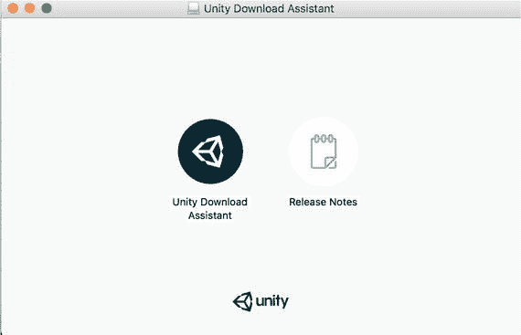

图 1-1. Unity 下载助手

安装程序将按典型的安装流程进行（步骤列在安装程序窗口左侧），最后，`Applications` 文件夹中会放入一个 `Unity` 文件夹。

**提示**：如果你恰好是从旧版 Unity 升级，此过程会直接替换旧版本。如果你想保留之前的副本，请先重命名旧文件夹。例如，如果你从 Unity 4.5 升级到 Unity 5，在执行新安装前，先将 `Unity` 文件夹重命名为 `Unity45`。这样你就可以同时运行两个版本的 Unity。

Unity 安装文件夹包含 `Unity` 应用程序以及若干相关文件和文件夹（图 1-2）。

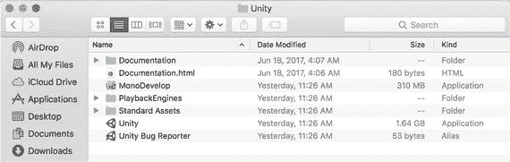

图 1-2. Unity 安装文件夹

Unity 安装文件夹中最重要的文件，也是你唯一真正需要的，是 `Unity` 应用程序，它提供了用于构建游戏的环境。该应用程序有时更具体地被称为 Unity 编辑器，以区别于集成到最终构建中的 Unity 运行时引擎或 Unity 播放器。但通常，当我说“Unity”时，上下文是明确的（我也将 Unity Technologies 简称为 Unity）。

`Documentation` 文件夹包含了与 Unity 网站上（“学习”选项卡下）相同的用户手册、组件参考和脚本参考。这些文件每个都可以从 Unity 的“帮助”菜单中通过网页浏览器打开，你也可以直接双击 `Documentation.html` 来查看文档首页。

`Standard Packages` 文件夹包含多个以 `.unityPackage` 为扩展名的文件。这些 Unity 包文件各自包含一组 Unity 资源，并且可以导入到 Unity 中（同时，你也可以从 Unity 中将资源导出到包文件中）。

`MonoDevelop` 应用程序是 Unity 的默认脚本编辑器，它是用于 Mono 项目的开源 MonoDevelop 编辑器的定制版本，简称 Mono。Mono 是微软 .NET 框架的一个开源版本，构成了 Unity 脚本系统的基础。

最后，还有 Unity Bug Reporter 应用程序，它通常从 Unity“帮助”菜单中的“报告错误”项运行。不过，你也可以直接从 Unity 安装文件夹启动 `Unity Bug Reporter`。如果你遇到了 Unity 甚至无法启动的 bug，这个功能会非常有帮助。

请务必安装示例项目组件，你将在本书中使用它。在图 1-3 中，我还选择了 WebGL 构建支持组件。如果你也计划为 Windows 电脑构建游戏，请务必安装 Windows 构建支持组件。现在是个好时机，去喝杯咖啡或茶，或者散散步；根据你选择的选项数量和网络连接速度，下载可能需要一段时间（图 1-4）。

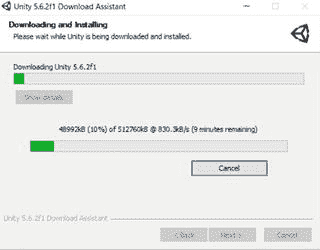

图 1-4. 下载并安装消息

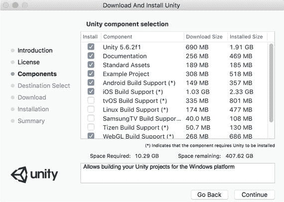

图 1-3. Unity 组件选择

### 欢迎使用 Unity！

安装 Unity 后，Unity 编辑器窗口将会出现，并带有一个友好的 Unity Hello! 窗口浮于上方（图 1-5）。Hello! 窗口是你可以登录 Unity 账户的地方。如果你没有 Unity 账户，请选择“创建一个”链接。如果你当前未连接到互联网，可以通过单击“脱机工作”按钮来离线工作。

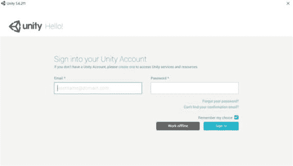

图 1-5. Unity Hello! 窗口

每次启动 Unity 时，都会出现 Unity Hello! 窗口。如果你尚未创建 Unity 账户，现在就是创建的好时机。

首次登录后，你将看到 Unity 的“许可证管理”屏幕。如果你已付费购买了授权版本（Plus 或 Pro）的 Unity，请在对话框中输入你的序列号。如果你打算使用 Unity 的免费版本，请选择 Unity Personal 单选按钮。

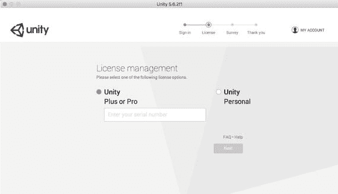

## 管理 Unity

在正式开始使用 Unity 进行游戏开发之前，现在是个好时机来了解一下 Unity 编辑器中的一些管理功能。

### 更换皮肤（Pro 版）

Unity 编辑器有两种外观：深色或浅色。如果你使用的是 Unity Pro，可以选择使用深色皮肤；如果你使用的是 Unity Personal 版本，则只能看到浅色皮肤（图 1-6）。

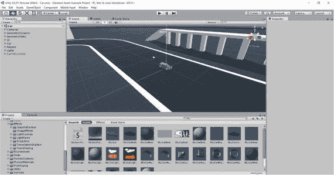

图 1-6. Unity 编辑器

在本书的剩余部分，我将使用浅色皮肤来截取屏幕截图，但除了色调之外，用户界面没有任何区别。要更改此设置（针对 Unity Pro），请在 Unity 菜单中选择“偏好设置”（图 1-7）。

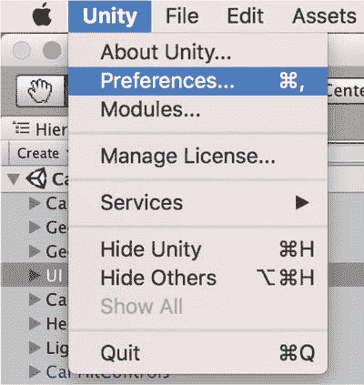

图 1-7. Unity 编辑器中的“偏好设置”菜单项

打开“偏好设置”窗口后，你可以将皮肤从深色切换为浅色，或从浅色切换为深色。如果你使用的是 Unity Personal，则只能使用浅色皮肤，如图 1-8 中灰显的 `Editor Skin` 选项所示。

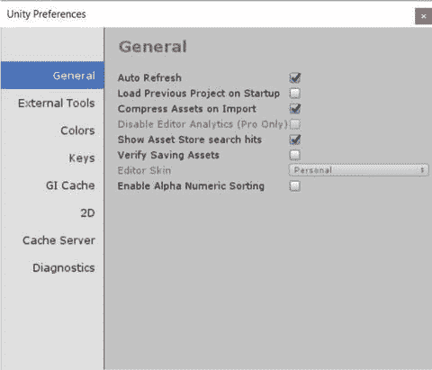

图 1-8. Unity 编辑器中的常规偏好设置

当你在“偏好设置”窗口中时，我建议确保取消勾选“启动时加载上一项目”。这将确保 Unity 在启动时显示项目选择对话框，而不是自动打开最近打开的项目，后者可能很耗时，并且并不总是你想要的。特别是，在准备好之前，你不想意外地将项目升级到新版本的 Unity。

单个 Unity 许可证可用于两台机器。早期，当 Unity 编辑器仅在 macOS 上运行时，一个 Unity 许可证仅适用于一台机器，但在添加了对 Windows 版 Unity 编辑器的支持后，该数量增加到两台。

### 报告问题

如果你长期使用 Unity，必然会遇到各种真实或臆想的 Bug。这并非对 Unity 的贬低。3D 游戏引擎本身非常复杂（至少在内部实现上），而其开发速度也相当惊人。（我最初使用的是 Unity 1.6，当时它仅能在 macOS 上运行，且只能针对 Windows 和 macOS 构建部署。）Bug 不会自行修复，尤其是当它们无人上报时。这时就需要用到`Unity Bug Reporter`。正如我在介绍 Unity 安装文件时提到的，`Bug Reporter`位于 Unity 文件夹中，但通常从 Unity 编辑器的“帮助”菜单中启动（图 1-9）。

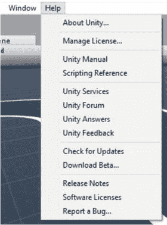

图 1-9. “帮助”菜单中的“报告 Bug”选项

正如你在 Unity 安装文件列表中所见，`Bug Reporter`是一个独立于 Unity 编辑器的应用程序。因此，如果你遇到导致 Unity 编辑器无法正常启动的 Bug，可以直接在 Finder 中双击该文件来启动`Bug Reporter`。

弹出的`Unity Bug Reporter`窗口（图 1-10）会提示你选择 Bug 发生的位置（在 Unity 编辑器还是在 Unity Player 中，即已部署的构建版本），指定 Bug 出现的频率，并提供一个电子邮件地址，以便 Unity Technologies 就此事发送回复。

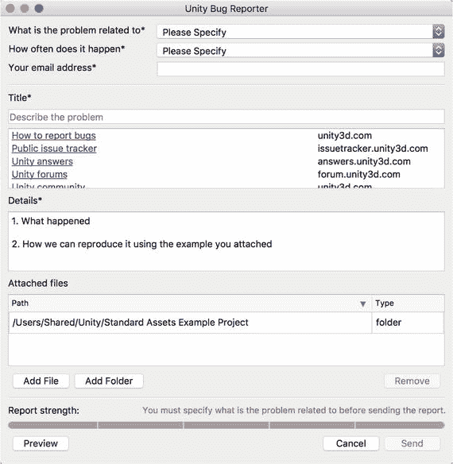

图 1-10. Unity Bug Reporter 窗口

在下方窗口中间区域，是附件列表。Unity 会自动将当前项目添加到列表中，你也可以包含截图或日志文件等补充文件。你可以从列表中移除当前项目，但通常情况下，你应该包含该项目，以便 Unity 支持团队能够复现问题。

同样，你应该在问题描述中填写足够详细的解释，以便 Unity 支持团队了解如何重现不符合预期的行为，并理解为什么该行为不符合预期。基本上，你需要避免得到诸如“我们无法重现此问题”或“这不是 Bug，是设计如此”之类的回复。

提交 Bug 报告后不久，你应该会收到来自 Unity Technologies 的电子邮件确认，其中包含一个案例编号以及 Unity Bug 数据库中该报告副本的链接，你可以通过该链接查看 Bug 的状态。

### 检查更新

如果幸运的话，你的 Bug 报告会促成一次修复。如果非常幸运，修复将在下一个 Unity 更新中出现。你可以随时通过选择菜单栏中“窗口”菜单下的`Check for Updates`命令来检查是否有新更新。打开的窗口会显示是否有可用更新（图 1-11）。

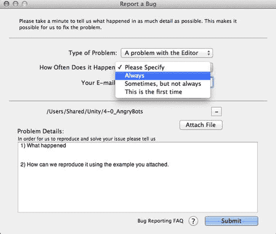

图 1-11. Unity 编辑器更新检查

注意图 1-11 中显示的版本号为 Unity 5.6.2f1。后缀代表最细粒度的发布版本，包括紧急热修复。出于谨慎考虑，Unity Technologies 通常不会立即将新发布的更新提供给编辑器检查，因此，如果你急切地等待某个 Bug 修复更新，也可以随时查看 Unity 网站。

## 进一步探索

我最喜欢的科技书籍，比如 Peter van der Linden 的《Just Java》（一本为非程序员准备的详细但轻松的 Java 入门书），会在每章末尾通过讲述一段有趣的轶事、冷知识或相关历史来提供一个愉快的间歇。可惜，我不会在这本书中这样做。然而，我确实觉得单纯的章节总结和概述很乏味（作为读者我总会跳过它们），并且我认为新 Unity 开发者面临的主要挑战之一是：他们需要养成自行查找 Unity 信息的习惯，并且需要知道去哪里找到这些信息——而这并不总是那么容易！

因此，在包括本章在内的每一章末尾，我都会为你提供与你刚刚学到的主题相关的文档和其他资源，这样你就知道去哪里找到权威且全面的信息来源，并在读完本书后能更进一步。我会重点介绍官方 Unity 手册和 Unity 网站，但也会提及一些第三方资源。现在你已经安装了 Unity，在本书开始使用它之前，不妨稍作休息，浏览一下你今后一定会大量使用的网站和参考文档。在需要之前就弄清楚去哪里寻找所需信息，总是一个好习惯。

### iOS 开发需求

在本章开头，我提到最好尽早开始下载 Xcode 并注册 Apple Developer Program。

iOS 开发的需求，包括所需的硬件和关于 Apple Developer Program 的详细信息，都列在 Apple 的开发者支持页面（`http://developer.apple.com/support`）上。

你可以在`http://developer.apple.com/xcode`查找关于 Xcode 需求及下载 Xcode 的信息。

### Unity 网站

随着 Unity 功能和平台的发展，Unity 网站（`http://unity3d.com/`）也在不断壮大。整个网站都值得浏览，但尤其要了解 Unity 的通用信息，请查看 Unity 网站上的常见问题解答部分（`http://unity3d.com/unity/faq`）。

Unity 视频档案库（`http://video.unity3d.com/`）提供了许多教学视频，并且 Unity 最近在其网站上引入了“学习”标签，以便于访问文档和教程。

### Unity 社区

Unity“帮助”菜单中部的头三项是官方 Unity 社区的链接。论坛（`http://forum.unity3d.com`）是用户可以提出任何与 Unity 相关话题的地方（不过论坛也有版主）。

Unity Answers 网站（`http://answers.unity3d.com/`）遵循 Stack Exchange 的格式，并对问题和答案提供了一定的质量控制。Unity Feedback 网站（`http://feedback.unity3d.com`）允许用户发布功能请求，并对（自己或他人发布的）功能请求进行投票。

提示：虽然 Bug 类型选择器中提供了“功能请求”作为一种 Bug 类型，但 Unity 鼓励大家将功能请求提交到其 Feedback 网站。

欢迎来到 Unity 社区！

