# 2. Unity 快速入门

既然你已经安装了 Unity，现在是时候熟悉 Unity 编辑器了。编辑器（我会根据语境混用 Unity、Unity 编辑器以及编辑器这几个词，只要意思明确即可）是你为一个或多个目标平台创建、测试和构建游戏的地方。编辑器针对包含游戏内所有资源的单个 Unity 项目运行。

本章将通过 Unity 资源商店中的《攀登者》游戏来介绍 Unity 编辑器。这里我不会深入探讨这款游戏的内部机制，但它是一个现成的、方便的项目，你可以用它来熟悉 Unity，甚至可以将其构建为 macOS 应用程序来感受构建流程。希望这能让你在下一章学习如何从零开始创建新项目之前，先熟悉 Unity 的工作流程、用户界面和各类文件类型。

**提示**

macOS 默认隐藏文件扩展名，但任何从事开发工作的人都应该查看完整的文件名。要确保扩展名显示出来，请前往“访达”偏好设置窗口的“高级”选项卡，并勾选“显示所有文件扩展名”。

## 介绍《攀登者》游戏

要从 Unity 商店安装《攀登者》游戏，你需要访问 Unity 资源商店。可以通过多种方式访问 Unity 资源商店。在 Unity 屏幕的主窗口中，有一个“资源商店”选项卡，点击后会弹出资源商店窗口。也可以按住 option 键再按 9 键（`⌘+9`）来打开此窗口。要从资源商店下载资源，你需要注册 Unity 以创建 Unity ID。创建 Unity ID 后，在 Unity 资源商店窗口中会有一个搜索栏。在搜索栏中输入“Climber”，就会显示符合此搜索条件的一系列文件。Unity 中的默认窗口设置会将 Unity 商店窗口显示为最小化状态。要全屏查看资源商店，屏幕右上角有一个下拉菜单。选择此菜单并点击鼠标左键，会显示屏幕选项：重新加载、最大化、关闭标签页和添加标签页（此处需配图）。选择最大化选项（点击鼠标左键）。屏幕顶部有几个筛选选项。筛选选项下方，是符合你搜索条件的资源。双击“Climber”，会加载该资源的界面（此处需配图）。选择“导入”按钮，此资源就会被导入 Unity。

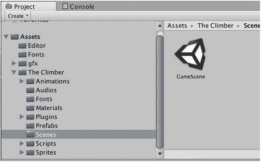

图 2-1. 场景文件夹中包含《攀登者》游戏的 Unity 项目文件夹

### 打开《攀登者》项目

导入后，Unity 会自动打开《攀登者》项目。如果因为某些原因 Unity 没有立即打开《攀登者》游戏，或者你以后想再次打开它（我们将在第 10 章和第 11 章中再次使用《攀登者》游戏来熟悉 Unity iOS 版），请在 Unity 菜单栏的“文件”菜单中选择“打开项目”项（图 2-2）。

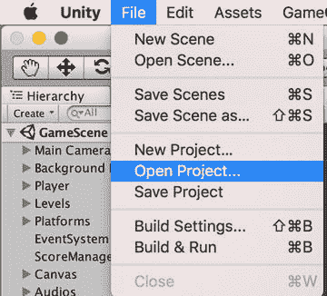

图 2-2. “打开项目”菜单项

此时会出现项目向导（与偏好设置窗口中“总是显示项目向导”项所指的同一项目向导）。在项目向导的最近项目列表中选择《攀登者》游戏项目（如果勾选了复选框，则每次启动 Unity 时都会显示该列表），或点击“打开”按钮（图 2-3）。

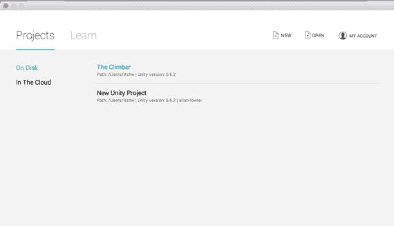

图 2-3. 从“打开项目”菜单中选择《攀登者》游戏

### 打开《攀登者》游戏场景

打开《攀登者》游戏项目后，Unity 编辑器应显示项目的主场景，名为 `New project`。窗口的标题栏应列出场景文件 `New Unity Project`，后跟项目名称和目标平台（图 2-4）。

场景名称显示在编辑器窗口的上边框处，场景内容则反映在层级视图、场景视图和游戏视图中。稍后我将解释这些视图，并花本章的很大篇幅详细讲解每个视图。

场景相当于游戏中的一个关卡（实际上，Unity 中加载场景的脚本函数就叫作 `Application.LoadLevel`）。Unity 编辑器的目的是构建场景，因此它每次都只打开一个场景。

如果编辑器在启动时没有打开现有场景，它会打开一个新创建的场景，效果与你从 Unity 菜单栏的“文件”菜单中选择“新建场景”相同。

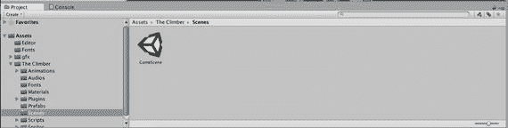

图 2-4. 打开新场景后的《攀登者》游戏项目

如果你现在没有看到《攀登者》游戏场景，请在“文件”菜单中选择“打开场景”命令（图 2-5）。

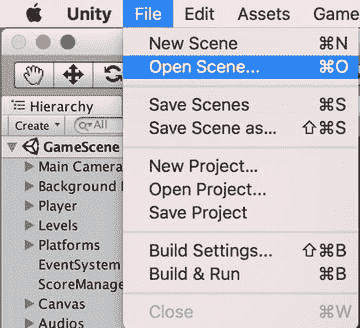

图 2-5. “打开场景”菜单项

弹出的文件选择器会从项目的 Assets 文件夹顶层开始，你可以选择“Scenes”文件夹，然后选择“Main”场景文件（图 2-6）。所有场景文件都带有 Unity 图标，并具有 `.unity` 文件扩展名。

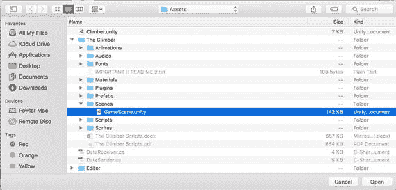

图 2-6. 在“加载场景”选择器中选择《攀登者》游戏场景

### 运行《攀登者》

打开所需场景后，点击编辑器顶部中央的“Play”按钮即可开始游戏。游戏视图将会出现并显示运行中的游戏，可以使用标准键盘和鼠标控制（图 2-7）。

使用 AWSD（或方向键）分别控制前进、后退、左移和右移，按下 `Esc` 键暂停。再次点击“Play”按钮将停止游戏并退出运行模式。“Play”按钮旁边的两个按钮用于暂停游戏和单步执行游戏。

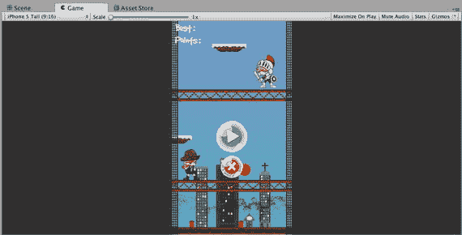

图 2-7. 编辑器中的运行模式

好的，作为高级文档工程师和翻译员，我将严格按照您提供的注意事项和示例，将给定的英文文本翻译成中文。

### 构建游戏

在常规开发过程中，你需要在编辑场景和运行游戏之间来回切换。

当您对游戏在编辑器中的表现满意后，就可以为目标平台构建应用了。直到第 10 章，我们才会开始为 iOS 构建应用，但为了熟悉构建流程，现在就可以为 `Climber` 构建一个 macOS 应用版本。从 Unity 的 `File` 菜单中选择 `Build Settings` 项，打开 `Build Settings` 窗口（图 2-8）。

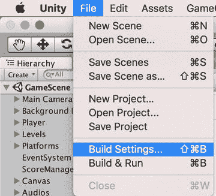

图 2-8. 打开 `Build Settings` 窗口

窗口的上半部分列出了要包含在构建中的场景。应该只勾选你当前打开的场景。未勾选或未列出的场景将不会包含在构建中（图 2-9）。

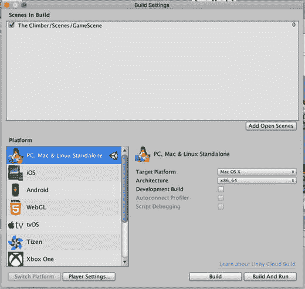

图 2-9. Mac 平台的 `Build Settings`

左侧 `Platform` 列表中默认选中的平台是 `PC, Mac & Linux Standalone`，这与编辑器标题栏上列出的平台一致。

从 `File` 菜单中，选择 `Build Settings`，然后选择 `PC, Mac & Linux Standalone` 图标。

现在，您可以点击 `Build Settings` 窗口中的 `Build` 或 `Build and Play` 按钮。点击 `Build` 将生成我们游戏的 macOS 应用版本。点击 `Build and Play` 也会执行相同的操作，但还会运行游戏，这样就省去了手动打开 Finder 窗口并双击新应用的麻烦。Unity 会提示您为应用输入文件名和保存位置，默认位置是项目目录的顶层，这就可以了（图 2-10）。

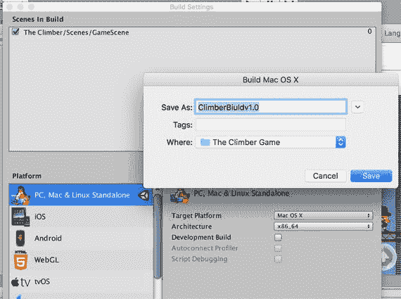

图 2-10. 保存 macOS 应用构建

构建完成后，双击生成的应用即可运行游戏。或者，如果您选择了 `Build and Run`，游戏应该会自动启动。Unity 生成的 macOS 应用会先显示一个分辨率选择窗口（图 2-11）。

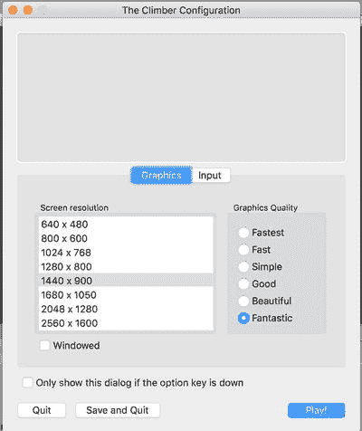

图 2-11. Unity macOS 应用的启动对话框

选择所需分辨率并点击 `Play!` 后，您将看到指定大小的游戏窗口。现在，`Climber` 已经在其独立的 Mac 窗口中运行了（图 2-12）。

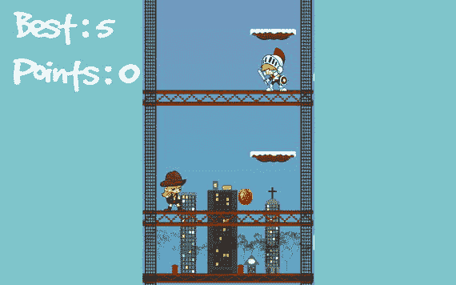

图 2-12. 作为 Mac 应用的 `Climber`

## 编辑器布局

既然您已经通过 `Climber` 项目体验了 Unity 的测试和构建工作流程，那么我们来更仔细地看看 Unity 编辑器的布局。主窗口被划分为多个区域（我习惯称之为窗格，但这里我称它们为区域，因为这是 Xcode 中使用的术语）。每个区域可以包含一个或多个标签页视图。通过点击视图的标签页，可以选择该区域默认显示的视图（出厂设置）。视图可以被添加、移动、移除和调整大小，编辑器支持在不同布局之间切换，因此布局本质上是视图的特定排列方式。例如，主窗口的默认布局（图 2-13）就包含一个同时有 `Scene View`（图 2-14）和 `Game View`（图 2-15）的区域。

> **注意：** Unity 文档在命名视图方面有些不一致。从名称上看，`Game View` 和 `Scene View` 显然是视图。但 `Console` 和 `Inspector` 也是视图。在本书中，我会在所有视图的名称中都加上 `View`，以明确它们都是视图，并且可以以相同的方式操作。

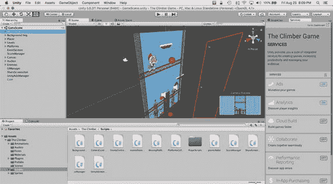

图 2-13. Unity 编辑器的默认布局

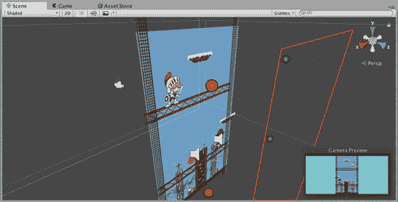

图 2-14. 在多标签页区域中选中的 `Scene View`

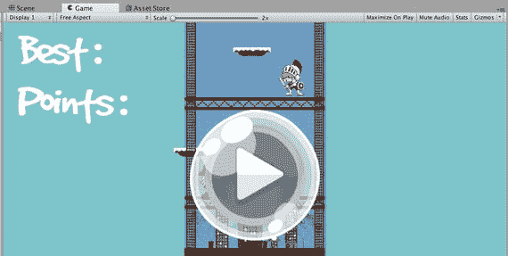

图 2-15. 在多标签页区域中选中的 `Game View`

### 预设布局

默认布局只是几种预设布局之一。可以从主窗口右上角的菜单中选择其他布局（图 2-16）。请尝试一下它们。图 2-17 到 2-20 显示了由此产生的布局。

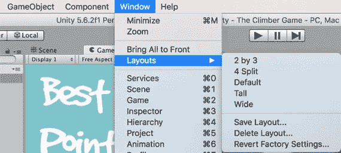

图 2-16. `Layout` 菜单

稍后我将更详细地描述各种视图类型，但现在请注意，`2-by-3` 布局（图 2-17）是一个示例，其中 `Scene View` 和 `Game View` 位于不同的区域，而不是共享同一个区域。`4-split` 布局（图 2-18）有四个 `Scene View` 实例（让人联想到计算机辅助设计工具），这表明布局并不限制每种类型的视图只能有一个。

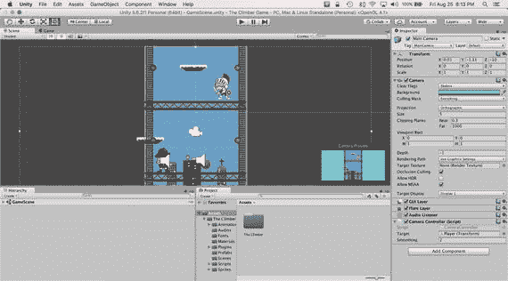

图 2-20. `Wide` 布局

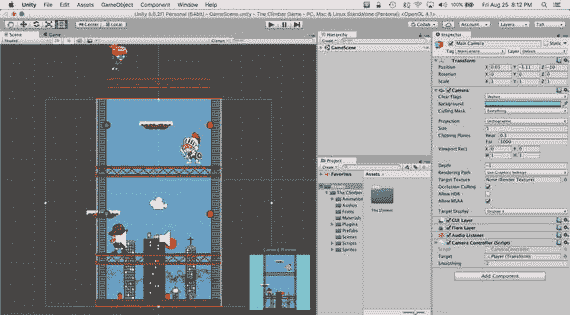

图 2-19. `Tall` 布局

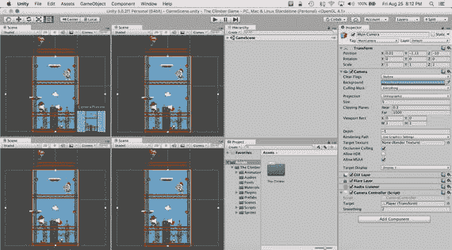

图 2-18. `4-split` 布局

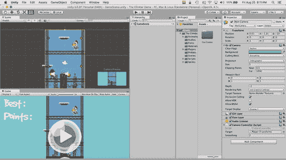

图 2-17. `2-by-3` 布局

### 自定义布局

预设布局提供了多种工作区，但幸运的是，您不必完全照搬使用。Unity 提供了足够的灵活性，让您可以根据自己的喜好完全重新排列编辑器窗口。

#### 调整区域大小

首先，在尝试各种预设布局时，您可能会注意到某些区域太窄，例如，在 `Wide` 布局（图 2-20）的左侧面板中。幸运的是，您可以点击区域的边框并拖动来调整其大小。

#### 移动视图

更酷的是，您可以移动视图。将视图的标签页拖到另一个标签页区域，即可将该视图移动到那里。将标签页拖到一个“停靠”区域则会创建一个新的区域。例如，从 `Default` 布局开始，将 `Inspector` 标签页拖到 `Hierarchy` 标签页的右侧。现在 `Inspector View` 和 `Hierarchy View` 共享同一个区域。结果应如图 2-21 所示。

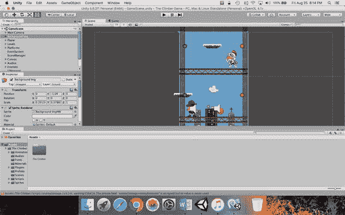

图 2-21. 移动视图后自定义的工作区

#### 分离视图

您甚至可以将视图拖到编辑器窗口之外，使其位于自己的“浮动”窗口中，该窗口可以像其他任何区域一样被对待。将 `Scene` 标签页拖到编辑器外部，使其位于一个浮动窗口中，然后将 `Game` 标签页拖到其标签页区域。结果应如图 2-22 所示。同样，将标签页拖到浮动窗口的停靠区域将为该窗口增加另一个区域。

> **提示：** 我喜欢将 `Game View` 分离到一个浮动窗口中，因为我在编辑器中工作时通常不需要看到它，直到我点击 `Play`，这样我就可以最大化 `Game View` 使其填满整个屏幕。

浮动窗口经常被其他窗口覆盖，因此菜单栏上的 `Windows` 菜单中有使每个视图可见的菜单项（图 2-22）。请注意，每个视图都有对应的键盘快捷键，还有一个 `Layouts` 子菜单，它与编辑器内的布局菜单相同。

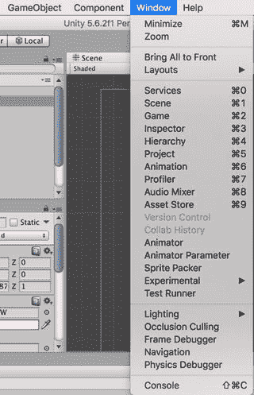

图 2-22. `Windows` 菜单中的视图列表

### 添加和移除视图

你也可以利用每个区域右上角的菜单来添加或移除该区域内的视图（图 2-23）。`Close Tab`（关闭标签）选项用于移除当前显示的视图。`Add Tab`（添加标签）选项则提供一个新视图列表供你选择。

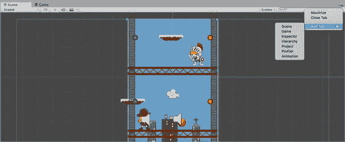

图 2-23. 可用的布局

你可能希望为不同的目标平台设置不同的布局，或者为开发阶段和试玩测试阶段设置不同的布局，亦或是针对不同的游戏设置不同的布局。例如，我就有一个专门为 HyperBowl 定制的布局，该布局将游戏视图调整为合适的竖屏宽高比。如果每次启动 Unity 都要手动重新配置编辑器，那将非常麻烦。幸运的是，你可以通过选择布局菜单中的 `Save Layout`（保存布局）选项来为布局命名并保存，系统会提示你输入新布局的名称（图 2-24）。

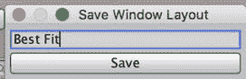

图 2-24. 新布局命名提示

保存后，新布局将出现在布局菜单中，并且当你选择 `Delete Layout`（删除布局）时，它也会出现在可供删除的布局列表中（图 2-25）。

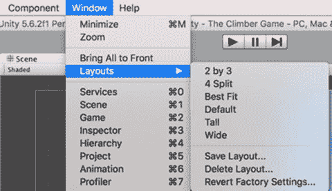

图 2-25. 布局删除菜单

如果你搞乱了或误删了原始布局，可以选取区域菜单中的 `Restore Factory Settings`（恢复出厂设置）选项（图 2-26）。该操作同样会删除所有自定义布局。

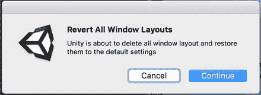

图 2-26. 恢复原始布局设置

如果你修改了一个布局但尚未保存更改，只需在布局菜单中重新选择该布局即可丢弃所有更改。

## 检视器视图

首先值得详细描述的是`检视器视图`，因为它的功能是显示在其他视图中选中的对象的信息。它的功能实际上远超“检视器”，因为它通常还可以用来修改选中的项目。

`检视器视图`也用于显示和调整可从`编辑`菜单中调出的各种设置。例如，你可能会注意到 Climber 项目中的 `Assets` 文件夹里有很多带有 `.meta` 扩展名的文件，如图 2-27 所示。事实上，每个资源文件都对应一个这样的文件。Unity 使用这些元文件来追踪项目中的资源，这些文件是文本格式，便于配合 Perforce 和 Subversion（或更新的分布式版本控制系统如 Git 和 Mercurial）这类版本控制系统使用。

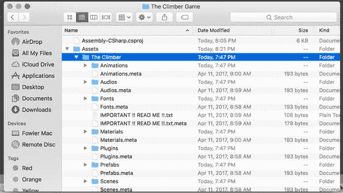

图 2-27. Climber 项目中的元文件

但如果你没有使用版本控制系统，你可以在`编辑器设置`中关闭版本控制兼容性，从而移除这些不美观的文件。通过进入`编辑`菜单，然后从`设置`子菜单中选择`编辑器设置`来打开`编辑器设置`（图 2-28）。

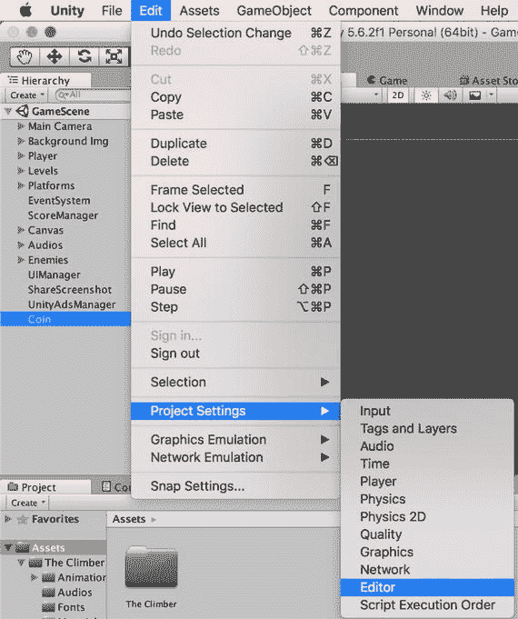

图 2-28. 打开编辑器设置

现在，`检视器视图`会显示`编辑器设置`。如果项目当前包含元文件，那么`版本控制模式`会设置为 `Meta Files`（如果你正在使用`资源服务器`，此选项则设置为 `Asset Server`）。要移除元文件，请将`版本控制模式`设置为 `Disabled`（禁用）（图 2-29）。

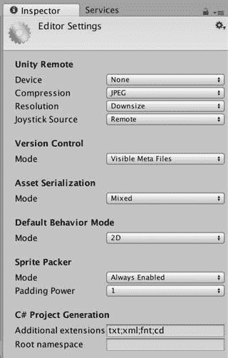

图 2-29. 检视器视图中的编辑器设置

将`版本控制模式`设置为 `Disabled` 后，Unity 将移除元文件（图 2-30）。资源追踪现在由项目 `Library` 文件夹内的二进制文件处理。

注意：使用元文件进行版本控制的 Unity 用户也可以将`资源序列化模式`设置为 `Force Text`。在该模式下，Unity 场景文件会以纯文本的 YAML（YAML Ain’t Markup Language）格式保存。

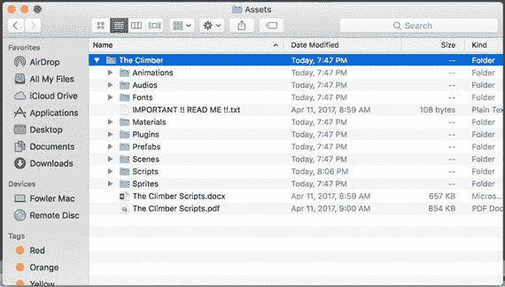

图 2-30. 移除元文件后的 Climber 项目文件夹

通常情况下，`检视器视图`显示的是最近选中对象的属性（当你打开`编辑器设置`时，你实际上相当于选中了它）。但有时，在选中其他对象时，你并不希望`检视器视图`随之改变。在这种情况下，你可以通过选取视图右上角菜单中的 `Lock`（锁定）选项，将`检视器视图`固定到某个对象上（图 2-31）。

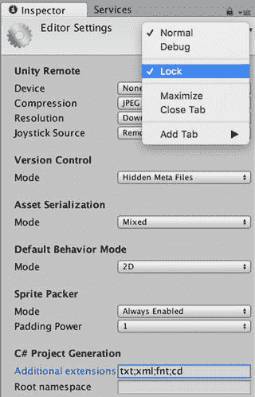

图 2-31. 锁定检视器视图

## 项目视图

如果说`检视器视图`可以被看作是编辑器中层级最低的视图（因为它只显示单个对象的属性），那么`项目视图`则可以被视为层级最高的视图（图 2-32）。`项目视图`显示游戏可用的所有资源，从单独的模型、纹理和脚本，到整合了这些资源的场景文件。项目中所有这些资源都位于你项目的 `Assets` 文件夹内（因此，我实际上认为`项目视图`就是`资源视图`）。

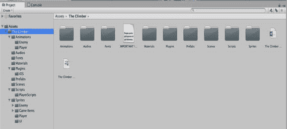

图 2-32. 项目视图的顶层

### 单列与双列切换

在 Unity 5 之前，`项目视图`只有单列显示。该选项在`项目视图`的菜单中仍然可用（点击视图右上角的小三线图标），因此你现在可以在单列和双列之间切换。

注意 Climber 项目的`项目视图`（图 2-32）看起来与项目的 `Assets` 文件夹在访达中的显示方式（见图 2-30）颇为相似。实际上，它更像 Windows 的文件视图，你可以在左侧面板中浏览文件夹层级，在右侧面板中查看所选文件夹的内容。

### 缩放图标

底部的滑块可以缩放右侧面板的视图——较大的缩放比例适合查看纹理，较小的缩放比例更适合查看脚本等图标不丰富的项目。这也是按资源类型对资源进行分区的一个好理由（即，将所有纹理放入 `Textures` 文件夹，脚本放入 `Scripts` 文件夹，依此类推）。因为对于混合资源类型，单一缩放比例的滑块设置很可能无法同时满足所有需求。

### 检查资源

在右侧选中一个资源会在`检视器视图`中显示该资源的属性。例如，如果你选中一个声音样本，`检视器视图`会显示关于声音格式的信息，其中部分属性（比如压缩设置）是可以更改的，甚至还可以让你在编辑器中播放该音频（图 2-33）。我将在后续章节中讲解声音属性，但现在，你可以自由地在`项目视图`中选择各种类型的资源，看看它们在`检视器视图`中会显示什么。

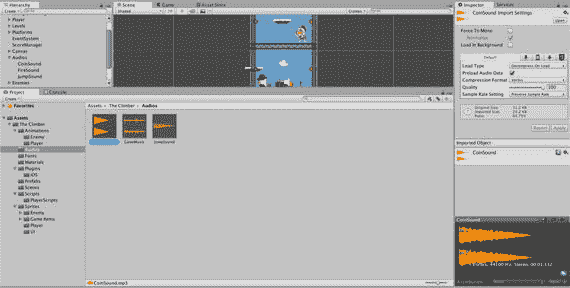

图 2-33. 在项目视图中检查选中的资源

### 搜索资源

在大型复杂项目中，手动搜索特定资源十分困难。幸运的是，与访达（Finder）类似，这里也有一个搜索框，可用于筛选项目视图右侧面板中显示的结果。在图 2-34 中，项目视图显示了搜索名称中含有“add”的资源的结果。

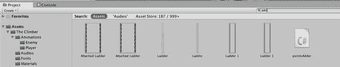

**图 2-34.** 搜索名称中含有“add”的资源

右侧面板显示了“资源”（Assets）下所有内容的搜索结果（即我们所有的资源）。通过在左侧面板中选择一个子文件夹，可以进一步缩小搜索范围。例如，如果你知道要找的是纹理，并且已经按资源类型将资源整理到了子文件夹中，那么你可以选择“脚本”（Scripts）文件夹进行搜索（图 2-35）。

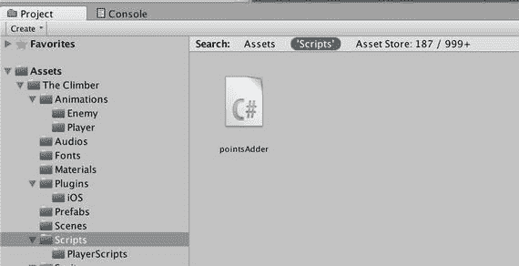

**图 2-35.** 在文件夹中搜索资源

注意，搜索框下方有一个显示所选文件夹名称的标签。你仍然可以点击左侧的“资源”（Assets）标签，查看所有资源的搜索结果，包括本地资源和 Unity 资源商店（Unity Asset Store）中的资源——我们将在本书中大量使用后者。

你还可以使用搜索框右侧的菜单，按资源类型过滤搜索。你不必只在“脚本”文件夹内搜索，而是可以选择“脚本”作为感兴趣的资源类型（图 2-36）。注意，这会导致在搜索框中添加 `s:Texture`。前缀 `t:` 表示搜索结果应按其后的资源类型进行过滤。你也可以不通过菜单，而直接键入该内容。

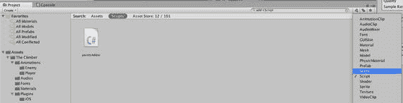

**图 2-36.** 按资源类型过滤的搜索结果

资源类型菜单右侧的按钮用于按标签过滤（你可以在检视面板中为每个资源分配一个标签），这在搜索资源商店时也非常方便。最右侧的星形按钮则会将当前搜索保存到左侧面板的“收藏夹”（Favorites）部分。

### 操作资源

项目视图中的资源，其操作方式与它们在访达中的对应文件非常相似。

双击某个资源会尝试打开一个合适的程序来查看或编辑该资源。这等同于右键点击该资源并选择 `打开`。双击场景文件将在当前 Unity 编辑器窗口中打开该场景，就像你在“文件”（File）菜单中选择`打开场景`一样。

你还可以重命名、复制、删除资源，以及在文件夹之间拖放文件，就像在访达中一样。其中一些操作可通过 Unity 的“编辑”（Edit）菜单，或右键点击资源时弹出的菜单来使用。在接下来的几章中，你将有机会练习这些操作。

同样，在下一章中，你将学习如何向项目添加资源。这包括导入文件或导入 Unity 包，可以通过菜单栏上的“资源”（Assets）菜单，或者直接将文件从访达拖入项目的“资源”文件夹。

## 层级视图

每个游戏引擎都有一个顶层对象，称为游戏对象（game object）或实体（entity），用来表示任何具有位置、潜在行为以及用于标识其名称的事物。Unity 游戏对象是 `GameObject` 类的实例。

**注意：** 通常，当我们提到某种 Unity 对象类型时，为了精确并明确该对象在脚本中如何被引用，我们会使用其类名。

层级视图是当前场景的另一种表现形式。场景视图是一个三维场景表现，你可以像使用内容创作工具一样在其中工作；游戏视图则显示游戏运行时的场景外观；而层级视图则以易于导航的树形结构列出场景中所有的 `GameObject`。

### 检查游戏对象

当你在层级视图中点击一个 `GameObject` 时，它就成为当前的编辑器选中对象，其组件会显示在编辑器中。每个 `GameObject` 都有一个变换组件，用于指定其相对于层级中父对象的位置、旋转和缩放（如果你熟悉三维图形数学，那么可以说变换本质上就是该对象的变换矩阵）。一些组件为游戏对象提供特定功能（例如，灯光就是一个附加了灯光组件的 `GameObject`）。其他组件则引用诸如网格、纹理和脚本等资源。图 2-37 展示了玩家 `GameObject` 的组件（在层级视图中，整个玩家 `GameObjects` 树以蓝色显示，因为它链接到了预设体——一种用于克隆单个 `GameObject` 或一组 `GameObjects` 的特殊资源类型）。

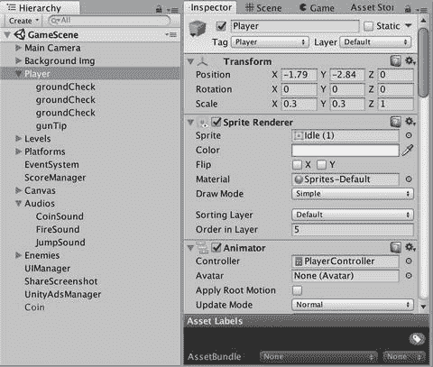

**图 2-37.** 层级视图与检视面板

### 父游戏对象与子游戏对象

请注意，许多 `GameObject` 是按层级结构排列的，因此该视图得名“层级视图”（在计算机图形学中，这通常被称为场景图）。对于在概念上被分组的游戏对象来说，建立父子关系是合理的。例如，当你想移动一辆汽车时，你会希望车轮自动跟随汽车移动。因此，车轮应指定为汽车的子对象，相对于汽车中心偏移。当车轮转动时，它们是相对于汽车的运动而转动的。父子关系还允许我们同时激活或停用整组游戏对象。

## 场景视图

层级视图允许我们创建、检查和修改当前场景中的 `GameObject`，但它并未提供可视化场景的方法。这正是场景视图的作用所在。场景视图类似于三维建模软件的界面。它允许你从任意三维视角检视和修改场景，并让你对最终产品的外观有所了解。

### 场景导航

如果你不熟悉 3D 空间操作，其实从 2D 空间延伸过来非常直观。在 2D 空间中，你只在 `x` 轴和 `y` 轴构成的平面内使用 `(x, y)` 坐标工作；而在 3D 空间中，你额外多了一个 `z` 轴，坐标变为 `(x, y, z)`。其中 `x` 轴和 `z` 轴定义了地面平面，`y` 轴则指向上方（你可以将 `y` 视为高度）。

> **注意：** 某些 3D 应用程序和游戏引擎使用 `z` 轴作为高度，`x` 轴和 `y` 轴作为地面平面，因此在导入资源时，你可能需要对其进行调整（旋转）。

3D 空间中的视点通常被称为摄像机。点击右上角彩色**场景坐标轴控件**上的 `x`、`y`、`z` 箭头，可以快速将摄像机翻转至正对相应轴的方向。例如，点击 `y` 箭头会获得场景的俯视图（图 2-38），此时**场景坐标轴控件**下方的文字会显示为“Top”。

这里的摄像机与游戏中运行时使用的 `Camera` 游戏对象不同，因此你无需担心在**场景视图**中环顾四周时会搞乱游戏。

*图 2-38. **场景视图**中的侧视图*

点击**场景坐标轴控件**中心的方框，可以在透视投影和正交投影之间切换摄像机。透视投影会使远处的物体渲染得更小，而正交投影则无论物体远近都以原始大小渲染。透视效果更真实，是游戏中常用的方式，但在设计时正交投影通常更方便（因此它在计算机辅助设计应用中很普遍）。**场景坐标轴控件**下方文字前的图形标识了当前的投影模式。

你可以使用鼠标滚轮进行缩放，也可以选择**编辑器**窗口右上角工具栏中的 `Hand` 工具，然后按住 `Control` 键并拖拽鼠标来完成缩放。当 `Hand` 工具被选中时，你还可以通过拖拽视图来移动摄像机，并通过按住 `Option`（或 `Alt`）键并拖拽鼠标来旋转（环绕）摄像机，这样你就不会局限于轴向摄像机的角度，如图 2-39 所示。

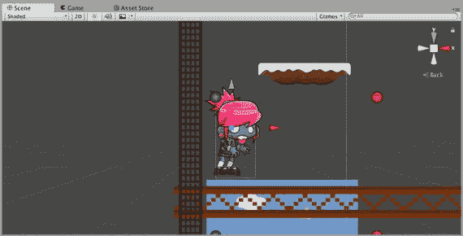

*图 2-39. **场景视图**中的倾斜透视*

请注意，当你从任意角度观察时，**场景坐标轴控件**下方的文字会显示 `Persp` 或 `Iso`，具体取决于你当前使用的是透视投影还是正交投影（`Iso` 是等距视图的缩写，这是一种倾斜的正交视图，常见于《星际争霸》和《Farmville》等游戏中）。

工具栏上的其他按钮用于激活移动、旋转和缩放游戏对象的模式。由于我们无需更改 `Climber` 场景，这些模式将在你开始创建新项目时进行更详细的说明。

> **提示：** 如果你不小心对场景进行了更改，可以从 **Edit** 菜单中选择 **Undo**。如果你做了很多不想保留的更改，可以在切换到其他场景或退出 Unity 时选择不保存此场景。同时，请注意，在这些模式下，你仍然可以通过其他键盘和鼠标组合来移动摄像机。表 2-1 列出了所有可能的操作选项。

*表 2-1. 可用的 **场景视图** 摄像机控制*

| 操作 | `Hand` 工具 | 单键鼠标或触控板 | 双键鼠标 | 三键鼠标 |
| --- | --- | --- | --- | --- |
| 移动 | 拖拽 | 按住 `Alt-Command` 并拖拽 | 按住 `Alt-Control` 并拖拽 | 按住 `Alt` 并中键拖拽 |
| 环绕 | 按住 `Alt` 并拖拽 | 按住 `Alt` 并拖拽 | 按住 `Alt` 并拖拽 | 按住 `Alt` 并拖拽 |
| 缩放 | 按住 `Control` 并拖拽 | 按住 `Control` 并拖拽，或双指滑动 | 按住 `Alt` 并右键拖拽 | 按住 `Alt` 并右键拖拽或使用滚轮 |

还有其他一些方便的基于键盘的场景导航功能。按下 `Arrow` 键将沿 `x-z` 平面（地面平面）向前、向后、向左、向右移动摄像机。按住鼠标右键则允许你像在第一人称游戏中一样导航场景。`AWSD` 键分别控制向左、向前、向右、向后移动，而移动鼠标则控制摄像机（视点）的观察方向。

当你想在**场景视图**中查看某个特定的游戏对象时，最快的方法有时是在**层级**视图中选中该游戏对象，然后使用 **Edit** 菜单中的 **Frame Selected** 菜单项（注意方便的快捷键 `F`）。在图 2-40 中，我点击了**场景坐标轴控件**的 `x` 轴以获得水平视图，然后在**层级视图**中选中了 `Player` 游戏对象，并按下了 `F` 键（**Edit** 菜单中 **Frame Selected** 的快捷键），从而在**场景视图**中放大并居中显示该玩家。

你也可以直接在**场景视图**中选择一个游戏对象，但需要先退出 `Hand` 工具。正如在**层级视图**中选择一个游戏对象会使其在**场景视图**和**检视视图**中显示一样，在**场景视图**中选择一个游戏对象也会在**检视视图**中显示该选择，并使其在**层级**视图中显示为被选中的游戏对象。在图 2-40 中，我在 `Player` 上执行了 **Frame Selected** 之后，点击了 `Move` 工具（**编辑器**窗口右上角 `Hand` 工具按钮右侧的按钮），然后在**场景视图**中点击了一个靠近 `Player` 的游戏对象。**层级视图**会自动更新以显示该游戏对象已被选中，并且该游戏对象也会显示在**检视视图**中。

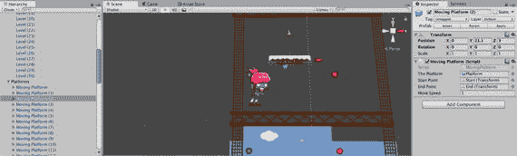

*图 2-40. 在**场景视图**中选择游戏对象*

### 场景视图选项

排列在**场景视图**顶部的按钮提供了显示选项，以辅助你的游戏开发。每个按钮都配置一种视图模式。

最左边的按钮设置**绘制模式**。通常，此模式设置为 `Textured`，但如果你想查看所有多边形，可以将其设置为 `Wireframe`。由于 `Climber` 是一个 2D 游戏，`Wireframe` 视图不会显示太多相关信息（图 2-41）。

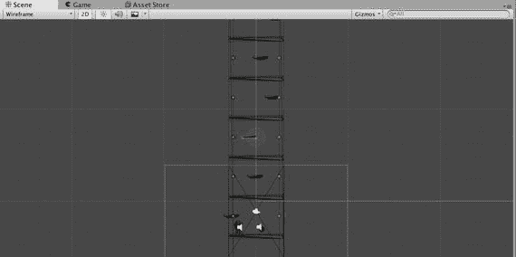

*图 2-41. **场景**视图中的 `Wireframe` 显示*

下一个按钮设置**渲染路径**，它控制场景是正常着色还是用于诊断。

**渲染路径**模式按钮右侧的三个按钮是简单的开关按钮。当鼠标悬停在它们上方时，它们会弹出一些鼠标悬停文档（也称为工具提示）。

其中第一个按钮控制**场景光照**模式。此开关用于在**场景视图**中使用默认光照方案或使用你放置在游戏中的实际灯光之间切换。

中间的按钮切换**游戏覆盖**模式，控制天空、镜头光晕和雾效是否可见。

最后一个是**听觉模式**，用于开启或关闭声音。

### 场景视图辅助图标

`Gizmos`（辅助图标）按钮用于激活与组件相关的诊断图形显示。图 2-42 的场景视图中显示了几个辅助图标。点击 `Gizmos` 按钮并查看可用辅助图标列表，可以看到这些图标分别代表一个 `Camera`（摄像机）、几个 `AudioSources`（音频源）和若干 `Lights`（灯光）。

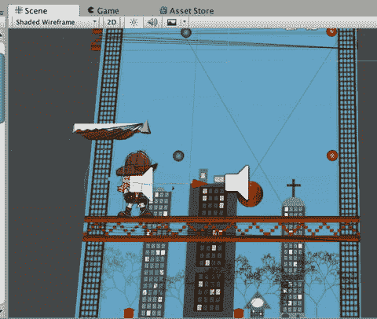

图 2-42. 场景视图中的辅助图标

你可以在辅助图标窗口中选中或取消选中各个复选框，以便聚焦于你感兴趣的对象。左上角的复选框用于在辅助图标的 3D 显示和仅 2D 图标之间切换。旁边的滑块用于控制辅助图标的缩放比例（因此，快速隐藏所有辅助图标的一种方法就是将缩放滑块一直拖到最左侧）。

## 游戏视图

现在，让我们回到游戏视图，你在编辑器中运行 Climber 游戏时已经遇到过它。与层级视图和场景视图类似，游戏视图也描绘了当前场景，但并非用于编辑目的。相反，游戏视图旨在用于运行和调试游戏。

当你点击 Unity 编辑器窗口顶部的 `Play`（播放）按钮时，游戏视图会自动出现。如果点击 `Play` 时不存在现有的游戏视图，则会创建一个新的游戏视图。当编辑器未处于播放模式时，如果游戏视图可见，它会显示游戏的初始状态（即，从初始 `Camera` 位置的角度观察）。

游戏视图显示了游戏在实际部署时的外观和功能，但它与最终构建目标上的外观和行为可能存在差异。一个可能的差异是游戏视图的大小和宽高比。这可以通过视图左上角的菜单进行更改。图 2-43 展示了从 `Free Aspect`（自由宽高比，它会适应视图尺寸）切换到 5:4 宽高比时发生的情况，后者会导致游戏显示画面按比例缩小，以适应区域并保持所选的宽高比。

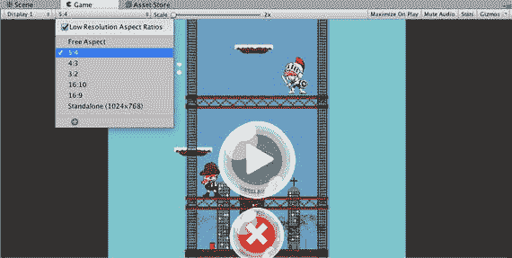

图 2-43. 游戏视图

### 播放时最大化

点击 `Maximize on Play`（播放时最大化）按钮后，当游戏视图处于播放模式时，它将扩展以填充整个编辑器窗口（图 2-44）。如果该视图已从编辑器窗口分离，则此按钮无效。

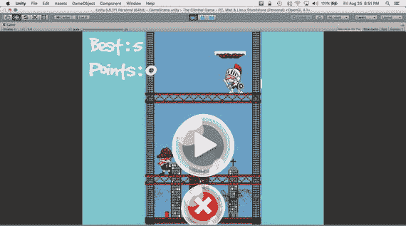

图 2-44. 启用了“播放时最大化”的游戏视图

### 统计信息

`Stats`（统计信息）按钮会显示有关场景的统计数据（图 2-45），这些数据会随着游戏运行而更新。

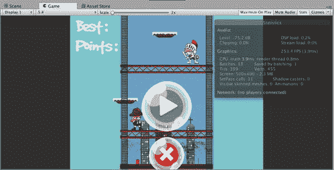

图 2-45. 显示统计信息的游戏视图

### 游戏视图辅助图标

`Gizmos`（辅助图标）按钮用于激活与组件相关的诊断图形显示。图 2-46 的游戏视图中显示了两个图标，它们是一个音频源的辅助图标。`Gizmos` 按钮右侧的列表允许你选择要显示的辅助图标。

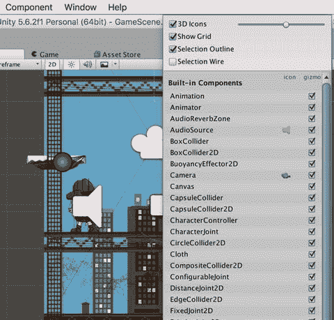

图 2-46. 显示辅助图标的游戏视图

游戏视图和场景视图都是对当前场景的描绘。一个 Unity 项目由一个或多个场景组成，而 Unity 编辑器一次只能打开一个场景。你可以将项目视为游戏，将场景视为关卡（事实上，一些用于操作场景的 Unity 脚本函数在其名称中使用了“level”）。Unity 游戏对象通过附加组件变得有趣，每个组件都提供一些特定的信息或行为。这就是检视视图发挥作用的地方。如果你在层级视图或场景视图中选中一个游戏对象，检视视图将显示其附加的组件。

## 控制台视图

在所有预设布局中剩下的那个视图——控制台视图，虽然容易被忽视，但它非常有用（图 2-47）。

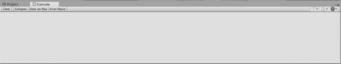

图 2-47. 控制台视图

信息、警告和错误消息会显示在控制台视图中。错误消息为红色，警告为黄色，信息消息为白色。从列表中选择一条消息，会在下方区域显示其更详细的信息。此外，Unity 编辑器底部的单行区域会显示最近的控制台消息，因此即使控制台视图不可见，你也能始终看到已有消息被记录。

提示：警告消息很容易被忽略，但忽视它们会带来风险。它们的出现是有原因的，通常表明某些问题需要解决。如果你任由警告消息累积，就很难注意到真正重要的警告何时出现。

控制台很容易变得杂乱。你可以使用控制台视图顶部的左侧三个按钮来管理这些杂乱信息。`Clear`（清除）切换按钮用于移除所有消息。`Collapse`（折叠）切换按钮用于合并相似的消息。`Clear on Play`（播放时清除）切换按钮会在编辑器每次进入播放模式时移除所有消息。

`Error Pause`（错误暂停）按钮会使编辑器在遇到错误消息时暂停，具体来说，是当脚本调用 `Log.LogError` 时。

在编辑器中操作时，日志消息会进入编辑器日志，而从 Unity 构建的可执行文件生成的消息则会定向到播放器日志。从视图菜单（点击控制台视图右上角的小图标）中选择 `Open Player Log`（打开播放器日志）或 `Open Editor Log`（打开编辑器日志）将会打开这些日志，它们可能以文本文件形式打开，也可能在控制台应用程序中打开（图 2-48）。

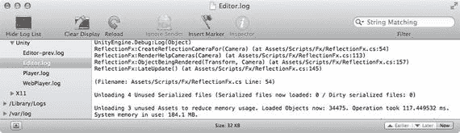

图 2-48. Mac 控制台应用程序中的 Unity 日志

## 进一步探索

我们对 Unity 的探索以及与 Climber 演示项目的互动到此结束。从下一章开始，你将从头开始创建 Unity 项目，以学习游戏引擎的各种特性。但这并不是你最后一次见到 Climber，我们将在第 10 章和第 11 章中回到这个项目，重复此过程来介绍 Unity iOS 开发。在此之前，从下一章开始，你将从头创建 Unity 项目，并探索通用的、主要是跨平台的 Unity 游戏引擎特性。

这是真正开始使用 Unity 的第一章。你尚未开始构建自己的场景（这将在第 3 章开始），但你已经利用 Unity 自带的示例项目 Climber 熟悉了 Unity 编辑器。从此刻起，有大量的官方 Unity 资源可以扩展我将要涉及的主题。

### Unity 手册

如你所见，Unity 有大量的用户界面，而我们几乎未能涵盖其全部。现在是时候认真阅读 Unity 手册了，你可以在 Unity 编辑器内（欢迎屏幕或 `Help` 菜单）阅读，也可以在 Unity 网站（[`http://unity3d.com/`](http://unity3d.com/)）的“Documentation”（文档）部分下的 `Learn`（学习）标签页中阅读。当你想要查询某些内容或只是想在没有打开 Unity 编辑器的情况下阅读有关 Unity 的知识时，网页版非常方便。

本章涵盖的大部分内容都与 Unity 手册的 Unity 基础知识部分中的主题相匹配，特别是关于“学习界面”、“自定义工作空间”、“发布构建”和“Unity 快捷键”的章节（尽管我认为更好的参考方法是直接查看菜单中列出的键盘快捷键）。

我确实提前进入了 Unity 手册的高级部分，并触及了 Unity 对版本控制的支持。Unity 手册中关于“在 Unity 中使用外部版本控制系统”的页面对此进行了更深入的介绍。

### 教程

除了“文档”部分外，Unity 网站上的“学习”标签页还包含一个“教程”部分，其中收录了大量的入门编辑器视频。顾名思义，这些视频介绍了 Unity 编辑器的入门知识，实际上，这组视频涵盖了本章讨论的大部分内容，包括对最重要视图（`游戏视图`、`场景视图`、`层级视图`、`检视视图`和`项目视图`）的描述，甚至还包括发布构建版本的过程。

### 版本控制

虽然我只是在解释如何删除元文件时简要地讨论了版本控制，但这个话题值得稍微多讨论一些，因为 VCS 对软件开发至关重要（当你第一次丢失项目或记不起是哪个改动破坏了你的游戏时，你就会意识到这一点！）。如果你已经有了一款钟爱的 VCS，你可能想在 Unity 中使用它；如果你还没有使用过任何 VCS，那么你可能需要考虑一下，哪怕只是为了保留项目的旧版本，以便在需要回滚时能检查不同版本之间的差异。

在版本控制系统中，Perforce 是游戏工作室中常用的一款流行商业工具，而 Subversion（`svn`）作为一种开源选择，拥有悠久的历史。如今，像 Git 和 Mercurial 这样的分布式版本控制系统正成为趋势。我在 Bitbucket（`http://bitbucket.com/`）上使用 Mercurial 来管理我的内部项目，并在 GitHub 上发布公共项目，包括本书的项目（`www.apress.com/9781484231739`）。

说 Unity VCS 支持与具体产品无关，这实际上是换种方式说 Unity 并没有将任何特定的版本控制系统集成到 Unity 编辑器中。元文件以及 Unity Pro 用户的 YAML 场景文件，只是让 Unity 与常用于源代码的、面向文本的版本控制系统具有更好的兼容性。你仍然需要在 Unity 外部自行执行 VCS 操作。顺便提一下，你可以在 `http://yaml.org/` 上找到关于 YAML 的更多信息。

我发现使用 GitHub 网站上提供的 Mac GitHub 应用很方便，类似地，该网站也提供了 BitBucket 的 Sourcetree 应用。

正如我们在解释编辑器偏好设置中的版本控制模式选项时提到的，Unity 还提供了一款专为 Unity 设计的 VCS，称为 Unity Asset Server。它需要购买 Unity 团队许可证。

## 3. 创建场景

玩《攀登者》很有趣，但这本书的主题是在 Unity 中制作游戏，而不是在 Unity 中玩游戏！最后，是时候开始游戏开发了。这是一个从零开始，最终打造出一款可玩游戏的漫长旅程，而这就是起点。在本章中，你将从一个 Unity 编辑器中的空场景开始，并用 3D 环境的基本构建块来填充它：模型、纹理、灯光、天空盒和摄像机。

游戏开发者（尤其是预算有限的开发者）面临的一个挑战是如何获得这些构建块。Unity 编辑器提供了一些基本模型，任何图像都可以用作纹理（本着互联网的传统，我会提供一张猫的图片作为示例纹理）。并且，正如第一章所述，Unity 安装包中包含一组标准资源，可以随时导入你的项目中。然而，所有这些只能帮你走到一定程度。

幸运的是，Unity Technologies 的员工认识到了这一需求，并创建了资源商店，这是一个 Unity 就绪资源的在线市场，其商店界面直接集成在 Unity 编辑器中。事实证明，这些资源中有很多是免费的，因此我们将利用这一点，将其中一些免费资源整合到本章创建的 Unity 项目中。

本书中的每一章（除了第 10 章和第 11 章，其中“垃圾猫”项目会短暂回归）都建立在前一章的项目基础之上。因此，到本书结束时，本章创建的简单静态场景将演变成一个带有声音和物理效果的优化保龄球游戏，能够在 iOS 上运行，并包含排行榜、成就和广告。本章创建的项目，以及后续各章的项目，都可以在 `www.apress.com/9781484231739` 上获取，但不包含来自资源商店或标准包的任何资源。

让我们开始吧！

好的，遵照您的指示，以下是翻译后的中文文本：

## 创建新项目

如果你还在运行上一章的 Unity 编辑器，请使用 `File` 菜单中的 `New Project` 项创建一个新的 Unity 项目（图 3-1）。

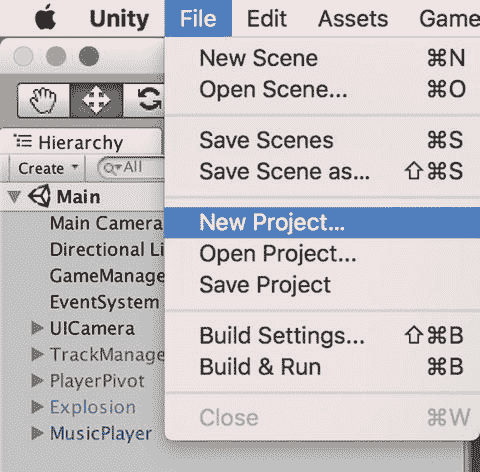

图 3-1. `New Project` 菜单项

出现的项目向导（图 3-2）与我们在上一章选择 `Open Project` 时使用的向导相同，但现在默认选中了 `Create New Project` 选项卡。如果你启动一个新的 Unity 会话并看到项目向导，你可以直接点击此选项卡来创建一个新项目，而不是打开一个现有项目。

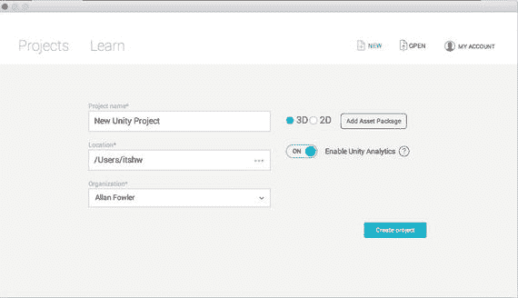

图 3-2. 使用项目向导创建新项目

项目向导会提示输入新项目的文件名和位置，默认位置是你的主文件夹，默认名称为 `New Unity Project`（如果该文件夹已存在，则会附加一个数字，例如 `New Unity Project 1`，如果这个也存在，则会是 `New Unity Project 2`，以此类推）。`Location` 框中的省略号按钮会打开一个文件选择器，这样你可以浏览并选择文件夹位置，而不必手动输入。

你可以随意命名项目，或者暂时使用默认名称。Unity 项目本身并不关心它的名字，所以你稍后可以在 Finder 中重命名项目文件夹（只需确保先退出 Unity 或切换到另一个项目，以避免破坏当前会话）。

**提示**
如果你有一个打算长期保留的项目，最好给它起一个有意义的名称。我不止一次在我的 Mac 上发现一个旧的 `New Unity Project` 文件夹，并纳闷它是否是重要的东西。

当选中 `Add Asset packages` 菜单项时，会列出我们可以立即导入到新项目中的资源包。现在你不需要选择任何包，因为你随时可以在以后导入所需内容。

现在，Unity 编辑器将会出现，显示一个全新的空项目（图 3-3）。`Project View` 中不显示任何资源（你可以在 Finder 中确认，你项目中的 `Assets` 文件夹没有文件），当前场景是一个未命名且未保存的场景，其中只包含一个名为 `Main Camera` 的 `GameObject`。

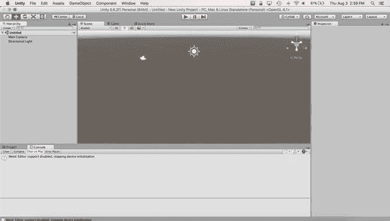

图 3-3. 编辑器中的新 Unity 项目外观

你应该做的第一件事就是保存并命名这个场景。`Save Scene` 选项位于 `File` 菜单中（图 3-4），并且拥有与应用程序保存操作中常见的 `Command+S` 快捷键相同的效果（你可以将 Unity 编辑和管理的场景类比于文字处理应用程序编辑和管理的文档）。

图 3-4. `Save Scene` 菜单项

由此出现的文件选择器将默认定位到项目的 `Assets` 文件夹，这没问题；场景是一种资源，也是项目的一部分，因此场景文件必须存放在 `Assets` 文件夹中。没有提供默认名称，所以你需要提供一个名称。我们叫它 `cube`，因为这个场景将只展示一个立方体。新场景会出现在 `Project View` 中，并带有一个 Unity 图标（图 3-5）。

图 3-5. Project View 中的新场景

当你退出 Unity 或切换场景或项目时，如果存在未保存的更改，Unity 会提示你保存场景（有时这些更改是无害的用户界面更改，所以不必惊慌）。但为了以防崩溃，经常保存是一个好习惯。

`File` 菜单中还有一个 `Save Scene As` 命令，类似于其他应用程序的 `Save As` 命令。它允许你随时以新名称保存场景，从而有效地创建场景的一个副本。

**提示**
除了使用 `Save Scene As` 命令，通常更简单的做法是在 `Project View` 中选择场景文件，然后重命名（按 `Return` 键）或在 `Project View` 中复制（`Command+D`）场景。

你可能想知道 `File` 菜单中的 `Save Scene` 和 `Save Project` 之间的区别。`Save Project` 保存对项目的任何更改，但不保存当前场景；而 `Save Scene` 会同时保存当前场景中的任何更改，即对场景中 `GameObjects` 的更改或对每场景设置（`RenderSettings`）的更改。`Save Scene` 将是大多数时候你会使用的。`Save Project` 适用于当你已对项目设置或资源进行了更改，希望保存这些更改，但场景的更改尚未准备好保存，或者甚至想保持新打开的场景完全不保存的情况。

## 主摄像机

新场景的 `Hierarchy View` 中只列出了一个名为 `Main Camera` 的 `GameObject`。每个新场景都从该摄像机 `GameObject` 开始，它在我们玩游戏时充当我们在场景中的眼睛。`Main Camera` 之所以特殊，是因为脚本可以很容易地访问它（它由变量 `Camera.main` 引用）。

### 多摄像机

摄像机名为 `Main Camera` 这一事实可能会让你相信一个场景中可以存在多个摄像机，你是对的。拥有多个同时存在的视点可能看起来很奇怪，但多摄像机使得分屏显示或屏幕内的窗口成为可能。在 Unity for iOS 中实际上并不支持这些用法（请参阅下面的“视口”部分），但多摄像机在诸如使用 `Main Camera` 渲染游戏世界，并使用另一个摄像机渲染用户界面的情况下仍然有用，这样可以有效地将一组 `GameObjects` 叠加在另一组之上。

### 摄像机构造

让我们选择 `Main Camera`，以便我们可以在 `Inspector` 视图中看到摄像机的构成（图 3-6）。

图 3-6. 主摄像机的 Inspector 视图

从顶部开始，你可以看到名称 `Main Camera`。左侧的复选框指定此 `GameObject` 是激活的还是未激活的。如果取消选中该复选框，摄像机将被停用，在 `Hierarchy View` 中显示为灰色，并且你在 `Game View` 中将看不到任何内容。如果你知道此 `GameObject` 将永远不会移动，可以选中右侧标记为 `Static` 的复选框。将 `GameObjects` 标记为静态有助于优化，尽管这很少适用于摄像机。

在名称下方，你可以看到此 `GameObject` 将 `MainCamera` 作为其标签，这实际上是将此 `GameObject` 指定为 `Main Camera` 的关键。名称仅用于显示目的，因此你可以在此处的 `Inspector View` 中编辑名称而不会产生任何影响。

此 `GameObject` 的 `Layer` 菜单在右侧。名称用于描述，标签用于识别，而层则用于对 `GameObjects` 进行分组。你可以把这些层想象成类似于 Photoshop 中的图层。这个 `Layer` 菜单不应与编辑器窗口右上角的 `Layers` 菜单混淆（不幸的是，它们在默认布局中很接近）。右上角的 `Layers` 菜单控制哪些 `GameObjects` 在 `Scene View` 中可见（它实际上应该位于 `Scene View` 中）。

### 变换组件

与其他所有 `GameObject` 一样，`Main Camera` 拥有一个 `Transform 组件`，该组件规定了 `GameObject` 的位置、旋转和缩放比例。缩放比例对于摄像机来说没有意义，但位置和旋转允许你放置并对准摄像机。

点击组件右上角的小问号图标。这将在网页浏览器中打开 `Transform 组件`的参考手册文档。

**提示：** 每次遇到新组件时，你首先应该做的就是查阅文档。

每个组件的参考手册页面都描述了该组件的属性并解释其用法。每个参考手册页面还包含一个指向该组件对应脚本参考页面的链接，详细说明如何从脚本中访问该组件。

### 摄像机组件

摄像机组件是使得此 `GameObject` 成为摄像机的关键。更准确地说，`Main Camera` 是一个拥有一个组件的 `GameObject`，该组件是名为 `Camera` 的组件子类。但是为了方便，我们可以说 `Main Camera` 是一个摄像机（因为这是它的功能），并称其为摄像机组件，以明确我们谈论的是这个组件。

同样，点击该组件的问号图标将打开相应的参考手册页面，其中列出了摄像机组件的属性。不过，我将在这里按它们在 Inspector 视图中从上到下的顺序简要介绍一下。

#### 清除标记

`清除标记`属性指定了摄像机在每次渲染通道开始时如何初始化颜色和深度缓冲区。颜色缓冲区包含摄像机渲染的像素，而深度缓冲区保存了每个像素到摄像机的距离（这用于确定新绘制的像素是否应替换该位置的先前像素）。

-   `实心颜色`表示颜色缓冲区会被清除为指定的颜色，本质上用作背景色，同时深度缓冲区也会被清除。
-   `天空盒`也会清除深度缓冲区，并在背景中渲染指定的天空盒纹理（如果没有提供天空盒，则默认使用 `实心颜色`）。
-   `仅深度`则保留颜色缓冲区不变，只清除深度缓冲区。这在添加一个在主摄像机之后渲染并覆盖其结果的摄像机时很有用，例如，在游戏世界渲染之上渲染用户界面或 HUD（抬头显示器）。在这种情况下，你不想让第二个摄像机在渲染前清除屏幕。

### 剔除遮罩

这正是图层（Layers）的实用之处。`剔除遮罩`指定了哪些图层会被该摄像机渲染。换句话说，一个 `GameObject` 仅当其所在的图层包含在摄像机的 `剔除遮罩`中时，才会对该摄像机可见。

默认的 `Everything`（全部）对应于所有图层，但是，例如，如果你有一个 HUD 摄像机，你可以为所有 HUD 的 `GameObject` 定义一个 HUD 图层，并将 HUD 摄像机的 `剔除遮罩`设置为仅渲染 HUD 图层。然后，你可以将主摄像机的 `剔除遮罩`设置为包含除 HUD 图层之外的所有内容。

#### 投影

默认情况下，摄像机设置为使用透视投影，正如我在前一章描述 Scene 视图时提到的，这意味着物体离摄像机越远显得越小（这种效果称为透视缩短）。在此模式下，摄像机拥有一个类似四棱锥（不包括底面）的视景体，从摄像机位置沿视线方向发出。这个视景体被称为视锥体（frustum），由视野 (FOV)、近平面和远平面定义。

视野类似于现实世界摄像机的 FOV。FOV 是垂直视角，以度为单位。水平视角则由 FOV 和摄像机的宽高比共同隐式定义。近平面和远平面指定了屏幕在摄像机前的距离以及视锥体底部的距离。位于视锥体之外的任何物体对摄像机都是不可见的。

为了更好地了解视锥体的外观，可以查看 Scene 视图。图 3-7 展示了当你按下 Scene Gizmo 上的 Y 轴箭头，将视角切换到俯视图时，主摄像机视锥体的样子。按下 F 键（Edit 菜单中 Frame Selected 命令的快捷键）将主摄像机在 Scene 视图中居中，然后拉远镜头，直到你能看到整个视锥体。你还应该取消选中 Gizmos 菜单中的 3D Gizmos 复选框，这样当你拉远镜头时，摄像机图标不会缩小到看不见。

Scene 视图右下角还会显示一个摄像机预览。这是摄像机当前会渲染的内容，也就是 Game 视图当前会显示的内容（你现在可以查看 Game 视图来确认）。这个场景中目前还看不到任何东西，但这个功能以后会很方便。

**图 3-7.** Scene 视图中的摄像机视锥体

请注意，只有当摄像机被选中并且 Inspector 视图中的摄像机组件处于打开状态时（Inspector 视图中的每个组件都可以通过点击左上角的小三角形来展开或折叠），视锥体轮廓和摄像机预览才会显示。这对于任何在 Scene 视图中具有额外图形显示的组件来说通常是成立的。在 Inspector 视图中打开或折叠该组件将切换该显示。

透视投影的替代方案是正交投影，它没有透视缩短效果，因此适用于 2D 游戏、等距游戏、用户界面和 HUD。正交模式特有的摄像机属性是正交投影大小，即正交视图在世界单位中的半高度。

#### 视口

`(0,0,1,1)` 的视口表示摄像机覆盖整个屏幕。这些数字是归一化的屏幕坐标，意味着屏幕宽度和高度上的坐标范围从 0 到 1。对于分屏或屏幕内的窗口，你会有多个摄像机，每个摄像机都有不同的视口；`(0,0,1,.5)` 覆盖了屏幕的一半。然而，Unity iOS 不支持未覆盖整个屏幕的视口。

#### 深度

深度是当场景中有多个摄像机时另一个有用的属性。在每次渲染更新期间，摄像机将按照其深度值从小到大的顺序执行渲染通道。因此，例如，如果你有一个用于显示 HUD 的第二个摄像机，你可以指定主摄像机的深度为 0，HUD 摄像机的深度为 1，以确保游戏世界先渲染，游戏 HUD 渲染在其之上。

#### 渲染路径

渲染路径决定了场景的渲染方式。每个摄像机可以有自己的渲染路径，或者默认使用 Player Settings 中指定的路径。`顶点光照`是最简单但最快的路径，`前向渲染`支持更高级的图形效果，而`延迟渲染`是最华丽但最慢的，并且在 Unity iOS 中不可用。

#### 目标纹理

如果为这个属性指定了一个纹理，摄像机将渲染到该纹理上，而不是屏幕上。然后可以将该纹理放置在场景中，例如，作为电视显示或汽车的后视镜。

#### HDR

此属性启用高动态范围 (HDR)，它处理 RGB 分量超出正常 0 到 1 范围的像素，便于渲染极高对比度的场景。HDR 在 Unity iOS 中不可用。

### FlareLayer 组件

当通过 `GameObject` 菜单创建摄像机 `GameObject` 时，会自动同时附加一个摄像机 `组件` 和一个 `FlareLayer` 组件。`FlareLayer` 组件允许摄像机渲染镜头光晕（本章稍后会介绍）。

`FlayerLayer` 组件有点特殊，因为它不对外公开脚本接口，所以它有参考手册页面，但没有脚本参考页面。但是，仍可以通过其类名从 `GameObject` 访问 `FlareLayer` 组件，即调用 `GetComponent("FlareLayer")`。

### GUILayer 组件

`GUILayer` 组件也会自动附加到摄像机 `GameObject` 上。此组件允许摄像机渲染 `GUIText` 和 `GUITexture`，这些是常用于用户界面的 2D 元素。

**注意**

`GUILayer`、`GUIText` 和 `GUITexture`（以及作为 `GUIText` 和 `GUITexture` 父类的 `GUIElement`）与 UnityGUI（一个更新的内置 GUI 系统）无关。

你可能已经注意到，Inspector 视图将 `GUILayer` 显示为一个单词，而 `Flare Layer` 显示为两个单词。编辑器尝试通过在大写字母跟随小写字母的地方引入空格，以更符合英文习惯的方式呈现类名。这对 `FlareLayer` 有效，但对 `GUILayer` 无效。无论如何，本书将坚持使用原始类名，因为这是在脚本中引用的方式。

### AudioListener 组件

`AudioListener` 组件仅自动附加到主摄像机，因为一次只能有一个 `AudioListener` 处于活动状态。摄像机组件类似于你的眼睛，负责将一切可见内容渲染到计算机屏幕上，而 `AudioListener` 组件负责将场景中所有可听的 `AudioSource` 路由到计算机扬声器。

## 向场景添加一个立方体

你可能已经注意到，Camera Preview 和 Game 视图没有显示任何内容，当你点击 Play 按钮时，Game 视图同样如此。当然，这是因为场景中除了摄像机之外没有任何东西。让我们通过创建立方体这个历史悠久的传统来纠正这一点。

### 制作立方体

在 `GameObject` 菜单的 `Create Other` 子菜单下，Unity 提供了许多捆绑了组件的 `GameObject`。如果我们想添加另一个摄像机，其中就有一个摄像机 `GameObject`。还有一个立方体 `GameObject` 以及许多其他基本形状（图 3-8）。

图 3-8. 从 `GameObject` 菜单创建立方体

从 `GameObject` 菜单中选择 Cube 项。这将创建一个立方体 `GameObject` 并将其添加到当前场景。该立方体将在层级视图中显示（图 3-9）为场景中的第二个 `GameObject`。

图 3-9. 层级视图中的新立方体 `GameObject`

### 框选立方体

尽管立方体已在场景中，但它可能不会立即在 Scene 视图中可见。为了确保可以在 Scene 视图中看到立方体，请在层级视图中选择该立方体，然后按 F 键（`Edit` 菜单中 `Frame Selected` 命令的快捷键），这将使立方体在 Scene 视图中居中显示（图 3-10）。

图 3-10. Scene 视图中的立方体

### 移动立方体

记住，`Frame Selected` 命令移动的是 Scene 视图摄像机，而不是你所观察的 `GameObject`。立方体可能是在任意位置创建的，因此通过将立方体的 `Transform` 的 `x,y,z 位置` 字段（图 3-11）中键入坐标 `(0,0,0)`，将其位置设置为世界原点。如果犯错，不必担心。你随时可以使用 `Edit` 菜单中的 `Undo` 和 `Redo` 命令来撤销和重做此类更改。在这种情况下，你可以撤销位置更改，然后重做。

图 3-11. 立方体的 Inspector 视图

### 立方体的结构

在 Inspector 视图中显示立方体时，看看它是由什么构成的。换句话说，看看立方体的哪些组件使其成为立方体。

#### Transform 组件

当然，与每个 `GameObject` 一样，都有一个 `Transform` 组件，它提供立方体的位置、旋转和缩放。

#### MeshFilter 组件

`MeshFilter` 组件引用 3D 模型，在 Unity 中称为网格，它由三角形和每个顶点的信息（如纹理坐标）组成。当不引用像立方体这样的内置网格时，此属性会分配一个来自项目资源的网格。

#### MeshRenderer 组件

与 `MeshFilter` 相辅相成的是 `MeshRenderer` 组件，它决定了网格的渲染方式，并且主要由材质（如果网格被分割成子网格，则是一系列材质）决定。你可以将材质想象成沙发上的布料——网格提供形状，材质包裹在网格周围以提供表面外观。

`MeshRenderer` 还控制网格是接收阴影还是投射阴影（我将在本章稍后介绍阴影）。

#### BoxCollider 组件

`MeshFiler` 和 `MeshRenderer` 组件共同作用只能让立方体可见。`BoxCollider` 组件提供了一个物理表面，用于 Unity 物理系统中的碰撞。由于此场景中没有可以与立方体碰撞的物体，因此你不需要此组件。将其保留在那里并无害处，但你也可以通过取消选中其复选框来禁用该组件。或者，你可以通过右键单击它并选择出现的菜单中的 `Remove Component`（图 3-12），从 `GameObject` 中完全移除该组件。

图 3-12. 移除组件

### 与视图对齐

由于你移动了立方体，可以再次按 F 键使其在 Scene 视图中居中。但这不会影响主摄像机，正如你可以从 Scene 视图中的 Camera Preview 和在 Game 视图中检查所见。

幸运的是，有一种方便的方法可以将主摄像机与 Scene 视图摄像机同步。选择主摄像机，然后在 `GameObject` 菜单下，调用 `Align With View`（图 3-13）。现在，主摄像机与 Scene 摄像机具有相同的位置和旋转，并且你可以在 Camera Preview 中看到 Scene 视图和 Game 视图是相同的。

图 3-13. `Align With View` 命令

## 摄像机控制

现在，如果你点击 Play 按钮，你可以看到立方体，但并没有太多内容发生。立方体只是呆在那里，并且没有任何交互性。对于只有一个物体的场景，我喜欢做的第一件事是添加一个摄像机轨道脚本，这样我就可以从各个角度检查这个物体。方便的是，Unity 在 Standard Assets 中提供了几个摄像机控制脚本，包括一个 `MouseOrbit` 脚本。

好的，作为高级文档工程师和翻译员，我将严格遵循您提供的注意事项和示例格式，对给定的英文文本进行翻译。

### 导入脚本

要导入该脚本，请前往 Assets（资源）菜单并选择 Import Package（导入包）子菜单。这与我们创建新项目时可用的 Assets 包列表相同（图 3-14）。

图 3-14. 从 Standard Assets（标准资源）导入脚本

从该列表中选择 Utility（实用工具），将弹出一个窗口，显示 Scripts（脚本）包中的所有脚本（图 3-15）。以 `.js` 扩展名结尾的脚本是用 JavaScript 编写的，以 `.cs` 扩展名结尾的脚本是用 C# 编写的。您可以只导入 `MouseOrbit` 脚本，也可以导入所有脚本。之后删除不需要的资源也很容易。

图 3-15. 可用的 Standard Assets（标准资源）脚本

现在，这些脚本及其包含的文件夹将显示在 Project View（项目视图）中（图 3-16）。Project View（项目视图）不会列出文件名的 `.cs` 后缀，但您可以从图标看出这是一个 C# 脚本，并且选择一个脚本会在 Project View（项目视图）底部的行中显示其完整名称。

图 3-16. 导入后的 Standard Assets（标准资源）脚本

如果您在 Project View（项目视图）中选择 C# 脚本，该脚本中的代码将显示在 Inspector View（检视视图）中（图 3-17）。

图 3-17. `SimpleMouseRotator` 脚本的 Inspector View（检视视图）

### 附加脚本

将 `SimpleMouseRotator` 脚本拖拽到 Hierarchy View（层级视图）中的 Main Camera（主摄像机）GameObject 上。这将把脚本附加到该 GameObject 上，因此现在如果您选择 Main Camera（主摄像机），`SimpleMouseRotator` 脚本将显示为其一个 Component（组件）（图 3-18）。

图 3-18. 附加到 Main Camera（主摄像机）上的 `SimpleMouseRotator` 脚本

`SimpleMouseRotator` Component 的第一个属性是对 `SimpleMouseRotator` 脚本的引用（注意 Unity 如何美化打印 Component 类型为 “Mouse Rotator”，但不要被误导，它实际上是 `SimpleMouseRotator`！）。实际上，您可以通过从 Project 视图中拖拽另一个脚本到该字段，或者点击其右侧的小圆圈（这会弹出一个可用脚本列表供您选择，目前这些脚本都是您刚刚导入的 Standard Assets 脚本）来更改该属性引用的脚本。

脚本本身决定了其后显示的属性。请注意，`SimpleMouseRotator` Component 中的每个属性都对应一个在 `SimpleMouseRotator` 脚本顶部声明的公共变量（以 `var` 开头的每一行都是一个公共变量，而以 `private var` 开头的则是私有变量）。

> **提示**
> 在 Inspector View（检视视图）菜单中选择 Debug（调试）选项（右上角）也会将私有变量显示为属性，这对于调试非常有用。现在试试，您会看到私有变量 `x` 和 `y` 显示出来。Debug（调试）选项还会为内置的 Components 添加诊断属性。

脚本定义的第一个属性是 `Target`，它是 Camera 将围绕旋转的 GameObject。它默认为空（或在代码中为 `null`），因此如果您点击 Play（播放），Camera 将没有东西可以围绕旋转。要纠正这一点，请将 Hierarchy View（层级视图）中的 Cube（立方体）拖拽到 `Target` 字段中（图 3-19）。

图 3-19. 分配 `SimpleMouseRotator` 脚本的 `Target` 属性

现在，当您点击 Play（播放）按钮时，随着您移动鼠标，Camera 会围绕 Cube（立方体）旋转。在 Play（播放）模式下，您可以调整其他属性，直到找到您喜欢的数值。`Rotation Range` 属性是摄像机的旋转范围。将其更改为 3 会极大地限制相机的移动（图 3-20）。`Rotation Speed` 属性控制 Camera 相对于鼠标移动的旋转速度，`Damping Time` 属性设置相机的阻尼量（限制相机抖动的程度）。

当您退出 Play（播放）模式时，属性将恢复为进入 Play 模式之前的值。此时需要再次输入所需的值。如果您最终得到了不喜欢的属性值，您可以随时点击 Component 右上角的图标并选择 Reset（重置）来恢复默认属性值。

图 3-20. 测试 `SimpleMouseRotator` 脚本

## 添加灯光

您可能一直在想 Cube（立方体）看起来非常暗。好吧，让我们添加一个 Light（灯光）！在 GameObject 菜单的 Create Other（创建其他）子菜单下，列出了几种类型的 Lights（灯光）（图 3-21）。让我们选择 Point Light（点光源）。

图 3-21. 创建一个 Point Light（点光源）

Point Light（点光源）现在显示在 Hierarchy View（层级视图）和 Scene View（场景视图）中（图 3-22），您可以看到其标志性组件是一个 Light Component，其类型设置为 Point。一个 Point Light（点光源）只照亮其半径内的物体。因此，您应该调整其位置或半径，以便立方体被照亮。您可以将其位置设置为 `5,5,5`（请记住，立方体位于 `0,0,0`），并将半径设置为 10。

图 3-22. 一个 Point Light（点光源）的 Inspector View（检视视图）

### 灯光剖析

正如 GameObject 在附加了 Camera Component 后成为 Camera 一样，GameObject 在附加了 Light Component 后会表现为一个 Light。与 Camera Component 类似，Light Component 也有几个属性，我们将按照 Inspector View（检视视图）中自上而下的顺序在此进行介绍。

#### 类型

Light 的 `Type` 指定它是 Point Light（点光源）、Directional Light（方向光）、Spot Light（聚光灯）还是 Area Light（面光源）。由于此 GameObject 是作为 Point Light（点光源）创建的，因此其 `Type` 会自动设置为 Point。与充当无限远处光源的 Directional Light（方向光）（有时也称为无限光）相比，Point Light（点光源）有一个位置（因此通常被称为位置光）并向各个方向辐射。Spot Light（聚光灯）也有一个位置，但像锥体一样向特定方向辐射。Area Light（面光源）仅用于生成光照贴图（预计算并“烘焙”到纹理中的光照）。

#### 范围

Point Lights（点光源）的 `Range` 属性指定了 Light 的半径。只有半径内的物体才会受到该 Light 的影响。

#### 颜色

`Color` 属性是 Light 发出的颜色。单击小颜色矩形会弹出一个颜色选择器来分配此属性。

#### 强度

Light `Intensity` 的范围是从 0 到 1，其中 0 表示无光照，1 表示最大亮度。

#### 阴影类型

Light 的 `Shadow Type` 属性指定该 Light 是否投射阴影，如果是，则指定是 Hard Shadows（硬阴影）还是 Soft Shadows（软阴影）。

#### 轮廓遮罩

Directional Lights（方向光）和 Spot Lights（聚光灯）可以将一个 Cookie 纹理投射到表面上，通常用于模拟阴影。

### 剔除遮罩

`Culling Mask`属性指定光照将影响的层。与相机组件的`Culling Mask`决定哪些对象对相机可见非常相似，光照的`Culling Mask`决定哪些对象被光照照亮。

### 镜头光晕

`Flare`属性，当分配了一个`Flare`资源时，会从此光照产生一个镜头光晕效果。

### 绘制光晕

`Draw Halo`属性会在光照位置周围产生一个光晕效果。启用此属性时，还会提供一个额外的光晕颜色属性。

### 渲染模式

光照的`Render Mode`指定光照是`Important`、`Not Important`还是`Auto`，这意味着其重要性会根据光照的亮度和当前的`Quality Settings`自动确定。光照的重要性决定它是否被应用为像素光照。像素光照是阴影和`Cookie`等效果所必需的。

### 光照贴图

`Lightmapping`属性决定此光照是用于动态光照、生成光照贴图，还是两者兼用。在这些示例中你不会使用光照贴图（它们需要很长的生成时间），因此`RealtimeOnly`或`Auto`对于这些光照来说是可以的。

### 调整光照

与相机一样，当你在`Inspector`中选择点光源并打开其`Light`组件时，`Scene View`中会描绘出关于该光照的更多信息。对于点光源，会显示其半径，因此你可以看到哪些对象受光照影响（图 3-23）。为了让立方体受到点光源影响，它必须位于光照的半径内。但请记住，点光源从自身位置向外辐射，因此你不能将点光源放置在立方体的同一位置，因为那样光照会从立方体内部向外辐射，而不会照亮立方体的外表面。

你可以仅在`Inspector View`中调整光照属性，但这里尝试使用`Scene View`。点击编辑器左上角按钮栏中的`Move`按钮（即`Hand`工具右侧带箭头的按钮）。现在选中点光源后，`Scene View`会在光照中心显示对应光照 x、y、z 轴的箭头。点击并拖动任意箭头，光照就会沿相应轴移动。

图 3-23. 点光源的`Scene View`

光照周围的圆圈描绘了光照的范围。你可以通过点击并拖动圆圈内部的小黄色矩形来调整范围。范围内的任何物体都会被光照照亮，而范围外的物体则不受光照影响。

**警告**  
与点光源位置完全相同的对象不会受到该光照的影响。

请继续移动光照并根据需要调整其半径，以确保立方体被照亮。现在点击`Play`按钮，立方体被照亮，并且当你围绕立方体旋转相机时，光照会发生变化。

### 创建光晕

目前点光源在`Play`模式下本身是不可见的。光照的存在只能通过它照亮的`GameObject`来体现。但是，如果你启用了光晕，就可以看到光照的来源。在`Inspector View`中启用`Draw Halo`属性，同时点击`Color`属性更改光照的颜色（图 3-24）。

图 3-24. 选择光晕颜色

这不仅会影响从物体反射的光照颜色，还会影响用于绘制光晕的颜色。你可以在`Scene View`中看到光晕（图 3-25），以及在点击`Play`时看到（图 3-26）。

图 3-26. 带有光晕的点光源的`Game View`

图 3-25. 带有光晕的点光源的`Scene View`

### 纹理

### 导入纹理

几乎你 Mac 上的任何图像文件（`.jpeg`、`.png`、`.tiff`、`.psd`）都可以通过调用`Assets`菜单中的`Import Asset`命令（图 3-27）并在弹出的选择器中选择图像文件来导入作为纹理。

图 3-27. 导入新资源

在这个例子中，我选择了一张来自`Photos`目录的猫咪图片，该图片由`iPhoto`存储。你可以通过从[`www.apress.com/9781484231739`](http://www.apress.com/9781484231739)下载来自由使用此文件（它位于本章项目的`Textures`文件夹下）。但如果你 Mac 上有任何受支持文件格式的图像，那也是可以的。导入图像文件后，生成的纹理将出现在`Project View`中（图 3-28）。

图 3-28. 新导入纹理的`Project View`

选择纹理并在`Inspector View`中检查其导入设置（图 3-29）。默认的`Texture Type`（`Texture`）是通常适用于应用于模型的纹理的预设类型。如果有未应用的`Import Settings`，`Apply`按钮会启用并应被点击（否则 Unity 在尝试使用纹理时会提示你）。

图 3-29. 导入纹理的`Inspector View`

注意底部的`Preview`面板如何总结纹理的导入大小和格式。原始图像文件没有以任何方式改变，因此导入文件实际上创建了一个适合我们目标平台的原始文件的副本。你永远不必担心弄乱原始资源。实际上，你始终可以通过在`Project View`中右键单击它并选择`Reimport`来从它重新开始。

**注意**  
我们一直泛泛地、不大写地使用术语`texture`。实际上有一个`Texture`类，它是所有纹理类型的父类，但通过导入图像文件创建的纹理资源的实际类名是`Texture2D`（`Texture`的其他子类包括`Texture3D`、`MovieTexture`和`RenderTexture`）。

要将纹理应用到立方体，将纹理拖到`Hierarchy View`中的立方体上。这会自动使用纹理创建一个`Material`，并将该`Material`应用到立方体，替换掉之前存在的`Material`。（图 3-30）。

图 3-30. 应用于立方体的纹理

在`Project View`中，你现在可以看到新创建的`Material`被放置在与纹理相同位置的一个`Materials`文件夹中。现在再次点击`Play`，立方体看起来很棒！（图 3-31）。

图 3-31. 带有纹理的立方体的`Game View`

### 浏览资源商店

Unity 在`Standard Assets`中并没有内置很多纹理（尽管各种资源包中包含了许多纹理）。不过，Unity 资源商店（一个专为 Unity 准备的资源市场）提供了几个免费的纹理包。方便的是，资源商店已集成到 Unity 编辑器中。在`Window`菜单（图 [3-32]）下，选择`Asset Store`项。

**图 3-32.** 从 Window 菜单中选择资源商店

这将打开`Asset Store`窗口并显示资源商店首页（图 [3-33]），其中列出了最新发布的内容（包括付费和免费资源）、分类以及精选项目。

**图 3-33.** Unity 资源商店

让我们找一些免费纹理。点击页面右上区域的`Textures & Materials`分类，然后在左侧的`Maximum Price`中选择`Free`（图 [3-34]）。

**图 3-34.** 资源商店中的免费纹理

这里有很多不错的选择，但如果你向下滚动，应该能找到我最喜欢的免费纹理库：Free ArtskillZ Texture Pack。点击它查看完整的产品页面（图 [3-35]）。它包含了产品描述、截图、各文件列表以及用户评价。

**图 3-35.** 资源商店中的 ArtskillZ 纹理包

### 导入纹理

点击`Download`按钮，你会看到与导入内置 Unity 资产时相同的`Import`窗口。继续并导入所有内容。

现在，你会在`Project View`中找到所有这些纹理，它们被按类别分成了三个文件夹（图 [3-36]）。

**图 3-36.** ArtskillZ 纹理的项目视图

显示蓝色图标的纹理是法线贴图，其`Texture Type`字段中也会如此标注。法线贴图能营造非平面表面的错觉（有时也使用*凸凹贴图*这个术语，尽管严格来说两者并不完全相同）。

### 应用纹理

首先，我们尝试使用`ScifiPanel01`纹理。将其拖拽到立方体上，Unity 会自动创建一个以该纹理命名的新材质，并将该材质应用于立方体。但我们想使用伴随该纹理的法线贴图，所以在`Inspector`视图中使用材质的`Shader`选择器，将着色器更改为`Legacy Shaders Bumped Specular`。此着色器接受一个标记为`Normalmap`的第二纹理，并带有一个用于控制`Shininess`属性的滑块（需要注意的是，滑块向左移动接近 1，向右移动接近 0）。将法线贴图纹理`ScifiPanel01_n`拖入`Normalmap`字段（图 [3-37]）。

**图 3-37.** 应用于立方体的 Sci-fi 纹理

点击`Play`，你现在就能看到带有纹理的立方体了（图 [3-38]）。

**图 3-38.** 带有高光凸凹贴图纹理的立方体的游戏视图

你也可以使用`Project View`中的搜索字段来搜索免费纹理。在接下来的章节中，当我们使用更多资源商店的资源包时，我会使用这个选项。

## 进一步探索

本章可能看起来为了创建一个简单的静态场景而涵盖了大量内容（无意双关），但在此过程中我们探索了许多 Unity 的基本概念，特别是组件与游戏对象之间的关系。因此，现在你拥有了一个带有凸凹贴图和纹理的立方体场景，并有一个带有耀斑的点光源为其照明。场景中填充了从本地文件、Unity 标准资源以及 Unity 资源商店导入的资产。并且，由于`Main Camera`上附加了`SimpleMouseRotator`脚本，场景并非完全静态。脚本编写将在本书中扮演主导角色，从下一章开始，我们将超越静态场景。

在继续之前，休息一下，回顾一下 Unity 官方文档中关于目前所用功能的部分，哪怕只是为了熟悉日后查阅文档的位置。

### Unity 手册

Unity 手册的`Unity Basics`部分主要与上一章相关，描述了用户界面，但该部分确实有一个“Creating Scenes”页面。更相关的是“Building a Scene”部分，它描述了游戏对象、组件和脚本之间的关系，如何使用`Inspector View`编辑组件属性，以及如何在`Scene View`中导航和移动游戏对象——所有这些在本章中都有涉及。灯光和摄像机也得到了解释。本节列出的一个本书不会使用的功能是地形引擎（在 Unity iOS 中可用，但运行缓慢）。不过，地形是一个非常重要且令人印象深刻的 Unity 功能，因此值得一读。“Asset Import and Creation”部分描述了本章使用的资产类型：网格、材质、纹理和脚本。资产的导入过程以及资源商店也在此部分得到了解释。

我们尚未到达有游戏玩法的阶段，但“Creating GamePlay”部分有一个关于“Transforms”的页面，我们看到，即使只是放置静态游戏对象，理解它也是基础。

### 参考手册

《参考手册》比《Unity 手册》内容更深入，详细描述了每个组件，解释了其属性并记录了组件的使用方法。《参考手册》还记录了资源类型，并对`GameObject`进行了说明。

通常，你应该阅读所用每个组件和资源类型的《参考手册》文档。请记住，检查器视图中的每个组件上都有一个帮助图标，点击该图标即可调出相应的《参考手册》页面。与《Unity 手册》一样，《参考手册》不仅可通过 Unity 帮助菜单获取，还可从 Unity 网站的“学习”选项卡下找到（可直接访问 [`docs.unity3d.com/`](http://docs.unity3d.com/)）。《参考手册》的“设置管理器”部分包含一个关于渲染设置的页面，本章中的天空盒就是在那里分配的。“变换组件”部分只列出了一个组件，即变换组件，它自然附加在每个`GameObject`上。

“网格组件”部分更有趣，因为它描述了任何带有网格的`GameObject`（例如本章创建的立方体）所需的`MeshFilter`和`MeshRenderer`组件。“渲染组件”部分内容更丰富，其中包含了摄像机组件及其关联的`GUILayer`组件和`FlareLayer`。光照组件也在此处进行了记录。虽然资源并非真正的组件，但《参考手册》中有一个名为“资源组件”的部分，列出了各种资源类别。在本章中，`Flare`、`Material`、`Mesh`和`Texture2D`被整合到了场景中（记住，天空盒实际上是一种`Material`）。

最有趣的阅读内容在“内置着色器指南”部分，该部分详细（并附有图片）描述了所有内置着色器，范围从简单快速到非常花哨。本章中的立方体最初使用默认的漫反射着色器，随后被替换为高级高光法线贴图着色器。正如本章所述，着色器实际上是一个程序，因此如果你找不到满足需求的内置着色器，可以遵循“着色器参考”部分中的示例和说明自行编写。

### 资源商店

本章开始了我们贯穿全书的实践，即使用 Unity 资源商店中的免费资源。我建议定期浏览资源商店以查看最新发布内容。除了免费的纹理、模型和脚本外，还有大量价格合理的资源包，可以为你节省大量时间和工作。资源商店也可以通过常规网络浏览器在 [`assetstore.unity3d.com/`](http://assetstore.unity3d.com/) 查看（但无法购买或下载任何资源）。

### 计算机图形学

计算机图形学是一个庞大而复杂的研究领域。本章涉及了 3D 模型、纹理、法线贴图、光晕、天空盒，而我们还只是刚刚开始。因此，非常值得深入阅读基础（和高级）计算机图形学知识，例如由 Tomas Akenine-Möller、Eric Haines 和 Naty Hoffman 合著的广受欢迎且内容全面的书籍《实时渲染》。Mark Haigh-Hutchinson 的《实时摄像机》则是一本专门探讨虚拟摄像机及其控制方案的著作。

我不会涉及创建可导入 Unity 的资源的过程，但 Luke Ahearn 有两本书可能会对你有普遍帮助：《3D 游戏纹理：使用 Photoshop 创建专业游戏美术》和《3D 游戏环境：创建专业的 3D 游戏世界》。而从 Wes McDermott 的《使用 Unity 为 iPhone 创建 3D 游戏美术》的书名可以看出，它是本书一本合适的补充读物。

