# 4. 让它动起来：为立方体编写脚本

现在你已经知道如何通过放置游戏对象来构建静态 3D 场景，是时候通过在游戏运行时为游戏对象添加运动来让场景变得动态且更有趣了。毕竟，3D 图形场景很不错，但动画化的 3D 图形场景更棒！

但是，应用动画数据并不是移动`GameObject`的唯一方法。将`GameObject`设置为物理对象会使它响应碰撞和力（包括重力）而运动。脚本也可以通过更改其`Transform`组件中的位置和/或旋转值来移动`GameObject`。事实上，任何移动`GameObject`的方法，无论是动画、物理还是脚本，最终都会更改`Transform`组件，该组件始终表示`GameObject`的位置、旋转和缩放。

本章将重点介绍通过脚本移动游戏对象，演示如何旋转上一章中创建的原本静态的立方体，甚至还会介绍补间风格动画。在此过程中，我将介绍 Unity 脚本系统的基本概念和工具（编辑和调试）。

你将编写的脚本可在 [www.apress.com/9781484231739](http://www.apress.com/9781484231739) 的本章项目中找到，但我建议你从头开始创建它们。当你自己输入代码时，你才最有可能理解代码的工作原理（以及何时失效）。

## 组织资源

当资源按类型分类时，在项目视图中查看和浏览资源会更方便。因此，在开始添加脚本之前，现在是整理并为项目中的脚本和纹理创建一些文件夹的好时机。启动 Unity 编辑器（如果你没有从上一章中打开它），并确保你已加载上一章的项目并打开了立方体场景。然后点击项目视图左上角的创建按钮（图 4-1），弹出一个可以添加到项目中的新资源菜单（或者，你可以在项目视图中右键单击并选择“创建”子菜单）。选择菜单中的“文件夹”项，一个名为“新文件夹”的文件夹将出现在项目视图中。将该文件夹重命名为“Textures”，并将你在上一章中导入的任何纹理（例如我的猫的照片）拖入其中。虽然你还没有创建任何脚本，但也请继续创建一个“Scripts”文件夹。

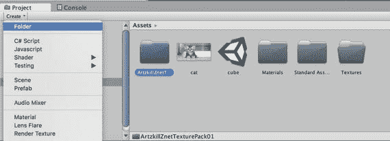

图 4-1. 在项目视图中创建 Textures 文件夹

#### 创建脚本

选择新添加的“Scripts”文件夹，然后同样从项目视图的“创建”菜单中，选择“JavaScript”（图 4-2）。一个名为“New Behaviour”（美国读者，你们得习惯这种英式拼写）的脚本将出现在“Scripts”文件夹中。如果你不小心在“Scripts”文件夹之外创建了新的脚本文件，只需将脚本拖入该文件夹即可。

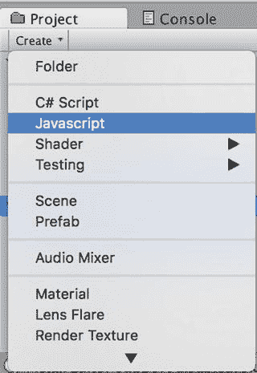

图 4-2. 创建 JavaScript 脚本

注意：虽然项目视图的“创建”菜单中列出的是“Javascript”（只有首字母大写），但我会假装它写的是“JavaScript”，这是官方的大小写形式，并且也是 Unity 文档中使用的（谁知道呢，也许某次 Unity 更新随时会修正菜单中的拼写）。此外，本书将使用短语“a JavaScript”来指代脚本，而不是更正确但说起来拗口的“a JavaScript script”。

由于这个新文件是 JavaScript，它带有 `.js` 扩展名。项目视图不显示文件扩展名，但脚本的语言可以从其图标中看出来（图 4-3）。并且如果选中该脚本，其完整名称会显示在项目视图底部的行中。

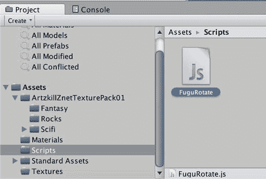

图 4-3. 新脚本的项目视图


### 为脚本命名

`NewBehaviour` 这个脚本名称缺乏实际意义，因此首要任务就是为它取一个新名字。一个显而易见的选择是`Rotate`，因为该脚本的最终目的是旋转立方体。但使用过于通用的名称可能会引发冲突（Unity 会报告错误），即使两个同名脚本位于不同文件夹中也是如此。这是因为每个脚本都会定义一个新类（具体来说是`MonoBehaviour`的子类），而你不能拥有两个同名的类。

一种解决方案是为每个脚本添加标准前缀（类似于 Objective-C 类以`NS`开头）。这是第三方 Unity 用户界面包常用的技术。如果每个人都把自己的按钮类命名为`Button`，它们就无法共存！

**注意**

C#脚本可以选择将类划分到不同的命名空间中，以避免名称冲突。本书几乎全程使用 JavaScript，但在第[17](https://doi.org/10.1007/978-1-4842-3174-6_17)章中提供了 C#脚本和命名空间的示例。

有时，如果脚本是特定于某款游戏的，我会使用游戏名称作为脚本名称前缀（例如，在 HyperBowl 中，我有许多以 Hyper 开头的脚本）。不过，我通常会在脚本名称前加上`Fugu`前缀，这对应我的游戏品牌 Fugu Games。本书将沿用这一惯例，因此可以继续将新脚本命名为`FuguRotate`（图 4-3）。当然，通常你可以自由选择自己的脚本命名规范。

### 脚本剖析

如果在项目视图中选中`FuguRotate`脚本，检查器视图会显示其源代码，至少会显示检查器视图窗口所能容纳的部分（图 4-4）。

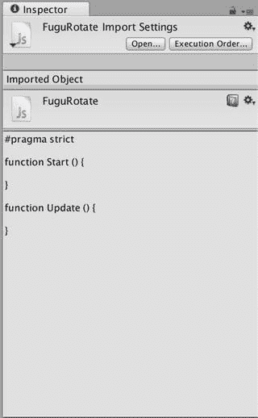

图 4-4. 新脚本的检查器视图

如检查器视图所示，当 Unity 创建新脚本时，它包含三个项目（列表 4-1）。

```
#pragma strict
function Start () {
}
function Update () {
}
```
列表 4-1. 新脚本的内容

脚本的第一行`#pragma strict`指示脚本编译器所有变量都必须有类型声明，或者至少其类型能被编译器轻松推断。这不是 Unity 桌面版构建的强制要求，但却是 Unity iOS 的必需项，因此最好养成这个习惯。

**注意**

本书中所有完整的脚本列表都以`#pragma strict`开头。任何不包含该行的代码都只是脚本的摘录。

脚本中的两个函数是回调函数，它们会在游戏中的特定时刻由 Unity 游戏引擎调用。当此脚本首次被启用时，会调用`Start`函数。只有当一个组件所依附的`GameObject`也处于活动状态时，该组件才算完全启用。因此，如果某个`GameObject`在场景中初始即为活动状态，并且它附带了一个已启用的脚本，那么当场景开始播放时，该脚本的`Start`函数就会被调用。否则，`Start`函数要等到脚本被启用（通过设置脚本组件的`enabled`变量）并且`GameObject`被激活（通过调用`GameObject`的`SetActive`函数）时才会被调用。

与在脚本组件的生命周期中最多只被调用一次的`Start`函数不同，`Update`函数会在每一帧被调用（即，在 Unity 每次渲染当前场景之前调用一次）。与`Start`函数类似，`Update`只在脚本（完全）启用时才会被调用，并且对`Update`的首次调用发生在仅执行一次的`Start`调用之后。因此，`Start`函数非常适合执行`Update`函数所需的任何初始化工作。

### 附加脚本

与项目视图中的其他资源一样，脚本在添加到场景中之前不会产生任何效果，具体来说，是作为`GameObject`的一个组件。最终目标是让`FuguRotate`脚本旋转立方体，因此将其从项目视图拖拽到层级视图中的立方体`GameObject`上。检查器视图现在会显示该脚本已作为组件附加到立方体上（图 4-5）。

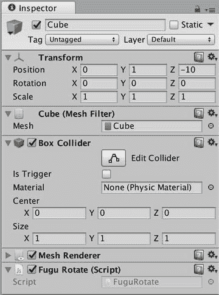

图 4-5. 附加到立方体的`FuguRotate`脚本

Unity 通常提供两种（有时是三种）方式来执行同一操作。例如，你也可以通过点击立方体检查器视图中的`Add Component`按钮，然后从弹出的菜单中选择`FuguRotate`脚本，将脚本附加到立方体上。或者，你也可以将`FuguRotate`脚本拖拽到`Add Component`按钮下方的区域中（但如果按钮下方显示的空间不足，这个操作会很难执行）。

### 编辑脚本

现在是时候填充脚本内容了。在项目视图中选中`FuguRotate`脚本，然后在检查器视图中点击`Open`按钮以打开脚本编辑器。在项目视图中双击脚本，或在脚本上右键单击并选择`Open`，也是可行的。Unity 的默认脚本编辑器是 MonoDevelop 的定制版本，这是一个为 Mono（Unity 脚本系统底层的开源框架）量身定制的代码编辑器和调试器（图 4-6）。

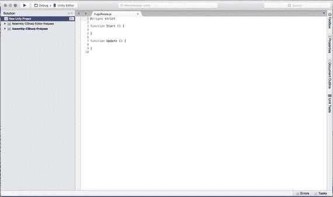

图 4-6. MonoDevelop 编辑器

如果你更喜欢使用其他脚本编辑器，可以通过打开 Unity 的首选项窗口，选择`External Tools`选项卡，然后浏览并选择你喜欢的应用程序来更改默认设置（图 4-7）。

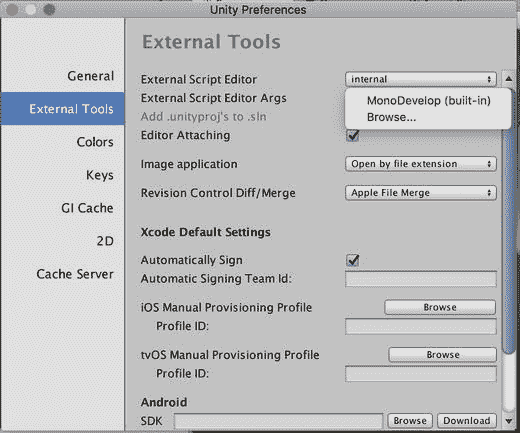

图 4-7. 选择不同的脚本编辑器

当前的`FuguRotate`脚本不会产生任何明显的效果，因为回调函数是空的，大括号之间没有任何代码。让我们先在`Start`和`Update`函数中添加一些追踪代码，以演示这些回调函数何时被调用（列表 4-2）。

```
function Start () {
Debug.Log("Start called on GameObject "+gameObject.name);
}
function Update () {
Debug.Log("Update called at time "+Time.time);
}
```
列表 4-2. 添加了`Debug.Log`调用的`FuguRotate.js`

Unity 的 MonoDevelop 的一个很酷的功能是代码自动补全。例如，图 4-8 展示了当输入 `Time.t` 时，MonoDevelop 会弹出一个列表，其中包含作为`Time`类成员的函数和变量，并查找以 `t` 开头的那个。

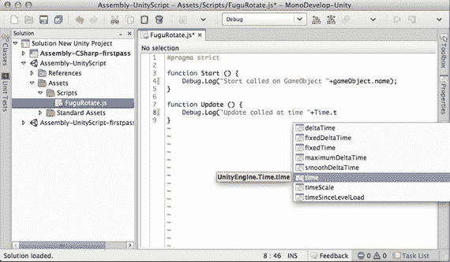

图 4-8. MonoDevelop 中的自动补全


## 理解脚本

既然 `FuguRotate` 脚本能执行某些操作了，我们不妨来理解一下具体在做什么。`Start` 和 `Update` 都调用了 `Debug.Log` 函数，用于在控制台视图中打印消息。`Log` 是 `Debug` 类中定义的一个**静态函数**，这意味着你可以通过在函数名前指定类名来调用它，而无需指定对象（在类中定义的函数也称为方法）。

**注意**：静态函数和变量也称为类函数和类变量，因为它们与类本身关联，而非类的实例。

变量 `gameObject` 引用了该组件（脚本）所挂载的 `GameObject`（在本例中为立方体），而每个 `GameObject` 也有一个 `name` 变量，用于引用该 `GameObject` 的名称（本例中为 Cube）。`+` 运算符可用于连接两个字符串（它的作用可不只是加法），因此 `Start` 函数会打印 “Start called on GameObject”，后跟该 `GameObject` 的名称。

类似地，`Update` 函数调用 `Debug.Log`，将 “Update called at time” 与静态变量 `Time.time` 的值拼接起来，该变量存放了游戏开始以来经过的时间（以秒为单位）。`Time.time` 的类型是 `float`（浮点数，可以表示非整数值），但 `+` 运算符会在拼接之前将数字转换为字符串。

## 阅读脚本参考文档

除了自动补全功能外，MonoDevelop 的另一个便捷特性是能够显示任何 Unity 类、函数或变量的脚本参考文档。在脚本中点击 `Debug.Log` 调用开头的 `Debug`，然后按下 Command+’ 键，浏览器窗口就会显示 `Debug` 类的脚本参考文档。点击 `Log` 则会显示 `Debug.Log` 函数的特定文档。

**提示**：每次遇到不熟悉的 Unity 类、函数或变量时，你应该做的第一件事就是阅读其脚本参考文档。

图 4-9 展示了 Unity 帮助菜单。

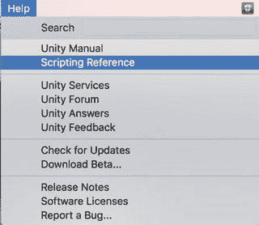

图 4-9. 从帮助菜单调出脚本参考文档

脚本参考文档包含所有 Unity 类及其函数和变量的说明。我发现，在脚本参考文档中查找任意 Unity 类、函数或变量的最快方法是在搜索框中输入其名称。MonoDevelop 的搜索功能使你可以搜索需要帮助的函数（图 4-10）。

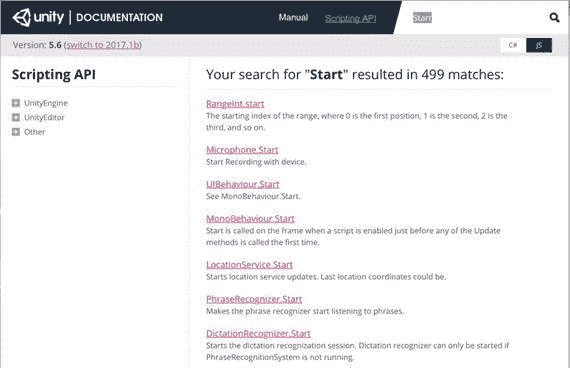

图 4-10. 脚本参考文档

然而，点击左侧的 Classes 可以查看类列表（图 4-11）。有些类（如 `Debug` 和 `Time`）是**静态类**，这意味着它们只包含静态函数和变量（所有 Unity 函数都位于类中），并且没有必要对它们进行子类化。

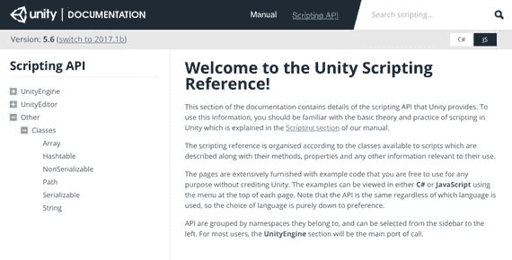

图 4-11. 类列表

然而，大多数类充当对象的类型。场景中的立方体是 `GameObject` 类的一个实例。而 `GameObject` 是 `Object` 的一个**子类**，这意味着它继承了 `Object` 所有已记录的变量和函数。从概念上讲，用面向对象的术语来说，立方体是一个 `GameObject`，因此也是一个 `Object`。这与 `GameObject` 和组件之间的关系形成对比。立方体是一个 `GameObject`，并具有一个 `MeshFilter`（该组件又包含一个 `Mesh`）。

包括灯光和摄像机在内的许多组件都是 `Behaviour` 的子类，`Behaviour` 是一种可以启用或禁用的组件（检查器视图中的复选框即可证明这一点）。不过也有一些组件并非如此，比如 `Transform`，它是组件的直接子类（中间无其他类），并且不能被禁用（检查器视图中没有复选框）。

每个脚本实际上都是 `MonoBehaviour` 的一个子类，而 `MonoBehaviour` 是 `Behaviour` 的子类（因此你可以启用和禁用脚本）。因此，`FuguRotate` 脚本定义了一个名为 `FuguRotate` 的 `MonoBehaviour` 子类。在 JavaScript 中，这个类声明是隐式的，尽管你也可以显式声明，如清单 4-3 所示。

```
#pragma strict
class FuguRotate extends MonoBehaviour {
function Start () {
var object:GameObject = null;
Debug.Log("Start called on GameObject "+object.name);
}
function Update () {
Debug.Log("Update called at time "+Time.time);
}
}
```

清单 4-3. 显式类声明版本的 `FuguRotate.js`

## 运行脚本

正规编程类似于你在学校学到的科学方法。你应该对事物如何运作有一个总体理论，假设你的代码应该做什么，然后进行实验来验证该假设。换句话说，是时候运行你的代码，看看它是否如预期那样工作了。当你点击 Play 时，由 `Debug.Log` 输出的消息将显示在控制台视图中（图 4-12）。

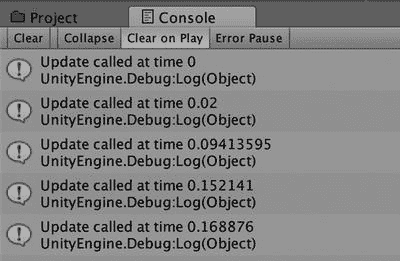

图 4-12. 追踪 Start 和 Update 回调

如果代码的行为不符合预期，那么是时候修正你对其运作方式的理论了。这可能只是小小的安慰，但调试代码本身就是一种学习体验！

## 调试脚本

当然，你的代码在输入后不可能是完美的。相反，通常需要多次迭代调试。错误基本上有两种类型：编译错误（甚至在你尝试运行游戏之前就出现）和运行时错误（在游戏运行期间发生）。

### 编译错误

每次保存脚本时，它都会被自动编译（从源代码转换为实际运行的代码格式）。脚本中阻止成功编译的错误会以红色显示在 Unity 编辑器底部和检查器视图中。

双击编辑器底部的错误消息，将在控制台视图中显示相应的消息；双击控制台视图中的消息，会打开脚本编辑器，光标定位在出错的代码行。即使没有这种便利，错误消息也会列出出错代码的文件名和行号，以便你手动查找。

例如，如果你在 `Update` 函数中将 `Time.time` 误输入为 `Time.tim`，那么一旦你尝试保存脚本，就会出现错误消息（图 4-13）。方便的是，Unity 通常能很好地建议你可能想要输入的内容（尽管计算机通常不擅长“按我的意思做，而不是按我说的做”）。

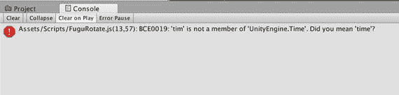

图 4-13. 脚本编译错误

### 运行时错误

与编译错误类似，运行时错误也会显示在控制台视图中。为了演示，请将 `Start` 函数中对 `gameObject` 的引用替换为对本地变量 `object` 的引用。本地变量在函数声明内部声明，因此只能在该函数范围内访问。在本例中，`object` 被初始化为 `null`，这意味着它没有引用任何实际的 `GameObject`，并且从未被赋予任何 `GameObject`。当你点击 Play 时，脚本尝试引用该 `GameObject` 的名称会导致错误（图 4-14）。

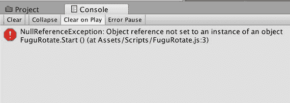

图 4-14. 脚本运行时错误


#### 使用 MonoDevelop 调试

我大部分调试工作仍然是通过调用 `Debug.Log` 并在控制台视图中检查错误消息来完成的。但现代程序员更习惯于使用更复杂的调试工具。事实证明，MonoDevelop 也提供了一个功能完备的调试器，并且经过定制可以与 Unity 协同工作。

如果你在 Unity 编辑器中编辑脚本时 MonoDevelop 没有自动打开，你可以通过 MonoDevelop 的“文件”菜单打开它，或者双击访达中的解决方案文件（即图 4-15 中高亮显示的文件）。

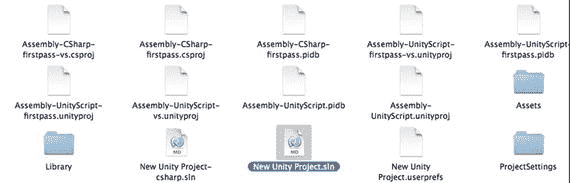

图 4-15. MonoDevelop 项目文件

加载 MonoDevelop 解决方案后，通过从 MonoDevelop 的“运行”菜单中选择`附加到进程`来启用调试（图 4-16）。

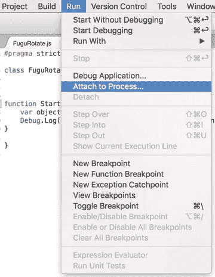

图 4-16. MonoDevelop 的 `附加到进程` 命令

然后在弹出的进程列表中选择`Unity Editor`（图 4-17）。

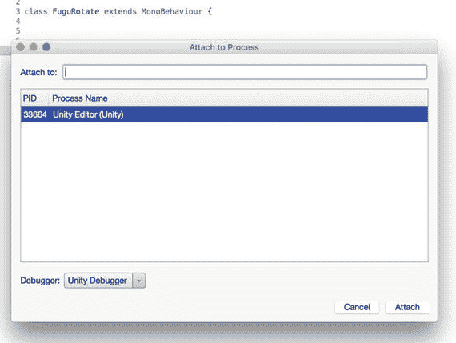

图 4-17. 将 MonoDevelop 附加到 Unity 编辑器

再次点击“播放”，这次 MonoDevelop 不仅会显示发生错误的代码行，还会显示具体的错误类型（`NullReferenceException`）以及相关的信息，例如堆栈跟踪，这对于确定导致错误的函数调用链非常有用（图 4-18）。

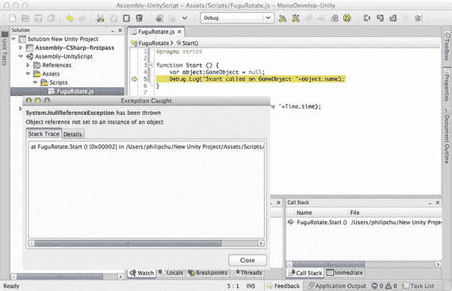

图 4-18. 附加 Unity 编辑器后 MonoDevelop 的错误详情

在调试模式下，Unity 编辑器可能无响应，因此当你完成一次调试运行后，请从 MonoDevelop 的“运行”菜单中选择`分离`，以分离 Unity 编辑器进程（图 4-19）。`分离`命令也可以在 MonoDevelop 工具栏上作为一个按钮使用。

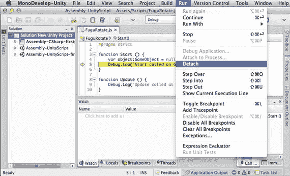

图 4-19. 从 MonoDevelop 分离 Unity 编辑器进程

让我们通过将变量 `object` 的初始值从 `null` 改为脚本的 `GameObject` 来修复空引用问题（清单 4-4）。

```
function Start () {
var object:GameObject = this.gameObject;
Debug.Log("Start called on GameObject "+object.name);
}
清单 4-4. 修复了空引用问题的 FuguRotate.js 中的 Start 函数
```

对 `this.gameObject` 的引用等同于仅使用 `gameObject`。变量 `this` 始终引用当前对象，即此脚本组件（在其他一些编程语言中，使用 `self` 的方式相同）。有时我喜欢像 `gameObject` 这样的变量显式加上前缀 `this.`，以明确我引用的是一个实例变量，这是一个在类中定义的变量，它不是函数内部的局部变量，也不是静态变量，因此类的每个实例都有自己的副本。

现在脚本在 `Start` 函数中不应再中断（你可以在 Unity 编辑器中点击`播放`来确认）。但你仍然可以通过添加断点让 MonoDevelop 在任何代码行上暂停执行。在 `Update` 函数的某行代码左侧单击，该行旁边会出现一个断点指示器（图 4-20）。

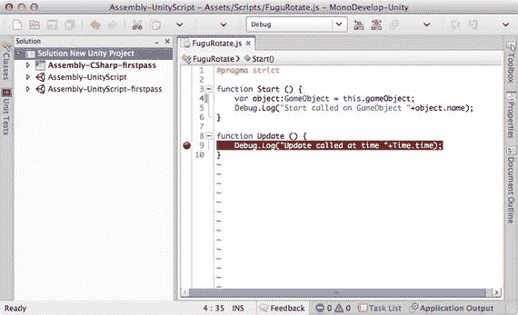

图 4-20. 在 MonoDevelop 中添加断点

现在，当你调用`附加到进程`，连接到 Unity 编辑器，并在 Unity 编辑器中点击`播放`时，执行过程会在你的 `Update` 函数处暂停，就像那里有错误一样（图 4-21）。当 MonoDevelop 在调试模式下暂停执行时，你可以检查堆栈跟踪并以其他方式检查运行时环境。例如，图 4-21 显示了在监视面板中输入 `gameObject` 然后在 `FuguRotate` 更新回调中的断点处暂停的结果。`gameObject` 的当前值是立方体 `GameObject`，现在可以检查其成员变量。

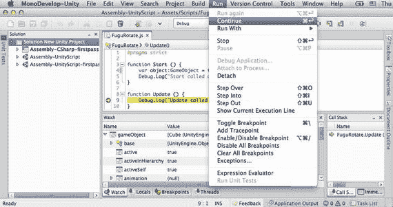

图 4-21. 执行在断点处暂停

一旦你在断点处检查完运行时状态，你可以在“运行”菜单中选择继续，直到下一个断点或出错。“运行”菜单还包含`单步跳过`（继续直到此函数中的下一行代码）、`单步进入`（继续直到此代码行调用的任何函数的第一行代码）或`单步跳出`（继续直到退出此函数）等命令，这样你就可以逐行单步执行脚本。所有这些命令都在“运行”菜单中显示了键盘快捷键，也可以在工具栏上作为按钮使用。

## 让它旋转

现在你已经熟悉了脚本以及如何附加、编辑和调试它们，你准备好让这个脚本完成你最终想要的目标了——旋转立方体。


好的，作为一名高级文档工程师和翻译员，我将严格遵循您提供的注意事项和示例格式，对给定的英文文本进行翻译。

以下是翻译后的中文版本：


### 旋转变换 (Transform)

在运行时移动`GameObject`需要更改其`Transform`组件。要专门旋转`GameObject`，则需要更改其`Transform`组件中的`Rotation`值。用清单 4-5 中的代码替换`FuguRotate`脚本的内容即可实现。

```
#pragma strict
var speed:float = 10.0; // 控制旋转速度
function Start () {
var object:GameObject = this.gameObject;
Debug.Log("在 GameObject "+object.name+"上调用了 Start 方法");
}
// 绕物体的 y 轴旋转
function Update () {
//Debug.Log("在时间 "+Time.time+"上调用了 Update 方法");
transform.Rotate(Vector3.up*speed*Time.deltaTime);
}
清单 4-5.
包含 Update 旋转代码的 FuguRotate.js 脚本
```

我们来过一下新代码。首先，任何以`//`开头的行都是注释，不会作为代码执行。这是一种在不从文件中删除代码的情况下停用某行代码的便捷方式。注释也可以放在`/*`和`*/`之间，这对于多行注释非常有用。

**注意**：有些人会说代码应该写得足够好，以至于无需解释就能明白其意图，但一个基本经验法则是，如果代码意图不明显，就添加注释。我过去浪费了很多时间来回忆为什么我要以某种方式编写代码。`speed`变量控制物体旋转的速度，由于它被声明为一个公共实例变量，因此在 Inspector 视图中它作为一个可调节的属性可用。

你可以直接输入`var speed=10.0`，而不是`var speed:float=10.0`。编译器可以推断出`speed`必须是`float`类型，因为它用一个浮点数初始化了（这被称为*类型推断*），但最好尽可能清晰，这不仅是为了 Unity 编译器，也是为了任何阅读代码的人，包括你自己！变量`speed`在`Update`函数中使用，该函数调用了`Transform`类中定义的`Rotate`函数。`Rotate`接受一个`Vector3`作为参数，并将其`x`、`y`、`z`值解释为欧拉角（绕`GameObject`的 x 轴、y 轴和 z 轴的旋转角度，以度为单位）。向量代表方向和大小，但在游戏引擎中，通常使用向量数据结构来表示欧拉角。

**注意**：电影《神偷奶爸》中对向量的定义非常到位：“我叫 Vector。这是一个数学术语，用带有方向和大小（magnitude）的箭头表示。Vector！那就是我，因为我犯的罪也兼具方向和大小。哦耶！”

`Vector3.up`是一个便捷定义的`Vector3`，其值为`(0,1,0)`，所以`Update`函数是绕 y 轴旋转`speed * Time.deltaTime`度。`Time.deltaTime`是自上一帧以来经过的时间（以秒为单位），因此，实际上，你每秒旋转`speed`度。在`Update`回调中，你几乎总是希望将任何连续变化乘以`Time.deltaTime`，这样你的游戏行为就不会因帧率差异而波动。如果省略了乘以`Time.deltaTime`的操作，`FuguRotate`脚本在任何运行速度慢两倍的机器上，其旋转物体的速度也会慢两倍。

正如预期的那样，变量`speed`会显示在 Inspector 视图中，你可以对其进行编辑（图 4-22）。

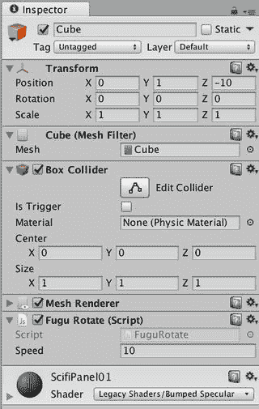
**图 4-22.** `FuguRotate`脚本的 Inspector 视图，显示了可调节的`speed`

如果你点击 Play，立方体会以适中的速度旋转，并且`Transform`组件的 y`Rotation`值的连续变化会显示在 Inspector 视图中。你可以在 Inspector 中编辑`FuguRotate`脚本的`Speed`值来减慢或加快旋转速度。

### 其他旋转方式

`Transform.Rotate`是一个很好的例子，说明了为什么你应该阅读你遇到的每个函数的脚本参考手册。事实证明，`Transform.Rotate`是一个重载函数，意味着它具有不同参数的多种变体。

**注意**：术语*参数 (parameter)* 用于描述函数声明，而*实参 (argument)* 指的是在运行时传递的相同值，但这是一种细微的区别。*参数 (parameter)* 和 *实参 (argument)* 通常可以互换使用而不会引起混淆。

`Transform.Rotate`的文档列出了它可以接受的几种实参组合。除了接受一个`Vector3`来指定旋转轴和一个角度（以度为单位）之外，`Transform.Rotate`还可以分别接受 x 轴、y 轴和 z 轴的旋转量。清单 4-6 展示了`Update`函数的另一个版本，该版本只传入 x、y、z 旋转量。

```
function Update () {
transform.Rotate(0,speed*Time.deltaTime,0);
}
清单 4-6.
Transform.Rotate 的一个版本，接受 x、y、z 角度作为旋转量
```

或者，x、y、z 旋转量可以打包成一个`Vector3`，如清单 4-7 所示。

```
function Update () {
transform.Rotate(Vector3(0,speed*Time.deltaTime,0));
}
清单 4-7.
Transform.Rotate 的一个版本，接受一个 Vector3 作为旋转量
```

尽管向量有精确的数学定义，但 Unity 遵循 3D 应用程序接口中的常见做法，即重用其向量数据结构来表示任何具有 x、y、z 值的东西。例如，如果你阅读了`Transform`的脚本参考页面（你应该阅读），你会看到`Transform`的`position`、`rotation`和`scale`都是`Vector3`类型的值。

### 在世界空间中旋转

`Transform.Rotate`的每个变体都有一个可选参数，其默认值为`Space.Self`。这指定旋转是围绕变换（也就是`GameObject`）的局部轴进行的，这些轴对应于在 Scene 视图中选中`GameObject`时看到的轴手柄。如果你指定了`Space.World`，如清单 4-9 所示，旋转将围绕世界轴（以 0,0,0 为中心的 x、y、z 轴）进行。

```
function Update () {
transform.Rotate(Vector3.up,speed*Time.deltaTime,Space.World);
}
清单 4-9.
围绕世界轴旋转
```

## 立方体的子物体 (Children of the Cube)

一个场景只有一个立方体并不有趣，所以让我们通过添加更多立方体来让它变得稍微有趣一些。你可以像创建第一个立方体一样重复创建新的立方体。或者，你可以通过复制现有立方体来节省一些时间（选中立方体，然后在 Edit 菜单上调用`Duplicate`命令，或使用`Command+D`键盘快捷键）。但让我们借此机会来学习一下预置体 (prefabs)。


### 制作预制体

预制体是一种特殊类型的资源，通过克隆一个 `GameObject` 创建。随后，该预制体可用于创建该 `GameObject` 的完全相同副本。从这个意义上说，Unity 的预制体就像预制房屋，但更胜一筹。如果你对一个预制体实例进行了修改，这项修改可以自动传播到该预制体的所有其他实例。

首先，为了遵循我们的资源组织方式，在项目视图中创建一个名为 `Prefabs` 的新文件夹。然后，选中 `Prefabs` 文件夹，在项目视图的“创建”（Create）菜单中点击 `Prefab`，在该文件夹中创建一个空预制体。接着，你可以通过将层级视图中的立方体拖拽到这个空预制体上来填充它。或者，你也可以不创建空预制体，直接将立方体拖拽到 `Prefabs` 文件夹中，这样系统会自动创建一个预制体，并以原始 `GameObject` 的名称命名（图 4-23）。

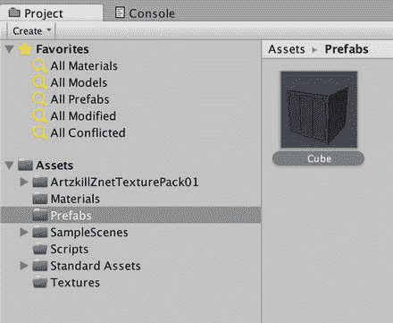

图 4-23. 立方体预制体的项目视图

现在，每当你想要创建一个与原始立方体 `GameObject` 外观相同的新立方体时，只需将预制体拖入层级视图即可。不过，与其在场景中放置多个独立的立方体，不如将一些立方体作为现有立方体的子对象。将预制体拖拽到层级视图中的立方体上两次，现在你将在“Cube”下看到两个新的立方体。在检视视图（图 4-24）中，你可以看到新立方体与第一个立方体完全相同，具有相同的组件和组件属性。让我们将新立方体命名为 `child1` 和 `child2`（顺便提一下，现在是尝试使用检视视图锁定功能的好时机，这样你就可以同时检查两个 `GameObject`）。

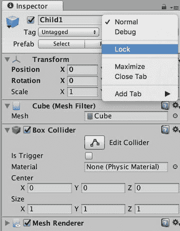

图 4-24. 编辑子立方体

作为父立方体的子对象，`child1` 和 `child2` 在检视视图中显示的位置是相对于其父对象 Cube 的位置。这意味着，如果某个子立方体的位置是 `(0,0,0)`，那么它就与其父对象处于完全相同的位置。因此，让我们将 `child1` 和 `child2` 的位置分别设置为 `(2,0,0)` 和 `(-2,0,0)`。现在，这两个子立方体与它们的父立方体像卫星一样间隔开来（图 4-25）。

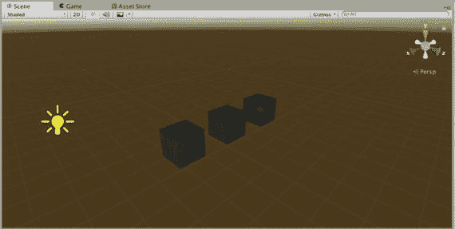

图 4-25. 立方体及其子立方体的场景视图

在点击“播放”之前，将 `FuguRotate` 脚本修改为简单的 `transform.Rotate` 调用（清单 4-9）。现在当你点击“播放”时，主立方体会像之前一样旋转，而子立方体则像车轮的辐条一样跟随旋转。子立方体也会围绕自身的轴旋转，因为它们各自运行着自己的 `FuguRotate` 脚本副本（如果你在 `Transform.Rotate` 调用中指定了 `Space.World`，那么所有三个立方体都会围绕同一个世界原点旋转）。

```
#pragma strict
var speed:float = 10.0; // 控制旋转速度
function Start () {
var object:GameObject = this.gameObject;
Debug.Log("Start called on GameObject "+object.name);
// 围绕物体的 y 轴旋转
function Update () {
//Debug.Log("Update called at time "+Time.time);
transform.Rotate(Vector3.up*speed*Time.deltaTime);
}
清单 4-9.
FuguRotate.js 恢复为在 Update 中进行旋转
```

将 `child2` 的 `FuguRotate` 速度属性从 10 更改为 50，点击“播放”，你会看到那个立方体比其他立方体旋转得更快。你可以很容易地对 `child1` 进行相同的更改，但想象一下，如果你有 50 个立方体需要更改，那将是多么繁琐！这就是预制体强大之处。选中 `child2`，然后在 GameObject 菜单中调用 `Apply Changes To Prefab`（图 4-26）。

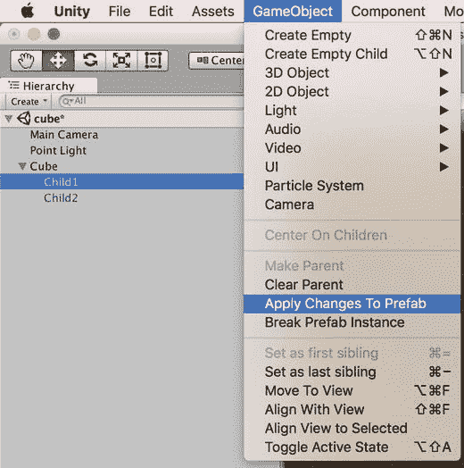

图 4-26. 将更改应用到预制体

现在 `child1` 再次变得与 `child2` 完全相同（除了名称和位置，Unity 合理地假设你并不希望这些在预制体的每个实例中保持一致）。点击“播放”后，子立方体现在都以相同的、更快的速度旋转。

### 断开预制体连接

但主立方体也因更新后的旋转速度而旋转得更快。如果这不是你的本意，你可以将立方体的速度改回 10，然后为了确保子立方体的更改不会传播到主立方体，你可以选中主立方体，并在 GameObject 菜单中调用 `Break Prefab Instance`（图 4-27）。

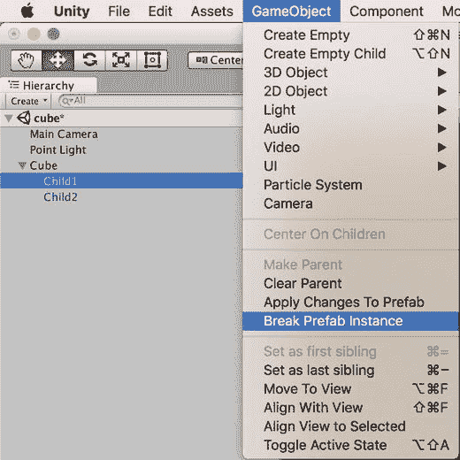

图 4-27. 断开预制体实例连接

现在，该立方体不再与预制体有关联，对子立方体的任何更改都不会传播到该立方体。

## 进一步探索

这个场景仅通过添加简单的脚本化运动，就从精美静态演变为精美动态。你将在下一章通过动画和声音让场景更加生动，但到目前为止你达到的主要里程碑确实是学习了如何创建、编辑和调试脚本。从现在到本书结束，你将不断地添加脚本，所以要习惯它！

### Unity 手册

Unity 手册的“构建场景”（Building Scenes）部分有两个与本章节工作相关的页面——在“预制体”（Prefabs）部分中对预制体的描述，以及在“组件-脚本关系”（Component-Script Relationship）部分中的详细解释。

本章介绍的一种新资源类型（除了预制体）是脚本。“资源导入与创建”（Asset Import and Creation）部分中的“使用脚本”（Using Scripts）页面介绍了旋转脚本中所涵盖的基本概念——创建脚本，将其附加到 `GameObject`，打印到控制台视图（使用 `print` 函数，而不是你使用的 `Debug.Log`），声明变量，甚至在 `Update` 函数中应用旋转。

值得再次提及“变换”（Transforms）页面，因为你的旋转脚本就是用来修改 `Transform` 组件的。该页面还描述了父-子 `GameObject` 关系，从技术上讲，这种关系存在于变换之间，但由于 `GameObject` 和变换之间存在一对一的关系，将这种联系理解为 `GameObject` 之间的链接（如层级视图中显示的那样）会更不容易混淆。

本章我们触及了一个高级主题——调试。“调试”（Debugging）部分描述了控制台视图、MonoDevelop 调试器，以及在文件系统上查找日志文件的位置。

### 脚本参考

到目前为止，我已经提到了 Unity 官方文档的三个主要部分中的两个——Unity 手册和参考手册。第三部分是脚本参考。本章是你首次涉足脚本编程，因此，脚本参考中的“脚本概述”（Scripting Overview）部分中的所有内容此时都值得一读。“运行时类”（Runtime Classes）列表阐明了 Unity 类之间的继承关系。在此之后，我建议，无论何时你在脚本中看到任何你不认识的内容（或者即使你认识，但尚未阅读其文档），都经常使用该页面上的搜索框。


### 脚本编写

虽然本书中你只使用 JavaScript 进行开发，但在 Unity 世界中存在大量 JavaScript 和 C# 代码，因此你应当对两者都熟悉起来。由 Andrew Stellman 和 Jennifer Greene 合著的《*深入解析 C#*》是一本非常棒的图文并茂的 C# 入门书。

由于 C# 是微软作为其 .NET 框架的一部分创建的，因此可以通过在微软开发者网络（MSDN）上搜索 C# 来找到官方 C# 文档和其他资源，网址是 [`http://msdn.microsoft.com/`](http://msdn.microsoft.com/)。

在 MSDN 上，还可以搜索 .NET 文档，因为 Unity 的脚本引擎是通过 Mono 实现的，而 Mono 是 .NET 的一个开源版本。官方 Mono 网站是 [`http://mono-project.org/`](http://mono-project.org/)。

如果把两个程序员关在一个房间里，他们最可能争论的就是代码规范。我的经验法则是遵循我编写代码时所使用的官方语言和框架的规范。这是一个枯燥但名字有趣的话题。

例如，Unity 在其大小写规则中混合使用了驼峰式和帕斯卡式命名法（或者用这些规范本身来描述，就是 `camelCase` 和 `PascalCase`）。你可以在维基百科上搜索驼峰式命名法。

括号放置位置也是常见的争论点。根据 Jeff Atwood（Stack Exchange 的名人）在其热门博客 Coding Horror（ [`www.codinghorror.com/blog/2012/07/new-programming-jargon.html`](http://www.codinghorror.com/blog/2012/07/new-programming-jargon.html) ）上的说法，我这里使用的约定（也是 Unity 使用的，至少在创建新脚本模板时）被称为埃及风格。该文章还将对类名应用标准前缀的做法称为“蓝精灵命名法”。

