# 5. 一起跳舞吧！动画与音效

在 Unity 中移动游戏对象的三种方式中，上一章介绍了通过脚本控制 Transform 组件，而物理引擎将在下一章启动的保龄球游戏示例中扮演重要角色。脚本控制移动无处不在。例如，即使在即将开发的保龄球游戏中，虽然主要依靠物理引擎来控制物理模拟：保龄球及其与地板和球瓶的碰撞，但摄像机跟随行为仍然是通过一个修改其 Transform 组件的脚本来实现的（这与立方体场景中使用的脚本非常相似）。不仅如此，在每次投球和每帧之间，所有移动的游戏对象都是通过恢复其 Transform 组件中的值来进行重置的。

在进入那个保龄球游戏之前，本章将花一些时间在已构建的立方体场景基础上进行扩展，为其添加一个跳舞的角色动画，让你感受 Unity 的动画支持。没有音乐的舞蹈演示是不完整的，因此这个场景还会加入循环音效。这仍然是一个非物理的、只有轻度交互的场景，但理想情况下，它将以一种漂亮且有趣的方式介绍 Unity 的动画和音频支持，然后再深入探索大量的物理知识（这是一个大话题，横跨两章）以及更多的脚本编写（一个更大的话题，涵盖本书剩余部分）。

如果你是新手，制作高质量的动画（尤其是角色动画）并非易事。音乐也一样。幸运的是，Unity 资源商店中有许多音乐和角色动画包，其中很多是免费的，包括本章使用的“骷髅包”和“通用音乐集”。这些资源不包含在对应项目（位于 [`www.apress.com/9781484231739`](http://www.apress.com/9781484231739)）的下载文件中，但如果您是直接从本章开始，并且没有上一章构建的立方体场景，可以直接使用该项目作为起点。

## 导入骷髅包

在资源商店窗口中搜索资源商店。在搜索框中输入 `skeleton` 并选择“免费”，搜索结果中会出现几个骷髅资源包（图 5-1）。

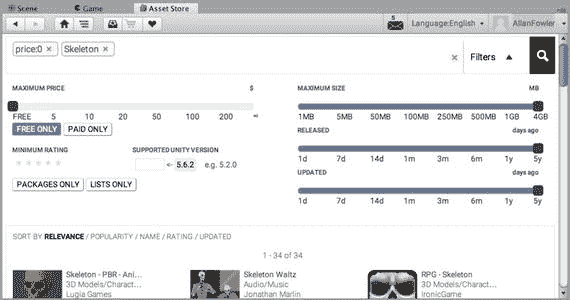

图 5-1. 骷髅包在项目视图中的搜索结果

选择骷髅资源，并在检查器视图中确认该包确实是“骷髅包”（图 5-2）。

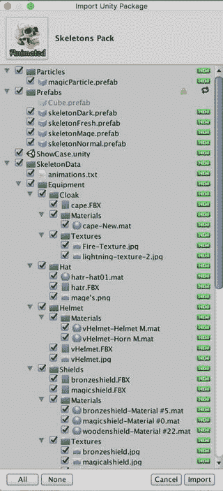

图 5-2. 骷髅包的“导入 Unity 包”视图

安装后，会在项目视图中添加一个 `SkeletonData` 文件夹（图 5-3），并在 `prefabs` 文件夹中添加一些预制件。

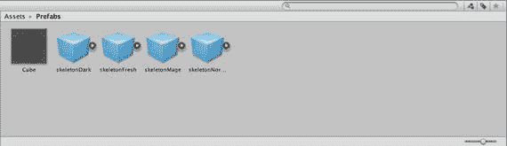

图 5-3. 骷髅包预制件的项目视图

## 添加骷髅

骷髅包安装的四个预制件都具有相同的骨骼，但配备了不同的装备，例如剑和盾。然而，事实证明，配备武器的骷髅预制件在跳舞时看起来像是在砍自己的肢体，因此我们只使用 `skeletonNormal` 预制件，它只有光秃秃的骨骼。通过将 `skeletonNormal` 预制件拖拽到层级视图中，即可在场景中添加它的一个实例（图 5-4）。`skeletonNormal` 游戏对象有一个动画组件，该组件引用了骷髅的动画数据。`skeletonNormal` 还有两个子游戏对象。一个名为 `Bip01`，实际上是一个代表骷髅骨骼的游戏对象层级结构。当骷髅移动时，手臂也随之移动，任何手部运动都是相对于手臂的，依此类推。这个骨骼层级结构让人想起“骷髅舞”这首歌——"大腿骨连着髋骨…"。

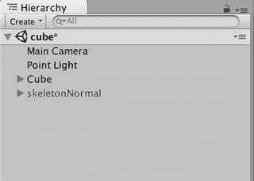

图 5-4. 包含 skeletonNormal 资源的层级视图

另一个子游戏对象 `skeleton` 带有一个 `SkinnedMeshRenderer` 组件，类似于作为 `Renderer` 子类的 `MeshRenderer` 组件。不过，`SkinnedMeshRenderer` 负责渲染包裹在骨骼周围的网格，并跟随骨骼关节的移动。这个网格本质上构成了骨骼的皮肤，因此将这种网格映射到骨骼的过程通常被称为*蒙皮*。

`skeletonNormal` 预制件还包含几个粒子效果，这些效果由带有 `ParticleEmitter` 组件的游戏对象实现。粒子效果由许多微小的动画图元组成，非常适合创建火焰、爆炸、烟雾或任何类型的闪光效果。

> **注意：** 骷髅包中包含的粒子效果使用的是 Unity 的旧版粒子系统，而不是 Unity 3.5 中引入的较新的“手里剑”粒子系统。旧版系统使用 `ParticleEmitter` 组件，而“手里剑”系统使用 `ParticleSystem` 组件。

### 隐藏方块

这个场景的主角是跳舞的骷髅，因此可以省略前两章中重点介绍的方块。不必从场景中删除方块（选中它们后，通过`Edit`菜单调用`Delete`或使用`Command+Delete`快捷键），可以通过停用它们使其不可见、眼不见心不烦。在`Hierarchy`视图中选中父级方块，并取消勾选`Inspector`视图左上角的复选框，此时`Hierarchy`视图中的整个方块树将变灰，表示它们已处于非活动状态（图 5-5）。

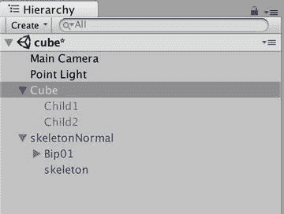

图 5-5. 场景中骷髅处于活动状态，方块已停用

所有子级方块实际上都处于非活动状态，因为父级的活动状态会覆盖子级。换句话说，一个`GameObject`只有在自身标记为活动状态，并且其父级也标记为活动状态、父级的父级同样标记为活动状态……以此类推时，才算是真正激活。任何非活动的`GameObject`，其组件都会被有效禁用。它的`Renderer`不再渲染，`Collider`不再碰撞，附加的脚本也不会触发回调，`OnEnable`和`OnDisable`除外。

### 让骷髅旋转

当你将骷髅插入`Hierarchy`视图时，Unity 会将该资源放置在原点（`0,0,0`）。但是，你可能还记得你将方块、摄像机和灯光都放置在了远离这个点的位置。因此，需要将骷髅移近摄像机。你可以使用`Transform`工具移动骷髅，或者直接在`Inspector`中输入位置坐标。`Transform`组件中的`Position`值（即坐标）分别为`X`、`Y`、`Z`对应的 (`0,0,-10`)（图 5-6）。

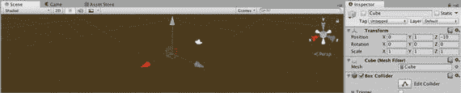

图 5-6. 骷髅位置的 Transform 值

在第 2 章中，你创建了`FuguRotate`脚本来让物体绕其 x 轴旋转。在第 2 章中，你将此脚本挂载到了`Cube`这个`GameObject`上。现在你可以将这个脚本应用到任何游戏对象上。在`Project`视图中，从`Scripts`文件夹中选中`FuguRotate`脚本，然后将其拖拽到`Hierarchy`视图中的摄像机上。

现在点击`Play`，当你移动鼠标时，`Main Camera`就会绕着骷髅旋转（图 5-7）。额外的好处是，由于骷髅预制体包含粒子效果，骷髅看起来就像是站在闪闪发光的薄雾中。

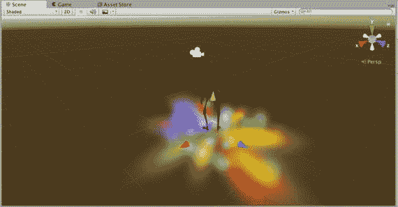

图 5-7. 空闲状态骷髅的游戏视图

### 让骷髅跳舞

目前，骷髅只是稍微来回移动而非跳舞。如果你选中`skeletonNormal`资源，并在`Inspector`视图中检查它，可以看到该`GameObject`有一个`Animation`组件，其中包含一个引用“idle”或“Run”`AnimationClip`的字段（图 5-8）。

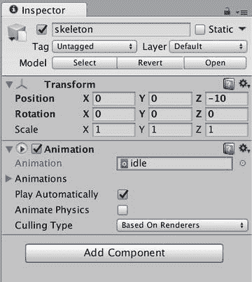

图 5-8. 改变骷髅的位置和动画

还要注意，`Play Automatically`复选框已被勾选，这就是为什么你一点击`Play`动画就会运行。如果动画意在由脚本在游戏期间的某个时刻触发，则应取消勾选此选项。

为了将空闲（或奔跑）状态的`AnimationClip`替换为跳舞的`AnimationClip`资源，请点击“idle”右侧的圆圈，调出`AnimationClip`选择列表（图 5-9）。选择名为“dance”的`AnimationClip`资源。

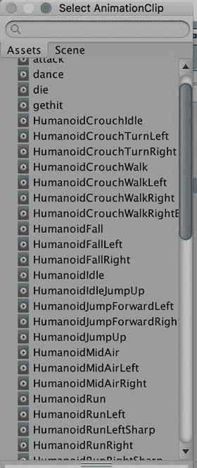

图 5-9. AnimationClip 选择列表

现在点击`Play`，骷髅就会跳舞了！（见图 5-10）

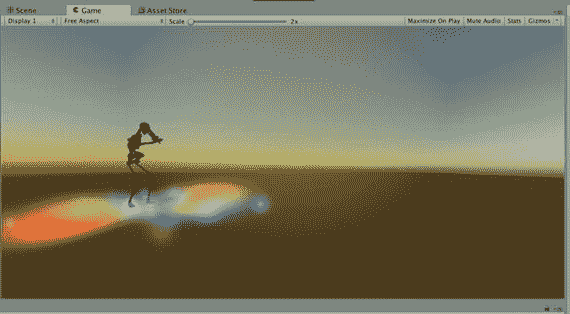

图 5-10. 跳舞的骷髅

### 让骷髅永远跳舞

如果你让骷髅跳一会儿，它最终会在`AnimationClip`资源播放完时停止。但`AnimationClip`资源可以设置为循环播放。在`skeletonNormal`的`Inspector`视图中，点击`Animation`组件中指向“dance”`AnimationClip`资源的引用。`Project`视图将显示选中的`AnimationClip`资源、相关的骷髅网格体以及其他`AnimationClip`资源（图 5-11）。

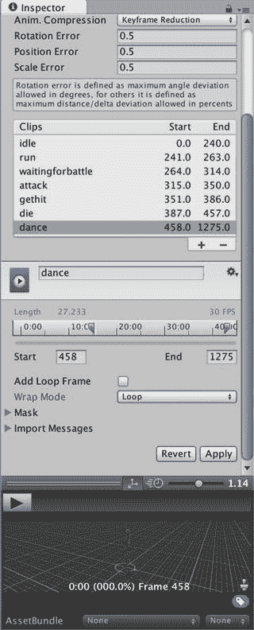

图 5-11. 循环动画

`Inspector`视图显示一段完整的动画数据，该数据被分割为多个不同的`AnimationClip`资源。在列表中选择“dance”剪辑，其下方的`Wrap Mode`将显示为`Default`。将`Wrap Mode`更改为`Loop`，然后点击`Apply`按钮（就在`Wrap Mode`字段下方）。

现在点击`Play`，骷髅就会不停地跳舞、跳舞、再跳舞。

> **注意**
> 此骷髅使用的是 Unity 的传统动画系统。你可以通过点击图 5-11 中显示的`Rig`按钮来验证，并看到`Legacy`复选框已被勾选。Unity 4 引入了一个名为 Mecanim 的新动画系统，除其他功能外，它允许你为不同的骷髅（或者他们所说的化身）使用动画。

## 添加舞池

骷髅在空中跳舞看起来有点奇怪，所以我们给它一个地板来跳舞。你可以创建另一个立方体并缩放它，但有一个更合适的原始`GameObject`可供使用——平面。与立方体类似，你可以通过菜单栏上`GameObject`菜单的`Create`子菜单来创建一个平面。但这次，请尝试使用`Hierarchy`视图左上角的`Create`按钮（图 5-12）。

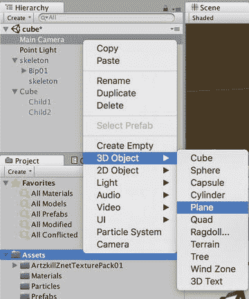

图 5-12。

使用`Hierarchy`视图中的`Create`菜单创建平面

请注意，`Create`菜单中的所有项目在菜单栏的`GameObject`菜单中都可找到，但并非所有可通过`GameObject`菜单创建的项目都能在`Hierarchy`视图的`Create`菜单中找到。

现在，一个平面列在`Hierarchy`视图中，并显示在`Scene`视图中（图 5-13）。平面类似于一个扁平的立方体——它有顶部和底部，但没有侧面和高度。如果你在其`Transform`组件中更改它的`x`和`z`缩放比例，平面会拉伸，但更改`y`缩放比例（高度）则不会产生任何效果。

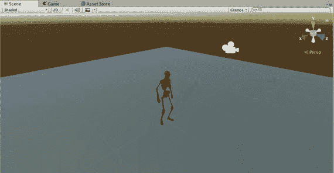

图 5-13。

新平面的`Scene`视图

记住，骷髅的位置被设置为`(0,0,-10)`，并且骷髅的原点位于底部，与骷髅的脚部重合。因此，请选中`Hierarchy`视图中现在显示的平面，然后在`Inspector`视图中，将平面的位置也设置为`(0,0,-10)`，以便地板位于骷髅的脚部下方。具体来说，脚部和地板的`y`坐标（高度）必须一致。

这个地板看起来相当平淡无奇；使用带有纹理的材质会更好一些。`ArtskillZ Free Texture Pack`已经导入并用于立方体，所以你完全可以在这里用它来处理地板。对于立方体，你只需将纹理拖拽到`Hierarchy`视图中的立方体上，然后在`Inspector`视图中修改生成的材质。

这次，我们直接进入平面的`Inspector`视图（图 5-14），并将其着色器更改为`Bumped Specular`。然后，从`ArtskillZ Free Texture Pack`中拖拽一个主纹理及其对应的凸起（法线贴图）纹理（在图中，我选择了该资源包中`Fantasy`文件夹下的`Floor03`和`Floor03_n`纹理）。

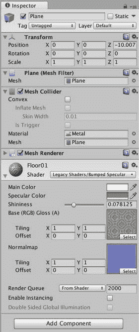

图 5-14。

编辑平面位置和材质

现在当你点击播放时，骷髅就在地板上跳舞了！（见图 5-15。）

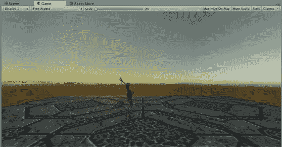

图 5-15。

骷髅在有纹理的平面上跳舞

## 添加阴影

第 3 章中讨论的`Light`组件属性之一是`Shadow Type`。现在场景中有了可以投射阴影的地板，让我们尝试一下这个功能。

选择一个点光源（无论是在`Hierarchy`视图还是在`Scene`视图中），然后在`Inspector`视图（图 5-16）中，将`Shadow Type`从`None`更改为`Soft Shadows`。这可以为阴影提供漂亮、柔和且模糊的边缘（阴影的半影），看起来比`Hard Shadows`的锐利边缘效果更好。

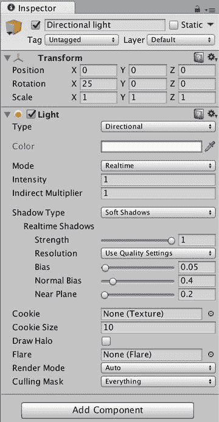

图 5-16。

将点光源转换为带有柔和阴影的平行光

现在你应该将类型从`Point Light`更改为`Directional Light`。点光源可以投射阴影，但仅限于硬阴影，并且仅在以`Deferred Mode`渲染时才能实现，而 Unity iOS 不支持这种模式。实际上，Unity iOS 根本不支持柔和阴影，但它们的视觉效果非常好，所以我们就在这里尝试一下。

点光源从一个位置向所有方向辐射光线，而平行光则被视为无限远，因此其位置无关紧要，但旋转角度很重要。所以，在`Transform`组件中，你可以将位置设置为`0,0,0`（这对平行光来说实际上无关紧要，但看起来比随意设置一个位置更整洁），并将旋转角度设置为`25,0,0`，表示光线绕`x`轴旋转了 25 度。换句话说，光线从水平方向向下倾斜 25 度。

除了直接输入旋转角度，你还可以在`Scene`视图（图 5-17）中手动旋转灯光：选中灯光，点击 Unity 编辑器左上角按钮栏中的`Rotate`工具（左起第三个按钮），然后在灯光上拖拽代表`x`轴旋转的圆环。

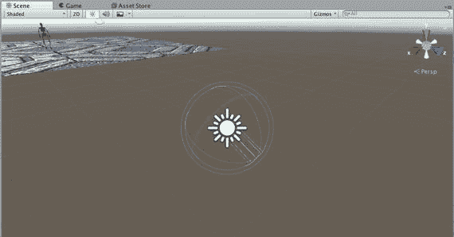

图 5-17。

在`Scene`视图中旋转平行光

没有必要使用`Move`工具（按钮栏左起第二个按钮），因为平行光的位置无关紧要，但如果你将灯光向上并远离目标移动，使其明显指向骷髅，这有助于可视化灯光照亮的内容。

提示

你可以像在第 3 章中利用`Main Camera`对准立方体那样，对准平行光或聚光灯（或任何可以瞄准的对象）。在这种情况下，你可以选中骷髅，按下`F`键进行`Frame Selected`，然后点击左上角工具栏最左侧的按钮进入`Scene`视图的`Hand tool`模式，接着在`Scene`视图中`Alt+点击并拖拽`，直到`Scene`视图摄像机指向你希望灯光指向的方向。然后选中点光源，并从`GameObject`菜单中调用`Align to view`。

此时如果你点击播放，应该能看到一个阴影，但即使将`Strength`设置为`1`，阴影仍有改进空间。Unity 使用一种称为阴影映射的技术来生成阴影，阴影质量取决于阴影贴图的分辨率。`Light`组件中阴影贴图分辨率的默认设置为`Use Quality Settings`，你可以在`Inspector`视图中覆盖此设置。但我们改为通过选择`Edit`菜单中的`Project Settings` > `Quality`（图 5-18）来进入`Quality Settings`窗口。

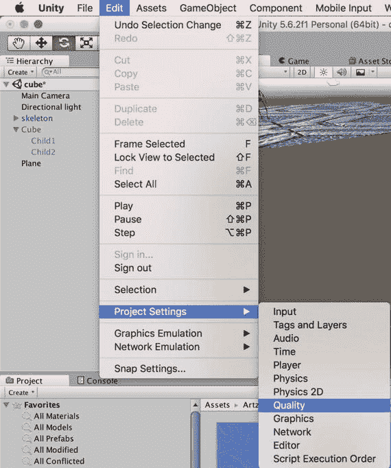

图 5-18。

从`Edit`菜单中选择`Quality Settings`

`Quality Settings`管理器出现在`Inspector`视图（图 5-19）中，显示了一个质量设置列表以及每个构建平台选定的质量设置。桌面平台的默认质量设置为`Good`。选中平台设置表中的那一行，以便显示`Good`的具体设置。特别是`Shadows`设置，它控制阴影质量。因此，将`Shadow Resolution`更改为`Very High Resolution`，并将`Shadow Distance`降低到`10`，因为较短的阴影距离可以带来更好的阴影分辨率（但太短会导致阴影无法渲染）。

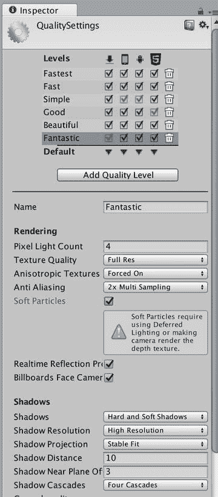

图 5-19。

调整后的阴影质量设置

现在当你点击播放时，会看到一个效果相当不错的舞动阴影！（见图 5-20。）

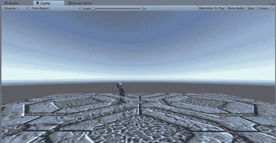

图 5-20。

带有阴影的骷髅的`Game`视图

## 添加音乐

没有音乐的舞蹈演示是不完整的。幸运的是，Asset Store 中有大量免费音乐。我个人经常使用的一个音乐包是 Gianmarco Leone 的 *General Music Set*。在 `Project` 视图的搜索框中输入 `general music`，该包中的所有音频片段都会出现在搜索结果中（图 5-21）。点击任意一个，然后从 `Inspector` 视图中导入该包。

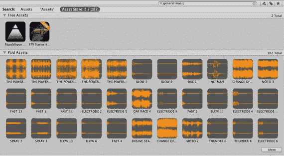

图 5-21. 在 Asset Store 中搜索 General Music Set

在音频片段安装到 `Project` 视图中后（图 5-22），从 Joey 的 `Music` 中选择名为 `Tomorrow` 的音频片段。当然，你也可以自行决定安装哪首曲目。在 `Inspector` 视图中（图 5-23），点击立体声波形显示上方的 `Play` 按钮，即可试听该音频片段。

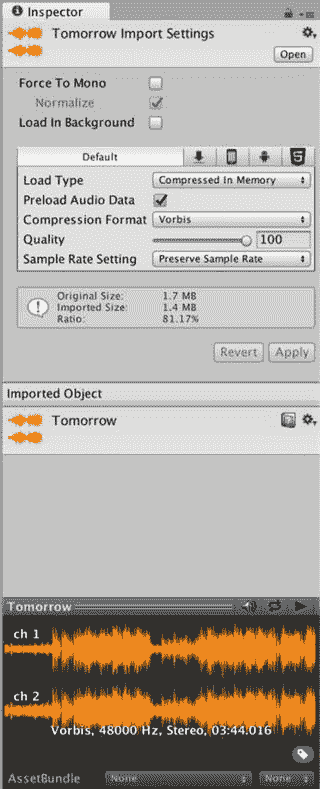

图 5-23. 音频片段的 Inspector 视图

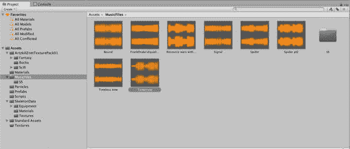

图 5-22. Music Files 音乐集的 Project 视图

现在，你可以将音频片段添加到场景中了。只需将音频片段从 `Project` 视图拖拽到 `Hierarchy` 视图中，就会自动创建一个同名的 `GameObject`（图 5-24）。

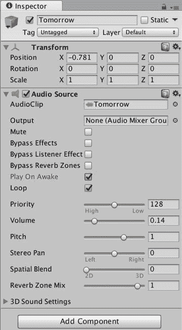

图 5-24. 场景中的音频

选中 `Tomorrow` 这个 `GameObject`，你会在 `Inspector` 视图中看到它带有一个 `AudioSource` 组件。在其属性中，包含对 `Tomorrow` 的引用以及一个 `Play On Awake` 复选框。这指定了声音将在场景开始播放时立即播放。你还应该选中 `Loop` 复选框，这样歌曲就会像跳舞动画一样循环播放。由于这是背景音乐，请将 `Spatial Blend` 设置为 `2D`。

现在，当你点击 `Play` 时，就真正拥有了一场音乐舞蹈派对！

## 进一步探索

至此，我们与骷髅共舞的短暂插曲就告一段落了。在本书的剩余部分，你将专注于开发一个主要基于物理运动控制的保龄球游戏。但是，你应该已经感受到了成就感——用过去三章的时间，将一个简单的静态立方体场景演变成一个伴有音乐跳舞的骷髅场景，并且配备了粒子特效和动态阴影等炫酷的图形功能。炫酷功能往往在性能上代价高昂，请明智地使用它们！

### Unity 手册

“Asset Import and Creation” 部分介绍了本章引入的两种新型资源：音频和动画。“Audio Files” 页面列出了 Unity 支持的音频格式，并描述了导入音频文件后生成的 `AudioClip` 资源。在前几章，你只是浅尝了 Unity 手册中的 “Creating Gameplay” 部分，但现在你已经深入其中，添加了 “Particles”、“Legacy Animation System” 和 “Sound” 等页面中描述的内容。此外，Mecanim 动画系统是 Unity 动画的未来，因此阅读 “Mecanim Animation System” 部分是很有价值的。

使用动态阴影是一个大话题。Unity 手册的 “Advanced” 部分在 “Shadows in Unity” 一节中进行了详尽阐述，涵盖了 “Directional Shadows”、“Troubleshooting Shadows” 和 “Shadow Size Computation”。

### 参考手册

参考手册的 “Animation” 部分包含 “Animation Component” 和 “Animation Clip” 页面，涵盖了 Legacy 动画系统所使用的那些资源。该部分还包含数个关于新 Mecanim 动画系统中使用的组件的页面。

“Audio” 部分列出了为本章构建的跳舞场景添加音乐所需的音频组件；请参阅 “AudioListener”（通常自动附加到主摄像机上）和 “AudioSource”（附加到音源上）等节。此外，“Audio Filter Components” 部分列出了可以添加例如回声等效果的组件（这是一个 Pro 功能）。

“Effects” 部分包含一个关于新的 Shuriken 粒子系统的页面，以及数个关于 Legacy 粒子系统的页面。

参考手册还记录了各种设置管理器，包括 “Quality Settings” 页面，你曾用它来调整阴影质量，但它也会影响其他视觉质量元素，例如光照和粒子。

### Asset Store

Asset Store 不仅提供了大量音频类别中的音乐，其中很多是免费的，还提供了播放音乐的脚本。如果你想在你的舞蹈场景中播放多首歌曲，可以编写一个脚本，使用 `AudioSource` 类（用于播放和停止音乐）和 `AudioListener` 类（用于控制音量）中定义的 Unity 函数来播放固定顺序或随机顺序的歌曲。但更简单的方法是直接下载，例如，从 Asset Store 下载 `Free Jukebox` 脚本（或者如果你愿意花点小钱，也可以下载 `Jukebox Pro`）。

### 计算机图形学

我在第 3 章末尾提到了 *Real-Time Rendering* 这本书，针对你在本章中遇到的计算机图形学主题——动画、粒子效果和动态阴影——我再次推荐它。有许多专门关于角色动画的书籍，包括面向专业动画师的内容创作方面的书籍，例如 George Maestri 的 *Digital Character Animation*。

