# 6. 开球吧！物理与操控

终于，你准备好开始本书的主要 Unity 项目了——一个类似 HyperBowl 风格的保龄球游戏。HyperBowl 是我十多年前参与开发、仅几年前才移植到 Unity 的一款街机/游乐场游戏。HyperBowl 拥有独特的“化身球球”玩法，玩家需要不断让球在 3D 环境中滚动，以到达球瓶处。本书构建的保龄球游戏会简单得多，但具有相同的控制风格。

即使是这样一个简单的保龄球游戏也是一个重要的项目。它将包含物理、输入处理、摄像机控制、碰撞音效、游戏规则、分数显示以及开始/暂停菜单。这甚至还不包括为 iOS 进行任何适配工作。本章仅专注于让一个球滚动起来，这需要一些物理设置，但只需要一个用于控制球的脚本。该脚本可在 [`www.apress.com/9781484231739`](http://www.apress.com/9781484231739) 上本章的项目中找到。但它是一个相当简单的脚本，并且会在本章中逐步开发完成，所以最好跟着一起从零开始实现它。


## 创建新场景

上一章中的舞蹈场景实际上是对第 3 章中最初创建的立方体场景的修改，因此你无需从头开始重新创建整个场景。灯光和地面在保龄球游戏中也会用到，同理，你也可以继续修改立方体场景，并在添加保龄球游戏内容之前停用或移除骨骼和音乐。不过，并没有规定一个项目中只能有一个场景，因此让我们保留立方体/舞蹈场景不变，直接复制一份作为保龄球场景的起点。

根据上一章的内容，你的 Unity 编辑器应该仍然打开着舞蹈（立方体）场景。要开始处理此场景的副本，最快的方法是选择 `File` 菜单中的"Save Scene as"（图 6-1）。

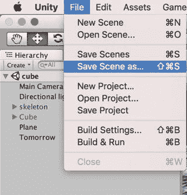

图 6-1. 将场景另存为新场景

这将是保龄球场景，因此我们将其命名为 `Bowl`（图 6-2）。

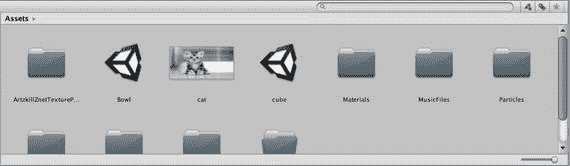

图 6-2. 保存在 `Assets` 根目录下的 `Bowl` 场景

注意：为了与资源组织系统保持一致，场景应放入 `Scenes` 文件夹中，但如果我只有一个或几个场景，我通常会将它们直接保存在 `Assets` 文件夹的根目录下。

除了使用"Save Scene as"，你也可以通过在 `Project` 视图中选择场景，然后从 `Edit` 菜单中选择 `Duplicate`（或使用键盘快捷键 `Command+D`）来复制场景，接着重命名新场景，最后双击该场景文件切换到它。

### 删除游戏对象

现在，你可以清理场景中保龄球不需要的任何内容，而无需担心损坏舞蹈场景。因此，与其停用骨骼，不如直接在 `Hierarchy` 视图中选中骨骼 `GameObject`，并使用 `Edit` 菜单中的 `Delete` 命令（或 `Command+Delete` 键盘快捷键）将其删除。同时，删除立方体层级结构和 `Caribbean Isle` `GameObject`（图 6-3），因为立方体和音乐在保龄球中也不需要。

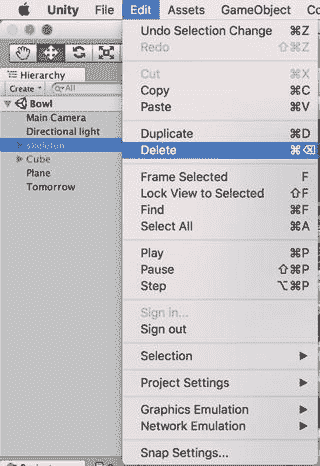

图 6-3. 从保龄球场景中删除不需要的 `GameObject`

### 调整灯光

同样，在开始处理新场景之前，还需要做一点整理工作。先从灯光颜色开始。在所有资源都放入场景之前使用白色灯光，可以让你看到所有物品的原始颜色。因此，让我们点击灯光属性的 `Color` 字段，并在颜色选择器中选择白色，将灯光颜色改为白色（图 6-4）。

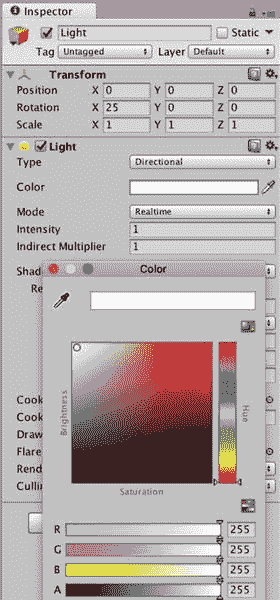

图 6-4. 将灯光颜色设置为白色

另外，由于上一章中为了支持柔和阴影，点光源实际上已被更改为方向光，因此 `Point Light` 这个名称会产生误导。现在是一个将其重命名为 `Light` 的好时机，这样如果你以后想再次更改其类型，也能保持灵活性。

### 重新铺设地面

舞蹈场景中闪亮图案的地板看起来不太像保龄球道，所以让我们改变它的外观。这是一个尝试 Unity 对程序化材质支持的好机会。程序化材质使用通过算法生成的纹理，而不是图像文件。这允许通过调整纹理生成参数来实现材质的多样化，并且还可能节省空间，因为程序化材质不需要加载图像文件作为纹理。

让我们尝试为地面使用一种程序化材质。在 `Asset Store` 窗口中搜索 `substance`（`Project` 视图是在单个资源中搜索，所以在这种情况下它不会显示任何 `Asset Store` 结果）。`Asset Store` 窗口中将出现许多来自 Mikołaj Spychał 的免费 substance 包（图 6-5）。

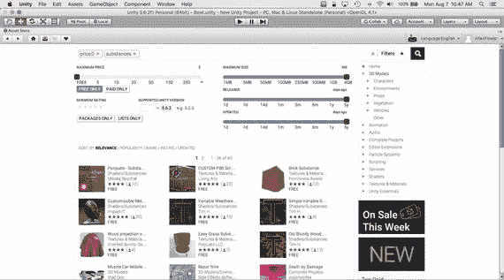

图 6-5. `Asset Store` 中 `substance` 的搜索结果

你需要的包是 `Parquets – Substances`。下载并导入该包后，一个 `Substances` 存档（扩展名为 `.sbsar` 的文件）将出现在 `Project` 视图的 `Parquet01` 文件夹中（图 6-6）。

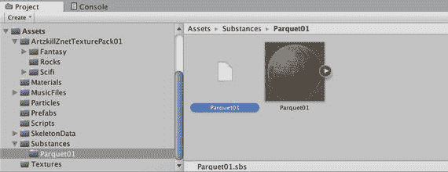

图 6-6. `Substances` 包的 `Project` 视图

`Substances` 文件夹包含一个 `ProceduralMaterial` 资源（`ProceduralMaterial` 是 `Material` 的子类），以及一个配套的纹理和脚本。点击 `Parquet01` 图标右侧的箭头，它会变成左箭头并展开，显示 `WoodenParquet` 的程序化材质及其关联的纹理（图 6-7）。

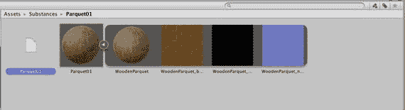

图 6-7. 从 `Substances` 存档中展开查看 `WoodenParquet`

`WoodenParquet` 程序化材质看起来是保龄球道地板的一个不错的选择（主要是因为它是免费的），所以将 `WoodenParquet` 程序化材质（不是存档）拖到 `Hierarchy` 视图中的平面上。你可以在 `Scene` 视图中看到，现在该平面有了一个木制镶木地板（图 6-8）。

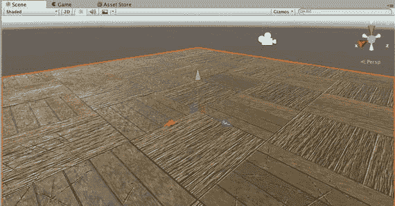

图 6-8. 应用了 `WoodenParquet` 程序化材质的平面

瓷砖看起来过大，但你可以通过编辑纹理的 `UV` 缩放字段来调整纹理（有一个主纹理和一个法线贴图纹理）在平面上的拉伸方式。在 `Hierarchy` 视图中选择平面，然后在 `Inspector` 视图中将两个纹理的 `x` 和 `y` 的 `Tiling` 值（在 `Procedural Properties` 部分）从 1 设置为 5（图 6-9）。

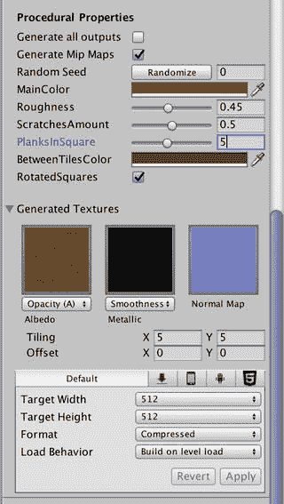

图 6-9. 应用了程序化材质的平面的 `Inspector` 视图

现在纹理被平铺了五次，而之前只有一次（图 6-10）。在 `Inspector` 视图中，请注意你有很多程序化属性可以调整，以改变生成纹理的外观。

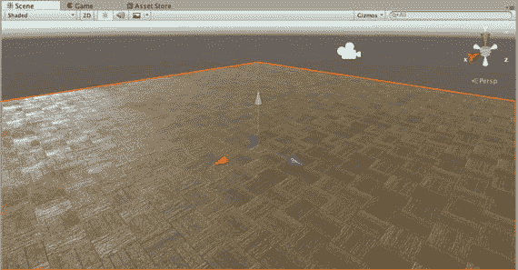

图 6-10. `Tiling` 值设置为 5 的平面

与灯光类似，当你打开 `Inspector` 视图时，这也是一个更改顶部文本字段中名称的好时机，将平面重命名为 `Floor` 以使其功能更明确。

### 重置摄像机

附加到 `Main Camera` 上的脚本不适合保龄球游戏，因此你可以禁用该脚本。更好的是，通过选中 `Hierarchy` 视图中的 `Main Camera`，然后在 `Inspector` 视图中右键单击脚本组件并选择 `Remove Component`，将该脚本从 `Main Camera` 上完全移除（图 6-11）。

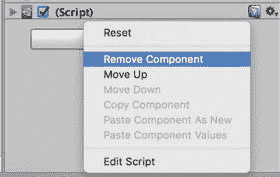

图 6-11. 从 `Main Camera` 移除脚本

顺便，将 `Main Camera` 的位置设置为 `(6,1,-10)`，其旋转设置为 `(0,-90,0)`。现在，你应该看到一个漂亮的地板、天际线，除此之外没有别的东西了（图 6-12）。

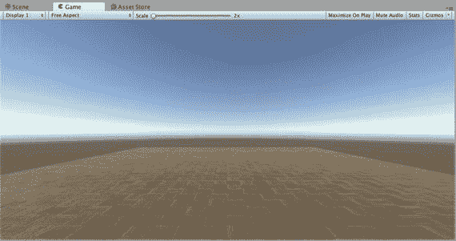

图 6-12. 固定了 `Main Camera` 后的 `Game` 视图

## 制作一个球

现在场景中有了灯光、光晕、地板，以及一个视角固定的 `Main Camera`。是时候添加保龄球了。


### 制作一个球体

到目前为止，本书使用了两种原始游戏对象：`Plane` 和 `Cube`。对于球体，还有另一个完美的原始对象：`Sphere`。与 `Plane` 和 `Cube` 类似，`Sphere` 可以从菜单栏的 **GameObject** 菜单中的 **Create** 子菜单中选择，但也可以通过 **Hierarchy** 视图左上角的 **Create** 按钮来实例化一个球体（图 6-13）。

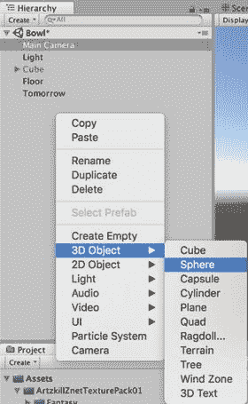

图 6-13. 创建一个球体

从 **Create** 菜单选择 `Sphere` 后，**Hierarchy** 视图中应会列出一个名为 `Sphere` 的新游戏对象。在 **Hierarchy** 视图中选择名为 `Sphere` 的游戏对象，以便在 **Inspector** 视图中检查它（图 6-14）。

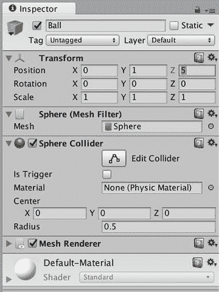

图 6-14. 球体的 Inspector 视图

与 `Cube` 和 `Plane` 原始对象一样，名为 `Sphere` 的游戏对象拥有一个 `MeshFilter` 组件、一个 `MeshRenderer` 组件，以及一个形状与原始对象相匹配的 `Collider` 组件（此处为 `SphereCollider`）。首先，本着精心命名游戏对象的精神，将球体名称更改为 `Ball`，以明确此游戏对象是保龄球。然后，将球的位置设置为 `(0,1,5)`，这会将球心置于地板上方 1 米处。由于球的半径为 0.5 米（图 6-14 中 `Sphere Collider` 的 **Radius** 设置便是一个很好的提示），这为球与地板之间留出了一些间隙。当你点击 Play 时，球将悬浮在地板上方的空气里（图 6-15）。

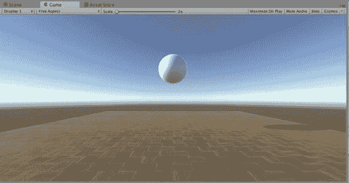

图 6-15. 悬浮在空中的球

当然，这符合预期。就像目前为止创建的所有其他对象（地板、立方体，甚至跳舞的角色）一样，球会按照指示移动或停留在指定位置。

### 让它落下

为了使球能够响应重力而下落并响应其他力，必须让球具有物理属性。通过添加 `Rigidbody` 组件可以使游戏对象具有物理属性。

> **注意**  
> 大多数游戏物理被称为刚体模拟，这大致就是字面意思——模拟形状不变的坚硬物体如何对力和碰撞做出反应。保龄球非常适合刚体模拟。而一块木薯布丁则不然。

要为球添加 `Rigidbody` 组件，请在 **Hierarchy** 视图中选择球；然后在菜单栏的 **Component** 菜单中，选择 **Physics** 菜单项，再选择 **Rigidbody**（图 6-16）。你也可以点击 **Inspector** 视图底部的 **Add Component** 按钮来添加 `Rigidbody` 组件。

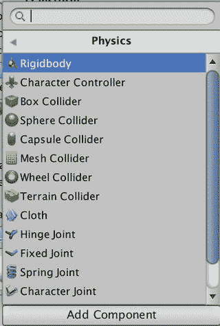

图 6-16. 为球体添加 Rigidbody 组件

**Inspector** 视图现在会显示一个附加到球上的 `Rigidbody` 组件（图 6-17）。

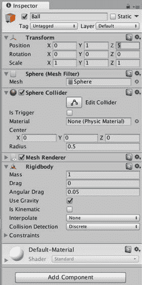

图 6-17. 带有 Rigidbody 组件的球体的 Inspector 视图

大多数 `Rigidbody` 属性可以使用默认值，但 1 千克的质量对于保龄球来说有点轻了。让我们将其设置为 5，因为 5 千克大致在保龄球重量的范围内。

**Drag**（空气阻力）和 **Angular Drag**（旋转时受到的阻力）的最小值就可以了。除非你在水下打保龄球，否则没有理由增加阻力。

**Use Gravity** 属性指定球将响应重力。如果未选中此复选框，则球的行为就像处于零重力环境中（在太空打保龄球！）。

**Is Kinematic** 属性适用于那些会移动和碰撞，但不响应力的游戏对象（例如，电梯平台）。任何带有 `Collider` 组件且将要移动的游戏对象也应附带 `Rigidbody` 组件，并且如果移动不是来自物理引擎而是来自脚本或动画，那么它应该是一个运动学 `Rigidbody`。

**Interpolation** 属性允许平滑游戏对象的运动（以计算成本为代价）。

同样，**Collision Detection** 属性提供了改进的碰撞检测，特别适用于快速移动的游戏对象（同样以计算成本为代价）。

**Constraints** 属性可以限制游戏对象如何响应力而移动。例如，游戏对象可以被限制为仅沿一个平面或甚至仅沿一个方向运动。

适当设置 `Rigidbody` 组件属性后，再次点击 Play。现在球会下落，更棒的是，它会落在地板上！（见图 6-18）。

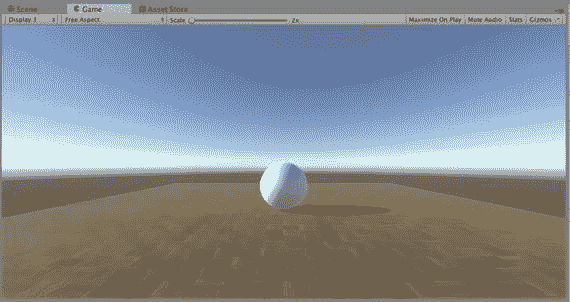

图 6-18. 球落在地板上的游戏视图

顺便说一下，默认的重力是标准地球重力，大约 9.8 m/s²。这可以在 `PhysicsManager`（图 6-19）中自定义，该管理器位于 **Edit** 菜单的 **Project Settings** 子菜单下。

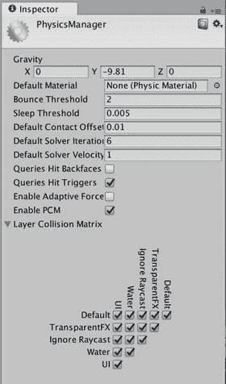

图 6-19. PhysicsManager

`PhysicsManager` 的 **Gravity** 属性是一个向量（具体来说，如果你从脚本访问 `PhysicsManager`，它是一个 `Vector3`），唯一非零的值在 y 方向（并且是负值，因此力是向下的）。因此，你不仅可以更改重力大小，例如更改为月球的重力，甚至可以改变其方向！如果你将 y 值从 `-9.81` 改为 `9.81`，球将向上掉落；如果你将重力向量从 `(0,-9.81,0)` 改为 `(1,0,0)`，球将以 1 m/s² 的加速度横向掉落。如果你想要失重状态，将重力设置为 `(0,0,0)` 即可实现。

## 自定义碰撞

`Collider` 组件为游戏对象提供了一个碰撞形状。如果你在 **Inspector** 视图中检查球和地板，你会看到每个对象都有一个自动附加的 `Collider` 组件，其形状与其网格相匹配。地板有一个 `MeshCollider` 组件，它始终与游戏对象的网格匹配；球有一个 `SphereCollider` 组件，它始终具有球形。当你选择球或地板时，**Scene** 视图不仅会高亮显示游戏对象的网格，还会高亮显示其 `Collider` 组件的形状。你可以使用 **Scene** 视图中的 **Gizmos** 菜单来切换碰撞器 Gizmo 的显示。

原始游戏对象和原始碰撞器之间几乎是一一对应的（我所说的“原始”指的是内置于 Unity 中且形状简单，这有利于性能）。不过也有例外。例如，有一个原始的 `Cylinder` 游戏对象，你可以从 **GameObject** 菜单中创建它，但没有可用的圆柱体形状的 `Collider`。相反，如果你创建一个 `Cylinder`，它会自动使用一个 `CapsuleCollider`。

`MeshCollider` 是一个特例。自动跟随关联网格的形状听起来不错，但这仅适用于静态（即不移动的）游戏对象。任何正在移动或可能移动的对象都应使用原始碰撞器或原始碰撞器的聚合体（更多内容将在下一章介绍）。一个 `MeshCollider` 如果要与其他 `MeshCollider` 碰撞，还必须启用其 **Convex** 属性（复选框）。


### `PhysicMaterials`

`Collider`组件决定了两个`GameObject`何时会发生碰撞，但碰撞检测后实际会发生什么？一个`GameObject`会从另一个上弹开吗？如果是，弹开多少？球会沿着地板滑动、滚动还是粘住？这取决于`Collider`组件的`Material`属性。该属性名称可能有些误导，因为`Collider`组件的`Material`并非用于确定网格表面外观的`MeshRenderer`组件的材质。相反，`Collider`组件使用`PhysicMaterial`来确定碰撞表面的碰撞属性。拼写有点奇怪，但可以把`PhysicMaterial`理解为物理材质或物理材料。

**注意：** 与`ProceduralMaterial`不同，`PhysicMaterial`类不是`Material`的子类。

`Collider`组件的`Material`属性默认使用`PhysicsManager`中的`Default Material`属性（图 6-19），该属性为`None`。要自定义碰撞行为，`Collider`组件必须分配一个`PhysicMaterial`。

### 标准`PhysicMaterials`

你可以从项目视图的创建菜单中从头创建新的`PhysicMaterial`，但 Unity 在 Unity 商店的标准资产包中提供了一些免费的`PhysicMaterials`。如果你还没有从 Unity 商店下载并导入标准资产包，现在正是好时机。

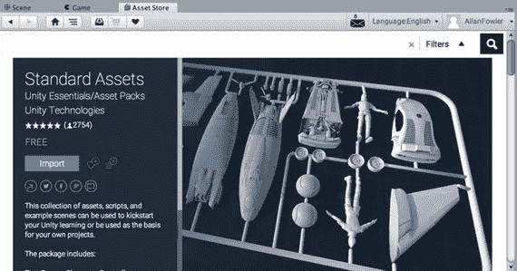

图 6-20. 从资源商店下载标准资产包

下载完成后，你可以在`Assets` ➤ `Standard Assets` ➤ `PhysicsMaterials`文件夹中看到几个物理材质。

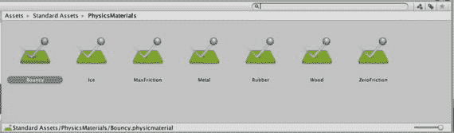

图 6-21. 标准资产包中的物理材质资源

### `PhysicMaterial`的结构

选择不同的`PhysicMaterial`，并在检视视图中比较它们的值。例如，查看`Bouncy`和`Ice`两个物理材质的差异（图 6-22）。

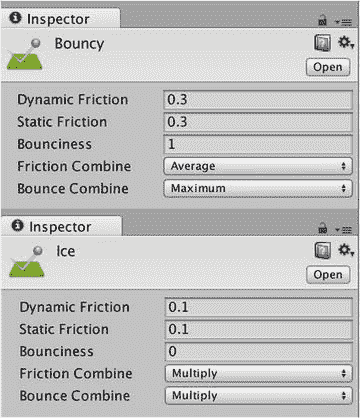

图 6-22. `Bouncy`和`Ice`物理材质的比较

注意`Ice`的摩擦力值特别低。`Dynamic Friction`是一个物体在另一个物体上滑动时产生的摩擦力。`Static Friction`是一个物体静止在另一个物体上时的摩擦力。摩擦力的范围是 0 到 1，其中 0 代表无摩擦，1 代表完全无法滑动。`Ice`的`Bounciness`值为 0，这很合理，因为冰不会弹跳。而`Bouncy`物理材质的`Bounciness`最大值为 1。

当两个具有不同`PhysicMaterial`的`GameObject`发生碰撞时会发生什么？它们的`Friction`和`Bounciness`值会分别根据`Friction Combine`和`Bounce Combine`值进行组合。`Bouncy`的`Friction Combine`值表示，当它与另一个物理材质碰撞或滑动时，应用的摩擦力是两个材质摩擦力值的平均值。而`Bouncy`的`Bounce Combine`值指定将使用两个物理材质中最大的弹性值（由于`Bouncy`已经具有最大弹性值 1，因此结果总是 1）。

你可能想知道如果两个物理材质具有不同的组合值（就像`Bouncy`和`Ice`那样）会发生什么，会使用哪一个？截至目前，官方并没有明确记录，但优先级顺序（从低到高）似乎是：平均值、相乘、最小值、最大值。因此，如果`Bouncy`和`Ice`碰撞，结果将是取摩擦力最小值（即`Ice`的 0.1）和弹性最大值（即`Bouncy`的 1）。这正是你所期望的！

在物理材质的检视视图中显示的最后三个属性允许各向异性摩擦，即在不同方向上具有不同的摩擦力值。如果`Friction Direction`属性被设置为非零向量，那么`Secondary Static Friction`和`Secondary Dynamic Friction`将在该方向上生效。对于木质地砖，你可以指定一个沿着木纹方向的次要摩擦方向，并沿着该方向设置较低的静态和动态摩擦力值。

### 应用`PhysicMaterial`

你可以将任意标准物理材质拖放到地板和球的`Collider`组件的`Material`字段中，或者点击`Collider`组件`Material`字段右侧的小圆圈，从弹出窗口中选择（图 6-23）。或者，你也可以从项目视图将物理材质拖放到检视视图中的`GameObject`上，物理材质将自动出现在正确的位置（即`Collider`组件的`Material`字段）。

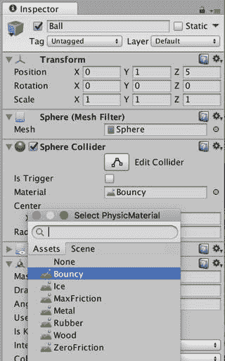

图 6-23. 给球添加一个`Bouncy`物理材质

尝试在地板和球上使用不同的物理材质。为球选择`Bouncy`物理材质，为地板选择`Metal`。然后点击播放，观察球一次又一次地弹跳；接着将球切换为`Ice`，观察球沉闷地落地。

除了在`Collider`组件中来回交换不同的物理材质，你也可以直接调整物理材质本身。例如，在项目视图中选中`Bouncy`物理材质，然后在检视视图中编辑物理材质的属性。但由于这些物理材质来自标准资产包，如果你重新导入该包（无论是意外还是因升级而故意为之），它们可能会被替换。此外，如果一个物理材质被多个`GameObject`使用，更改其属性会影响所有这些对象。

这里干净且安全的解决方案是为每个需要独立物理材质的`GameObject`创建一个新的物理材质。从概念上讲，当你需要一个独特的材质时，也应该期望有一个独特的物理材质。换句话说，一个独特的表面应该拥有自己的材质和物理材质。例如，球和地板应该有自己的物理材质，而所有的保龄球瓶（你将在下一章创建）应该共享同一个物理材质。


### 创建新的 `PhysicMaterial`

为便于组织，在创建新的 `PhysicMaterial` 之前，应先新建一个文件夹来存放它们。在“项目”视图左侧面板中选择顶层的 `Assets` 文件夹，然后使用“项目”视图中的“创建”菜单，新建一个文件夹并命名为 `Physics`（这个名字比 `PhysicMaterials` 更短且拼写更规范）。

你可以通过“项目”视图中的“创建”菜单来创建新的 `PhysicMaterial`，然后在“检查器”视图中填写新 `PhysicMaterial` 的所有属性。但更省力的方法是，从 Standard Assets 中复制一个 `PhysicMaterial`，最好选一个已经接近你需求的。由于地板使用了木材材质，从 Standard Assets 中的 Wood `PhysicMaterial` 开始比较方便。在“项目”视图中选中 Wood `PhysicMaterial`，然后从“编辑”菜单中选择“复制”（或使用快捷键 Command+D 进行复制）。

将复制的 Wood `PhysicMaterial` 拖到“项目”视图中新创建的 `Physics` 文件夹内，并将其重命名为 `Floor`，因为稍后你要将其应用于名为 Floor 的游戏对象上。接着，复制 Floor `PhysicMaterial`，并将新复制的材质命名为 `Ball`（如图 6-24 所示），因为稍后你要将其应用于名为 Ball 的游戏对象上。

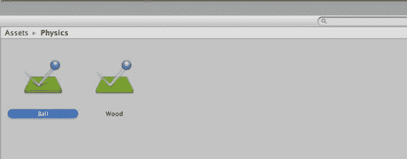

图 6-24. 自定义的 `PhysicMaterial`

现在，地板和球体各自有了对应的 `PhysicMaterial`。要将这些 `PhysicMaterial` 应用到预期的游戏对象上，只需将 Floor `PhysicMaterial` 拖到“层级”视图中的 Floor 游戏对象上，再将 Ball `PhysicMaterial` 拖到 Ball 游戏对象上。（你可以在“检查器”视图中检查这两个游戏对象，确认 `PhysicMaterial` 已显示在碰撞体组件的“材质”字段中。）至此，你就可以开始调整 `PhysicMaterial` 的属性了。

如你所料，Wood `PhysicMaterial` 已经设置了适用于木质地板的合理数值，因此可以保持不变。但你需要调整 Ball `PhysicMaterial`，所以选中 Ball `PhysicMaterial` 并按图 6-25 所示设置其数值。

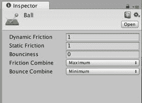

图 6-25. Ball `PhysicMaterial` 调整后的数值

球体不应该在地板上弹跳（也不应在后续添加保龄球瓶后弹跳），因此将 `Bounciness` 值设为 `0`，`Bounce Combine` 设为 `Minimum`，这样无论与什么物体碰撞，球体都完全不会弹起。接着，将 `Dynamic` 和 `Static Friction` 值设为 `1`，`Friction Combine` 设为 `Maximum`，这样无论球体是静止还是滚动，始终具有最大摩擦力。最大摩擦力值可确保球体滚动而非滑动。

现在，当你点击“播放”时，球体应该直接落到地板上，静止不动，不再弹跳。

## 让球滚动起来

要让球滚动，你需要为游戏添加一些控制（事实上，这样它才能称得上是一个游戏）。原版街机游戏《HyperBowl》使用一个真正的保龄球作为大型轨迹球进行控制。旋转这个球体会为游戏中的球体施加旋转力（结果就是，玩家在试图让球滚过旧金山山坡时，身体会做出滑稽的动作）。

当然，制作一个空气支撑的保龄球外设超出了本书的范围，但 PC 版《HyperBowl》提供了基于鼠标的控制方式：推动鼠标会向相应方向为球体施加旋转力。这种控制方式只需一个脚本就能相当直接地实现。

#### 创建脚本

在“项目”视图中选中 `Scripts` 文件夹，使用“项目”视图左上角的“创建”按钮新建一个 JavaScript 脚本，并将其命名为 `FuguForce`，因为你将用它来为球体施加力。（我本想将其命名为 `FuguRoll`，以呼应寿司的含义，但我不想让名称暗示你施加的是扭矩——一种旋转力而非线性力。）然后将 `FuguForce` 脚本拖到“层级”视图中的球体上，这样一旦你向脚本中添加代码，就可以立即进行测试。


### 更新：收集输入

试图通过计算旋转和平移（位置变化）来模拟球的滚动会非常复杂，这涉及到与地板和球瓶的碰撞检测与响应，还要考虑重力、摩擦力和反弹……这些都是物理引擎已经完成的计算。因此，不把这个任务交给 Unity 物理系统来管理，那可真是一种浪费。

由于球体已经添加了 `Rigidbody` 组件，它已经是一个受重力等力影响、并能响应（包括与地板）碰撞的物理对象。所以，要让球滚动，只需要给它一个推力。推力的大小取决于输入，在本设计方案中，输入就是鼠标的移动。请注意，非 Unity 版本的原始《HyperBowl》游戏是向保龄球施加扭矩（旋转力）使其旋转的。Unity 确实有一个可以向 `Rigidbody` 组件施加扭矩的脚本函数，叫做 `Rigidbody.AddTorque`，但我发现在 Unity 中，通过 `Rigidbody.AddForce` 施加线性力来推动球滚动，效果更好。

每帧都可以检测鼠标移动（以及一般的输入），因此收集输入的代码和对应推力的计算应该放在脚本的 `Update` 回调函数中，如清单 6-1 所示。将清单中的代码复制到 `FuguForce` 脚本中。

```csharp
#pragma strict
var mousepowerx:float = 1.0;
var mousepowery:float = 1.0;
private var forcex:float=0.0;
private var forcey:float=0.0;
function Update() {
forcex = mousepowerx*Input.GetAxis("Mouse X")/Time.deltaTime;
forcey = mousepowery*Input.GetAxis("Mouse Y")/Time.deltaTime;
}
```

脚本以变量 `mousepowerx` 和 `mousepowery` 开头，用于缩放施加给球的力。`mousepowerx` 影响左右移动鼠标产生的力，而 `mousepowery` 影响前后移动鼠标产生的力。这些变量是公开的，因此可以在 `Inspector` 视图中进行调整。

最终计算出的力存储在私有变量 `forcex` 和 `forcey` 中，它们也分别对应鼠标的左右和前后移动。

**提示**

在变量声明时，始终指定一个初始值是个好主意。这能让代码的含义更清晰，并避免因为对初始值的错误假设而导致错误（C 和 C++ 程序员尤其知道要警惕未初始化变量引发的莫名 bug）。

`Update` 回调函数正是根据 `mousepowerx`、`mousepowery` 和鼠标移动来计算 `forcex` 和 `forcey` 的地方。在 Unity 中，使用 `Input` 类来查询输入。例如，可以通过检查静态变量 `Input.mousePosition` 来获取鼠标位置，因此可以通过在每次 `Update` 调用时保存鼠标位置，并将当前位置与上一帧保存的位置进行比较，来确定鼠标的移动。

但更高级的 `Input.GetAxis` 函数已经完成了这项工作。`Input.GetAxis` 根据传递给函数的参数，返回一个介于 -1 到 1 之间的值，用于表示鼠标、摇杆或键盘的左右或前后移动。

在 `Update` 回调函数中，调用 `Input.GetAxis("Mouse X")` 获取鼠标的左右移动，调用 `Input.GetAxis("Mouse Y")` 获取上一帧发生的前后移动。在考虑了该帧经过的时间（我们的老朋友 `Time.deltaTime`）并乘以缩放因子 `mousepowerx` 和 `mousepowery` 之后，结果分别赋值给变量 `forcex` 和 `forcey`。

将这段代码放入 `FuguForce` 脚本后，你就可以在球的 `Inspector` 视图中看到公开的 `mousepower` 变量了（图 6-26）。

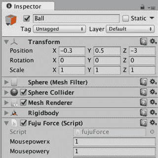

当你点击“播放”时，你仍然无法控制球，因为你还没有添加实际的推球代码。不过，如果你在 `Inspector` 视图菜单中选择“调试”选项，私有的 `forcex` 和 `forcey` 变量就会显示出来，你可以看到它们在鼠标移动时发生变化。

### FixedUpdate：使用力

影响物理效果的函数（包括 `Rigidbody.AddForce`）应该放在 `FixedUpdate` 回调函数中调用。与 `Update` 回调函数（每帧调用一次，耗时不确定）不同，`FixedUpdate` 回调函数在每个固定的时间步长结束后被调用。为了获得良好效果，物理模拟需要以固定的时间间隔运行，通常频率比 `Update` 更高。物理计算时间间隔的变化可能导致行为不一致以及物理更新之间的长时间延迟。在 Unity 中，这个时间步长是在 `TimeManager`（图 6-27）中设置的，可以通过 `编辑` 菜单的 `项目设置` 子菜单访问。

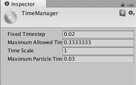

`FixedUpdate` 回调函数正是在这些物理更新间隔中被调用的（我个人将 `FixedUpdate` 视为 `PhysicsUpdate`，将 `Fixed Timestep` 视为 `PhysicsTimestep`），因此，所有对物理模拟的更改都应在此进行，尤其是对 `Rigidbody` 执行的操作。

由于推动球的力已经在 `Update` 回调函数中计算好了，`FixedUpdate` 回调函数只需在调用球体 `Rigidbody` 组件的 `Rigidbody.AddForce` 方法时应用这些值即可（清单 6-2）。

```csharp
function FixedUpdate() {
rigidbody.AddForce(forcex,0,forcey);
}
```

在变量 `rigidbody` 上调用了 `Rigidbody` 的函数 `AddForce`。`rigidbody` 是一个 `Component` 变量，它始终引用此 `GameObject` 上的 `Rigidbody` 组件。`GameObject` 类也有一个 `rigidbody` 变量，因此使用 `gameObject.rigidbody` 的引用也是等价的。

传递给 `Rigidbody.AddForce` 的三个值分别是力的 x、y 和 z 分量，因为力具有方向和大小，所以它是一个向量。力的方向是世界空间中的方向。从本游戏中 `Main Camera` 的视角来看，x 轴代表左右方向，z 轴代表前后方向。因此，将 `forcex` 作为 x 参数传入，`forcey` 作为 z 参数传入。控制指令不会上下推动球，只会前后和侧向推动，所以 y 参数传入 0。

**注意**

请务必查看 `Rigidbody.AddForce` 的脚本参考页面。它是一个重载函数，有一种重载形式将力作为 `Vector3` 接收，而不是三个独立的数值。此外，两种重载形式都接受一个可选参数，该参数可以指定应用于 `Rigidbody` 的值不是力，而是其他物理量，例如加速度、冲量或瞬时速度变化。

现在，当你点击“播放”并移动鼠标时，球就会朝那个方向滚动了。试着在 `Inspector` 视图中更改 `mousepowerx` 和 `mousepowery` 的值，以获得你想要的滚动响应效果。


### 真的在滚动吗？

你可能会注意到，如果在球下落时移动鼠标，实际上可以在球还在空中时就推动它，这看起来不太对劲。移动鼠标只应在球接触表面时才能使其滚动。

幸运的是，Unity 提供了回调函数，每个都以 `OnCollision` 为前缀。当一个 `GameObject` 与另一个 `GameObject` 发生碰撞以及接触结束时，这些函数会被调用。每个回调函数都接受一个参数，即包含碰撞信息的 `Collision` 对象，其中包含对方的 `GameObject` 引用。

`FuguForce` 脚本可以通过检查碰撞对象的名字是否为 `Floor`（使用 `GameObject.name` 变量）来判断碰撞的 `GameObject` 是否是地面。但通常来说，通过标签来查找和识别 `GameObject`（使用 `GameObject.tag` 变量）是更好的实践，也更高效。如果你选择名为 Floor 的 `GameObject`，并在检视面板中查看它，你会在左上角看到它带有默认标签 `Untagged`。要将该 `GameObject` 的标签更改为 `Floor`，需要先从该 `GameObject` 的标签菜单中选择添加标签，来创建 `Floor` 标签（图 6-28）。

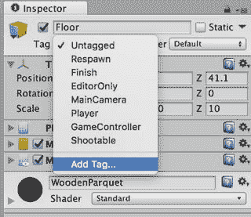

图 6-28. 添加新标签

此时，检视面板中会打开 `TagManager`。`TagManager` 用于管理标签和层级。标签用于标识 `GameObject`，因此你几乎可以创建无限数量的标签。而层级则用于标记 `GameObject` 组，最多可以定义 32 个层级，因为它们被实现为 32 位数字中的位。这使得指定层级的组合变得十分方便，例如，在摄像机和光源的剔除遮罩属性中就是如此。

要创建一个名为 `Floor` 的新标签，只需在 `TagManager` 的第一个空白标签字段中输入 `Floor`（图 6-29）。然后再次在层级视图中选择名为 Floor 的 `GameObject`，并再次点击检视面板中的标签菜单，新的 `Floor` 标签便可供选择（可能需要重启 Unity 后才可见）。

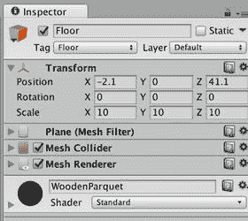

图 6-29. 添加了 Floor 标签的地面

现在，`FuguForce` 脚本可以增加碰撞回调，以判断球是否在地面上（列表 6-3）。

```
private var isRolling:boolean=false;
private var floorTag:String = "Floor";
function Update() {
forcex = mousepowerx*Input.GetAxis("Mouse X")/Time.deltaTime;
forcey = mousepowery*Input.GetAxis("Mouse Y")/Time.deltaTime;
}
function FixedUpdate() {
if (isRolling && GetComponent.().velocity.sqrMagnitude().AddForce(forcex,0,forcey);
}
}
function OnCollisionEnter(collider:Collision) {
if (collider.gameObject.tag == floorTag) {
isRolling = true;
}
}
function OnCollisionStay(collider:Collision) {
if (collider.gameObject.tag == floorTag) {
isRolling = true;
}
}
function OnCollisionExit(collider:Collision) {
if (collider.gameObject.tag == floorTag) {
isRolling = false;
}
}
```

列表 6-3. FuguForce.js 中的碰撞回调

添加了两个私有变量。第一个变量 `isRolling`，当球在地面上时为 true。第二个变量 `floorTag`，是赋给地面的标签。

**提示**  
为标签定义一个变量，可以避免在多个位置反复拼写该标签（并避免难以调试的拼写错误），并且如果后续标签名称发生更改，只需更新该变量即可。这三个碰撞回调函数都会通过检测碰撞对象的标签，来判断球碰撞的 `GameObject` 是否是地面。如果该 `GameObject` 不是地面，则碰撞回调不执行任何操作。

当球与另一个 `GameObject` 发生碰撞时，Unity 会调用 `OnCollisionEnter` 回调，因此该函数会将 `isRolling` 设置为 true。相反，当球与 `GameObject` 的接触结束时，Unity 会调用 `OnCollisionExit`，此时将 `isRolling` 设置为 false。

与此同时，`OnCollisionStay` 会在球与 `GameObject` 保持接触时被调用，因此它也确保 `isRolling` 保持为 true。现在，`FixedUpdate` 回调可以在对球施加推力之前，检查 `isRolling` 是否为 true，以判断球是否在地面上（列表 6-4）。

```
function FixedUpdate() {
if (isRolling && GetComponent.().velocity.sqrMagnitude().AddForce(forcex,0,forcey);
}
}
```

列表 6-4. 在 FuguForce.js 的 FixedUpdate 中添加滚动检查

### 限制速度

最后，作为一点润色，球控制脚本可以在推动球之前检查其速度，避免因现有速度、帧率和输入值的某种异常组合，导致球最终滚动的速度远超预期（列表 6-5）。

```
var maxVelocitySquared:float=400.0;
```

列表 6-5. 在 FuguForce.js 的 FixedUpdate 中添加速度检查

这是一个相当简单的改动，只需添加一个名为 `maxVelocitySquared` 的变量来保存你的最大速度值，该值实际上是最大速度值的平方。

## 完整脚本

列表 6-6 展示了目前为止整合在一起的球控制脚本 `FuguForce.js` 的完整代码。此版本位于第 6 章的项目中，可于 [`www.apress.com/9781484231739`](http://www.apress.com/9781484231739) 获取。

```
#pragma strict
var mousepowerx:float = 1.0;
var mousepowery:float = 1.0;
var maxVelocitySquared:float=400.0;
private var forcey:float=0;
private var forcex:float=0;
private var isRolling:boolean=false;
private var floorTag:String = "Floor";
function Update() {
forcex = mousepowerx*Input.GetAxis("Mouse X")/Time.deltaTime;
forcey = mousepowery*Input.GetAxis("Mouse Y")/Time.deltaTime;
}
function FixedUpdate() {
if (isRolling && GetComponent.().velocity.sqrMagnitude().AddForce(forcex,0,forcey);
}
}
function OnCollisionEnter(collider:Collision) {
if (collider.gameObject.tag == floorTag) {
isRolling = true;
}
}
```

列表 6-6. FuguForce.js 的完整代码


## 成为保龄球

`Ball`（球体）控制目前运行得相当不错，但`Main Camera`（主摄像机）只是静止不动，任由球体滚向远方。这是一个明显的缺陷，因为任何像样的 3D 游戏都需要某种摄像机运动。在 HyperBowl 中，`Main Camera`会跟随球体滚动，但始终朝向同一方向（对准球瓶）。事实证明，Unity 在标准资源（Standard Assets）中提供了一个摄像机跟随脚本。第 3 章中已从标准资源导入脚本包以获取`MouseOrbit`脚本。该脚本同样位于标准资源包的 Utility 文件夹中，名为`SmoothFollow`（图 6-30）。

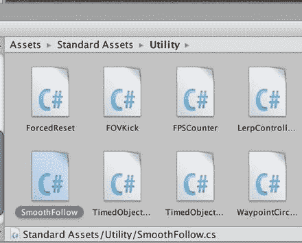

图 6-30. 标准资源中的 Utility 脚本

你会注意到这是一个 C#脚本。C#是创建视频游戏的常用语言。将`SmoothFollow`脚本从 Project 视图拖拽至 Hierarchy 视图中的`Main Camera`上。然后选中 Hierarchy 视图中的`Main Camera`，以便在 Inspector 视图中编辑`SmoothFollow`脚本属性（图 6-31）。

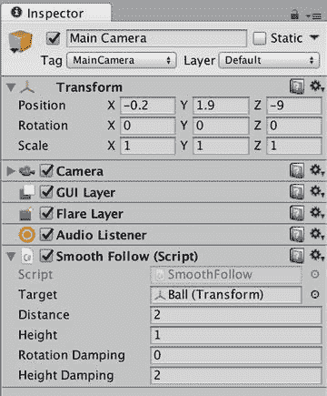

图 6-31. 带有`SmoothFollow`脚本的`Main Camera`的 Inspector 视图

`Main Camera`应跟随球体移动，因此将 Hierarchy 视图中名为`Ball`的游戏对象拖拽至 Inspector 视图中`SmoothFollow`脚本的`Target`字段。

至于其他`SmoothFollow`属性，将`Distance`设置为 2，这将使`Main Camera`在`Ball`后方 2 米处跟随；将`Height`设置为 1，使摄像机保持在球体上方 1 米处，而非紧跟在正后方。`Height Damping`（高度阻尼）设置为 2，允许`Main Camera`在跟随球体高度时有一定的上下弹性；`Rotation Damping`（旋转阻尼）设置为 0，确保`Main Camera`始终保持在球体后方，不会左右摆动。

现在点击 Play，当你滚动球体时，球体在滚动，摄像机也在跟随！

## 进一步探索

现在我们有了真正游戏玩法的雏形。虽然还不是完整的保龄球游戏，但它已具备物理引擎（球在平面滚动）、交互控制（推动球体）和摄像机运动（跟随球体）。这些特性在游戏开发中都是丰富的主题，但特别是在下一章中，你将通过添加保龄球瓶和碰撞音效来更深入地研究物理引擎。届时游戏将更像一款保龄球游戏！

### Unity 手册

在"Asset Import and Creation"（资源导入与创建）部分，"Procedural Materials"（程序化材质）页面简要介绍了 Substance 存档格式，并概述了用于创建和分析程序化材质的工具。

在"Creating Gameplay"（创建游戏玩法）部分，"Input"（输入）页面描述了`Input`类及其`GetAxis`函数（本章实现的`BallController`脚本中使用了该函数），并列出了传递给该函数的摇杆和键盘值。该页面下半部分介绍了适用于 iOS 的输入函数和变量，你可以提前阅读本章关于 iOS 输入的内容。

本章主要涉及物理引擎，因此"Physics"（物理）页面是最重要的阅读内容。它列出了所有碰撞器类型，包括本章使用的`Sphere Collider`（球体碰撞器）、`Box Collider`（盒体碰撞器）和`Mesh Collider`（网格碰撞器）。该页面还介绍了刚体（球体）与静态碰撞器（地面）之间的区别，以及物理材质及其属性如何影响碰撞行为。

### 参考手册

在"Asset Components"（资源组件）部分，"Procedural Material Assets"（程序化材质资源）页面解释了你在 Project 视图和 Inspector 视图中对程序化材质看到的内容。

"Physics Components"（物理组件）部分详细列出了所有可用的碰撞器，以及可用的关节（包括铰链和弹簧）、恒力和布料组件（Unity iOS 不支持布料）。

### 脚本参考

Unity 脚本参考可通过互联网访问（<https://docs.unity3d.com/ScriptReference/index.html>），并提供宝贵信息。Unity 脚本参考也可直接从 MonoDevelop 获取。当你输入任何 Unity 类或函数时，可以使用 Command 键加单引号键（`⌘ + '`）调出上下文相关的信息。例如，输入`Input`类后，使用`⌘ + '`组合键将在默认网页浏览器中打开一个页面，并显示 Unity 脚本参考中与`Input`相关的信息（图 6-32）。

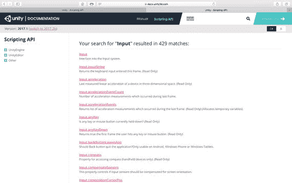

图 6-32. 添加到球体的`Speed`变量

### 网络资源

Unity 中的物理实现基于 PhysX 引擎的旧版本（2.x），该引擎最初由 NovodeX 开发，后被 Ageia 收购并与硬件物理加速器捆绑，现为 nVidia 的产品。最新版本（3.x）可在 nVidia 开发者专区获取（<https://developer.nvidia.com/physx>）。查看 PhysX 软件开发工具包有助于更好地理解 Unity 物理组件和脚本函数所依赖的物理引擎特性。

