# 7. 开打吧！高级物理

此时，你已拥有保龄球游戏的雏形，至少是在 Unity 编辑器中玩家可以在地面滚动球体的场景。但游戏至少需要加上保龄球瓶才能看起来像保龄球游戏。本章将解决这一问题，并涉及更多 Unity 物理知识，包括`Rigidbody`组件之间的碰撞（球体与球瓶之间）以及复合碰撞器（以适应保龄球瓶的形状）。在此基础上，你还会添加基于碰撞的音效，让游戏听起来更像保龄球游戏。

这些额外功能需要构建几个新脚本，这些脚本可在本章的 Unity 项目中找到。你可以通过<http://www.apress.com/9781484231739>上的"下载源代码"按钮访问本书所有源代码。不过，用于保龄球瓶的桶模型以及球瓶碰撞和球滚动声音的音频来自 Asset Store，不包含在在线项目中（但它们都是免费的）。

## 加长球道

在向保龄球场景（应保持上一章关闭时的状态在 Unity 编辑器中打开）添加保龄球瓶之前，你需要更多滚动空间。选中 Hierarchy 视图中的地面，在 Inspector 视图（图 7-1）中将 X、Y、Z 轴的`Scale`（缩放）设置为 10。

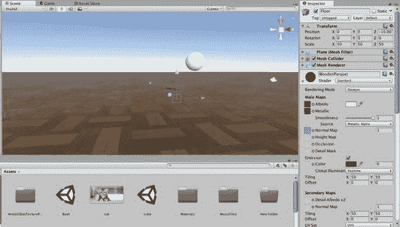

图 7-1. 放大了 10 倍的`Floor`游戏对象

> **提示：** 出于性能考虑，最好避免在`Transform`组件中更改缩放（对于导入的模型，应在 Import Settings 对话框中更改缩放）。如果必须更改缩放，请沿三个轴统一更改。

现在地面放大了十倍（高度除外，因为平面高度为零）。但地面上的纹理也被拉伸，导致木板变得非常宽。为了补偿，你还应将地面的主纹理和法线贴图的平铺（Tiling）调整十倍，使每个方向上的`Tiling`系数变为 50。这样木板看起来就恢复原样了。


### 创建保龄球瓶

现在有了滚动空间，就该添加球瓶了。可以用`Capsule`（胶囊体）基元来制作一个简化版的保龄球瓶，替代球瓶模型。

从层级视图的创建菜单中选择`Capsule`（图 7-2）。`Capsule`与其他基元模型一样，也可以在菜单栏的`GameObject`菜单中找到。

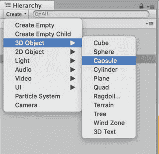

图 7-2. 创建一个胶囊体

将生成的游戏对象命名为`Pin`。要创建十个球瓶，你可以将球瓶复制九次，但是，与其像立方体场景中复制立方体那样操作，不如先创建一个预制件。这样一来，你对单个球瓶所做的任何更改都可以应用到所有十个球瓶上。

所以，将球瓶拖拽到项目视图中的`Prefabs`文件夹中，以创建预制件（图 7-3）。

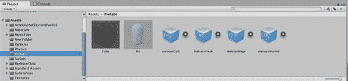

图 7-3. 球瓶预制件

创建预制件可以让你制作一个游戏资源副本，并在游戏中按需多次应用。当你对预制件进行更改时，这些更改将应用到游戏中的所有资源上。

### 在场景中放置球瓶

现在你可以在场景中放置球瓶了。从项目文件夹中，将一个球瓶预制件拖拽到场景中。你需要让球瓶与球在一条直线上。因此，将其放置在球的同一 X 轴 `(100,1,0)` 上（图 7-4）。

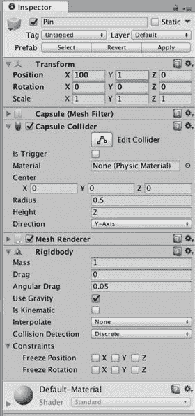

图 7-4. 初始球瓶变换设置

现在，再添加九个球瓶，形成一个典型的保龄球瓶阵型（三角形）。

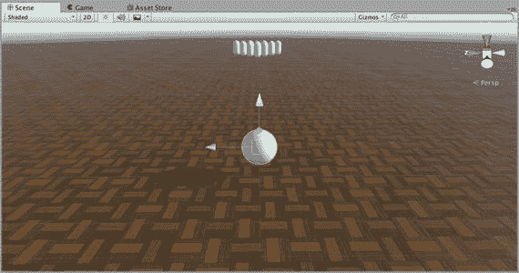

图 7-5. 带球瓶的保龄球

如果你现在测试，你会发现当你把球滚向球瓶时，球只是从它们上面弹开，因为这些球瓶有`Collider`组件，但却是静态的`GameObject`。和球一样，每个球瓶都需要有一个`Rigidbody`组件才能对力做出反应。可以通过组件菜单将`Rigidbody`组件添加到`Pin`预制件上，不过这次，让我们尝试另一种方法。在项目视图中选择`Pin`预制件，然后在检查器视图中点击`Add Component`按钮。在弹出的菜单中，在物理（Physics）下选择`Rigidbody`（或者你也可以通过在弹出窗口的搜索字段中输入`rigidbody`来找到该选项）。无论你选择哪种方式，现在`Pin`预制件上应该就有了一个`Rigidbody`组件（图 7-6）。

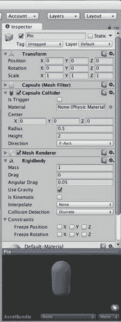

图 7-6. 带有 `Rigidbody` 组件的球瓶预制件

与地面和球的碰撞体组件类似，`Pin`预制件应该有自己的`PhysicMaterial`（物理材质）。创建合适的`PhysicMaterial`的快捷方法是复制球所用的物理材质，因此在项目视图中选择`Physics`文件夹中的`Ball PhysicMaterial`，使用编辑菜单或`Command+D`进行复制，并将新的物理材质命名为`Pin`（图 7-7）。

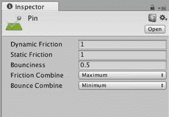

图 7-7. 球瓶预制件的物理材质

由于保龄球瓶应该和球一样能够滚动，因此将`Dynamic Friction`（动态摩擦力）和`Static Friction`（静摩擦力）值保留为 1（以防止滚动时的滑动），并将`Friction Combine`（摩擦力组合）值保留为`Maximum`（最大值）。然而，与球不同，保龄球瓶应该非常有弹性，因此将`Bounciness`（弹性）设置为 0.5，并将`Bounce Combine`（弹性组合）值设置为`Average`（平均值）（考虑到与之碰撞的物体的弹性）。最后，将`Pin PhysicMaterial`指定给`Pin`预制件。在项目视图中选择`Pin`预制件；然后在检查器视图中，点击碰撞体组件`PhysicMaterial`字段右侧的圆圈，并从弹出选择器中选取`Pin PhysicMaterial`（图 7-8）。

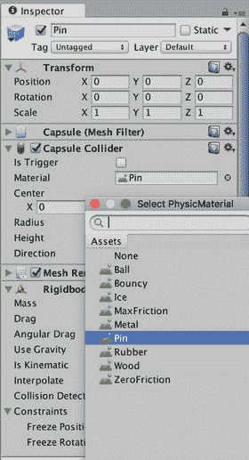

图 7-8. 将球瓶物理材质指定给球瓶预制件

现在，当你点击播放并将球滚向球瓶时，球瓶会被撞倒，并像图 7-9 那样弹跳滚动起来！

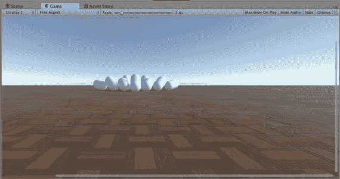

图 7-9. 与所有具有 `Rigidbody` 组件的球瓶碰撞

### 使用摄像机跟随

你会注意到，球撞击球瓶的视角可能比较远，玩家可能不太容易看清碰撞效果。因此，你需要做的是让摄像机跟随保龄球。为此，你需要创建另一个脚本。在`Script`文件夹中，创建一个新的 C# 脚本，并将其命名为`CameraFollow`，内容如代码清单 7-1 所示。

```
using UnityEngine;
using System.Collections;
public class CameraController : MonoBehaviour {
public GameObject player;
private Vector3 offset;
void Start ()
{
offset = transform.position - player.transform.position;
}
```

代码清单 7-1. CameraFollow 脚本

你可能需要调整摄像机的起始位置，使其起始位置刚好位于球的后上方。

### 持续游玩

每次想要测试一次滚球都得停止游戏再点击播放，这相当烦人。而且，当球滚出地面时，你只能眼睁睁看着球无限下落。所以，让我们实现当球滚到地板边缘时，球和球瓶能够重置。

## 返回球的初始状态

首先，你需要一个能够将`GameObject`恢复到其初始位置和旋转（不能忘记旋转——如果一个球瓶被击倒，你需要将其重置为初始的直立方向）的脚本。创建一个新的 JavaScript 脚本，将其命名为`FuguReset`，并添加代码清单 7-2 的内容。

```
// 将游戏对象恢复到其原始位置和旋转
#pragma strict
private var startPos:Vector3;
private var startRot:Vector3;
function Awake() {
// 保存此游戏对象的初始位置和旋转
startPos = transform.localPosition;
startRot = transform.localEulerAngles;
}
function ResetPosition() {
// 回到初始位置
transform.localPosition = startPos;
transform.localEulerAngles = startRot;
// 确保停止所有物理运动
if (GetComponent.() != null) {
GetComponent.().velocity = Vector3.zero;
GetComponent.().angularVelocity = Vector3.zero;
}
}
```

代码清单 7-2. FuguReset.js 脚本恢复游戏对象的位置

`Awake`函数将游戏对象的位置和旋转保存在几个变量中，而`ResetPosition`函数则将游戏对象恢复到这些设置。`ResetPosition`还会检查游戏对象是否具有`Rigidbody`组件。如果有，该函数会停止其移动或旋转。`FuguReset`脚本应该附加到每一个在重新启动游戏时需要重置其位置（以及可能的旋转）的`GameObject`上。这些对象包括球、球瓶和`Main Camera`（主摄像机）。首先，将`FuguReset`脚本拖拽到层级视图中的`Main Camera`和`Ball`游戏对象上。然后，在项目视图中选择`Pin`预制件，并在检查器视图中点击`Add Component`按钮以添加`FuguReset`脚本（图 7-10）。

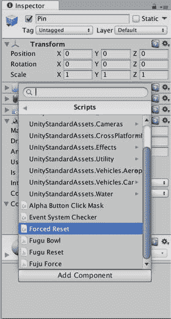

图 7-10. 将 FuguReset 脚本附加到球瓶预制件上

`Ball`、`Pin`和`Main Camera`游戏对象现在会在游戏启动时记录它们的原始位置和旋转，并且你有一个可供调用的`ResetPosition`函数，该函数会将这些游戏对象恢复到那些原始位置和旋转。


### 发送消息

通常，从一个`GameObject`上挂载的脚本调用另一个`GameObject`上挂载的脚本中的函数会有些棘手。这涉及到对`GameObject`调用`GetComponent`来获取脚本，然后引用该脚本才能调用函数。

但在简单情况下（例如，当你不关心函数的返回值时），Unity 允许你通过向`GameObject`发送消息来调用函数，可以使用`GameObject.SendMessage()`函数或`GameObject.BroadcastMessage()`函数。接收消息的`GameObject`（消息内容为要调用的函数名）会将这条消息传递给所有可能包含该函数的脚本。

让我们在你的游戏控制脚本中添加一些函数，用于发送`ResetPosition`消息（清单 7-3）。

```
var ball:GameObject; // 保龄球
Function ResetBall() {
    ball.SendMessage("ResetPosition");
}
function ResetPins() {
    for (var pin:GameObject in pins) {
        pin.BroadcastMessage("ResetPosition");
    }
}
function ResetCamera() {
    Camera.main.SendMessage("ResetPosition");
}
function ResetEverything() {
    ResetBall();
    ResetPins();
    ResetCamera();
}
```
*清单 7-3. FuguBowl.js 中用于发送 ResetPosition 消息的函数*

新增代码以一个公开变量开头，该变量将引用保龄球。脚本中已经有一个`pins`数组引用了所有瓶柱，而`Main Camera`始终可以通过静态变量`Camera.main`来引用，因此现在脚本可以访问所有需要重置的`GameObject`。函数`ResetCamera()`和`ResetBall()`调用`SendMessage()`向各自的目标`GameObject`发送`ResetPosition`消息。所有在这些`GameObject`所挂载脚本中定义的`ResetPosition()`函数都将被调用。具体来说，由于`Main Camera`和`Ball`这两个`GameObject`都挂载了`FuguReset`脚本，该脚本中的`ResetPosition()`函数将响应此消息。`ResetPins()`函数则略有不同，它调用`BroadcastMessage()`来发送`ResetPosition`消息。`BroadcastMessage()`的行为与`SendMessage()`相同，区别在于消息还会传播给原始接收`GameObject`的所有子`GameObject`。当你稍后在本章中替换一些瓶柱，而这些瓶柱的`Rigidbody`组件挂载在子`GameObject`上时，这个特性将非常有用。

### 检测落沟球

当保龄球滚出地板边缘时，本质上就是一个落沟球，因为此时已无望击中瓶柱。因此，在这种情况下，游戏必须立即重置。实现落沟球检测的方法是在每一帧检查保龄球的`y`位置是否低于某个阈值。可以通过在`FuguBowl`脚本中加入以下公开变量和`Update()`回调来实现（清单 7-4）。

```
var sunkHeight:float = -10.0; // 低于此 y 位置即为落沟球
function Update() {
    if (ball.transform.position.y < sunkHeight) {
        ResetEverything();
    }
}
```
*清单 7-4. FuguBowl.js 中用于检测落沟球的 Update 回调*

变量`sunkHeight`指定了保龄球的`y`位置需低于多少才触发全部重置。`sunkHeight`的默认值设为零以下一段距离，这样玩家在重置前还能看到球下落一段距离。`Update()`回调每帧检查保龄球的`y`位置是否低于`sunkHeight`。如果是，则调用`ResetEverything()`，它将向`Ball`、`Main Camera`和`Pin`这些`GameObject`发送所有`ResetPosition`消息。在点击播放测试之前，你需要通过从层级视图中将`Ball` `GameObject`拖拽到`FuguBowl`脚本的`Ball`字段中，来分配脚本中的`ball`公开变量（图 7-11）。

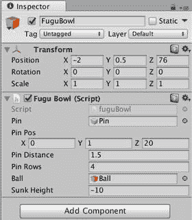

*图 7-11. FuguBowl.js 中支持重置保龄球的游戏控制器属性*

现在，当保龄球滚出地板时，`Ball`、`Main Camera`和`Pin`这些`GameObject`应该会立刻弹回它们的初始位置。连续游戏继续进行！

### 完整代码清单

清单 7-5 给出了完整的游戏控制器脚本。

```
// 保龄球游戏控制器
#pragma strict
var pin:GameObject; // 用于实例化的瓶柱预设
var pinPos:Vector3 = Vector3(0,1,20); // 放置瓶柱阵列的位置
var pinDistance = 1.5; // 瓶柱之间的初始距离
var pinRows = 4; // 瓶柱行数
var ball:GameObject; // 保龄球
var sunkHeight:float = -10.0; // 低于此 y 位置即为落沟球
private var pins:Array;

function Awake () {
    CreatePins();
}

function CreatePins() {
    pins = new Array();
    var offset = Vector3.zero;
    for (var row=0; row < pinRows; ++row) {
        offset.z += pinDistance;
        offset.x = -pinDistance * row / 2;
        for (var n=0; n <= row; ++n) {
            pins.push(Instantiate(pin, pinPos + offset, Quaternion.identity));
            offset.x += pinDistance;
        }
    }
}

function Update() {
    if (ball.transform.position.y < sunkHeight) {
        ResetEverything();
    }
}

function ResetBall() {
    ball.SendMessage("ResetPosition");
}

function ResetPins() {
    for (var pin:GameObject in pins) {
        pin.BroadcastMessage("ResetPosition");
    }
}

function ResetCamera() {
    Camera.main.SendMessage("ResetPosition");
}

function ResetEverything() {
    ResetBall();
    ResetPins();
    ResetCamera();
}
```
*清单 7-5. FuguBowl.js 的完整代码清单*

## 用木桶代替球瓶

使用胶囊体作为保龄球瓶既简陋又碰撞形状单一。一个真正的保龄球瓶模型会好得多，但可惜的是，在资源商店中搜索免费保龄球瓶一无所获（不过，如果有供应商决定填补这个空白，这种情况随时可能改变）。然而，资源商店中有很多其他模型，如果你灵活变通，它们可以作为保龄球瓶的替代品。结果发现有好几个木桶模型的资源包，所以作为备选方案，你将使用木桶作为瓶柱。

### 挑选一个木桶

在资源商店中搜索`barrel`会发现几个免费的木桶模型资源包（图 7-12）。

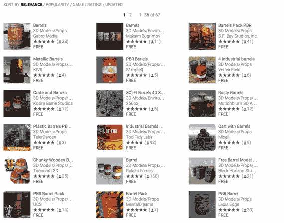

*图 7-12. 资源商店中的免费木桶*

任何一个免费资源包都可以正常工作，但来自 Game-Ready 的木桶包（其资源商店图标中显示两个生锈的金属木桶）已经设置好了预设体，所以我们就下载这个包吧。从资源商店的描述以及导入该包后的项目视图中，你可以看到木桶包组织得很好，其中有一个名为`Prefabs`的文件夹，包含了`Barrel`预设体和`Barrel`模型（图 7-13）。

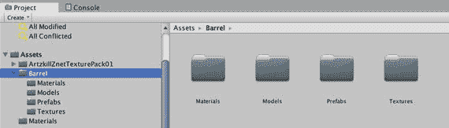

*图 7-13. 木桶包的项目视图*


### 创建预制件

你需要一个`Barrel`（木桶）预制件来替换简单的`Pin`（球瓶）预制件，但应避免修改原始的`Barrel`预制件（再次导入`Barrel`包会覆盖你的修改）。要制作`Barrel`预制件的副本，请选中该预制件，按下`Command+D`（或从**编辑**菜单中选择**复制**），然后将复制的预制件拖入**预制件**文件夹。接着将其重命名为`BarrelPin`，因为它是一个`Barrel`，而你将其用作保龄球瓶（图 7-14）。

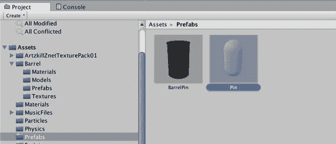

图 7-14. `Barrel`预制件的副本

选中`BarrelPin`预制件，使其显示在**检查器**视图中。如果你使用了相同的资源包，那么它会包含`MeshFilter`组件和`MeshRenderer`组件。但它还需要`Collider`组件和`Rigidbody`组件。该预制件还需要附加一个`FuguReset`脚本来处理游戏控制器发送的`ResetPosition`消息。现在，我们先添加一个`FuguReset`脚本。接着添加一个`Rigidbody`组件。在`Rigidbody`组件中，将**质量**设置为 2（千克）。对于金属木桶来说这相当轻，但如果球不能相对轻松地击倒这些充当球瓶的木桶，游戏就会失去乐趣。在游戏中，乐趣比现实更重要！

你可以通过将脚本拖入**检查器**视图，或使用**添加组件**按钮（图 7-15），将`FuguReset`脚本添加到预制件中。

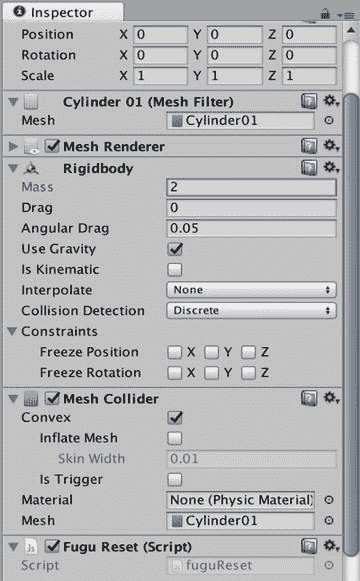

图 7-15. 将`FuguReset`脚本添加到`BarrelPin`预制件中

### 使用预制件

要用`BarrelPin`预制件替换简单的胶囊形`Pin`预制件，请在**层级**视图中选中`FuguBowl`游戏对象，使其组件显示在**检查器**视图中，然后将`BarrelPin`预制件拖入`FuguBowl`脚本的**Pin**字段，替换你最初使用的`Pin`预制件（图 7-16）。

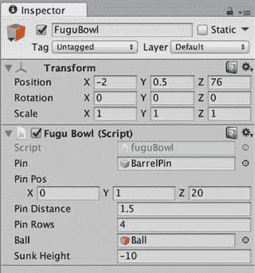

图 7-16. 使用`BarrelPin`预制件作为保龄球瓶

现在当你点击**播放**时，会出现十个木桶而不是十个胶囊。但它们会立即掉落地板，因为球瓶还没有`Collider`组件！

### 添加碰撞体

你无法再回避这个问题了。是时候处理`BarrelPin`的碰撞了。为了能在**场景**视图中直观地看到`BarrelPin`及其碰撞形状，请将`BarrelPin`预制件拖入**层级**视图，临时将其放置在场景中。放置好后，按下`F`键调用**框选所选**命令，这会将木桶居中显示在**场景**视图中。同时，将查看选项（**场景**视图左上方的下拉菜单）从**纹理**更改为**线框**，以便更容易看到网格和`Collider`组件的形状。不幸的是，**组件**菜单中没有列出任何木桶形状的基本碰撞体（`CylinderCollider`会很完美，但它并不存在），虽然`MeshCollider`可以贴合木桶的形状，但由于性能问题，`MeshCollider`不适用于物理游戏对象。**组件**菜单中最接近的形状是`CapsuleCollider`。因此，我们先在`Barrel`游戏对象上使用`CapsuleCollider`形状，看看它有多贴合。

虽然 Unity 在添加`Collider`组件时会尝试调整其大小以适配游戏对象的网格，但在此例中，贴合度并不理想，这主要是因为，正如`Transform`组件中的旋转值所示，该游戏对象绕其 x 轴旋转了 90 度。如果没有这个旋转，木桶是侧躺的，但旋转也影响了`Collider`组件的朝向。为了调整这个旋转，请将`CapsuleCollider`形状的轴切换到 z 轴。之后，将**半径**设置为 2，**高度**设置为 6，这样`CapsuleCollider`与木桶的匹配度就会大大提高（图 7-17）。

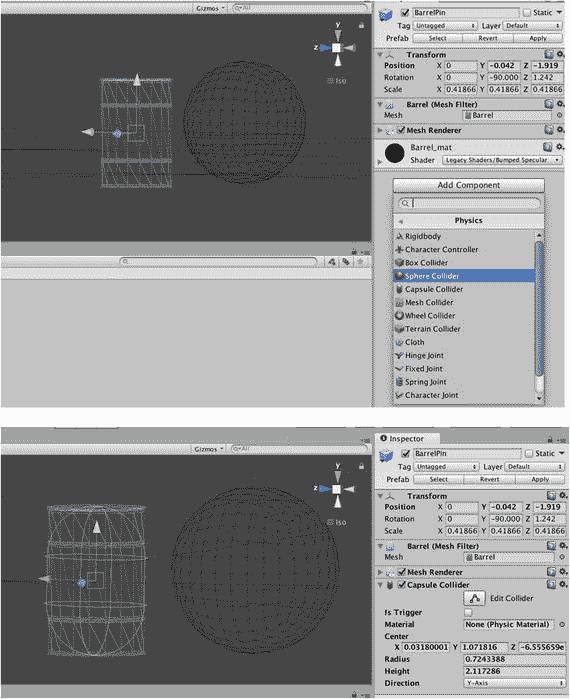

图 7-17. 为木桶添加`CapsuleCollider`形状

胶囊形状在侧面与木桶的匹配度很好，但在顶部和底部则不然，顶部和底部应该是平面，而不仅仅是胶囊的端点。对于平面，`BoxCollider`显然是更好的选择。因此，在这种情况下，你需要将多个`Collider`组件组合成一个复合碰撞体。


### 添加复合碰撞体

Unity 允许一个 `GameObject` 上存在多个 `Collider` 组件，但这些碰撞器必须是不同类型。例如，不能将两个 `BoxCollider` 组件附加到同一个 `GameObject` 上。不过，可以通过将每个 `Collider` 组件附加到其自身的 `GameObject` 上，并将所有这些 `GameObject` 设为 `Rigidbody` 的 `GameObject` 的子对象，从而将一组任意的原始 `Collider` 组件合并成一个复合碰撞体。你将为木桶组合一个 `CapsuleCollider` 和一个 `BoxCollider`，这正是要采用的方法。要容纳这两个 `Collider` 组件，请在层级视图中为木桶创建两个子 `GameObject`，并根据它们各自的形状将其命名为 `box` 和 `capsule`（图 7-18）。要创建子 `GameObject`，请从菜单中选择 `GameObject`，然后选择 `Create Empty Child Object`。

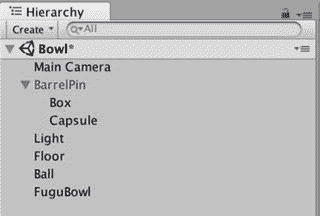

图 7-18.  
用于复合碰撞体的子 `GameObject`

与其从头创建一个新的 `CapsuleCollider`，不如利用 `Barrel GameObject` 上已经正确定向和调整好大小的 `CapsuleCollider`，通过复制该组件来实现。选中 `Barrel GameObject`，然后在检视面板中，右键单击 `CapsuleCollider` 并选择 `Copy Component`（图 7-19）。

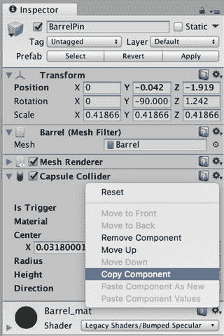

图 7-19.  
复制组件

然后再次选中 `capsule GameObject`，在检视面板中右键单击其 `Transform` 组件，在弹出菜单中选择 `Paste Component As New`（图 7-20）。现在 `capsule GameObject` 拥有了一个与为 `Barrel GameObject` 创建的完全相同的 `CapsuleCollider`，因此你不再需要原来的那个了。选中 `Barrel GameObject`，右键单击刚才复制的 `CapsuleCollider`，在弹出菜单中选择 `RemoveComponent` 以移除 `CapsuleCollider`。现在，`Barrel` 层级中应该只存在一个 `CapsuleCollider`。

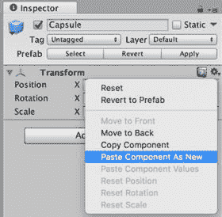

图 7-20.  
粘贴组件

让我们把注意力转到 `BoxCollider` 上。你可以使用 `Component` 菜单直接将其添加到 `Box GameObject`，但如果你将 `BoxCollider` 添加到 `Barrel GameObject` 上，那么 Unity 会替你完成将 `BoxCollider` 适配到网格大小的工作。因此，让我们重复处理 `CapsuleCollider` 时的流程，只不过这次换成 `BoxCollider`。选中 `Barrel GameObject`，使用 `Component` 菜单或 `AddComponent` 按钮添加一个 `BoxCollider`。在场景视图中，你可以看到 `BoxCollider` 包裹住了木桶（图 7-21）。

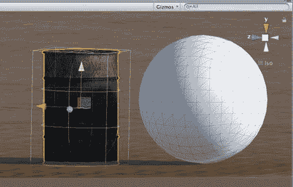

图 7-21.  
自动围绕木桶调整大小的 `BoxCollider`

`BoxCollider` 从网格的顶部延伸到底部是可以接受的，因为这样可以在两端获得两个平坦的碰撞面。但 `BoxCollider` 延伸到木桶的弯曲部分之外就不太理想了。通过在检视面板中（记住，木桶是旋转过的）将 `x` 和 `y` 值减小到 `2.5`，来降低 `BoxCollider` 的宽度。从场景视图的俯视角度（点击场景视图辅助工具的 `y` 轴），你可以看到 `BoxCollider` 现在适配到了木桶内部（图 7-22）。

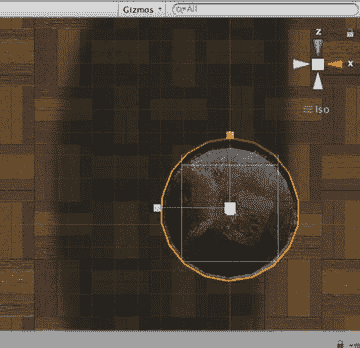

图 7-22.  
适配在木桶内的 `BoxCollider` 俯视图

既然 `BoxCollider` 的大小已经调整到符合要求，那么重复处理 `CapsuleCollider` 时的流程——在检视面板中右键单击 `BoxCollider`，选择 `Copy Component`，选中 `Box GameObject`，在检视面板中右键单击其 `Transform` 组件，然后选择 `Paste Component As New`。别忘了回到木桶上的 `BoxCollider`，右键单击它并选择 `Remove Component`。选中木桶后，你应该能在场景视图中看到两个 `Collider` 组件都被显示出来，它们共同提供的木桶形状近似度，比单独使用任何一个 `Collider` 组件都要好（图 7-23）。

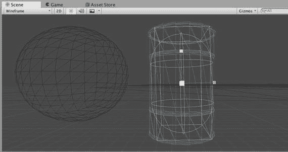

图 7-23.  
展示复合碰撞体中的两个碰撞器

### 更新预制件

最后，既然木桶已经准备就绪，请在 `GameObject` 菜单中选择 `Apply Changes To Prefab`（图 7-24）。

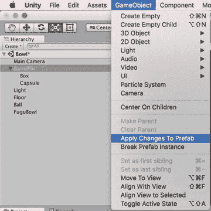

图 7-24.  
将更改应用到 `BarrelPin` 预制件

提示：建议执行 `Save Project` 或 `Save Scene`（这会隐式执行 `Save Project`）操作，以确保预制件的更改确实被保存了。项目更改会在 Unity 正常退出时保存，但如果它异常退出，则无法保证。

更新预制件后，场景中就不再需要 `Barrel GameObject` 了，可以将其移除（`Command+Delete` 或从 `Edit` 菜单中选择 `Delete`）。现在，当你点击 `Play` 时，木桶不再会穿过地面掉下去，而且如图 7-25 所示，当你滚向它们时，它们会翻滚起来！

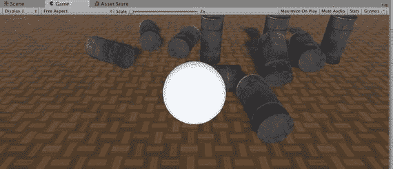

图 7-25.  
撞击木桶

### 复杂碰撞体（HyperBowl）

为 `BarrelPin` 预制件创建的复合碰撞体仍然相当简单，只由两个原始 `Collider` 组件构成。复合碰撞体可能复杂得多，具体取决于它们所近似的形状。作为更真实保龄球瓶的例子，请看 HyperBowl（图 7-26）。

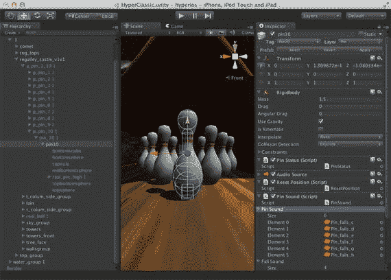

图 7-26.  
HyperBowl 保龄球瓶的复合碰撞体

HyperBowl 中保龄球瓶的复合碰撞体由六个原始碰撞器组成：一个提供底部平坦表面的 `BoxCollider`，一个用于球瓶颈部的 `CapsuleCollider`，以及四个大小不一的用于填充球瓶主体和顶部的 `SphereCollider`。

## 添加声音

你的保龄球游戏看起来不错了，但太安静了！你可以添加背景音乐或环境音效，比如舞厅场景中循环播放的音乐。但保龄球游戏确实应该具有基于碰撞的声音，例如球的滚动声和每个球瓶的碰撞声。

### 获取声音

首先，你需要找到一些声音文件。让我们再次访问资源商店，搜索免费的 SFX（音效）（图 7-27）。

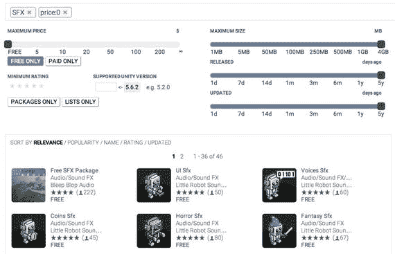

图 7-27.  
免费 SFX 的资源商店搜索结果

来自 Bleep Blop Audio 的 `Free SFX Package` 列出了种类繁多的音频剪辑，让我们下载这个资源包。这些文件会出现在你的 `Assets` 文件夹内的一个名为 `Assets` 的“项目视图”文件夹中（向资源商店提交资源包有些棘手，所以这种文件组织方式可能并非有意为之）。


### 添加滚动音效

你可以随意选择各种音效，然后在检视面板中点击播放按钮来试听。但目前，你将使用 `Sci-Fi_Ambiences` 音效作为球的滚动声。这并非一个完美的球滚动声，但它是这个资源包中唯一适合循环播放的音频剪辑（图 7-28）。

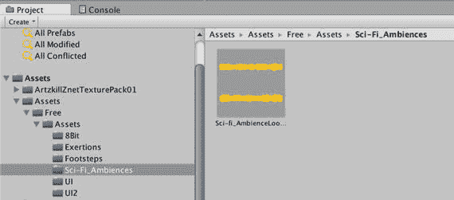  
图 7-28. 用于球滚动音效的音频剪辑

将此音频剪辑拖拽至层级视图中的 Ball 游戏对象上，然后选中该球。检视面板中应会显示一个新的 `AudioSource` 组件，该组件是自动创建并引用了此音频剪辑的（图 7-29）。

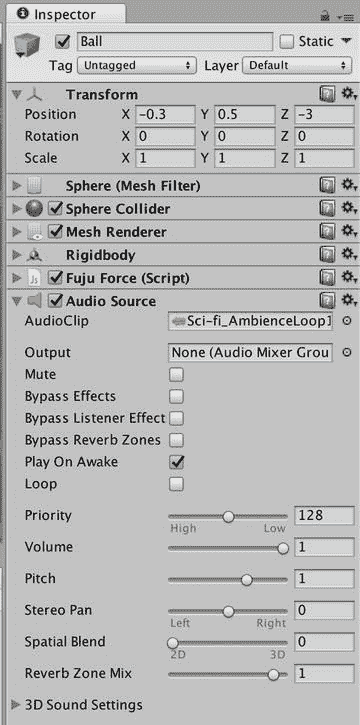  
图 7-29. 带有音频源的球的检视面板

滚动音效将由脚本控制，而非自动播放，因此请确保**唤醒时播放**复选框未被选中。但当滚动音效播放时，它应持续播放直到被告知停止，因此应选中**循环**复选框。

`AudioClip` 组件是一个 3D 音效，正如 `AudioClip` 名称下方的 `AudioSource` 组件所示。这意味着声音会随着 `AudioSource` 组件与 `AudioListener` 组件（附着在主摄像机上）之间的距离而衰减。衰减由 `AudioSource` 组件底部显示的图形指定。你可以通过选择**音量衰减**选项并指定**最小距离**值来调整衰减，该值定义了衰减开始的距离。如果 `AudioListener` 组件与 `AudioSource` 组件之间的距离小于**最小距离**值，则声音完全不会衰减。你也可以通过沿着曲线拖拽手柄来直接操作衰减曲线。

**提示**  
如果听不到音频源的声音，可以尝试从较高的**最小距离**值开始，确保能以最大音量听到，然后根据你的喜好调整**最小距离**值和衰减曲线。

用于播放滚动音效的脚本将附着在球上。创建一个新的 JavaScript，将其放在 `Scripts` 文件夹中，并命名为 `FuguBallSound`。然后将代码清单 7-6 的内容添加到该脚本中。

```
#pragma strict
var minSpeed:float = 1.0; // 实际上是 minSpeed 的平方
private var sqrMinSpeed:float = 1.0;
private var floorTag = "Floor";
function Awake() {
sqrMinSpeed = minSpeed * minSpeed;
}
function OnCollisionStay(collider:Collision) {
if (collider.gameObject.tag == floorTag) {
if (GetComponent.<AudioSource>().velocity.sqrMagnitude>sqrMinSpeed) {
if (!GetComponent.<AudioSource>().isPlaying) {
GetComponent.<AudioSource>().Play();
}
} else {
if (GetComponent.<AudioSource>().isPlaying) {
GetComponent.<AudioSource>().Stop();
}
}
}
}
function OnCollisionExit(collider:Collision) {
if (collider.gameObject.tag == floorTag) {
if (GetComponent.<AudioSource>().isPlaying) {
GetComponent.<AudioSource>().Stop();
}
}
}
代码清单 7-6. 用于球滚动音效的 FuguBallSound.js 脚本
```

该脚本与 `FuguForce` 脚本有一些相似之处，因为两者都使用碰撞回调函数来跟踪球何时滚动，并检查碰撞游戏对象的标签以判断是否为地板。`FuguBallSound` 只使用了两个 `OnCollision` 回调函数：`OnCollisionStay` 和 `OnCollisionExit`。没有实现 `OnCollisionEnter`，因为它与 `OnCollisionStay` 是冗余的（`FuguForce` 脚本实际上也不需要 `OnCollisionEnter`）。脚本的两个碰撞回调函数都引用了此组件的 `audio` 变量，该变量等价于此组件所在游戏对象的 `audio` 变量，并引用了附着的 `AudioSource`。

当球在地板上时，`OnCollisionStay` 会检查球的移动速度是否快于一个最小速度，该速度由公开变量 `minSpeed` 指定，以便在检视面板中进行调整。脚本实际上是将球速的平方与 `minSpeed` 的平方进行比较，以避免平方根计算带来的性能开销。如果球在地板上且移动速度足够快，并且球的 `AudioSource` 尚未播放其音频剪辑，则脚本会开始播放该音频剪辑。如果球的速度降至足够低，滚动音效将停止。

`OnCollisionExit` 的任务则更简单，它只需要检查音频是否在播放，如果正在播放，则停止播放音频。换句话说，如果球因弹起或滚落而失去与地板的接触，则滚动音效停止。

将该脚本拖拽至层级视图中的球上（图 7-30），然后点击播放进行测试。当球滚动时，应能听到滚动声，当球停止时，声音应消失。

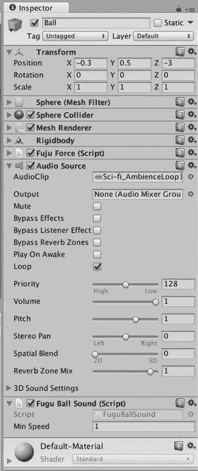  
图 7-30. 附着在 Ball 游戏对象上的 `FuguBallSound` 脚本


### 添加球瓶碰撞音效

现在你可以开始处理球瓶音效了。我们将使用免费 SFX 包中的 `Coin_Pick_Up_03` 音效来替代真实的保龄球瓶碰撞声（见图 7-31）。

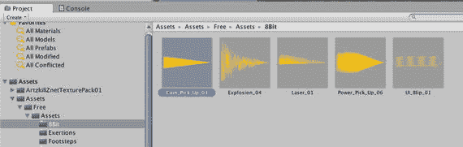

**图 7-31.** 用于球瓶碰撞音效的音频片段

在项目视图中选择 `Pin` 预制件，然后使用检查器视图底部的**添加组件**按钮添加一个 `AudioSource` 组件。接着，点击 `AudioSource` 组件的 `AudioClip` 字段右侧，选择 `Coin_Pick_Up_03` 音频片段。再次取消勾选**Play On Awake**复选框，否则每次游戏启动时都会播放该音效。与球体滚动音效由附加在球体上的脚本播放类似，球瓶碰撞音效将由附加在每个球瓶上的脚本播放。创建一个新的 JavaScript 脚本，将其放置在 `Scripts` 文件夹中，并命名为 `FuguPinSound`。将代码清单 7-7 中的代码添加到该脚本中。

```
#pragma strict
var minSpeed = 0.01;
function OnCollisionEnter(collider:Collision) {
if (collider.relativeVelocity.sqrMagnitude > minSpeed) {
if (collider.gameObject.tag != "Pin") {
GetComponent.<AudioSource>().Play(); // 击中除了其他球瓶以外的任何物体，播放音效
} else {
// 否则，ID 较小的球瓶获得播放权
if (gameObject.GetInstanceID() < collider.gameObject.GetInstanceID()) 
GetComponent.<AudioSource>().Play();
}
}
}
```

**代码清单 7-7.** 用于球瓶碰撞音效的 `FuguPinSound.js` 脚本

此脚本与 `FuguBallSound` 的不同之处在于，它使用了 `OnCollisionEnter` 回调函数，而非 `OnCollisionStay` 或 `OnCollisionExit` 回调函数。同样，这里也有一个 `minSpeed` 变量，用于与速度的平方大小进行比较。但这次的速度是碰撞的 `relativeVelocity` 变量，因为球瓶及其碰撞对象（球或其他球瓶）可能都在移动。

这里假定每个球瓶都有一个名为 `Pin` 的标签，因此你可以测试球瓶是否正在与另一个球瓶碰撞。如果球瓶没有与另一个球瓶碰撞，那么它一定被球击中或正在掉落到地板上，此时脚本会播放碰撞音效。如果球瓶被另一个球瓶击中，则需要决定哪个球瓶来播放碰撞音效。否则，它们会同时播放音效。这里使用了一个简单的技巧来进行仲裁。Unity 中的每个对象都有一个唯一的 ID 号，可以通过对象函数 `GetInstanceID` 获取。脚本中使用的规则是，ID 较小的球瓶获胜并获得播放碰撞音效的权限。

要将 `FuguPinSound` 脚本附加到 `BarrelPin` 预制件上，请在项目视图中选择该预制件，然后使用检查器视图中的**添加组件**按钮选择该脚本。在检查器视图中选中 `BarrelPin` 预制件时，同时将其标签设置为 `Pin`，这与 `FuguPinSound` 脚本的预期一致。与创建 `Floor` 标签并将其分配给 `Floor` 游戏对象的方式相同，在标签菜单中选中**添加标签**，在标签管理器（TagManager）中添加一个名为 `Pin` 的标签（确保创建的是新标签，而非新图层），然后再次选择 `Pin` 预制件，以便使用标签菜单选择新的 `Pin` 标签。顺便说一下，这是一个示例，说明了如何通过标签来标识一组元素，而不是像处理地板那样为每个元素指定唯一的名称。

现在，`BarrelPin` 预制件中的 `Barrel` 游戏对象在检查器视图中应如图 7-32 所示。

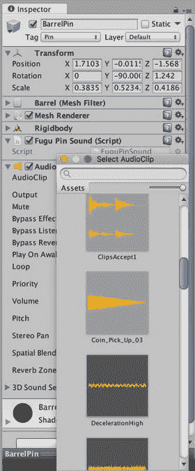

**图 7-32.** 附加到 `BarrelPin` 预制件上的 `AudioSource` 和 `FuguPinSound` 脚本

现在，当你点击**播放**并将球滚向木桶时，随着木桶的弹跳，会响起悦耳的硬币音效！

## 进一步探索

此时，保龄球游戏开始变得像模像样了（而在上一章结束时，你充其量只能称之为一个*滚动*游戏）。但是，尽管玩家可以滚动球并击倒球瓶，你却仍然没有游戏规则。敬请期待下一章，其中将大量涉及脚本编写。事实上，本章算是一个转折点，趋势是脚本编写越来越多，而新组件的介绍越来越少。因此，从现在开始，你应该将大部分时间花在 Unity 文档的脚本参考部分。

### 脚本参考

我们引入了 `Object` 类中的 `Instantiate` 函数，以在运行时创建保龄球瓶。该函数用于生成游戏对象，通常是从预制件生成。在其他游戏中，你可能会使用 `Instantiate` 来生成从拾取物品到非玩家角色（NPC）的各种对象。该函数在“脚本概述”部分有描述，但“运行时类”中的页面提供了更详细的信息。

引入了一个新的回调函数 `Awake`，作为 `Start` 回调的替代。上一章介绍了 MonoBehaviour 碰撞回调函数 `OnCollisionEnter`、`OnCollisionStay` 和 `OnCollisionExit`，本章再次用于滚动和碰撞音效。`Collision` 类用于获取碰撞信息，如 `relativeVelocity`、所碰撞的 `GameObject`。其他数据，如实际的接触点，也可获取。

`Rigidbody` 组件的页面值得完整阅读。其变量与检查器视图中可用的属性大致对应，除了你用来推动球的 `AddForce` 函数之外，还有许多相关函数：`AddRelativeForce`、`AddTorque`、`AddRelativeTorque`、`AddExplosionForce` 和 `AddForceAtPosition`。

再次使用了 `Transform` 类，这次是通过检查 `Transform.position` 来确定球是否滚出了地板。由于提到了四元数，请查看 `Transform` 中的 `rotation` 和 `localRotation` 变量，并将其与 `eulerAngles` 和 `localEulerAngles` 变量进行比较。从 `GameObject` 类中，使用 `SendMessage` 和 `BroadcastMessage` 函数来调用其他游戏对象中的 `ResetPosition` 函数。还有一个 `SendMessageUpward` 函数，其工作方式类似于 `BroadcastMessage`，区别在于消息是沿游戏对象的层级结构向上而非向下发送。消息函数也在 `Component` 类中定义。

使用 `AudioSource` 函数来播放和停止音频片段。如果你想优化音效代码，其他函数也很有用。例如，HyperBowl 的滚动音效代码会根据球的速度改变音量（使用 `AudioSource.volume` 变量），这不仅提供了更逼真的滚动音效，而且在停止时也能更柔和地切断声音。

### 资源

你看到了 Asset Store 有大量免费的木桶模型和音效库可供选择。如果你不局限于免费资源，还有更多选择。

虽然 Asset Store 还没有保龄球瓶模型，但在诸如 [`http://Turbosquid.com/`](http://turbosquid.com/) 这样的 3D 模型市场上不难找到。包括保龄球音效在内的免费音频，可在基于知识共享许可的 [`http://freesound.org/`](http://freesound.org/) 上找到。


