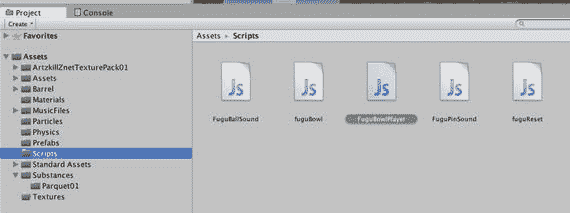
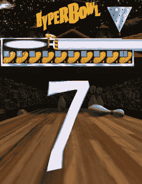
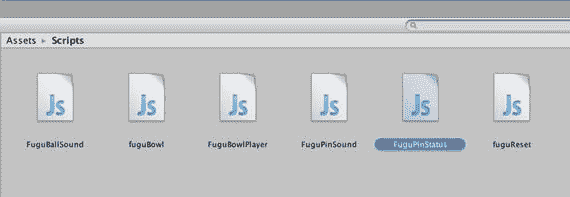
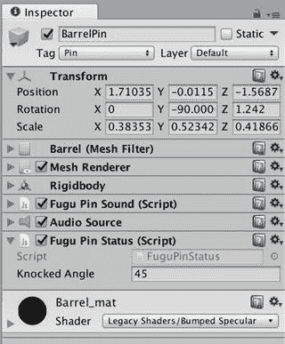
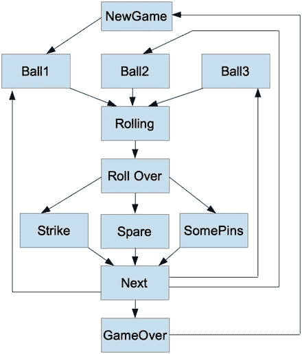
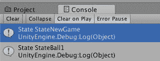
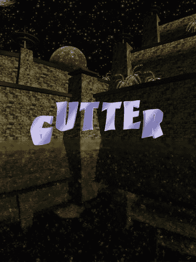

# 8. 开始游戏！为游戏编写脚本

你的保龄球游戏在前几章中逐渐成形，现在开始有模有样了！游戏包含了保龄球、球瓶（更准确地说，是上一章添加的木桶）、游戏操作和物理效果。但缺少游戏规则和计分系统，它依然更像一个玩具而非真正的游戏。本章将通过大量的脚本来解决这个问题。大部分工作将在游戏控制器脚本 `FuguBowlPlayer.js` 中完成，该脚本将包含完整的保龄球游戏逻辑，并以有限状态机（FSM）的状态形式呈现。计分规则比较复杂，因此这些规则将被封装在名为 `FuguBowlPlayer.js` 的脚本中。

好消息是，本章除了 `FuguBowlPlayer` 脚本之外，不需要添加任何新资源。坏消息是，需要输入大量新代码，特别是游戏控制器脚本。虽然你可能会想直接从本书项目网站上（[`www.apress.com/9781484231739`](http://www.apress.com/9781484231739)）复制本章在线版本的 `FuguBowl` 脚本，但如果你能从头开始、逐块构建（对于 FSM 而言，是逐个状态构建），会更容易掌握为未来项目实现游戏逻辑的方法。新的 `FuguBowlPlayer` 脚本也是如此。

## 游戏规则

让我们快速回顾一下保龄球的规则。一局游戏包含十个回合。在每个回合中，你有两次投球机会来击倒全部十个球瓶。如果第一次投球就击倒了全部十个球瓶，这称为“全中”（strike），然后进入下一回合。如果两次投球才击倒全部十个球瓶，这称为“补中”（spare）。在第十个回合，如果你获得了补中或全中，将获得一次额外的第三次（也是最后一次）投球机会。游戏的最终得分是每个回合得分的总和。每个回合的得分是该回合击倒的球瓶数，除非该回合是全中或补中。如果是补中，得分是击倒的球瓶数（十个）加上下一次投球击倒的球瓶数。如果是全中，得分同样是十个，但要加上接下来两次投球击倒的球瓶数。因此，一场“完美”的比赛，即连续 12 次全中，最终得分为 300 分（这个计算留作练习）。

## 游戏计分

`FuguBowl` 脚本已经定义了一个代表游戏的类，但将计分代码封装在玩家类中是有意义的，因为从概念上讲，存在一个玩家（虽然本游戏中只有一个，但潜在可能有多个），并且得分与玩家相关联。

此外，保龄球的计分规则并不简单。将保龄球得分计算的代码放在一个独立的脚本中，不仅能让游戏控制器脚本更简洁易读，还能使计分代码在其他保龄球游戏中得以复用。

首先，创建一个新的 JavaScript 文件，命名为 `FuguBowlPlayer`，并将其放在 Scripts 文件夹中（图 8-1）。



**图 8-1.** 创建 `FuguBowlPlayer` 脚本

### 单回合得分

在 `FuguBowlPlayer` 脚本中，在实现 `FuguBowlPlayer` 类之前，我们先从一个名为 `FuguBowlScore` 的支持类开始，它代表单个保龄球回合的得分（清单 8-1）。这个类很小，并且本身不是一个 `MonoBehavior`（例如，没有 `Start` 或 `Update` 回调），因此直接将其添加到 `FuguBowlPlayer` 脚本中即可。

```
class FuguBowlScore {
var ball1:int; // 第一次投球击倒的球瓶数
var ball2:int; // 第二次投球击倒的球瓶数
var ball3:int; // 第三次投球击倒的球瓶数
var total:int; // 该回合的总得分（可能包含后续投球的加分）
function Clear() {
ball1 = -1;
ball2 = -1;
ball3 = -1;
total = -1;
}
function IsSpare():boolean {
// 不考虑第三次投球构成的补中
return !IsStrike() &&
(ball1 + ball2 == 10);
}
function IsStrike():boolean {
return ball1 == 10;
}
}
**清单 8-1.** `FuguBowlPlayer.js` 中的 `FuguBowlScore` 类
```

`FuguBowlScore` 类很简单，不继承自任何其他类（它可以被定义为 `struct` 而不是 `class`，只是 JavaScript 不支持定义新的 `struct`）。该类包含实例变量，分别表示第一次投球、第二次投球以及（仅在第 10 回合相关的）奖励球的得分。`FuguBowlScore` 还有一个变量用于保存该回合的总得分，如果当前回合是补中或全中，则该得分可能取决于后续投球的结果。

每个变量都需要一种方式来表明其得分尚未计算。在对应球被投出之前，`ball1`、`ball2` 和 `ball3` 的得分是不可用的。总得分在该回合投球完成之后才可用，即使如此，如果结果是补中或全中，仍然需要等到后续一次或两次投球后才能计算出得分。

将得分值保留为零是行不通的，因为当玩家没有击倒任何球瓶时，零是一个有效得分。但投球不可能产生负分，因此 -1 可以很好地作为得分尚未计算的指示符。`FuguBowlScore` 中的 `Clear` 函数通过将所有变量设置为此数值来初始化该回合。

除了 `Clear` 函数，`FuguBowlScore` 类还有另外两个成员函数。如果该回合投出了全中，`IsStrike` 返回 `true`。这可以通过检查第一次投球击倒的球瓶数是否为十来轻松判断。`IsSpare` 函数稍复杂一点；如果第一次和第二次投球击倒的球瓶数之和为十，且该回合不是全中（换句话说，你并非第一次投球击中十瓶而第二次击中零瓶），则返回 `true`。

请注意两个函数声明中添加的 `:boolean`。这明确了每个函数返回一个布尔值，尽管编译器可以从代码中推断出返回类型。


### 玩家得分

定义了 `FuguBowlScore` 类之后，现在你可以添加 `FuguBowlPlayer` 类，该类将聚合各帧的分数以计算整局游戏的总分（清单 8-2）。与 `FuguBowlScore` 类似，即使 `FuguBowlPlayer` 类与脚本文件同名，它也是显式声明的，并且不会继承 `MonoBehaviour`（否则类声明中会包含“extends MonoBehaviour”）。这不仅意味着它没有任何 Unity 回调函数，还意味着 `FuguBowlPlayer` 类不是 `Component` 的子类，因此该脚本无法附加到 `GameObject` 上。换句话说，`FuguBowlPlayer` 脚本充当了一个代码库，其中包含了供其他脚本使用的类。

```
class FuguBowlPlayer {
var scores:FuguBowlScore[]; // 游戏的所有 10 帧
// 构造函数
function FuguBowlPlayer() {
scores = new FuguBowlScore[10];
for (var i:int=0; i<scores.length; ++i) {
scores[i] = new FuguBowlScore();
}
ClearScore();
}
// 重置所有帧的分数
function ClearScore() {
for (var score:FuguBowlScore in scores) {
score.Clear();
}
}
清单 8-2.
FuguBowlPlayer.js 中 FuguBowlPlayer 类的初版
```

`FuguBowlPlayer` 类自然包含关于玩家的信息，例如，可以有一个 `String` 变量来存储玩家姓名。不过，基于本书的目的，我们将仅限于追踪玩家的保龄球得分。因此，该类只有一个实例变量 `scores`，它是一个 `FuguBowlScore` 对象的内置数组。数组中的每个 `FuguBowlScore` 元素代表保龄球游戏中一帧的分数。

**注意**

内置数组的访问方式与 `Array` 类的实例相同（在 `FuguBowl.js` 中用于 `pins` 变量）。内置数组的访问速度比 `Array` 实例快得多，并且当声明为公共变量时，可以在检视面板中编辑。然而，与 `Array` 实例不同，内置数组在运行时无法调整大小。

类定义中的 `FuguBowlPlayer` 函数与类同名，这意味着它是一个构造函数，当创建该类的实例时会调用这个特殊函数。显式定义构造函数并非总是必需的（`FuguBowlScore` 就没有），甚至在 `MonoBehaviour` 中是被禁止的。但在此处使用构造函数是合理的，因为每个新创建的 `FuguBowlPlayer` 都需要同时创建其 `scores` 数组。因此，`FuguBowlPlayer` 构造函数创建了一个包含十个元素的内置数组，声明其类型为 `FuguBowlScore`，并用新创建的 `FuguBowlScore` 实例填充该数组。

构造函数还调用了 `ClearScore` 函数，该函数又对每个 `FuguBowlScore` 对象调用 `Clear`，确保它们初始状态都表示未登记任何分数。`FuguBowlPlayer` 类还包含 `IsSpare` 和 `IsStrike` 函数，它们对指定的 `FuguBowlScore` 对象调用同名函数，通过传入的参数在 `scores` 数组中索引该对象。由于数组索引从零开始，游戏中的十帧分别由索引 0 到 9 表示。

**注意**

从某种意义上说，`FuguBowlPlayer` 类充当了 `FuguBowlScore` 类的包装器，以便其他脚本只需了解 `FuguBowlPlayer` 类。作为一种优化练习，你可以提供更多的抽象，让 `IsSpare` 和 `IsStrike` 接受范围在 1 到 10 的帧索引，然后在用作数组索引之前减去 1。

### 设置分数

随着游戏的进行，每次投球后都需要更新分数。我们计划在 `FuguBowlPlayer` 类中添加名为 `SetBall1Score`、`SetBall2Score` 和 `SetBall3Score`（用于第十帧）的函数。与该类中的 `IsSpare` 和 `IsStrike` 函数类似，这些新增函数将以帧索引作为参数。

如果前一帧是补中或全中，每次投球的分数可能会更新该帧的总分。因此，你首先需要在 `FuguBowlPlayer` 类中添加执行这些更新的函数，分别命名为 `SetSpareScore`（清单 8-3）和 `SetStrikeScore`（清单 8-4）。

`SetSpareScore` 函数将总分设置为第一次和第二次投球分数之和（应始终为十分），再加上下一次投球的分数，即下一帧的第一次投球分数。

```
function SetSpareScore(frame:int) {
var framescore:FuguBowlScore = scores[frame];
// 分数为本帧两次投球的分数与下一帧第一次投球分数之和
framescore.total = framescore.ball1+framescore.ball2+scores[frame+1].ball1;
}
清单 8-3.
FuguBowlPlayer 类中的 SetSpareScore 函数
```

`SetStrikeScore` 函数稍微复杂一些。它将总分设置为第一次投球的分数（应为十分）加上接下来两次投球的分数，这两次投球通常由下一帧的第一次和第二次投球组成。但如果下一帧是全中，那么接下来的两次投球就是下一帧的第一次投球和下下帧的第一次投球。

```
function SetStrikeScore(frame:int) {
var framescore:FuguBowlScore = scores[frame];
framescore.total = framescore.ball1;
// 总是加上下一帧第一次投球的分数
framescore.total+=scores[frame+1].ball1;
if (frame < 8 && IsStrike(frame+1)) {
framescore.total+=scores[frame+2].ball1;
} else {
// 对于第九帧（帧索引 8），加上下一帧（即最后一帧）的第二次投球分数（始终存在）
framescore.total+=scores[frame+1].ball2;
}
}
清单 8-4.
FuguBowlPlayer 类中的 SetStrikeScore 函数
```

`SetSpareScore` 和 `SetStrikeScore` 的使用在 `SetBall1Score` 的定义中得到了说明（清单 8-5）。第一行将帧的 `ball1` 变量设置为击倒的瓶数，该瓶数作为函数的第二个参数传入。然后，如果当前帧不是第一帧，`SetBall1Score` 会检查前一帧是否投出了补中。如果是这种情况，前一帧正在等待本次投球的结果来计算该帧的总分，于是调用该帧的 `SetSpareScore` 来执行最终计算。

如果当前帧不是第一帧或第二帧，`SetBall1Score` 会检查前两帧是否都投出了全中。如果是，那么这两帧中的第一帧正在等待本次投球的结果来更新其总分，于是调用该帧的 `SetStrikeScore`。

请注意，`SetBall1Score` 不会设置当前帧的总分。如果当前投球不是全中，则该帧尚未结束；如果当前投球是全中，则还需要再投两次才能更新该帧的总分（当然是通过 `SetStrikeScore` 函数！）。

```
function SetBall1Score(frame:int,pinsDown:int) {
scores[frame].ball1=pinsDown;
// 如果前一帧是补中，设置其分数
if (frame>0 && IsSpare(frame-1)) {
SetSpareScore(frame-1);
}
// 如果前两帧都是全中，则设置第一帧的分数
if (frame>1 && IsStrike(frame-1) && IsStrike(frame-2)) {
SetStrikeScore(frame-2);
}
}
清单 8-5.
FuguBowlPlayer 类中的 SetBall1Score 函数
```


`SetBall2Score`函数（见代码清单 8-6）更为复杂，因为它需要处理更多情况。由于传入该函数的第二个参数是当前帧中已击倒的球瓶数，因此`ball2`变量被设定为（击倒的总瓶数）减去（第一球已击倒的瓶数），但有一个特殊情况——第一球为全中时除外。

通常，如果第一球是全中，则跳过第二球，甚至不会调用`SetBall2Score`。但如果第十局的第一轮是全中，那么第二球就会获得投掷机会，此时`ball2`被设定为击倒的总瓶数，因为第一轮全中后球瓶已被重置。

```
function SetBall2Score(frame:int,pinsDown:int) {
var framescore:FuguBowlScore = scores[frame];
if (IsStrike(frame)) { // 此时必定在最后一局
framescore.ball2=pinsDown;
} else {
framescore.ball2=pinsDown-framescore.ball1;
}
// 如果不是补中或全中，则计算本局总分
if (!IsSpare(frame) && !IsStrike(frame)) {
framescore.total= pinsDown;
}
// 如果前一局是全中，则设定该局得分
if (frame>0 && IsStrike(frame-1)) {
SetStrikeScore(frame-1);
}
}
```

代码清单 8-6. `FuguBowlPlayer`类中的`SetBall2Score`函数

本局总分设为第一球与第二球得分之和，但补中或全中的情况除外——在这两种情况下，需要分别等待后续一轮或两轮投掷才能确定总分。

鉴于这是本局的第二球，且补中仅会将下一局的第一球得分累加进来，因此这一球不可能对前一局的补中得分产生贡献。然而，如果前一局是全中，则应当调用前一局的`SetStrikeScore`，因为它一直在等待本局的第一球和第二球以完成其总分。

`SetBall3Score`函数（见代码清单 8-7）是一个特殊情况，因为第三球只能在第十局中出现，且仅在以下情况中发生：第一球或第二球为全中，或者前两球完成了补中。当调用`SetBall3Score`时，如果第二球是全中或完成了补中（这两种情况下球瓶会在第三球前重置），则该函数将`ball3`变量设定为击倒的瓶数。否则，必然是第一球为全中而第二球并非全中，因此`ball3`被设定为（击倒总瓶数）减去（第二球击倒的瓶数）。

```
function SetBall3Score(frame:int,pinsDown:int) {
var framescore:FuguBowlScore = scores[frame];
if (IsStrike(frame) && framescore.ball2 <10) {
framescore.ball3 = pinsDown - framescore.ball2;
} else {
framescore.ball3 = pinsDown; // 补中或两次全中
}
framescore.total = framescore.ball1+framescore.ball2+framescore.ball3;
}
```

代码清单 8-7. `FuguBowlPlayer`类中的`SetBall3Score`函数

### 获取得分

虽然用户界面的实现将在下一章进行，但你需要确保`FuguBowlPlayer`类支持得分显示。在现实或电脑游戏的典型保龄球记分牌中，每个局的每一轮投掷得分都会显示出来，这与`FuguBowlScore`类中的`ball1`、`ball2`和`ball3`变量完美匹配。此外，保龄球记分牌通常会有特殊标记来表示每一局中的补中或全中，`FuguBowlPlayer`类中的`IsSpare`和`IsStrike`函数可以满足这一需求。

不过，尽管`FuguBowlScore`有一个表示本局总分的`total`变量，但保龄球记分牌通常显示的是该局的游戏总得分，即截止到该局（含该局）的累计总分。例如，图 8-2 展示了 HyperBowl 中投完两局后的记分牌样式。



图 8-2. HyperBowl 记分牌

第一局显示了第一球和第二球的得分以及最终的局总分。第二局显示了其第一球得分以及第二球补中的标记。第二局中显示的游戏总得分是第一局的游戏总得分加上第二局的额外局总分。

这个例子为实现一个返回某局游戏总得分的函数提供了思路。代码清单 8-8 展示了这样一个函数——`GetScore`，将其添加到`FuguBowlPlayer`类中。如果指定的局是第一局，则`GetScore`返回该局总分。如果该局总分为`-1`（表示尚未可用），则`GetScore`返回`-1`，表示该局的游戏总得分尚不可用。

```
function GetScore(frame:int):int {
if (frame==0 || scores[frame].total==-1) {
return scores[frame].total;
} else {
var prev:int = GetScore(frame-1);
if (prev==-1) {
return -1;
} else {
return scores[frame].total+prev;
}
}
}
```

代码清单 8-8. `FuguBowlPlayer`类中的`GetScore`函数

但如果局总分可用且该局不是第一局，则将该局总分加到前一局的游戏总得分上，除非前一局的游戏总得分尚不可用。如果前一局的游戏总得分不可用，则同样返回`-1`。

前一局的游戏总得分通过对该局调用`GetScore`获得，而该函数会继续对其前一局调用`GetScore`，如此直到第一局。`GetScore`是一个递归函数的例子，即调用自身的函数。无限递归被避免，因为最终`GetScore`会到达其基础情况——第一局，该局总会返回结果。

### 完整代码清单

`FuguBowlScore`脚本的完整代码清单过于冗长，在此无法展示（长达四页），但其所有内容均已在本书中呈现。完整的脚本`FuguBowlScore.js`可在本章的项目文件中获得，下载地址为[`www.apress.com/9781484231739`](http://www.apress.com/9781484231739)。

如果你想用来自[`www.apress.com/9781484231739`](http://www.apress.com/9781484231739)的版本替换某个脚本，请在 Finder 中进行替换（即将该文件拖放或粘贴到该项目的 Scripts 文件夹中）。通常，只需从 Finder 将文件拖入 Project 视图这一功能非常方便，但在此情况下，Unity 会重命名新文件以避免覆盖原文件。

如果你的目的是替换脚本，请勿自行重命名原脚本，因为场景中的任何引用仍会指向该脚本的新名称。相反，如果你想保留副本，请复制原脚本（可以在 Finder 中复制，或使用 Unity Editor 中 Edit 菜单的 Duplicate 选项）。


### 创建 FuguBowlPlayer

`FuguBowlPlayer` 类现已准备就绪，可以直接使用。由于该脚本未附加到 `GameObject` 上（也无法附加，因为 `FuguBowlPlayer` 不是 `MonoBehaviour`），因此必须在运行时实例化 `FuguBowlPlayer`。最自然的做法是在 `FuguBowl` 脚本的 `Awake` 回调中进行，该回调已在实例化保龄球瓶（见代码清单 8-9）。

```
static var player:FuguBowlPlayer = null;
function Awake() {
player = new FuguBowlPlayer();
CreatePins();
}
代码清单 8-9.
在 FuguBowl.js 中创建 FuguBowlPlayer
```

增强后的 `Awake` 回调会创建一个新的 `FuguBowlPlayer` 实例，并将其赋值给变量 `player`，该变量声明为静态变量，便于从 `FuguBowl` 脚本外部访问（为下一章的计分板实现做准备）。

若要支持多名玩家，`player` 变量可以改为 `FuguBowlPlayers` 数组（使用可调整大小的数组，而非内置数组，以适应不同的玩家数量），并增加一些封装函数，如 `GetPlayer` 和 `GetNumberOfPlayers`。但就本书而言，我们将保持简单，专注于单人游戏。

## 球瓶状态

现在，`FuguBowl` 脚本除了引用保龄球瓶和球之外，还引用了 `FuguBowlPlayer`。但要调用 `FuguBowlPlayer` 的计分函数，`FuguBowl` 必须传入被击倒的球瓶数量。与其在 `FuguBowl` 中添加代码来判断球瓶是否倒下，更简洁的做法是将此逻辑写在附加到每个球瓶的脚本中。这样，`FuguBowl` 只需询问每个球瓶是否倒下，而无需了解球瓶的内部工作原理。

对于这个新的球瓶脚本，创建一个新的 JavaScript，命名为 `FuguPinStatus`，并将其放在 Scripts 文件夹中（图 8-3）。



图 8-3.

创建 FuguPinStatus.js 脚本。

接下来，将代码清单 8-10 的内容添加到脚本中。

```
#pragma strict
var knockedAngle:float = 45.0;
private var initialAngles:Vector3;
function Start () {
initialAngles = transform.localEulerAngles;
}
function IsKnockedOver() {
return Mathf.Abs(transform.localEulerAngles.x-initialAngles.x) > knockedAngle ||
Mathf.Abs(transform.localEulerAngles.y-initialAngles.y) > knockedAngle ||
Mathf.Abs(transform.localEulerAngles.z-initialAngles.z) > knockedAngle;
}
代码清单 8-10.
FuguPinStatus.js 的代码清单
```

脚本中的 `Awake` 回调将 `GameObject` 的初始旋转保存在私有变量 `initialAngles` 中，以便后续比较。函数 `IsKnockedOver` 根据球瓶围绕任何轴的旋转是否超过 `knockedAngle` 变量中指定的角度值，返回 `true` 或 `false`。

在“项目”视图中，选择 `BarrelPin` 预制体中的 `Barrel` GameObject，然后使用“检查器”视图中的“添加组件”按钮附加 `FuguPinStatus` 脚本（图 8-4）。



图 8-4.

FuguPinStatus.js 脚本附加到 Barrel 球瓶预制体上

在查询每个球瓶是否被击倒之前，`FuguBowl` 脚本需要先找到这些球瓶。如果 `Array` 中填充的是基于胶囊体的 `Pin` 预制体，则查询变量 `pins` 中的每个 `GameObject` 即可；但当数组装满 `BarrelPin` 类型的 GameObject 时，作为真正球瓶的 `Barrel` GameObject 是这些 `BarrelPin` 的子对象。

幸运的是，在第 7 章中，您已将所有“实际”球瓶（即带有 `Rigidbody` 和 `Mesh` 组件、会实际移动的 GameObject）标记为 `Pin` 标签。这使得可以使用静态函数 `GameObject.FindGameObjectsWithTag` 来检索所有实际球瓶的数组。该操作应在 `FuguBowl` 脚本的 `CreatePins` 函数末尾进行，即在所有球瓶实例化完成后（代码清单 8-11）。被标记的球瓶被赋值给一个名为 `pinBodies` 的私有变量。

```
private var pinBodies:GameObject[]; // 实际物理球瓶
function CreatePins() {
pins = new Array();
var offset = Vector3.zero;
for (var row=0; row < pinRows; ++row) {
offset.z += pinDistance;
offset.x = -pinDistance * row / 2;
for (var n=0; n <= row; ++n) {
pins.push(Instantiate(pin, pinPos + offset, Quaternion.identity));
offset.x += pinDistance;
}
}
pinBodies = GameObject.FindGameObjectsWithTag("Pin");
}
代码清单 8-11.
在 FuguBowl.js 中声明和设置 pinBodies 变量
```

被击倒的球瓶数量由函数 `GetPinsDown`（代码清单 8-12）统计，该函数会遍历 `pinObjects` 数组，每遇到一个 `IsKnockedOver` 函数返回 `true` 的球瓶，便递增局部变量 `pinsDown`。循环结束后，返回 `pinsDown` 计数器的值。

```
function GetPinsDown():int {
var pinsDown:int = 0;
for (var pin:GameObject in pinBodies) {
if (pin.GetComponent(FuguPinStatus).IsKnockedOver()) {
++pinsDown;
}
}
return pinsDown;
}
代码清单 8-12.
FuguBowl.js 中的 GetPinsDown 函数
```

除了统计被击倒的球瓶数量，还可以将它们移除，就像在真实保龄球馆中，球瓶被击倒后会被清理掉一样。函数 `RemoveDownedPins`（代码清单 8-13）会遍历 `pinBodies` 列表，并对每个 `IsKnockedDown` 返回 `true` 的球瓶调用 `SetActive(false)`。调用 `SetActive(false)` 等同于在“检查器”视图中取消选中 GameObject 左上角的复选框。每个被击倒的球瓶虽然不会从场景中完全移除，但会变得不可见且不会发生碰撞。

```
function RemoveDownedPins() {
for (var pin:GameObject in pinBodies) {
if (pin.GetComponent(FuguPinStatus).IsKnockedOver()) {
pin.SetActive(false);
}
}
}
代码清单 8-13.
FuguBowl.js 中的 RemovePins 函数
```

当然，被停用的球瓶需要在某个时候重新激活。现有的 `ResetPins` 函数（代码清单 8-14）是一个合适的执行位置，因为在准备进行新一轮投球、将球瓶恢复至初始位置时会调用 `ResetPins`。

```
function ResetPins() {
for (var pin:GameObject in pinBodies) {
pin.SetActive(true);
pin.SendMessage("ResetPosition");
}
}
代码清单 8-14.
FuguBowl.js 中的 ResetPins 函数
```

实际上，现在可以将对 `pins` 数组的循环替换为对 `pinBodies` 的循环。在循环内部，对每个球瓶调用 `SetActive(true)` 以防其被停用，并且可以使用 `SendMessage` 替代 `BroadcastMessage`，因为已知 `pinBodies` 中的每个球瓶都附加了 `FuguReset` 脚本。

## 游戏逻辑

我强烈建议在尝试编写游戏逻辑代码之前，先将游戏绘制为有限状态机。有限状态机将程序表示为一组有限的状态。有限状态机在任何时刻都处于一个状态，并在状态之间进行转换。

注意

术语“状态机”通常指代有限状态机，但从技术上讲，状态机的范围很广，从最简单、功能最弱的自动机类别——有限状态机，一直到具有无限内存和潜在无限数量状态的图灵机。

一旦您将游戏可视化为有限状态机，您就可以确信自己能够对其进行编码。反之，如果您无法将游戏流程可视化为有限状态机，那么您可能只有一个模糊的想法，尚未准备好实现它！


好的，作为一名高级文档工程师和翻译员，我将严格遵循您提供的注意事项和示例，将给定的英文文本翻译成中文。


### 设计 FSM

要绘制 FSM，请思考游戏将经历的所有状态。所有 FSM 都有一个初始状态，在这里是指新游戏开始。玩家从第一局的第一个球开始，滚动保龄球，滚动结束后，会得到一个“全中”、“补中”或普通分数。然后，玩家要么进入同一局的第二个球，要么进入新一局的第一个球，并重复此过程。如果玩家正在投第二个球，流程是相同的，只是转换到新一局的第一个球，或者如果这是第十局且玩家投出了“全中”或“补中”，则可能转换到第三个球。当所有十局完成后，FSM 转换到 `GameOver` 状态，该状态可能会循环回到新游戏。

图 8-5 展示了上述状态机可能的样子。



图 8-5. 保龄球游戏的状态机

第一次就完全画对并不重要。通常，当你勾勒出程序的流程并开始编写脚本时，你会意识到遗漏了什么或存在更好的方法，然后你会回过头来调整最初的设计。这就像我的一位教授关于构造证明所说的——完成一个证明是一个混乱的过程，但之后你会回过头来清理它，并假装那本来就是你最初计划好的！

从技术上讲，FSM 没有记忆，因此一个真正完整的保龄球状态机需要为所有三个球，甚至所有十局复制大量状态。但是，一个拥有数百个状态的状态机将难以理解，这在很大程度上会违背其目的。你不必过于拘泥于此，因此我们假设存在一些变量来跟踪当前正在进行的局数和玩家正在投的是第几个球。

### 跟踪游戏进程

清单 8-15 显示了 `FuguBowl` 脚本中定义的、用于跟踪当前局数和当前球的变量。

```
private var state:String; // current state in the state machine
enum Roll {
    Ball1,
    Ball2,
    Ball3
}
清单 8-15. FuguBowl.js 中跟踪当前局数和球的变量
```

变量 `frame` 使用 `int` 跟踪当前局数，范围从 0 到 9 而不是 1 到 10，因为当这个数字被传递给 `FuguBowlPlayer` 函数时，它将用作数组索引。

变量 `roll` 跟踪当前的投球数，它也可以被声明为 `int`，并选择一种约定，例如用数字 0 到 2 或 1 到 3 来表示一局中的三个可能的球。但是，定义一个 `enum`（枚举的简称）会更清晰，它本质上允许你定义一个新类型，其值来自一个命名值列表中的某一个。因此，`roll` 被声明为 `Roll` 类型，这是一个包含 `Ball1`、`Ball2` 或 `Ball3` 值的 `enum`。

顺便提一下，到目前为止，你已经遇到了几种不同类型的类别：像 `int` 和 `boolean` 这样的原始类型，包含其他类型的内置数组，像 `Roll` 枚举这样的枚举，像 `Vector3` 这样的结构体，以及像 `GameObject`、`Component` 和 `FuguBowlPlayer` 这样的类。在这些类别中，类和数组是引用类型，这意味着不同的变量可以引用该类型的同一个实例，并且对该实例的修改将通过引用该实例的每个变量可见。

### 启动状态机

好了，现在你已经勾勒出了状态机，接下来该如何编写代码呢？FSM 非常有用，以至于包括 CryEngine、Unreal 和 Second Life 在内的一些游戏引擎都为其脚本提供了内置支持。不幸的是，Unity 没有，但既然这是软件，就有多种方法来自制一些 FSM 支持。

一种方法是在 `Update` 函数内部有一个大的条件语句，根据所处的状态执行不同的操作（我们可能会使用 `enum` 来定义这些不同的状态）。然而，这种方法往往会导致 `Update` 函数变得笨重。实际上，由于第 7 章添加到 `FuguBowl` 脚本中的 `Update` 回调将被你即将添加的状态机取代，你现在就应该从 `FuguBowl` 脚本中删除那个回调。

另一种创建 FSM 的方法（我尝试过一段时间）是使用一个附加了多个脚本的 `GameObject` 来表示状态机，每个脚本代表一个状态。每当退出当前状态时，该脚本会禁用自身并启用下一个脚本或状态。这种方法很有吸引力，因为每个脚本或状态都有其自己的 `Update` 函数和其他回调。但我发现，如果整个 FSM 包含在单个脚本中，我的状态机会更容易理解和处理。

最终，我决定使用协程来实现状态机。协程是可以一次挂起自己一个或多个帧的函数，通过调用 `yield` 来实现（该函数暂时放弃控制权，即使它尚未执行完毕）。你可以将每个状态实现为一个协程，当退出该状态时返回。在该状态中，协程执行该状态下应该发生的任何动作，但会反复地让步，以免阻塞 Unity 的其余部分（包括渲染和物理引擎）运行。在返回之前，协程会指定它将转换到的下一个状态。并非所有回调都可以用作协程。例如，`Awake` 不能用作协程，`Update` 也不行，但 `Start` 可以让步，因此可以充当 FSM 控制器（清单 8-16）。

```
private var state:String; // current state in the state machine
enum Roll {
    Ball1,
    Ball2,
    Ball3
}
清单 8-16. FuguBowl.js 中运行状态机的 Start 回调
```

当前状态的名称，即实现该状态的协程的名称，作为 `String` 保存在名为 `state` 的私有变量中。`Start` 回调无限循环，使用 `state` 的值反复调用 `StartCoroutine` 来调用协程。`Start` 在调用 `StartCoroutine` 时让步，这样它会等待状态协程执行完毕，然后再使用 `state` 的下一个值启动一个协程。

被调用的协程不一定会让步，因此 `Start` 在循环中额外增加了一个让步操作，以确保在状态之间至少发生一次让步，让游戏引擎的其余部分有机会运行。

作为调试辅助手段，`Start` 在执行每个状态协程之前会调用 `Debug.Log`（图 8-6）。这是在测试游戏时跟踪状态机进度的便捷方法。



图 8-6. 状态机调试跟踪的控制台视图

### 各状态

按照惯例，你将在所有状态协程前加上 `State` 前缀，以表明这些函数是状态机中的状态。

#### StateNewGame

保龄球状态机的初始状态是 `StateNewGame`（清单 8-17），它通过清除玩家得分并将当前局索引设置为 0 来开始新游戏，指明玩家当前正在投掷游戏的第一局。

```
function StateNewGame() {
    player.ClearScore();
    frame = 0;
    state = "StateBall1";
}
清单 8-17. FuguBowl.js 中的 StateNewGame
```

在返回（实际上是退出该状态）之前，`StateNewGame` 指定下一个状态是 `StateBall1`，即玩家开始投掷该局第一个球的状态。


#### StateBall1

`StateBall1`（清单 8-18）执行的第一个操作是重置球瓶、球以及主摄像机的**位置**。在该状态首次进入时（即游戏开始时），这并不是必须的；但当玩家完成一局的投球并切换回此状态时，需要将所有物体恢复到起始位置和旋转角度（被击倒的球瓶旋转角度会发生变化）。

```
function StateBall1() {
  ResetEverything(); // 重置球瓶、摄像机和球
  roll = Roll.Ball1;
  state = "StateRolling";
}
```

执行重置后，该状态将 `roll` 变量设置为 `Roll.Ball1`，表示玩家正在投这一局的第一球。最后，该状态切换到 `StateRolling`，即球滚向球瓶时所处的状态。

#### StateBall2

与 `StateBall1` 类似，`StateBall2`（清单 8-19）首先重置球和主摄像机。

```
function StateBall2() {
  ResetBall();
  ResetCamera();
  if (GetPinsDown() == 10) {
    ResetPins();
  } else {
    RemoveDownedPins();
  }
  roll = Roll.Ball2;
  state = "StateRolling";
}
```

如果玩家进入此状态，通常意味着该局的第一球没有打出全中，现在需要在清理上一轮倒下的球瓶后，尝试击倒剩余球瓶。但如果所有球瓶都已倒下，则一定是第十局中的特殊情况：全中后还需投两球，此时球瓶需重置。

在退出该状态前，`roll` 被设置为 `Roll.Ball2`，与 `StateBall1` 一样，下一个状态设置为 `StateRolling`。

#### StateBall3

说到第十局，这是唯一出现 `StateBall3`（清单 8-20）的情况，因为只有在那局中玩家才能投掷三次。

```
function StateBall3() {
  ResetBall();
  ResetCamera();
  if (GetPinsDown() == 10) {
    ResetPins();
  } else {
    RemoveDownedPins();
  }
  roll = Roll.Ball3;
  state = "StateRolling";
}
```

`StateBall3` 与 `StateBall2` 一样，重置球的位置。如果玩家在该局的前几次投掷中击倒了十个球瓶（补中或两次全中），则重置球瓶；否则，清理上一轮倒下的球瓶。同样，该状态将 `roll` 变量设置为 `Roll.Ball3`，并切换到 `StateRolling`。

#### StateRolling

`StateRolling`（清单 8-21）大致实现了第七章中创建并在本章前面弃用的 `Update` 函数。该状态每帧都会让出控制权，除了等待球的控制权应被释放外，不做任何操作。

```
function StateRolling() {
  while (true) {
    // 当球到达球瓶时释放控制
    if (ball.transform.position.z > pinPos.z) {
      state = "StateRolledPast";
      return;
    }
    // 洗沟球
    if (ball.transform.position.y < sunkHeight) {
      state = "StateGutterBall";
      return;
    }
    yield;
  }
}
```

有两种情况可以确定投球结束：一种是球滚出球道边缘，这基本上与正常保龄球游戏中的洗沟球情况相同；另一种是球已滚动到球瓶位置（如果玩家不释放控制，游戏会变得过于简单——你可以像怪兽卡车一样在球瓶间来回碾压！）。

检测洗沟球很简单。与现已移除的 `Update` 回调类似，该状态检查球是否已下降到 `sunkHeight` 变量指定的 y 轴位置以下。如果是，则切换到洗沟球状态。另一种情况也几乎同样简单：检查球的 z 轴位置是否超过了第一个球瓶的 z 轴位置。本质上，该状态是在检查球是否已到达从左到右横跨球道、球瓶所在的“球瓶线”。如果到达，则切换到 `StateRolledPast`。

实际上，你在绘制有限状态机草图时并没有考虑加入 `StateGutterBall` 和 `StateRolledPast` ，但这并不棘手。你现在可以直接插入这些状态，取代之前 `StateRolling` 和 `StateRollOver` 之间的直接转换。


#### `StateRolledPast`

在球滚动足够距离到达球瓶后，将进入 `StateRolledPast` 状态（清单 8-22）。该状态通过禁用 `Ball`（球）和 `Main Camera`（主摄像机）控件来“释放”球。

```
function StateRolledPast() {
	var follow:Behaviour = Camera.main.GetComponent("SmoothFollow");
	if (follow != null) {
		follow.enabled = false;
	}
	ball.GetComponent(FuguForce).enabled = false;
	yield WaitForSeconds(rolledPastTime);
	state = "StateRollOver";
}
清单 8-22.
FuguBowl.js 中球到达球瓶时进入的状态
```

为了禁用 `Main Camera`（主摄像机）的 `SmoothFollow` 脚本，该状态通过 `Camera` 类中的静态变量 `main` 访问 `Main Camera`（主摄像机），并在该 `GameObject` 上调用 `GetComponent`，将要检索的组件类 `SmoothFollow` 作为参数传入。这会返回附加到 `Main Camera`（主摄像机）上的 `SmoothFollow` 脚本。然后该脚本被赋值给一个名为 `follow` 的局部变量。

`follow` 变量被声明为 `Behaviour` 类型，而 `Behaviour` 是 `Component` 的直接子类。一个 `Behaviour` 可以通过设置其 `enabled` 变量来启用或禁用。`follow` 变量本可以声明为更具体的类，比如 `MonoBehaviour`（`Behaviour` 的子类，也是任何可附加到 `GameObject` 的脚本的父类），甚至是 `SmoothFollow`（`SmoothFollow` 脚本最具体的类），因为所有这些类都从 `Behaviour` 继承了 `enabled` 变量。但选择适合的最通用类能提供最大的灵活性。例如，如果你将 `follow` 声明为 `SmoothFollow` 类型，而之后决定使用不同的摄像机控制脚本，就必须调整 `follow` 的类型声明。

**提示**

对于类型声明，请使用实现了你所需要函数和变量的最通用类。

不将 `follow` 声明为 `SmoothFollow` 类型的另一个原因是：该项目在 [`www.apress.com/9781484231739`](http://www.apress.com/9781484231739) 上提供的版本并未包含任何 Asset Store 或 Standard Assets 包，其中就包括 `SmoothFollow` 脚本。在项目中引用一个不存在的 `SmoothFollow` 类会导致编译器错误。

正因如此，`SmoothFollow` 是以 `String`（字符串）形式传递给 `GetComponent` 的，这样直到运行时调用 `GetComponent` 时才会去寻找该类，而在运行时 `GetComponent` 会返回 `null`。尝试访问 `null` 上的 `enabled` 变量会导致错误，因此该状态在尝试禁用该脚本前，会先检查 `follow` 是否为空。附加到球上的 `FuguForce` 脚本以类似方式被禁用：在球上调用 `GetComponent` 来获取 `FuguForce` 脚本，然后将其 `enabled` 变量设为 false。但不同于 `Main Camera`（主摄像机）和 `SmoothFollow` 脚本，由于你确信球上附加了 `FuguForce` 脚本，因此在禁用该脚本前无需进行空值检查。

此外，`GetComponent` 是一个重载函数，其中一个版本接受 `String` 参数，另一个版本直接接受类。因此，这里没有将字符串 `"FuguForce"` 传递给 `GetComponent`，而是直接传递了 `FuguForce` 类。这样一来，如果类名拼写错误（例如 `GetComponent(FuguFource)`），就会产生编译器错误。

如果传入一个拼写错误的类名字符串（例如 `GetComponent("FuguFource")`），在编译时不会产生错误，这乍听起来可能是件好事，但最好还是尽早发现问题。在运行时，调用 `GetComponent` 会返回 `null`，如果代码预期得到非空结果，就可能导致崩溃，或者引发令人头疼的调试过程，让你疑惑为什么那个脚本没有按预期被禁用。

**提示**

尽可能让编译器帮你做错误检查。

在某些时候，`SmoothFollow` 和 `FuguForce` 脚本需要被重新启用。自然的位置是在 `ResetCamera` 和 `ResetBall` 函数中（清单 8-23），因为当一轮投球结束，且 `Main Camera`（主摄像机）和 `Ball`（球）`GameObject` 各自被重置以开始下一轮投球时，就会调用这些函数。

```
function ResetBall() {
	ball.GetComponent(FuguForce).enabled = true;
	ball.SendMessage("ResetPosition");
}
function ResetCamera() {
	var follow:Behaviour = Camera.main.GetComponent("SmoothFollow");
	if (follow != null) {
		follow.enabled = true;
	}
	Camera.main.SendMessage("ResetPosition");
}
清单 8-23.
FuguBowl.js 中的 ResetBall 和 ResetCamera 函数
```

在 `ResetBall` 和 `ResetCamera` 这两个函数中，用于启用脚本组件的代码与用于禁用脚本的代码相同，只是将 `enabled` 变量设为了 true。

在同时禁用 `FuguForce` 和 `SmoothFollow` 脚本后，`StateRolledPast` 会等待五秒钟，然后转换到下一个状态 `StateRollOver`，以便让球有时间滚入球瓶（或滚过球瓶）。一个循环调用 `yield` 直到所需时间过去（通过检查 `Time.time`）的 `while` 循环也能达到目的，但调用带有秒数参数的函数 `WaitForSeconds` 并对其使用 `yield` 要方便得多。（在 `StateRolledPast` 中，秒数是硬编码为 5 的，但它可以很容易地改为一个公共变量以允许自定义。）结果就是，协程 `StateRolledPast` 会有效地暂停（不会阻塞 Unity 其余部分的执行），直到指定的时间过去。

#### `StateGutterBall`

洗沟球状态比 `StateRolledPast` 简单得多。它只是直接转换到 `StateRollOver`（清单 8-24）。

```
function StateGutterBall() {
	state = "StateRollOver";
}
清单 8-24.
FuguBowl.js 中洗沟球的状态
```

虽然看起来 `StateRolling` 可以直接转换到 `StateRollOver` 而无需经过 `StateGutterBall`，但包含 `StateGutterBall` 可以提供与 `StateRolledPast` 的某种对称性。在一个精良的保龄球游戏中，你很可能会实现某种关于你投出洗沟球的反馈。例如，在 HyperBowl 中，拼写出 “Gutter” 的动画字母会飞过屏幕（图 8-7），而这个动画就是在 `StateGutterBall` 中发生的。



**图 8-7.** HyperBowl 中洗沟球的动画文本

顺便提一下，这些字母是用 iTween 制作动画的。你也不仅限于视觉反馈。在我 App Store 上的 Fugu Bowl 应用中，`StateGutterBall` 会播放孩子们喝倒彩的声音！


#### `StateRollOver`

当保龄球的滚动被视为完成（球滚出球道进入沟槽或到达球瓶线）时，FSM 进入 `StateRollOver` 状态（清单 8-25），该状态通过计算得分来结束当前轮次。

```
function StateRollOver() {
var pinsDown:int = GetPinsDown();
//    Debug.Log("pins down: "+pinsDown);
switch (roll) {
case Roll.Ball1: player.SetBall1Score(frame,pinsDown); break;
case Roll.Ball2: player.SetBall2Score(frame,pinsDown); break;
case Roll.Ball3: player.SetBall3Score(frame,pinsDown); break;
}
if (roll == Roll.Ball1 && player.IsStrike(frame)) {
state = "StateStrike";
return;
}
if (roll == Roll.Ball2 && player.IsSpare(frame)) {
state = "StateSpare";
return;
}
state = "StateKnockedSomeDown";
}
```

清单 8-25. `FuguBowl.js` 中用于一轮结束的状态

此状态首先通过调用 `GetPinsDown` 函数确定击倒了多少个球瓶。然后根据这是第一球、第二球还是第三球，将该数字传递给相应的 `FuguBowlPlayer` 计分函数，从而记录本轮得分。下一个状态取决于本轮结果：是全中（仅可能发生在第一球）、补中（仅可能发生在第二球），还是其他结果。（`StateKnockedSomeDown` 这个名字不太理想，毕竟你可能一个球瓶都没击倒，但我觉得它比 `StateNotSpareOrStrike` 更好。）

#### `StateSpare`、`StateStrike` 和 `StateKnockedSomeDown`

与落沟球状态类似，表示全中、补中及其他结果的状态没有任何操作，只是转换到下一个状态（清单 8-26）。

```
function StateSpare() {
state="StateNextBall";
}
function StateStrike() {
state = "StateNextBall";
}
function StateKnockedSomeDown() {
state="StateNextBall";
}
```

清单 8-26. `FuguBowl.js` 中的 `StateSpare`、`StateStrike` 和 `StateKnockedSomeDown` 状态

这三个状态都会转换到 `StateNextBall`，因此很容易让人觉得这些状态是多余的，想要完全删除它们。但在一个完整的保龄球游戏中，你可能会在每个状态中触发某种反馈，例如打出全中时的祝贺音效和画面。我提到过，App Store 上的 Fugu Bowl 在落沟球时会发出嘘声。同一个应用在全中时会发出欢呼声，这发生在 `StateStrike` 中。而 HyperBowl 则在 `StateSpare` 和 `StateStrike` 中分别显示动画文字“SPARE”和“STRIKE”。

#### `StateNextBall`

`StateNextBall` 是目前为止最复杂的状态（清单 8-27），因为大多数保龄球规则都在这里生效。你需要在此决定是在当前轮次再投一球，还是进入下一轮。

```
function StateNextBall() {
if (frame == 9) { // 最后一轮
switch (roll) {
case Roll.Ball1: // 总是有第二次投球
state = "StateBall2";
break;
case Roll.Ball2: // 如果补中或全中则有奖励球
if (player.IsSpare(frame) || player.IsStrike(frame)) {
state = "StateBall3";
} else {
state = "StateGameOver";
}
break;
case Roll.Ball3:
state = "StateGameOver";
break;
}
// 所有其他轮次
} else if (roll == Roll.Ball1 && !player.IsStrike(frame)) {
state = "StateBall2";
} else {
++frame;
state = "StateBall1";
}
}
```

清单 8-27. `FuguBowl.js` 中用于过渡到下一球的状态

第十轮尤其复杂，因为你需要检查游戏是否结束，并且可能有三球投掷机会。那么，我们先看代码底部适用于前九轮的部分。如果你刚完成 `Ball1` 的投掷且未全中，则下一个状态是 `StateBall2`。否则，要么你投了 `Ball2`，要么你已经全中，因此下一个状态是 `StateBall1`，并将轮次索引加一。在第十轮中，你至少投两球，所以如果你刚投了 `Ball1`，则下一个状态设置为 `StateBall2`。如果你刚投了 `Ball2` 且结果是补中或全中，则下一个状态设置为 `StateBall3`；否则进入游戏结束状态。当然，如果你刚投了 `Ball3`，这是最后一次可能的投球，你也会进入游戏结束状态。

#### `StateGameOver`

最终，你到达了游戏结束状态 `StateGameOver`（清单 8-28）。

```
function StateGameOver() {
Debug.Log("Final Score: "+player.GetScore(9));
yield WaitForSeconds(gameOverTime);
state="StateNewGame";
}
```

清单 8-28. `FuguBowl.js` 中的游戏结束状态

无需花哨的用户界面（Unity GUI 系统将在下一章介绍），我们借此机会通过函数 `Debug.Log` 在控制台视图中打印最终分数。最终分数通过调用 `FuguBowlPlayer` 函数 `GetScore` 并传入数组索引 `9` 来获取，这表示你需要第十轮计算的总分。

在一个完整的保龄球游戏中，这里应该显示“游戏结束”消息、将分数提交到排行榜，并执行任何其他游戏结束时合适的操作（在 HyperBowl 中，会调用 `Application.LoadLevel` 函数切换到显示分数的场景并呈现奖杯）。现在，我们只需过渡回 `StateNewGame` 并开始新游戏。

### 完整清单

经过大修的 `FuguBowl` 脚本甚至比 `FuguBowlPlayer` 脚本还要大得多，因此此处不展示 `FuguBowl.js` 的完整清单。完整脚本可在 [`www.apress.com/9781484231739`](http://www.apress.com/9781484231739) 获取，其所有内容已在本节中逐一（或大部分按状态）呈现。

## 深入探索

本章改变了节奏，专注于脚本编写。大部分脚本以状态机的形式添加到了游戏控制器脚本 `FuguBowl.js` 中，而计分代码则整合到了一个新脚本 `FuguBowlPlayer.js` 中。

如果你厌倦了编写大块代码，渴望回到最初那些短小的脚本片段，那你只需再忍受一章，在下一章为用户界面编写一个更大的脚本。同时，作为本章新增计分代码的对应部分，下一章还将包含一个用于显示记分牌的小型附加脚本。

### Unity 手册

状态机不仅适用于游戏控制逻辑，也适用于任何可以表示为经历不同状态的事物（简单示例：灯亮或灭、武器上膛并锁定、门开或关）。状态机在动画（行走、跑动、投掷）中特别有用，这就是为什么 Mecanim 动画系统拥有自己的 FSM 功能。这在 Unity 手册的“动画状态机”部分的“Mecanim 动画系统”一节中有详细说明。

### 脚本参考

本章介绍的主要脚本技术是协程的使用，特别是在 `FuguBowl` 脚本中实现 FSM。脚本参考的“脚本概述”部分有一个“协程和 `Yield`”页面，提供了基本解释和一些示例。

与协程相关的类包括 `Coroutine` 和 `WaitForSeconds`（两者都继承自 `YieldInstruction`）。你使用的一个函数是 `MonoBehaviour` 的 `StartCoroutine` 函数。每个 `MonoBehaviour` 回调的文档页面都指定了该回调是否可以用作协程（如你所见，`Start` 可以，但 `Awake`、`Update` 和 `FixedUpdate` 不行）。

`FuguBowl` 脚本中添加的代码也频繁涉及访问组件，因此“访问组件”页面与此相关。该页面列出了可用于访问常用附加组件的 `Component` 和 `GameObject` 变量，并提供了如何调用 `GetComponent` 函数（在组件或 `GameObject` 上）来访问组件（包括脚本）的示例。


### 资源商店

资源商店上提供了多个更复杂的有穷状态机框架。在资源商店窗口中搜索 `fsm` 会显示出多个结果，其中包括由 Huton Games 开发的名为 Playmaker 的流行可视化编程包，其官网地址为 [`http://hutongames.com/`](http://hutongames.com/)。

### 网络资源

维基百科（[`http://wikipedia.org/`](http://wikipedia.org/)）对保龄球及其计分规则进行了详尽描述。在该网站搜索 `bowling` 即可找到相关内容。如果你搜索 `state machine`，则会看到一篇关于有穷状态机的文章，其内容可能超乎你的想象！

最著名的虚拟世界之一《第二人生》也支持有穷状态机。在《第二人生》的维基页面（[`http://wiki.secondlife.com`](http://wiki.secondlife.com)）中搜索 `state`，即可了解如何通过林登脚本语言（LSL）定义状态。

