# 9. 游戏图形用户界面

在过去的几个章节中，你已经构建了一个相当完整的保龄球游戏，涵盖 3D 图形、物理、音效、玩家控制和自动摄像机移动。该游戏几乎具备 3D 游戏应包含的所有功能类别，唯独缺少一项：图形用户界面（GUI）。具体而言，保龄球游戏应该有一个记分牌，并且游戏通常还需要一个在游戏开始和暂停时显示的菜单。

提示

我曾有一款 iOS 游戏因未包含暂停菜单而被苹果拒绝，因此我建议你添加一个暂停菜单——即便仅仅为了避免这种情况。

在本章中，你将使用 Unity 内置的 GUI 系统——UnityGUI 来实现记分牌和启动/暂停菜单。（你可以通过名称的酷炫程度来判断 Unity 功能的存在时长——较新的功能通常有像 Shuriken、Mecanim 和 Beast 这样的名字。）

本章项目的记分牌和暂停菜单脚本可通过位于 [`www.apress.com/9781484231739`](http://www.apress.com/9781484231739) 的“下载源代码”按钮获取。但需要再次不厌其烦地强调，逐行逐函数地输入代码才是最佳的学习方式！

## 记分牌

我们先从记分牌开始，因为它比菜单更简单。记分牌只需要显示信息，无需交互功能。如前一章所述，典型的保龄球记分牌会显示每一局的结果（即第一球、第二球，第十局可能还有第三球），以及截止到该局的累计总分。这里不需要任何花哨的设计；只需通过文本显示分数，即将记分牌绘制为一系列标签，每个标签用文字显示对应局的分数。

#### 创建脚本

让我们开始创建一个带有记分牌脚本的 `GameObject`（这过程现在应该很熟悉了）。在项目视图中，于 `Scripts` 文件夹内新建一个 JavaScript 文件，并将其命名为 `FuguBowlScoreboard`（见图 9-1）。

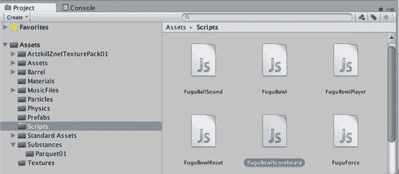

**图 9-1.**  
创建 `FuguBowlScoreboard.js` 脚本

接下来，在层级视图中新建一个 `GameObject`，命名为 `Scoreboard`，并将 `FuguBowlScoreboard` 脚本附加到该对象上。

现在你可以开始向 `FuguBowlScoreboard` 脚本中添加 UnityGUI 代码了。如果你曾使用过其他 GUI 系统开发用户界面，可能会觉得 UnityGUI 有些特别。UnityGUI 控件并非创建和放置具有回调函数（用于响应按钮点击等事件）的 GUI 对象，而是在每帧（实际上每帧会调用多次）被调用的 `OnGUI` 回调函数内部进行创建。为了快速演示 UnityGUI 的工作原理，请将代码清单 9-1 的内容放入 `FuguBowlScoreboard` 脚本中。

```javascript
#pragma strict
function OnGUI() {
    GUI.Label(Rect(5,100,200,20),"这是一个标签");
}
```

**代码清单 9-1.** 在 `FuguBowlScoreboard.js` 中测试简单的 UnityGUI 标签

所有 UnityGUI 控件都是通过调用 `GUI` 类（以及 `GUILayout` 类，我将在下一节介绍它）的静态函数来创建的。代码清单 9-1 中的 `OnGUI` 回调调用了 `GUI.Label` 来绘制一个标签，传入了一个 `Rect`（矩形）参数，指定标签绘制在屏幕坐标 `5,100` 处（UnityGUI 的坐标系以屏幕左上角为 `0,0`），宽度和高度分别为 `200` 和 `20` 像素。第二个参数是要在标签中显示的文本。点击播放，你应该会在屏幕上看到“这是一个标签”。

如果用户界面很复杂，将所有界面代码放在一个脚本回调函数中会显得笨重。但对于这个简单的界面，`OnGUI` 回调已经足够方便，你可以在此基础上扩展，形成一个基础、纯文本的保龄球记分牌。让我们用代码清单 9-2 的内容替换 `FuguBowlScoreboard` 中的单标签示例。

```javascript
#pragma strict
var style:GUIStyle; // 自定义外观
function OnGUI() {
    for (var f:int=0; f<10; f++) {
        var score:String="";
        var roll1:int = FuguBowl.player.scores[f].ball1;
        var roll2:int = FuguBowl.player.scores[f].ball2;
        var roll3:int = FuguBowl.player.scores[f].ball3;
        switch (roll1) {
            case -1: score += " "; break;
            case 10: score +="X"; break;
            default: score += roll1;
        }
        score+="/";
        if (FuguBowl.player.IsSpare(f)) {
            score +="I";
        } else {
            switch (roll2) {
                case -1: score += " "; break;
                case 10: score +="X"; break;
                default: score += roll2;
            }
        }
        if (f==9) {
            score+="/";
            if (10==roll2+roll3) {
                score +="I";
            } else {
                switch (roll3) {
                    case -1: score += " "; break;
                    case 10: score +="X"; break;
                    default: score += roll3;
                }
            }
        }
        GUI.Label(Rect(f*30+5,5,50,20),score,style);
        var total:int=FuguBowl.player.GetScore(f);
        if (total != -1) {
            GUI.Label(Rect(f*30+5,20,50,20)," "+total,style);
        }
    }
}
```

**代码清单 9-2.** 保龄球记分牌

新的 `OnGUI` 回调会循环遍历全部十局比赛，从 `FuguBowlPlayer` 查询代表每局比赛的 `FuguBowlScore`。在循环底部，会调用一次或两次 `GUI.Label`。第一个 `GUI.Label` 显示每局中各球的分值，第二个 `GUI.Label` 绘制在第一个的下方，显示该局（如果已计算）的游戏累计总分。

循环中的大部分代码用于确定每局中各球应显示的内容。对于 `ball1`，如果尚未投掷，则显示的字符串仅为一个空格。如果投出了全中，则显示字母 `X`。否则，显示数字分数（`1` 到 `9`）。


`Ball2` 与 `Ball1` 类似，不同之处在于它还显示字母 `I` 表示补中。通常，`I` 会使用斜杠字符（`/`）表示补中，但此处该字符用于分隔 `Ball1`、`Ball2` 和 `Ball3` 的得分。

`Ball3` 的 `String` 仅当当前局为第十局（索引 9）时才构建。`Ball3` 与 `Ball2` 相同，只是它检查的是 `Ball2` 和 `Ball3` 的组合补中，而非 `Ball1` 和 `Ball2`。

每局总得分仅需调用 `FuguBowlPlayer` 函数的 `GetScore` 即可获取，并且只要得分可用（即不等于 `-1`），就会显示出来。每个 `GUI.Label` 的 `Rect` 相对于屏幕左上角偏移，偏移量根据 `GUI.Label` 所显示的局数递增（图 9-2）。

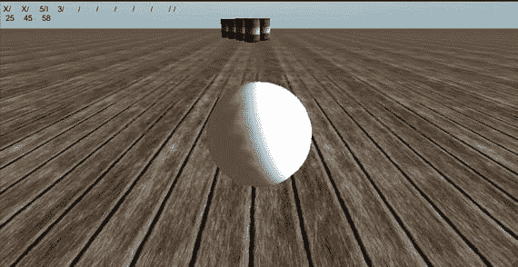

图 9-2. 由 `FuguBowlScoreboard.js` 显示的保龄球记分牌

图 9-2 显示了第四局第二球时的比赛情况。第一球击倒了三个球瓶。前两局均为全中，第三局为补中（第一球击倒五个球瓶，第二球也击倒五个）。第一局的总得分为：全中 10 分，加上后续两球击倒的球瓶数，即第二局全中 10 分，再加上第三局第一球的 5 分，总计 25 分。

第二局也是全中，因此得分为：10 分加上第三局第一球的 5 分和该局第二球的 5 分，总计 20 分。加上第一局的 25 分，比赛总分为 45 分。

第三局为补中，因此得分为：10 分再加上下一球击倒的 3 分，总计 13 分；加上上一局后的比赛总分，即 58 分。可见，你的计分代码和记分牌代码运行正常！

### 设计 GUI 样式

GUI 控件的外观可以通过 `GUIStyle` 进行自定义，`GUIStyle` 是一组影响控件显示效果的属性集合。从概念上讲，它类似于用于格式化网页内容的层叠样式表（CSS）。

每个创建 GUI 控件的 GUI 函数都是重载函数，有两种形式：一种使用默认的 `GUIStyle`，另一种接受 `GUIStyle` 参数。最初的单标签示例仅使用了默认的 `GUIStyle`，但记分牌使用的是接受 `GUIStyle` 参数的 `GUI.Label` 版本，这样可以自定义记分牌的外观。

传递给 `GUI.Label` 的 `GUIStyle` 绑定到了一个名为 `style` 的公共变量上，这样就能在 Inspector 视图中自定义 `GUIStyle`。例如，由于记分牌全是文本，你可以点击 `style` 属性中 Normal 子项的 Text Color 字段（相当于在脚本中访问 `style.onNormal.textColor`），调出颜色选择器并更改记分牌的颜色（图 9-3）。

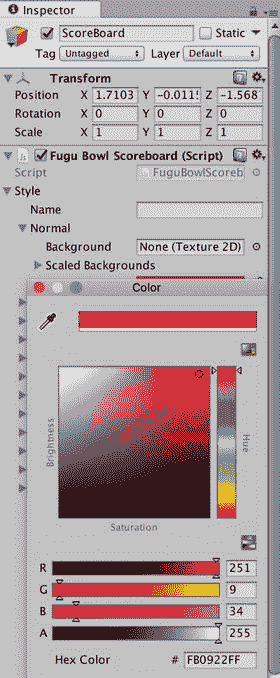

图 9-3. `GUIStyle` 选项

在众多其他 `GUIStyle` 属性中，有几个会影响 GUI 字体，默认字体是 Unity 内置的 Arial 字体。你可以通过将项目视图中的字体资源拖拽到 `GUIStyle` 的 Font 字段（在脚本中，即变量 `style.font`）来更改字体。任何 TrueType、OpenType 或 dfont 格式的字体都可以导入 Unity。

其他 `GUIStyle` 属性可控制字号、样式（对于作为动态字体导入的字体）、文本对齐和自动换行。

富文本格式尤其有趣，因为它允许在标签文本中使用类似 HTML 的标记。因此，虽然脚本很简单，但样式自定义选项非常丰富！

## 暂停菜单

与记分牌相比，开始/暂停菜单需要更多的脚本编写工作，因此，首先需要设计一个方案。让我们创建一个主菜单和两个子菜单：一个用于游戏选项，另一个用于显示游戏致谢。选项菜单将包含音频、图形、系统和统计数据等不同的面板。其逻辑虽然没有保龄球游戏控制器那么复杂，但这也是一个需要先以状态图（图 9-4）形式勾勒出设计的例子。

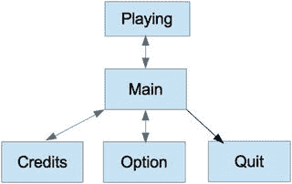

图 9-4. 暂停菜单的状态图

该图显示，玩家可以从游戏进行状态（或等同于菜单不可见状态）进入主暂停菜单，然后进入致谢画面或选项菜单，也可以退出游戏。而选项菜单又可以显示音频、图形、系统或统计面板，每个面板都可以列为单独的状态，但为了简化起见，我们暂时将每个顶层菜单画面视为一个状态。

除 `Quit`（可视为退出状态）之外的所有状态，都可以返回到最初进入它们之前的状态，这就是为什么每个转换箭头都绘制为双向的原因。这意味着玩家可以从主菜单进入选项菜单，再返回主菜单，然后从那里返回到正常游戏模式。但不会有例如从选项菜单直接返回游戏状态的快捷方式。

#### 创建脚本

让我们开始实现暂停菜单，在项目视图的 Scripts 文件夹中创建一个新的 JavaScript 脚本，并将其命名为 `FuguPause`（图 9-5）。

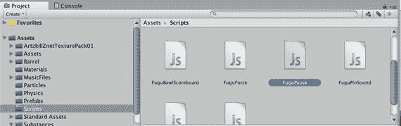

图 9-5. 创建 `FuguPause.js` 脚本

现在，为了将脚本添加到场景中，在 Hierarchy 视图中创建一个新的 `GameObject`，将其命名为 `PauseMenu`，并将 `FuguPause` 脚本附加到 `PauseMenu` `GameObject` 上。

### 跟踪当前菜单页面

在 `FuguBowl` 脚本中使用协程实现状态机的技术不适用于 UnityGUI，因为所有 UnityGUI 函数都必须在 `OnGUI` 回调中调用。但状态图仍然可以作为实现的基础。首先，可以关注表示不同菜单画面的状态。为了将它们与更通用的术语“画面”区分开，我们称这些状态为“页面”。这些菜单状态可以用字符串或整数来区分，但当有多个相关但不同的值时，枚举更合适。因此，让我们定义一个名为 `Page` 的 `enum` 来表示菜单页面状态，以及一个名为 `currentPage` 的变量来跟踪当前正在显示的页面（清单 9-3）。

```enum Page {
None, Main, Options, Credits
}```清单 9-3. 菜单页面的枚举

根据状态图，该 `enum` 列出了无菜单（游戏进行中）、主菜单页面、选项页面和致谢页面的状态。因为变量 `currentPage` 的类型是 `Page`，所以只能将值 `Page.None`、`Page.Main`、`Page.Options` 和 `Page.Credits` 赋给该变量。


### 暂停游戏

制作暂停菜单需要解决两个问题：创建菜单以及让游戏暂停。我们将从让游戏暂停开始。静态变量 `Time.timeScale` 指定模拟游戏时间前进的速度，默认为 1。将 `Time.timeScale` 设置为 0 即可有效暂停游戏，暂停物理、动画以及任何依赖于 `Time.time` 推进的内容。因此，我们创建一个将 `Time.timeScale` 设置为 0 的 `PauseGame()` 函数（清单 9-4）。

```
private var savedTimeScale:float;
function PauseGame() {
    savedTimeScale = Time.timeScale;
    Time.timeScale = 0;
    AudioListener.pause = true;
    currentPage = Page.Main;
}
```

`PauseGame()` 首先将当前的 `Time.timeScale` 保存在变量 `savedTimeScale` 中，以便在游戏取消暂停时可以恢复 `Time.timeScale`（你不应假设游戏暂停时 `Time.timeScale` 为 1）。

`PauseGame()` 还将 `AudioListener.pause` 设置为 `true`，这会暂停所有正在播放的声音（如果你要在菜单中播放声音，则不应执行此操作）。

最后，将 `currentPage` 变量设置为 `Page.Main`，表示应显示主暂停屏幕。

通过逆转所有这些操作来取消游戏暂停（清单 9-5）。

```
function UnPauseGame() {
    Time.timeScale = savedTimeScale;
    AudioListener.pause = false;
    currentPage = Page.None;
}
```

`UnPauseGame()` 将 `Time.timeScale` 恢复为 `PauseGame()` 保存在变量 `savedTimeScale` 中的值，并将 `AudioListener.pause` 设置为 `false` 以重新启用音频。

要查看游戏是否已暂停，你只需检查 `Time.timeScale` 是否为 0。清单 9-6 展示了一个用于此目的的小型便捷函数。请注意，它是一个静态函数，因此任何脚本都可以将其引用为 `FuguPause.IsGamePaused()`。

```
static function IsGamePaused() {
    return Time.timeScale == 0;
}
```

如果游戏要以暂停状态启动，则 `Start()` 回调中应调用 `PauseGame()`（清单 9-7）。添加一个公共布尔变量 `startPaused` 并在调用 `PauseGame()` 之前检查它，可以使初始暂停成为可选项。

```
var startPaused:boolean = true;
function Start() {
    if (startPaused) {
        PauseGame();
    }
}
```

由于 `startPaused` 的默认值是 `true`，如果你单击“播放”，游戏将立即暂停，显示球悬浮在空中。然后你就卡住了，因为没有菜单。也无法取消暂停后再重新暂停，因此我们让 Escape 键（大多数键盘左上角标有 Esc 的键）切换暂停状态。输入处理通常在 `Update()` 回调中执行，这里也不例外（清单 9-8）。

```
function Update() {
    if (Input.GetKeyDown(KeyCode.Escape)) {
        switch (currentPage) {
            case Page.None: PauseGame(); break; // 如果未显示暂停菜单，则暂停
            case Page.Main: UnPauseGame(); break; // 如果正在显示主暂停菜单，则取消暂停
            default: currentPage = Page.Main; // 任何子页面都返回主页面
        }
    }
}
```

第一行检查是否已按下 Esc 键。如果是，则调用 `PauseGame()`，除非暂停菜单已经显示。该函数还将 Esc 视为返回键，从子页面切换到主页面，或从主页面切换到未暂停状态。

### 检查 `Time.deltaTime`

将 `Time.timeScale` 设置为 0 会停止 `Time.time` 的前进，因此 `Time.deltaTime` 始终为 0。这对于将值乘以 `Time.deltaTime` 的 `Update()` 函数非常有效，但在时间冻结时除以 `Time.deltaTime` 会导致除以零错误。`FuguForce` 脚本的 `Update()` 回调中就存在这种情况，因此在继续制作暂停菜单之前，必须处理这个问题（清单 9-9）。

```
function Update() {
    forcex = 0;
    forcey = 0;
    if (Time.deltaTime > 0) {
        CalcForce();
    }
}

function CalcForce() {
    var deltaTime:float = Time.deltaTime;
    forcex = mousepowerx * Input.GetAxis("Mouse X") / deltaTime;
    forcey = mousepowery * Input.GetAxis("Mouse Y") / deltaTime;
}
```

现在，`Update()` 回调不再立即将滚动力值除以 `Time.deltaTime`，而是先检查 `Time.deltaTime` 不为 0，然后再进行力的计算，该计算现已移入 `CalcForce()` 函数中。`Update()` 总是将力值初始化为 0，以确保游戏暂停时没有残余的力作用于保龄球上。

### 显示菜单

与上一节的记分牌一样，暂停菜单的实际显示必须在 `OnGUI()` 回调函数中进行。具体来说，`OnGUI()` 需要检查游戏是否已暂停，如果已暂停，则显示当前菜单页面（清单 9-10）。

```
function OnGUI () {
    if (IsGamePaused()) {
        if (skin != null) {
            GUI.skin = skin;
        } else {
            GUI.color = hudColor;
        }
        switch (currentPage) {
            case Page.Main: ShowPauseMenu(); break;
            case Page.Options: ShowOptions(); break;
            case Page.Credits: ShowCredits(); break;
        }
    }
}
```

目前，每个页面显示函数都只有占位符，这样当你逐个填写每个显示函数时，脚本可以保持可运行状态（即没有编译错误）。将 `Debug.Log()` 语句放入这些桩函数中，以验证它们是否在预期时被调用，这是一个好主意。例如，如果你单击“播放”，则每次暂停游戏时，都应该在控制台视图中看到“Main Pause”。

### 自动布局

对于垂直堆叠并居中在屏幕上的菜单按钮，你可以利用 `GUILayout` 函数，避免计算出原本必须为每个 `GUI.Button()` 传递的所有 `Rect` 值。在 `GUILayout.BeginArea()` 和 `GUILayout.EndArea()` 的调用之间，你可以调用创建 GUI 控件的函数，而无需传递 `Rect`，只需使用 GUI 函数的 `GUILayout` 版本即可。这些控件将在传递给 `GUILayout.BeginArea()` 的 `Rect` 内自动放置和调整大小。由于所有暂停菜单页面都将以相同方式显示，让我们创建一些便捷函数来包装 `GUILayout` 函数（清单 9-11）。

```
var menutop:int = 25;

function BeginPage(width:int, height:int) {
    GUILayout.BeginArea(Rect((Screen.width - width) / 2, menutop, width, height));
}

function EndPage() {
    // 如果不是主页面，则显示“返回”按钮
    if (currentPage != Page.Main && GUILayout.Button("Back")) {
        currentPage = Page.Main;
    }
    GUILayout.EndArea();
}
```

`BeginPage()` 函数调用 `GUILayout.BeginArea()`，该区域由作为参数传入的 `width` 和 `height` 指定，在屏幕上水平居中，并且其顶部边缘与屏幕顶部的距离由名为 `menutop` 的公共变量指定。

`EndPage()` 函数调用 `GUILayout.EndArea()`，但在此之前，如果当前页面不是主页面，它会显示一个“返回”按钮。如果单击该按钮，则当前页面被设置为主页面。


## 主页面

现在你已经掌握了在屏幕上显示菜单所需的所有要素。清单 9-12 展示了一个完整实现的`ShowPauseMenu`函数。

```
function ShowPauseMenu() {
BeginPage(150,300);
if (GUILayout.Button ("Play")) {
UnPauseGame();
}
if (GUILayout.Button ("Options")) {
currentPage = Page.Options;
}
if (GUILayout.Button ("Credits")) {
currentPage = Page.Credits;
}
#if !UNITY_WEBPLAYER && !UNITY_EDITOR
if (GUILayout.Button ("Quit")) {
Application.Quit();
}
#endif
EndPage();
}
Listing 9-12.
FuguPause.js 中显示暂停菜单的函数
```

`BeginPage`和`EndPage`之间的所有 GUI 代码实际上都运行在`GUILayout.BeginArea`和`GUILayout.EndArea`之间，因此你可以使用 GUI 调用的`GUILayout`版本创建元素，而无需传递`Rect`参数。例如，你可以调用`GUILayout.Button`代替`GUI.Button`。除了缺少`Rect`参数外，这些函数在其他方面看起来完全相同。

`GUILayout.Button`与`GUILayout.Label`的区别在于，它会根据按钮是否被按下返回`true`或`false`。因此，每次调用`GUILayout.Button`时，都会在`if`测试语句内执行，并在按钮确实被按下时执行相应的代码。

现在创建一个`GameObject`并将其命名为`MainMenu`。向该`GameObject`添加`FuguPause`脚本组件。你可以从检视面板中选择`Add Component`，或者将项目视图`Scripts`文件夹中的`FuguPause`脚本拖放至新创建的`MainMenu`游戏对象上。

当你点击 Play 时，现在将看到主菜单，并且菜单中的 Play 按钮应该能取消屏幕暂停（图 9-6）。`Application.Quit`在 Unity 网页播放器或编辑器中没有任何功能，因此该代码段被包围在对应预处理器定义`UNITY_WEBPLAYER`和`UNITY_EDITOR`的测试中，用于检查构建目标是否为网页播放器或是否在编辑器中运行。这些定义在编译前就会被评估（因此称为预处理器），所以如果`UNITY_WEBPLAYER`为 false 且`UNITY_EDITOR`为 false，则编译封闭的代码。否则，就像这段代码从未存在过一样。

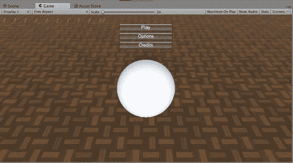

图 9-6. 主菜单

Credits 和 Options 按钮目前还不会有任何反应，因为`ShowCredits`和`ShowOptions`函数仍然是空壳。Credits 页面相对简单，我们就从它开始。

## Credits 页面

多个致谢条目可以存储在一个`String`数组中。为此定义了一个名为`credits`的变量，以及一个用于显示致谢信息的`ShowCredits`函数，如清单 9-13 所示。

```
var credits:String[]=[
"A Fugu Games Production",
"Copyright (c) 2017 Technicat, LLC. All Rights Reserved.",
"More information at http://fugugames.com/"] ;
function ShowCredits() {
BeginPage(300,300);
for (var credit in credits) {
GUILayout.Label(credit);
}
EndPage();
}
Listing 9-13.
FuguPause.js 中显示致谢页面的函数
```

由于变量`credits`是公开的，你可以在检视面板中编辑每个致谢条目，向数组中添加或从中移除条目。

`ShowCredits`函数遍历致谢数组，并在 UnityGUI 标签中显示每一个条目（图 9-7）。请注意，这里有一种使用`in`遍历数组的简单方法，而不是通常通过一系列数组索引进行迭代的习惯。在这种情况下，你不需要索引来做其他事情，所以就采用这种更简单的方法。

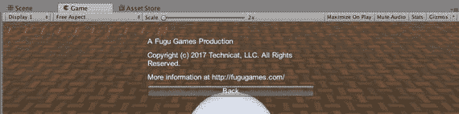

图 9-7. 致谢页面

与主菜单一样，你以调用`BeginPage`开始，以`EndPage`结束，因此你是在`GUILayout`区域（这次是 300×300）内操作，可以使用`GUILayout.Label`代替`GUI.Label`。`EndPage`确保自动生成一个返回按钮。请记住，`Update`回调也会将 Esc 键视为点击返回按钮。

## Options 页面

Options 页面比 Credits 页面复杂得多，因为它包含一个由四个选项卡实现的工具栏：Audio、Graphics、Stats 和 System。清单 9-14 展示了完整实现的`ShowToolbar`函数，以及一些辅助变量和函数。

```
private var toolbarInt:int=0;
private var toolbarStrings: String[]= ["Audio","Graphics","System"];
function ShowOptions() {
BeginPage(318,300);
toolbarInt = GUILayout.Toolbar (toolbarInt, toolbarStrings);
switch (toolbarInt) {
case 0: ShowAudio(); break;
case 1: ShowGraphics();  break;
case 2: ShowSystem(); break;
}
EndPage();
}
Listing 9-14.
FuguPause.js 中的 Options 页面
```

同样，`ShowOptions`函数中的所有内容都被包裹在`BeginPage`和`EndPage`函数的调用之间。第一行调用`GUILayout.Toolbar`，从一个字符串数组创建一个工具栏——一排充当选项卡或单选按钮的按钮，其中每个字符串是按钮的标签。该函数还接收一个整数，该整数对应于该字符串数组中的位置。那是要使工具栏上当前处于活动状态的按钮。但如果你只是这样写：

```
GUILayout.Toolbar (toolbarIndex, toolbarStrings);
```

那么`toolbarIndex`永远不会从其初始值（0）改变，即使你点击了另一个按钮，下次调用此函数时（在`OnGUI`的下一次调用中），活动按钮也会被设置回该值。

但是`GUILayout.Toolbar`返回一个表示当前活动按钮的整数，所以你将这个值反馈回你传入的变量`toolbarIndex`。

```
toolbarIndex = GUILayout.Toolbar (toolbarIndex, toolbarStrings);
```

因此，`toolbarIndex`初始为 0，但如果你点击 Graphics，它将变为 1，如果你点击 Controls，它将变为 2，以此类推。然后有一个`switch`语句检查`toolbarIndex`并调用与所选按钮匹配的显示函数。与主菜单一样，我们从存根函数开始，然后逐个实现。现在继续点击看看，你应该能在控制台视图中看到相应的函数名称显示出来，因为这是你目前告诉程序所做的全部事情！

## Audio 面板

当选中 Audio 选项卡时，它将显示一个用于音量控制的滑块（图 9-8）。

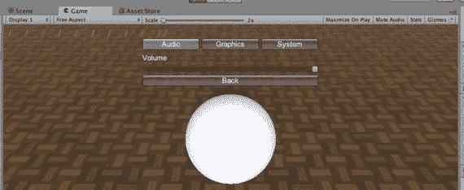

图 9-8. 暂停菜单中的音频面板

将滑块添加到`ShowAudio`函数实际上相当容易；只需要一行代码。好吧，它实际上包含两行，因为没有标签的滑块有点过于神秘（清单 9-15）。

```
function ShowAudio() {
GUILayout.Label("Volume");
AudioListener.volume = GUILayout.HorizontalSlider(AudioListener.volume,0.0,1.0);
Listing 9-15.
FuguPause.js 中的音频面板
```

第一行调用`GUILayout.Label`，这一点你现在应该已经熟悉了。第二行调用`GUILayout.HorizontalSlider`，它接收滑块表示的最小值、最大值以及一个表示当前设置的值作为参数。

该滑块反映了`AudioListener.volume`的值，这是 Unity 中所有声音的主音量。因此，`AudioListener.volume`被作为滑块的当前值传递，并且由于`AudioListener.volume`的范围在 0 到 1 之间，这些值分别作为最小值和最大值传递。而且，为了记录滑块的值，`GUILayout.HorizontalSlider`的返回值被重新赋值给`AudioListener.volume`。否则，`AudioListener.volume`的值将永远不会改变，滑块也不会移动。


### 图形面板

图形面板会显示与 Unity 编辑器质量设置相同的一些图形质量信息（如图 9-9 所示）。

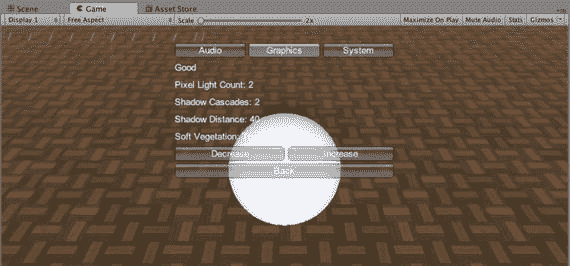

图 9-9. 暂停菜单中的图形选项

面板底部的两个按钮分别用于提高和降低质量设置的级别。实现此面板无需使用任何新的 UnityGUI 控件，但需要访问`QualitySettings`类（列表 9-16）。

```
function ShowGraphics() {
GUILayout.Label(QualitySettings.names[QualitySettings.GetQualityLevel()]);
GUILayout.Label("像素光数量: "+QualitySettings.pixelLightCount);
GUILayout.Label("阴影级联: "+QualitySettings.shadowCascades);
GUILayout.Label("阴影距离: "+QualitySettings.shadowDistance);
GUILayout.Label("柔和植被: "+QualitySettings.softVegetation);
GUILayout.BeginHorizontal();
if (GUILayout.Button("降低")) {
QualitySettings.DecreaseLevel();
}
if (GUILayout.Button("提高")) {
QualitySettings.IncreaseLevel();
}
GUILayout.EndHorizontal();
}
```

列表 9-16. 显示质量设置的函数

`ShowGraphics`函数相当直接。它通过调用`QualitySettings.GetQualityLevel`获取当前质量设置级别（以整数表示），然后将该整数作为索引，从`QualitySettings.names`字符串数组中检索该质量设置的名称。该名称以及若干质量设置会显示在标签中，底部放置了两个按钮：一个调用`QualitySettings.DecreaseLevel`，另一个调用`QualitySettings.IncreaseLevel`。

这两个按钮允许你在现有级别范围内提高或降低质量设置级别。你不仅会看到显示的质量设置信息发生变化，甚至可能亲眼目睹场景的图形质量发生改变——因为即使在游戏时间暂停时，场景每帧仍在渲染。

### 系统面板

系统面板显示有关硬件平台的信息（如图 9-10 所示）。

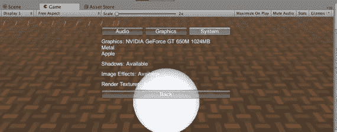

图 9-10. 暂停菜单中的系统面板

与图形页面类似，信息通过标签显示；但图形页面访问的是`QualitySettings`类，而系统面板访问的是`SystemInfo`类（列表 9-17）。

```
function ShowSystem() {
GUILayout.Label("图形设备: "+SystemInfo.graphicsDeviceName+" "+
SystemInfo.graphicsMemorySize+"MB\n"+
SystemInfo.graphicsDeviceVersion+"\n"+
SystemInfo.graphicsDeviceVendor);
GUILayout.Label("阴影: "+ Available(SystemInfo.supportsShadows));
GUILayout.Label("图像特效: "+Available(SystemInfo.supportsImageEffects));
// GUILayout.Label("渲染纹理: "+Available(SystemInfo.supportsRenderTextures));
}
```

列表 9-17. FuguPause.js 中的系统面板

`SystemInfo`类提供关于图形硬件及其能力的信息，包括一些标识信息，如设备名称和供应商名称、显存大小，以及硬件是否支持某些更高级的特性，例如动态阴影、渲染到纹理或图像特效（这要求支持渲染到纹理）。

## 自定义 GUI 颜色

你可能已经注意到暂停菜单中的白色文本通常难以阅读。一种解决方案是修改静态变量`GUI.color`，它会使用一个颜色值为整个 GUI 着色（列表 9-18）。

```
var hudColor:Color = Color.white;
function OnGUI () {
if (IsGamePaused()) {
if (skin != null) {
GUI.skin = skin;
} else {
GUI.color = hudColor;
}
switch (currentPage) {
case Page.Main: ShowPauseMenu(); break;
case Page.Options: ShowOptions(); break;
case Page.Credits: ShowCredits(); break;
}
}
}
```

列表 9-18. FuguPause.js 中的 GUI 颜色自定义

你在`FuguPause`脚本中添加了一个名为`hudColor`的公开变量，以便可以在 Inspector 视图中选择颜色。所有 UnityGUI 操作，包括设置`GUI.Color`之类的变量，都必须放在`OnGUI`回调中进行。因此，对`GUI.color`的赋值被放置在`OnGUI`回调内，在所有 GUI 控件创建之前（但在调用`IsGamePaused`之后，因为如果不需要渲染 GUI，就没有理由设置`GUI.Color`）。请注意，你可以在`OnGUI`中多次设置`GUI.color`，以便在渲染不同部分之前更改颜色。

现在你可以在 Inspector 视图中选择颜色（如图 9-11 所示），并查看最终的 GUI 色调（如图 9-12 所示）。

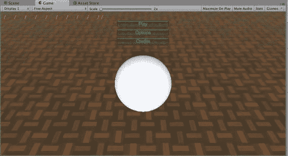

图 9-12. 使用自定义颜色的暂停菜单

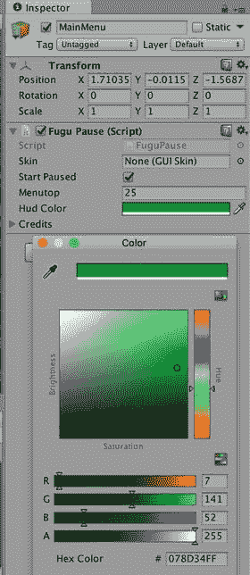

图 9-11. 暂停菜单的颜色选择

## 自定义皮肤

默认的 UnityGUI 皮肤相当中性，而且文本难以阅读，正如你在上一部分的暂停菜单中看到的那样。在记分板中，你可以通过调整`GUI.Label`的样式来改变文本颜色，但如果 GUI 元素很多，这会很麻烦。

这正是 UnityGUI 皮肤的用武之地。皮肤是分配给各种 GUI 元素的样式的集合。应用皮肤很简单——只需声明一个`GUISkin`类型的公开变量，然后在`OnGUI`回调中，将该皮肤赋值给变量`GUI.skin`，类似于赋值`GUI.Color`（列表 9-19）。

```
var skin:GUISkin;
function OnGUI () {
if (IsGamePaused()) {
if (skin != null) {
GUI.skin = skin;
} else {
GUI.color = hudColor;
}
switch (currentPage) {
case Page.Main: ShowPauseMenu(); break;
case Page.Options: ShowOptions(); break;
case Page.Credits: ShowCredits(); break;
}
}
}
```

列表 9-19. 为暂停菜单添加 GUISkin

你可以使用 Asset Store 中一个名为 Necromancer GUI（死灵法师 GUI）的、外观非常酷炫的免费 UnityGUI 皮肤来测试这个皮肤支持功能（如图 9-13 所示）。

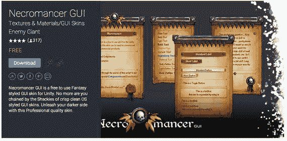

图 9-13. Asset Store 上的 Necromancer GUI

下载并导入 Necromancer GUI，然后将其皮肤文件（名为 Necromancer GUI）拖拽到 Inspector 视图中新增的 Skin 属性上（如图 9-14 所示）。

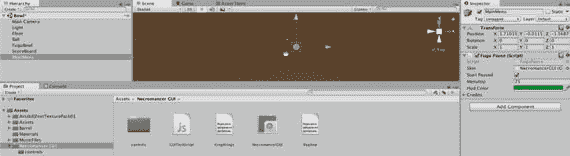

图 9-14. Necromancer GUI

然后点击 Play，你就会拥有一个更加华丽的暂停菜单。图 9-15 展示了应用 Necromancer GUI 后的暂停菜单图形面板。看看这些漂亮的按钮！

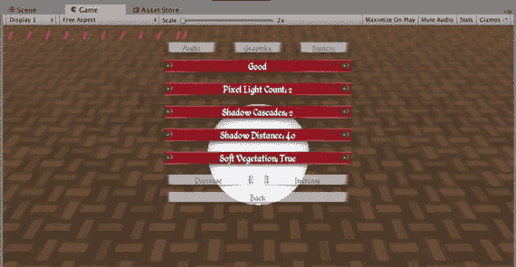

图 9-15. Necromancer GUI 皮肤的实际效果

## 完整脚本

最终的启动/暂停菜单脚本比记分板脚本要长得多，因此这里省略了完整列表。本章已展示了所有代码，完整的`FuguPause.js`脚本可在本书本章项目的资源文件中获取，网址为 [`www.apress.com/9781484231739`](http://www.apress.com/9781484231739)。


## 更进一步

最后，计分板的显示让你的保龄球游戏成为了一款功能完整的保龄球游戏，而开始/暂停菜单的加入则提供了玩家所期望的一些细节打磨！

游戏图形界面的加入不仅完善了保龄球游戏（在商业游戏项目中，这或许可被视为“首次可玩”的里程碑），也标志着对 Unity 3D 游戏常用基础功能介绍的结束。

**提示**  
尽管我将图形界面开发留到了这个阶段的最后，这在游戏开发中不幸很常见，但最好在项目早期就包含图形界面设计。哪怕只是画出菜单的草图，也有助于厘清预期的游戏模式和选项。

在大多数情况下，尽管你一直在编辑器中修改和测试游戏，但这些功能都是跨平台的。现在，你可以将此游戏构建为网页播放器、Mac 或 Windows 可执行文件，并且游戏在所有平台上的运行表现将基本一致（性能差异除外）。但本书的最终目标是让你进入 iOS 开发领域，因此，从下一章开始，本书的剩余内容将全部围绕 Unity iOS 展开。

### Unity 手册

Unity 手册中“创建游戏玩法”部分的“游戏界面元素”链接，指向了“Unity 脚本指南”部分。该部分是一系列教程风格的页面，详细讲解了 UnityGUI 系统，从创建单个按钮到添加各种其他 UnityGUI 控件（如滑块和单选按钮），从使用自动布局与固定布局，到创建可复用的复合控件，以及使用样式和皮肤自定义 GUI 外观。

“Unity 脚本指南”还解释了如何使用 UnityGUI 来自定义 Unity 编辑器。事实证明，编辑器界面实际上就是用 UnityGUI 实现的（这也解释了为什么有时你会在控制台视图中看到与你的任何代码无关的 `OnGUI` 错误信息）。

### 参考手册

我简要提过，除了 Unity 内置字体之外，其他字体也可以导入到 Unity 项目中，然后分配给 UnityGUI 样式和皮肤。参考手册在其“资源组件”部分有一个页面，更详细地描述了字体资源及其重要选项。

### 脚本参考

自然，脚本参考中的“运行时类”列表包含了描述你所使用的 UnityGUI 函数的页面，首先是 `MonoBehaviour` 类中定义的 `OnGUI` 回调。

在计分板和暂停菜单中使用的大部分 UnityGUI 函数，都是用于创建各种 UnityGUI 控件的静态 `GUI` 和 `GUILayout` 函数，例如 `GUI.Button` 和 `GUI.Label`。值得逐一查阅这些函数的脚本参考页面，以便了解有哪些 GUI 控件可用，以及像 `GUI.color` 和 `GUI.skin` 这样的自定义变量（还有其他变量，例如用于自定义背景颜色的）。`GUIStyle` 和 `GUISkin` 也是类，你可以在脚本中随时更改它们的属性。

除了 UnityGUI 类之外，暂停菜单中还使用了一些其他类。设置了静态变量 `Time.timeScale` 来暂停和恢复游戏；调用了 `Application.Quit` 来退出游戏；并在“选项”页面中访问了 `AudioListener`、`QualitySettings` 和 `SystemInfo` 类。

### 资源商店

死灵法师图形界面在暂停菜单中看起来非常棒，它展示了精心制作的 `GUISkin` 能让 UnityGUI 看起来有多出色，但资源商店上还有很多其他皮肤。它们都与死灵法师图形界面一起，列在“纹理和材质”下的“图形界面皮肤”类别中。该类别中充满了 UnityGUI 的皮肤，以及第三方 GUI 系统的皮肤，例如来自 Above and Beyond Software (`http://anbsoft.com/`) 的流行 EZGUI 和来自 Tasharen Entertainment (`http://tasharen.com`) 的 NGUI。

这些第三方 GUI 系统可在脚本类别中内容丰富的 GUI 子类别中找到，该子类别充满了预置脚本的 GUI，例如小地图和菜单。事实上，本章实现的暂停菜单的一个版本就在资源商店的“完整项目”下（名为 FuguPause）。

资源商店在“纹理和材质”下的“字体”类别中也有相当不错的字体选择。但由于 Unity 可以导入 TrueType 和 OpenType 字体，网络上有很多免费的字体网站可供使用，以及价格适中的字体库（我使用的是 MacXWare 字体库）。

