# 10. 使用 Unity iOS

恭喜！你现在拥有了一款包含典型 3D 游戏基本功能的保龄球游戏：3D 图形（当然）、物理、音效、玩家控制（保龄球）、摄像机运动以及图形用户界面。

默认的构建目标在编辑器窗口的标题栏上显示为 PC、Mac 和 Linux 独立平台。如果你现在就为保龄球项目执行 macOS 构建，游戏运行起来将与在编辑器中基本相同。对于 Linux、Windows 甚至网页播放器（尽管网页播放器构建需要你先切换构建目标）来说也是如此。

针对 iOS 则是另一回事。你现在可以将保龄球游戏的构建目标更改为 iOS，并进行构建而不会出现任何编译错误。但 `FuguForce.js` 中的保龄球控制是为鼠标输入设计的，因此必须更改。除了重新实现输入处理之外，将桌面 PC 游戏适配到移动设备（这个过程称为移植）通常还需要针对设备显示进行调整，并做出妥协以获得可接受的性能。

此外，构建 iOS 应用涉及的外部流程比桌面独立平台和网页播放器目标要多得多。由于 Apple 要求所有 iOS 应用都必须使用 Xcode 编译，Unity iOS 通过首先生成一个 Xcode 项目来构建应用，然后由 Xcode 编译该项目以创建最终的应用。要真正在测试设备上运行该应用并将其提交到 App Store，需要一系列相当复杂的流程，以及注册 Apple 的 iOS 开发者计划。现在，不妨让我们回归本源，暂时回到本书开始时使用的 Climber 项目。方便的是，Climber 无需修改即可在 iOS 上运行。如果你有 iOS 设备，请继续从 App Store 下载 Climber。快速找到 Climber 应用的方法是在 App Store 搜索框中输入“Climber”，然后会看到“Angry Bots”以及其他来自 Unity Technologies 的应用（图 10-1）。

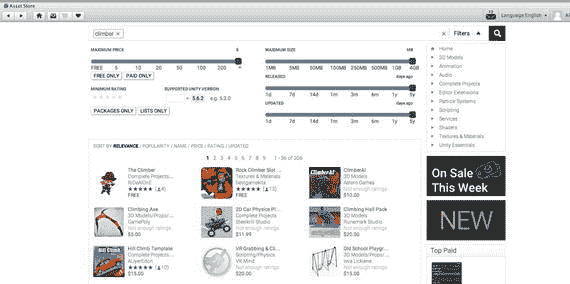

**图 10-1.** App Store 中的示例应用

除了 Climber，你还应该搜索并下载 Unity Remote 应用，它可以用作在编辑器中测试 Unity iOS 游戏的遥控器。既然在找了，你也应该下载并尝试所有来自 Unity Technologies 的示例应用。其中许多应用已经很长时间没有更新了，但它们确实能让你了解可以使用 Unity 创建什么样的游戏。

在运行此游戏之前，你需要做一个小改动。从主菜单中选择“文件”➤“构建设置”。在对话框中，你将看到游戏当前设置为“PC、Mac 和 Linux 独立平台”（图 10-2）。你需要将目标平台更改为 iOS。在“平台”菜单中选择 iOS 图标选项，然后选择“切换平台”按钮（图 10-3）。

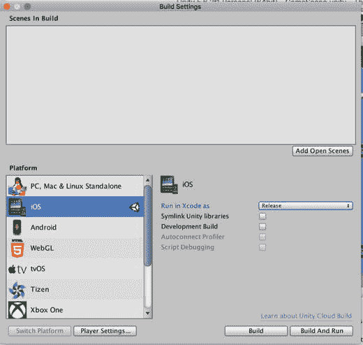

**图 10-3.** 构建设置菜单设置为 iOS

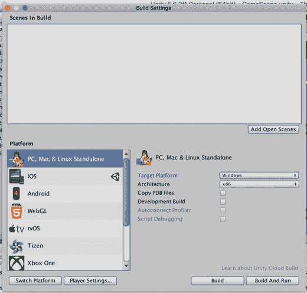

**图 10-2.** 构建设置菜单设置为 PC、Mac 和 Linux 独立平台

现在你可以选择构建并在 iOS 设备上运行此游戏了。

## 使用 Unity Remote 进行测试

Unity 提供了一项非常酷的解决方案，可以让你在编辑器内测试 Unity iOS 项目，即 Unity Remote 应用。该应用运行在 iOS 设备上，并通过 Wi-Fi 将该设备的触摸屏和加速度计数据中继到 Unity Editor。如果你没有 iOS 设备，可以跳过本节，使用下一节描述的 iOS 模拟器进行一些测试。

Unity Remote 可以像其他任何应用一样在 App Store 中找到。在 App Store 搜索框中输入 `Unity Remote`（图 10-4）。

图 10-4. App Store 上的 Unity Remote 应用

在 iOS 设备上安装 Unity Remote 后，请确保该设备已连接到运行 Unity 的 Mac。现在，在你的 iOS 设备上打开 Unity Remote 应用，然后从 The Climber ➤ Scenes 文件夹中选择 `GameScene`（图 10-5）。

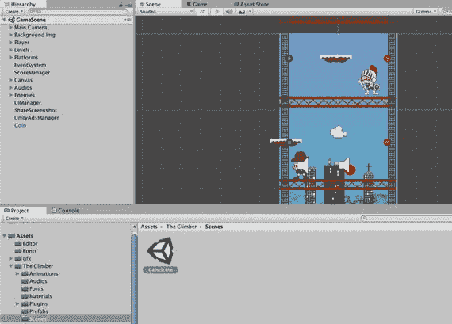

图 10-5. The Climber 游戏场景

现在，你需要让 Unity 知道你想要连接到设备上的 Unity Remote 应用。然后，点击 Unity 中的“播放”按钮。游戏将加载到 Unity 的游戏屏幕中，当你按下“播放”键时，游戏也应该在你的设备上运行。从主菜单中选择 Edit ➤ Project Settings ➤ Editor（图 10-6）。

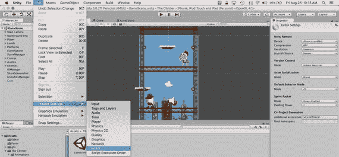

图 10-6. 设置 Unity 编辑器

在 Inspector 中，选择你已安装 Unity Remote App 的 iOS 设备。

当 Unity Editor 处于播放模式时，游戏视图中的图形也会显示在 Unity Remote 中，并且你可以在设备上玩游戏。画面可能会有点粗糙，因为在 Unity 中你还没有将游戏适配到设备设置。你可以通过最小化 Unity Editor 中游戏视图的分辨率来改善性能（图 10-7）。

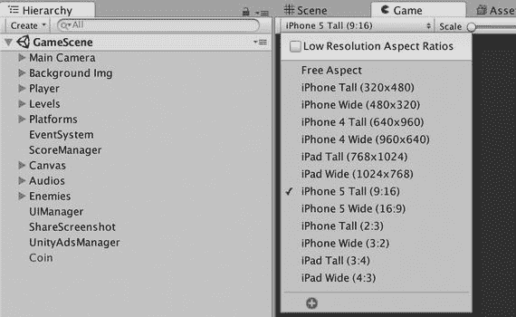

图 10-7. 游戏视图中最小化的设备分辨率

无论图形质量如何，你现在都能看到 Climber 游戏在 iOS 设备上的样子，尽管你实际上仍在 Editor 中运行游戏，只是将设备用作控制器。由于在 Climber 游戏中尚未设置触摸屏输入，因此你需要使用 Mac 上的方向键和空格键。一旦配置完成，触摸屏输入将通过 USB 线缆发送回 Unity Editor，并由在播放模式下运行的游戏接收，因此，在测试运行期间，你仍然可以随时使用 Unity Editor 的所有调试功能。这真是两全其美！

### 安装 Xcode

在某个时候，你必须离开舒适的 Unity Editor，真正开始为 iOS 构建应用。所有 iOS 应用都必须通过 Apple 官方的 iOS 开发工具（也是其官方的 macOS 开发工具）—— Xcode 来构建，这就是 Unity iOS 构建首先会生成一个 Xcode 项目，然后由 Xcode 构建该项目以创建应用的原因。Xcode 可从 Apple 开发者网站免费获取，但也可以方便地从 Mac App Store 获取。在 Mac App Store 上搜索 `xcode`，然后点击“免费”按钮下载（图 10-8）。

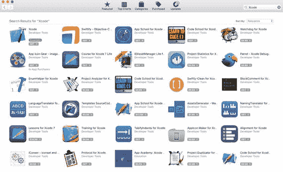

图 10-8. Mac App Store 上的 Xcode

安装完成后，你应该能在“应用程序”文件夹中看到 Xcode 应用。现在，你就可以开始从 Unity 执行 iOS 构建了！

### 自定义播放器设置

Unity iOS 构建总是需要在 Unity Editor 中自定义播放器设置（Unity 播放器，与 Unity Editor 相对，是 Unity 引擎的部署版本）。在“Edit”菜单下选择“Player Settings”，或者点击“Build”窗口中的“Player Settings”按钮，播放器设置将显示在 Inspector 视图中（图 10-9）。

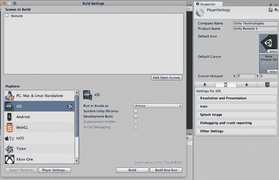

图 10-9. 选择播放器设置

播放器设置允许你设置 PC、Mac & Linux Standalone（第一个图标）、iOS（第二个图标）、Android（第三个图标）和 WebGL（第四个图标）的设置。

由于你现在只关心 iOS 播放器设置，请点击看起来有点像 iPhone 的 iOS Settings 标签页，查看 iOS 的设置（图 10-10）。

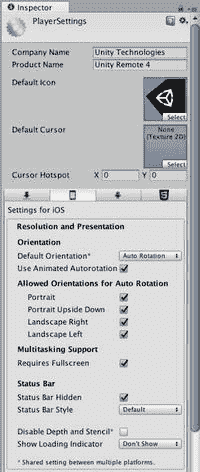

图 10-10. iOS 的播放器设置中的分辨率和显示

播放器设置非常丰富，因此它们被组织成几个部分：分辨率和显示、图标、启动画面、调试和崩溃报告，以及包罗万象的其他设置。第 12 章专门讨论显示问题，包括图标和启动画面设置，因此，现在你将重点关注分辨率和显示以及其他设置。

#### 分辨率和显示

大多数分辨率和显示设置都有合理的默认值（图 10-8），但我建议将默认方向设置为“自动旋转”，因为 Apple 要求 iPad 应用支持自动旋转，这意味着显示会自动旋转以保持直立。其他默认方向选项包括横向左、横向右、纵向或纵向倒置。

如果选择了自动旋转，则会显示自动旋转允许的方向。Climber 旨在仅在纵向模式下运行，因此当设备旋转时，Climber 将在纵向和纵向倒置之间切换，但绝不会切换到横向模式。

“使用动画自动旋转”选项指定显示是可见地旋转还是直接切换。我始终选择动画旋转，因为它看起来很酷。状态栏选项指定应用程序启动时 iOS 状态栏是否可见，如果可见，则以何种样式显示。

“显示加载指示器”控制应用程序启动时是否显示 iOS 活动指示器（屏幕中央的旋转小图形）。此设置也将在第 12 章的显示选项中涵盖。

### 其他设置

许多重要的设置被集中在“其他设置”（Other Settings）这个通用标题下（图 10-11）。渲染设置下的静态和动态批处理选项实际上是优化选项，影响是否以及何时自动合并网格以提升性能。这将在第[16](https://doi.org/10.1007/978-1-4842-3174-6_16)章的优化技术中进行讨论。

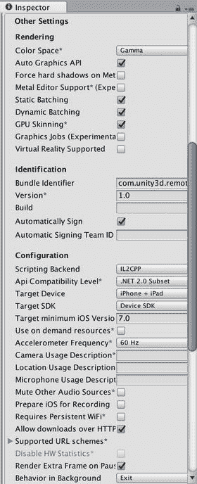

图 10-11. iOS 播放器设置中的“其他设置”

在“标识”（Identification）部分有两个设置：`Bundle Identifier` 和 `Version`。它们在 iOS 模拟器中运行时并不重要，但在提交应用时，这些设置必须与 `iTunesConnect` 中指定的应用信息一致（这将在下一章的应用提交流程中介绍）。

捆绑包 ID (bundle ID) 是应用的唯一标识符，通常以反向 URL 的形式表示。例如，我所有的应用捆绑包 ID 形式都是 `com.technicat.<appname>`，所以我会将 `com.unity.climber` 更改为 `com.technicat.climber`。

捆绑包版本号 (bundle version) 与 App Store 上显示的应用版本号相同。它通常格式化为两个数字，`<主版本>.<次版本>`，有时是三个，`<主版本>.<次版本>.<修订号>`。每次在 App Store 上提交应用更新时，都需要递增此数字。

在“配置”（Configuration）下，大多数设置都有合理的默认值，但你需要通过选择目标设备来决定你的应用是在 iPhone、iPad 上运行，还是在两者上都运行。大多数 3D 应用通常在各种屏幕宽高比上都能良好运行，至少比 2D 应用要好，但 iPhone 和 iPod touch 的屏幕比 iPad 更窄。有时，出于商业原因，你可能只想发布一个仅适用于 iPad 或仅适用于 iPhone 的应用。

SDK 版本有两个选项：`Device SDK` 和 `Simulator SDK`。在为测试设备构建或提交应用（将在下一章介绍）时，默认值 `Device SDK` 是正确的选择，但在本章中，应选择 `Simulator SDK` 才能在 iOS 模拟器中运行我们的游戏。

> **注意**  
> `SDK Version` 这个属性名称用来区分模拟器和硬件构建有点奇怪，但它是 Unity iOS 旧版本遗留下来的，当时需要指定随 Xcode 安装的 iOS SDK。

`Target iOS Version` 设置指定了应用运行所需的最低 iOS 版本。将其保留为默认的最低值 iOS 7.0，可以最大限度地增加兼容设备的数量，从而扩大潜在客户群。然而，如果目标 iOS 版本太老，可能会导致 Unity 发出警告，提示应用可能被 App Store 拒绝。

`Scripting Define Symbols` 允许你定义自己的预处理器定义，就像上一章 `FuguPause` 脚本中引用的 `UNITY_EDITOR` 和 `UNITY_WEBPLAYER` 定义一样。例如，如果你有一些代码调用了 Unity Pro 才有的功能，你可以用 `#if UNITY_PRO … #endif` 包裹这些代码，然后在使用 Unity Pro 运行的项目中，将 `UNITY_PRO` 添加到 `Scripting Define Symbols` 字段。

可以使用分号作为分隔符来添加多个定义。如果你还有一个 `USE_ADS` 预处理器定义来控制是否显示广告，你可以在 `Scripting Define Symbols` 字段中写入 `USE_ADS;UNITY_PRO`。

“优化”（Optimization）设置中的一些选项与优化无关。`AOT Compilation Options` 指的是在 Unity iOS 构建过程中发生的事先（AOT）编译，而不是即时（JIT）编译。这就是为什么在 Unity iOS 脚本中需要 `#pragma strict` 的原因。它为 AOT 编译器提供了足够的信息来完成其工作。

最后，`Stripping Level`、`Script Call Optimization` 和 `Optimize Mesh Data` 确实是优化设置，它们将在第[16](https://doi.org/10.1007/978-1-4842-3174-6_16)章中与其他优化技术一起介绍。简而言之，`Stripping Level` 是一个 Unity iOS Pro 选项，用于移除未使用的代码（或者如果你运气不好，可能会移除已使用的代码，这就是它为何是可选项的原因），`Script Call Optimization` 可以通过消除异常处理来加速脚本（异常本质上是可以被调用代码捕获的错误或“异常”情况），而 `Optimize Mesh Data` 则用于移除未使用的网格数据（例如，当使用无光照材质时，法线数据就不是必需的）。

如你所见，播放器设置中有许多选项会影响 Unity iOS 构建的外观和性能。更改播放器设置后，最好通过 `File` 菜单调用 `Save Project` 或 `Save Scene`（后者也会隐式地执行 `Save Project`）来保存这些更改。尽管许多（即使不是大多数）播放器设置在某些时候都很重要，但要让 Angry Bots 在 iOS 模拟器上运行，你唯一需要做的更改就是将 `Device SDK` 设置为 `Simulator SDK`。

## 在 iOS 模拟器中进行测试

现在你已经安装了 Xcode，并将 `Device SDK` 设置为 `Simulator SDK`，就可以在 iOS 模拟器上构建并运行 `Climber` 了。`File` 菜单中的 `Build and Run` 命令以及 `Build Settings` 窗口中的 `Build and Run` 按钮，会先执行 `Build` 阶段，生成一个 Xcode 项目，然后执行 `Run` 阶段，在 Xcode 项目内发起构建和运行。通常这非常方便，但在使用 iOS 模拟器时，如果手动从 Xcode 进行构建和运行，你将对 iOS 模拟器拥有更多控制权。因此，让我们再次打开 `Build Settings` 窗口（从 `File` 菜单中），并点击 `Build` 按钮。

> **提示**
>
> 在执行构建之前，请检查 `Build Settings` 窗口，确保已包含正确的场景集合。

Unity 会弹出一个 `Save As` 窗口，提示你选择即将构建的 Xcode 项目的位置和文件名（图 10-12）。

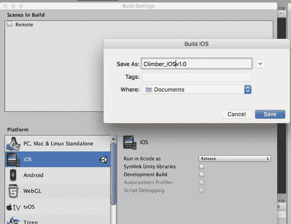

**图 10-12.** 构建提示：选择 Xcode 项目的位置和名称

它通常默认使用 Unity 项目文件夹的顶层目录。我们将这个 Xcode 项目命名为 `Climber_iOSv1.0`。你添加了版本号，这样就能根据需要跟踪任何更改。

> **警告**
>
> 注意不要选择 `Assets` 文件夹内的路径作为构建目标，否则 Unity 会尝试将整个 Xcode 项目作为项目资源导入。

如果这不是你第一次在此位置构建该项目，Unity 会检测到同名 Xcode 项目已存在，并询问你是要完全替换该项目，还是仅追加项目更改（图 10-13）。

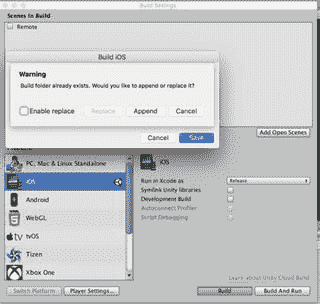

**图 10-13.** 构建追加或替换对话框

追加方式更快，但有时你需要一个全新的 Xcode 项目。例如，如果你更改了播放器设置中的包标识符，或者（尤其是在）你升级了 Unity 或 Xcode 之后，都应该构建一个新的 Xcode 项目。

> **提示**
>
> 从 `File` 菜单执行的 `Build and Run` 与 `Build Settings` 窗口中的 `Build and Run` 按钮并不完全相同。`File` 菜单中的命令假设你要追加构建文件夹（如果它已存在），并且不会询问你是要追加还是替换它。我更喜欢坚持使用 `Build Settings` 窗口来执行构建，这样我总能清楚当前状况。我曾遇到过这样的情况：复制了一个项目，但从 `File` 菜单调用 `Build and Run` 时，它仍然构建到了原始位置！

无论如何，点击 `Build` 后，构建过程中会显示一个进度条（图 10-14）。与资源重新导入一样，对于大型项目，这可能需要一些时间，并且编辑器在构建期间会无响应。

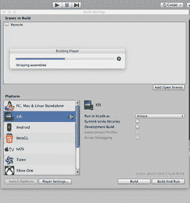

**图 10-14.** 构建过程中的进度指示器

构建完成后，一个 Xcode 项目将出现在你指定的位置（图 10-15）。

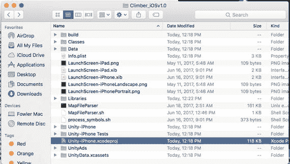

**图 10-15.** Unity iOS 构建生成的 Xcode 项目文件夹

该 Xcode 项目名为 `Unity-iPhone.xcodeproj`，位于 Xcode 项目文件夹中。双击该文件可在 Xcode 中打开项目（图 10-16）。

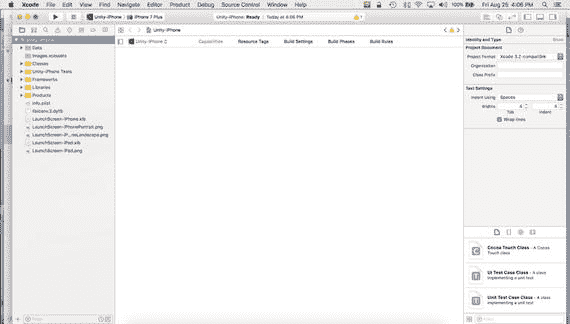

**图 10-16.** 启动并加载了 Unity iOS 项目的 Xcode

注意 Xcode 窗口左上角显示的是 `iPhone 7 Plus`。这是一个用于选择 Xcode 方案的菜单，方案是 Xcode 中构建规则的集合。其他可用的方案包括当前的 iPad 和 iPhone 模拟器（图 10-17）。

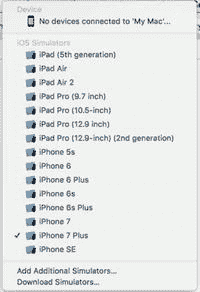

**图 10-17.** 选择 iPad 和 iPhone 模拟器

如果从 Unity 中执行 `Build and Run`，iOS 模拟器会自动启动，而不会让你有机会先选择 iPad 还是 iPhone 模拟器。现在，我们先使用 iPad 模拟器，点击 Xcode 窗口左上角的 `Run` 按钮。`Run` 按钮实际上就是一个 `Build and Run` 按钮，因为它在尝试运行项目之前，会先编译项目（如果需要的话）。如果成功，一个匹配 iPad 屏幕尺寸的 iOS 模拟器窗口将会出现，并运行 `Climber`（图 10-18）。

**图 10-18.** 在 iOS 模拟器中运行 `Climber`

iOS 模拟器会将鼠标输入解释为触摸屏事件，因此你可以点击屏幕进行游戏。此外，iOS 模拟器的 `Hardware` 菜单可以模拟其他设备事件（图 10-19）。

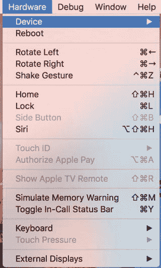

**图 10-19.** iOS 模拟器选项

例如，`Rotate Left` 和 `Rotate Right` 命令模拟旋转设备方向（试试看，观察自动旋转效果），而调用 `Home` 等同于按下设备上的 `Home` 按钮，这将挂起或退出应用并显示设备的 `Home` 屏幕。应用图标应该出现在那里，可以点击（模拟轻触）来重新启动应用。`Hardware` 菜单还允许你选择不同的设备和 iOS 版本进行模拟。

除了测试，iOS 模拟器还可以通过 `Tools` 菜单中的 `Save Screen Shot` 命令方便地截取屏幕截图（图 10-20）。调用该命令会立即将截图保存到桌面。App Store 要求提供你的应用所支持的设备的截图，因此，例如如果你需要一张 iPad 截图，而你没有 iPad，那么 iOS 模拟器就是一个获取该截图的便捷工具。

**图 10-20.** iOS 模拟器中的 `Save Screen Shot` 命令

iOS 模拟器窗口没有可操作的关闭按钮，但可以通过 iOS 模拟器菜单中的 `Quit iOS Simulator` 命令或其键盘快捷键 `Command+Q` 来退出模拟器（图 10-21）。

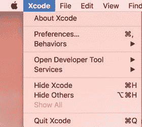

**图 10-21.** 退出 iOS 模拟器

iOS 模拟器在模拟 iOS 功能方面相当完善，包括 iAd 和 Game Center。因此，即使你没有可用于测试的 iOS 设备，你也可以仅使用 iOS 模拟器完成本书后续的大部分内容。

## 进一步探索

你可能会感到似曾相识，因为你最初就是从 `Climber` 演示项目开始的，而现在又回到了它。区别当然在于，现在你是为 iOS 构建项目。你已经迈出了重要的几步：将构建目标改为 iOS，使用 Unity Remote 在 Unity 编辑器中进行测试，然后用 Xcode 构建以在 iOS 模拟器中运行。下一步，构建并在真实的 iOS 设备上运行，将在下一章中进行，之后你将回到常规的编程任务，那个保龄球游戏。到那时，理想情况下，你将对构建过程感到得心应手，并能够专注于将游戏打造成一款 iOS 游戏！

### Unity 手册

既然讨论回到了 Climber，那么 Unity 手册中第一个相关章节便是“Unity 基础知识”部分，特别是“发布构建”页面。

Unity 手册还包含几个专门关于 Unity iOS 的章节，不过你可能需要点击手册顶部的 iPhone 图标才能看到这些内容。撰写本文时，“iOS 开发入门”部分已有些过时，但其“Unity Remote”页面对于解释如何设置和运行该应用仍然有用。

关于 Unity iOS 的较新文档列在 Unity 手册的“高级”部分，其中包括“Unity Xcode 项目结构”页面。熟悉生成的 Xcode 项目中的文件是个好主意，但除非你需要启用内置分析器（这将在第 [16](https://doi.org/10.1007/978-1-4842-3174-6_16) 章中进行），否则你不需要改动 Unity 生成的 Xcode 文件。

### 参考手册

让 Angry Bots 成功构建的大部分工作都是在玩家设置中填写适当的值。本章对 iOS 特有的设置进行了简要概述，只有“默认方向”和“设备 SDK”设置对于在 iOS 模拟器中运行很重要，但参考手册中的“玩家设置”页面详细介绍了每个独立的跨平台和 iOS 特有的玩家设置，以及其他平台的设置。

### iOS 开发者库

`Xcode` 的下载链接和文档可在 Apple 开发者网站的 `Xcode` 页面（`http://developer.apple.com/xcode`）上找到。使用 Unity 进行 iOS 开发的一大好处是，你无需深入了解 `Xcode` 和 `Objective-C`。不过，熟悉 Xcode 并理解 `Objective-C` 代码仍然会对你有所帮助。

除了在其“帮助”菜单下可以找到的 `Xcode` 文档外，`Xcode` 网站（`http://developer.apple.com/xcode`）上还提供了指向开发者文档的链接。`Xcode` 主题下还列出了许多其他文章，其中许多也可以在 `Xcode` 的“帮助”菜单中找到，包括 `Xcode` 用户指南和 `Xcode` 基础知识帮助。

iOS 开发者库在主题中列出了“Xcode”，而 `Xcode` 主题中大多数相关的“IDE”部分都可以在 iOS 模拟器的用户指南中找到。该指南内容详尽，包含多个章节，对本书的介绍进行了扩展，解释了如何从 `Xcode` 启动模拟器、如何操作模拟器以及如何调用模拟设备输入。

Unity 在很大程度上让你无需直接接触 Xcode 工作，在本章中，你只需在 Xcode 中单击“运行”按钮即可运行 iOS 模拟器。因此，提前阅读相关工具的资料是个好主意，为下一章做准备，在下一章中，你将学习如何构建并运行应用以进行测试，以及如何构建应用以提交到 App Store。

