# 11. 真机构建：设备测试与 App 提交

在 iOS 上运行 Climber 游戏出乎意料地简单。只需将构建目标切换到 iOS，然后在编辑器中立即使用 `Unity Remote` 应用作为输入设备来运行游戏（或者，在 iOS 模拟器中运行游戏时，在玩家设置中将目标 SDK 设置为 `Simulator SDK` 进行构建）。

这看起来可能太简单了，以至于不像是最终结果，事实也确实如此。下一步是令人痛苦的部分：构建 Unity 项目，使其能够在真实的 iOS 硬件上安装和运行。这个过程涉及 Unity 的部分很简单，几乎与构建项目以在 iOS 模拟器上运行相同。但是，在测试设备上安装应用需要使用移动配置文件来构建应用，该配置文件也需要安装在 Xcode 和测试设备上。在此之前，必须使用与测试设备和应用包标识符关联的开发证书，在 Apple 的配置门户中创建该配置文件。因此，在此之前，必须先在配置门户中注册测试设备和包标识符，并且在创建证书请求后生成开发证书。

这仅仅是为了测试。构建用于提交到 App Store 的应用也需要类似的过程，但需要使用单独的分发配置文件和相应的证书。此外，将应用提交到 App Store 还需要将应用添加到 `iTunes Connect`，这是一个用于在 App Store 上管理应用的单独网站。

如果处理配置文件听起来很麻烦，你可能会想跳过本章，稍后再回来。实际上，接下来几章中保龄球游戏的 iOS 适配版可以使用 `Unity Remote`（针对第 13 章的输入代码）和 iOS 模拟器（针对第 12 章设置的图标、启动屏幕和屏幕大小）进行测试，就像上一章中处理 Climber 游戏一样。此外，访问配置门户和 `iTunes Connect`（以及相关的非公开文档）需要成为 iOS 开发者计划的成员，所以如果你还没加入，那无论如何也只能等待。

但是，你需要加入 iOS 开发者计划才能设置 `Game Center` 排行榜和成就（我将在第 14 章中介绍）以及 `iAd` 横幅广告和插页式广告（我将在第 15 章中介绍）；此外，性能测量（我将在第 [16](https://doi.org/10.1007/978-1-4842-3174-6_16) 章中介绍）如果不能在实际硬件上运行，也就不那么有趣了。因此，至少最好尽快开始 iOS 开发者计划的注册流程！

## 注册为 iOS 开发者

正如你所料，Apple 开发者网站（`http://developer.apple.com/`）是查找大多数官方 Apple 开发者资源的地方（`iTunes Connect` 除外），包括所有 Apple 开发者计划——Mac 开发者计划、Safari 开发者计划，以及你感兴趣的 iOS 开发者计划。你可以以个人或公司身份注册 iOS 开发者计划。只要你有信用卡并准备支付每年 `$99` 的费用，以个人身份注册就相当简单。以公司身份注册也需要同样的条件，但还需要一个合法的公司实体以及公司的支持信息，包括一个数据通用编号系统（DUNS）编号，这是 Dun & Bradstreet 分配给公司的唯一标识符。个人和公司账户都需要经过 Apple 批准，但公司账户的批准时间可能比个人账户更长（我的公司 Technicat, LLC 的批准花了三个月时间）。

公司账户唯一额外功能是账户管理员可以添加团队成员，因此在本书中，我将假定你使用的是个人账户，或者等效地，作为公司账户的管理员。

一旦你被批准为 iOS 开发者，你就可以使用你的 Apple ID 登录 Apple 开发者网站以及 `iTunes Connect`（`http://itunesconnect.apple.com/`）。`ITunes Connect` 是你管理所有已上架或准备上架 App Store 的应用的网站。但在使用 `iTunes Connect` 之前，你将登录 Apple 开发者网站，并在配置门户中创建开发和分发配置文件，这些文件分别用于测试构建和分发构建。


### 使用配置门户

假设您拥有 iOS 开发者计划会员资格（如果没有，可以跳过本章，稍后再回来看），请登录 [`http://developer.apple.com/`](http://developer.apple.com/) 并进入配置门户。

> **注意**：苹果开发者网站有多个可登录的区域——会员中心、iOS 开发中心和开发者论坛——您可以从会员中心或 iOS 开发中心进入配置门户（目前，其组织结构确实有些混乱）。

登录后，网站上有详细的文档说明（配置门户是苹果几乎没有公开逐步截屏文档的少数区域之一），但我会简要概述涉及的步骤以及您需要提供的信息。

### 注册测试设备

开发配置配置文件仅对指定的测试设备集有效，因此首先要做的是在配置门户中注册您要用于测试的 iOS 设备。您需要提供每个设备的唯一设备标识符（`UDID`）。设备的 `UDID` 可以通过 iTunes 或 `Xcode` 找到。在 iTunes 中，当 iOS 设备连接到您的 Mac 时，点击设备的序列号即可找到 `UDID`，该操作会将序列号显示切换为 `UDID` 显示。但该显示内容无法复制粘贴，因此更好的选择是从 `Xcode` 中获取该编号。

当 iOS 设备连接到您的 Mac 时，`UDID` 会显示在 Xcode 设备窗口中。要调出 `Xcode` 的设备窗口，请启动 `Xcode`（如果尚未运行），然后从 `Window` 菜单中选择 `Devices`（图 11-1）。

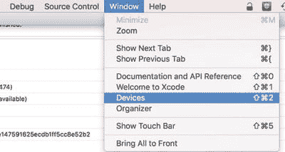

*图 11-1. 从 Xcode `Window` 菜单中选择 `Devices`*

调出设置器窗口后，所有连接的 iOS 设备都应列在左侧面板中。选择您要注册测试的设备，设备信息（包括列为 `identifier` 的 `UDID`）便会显示出来（图 11-2）。

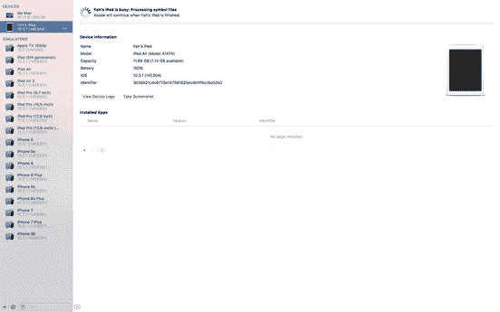

*图 11-2. 从 Xcode 设置器中获取设备 ID*

然后，您可以将 `UDID` 复制并粘贴到配置门户中，以注册您的测试设备。

### 注册应用标识符

注册测试设备后，您需要注册应用标识符，因为每个配置配置文件仅对单个应用 ID 有效。一个应用 ID 对应一个捆绑包 ID（与您在 Unity 播放器设置中为应用指定的 ID 相同），或者当它以星号结尾时匹配多个捆绑包 ID（此时称为通配符应用 ID）。例如，我注册了应用 ID `com.technicat.*`，可以在一个配置配置文件中将其用于我所有的应用，例如 `com.technicat.fugubowl` 和 `com.technicat.hyperbowl`。

> **提示**：创建一个匹配您所有或大部分捆绑包 ID 的通配符应用 ID，这样您就不必为每个捆绑包 ID 都创建新的应用 ID。

### 使用开发配置配置文件

要创建开发配置配置文件，您需要生成一个与该配置文件关联的开发证书。配置门户有关于如何生成和上传证书请求的说明，该请求将产生一个新的开发证书。然后，您可以创建一个与该证书关联的开发配置配置文件。

实际上，一旦您生成了开发证书，配置门户会自动为您生成一个团队配置配置文件，该文件使用星号（`*`）作为应用 ID，从而匹配您的任何捆绑包 ID，这非常方便。但您也可以使用相同的证书和您指定的应用 ID 生成任意数量的其他开发配置配置文件。

### 使用发布配置配置文件

创建发布配置配置文件类似于创建开发配置配置文件。您需要创建一个发布证书，然后创建一个与该证书关联的发布配置配置文件。

> **提示**：通过重复使用同一个证书请求文件来创建开发证书和发布证书，可以节省一些时间。

## 使用 Xcode 设置器

当您的开发配置配置文件可用时，您可以将它们下载到 `Xcode` 中。调出 Xcode 设置器窗口（从 Xcode `Window` 菜单），在侧边栏中选择 `Provisioning Profiles`，然后点击配置文件列表右下角的 `Refresh` 按钮。在提示您输入 Apple 开发者登录信息后，设置器将检索并显示您在配置门户中创建的所有配置配置文件。

图 11-3 显示了我的全部四个配置配置文件。请注意，所有应用 ID 都带有一个数字前缀。这是由配置门户生成的，称为捆绑包种子 ID。就我们这里的目的而言，您可以忽略它。

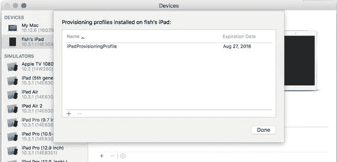

*图 11-3. Xcode 设置器中列出的配置配置文件*

第一个配置配置文件名为 **La Petite Baguette Distribution**，是一个发布配置配置文件，仅匹配一个名为 La Petite Baguette 的应用（一个餐厅应用）。请注意，应用 ID 是完全指定的，与 La Petite Baguette 应用的捆绑包 ID 完全匹配。还要注意，该配置配置文件已过期。

第二个配置文件 **iOS Team Provisioning Profile** 是配置门户自动创建的开发配置配置文件。它匹配任何应用的捆绑包 ID。

第三个配置文件名为 `techdev`，是我创建的一个开发配置配置文件，可用于我的任何应用，因为它会匹配以 `com.technicat` 开头的任何捆绑包 ID。

第四个配置文件是我唯一的发布配置配置文件。它也匹配任何捆绑包 ID 以 `com.technicat` 开头的应用。

请注意过期日期。证书及其关联的配置配置文件会在一年后过期，届时您必须用使用新证书创建的新配置文件替换已过期的配置文件。

您可以在 Xcode 设置器中通过点击左下角的 `+` 按钮来添加一个配置配置文件（图 11-4）。

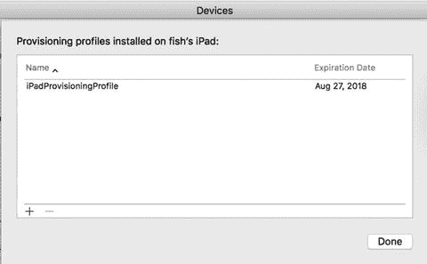

*图 11-4. 添加配置配置文件*


### 构建与运行

现在你可以开始测试设备了。该过程与为 iOS 模拟器构建和运行相同，但首先需要进入 Unity 播放器设置，将`Target SDK`设置为`Device SDK`而非`Simulator SDK`（如图 11-5 所示）。

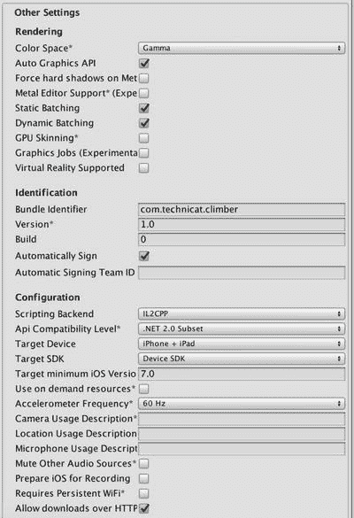

图 11-5.

设备构建的播放器设置

在开始构建之前，由于是针对真实硬件进行构建，你需要确保`Target iOS Version`设置与测试设备兼容（反之亦然），即`Target iOS Version`设置应至少与测试设备运行的 iOS 版本一样旧。但实际上，这也是一个部署决策。支持更旧的 iOS 版本可以增加潜在用户数量，但可能会增加你的支持负担，并阻止使用仅在较新 iOS 版本中可用的功能。事实上，Unity 收集了关于当前运行基于 Unity 应用的 iOS 硬件和版本的数据，可访问[`http://stats.unity3d.com/`](http://stats.unity3d.com/)。只要你创建的 Unity 应用在播放器设置中勾选了`Submit HW Statistics`选项，它就会贡献数据给这些统计。你可以执行`Build and Run`操作，这相当于执行构建、通过双击项目文件手动打开生成的 Xcode 项目（如图 11-6 所示），然后在 Xcode 中点击运行按钮。

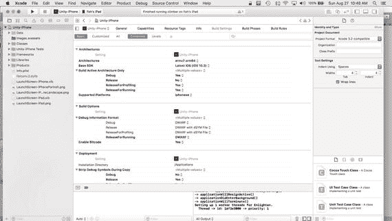

图 11-6.

Unity iOS 构建生成的 Xcode 项目

无论哪种方式，Xcode 都会在连接的测试设备上构建、安装和运行，而不是在 iOS 模拟器中构建和运行。

**提示**：在使用设备进行测试时，最好完全禁用屏幕锁定。如果连接的设备屏幕锁定，从 Xcode 启动运行将会失败。

与 iOS 模拟器一样，任何 Unity 调试文本都会显示在 Xcode 的调试区域（如图 11-7 所示），而不是 Unity 编辑器中的控制台视图。

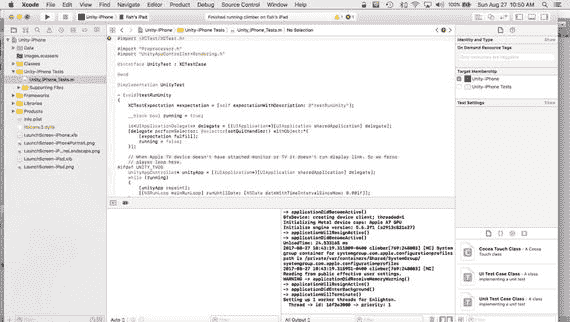

图 11-7.

Xcode 在测试设备上运行应用

**注意**：Xcode 中与 Unity 编辑器视图等同的概念称为区域。与视图不同，Xcode 区域全部使用小写拼写（例如，导航区域、编辑器区域和调试区域）。

你还可以使用 MonoDevelop 调试器，尽管调试 iOS 应用比调试 Unity 编辑器中运行的游戏需要更多的设置。要启用应用以使用 MonoDevelop 进行远程调试，请在构建设置窗口中勾选`Development Build`选项（如图 11-8 所示）。启用`Development Build`选项后，`Script Debugging`选项将变为可用，你也应该勾选它。

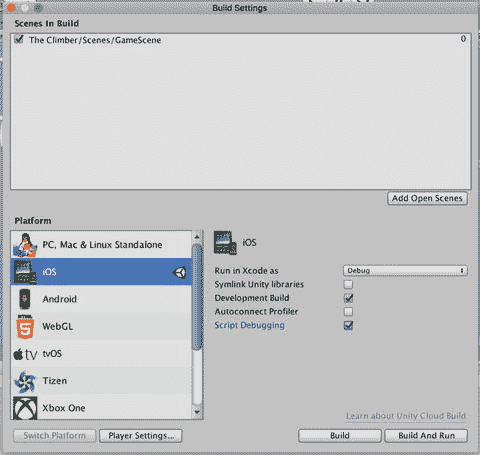

图 11-8.

创建启用脚本调试的开发构建

远程调试与 Xcode 交互时存在问题，包括断点后无法恢复，因此请先执行`Build and Run`操作，将应用安装到测试设备上。在 Xcode 中点击停止以终止测试运行，然后手动在设备上重新启动应用（即像正常启动应用一样点击应用图标）。最后，在 MonoDevelop 中执行`Attach to Process`操作，但不要附加到 Unity 编辑器，而是附加到测试设备（如图 11-9 所示）。

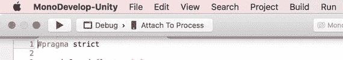

图 11-9.

将 MonoDevelop 调试器附加到 iOS 播放器

当你对设备测试感到满意后，就可以将应用提交到 App Store 了。这不需要在 Unity 内进行任何更改；你只需在 Xcode 中使用分发配置文件（distribution provisioning profile）而非开发配置文件（development provisioning profile）重新构建应用即可。但首先，你需要在 iTunes Connect 中为应用创建一个 App Store 条目。在创建 iTunes Connect 条目之前，你应该准备好一些 App Store 所需的图形素材。

### 准备 App Store 图形素材

你需要为 App Store 准备两种图形素材：一个应用图标和一组针对所有目标设备尺寸的截图。iTunes Connect 在闲置一段时间后容易自动注销并丢失所有更改，因此你最好不要在登录后手忙脚乱地创建图标和截图。

#### 创建图标

iTunes Connect 会要求你提供 1024 × 1024 像素版本的应用图标，格式为`.png`或`.jpeg`，它将伴随应用的 App Store 描述一起出现。如果你在创建应用图标时已经提前规划好，那就万事俱备了。否则，你必须在进入 iTunes Connect 之前现在创建它。

理想情况下，你应该让专业的图标设计师来创建图标，但如果你资金不足且缺乏艺术技能，可以像我一样在紧急情况下做——从 Unity 编辑器游戏视图中截取一张大截图，然后将其缩放到 1024 × 1024 像素。从大尺寸缩小到小尺寸效果更好。将较小的现有图标放大通常效果不佳，并且苹果不鼓励这样做，尽管这种情况可能经常发生，因为直到不久之前，应用提交时上传的还是 512 × 512 像素的图标。

**注意**：如果 App Store 图标与设备上显示的任何应用图标不匹配，苹果可能会拒绝你的应用。因此，如果你为 App Store 创建了一个全新的 1024 × 1024 图标，你应该在 Unity 播放器设置中将其设为默认图标。

#### 截图

iTunes Connect 还会要求你提供三种尺寸的截图：适配 iPhone 4（640 × 960 或 960 × 640）、iPhone 5（640 × 1136 或 1136 × 640）和 iPad（768 × 1024 或 1024 × 768，新 iPad 则需双倍尺寸）。这假设你在 Unity 播放器设置中选择了`iPhone + iPad`作为支持的硬件。如果你只选择了`iPhone`，则无需提供 iPad 截图；如果只选择了`iPad`，则只需提供 iPad 截图。

有三种相当方便的截图方法：使用 iOS 模拟器、通过 Xcode 的 Organizer 窗口从设备截取，以及在设备上同时按下 Home 键和电源键。

使用 iOS 模拟器截图很简单。使用“编辑”菜单中的“截图”命令，生成的截图会保存在桌面上。如果你的游戏在有限的 iOS 模拟器输入方式下表现不佳，使用 iOS 模拟器可能不太方便。但如果你没有 iPhone 或 iPad，这是一种获取截图的方法。

通过 Xcode 截图也几乎同样简单。将设备连接到 Mac，在 Xcode 的 Organizer 窗口中选择设备的“截图”面板。然后在测试设备上运行游戏时，看到喜欢的画面就点击右下角的“新截图”按钮。截图会直接显示在桌面上，方便访问。

我最喜欢的截图方法是直接在设备上同时按下 Home 键和电源键。生成的截图会保存到设备的“照片”应用中，之后可以同步到 Mac 的 iPhoto 中，并可在访达中访问。这种方法让我可以随时随地截图，比如在沙发上，而不必一直连着 Mac。而且，在关键时刻快速截图，比试图抓住鼠标并迅速点击 Xcode Organizer 中的“新截图”按钮要容易得多。


## 在 iTunes Connect 上添加应用

既然已经准备好了图标和截图，就可以开始在 iTunes Connect 中添加应用信息了。登录 [`http://itunesconnect.apple.com/`](http://itunesconnect.apple.com/) 后，你会看到主菜单，如图 11-10 所示。

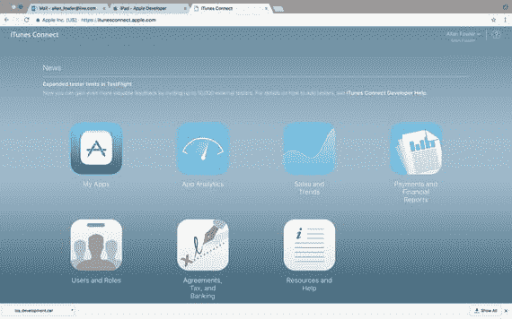

图 11-10. iTunes Connect 的主菜单

点击 `Manage Your Applications` 开始操作。现在你会看到一个已添加应用的列表，以及一个 `Add New App` 按钮。图 11-11 展示了我 iTunes Connect 账户中的这一页面，其中显示了我的一些应用，每个应用都带有版本号和一个根据应用状态使用颜色编码的圆点。

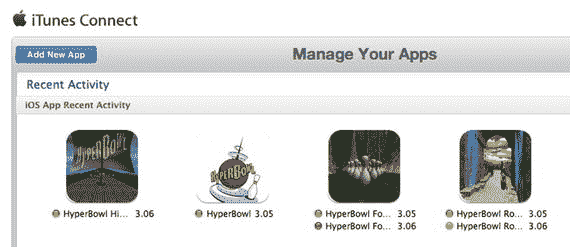

图 11-11. 在 iTunes Connect 中添加或管理应用

绿色圆点表示该应用已在 App Store 上线，红色表示被拒绝。黄色则代表多种含义，但通常意味着应用尚未上传。对于已上线且有更新已提交或正在进行中的应用，系统会同时列出这两种状态。当然，如果这是你的第一个应用，列表中将不会显示任何应用。

### 选择应用类型

当你点击 `Add New App` 时，下一页（图 11-12）会要求你选择应用类型：适用于 App Store 的 iOS 应用，或适用于 Mac App Store 的 macOS 应用。

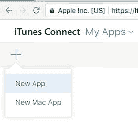

图 11-12. 在 iTunes Connect 中选择新应用类型

点击 `New App` 将弹出一系列网页，每个页面都包含一个待填写的表单，你可以通过点击 `Continue` 按钮进入下一页或下一个表单。

### 输入应用信息

选择 iOS 作为应用类型后，系统会呈现一个用于输入应用名称和 Bundle ID 的页面。这些信息应与 Unity 编辑器的播放器设置中指定的产品名称和 Bundle ID 一致。Bundle ID 列表取自你添加到配置门户的应用 ID 列表。如果你添加了通配符应用 ID，可以选择该 ID，然后指定你所添加应用的特定 Bundle ID 后缀。

例如，在图 11-13 中，我提供了修改后的 Angry Bots 项目（已更名为 Fugu Bots）的信息。通配符 ID `com.technicat.*` 和后缀 `FuguBot` 与我在 Unity 播放器设置中的 Bundle ID `com.technicat.FuguBot` 相匹配。

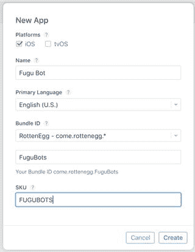

图 11-13. 在 iTunes Connect 上指定应用名称和 Bundle ID

默认语言表示你在提交此应用时，所有资源和描述将使用的主要语言。

`SKU 编码` 字段可以随意填写，但必须在该账户的所有应用中保持唯一，并且在报告中看到时应能轻易识别出对应应用。

### 设置上架时间和价格

在应用信息页面继续操作后，iTunes Connect 会要求你指定应用的价格以及希望在 App Store 上架的时间（图 11-14）。

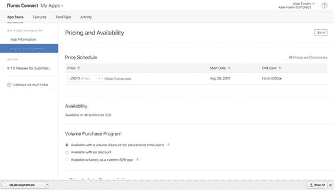

图 11-14. 在 iTunes Connect 上设置应用上架时间和价格

上架时间取决于 Apple 何时批准应用。因此，如果你指定的上架日期是提交日的一周后，而审核耗时两周，那么应用将在审核通过之日上架。如果你希望应用尽快发布，只需使用默认日期（即你输入信息的当天）即可。

价格范围从免费到 0.99 美元、1.99 美元、2.99 美元，以此类推。无需过分担心定价是否准确，以后随时可以更改。

### 设置语言和类别

第一个部分是关于语言和类别信息（图 11-15）。

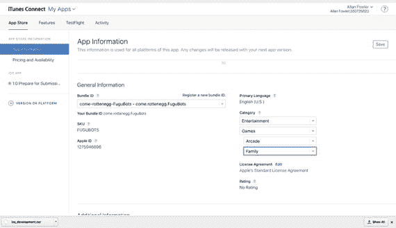

图 11-15. iTunes Connect 上的应用版本、类别和版权信息

选择合适的类别和子类别。你也可以选择二级类别，以增加应用的曝光度。

### 准备提交

`Prepare for Submission` 部分对于营销来说最为重要（图 11-16）。

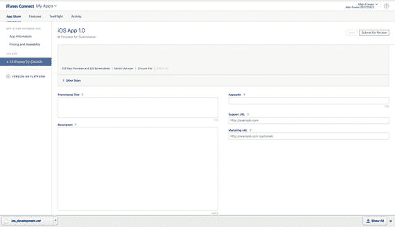

图 11-16. iTunes Connect 中应用的产品描述界面

该部分包括应用的描述（将显示在 App Store 上）以及有助于应用在 App Store 搜索中排名靠前的关键词。你还需要提供支持网址，并且链接到营销网址是有利的。

### 上传图标和截图

在此处上传你之前准备好的图标和截图（图 11-17）。图标需符合 Apple 的要求，使其与应用内置的应用图标相似，否则应用可能会被 Apple 拒绝。

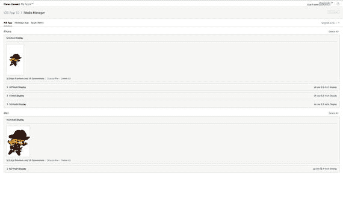

图 11-17. 在 iTunes Connect 中上传应用图标和截图

iTunes Connect 不允许你在未上传图标和至少一张截图的情况下继续操作，不过你实际上需要为应用运行的每种屏幕类型（宽高比）上传截图。如果 Unity iOS 应用是为 iPhone 和 iPad 构建的，那么你需要为两个类别（基本对应 iPhone 和 iPad）上传截图。

> **注意**：iTunes Connect 可能会很快超时。如果在你完成此页面之前超时，整个应用描述将消失，你将不得不重新开始。这就是我们事先准备好图标和截图的原因。

### 通用应用信息

完成 `General App Information`。在此部分，输入版权信息并填写评级信息（图 11-18）以及开发者的联系信息（图 11-19）。

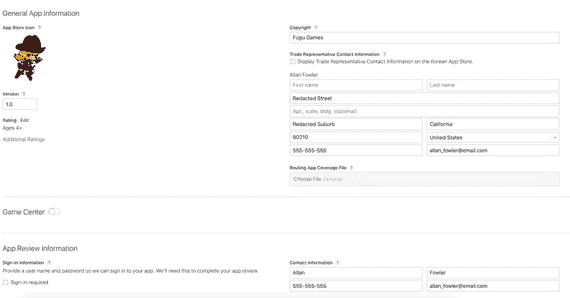

图 11-19. 完成通用应用信息部分

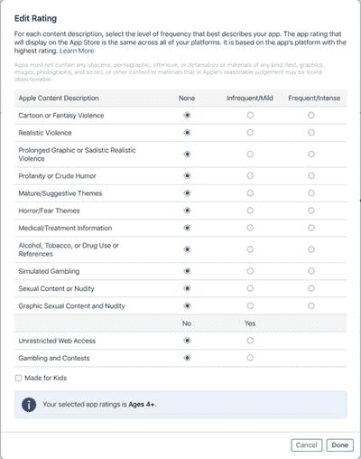

图 11-18. 在 iTunes Connect 中设置应用内容评级

评级部分相当直观（图 11-18）。请填写该部分，所有字段均为必填项。在附加信息部分，有一个在 App Store 中查看的链接。该信息可以在你提交游戏审核后进行更新。稍后你将回到这里。在提交给 Apple 审核之前，你还需要添加更多关于游戏的信息。

如果评级与内容不匹配——至少在 Apple 看来——应用可能会被拒绝。例如，我曾尝试提交一个 `Angry Bots` 版本，但被拒绝，因为游戏包含射击元素（尽管是针对愤怒的机器人），根据 Apple 的规定，这被视为逼真的暴力，应标记为频繁/强烈。


#### 将构建包上传到 iTunes Connect

有两种方式可以将构建包上传到 iTunes Connect，即直接从 Xcode 或 Application Loader 上传。这里将使用 Xcode。在 Xcode 中，当构建包准备就绪时，将目标设备选为 Generic iOS Device（如图 11-20 所示）。

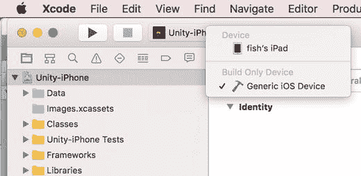

图 11-20. 设置 Generic iOS Device 设备

现在，将产品设置为归档文件。为此，请从主菜单栏中选择 `Product` ➤ `Archive`（如图 11-21 所示）。

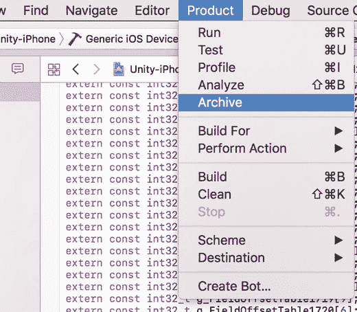

图 11-21. 从 Product 菜单中选择 Archive

当 Xcode 完成归档文件的编译后，你将看到 Archives 屏幕，其中包含一个用于上传到 App Store 的按钮（如图 11-22 所示）。点击此按钮后，Xcode 将尝试将构建包上传到你的 iTunes Connect 帐户。如果你已正确设置标识符设置，并在 Xcode 中正确登录了你的 iTunes Connect 帐户，此文件将成功上传。

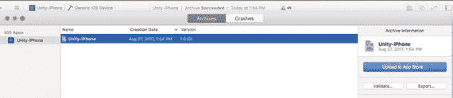

图 11-22. 上传构建包

#### 提交以供审核

填写完必填项和任何可选的附加信息后，你现在就可以提交以供审核了（如图 11-23 所示）。

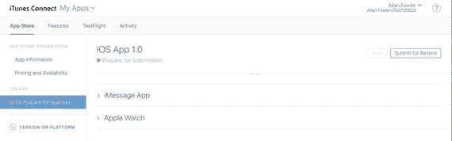

图 11-23. 处于“准备提交”状态的应用

点击 `Submit for Review` 后，你可能需要完成一些关于出口合规性的问题，并且如果需要，还需上传加密授权文件。

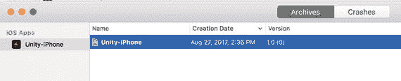

图 11-24. Xcode Organizer 窗口中的归档分发构建包

提交应用后（如图 11-24 所示），接下来就是等待 Apple 批准或拒绝。

> **提示**
> 
> 提交后，建议重新登录 iTunes Connect 并确认应用状态为“等待审核”。即使应用的二进制文件是有效的，审核也可能会因为缺少截图等原因而被搁置。

你最终会收到一封电子邮件，通知你应用已在 App Store 上架、被拒绝，或是 Apple 需要更多时间进行审核。此回复通常在提交后的几周内到达，但我也曾遇到过应用在 24 小时内被接受，或在两个月后被拒绝的情况。当审核期延长时，Apple 通常会发送一封电子邮件，说明需要更多时间来审核你的应用。

#### 为被拒绝做好准备

如果应用被拒绝，电子邮件将指示你返回 iTunes Connect 中的应用，并点击 Resolution Center 按钮，以查看并选择性地回复拒绝原因。原因可能包括技术问题、崩溃 Bug，或违反 Apple 的 App Store 审核指南（注册成为 iOS 开发者后，你可以在 Apple Developer 网站上阅读这些指南）。

如果你决定修改应用，则必须再次点击 `Reject Binary` 和 `Ready for Upload` 才能重新上传。如果你认为拒绝理由不合理，Resolution Center 也允许你向 App Review Board 提出申诉。

如果应用被接受，并且你在 iTunes Connect 中选择了自动发布选项，应用将很快出现在 App Store 上。否则，应用会处于“等待开发者发布”状态，直到你登录 iTunes Connect，点击应用的 `View Details`，再点击 `Release this Version` 按钮。

#### 更新应用

在应用获得批准后，你可以随时返回 iTunes Connect 的应用页面并点击 `View Details` 来编辑应用描述，修改后的文本将在几小时内显示在 App Store 上。iTunes Connect 页面还会显示一个 `Add New Version` 按钮。点击此按钮将引导你通过一个简化版的原始提交流程来提交应用的更新。除了 Bundle ID 之外，你几乎可以更改所有详细信息，但唯一必须更改的是递增 Bundle Version。

> **提示**
> 
> 更新应用时，请记得同时在 iTunes Connect 和 Unity player 设置中递增 Bundle Version。

#### 跟踪销量

当应用的首个版本出现在 App Store 上后，你可以通过登录 iTunes Connect 并点击 `Payments and Financial Reports` 链接来跟踪其下载量和收入（如果是付费应用）。结果页面会显示一个基于时间的销售图表、按国家/地区划分的销售明细，以及生成报告的选项（如图 11-25 所示）。

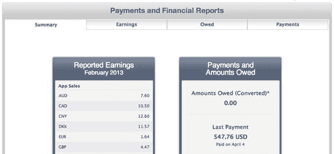

图 11-25. iTunes Connect 中的“付款与财务报告”页面

#### 发放促销代码

对于应用的每个版本，Apple 都会提供 100 个促销代码，可用于在 App Store 上免费下载该应用（即使是免费应用也提供促销代码，尽管在这种情况下使用它们意义不大）。要获取应用的促销代码，请在 iTunes Connect 中点击该版本的 `View Details`，然后点击右上角的 `Promo Codes` 按钮（如图 11-26 所示）。

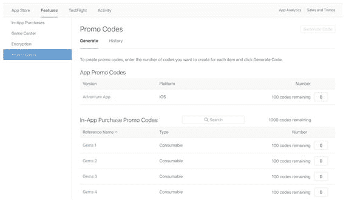

图 11-26. 在 iTunes Connect 中点击已上架应用的 View Details

```
XY9LJRKMN7JM
TANFXAHR9EM9
XP6TMAFFHFLT
TXJ44ELTHETL
F9W3WEK7JL4Y
```
*代码清单 11-1. 包含五个促销代码的促销代码文件*

代码一旦下载，有效期即为 28 天，即使在此期间应用进行了更新。

> **提示**
> 
> 由于代码的有效期是从下载日期开始计算的，因此你可以根据需要从 iTunes Connect 下载代码，而不是一次性下载全部 50 个，这样可以节省代码。

这些代码不再允许用户在 App Store 上为应用撰写评论，但对于发送给托管自己评论的网站来说，这些代码是理想的选择。

## 进一步探索

在 Unity 编辑器和 iOS 模拟器中测试 Unity iOS 应用非常方便，但无法替代在真机上的测试！好消息是，为真实硬件进行构建在 Unity 方面改动不大（实际上，只需在 Player 设置中将 SDK 设为 Device SDK）。坏消息是，你必须完成整个 Apple 开发者注册流程，为你的测试设备和配置文件完成 Provisioning Portal 设置，并为你的所有应用完成 iTunes Connect 设置。从某种意义上说，这是你成为 iOS 开发者的一章！

既然已经完成了这一步，你可以再次离开 Angry Bots 项目，回到你的保龄球游戏中。本书的剩余部分将用于将该游戏适配到 iOS。不过，你还会再次用到 iTunes Connect。在后续整合 Game Center（第 14 章）和 iAd（第 15 章）时，你将再次使用 iTunes Connect。

### Unity 手册

由于 Unity iOS 的模拟器和设备构建步骤几乎相同，上一章中提到的 Unity 手册章节也适用于本章。此外，Unity 手册中“iOS 开发入门”部分有一个页面，简要列出了 Apple 提交应用到 App Store 所需的步骤；而“高级”部分中的“调试”页面则解释了如何将 MonoDevelop 调试会话附加到在设备上运行的 Unity iOS 应用。


### Apple 开发者网站

获取所有 Apple 开发者信息的途径始于 Apple 开发者网站（`http://developer.apple.com/`），因此这应该是你首先访问的地方。在那里，你可以找到 iOS 开发者计划（以及其他 Apple 开发者计划）的说明，并开始注册流程。即使在注册完成之前，你也可以浏览 iOS 开发者中心，其中包含 iOS 开发者库，而该库又包含了 iTunes Connect 开发者指南（列在“语言和实用工具”下）。

> **提示：** iOS 开发者库中的文档也可以在 Xcode 的 Organizer 中找到。从你在 Organizer 中执行的所有工作（配置文件、截图、应用提交）可以看出，你可能会把大部分 Xcode 时间花在那里！

一旦你的注册获得批准，你就可以访问 iTunes Connect 网站和 Apple 开发者网站上的 Provisioning Portal，以完成本章涉及的移动设备配置和应用提交流程。

