# 12. 呈现：屏幕与图标

现在，关于 Climber 的短暂休息已经结束，构建和运行 Unity iOS 项目的基础知识也已涵盖，是时候继续你的保龄球游戏工作，并让它成功运行在 iOS 上了！

从现在开始，我通常会假设你通过在设备上构建并运行来进行测试，但在许多情况下，你也可以在 Unity Remote 的 Editor 中进行测试，或者在 iOS 模拟器中进行测试。

> **提示：** 始终在 Unity Editor 中进行一些测试以捕获在设备上测试时可能不会出现的错误是个好主意。如果你在设备上遇到奇怪的问题，请返回 Editor，看看能否在那里进行调试。

本章重点在于让游戏在 iOS 设备上正确显示。这包括确保游戏以正确的方向显示，并且所有游戏元素在屏幕上以合适的分辨率呈现，这是让游戏可玩的前提（当你无法阅读或点击“播放”按钮时，很难开始游戏）。

此外，除了提供必需的属性（如应用名称和图标）之外，你还会通过添加启动画面和熟悉的 iOS 活动指示器来增加一些润色，以指示游戏正在加载。

其中一些呈现细节可能看起来只是外观上的，并且实现起来足够简单，可以被推迟到项目结束时（通常也确实如此），但简单的工作可以也应该尽早完成。能够快速完成的任务有助于你进入开发状态。而当你在加班加点努力完成游戏时，你最不想看到的就是那些本可以提前完成却未完成的工作。

此外，打包很重要。事实上，在创建桌面软件时，我喜欢从安装程序开始，因为这是客户的第一次体验。对于 iOS 应用，客户首先看到的是应用图标和名称，然后是启动应用时的启动画面。这将形成客户对应用是精致还是业余的第一印象。而你，是应用的第一位客户。如果应用从一开始就像成品一样被打包，你对自己的项目会感觉更好，对你想要的应用也会有更清晰的概念。而且你永远不知道什么时候需要演示它！

对应的 Unity 项目可以在线获取，网址为 `http://www.apress.com/9781484231739`。像往常一样，我建议你手动输入脚本，而不是从在线项目中复制。但项目文件中包含一些将用于图标和启动画面的纹理，因此，从第 12 章的在线项目中，将 Textures 文件夹中的额外文件复制到你保龄球项目的 Textures 文件夹中（记住，你可以将文件拖拽到 Project 视图中）。你应该有三个不同分辨率的 Fugu Games 启动纹理、一个显示书籍封面（本书封面）的启动画面，以及一个图标纹理（图 12-1）。

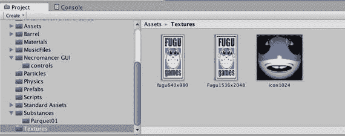

**图 12-1.** 本章的纹理，从 `http://www.apress.com/9781484231739` 复制

## 保龄球游戏 for iOS

在 Unity Editor 中，调出 Project Wizard（在 File 菜单中选择 Open Project），选择你上次在第 9 章结束时、切换到 Climber 之前的保龄球项目。你现在应该熟悉切换构建目标的过程了。

调出 Build Settings 窗口（在 File 菜单中选择 Build Settings），选择 iOS 作为构建目标，然后点击 Switch Platform 按钮。

如果你在第 9 章安装了 Necromancer GUI，在将构建目标切换到 iOS 后，Console 视图中会出现一些脚本错误，因为该包中的一个测试脚本没有使用 `#pragma strict` 编写，并且缺少一些类型声明。这可以通过简单地从 Project 视图中移除 `GUITestScript.js`，或者用 `#if !UNITY_IPHONE` 包裹其所有内容来解决（更进一步，进入并修复代码，为函数参数附加 `:int` 可以加分）。移除该脚本将禁用 Necromancer GUI 测试场景，但除此之外，GUISkin 在你的暂停菜单中仍然可用。本章引入的所有更改，无论是否使用 Necromancer GUI 都能正常工作（但截图中显示了 Necromancer GUI，因为它更美观）。

一旦资源重新导入完成，进入 Edit 菜单，在 Settings 下选择 Player，以在 Inspector 视图中调出 player settings。在 Cross-Platform Settings 区域，填写 Company Name 和 Product Name（应用名称）字段。选择 iOS 标签页以显示 iOS player settings，并填写应用的 bundle ID（图 12-2）。

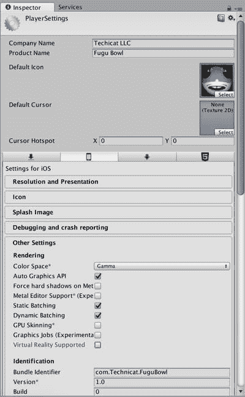

**图 12-2.** FuguBowl player settings

HyperBowl 的原始版本和 iOS 版本都是竖屏模式的游戏（并且事实证明，竖屏模式最适合将在下一章实现的滑动滚动控制），因此让我们将此游戏限制为竖屏模式。

因此，在 player settings 中将 Default Orientation 属性设置为 Portrait（图 12-3）。

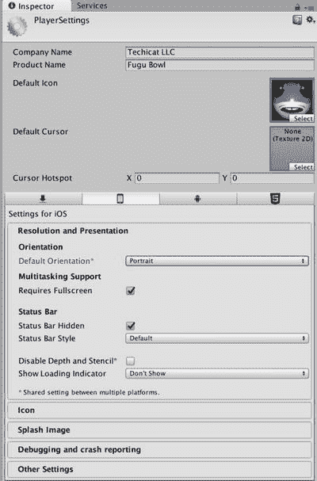

**图 12-3.** player settings 中的竖屏方向


### 缩放 GUI

目前您已完成了构建和运行所需的设置，如果在一台分辨率为 320 × 480 像素的低分辨率 iOS 设备上运行，游戏初始画面看起来还不错。但在任何较新的设备上（屏幕分辨率至少是前者的两倍），暂停菜单会显得非常小，甚至难以看清或点击单个按钮。

要缩放 GUI，首先需要确定要使用的缩放比例，即当前屏幕宽度除以最初针对的目标屏幕宽度。GUI 在 320 × 480 像素的 iPhone 3GS 上显示效果尚可，因此我们假设目标基础屏幕宽度为 320。那么，例如在分辨率为 1136 × 640 像素的 iPhone 5 上运行时，就需要对 GUI 进行放大。

下一步是应用缩放比例。在 UnityGUI 中，可以通过设置静态变量 `GUI.matrix` 来实现，该变量是一个变换矩阵。在计算机图形学中，变换矩阵包含并应用平移（位置变化）、旋转和缩放。

实际上，`Transform` 组件的局部位置、旋转和缩放对应着该 `GameObject` 的一个 4×4 变换矩阵。而世界坐标的位置、旋转和缩放则通过组合（相乘）一个 `GameObject` 的父级 `GameObject` 的所有变换矩阵计算得出。在过去，编写计算机图形学程序时必须包含这些线性代数代码。如今可以让游戏引擎隐藏这些细节，但此处您将稍微体验一下。

### 缩放记分板

我们先从记分板开始，因为它稍微简单一些。对 `FuguBowlScoreboard` 脚本进行清单 [12-1] 所示的修改。新增了一个名为 `baseScreenWidth` 的变量，用于指定基础屏幕宽度，默认值为 iPhone 3GS 的 320 像素宽度。该变量是公共的，因此您可以在 Inspector 视图中调整它。

然后，在 `OnGUI` 函数的开头，添加两行代码来构造缩放矩阵并将其赋值给 `GUI.matrix`。（将矩阵放在 `OnGUI` 开头意味着它将在任何 GUI 渲染开始之前生效。）

```
#pragma strict
var style:GUIStyle; // 自定义外观
var baseScreenWidth:float = 320.0; // 对于 iOS，我们假设渲染的目标屏幕宽度
function OnGUI() {
#if UNITY_IPHONE
var guiScale:float = Screen.width/baseScreenWidth;
GUI.matrix = Matrix4x4.TRS (Vector3.zero, Quaternion.identity, Vector3(guiScale, guiScale, 1));
#endif
for (var f:int=0; f<10; f++) {
var score:String="";
var roll1:int = FuguBowl.player.scores[f].ball1;
var roll2:int = FuguBowl.player.scores[f].ball2;
var roll3:int = FuguBowl.player.scores[f].ball3;
switch (roll1) {
case -1: score += " "; break;
case 10: score +="X"; break;
default: score += roll1;
}
score+="/";
if (FuguBowl.player.IsSpare(f)) {
score +="I";
} else {
switch (roll2) {
case -1: score += " "; break;
case 10: score +="X"; break;
default: score += roll2;
}
}
if (f==9) {
score+="/";
if (10==roll2+roll3) {
score +="I";
} else {
switch (roll3) {
case -1: score += " "; break;
case 10: score +="X"; break;
default: score += roll3;
}
}
}
GUI.Label(Rect(f*30+5,5,50,20),score,style);
var total:int=FuguBowl.player.GetScore(f);
if (total != -1) {
GUI.Label(Rect(f*30+5,20,50,20)," "+total,style);
}
}
}
```

**清单 12-1.** 为 `FuguBowlScoreboard.js` 脚本添加缩放功能

新代码仅针对 iOS 平台（虽然它在任何平台上都能运行），因此新增的代码行被包裹在 `#if UNITY_IPHONE` 和 `#endif` 之间。`UNITY_IPHONE` 是一个内置的预处理器定义，仅在构建目标为 iOS 时被定义（您也可以使用 `UNITY_IOS`）。最终结果是，这段附加代码仅在 iOS 上作为执行代码生效，而在构建其他目标时基本消失（之所以不为 `baseScreenWidth` 添加条件，是因为您不希望更改构建目标时丢失其 Inspector 视图中的设置）。

在两行实际代码中，第一行根据 `Screen.width`（当前屏幕宽度）和 `baseScreenWidth`（GUI 编码时针对的目标屏幕宽度）计算出需要缩放 GUI 的比例。结果赋值给局部变量 `guiScale`。

您可能曾疑惑为什么将 `baseScreenWidth` 声明为 `float` 而不是 `int`。原因就在于此：`Screen.width` 是 `int` 类型，如果用 `int` 除以 `int`，编译器会假定您希望结果也是 `int` 类型。例如，用 640（iPhone 4）除以 320 得到 2 时没问题。但如果在 iPad 2 上运行时，将 768 除以 320，结果会被向下取整为 2，这就不正确了。但只要参与运算的两个数中有一个是 `float` 类型，编译器就会将整个运算视为浮点数计算。

> **注意：** 要警惕那些将 `int` 作为输入却期望得到 `float` 结果的操作。这是常见的错误来源。

计算结果传递给 `Matrix4x4.TRS` 方法，该方法会构建一个包含平移、旋转和缩放的 4x4 矩阵。平移为 `Vector3.zero`（x、y、z 均为 0），旋转为 `Quaternion.identity`（表示无旋转的恒等四元数），以及表示缩放的 `Vector3`。根据屏幕尺寸的缩放比例应用于 x 和 y 方向，而 z 轴保持不变，因为该方向指向屏幕内部。


### 缩放暂停菜单

缩放暂停菜单的流程几乎相同。在`FuguPause`脚本的`OnGUI`函数开头，添加同样的`baseScreenWidth`公共变量以及设置`GUI.matrix`的代码（清单 12-2）。

```
var baseScreenWidth:float = 320.0; // iOS 目标屏幕宽度
function OnGUI () {
if (IsGamePaused()) {
#if UNITY_IPHONE
var guiScale:float = screenWidth/baseScreenWidth;
GUI.matrix = Matrix4x4.TRS (Vector3.zero, Quaternion.identity, Vector3(guiScale, guiScale, 1));
#endif
if (skin != null) {
GUI.skin = skin;
} else {
GUI.color = hudColor;
}
switch (currentPage) {
case Page.Main: ShowPauseMenu(); break;
case Page.Options: ShowOptions(); break;
case Page.Credits: ShowCredits(); break;
}
}
}
Listing 12-2.
在 FuguPause.js 中缩放暂停菜单
```

不过，还需要另一处修改。`BeginPage`函数使用`Screen.width`来居中 GUI，因此你需要改用`baseScreenWidth`。清单 12-3 展示了这一代码变更。

```
function BeginPage(width:int,height:int) {
#if !UNITY_IPHONE
GUILayout.BeginArea(Rect((Screen.width-width)/2,menutop,width,height));
#else
GUILayout.BeginArea(Rect((baseScreenWidth-width)/2,menutop,width,height));
#endif
}
Listing 12-3.
修改后的 BeginPage 函数以适配缩放后的 GUI
```

注意这里使用了`#if !UNITY_IPHONE`。感叹号表示“非”，因此第一行实际代码适用于除 iOS 以外的所有构建目标，另一行则仅用于 iOS。你也可以调换这两行代码的顺序，以`#if UNITY_IPHONE`开头。

借此机会，你应当从暂停菜单中移除“退出”按钮，因为苹果会拒绝任何提供退出选项的应用。`FuguPause`脚本中`ShowPauseMenu`函数的“退出”按钮已经通过检查`UNITY_WEBPLAYER`预处理定义，从 Unity Web 播放器构建中排除了，因此你只需再添加`UNITY_IPHONE`的检查即可（清单 12-4）。

```
function ShowPauseMenu() {
BeginPage(150,300);
if (GUILayout.Button ("继续")) {
UnPauseGame();
}
if (GUILayout.Button ("选项")) {
currentPage = Page.Options;
}
if (GUILayout.Button ("制作人员")) {
currentPage = Page.Credits;
}
#if !UNITY_IPHONE && !UNITY_WEBPLAYER
if (GUILayout.Button ("退出")) {
Application.Quit();
}
#endif
EndPage();
}
Listing 12-4.
从 FuguPause.js 的 iOS 构建中排除退出按钮
```

只有当构建目标既不是 iOS 也不是 Web 播放器时（即`#if !UNITY_IPHONE && !UNITY_WEBPLAYER`条件为真），退出按钮才会被包含在构建中。现在构建游戏，你应该能在设备（或 iOS 模拟器）上看到暂停菜单会根据屏幕分辨率放大显示，并且没有退出按钮，如图 12-4 中 iPhone 4 的截图所示。

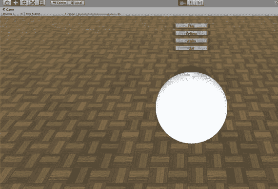

Figure 12-4.
缩放后的暂停菜单

## 设置图标

默认情况下，应用的图标会是 Unity 标志。图 12-6 展示了 Unity Technologies 在 App Store 上发布的几个演示应用的图标。

如果现在进行构建，由于你未在 iOS 播放器设置中选择“已渲染图标”，苹果会自动为图标添加光泽效果。

要自定义图标，你可以将任意纹理拖入播放器设置的“默认图标”字段中。让我们使用从本章项目文件（可在[`www.apress.com/9781484231739`](http://www.apress.com/9781484231739)获取）`Textures`文件夹中复制的`Icon1024`纹理。我通常会在文件名中注明原始纹理尺寸（此处为 1024 × 1024 纹理），这能为分配图标和启动画面纹理节省大量时间。

由于你将纹理用作图标，应当适当调整导入设置。

在项目视图中选择`Icon1024`纹理，然后在检查器视图中，将`纹理类型`设置为`GUI`而非`Texture`（图 12-5）。这将防止 Unity 应用适合 3D 模型纹理但不适合 GUI 显示的设置。例如，用于模型的纹理尺寸应为 2 的幂，如 256 × 256 或 512 × 512，因为这是图形硬件所偏好的运算尺寸，而且纹理无论如何都会在模型上拉伸。但 GUI 纹理通常应保持原始分辨率，因为它们通常根据预期显示尺寸来设定（通常不是 2 的幂分辨率）。你可以将`纹理类型`切换为`高级`，来比较`Texture`和`GUI`预设纹理类型下的实际设置（例如，先选择`Texture`，然后切换到`高级`；再选择`GUI`并切换到`高级`）。在`高级`模式下，你可以覆盖任何预设值，以便更精细地控制导入设置。

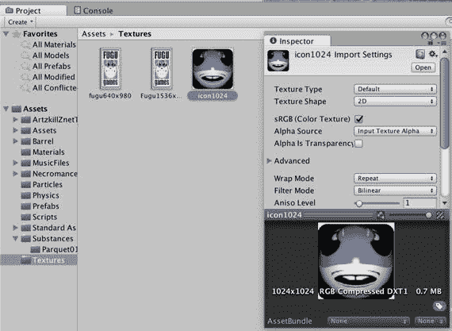

Figure 12-5.
图标纹理的导入设置

提示

如果你要将一个纹理用于两种不同用途，请复制一份，以便为它们应用不同的导入设置。

在`纹理类型`区域下方，可以指定纹理的最大尺寸和压缩级别。如果你将压缩过的纹理用作图标，Unity 会在构建时生成警告，正确指出压缩纹理作为图标可能效果不佳。选择`默认`选项卡，以便这些设置适用于所有平台（除非被覆盖），将`最大尺寸`设置为`1024`以避免纹理被缩放，并将`格式`设置为`真彩色`以获得全彩分辨率且无压缩。点击`应用`以调整后的设置重新导入纹理，底部预览区域将反映新的格式、尺寸和内存占用。

现在，将图标纹理拖入跨平台区域播放器设置的`默认图标`字段中。查看 iOS 设置的图标折叠面板（图 12-6）。只要未勾选“覆盖 iPhone”复选框，默认图标会自动缩放以适配所有其他图标尺寸（图 12-6）。

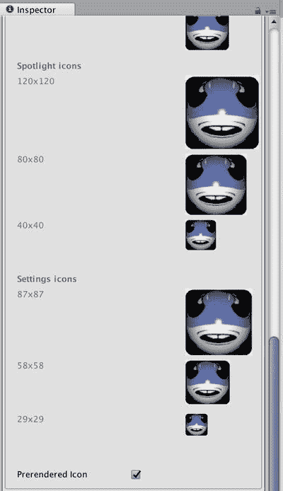

Figure 12-6.
播放器设置中默认图标缩放为不同尺寸的图标

不同的图标尺寸对应不同 iOS 设备的屏幕分辨率：

*   57 × 57：第四代之前的任何 iPhone 或 iPod touch（iPhone 3GS 或第三代 iPod touch）
*   114 × 114：第四代及以后的 iPod touch 和 iPhone
*   72 × 72：初代 iPad、iPad 2 和 iPad Mini
*   144 × 144：“新”iPad（或者按我的叫法，iPad 3）

理想情况下，每个尺寸都应该有专属的图标，这时你需要勾选`覆盖`复选框，然后将不同版本的图标拖入相应的方框。任何未填充的方框都会使用`默认图标`文件。但 Unity 在缩放纹理方面表现出色（向下缩放远优于向上缩放），因此我经常重复使用上传到 iTunes Connect 应用描述的同一张 1024 × 1024 纹理。

提示

如果你没有为 iTunes Connect 和播放器设置使用相同的图标文件，请确保各个图标至少看起来相似。我曾有一个应用因为 iTunes Connect 中的图标与设备上显示的应用图标不相似而被拒绝。

我建议你始终选择`已渲染图标`选项，以避免苹果自动添加光泽效果。

除了可选的光泽效果，通过 Xcode 执行的构建部分还会自动为图标圆角并添加投影。所以，不要自己做这些事！只需保持正方形、直角且无特殊边框即可。


## 设置启动画面

所有 iOS 应用在启动时都会显示一个静态的“启动”画面。与默认的应用图标类似，许多 Unity 构建的应用中的启动画面会显示 Unity 徽标（图 12-7）。


图 12-7. 默认的 Unity 启动画面

除非你拥有 Unity 的 Plus 或 Pro 版本，否则无法更改 Unity 的启动画面。不过，如果你使用个人版，可以添加一个启动图像。启动图像折叠菜单位于 iOS 设置中图标折叠菜单的下方，与图标选择一样，它提供了多个分辨率的插槽，适用于各种 iOS 屏幕，同时也支持竖屏和横屏方向（图 12-8）：

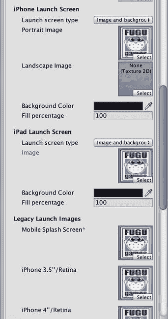
图 12-8. 适用于不同屏幕分辨率和方向的启动画面

- 移动设备启动画面：320 × 480，适用于第四代之前的任何 iPod touch 或 iPhone（即 iPhone 4 之前的产品）
- iPhone 3.5 英寸/Retina：640 × 960，适用于 iPhone 4、iPhone 4S 和第四代 iPod touch 的 Retina 显示屏
- iPhone 4 英寸/Retina：640 × 1136，适用于 iPhone 5 和第五代 iPod touch
- iPhone 4.7 英寸/Retina：750 × 1334，适用于 iPhone 6
- iPhone 5.5 英寸/Retina：1242 × 2208，适用于 iPhone 6 Plus 及更新机型
- iPhone 5.5 英寸横屏/Retina：2208 × 1242，适用于 iPhone 6 Plus 及更新机型
- iPad 竖屏：768 × 1024，适用于初代 iPad 和 iPad 2
- iPad 横屏：1024 × 768，适用于初代 iPad 和 iPad 2
- iPad 竖屏/Retina：1536 × 2048，适用于新 iPad（iPad 3 及更新机型）的 Retina 显示屏
- iPad 横屏/Retina：2048 × 1536，适用于新 iPad（iPad 3 及更新机型）的 Retina 显示屏

Unity 并没有一个能自动调整大小以适配所有启动分辨率的默认启动画面，因此你需要为游戏将使用的分辨率和方向填充启动画面框。由于在“分辨率和演示”设置中只选择了竖屏方向，因此只需要分配竖屏启动画面。与图标类似，启动画面可以是任何纹理，Unity 会根据需要缩放它们，但使用已经是目标大小的纹理可以获得最佳效果。你应该使用适合你公司或游戏的内容。

注意

苹果公司建议启动画面看起来像游戏的实际画面，但通常做法是只显示公司徽标。就我个人而言，我认为显示一个像无响应的游戏画面一样的屏幕会让人感到困惑。

将每个启动画面纹理从 Textures 文件夹拖到播放器设置中匹配的启动画面框中（图 12-8），即将 `Fugu320×480` 拖入 `Mobile Splash Screen`，将 `Fugu640×960` 拖入 `iPhone 3.5"/Retina`，并将 `Fugu1536×2048` 拖入 `High Res. iPad Portrait`。`iPhone 4"/Retina` 选项需要一个纹理，因此将最接近的纹理 `Fugu640×9` 拖入其中。而 `Fugu1536×2048` 可用于 `iPad Portrait`。

## 创建第二个启动画面

虽然你在 Unity iOS Basic 中无法更改内置的启动画面，但可以制作一个紧接着内置启动画面显示的启动画面。你只需创建一个场景，在屏幕上显示启动纹理几秒钟，然后加载第一个游戏场景。如果你希望拥有多个启动画面，这在 Unity Plus 和 Pro 版本中也同样有用。例如，在 HyperBowl 中，我通过内置启动画面显示了一些 HyperBowl 艺术作品，然后在第二个启动画面中显示了我的 Fugu Games 徽标。

### 创建启动场景

从 `File` 菜单调用 `New Scene` 命令来创建一个新的空场景。将其保存为 `Splash`。打开 `Build Settings` 窗口，点击 `Add Open Scenes` 将新场景添加到你当前的构建中。它会出现在场景列表的底部，因此将其拖到顶部。此时其场景索引应显示为 0，表示它是第一个被加载的场景（图 12-9）。

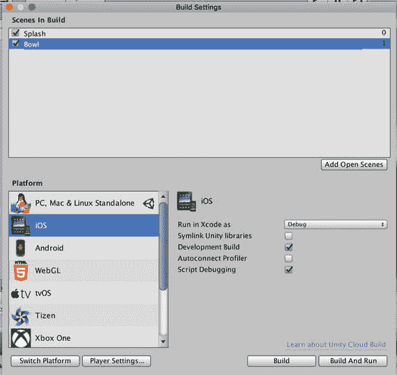
图 12-9. 添加了启动场景后的构建设置

### 创建启动画面

显示全屏纹理的最简单方法是使用 UI 元素（或用户交互）。在启动场景中，进入 `GameObject` 菜单，选择 `UI`，然后选择 `Raw Image`（图 12-10）。

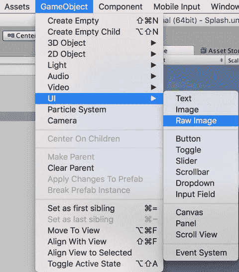
图 12-10. 创建一个 UI 图像

将生成的 `GameObject` 重命名为 `Screen`，并在 Inspector 视图中检查它。新创建的图像需要居中显示在屏幕上（图 12-11）。与 `GUITexture` 不同，`RawImage` 使用归一化屏幕坐标：`x` 和 `y` 的范围从 0 到 1，其中 `0,0` 是屏幕的左上角，`1,1` 是右下角，因此将 `x` 和 `y` 设置为 `0.5` 表示纹理在屏幕上居中显示。

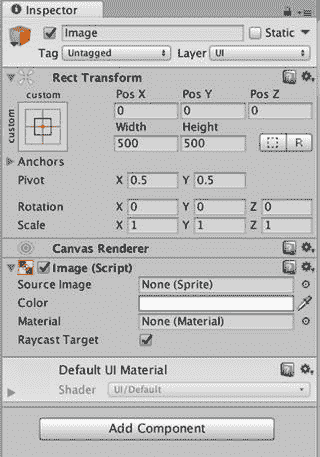
图 12-11. 默认的 GUITexture

你已经将图像定位在 `0,0,0`，并使其大小为 `400 × 400`。将 Textures 文件夹中的某个纹理从 Project 视图拖到 `RawImage` 组件的 Texture 字段中。为了让纹理铺满整个屏幕，将缩放比例改为 `1,1,1`（图 12-12）。

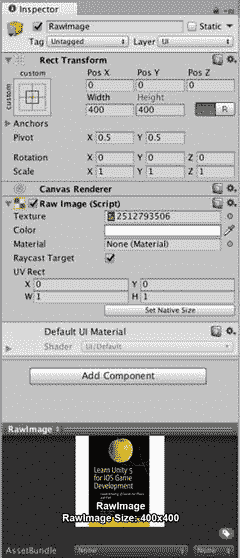
图 12-12. 全屏 UI

现在，如果你运行游戏，将会在屏幕上看到启动纹理。当在设备或 iOS 模拟器上运行时，启动纹理将会在内置启动画面之后出现（图 12-13）。

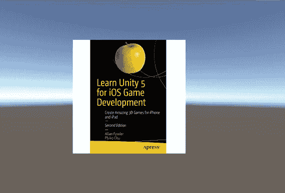
图 12-13. 第二级启动画面


#### 加载下一个场景

作为启动屏，此场景应停留几秒钟，然后开始加载游戏场景。与任何真实游戏关卡一样，此场景可以使用一个主逻辑脚本，因此创建一个新的 JavaScript 脚本，命名为 `FuguSplash`，并添加清单 12-5 中的内容。

```
#pragma strict
var waitTime:float=2; // 以秒为单位
var level:String; // 要加载的场景名称
function Start() {
yield WaitForSeconds(waitTime);
Application.LoadLevel(level);
}
清单 12-5.
FuguSplash.js 中的等待与加载代码
```

在**检查器**视图中可以自定义两个公共变量：加载下一个场景前的等待时间（以秒为单位）以及要加载的场景名称。`Start` 函数非常简单；它等待内置协程 `WaitForSeconds` 完成，传入指定的等待时间，然后调用 `Application.LoadLevel` 加载指定的关卡。在此过程中，当前场景将被卸载，因此启动屏将消失。

让我们将脚本添加到启动场景中。创建一个空的 `GameObject`，将其命名为 `Splash`，并将 `FuguSplash` 脚本附加到它上面。然后在**检查器**视图的 `Level` 字段中输入保龄球场景的名称（图 12-14）。现在，如果你运行游戏（无论是在编辑器中还是在 iOS 构建中），启动屏将显示几秒钟，然后保龄球场景会出现。

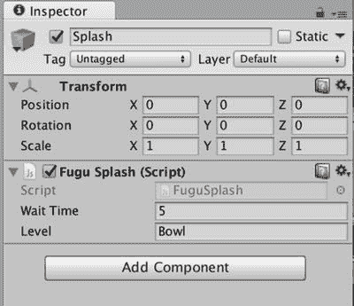

图 12-14. `FuguSplash` 脚本已添加到启动场景

关于 `WaitForSeconds` 这里简单说明一下；它很方便，但你也可能实现自己的版本。清单 12-6 展示了一个假设的实现。

```
function WaitForSeconds(waitTime:float) {
var startTime:float = Time.time;
while (waitTime > Time.time-startTime) {
yield;
}
}
清单 12-6.
WaitForSeconds 的实现
```

请注意，指定的等待时间是游戏时间，而非真实世界时间，因此，例如在游戏暂停且游戏时间停止时，`WaitForSeconds` 就没什么用了。但如果你需要按真实秒数等待，可以使用 `WaitForSeconds` 的假设实现，并将 `Time.time` 替换为 `Time.realtimeSinceStartup`，后者返回自游戏启动以来经过的真实世界秒数（清单 12-7）。

```
function WaitForSecondsRealtime(waitTime:float) {
var startTime:float = Time.realtimeSinceStartup;
while (waitTime > Time.realtimeSinceStartup-startTime) {
yield;
}
}
清单 12-7.
WaitForSeconds 的实时版本
```

#### 显示活动指示器

当某些操作需要一段时间时，最好能有某种加载指示器。对于初始场景加载，有一种便捷的方式可以显示你在应用中经常见到的 iOS 旋转指示器，作为活动指示器。你可以在 **Player Settings**（玩家设置）中 `Resolution and Presentation` 折叠面板底部的 `Show Loading Indicator` 处选择一种活动指示器样式来启用它（图 12-15）。鉴于启动屏提供了大部分白色背景，`Gray`（灰色）是最佳样式（其他样式为白色）。

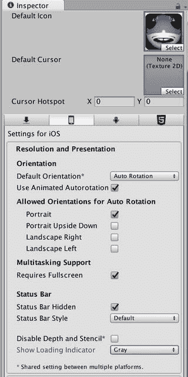

图 12-15. 在 `Show Loading Indicator` 处选择了 `Gray` 的 Player Settings

现在，当你在 iOS 构建版本中运行游戏时，你会看到 `Gray` 活动指示器在内置启动屏上旋转。

#### 为活动指示器编写脚本

如果能将活动指示器用于其他情况（尤其是在加载其他关卡时）会很好。幸运的是，Unity 为活动指示器提供了脚本接口，形式为 `Handheld` 类中的静态函数。你只需要一个脚本来调用这些函数以启动和停止活动指示器。创建一个名为 `FuguSpinner` 的新 JavaScript，并将清单 12-8 的内容添加到脚本中。

```
#pragma strict
#if UNITY_IPHONE
function Start() {
DontDestroyOnLoad(this.gameObject);
Handheld.SetActivityIndicatorStyle(iOSActivityIndicatorStyle.WhiteLarge);
Handheld.StartActivityIndicator();
}
function OnLevelWasLoaded() {
Handheld.StopActivityIndicator();
Destroy(gameObject);
}
#endif
清单 12-8.
在 FuguSpinner.js 中启动和停止活动指示器
```

在 `Start` 回调中，对 `Handheld.SetActivityIndicatorStyle` 的调用指定了活动指示器的外观。可用的选项由 `iOSActivityIndicatorStyle` 枚举表示，与 Player Settings 中可用的 `Loading Indicator` 选项相匹配。你将选择 `iOSActivityIndicatorStyle.WhiteLarge`，因为你知道二级启动屏的背景大部分是黑色的。

对 `Handheld.StartActivityIndicator` 的调用使活动指示器在屏幕中央可见。关于 `Handheld.StartActivityIndicator` 的 Unity 脚本参考文档指出，活动指示器将在当前帧之后激活，因此你需要在调用 `Application.LoadLevel` 之前至少暂停一帧。否则，指示器要等到新关卡加载后才会出现，这违背了首先激活指示器的初衷。这里你无需担心这一点，因为你知道 `FuguSplash` 脚本在加载下一个场景之前会暂停若干秒。

然而，即使在 `FuguSplash` 加载新场景后，活动指示器仍会继续旋转。为了在场景加载完成后停止活动指示器，此脚本必须在场景加载期间保持存在，这就是为什么在 `Start` 函数开始时调用了 `DontDestroyOnLoad`，并传入附加此脚本的 `GameObject`。这确保了 `GameObject`（以及此脚本）在加载下一个场景时保持存在。由于 `GameObject` 在场景加载期间保持存在，你可以确信在新场景加载完成后会调用 `MonoBehaviour` 回调 `OnLevelWasLoaded`。这是通过调用 `Handheld.StopActivityIndicator` 关闭活动指示器的完美位置。此时，脚本及其附加的 `GameObject` 不再需要，因此在 `GameObject` 上调用了 `Destroy`。

**提示：** 在不再需要对象时销毁它们是一个好习惯。除了释放空间，你还要避免最坏的情况：当你循环回到最初创建对象的场景时，最终会得到该对象的两个版本！

请注意，`DontDestroyOnLoad` 和 `Destroy` 都是 `Object` 类中的静态函数。就像你在第 7 章中调用 `Instantiate` 而不是 `Object.Destroy` 一样（或者为了避开与 .NET 中 `System.Object` 类的名称冲突，使用 `UnityEngine.Object.Destroy`），这里你隐式调用了 `this.Destroy`，这之所以有效，是因为 `this` 是一个 `Object`。

将 `FuguSpinner` 脚本附加到场景中一个名为 `Spinner` 的新 `GameObject` 上。现在，当你在设备上执行“构建并运行”操作时，活动指示器会出现在启动画面的中央，并在下一个场景加载后消失（图 12-16）。

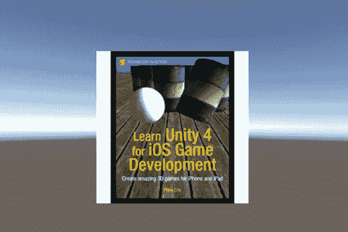

图 12-16. 带有活动指示器的二级启动屏

## 进一步探索

现在你的 iOS 保龄球游戏看起来就像一个真正的应用了！它有一个图标、一个（或两个）启动屏，以及一个在启动屏上旋转的活动指示器。此外，它可以在竖屏方向运行，并且图形会缩放以适应屏幕，包括 UnityGUI 记分板和暂停菜单。该菜单在 iOS 中甚至可以自动运行，其按钮会响应屏幕上的点击。虽然还不能完全这么说实际游戏操作，但你将在下一章中实现基于触摸屏的游戏控制。


### 参考手册

你再次在播放器设置中花费了一些时间（既然你已经在制作 iOS 版本，这便成了一个反复出现的主题），因此值得回顾一下关于播放器设置的参考手册文档。

在本章中，你只使用了一个新组件，即用于启动画面的`GUITexture`。`GUITexture`及其父类`GUIElement`与 UnityGUI 无关（事实上，在 UnityGUI 出现之前，`GUITexture`和它的同类`GUIText`曾是与人机界面元素最相近的组件）。

本章主要侧重于图标和启动画面图像，这些图像都应使用 GUI 预设导入设置进行导入，相关说明可在“资源组件”部分的`Texture2D`文档中找到。

### 脚本参考

本章介绍的一个新的 UnityGUI 功能是`GUI`类中的`matrix`变量。在撰写本文时，该变量的脚本参考页面几乎为空，但`GUIUtility`类提供了一些文档更完善的函数，其中包括`ScaleAroundPivot`，它可作为设置`GUI.matrix`的替代方案（实际上，它是一个辅助函数，会在内部设置`GUI.matrix`）。

你只使用了`Matrix4x4.TRS`构造函数，但`Matrix4x4`的脚本参考文档并不差，它解释了矩阵在 Unity 中的使用方式，并列出了许多类函数，如果你需要操作矩阵，这些函数会很有用。

`WaitForSeconds`的 yield 指令已在第 8 章的游戏结束状态中介绍过，事实证明它在显示启动画面并持续特定秒数时非常方便。你借此机会探索了`WaitForSeconds`的假设实现，并比较了静态`Time`变量`Time.time`和`Time.realTimeSinceStartup`。当暂停菜单出现且游戏时间暂停时，这两者的区别至关重要。

你调用了静态`Application`函数`LoadLevel`来从启动场景过渡到保龄球场景，但你也可以调用该函数的异步版本`Application.LoadLevelAsync`。作为一个异步函数，它在加载新场景时不会暂停 Unity，因此，在等待新场景加载完成的过程中，你可以在启动场景中实现任何效果。

正如你通过使用`Handheld`类中的活动指示器函数所演示的那样，你可以通过对对象调用`DontDestroyOnLoad`使其在场景加载后依然存在，并在不再需要它们时使用`Destroy`来销毁它们。这两个都是`Object`类中的静态函数，由于它是场景中所有对象的父类，因此始终值得一读。

为了显示和隐藏活动指示器，你调用了`Handheld`类中的`StartActivityIndicator`和`StopActivityIndicator`函数。请参阅关于活动指示器函数的文档，了解在执行场景加载前必须使用`yield`的必要性。使用`iOSActivityIndicatorStyle`枚举可以查看可用的活动指示器样式列表。

`Handheld`类值得一读，因为它包含了所有可编写脚本的 Unity 移动设备功能（iOS 特有的功能除外）。例如，`Handheld`类有一个静态的`PlayFullScreenMovie`函数，可以播放本地存储的视频或从网站流式传输视频，这也是制作炫酷启动场景的另一种可能。该函数的脚本参考页面详细介绍了支持的视频格式以及如何控制视频播放器（在撰写本文时，它基于原生 iOS 视频播放器`MPMoviePlayerController`）。

### iOS 开发者库

随着你探索 Unity iOS 功能，iOS 开发者库中的文档也变得越来越相关。请记住，该文档可以在 Apple 开发者网站（[`http://developer.apple.com/`](http://developer.apple.com/)）和 Xcode Organizer 窗口中获取。

一篇值得通读的文档是 iOS 开发者库“用户体验”主题中的 Apple iOS 人机界面指南。源自最初 Mac 系统的原始指南曾是用户界面最佳实践的黄金标准。此后，该指南分为 Mac 和 iOS 版本，但仅为了避免应用被拒，你就应该阅读 iOS 版本。与本章相关，“自定义图标和图像创建指南”部分列出了创建应用图标和启动画面（在 Apple 术语中称为启动图像）的要求和建议。

许多移动设备专用或 iOS 专用的 Unity 类都有对应的 Objective-C 类。例如，由 Unity 的`Handheld`类控制的活动指示器，在 Objective-C 中是通过`UIActivityIndicatorview`类访问的，该类也位于“用户体验”主题的“窗口与视图”部分。

### 资源商店

Ciitt 开发的 Smart Scene Changer（在 Unity 资源商店免费提供）提供了比本章所述更高级的初始屏幕行为，包括屏幕淡入淡出以及使用多个屏幕。我在我的所有应用中都使用了 Transitions Manager（[`https://www.assetstore.unity3d.com/en/#!/content/80061`](https://www.assetstore.unity3d.com/en/#!/content/80061)）。

### 书籍

Josh Clark 的《Tapworthy: Designing Great Apps》这本书让我决定摒弃自动图标光泽，并始终在 Unity 播放器设置中选择“预渲染图标”。这本书也是对应用设计总体上的良好阐述。

关于线性代数的教科书有很多（甚至[`http://wikipedia.org/`](http://wikipedia.org/)上也有篇幅较长的“矩阵”文章），但任何计算机图形学书籍都会包含矩阵数学入门知识。例如，《实时渲染》（[`http://realtimerendering.com/`](http://realtimerendering.com/)）中有一个名为“一些线性代数”的附录。

