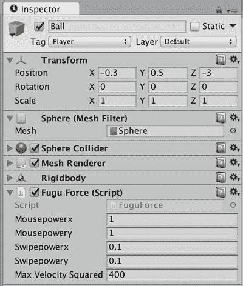
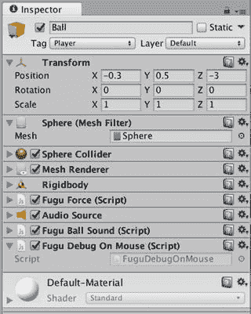
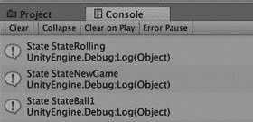
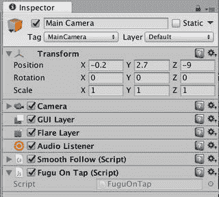
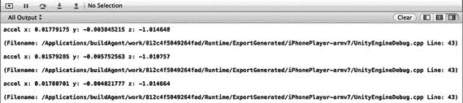
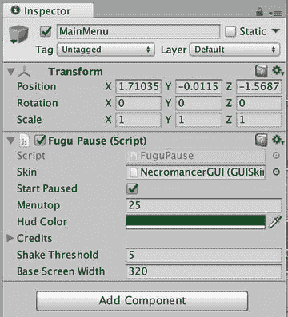
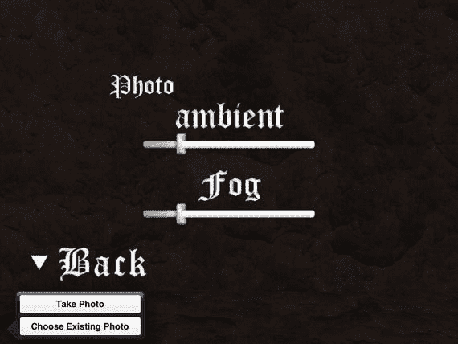

# 13. 处理设备输入

虽然你的保龄球游戏已在 iOS 上运行起来，但由于没有任何可用的玩家控制，它尚未达到可玩状态。这就引出了输入处理的问题，这也许是桌面游戏与移动游戏之间最明显的区别。

iOS 游戏无法读取鼠标或键盘，必须使用其设备传感器之一，通常是触摸屏（点击和滑动）或加速度计（摇晃和倾斜）。在本章中，你将选择触摸屏输入来控制保龄球，但也会使用加速度计进行一些摇晃检测，并稍微操作一下设备摄像头。

本章项目文件位于[`www.apress.com/9781484231739`](http://www.apress.com/9781484231739)，其中包含了本章引入的脚本更改，未添加其他资源。本书剩余部分也是如此。从今以后都是脚本部分！

## 触摸屏

当你为 iOS 构建时，Unity 会与 iOS 的触摸屏协同工作，因此如果你现在在设备上构建并运行保龄球游戏，或者在编辑器中使用 Unity Remote 进行测试，你可以通过点击按钮来操作初始菜单。当你点击暂停菜单上的“开始”按钮时，保龄球会落下。到目前为止，一切顺利。

但是保龄球的控制呢？`Input.GetAxis`在屏幕上滑动时确实会返回值，但结果很可能并非你想要的（在旧版本的 Unity iOS 中，`Input.GetAxis`完全不起作用）。无论如何，你需要首先定义在 iOS 版本的保龄球游戏中控制将如何工作。


### 滑动球

在 Fugu Bowl 中，你将采用我为 HyperBowl 设计的触摸屏控制方式。玩家通过沿屏幕向特定方向滑动，将球推向该方向。向上滑动屏幕会将球向前推，向下滑动则将球向后推，向左滑动会使球向左滚动，向右滑动则使其向右滚动。

滑动控制方案与鼠标控制非常相似，因此你可以直接在现有的 `FuguForce` 脚本框架内进行修改。打开该脚本，并添加一些新的公共变量 `swipepowerx` 和 `swipepowery`，以便像调整鼠标控制那样调整滑动力度（代码清单 13-1）。

```
var swipepowerx:float = 0.1;
var swipepowery:float = 0.1;
代码清单 13-1.
FuguForce.js 中滑动控制的调整变量
```

你添加了新变量，而非重复使用 `mousepowerx` 和 `mousepowery`，这样可以在独立版本和 iOS 构建目标之间切换，而不会干扰各自平台的力度调整值。这两个属性都会显示在 Inspector 视图中（图 13-1）。



图 13-1. `FuguForce.js` 中针对桌面端和 iOS 的控制调整

主要的改动在于 `CalcForce` 函数，该函数每帧会被 Update 回调调用一次。在 iOS 上，`CalcForce` 不会调用静态函数 `Input.GetAxis` 来检测鼠标移动，而是调用静态函数 `Input.GetTouch` 来检测滑动。`UNITY_IPHONE` 预处理指令确保新代码仅存在于 iOS 平台，而旧代码则应用于其他所有平台（代码清单 13-2）。

```
function CalcForce() {
var deltatime:float = Time.deltaTime;
#if UNITY_IPHONE
if (Input.touchCount > 0) {
// 获取自上一帧以来手指的移动
var touch:Touch = Input.GetTouch(0);
if (touch.phase == TouchPhase.Moved) {
var touchPositionDelta:Vector2 = touch.deltaPosition;
forcey = swipepowery*touchPositionDelta.y/deltatime;
forcex = swipepowerx*touchPositionDelta.x/deltatime;
}
}
#else
forcey = mousepowery*Input.GetAxis("Mouse Y")/deltatime;
forcex = mousepowerx*Input.GetAxis("Mouse X")/deltatime;
#endif
}
代码清单 13-2.
在 FuguForce.js 中检测滑动
```

与 `Input.GetAxis` 类似，`Input.GetTouch` 返回的是自上一帧以来注册的信息，因此你可以在 `CalcForce` 中调用它。该函数又从 `Update` 中调用，从而保证每帧调用一次。

`Input.GetTouch` 返回一个类型为 `Touch` 的结构体，该结构体描述了触摸事件：手指是按下、抬起还是移动，如果移动，则移动了多少像素。

由于现在处理的是多点触摸屏，`Input.GetTouch` 有一个整数参数，用于指定应返回最新的哪个 `Input.Touch` 事件。触摸事件的数量可通过静态变量 `Input.touchCount` 获取，因此你可以通过如下循环来处理所有触摸事件：

```
for (var i:int=0; i < Input.touchCount; ++i) {
var touch:Touch = Input.GetTouch(i);
// 在这里处理你的逻辑
}
```

为了简化操作，这里你只关心一根手指，因此只需检查是否有至少一个 `Touch` 事件可用，如果有，则只检查第一个。

```
if (Input.touchCount > 0) {
var touch:Touch = Input.GetTouch(0);
```

`Touch` 事件可以表示不同的手指动作：按下、释放或拖动。这可以通过检查 `Touch` 对象的 `phase` 属性来判断，该属性属于 `TouchPhase` 枚举。你只关心表示手指在屏幕上拖动的 `Touch` 事件，因此检查触摸阶段是否为 `TouchPhase.Moved`。

```
if (touch.phase == TouchPhase.Moved) {
```

如果是，则计算推动保龄球的力。这与鼠标控制类似，但不再乘以 `Input.GetAxis`，而是乘以 `Touch` 事件的 `deltaPosition` 属性，该属性表示手指拖动的像素数。

```
var touchPositionDelta:Vector2 = touch.deltaPosition;
forcey = powery*touchPositionDelta.y/deltatime;
forcex = powerx*touchPositionDelta.x/deltatime;
```

请注意，`deltaPosition` 属性是一个 `Vector2`，它与 `Vector3` 类似，但仅有 `x` 和 `y` 属性，没有 `z` 值。

现在，如果你在编辑器中点击 Play 并使用 Unity Remote 进行测试，或者在设备上执行 Build and Run 操作，球就会朝着你滑动的方向滚动。

包含触摸屏功能后的完整 `FuguBowlForce` 脚本可在本章对应项目的网站 `http://learnuninty4.com/` 上找到。


```markdown
### 轻触小球

虽然你的保龄球游戏不关心滑动操作发生在屏幕上的哪个位置，但许多游戏需要检测特定的 `GameObject` 是否被触碰。在桌面和网页平台上，可以通过 `OnMouseDown`、`OnMouseUp` 和 `OnMouseOver` 等回调函数来检测带有 `Collider` 组件的 `GameObject` 上的鼠标事件。例如，脚本中的 `OnMouseDown` 回调会在鼠标点击脚本所挂载的 `GameObject`（更确切地说，是该 `GameObject` 的 `Collider` 组件）时被触发。

**注意**

`OnMouse` 回调也适用于带有 `GUIText` 和 `GUITexture` 组件的 `GameObject`。在 `UnityGUI` 引入之前，这是 Unity 中最接近内置 GUI 系统的东西。

为了演示 `OnMouse` 回调如何工作，创建一个名为 `FuguDebugOnMouse` 的新 JavaScript 脚本，并将其挂载到 `Ball` `GameObject` 上（图 13-2）。



**图 13-2.** 挂载了 `FuguDebugOnMouse` 脚本的 Ball

然后将 列表 13-3 的内容添加到脚本中。

```
#pragma strict
#if !UNITY_IPHONE
function OnMouseDown () {
#else
function OnTap () {
#endif
Debug.Log("GameObject "+ gameObject.name + " was touched");
}
```

**列表 13-3.** 在 `FuguDebugMouse.js` 中检测鼠标点击

该脚本包含一个 `OnMouseDown` 回调，用于记录关于 `GameObject` 被触碰的消息。当你在编辑器中运行游戏并点击球体时，调试信息会出现在控制台视图中（图 13-3）。



**图 13-3.** 演示 `OnMouseDown` 回调的调试信息

Unity iOS 会响应触摸事件来调用 `OnMouse` 回调，但某些情况除外，因为不存在明显的映射关系。例如，当鼠标悬停在 `GameObject` 上时调用的 `OnMouseOver`，其对应的触摸操作是什么？但当一个 `GameObject` 被轻触时调用 `OnMouseDown`（手指离开屏幕时调用 `OnMouseUp`）是合情合理的。实际情况也确实如此，你可以通过 Unity Remote 在编辑器中再次运行游戏，或者在设备上执行构建并运行操作来验证。无论哪种方式，轻触球体都会产生与点击它时相同的调试信息。

尽管 `OnMouse` 回调能处理触摸操作很方便（至少在一定程度上是这样），但了解如何实现你自己的对象轻触检测也很有用。这只需将检测轻触和从屏幕位置沿相机方向向 3D 世界发射射线（raycast）这两步简单结合起来。Raycasting 是指找到射线与第一个相交物体的过程（你可能还记得高中数学知识，射线有一个起始位置和一个方向，就像一支箭）。

为了进行演示，让我们创建一个名为 `FuguTap` 的新 JavaScript 脚本，将其挂载到主相机上（图 13-4），并将列表 13-4 的内容添加到脚本中。



**图 13-4.** 挂载了 `FuguOnTap` 脚本的主相机

```
#pragma strict
#if UNITY_IPHONE
function Update () {
for (var i = 0; i < Input.touchCount; ++i) {
if (Input.GetTouch(i).phase == TouchPhase.Began) {
var ray:Ray = camera.ScreenPointToRay (Input.GetTouch(i).position);
var hit:RaycastHit;
if (Physics.Raycast (ray,hit,camera.farClipPlane,camera.cullingMask)) {
hit.collider.SendMessage("OnTap",SendMessageOptions.DontRequireReceiver);
}
}
}
}
#endif
```

**列表 13-4.** 模拟 `OnMouseDown` 事件的脚本

整个脚本包含一个 `Update` 回调，它遍历上一帧中注册的所有触摸事件。但此例中，我们只关心轻触的开始，因此只考虑处于 `TouchPhase.Began` 阶段的触摸。提取每个此类触摸的屏幕坐标，并将其传递给相机函数 `ScreenPointToRay`，以形成一条起始于屏幕位置并沿着相机方向射入 3D 世界的射线。

该射线作为第一个参数传递给静态函数 `Physics.Raycast`，用于检测射线是否与任何 `GameObject` 的 `Collider` 组件相交。关于第一个相交点的信息（如果有的话）通过作为第二个参数传入的 `RayCastHit` 结构体返回。第三个参数是射线投射的距离，第四个参数是用于检测相交的图层集合。通过将相机的远平面距离作为射线投射距离，并将相机的剔除遮罩（可见图层集合）作为相交检测的图层集合，你可以限制可能的射线投射结果。

如果对 `Physics.Raycast` 的调用返回 `true`，表示发生了相交，那么你就获取相交的 `Collider` 组件，并在其上调用 `SendMessage` 来触发挂载脚本中的 `OnTap` 回调（在组件上调用 `SendMessage` 等同于在该组件的 `GameObject` 上调用 `SendMessage`）。

请注意，对 `SendMessage` 的调用包含一个可选的第二个参数 `SendMessageOptions.DontRequireReceiver`。如果没有这个参数，当消息被发送到一个没有匹配函数的 `GameObject` 时，或者在此例中，没有任何 `OnTap` 函数时，Unity 会报告错误。

整个 `Update` 回调被包裹在 `UNITY_IPHONE` ifdef 中，因为它仅用于 iOS 触摸屏输入。同样地，你现在可以使用 `UNITY_IPHONE` 将 `OnMouseDown` 回调重命名为 `OnTap`，以便它能够被 `FuguOnTap` 脚本调用（列表 13-5）。

```
#pragma strict
if !UNITY_IPHONE
function OnMouseDown () {
#else
function OnTap () {
#endif
Debug.Log("GameObject "+ gameObject.name + " was touched");
}
```

**列表 13-5.** 为 iOS 使用替代回调名称的 `FuguDebugOnMouse` 脚本

现在，如果你再次运行游戏并轻触球体，你仍然会看到调试信息，但这是由 `FuguOnTap` 发送的 `OnTap` 消息产生的。

## 加速度计

每个 iOS 设备都配有一个加速度计，用于测量三个不同方向的加速度。这三个值可以通过静态变量 `Input.accelerometer` 来查看，它是一个 `Vector3`。

`x` 值对应于沿着设备屏幕从左到右的加速度。`y` 值表示沿着设备屏幕从上到下的加速度，而 `z` 值则是从设备正面到背面的加速度。从 Unity 4 开始，加速度计的值会根据设备方向进行调整，因此如果你手持设备处于横屏模式，加速度计的 `x` 值仍然是从左到右的。
```


### 调试加速度计

探究代码工作原理的经典方法就是打印输出。让我们创建一个名为 `FuguDebugAccel` 的新 JavaScript 脚本，并将其挂载到保龄球场景中名为 `DebugAccel` 的新 `GameObject` 上。将清单 13-6 中所示的 `Update` 函数添加到该脚本中。

```
function Update () {
Debug.Log("accel x: "+Input.acceleration.x+" y: "+Input.acceleration.y+" z: "+Input.acceleration.z);
}
清单 13-6.
用于打印输出加速度计值的代码
```

`Update` 函数接收加速度计的 `x`、`y` 和 `z` 值，并将它们拼接成一个可读的 `字符串`。如果你在 Unity 编辑器（配合 Unity Remote）中进行测试，`Debug.Log` 会将该 `字符串` 发送到控制台视图；如果你在 iOS 模拟器或设备上运行，则会发送到 Xcode 调试区域。

尝试倾斜设备，观察这些值如何变化。例如，图 13-5 中显示的 `Debug.Log` 输出结果，是将设备平放在桌面上得到的。`x` 和 `y` 的值接近 0，而 `z` 的值接近 -1。如果设备上下翻转，`z` 值则会接近 1。



图 13-5.  
加速度计值的 `Debug.Log` 输出结果

加速度值的单位是重力加速度。在静止状态下，每个加速度计值的范围是 -1 到 1，其中 1 代表完整的地球重力加速度（9.8 米/秒²）。现在尝试摇晃设备。你应该会看到数值上下剧烈跳动。

### 检测摇晃

iOS 上暂停菜单的一个问题是，你无法通过 `Esc` 键暂停，因为设备上没有 `Esc` 键（不过 Android 设备通常有一个类似 `Esc` 键的返回按钮）。

在 `FuguPause` 脚本中，通过在 `OnGUI` 函数内添加一个 `GUI.Button` 调用来向屏幕添加暂停按钮很简单。

```
if (GUI.Button(Rect(0,0,100,50), "Pause") { PauseGame(); }
```

但是，我不喜欢在游戏过程中屏幕上出现按钮，尤其是在 iPhone 这种小屏幕设备上。因此，我们不妨利用 iOS 设备提供的替代输入方式，通过摇晃设备来暂停游戏。

从之前打印加速度计值的练习中，你已经看到摇晃设备会导致 `Input.acceleration` 的 `x`、`y` 或 `z` 值至少有一个会向上或向下剧烈跳动。因此，你可以通过检查这些值是否有任何一个远大于 1 或远小于 -1 来判断是否发生了摇晃。不过你无需精确计算，只需获取向量模长的平方即可。

```
if (Input.acceleration.sqrMagnitude>shakeThreshold)
```

获取 `Vector3` 的 `sqrMagnitude`（模长平方）比获取模长更快，因为向量的模长是 x² + y² + z² 的平方根，而这种方法避免了相对昂贵的平方根运算（还记得高中时手动计算平方根吗？）。

那么，我们首先在 `FuguPause` 脚本中添加一个用于摇晃阈值的公共变量。

```
var shakeThreshold:float = 5;
```

现在你可以在检视面板（图 13-6）中调整该属性，使其对摇晃的敏感度更高或更低。



图 13-6.  
在检视面板中调整摇晃暂停的阈值

接下来，添加对 `Input.acceleration` 的检查，作为 `UNITY_IPHONE` 平台下对 `Esc` 键检查的替代方案（清单 13-7）。

```
var shakeThreshold:float = 5;
function Update() {
#if UNITY_IPHONE
if (Input.acceleration.sqrMagnitude>shakeThreshold)
#else
if (Input.GetKeyDown(KeyCode.escape))
#endif
{
switch (currentPage) {
case Page.None: PauseGame(); break; // 如果未显示暂停菜单，则暂停游戏
case Page.Main: UnPauseGame(); break; // 如果显示主暂停菜单，则取消暂停
default: currentPage = Page.Main; // 任何子页面返回主页面
}
}
}
清单 13-7.
在 FuguPause.js 中添加摇晃暂停功能
```

大功告成。现在，当你使用 Unity Remote 或在设备上测试时，摇晃设备就能暂停游戏！增强后的 `FuguPause` 脚本（仅增加了两行新代码！）包含在本章的工程项目中，可访问 [`www.apress.com/9781484231739`](http://www.apress.com/9781484231739) 获取。

### 摄像机

Unity 5.x 为 iOS 摄像机提供了内置支持。Unity 还提供了跨平台支持，可以将网络摄像头视频读取到纹理中。

### 读取网络摄像头

Unity 有一种特殊的纹理（类似于 `Texture2D`，是 `Texture` 的子类），称为 `WebCamTexture`，它可以显示来自连接的硬件摄像头的视频。它适用于包括 iOS 在内的多个平台。让我们来尝试一下。创建一个名为 `FuguWebCam` 的 JavaScript 脚本，并添加清单 13-8 中给出的 `Start` 函数。`Start` 函数创建一个 `WebCamTexture`，将该纹理分配给挂载了该脚本的 `GameObject` 的材质，然后调用 `Play` 开始从摄像头视频更新纹理。

```
#pragma strict
function Start () {
var webcamTexture:WebCamTexture = WebCamTexture();
GetComponent.().material.mainTexture = webcamTexture;
webcamTexture.Play();
}
清单 13-8.
在 FuguWebCam.js 中播放 WebCamTexture
```

现在将该脚本挂载到 `Ball` `GameObject` 上。如果你在编辑器中点击“播放”，你会看到来自 Mac 摄像头的视频显示在球上。如果你在设备上执行“生成并运行”操作，你会看到同样的效果，只是使用了设备摄像头。

## 进一步探索

总而言之，为保龄球游戏实现触摸屏输入并没有花费太多功夫（与上一章的打包装配工作相比），尽管在实践中，你需要花费大量时间来测试和调整游戏的操控，才能使其恰到好处。无论如何，借助摇晃暂停功能，保龄球游戏的功能移植已经完成。换句话说，iOS 版本的游戏现在已经可以玩了！

而且，尽管设备摄像头在这个游戏中没有实际用途，但你确实使用了 Unity 的 `WebCamTexture` 类来激活它，从而在保龄球上渲染视频纹理。虽然有点花哨，但游戏开发很大程度上就是学习！尤其是在 iOS 上，有很多机会尝试各种不同的控制方案和输入传感器。


### 脚本参考

本章介绍的所有 Unity 功能几乎都是 `Input` 类的成员。事实上，关于 `Input` 的脚本参考文档包含了对 iOS 输入功能的概述。

阅读完 `Input` 类的概述后，你应该阅读本章中使用的每个函数的页面，特别是 `Input.GetTouch`（以及相关的 `Touch` 结构体），其中包含的代码示例展示了如何遍历每一帧中的所有 `Touch` 事件；以及 `Input.acceleration`，其中包含的代码示例展示了如何检查每一帧的加速度值。

需要记住的一点是，加速度计每帧可能会生成多个值。大多数情况下，每帧仅采样一次 `Input.accelerometer` 就足够了，但如果需要更精细的采样，你可以访问 `Input.accelerationEventCount` 和 `Input.accelerationEvents` 变量来获取所有加速度事件。

`Input` 类提供了访问其他 iOS 传感器的途径。静态变量 `Input.gyro`、`Input.compass` 和 `Input.location` 分别返回来自陀螺仪、指南针和定位服务的数据。除了记录这些变量的页面外，你还应查看这些变量所属类别的页面：`Gyroscope`、`Compass` 和 `LocationServices` 类。文档内容不多，但你可以在各个类的函数中找到代码示例。静态变量 `Input.compensateSensors` 控制是否根据屏幕方向调整加速度计、陀螺仪和指南针的数据。

除了测试对象选择，射线投射在游戏和图形中也被大量使用，因此你应该熟悉有关 `Physics.Raycast` 的页面，该页面提供了几个代码示例。例如，在 HyperBowl 中，我使用射线投射来防止主摄像机掉到地面以下，并将 `GameObjects` 的初始位置正好设置在地面上。在这两种情况下，我都会从 `GameObject` 的位置向地面下方发射射线，并检查得到的距离。最后，我介绍了 `WebCamTexture` 类的使用。`WebCamTexture` 的页面内容很多，但请点击其 `Play`、`Stop` 和 `Pause` 函数的链接，在这些页面中找到代码示例。另外，请查看 `WebCamTexture` 构造函数的链接。该页面列举了各种构造函数，允许你为不同的分辨率自定义纹理大小。

### iOS 开发者库

建议你在阅读甚至是在阅读 Unity 脚本参考之前，先阅读 iOS 参考库，这样你就能了解哪些 iOS 功能可以通过 Unity 暴露出来，以及 Unity 的类和函数如何映射到对应的 iOS 组件。

你可以通过 [`http://developer.apple.com/library`](http://developer.apple.com/library)（无需登录）或在 Xcode Organizer 中查看 iOS 参考库；从那里选择“Guides”标签并浏览指南，特别是以下内容：

- “Event Handling Guide”指南概述了触摸事件（与 Unity 的 `Input.GetTouch` 和 `Touch` 类相关）和运动事件（与 `Input.acceleration` 及其他 `Input` 加速度计变量相关）。
- “Camera Programming Topics for iOS”指南描述了 Prime31 Etcetera 插件所使用的 `UIImagePickerController` 类。
- “AV Foundation Programming Guide”指南描述了 Unity 中 `WebCamTexture` 类最可能使用的视频捕捉功能。

### 资源商店

Unity 的 `Input` 类使你能够访问基本的触摸信息，但它不提供对 iOS 手势识别器的访问，后者用于检测更高级别的“手势”，例如滑动和捏合。这时资源商店再次挺身而出，提供能够进行高级手势检测的第三方包。我使用的是 FingerGestures 包，它有一个很好的回调系统，用于检测和处理各种手势。

例如，在 HyperBowl 中，我希望当玩家捏合屏幕（两个手指在屏幕上合拢）时弹出暂停菜单。使用 Finger Gestures 包，只需在暂停菜单脚本中添加一个手势回调即可，如下所示：

```
function OnGesturePinchEnd(pos1:Vector2,pos2:Vector2) {
PauseGame();
}
```

还需要在 `Start` 或 `Awake` 函数中添加一行代码，将该回调添加到 `FingerGestures` 的相应手势回调列表中，如下所示：

```
FingerGestures.OnPinchEnd += OnGesturePinchEnd;
```

Unity 并未为 iOS 中的所有可用功能提供脚本访问权限，这就是插件的用武之地。Unity 插件系统允许你添加新的脚本函数来访问“原生”代码。一般来说，如果你能用 C、C++ 或 Objective-C 编写代码，就可以为其制作一个 Unity 插件。例如，在 Unity 资源商店中，你会发现有基于移动广告 SDK 构建的插件，以及用于访问 iOS 功能的插件。

插件安装在 `Assets/Plugins` 文件夹中，正如我之前提到的，这是一个存放需要在任何其他脚本之前加载的脚本的好地方。它们通常还需要在 Xcode 中手动集成步骤，例如向 `Info.plist` 文件添加条目或安装额外的代码库（这会阻止从 Unity 直接进行“构建并运行”——你必须先选择“构建”，修改 Xcode 项目，然后从 Xcode 选择“运行”）。并且，多个插件安装在同一 Unity 项目中总是存在冲突的风险。

这就是为什么我喜欢使用 Prime31 Studios 在 [`http://prime31.com/unity`](http://prime31.com/unity) 提供的插件。它们提供了大量可以共存于同一 Unity 项目中的插件，并且所有 Xcode 修改都由 Unity 后处理脚本执行，因此从 Unity 进行的“构建并运行”操作仍然有效，无需在 Xcode 中手动操作。

例如，资源商店上提供的 Prime31 Etcetera 插件包含许多杂项功能，包括通过一次函数调用访问 iOS 照片库和设备相机，如下所示：

```
EtceteraBinding.promptForPhoto(1.0);
```

图 13-7 显示了在我的 Fugu Maze 应用中出现的提示（我使用照片选择器允许玩家自定义迷宫墙壁纹理）。如果你想尝试一下，请从 App Store 下载 Fugu Maze Free 或一个免费的 HyperBowl 球道（我使用照片选择器来自定义保龄球纹理）。



图 13-7.

iPad 上的 Prime31 Etcetera 插件照片选择器

另一个提供额外设备输入的 Prime31 插件是 iCade 插件（仅在 Prime31 网站上提供）。iCade 是一种复古风格的街机机箱，通过蓝牙连接为 iOS 设备提供摇杆输入。iCade 本质上模拟了一个蓝牙键盘，因此任何使用 iCade 插件的代码都与键盘控制的代码类似。如果你为保龄球代码的 `CalcForce` 函数添加了 iCade 控制代码，那么它看起来会像代码清单 13-9 中的片段（此示例实际上取自 HyperBowl）。

```
var yinput:float = 0;
if (iCadeBinding.state.JoystickUp) yinput = 1;
if (iCadeBinding.state.JoystickDown) yinput = -1;
var xinput:float = 0;
if (iCadeBinding.state.JoystickLeft) xinput = 1;
if (iCadeBinding.state.JoystickRight) xinput = -1;
var deltatime:float = Time.deltaTime;
forcey += iCadePowery*yinput/deltatime;
forcex += iCadePowerx*xinput/deltatime;
```

清单 13-9. 使用 Prime31 iCade 插件对 `CalcForce` 的 iCade 补充

就像检查四个不同按键是否被按下一样，你只是在检查摇杆是否向四个方向中的任何一个移动。摇杆的灵敏度并不比按键更高。


