# 14. 优化

正如唐纳德·克努斯那句广为流传的名言——“过早优化是万恶之源”——所言，我将优化这一主题留到了本书将近结尾处。在本章中，你将优化保龄球应用，并回顾该过程的先决条件：设定目标性能并测量当前性能。本章项目文件位于[`www.apress.com/9781484231739`](http://www.apress.com/9781484231739)，其中包含经优化的脚本以及本章开发的优化辅助脚本。

## 选择目标

有句老话说：“速度快、质量好、成本低，三者只能选其二。”优化通常也是如此。在质量、空间和速度三者之间，你往往最多只能兼顾其中两点，而牺牲第三点。

### 帧率

在开始优化之前，你应该先设定好目标帧率。iOS 设备每秒刷新屏幕 60 次，但默认情况下，Unity iOS 构建版本会尝试达到每秒 30 帧（fps）。将目标帧率设为设备刷新率的一半，对设备电池的消耗更小，而且实现 30 fps 远比 60 fps 容易。你的保龄球游戏很简单，所以只要愿意做出一些妥协，应该能够达到 60 fps。

将目标始终设为最高帧率似乎理所当然，但若游戏频繁在 30 fps 和 60 fps 之间切换，这种不连贯性可能比稳定运行在 30 fps 更容易分散玩家注意力。

尽管如此，在性能剖析之前，以 60 fps 为目标开始工作是有意义的，这样你可以看到峰值性能，之后再根据需要降低目标。

#### 创建脚本

在 Unity 编辑器中无法直接设置目标帧率，但幸运的是，你可以在脚本中通过设置静态变量 `Application.targetFrameRate` 来调整目标帧率。因此，让我们创建一个新的 JavaScript 脚本，将其放入 `Scripts` 文件夹，并命名为 `FuguFrameRate`（图 14-1）。

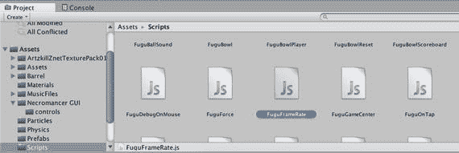

图 14-1. 在 Scripts 文件夹中添加脚本

这将是一个非常简短的脚本，包含一个公共变量和一个只有一行代码的 `Start` 回调（列表 14-1）。

```
#pragma strict
public var frameRate:int = 60;
function Start() {
Application.targetFrameRate = frameRate;
}
列表 14-1. FuguFrameRate.js 的完整脚本

该脚本通过将静态变量 `Application.targetFrameRate` 的值修改为 `frameRate` 的值来设定目标帧率，`frameRate` 是一个公共变量，因此可以在 Inspector 视图中调整。由于 iOS 设备的屏幕刷新率均为 60 fps，这是你能达到的最佳帧率，因此也是 `frameRate` 的一个合理默认值。

#### 挂载脚本

要使用 `FuguFrameRate` 脚本，必须将其添加到场景中，以便游戏启动时执行其 `Start` 回调。因此，让我们在保龄球场景中创建一个空的 `GameObject`，将其命名为 `FrameRate`，然后将 `FuguFrameRate` 脚本拖拽到该对象上（图 14-2）。

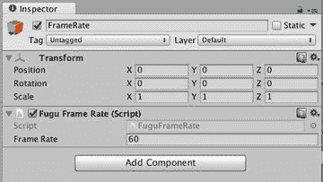

图 14-2. 保龄球场景中包含的帧率脚本

这个脚本已被添加到你的保龄球场景中，但你也完全可以将其添加到启动场景中，因为 `Application.targetFrameRate` 只需设置一次，即使加载新场景，该值也会保持不变。你当前的启动场景并没有实际功能，因此以 Unity 默认的 30 fps 运行即可。

然而，如果启动场景要显示一个酷炫的动画，你可能希望将其设置为 60 fps，在这种情况下，你也需要将帧率脚本添加到该场景。事实上，如果启动场景在 60 fps 下效果最佳，而保龄球场景在 30 fps 下运行更流畅（而不是在 30 fps 和 60 fps 之间抖动），那么你应该将帧率脚本添加到两个场景中，并将启动场景的目标帧率设为 60 fps，保龄球场景的目标帧率设为 30 fps。

### 空间目标

除了帧率之外，你还应为应用体积设定一个目标。你必须与用户安装的歌曲、照片、视频以及所有其他应用争夺 iOS 设备上的存储空间。更小的体积能让用户更容易决定保留你的应用。

体积更小的应用下载耗时更短，加载速度也更快（无论是应用加载还是关卡加载）。尤其重要的是，App Store 限制通过蜂窝网络下载的应用大小不得超过 50MB。你肯定不希望错过用户的冲动购买，因此 50MB 是一个很好的应用体积目标。这个限制比 App Store 最初 20MB 的限制要容易达到得多，但任何包含大量内容的应用仍然很容易超出这个体积（拥有六条球道的 HyperBowl 约为 40MB）。

## 剖析游戏

在开始优化之前，你需要知道优化什么。这就用到了性能剖析（Profiling），即获取游戏的性能信息。你有多种选择，包括在编辑器中查看显示的状态信息、剖析应用本身，甚至编写一些自己的性能测量代码。

### 游戏视图状态

在编辑器中，你可以使用 Game 视图中的 Stats 覆盖层即时获取场景的性能相关信息（图 14-3）。

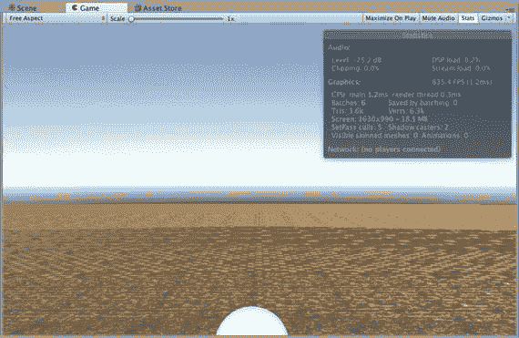

图 14-3. 游戏视图状态信息覆盖层

当你点击 Play 按钮后，在游戏运行过程中你会看到这些统计信息实时更新。这些信息很方便，但无法替代对实际应用的性能剖析。


### 构建日志

缩小应用体积的重要性已不如从前，因为当时超过 20MB 就意味着一款应用只能通过 Wi-Fi 而非 3G 无线网络下载到设备上。现在这个限制放宽到了 50MB，但如果你有一款大型游戏，仍然很容易达到这个上限。体积更小意味着下载速度更快，并且能让更多用户在存储空间有限的设备上安装你的应用（我的 iPad 总是很快就塞满了）。

你可以在构建后查看`Editor`日志，了解应用所包含资源的详细信息，如代码清单 14-2 所示。

```
Textures      5.2 mb         16.9%
Meshes        17.4 kb         0.1%
Animations    0.0 kb          0.0%
Sounds        21.2 mb        69.1%
Shaders       0.0 kb          0.0%
Other Assets  19.1 kb         0.1%
Levels        10.7 kb         0.0%
Scripts       175.2 kb        0.6%
Included DLLs 4.1 mb         13.3%
File headers  16.6 kb         0.1%
Complete size 30.6 mb       100.0%
Used Assets, sorted by uncompressed size:
21.1 mb         69.0% Assets/Assets/Free/Assets/Sci-Fi_Ambiences/Sci-fi_AmbienceLoop1.wav
4.0 mb          13.1% Assets/Textures/LearnUnityCover.jpg
170.8 kb         0.5% Assets/Standard Assets/Skyboxes/Textures/Sunny3/Sunny3_up.tif
170.8 kb         0.5% Assets/Standard Assets/Skyboxes/Textures/Sunny3/Sunny3_right.tif
170.8 kb         0.5% Assets/Standard Assets/Skyboxes/Textures/Sunny3/Sunny3_left.tif
170.8 kb         0.5% Assets/Standard Assets/Skyboxes/Textures/Sunny3/Sunny3_front.tif
170.8 kb         0.5% Assets/Standard Assets/Skyboxes/Textures/Sunny3/Sunny3_back.tif
170.8 kb         0.5% Assets/Standard Assets/Light Flares/Sources/Textures/50mmflare.psd
170.8 kb         0.5% Assets/Barrel/Barrel_D.tga
31.2 kb          0.1% Assets/Assets/Free/Assets/8Bit/Coin_Pick_Up_03.wav
17.4 kb          0.1% Assets/Barrel/Barrel.fbx
17.3 kb          0.1% Assets/Substances_Free/Wood_Planks_01.sbsar
10.8 kb          0.0% Assets/Standard Assets/Skyboxes/Textures/Sunny3/Sunny3_down.tif
1.0 kb          0.0% Assets/Prefabs/BarrelPin.prefab
0.6 kb          0.0% Assets/Standard Assets/Light Flares/50mm Zoom.flare
0.3 kb          0.0% Assets/Standard Assets/Skyboxes/Sunny3 Skybox.mat
代码清单 14-2.
构建日志
```

该日志按资源类型（纹理、音频、网格、脚本）列出了应用体积的分解情况，并包含了构成应用的所有独立资源列表。遗憾的是，体积贡献是基于未压缩的大小，而非最终的压缩后资源大小，但它仍能让你了解哪些资源占用了最多空间。

你还可以通过`Console`应用中便捷的搜索字段，利用日志找出项目中哪些资源被使用了，哪些没有被使用。例如，你在`Textures`文件夹中存放了`FuguBowl`的所有纹理，那么如果你想检查哪些纹理被使用了、哪些可以从项目中移除，可以在`Console`视图菜单中选择`Editor Log`，这会打开`Console`应用并选中`Editor`日志（图 14-4）。

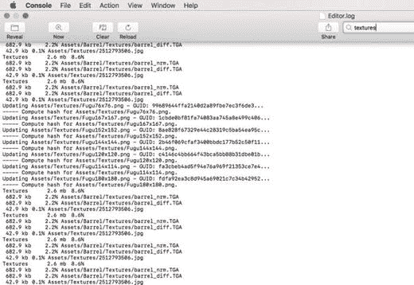

图 14-4.

使用 Console 应用搜索字段筛选构建日志

在搜索框中输入`Textures`即可过滤显示内容。然后，你可以将结果列表与`Project`视图中的`Textures`文件夹进行对比，看看`Project`视图中是否有未出现在构建中的资源。

### 运行内置分析器

Unity iOS 构建生成 Xcode 项目后，你可以选择激活内置分析器，它会报告与`Game`视图中`Stats`覆盖层类似的信息。要激活内置分析器（Unity 文档中也称为内部分析器），请在 Xcode 项目中找到`Classes`文件夹下的头文件`iPhone_Profiler.h`，并将`ENABLE_INTERNAL_PROFILER`的值从`0`改为`1`（图 14-5）。

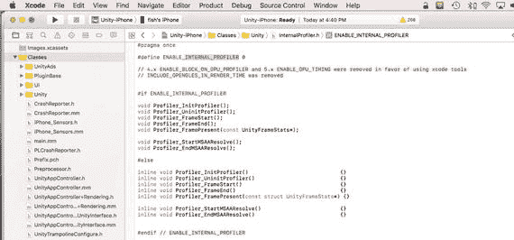

图 14-5.

Unity Xcode 项目中的内置分析器开关

现在，当你点击`Play`时，应用将重新编译并启用内置分析器。在游戏运行时，Xcode 的调试区域每 30 帧会显示一次统计信息，如代码清单 14-3 所示。

```
iPhone Unity internal profiler stats:
cpu-player>    min: 39.8   max: 63.2   avg: 58.0
cpu-ogles-drv> min:  2.1   max:  3.7   avg:  2.4
cpu-present>   min:  0.7   max:  6.6   avg:  1.8
frametime>     min: 47.7   max: 72.2   avg: 64.5
draw-call #>   min:  40    max:  40    avg:  40     | batched:     0
tris #>        min:  5544  max:  5544  avg:  5544   | batched:     0
verts #>       min:  4358  max:  4358  avg:  4358   | batched:     0
player-detail> physx:  0.0 animation:  0.0 culling  0.0 skinning:  0.0 batching:  0.0 render: 58.0 fixed-update-count: 0 .. 0
mono-scripts>  update:  0.2   fixedUpdate:  0.0 coroutines:  0.1
mono-memory>   used heap: 405504 allocated heap: 524288  max number of collections: 0 collection total duration:  0.0
代码清单 14-3.
第四代 iPod Touch 上的内置分析器输出
```

分析结果中首先要关注的是`frametime`，即一帧所花费的总时间，单位为毫秒。如果你以 60 fps 运行，那么`frametime`的平均值应该在 16.7 毫秒左右。如果`frametime`超过 34，那么你甚至达不到 30 fps。`frametime`之后的`draw-call #`行也非常重要，因为它对`frametime`的影响很大。`Draw calls`（绘制调用）是独立的绘制操作。通常每个渲染的网格会产生一次绘制调用，在此基础上添加的光照和阴影还会增加更多的绘制调用。

`player-detail`行对顶部`cpu-player`行所列的时间进行了细分。`player-detail`的时间分配包括`physx`（物理）、`animation`（动画）、`culling`（剔除不需要渲染的对象）、`skinning`（更新动画角色的蒙皮位置）、`batching`（合并具有相同材质的网格以便通过一次绘制调用进行渲染）、`rendering`（渲染）以及`fixed update count`（固定更新次数）。

代码清单 14-3 中的分析结果来自第四代 iPod Touch，显示`frametime`甚至远远达不到 30 fps，更不用说 16 fps 了，并且`player-detail`中`render`（渲染）时间占据了主导地位。已知对性能影响较大的一个因素就是动态阴影，因此让我们在`Light`（光照）组件中禁用阴影（图 14-6）。

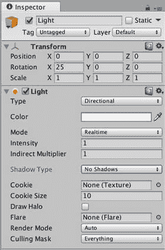

图 14-6.

从保龄球场景光照中禁用阴影

然后再次执行`Build and Run`（构建并运行）操作，开始一次新的分析会话（代码清单 14-4）。


```
iPhone Unity 内部性能分析器统计：
cpu-player>    min:  5.0   max:  7.6   avg:  5.7
cpu-ogles-drv> min:  3.1   max:  7.0   avg:  3.7
cpu-present>   min: 14.4   max: 42.9   avg: 28.1
cpu-waits-gpu> min: 14.4   max: 42.9   avg: 28.1
msaa-resolve> min:  0.0   max:  0.0   avg:  0.0
frametime>     min: 28.5   max: 55.5   avg: 39.5
draw-call #>   min:  29    max:  29    avg:  29     | batched:    10
tris #>        min:  4584  max:  4584  avg:  4584   | batched:  3420
verts #>       min:  3712  max:  3712  avg:  3712   | batched:  2750
player-detail> physx:  0.0 animation:  0.0 culling  0.0 skinning:  0.0 batching:  1.9 render:  3.1 fixed-update-count: 0 .. 0
mono-scripts>  update:  0.2   fixedUpdate:  0.0 coroutines:  0.1
mono-memory>   used heap: 401408 allocated heap: 524288  max number of collections: 0 collection total duration:  0.0
列表 14-4.
移除阴影后的内置性能分析器输出
```

如果你没有在使用 Unity iOS Pro 或者你之前为了性能而关闭了阴影，那么你已经处于这个状态了。无论如何，效果是显著的。关闭阴影大大减少了绘制调用，并且帧时间和渲染时间都更低，尽管帧率仍然低于 30 fps。

### 运行编辑器性能分析器

内置性能分析器能让你大致了解游戏性能的瓶颈所在——例如，是绘制调用、物理计算还是脚本执行。但要精确找出究竟是什么占用了帧时间，仍然有点像猜谜游戏。性能分析器可以记录在编辑器中运行游戏的性能，也可以远程分析，从测试设备捕获性能数据。要分析在测试设备上运行的保龄球游戏，你需要在构建设置中选择 **Development Build** 选项，这将启用 **Autoconnect Profiler** 选项（图 14-7）。

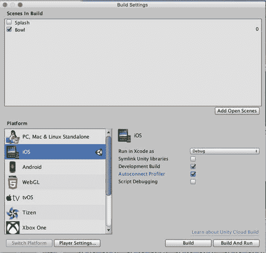

图 14-7.

启用 Autoconnect Profiler 进行构建

执行构建并运行操作，性能分析器窗口应自动出现，并对设备上运行的游戏运行分析会话（图 14-8）。

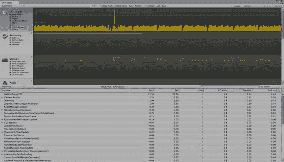

图 14-8.

性能分析器窗口

最顶部的条形图显示的是 CPU 的使用情况。这个特定的分析数据表明你的帧率徘徊在 30 fps 左右。下方的区域显示了按函数调用细分的 CPU 使用情况（图 14-9）。

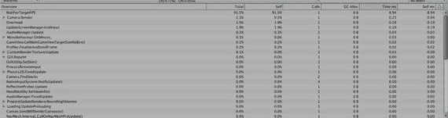

图 14-9.

CPU 使用情况的性能分析器细分

你可以展开项目以查看嵌套的函数调用。图 14-9 表明你的 UnityGUI 函数（包括记分板和暂停菜单）占用了大量时间（这个分析是在暂停菜单打开时记录的）。

### 手动连接性能分析器

如果由于某些原因性能分析器没有自动启动，你可以从 **Window** 菜单中打开它（图 14-10）。

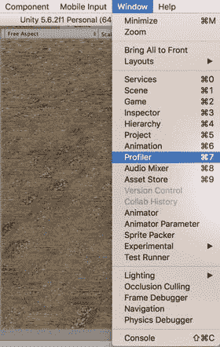

图 14-10.

用于显示性能分析器的 Window 菜单项

性能分析器实际上是一个视图，这就是为什么它被列在 Window 菜单的其他视图中的原因。但是，就像 Asset Store 一样，性能分析器占用了太多屏幕空间，最好让它单独存在于一个浮动窗口中。

一旦性能分析器窗口打开，它会自动开始记录编辑器中的游戏（即使游戏实际上并未运行），因此请单击 **Record** 按钮停止它。然后在 **Active Profiler** 窗口中选择你的 iOS 测试设备（图 14-11），然后再次单击 **Record** 按钮开始分析。

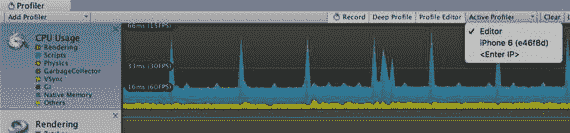

图 14-11.

选择 iOS 设备作为活动的性能分析器

### 添加帧率显示

仅仅为了查看帧率而启用内置性能分析器或通过网络连接到编辑器性能分析器并不方便。这时，屏幕上的帧率显示就派上用场了。这样，当你坐在沙发上看电视并测试自己的游戏时，只需切换打开即可（至少我是这么做的）。

对于屏幕上的帧率显示，你可以像之前制作保龄球记分板那样使用 Unity UI 的 Image 组件。但是，还有另一种在屏幕上显示 2D 文本的方法，那就是使用 UI Text 组件。你可以使用菜单栏上的 **GameObject** 菜单或 Hierarchy 视图中的 **Create** 菜单来创建一个已附加 UI Text 组件的 `GameObject`（图 14-12）。

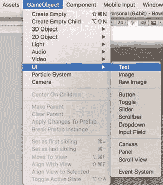

图 14-12.

创建一个 UI Text `GameObject`

让我们继续创建那个 UI Text `GameObject` 并将其命名为 FPS（图 14-13）。

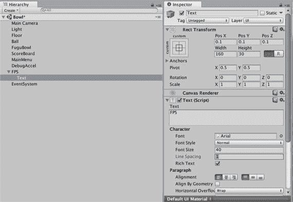

图 14-13.

带有 UI Text 组件的 FPS `GameObject`

就像你用于次要启动画面的 UI Texture 一样，UI Text 在屏幕上使用归一化坐标定位，其中左下角是 (0,0)，右上角是 (1,1)，坐标在 `GameObject` 的 Transform 的 x 和 y 值中指定。将帧率显示对象的 x 和 y 位置都设置为 -0.1，使其靠近左下角，并将文本值更改为 FPS。

不必费心自定义字体，因为帧率显示仅用于开发目的，你不会在发布的应用程序中激活它（尽管在 HyperBowl 中，用户可以激活帧率显示，以便他们报告性能问题）。默认大小值 0 表示将使用字体导入设置中指定的字体大小，但这相当小，所以让我们将其设置为一个合理的大尺寸，40。在这段时间里，`GUIText` 在 Game 视图中是可见的，因此你可以看到尺寸变化的效果（图 14-14）。

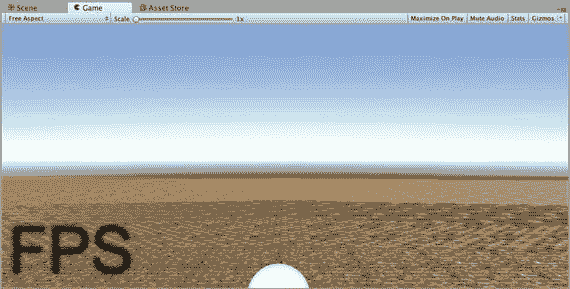

图 14-14.

带有 UI Text `GameObject` 的 Game 视图

正如 UI Image 比 Unity UI 更方便显示静态纹理，无需脚本编写一样，UI Text 是一种比 Unity UI Image 更直接的显示静态文本的方式。但是对于你的帧率显示，你确实需要更改 UI Text 中的文本，你可以通过在脚本中设置 UI Text 实例的 `text` 变量来实现。现在让我们实现帧率显示脚本。创建一个新脚本，将其放置在 Scripts 文件夹中，并命名为 `FuguFPS`（图 14-15）。

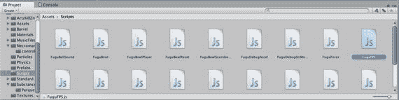

图 14-15.

创建一个新的 `FuguFPS.js` 脚本

然后将列表 14-5 中的 `Update` 函数添加到脚本中。脚本的 `Update` 回调将计算出的帧率赋值给 `guiText.text` 变量，即显示在屏幕上的文本。计算很简单，基于 `Time.deltaTime`，即最近的帧时间。通常，每秒帧数计算为 `1/Time.deltaTime`，但由于 `Time.deltaTime` 受 `Time.timeScale` 缩放，你可以通过使用 `Time.timeScale/Time.deltaTime` 轻松地将其考虑进去。

`GUIText` 中的 `text` 变量是一个 `String` 变量，因此你需要通过调用数字的 `ToString` 函数将帧率值转换为 `String`（每个内置类型都有一个 `ToString` 函数）。然后附加字符串 `"FPS"`，这样你就不会疑惑屏幕上那两个数字是什么了！

```
#pragma strict
function Update()
{
if (Time.deltaTime>0) {
var fps:float = Time.timeScale/Time.deltaTime;
guiText.text  = fps.ToString("f0")+"FPS";
}
}
```

列表 14-5.

完整的帧率显示脚本 `FuguFPS.js`


现在将脚本附加到`FPS GameObject`上。当你在编辑器中点击播放时，应该会看到帧率显示在不同数字之间闪烁。当你对测试设备执行构建并运行操作时，应该会看到帧率显示与内置分析器中获得的数字一致（图 14-16）。

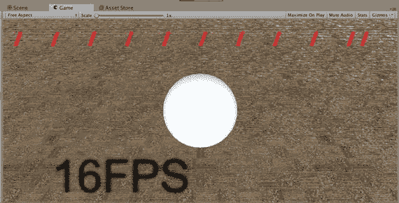

图 14-16. 在测试设备上运行的帧率显示

请记住，在发布此应用之前，你应该停用`FPS GameObject`！

## 优化设置

正确的优化方法是，从最大的瓶颈开始，有条不紊地逐一排查，在每个阶段分析改进效果，直到达到目标。但为了在本章中介绍一系列优化步骤，我们将按顺序依次进行多项优化。

### 质量设置

首先，调整与优化工作相关的全局设置。最可能影响性能的设置是质量设置，它控制游戏的视觉质量（图 14-17）。

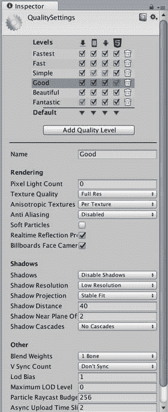

图 14-17. 优化质量设置

目标是追求速度，因此将当前 iOS 质量设置为`Fastest`，然后在此基础上进行调整。零像素光源对于当前光照设置来说是可以接受的。如果你使用了聚光灯，那么缺少像素光源会很明显。

然而，你并不希望强制将所有纹理降为半分辨率。依靠纹理导入设置来逐案限制分辨率会带来更大的灵活性。因此，将纹理质量设置为`Full Res`。

类似地，你还需要将各向异性纹理的设置从`none`改为`per-texture`。各向异性纹理用于补偿倾斜观看时的视觉效果，例如，适用于赛车游戏中道路纹理。与纹理分辨率一样，各向异性可以在其导入设置中针对单个纹理进行调整。

多重采样抗锯齿（全屏平滑）是一项开销较大的操作，正如你所预期的，这是全屏逐像素操作。

本游戏中没有粒子系统，因此软粒子设置无关紧要，但它同样是一项像素密集型操作（这类功能通常被称为受限于填充率）。

阴影已被禁用，因此其下方的所有阴影参数都无关紧要。但如果启用了阴影，两个关键属性是阴影分辨率和阴影距离。这两个属性都会影响阴影的分辨率；提高阴影分辨率自然会使阴影轮廓更清晰，但代价是更大的阴影贴图会消耗更多内存。与缩短相机视锥体以提高深度缓冲区精度类似，更小的阴影距离值减少了对大型阴影贴图纹理的需求。降低阴影分辨率值可以节省空间，但会使阴影边缘更锯齿化；而减小阴影距离值可能会减少参与阴影计算的物体数量。

### 物理管理器

刚体组件在静止时会进入休眠状态，以避免不必要的物理计算。“静止”意味着刚体的平移和旋转运动已停止。你可以在物理管理器（图 14-18）中指定休眠速度和休眠角速度的阈值。物理管理器位于编辑菜单的设置部分。

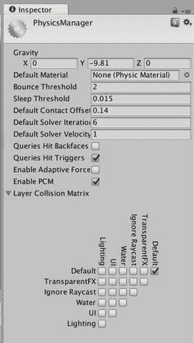

图 14-18. 优化物理管理器

在物理管理器的底部，你还可以指定哪些游戏对象层可以相互碰撞。这对于你的保龄球游戏来说无关紧要，因为所有碰撞物体都位于默认层。但为了说明这一点，让我们修改碰撞表，只允许默认层中的游戏对象与默认层中的其他游戏对象发生碰撞。

### 时间管理器

由于物理更新以固定间隔进行，你可以通过增加时间管理器中的固定时间步长来减少物理计算时间（图 14-19）。理想情况下，固定时间步长应尽可能设置得高，同时不影响物理模拟效果。现在，我们将固定时间步长从`0.02`增加到`0.03`。

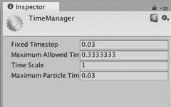

图 14-19. 优化时间管理器

紧邻固定时间步长下方的属性也与物理更新相关：最大允许时间步长。该值限制了每帧用于物理更新的最大时间量。这可以防止出现失控情况，即固定更新占用大量时间并增加帧时间，从而导致下一帧包含更多固定更新，以此类推。降低最大允许时间步长值可以最小化固定更新对帧时间的影响，但存在降低物理模拟质量的风险。

### 音频管理器

音频播放方式也存在优化权衡。在音频管理器（图 14-20）中，你可以指定音频延迟，即播放声音前允许的延迟时间。

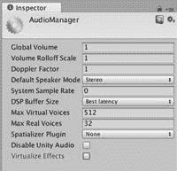

图 14-20. 优化音频管理器

对于响应式声音至关重要的游戏（例如保龄球游戏中的碰撞声音），选择“最佳延迟”（即最低延迟）是合适的。

### 其他设置

其他设置部分包含大量优化选项；它们并不仅限于优化部分（图 14-21）。

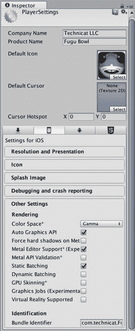

图 14-21. 优化播放器设置中的其他设置

#### 静态批处理

正如在首次分析环节中指出的，绘制调用通常对性能有较大影响。静态批处理通过在构建时合并网格来减少绘制调用，这些网格可以在同一个绘制调用中一起渲染。为了合并网格，它们的游戏对象必须在检查器视图中标记为静态，并且必须共享相同的材质或材质集合。

静态批处理是一个灵活的系统；它会记住每个游戏对象的独特标识，因此，具有静态批处理网格的游戏对象仍可以随时停用，并且仍然受剔除机制影响。

你的保龄球游戏只有一个静态网格，即地面，因此启用静态批处理在此处不会有任何效果。通常，静态批处理能带来良好的性能提升，但代价是占用更多内存，因为它本质上会复制每个被批处理的网格。

#### 动态批处理

下一个选项是动态批处理，它在运行时进行。与静态批处理一样，它要求网格在合并前共享材质，但动态批处理可以处理移动物体，因为它每帧都会检查是否需要重新批处理物体。例如，游戏中的保龄球瓶可以被批处理，因为它们显然都使用相同的材质，毕竟它们都是由同一个预制体实例化而来。然而，保龄球无法与任何球瓶或球道表面进行批处理。

批处理确实需要一些时间，因此它会出现在内置分析器中。但与静态批处理一样，它通常对性能有显著提升。

#### 加速度计频率

加速度计频率默认设置为每秒 60 个样本。通过将该频率降低到`15`，可以节省一些处理时间，这对于你的摇动检测代码已经足够。如果在应用中完全不使用加速度计，请将其设置为`0`。


#### 剥离级别

共有三个递进等级可供选择：字符串程序集、剥离字节码以及“使用微型 mscorlib”。我们选择最后一项，这是最具侵略性的优化方案，同时包含了前两个等级。微型 mscorlib 是核心 Mono 库的一个自定义精简版本，它可能与您导入的其他 .NET 库不兼容，但对于这个游戏来说不成问题。

#### 脚本调用优化

脚本调用优化级别决定了调用原生代码的方式。默认设置“慢速且安全”会产生额外开销，因此我们将其设置为“快速且无异常”。如标签所示，此设置速度更快，但如果原生代码抛出异常（本质上，是一种预期由调用代码处理的错误），则会失败。

#### 优化网格数据

“优化网格数据”选项会在构建时移除所有不必要的逐顶点网格信息。如果网格未使用凹凸贴图着色器，则可以移除切线；如果网格使用的是无光照着色器，则可以移除法线。这样可以节省空间并有助于合批，因为合批会复制所有网格数据。当然，如果您打算在运行时通过脚本将网格的着色器更改为需要比原始着色器更多逐顶点信息的着色器，则不应使用此选项。

## 优化游戏对象

调整质量设置、物理管理器和时间管理器后，您就可以开始微调单个游戏对象了。

### 摄像机

摄像机是优化的焦点（无意双关），因为它决定了渲染什么以及如何渲染。摄像机视锥体自动提供了一种优化途径。完全位于视锥体外的任何游戏对象都对摄像机不可见，因此不会尝试渲染该游戏对象。这种优化称为视锥体剔除，也有益于动画和粒子系统。当没有人能看到动画或粒子时，系统无需播放动画或模拟粒子。

**提示**

渲染游戏对象最快的方法就是根本不渲染它。

因此，调整摄像机的视锥体以包含场景中更少的对象是一种优化途径。您可以通过降低视野来缩小视锥体，也可以通过减小远距离值来缩短视锥体，将近裁剪面移近摄像机（图 14-22）。

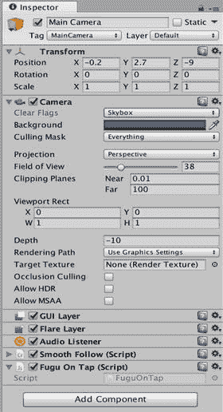

图 14-22. 优化主摄像机

例如，考虑到保龄球场地要小得多，主摄像机中远裁剪面的默认值 1000 就有些过头了。将远距离值设置为 100，所有物体仍然可见（Unity 天空盒很方便地独立于视锥体显示）。

最小化远裁剪面值还有一个额外的好处，即在渲染时深度缓冲区中存储的值范围更小。这避免了深度冲突的问题，即由于深度缓冲区数值精度有限，一个几乎与另一物体重叠的物体看起来像是从前面物体中穿透出来。

通过摄像机剔除游戏对象的另一种方法是，指定它只渲染其剔除掩码中列出的特定层级集合中的游戏对象。这实际上是一个正确性的问题——您需要确保摄像机只渲染它应该渲染的内容，而不是由单独的 HUD 摄像机渲染的 HUD 元素之类的东西。但它确实会影响性能。我曾经遇到过一个错误，主摄像机无意中渲染了 GUI 元素，但由于距离足够远，我没有注意到。

每个摄像机还有一个 `eventMask` 变量，类似于它的剔除掩码（或者等效地，它的 `cullingMask` 变量），但 `eventMask` 变量不是指定摄像机渲染哪些层级，而是确定哪些层级接收来自摄像机的 `onMouse` 事件。最小化 `eventMask` 中存在的层级可以减少 `onMouse` 处理的开销，但由于它在检视面板中不可见，该变量必须通过脚本设置。

最后一项摄像机优化是指定渲染路径。iOS 上有两种可用的渲染路径：顶点光照和正向渲染（延迟渲染不适用于移动平台）。正向渲染比顶点光照更灵活、更强大。例如，顶点光照路径不会显示凹凸贴图。但本章节中，我们极力追求高帧率，因此我们将渲染路径设置为顶点光照。

### 光源

您已经禁用了光源的阴影，这大大提高了性能，因为它减少了绘制调用。并且光照已经受到质量设置的影响，这些设置指定了无像素光照并禁用了阴影（图 14-23）。

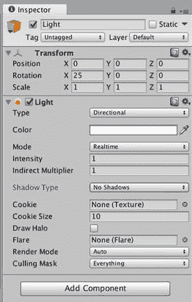

图 14-23. 优化光源

但您可以对光源进行一些额外的调整，类似于对摄像机的微调。与摄像机一样，光源有一个指定的范围，您可以最小化它以减少被照亮的游戏对象数量。光源也有一个剔除掩码，与主摄像机的情况一样，可以将其设置为默认层级，但通过明智地分配层级，可以减少不必要被照亮的游戏对象。

### 球瓶

为了追求速度，您选择了最简单的光照和最简单的渲染路径。您还可以简化每个网格使用的着色器。保龄球瓶构成了场景中的大部分物体，因此我们首先修改 BarrelPin 预制件（图 14-24）。

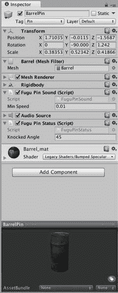

图 14-24. 优化 BarrelPin 预制件

在项目视图中，选择预制件中的 `Barrel` 游戏对象，并在检视面板中单击着色器选择器。有许多比凹凸点光源更简单的着色器；任何材质数量少于两个的着色器都可能更快，而顶点光照将比任何像素着色器更高效。甚至还有一组专为移动设备实现的着色器，包括 `Mobile/Vertex Lit`。但有一种着色器更适合您的情况，即专门实现为仅用于方向光的 `Mobile/Vertex Lit` 着色器。因此，我们选择那个，`Mobile/Vertex Lit (Only Directional Light)`。


#### 地面

`Floor`（地面）`GameObject` 具有一些可通过调整以进行优化的组件属性（图 14-25）。从 `MeshRenderer` 组件开始，`Cast Shadows`（投射阴影）和 `Receive Shadows`（接收阴影）选项均处于启用状态。尽管你已在灯*光和质量设置中禁用了阴影，但仍应留意每个对象的设置，以防将来启用阴影。如果启用了阴影，你会希望阴影投射到地面上，因此应启用 `Receive Shadows`。但由于你并不期望地面投射阴影（至少不会投射到你能看到的任何物体上），让我们禁用 `Cast Shadows` 选项。就性能而言，阴影投射器越少越好。

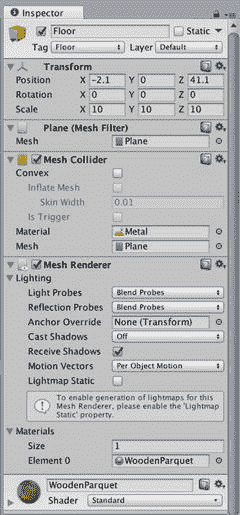

**图 14-25. 优化地面**

转向物理方面，还有另一个优化机会。尽管保龄球瓶和保龄球使用的是基本碰撞体，但你的地面带有 `MeshCollider`（网格碰撞体）组件。由于地面是平整的方形表面，你可以改用 `BoxCollider`（盒体碰撞体）。替换过程很简单：当你向地面添加 `BoxCollider` 组件时，无论是通过 `Inspector`（检视面板）视图中的 `Add Component`（添加组件）按钮，还是通过菜单栏上的 `Component`（组件）菜单，Unity 都会询问你是否要替换现有的 `MeshCollider`（选择“是”），新的 `BoxCollider` 组件将自动调整大小以适配地面网格。

与保龄球瓶类似，你也可以将着色器从相当复杂的 `Bumped Specular`（凹凸高光）着色器更改为 `Mobile/VertexLit (Only Directional Lights)`（移动设备/顶点光照（仅方向光）），正如你对保龄球瓶预制体所做的那样。但地面是一个特例，因为它是平坦的。其表面上的光照是均匀的。因此，你可以使用 `Unlit Texture`（无光照纹理）着色器，完全避免任何光照计算。

#### 球

你将要优化的最后一个 `GameObject` 是球。它已经在使用 `SphereCollider`（球体碰撞体）组件，因此你唯一要更改的是着色器。与保龄球瓶一样，球也会移动，所以让我们使用一个带光照的着色器，具体来说，与为保龄球瓶选择的 `Mobile/VertexLit (Only Directional Light)`（移动设备/顶点光照（仅方向光））着色器相同。然而，球当前使用的是创建时自动分配的默认漫反射材质，你无法更改该材质上的着色器。因此，你需要为球分配一个不同的材质。

你可以用创建其他类型资源相同的方式创建一个新材质。在 `Project`（项目）视图中，调出 `Create`（创建）菜单并选择 `Material`（材质）（图 14-26）。

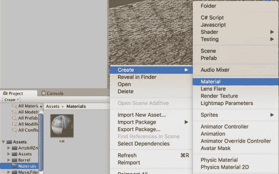

**图 14-26. 创建新材质**

将新材质放入 `Materials`（材质）文件夹并将其命名为 `Ball`。选中它（图 14-27），在 `Inspector`（检视面板）视图中你可以调整其着色器，选择 `Mobile/VertexLit (Directional Light)`（移动设备/顶点光照（方向光））。

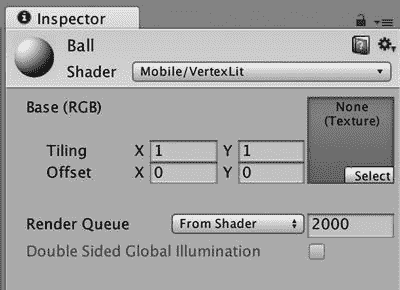

**图 14-27. 为新材质设置着色器**

然后将 `Ball`（球）材质拖放到 `Ball` `GameObject` 上，设置就完成了（图 14-28）。

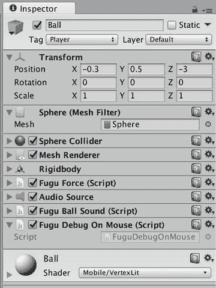

**图 14-28. 优化球**

如果未提供纹理，上述两种 `Mobile/VertexLit`（移动设备/顶点光照）着色器都会显示白色。如果你希望球具有白色以外的颜色，则应使用标准的 `Vertex Lit`（顶点光照）着色器，它允许你指定 `Main Color`（主颜色）和 `Specular (shininess) Color`（高光（光泽）颜色）。

## 优化资源

人们很容易忽略一个事实，即在导入资源时可以进行大量优化，而你可以通过每个资源的导入设置来控制这一点。

### 纹理

你的纹理已经以合理的默认设置导入，但让我们查看几个纹理，以便你理解这些设置。在 `Project`（项目）视图中，让我们查看 `Textures`（纹理）文件夹，并比较你在第 3 章的示例场景中使用的猫纹理（图 14-29）和你在第 12 章中用于次启动画面的纹理（图 14-31）。猫纹理使用了对应 `Texture`（纹理）预设的导入设置，而启动画面纹理使用了 `GUI`（图形用户界面）预设的导入设置。在这两种情况下，从预设切换到 `Advanced`（高级）都会显示该预设的具体设置。

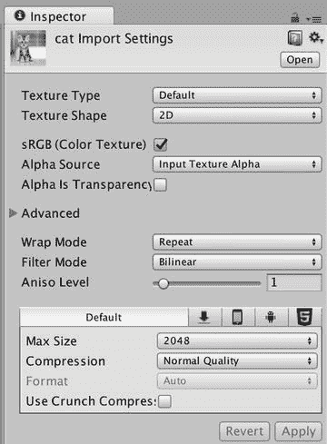

**图 14-29. 纹理的导入设置**

滤镜类型决定了如何为渲染目的计算纹理中的像素（或纹素）。`Bilinear`（双线性）过滤会对最近较小 mipmap 级别的周围纹素进行平均，而 `trilinear`（三线性）过滤则结合了最近较大 mipmap 级别和最近较小 mipmap 级别的双线性过滤结果。`Point`（点）采样是最简单、最快的滤镜，而 `trilinear`（三线性）过滤代价最高。`Bilinear`（双线性）过滤是折中方案，也是合理的默认选择。

Mipmapping（多级渐远纹理）通常是合适的，尽管会占用更多内存。除了改善纹理显示，mipmapping 还允许图形处理器处理更小版本的纹理，这可以提升性能。对于菜单中使用的纹理，你通常只会在一种尺寸下查看它，并且理想情况下是纹理的原始尺寸，因此 mipmapping 并非必要。这对于启动画面来说确实如此，尤其是当它甚至未被加载到场景中时。

**提示**：对于细节清晰的纹理（例如用作路标的纹理），最好使用 `point`（点）采样，甚至完全禁用 mipmapping，以避免纹理模糊。

各向异性（方向相关）过滤级别补偿了纹理相对于摄像机倾斜的情况，例如赛车游戏中的路面。在这些情况下，在两个方向上均匀过滤纹理可能看起来不对。对于场景中的常规纹理，应根据具体情况选择各向异性级别。对于 UI 纹理（从摄像机正面观察），则不需要各向异性过滤。

通常，纹理在导入时会考虑伽马空间（屏幕的非线性色彩空间）。一般来说，这对于 UI 纹理并非必要，因此在这些情况下，会选中 `bypass sRGB`（绕过 sRGB）选项。如果效果不太对劲，可以尝试两种选项。

对于 mipmapping，纹理需要是正方形，并且尺寸是二的幂（POT），因为 mipmap 是按尺寸逐次减半生成的。例如，一个 256 × 256 的纹理将会有 128 × 128、64 × 64 等 mipmap 级别。即使是非 mipmap 纹理，POT 尺寸也有好处，因为图形硬件最终使用的是这种尺寸。大多数为游戏设计的纹理都是 POT 尺寸，但如果不是，纹理的导入设置可以自动将纹理调整为最接近的 POT 尺寸。对于 GUI 纹理，你通常不希望这样。你的启动画面的 `POT` 缩放设置为 `None`（无），生成的预览会显示其原始尺寸和 NPOT（非二的幂）。如果你尝试将其作为场景中的常规纹理使用，Unity 会在 `Console`（控制台）视图中发出警告，提示你以非 GUI 方式使用了 NPOT 纹理，并会导致性能开销。


纹理的最大尺寸（`Max Size`）和压缩级别（`Compression Level`）列在预置设置中，并且独立于预置进行指定。对于常规纹理，默认的最大尺寸值`1024`是合理的（所有设备支持的最大值是`2048 × 2048`），但应根据具体情况选择。例如，如果一个大的纹理只有一种颜色，你完全可以将其设为`2 × 2`的纹理。如果一个纹理仅用于屏幕上较小或较远的网格，那么也没有理由将其设为大的纹理。对于闪屏（`splash screen`），你可以将`Max Size`设为`2048`，以免纹理被缩放得比`iPad Retina`屏幕还小。

> **提示**  
> 将最大缩放比例设为允许的最大值，并将压缩级别设为`TrueColor`，你可以在导入设置的预览区域中看到纹理的原始格式。

对于常规纹理，默认的压缩级别`4-bit PVRTC`（Power VR 纹理压缩）是合理的。细节较少的纹理可以使用更激进的`2-bit PVRTC`。与`mipmapping`一样，纹理压缩减少了纹理映射占用的内存，图形处理器对`PVRTC`的支持提供了额外的性能优势。同样与`mipmapping`类似，特别精细的纹理可能会因压缩而过度降质，此时保持纹理为未压缩的`16-bit`或未压缩的`TrueColor`（`24-bit`）可能更好。对于`GUI`纹理，你可能不想压缩纹理（出于这个原因），或者在播放器设置中指定的闪屏纹理的情况下，应保持其原生格式不变。

### 音频

你已在音频管理器（`Audio Manager`）中调整了`DSP Buffer Size`值，以获得更灵敏的碰撞音效，这以一定的处理开销换取了更低的延迟。与纹理类似，你也可以调整`AudioClip`的导入设置。类比于纹理的两大类用途（3D 和 GUI），声音也有 2D 和 3D 之分：3D 声音与`GameObject`相关联，或者至少与 3D 世界中的某个位置相关；而 2D 声音用于环境音或音乐（例如你在第 5 章的舞蹈场景中添加的歌曲）。

让我们比较一下你的几个保龄球音效：球瓶碰撞音效（图 14-30）和球滚动音效（图 14-31）。这两种音效都源自世界中的某个位置，甚至会相对于主摄像机（`Main Camera`）移动（更准确地说，是相对于附加到主摄像机上的`AudioListener`组件移动）。因此，在它们的导入设置中都被标记为 3D 声音。3D 声音应为单声道（`mono`），而非立体声。幸运的是，这两个音效的原始音频文件都是单声道的，所以你无需选择“`Force to mono`”。

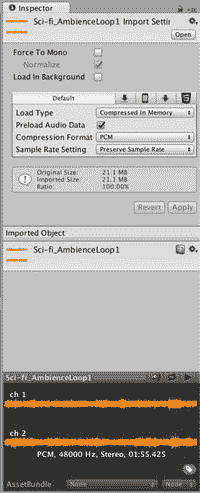

图 14-31. 优化球滚动音效的导入设置

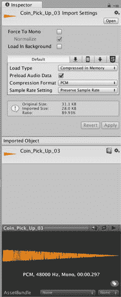

图 14-30. 优化球瓶碰撞音效的导入设置

碰撞音效文件相当小，因此我们保持其未压缩状态，以避免解压缩音效带来的处理开销，并最大化播放质量。滚动音效文件较大，因此我们将其压缩并在内存中保持压缩状态。由于这是唯一压缩的音效，并且`iOS`有硬件支持同时解码一个压缩音效，因此你不会产生任何软件解码开销。但是，如果场景中同时播放环境音或音乐，那么这些文件很可能大得多，你反而会希望对它们进行压缩。

> **提示**  
> 导入未压缩的音效，以便灵活决定在编辑器中压缩哪些音效。除非你找到的压缩工具能提供比 Unity 压缩更好的质量，否则没有必要导入已压缩的音频。

选择压缩后，无间隙循环（`gapless looping`）选项变为可用。这会强制压缩过程处理音频剪辑的结尾，使其能够无缝循环，这正是你需要的，因为你要循环播放这个音效。

对于压缩音频，除了“`Uncompress on load`”和“`Compressed in memory`”之外，还有一个加载选项：“`Stream from disc`”。从磁盘流式传输会有一些额外的开销，但对于连续播放多首歌曲的场景来说，这是一个很好的选择，因为将所有歌曲都保留在内存中是行不通的。

### 网格

大多数影响优化的网格相关导入设置（图 14-32）主要影响内存使用。

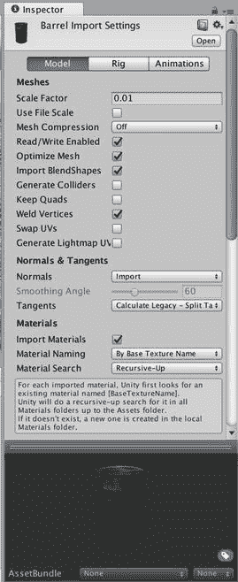

图 14-32. 优化网格的导入设置

第一个是网格压缩（`Mesh Compression`），它通过降低数值精度（即用于表示顶点、法线、纹理坐标和切线的位数）来减少网格占用的空间和内存。这也会降低视觉质量，因此最好进行试验，找到不降低外观效果的最大压缩级别。可用的级别有低（`Low`）、中（`Medium`）、高（`High`）和无（`None`）。默认值为`None`。

在网格压缩下面列出的是读写启用（`Read/Write Enabled`）。默认情况下它是开启的，会创建一个可以修改的网格副本。但如果你没有任何读取或写入网格变量（如顶点和法线）的脚本（通常不需要），则可以保持此选项关闭。

优化网格（`Optimize Mesh`），不要与播放器设置中的网格优化（`Mesh Optimization`）选项混淆，它通过优化网格三角形列表的排列来提供一些性能改进。

如果你不打算使用网格碰撞器（`Mesh collider`），请关闭生成碰撞体（`Generate Colliders`）。事实上，作为一项规则，关闭此选项是个好主意，因为如果需要，你总可以手动添加网格碰撞器，但通常更倾向于添加一个或多个基本碰撞体。

如果你知道此网格的着色器不需要法线或切线，则可以分别将法线（`Normals`）和切线（`Tangents`）选项设置为`None`。但是，如果你在播放器设置（`Player Settings`）中选择了网格优化（`Mesh Optimization`），未使用的顶点数据会在构建时被自动移除。

## 优化脚本

常见的代码优化技巧同样适用于 Unity 中的脚本编写。例如，你已经特别注意调用`Vector3`的`magnitudeSquared`函数而不是`magnitude`，以避免其内部的开平方根运算。但我将在以下章节中描述一些不太明显的方法，用于提高脚本性能或使用脚本来改善性能。


### 缓存 GetComponent

通常来说，如果一个值会被多次计算，无论是数学表达式、函数调用的结果，还是访问可能内部执行了函数调用的实例变量或静态变量，将其赋给一个变量都是个好主意。

你在脚本中访问的组件快捷变量，例如 `transform`、`audio` 和 `rigidbody` 就是这种情况。每个变量都会触发一次 `GetComponent` 调用，在所有附加到 `GameObject` 上的组件中搜索类型匹配的组件。

因此，每当你在脚本中需要多次引用某个组件的快捷变量时——无论是在脚本中多次列出，还是在诸如 `Update` 这样的回调中反复引用（特别是当这个快捷变量在多次迭代的循环中被引用时），你都应该尽早将该组件赋给一个变量。清单 14-6 展示了如何将这个优化应用到你的 `FuguReset` 脚本中。

```
#pragma strict
private var startPos:Vector3;
private var startRot:Vector3;
// 为了性能
private var trans:Transform = null;
private var body:Rigidbody = null;
function Awake() {
// 缓存 Transform 引用
trans = transform;
body = rigidbody;
// 保存此 GameObject 的初始位置和旋转
startPos = trans.localPosition;
startRot = trans.localEulerAngles;
}
function ResetPosition() {
// 恢复到初始位置
trans.localPosition = startPos;
trans.localEulerAngles = startRot;
// 确保停止所有物理运动
if (body != null) {
body.velocity = Vector3.zero;
body.angularVelocity = Vector3.zero;
}
}
清单 14-6.
优化后的 FuguReset.js 脚本
```

`FuguReset.js` 的原始版本引用了两个组件快捷变量：`transform` 和 `rigidbody`。因此，你添加了两个名为 `trans` 和 `body` 的私有变量来引用这些组件，并在 `Awake` 回调中初始化 `trans` 和 `body`。

这种清理优化将适用于你的许多脚本，因为你们经常引用 `transform`、`rigidbody` 和 `audio`。我不会列出所有修订后的代码，但更新后的脚本可以在本章的项目文件中找到，网址是 [`www.apress.com/9781484231739`](http://www.apress.com/9781484231739)。

### UnityGUI

详细的性能分析结果表明，UnityGUI 在你的帧时间中占据了很大一部分。UnityGUI 变慢的一个原因是使用 `GUILayout` 自动放置 GUI 元素带来的开销。你在记分板中没有使用 `GUILayout`，因此可以在 `FuguBowlScoreboard` 脚本中添加一个设置 `useGUILayout` 为 `false` 的 `Awake` 回调（清单 14-7）。

```
function Awake() {
useGUILayout = false;
}
清单 14-7.
在 FuguBowlScoreboard.js 中将 useGUILayout 设置为 false
```

暂停菜单仍然使用 `GUILayout`，但因为该菜单只在游戏暂停时出现，不会影响游戏玩法，其性能问题并不那么重要。

### 运行时静态合批

动态合批可以组合那些在构建时因移动或是在游戏运行期间创建而无法进行静态合批的相似网格。但动态合批必须不断更新合批，这就是合批时间会列在性能分析结果中的原因。如果被合批的对象是一起移动的，或者虽然未移动但是在运行时实例化的，那么这种重复合批似乎是一种浪费。此外，由于合批需要占用内存，动态合批的数量有上限（Unity 文档目前说是 30,000 个顶点，但这个数字可能会发生变化）。

幸运的是，有一个名为 `StaticBatchingUtility` 的类，允许你通过调用 `Combine` 函数在运行时执行静态合批。清单 14-8 显示了一个非常简单的脚本，它只是在脚本的 `GameObject` 上调用 `StaticBatchingUtility.Combine`。

```
#pragma strict
function Start() {
StaticBatchingUtility.Combine(gameObject);
}
清单 14-8.
用于静态合批对象层次结构的脚本
```

虽然简单，但这个脚本功能齐全。例如，在旋转立方体场景中，如果你将此脚本拖到带有两个子立方体的主旋转立方体上（并禁用子立方体的独立旋转脚本），那么当场景开始播放时，所有三个立方体将被静态合批在一起。被合批的 `GameObjects` 不必处于同一个层次结构中。`StaticBatchingUtility.Combine` 是一个重载函数，另一个版本接受两个参数：一个是要批处理的 `GameObjects` 数组，另一个是指定为父对象的 `GameObject`。

### 共享材质

要进行合批，无论是静态合批、动态合批，还是通过调用 `StaticBatchingUtility.Combine` 进行合批，要合批的网格都必须共享相同的材质或材质集合。但在动态合批中，需要特别小心，如果你修改材质，可能会破坏这种共享关系。

例如，清单 14-9 中的脚本通过不断改变材质的纹理偏移量来为其制作动画。这会产生滚动纹理的效果；在 HyperBowl 中，此脚本用于为滚动霓虹灯、天空中飘动的云彩以及流淌的水制作纹理动画。然而，当脚本通过调用其 `SetTextureOffset` 函数修改材质时，如果原始材质恰好是被共享的，则会创建一个新材质。

```
#pragma strict
var speed:Vector2;
var materialIndex:int=0;
private var offset:Vector2;
private var material:Material;
function Start() {
offset=new Vector2(0,0);
material = renderer.materials[materialIndex];
}
function Update () {
var dtime:float = Time.deltaTime;
offset.x=(offset.x+speed.x*dtime)%1.0f;
offset.y=(offset.y+speed.y*dtime)%1.0f;
material.SetTextureOffset("_MainTex",offset);
}
清单 14-9.
对材质的纹理坐标偏移进行动画处理的脚本
```

当然，这也很合理。如果你使用相同的材质创建了两个 `GameObjects`，并决定通过修改其中一个的材质来改变其外观，你通常不希望同时对另一个 `GameObject` 进行同样的更改。

但是，如果你要对所有共享同一材质的 `GameObjects` 应用相同的动画，那么就没有理由停止共享该材质。因此，你可以修改脚本，转而访问 `MeshRenderer` 的 `sharedMaterials` 变量，而不是 `materials` 变量。访问 `sharedMaterials`（如果你假设 `GameObject` 上只有一个材质，则访问 `sharedMaterial`）意味着你确实想要更改共享材质，并避免创建新材质，从而保持合批资格。为了同时处理共享和非共享材质的情况，让我们添加一个公共变量，允许你指定动画是否会破坏材质共享，并使用该值来决定是修改 `renderer.materials` 还是 `renderer.sharedMaterials`（清单 14-10）。

```
#pragma strict
var speed:Vector2;
var materialIndex:int=0;
var shared:boolean = true;
private var offset:Vector2;
private var material:Material;
function Start() {
offset=new Vector2(0,0);
if (shared) {
material = renderer.sharedMaterials[materialIndex];
} else {
material = renderer.materials[materialIndex];
}
}
function Update () {
var dtime:float = Time.deltaTime;
offset.x=(offset.x+speed.x*dtime)%1.0f;
offset.y=(offset.y+speed.y*dtime)%1.0f;
material.SetTextureOffset("_MainTex",offset);
}
清单 14-10.
带有共享材质选项的纹理动画脚本
```

在使用此脚本对共享材质进行动画处理时，还有一个额外（尽管不那么重要）的优化。让每个使用相同材质的 `GameObject` 都运行相同的纹理动画脚本是冗余的；只需一个脚本实例就足以驱动所有对象的动画。


### 最小化垃圾回收

垃圾回收会在游戏中引入明显的卡顿。最小化这些卡顿最有效的方法就是尽量减少垃圾回收的必要性，而这可以通过减少最终被回收器回收的对象数量来实现。其中一种技术是将对象保留在对象池中以便重用，而不是让它们被垃圾回收。你也可以通过调用 `System.GC.Collect` 来显式触发回收器。例如，你可以在保龄球游戏控制器的 `Awake` 回调中添加该调用，以确保在游戏开始前进行一次垃圾回收，这将立即清理上一场景中残留的所有未使用对象（清单 14-11）。

```
function Awake() {
player = new FuguBowlPlayer();
CreatePins();
System.GC.Collect();
}
```

## 离线优化

到目前为止，你所做的所有更改都是可以立即通过测试运行和分析来观察效果的快速优化。Unity 还集成了一些可以大幅提升性能的商业场景预处理工具：Beast 和 Umbra。这些工具不会在本章中使用，因为它们的设置和运行相当耗时，而且坦白地说，它们对你这简单的场景作用不大。但我将在下面的章节中简要介绍它们。

### Beast

在不造成严重性能损失的情况下添加高质量实时光照是很困难的。每增加一个像素光源就会产生更多的绘制调用，阴影代价高昂，而且最终的视觉效果不如桌面端，更不用说离线渲染的计算机生成场景了。Beast 通过生成光照贴图解决了这两个问题，这是一种预先计算好的、被“烘焙”到纹理中的光照。当然，没有任何事情是免费的——除了设置和烘焙时间外，烘焙了光照贴图的场景最终会增加额外的大纹理，占用更多内存，增加应用程序大小，并延长场景加载时间。

要为当前场景生成光照贴图，你首先必须将所有不动的 `GameObject`（包括灯光）标记为静态，因为你只能为固定的灯光和表面预先计算光照。光照贴图作为第二层纹理叠加在网格之上。然后，你需要从编辑器菜单栏的 Window 菜单中打开 Lighting 窗口（图 14-33）。

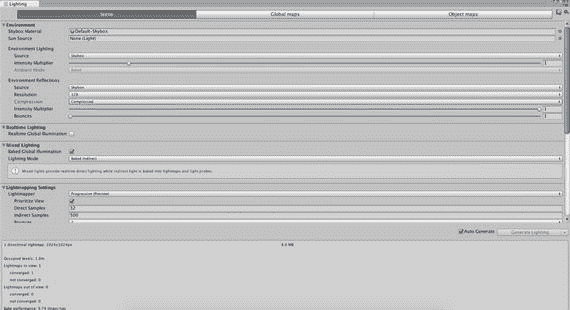

图 14-33. Lighting 窗口

在该窗口中，你可以在 Object 面板中调整每个对象的光照贴图属性，然后切换到 Bake 面板来设置光照贴图属性并启动光照贴图烘焙。

请注意，Unity iOS 上不支持双光照贴图，因为该功能需要延迟光照，所以只能使用单光照贴图。动态光照和静态光照的效果不太容易混合，尤其是在有阴影的情况下。

### Umbra

我之前提到过，每个摄像机都会执行视锥体裁剪，忽略所有位于摄像机视锥体之外的 `GameObject`。那些不熟悉实时计算机图形学的人可能会认为被遮挡的对象（即被其他对象挡住了视线）也会被裁剪掉，但事实并非如此。视锥体内的所有对象都会被渲染，然后使用深度缓冲来逐像素判断哪个对象在前。判断一个对象是否位于视锥体之外是一个相对直接的计算，但判断哪些对象被遮挡则需要一些预处理。这就是 Unity 集成 Umbra 作为遮挡剔除工具的作用所在。

为场景添加遮挡剔除类似于为场景烘焙光照贴图的过程。你需要将不动的对象标记为静态，然后从 Unity 编辑器菜单栏的 Window 菜单中打开 Occlusion Culling 窗口（图 14-34）。

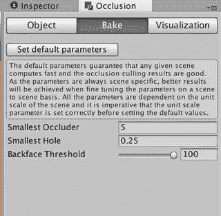

图 14-34. Occlusion Culling 窗口

然后，你可以在 Object 标签中调整每个对象的遮挡剔除设置，然后在 Bake 标签中指定遮挡剔除设置并烘焙遮挡剔除数据。

## 最终分析

现在你已经完成了对项目的优化过程，是时候再次对游戏进行分析了（清单 14-12），不过，如果你想有条不紊地进行，就应该在每次更改后都运行一次分析来观察其效果。

```
iPhone Unity internal profiler stats:
cpu-player>    min:  5.0   max:  9.7   avg:  6.1
cpu-ogles-drv> min:  3.4   max:  7.4   avg:  4.2
cpu-present>   min:  0.9   max: 10.5   avg:  4.2
cpu-waits-gpu> min:  0.9   max: 10.5   avg:  4.2
msaa-resolve> min:  0.0   max:  0.0   avg:  0.0
frametime>     min: 13.5   max: 22.1   avg: 16.6
draw-call #>   min:  30    max:  30    avg:  30     | batched:    10
tris #>        min:  4592  max:  4592  avg:  4592   | batched:  3420
verts #>       min:  3728  max:  3728  avg:  3728   | batched:  2750
player-detail> physx:  0.0 animation:  0.0 culling  0.0 skinning:  0.0 batching:  2.2 render:  3.4 fixed-update-count: 0 .. 0
mono-scripts>  update:  0.1   fixedUpdate:  0.0 coroutines:  0.0
mono-memory>   used heap: 389120 allocated heap: 524288  max number of collections: 0 collection total duration:  0.0
清单 14-12.
优化后的内置分析结果
```

分析显示平均帧时间为 16.6 毫秒，刚好接近 60 帧/秒。目标达成！这个分析是在第四代 iPod touch（相当于 iPhone 4）上运行的，因此根据你的设备，实际效果可能会有所不同。

player-detail 行显示帧时间主要由批处理和渲染占用，因此图形是剩下的瓶颈，再花更多时间进行脚本优化将得不偿失。如果你觉得 30 帧/秒也可以接受，那么你现在就有很好的条件来添加更多内容和功能了。

## 进一步探索

我在本章开头提到了过早优化的风险，生怕在你能正常运行之前就把事情搞复杂了。但从开发之初，你就应该牢记你的性能目标。从简单开始（Unity 文档建议在 iPhone 3GS 上渲染不超过 40,000 个顶点），让一些功能跑起来，优化到足以达到你的性能目标，然后继续添加内容和功能，每当游戏性能低于你的目标时就停下来优化。并且一定要记住分析并优化瓶颈。把时间花在只占你帧时间 10% 的部分上进行优化，而放着另一个占 50% 的部分不管，是没有任何意义的。

### Unity 手册

在 Unity 手册中，“iOS 开发入门”部分有若干页名为“iOS 性能优化”，涵盖了你在优化构建时调整的播放器设置，描述了内置分析器，并展示了如何优化构建大小。

“高级”部分记录了 Unity Pro 版中可用的 Profiler 以及之前提到的离线优化功能：光照贴图和遮挡剔除。“高级”部分还包括许多其他与优化相关的页面：“优化图形性能”、“减少文件大小”、“自动内存管理”（垃圾回收）和“阴影”（特别是“阴影性能”）。“资源包”和“加载资源”页面解释了如何按需下载资源并将其带入场景，这是一种可用于管理已安装应用程序大小的技术。


### 参考手册

`Reference Manual` 描述了您优化的所有组件和资源。在这些组件中，您调整了摄像机视锥体和可见性遮罩，调整了剔除遮罩和灯光距离并禁用了其阴影，最小化了每个 `MeshFilter` 的阴影投射器和接收器数量，简化了每个 `MeshRenderer` 的着色器，并将 `MeshCollider` 替换为 `Box` 碰撞器。您还检查了组件所引用的各种资源类型的导入设置：`Texture2D`、`AudioClip`、`Mesh` 和 `Animation`。`Reference Manual` 还记录了您自定义的设置管理器，包括 **Quality Settings**、**Physics Manager**、**Time Manager** 和 **Audio Manager**。您还使用了 `GUIText` 组件（它是用于启动画面的 `GUITexture` 的兄弟组件）来显示帧率。

### 脚本参考

`Scripting Reference` 的“脚本概览”部分有一个“性能优化”页面，其中包含一些关于如何编写更快脚本的技巧。您在本章中学到的一个新函数是 `StaticBatchingUtility` 类中的静态函数 `Combine`（`Combine` 是该类中唯一的函数），您调用它来在运行时批处理一组 `GameObjects` 的层级结构。您在本章中学到的一个新变量是 `MonoBehaviour` 类中的 `useGUILayout` 变量，当将其设置为 `true` 时，它通过告知 UnityGUI 系统当前 `OnGUI` 回调不会使用 `GUILayout` 函数执行任何自动布局来提高性能。

所有设置管理器都有相应的类，以便可以通过脚本查询和设置它们的设置。由于除 `Render Settings` 之外的所有设置管理器在整个游戏中都是全局激活的，而非按场景激活，因此脚本访问允许您为每个场景调整设置。例如，您可以为每个场景定义一个质量级别，并为每个场景添加一个加载相应质量级别的脚本。本章讨论的设置管理器对应的类包括 **Quality Settings**、**Audio Settings**、**Physics** 和 **Time**。

您还使用了 `Time` 类，评估了其 `timeScale` 和 `deltaTime` 变量，并设置 `GUIText` 的 `text` 变量来实现基本的帧率显示。

### 资源商店

`Asset Store` 列出了一些性能分析系统（搜索 `profiler`）和一些对象池系统（搜索 `pool`），例如 **PoolManager**、**Smart Pool** 和 **Pooling Manager**。

### 网络资源

Unity 维基百科网站 [`http://wiki.unity3d.com/`](http://wiki.unity3d.com/) 在其“技巧、窍门和工具”部分提供了一些性能优化技巧和几个与性能相关的脚本。特别是，“FramesPerSecond”页面列出了几个比您在本章中创建的更复杂的帧率显示脚本（例如，它们通过一系列帧计算帧率以获得更稳定的显示）。

Umbra 遮挡剔除系统由 Umbra Software 开发，网址为 [`http://umbrasoftware.com/`](http://umbrasoftware.com/)。Beast 光照贴图系统是 Autodesk 的产品，其产品页面位于 [`http://gameware.autodesk.com/beast`](http://gameware.autodesk.com/beast)。

### 书籍推荐

我已经多次提到《*Real-Time Rendering*》（ [`http://realtimerendering.com`](http://realtimerendering.com) ），但它与本章中的图形优化确实非常相关。仅关于 mipmapping 的论述就值得一读。

# 15. 接下来去哪里？

至此，您已经完成了 Unity 和 Unity iOS 开发的入门指南，包括下载和安装 Unity、在 Unity 编辑器中开发一个简单的保龄球游戏、使其在 iOS 上运行，以及最终优化它以获得可接受的性能。由于本书并未涵盖所有 Unity 功能或游戏开发主题（否则这本手册将开始像一套多卷百科全书！），我将以一章的“深入探索”作为总结。

## 更多脚本编程

关于 Unity 脚本编程，我仅触及了表面，不仅是所提供的脚本语言种类和丰富的 Unity 类库，还涉及了脚本编写的内容。

### 编辑器脚本

如果您觉得 Unity 编辑器中缺少某些功能，那么很有可能您可以通过编写编辑器脚本来自行添加。这些脚本也是用 JavaScript、C# 或 Boo 编写的，但它们位于项目视图的 `Editor` 文件夹中。编辑器脚本可以通过一组编辑器类访问编辑器 GUI、项目设置和项目资源，这些类在脚本参考的“编辑器类”部分有文档说明。

举个例子，让我们在 Unity 编辑器菜单栏上创建一个菜单，其中包含用于激活和停用整个 `GameObjects` 层级结构的命令。换句话说，这些命令会对层级结构中的每个 `GameObject` 调用 `SetActive`，相当于在 Inspector 视图中点击每个 `GameObject` 的复选框。

在 Unity 4 之前，每个 `GameObject` 只有一个由 Inspector 视图中的活动复选框和 `GameObject` 变量 `active` 表示的激活状态。但从 Unity 4 开始，Inspector 视图中的复选框表示 `GameObject` 的局部激活状态，可以通过脚本调用 `SetActive` 设置，并通过 `GameObject` 变量 `activeSelf` 读取。全局或“真正”的激活状态取决于其所有父级是否也在局部处于激活状态。因此，确保层级结构中所有 `GameObject` 在局部激活后，可以通过切换根 `GameObject` 的激活状态来停用整个组。手动点击所有这些复选框可能既费力又容易出错，因此一个执行此操作的单一命令将非常有用，特别是对于将项目升级到 Unity 4 的开发者来说。

创建编辑器脚本的过程与创建用于场景的脚本相同，只是编辑器脚本必须位于 `Editor` 文件夹中。因此，让我们在项目视图中创建一个新的 JavaScript，将其命名为 `FuguEditor`，并放置到 `Editor` 文件夹中（图 15-1）。

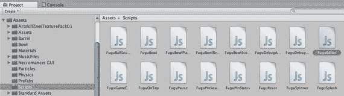

图 15-1. 创建新的编辑器脚本

现在向脚本中添加清单 15-1 中的代码。

```
#pragma strict
@MenuItem ("FuguGames/ActivateRecursively")
static function ActivateRecursively() {
if (Selection.activeGameObject !=null) {
SetActiveRecursively(Selection.activeGameObject,true);
}
}
@MenuItem ("FuguGames/DeactivateRecursively")
static function DeactivateRecursively() {
if (Selection.activeGameObject !=null) {
SetActiveRecursively(Selection.activeGameObject,false);
}
}
static function SetActiveRecursively(obj:GameObject,val:boolean) {
obj.SetActive(val);
for (var i:int=0; i<obj.transform.GetChildCount(); ++i) {
SetActiveRecursively(obj.transform.GetChild(i).gameObject,val);
}
}
@MenuItem ("FuguGames/ActivateRecursively", true)
@MenuItem ("FuguGames/DeactivateRecursively", true)
static function ValidateGameObject() {
return (Selection.activeGameObject !=null);
}
```

**清单 15-1.** `FuguEditor.js` 的完整清单

`@MenuItem ("FuguGames/ActivateRecursively")` 这一行会在编辑器菜单栏的 `FuguGames` 菜单中添加一个 `ActivateRecursively` 菜单项，如果菜单尚未创建则会创建它。`@MenuItem` 行之后的函数会在选择该菜单项时被调用。`ActivateRecursively` 会检查编辑器中是否已选中一个 `GameObject`，如果是，则将该 `GameObject` 连同值 `true` 一起传递给函数 `SetActiveRecursively`。`SetActiveRecursively` 依次对层级结构中的每个 `GameObject` 调用 `SetActive` 并传入值 `true`。

之后，一段类似的代码会在菜单中添加一个 `DeactivateRecursively` 项，仅在名称和传递给 `SetActiveRecursively` 的值（传递 `false` 而非 `true`）上有所不同。


尽管你可以在调用 `SetActiveRecursively` 之前检查对象是否被选中，但从用户界面设计的角度来说，更好的做法是：如果一个菜单项不会产生任何效果，就将其禁用。你可以通过再次列出 `MenuItem` 属性来实现，不过这次要额外添加一个 `true` 参数，该参数表示下一个函数是一个静态函数，仅当菜单项应该处于激活状态时才返回 `true`。`ActivateRecursively` 和 `DeactivateRecursively` 都使用了 `ValidateGameObject` 函数（该函数仅用于检查编辑器中是否选中了某个 `GameObject`），来判断菜单项是应该可用还是灰显。

此脚本编译后，新的菜单应该会出现，如图 15-2 所示（可能会有延迟）。

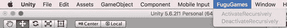

图 15-2.  
使用编辑器脚本添加到菜单栏的菜单

这个示例的用户界面很简单，只有几个菜单项，但编辑器脚本可以使用 UnityGUI 函数创建新的窗口和用户界面（实际上编辑器就是用 UnityGUI 实现的，这就是为什么偶尔在控制台视图中看到的编辑器错误会显示为 UnityGUI 错误）。编辑器脚本还可用于批处理、导入后的资源后处理，或构建前的场景预处理。我编写过一些简单的编辑器脚本，用于删除构建文件、显示 `GameObject` 统计数据，甚至调用 macOS 的 `say` 命令来让自己能和自己对话。

### C#

我在本书中主要使用 Unity 的 JavaScript，原因很简单：我必须选一种语言。JavaScript 比 C# 更简洁，至少对于小型脚本来说是如此。只需比较一下项目视图中通过“创建”菜单生成的空 JavaScript 脚本（列表 15-2）和 C# 脚本（列表 15-3）就能看出区别。

```
#pragma strict
function Start () {
}
function Update () {
}
```

列表 15-2.  
新建的 JavaScript 脚本

```
using UnityEngine;
using System.Collections;
public class NewBehaviourScript : MonoBehaviour {
// Use this for initialization
void Start () {
}
// Update is called once per frame
void Update () {
}
}
```

列表 15-3.  
新建的 C# 脚本

在 C# 脚本中，类声明是显式的，你必须确保类名与脚本名匹配。在 C# 脚本顶部，显式导入了 Unity 脚本中常用的两个命名空间：`UnityEngine` 和 `System.Collections`。而在 JavaScript 中，它们是隐式导入的。

大量 JavaScript 代码只需少量修改就能在 C# 中运行，但两者在语法上存在一些差异。例如，变量声明以 `<type> <name>` 开头，而不是 `var <name>:<type>`。函数的定义方式也不同，C# 以返回类型和函数名开头，而不是以 `function` 开头。没有理由在 C# 文件中添加 `#pragma strict`，因为 C# 本身就是强类型语言。

对于小型脚本，JavaScript 更便捷；但对于大型 Unity 开发项目，C# 可以说是更实用的选择，因为它是一种文档更完善、经过工业级强度测试的语言，同时也是最流行的 Mono 和 .NET 语言。此外，许多 Unity 扩展包都是用 C# 编写的（包括 Prime31 插件、EZGUI 和 NGUI），而且在 Unity 中混用 JavaScript 和 C# 很不方便；如果你的 JavaScript 代码引用了 C# 脚本，这些脚本必须放在 `Plugins` 或 `Standard Assets` 文件夹中，以便它们更早地加载。

使用 C# 的另一个原因是 Unity 5 中为 C# 增加了对命名空间的支持。这一特性允许你省去给类名添加前缀来避免冲突的操作。例如，列表 15-4 展示了 `FuguFrameRate` 脚本的 C# 版本，其中类是在命名空间声明内定义的。

```
using UnityEngine;
using System.Collections;
namespace Fugu {
sealed public class FrameRate : MonoBehaviour {
public int frameRate = 60;
void Awake () {
Application.targetFrameRate = frameRate;
}
}
} // end namespace
```

列表 15-4.  
`FuguFrameRate` 脚本的 C# 版本

由于该类位于 `Fugu` 命名空间内，你可以安全地将该类直接称为 `FrameRate`，并将脚本命名为 `FrameRate` 以保持一致。如果你需要从另一个脚本引用此类，就必须使用完全限定名 `Fugu.FrameRate`，除非你在该脚本顶部添加了 `using Fugu;` 语句。C# 允许你在类定义前使用 `sealed` 关键字，这指定了该类不可被继承。如果尝试定义 `FrameRate` 的子类，将会导致编译器错误。Java 程序员会认出这等同于 Java 的 `final` 声明。

在 C# 中，协程必须显式返回 `IEnumerator` 类型（该类型位于 `System.Collections` 命名空间中，这就是为什么总是导入该命名空间会很方便）。尽管 Unity 会在新建的 C# 脚本中自动添加一个返回 `void` 的 `Start` 回调，但你可以通过将返回类型从 `void` 改为 `IEnumerator`，将这个 `Start` 回调变成一个协程。

`StartCoroutine` 可以从任何回调中调用，因此这种技术具有提供统一的协程调用方式的优点，并且无需将回调直接用作协程（也无需记住哪些回调可以用作协程）。在 JavaScript 中应用这种做法也是不错的。


你不能再像在 JavaScript 中那样，在协程里直接调用 `yield`。在 C# 中，你需要调用 `yield return null` 来实现等待一帧的效果。

另一个不同之处在于匿名函数的语法。在我们的 `FuguGameCenter` 脚本中，我们传入了未命名的成功或失败函数，形式为 `function(success:boolean) {...}`；但在 C# 中，匿名函数被称为 lambda 函数（这个术语源于 Lisp 语言，它使用 `(lambda (success) ...)`），其形式为 `(bool success) => {...}`。代码清单 15-5 展示了 `FuguGameCenter` 脚本的 C# 版本。

```
using UnityEngine;
using System.Collections;
using UnityEngine.SocialPlatforms.GameCenter;
namespace Fugu {
sealed public class GameCenter : MonoBehaviour {
public bool showAchievementBanners = true;
// 初始化时调用
void Start () {
#if UNITY_IPHONE
Social.localUser.Authenticate ( (bool success) => {
if (success && showAchievementBanners) {
GameCenterPlatform.ShowDefaultAchievementCompletionBanner(showAchievementBanners);
Debug.Log ("已验证身份 "+Social.localUser.userName);
}
else {
Debug.Log ("未能验证身份 "+Social.localUser.userName);
}
}
);
#endif
}
static public void Achievement(string name,double score) {
#if UNITY_IPHONE
if (Social.localUser.authenticated) {
Social.ReportProgress(name,score, (bool success) => {
if (success) {
Debug.Log("成就 "+name+" 报告成功");
}  else {
Debug.Log("报告成就 "+name+" 失败");
}
} );
}
#endif
}
static public void Score(string name,long score) {
#if UNITY_IPHONE
if (Social.localUser.authenticated) {
Social.ReportScore (score, name, (bool success) => {
if (success) {
Debug.Log("已将 "+score+" 提交到排行榜 "+name);
}  else {
Debug.Log("将 "+score+" 提交到排行榜 "+name+" 失败");
}
} );
}
#endif
}
}
}
代码清单 15-5.
C# 版本的 FuguGameCenter
```

最后，你可能会最怀念 JavaScript 的一个特性是：能轻松地修改 `transform` 中的 `Vector3` 值。代码清单 15-6 展示了一行简单的 JavaScript 代码，它仅修改了 transform 位置中的 `x` 分量。

```
function Start () {
transform.position.x=0;
}
代码清单 15-6.
在 JavaScript 中修改 Transform 的 Vector3
```

在 C# 中，这行代码会产生一个编译器错误，因为 `Vector3` 是一个结构体（struct），而不是类（class），因此它是值类型，而非引用类型。它在 JavaScript 中能工作是一种便利（尽管有误导性，因为它确实让 `Vector3` 看起来像一个类，而不是结构体）。

由于 `Vector3` 是一个结构体，你无需担心垃圾回收器需要清理一堆未使用的 `Vector3` 实例，因为，好吧，根本没有实例。但这确实意味着在 C# 中，如果你想修改 transform 的位置，你必须创建一个新的 `Vector3`，如代码清单 15-7 所示。

```
void Start () {
transform.position = new Vector3(0,transform.position.y,transform.position.z);
}
代码清单 15-7.
在 C# 中修改 Transform 的有效方法
```

请注意，在 C# 中，你必须在 `Vector3` 构造函数前指定 `new`，而在 JavaScript 中这是可选的。这是 JavaScript 的一个小便利（这类便利通常被称为“语法糖”），但 C# 的优势在于允许你以类似于定义类的方式定义自己的结构体。在 JavaScript 中，你可以使用结构体，但无法定义新的结构体。Andrew Stellman 和 Jennifer Greene 的 *深入理解 C#（Head First C#）*（O'Reilly 出版）是一本很好的 C# 入门书籍，但有经验的程序员可以通过 *C# 7.0 本质论（C# in a Nutshell）*系列（同样由 O'Reilly 出版）快速上手 C#。特别是 Java 程序员会发现 C# 很熟悉（尽管名字如此，C# 与 C 或 C++ 并无关联，除非你算上遥远的祖先）。

### 脚本执行顺序

在结束脚本编写话题之前，还有一个问题值得一提：指定脚本之间的执行顺序。如果你查看保龄球游戏中用于控制主摄像头的 `SmoothFollow` 脚本，你会看到摄像头位置不是在 `Update` 回调中更新，而是在 `LateUpdate` 回调中更新。`LateUpdate` 在每个帧中都会被调用，就像 `Update` 一样，但一个帧中的所有 `LateUpdate` 调用都在所有 `Update` 调用完成之后才进行。`SmoothFollow` 在 `LateUpdate` 中计算摄像头位置，因此它会考虑其目标在 `Update` 回调中发生的任何位置变化。

同时拥有 `Update` 和 `LateUpdate` 回调是游戏引擎中的一种常见技术，但它的作用也仅限于此。如果你希望一个 `GameObject` 在另一个 `GameObject` 的 `LateUpdate` 之后更新呢？抱歉，没有 `LateLateUpdate` 回调！但 Unity 确实有一个更通用的解决方案，即脚本执行顺序设置，可以通过编辑菜单的项目设置子菜单调出（图 15-3）。

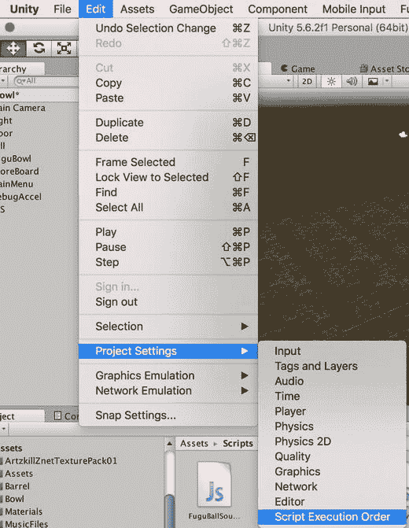

**图 15-3.** 调出脚本执行顺序设置

当选中一个脚本时，也可以通过点击检查器视图中显示的“执行顺序”按钮来调出脚本执行顺序设置。无论哪种方式，脚本执行顺序设置都会显示在检查器视图中（图 15-4）；你会看到一个初始只包含一个“默认时间”项的列表。

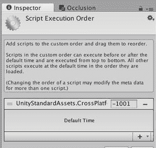

**图 15-4.** 检查器视图中的脚本执行顺序设置

要添加一个会在 `FuguForce` 之后执行的脚本，你可以点击脚本执行顺序设置右下角的加号（+）按钮，并从弹出的菜单中选择 `FuguForce` 脚本。默认情况下，`FuguForce` 脚本会出现在脚本执行顺序设置中“默认时间”设置的下方，这意味着 `FuguBowl` 将在所有其他脚本之后运行。

然后你可能会决定，游戏控制器脚本 `FuguBowl` 应该在所有其他脚本之后运行（例如，因为它不断检查保龄球的位置），但 `SmoothFollow` 除外。因此，再次点击 + 按钮添加 `FuguBowl` 脚本，然后使用左侧的拖动柄将 `FuguBowl` 拖到 `SmoothFollow` 上方、默认时间下方，最终得到一个如图 15-5 所示的列表。任何被拖到默认时间上方的脚本都会在所有其他脚本之前执行。

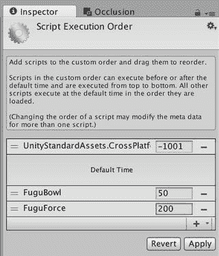

**图 15-5.** 指定 `FuguBowl.js` 和 `SmoothFollow.js` 的执行顺序

点击脚本右侧的减号（-）按钮将从脚本执行顺序设置中移除该脚本。

### 插件

前面多次提到第三方插件，其中一些可在资源商店中找到，许多来自 Prime31 Studios。但如果你恰好熟悉 C、C++ 或 Objective-C，你可以编写自己的插件，无论是为了访问更多设备功能，还是为了使用用 C、C+ 或 Objective-C 编写的库。除了包含原生库之外，插件还需要额外的 Unity 封装脚本。该过程在 Unity 手册“高级”部分的“插件”页面中有详细说明。


## 跟踪应用

尽管 iTunes Connect 提供下载量和销售额数据（其图表比曾经是唯一选项的 `.csv` 报告更易读），但也有几种第三方产品可以跟踪应用销售数据以及应用排名和评论等其他信息。

`App Annie`（`http://appannie.com/`）和 `AppFigures`（`http://appfigures.com/`）是两个较为流行的基于 Web 的产品，它们能自动每天从 iTunes Connect 下载应用数据（但需要在账户设置时提供 iTunes Connect 登录信息）。这两个产品都能以漂亮的图表展示销售数据，并每天发送应用统计摘要邮件。`App Annie` 目前是免费的（严格来说处于测试阶段），而 `AppFigures` 则收取费用。

图 15-6 显示了 Fugu Bowl 一个月内下载量的 `App Annie` 图表。更新下载量叠加在销量之上。其中有一条更新线对应 FuguBowl 更新的发布情况。

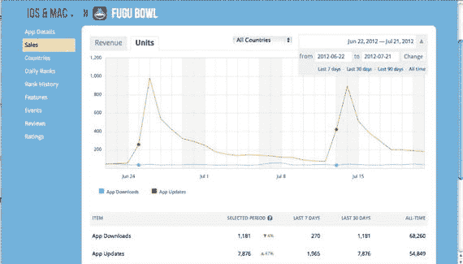

图 15-6. `App Annie` 销售图表

`AppViz` (`http://appviz.com/`) 是一款 macOS 应用程序，它实现相同功能，但将数据下载到你的 Mac 上，并提供多种图表，包括按地理区域划分的销售情况（图 15-7）。`AppViz` 不是免费的，但价格不高，我认为物有所值。

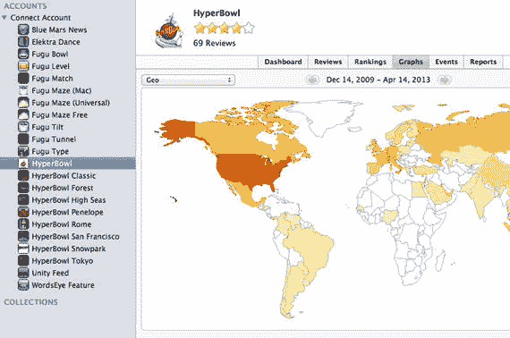

图 15-7. `AppViz` 地理视图

你完全不必只局限于使用其中一种产品。我使用 `AppViz` 来确保本地拥有所有应用的销售数据，我喜欢它多样的图表功能以及 App Store 评论下载功能。同时，我使用 `App Annie` 来获取自动发送的每日销售数据邮件和排名展示（在 `AppViz` 中下载所有排名数据耗时较长），而且 `App Annie` 还支持一些安卓应用商店。另外，它是免费的！

**提示**

你可以从 `AppViz` 导出已下载的所有数据，然后将这些数据导入到像 `App Annie` 这样的其他产品中。由于苹果只会在 iTunes Connect 上提供一年的应用销售数据，因此这是一种确保你能够将应用的全部销售历史记录导入到销售跟踪产品中的方法。

### 推广码

我描述过如何在应用通过 App Store 审核后下载推广码，但我没有说明如何使用它们。其实有很多选择。几乎所有应用评论网站都接受附带推广码的评论请求。`Touch Arcade`（`http://toucharcade.com/`）就是其中之一，但它还有一个非常活跃的论坛，开发者可以在那里发放推广码。`AppGiveaway`（`http://appgiveaway.com/`）则会在特定时间段内开展发放推广码的促销活动。这比自己发放方便得多，尽管你也应该自己发放。保留推广码的库存也是推动应用更新的一个绝佳理由，因为每次更新你都能获得一批全新的 50 个推广码。

## 更多盈利方式

考虑到每年都需要缴纳苹果开发者费用和 Unity 授权费用，你很可能希望至少能收回这些成本。

### 应用内购买

除了应用销售，苹果为 iOS 提供了另一种收入渠道：一个名为 `Storekit` 的应用内购买（IAP）系统。Unity iOS 没有针对 IAP 的脚本接口，但 `Prime31 Studios` 在其产品中提供了一个 `Storekit` 插件。Unity 手册提供了一些关于如何下载和激活通过 IAP 购买的额外内容的提示，而 iTunes Connect 文档则解释了如何设置应用内购买。

### 资源商店

我在我的应用中使用了数十个免费和付费的 `Asset Store` 资源包，你一定会发现 `Asset Store` 对你的个人项目非常有用。但 `Asset Store` 也是一个自助发布产品并产生收入的地方（Unity 抽取 30% 的分成，这与苹果在 App Store 上的分成比例相同）。你也可以在 `Asset Store` 上免费发布资源包，以获得认可或作为对社区的贡献（在本书的示例中，我确实受益于这种慷慨）。

方便的是，`Asset Store` 的提交工作可以直接在 Unity 编辑器内完成，使用的是从 `Asset Store`（名字很贴切）下载的 `Asset Store` 工具。你可以从项目中提交任何类型的资源集合——音频、纹理、模型、脚本、插件，甚至整个项目。

**提示**

使用预处理器指令确保切换构建目标时不会出现编译错误，如果你使用了 Unity Pro 功能，请添加一个自定义的 `UNITY_PRO` 预处理器指令，这样 Unity Basic 用户就不会遇到问题。

与 `App Store` 提交一样，`Asset Store` 提交的大部分工作涉及创建截图、图标、应用描述和商店素材。在 `Asset Store` 上成为卖家的说明可在 `http://unity3d.com/asset-store` 找到。

### 为安卓开发

本书中几乎所有为 Unity iOS 开发的内容都能很好地兼容 Unity Android。不出所料，任何属于 `iPhone` 类的内容在安卓上也不可用（例如，我们用来检查设备类型的变量 `iPhone.generation`），但所有在 iOS 上工作的 `Input` 类内容在安卓上也以同样的方式工作，包括触摸屏和加速度计功能。

`Prime31 Studio` 和其他供应商提供 Unity Android 插件，以提供对设备功能和移动服务的更多访问，例如 `AdMob` 移动广告服务。

安卓的构建和提交流程也有所不同。安卓不需要 Xcode，而是需要安装 Android SDK。你仍然可以从 Unity 编辑器调用“构建并运行”操作，但与为应用构建 Xcode 项目不同，Unity Android 会直接构建可执行的应用文件（APK 文件）。并且，与 iOS 开发不同，安卓开发可以面向多个应用商店。特别是 Google Play 没有审核过程，因此它是快速自助发布的好途径，也是被苹果拒绝的应用的一个有用的备用渠道。

### 外包工作

在开发下一个热门应用的同时，独立开发者通常通过承接外包工作来支付账单。潜在客户可以在 Unity 论坛的“付费工作”主题、`http://unity3dwork.com/` 甚至像 `http://odesk.com/` 这样的一般承包商网站上找到。有些市场专门从事移动应用开发，例如 `http://apptank.com/` 和 `http://theymakeapps.com/`。

如果你正在寻找全职的游戏开发工作，无论是否涉及 Unity，使用 Unity 进行游戏开发的经验，更不用说自助发布的游戏作品集，都只会对你有所帮助。


## 结语

至此，我的分享就要结束了。理想情况下，你现在已经准备好并充满热情地开始制作属于自己的 Unity iOS 应用。如果说这本书能带给你一个启示，那就是：从简单开始，不断积累，直到它变成有趣的作品。不要成为那种一上来就想做大型多人在线游戏作为首个项目的人！请记住，要持续学习并参与 Unity 社区——在 Unity 论坛和 Unity Answers 网站上既贡献答案也寻求帮助，同时别忘了查看 Unity 维基。向社区推广你的作品（Unity 论坛设有“作品展示”版块）并请他人帮忙宣传是完全可以的，但也要记得回报他人！作为使用 Unity iOS 开发自己项目的一个意外收获，我结识了一群开发者，我们可以互相倾诉、庆祝成功并交流宝贵技巧。我无法逐一列举他们，但你可以在我的 Twitter 关注列表中找到他们：`@fugugames`。顺便说一句，Twitter 也是与其他 Unity 开发者进行更私密交流的绝佳渠道。我还通过 Twitter 与许多客户有过沟通，也曾成功为我的游戏（尤其是《HyperBowl》）创建了 Facebook 产品页面。虽然应用客户有时以刻薄著称，但我发现他们中的大多数人都支持和理解我们独立开发者，并且如果你愿意让他们参与，他们会热情地成为开发过程的一部分。事实上，我不仅获得了大量免费的质量检测和本地化翻译帮助，还收到了许多反馈。所以，快去建立你的 Twitter 动态和 Facebook 粉丝专页，开始交流吧！

最后也是最重要的——玩得开心。其他任何回报都是锦上添花！


# 索引 A

高级物理球桶、保龄球瓶，资源商店中 `BarrelPin` 预制体盒子 `BoxCollider`、`CapsuleCollider` 碰撞器组件复制复合碰撞器 `GameObjects`、子对象 `HyperBowl` 粘贴组件拾取预制体项目视图更新、预制体球道加长保龄球瓶分配预制体，使用胶囊创建碰撞预制体 `rigidbody`，球局 `BroadcastMessage` `FuguReset` 脚本落球槽消息列表 `ResetPosition` 可重置资源资产脚本引用声音添加 `AudioClip`、`AudioSource` 获取声音 `OnCollision` 回调保龄球瓶碰撞滚动声音 `Animation`、`AnimationClip` 循环 `AudioClips` Gianmarco Leone 的通用音乐集检查器视图中的场景音乐舞池层级视图平面位置场景视图跳舞骨架资源商店 `AudioClip` 计算机图形学参考实用隐藏立方体轨道阴影定向光贴图点光源 `QualitySettings` 旋转、定向光骨架、游戏视图柔和阴影骨架舞蹈 `Skeletons Pack` 舞池粒子效果项目视图搜索结果蒙皮剑盾苹果开发者网站 `AudioListener` B 保龄球球控制 `Collider` 组件 `MeshCollider`、`PhysicMaterial` 参见 `PhysicMaterials` `HyperBowl` 球控制器脚本 `FixedUpdate` 回调 `FuguForce` 脚本 `OnCollisionEnter` 回调脚本创建 `Speed Check` `TagManager` 更新回调 `Rigidbody` 组件 `Collision Detection` 属性 `Constraints` 属性 `Gravity` 属性检查器视图 `Interpolation` 属性 `Is Kinematic` 属性 `PhysicsManager` `SmoothFollow` 脚本球体 `MeshFilter` 组件 C `Climber Game` 构建设置 Mac 平台 OS X 应用控制台视图 `EditorLayout` 参见 `Unity Editor` 游戏视图参见 `Game View` 层级视图参见 `Hierarchy View` 检查器视图参见 `Inspector View` 播放模式项目菜单项目视图参见 `Project View` 资源手册教程版本控制场景场景视图参见 `Scene View` 选择、项目向导控制台视图 C# 脚本类声明 `FuguFrameRate` `FuguGameCenter` 新脚本有效修改向量变换 `Cube` `GameObject` 对齐视图 `BoxCollider` 组件创建取景 `MeshFilter` 组件 `MeshRenderer` 组件移动 `Transform` 组件 D，E 数据通用编号系统（DUNS）设备输入加速度计调试检查器视图、摇晃暂停日志输出、日志打印值摇晃检测摄像头资源商店 `GameObject` iCade 附加 iOS 开发者库 `Prime31` `Etcetera` 插件照片脚本引用 `WebCam` 触摸屏调整变量球滑动球点击控制调整检测滑动 `FuguDebugOnMouse` `FuguOnTap` 输入 `OnMouseDown` 射线投射 `TouchPhase.Began` F 视野（FOV）有限状态机（FSM）`FlareLayer` `FuguBowl` 清除函数继承玩家分数结构定义 `FuguBowlPlayer`，创建 G `GameObjects`，通过脚本移动参见 `Scripts` 游戏脚本资源商店 `FungBowlPlayer` 控制台视图逻辑、状态机有限状态机设计初始化状态机列表状态机、保龄球状态参见 `State` 协程跟踪 yield 函数保龄球瓶状态唤醒回调桶瓶 `FuguPinStatus` `GetPinsDown` 函数 `pinBodies` 变量 `RemovePins` 函数 `ResetPins` 函数引用规则分数清除函数 `ClearScore` 函数构造函数帧 `FungBowlPlayer` `FungBowlScore` `GetScore` 函数 `HyperBowl` 计分板列表 `MonoBehavior` 玩家分数递归函数 `SetBallScore` `SetSpareScore` `SetStrike` 函数设置商店网页实用手册游戏视图自由宽高比 `Gizmos` 最大化播放统计数据图形用户界面（GUI），游戏资源商店音频面板致谢页面图形面板主页面菜单选项显示暂停菜单当前页面显示、菜单除零枚举 Escape 键 `GUILayout` 函数布局、自动 `OnGUI` 回调 `PauseGame` 函数脚本创建状态图 `Time.deltaTime` 取消暂停参考手册计分板保龄球 `FuguBowlScoreboard` `GUIStyle` 脚本样式 UnityGUI 代码脚本引用系统面板颜色自定义 `GUISkin`、暂停菜单 `Necromancer GUI` 暂停菜单脚本选择、颜色皮肤自定义实用手册 `GUILayer` H 层级视图检查 `GameObject` 父对象 `GameObjects` 高动态范围（HDR）I 检查器视图编辑器设置锁定 `.meta` 扩展文件 iOS 开发者计划 App Store 图形应用图标截图构建和运行 iTunes Connect 参见 `iTunes Connect` 配置门户应用标识开发配置描述文件设备测试分发配置描述文件文档注册 Xcode 管理器 `iOS Team Provisioning Profile` `La Petite Baguette` 分发 `techdev` `techdist` `iOS Team Provisioning Profile` iTunes Connect 添加/管理应用应用信息应用类型可用性和价格图标和截图、上传推广码评分部分拒绝流程销售跟踪更新上传准备版本、类别和版权信息 J，K 即时（JIT）编译器 L Lambda 函数 `La Petite Baguette` 分发 Linden 脚本语言（LSL） M，N `Main Camera` 解剖 `AudioListener` 组件组件 `Clear Flags` 属性 `Culling Mask` 属性深度 HDR 透视投影渲染路径纹理视口 `FlareLayer` 组件 `GUILayer` 组件多个 `Transform` 组件 `MouseOrbit` 脚本 `Camera` `GameObject` 导入包 O 优化资源音频碰撞声音压缩、网格导入设置网格 mipmapping 纹理资源商店 `GameObjects` 球 `BarrelPin` 预制体摄像头地板视锥体剔除光源主摄像头保龄球瓶着色器设置离线野兽 `Lightmapping` 窗口遮挡剔除 umbra（Pro）配置文件自动连接 Profiler 构建日志内置 Profiler 控制台应用搜索文件夹 CPU 使用率 Profiler 显示帧率编辑器 Profiler（Pro）第四代 iPod Touch FPS `GameObject` 帧时间 `FuguFPS` 游戏视图统计 `GUIText` `GameObject` `GUITexture` 手动连接 Profiler 阴影禁用参考手册脚本引用脚本缓存 `GetComponent` 垃圾回收最小化运行时静态批处理（Pro）共享材质 `System.GC.Collect` 纹理动画 UnityGUI 设置加速度计频率音频管理器动态批处理网格数据多重采样抗锯齿物理管理器质量脚本调用优化静态批处理时间管理器目标选择帧率脚本附加脚本创建空间定位 unity 手册网页 P，Q `PhysicMaterials` 调整值解剖 Bouncy vs. Ice 创建到材质字段项目视图 `Standard Assets` `Physics` 和控制保龄球参见 `Bowling ball` 保龄球场景资产组织系统删除 `GameObjects` 地板重新贴图检查器视图灯光调整 `Main Camera` 点光源 `Save Scene` 作为 Substance 存档木条 `ProceduralMaterial` PhysX 软件开发工具包 `Point Light` `GameObject` 调整 `Color` 属性 cookie 纹理创建 `Culling Mask` 属性 `Draw Halo` 属性 `Flare` 属性 `Halo` 属性检查器视图强度 `Lightmapping` `Range` 属性 `Render Mode` `Shadow Type` 属性 `Type` 设置项目视图资产搜索检查器视图操作资产缩放图标切换（单列和双列）顶层 R 射线投射刚体模拟 S 场景视图摄像头控制摄像头视图 `GameObject` 选择 `Gizmos` 导航选项倾斜透视俯视图截图和图标活动指示器显示 `PlayerSettings` GUI 缩放 `BeginPage` 函数暂停菜单退出按钮计分板 `ScreenWidth` 变换矩阵 iOS 保龄球 `FuguBowl` 玩家设置方向、自动旋转 iOS 开发者库参考手册脚本、活动指示器辅助屏幕开始和停止脚本引用设置导入、纹理 Prerendered 图标项目视图大小调整播放器启动画面（pro）`ApplicationLoadLevel` 构建设置创建默认实用 `FuguSplash` 脚本 `GUITexture` 加载场景方向场景创建屏幕分辨率辅助屏幕等待和加载 `WaitForSeconds`，实现纹理脚本调试编译错误 MonoDevelop 运行时错误文件夹创建解剖回调执行 `FuguRotate` 脚本检查器视图方法 MonoDevelop 编辑器命名脚本引用组织资产预制体 `Apply Changes To Prefab` `Break Prefab Instance` 子立方体、编辑克隆一个 `GameObject` 项目视图旋转 `Cube` `Transform` 组件 `Transform.Rotate` 在世界空间脚本引用状态协程 HyperBowl、落球槽 `ResetCamera` 和 `ResetBall` 函数 `SmoothFollow` 脚本 `StartGameOver` `StateBall1` `StateBall2` `StateBall3` `StateGutterBall` `StateNewGame` `StateNextBall` `StateRolledPast` `StateRolling` `StateRollOver` `StateSpare`、`StateStrike` 和 `StateKnockedSomeDown` 语法糖 T `techdev` 配置文件类型推断 U，V，W，X，Y，Z 唯一设备标识符（UDID）Unity Editor 默认布局游戏视图 Android 货币化、开发应用商店合同工作应用内购买新项目创建、添加资产预设布局 2x3 视图菜单 4 分割视图窄视图宽视图推广码场景视图 C# 编辑器脚本脚本执行顺序 JavaScript 脚本列表、`FuguEditor` 菜单添加插件 `SetActive` `SetActiveRecursively` 设置、执行顺序跟踪 App Annie 销售图表 AppViz 工作区自定义添加视图分离视图移动视图移除视图调整区域 Unity iOS Angry Bots，iOS 版本应用商店应用游戏 iOS 开发者库参考手册实用手册播放器设置其他设置即时编译器优化技术分辨率和呈现选择移植测试，iOS 模拟器 Angry Bots 附加或替换构建提示、位置和名称退出 iOS 项目使用 Xcode 选项进度指示器保存截图命令选择、iPad 或 iPhone Xcode 项目文件夹测试、远程设备分辨率、最小化远程应用 Xcode 安装 Unity 项目资源商店 `Cube` 参见 `Cube` `GameObject` `MouseOrbitscript` 参见 `MouseOrbit` 脚本新项目创建菜单项新场景项目向导 `Save Scene` 选项 `PointLight` 参见 `Point Light` `GameObject` 参考手册纹理资源商店 `Cube` 游戏视图 `Import Asset` 命令导入窗口检查器视图项目视图 Unity 手册 Unity 系统社区游戏开发 iOS 开发者、注册为 Mac 准备页面下载版本 Xcode、下载安装错误报告文档文件夹执行安装程序付费激活、许可证欢迎屏幕 iOS 开发需求管理错误报告 Indie（浅色）编辑器偏好设置 Pro（深色）报告窗口皮肤更改更新、检查手册参考网站 Unity 导览 Angry Bots，应用程序加载关卡 Climber Game 参见 `Climber Game`
