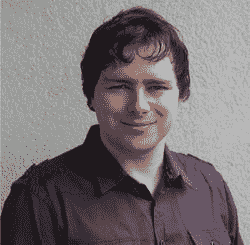

# 关于技术审阅者

**马克·谢雷尔**是一名互动媒体软件工程师，通过其位于瑞士的公司 Gayasoft（`http://www.gayasoft.net`）为全球客户提供面向移动、桌面和网页平台的互动学习、培训和娱乐体验。

他使用 Unity 引擎，自 2007 年该技术 1.x 版本时代便开始使用，并通过适当的扩展来增强其功能。

马克在 3D 图形、网络技术、软件工程和互动媒体领域拥有深厚背景，他从青少年时期开始构建这些技能，后来通过在苏黎世联邦理工学院攻读计算机科学以及计算科学与工程专业的教育进一步巩固。

他将这些知识应用于 Popper（`http://www.popper.org`），这是一个由哈佛大学支持的交互式三维行为研究平台，基于 Unity、Mathlab 以及 Gayasoft 开发的 ExitGames Photon 平台构建。

随着严肃游戏的兴起，马克目前正致力于他和他的公司研究下一代交互式和沉浸式体验的选项和技术，通过增强现实和虚拟现实技术（`Metaio`、`OpenCV`、`Oculus Rift`）以及新型输入设备（`Razer Hydra`、`Leap Motion`）。

