# 排版后的内容

在前进的道路上，我们将通过逐步的项目示例来学习 Unity 编辑器，以及如何整合图形、音频、物理和脚本制作游戏，然后专门针对 iOS 进行开发。我们会利用 Unity 资源商店中的免费美术资源和音频，因此不必从头创建 3D 模型或音效样本，可以舒适地待在 Unity 的范围内（除非在制作 iOS 版本时需要涉足 Xcode）。不过，我们会大量使用 Unity 版本的 JavaScript 进行脚本编写。重点将放在使用 Unity 内置的脚本函数上，但我也会向你介绍能够提供更多功能的 Unity 插件和包。

你可以在`Apress.com`网站`http://www.apress.com/9781430248750`或`http://learnunity4.com/`上找到源代码。

## 进一步探索

没有人无所不知。因此，成功开发的关键在于知道如何找到所需的工具、资源、信息和帮助。所以在每章末尾，我会推荐一些阅读材料和资源，供你进一步探索。

我先从这里开始，推荐其他有价值的 Unity 书籍。即使主题相同，阅读不同书籍对同一主题的不同见解也很有用。例如，威尔·戈德斯通撰写了最早的 Unity 书籍之一《Unity 游戏开发精要》；苏·布莱克曼的《从零开始学 Unity 3D 开发》是一本从艺术家视角出发的厚重著作，呈现了一个冒险游戏；杰夫·默里在《使用 Unity 3D 进行 iOS 游戏开发》中则以卡丁车竞赛游戏为例，介绍了 Unity iOS 开发。

既然我怀旧地提到了苹果电脑，那么也应该推荐一些苹果历史读物。《山谷中的革命》是安迪·赫兹菲尔德撰写的一本有趣的 Mac 开发轶事集。史蒂夫·沃兹尼亚克的《iWoz》引人入胜地窥探了苹果早期历史及沃兹本人，而保罗·孔克尔的《苹果设计：苹果工业设计组的作品》则描绘了经典 Mac 系列（这里所说的经典，指的是 1997 年之前的所有产品）。

尽管本书大量使用了示例游戏项目，但不会过多讨论游戏设计。不过，关于这个主题确实有很多有趣的读物。我最喜欢的游戏设计书籍是理查德·劳斯的《游戏设计：理论与实践》，它主要是对著名游戏设计师的采访合集。此外，Gamasutra 网站（`http://gamasutra.com/`）上还有大量游戏设计文章和博客。

## 第 1 章：开始入门

Unity 是一个跨平台 3D 游戏开发系统，由一家名为 Unity Technologies（最初名为 Over the Edge）的公司开发。说 Unity 是跨平台的，具体是什么意思呢？首先，Unity 编辑器——作为 Unity 核心的游戏创建和编辑工具——可以在 OS X 和 Windows 上运行，这体现了跨平台性。更令人印象深刻的是，从 Unity 编辑器我们可以为 OS X、Windows、网页浏览器（使用 Flash、Google Native Client 或 Unity 浏览器插件）、iOS、Android 和游戏主机构建游戏，这也体现了跨平台性。而且这个列表还在不断增长（就在本书出版前不久，Unity Technologies 宣布支持 BlackBerry 10）！

至于 3D，Unity 是一个 3D 游戏开发系统，因为 Unity 内置的图形、声音和物理引擎都在 3D 空间内运行，非常适合创建 3D 游戏，但许多成功的 2D 游戏也是在 Unity 中开发的。

本书描述的是撰写时最新版本的 Unity，即 Unity 4.1.2，但 Unity 发展迅速，即便是小版本更新（自 Unity 4 开始，Unity Technologies 推出了更快的增量更新计划，因此更新频率更高）也会带来新功能和用户界面变化。当然，这一点适用于所有其他方面，包括 Unity、苹果和第三方供应商的产品、许可证和价格。

### 前置条件

在进入有趣的部分——学习如何使用 Unity 编辑器并构建游戏之前，你需要下载 Unity、安装它并激活许可证。虽然你会在头几章中跟随 Unity 编辑器中的逐步示例进行操作，直到稍后才进入 iOS 开发（顺便说一下，iOS 最初代表 iPhone 操作系统，但现在包括 iPod Touch 和 iPad），但尽早开始准备 iOS 开发所需的条件也不失为一个好主意。

#### 准备你的 Mac

对于 iOS 开发，你需要一台运行 Lion 或 Mountain Lion 版本 OS X（即 10.7 及以上版本）的 Mac。Unity 4 仍然可以在较旧版本的 OS X 上运行，比如 Snow Leopard，但目前需要 Lion 和 Mountain Lion 才能运行最新版本的 Xcode，这是苹果为 iOS 开发所需的软件工具。通常，需要使用最新或较新版本的 Xcode 才能针对最新版本的 iOS 进行开发。

### 注册成为 iOS 开发者

尽快访问苹果开发者网站注册成为 iOS 开发者是值得的，因为审批过程可能需要一段时间，特别是如果你注册的是公司。首先，你需要在该网站注册成为苹果开发者（免费），然后登录并注册成为 iOS 开发者（每年 99 美元会员费）。这是将你的应用部署到测试设备以及提交应用到 App Store 所必需的。

#### 下载 Xcode

虽然直到本书的 iOS 部分你才需要 Xcode，但你现在就可以从 Mac App Store（只需搜索“xcode”）或苹果开发者网站`http://developer.apple.com/`下载 Xcode。当你开始构建 Unity iOS 应用时，我会更详细地介绍 Xcode 的安装。

#### 下载 Unity

要获取 Unity，请访问 Unity 网站`http://unity3d.com/`并转到下载页面。在那里你会找到最新版本 Unity 的下载链接（目前是 Unity 4.1.2）以及发布说明的链接（包含在安装程序中）。还有一个旧版本列表的链接，以防你出于某种原因需要回滚到之前的 Unity 版本。

**提示：** 当你在 Unity 网站上时，不妨四处看看。查看演示、常见问题解答、各种许可证之间的功能对比，以及指向文档、用户论坛和其他社区支持网站的支持链接。你以后肯定还要再回来，所以最好现在就弄清楚所有东西都在哪里！

Unity 只有一个应用程序，通过许可证激活额外的功能和平台支持。例如，产品名称 Unity iOS Pro 指的是带有 Unity Pro 许可证和 Unity iOS Pro 许可证的 Unity。我将在本章稍后介绍 Unity 中的许可证管理窗口时，进一步详细说明各种许可证。

Unity 的版本号格式为主版本号.次版本号.补丁号。因此 Unity 4.1.2 是指 Unity 4.0 经过增量升级到 Unity 4.1，并包含几个错误修复更新。主要升级，例如从 Unity 3 升级到 Unity 4，需要购买升级许可证，并且可能需要更改项目。

**提示：** 一般来说，一个 Unity 项目一旦升级，可能会与旧版本的 Unity 不兼容。因此，在升级之前最好复制一份你的项目，以防需要回退到之前的 Unity 版本。

要开始 Unity 安装过程，请点击下载链接（截至撰写本文时，它是一个标有“下载 Unity 4.1.2”的按钮）。文件大小约为 1GB，因此下载需要一些时间，但我们已经在路上了！

#### 安装 Unity

Unity 下载文件是一个磁盘映像（DMG 文件），目前名为`unity-4.1.2.dmg`。文件下载完成后，双击它以查看磁盘映像内容（图 1-1）。

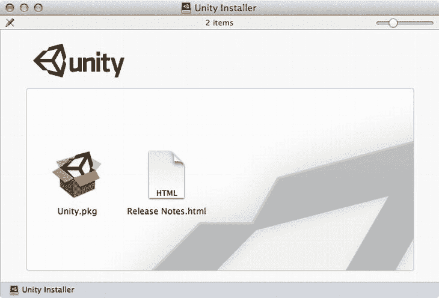

*图 1-1. Unity 安装程序文件*

安装程序磁盘映像仅包含两个文件：发行说明以及标准 OSX Unity 安装程序包，该包的文件名为`Unity.pkg`。

**运行安装程序**

双击`Unity.pkg`文件开始 Unity 的安装（图 1-2）。

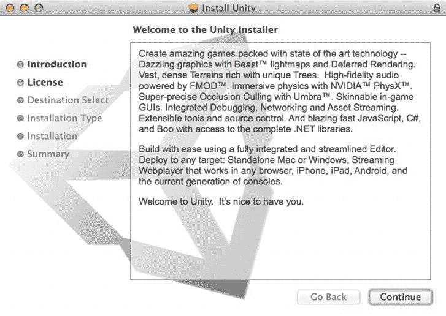

图 1-2. Unity 安装程序

安装程序将按照典型的安装顺序进行（步骤列在安装程序窗口的左侧），最后，`Applications`文件夹中会放置一个`Unity`文件夹。

**提示** 如果您恰好是从旧版 Unity 升级，此过程将直接替换旧版。如果您想保留之前的副本，请先重命名旧文件夹。例如，如果您要从 Unity 3.5 升级到 Unity 4，请先执行新安装前将`Unity`文件夹重命名为`Unity35`。然后，您可以同时运行这两个版本的 Unity。

Unity 安装文件夹包含 Unity 应用程序以及几个相关文件和文件夹（图 1-3）。

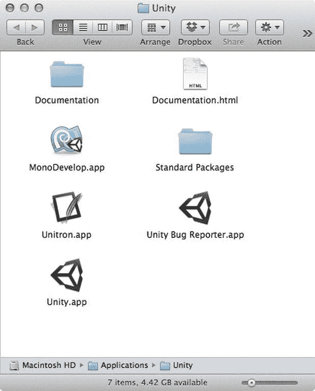

图 1-3. Unity 安装文件夹的内容

Unity 安装文件夹中最重要的文件，也是您唯一真正需要的文件，是`Unity`应用程序，它提供了用于构建游戏的环境。此应用程序有时更具体地称为 Unity 编辑器，以区别于集成到最终构建中的 Unity 运行时引擎或 Unity 播放器。但通常，当我只说“Unity”时，上下文是清晰的（我也将 Unity Technologies 称为 Unity）。

`Documentation`文件夹包含与 Unity 网站上（在“学习”标签下）可查看的相同用户手册、组件参考和脚本参考。这些文件中的每一个都可以从 Unity 的“帮助”菜单中在 Web 浏览器中打开，您也可以随时直接双击`Documentation.html`查看文档首页。

`Standard Packages`文件夹包含多个扩展名为`.unityPackage`的文件。这些 Unity 包文件每个都包含 Unity 资源集合，可以导入到 Unity 中（并且从 Unity 中，您可以将资源导出到包文件中）。例如，名为`Scripts.unityPackage`的标准包文件包含几个通常有用的脚本。

`MonoDevelop`应用程序是 Unity 的默认脚本编辑器，它是用于 Mono 项目的开源 MonoDevelop 编辑器的自定义版本，简称 Mono。Mono 是微软 .NET 框架的开源版本，构成了 Unity 脚本系统的基础。

`Unitron`应用程序是更早、更简单的脚本编辑器，它也源自另一个程序，即由 Peter Borg 开发的名为`Smultron`的文本编辑器。尽管`Unitron`是为 Unity 定制的并且仍包含在 Unity 安装中，但它不再受到官方支持。

最后，还有 Unity 错误报告器应用程序，它通常从 Unity 帮助菜单中的“报告错误”项运行。但是，您也可以直接从 Unity 安装文件夹启动 Unity 错误报告器。如果您遇到 Unity 甚至无法启动的错误，这非常有用！

**激活许可证**

继续双击 `Unity` 应用程序来运行它。如果这是您机器上首次安装 Unity，将会出现一个许可证激活窗口。在提供的三个选项中，有两个适用于 Unity iOS 开发：输入在 Unity 网站“商店”部分购买的 Unity 许可证的序列号（图 1-4），以及注册 Unity Pro（带 Unity iOS Pro 和 Unity Android Pro）的免费一个月试用版（图 1-5）。

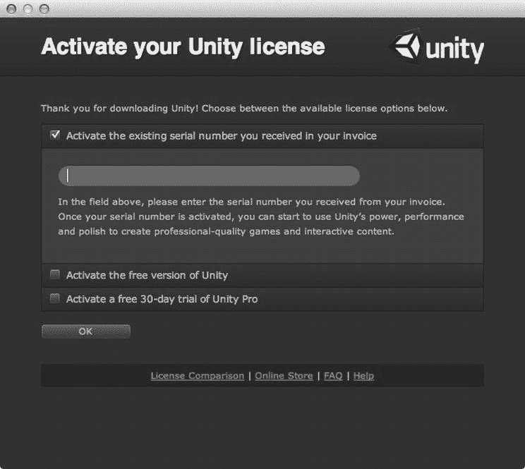

图 1-4. 激活付费 Unity 许可证

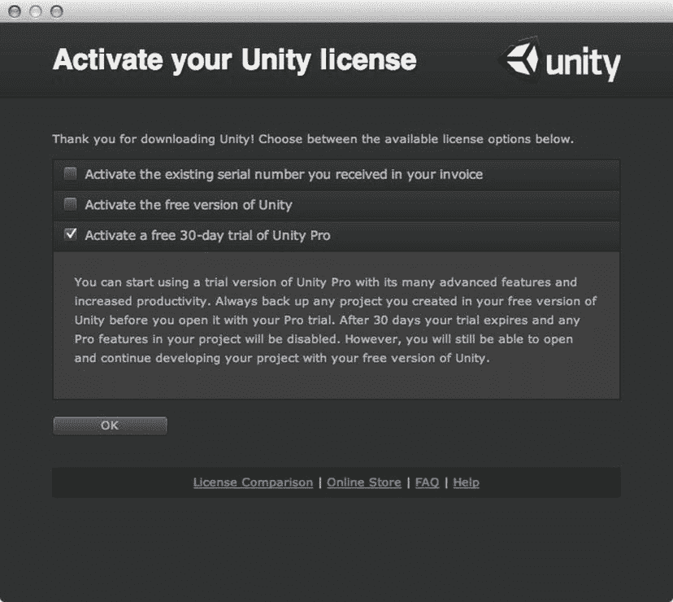

图 1-5. 激活 Unity 免费试用版

Unity 的免费版本，即不含 Pro 功能的 Unity，官方名称仅为 Unity（尽管有时会被称为 Unity Basic，而由于它原本仅限年收入低于 10 万美元的实体使用，我仍习惯称之为 Unity Indie），该版本不包含 Unity iOS。您可以先使用免费的 Unity 阅读本书中 iOS 章节之前的内容，之后再花费 400 美元添加 Unity iOS，但请注意，Unity Pro 和 Unity iOS Pro 的功能将无法使用。

需要明确的是，您的许可证决定了启用哪个 Unity 核心版本以及启用了哪些附加组件（如有）。核心产品与附加组件均提供非 Pro 和 Pro 版本，且必须获得 Unity Pro 许可证才能使用任何附加组件的 Pro 版本。因此，使用非 Pro 版的 Unity iOS 进行开发需要花费 400 美元的 Unity 许可证费用；而使用 Unity iOS Pro 进行开发则需要支付 1500 美元的 Unity Pro 费用和另外 1500 美元的 Unity iOS Pro 费用，总计 3000 美元。Unity Technologies 有时会提供折扣，尤其是在推出 Unity 的重大新版本时，当然价格也可能变动（毕竟，Unity Indie 曾售价 400 美元，现在已免费）。无论如何，免费试用版 Pro 许可证的存在意味着您暂时无需为此担心。

欢迎使用 Unity！

处理完许可证事宜后，Unity Editor 窗口便会打开，同时会弹出友好的“Welcome To Unity”窗口（图 1-6）。欢迎窗口会推荐一些入门资料供您查阅。您可以点击每个项目来打开相应资源。

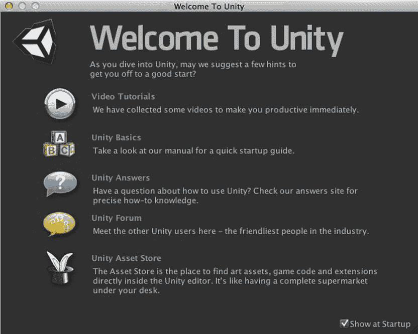

图 1-6. Unity 欢迎屏幕

每次启动 Unity 时都会显示“Welcome”窗口，直到您取消选中窗口右下角的“Show at Startup”复选框。在取消选中之前，最好先浏览一下推荐资源，不过您之后随时可以通过 Unity 的“Help”菜单（图 1-7）再次调出 Welcome 窗口。

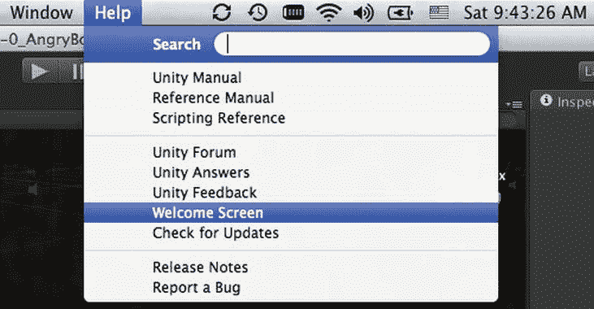

图 1-7. 从 Unity 的“Help”菜单调出欢迎屏幕

### 管理 Unity

在正式开始使用 Unity 进行游戏开发之前，现在是个好时机来了解一下 Unity Editor 中的一些管理功能。

#### 更换外观主题 (Pro)

Unity Editor 提供两种外观主题：深色或浅色。如果您使用的是 Unity Pro，初始时看到的将是深色主题（图 1-8）；如果您使用的是非 Pro 版 Unity，则只能看到浅色主题（图 1-9）。

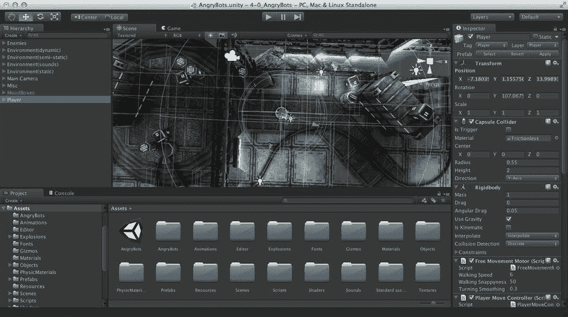

图 1-8. 使用 Pro（深色）主题的 Unity Editor

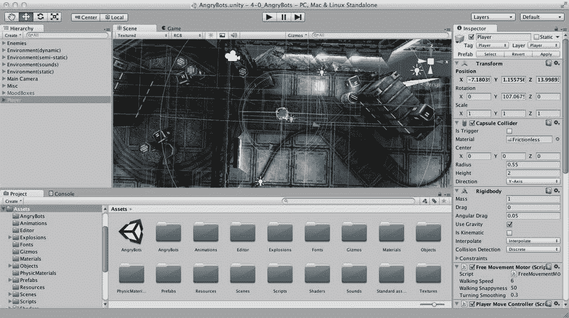

图 1-9. 使用 Indie（浅色）主题的 Unity Editor

在本书的其余部分，我将使用深色主题进行截图，但除了色调之外，用户界面并无差异。如果您使用的是 Unity Pro 并更喜欢浅色主题，可以在 Unity “Preferences”窗口中进行更换。首先，在 Unity 菜单中选择“Preferences”（图 1-10）。

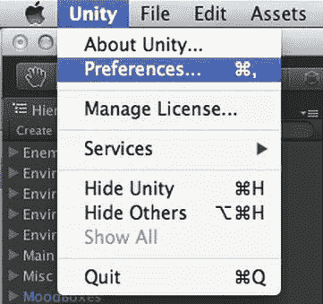

图 1-10. Unity Editor 中的“Preferences”菜单项

打开“Preferences”窗口后，您可以将主题从深色切换为浅色，或从浅色切换为深色（图 1-11）。这是 Unity Pro 独有的功能。如果您使用的是 Unity Indie，则只能使用浅色主题。

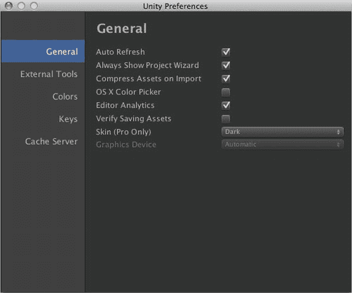

图 1-11. Unity Editor 中的“General Preferences”

在“Preferences”窗口中，我建议您确保“Always Show Project Wizard”处于勾选状态。这样可以确保 Unity 在启动时弹出项目选择对话框，而不是自动打开最近打开的项目，后者可能很耗时，而且并不总是您想要的结果。尤其要避免在您尚未准备好时将项目意外升级到新版本的 Unity。

#### 更新许可证

最终，您可能需要更新许可证，原因可能是您正在使用的免费试用版已过期，需要将许可证升级到 Pro 版本，需要添加其他构建平台，或者因为需要将许可证转移到另一台机器。此时，您可以在菜单栏上打开 Unity 菜单并选择“Manage License”（图 1-12）。

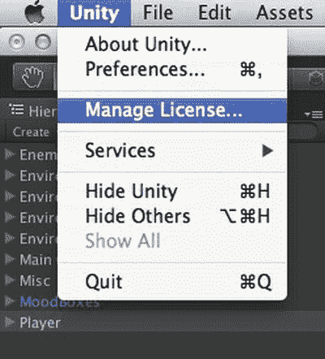

图 1-12. 从 Unity 菜单调出“License Management”窗口

随后出现的“License Management”窗口为您提供了输入新序列号或归还当前机器许可证以便在其他机器上使用的选项（图 1-13）。

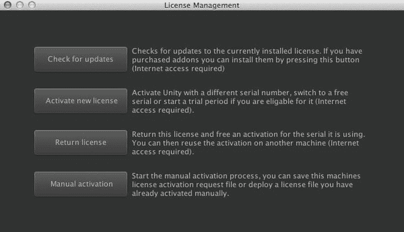

图 1-13. “License Management”窗口

单个 Unity 许可证可在两台机器上使用。在早期，Unity Editor 仅在 OS X 上运行时，一个 Unity 许可证仅适用于一台机器，但在 Unity Editor 添加 Windows 支持后，数量增加到了两台。

#### 报告问题

如果您长时间使用 Unity，肯定会遇到各种问题，无论是真实的还是想象中的错误。这并非对 Unity 的批评。3D 游戏引擎非常复杂，至少在内部是如此，而且其开发速度非常惊人（我从 Unity 1.6 开始使用，当时它只能在 OS X 上运行，并且只能为 Windows 和 OS X 构建部署包）。错误不会自动修复，尤其当它们没有被报告时。这正是 Unity Bug Reporter 的用武之地。正如我在介绍 Unity 安装文件时所提到的，Bug Reporter 位于 Unity 文件夹中，但通常是从 Unity Editor 的“Help”菜单中启动的（图 1-14）。

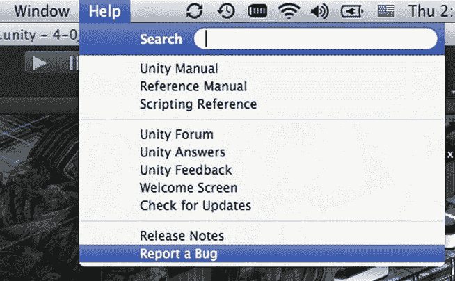

图 1-14. “Help”菜单中的“Report a Bug”选项

**提示**   正如您在 Unity 安装文件列表中所见，`Bug Reporter` 是独立于 Unity Editor 的应用程序。因此，如果遇到阻止 Unity Editor 正常启动的错误，您始终可以通过在 Finder 中双击该文件来直接启动 `Bug Reporter`。

随后出现的 Bug Reporter 窗口（图 1-15）会提示您选择错误发生的位置（在 Unity Editor 中还是在 Unity Player 中，即已部署的构建版本）、错误发生的频率，以及一个电子邮件地址，Unity Technologies 将通过该地址回复有关此错误的处理情况。

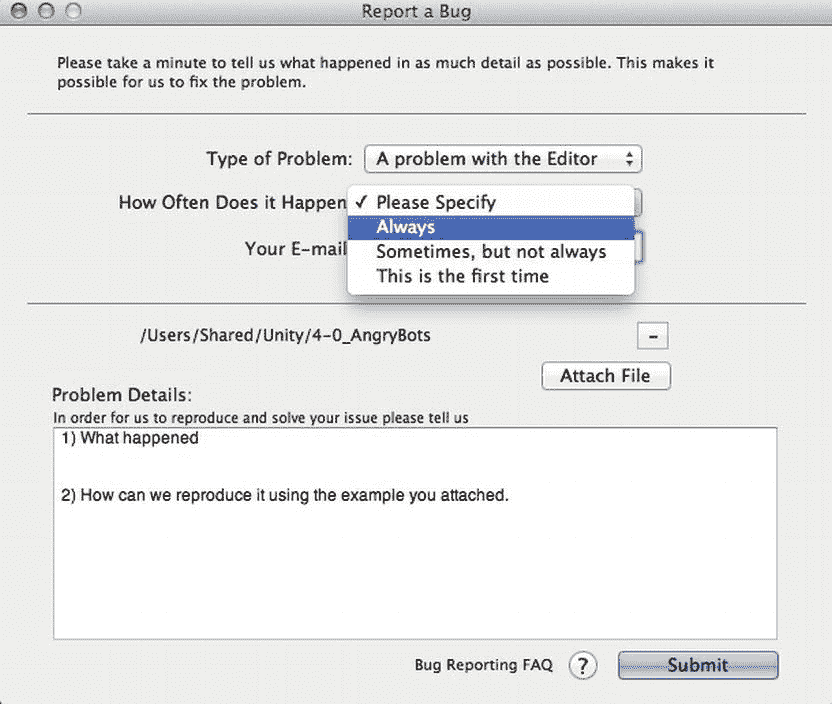

图 1-15. Unity Bug Reporter 窗口

在此下方的窗口中央，是附件列表。Unity 会自动将当前项目添加到该列表中，您也可以包含补充文件，例如截图或日志文件。您可以从列表中移除当前项目，但通常应该包含该项目，以便 Unity 支持团队能够重现问题。

