# 同理，你应该在问题描述中提供足够详细的解释，以便 Unity 支持团队能够重现该不良行为，并理解为何它被视为不良行为。基本上，你要避免得到诸如“我们无法重现该问题”或“这不是错误，而是设计如此”之类的回复。

提交错误报告后不久，你应该会收到 Unity Technologies 发送的电子邮件确认，其中包含一个案例编号以及 Unity 错误数据库中报告副本的链接，你可以通过该链接查看错误的处理状态。

### 检查更新

如果运气好，你的错误报告会促成修复。如果运气更好，该修复将在下一次 Unity 更新中出现。你可以随时通过菜单栏的 `Window`（窗口）菜单中选择 `Check for Updates`（检查更新）命令来查看是否有新更新。打开的窗口会显示是否有可用更新（图 1-16）。

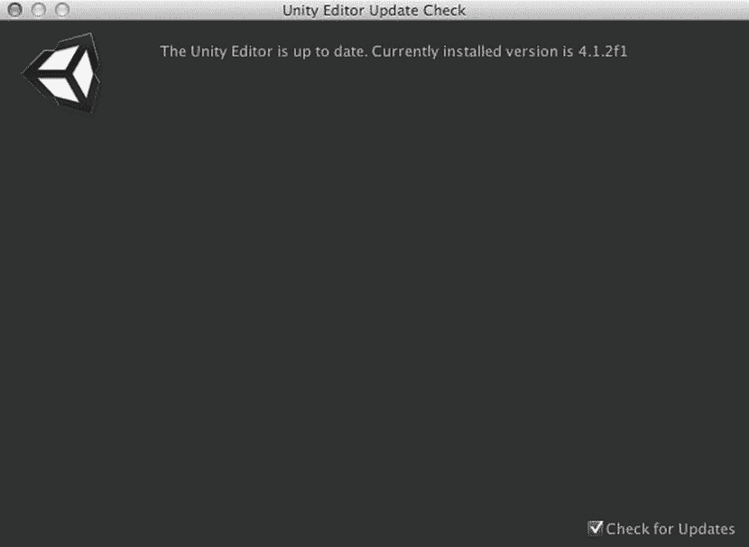

图 1-16. Unity Editor 更新检查

请注意 图 1-16 中显示的版本号是 Unity 4.1.2f1。后缀代表最细颗粒度的版本发布，包括紧急热修复。出于谨慎考虑，Unity Technologies 通常不会将新发布的更新立即提供给 Editor Update Check（编辑器更新检查），因此如果你焦急地等待错误修复更新，也可以随时查看 Unity 官方网站。

### 深入探索

我最喜欢的专业书籍，例如 Peter Van Der Linden 的 *Just Java*（一本面向非程序员、详细且通俗易懂的 Java 入门书），会在每章结尾通过讲述一则有趣的轶事、一点冷知识或相关历史来提供愉快的间歇。唉，我在本书中不会这样做。然而，我确实觉得简单的章节总结和回顾很乏味（作为读者，我总会跳过它们），而且我认为新 Unity 开发者面临的主要挑战之一是，他们需要养成自行查找 Unity 信息的习惯，并且需要知道去哪里查找这些信息，而这并非总是易事！

因此，在每一章（包括本章）的结尾，我会引导你查阅与你刚学到的主题相关的文档和其他资源，这样你就会知道在哪里找到权威且全面的信息来源，并在读完本书后能进行更深入的学习。我将重点介绍官方 Unity 手册和 Unity 网站，但也会提及一些第三方资源。现在你已经安装了 Unity，在本书中使用它之前，不妨休息一下，浏览那些你之后一定会频繁使用的网站和参考文档。在需要之前就弄清楚在哪里可以找到所需内容，总是一个好主意。

#### iOS 开发需求

在本章开头，我提到最好尽快开始下载 Xcode 并注册苹果的 iOS Developer Program（iOS 开发者计划）。

iOS 开发的需求，包括所需的硬件和 iOS Developer Program 的详细信息，都列在苹果的开发者支持页面上（`http://developer.apple.com/support`）。

关于 Xcode 需求和下载 Xcode 的信息，可以在 `http://developer.apple.com/xcode` 找到。

#### Unity 网站

随着 Unity 功能和平台的增长，Unity 网站（`http://unity3d.com/`）也在不断发展。整个网站都值得浏览，但特别是关于 Unity 的常规信息，可以查看 Unity 网站的 FAQ 部分（`http://unity3d.com/unity/faq`）。

许可证激活流程和 License Management（许可证管理）窗口在 `http://unity3d.com/unity/activation` 有文档说明。本章提到了 Unity 和 Unity iOS 的不同 Pro 版和非 Pro 版，但 `http://unity3d.com/unity/licenses` 的许可证比较表提供了更全面的功能表格及其在各种许可证下的可用性。Unity 视频存档（`http://video.unity3d.com/`）中有许多教学视频，而且 Unity 最近在其网站上新增了一个 Learn（学习）选项卡，便于访问文档和教程。

#### Unity 手册与参考文档

Unity Help（帮助）菜单的顶部区域（图 1-17）列出了官方 Unity 文档，包括三个文档：Unity Manual（Unity 手册）、Reference Manual（参考手册）和 Scripting Reference（脚本参考）。虽然 Unity Manual 关于本章讨论的安装和许可流程的信息不多，但该手册在其他方面提供了关于使用 Unity 的良好通用指导和概念解释。随着你在本书中创建和编写场景脚本，Reference Manual 和 Scripting Reference 将变得越来越重要。

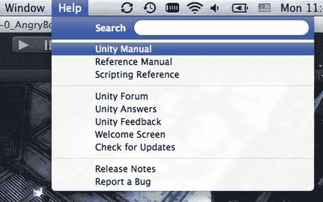

图 1-17. Help（帮助）菜单

Unity Help 菜单项会打开本地安装的这些手册副本，但它们也可以在 Unity 网站的 Learn（学习）选项卡下找到。

#### Unity 社区

Unity Help 菜单中部的三个项目是官方 Unity 社区网站的链接。论坛（`http://forum.unity3d.com`）是用户可以提出任何与 Unity 相关问题的场所（不过论坛设有版主）。

Unity Answers 网站（`http://answers.unity3d.com/`）遵循 Stack Exchange 的格式，并对问题和答案进行了一定程度的质量控制。Unity Feedback 网站（`http://feedback.unity3d.com`）允许用户提交功能请求并对功能请求进行投票，无论是他们自己提交的还是其他人提交的。

**提示**   尽管错误类型选择器将 Feature Request（功能请求）列为一种错误类型，但 Unity 鼓励所有人将功能请求提交到他们的 Feedback（反馈）网站。

欢迎来到 Unity 社区！

---

## 第 2 章：Unity 漫游

现在你已经安装了 Unity，是时候熟悉 Unity Editor（Unity 编辑器）了。Editor（只要意思明确，我会交替使用 Unity、Unity Editor 和 Editor 这些术语）是你为一个或多个目标平台创建、测试和构建游戏的地方。Editor 对包含游戏中资源的单个 Unity 项目进行操作。

本章将使用 Unity 自带安装的 Angry Bots 演示项目来介绍 Unity Editor。我不会在此深入探讨 Angry Bots 的内部工作原理，但它是一个方便的现成项目，你可以用它来熟悉 Unity，甚至可以将 Angry Bots 构建为 OS X 应用以感受构建过程。希望这能让你在下一章学习如何从头创建新项目之前，先熟悉 Unity 的工作流程、用户界面以及各种文件类型。

**提示**   在 OS X 中，文件扩展名默认是隐藏的，但任何从事开发工作的人都应该查看完整的文件名。为确保显示扩展名，请前往 Finder 偏好设置窗口的 Advanced（高级）选项卡，勾选“显示所有文件扩展名”。

### 启动 Angry Bots

在上一章的安装过程中，一个名为 Angry Bots 的示例 Unity 项目会被安装到 `Users > Shared > Unity` 文件夹中。如果你是一位长期使用 Unity 的用户，那么你可能还有一些来自旧版本 Unity 的其他项目存放在那里。例如，图 2-1 展示了我本机的 Unity 共享示例文件夹。除了最新版本的 Angry Bots（较新的版本会在文件名中包含对应的 Unity 版本号），我仍然保留了 Unity 2 自带的 Star Trooper 示例项目。

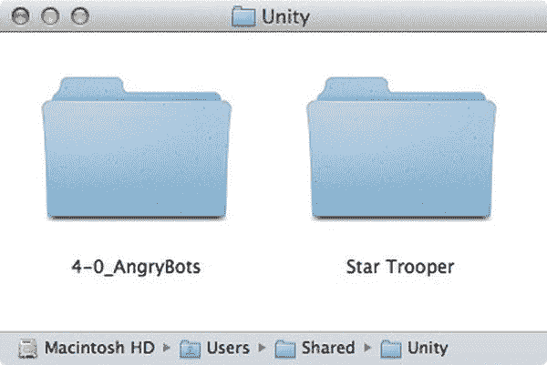

图 2-1. Unity 示例项目共享文件夹

#### 打开 Angry Bots 项目

当你首次启动 Unity 编辑器时，Unity 会自动打开 Angry Bots 演示项目。如果由于某种原因 Unity 没有立即打开 Angry Bots，或者你想在之后重新打开它（正如我们将在第 10 章和第 11 章中使用 Angry Bots 来熟悉 Unity iOS 那样），请在 Unity 菜单栏的 `File` 菜单中选择 `Open Project` 项（图 2-2）。

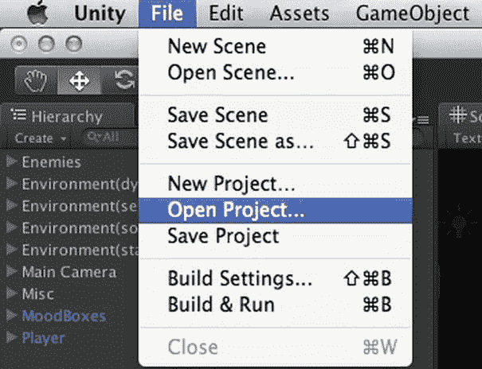

图 2-2. `Open Project` 菜单项

此时将出现项目向导（与首选项窗口中的 `Always Show Project Wizard` 项所引用的项目向导相同）。从项目向导的最近项目列表中选择 AngryBots 项目（如果你勾选了复选框，每次启动 Unity 时都会显示该列表），或者单击 `Open Other` 按钮（图 2-3）。

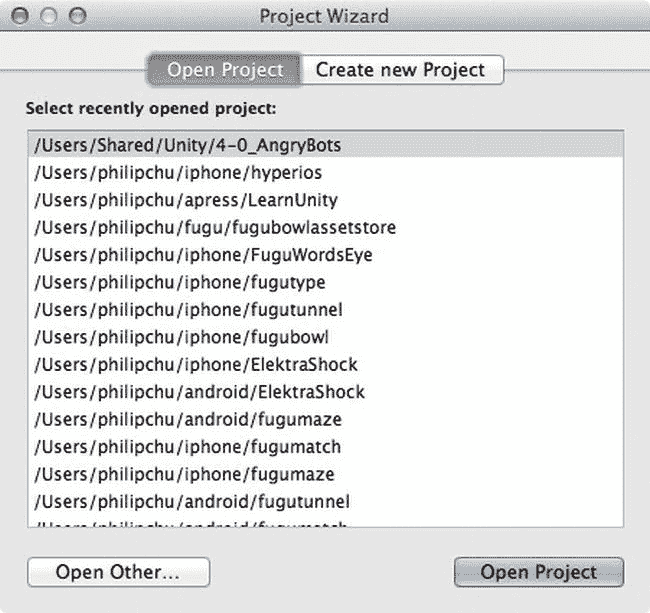

图 2-3. 从 `Open Project` 向导中选择 Angry Bots

#### 打开 Angry Bots 场景

打开 Angry Bots 项目后，Unity 编辑器应显示项目的主场景，名为 AngryBots。窗口的标题栏应列出场景文件 `AngryBots.unity`，后跟项目名称和目标平台（图 2-4）。

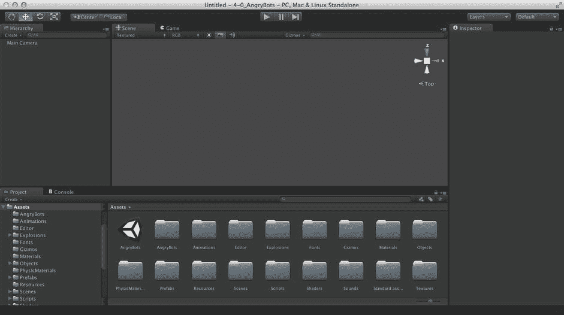

图 2-4. 打开新场景后的 Angry Bots 项目

场景名称显示在编辑器窗口的上边框处，场景内容则反映在层级视图、场景视图和游戏视图中。稍后我将解释这些视图，并在本章中用大量篇幅详细讲解每个视图。

场景与游戏中的关卡是同一个概念（事实上，加载场景的 Unity 脚本函数名为 `Application.LoadLevel`）。Unity 编辑器的目的是构建场景，因此它一次总是只打开一个场景。

如果编辑器在启动时没有打开现有场景，它将打开一个新建的场景，这与你在 Unity 菜单栏的 `File` 菜单中选择 `New Scene` 的效果相同。

如果你当前没有看到 AngryBots 场景，请在 `File` 菜单中选择 `Open Scene` 命令（图 2-5）。

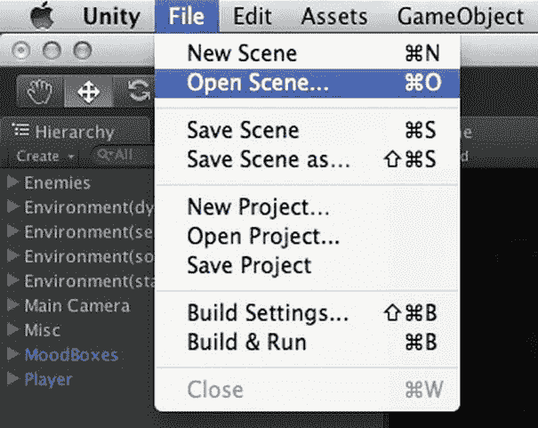

图 2-5. `Open Scene` 菜单项

弹出的文件选择器将从项目 `Assets` 文件夹的顶层开始，你可以在其中选择 AngryBots 场景文件（图 2-6）。所有场景文件都带有 Unity 图标，并且具有 `.unity` 文件扩展名。

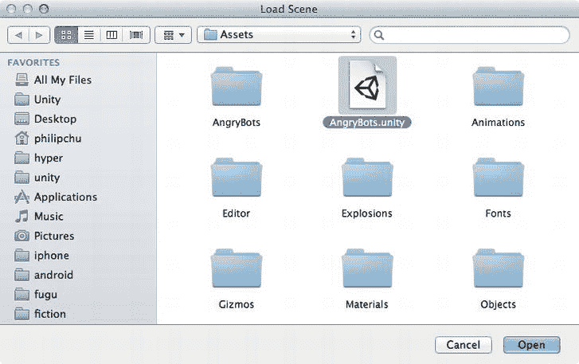

图 2-6. 在加载场景选择器中选中 AngryBots 场景

#### 运行 Angry Bots

打开所需场景后，单击编辑器顶部中央的 `Play` 按钮即可开始游戏。游戏视图将出现并显示正在运行的游戏，可以使用标准键盘和鼠标控制进行游戏（图 2-7）。

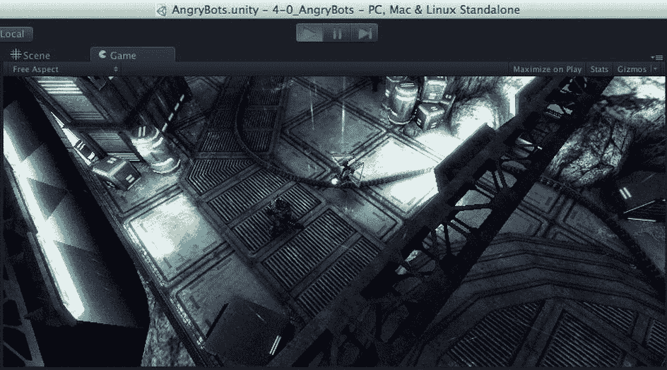

图 2-7. 编辑器中的播放模式

分别使用 `AWSD` 键向前、向后、向左、向右移动，移动鼠标来环顾四周，按 `Esc` 键暂停。再次单击 `Play` 按钮将停止游戏并退出播放模式。`Play` 按钮旁边的两个按钮用于暂停游戏和单步执行游戏。

#### 构建 Angry Bots

在正常的开发过程中，你会在编辑场景和播放场景之间交替进行。

当你对游戏在编辑器中的运行效果感到满意时，就可以为目标平台构建应用程序了。我们直到第 10 章才开始构建 iOS 版本，但为了感受一下构建过程，现在就开始构建一个 Angry Bots 的 OS X 应用程序版本。从 Unity 的 `File` 菜单中选择 `Build Settings` 项，调出 `Build Settings` 窗口（图 2-8）。

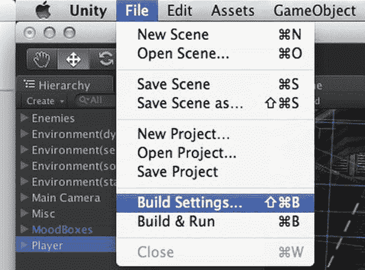

图 2-8. 调出 `Build Settings` 窗口

窗口的上半部分列出了要包含在构建中的场景。你当前打开的那个场景应该被勾选。任何未勾选或未列出的场景都不会包含在构建中（图 2-9）。

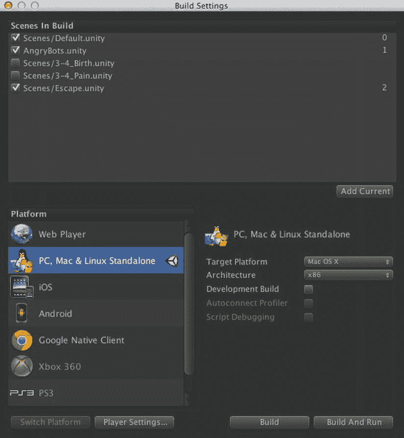

图 2-9. Mac 平台的 `Build Settings`

左侧 `Platform` 列表中的默认平台为 `PC, Mac & Linux Standalone`，与编辑器标题栏列出的平台一致。右侧默认的特定 `Target Platform` 设置为 Windows 可执行文件，但由于你是在 Mac 上操作，让我们将右侧菜单中的 `Target Platform` 设置为 `Mac OS X`。然后点击左下角的 `Switch Platform` 按钮。这将启动项目资产到适合 Mac 使用的格式的转换。转换完成后，编辑器的标题栏将更新以反映新平台。

现在，你可以单击 `Build Settings` 窗口中的 `Build` 或 `Build and Play` 按钮。单击 `Build` 将生成我们游戏的 OS X 应用程序版本。单击 `Build and Play` 会执行相同操作，但同时会运行游戏，省去了打开访达窗口并双击新应用程序的麻烦。Unity 将提示你为应用程序输入文件名和位置，默认位置在项目目录的顶层，这就可以了（图 2-10）。

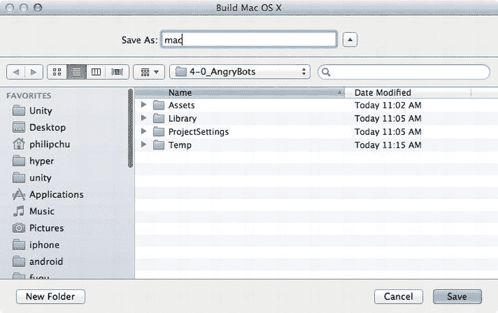

图 2-10. 保存 OS X 应用程序构建

构建完成后，双击生成的应用程序即可运行游戏。或者，如果你选择了 `Build and Run`，游戏应该会自动启动。Unity 生成的 OS X 应用程序会先启动一个分辨率选择窗口（图 2-11）。

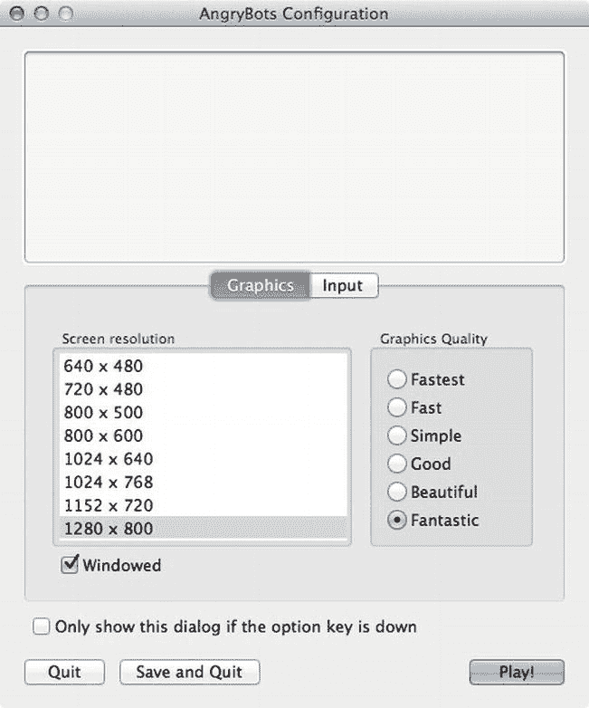

图 2-11. Unity OS X 应用程序的启动对话框

选择所需分辨率并单击 `Play!` 后，你将看到一个刚指定大小的游戏窗口。现在，Angry Bots 正在其独立的 Mac 窗口中运行（图 2-12）。

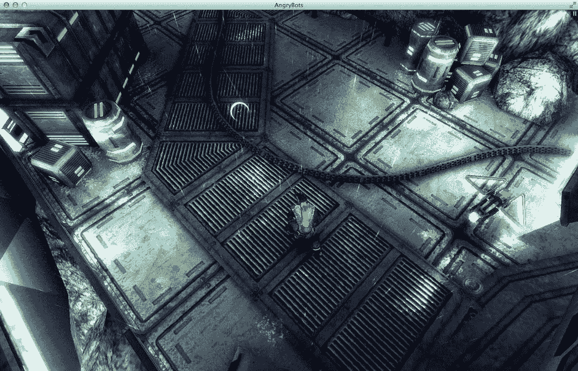

图 2-12. 作为 OS X 应用程序运行的 Angry Bots

### 编辑器布局

现在你已经通过 Angry Bots 项目对 Unity 的测试和构建工作流有了初步了解，接下来让我们更仔细地研究一下 Unity 编辑器的布局。主窗口被划分为多个区域（我习惯称之为窗格，但这里我称之为区域，因为这是 Xcode 中使用的术语）。每个区域包含一个或多个标签视图。通过点击视图的标签，可以选定当前区域显示的内容。视图可以添加、移动、移除和调整大小，编辑器支持在布局之间切换，因此布局本质上就是视图的特定排列。例如，主窗口的默认布局（图 2-13）包含一个区域，其中含有场景视图（图 2-14）和游戏视图（图 2-15）。

**备注** Unity 文档在视图命名上有些不太一致。从名称上显而易见，游戏视图和场景视图是视图。但控制台和检视面板也是视图。在本书中，我会在所有视图名称中包含“视图”一词，以明确它们都是视图，并且可以以相同方式操作。

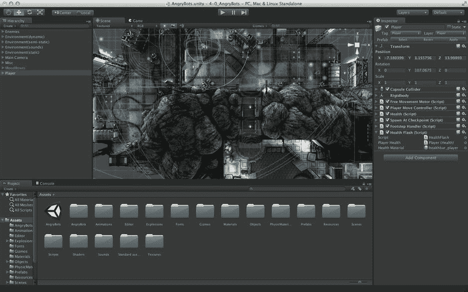

图 2-13 Unity 编辑器的默认布局

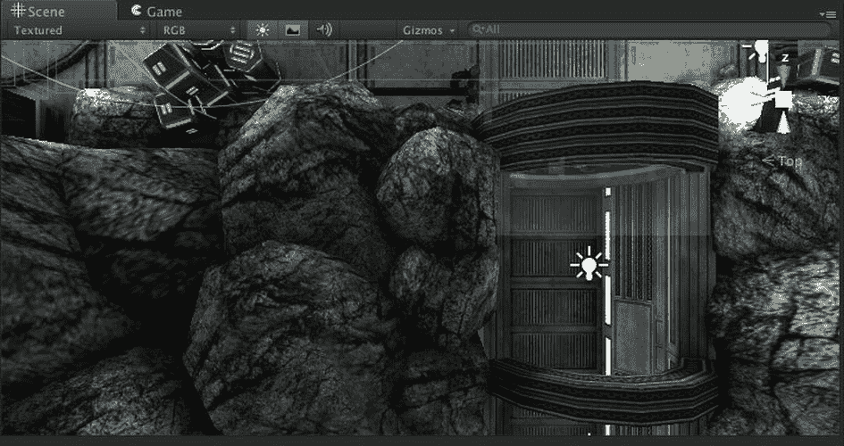

图 2-14 在多标签区域中选定的场景视图

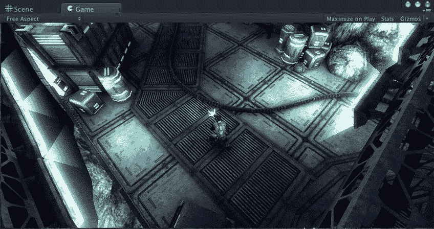

图 2-15 在多标签区域中选定的游戏视图

#### 预设布局

默认布局只是几种预设布局中的一种。可以从主窗口右上角的菜单中选择其他布局（图 2-16）。继续试试它们吧。图 2-17 到 2-20 展示了这些布局的效果。

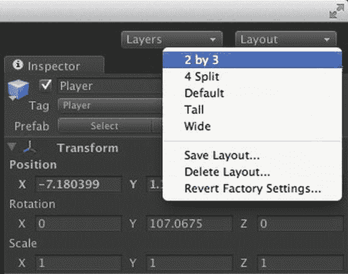

图 2-16 布局菜单

稍后我会更详细地介绍各种类型的视图，但目前请注意，2×3 布局（图 2-17）是一种场景视图和游戏视图位于不同区域而非共享同一区域的布局示例。4-分割布局（图 2-18）有四个场景视图实例（让人联想到计算机辅助设计工具），这说明布局并不限于每种类型只有一个视图。

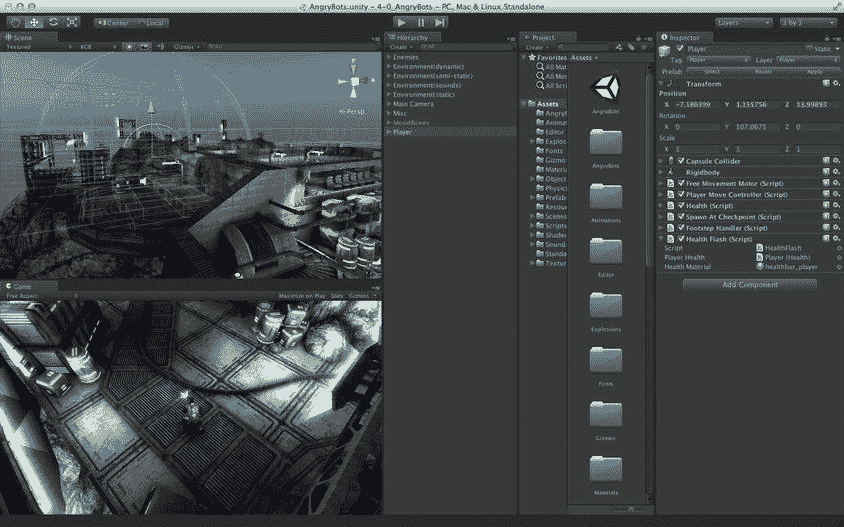

图 2-17 2×3 布局

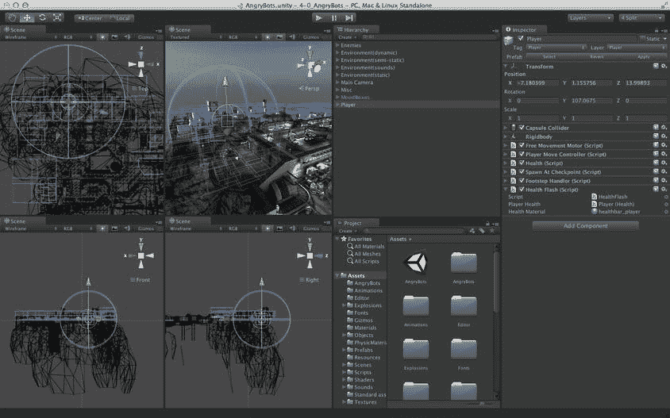

图 2-18 4-分割布局

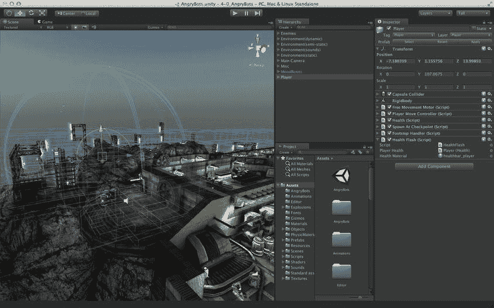

图 2-19 高布局

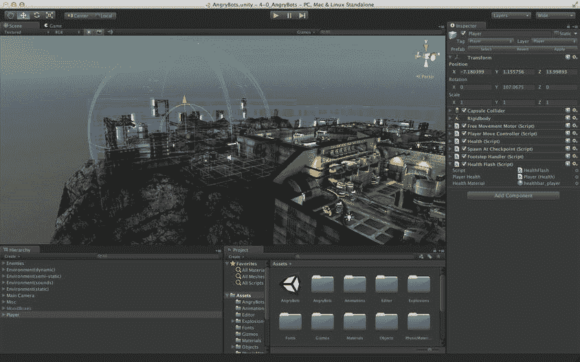

图 2-20 宽布局

#### 自定义布局

预设布局提供了多种工作区，但幸运的是，你不必完全照搬使用。Unity 提供了灵活性，让你可以随心所欲地完全重新排列编辑器窗口。

##### 调整区域大小

首先，在尝试各种预设布局时，你可能会注意到某些区域太窄了，例如，宽布局（图 2-20）的左侧面板。幸运的是，你可以点击区域的边框并拖动来调整区域大小。

##### 移动视图

更酷的是，你可以移动视图。将视图的标签拖拽到另一个标签区域，即可将视图移动到那里。将标签拖拽到“停靠”区域则会创建一个新的区域。例如，从默认布局开始，将检视面板标签拖拽到层级标签的右侧。现在检视面板视图和层级视图共享同一区域。然后将控制台标签拖拽到层级/检视面板视图的底部区域。这会将区域有效地分成两部分，底部现在包含控制台。结果应该类似于 图 2-21。

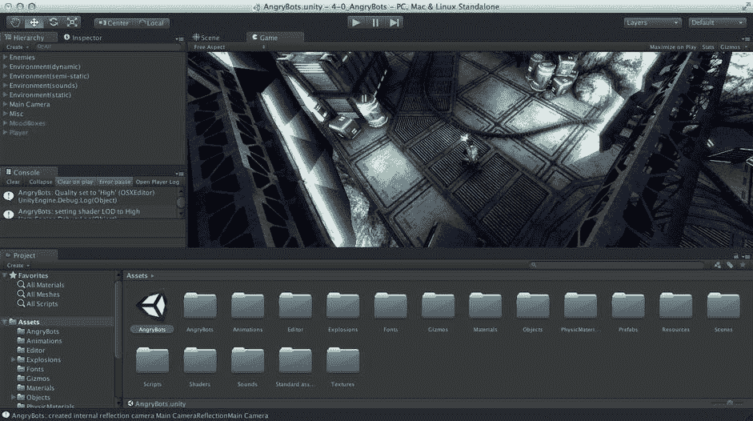

图 2-21 移动视图后自定义的工作区

##### 分离视图

你甚至可以将视图拖拽到编辑器窗口之外，使其位于自己的“浮动”窗口中，该窗口可以像任何其他区域一样对待。将场景标签拖拽出编辑器，使其位于一个浮动窗口中，然后将游戏标签拖入该浮动窗口的标签区域。结果应该类似于 图 2-22。同样，将标签拖拽到浮动窗口的停靠区域，将为该窗口添加另一个区域。

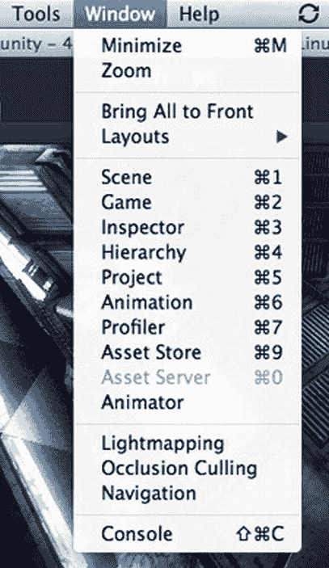

图 2-22 窗口菜单中的视图列表

**提示** 我喜欢将游戏视图分离到一个浮动窗口中，因为我在编辑器中工作时通常不需要看到它，直到我点击播放，这样我就可以最大化游戏视图使其填满整个屏幕。

浮动窗口经常被其他窗口遮挡，因此菜单栏上的窗口菜单中包含每个视图可见性的菜单项（图 2-22）。注意每个视图都有键盘快捷键，还有一个布局子菜单，与编辑器内的布局菜单相同。

##### 添加和移除视图

您还可以使用区域右上角的菜单（图 2-23）在每个区域中添加和移除视图。关闭标签项用于移除当前显示的视图。添加标签项提供了一系列新视图供您选择。

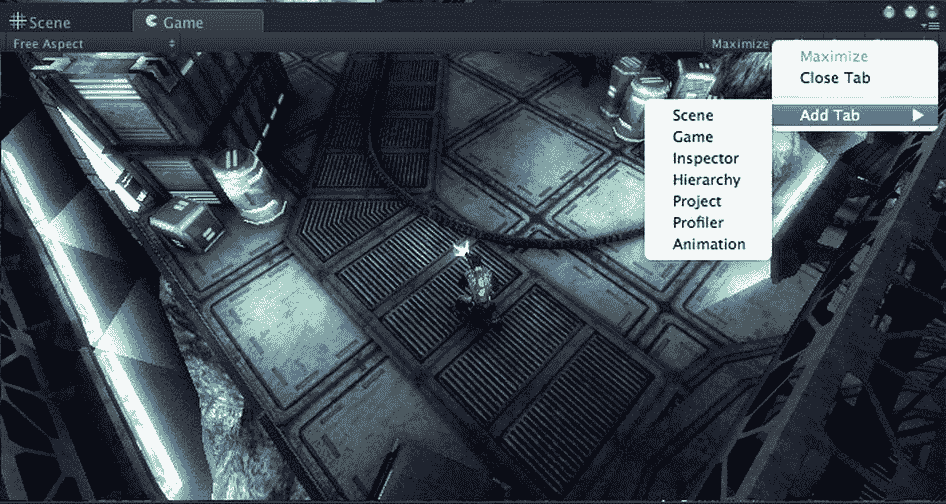

图 2-23 向区域添加视图

您可能希望针对不同的目标平台使用不同的布局，或者针对开发与游戏测试使用不同的布局，甚至针对不同的游戏使用不同的布局。例如，我有一个专门用于 HyperBowl 的自定义布局，它将游戏视图保持在合适的竖屏宽高比。每次启动 Unity 时手动重新配置编辑器会很麻烦。幸运的是，您可以通过在布局菜单中选择保存布局选项来命名和保存布局，系统会提示您输入新的布局名称（图 2-24）。

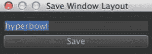

图 2-24 保存布局菜单

保存后，新布局将列在布局菜单中，如果您选择删除布局（图 2-25），也会出现在可删除布局列表中。

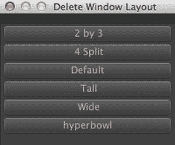

图 2-25 删除布局菜单

如果您搞乱了或删除了原始布局，可以选择区域菜单中的恢复出厂设置选项（图 2-26）。这也会删除任何自定义布局。

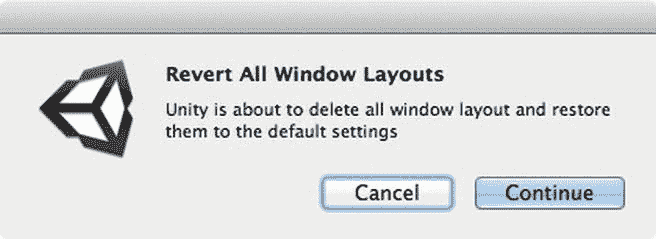

图 2-26 恢复出厂设置提示

如果您更改了一个布局但尚未保存更改，您可以随时通过在布局菜单中重新选择该布局来放弃更改。

## 检视面板视图

