# 检查器视图

最值得首先详细描述的视图是`检查器视图`，因为它的功能是显示在其他视图中选中的对象信息。它实际上不仅仅是一个检查器，通常还能用于修改选中的项目。

`检查器视图`还用于显示和调整可通过`编辑`菜单调出的各种设置。例如，你可能会注意到，在 Angry Bots 项目的安装目录中，`Assets` 文件夹里有很多扩展名为 `.meta` 的文件，如图 2-27 所示。实际上，每个资源文件都对应一个这样的文件。Unity 使用这些元文件来跟踪项目中的资源，这些文件采用文本格式，便于与 Perforce 和 Subversion 等版本控制系统（或更新的分布式版本控制系统，如 Git 和 Mercurial）配合使用。

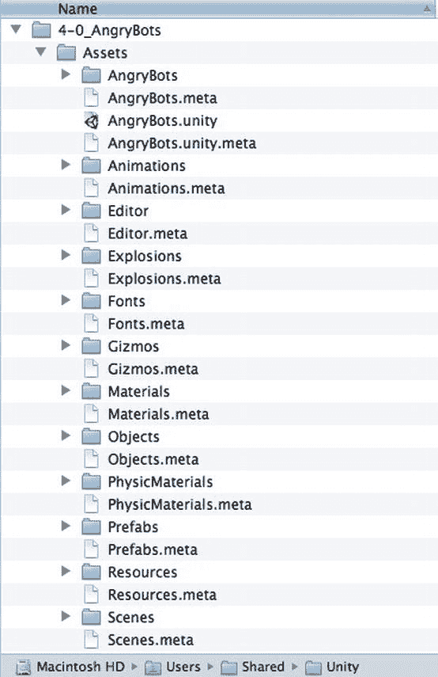

图 2-27。Angry Bots 项目中的元文件

但是，如果你没有使用版本控制系统（或者使用的是需要额外许可的 Unity Technologies 产品 `Unity 资源服务器`），你可以在`编辑器设置`中关闭版本控制兼容性，并移除那些碍眼的文件。通过进入`编辑`菜单，从`设置`子菜单中选择`编辑器设置`，即可调出`编辑器设置`（图 2-28）。

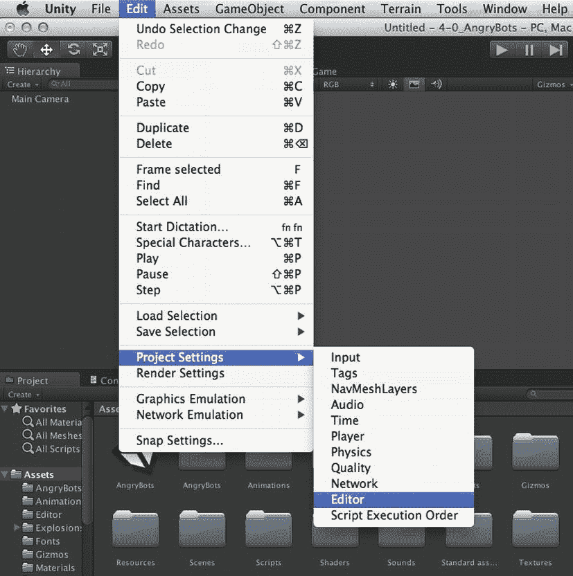

图 2-28。调出`编辑器设置`

现在，`检查器视图`会显示`编辑器设置`。如果项目当前包含元文件，则`版本控制模式`设置为`元文件`（如果你使用的是`资源服务器`，此选项会设置为`资源服务器`）。要移除元文件，请将`版本控制模式`设置为`禁用`（图 2-29）。

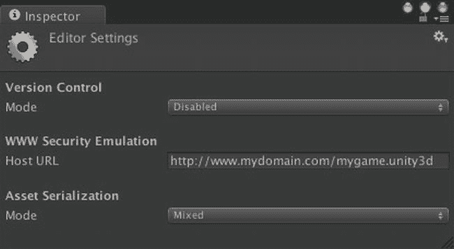

图 2-29。`检查器视图`中的`编辑器设置`

将`版本控制模式`设置为`禁用`后，Unity 将移除这些元文件（图 2-30）。资源追踪现在由项目`库`文件夹内的二进制文件处理。

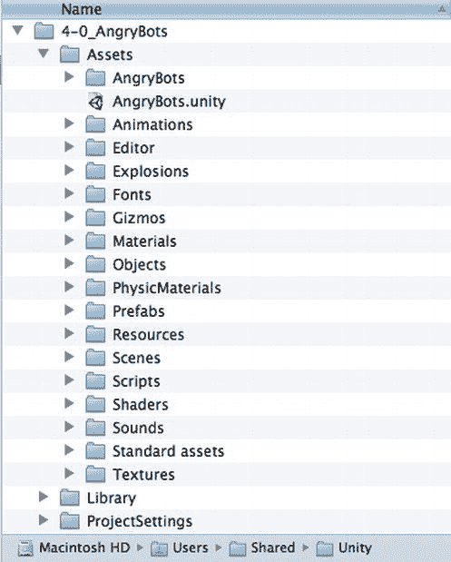

图 2-30。移除了元文件的 Angry Bots 项目文件夹

**注意**：使用元文件进行版本控制的 Unity Pro 用户还可以选择将`资源序列化模式`设置为`强制文本`。在该模式下，Unity 场景文件将以纯文本的 YAML（YAML Ain’t Markup Language）格式保存。

通常，`检查器视图`显示的是最近选中的对象的属性（当你调出`编辑器设置`时，实际上是选中了它）。但有时，当你选择其他对象时，不希望`检查器视图`发生变化。在这种情况下，你可以通过选择视图右上角菜单中的`锁定`选项，将`检查器视图`固定到一个对象上（图 2-31）。

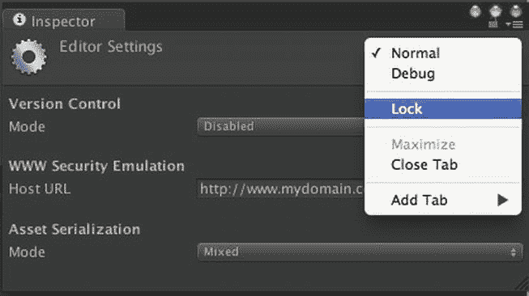

图 2-31。锁定`检查器视图`

### 项目视图

如果说`检查器视图`可以看作是编辑器中最低层级的视图（因为它只显示单个对象的属性），那么`项目视图`则可以看作是最高层级的视图（图 2-32）。`项目视图`显示项目中所有可用的资源，从单独的模型、纹理和脚本，到整合了这些资源的场景文件。所有项目资源都存放在项目`Assets`文件夹内的文件中（因此，我实际上将`项目视图`视为`资产视图`）。

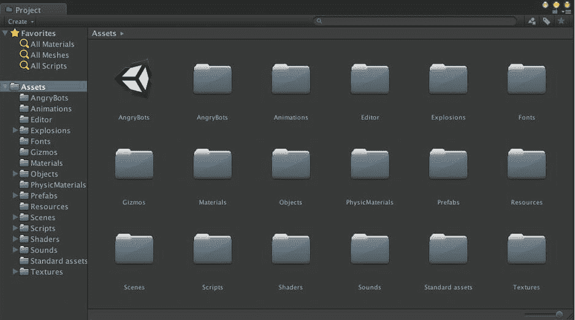

图 2-32。`项目视图`的顶层

#### 在单列和双列之间切换

在 Unity 4 之前，`项目视图`只有单列显示模式。该选项在`项目视图`的菜单中仍然可用（单击视图右上角的三横线图标），因此你现在可以在单列和双列之间切换。

请注意，Angry Bots 项目的`项目视图`（图 2-32）看起来与 Finder 中项目的`Assets`文件夹（参见图 2-30）相似。实际上，它看起来更像 Windows 的文件视图，你可以在左侧面板中浏览文件夹层次结构，并在右侧面板中查看所选文件夹的内容。

#### 缩放图标

底部的滑块可以缩放右侧面板的视图——较大的缩放比例适合查看纹理，而较小的缩放比例更适合查看脚本等没有有趣图标的项目。这也是按资源类型对资源进行分区（例如，将所有纹理放入`Textures`文件夹，将脚本放入`Script`文件夹等）的一个好理由。因为单一的缩放滑块设置很可能无法很好地适应混合的资源类型。

#### 检查资源

在右侧选择一个资源，将在`检查器视图`中显示该资源的属性。例如，如果你选择了一个音频样本，`检查器视图`会显示有关音频格式的信息，其中一些信息（如压缩设置）你可以更改，它甚至允许你在编辑器中播放音频（图 2-33）。我将在后面的章节中解释音频属性，但你现在可以随意在`项目视图`中选择各种类型的资源，看看`检查器视图`中会显示什么。

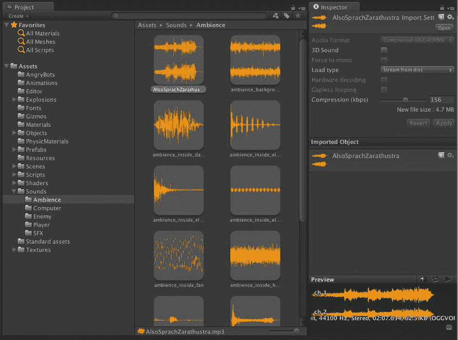

图 2-33。在`项目视图`中检查选中的资源

#### 搜索资源

在大型复杂项目中，手动查找特定资源非常困难。幸运的是，就像在 Finder 中一样，有一个搜索框可以用来过滤`项目视图`右侧面板中显示的结果。在图 2-34 中，`项目视图`显示了搜索名称中包含`"add"`的资源的结果。

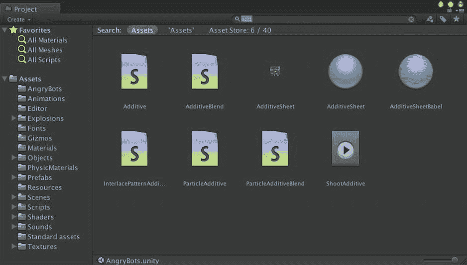

图 2-34。搜索名称中包含`"add"`的资源

右侧面板显示的是`Assets`下所有内容的搜索结果（即我们所有的资源）。通过在左侧面板中选择一个子文件夹，可以进一步缩小搜索范围。例如，如果你知道正在查找一个纹理，并且已经按资源类型将资源整理到子文件夹中，那么你可以选择`Textures`文件夹进行搜索（图 2-35）。

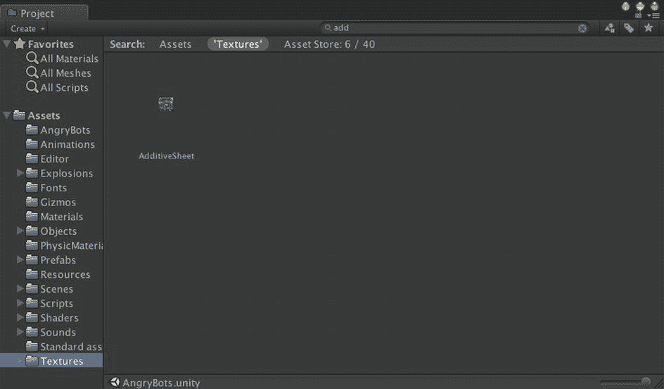

图 2-35。在文件夹中搜索资源

请注意，搜索框下方有一个显示所选文件夹名称的选项卡。你仍然可以单击左侧的`Assets`选项卡，以查看所有资源的搜索结果，这包括本地资源和`Unity 资源商店`中的资源，我们将在本书中大量使用该商店。

你还可以使用搜索框右侧的菜单，按资源类型过滤搜索。除了在`Textures`文件夹中搜索之外，你也可以选择将`Texture`作为感兴趣的资源类型（图 2-36）。请注意，这会导致`"t:Texture"`被添加到搜索框中。`"t:"`前缀表示搜索应按随后的资源类型进行过滤。你也可以直接输入该前缀，无需使用菜单。

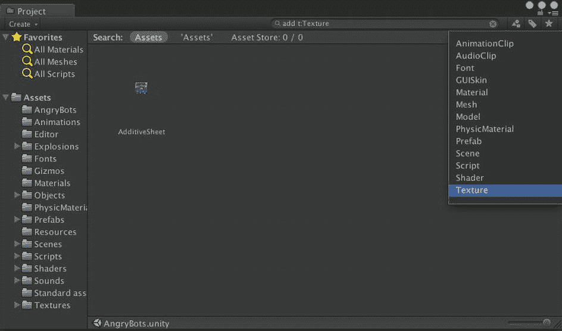

图 2-36。按资源类型过滤的搜索

好的，作为高级文档工程师和翻译员，我将严格按照您提供的注意事项和示例，将给定的英文文本翻译成中文。

##### 资源类型菜单右侧的按钮

资源类型菜单右侧的按钮用于按标签进行筛选（您可以在检查器视图中为每个资源分配一个标签），这对于在资源商店中搜索也非常方便。最右侧的星形按钮，会将当前搜索保存在左侧面板的“收藏夹”部分。

##### 对资源进行操作

项目视图中的资源，其操作方式与访达中对应的文件非常相似。

双击一个资源将尝试打开一个合适的程序来查看或编辑该资源。这相当于右键单击该资源并选择“打开”。双击一个场景文件将在当前的 Unity 编辑器窗口中打开该场景，就像您在“文件”菜单中选择了“打开场景”一样。

您还可以重命名、复制和删除资源，以及将文件拖入或拖出文件夹，就像在访达中一样。其中一些操作可以在 Unity 的“编辑”菜单中，或者在右键单击资源时弹出的菜单中找到。在接下来的几章中，您将会练习这些操作。

同样，在下一章中，您将学习如何向项目中添加资源。这涉及到导入文件或导入 Unity 包，可以通过菜单栏上的“资源”菜单，或直接使用访达将文件拖入项目的“资源”文件夹。

### 层级视图

每个游戏引擎都有一个顶级对象，称为*游戏对象*或*实体*（例如，CryEngine），或者其他名称（Second Life 中称为 prims），用于表示任何具有位置、潜在行为和标识名称的对象。Unity 的游戏对象是 `GameObject` 类的实例。

**注意** 通常，当我们提到一种 Unity 对象类型时，我们会使用其类名来精确指代，并明确该对象在脚本中如何被引用。

层级视图是当前场景的另一种表示。场景视图是一个可以像使用内容创建工具一样进行操作的 3D 场景表示，游戏视图则显示游戏播放时的样子，而层级视图以易于导航的树状结构列出了场景中的所有 `GameObject`。

#### 检查游戏对象

当您在层级视图中点击一个 `GameObject` 时，它会成为当前的编辑器选定对象，其组件会显示在编辑器中。每个 `GameObject` 都有一个 `Transform 组件`，该组件指定了它相对于层级结构中父级的位置、旋转和缩放（如果您熟悉 3D 图形的数学知识，`Transform 组件`封装了对象的变换矩阵）。一些组件为 `GameObject` 提供功能（例如，灯光是一个附加了灯光组件的 `GameObject`）。其他组件则引用诸如网格、纹理和脚本之类的资源。图 2-37 显示了“玩家”`GameObject` 的组件（在层级视图中，整个“玩家”的 `GameObject` 树以蓝色显示，因为它链接到了一个预制件，这是一种用于克隆单个 `GameObject` 或一组 `GameObject` 的特殊资源类型）。

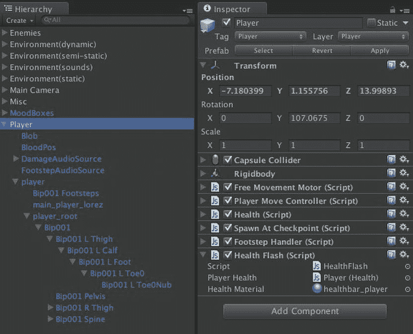

图 2-37. 层级视图和检查器视图

#### 父级和子级游戏对象

请注意，许多 `GameObject` 是按层级结构排列的，这就是该视图名称的由来（在计算机图形学中，这通常被称为*场景图*）。父级化对于在概念上被分组的游戏对象来说很有意义。例如，当您想要移动一辆汽车时，您希望车轮能自动跟随汽车移动。因此，车轮应被指定为汽车的子级，并相对于汽车中心偏移。当车轮转动时，它们相对于汽车的运动而转动。父级化还允许我们一次性地激活或停用整个游戏对象组。

### 场景视图

层级视图允许您创建、检查和修改当前场景中的 `GameObject`，但它无法提供场景的可视化方式。这就是场景视图发挥作用的地方。场景视图类似于 3D 建模应用程序的界面。它允许您从任何 3D 视角检查和修改场景，并让您了解最终产品的效果。

#### 在场景中漫游

如果您不熟悉在 3D 空间中工作，它其实是从 2D 空间工作的直接扩展。与仅在具有 x 轴、y 轴和 (x,y) 坐标的空间中工作不同，在 3D 空间中，您还有一个额外的 z 轴和 (x,y,z) 坐标。x 轴和 z 轴定义了地平面，y 轴指向上方（您可以将 y 视为高度）。

**注意** 一些 3D 应用程序和游戏引擎使用 z 轴表示高度，使用 x 轴和 y 轴表示地平面，因此在导入资源时，您可能需要进行调整（旋转）。

3D 空间中的视点通常被称为*摄像机*。点击右上角多彩场景导向器工具的 x、y、z 箭头，是一种快速翻转场景视图摄像机的方法，使其朝向相应的轴。例如，点击 y 箭头会给您一个场景的俯视图（图 2-38），场景导向器下方的文字显示为“顶”。

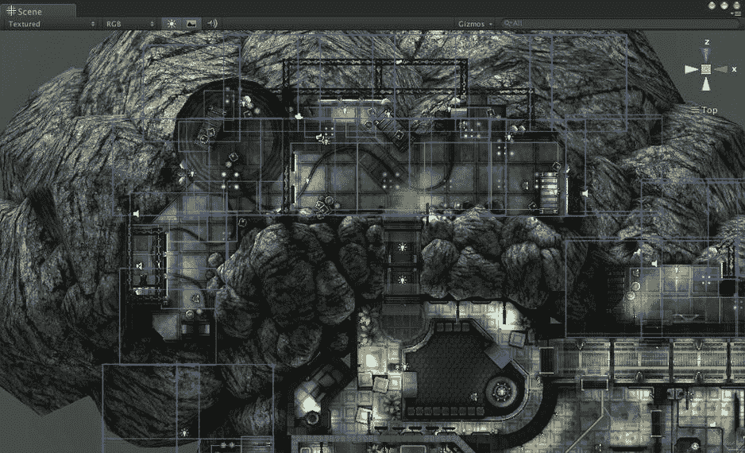

图 2-38. 场景视图中的俯视图

这里的摄像机与游戏中使用的场景中的摄像机 `GameObject` 不同，因此您不必担心在场景视图中环顾时会弄乱游戏。

点击场景导向器中心的方框，可以在透视投影和正交投影之间切换摄像机投射。透视投影会随着物体距离变远而将其渲染得更小；正交投影则无论远近，都按原始大小渲染所有物体。透视更真实，是 3D 游戏中常见的视图，但正交在设计时通常更方便（因此它在计算机辅助设计应用中无处不在）。场景导向器下方文字前的小图形指示了当前的投影方式。

您可以使用鼠标滚轮缩放，或者选择编辑器窗口右上角工具栏中的“手形”工具，然后在按住 Control 键的同时点击拖动鼠标进行缩放。当选择“手形”工具时，您还可以通过点击拖动视图来移动摄像机，并通过在按住 Option（或 Alt）键的同时拖动鼠标来旋转（环绕）摄像机，这样您就不会被限制在仅使用轴向摄像机角度，如图 2-39 所示。

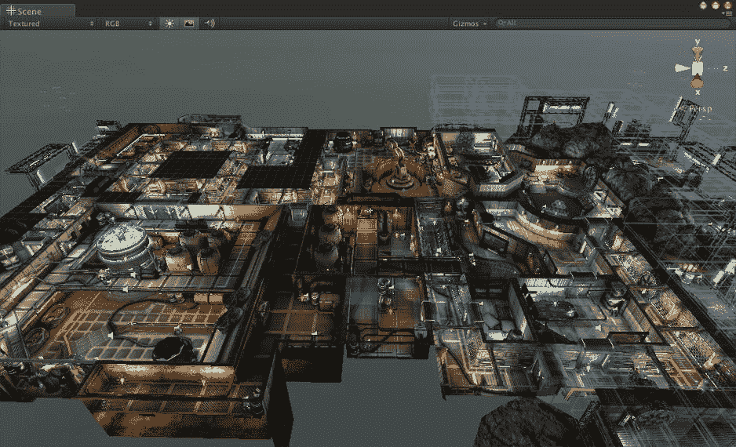

图 2-39. 场景视图中的倾斜透视

请注意，当您从任意角度观察时，场景导向器下方的文字会显示为“Persp”或“Iso”，具体取决于您使用的是透视投影还是正交投影（Iso 是等距的缩写，这是《星际争霸》和《Farmville》等游戏中常见的倾斜正交视图）。

工具栏上的其他按钮用于激活移动、旋转和缩放 `GameObject` 的模式。目前没有必要更改 Angry Bots 的场景，因此这些模式将在您开始创建新项目时进行更详细的解释。

**提示** 如果您不小心对场景进行了更改，可以从“编辑”菜单中选择“撤销”。如果您做了很多不想保留的更改，只需在切换到另一个场景或退出 Unity 时选择不保存此场景即可。同时请注意，在这些模式下，您仍然可以使用鼠标和键盘的组合键来移动摄像机。表 2-1 列出了所有可能的选项。

表 2-1. 可用的场景视图摄像机控制

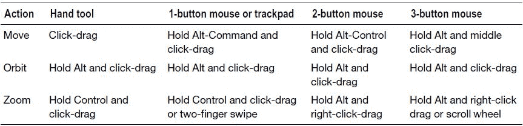

