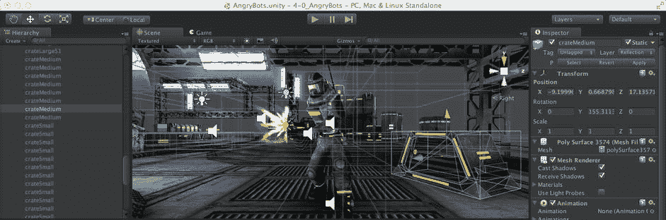
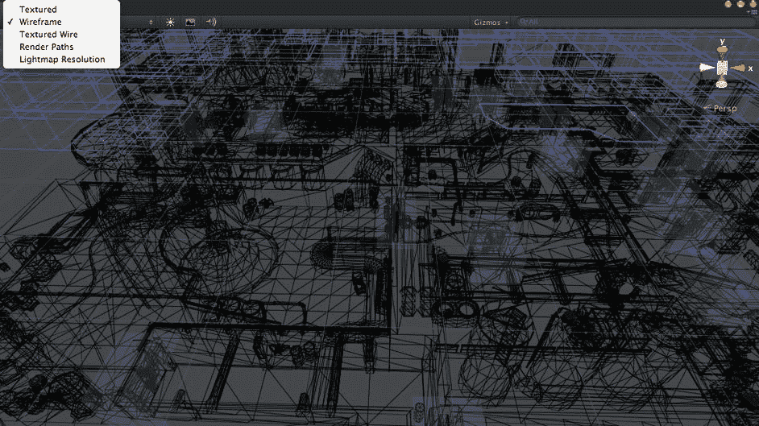
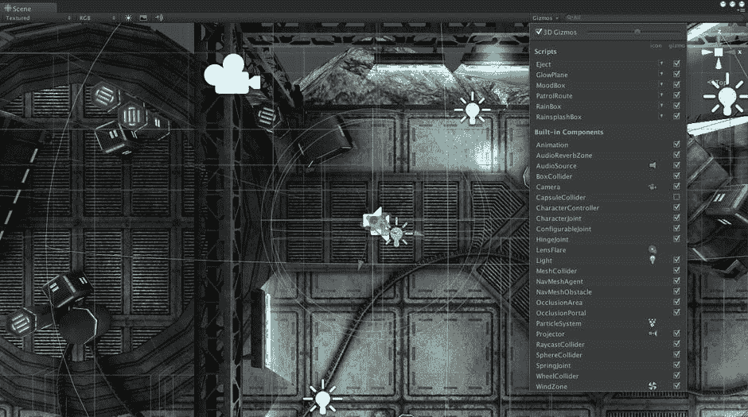
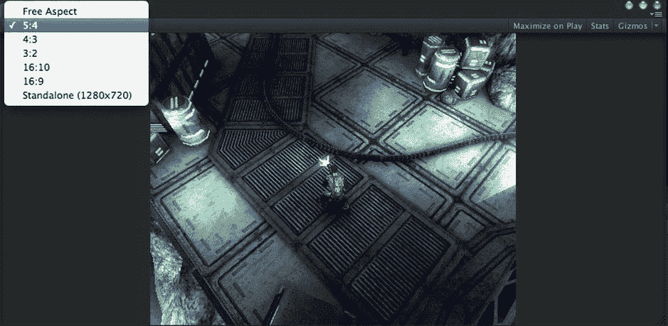
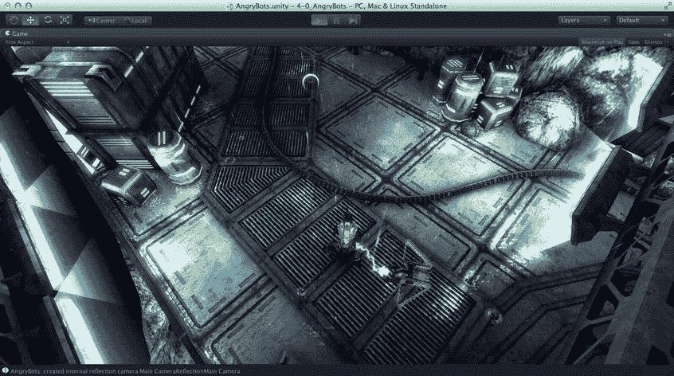
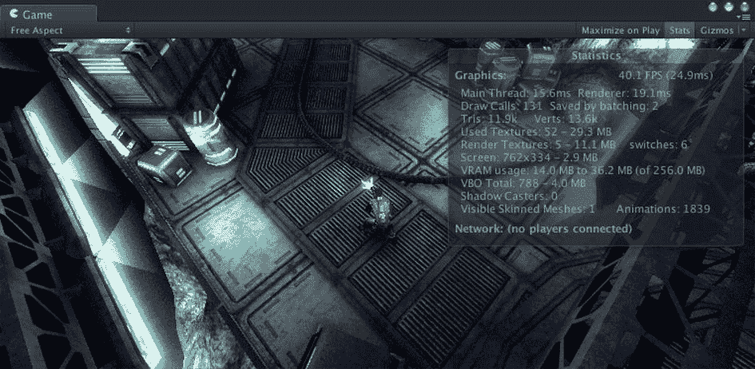
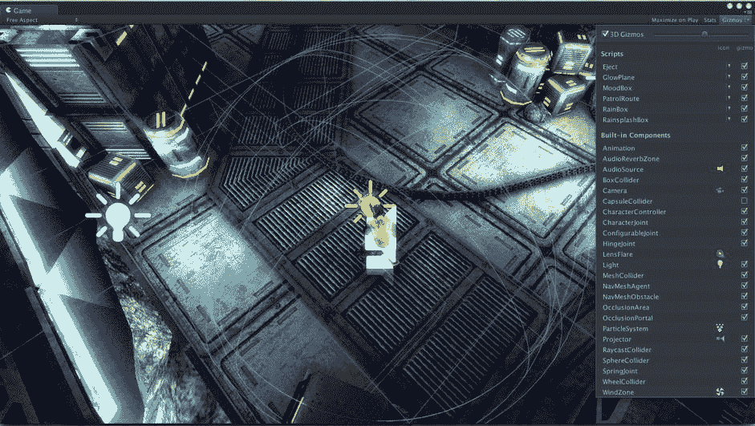
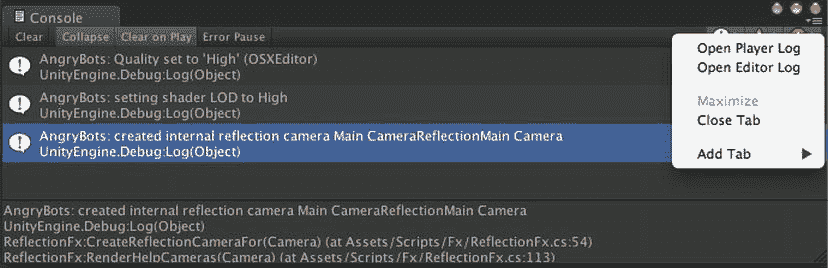

# 场景视图导航

还有一些其他方便的基于键盘的场景导航功能。按下 `方向键` 将使摄像机沿 x-z 平面（地面）向前、向后、向左和向右移动。按住鼠标右键可以像第一人称游戏一样在场景中导航。`A`、`W`、`S`、`D` 键分别向左、向前、向右和向后移动，而移动鼠标则控制摄像机（视点）的观看方向。

当你想在场景视图中查看某个特定的 `游戏对象` 时，最快的方法通常是在层级视图中选中该 `游戏对象`，然后使用 `编辑` 菜单中的 `帧选` 菜单项（注意快捷键 `F` 非常方便）。在图 2-40 中，我点击了场景导航器的 x 轴以获得水平视图，然后在层级视图中选中了 `玩家` `游戏对象`，并按下 `F` 键（`编辑` 菜单中 `帧选` 的快捷键）来拉近并居中场景视图中的玩家角色。

你也可以直接在场景视图中选中一个 `游戏对象`，但必须先退出 `手形` 工具。正如在层级视图中选中一个 `游戏对象` 会使该对象在场景视图和检视视图中显示一样，在场景视图中选中一个 `游戏对象` 同样会使其在检视视图中显示，并在层级视图中显示为选中的 `游戏对象`。在图 2-40 中，在对 `玩家` 执行 `帧选` 后，我点击了 `移动` 工具（编辑器窗口右上角 `手形` 工具按钮右侧的按钮），然后在场景视图中点击了 `玩家` 附近的一个 `游戏对象`。层级视图会自动更新以显示该 `游戏对象` 已被选中，并且该 `游戏对象` 也会在检视视图中显示。

图 2-40. 在场景视图中选中一个 `游戏对象`

#### 场景视图选项

场景视图顶部的按钮提供了显示选项，以辅助你的游戏开发。每个按钮配置一种视图模式。

最左侧的按钮设置绘制模式。通常，此模式设置为 `纹理`，但如果你想查看所有多边形，可以将其设置为 `线框`（图 2-41）。

图 2-41. 场景视图中的 `线框` 显示

下一个按钮设置渲染路径，用于控制场景是正常着色还是用于诊断。

渲染路径模式按钮右侧的三个按钮是简单的切换按钮。当你将鼠标悬停在它们上面时，每个按钮都会弹出一些鼠标悬停文档（也称为*工具提示*）。

第一个按钮控制场景光照模式。此按钮可在场景视图中使用默认光照方案或你实际放置在游戏中的光照之间进行切换。

中间的按钮切换游戏覆盖模式，控制天空、镜头光晕和雾效是否可见。

最后是试听模式，用于打开或关闭声音。

#### 场景视图辅助图标

右侧的 `辅助图标` 按钮可激活与组件关联的诊断图形显示。图 2-42 中的场景视图显示了几个辅助图标（不要与控制场景视图摄像机的场景导航器混淆）。通过点击 `辅助图标` 按钮并检查可用辅助图标列表，你可以看到这些图标代表一个 `摄像机`、几个 `音频源` 和一些 `灯光`。

图 2-42. 场景视图中的辅助图标

你可以选择或取消选择辅助图标窗口中的各个复选框，以聚焦于你感兴趣的对象。左上角的复选框可在辅助图标的 3D 显示或仅 2D 图标之间切换。相邻的滑块控制辅助图标的缩放比例（因此，快速隐藏所有辅助图标的方法是将缩放滑块一直拖到左侧）。

### 游戏视图

现在让我们回到游戏视图，你在编辑器中玩《Angry Bots》时已经遇到过了。与层级视图和场景视图一样，游戏视图描绘当前场景，但并非用于编辑目的。相反，游戏视图用于运行和调试游戏。

当你点击 Unity 编辑器顶部的 `播放` 按钮时，游戏视图会自动出现。如果在点击 `播放` 时没有现有的游戏视图，则会创建一个新的。如果编辑器未处于播放模式时游戏视图可见，它将显示游戏的初始状态（即从初始摄像机位置的角度）。

游戏视图显示游戏在真实部署时的外观和功能，但其外观和行为可能与最终构建目标有所差异。一个可能的区别是游戏视图的大小和宽高比。这可以通过视图左上角的菜单来更改。图 2-43 显示了从 `自由宽高比`（会根据视图尺寸自动调整）切换到 5:4 宽高比时发生的情况，后者会按比例缩小游戏显示，使其适合该区域并保持所选宽高比。

图 2-43. 游戏视图

#### 播放时最大化

点击 `播放时最大化` 按钮将导致游戏视图在进入播放模式时扩展到填满整个编辑器窗口（图 2-44）。如果视图已从编辑器窗口中分离出来，则该按钮无效。

图 2-44. 启用了 `播放时最大化` 的游戏视图

#### 统计信息

`统计信息` 按钮显示关于场景的统计数据（图 2-45），这些数据会随着游戏的运行而更新。

图 2-45. 启用了 `统计信息` 的游戏视图

#### 游戏视图辅助图标

`辅助图标` 按钮可激活与组件关联的诊断图形显示。图 2-46 中的游戏视图显示了两个作为灯光辅助图标的图标。位于玩家位置的灯光辅助图标还揭示了灯光半径（即受灯光影响的区域）。`辅助图标` 按钮右侧的列表允许你选择要显示的辅助图标。

图 2-46. 启用了辅助图标的游戏视图

游戏视图和场景视图都是当前场景的描绘。一个 Unity 项目由一个或多个场景组成，而 Unity 编辑器一次只能打开一个场景。你可以将项目视为游戏，场景视为关卡（事实上，一些操作场景的 Unity 脚本函数在其名称中使用了“level”）。通过附加组件可以使 Unity 的 `游戏对象` 变得有趣，每个组件都提供一些特定的信息或行为。这就是检视视图的用武之地。如果你在层级视图或场景视图中选中一个游戏对象，检视视图将显示其附加的组件。

### 控制台视图

在所有预设布局中的剩余视图，即控制台视图，很容易被忽略，但它非常有用（图 2-47）。

图 2-47. 控制台视图

