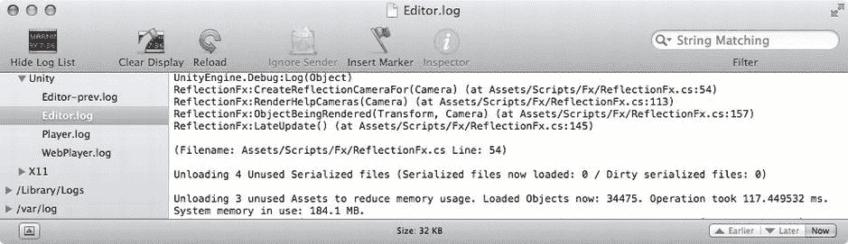

# 信息、警告和错误消息显示在控制台视图中

信息、警告和错误消息显示在`Console View`（控制台视图）中。错误消息显示为红色，警告消息显示为黄色，信息消息显示为白色。从列表中选择一条消息，会在下方区域显示更详细的信息。此外，`Unity Editor`（Unity 编辑器）底部的单行区域会显示最新的`Console`消息，因此即使`Console`视图不可见，您也始终可以看到有消息被记录。

**提示**：警告消息很容易被忽略，但忽略它们可能会带来风险。这些警告之所以存在，通常表明某些问题需要解决。如果您让警告不断累积，就难以在真正重要的警告出现时及时发现它们。

控制台可能会很快变得杂乱。您可以通过`Console View`顶部的左侧三个按钮来管理这些杂乱信息。`Clear`（清除）切换按钮用于删除所有消息。`Collapse`（折叠）切换按钮用于合并相似的消息。`Clear on Play`（播放时清除）切换按钮会在编辑器进入播放模式时删除所有消息。

`Error Pause`（错误暂停）按钮会使编辑器在遇到错误消息时暂停，具体来说，当脚本调用`Log.LogError`时。

在编辑器中操作时，日志消息会记录到`Editor log`（编辑器日志）中，而从 Unity 构建的可执行文件生成的消息则会定向到`Player log`（播放器日志）。从视图菜单（点击`Console View`右上角的小图标）中选择`Open Player Log`（打开播放器日志）或`Open Editor Log`（打开编辑器日志），会以文本文件或在`Console`应用程序中打开这些日志（参见 图 2-48）。

图 2-48 Mac Console 应用程序中的 Unity 日志

