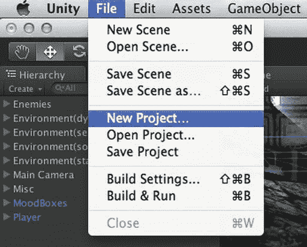
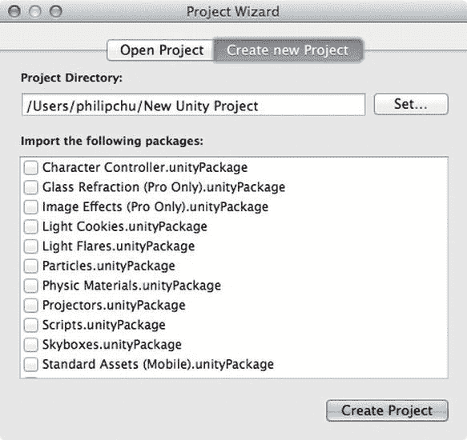
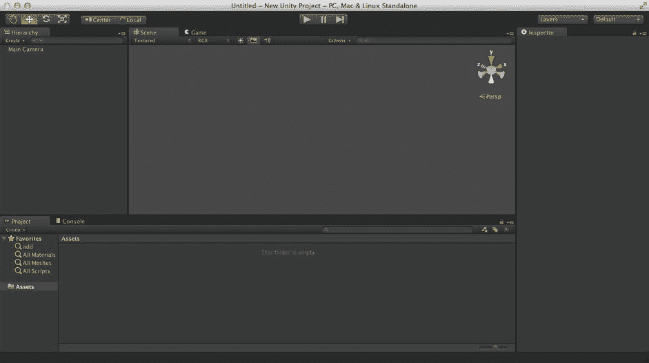
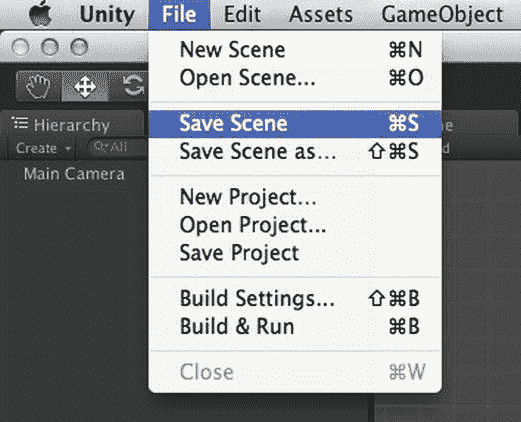
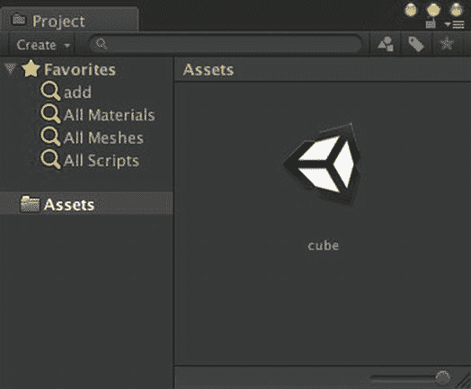
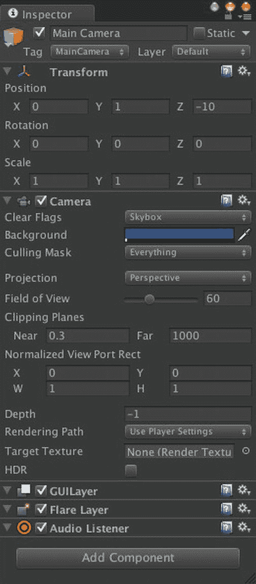

# 每章都建立在前一章的基础上

本书的每一章（除了第 10 章和第 11 章中“愤怒机器人”项目会短暂回归之外）都建立在前一章的项目之上。因此，到本书结束时，本章创建的简单静态场景将演变成一个带有音效和物理效果的优化保龄球游戏，可在 iOS 上运行，并支持排行榜、成就和广告。本章创建的项目以及后续各章的项目，都可以在 `http://learnunity4.com/` 上找到，但不包含来自资源商店或标准包的资源。

那么，闲话少叙，我们开始吧！

### 创建一个新项目

如果你在上一章结束后 Unity 编辑器仍在运行，请使用 `File` 菜单中的 `New Project` 项目创建一个新的 Unity 项目（图 3-1）。

图 3-1. `New Project` 菜单项

弹出的 `Project Wizard`（图 3-2）与我们在上一章中选择 `Open Project` 时使用的界面相同，但现在选中了 `Create New Project` 选项卡。如果你刚刚启动 Unity 并看到 `Project Wizard`，直接点击此选项卡即可创建新项目，而无需打开已有项目。

图 3-2. 使用 `Project Wizard` 创建新项目

`Project Wizard` 会提示你输入新项目的文件名和位置，默认保存到家目录，名称为 `New Unity Project`（如果该文件夹已存在，则会追加数字，例如 `New Unity Project 1`，如果此名称也存在，则继续追加为 `New Unity Project 2`，依此类推）。点击 `Set` 按钮会打开文件选择器，你可以通过浏览来选择目录位置，而无需手动输入路径。

你可以按自己的喜好命名项目，或者暂时使用默认名称。Unity 项目本身并不关心其名称，因此你之后可以在 Finder 中重命名项目文件夹（只需确保先退出 Unity 或切换到其他项目，以免对当前会话造成破坏）。

**提示** 如果你有一个打算长期保留的项目，最好给它起一个有意义的名字。我不止一次在我的 Mac 上发现了旧的 `New Unity Project` 文件夹，并疑惑它是否重要。

`Project Wizard` 会列出一系列 Unity 包，我们可以立即将其导入到新项目中。这些就是上一章安装 Unity 时附带的标准资源。你现在无需选择任何包，因为之后随时可以导入所需内容。

现在，Unity 编辑器将显示一个全新的空项目（图 3-3）。`Project View` 中没有显示任何资源（你可以在 Finder 中确认项目下的 `Assets` 文件夹是空的），当前场景是一个未命名也未保存的场景，其中只包含一个名为 `Main Camera` 的 `GameObject`。

图 3-3. 新 Unity 项目在编辑器中的外观

你应该做的第一件事就是保存并命名这个场景。`Save Scene` 选项位于 `File` 菜单中（图 3-4），其快捷键 `Command+S` 与常规应用程序的保存操作一致（你可以将 Unity 编辑和管理的场景类比为文字处理应用程序编辑和管理的文档）。

图 3-4. `Save Scene` 菜单项

弹出的选择器会将项目的 `Assets` 文件夹作为默认位置，这没问题；场景本身就是一种资源，属于项目的一部分，因此场景文件必须放在 `Assets` 文件夹中。系统不会提供默认名称，所以你需要自行输入一个。我们将其命名为 `cube`，因为这个场景将只展示一个立方体。新场景会出现在 `Project View` 中，并带有一个 Unity 图标（图 3-5）。

图 3-5. `Project View` 中的新场景

当你退出 Unity 或切换场景/项目时，如果有未保存的更改，Unity 会提示你保存场景（这些更改有时只是些无害的界面变化，所以不必惊慌）。但为了预防崩溃，养成经常保存的好习惯是很有必要的。

`File` 菜单中还有一个 `Save Scene As` 命令，类似于其他应用程序的 `Save As` 命令。它可以让你随时用新名称保存场景，实际上是创建了一个场景副本。

**提示** 相较于使用 `Save Scene As` 命令，更简单的方法通常是在 `Project View` 中选择场景文件，然后按 `Return` 键重命名，或用 `Command+D` 快捷键复制场景。

你可能想知道 `File` 菜单中 `Save Scene` 和 `Save Project` 的区别。`Save Project` 会保存项目中的任何更改，但不保存当前场景；而 `Save Scene` 则会同时保存当前场景中的所有更改，例如场景中 `GameObject` 的更改或逐场景设置（渲染设置）的更改。通常情况下你都会使用 `Save Scene`。`Save Project` 适用于以下情况：你已经对项目设置或资源进行了一些更改并希望保存，但场景中有尚未准备好保存的更改，甚至可能打开了一个你根本不想保存的新场景。

### 主摄像机

新场景的 `Hierarchy View` 只列出了一个 `GameObject`，名为 `Main Camera`。每个新场景都以这个摄像机 `GameObject` 开始，它在我们玩游戏时充当场景中的眼睛。`Main Camera` 的特殊之处在于脚本可以方便地访问它（通过变量 `Camera.main` 引用）。

#### 多摄像机

摄像机名称是 `Main Camera` 这一事实可能会让你认为场景中可以存在多个摄像机，你的想法是正确的。同时拥有多个视点可能看起来很奇怪，但多摄像机可以实现分屏显示或屏幕内嵌窗口等功能。Unity for iOS 实际上并不支持这些用途（请参见下面的“视口”部分），但多摄像机在其他情况下仍然很有用，例如用 `Main Camera` 渲染游戏世界，用另一个摄像机渲染用户界面，从而有效地将一组 `GameObject` 叠加在另一组之上。

#### 摄像机的构成

我们选中 `Main Camera`，这样就可以在 `Inspector View` 中看到摄像机的构成（图 3-6）。

图 3-6. `Main Camera` 的 `Inspector View`

从顶部开始，你可以看到名称 `Main Camera`。左侧的复选框指定此 `GameObject` 是激活还是禁用。如果取消勾选，摄像机将被停用，在 `Hierarchy View` 中会显示为灰色，并且你在 `Game View` 中将看不到任何内容。如果你确定此 `GameObject` 永远不会移动，可以勾选右侧标有 `Static` 的复选框。将 `GameObject` 标记为静态有助于优化，不过这通常不适用于摄像机。

在名称下方，你可以看到此 `GameObject` 的标签是 `MainCamera`，这实际上才指定了该 `GameObject` 作为 `Main Camera` 的身份。名称仅用于显示，因此你可以在 `Inspector View` 中编辑此名称而不会产生任何影响。

