# 当前游戏对象的层菜单

当前游戏对象的层菜单位于右侧。与使用名称进行描述、使用标签进行识别不同，层（Layers）用于对游戏对象进行分组。你可以将这些层想象成类似 Photoshop 中的图层。注意不要将此层菜单与编辑器窗口右上角的“层”菜单混淆（不幸的是，在默认布局中，它们彼此相邻）。右上角的“层”菜单控制着哪些游戏对象在场景视图中可见（它实际上应该位于场景视图中）。

#### 变换组件

与其他所有游戏对象一样，主摄像机拥有一个**变换（Transform）组件**，用于指定该游戏对象的位置、旋转和缩放比例。缩放比例对于摄像机而言没有意义，但位置和旋转属性允许你放置和瞄准摄像机。

单击组件右上角的小问号图标。这将在网页浏览器窗口中打开变换组件的参考手册文档。

**提示** 每次遇到新组件时，你应该做的第一件事就是查阅文档。

每个组件的参考手册页面都会描述该组件的属性并解释其用法。每个参考手册页面还包含一个指向该组件对应脚本参考页面的链接，详细说明了如何从脚本中访问该组件。

### 摄像机组件

**摄像机（Camera）组件**是使此游戏对象成为摄像机的关键。严格来说，主摄像机是一个拥有`Camera`组件的游戏对象——该组件是组件的一个子类。但为了方便，我们可以说主摄像机是一个“摄像机”（因为这是它的功能），而使用“摄像机组件”来明确我们讨论的是该组件。

同样，点击此组件的问号图标将打开相应的参考手册页面，列出摄像机组件的属性。但我将在此处（按检查器视图中自上而下的顺序）简要介绍它们。

#### 清除标志

`清除标志（Clear Flags）`属性指定摄像机在每次渲染通道开始时如何初始化颜色缓冲区和深度缓冲区。颜色缓冲区包含摄像机渲染的像素，而深度缓冲区则保存每个像素到摄像机的距离（通过这种方式，它决定新绘制的像素是否应替换该位置的先前像素）。

-   固定颜色（Solid Color）：表示颜色缓冲区将被清除为指定的颜色——这基本上用作背景色，同时深度缓冲区也会被清除。
-   天空盒（Skybox）：同样会清除深度缓冲区，并在背景中渲染指定的天空盒纹理（如果没有提供天空盒，则默认为固定颜色）。
-   仅深度（Depth Only）：保持颜色缓冲区不变，仅清除深度缓冲区。这在添加一个在主摄像机之后渲染并覆盖其结果的摄像机时很有用，例如，在游戏世界的渲染之上渲染用户界面或 HUD（抬头显示）。在这种情况下，你不希望第二个摄像机在渲染前清屏。

#### 剔除遮罩

这正是层（Layers）的实用性所在。`剔除遮罩（Culling Mask）`指定了此摄像机将渲染哪些层。换句话说，只有当游戏对象的层被包含在摄像机的`剔除遮罩`中时，该对象才对摄像机可见。

默认值为`Everything`，对应所有层。但例如，如果你有一个 HUD 摄像机，你可以为所有 HUD 游戏对象定义一个 HUD 层，然后将 HUD 摄像机的`剔除遮罩`设置为仅渲染 HUD 层。接着，将主摄像机的`剔除遮罩`设置为包含除 HUD 层之外的所有层。

#### 投影

默认情况下，摄像机设置为使用透视投影（perspective projection），正如我在上一章描述场景视图时提到的，这意味着物体离摄像机越远，看起来越小（这种效果称为*透视缩短（foreshortening）*）。在此模式下，摄像机具有一个类似于四棱锥（不包括锥体底面）的视景体，从摄像机位置沿视线方向发出。这个视景体被称为*视锥体（frustum）*，由视野（FOV）、近平面和远平面定义。

视野类似于真实世界摄像机的视场角。FOV 是以度为单位表示的垂直视角。水平视角则由 FOV 和摄像机的宽高比共同隐式定义。近平面和远平面分别指定了屏幕在摄像机前方多远的位置，以及视锥体底座的距离。任何在视锥体之外的东西对摄像机都是不可见的。

为了更好地了解视锥体的外观，可以看看场景视图。图 3-7 展示了当你按下场景 Gizmo 上的 y 轴箭头，将视角切换到俯视图时，主摄像机视锥体的样子。按下 F 键（编辑菜单中“Frame Selected”命令的快捷键）将主摄像机居中显示在场景视图中，然后缩小直到你能看到整个视锥体。你还应该取消选中`Gizmos`菜单中的`3D Gizmos`复选框，这样当您缩小时，摄像机图标就不会缩小到看不见。

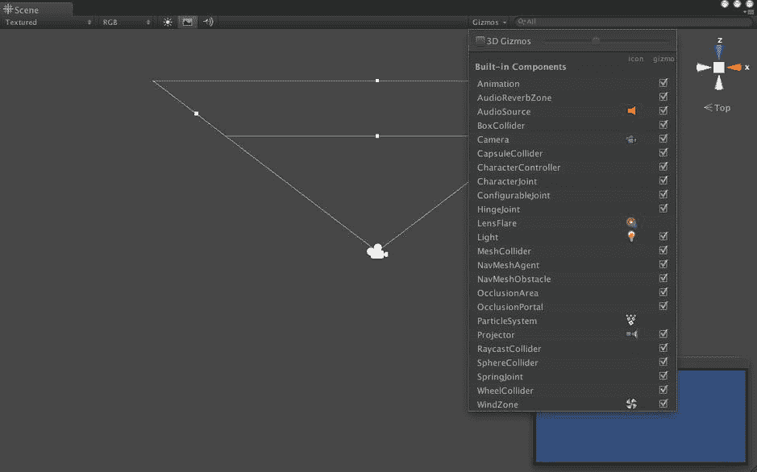

图 3-7. 场景视图中的摄像机视锥体

场景视图的右下角还会显示一个摄像机预览。这就是摄像机此时会渲染的内容，也就是游戏视图此时会显示的内容（你现在可以查看游戏视图来确认）。这个场景中还看不到任何东西，但稍后这将是一个很方便的功能。

请注意，视锥体轮廓和摄像机预览仅在摄像机被选中且检查器视图中的摄像机组件处于展开状态时显示（检查器视图中的每个组件都可以通过单击左上角的小三角形来展开或折叠）。这对于任何在场景视图中具有额外图形显示的组件来说通常是成立的。在检查器视图中展开或折叠组件将切换该显示。

透视投影的替代方案是正交投影（orthographic），它没有透视缩短效果，因此适用于 2D 游戏、等距游戏、用户界面和 HUD。正交模式下特有的摄像机属性是正交投影大小（Size），即正交视图在世界单位中的半高。

#### 视口

视口（Viewport）为`(0,0,1,1)`表示摄像机覆盖整个屏幕。这些数字是归一化的屏幕坐标，意味着屏幕宽度和高度上的坐标范围是从 0 到 1。对于分屏或屏幕内的窗口，你需要多个摄像机，每个摄像机设置不同的视口。例如，`(0,0,1,.5)`覆盖一半屏幕。然而，Unity iOS 不支持不覆盖全屏的视口。

#### 深度

当场景中存在多个摄像机时，深度（Depth）是另一个有用的属性。在每次渲染更新期间，摄像机将按照其深度值从小到大依次执行渲染通道。因此，举例来说，如果你有用于查看 HUD 的第二个摄像机，你可以指定主摄像机的深度为 0，HUD 摄像机的深度为 1，以确保游戏世界先渲染，游戏 HUD 渲染在其之上。

#### 渲染路径

`渲染路径（Rendering Path）`决定了场景的渲染方式。每个摄像机可以拥有自己的`渲染路径`，或默认使用在播放器设置中指定的路径。`顶点光照（Vertex Lit）`是最简单但最快的路径，`正向渲染（Forward Rendering）`支持更高级的图形，而`延迟渲染（Deferred）`是最华丽但最慢的，且在 Unity iOS 中不可用。

#### 目标纹理（专业版）

渲染到纹理功能仅在 Unity Pro 和 Unity iOS Pro 中可用。如果将纹理分配到此属性，摄像机将渲染到该纹理上，而非屏幕。随后，该纹理可以被放置到场景中，例如，用作电视显示器或汽车后视镜。

#### `HDR`

该属性启用高动态范围（`HDR`），它可以处理 `RGB` 分量超出正常 0 到 1 范围的像素，并有助于渲染具有极高对比度的场景。Unity iOS 中不提供 `HDR` 功能。

#### `FlareLayer` 组件

当你从 `GameObject` 菜单创建摄像机 `GameObject` 时，会自动附加一个摄像机 `Component` 和一个 `FlareLayer` `Component`。`FlareLayer` `Component` 允许摄像机渲染镜头光晕（本章稍后介绍）。

`FlareLayer` `Component` 有点不寻常，因为它不暴露给脚本，因此它有一个参考手册页面，但没有脚本参考页面。但是，仍然可以通过其类名从 `GameObject` 访问 `FlareLayer` `Component`，即调用 `GetComponent("FlareLayer")`。

#### `GUILayer` 组件

一个 `GUILayer` `Component` 也会自动附加到摄像机 `GameObject` 上。此组件允许摄像机渲染 `GUIText` 和 `GUITexture`，这些是常用于用户界面的 2D 元素。

**注意** `GUILayer`、`GUIText` 和 `GUITexture`（以及 `GUIElement`，它是 `GUIText` 和 `GUITexture` 的父类）与 UnityGUI（一个更新的内置 GUI 系统）无关。

你可能已经注意到，检查器视图将 `GUILayer` 显示为一个单词，而 `FlareLayer` 显示为两个单词。编辑器试图通过在大写字母跟随小写字母的地方引入空格，以更符合英语习惯的方式呈现类名。这对 `FlareLayer` 有效，但对 `GUILayer` 无效。无论如何，本书将坚持使用原始类名，因为这是在脚本中引用的内容。

#### `AudioListener` 组件

`AudioListener` `Component` 仅自动附加到主摄像机，因为一次只能有一个活动的 `AudioListener`。摄像机 `Component` 类似于你的眼睛，负责渲染其视野内的一切到你的电脑屏幕上，而 `AudioListener` `Component` 则像你的耳朵，负责将场景中所有可听的 `AudioSource` 路由到电脑扬声器。

### 向场景添加一个立方体

你已经注意到摄像机预览和游戏视图没有显示任何内容，当你点击播放按钮时，游戏视图也会出现同样的情况。当然，这是因为你的场景中除了摄像机之外没有任何物体。让我们遵循创建立方体这一历史悠久的传统来纠正这一点。

#### 制作立方体

在 `GameObject` 菜单的 `Create Other` 子菜单下，Unity 提供了许多捆绑了 `Component` 的 `GameObject`。如果我们想再添加一个摄像机，其中就有一个摄像机 `GameObject`。此外还有一个立方体 `GameObject` 以及其他一些基本形状（图 3-8）。

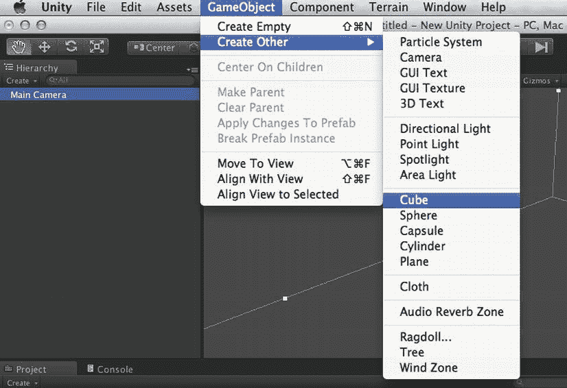

图 3-8。从 `GameObject` 菜单创建一个立方体

从 `GameObject` 菜单中选择立方体项。这将创建一个立方体 `GameObject` 并将其添加到当前场景。立方体将出现在层次视图（图 3-9）中，作为场景中的第二个 `GameObject`。

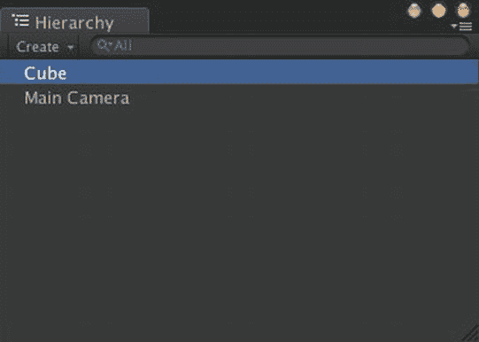

图 3-9。层次视图中的新立方体 `GameObject`

#### 框选立方体

虽然立方体在场景中，但它可能不会立即在场景视图中可见。为了确保可以在场景视图中看到立方体，请在层次视图中选择立方体，然后按 F 键（`Edit` 菜单中 `Frame Selected` 命令的快捷键），这将使立方体在场景视图中居中（图 3-10）。

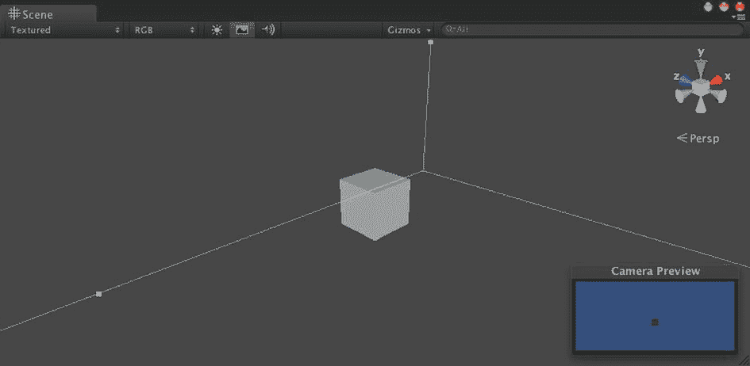

图 3-10。场景视图中的立方体

#### 移动立方体

请记住，`Frame Selected` 命令移动的是场景视图的摄像机，而不是你正在查看的 `GameObject`。立方体可能是在任意位置创建的，因此，在检查器视图中将其位置设置为世界原点 `(0,0,0)`，方法是将这些坐标输入到立方体变换组件的 `x`、`y`、`z` 位置字段中（图 3-11）。如果你犯了错误，不要担心。你可以随时使用 `Edit` 菜单中的 `Undo` 和 `Redo` 命令撤消和重做这样的更改。在这种情况下，你可以撤消位置更改，然后重做它。

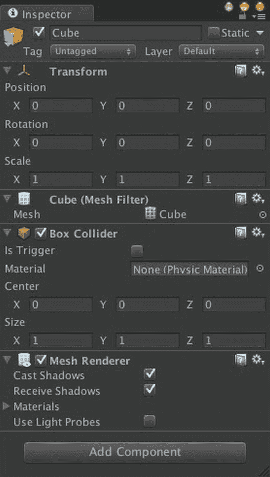

图 3-11。立方体的检查器视图

### 立方体剖析

当你在检查器视图中显示立方体时，看看它是由什么构成的。或者，换句话说，看看立方体的哪些 `Component` 使其成为一个立方体。

#### 变换组件

当然，与每个 `GameObject` 一样，这里有一个 `Transform` `Component`，它提供了立方体的位置、旋转和缩放。

#### 网格过滤器组件

`MeshFilter` `Component` 引用 3D 模型，在 Unity 中称为 `Mesh`，它由三角形和逐顶点信息（如纹理坐标）组成。当不引用像立方体这样的内置 `Mesh` 时，此属性会从项目资源中分配一个 `Mesh`。

#### 网格渲染器组件

与 `MeshFilter` 相辅相成的是 `MeshRenderer` `Component`，它决定了网格的渲染方式，并且很大程度上由材质（如果 `Mesh` 被分割成子网格，则是一系列材质）决定。你可以将材质想象成沙发上的布料——`Mesh` 提供形状，而材质包裹在 `Mesh` 周围以提供表面外观。

`MeshRenderer` 还控制 `Mesh` 是接收阴影还是投射阴影（我将在本章稍后介绍阴影）。

#### 盒碰撞器组件

`MeshFilter` 和 `MeshRenderer` `Component` 只让立方体变得可见。`BoxCollider` `Component` 提供了一个物理表面，用于 Unity 物理系统中的碰撞。由于此场景中没有可以与立方体碰撞的东西，因此你不需要此 `Component`。将其留在那里没有坏处，但你也可以通过取消选中其复选框来禁用该 `Component`。或者，你可以通过右键单击它并从出现的菜单中选择 `Remove Component` 将其从 `GameObject` 中完全移除（图 3-12）。

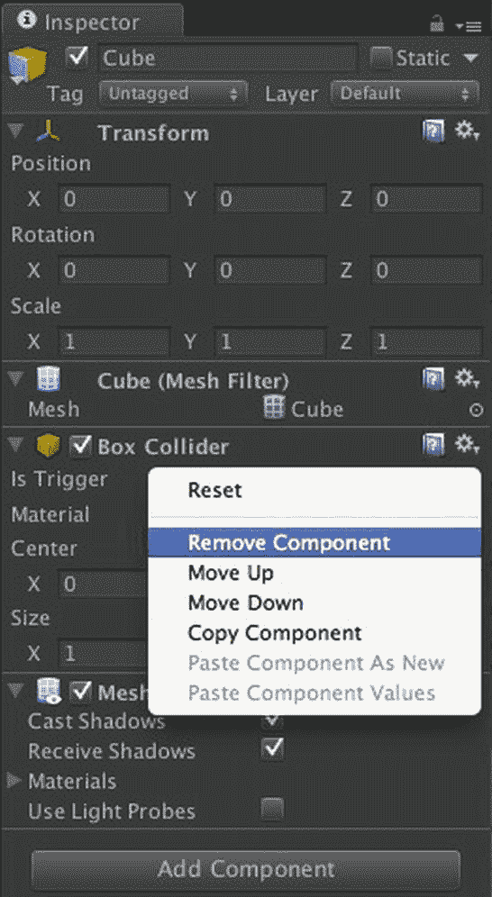

图 3-12。移除一个组件

### 与视图对齐

既然你移动了立方体，你可以再次按 F 键使其在场景视图中居中。但这不会影响主摄像机，正如你在场景视图的摄像机预览中所看到的，以及如果你检查游戏视图的话也会看到。

幸运的是，有一种方便的方法可以将主摄像机与场景视图摄像机同步。选择主摄像机，然后在 `GameObject` 菜单下，调用 `Align With View`（图 3-13）。现在，主摄像机与场景摄像机具有相同的位置和旋转角度，并且你可以在摄像机预览中看到场景视图和游戏视图是相同的。

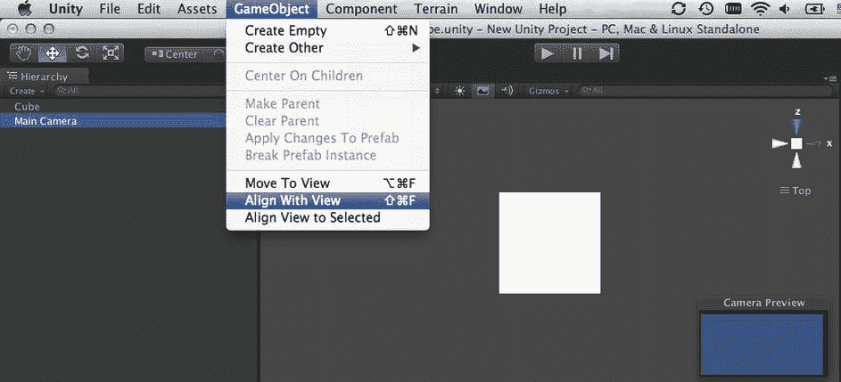

图 3-13。`Align With View` 命令

### 摄像机控制

现在如果你点击播放按钮，你可以看到立方体，但没有太多事情发生。立方体只是呆在那里，没有交互性。对于这种只有一个物体的场景，我喜欢做的第一件事是添加一个摄像机轨道脚本，这样我就可以从所有角度检查物体。方便的是，Unity 在标准资源中附带了几种摄像机控制脚本，其中包括一个 `MouseOrbit` 脚本。

#### 导入脚本

要导入该脚本，请转到 Assets 菜单并选择 Import Package 子菜单。这就是我们创建新项目时呈现的标准资源包列表（图 3-14）。

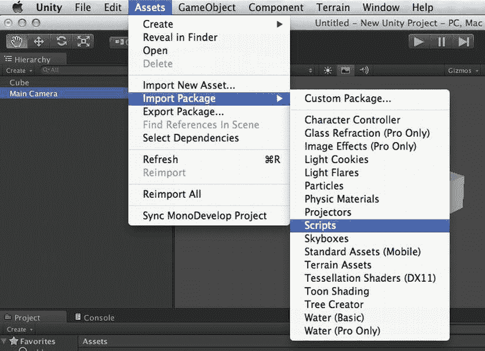

图 3-14. 从标准资源中导入脚本

在此列表中，选择 Scripts 将显示一个窗口，其中列出了 Scripts 包中的所有脚本（图 3-15）。后缀为 `.js` 的脚本是用 JavaScript 编写的，后缀为 `.cs` 的脚本是用 C# 编写的。您可以只导入 *MouseOrbit* 脚本，也可以导入所有脚本。稍后删除不需要的资源也很容易。

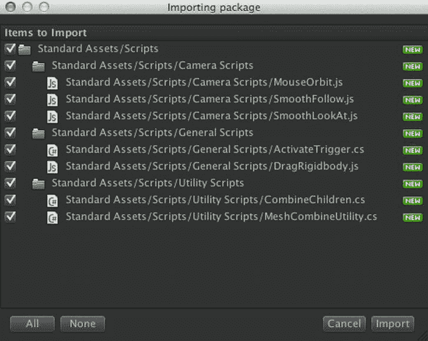

图 3-15. 可用的标准资源脚本

现在，这些脚本及其所在的文件夹会显示在 Project 视图中（图 3-16）。Project 视图不会列出文件名的 `.js` 后缀，但您可以从图标看出它们是 JavaScript 脚本，选择某个脚本将在 Project 视图底部的行中显示其完整名称。

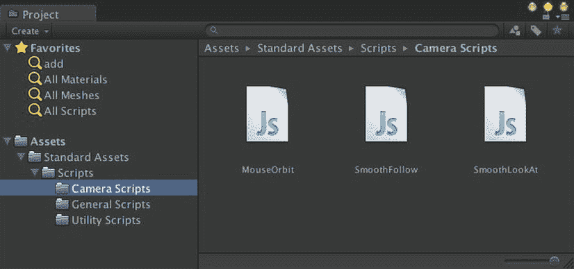

图 3-16. Project 视图中的标准资源脚本

如果您在 Project 视图中选择 *MouseOrbit* 脚本，该脚本中的代码将显示在 Inspector 视图中（图 3-17）。

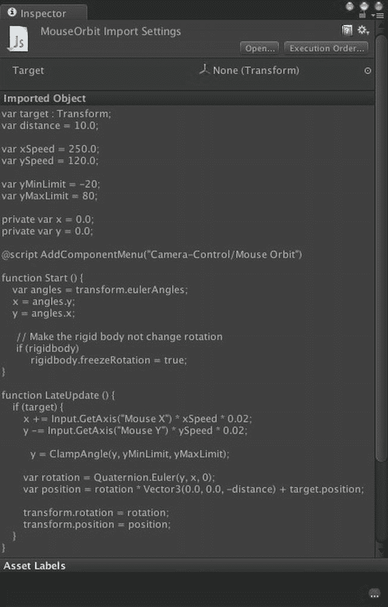

图 3-17. MouseOrbit 脚本的 Inspector 视图

### 附加脚本

将 *MouseOrbit* 脚本拖拽到 Hierarchy 视图中的 Main Camera GameObject 上。这将把该脚本附加到 GameObject 上，因此如果您现在选择 Main Camera，*MouseOrbit* 脚本将作为其组件之一显示出来（图 3-18）。

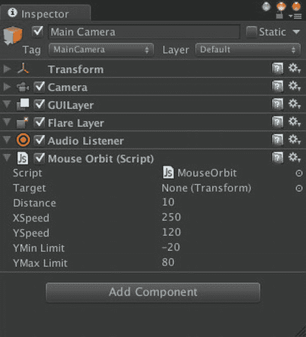

图 3-18. 附加到 Main Camera 的 MouseOrbit 脚本

`MouseOrbit` 组件的第一个属性是对 `MouseOrbit` 脚本的引用（请注意 Unity 如何将组件类型美观地打印为 `Mouse Orbit`，但不要被误导，它实际上是 `MouseOrbit`！）。您实际上可以通过将 Project 视图中的另一个脚本拖拽到该字段，或单击其右侧的小圆圈（这将弹出一个可用脚本列表供您选择，目前列表中全都是您刚刚导入的标准资源脚本），来更改该属性引用的脚本。

脚本本身决定了后续的属性。请注意，MouseOrbit 组件中的每个属性都对应于 MouseOrbit 脚本顶部声明的公共变量（以 `var` 开头的每一行都是公共变量，而以 `private var` 开头的行是私有变量）。

**提示** 在 Inspector 视图菜单（右上角）中选择 Debug 选项，也会将私有变量显示为属性，这对调试很有用。现在试试，您会看到私有变量 `x` 和 `y` 显示出来。Debug 选项还会添加内置组件的诊断属性。

脚本定义的第一个属性是 Target，即摄像机将围绕其旋转的 GameObject。它默认为空（或在代码中为 `null`），因此如果您点击 Play，摄像机将没有围绕旋转的对象。要修正此问题，请将 Cube 从 Hierarchy 视图拖拽到 Target 字段中（图 3-19）。

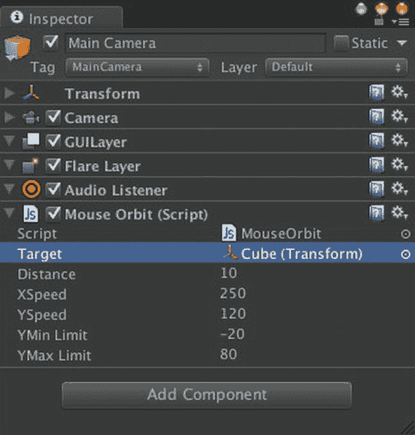

图 3-19. 分配 MouseOrbit 脚本的 Target 属性

现在，当您点击 Play 按钮时，移动鼠标，摄像机将围绕 Cube 旋转。在 Play 模式下，您可以调整其他属性，直到找到您喜欢的值。Distance 属性是摄像机与 Target 之间保持的距离。将其更改为 3，可以使摄像机靠近 Cube，从而填满 Game 视图（图 3-20）。`XSpeed` 和 `YSpeed` 属性控制摄像机相对于鼠标移动的旋转程度，`YMin Limit` 和 `YMax Limit` 属性设置摄像机上下旋转的角度限制。

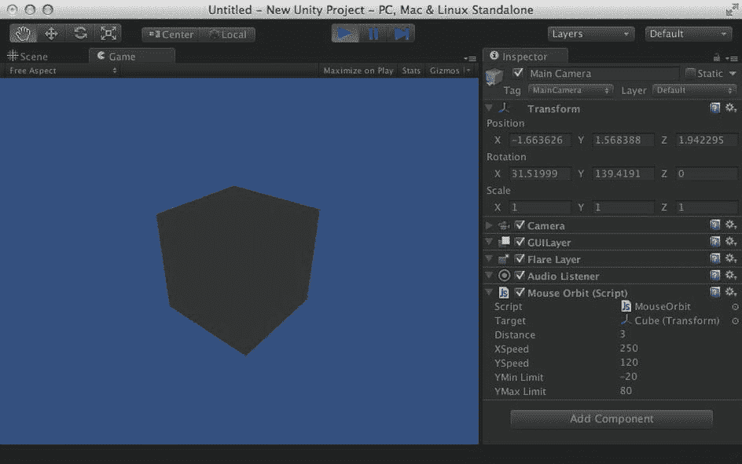

图 3-20. 测试 MouseOrbit 脚本

当您退出 Play 模式时，属性将恢复为进入 Play 模式前的值。这时需要重新输入所需的值。如果您最终得到不喜欢的属性值，可以随时单击组件右上角的图标并选择 Reset，以恢复为默认属性值。

### 添加光源

您可能一直觉得这个 Cube 看起来非常暗。好吧，让我们添加一个光源！在 GameObject 菜单的 Create Other 子菜单下，列出了几种类型的光源（图 3-21）。让我们选择 Point Light。

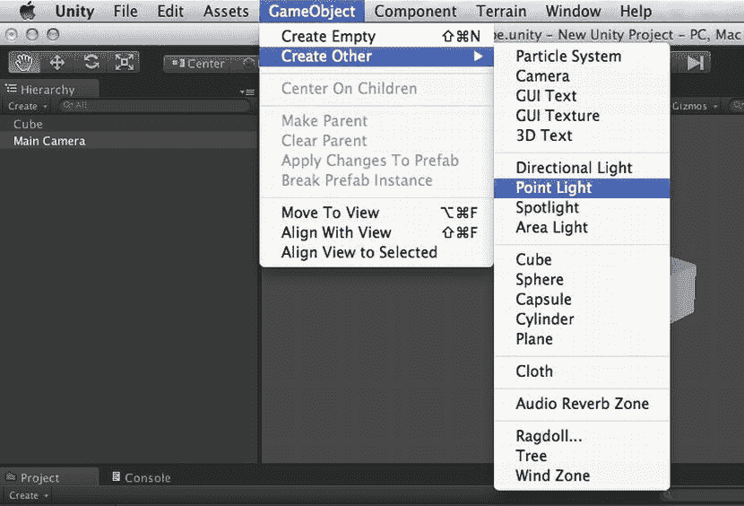

图 3-21. 创建点光源

现在，Point Light 出现在 Hierarchy 视图和 Scene 视图中（图 3-22），您可以看到其标志性组件是一个 Light 组件，其 Type 设置为 Point。点光源只照亮其半径内的物体。因此，您需要调整其位置或半径，以使立方体被照亮。这里您可以将它的位置设置为 `5,5,5`（请记住，立方体位于 `0,0,0`），并将半径设置为 10。

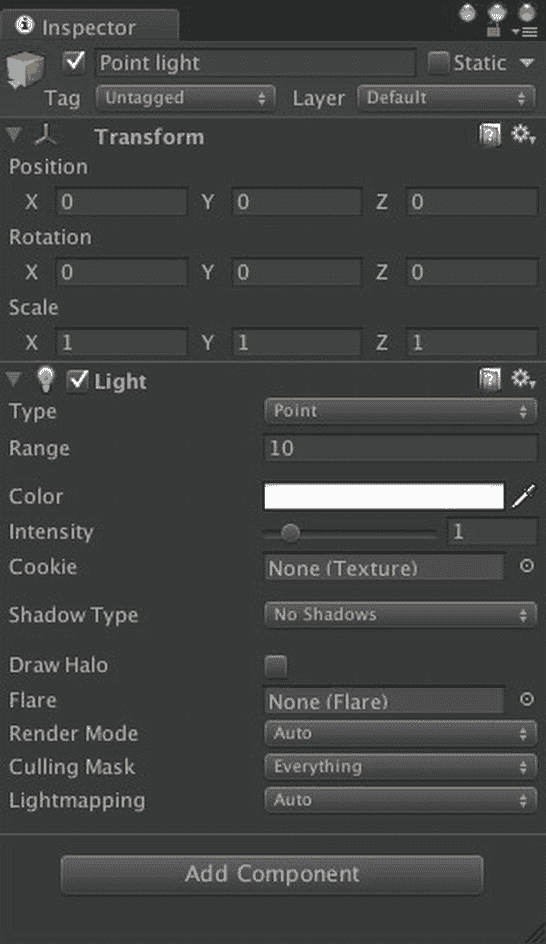

图 3-22. 点光源的 Inspector 视图

### 光源的构成

同样地，一个 GameObject 在附加了 Camera 组件时成为摄像机，在附加了 Light 组件时则作为光源工作。与 Camera 组件类似，Light 组件也具有若干属性，我们将按照 Inspector 视图中从上到下的顺序在此介绍它们。

#### 类型

光源的 Type 指定它是点光源、方向光、聚光灯还是区域光。由于此 GameObject 是作为点光源创建的，因此其 Type 自动设置为 Point。与作为无限远光源（有时称为*无限光*）的方向光不同，点光源具有位置（因此通常被称为位置光）并向各个方向辐射光线。聚光灯也有位置，但像圆锥体一样向特定方向辐射光线。区域光仅用于生成光照贴图（预先计算并“烘焙”到纹理中的光照）。

#### 范围

点光源的 Range 属性指定光源的半径。只有半径内的物体才会受到该光源的影响。

#### 颜色

Color 属性是光源发出的颜色。单击颜色小矩形会弹出一个颜色选择器来分配此属性。

#### 强度

Light Intensity 的取值范围是 0 到 1，其中 0 表示无光照，1 表示最大亮度。

#### 阴影类型

光源的 Shadow Type 属性指定它是否投射阴影，如果是，则指定是硬阴影还是软阴影。阴影仅在 Unity Pro 和 Unity iOS Pro 中可用，即便如此，也仅适用于方向光和点光源（在 Unity iOS Pro 中，仅适用于方向光）。

#### 遮罩纹理

方向光和聚光灯可以将遮罩纹理投射到表面，通常用于模拟阴影。

#### 剔除遮罩

`Culling Mask` 属性指定了光源将影响的层级。这与摄像机组件的 `Culling Mask` 决定摄像机可见对象的方式非常相似，光源的 `Culling Mask` 决定了哪些对象会被光源照亮。

#### Flare

`Flare` 属性在分配了 `Flare` 资源后，会产生一个从此光源发出的镜头光晕效果。

#### Draw Halo

`Draw Halo` 属性会在光源位置周围产生一个光晕效果。启用此属性时，将提供一个额外的光晕颜色属性。

#### Render Mode

光源的 `Render Mode` 指定该光源是 `Important`、`Not Important` 还是 `Auto`，其中 `Auto` 表示其重要性会根据光源的亮度和当前的质量设置自动确定。光源的重要性决定了它是否被应用为像素光。像素光是实现阴影和 `Cookie` 等效果所必需的。

#### Lightmapping

`Lightmapping` 属性决定此光源是用于动态光照、生成光照贴图，还是两者兼用。在这些示例中，你不会使用光照贴图（生成它们需要很长时间），因此 `RealtimeOnly` 或 `Auto` 对这些光源来说都没问题。

### 调整光源

与摄像机一样，当你选中点光源并在检查器中打开其光源组件时，场景视图中会显示更多关于该光源的信息。对于点光源，会显示其半径，因此你可以看到哪些对象受到该光源的影响（图 3-23）。为了使立方体受到点光源的影响，它必须在光源的半径内。但要记住，点光源从其位置向外辐射，因此你不能将点光源放在与立方体相同的位置，因为那样光源会从立方体内部辐射，无法照亮其外表面。

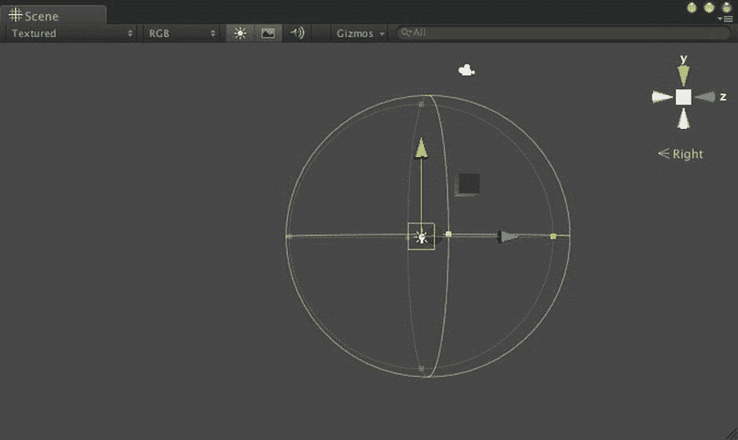

图 3-23 点光源的场景视图

你可以在检查器视图中单独调整光源属性，但也尝试使用场景视图。点击编辑器左上角按钮栏中的 `Move` 按钮（它是手形工具右侧带箭头的按钮）。现在选中点光源，场景视图会显示以光源为中心的箭头，对应光源的 x、y、z 轴。点击并拖动其中任意一个箭头，将沿相应轴移动光源。

光源周围的圆圈勾勒出其范围。你可以通过点击并拖动圆圈内侧的小黄色矩形来调整范围。范围内的任何物体都会被光源照亮，而范围外的物体则不会受到光源影响。

**警告：** 与点光源位置完全相同的物体不会受到该光源的影响。

继续移动光源并根据需要调整其半径，确保立方体被照亮。现在单击 `Play` 按钮，立方体将被照亮，并且当你环绕立方体旋转摄像机时，光照会发生变化。

### 制作光晕

目前，点光源本身在播放模式下是不可见的。光源的存在只能通过它照亮的游戏对象来体现。但是，如果你启用其光晕，就可以看到光源来自何处。在检查器视图中启用 `Draw Halo` 属性，同时点击 `Color` 属性来更改光源的颜色（图 3-24）。

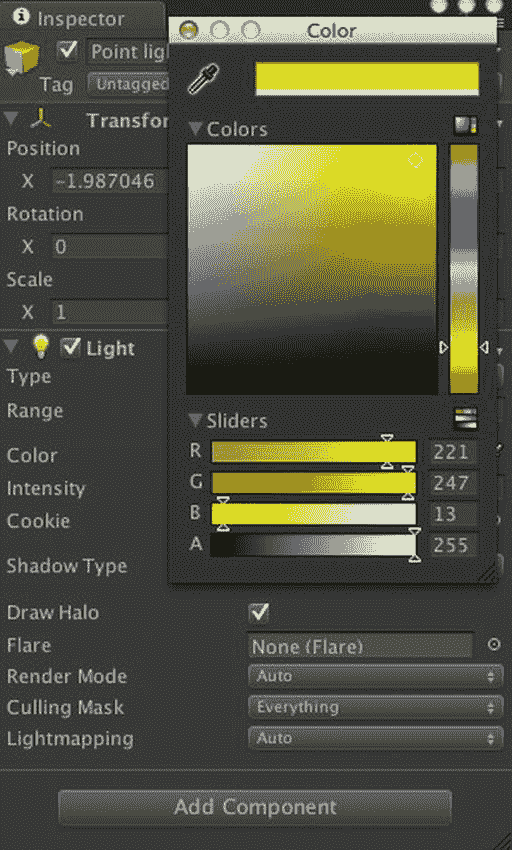

图 3-24 选择光晕颜色

这不仅会影响从物体反射的光的颜色，还会影响用于绘制光晕的颜色。你可以在场景视图中看到光晕（图 3-25），并在点击 `Play` 时看到它（图 3-26）。

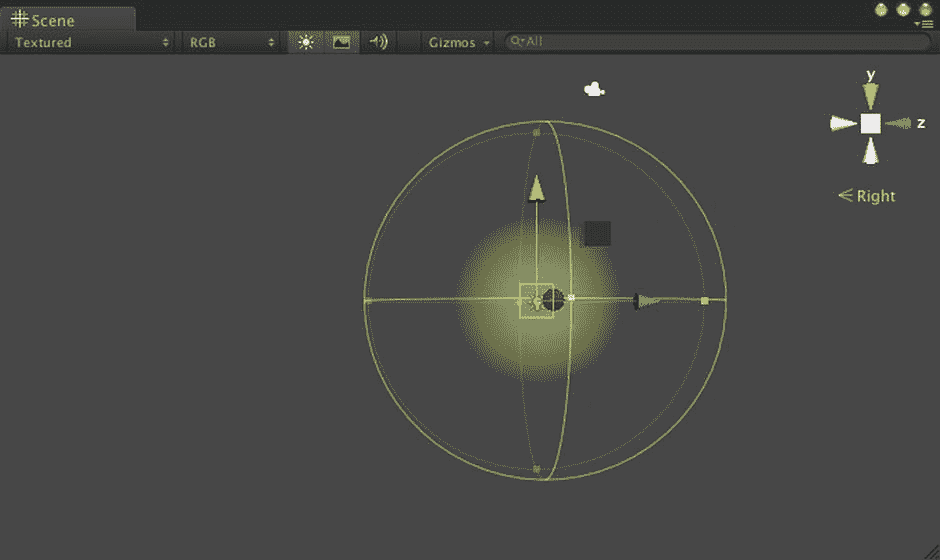

图 3-25 带有光晕的点光源的场景视图

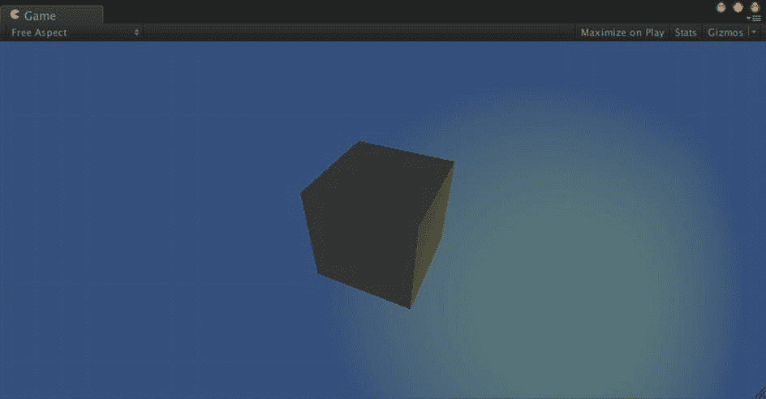

图 3-26 带有光晕的点光源的游戏视图

### 添加天空盒

立方体看起来更有趣了，但背景仍然是空白的，所以让我们通过添加天空来增添一点活力。具体来说，你可以添加一个*天空盒*，它是由六张纹理描绘的天空，这些纹理构成了包围它的立方体的六个内表面。

#### 导入天空盒

你可以像导入摄像机脚本一样，从标准资源中导入天空盒。在 `Assets` 菜单的 `Import Package` 子菜单下，选择 `Skyboxes`（图 3-27）。

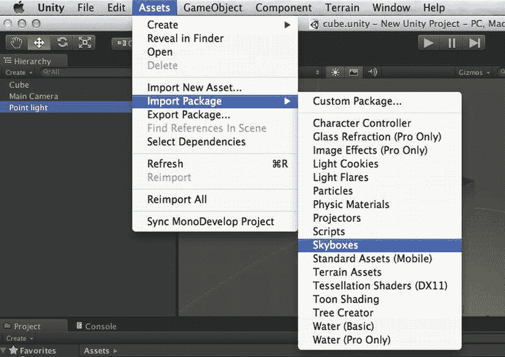

图 3-27 从标准资源菜单导入天空盒

弹出的导入窗口（图 3-28）列出了一大堆天空盒。文件名的 `.mat` 扩展名表明天空盒实际上是一种*材质*，这是一种描述表面如何渲染的对象。天空盒是一种特殊的材质，因为它们不应用于网格，仅用于渲染天空。

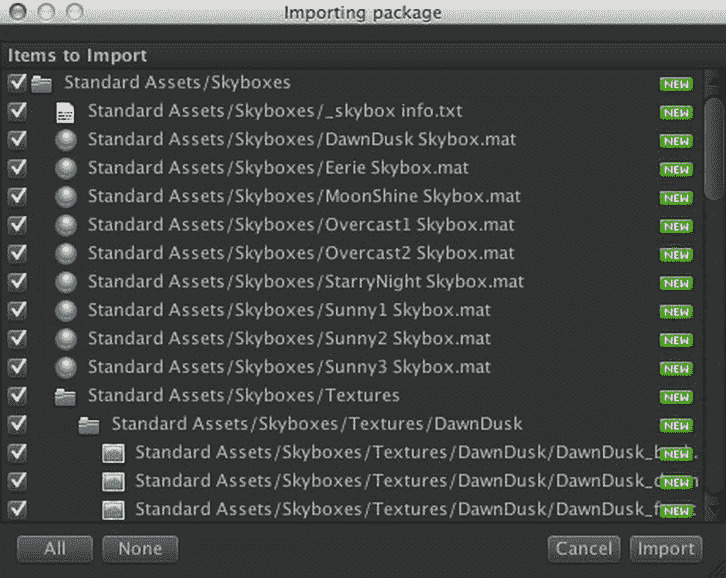

图 3-28 标准资源中的天空盒

继续点击 `Import` 按钮。天空盒及其支持的纹理将出现在项目视图中（图 3-29）。

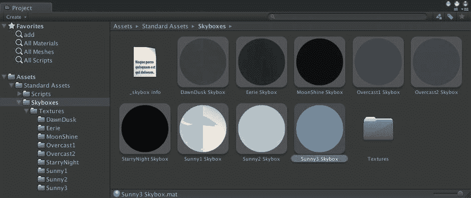

图 3-29 天空盒的项目视图

#### 天空盒的构成

为了更好地理解天空盒的构成，选择 `Sunny3 Skybox` 并在检查器视图中查看它（图 3-30）。由于它是一种材质，天空盒具有一个着色器（一个指导图形硬件如何渲染多边形的程序）以及着色器的一些参数。通常（但并非总是如此），着色器的参数包括一个或多个纹理。在检查器视图中，你可以看到这个天空盒使用 `RenderFX/Skybox` 着色器、六张用于天空盒侧面的纹理，以及一种用于给这些纹理着色的颜色。

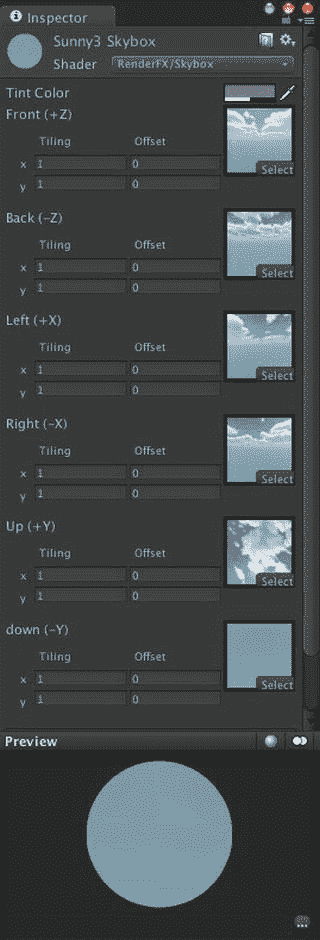

图 3-30 天空盒的检查器视图

#### 应用天空盒

要将天空盒应用于场景，首先确保主摄像机的 `Clear Flags` 属性设置为 `Skybox`。然后调出 `Edit` 菜单并选择 `Render Settings`（图 3-31）。

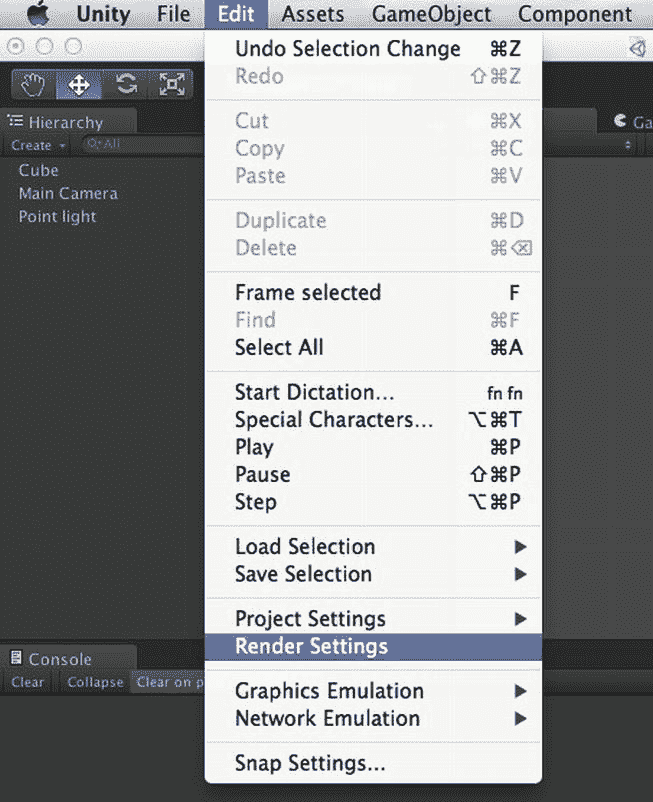

图 3-31 选择 `Render Settings`

`Render Settings` 是应用于整个场景的渲染属性，包括雾效、环境光和天空盒（图 3-32）。

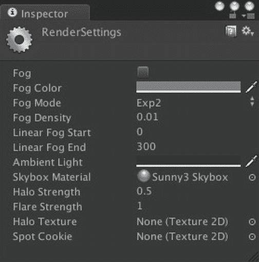

图 3-32 `Render Settings`

**提示：** *如果你使用雾效，最好让雾的颜色与天空盒的色调颜色匹配。*

请注意，你看到的 `Render Settings` 仅适用于当前打开的场景。如果你的项目中有多个场景，每个场景都有自己的 `Render Settings`（否则，每个场景都会使用相同的天空盒）。

将 `Sunny3 Skybox` 拖拽到 `Skybox Material` 字段中，你应该会在场景视图和游戏视图的背景中看到蔚蓝的天空和蓬松的白云（如果你厌倦了蓝天，可以尝试更改天空盒上的 `Tint Color`）。

将天空盒融入场景的另一种方法是为主摄像机添加一个 `Skybox` 组件，并将天空盒材质指定给该组件。这样，该天空盒会覆盖在渲染设置中指定的任何天空盒。只有在拥有多个摄像机且它们需要不同天空盒的情况下，才有理由使用 `Skybox` 组件。

### 添加光晕

Unity 摄像机与真实摄像机之间存在明显的类比关系。这种类比可以通过添加光晕（Flare）来进一步延伸。光晕用于模拟镜头光晕，这实际上是摄像机镜头的一种技术瑕疵，但电影制作者常将其用作特效（例如，你或许在 *《萤火虫》* 和 J.J. 艾布拉姆斯的 *《星际迷航》* 中见过不少这样的效果）。

#### 导入光晕

与天空盒类似，Unity 在标准资源中提供了一些内置光晕。进入 `Assets` 菜单下的 `Import Package` 子菜单，选择 `Light Flares`（图 3-33）。

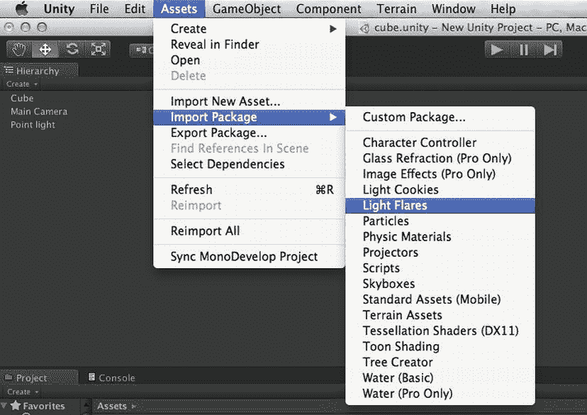

图 3-33。用于导入光晕的 `Assets` 菜单项

资源包导入窗口（图 3-34）显示每个光晕文件都有 `.flare` 扩展名，并包含一个光晕材质和一张纹理（注意，Unity 方便地支持 `.psd` 文件作为纹理）。

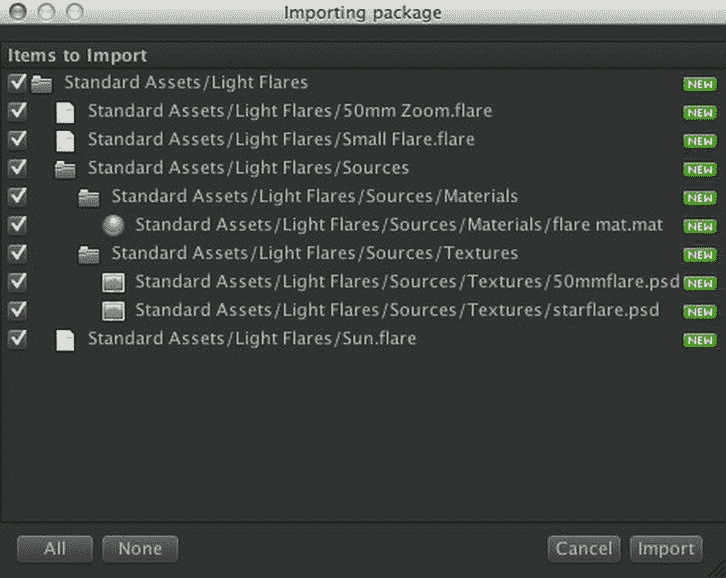

图 3-34。标准资源中的光晕

资源包导入后，光晕会出现在项目视图中，以类似镜头光晕的图标表示（图 3-35）。

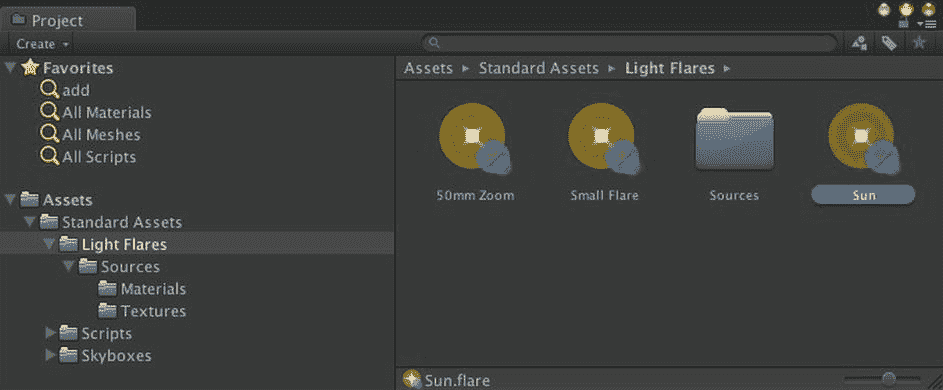

图 3-35。标准资源中光晕的项目视图

#### 应用光晕

我们使用 `50-mm Zoom` 光晕（它恰好是我最喜欢的光晕之一，因为它沿光晕方向延伸得比其他光晕更远）。将该光晕拖拽到点光源的 `Flare` 字段中（图 3-36）。

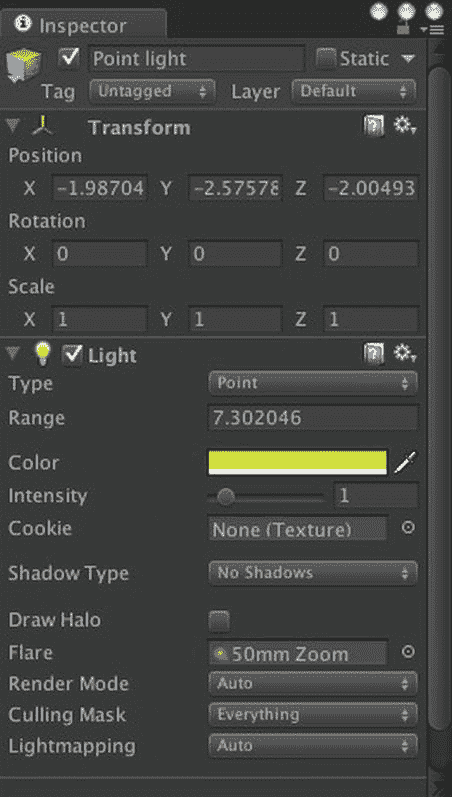

图 3-36。已分配光晕的点光源

现在，你可以在场景视图中看到从点光源相同位置发出的光晕，当你点击播放并围绕立方体旋转摄像机时，效果会更好（图 3-37）。这是一个非常酷的效果！

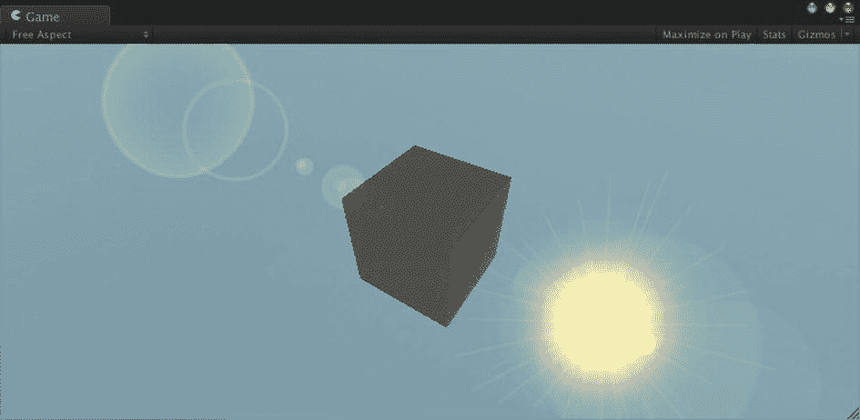

图 3-37。带有光晕的游戏视图

将光晕融入场景的一种更灵活的方法是通过创建一个带有 `LensFlare` 组件的 `GameObject`，并将光晕指定给该组件。这种方法允许不依赖任何光源来放置和对齐光晕，并提供额外的亮度和颜色调整功能。

#### 纹理

我们的场景开始看起来不错了，现在我们有了天空盒、带有光晕和光晕效果的光源，但立方体看起来仍然单调。它确实是唯一还没有纹理的东西，但这很容易解决！

#### 导入纹理

你 Mac 上的几乎任何图像文件（`.jpeg`、`.png`、`.tiff`、`.psd`）都可以通过调用 `Assets` 菜单中的 `Import Asset` 命令（图 3-38），并在弹出的选择器中选择该图像文件来导入为纹理。

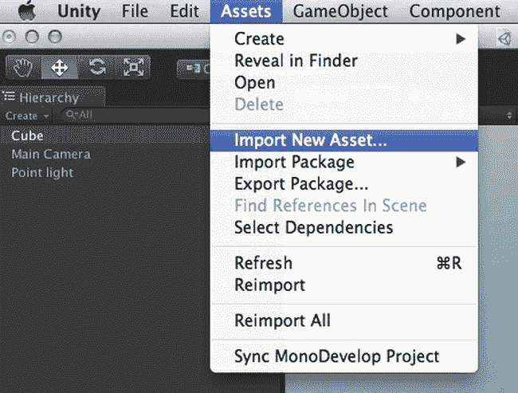

图 3-38。导入新资源

在本示例中，我从我的照片目录中选择了一张由 iPhoto 存储的猫咪图片。你可以通过从 `http://learnunity4.com/` 下载来随意使用此文件（它位于本章项目的 `Textures` 文件夹下）。但如果你 Mac 上有任何支持格式的图像文件，也完全可以。导入图像文件后，生成的纹理将出现在项目视图中（图 3-39）。

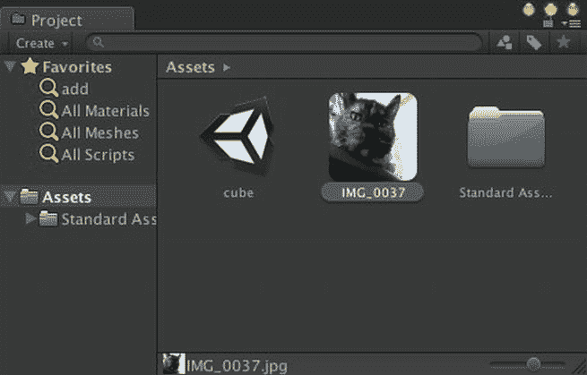

Figure 3-39. 新导入纹理的**项目视图**

选择纹理并在**检查器视图**（Figure 3-40）中检查其导入设置。默认的纹理类型 `Texture` 是预设类型，通常适用于应用在模型上的纹理。如果存在未应用的导入设置，`Apply` 按钮会处于启用状态，需要点击该按钮（否则 Unity 会在尝试使用纹理时提示你）。

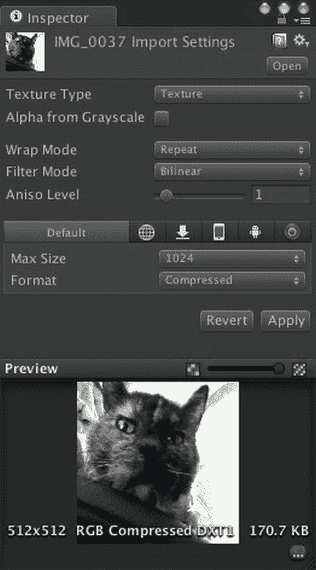

Figure 3-40. 已导入纹理的**检查器视图**

请注意底部的预览面板如何总结纹理的导入大小和格式。原始图像文件未做任何更改，因此导入文件实际上会创建一个适合我们目标平台的原始副本。你完全不必担心会搞乱原始资源。实际上，你随时可以在项目视图中右键单击它并选择 `Reimport` 来重新开始。

**注意**   我们一直泛称 *texture* 且未大写。实际上存在一个 `Texture` 类，它是所有纹理类型的父类，但通过导入图片文件创建的纹理资源，其实际类名是 `Texture2D`（`Texture` 的其他子类包括 `Texture3D`、`MovieTexture` 和 `RenderTexture`）。

要将纹理应用到立方体上，请在层级视图中将纹理拖到立方体上。这会自动创建一个使用该纹理的材质，并将该材质应用到立方体上，替换掉之前的材质（Figure 3-41）。

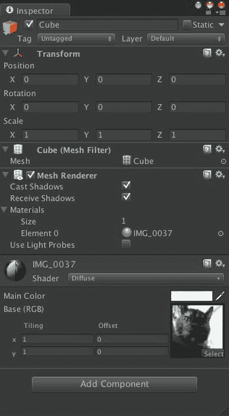

Figure 3-41. 应用到立方体的纹理

在项目视图中，你现在可以看到新创建的材质被放置在纹理旁的一个 Materials 文件夹中。现在，如果你再次点击“播放”，立方体看起来就很酷了！（Figure 3-42）。

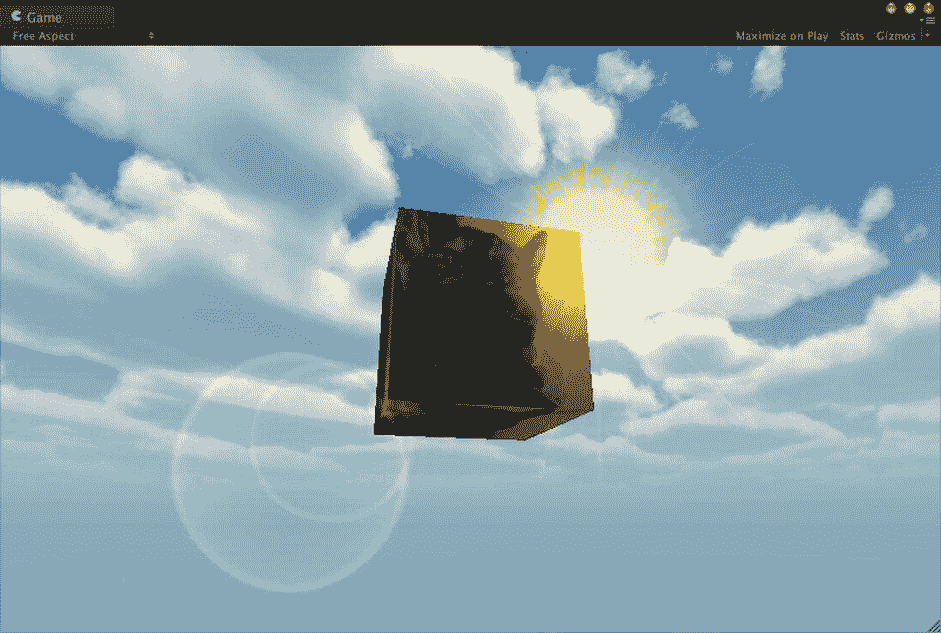

Figure 3-42. 带有纹理的立方体的**游戏视图**

### 逛逛资源商店

Unity 的标准资源中并没有内置纹理库（尽管各种包中使用了大量纹理）。不过，Unity 资源商店作为一个提供 Unity 就绪资源的市场，有若干免费的纹理包。方便的是，资源商店已集成到 Unity 编辑器中。在 **Window** 菜单下（Figure 3-43），选择 **Asset Store** 项。

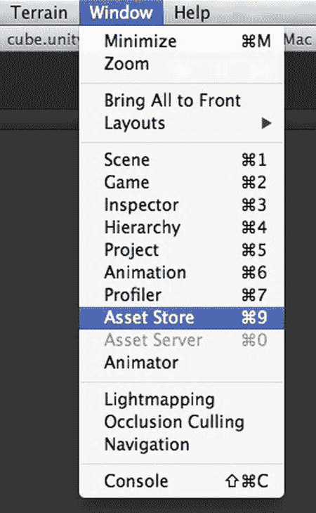

Figure 3-43. 从 **Window** 菜单中选择 **Asset Store**

这将打开资源商店窗口并显示其首页（Figure 3-44），页面列出了最新发布（包括付费和免费）的资源、分类以及精选项目。

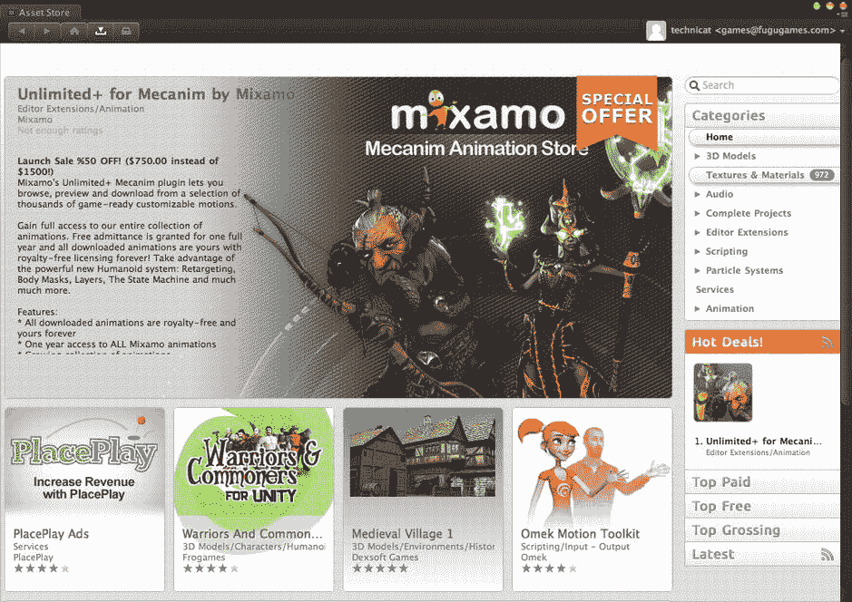

Figure 3-44. Unity 资源商店

我们来寻找一些免费的纹理。点击页面右上部分的 **Textures & Materials** 分类，然后选择左侧 **Sort By** 部分中的 **Price**（Figure 3-45）。

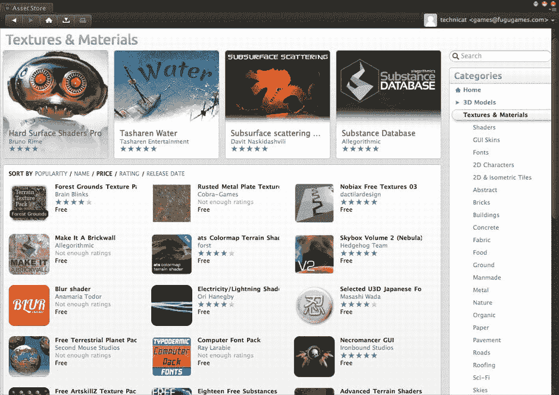

Figure 3-45. 资源商店上的免费纹理

这里有很多不错的候选资源，但如果向下滚动，你应该能找到我最喜欢的免费纹理库——**Free ArtskillZ Texture Pack**。点击它以查看完整的产品页面（Figure 3-46）。页面包含产品描述、截图、单个文件列表以及用户评价。

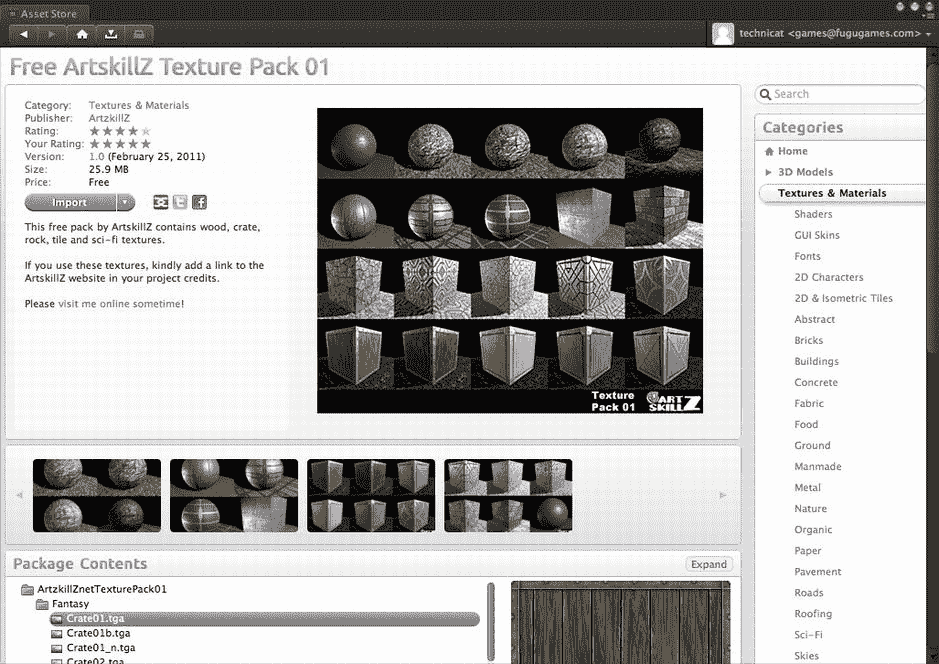

Figure 3-46. 资源商店上的 **Free ArtskillZ Texture Pack**

#### 导入纹理

点击 `Import` 按钮，你会看到与导入内置 Unity 资源时相同的导入窗口。继续操作，导入所有内容。

现在，你会在项目视图中找到所有这些纹理，它们被分类到三个文件夹中（Figure 3-47）。

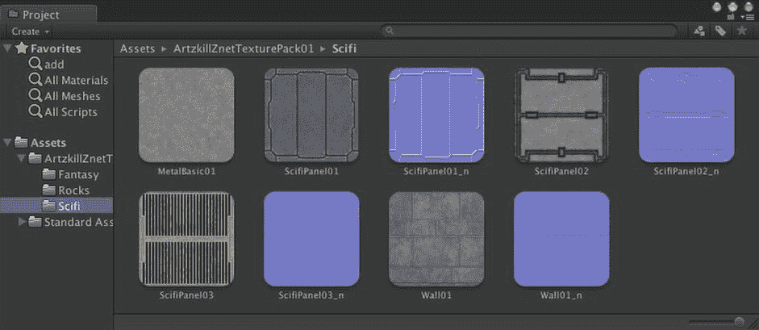

Figure 3-47. ArtskillZ 纹理的**项目视图**

带有蓝色图标的纹理是法线贴图，并在其纹理类型字段中标注为 Normal map。法线贴图可以模拟出非平坦表面的视觉效果（有时会使用术语 *bump map*，尽管在技术上并不完全相同）。

### 应用纹理

首先，我们尝试 `ScifiPanel01` 纹理。将其拖到立方体上，Unity 会自动创建一个以该纹理命名的新材质，并将此材质应用到立方体上。但我们想使用与该纹理配套的法线贴图，因此，在检查器视图中使用材质的着色器选择器，将着色器更改为 `Bumped Specular`。此着色器接受一个名为 Normalmap 的第二纹理，并有一个用于控制 Shininess 属性的滑动条（需要注意的是，该滑块向左移动时数值趋向 1，向右移动时趋向 0）。将法线贴图纹理 `ScifiPanel01_n` 拖到 Normalmap 字段中（Figure 3-48）。

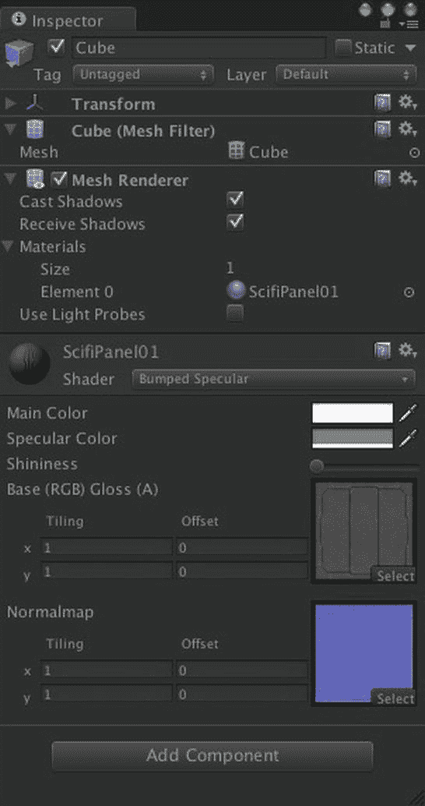

Figure 3-48. 应用到立方体的 Scifi 纹理

点击“播放”，你现在会看到带有纹理的立方体（Figure 3-49）。

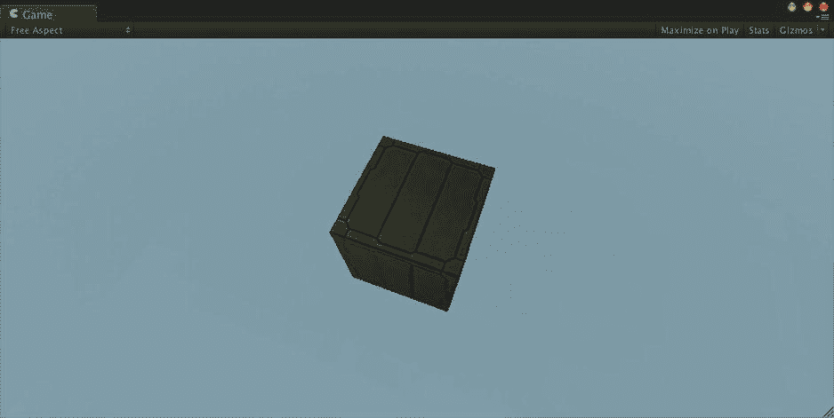

Figure 3-49. 应用了高光凹凸贴图纹理的立方体的**游戏视图**

你也可以使用项目视图中的搜索字段来搜索免费纹理。在后续章节中，当我们用到更多资源商店包时，将会使用该选项。

## 进一步探索

本章似乎涵盖了大量内容（绝非双关）来创建一个简单的静态场景，但在此过程中，我们探索了许多基本的 Unity 概念，特别是组件与游戏对象之间的关系。因此，你现在拥有了一个包含凹凸贴图和纹理的立方体场景，该立方体由一个带有光晕的点光源照亮，并被天空盒包围。该场景中的资源是从本地文件、Unity 标准资源和 Unity 资源商店导入的。由于主相机上附加了 `MouseOrbit` 脚本，场景也并非完全静止。脚本编写将在本书中扮演主导角色，从下一章开始，我们将超越静态场景。

在继续之前，休息一下，回顾一下 Unity 官方文档中关于目前已使用功能的部分，哪怕只是为了熟悉在哪里可以找到这些文档，以便将来参考。

#### Unity 手册

Unity 手册的 Unity 基础部分主要与上一章相关，描述了用户界面，但该部分确实有一个“创建场景”页面。更相关的是“构建场景”部分，它描述了游戏对象、组件和脚本之间的关系，如何使用检查器视图编辑组件属性，以及如何在场景视图中导航和移动游戏对象——这些内容在本章中都已涵盖。灯光和相机也做了讲解。本节列出但本书不会使用的一个功能是地形引擎（它在 Unity iOS 中可用，但速度较慢）。不过，地形是一个重要且令人印象深刻的 Unity 功能，值得一读。“资源导入与创建”部分描述了本章中使用的资源类型：网格、材质、纹理和脚本。导入资源的过程以及资源商店也在该部分做了说明。

