# 我们尚未达到拥有可玩性的阶段，但“创建游戏玩法”章节中有一个关于“变换”的页面，正如我们所见，即便是为了放置静态游戏对象，理解变换也是基础。

#### 参考手册

相较于 Unity 手册，参考手册的讲解更为深入，它详细描述了每个组件，解释了其属性并记录了组件的使用方法。参考手册还记录了资源类型，并对游戏对象进行了说明。

通常来说，你应该为你使用的每个组件和资源类型阅读参考手册。请记住，在检视面板中每个组件上都有一个帮助图标，点击后会跳转到对应的参考手册页面。与 Unity 手册一样，参考手册不仅可以通过 Unity 帮助菜单访问，还可以在 Unity 网站的“学习”标签页下找到（可直接通过 `http://docs.unity3d.com/` 访问）。参考手册的“设置管理器”部分包含一个关于渲染设置的页面，本章中的天空盒正是在此处分配的。“变换组件”部分自然只列出了一个组件，即变换组件，它附加于每个游戏对象之上。

“网格组件”部分则更有趣，它描述了任何带有网格的游戏对象（例如本章中创建的立方体）所必需的 MeshFilter 和 MeshRenderer 组件。“渲染组件”部分则更加丰富，其中介绍了摄像机组件及其相关的 GUILayer 组件和 FlareLayer。灯光组件也在此处进行了说明。尽管资源并非真正的组件，但参考手册有一个名为“资源组件”的部分，列出了各种资源类。在本章中，光晕、材质、网格和 Texture2D 被整合到了场景中（请记住，天空盒本质上是一种材质）。

最有趣的阅读内容是“内置着色器指南”部分，它详细（并配有图片）介绍了所有内置着色器，从简单快速的到非常华丽的。本章中的立方体最初使用默认的漫反射着色器，后来替换为高级的凹凸贴图镜面反射着色器。如本章所述，着色器实际上是一个程序，因此如果你找不到满足需求的内置着色器，可以按照“着色器参考”部分中的示例和说明自行编写。

#### 资源商店

本章开启了本书中从 Unity 资源商店使用免费资源的实践。我建议定期浏览资源商店，以查看最新发布的内容。除了免费的纹理、模型和脚本外，还有许多价格合理的资源包，可以为你节省大量时间和工作。资源商店也可以通过常规网页浏览器在 `http://assetstore.unity3d.com/` 查看（但无法购买或下载任何资源）。

#### 计算机图形学

计算机图形学是一个庞大而复杂的研究领域。本章涉及了 3D 模型、纹理、凹凸贴图、光晕、天空盒，而这仅仅是个开始。因此，非常值得进一步阅读关于基础（和高级）计算机图形学的资料，例如由 Tomas Akenine-Möller、Eric Haines 和 Naty Hoffman 编写的广受欢迎且内容全面的《实时渲染》一书。Mark Haigh-Hutchinson 的《实时摄像机》则是一本专门探讨虚拟摄像机及其控制方案的专著。

我不会涉及创建可导入 Unity 的资源的具体过程，但 Luke Ahearn 有两本书可能对你有所帮助：《3D 游戏纹理：使用 Photoshop 创建专业游戏美术》和《3D 游戏环境：创建专业的 3D 游戏世界》。从 Wes McDermott 的《使用 Unity 为 iPhone 创建 3D 游戏美术》这个书名，你就能看出它是本书的合适补充读物。

## 第 4 章：让它动起来：为立方体编写脚本

既然你已经知道如何通过放置游戏对象来构建静态 3D 场景，那么是时候通过为游戏对象添加运动来让场景变得动态且更有趣了。毕竟，一个 3D 图形场景固然不错，但一个带有动画的 3D 图形场景才能更胜一筹！

不过，使用动画数据并非移动游戏对象的唯一方式。让游戏对象具备物理属性，它就会在碰撞和作用力（包括重力）的作用下移动。脚本也可以通过改变游戏对象变换组件中的位置和/或旋转值来移动它。实际上，任何移动游戏对象的方法——无论是动画、物理还是脚本——最终都会改变变换组件，而该组件始终代表游戏对象的位置、旋转和缩放。

本章将重点介绍如何通过脚本移动游戏对象，演示如何旋转上一章创建的静态立方体，甚至介绍如何使用开源 iTween 库实现补间动画。在此过程中，我将介绍 Unity 脚本系统的基本概念和工具（编辑和调试）。

你将编写的脚本可在 `http://learnunity4.com/` 上本章对应的项目文件中找到，但我建议你从头开始创建它们。只有当你亲自输入代码时，你才最有可能理解代码是如何工作（以及为何不工作）的。

### 整理资源

在项目视图中，当资源按类型分区时，查看和浏览起来会更加方便。因此，在开始添加脚本之前，现在是个很好的时机来整理项目，并为脚本和纹理创建一些文件夹。

如果你上一章结束后未打开 Unity 编辑器，请启动它，并确保已加载上一章的项目并打开了立方体场景。然后点击项目视图左上角的“创建”按钮（图 4-1），弹出一个菜单，显示可以添加到项目中的新资源类型（或者，你也可以右键单击项目视图并选择“创建”子菜单）。在菜单中选择“文件夹”项，一个名为“新文件夹”的文件夹会出现在项目视图中。将此文件夹重命名为“Textures”，并将上一章导入的任何纹理（例如我的猫咪照片）拖入其中。虽然你目前还没有创建任何脚本，但也请一并创建一个“Scripts”文件夹。

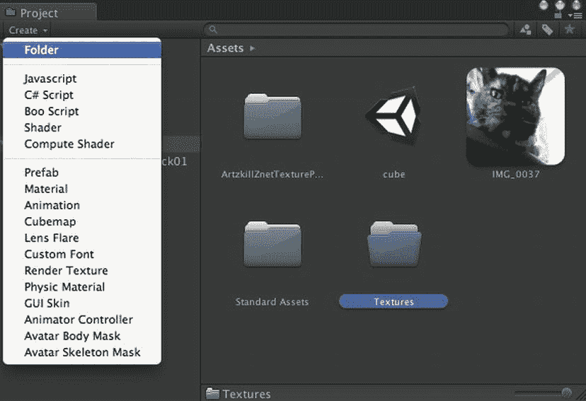

图 4-1. 在项目视图中创建 Textures 文件夹

### 创建脚本

选择新添加的“Scripts”文件夹，然后同样从项目视图的“创建”菜单中，选择“JavaScript”（图 4-2）。一个名为“New Behaviour”（美国读者，你们得习惯这个英式拼写）的脚本将出现在“Scripts”文件夹中。如果你不小心将新脚本文件创建在了“Scripts”文件夹之外，只需将脚本拖入该文件夹即可。

**注意** 尽管项目视图的“创建”菜单中显示的是“Javascript”（仅首字母大写），但我将按“JavaScript”来称呼它，这是官方的大小写形式，也用于 Unity 文档中（谁知道呢，Unity 的某个更新随时可能修正菜单的拼写）。此外，本书将使用“a JavaScript”来指代一个脚本，而不是更准确但说起来更拗口的“a JavaScript script”。

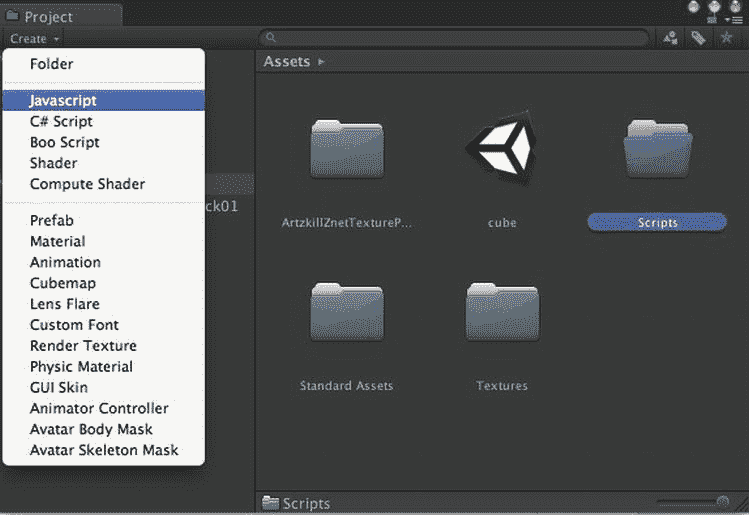

图 4-2. 创建 JavaScript 文件

由于这个新文件是一个 JavaScript，它带有`.js`扩展名。项目视图不显示文件扩展名，但从其图标可以辨别脚本的语言（图 4-3）。如果脚本被选中，其完整名称会显示在项目视图底部的行中。

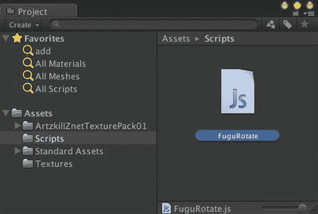


图 4-3. 新脚本的项目视图

**为脚本命名**

对于脚本来说，`New Behaviour` 并不是一个有意义的名称，因此首要任务是给它取一个新名字。一个显而易见的选择是 `Rotate`，因为该脚本的最终目的是旋转方块。但使用过于通用的名称可能会导致冲突（Unity 会报错）：即使两个同名脚本位于不同文件夹中，也会发生冲突。这是因为每个脚本都会定义一个新类（具体来说是 `MonoBehaviour` 的子类），而你不能拥有两个同名类。

一种解决方法是使用标准前缀为每个脚本命名（这很像 Objective-C 类以 `NS` 开头，回溯到 OS X 的 NextStep 起源）。这是第三方 Unity 用户界面包常用的技巧。如果每个人都把自己的按钮类命名为 `Button`，它们就无法共存！

**注意**   C# 脚本可以选择将类划分到命名空间以避免名称冲突。本书几乎全程使用 JavaScript，但在第 17 章中提供了 C# 脚本和命名空间的示例。

有时，如果脚本专属于某个游戏，我会使用游戏名称作为脚本名称前缀（在 HyperBowl 中，我有许多以 `Hyper` 开头的脚本）。不过，我通常将脚本名称前缀设为 `Fugu`，对应我的游戏品牌 Fugu Games。本书将沿用这一惯例，因此请将新脚本命名为 `FuguRotate`（图 4-3）。当然，通常你可以自由选择自己的脚本命名规范。

**脚本的结构**

如果在项目视图中选择 `FuguRotate` 脚本，检查器视图会显示其源代码（至少是能够容纳在检查器视图显示范围内的代码）（图 4-4）。

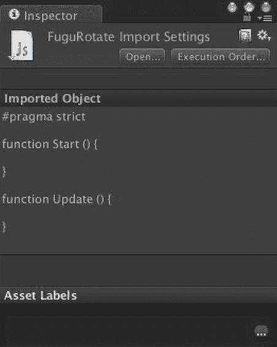

图 4-4. 新脚本的检查器视图

如检查器视图所示，Unity 创建新脚本时会包含三个项目（代码清单 4-1）。

代码清单 4-1.  新脚本的内容

```
#pragma strict

function Start () {
}

function Update () {
}
```

脚本的第一行 `#pragma strict` 指示脚本编译器：所有变量都必须有类型声明，或至少其类型能被编译器轻松推断。这并非 Unity 桌面构建的强制要求，但 Unity iOS 构建必须满足，因此最好养成这个习惯。

**注意**   本书中所有完整的脚本代码清单都以 `#pragma strict` 开头。任何不包含该行的代码都仅是脚本的摘录部分。

脚本中的两个函数是回调函数，由 Unity 游戏引擎在游戏中的特定时刻调用。`Start` 函数在该脚本首次被启用时调用。组件并非完全 `enabled`，除非其依附的游戏对象也处于活动状态。因此，如果游戏对象在场景中初始处于活动状态且附带了已启用的脚本，则该脚本的 `Start` 函数会在场景开始播放时被调用。否则，`Start` 函数要等到脚本被启用（通过设置脚本组件的 `enabled` 变量）且游戏对象被激活（通过调用游戏对象的 `SetActive` 函数）后才会被调用。

与 `Start` 函数（在脚本组件的生命周期中最多只调用一次）不同，`Update` 函数每帧都会调用一次（即在 Unity 渲染当前场景之前调用一次）。与 `Start` 函数类似，`Update` 仅在脚本（完全）启用时被调用，且 `Update` 的第一次调用发生在 `Start` 函数被唯一一次调用之后。因此，`Start` 函数非常适合执行 `Update` 函数所需的任何初始化工作。

**附加脚本**


与项目视图中的其他资源一样，脚本在被添加到场景中之前（具体来说是作为游戏对象的组件）不会产生任何效果。最终，我们希望 `FuguRotate` 脚本能让立方体旋转，因此将其从项目视图拖拽到层级视图中的立方体游戏对象上。检查器视图现在会显示该脚本已作为组件附加到立方体上（图 4-5）。

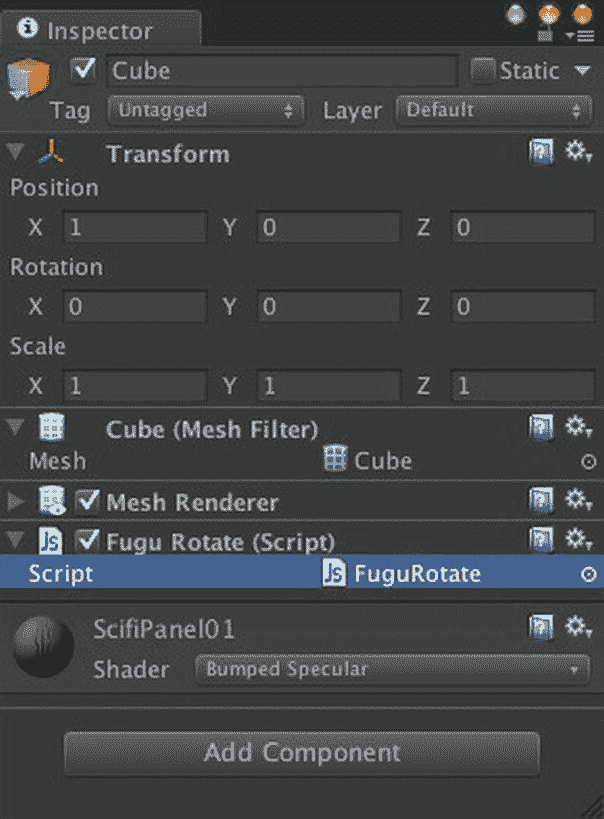

图 4-5。附加到立方体上的 FuguRotate 脚本

Unity 通常提供两种，有时甚至三种方法来执行同一操作。例如，你也可以通过在立方体的检查器视图中点击“添加组件”按钮，然后从弹出的菜单中选择 `FuguRotate` 脚本，来将该脚本附加到立方体上。或者，你也可以将 `FuguRotate` 脚本拖拽到“添加组件”按钮下方的区域（但如果按钮下方显示的空间不足，这操作起来会比较困难）。

### 编辑脚本

现在该填充脚本内容了。在项目视图中选中 `FuguRotate` 脚本，然后在检查器视图中点击“打开”按钮调出脚本编辑器。在项目视图中双击该脚本，或者从脚本的右键菜单中选择“打开”，也同样有效。Unity 默认的脚本编辑器是 MonoDevelop 的一个定制版本，这是一个专为 Mono 定制的代码编辑器和调试器，而 Mono 是支撑 Unity 脚本系统的开源框架（图 4-6）。

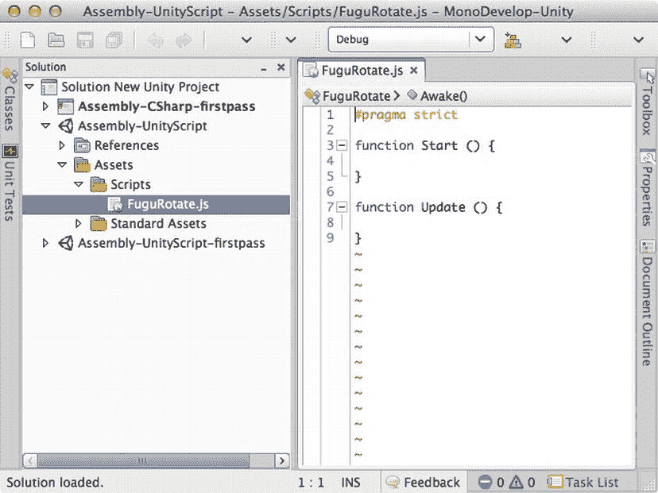

图 4-6。MonoDevelop 编辑器

如果你更喜欢使用其他脚本编辑器，可以通过调出 Unity 偏好设置窗口，选择“外部工具”选项卡，然后浏览并选择你偏好的应用程序来更改默认设置（图 4-7）。虽然 Unitron 已不再受官方支持，但仍包含在 Unity 安装包中，它是一个可选方案。不过脚本本质上是文本文件，因此任何文本编辑器都可以用作脚本编辑器。例如，作为一名老派程序员，我喜欢使用 Aquamacs，它是 Emacs 的 OS X 版本。

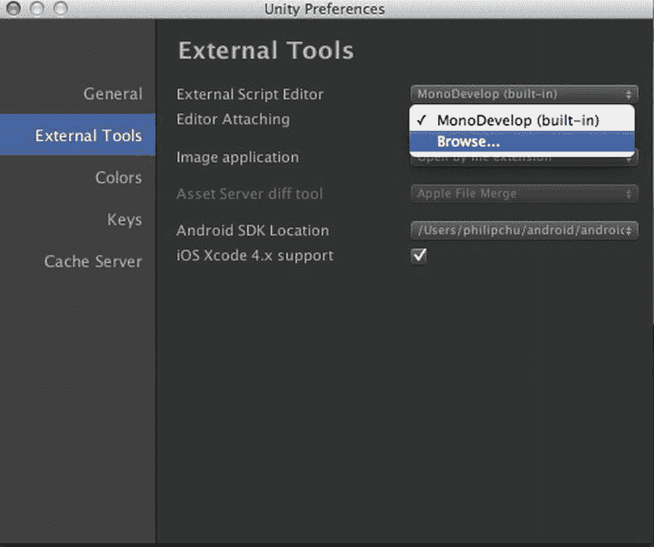

图 4-7。选择不同的脚本编辑器

现有的 `FuguRotate` 脚本不会执行任何可见操作，因为其回调函数都是空的，花括号之间没有代码。让我们从在 `Start` 和 `Update` 函数中添加一些追踪代码开始，以演示这些回调函数何时被调用（列表 4-2）。

列表 4-2. 包含 Debug.Log 调用的 FuguRotate.js

```
function Start () {
        Debug.Log("Start called on GameObject "+gameObject.name);
}
function Update () {
        Debug.Log("Update called at time "+Time.time);
}
```

Unity 的 MonoDevelop 一个很酷的功能是代码自动补全。例如，图 4-8 展示了当你输入 `Time.t` 时，MonoDevelop 会弹出一个属于 `Time` 类的函数和变量列表，并查找以 "t" 开头的项。

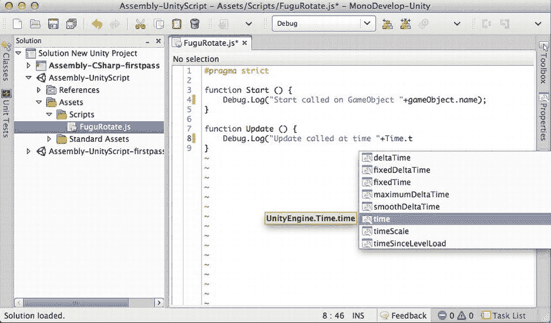

图 4-8。MonoDevelop 中的自动补全

### 理解脚本

现在 `FuguRotate` 脚本正在执行一些操作，让我们尝试理解这些操作的含义。`Start` 和 `Update` 都调用了 `Debug.Log` 函数来向控制台视图打印消息。`Log` 是定义在 `Debug` 类中的一个静态函数，这意味着你可以通过在函数名前指定其类名来调用它，而不是通过对象来调用（定义在类中的函数也称为*方法*）。

**注意**   静态函数和变量也称为*类*函数和变量，因为它们与类本身相关联，而不是与该类的实例相关联。

变量 `gameObject` 引用了此组件（脚本）所附加到的那个游戏对象（在本例中是立方体），并且每个游戏对象都有一个 `name` 变量，用于引用该游戏对象的名称（在本例中是“Cube”）。`+` 运算符可用于连接两个字符串（它不再仅仅用于加法），因此 `Start` 函数将打印 `"Start called on GameObject"` 后跟游戏对象的名称。

类似地，`Update` 函数调用了 `Debug.Log`，将 `"Update called at time"` 与静态变量 `Time.time` 的值连接起来。`Time.time` 保存了自游戏开始以来经过的时间（以秒为单位）（在 Unity 编辑器中运行时，指点击“播放”按钮后的时间）。`Time.time` 的类型是 `float`（一种浮点数，可以表示非整数值），但 `+` 运算符会在拼接前将数字转换为 `String`。

### 阅读脚本参考

除了自动补全，MonoDevelop 的另一个便捷功能是能够调出任何 Unity 类、函数或变量的脚本参考文档。在脚本中点击 `Debug.Log` 调用开头的 `Debug`，然后按下 Command+'，将会在浏览器窗口中打开 `Debug` 类的脚本参考文档。点击 `Log` 则会打开 `Debug.Log` 函数的具体文档。

**提示**   每当你遇到不熟悉的 Unity 类、函数或变量时，你应该做的第一件事就是阅读关于它的脚本参考文档。

脚本参考文档可以在 Unity 的帮助菜单中找到（图 4-9）。

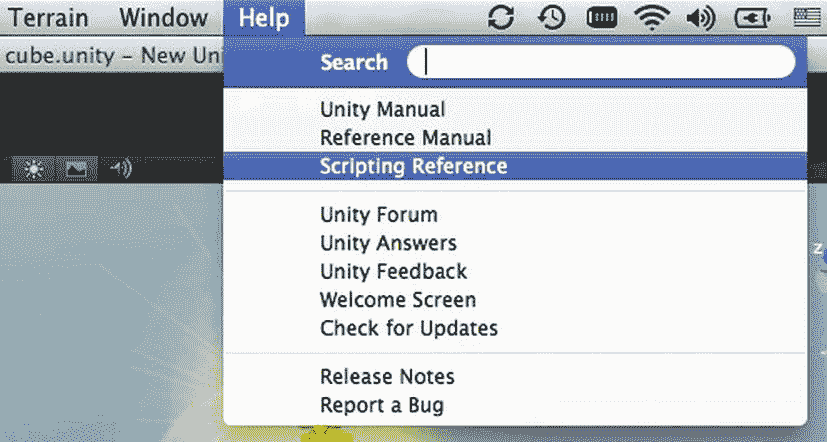

图 4-9。从帮助菜单调出脚本参考

脚本参考文档包含了所有 Unity 类及其函数和变量的文档（图 4-10）。我发现，在脚本参考文档中查找任意 Unity 类、函数或变量的最快方法是在搜索框中输入其名称。当 MonoDevelop 不确定你在查找哪个具体定义时，Command+' 实际上会执行那个搜索。例如，在 `FuguRotate` 脚本中对 `Start` 执行 Command+'，将会出现一个关于 `Start` 的搜索结果列表。

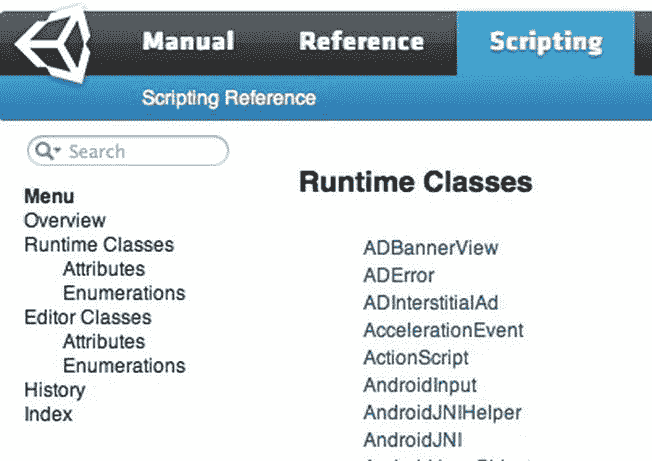

图 4-10。脚本参考

然而，点击脚本参考左侧的“运行时类”将会提供完整的类列表，并带有缩进，以便清晰地显示类层次结构（即，哪些类是其他类的子类）（图 4-11）。一些类，例如 `Debug` 和 `Time`，是静态类，这意味着它们只包含静态函数和变量（Unity 中没有不位于类中的函数），并且没有理由对它们进行子类化。

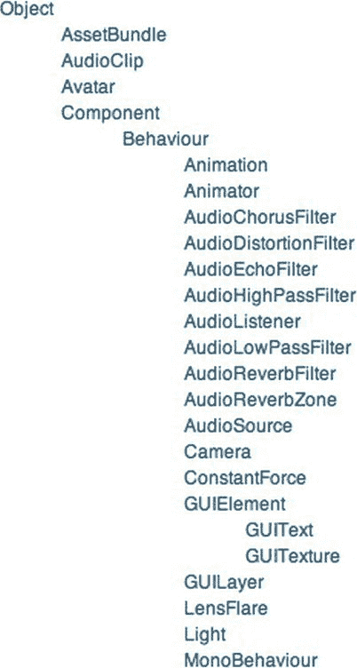

图 4-11。运行时类的类层次结构

然而，大多数类充当的是对象的类型。场景中的立方体是 `GameObject` 类的一个实例。而 `GameObject` 是 `Object` 的一个子类，这意味着它继承了 `Object` 所有文档中记载的变量和函数。从概念上讲，用面向对象的术语来说，立方体*是一个* `GameObject`，因此也*是一个* `Object`。将此与 `GameObject` 和 `Component` 之间的关系进行对比。立方体*是一个* `GameObject`，并且它*有一个* `MeshFilter`（而 `MeshFilter` *有一个* `Mesh`）。


从运行时类列表中可以看出，场景中几乎所有的东西都是 `Object` 的子类，包括 `GameObject` 和 `Component`。许多 `Component` 子类，包括 `Light` 和 `Camera`，同时也是 `Behaviour` 的子类，`Behaviour` 是一种可以被启用或禁用的组件（正如它们在检视面板中的复选框所示）。然而，有些组件并非如此，比如 `Transform`，它是 `Component` 的直接子类（中间没有其他类），并且不能被禁用（检视面板中没有复选框）。

每个脚本实际上都是 `MonoBehaviour` 的子类，而 `MonoBehaviour` 是 `Behaviour` 的子类（因此你可以启用和禁用脚本）。因此，`FuguRotate` 脚本定义了一个名为 `FuguRotate` 的 `MonoBehaviour` 子类。这个类声明在 JavaScript 中是隐式的，不过你也可以将其显式声明，如列表 4-3 所示。

列表 4-3.  一个带有显式类声明的 FuguRotate.js 版本

```
#pragma strict

class FuguRotate extends MonoBehaviour {

function Start () {
                var object:GameObject = null;
                Debug.Log("Start called on GameObject "+object.name);
        }

function Update () {
                Debug.Log("Update called at time "+Time.time);
        }

}
```

### 运行脚本

规范的编程在很大程度上类似于你在学校学到的科学方法。你应该对事物如何运作有一个大致的理论，假设你的代码应该做什么，然后准备通过运行实验来验证这个假设。换句话说，是时候运行你的代码，看看它是否按你预期的方式运行了。当你点击“播放”时，由 `Debug.Log` 发出的消息将显示在控制台视图中（图 4-12）。

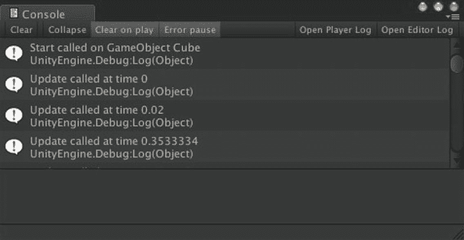

图 4-12. 追踪 Start 和 Update 回调函数

如果代码的行为不符合你的预期，那么就该修正你对它工作原理的假设了。这或许算是一点小小的安慰，但调试代码本身就是一次学习经历！

### 调试脚本

当然，你的代码不可能会在输入后就是完美的。相反，它通常需要经过几轮调试。错误基本上有两种类型：一种是甚至在尝试运行游戏之前就会出现的编译错误，另一种是在游戏运行过程中出现的运行时错误。

#### 编译错误

每次保存脚本时，它都会自动被编译（从源代码转换为实际运行的代码格式）。脚本中妨碍成功编译的错误会以红色显示在 Unity 编辑器的底部以及控制台视图中。

双击编辑器底部的错误消息将调出控制台视图中对应的消息，而双击控制台视图中的消息将打开脚本编辑器，并将光标定位在有问题的代码行上。即使没有这种便利性，错误消息也会列出出错代码的文件名和行号，因此可以手动找到它。

例如，如果你在 `Update` 函数中将 `Time.time` 误输入为 `Time.tim`，那么当你尝试保存脚本时，就会立即出现一条错误消息（图 4-13）。方便的是，Unity 通常能很好地建议你可能想要输入的内容（尽管计算机通常不擅长“执行我的意图，而非我所说的”）。

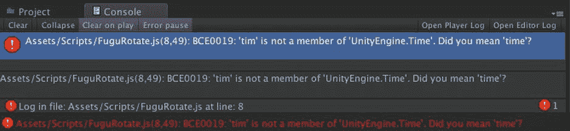

图 4-13. 脚本编译错误

#### 运行时错误

与编译错误类似，运行时错误也会显示在控制台视图中。为了演示，请将 `Start` 函数中对 `gameObject` 的引用替换为对名为 `object` 的局部变量的引用（列表 4-4）。局部变量是在函数声明内部声明的，因此只能在函数的作用域内访问。在此例中，`object` 被初始化为 `null`，这意味着它没有引用任何实际的 GameObject，并且从未被赋予任何 GameObject。当你点击“播放”时，当脚本尝试引用该 GameObject 的名称时，就会产生一个错误（图 4-14）。

列表 4-4.  包含空引用错误的 FuguRotate.js 中的 Start 函数

```
function Start () {
        var object:GameObject = null;
        Debug.Log("Start called on GameObject "+object.name);
} 
```

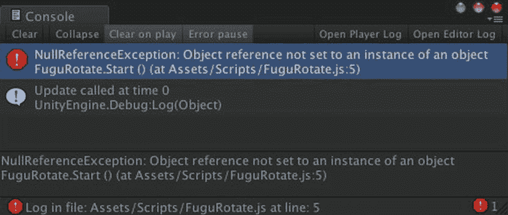

图 4-14. 脚本运行时错误

#### 使用 MonoDevelop 进行调试

我仍然主要依靠调用 `Debug.Log`（再次使用老派方法）并检查控制台视图中的错误消息来进行调试。但现代程序员更习惯使用更复杂的调试工具。事实证明，MonoDevelop 也提供了一个功能完备的调试器，并且已针对 Unity 进行了定制。要启用 MonoDevelop 调试，请从 Assets 菜单中选择 Sync MonoDevelop Project 命令（图 4-15）。

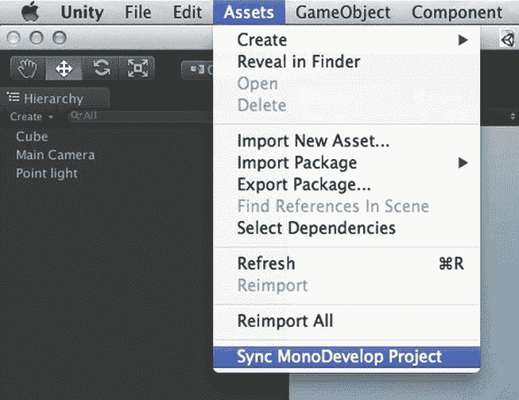

图 4-15. 同步 MonoDevelop 项目以开始调试

Sync MonoDevelop Project 命令会更新与此 Unity 项目对应的 MonoDevelop 项目文件，然后打开 MonoDevelop 项目解决方案文件。如果 MonoDevelop 没有自动打开该解决方案文件，你可以从 MonoDevelop 的“文件”菜单中打开它，或者在 Finder 中双击该解决方案文件（图 4-16 中高亮显示的文件）。

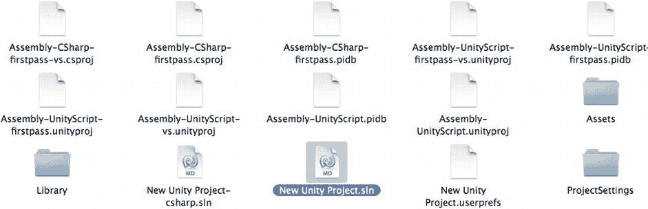

图 4-16. MonoDevelop 项目文件

加载 MonoDevelop 解决方案后，通过从 MonoDevelop 的“运行”菜单中选择“附加到进程”来启用调试（图 4-17）。

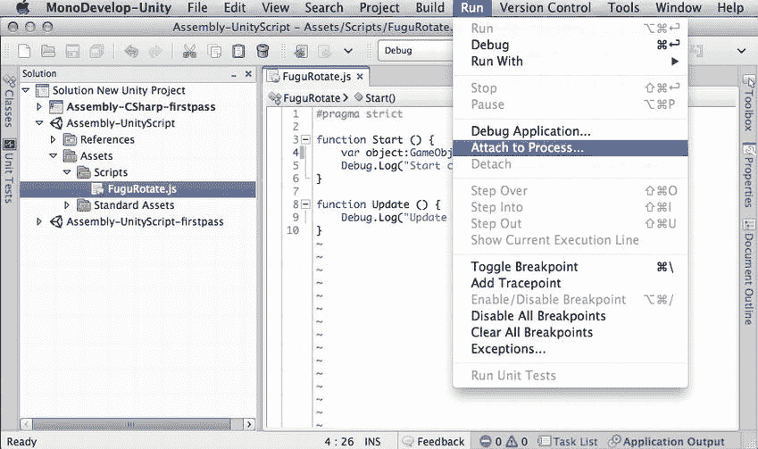

图 4-17. MonoDevelop 的“附加到进程”命令

然后在弹出的进程列表中选择 Unity Editor（图 4-18）。

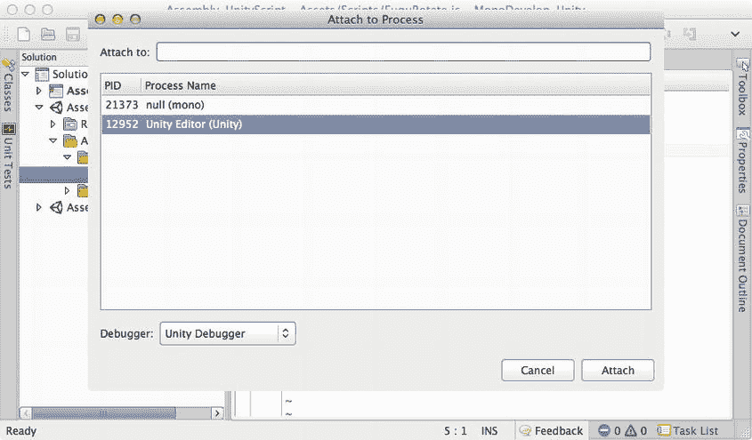

图 4-18. 将 MonoDevelop 附加到 Unity 编辑器

再次点击“播放”，这次 MonoDevelop 不仅会显示发生错误的代码行，还会显示具体的错误类型（`NullReferenceException`）以及相关的信息，比如堆栈跟踪，这对于确定导致错误的函数调用链非常有用（图 4-19）。

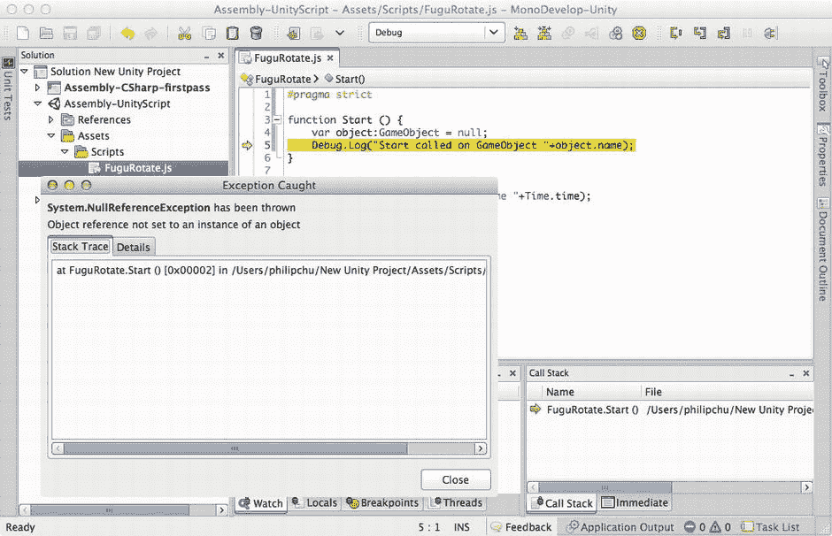

图 4-19. 附加了 Unity 编辑器时的 MonoDevelop 错误详情

在调试模式下，Unity 编辑器无法响应，因此当一次调试运行结束时，请从 MonoDevelop 的“运行”菜单中选择“分离”以分离 Unity 编辑器进程（图 4-20）。“分离”命令也可以作为 MonoDevelop 工具栏上的一个按钮使用。

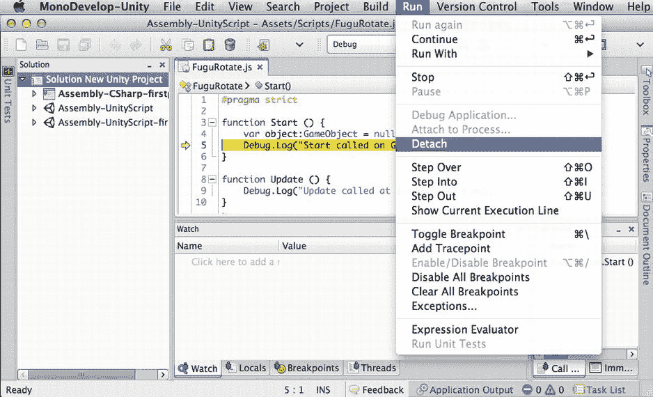

图 4-20. 从 MonoDevelop 分离 Unity 编辑器进程

让我们通过将变量 `object` 的初始值从 `null` 更改为脚本的 GameObject 来修复这个空引用问题（列表 4-5）。


