# 清单 4-5 包含空引用修复的 `FuguRotate.js` 中的 Start 函数

```
function Start () {
        var object:GameObject = this.gameObject;
        Debug.Log("Start called on GameObject "+object.name);
}
```

对 `this.gameObject` 的引用等价于只写 `gameObject`。变量 `this` 始终指向当前对象，也就是这个脚本组件（在某些其他编程语言中，`self` 的用法与之相同）。有时候我喜欢像 `gameObject` 这样的变量前显式加上 `this.` 前缀，以表明我引用的是一个实例变量，也就是在类中定义的、既不属于函数局部变量也不属于静态变量的变量，因此类的每个实例都有自己的副本。

现在脚本在 `Start` 函数中应该不会报错了（你可以在 Unity 编辑器中点击 Play 来确认）。但你仍然可以通过添加断点，让执行在 MonoDevelop 中的任意一行停止。在 `Update` 函数的某一行左侧点击，该行旁边就会出现一个断点指示符（图 4-21）。

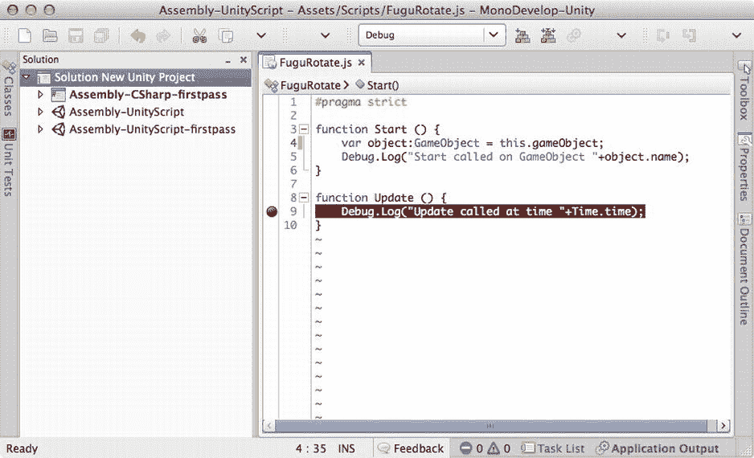

图 4-21 在 MonoDevelop 中添加断点

现在，当你调用“附加到进程”，连接到 Unity 编辑器，并在 Unity 编辑器中点击 Play 后，执行会在你的 `Update` 函数处停止，就像那里出现了错误一样（图 4-22）。当 MonoDevelop 在调试模式下暂停执行时，你可以检查堆栈跟踪，并通过其他方式检查运行时环境。例如，图 4-22 展示了在监视面板中输入 `gameObject` 然后在 `FuguRotate Update` 回调的断点处暂停的结果。`gameObject` 的当前值是 Cube GameObject，现在可以检查其成员变量了。

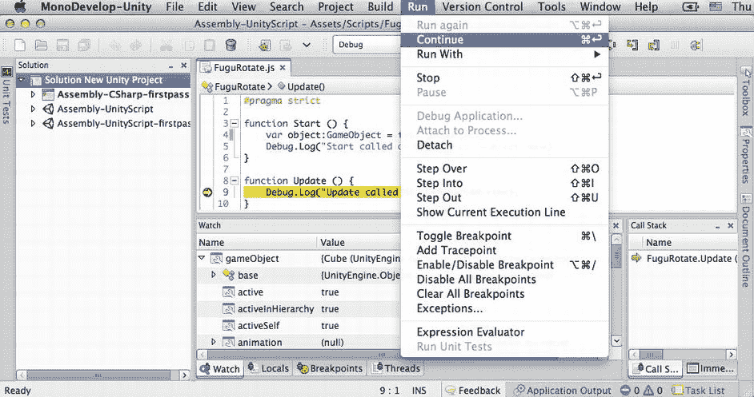

图 4-22 执行在断点处暂停

一旦你检查完断点处的运行时状态，在“运行”菜单中有一个“继续”选项，可以执行到下一个断点或错误。“运行”菜单中还有“逐过程”（继续执行到本函数中的下一行代码）、“逐语句”（继续执行到本行代码所调用的任何函数的第一行代码）或“跳出”（继续执行直到退出此函数）命令，这样你就可以逐行执行脚本了。所有这些命令在“运行”菜单中都显示了键盘快捷键，并且也作为工具栏上的按钮可用。

## 让它旋转

既然你已经熟悉了脚本以及如何附加、编辑和调试它们，现在我们可以让这个脚本实现最终目标——旋转立方体。

#### 旋转变换组件

在运行时移动一个 GameObject 需要更改其变换组件。具体到旋转 GameObject，则需要更改其变换组件中的旋转值。用清单 4-6 中的代码替换 `FuguRotate` 脚本的内容即可实现。

清单 4-6 在 `Update` 中包含旋转代码的 `FuguRotate.js` 脚本

```
#pragma strict
var speed:float = 10.0; // 控制旋转速度
function Start () {
        var object:GameObject = this.gameObject;
        Debug.Log("Start called on GameObject "+object.name);
}

// 围绕物体的 Y 轴旋转
function Update () {
        //Debug.Log("Update called at time "+Time.time);
        transform.Rotate(Vector3.up*speed*Time.deltaTime);
}
```

让我们来逐行分析新代码。首先，任何以 `//` 开头的行都是注释，不会作为代码执行。这是一种在不从文件中删除代码行的情况下将其停用的便捷方式。注释也可以放在 `/*` 和 `*/` 之间，这对多行注释很有用。

**注意** 有些人认为代码应该写得足够好，能自解释，但一个基本的经验法则是：如果代码的意图不明显，就添加注释。我浪费过很多时间试图回忆当初为何那样写代码。

`speed` 变量控制物体旋转的速度，由于它被声明为一个公共实例变量，因此在检视面板中可作为可调属性使用。

你也可以只输入 `var speed=10.0` 而不是 `var speed:float=10.0`，因为编译器可以推断出 `speed` 的类型必须是 `float`，因为它由一个浮点数初始化（这被称为*类型推断*）。但最好尽可能清晰，这不仅是为了 Unity 编译器，也是为了任何阅读代码的人，包括你自己！

`speed` 变量在 `Update` 函数中使用，该函数调用了 `Transform` 类中定义的 `Rotate` 函数。`Rotate` 函数以一个 `Vector3` 作为参数，并将其 `x`、`y`、`z` 值解释为欧拉角（围绕 GameObject 的 X、Y、Z 轴旋转的度数）。向量表示方向和大小，但在游戏引擎中，常用向量数据结构来表示欧拉角。

**注意** 电影《神偷奶爸》对向量的定义很不错：“我叫向量。这是一个数学术语，用一个带有方向和大小（magnitude）的箭头表示。向量！那就是我，因为我犯下的罪行既带有方向，又带有大小。噢耶！”

`Vector3.up` 是一个便捷定义的 `Vector3`，其值为 `(0,1,0)`，因此 `Update` 函数是围绕 Y 轴旋转 `speed * Time.deltaTime` 度。`Time.deltaTime` 是自上一帧以来经过的时间（以秒为单位），因此实际上，你正在以每秒 `speed` 度的速度旋转。在 `Update` 回调中，你几乎总是希望将任何连续变化乘以 `Time.deltaTime`，这样你的游戏行为就不会因帧率差异而波动。如果省略了乘以 `Time.deltaTime` 这一步，`FuguRotate` 脚本在运行速度慢两倍的机器上，物体旋转的速度也会慢两倍。

如预期的那样，`speed` 变量会出现在检视面板中，并且你可以编辑它（图 4-23）。

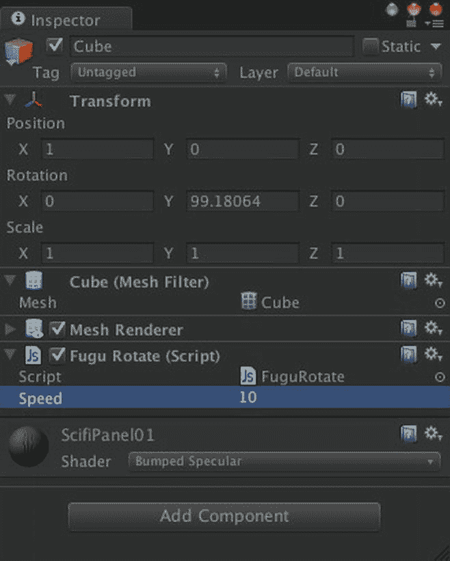

图 4-23 带有可调节速度的 `FuguRotate` 脚本的检视面板

如果你点击 Play，现在 Cube 会以适中的速度旋转，并且变换组件中 Y 旋转值的连续变化会显示在检视面板中。你可以在检视面板中编辑 `FuguRotate` 脚本的 Speed 值来降低或提高旋转速度。

#### 其他旋转方式

`Transform.Rotate` 是一个很好的例子，说明了你应该为你遇到的每个函数阅读脚本参考文档。原来 `Transform.Rotate` 是一个*重载*函数，意味着它有带有不同参数的多个变体。

**注意** 在描述函数声明时使用术语*参数*，在运行时传递相同值时使用*实参*，但这是一个微妙的区别。通常，参数和实参可以互换使用而不会引起混淆。

`Transform.Rotate` 的文档列出了它可以接受的几种参数组合。除了接受一个 `Vector3` 来指定旋转轴和一个角度（以度为单位）之外，`Transform.Rotate` 还可以分别接受 X、Y 和 Z 轴的旋转量。清单 4-7 展示了我们 `Update` 函数的另一种写法，它只传入了 X、Y 和 Z 轴的旋转量。

清单 4-7 接受 X、Y 和 Z 角度旋转的 `Transform.Rotate` 版本

```
function Update () {
        transform.Rotate(0,speed*Time.deltaTime,0);
}
```

或者，X、Y 和 Z 轴的旋转量可以打包成一个 `Vector3`，如清单 4-8 所示。


清单 4-8.  `Transform.Rotate` 中以 `Vector3` 形式指定旋转角度的版本

```
function Update () {
        transform.Rotate(Vector3(0,speed*Time.deltaTime,0));
}
```

尽管向量有精确的数学定义，但 Unity 遵循 3D 应用程序接口中的常见做法，即复用其向量数据结构来表示任何包含 x、y、z 值的内容。例如，如果你阅读脚本参考页面中关于 `Transform` 的内容（建议阅读），你会看到它的 `position`、`rotation` 和 `scale` 都是 `Vector3` 值。

#### 在世界空间中旋转

每个 `Transform.Rotate` 变体也都有一个可选参数，其默认值为 `Space.Self`。这指定了旋转是围绕变换（也就是游戏对象）的局部轴进行的，这些局部轴对应着在场景视图中选定游戏对象时看到的轴手柄。如果指定 `Space.World`，如清单 4-9 所示，则旋转将围绕世界轴（以 0,0,0 为中心的 x、y、z 轴）进行。

清单 4-9. 围绕世界轴旋转

```
function Update () {
        transform.Rotate(Vector3.up,speed*Time.deltaTime,Space.World);
}
```

#### 补间旋转

随时间稳定地改变游戏对象的变换很简单，但对于更复杂的运动，例如在特定时间段内将游戏对象从一个位置平滑地移动到另一个位置，其编码可能会更复杂、工作量更大。这正是 Flash 程序员使用 ActionScript `Tween` 类来处理的情况。虽然 Unity 没有内置的 `Tween` 类，但有 Flash 背景的 Unity 用户会高兴地了解到，有多个第三方解决方案可用。

我在 HyperBowl 游戏中使用的补间包叫做 `iTween`。该游戏中有大约 200 个 `iTween` 动画。一个使用示例：在投出一次全中后，3D 的 “STRIKE” 文字通过 `iTween` 脚本控制，使得字母逐个滑入屏幕，轻微上下浮动，然后在旋转中飞离屏幕。

方便的是，`iTween` 可以在资源商店中找到。在第 3 章中，我们在资源商店窗口中搜索过资源包，但这次，我们使用项目视图中的搜索功能。在搜索框中输入 `"itween"`，然后点击面包屑导航中的“资源商店”链接。`iTween` 会出现在免费资源结果中（图 4-24）。

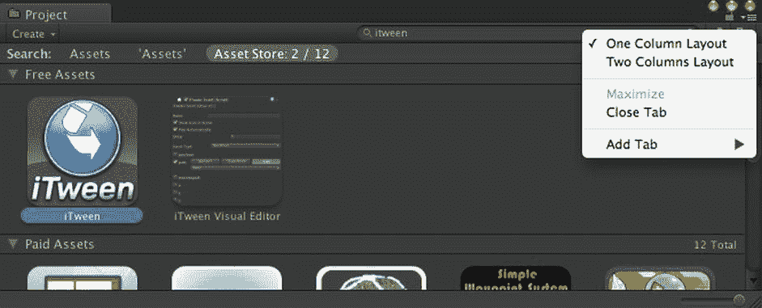

图 4-24. 在资源商店中搜索 iTween

**提示** 图 4-24 显示了项目视图中的视图菜单，允许在“单列布局”和“双列布局”之间切换。“双列布局”是 Unity 4 的新功能，但“单列布局”仍然很好用，特别是在项目视图中执行搜索而不是使用左侧面板进行导航时。

在项目视图中选择 `iTween`，该资源包的描述将显示在检视视图中（图 4-25），同时还提供导入该资源包或在资源商店窗口中预览完整描述的选项。继续操作，点击“导入资源包”按钮。

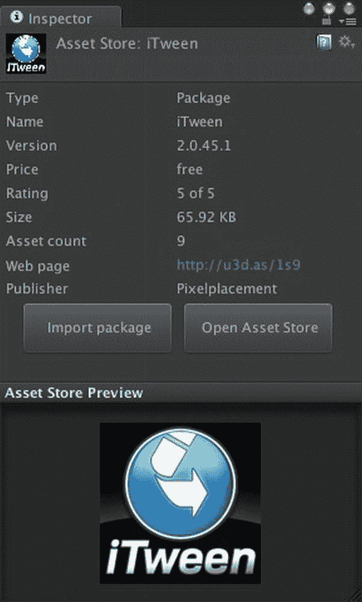

图 4-25. 资源商店中 iTween 的检视视图

安装完成后，项目视图中显示的 `iTween` 包含示例文件和文档文件，但整个 `iTween` 代码库是一个位于 `iTween`  `Plugins` 文件夹中的单个脚本（图 4-26）。

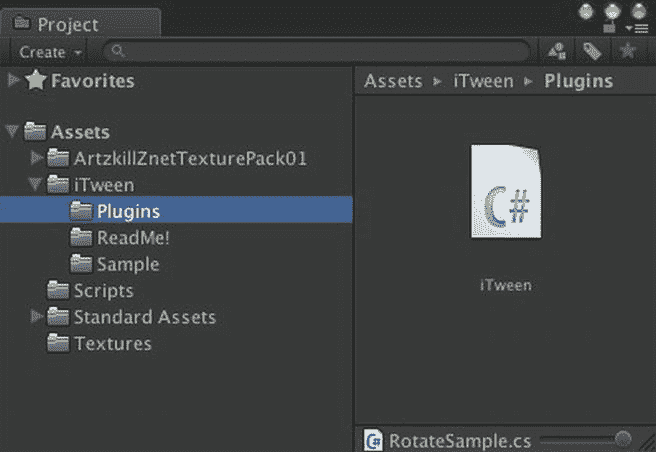

图 4-26. iTween 的项目视图

如图 4-26 所示，`iTween` 是一个 C# 脚本，其文件扩展名为 `.cs`。JavaScript 可以调用 C# 脚本中的函数和引用其中的变量，但前提是这些 C# 脚本位于几个指定的特殊文件夹中，这些文件夹会被优先加载。其中之一是 `Assets`  `Plugins` 文件夹，因此你可以直接将 `iTween`  `Plugins` 文件夹向上拖一级，放到 `Assets` 目录下。

为了体验一下 `iTween`，将清单 4-10 中的第三行代码添加到 `FuguRotate` 脚本的 `Start` 函数中。这一行代码启动了一个旋转补间，按照从左到右的参数顺序，在 2 秒内围绕局部 y 轴旋转 1 个 360 度的倍数，在达到目标旋转角度时缓动进入，当旋转反向反弹回来时缓动退出。

另外，使用 `/*` 和 `*/` 注释掉 `Update` 函数，这样就不会有两段旋转代码相互争夺控制权。

清单 4-10.  在 Start 函数中调用 iTween 的 FuguRotate.js

```
#pragma strict
var speed:float = 10.0; // 控制旋转速度

function Start () {
        var object:GameObject = this.gameObject;
        Debug.Log("Start called on GameObject "+object.name);
        iTween.RotateBy(gameObject, iTween.Hash("y", 1, "time", 2, "easeType", "easeInOutBack", "loopType", "pingPong"));
}

// 围绕对象的 y 轴旋转
/*
function Update () {
        //Debug.Log("Update called at time "+Time.time);
        transform.Rotate(Vector3.up*speed*Time.deltaTime);
}
*/
```

#### 立方体的子对象

一个场景中只有一个立方体并不有趣，所以让我们通过添加更多立方体来让它稍微有趣一些。你可以像创建第一个立方体那样重复创建新立方体。或者，你也可以通过复制现有立方体来节省时间（选中该立方体，然后在“编辑”菜单上调用“复制”命令，或使用 `Command+D` 键盘快捷键）。但让我们借此机会了解一下预制件。

#### 制作预制件

**预制件**是一种特殊类型的资源，用于克隆游戏对象。随后可以使用该预制件创建该游戏对象的相同副本。从这个意义上说，Unity 的预制件就像预制房屋，但更好。如果你对预制件的一个实例进行更改，可以使该更改自动传播到该预制件的所有其他实例。

首先，为了保持资源组织的整洁，在项目视图中创建一个名为 `Prefabs` 的新文件夹。然后，在选中 `Prefabs` 文件夹的情况下，点击项目视图“创建”菜单中的“预制件”，在该文件夹中创建一个空的预制件。然后，你可以通过将层级视图中的立方体拖到这个空预制件上来填充它。

或者，你也可以不用先创建空预制件，而是直接将立方体拖入 `Prefabs` 文件夹，系统会自动创建一个预制件，并以原始游戏对象的名字命名（图 4-27）。

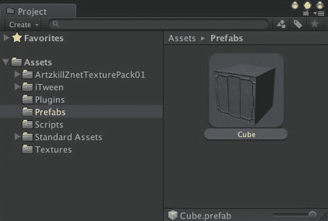

图 4-27. 立方体预制件的项目视图

现在，每当你想要创建一个与原始立方体游戏对象外观完全相同的新立方体时，都可以将该预制件拖入层级视图。但是，与其在场景中放置多个独立的立方体，不如让我们添加一些立方体作为现有立方体的子对象。将预制件直接拖到层级视图中的立方体上两次，现在你会在立方体下方看到两个新的立方体。在检视视图（图 4-28）中，你可以看到新立方体与原始立方体完全相同，具有相同的组件和组件属性。让我们将新的立方体命名为 `child1` 和 `child2`（顺便说一下，现在是尝试检视视图“锁定”功能的好时机，这样你可以同时检查两个游戏对象）。


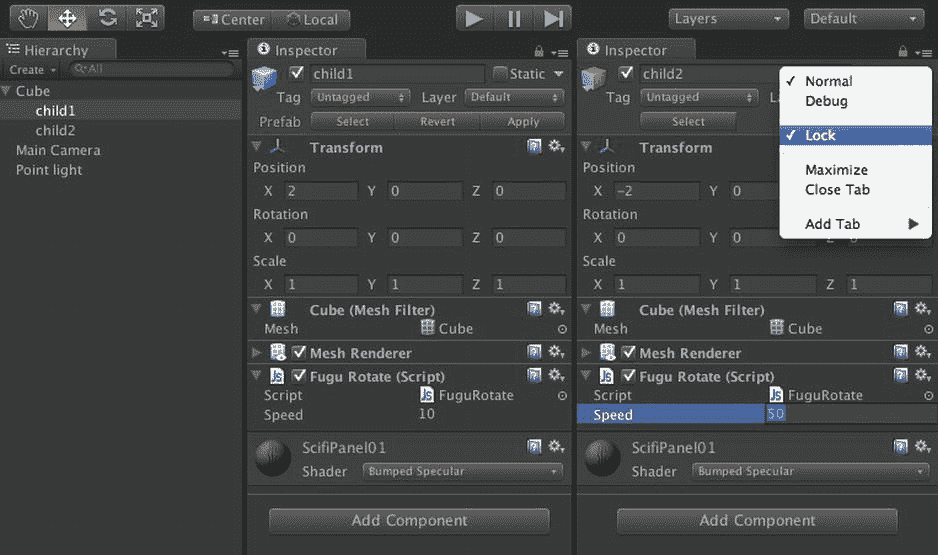

图 4-28. 编辑子立方体

作为 Cube 的子对象，在 Inspector 视图中显示的 `child1` 和 `child2` 的位置是相对于其父对象 Cube 的。这意味着，如果某个子立方体的位置为 `(0,0,0)`，则它与其父对象的位置完全相同。因此，让我们将 `child1` 和 `child2` 的位置分别设置为 `(2,0,0)` 和 `(-2,0,0)`。现在，这两个子立方体像卫星立方体一样与父对象 Cube 保持间距（图 4-29）。

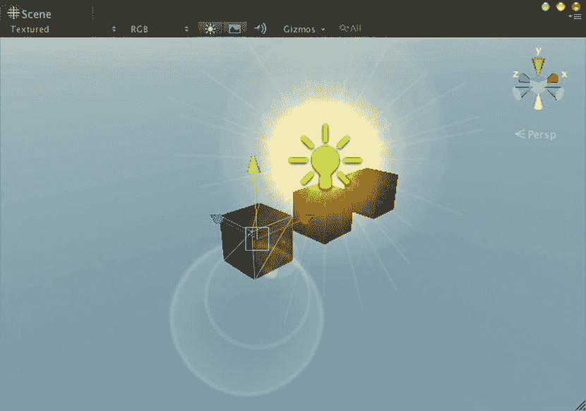

图 4-29. Cube 及其子立方体的场景视图

在点击 Play 之前，将 `FuguRotate` 脚本修改为简单的 `transform.Rotate` 调用（代码清单 4-11）。现在当你点击 Play 时，主 Cube 会像以前一样旋转，子立方体则像车轮的辐条一样跟随旋转。子立方体也会绕自己的轴旋转，因为它们各自运行着自己的 `FuguRotate` 脚本副本（如果你在 `Transform.Rotate` 调用中使用了 `Space.World`，所有三个立方体都将围绕同一个世界原点旋转）。

代码清单 4-11.  FuguRotate.js 恢复为在 Update 中进行旋转

```
#pragma strict
var speed:float = 10.0; // controls how fast we rotate

function Start () {
        var object:GameObject = this.gameObject;
        Debug.Log("Start called on GameObject "+object.name);
        //iTween.RotateBy(gameObject, iTween.Hash("y", 1, "time", 2, "easeType", "easeInOutBack", "loopType", "pingPong"));
}

// rotate around the object's y axis
function Update () {
        //Debug.Log("Update called at time "+Time.time);
        transform.Rotate(Vector3.up*speed*Time.deltaTime);
}
```

将 `child2` 的 `FuguRotate` 脚本中的 Speed 属性从 10 改为 50，点击 Play，你将看到该立方体比其他立方体旋转得更快。你也可以对 `child1` 进行同样的修改，但想象一下，如果你要修改 50 个立方体，那将非常繁琐！这正是预制件的强大之处。选中 `child2`，然后在 GameObject 菜单中调用“将更改应用到预制件”命令（图 4-30）。

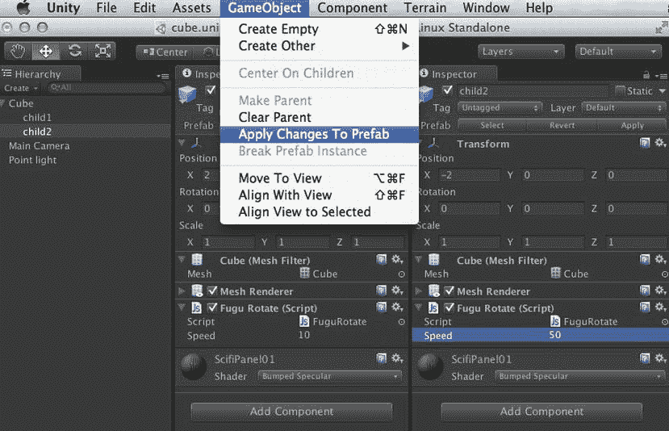

图 4-30. 将更改应用到预制件

现在，`child1` 再次与 `child2` 完全相同（除了名称和位置——Unity 合理地假设你不希望预制件的每个实例在这些方面都相同）。当你点击 Play 时，子立方体现在都以更快的相同速度旋转。

#### 断开预制件

但主 Cube 由于旋转速度的更新也旋转得更快了。如果这不是你想要的结果，你可以将 Cube 的 Speed 改回 10，然后为了确保子立方体的更改不会传播到主 Cube，你可以选中主 Cube 并在 GameObject 菜单中选择“断开预制件实例”命令（图 4-31）。

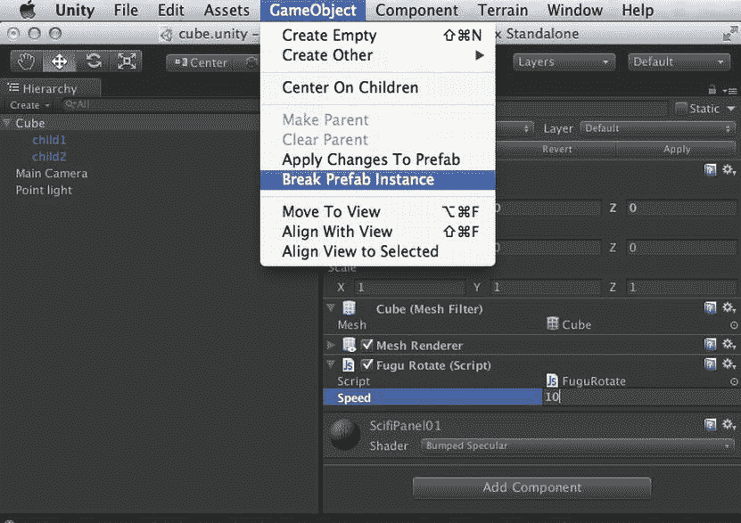

图 4-31. 断开预制件实例

现在，Cube 与预制件不再有任何关联，对子立方体的任何更改都不会传播到 Cube。

### 进一步探索

通过添加简单的脚本化运动，场景已从漂亮且静态演变为漂亮且动态。我们将在下一章通过动画和声音进一步提升场景效果，但你现阶段达到的主要里程碑确实是学习如何创建、编辑和调试脚本。从现在到本书结束，你将不断添加脚本，所以请习惯这一点！

#### Unity 手册

Unity 手册的“构建场景”部分有两页与本章工作相关——一页是关于“预制件”的描述，另一页是对“组件-脚本关系”的解释。

本章介绍的一种新资源类型（除了预制件）就是脚本。“资源导入与创建”部分中关于“使用脚本”的页面介绍了我们旋转脚本所涵盖的基本概念：创建脚本、将其附加到 GameObject、输出到 Console 视图（使用 `print` 函数而非你用的 `Debug.Log`）、声明变量，甚至在 `Update` 函数中应用旋转。

值得再次提及“变换”页面，因为我们的旋转脚本就是用来修改变换的。该页面还描述了父–子 GameObject 关系——这在技术上是变换之间的关系，但由于 GameObject 和变换之间存在一一对应关系，因此将这种关联理解为 Hierarchy 视图中显示的 GameObject 之间的链接会更容易理解。

本章我们涉足了一个高级主题——“调试”。这部分介绍了 Console 视图、MonoDevelop 调试器，以及在文件系统中查找日志文件的位置。

#### 脚本参考手册

到目前为止，我已经提到了 Unity 官方文档的三个主要部分中的两个——Unity 手册和参考手册。第三部分是脚本参考手册。本章是我们首次涉足脚本编写，因此脚本参考手册中“脚本概述”部分的所有内容都值得一读。“运行时类”列表阐明了 Unity 类之间的继承关系。之后，我建议你随时使用该页面上的搜索框，只要你在脚本中看到任何不认识的内容（即使认识，如果你还没读过相关文档也可以搜一下）。

#### 资源商店

我们从资源商店下载了 iTween，但 iTween 用户还应访问 Bob Berkebile 的官方 iTween 网站，那里有全面的文档和演示项目，网址是 `http://itween.pixelplacement.com/`。

尽管 iTween 很流行，并且是 Unity 最早的补间动画包之一，但目前已有多种补间动画实现可供使用（只需在资源商店中搜索“tween”），包括 Holoville 的 HOTween（文档同样可在 `http://holoville.com/hotween/` 找到），以及 Prime31 Studio 的 GOKit（源代码托管在 GitHub 上，`http://github.com/prime31/GoKit`）。

#### 脚本编写

虽然我们在本书中只使用 JavaScript，但 Unity 领域既有大量 JavaScript 也有大量 C#，因此你应该对两者都熟悉起来。Andrew Stellman 和 Jennifer Greene 合著的《Head First C#》是一本非常出色的可视化 C# 入门教程，循序渐进。

由于 C# 是微软为其 .NET 框架创建的一部分，因此可以在微软开发者网络（MSDN）上通过搜索 C# 找到官方 C# 文档和其他资源，网址为 `http://msdn.microsoft.com/`。

在浏览 MSDN 时，也请搜索 .NET 文档，因为 Unity 的脚本引擎是使用 Mono 实现的，而 Mono 是 .NET 的一个开源版本。官方 Mono 网站是 `http://mono-project.org/`

你可能不需要担心另一种 Unity 脚本语言 Boo（我至今还没在实际项目中见过 Boo 脚本），但如果你好奇，官方 Boo 网站是 `http://boo.codehaus.org/`。

把两个程序员放在一个房间里，如果他们有什么可争论的，那一定是编码规范。我的经验法则是遵循我所编码的官方语言和框架的约定。这是一个有着有趣名称的枯燥话题。

例如，Unity 在其命名规则中混合使用了驼峰命名法和帕斯卡命名法（或者按照它们自身的命名规则，称为 `camelCase` 和 `PascalCase`）。你可以在 Wikipedia 上搜索“camel case”了解更多。


