# 让我们跳舞吧！动画与声音

在 Unity 中移动`GameObject`的三种方式中，对`Transform Component`的脚本控制已在上一章中介绍，而物理将在下一章开始的保龄球游戏示例中扮演重要角色。脚本化移动无处不在。例如，即使在即将到来的保龄球游戏中（该游戏严重依赖物理来控制模拟保龄球及其与地板和球瓶的碰撞），摄像机跟随行为也是通过修改其`Transform Component`的脚本来实现的（这与立方体场景中使用的`MouseOrbit`脚本非常相似）。不仅如此，每个移动的`GameObject`都会通过恢复其`Transform Component`中的值而在轮次和帧之间重置。

在继续制作那个保龄球游戏之前，你将在本章中花更多时间构建现已完成的立方体场景，通过添加一个跳舞的角色动画来增强它，以便感受 Unity 的动画支持。没有音乐的舞蹈演示是不完整的，因此场景将包含循环音效。这仍然是一个非物理且只有轻度交互的场景，但希望在深入探讨大量物理知识（一个大话题，跨越两章）和更多脚本编写（一个更大的话题，涵盖本书剩余部分）之前，它能提供一个漂亮且有趣的方式来介绍 Unity 的动画和音频支持。

如果你不是专业人士，高质量的动画，特别是角色动画，并不容易创建。音乐也是如此。幸运的是，Unity Asset Store 上有大量的音乐和角色动画包，其中许多是免费的，包括本章中使用的`Skeletons Pack`和`General Music Set`。这些资源不包含在`http://learnunity4.com/`上对应的项目中，但如果你只是从这一点切入并且没有从上一章构建起立方体场景，该项目可以用作一个起点。

## 导入`Skeletons Pack`

如上一章所示，你可以从 Project View 中搜索 Asset Store。在搜索字段中输入“skeleton”，来自`Skeletons Pack`的骨骼资源将显示在免费资源结果中（图 5-1）。

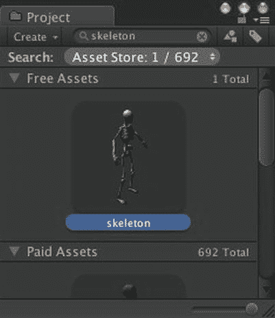

图 5-1. 针对`Skeletons Pack`的 Project View 搜索结果

**提示**  Project View 中的搜索词会匹配项目中已导入以及可从 Asset Store 导入的单个资源，但 Asset Store 的搜索部分可以在 Unity 偏好设置中禁用。

选择骨骼资源并在 Inspector View 中确认该包确实是`Skeleton Pack`（图 5-2）。你可以点击`Import package`按钮立即导入`Skeleton Pack`，或者先点击`Open Asset Store`按钮在 Asset Store 窗口中查看完整描述，然后从那里导入该包。

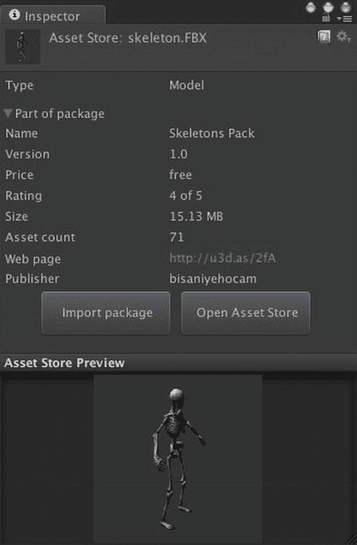

图 5-2. `Skeletons Pack`的 Inspector View

无论你选择如何导入`Skeletons Pack`，安装后都会在 Project View 中添加一个`SkeletonData`文件夹，以及在`Prefabs`文件夹中添加几个预制件（图 5-3）。

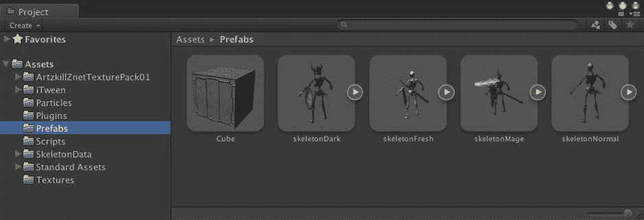

图 5-3. `Skeletons Pack`预制件的 Project View

### 添加一个骨骼

`Skeletons Pack`安装的四个预制件都具有相同的骨骼，但配备了不同的装备，例如剑和盾牌。然而，事实证明，带有武装骨骼的预制件在跳舞时看起来像是在砍自己的四肢，所以我们还是坚持使用`skeletonNormal`预制件，它只有光秃秃的骨骼。通过将`skeletonNormal`预制件拖入 Hierarchy View，向场景中添加一个它的实例（图 5-4）。

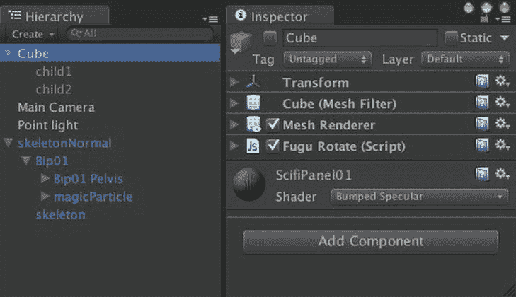

图 5-4. 带有激活的骨骼并使`Cubes`停用的立方体场景

`skeletonNormal GameObject`具有一个引用骨骼动画数据的`Animation Component`。`skeletonNormal`还有两个子`GameObject`。一个名为`Bip01`，实际上是一个表示骨骼关节的`GameObject`层级结构。当骨骼运动时，手臂也随之运动，任何手部运动都相对于手臂，以此类推。这个骨骼层级结构让人想起“Dem Bones”这首歌——“大腿骨连接着髋骨……”

另一个子`GameObject`，`skeleton`，是一个带有`SkinnedMeshRenderer Component`的`GameObject`。`SkinnedMeshRenderer`和`MeshRendererer`一样，是`Renderer`的子类。然而，`SkinnedMeshRenderer Component`渲染包裹在骨骼周围的网格，并随着骨骼关节的运动而跟随。该网格本质上形成了骨骼的皮肤，因此将这种网格映射到骨骼的过程通常被称为*蒙皮*。

`skeletonNormal GameObject`还包含几个粒子效果，通过`ParticleEmitter Components`实现。粒子效果由许多微小的动画图元组成，非常适合创建火焰、爆炸、烟雾或任何类型的闪亮效果。

**注意**  `Skeletons Pack`中包含的粒子效果适用于 Unity 的 Legacy 粒子系统，而不是 Unity 3.5 中引入的较新的 Shuriken 粒子系统。Legacy 系统使用`ParticleEmitter Component`，而 Shuriken 使用`ParticleSystem Component`。

## 隐藏`Cubes`

这个场景完全是关于跳舞的骨骼，所以你可以省去前两章中出现的`Cubes`。与其从场景中删除`Cubes`（通过选择它们并从 Edit 菜单中调用 Delete 或使用 Command+Delete 快捷键），不如将它们停用，使其不可见、眼不见心不烦。在 Hierarchy View 中选择父级`Cube`，取消选中 Inspector View 左上角的复选框，Hierarchy View 中的整个`Cubes`树将变为灰色，表示它们已处于非活动状态（图 5-4）。

所有子级`Cubes`实际上都处于非活动状态，因为父级的活动状态会覆盖子级的状态。换句话说，一个`GameObject`只有在它自身标记为活动、其父级标记为活动、父级的父级也标记为活动等情况下，才*真正*处于活动状态。任何非活动的`GameObject`其`Components`都会被有效禁用。它的`Renderer Component`不再渲染，`Collider Component`不再碰撞，并且任何附加的脚本都不会调用其回调函数，`OnEnable`和`OnDisable`除外。

### 围绕骨骼旋转

尽管`Cubes`已被停用，但主摄像机上的`MouseOrbit`脚本仍将主`Cube`作为其目标。主摄像机现在应该围绕骨骼旋转，因此在 Inspector View 中选择主摄像机，然后将`skeletonNormal GameObject`从 Hierarchy View 拖到`MouseOrbit`脚本的`Target`字段中（图 5-5）。

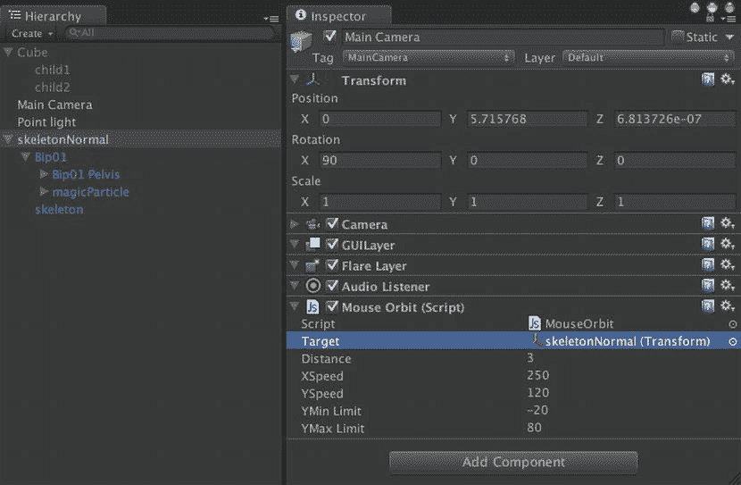

图 5-5. 主摄像机上的`MouseOrbit`脚本，目标为骨骼

现在，当你点击“播放”时，主摄像机会随着你移动鼠标而围绕骷髅旋转（图 5-6）。额外的好处是，由于骷髅预制件包含粒子效果，骷髅看起来像是站在一片闪烁的薄雾中。

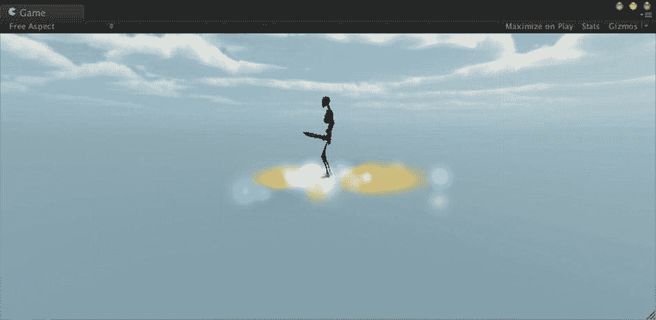

图 5-6. 待机骷髅的游戏视图

### 让骷髅跳舞

目前骷髅只是稍微走动一下，而不是跳舞。如果你选择 `skeletonNormal` 游戏对象并在检视视图中检查它，你会发现该游戏对象有一个`动画`组件，其中包含一个引用“待机”动画剪辑（AnimationClip）的字段（图 5-7）。

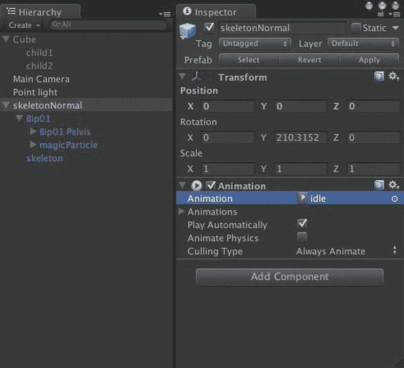

图 5-7. 改变骷髅的位置和动画

另请注意，`自动播放`复选框已被勾选，这就是为什么你一点击播放动画就会运行。如果动画打算在游戏过程中的某个时刻由脚本启动，则此选项应取消勾选。

要将待机动画剪辑替换为跳舞动画剪辑，请点击“待机”右侧的圆圈，调出动画剪辑选择列表（图 5-8）。选择名为“dance”的动画剪辑。

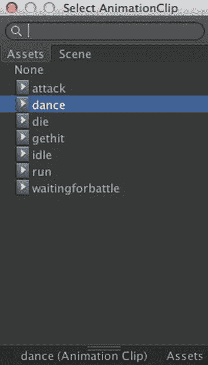

图 5-8. 一个动画剪辑选择列表

现在，当你点击播放时，骷髅就会跳舞！（图 5-9）。

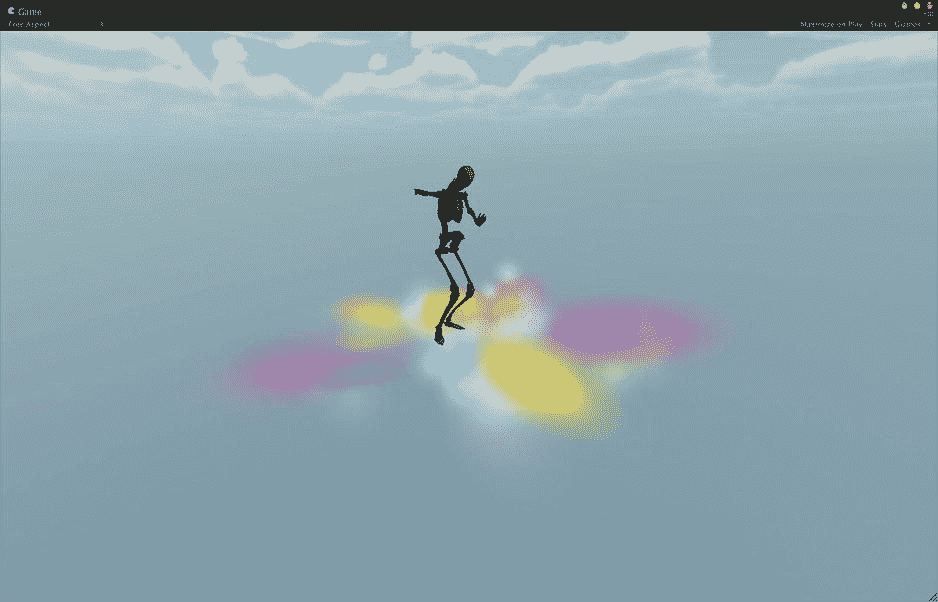

图 5-9. 跳舞的骷髅

### 让骷髅永远跳舞

如果你让骷髅跳一会儿舞，它最终会在动画剪辑结束时停止。但是，可以将动画剪辑设置为循环播放。在 `skeletonNormal` 游戏对象的检视视图中，点击`动画`组件中对 dance 动画剪辑的引用。项目视图将显示选中的动画剪辑及其关联的骷髅网格，以及骷髅的其他动画剪辑（图 5-10）。

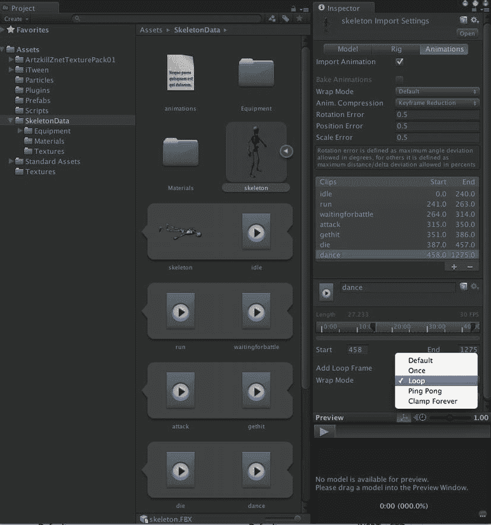

图 5-10. 循环播放动画

检视视图显示一段连续的动画数据，这些数据被分割成各个动画剪辑。在该列表中选择 dance 剪辑，下方的`循环模式`将显示为`默认`。将`循环模式`更改为`循环`，然后点击`应用`按钮（就在`循环模式`字段下方）。

现在，当你再次点击播放时，骷髅就会不停地跳舞、跳舞、再跳舞。

**注意：** 这个骷髅使用的是 Unity 的传统动画系统。你可以通过点击图 5-10 中所示的`Rig`按钮，并看到`传统`复选框被勾选来验证这一点。Unity 4 引入了一个名为 Mecanim 的新动画系统，其特性之一允许你将动画应用于不同的骷髅（或 Mecanim 中所谓的替身）。

### 关注髋部

现在骷髅已经能正常跳舞了，我们来改进角色在主摄像机中的视角。你是否注意到你似乎在看着角色的脚？这是因为角色的原点（或 3D 建模师所称的枢轴点）通常位于脚部，而不是模型的中心。这种惯例使得将角色定位到脚部正确贴合地面或地板更容易。

要让主摄像机围绕骷髅的躯干中部旋转，一种方法是创建一个新的游戏对象作为 MouseOrbit 目标，并将其设为 `skeletonNormal` 游戏对象的子对象。但 `skeletonNormal` 已经包含了代表骷髅骨骼的子游戏对象。事实上，髋骨，或者说名为 `Bip01 Pelvis` 的游戏对象，非常适合作为 MouseOrbit 目标。将 `Bip01 Pelvis` 游戏对象拖放到 `MouseOrbit Target` 字段中，并将距离缩短为 2，这样在播放时骷髅会占据更多屏幕空间（图 5-11）。然后当你点击播放时，在游戏视角里，你将会看着并围绕骷髅的髋部旋转（图 5-12）。

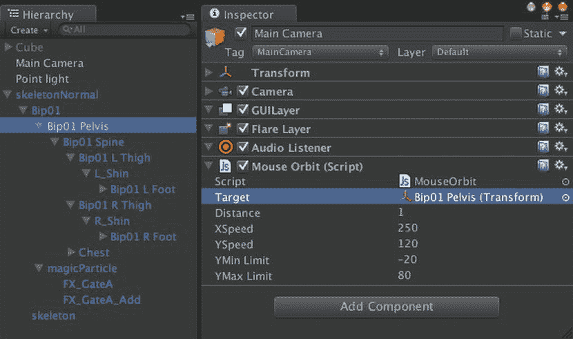

图 5-11. 围绕髋部旋转的主摄像机的检视视图

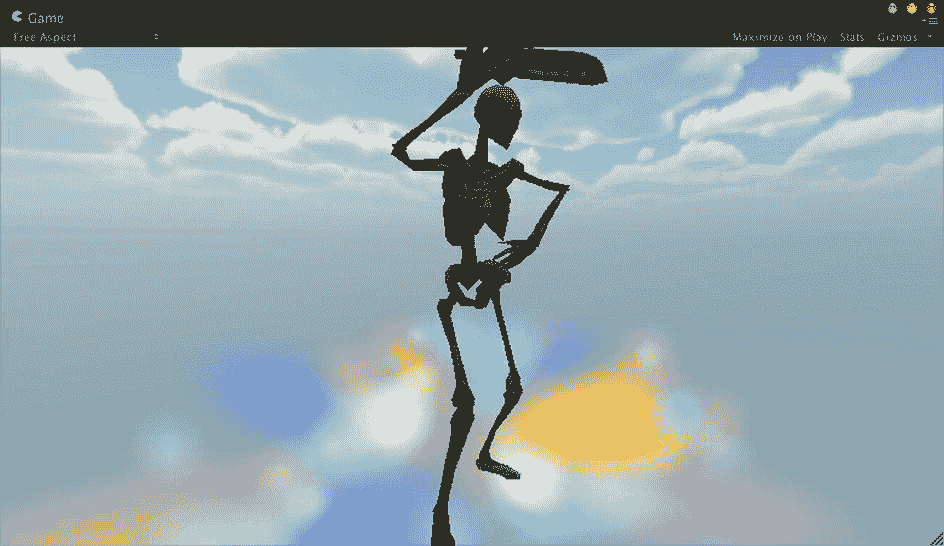

图 5-12. 主摄像机看向髋部的游戏视图

顺便提一下，你可能已经注意到，当你将一个游戏对象拖入`MouseOrbit`脚本的`Target`字段时，检视视图中显示的游戏对象名称后面会附加(Transform)。如果你检查`MouseOrbit`脚本，可以看到`target`变量确实被声明为`Transform`类型。Unity 的拖放系统允许你方便地将游戏对象从层级视图拖放到`Transform`类型的字段中，并自动将游戏对象的 Transform 组件分配给该变量。

游戏对象的其他组件也可以用作公共变量类型。但我更喜欢在我自己的脚本中保持游戏对象-组件关系的清晰，所以在这些情况下我坚持将变量声明为 GameObject，并通过游戏对象访问其组件。

### 添加一个舞池

骷髅在空中跳舞看起来有点奇怪，所以让我们给它一个跳舞的地板。你可以制作另一个立方体并缩放它，但有一个更合适的原始游戏对象可以使用——平面。与立方体一样，你可以通过菜单栏上 GameObject 菜单的 Create 子菜单来创建一个平面。但这次，请尝试层级视图左上角的创建按钮（图 5-13）。

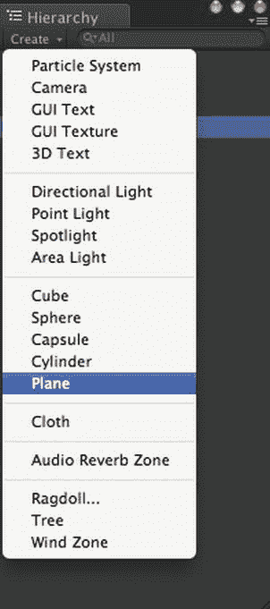

图 5-13. 使用层级视图中的创建菜单创建一个平面

请注意，创建菜单中的所有项目在菜单栏的 GameObject 菜单中也都可用，但并非所有可以在 GameObject 菜单中创建的项目都出现在层级视图的创建菜单中。

现在，层级视图中列出了一个平面，并在场景视图中显示（图 5-14）。平面就像一个扁平的立方体——它有顶部和底部，但没有侧面也没有高度。如果我们在其 Transform 组件中更改其 x 和 z 轴的比例，平面会拉伸，但更改 y 轴比例（高度）没有任何效果。

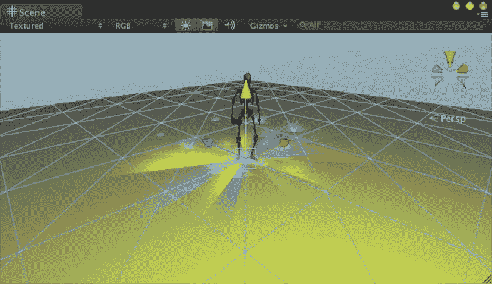

图 5-14. 新平面的场景视图

请记住，骷髅的位置被设为(0,0,0)，并且骷髅的原点在其底部，与骷髅的脚部位置一致。选择现在显示在层级视图中的新平面，然后在检视视图中，将平面的位置也设为(0,0,0)，这样地板就位于骷髅的脚部。具体来说，脚部和地板的高度（y 轴位置）必须匹配。

这个地板看起来相当平淡，可以通过添加一个带纹理的材质来改善。Free Artskillz Texture Pack 已经导入并用于立方体，所以你完全可以在这里把它用于地板。对于立方体，你只需将一个纹理拖放到层级视图中的立方体上，然后在检视视图中修改生成的材质。

这次，直接进入平面的检查器视图（图 5-15），并将其着色器更改为`Bumped Specular`。然后从 Free Artskillz 纹理包中拖拽一个主纹理及其相关的凹凸贴图（法线贴图）纹理（图中我从该包的 Fantasy 文件夹中选择了`Floor03`和`Floor03_n`纹理）。

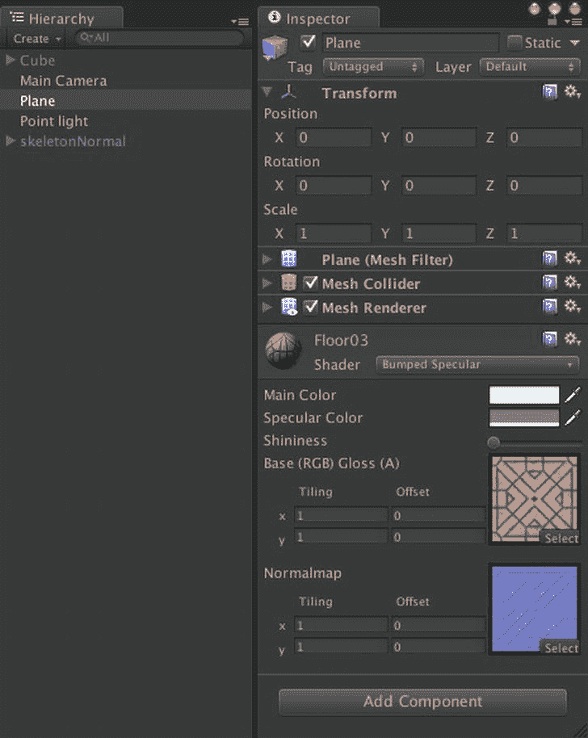

图 5-15. 编辑平面的位置和材质

现在，点击`Play`，骨骼就会在地板上跳舞！（图 5-16）。

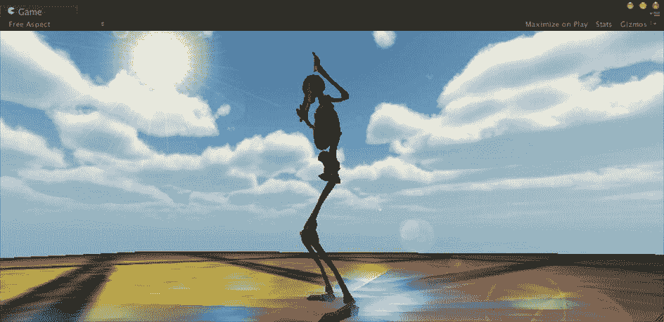

图 5-16. 带有纹理的平面上跳舞的骨骼

### 添加阴影（专业版）

第 3 章中讨论的光组件属性之一是`Shadow Type`。既然场景中现在有了可以投射阴影的地面，让我们来试试这个功能。

**注** 动态阴影（根据阴影投射物移动而移动的阴影）是`Unity Pro`和`Unity iOS Pro`的功能，所以如果你当前没有运行 Unity Pro，仍然可以跟随本练习操作，只是看不到预期的阴影。

选择点光源（在层级视图或场景视图中均可），然后在检查器视图中（图 5-17），将`Shadow Type`从`None`改为`Soft Shadows`。这能为阴影提供漂亮的、柔和的模糊边缘（阴影的*半影*），看起来比`Hard Shadows`硬边缘的效果更好。

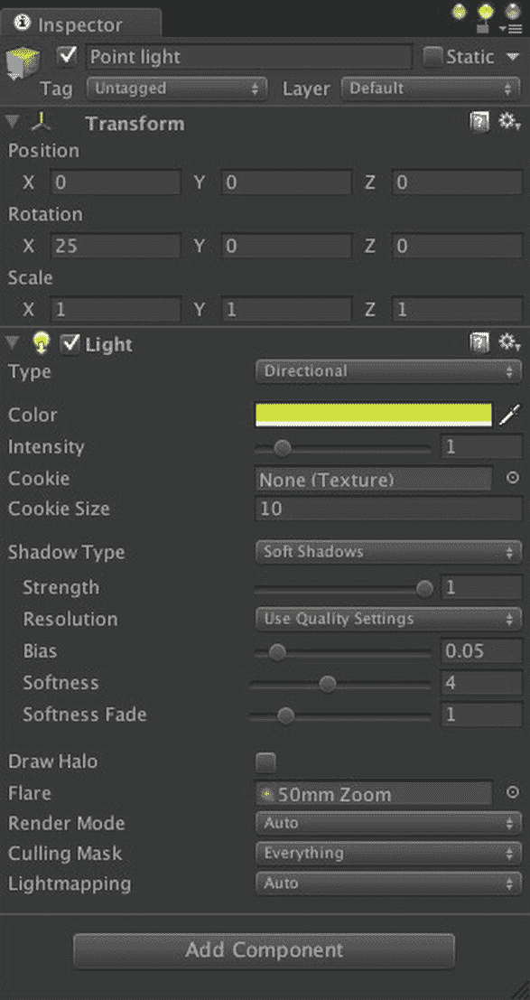

图 5-17. 点光源转换为带有柔和阴影的平行光

现在你应该将类型从`Point Light`改为`Directional Light`。点光源可以投射阴影，但只能投射`Hard Shadows`，并且仅在`Deferred Mode`渲染时有效，而`Deferred Mode`在`Unity iOS`中不可用。实际上，`Soft Shadows`在`Unity iOS`中完全不可用，但它们看起来效果很好，所以这里我们还是尝试一下。

点光源从一个位置向所有方向辐射光线，而平行光则被视为无限远，因此其位置无关紧要，但旋转角度很重要。因此，在变换组件中，可以将位置设为`0,0,0`（对于平行光来说位置无关紧要，但这样比随意设置一个位置更整洁），并将旋转设为`25,0,0`，表示光源绕 x 轴旋转了 25 度。换句话说，光源从水平方向向下倾斜了 25 度。

除了直接输入旋转角度，你也可以在场景视图（图 5-18）中手动旋转光源：选中光源，点击 Unity 编辑器左上角按钮栏中的旋转工具（左数第三个按钮），然后拖动光源上代表 x 轴旋转的圆圈。

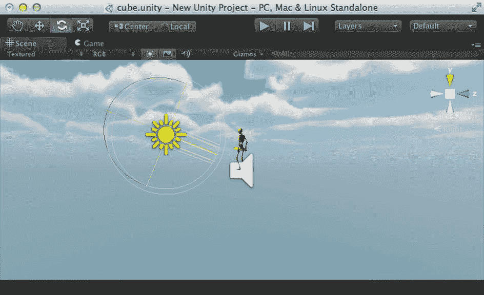

图 5-18. 在场景视图中旋转平行光

没有必要使用`Move`工具（按钮栏左数第二个按钮），因为平行光的位置无关紧要，但如果你将它向上并移远一些，使其明显指向骨骼，会有助于可视化光源照亮了什么。

**提示** 你可以像第 3 章中让主摄像机对准立方体那样，来对准一个平行光或聚光灯（或任何可对准的物体）。在这种情况下，你可以先选中骨骼，按`F`键`Frame Selected`，点击左上角工具栏最左边的按钮进入场景视图的`Hand`工具模式，然后在场景视图中`alt+点击+拖拽`，直到场景视图的摄像机指向你希望光线指向的方向。然后选中点光源，并从 GameObject 菜单中调用`Align to View`。

如果此时点击`Play`，你应该能看到阴影，但即便将`Strength`设置为`1`，阴影仍有改进空间。Unity 使用一种称为*阴影贴图*的技术来生成阴影，阴影质量取决于阴影贴图的分辨率。光组件中阴影贴图分辨率的默认设置是`Use Quality Settings`，你可以在检查器视图中覆盖此设置。不过，我们还是通过从 Edit 菜单选择`Project Settings > Quality`来进入质量设置吧（图 5-19）。

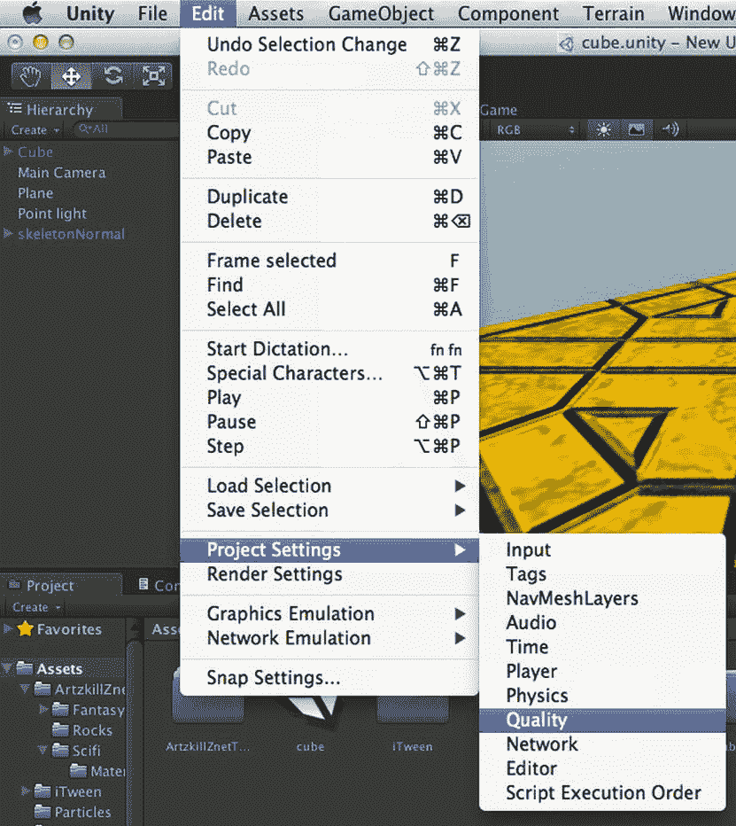

图 5-19. 从 Edit 菜单选择 Quality Settings

质量设置管理器会出现在检查器视图中（图 5-20），显示一个质量设置列表以及每个构建平台选中的质量设置。桌面平台的默认质量设置是`Good`。在平台设置表格中选中那一行，这样`Good`的具体设置就会显示出来。特别是`Shadow`设置控制了阴影质量。因此，将`Shadow Resolution`改为`Very High Resolution`，并将`Shadow Distance`降低到`10`，因为较短的阴影距离会产生更好的阴影分辨率（但如果太短，阴影将无法渲染）。

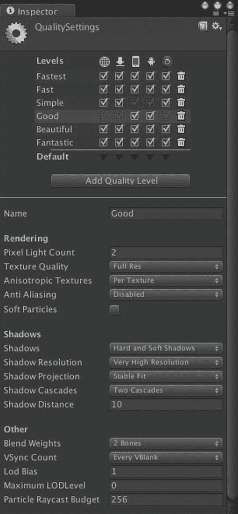

图 5-20. 调整后的阴影质量设置

现在，当你点击`Play`时，你会看到一个相当不错的跳舞阴影！（图 5-21）。

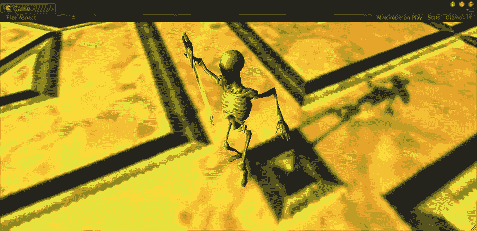

图 5-21. 带有阴影的骨骼的游戏视图

### 添加音乐

没有音乐的舞蹈演示是不完整的。幸运的是，资源商店（Asset Store）中有很多免费的音乐。我经常使用的一个音乐包是 Gianmarco Leone 的 General Music Set。如果在项目视图搜索框中输入`"general music"`，该包中的所有`AudioClips`都会显示在结果中（图 5-22）。点击其中任意一个，然后从检查器视图导入该包。

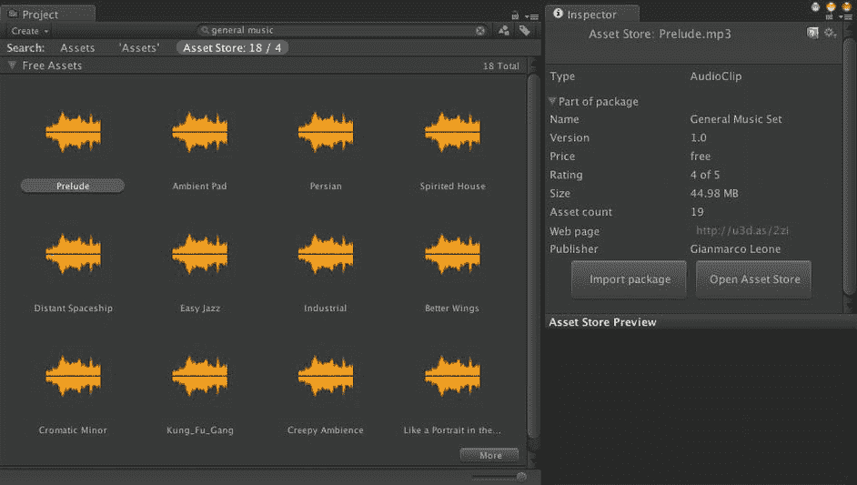

图 5-22. 在资源商店中搜索 General Music Set

在`AudioClips`安装到项目视图中后（图 5-23），选择名为`Caribbean Isle`的`AudioClip`。我认为它节拍不错，适合跳舞。但你可以通过预览音频自行决定。在检查器视图中（图 5-24），点击底部的`Play`按钮（位于立体声波形显示之上），来试听这个`AudioClip`。既然这个`AudioClip`将主要用作背景音乐，而不是带有位置信息的音效，那么请取消勾选`3D Sound`复选框，并点击`Apply`按钮重新导入音效。

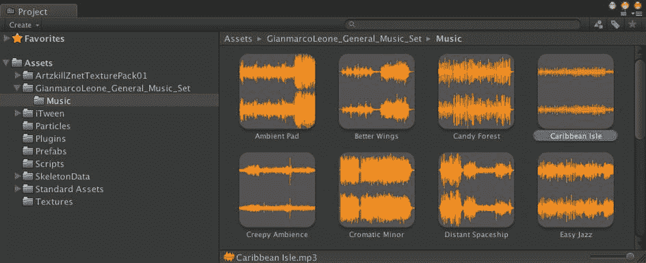

图 5-23. General Music Set 的项目视图

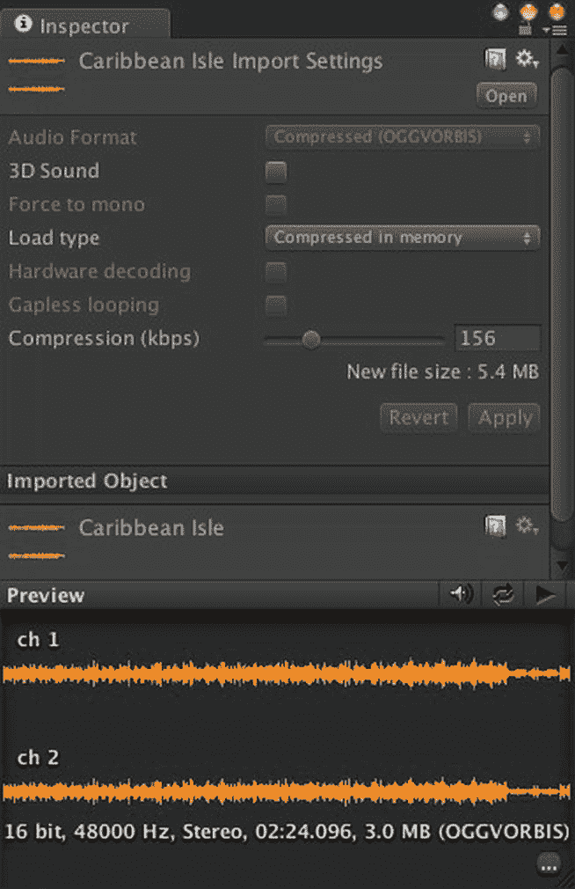

图 5-24. 一个 AudioClip 的检查器视图

现在你已经准备好将`AudioClip`添加到场景中了。只需将`AudioClip`从项目视图拖拽到层级视图中，一个同名的`GameObject`就会自动创建（图 5-25）。

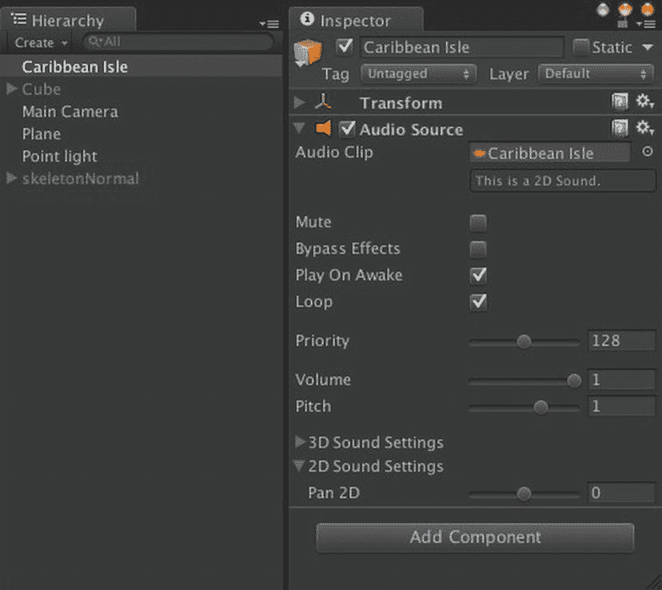

图 5-25. 场景中的音频

