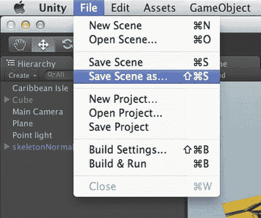
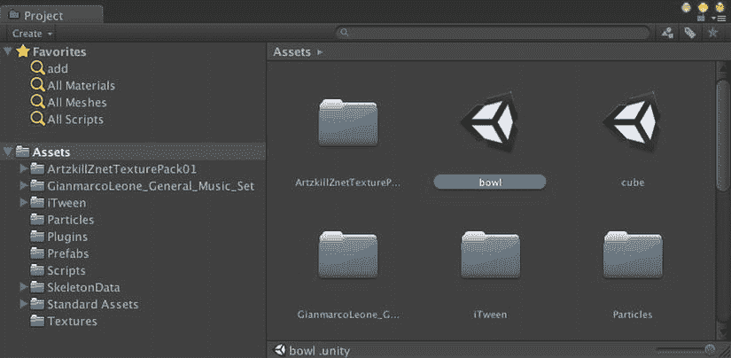
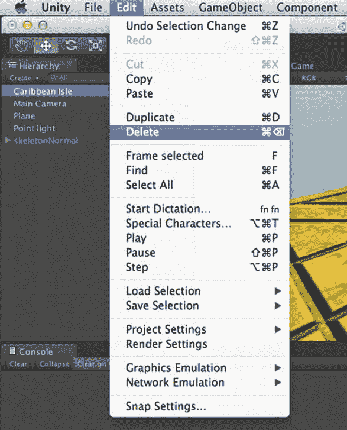
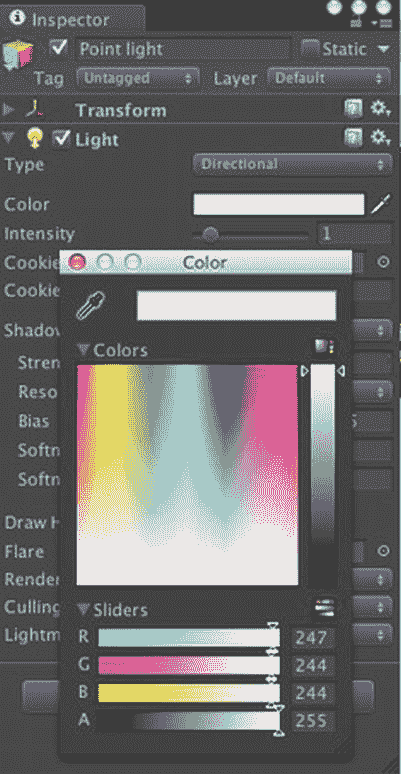

# 选择“Caribbean Isle”游戏对象

选择`Caribbean Isle`游戏对象后，你会在检视面板中看到它带有一个`AudioSource`组件。该组件的属性中包含对`Caribbean Isle AudioClip`（由于取消了 3D 音效复选框，它被描述为 2D 音效）的引用，以及一个`Play On Awake`复选框。该选项指定了音效会在场景开始播放时立即响起。你还应该勾选`Loop`复选框，这样音乐会像跳舞动画一样循环播放。

现在，当你点击播放时，就会有一场真正的音乐舞会了！

## 进一步探索

至此，我们与跳舞骷髅的短暂交会便告一段落。在本书的后续部分，你将专注于开发一款主要基于物理运动的保龄球游戏。不过，你应该已经感受到了成就感，因为过去的三个章节里，你将一个简单的静态立方体场景，逐步进化成了一个包含粒子特效和动态阴影等华丽图形功能的音乐骷髅跳舞场景。但华丽的功能通常也意味着性能上的高消耗，因此请审慎使用！

#### Unity 手册

“资源导入与创建”部分涵盖了本章介绍的两种新资源类型：音频和动画。“音频文件”页面列出了 Unity 支持的音频格式，并描述了导入音频文件后生成的`AudioClip`资源。在前几章中，我们只是浅尝了 Unity 手册中“创建游戏玩法”的内容，但现在我们已深入其中，学习了“粒子”、“传统动画系统”和“声音”等页面描述的内容。此外，“Mecanim 动画系统”是 Unity 动画的未来发展方向，因此值得一读。

动态阴影是一个大话题。Unity 手册的“高级”部分对“Unity 中的阴影”进行了详尽阐述，涵盖了“定向阴影”、“阴影故障排除”和“阴影尺寸计算”。

#### 参考手册

参考手册的“动画组件”部分包含了传统动画系统所使用的`Animation`组件和`Animation Clip`资源的页面。该部分还包含多个关于新 Mecanim 动画系统中使用的组件的页面。

“音频”部分列出了本章构建的跳舞场景中添加音乐所需的音频组件：`AudioListener`（通常会自动附着在主摄像机上）和`AudioSource`（附着在音源上）。此外，该部分还列出了“音频滤镜组件（仅限专业版）”，可用于添加回声等效果。

“效果”部分包含一个关于新 Shuriken 粒子系统的页面，以及多个关于传统粒子系统的页面。

参考手册还记录了各种设置管理器，包括你用来调整阴影质量的“质量设置”，但它也会影响其他视觉质量元素，例如光照和粒子。

#### 资源商店

资源商店不仅在音频类别中提供了大量音乐（其中很多是免费的），还提供了用于播放音乐的脚本。如果你想在跳舞场景中播放多首歌曲，可以编写一个脚本，使用`AudioSource`类（用于播放和停止音乐）和`AudioListener`类（用于控制音量）中定义的 Unity 函数，来播放心中的或随机顺序的歌曲。但从资源商店直接下载免费的“点唱机”脚本（或者如果你愿意花几块钱，也可以下载“点唱机 Pro”），会更加方便。

#### 计算机图形学

我在第 3 章末尾提到了《实时渲染》这本书，对于你在本章中遇到的计算机图形学主题：动画、粒子特效和动态阴影，它依然值得再次推荐。市面上有很多专门讲角色动画的书籍，也包括面向专业动画师的内容创作方面的书，比如乔治·梅斯特里的《数字角色动画》。

## 第 6 章：滚起来吧！物理与控制

最后，我们准备开始本书的主要 Unity 项目：一款模仿 HyperBowl 风格的保龄球游戏。HyperBowl 是我十多年前参与制作的一款街机/游艺项目，并在几年前移植到了 Unity 上。HyperBowl 拥有独特的“身临其境”式玩法，玩家需要在一个 3D 环境中不断滚动球体去撞击球瓶。本书构建的保龄球游戏会简单得多，但采用同样的控制风格。

即使是像这样一个简单的保龄球游戏，也是一个重要的项目。它将包含物理、输入处理、摄像机控制、碰撞音效、游戏规则、分数显示以及开始/暂停菜单。这还没有进行任何针对 iOS 的适配。本章仅专注于让球体滚动起来，这需要一些物理设置，但只需要一个用于球体控制的脚本。

该脚本可在`http://learnunity4.com/`上本章的项目中找到。但这是一个相当简单的脚本，并且会随着本章内容逐步完善，所以最好跟着我们一起从头开始实现。

### 创建一个新场景

上一章的跳舞场景实际上是对我们第 3 章开始时使用的原始立方体场景的修改，因此我们不必从头创建整个场景。天空盒、灯光和地板在保龄球游戏中也会有用，同理，我们可以继续修改立方体场景，在添加保龄球游戏内容之前停用或移除骷髅和音乐。但并没有规定一个项目中只能有一个场景，所以让我们保留跳舞（立方体）场景不变，直接复制一份作为保龄球场景的起点。

根据上一章的内容，你的 Unity 编辑器应该仍然打开着跳舞（立方体）场景。复制此场景最快的方法是在文件菜单中选择`Save Scene As`（图 6-1）。

图 6-1. 将场景另存为新场景

这将是一个保龄球场景，所以我们将其命名为“bowl”（图 6-2）。

图 6-2. 保存在资源顶层目录的保龄球场景

**注意**：为了与资源组织系统保持一致，场景应放入 Scenes 文件夹，但如果我只有一个或几个场景，我通常会将它们直接保存在资源文件夹的顶层目录。

除了使用`Save Scene As`，你也可以在项目视图中选中该场景，然后从编辑菜单（或使用快捷键`Command+D`）调用`Duplicate`来复制场景，再重命名新场景，最后双击场景文件切换到该场景。

#### 删除游戏对象

现在，你可以清理场景中所有保龄球不需要的东西，而不必担心损坏跳舞场景。所以，不要停用骷髅，直接在层级视图中选中骷髅游戏对象，然后使用编辑菜单中的`Delete`命令（或快捷键`Command+Delete`）将其删除。同时删除 Cube 层级和`Caribbean Isle`游戏对象（图 6-3），因为保龄球也不需要立方体和音乐。

图 6-3. 从保龄球场景中删除不需要的游戏对象

#### 调整灯光

同样，在开始处理新场景之前，需要做一些简单的整理工作。让我们从灯光的颜色开始。在所有资源放入场景之前，使用白色灯光可以让你看到所有物体原本的颜色。因此，我们点击灯光的颜色字段，在颜色选择器中选择白色，将灯光颜色改为白色（图 6-4）。

