# 图 6-4. 将灯光颜色设为白色

此外，由于在上一章中为了支持软阴影（针对 Unity Pro 用户），点光源实际上被改成了方向光，因此“点光源”这个名称会带来误解。此时正好可以将其重命名为“灯光”，这样如果你之后又想改变灯光类型，也能保留选择的灵活性。

### 重新铺设地板

舞厅场景中闪亮的地砖看起来不太像保龄球道，所以让我们改变它的外观。借此机会，可以尝试一下 Unity 基于 Allegorithmic 的 Substance 技术对程序化材质的支持。程序化材质使用算法生成的纹理，而非图像文件。通过调整纹理生成参数，可以在材质上实现丰富的变化，同时还能节省空间，因为程序化材质无需加载图像文件作为纹理。

让我们为地板尝试一种程序化材质。在资源商店窗口中搜索“substance”（项目视图是搜索单个资源，所以这里不会显示资源商店的搜索结果）。资源商店窗口中会显示一些来自 Allegorithmic 的免费 Substance 素材包（图 6-5）。

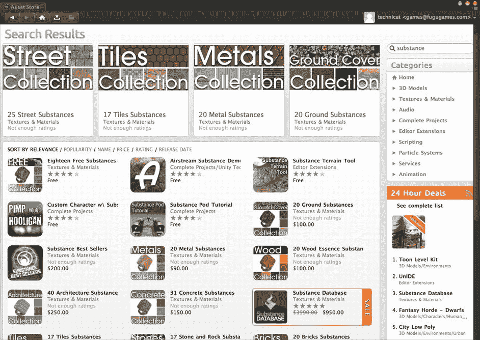

**图 6-5.** 资源商店中搜索“substance”的结果

我们需要的是“Eighteen Free Substances”这个素材包。选中并导入该素材包后，项目视图中会出现一个`Substances_Free`文件夹，里面包含 18 个 Substance 存档文件（扩展名为`.sbsar`）（图 6-6）。能提供木地板外观的 Substance 文件是列在末尾的`Wood_Planks_01`。

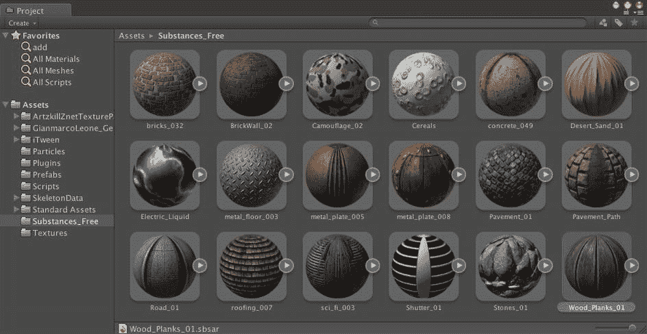

**图 6-6.** 项目视图中显示的 18 个免费 Substance 素材包

每个 Substance 存档包含一个或多个`ProceduralMaterial`资源（`ProceduralMaterial`是`Material`的子类），以及它们支持的纹理和脚本。点击`Wood_Planks_01`图标右侧的箭头，图标会变成左箭头，并展开显示`Wood_Planks_01`的`ProceduralMaterial`及其关联的纹理（图 6-7）。

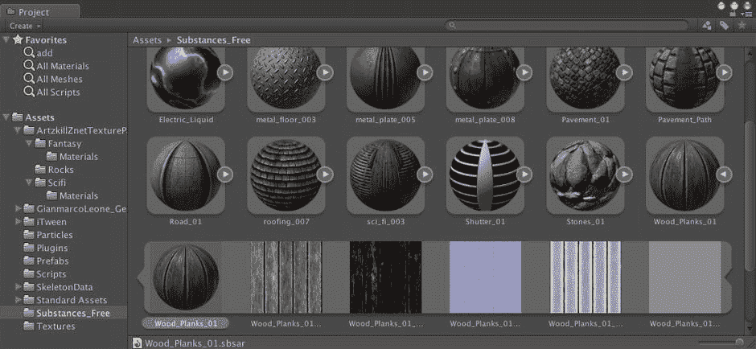

**图 6-7.** `Wood_Planks_01` Substance 存档的展开视图

`Wood_Planks_01`程序化材质看起来是保龄球道地板的不错候选（至少比我们那些奇幻和科幻纹理要好），所以将`Wood_Planks_01`程序化材质（不是存档文件）拖拽到层级视图中的平面（Plane）上。你可以在场景视图中看到平面现在有了木板纹理（图 6-8）。

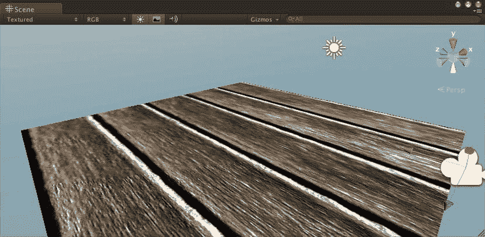

**图 6-8.** 应用了`Wood_Planks_01`程序化材质的平面

木板看起来过大，但你可以通过编辑纹理的 UV 缩放字段来调整纹理（有一个主纹理和一个法线贴图纹理）在平面上的拉伸方式。在层级视图中选中平面，然后在检视视图中将两个纹理的 X 和 Y 平铺值都设为 5，而不是 1（图 6-9）。

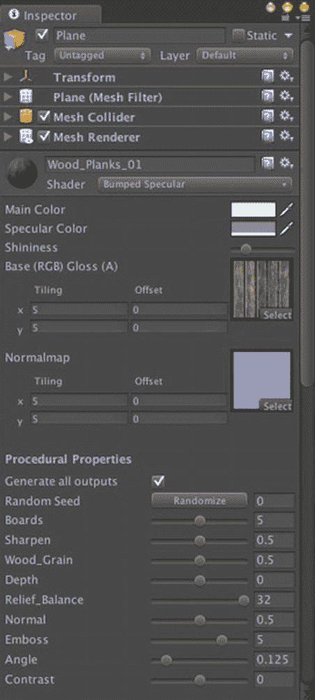

**图 6-9.** 应用了程序化材质的平面的检视视图

现在纹理被平铺了五次，而之前只有一次（图 6-10）。在检视视图中，注意你有很多程序化属性可以调整，来改变生成纹理的外观。

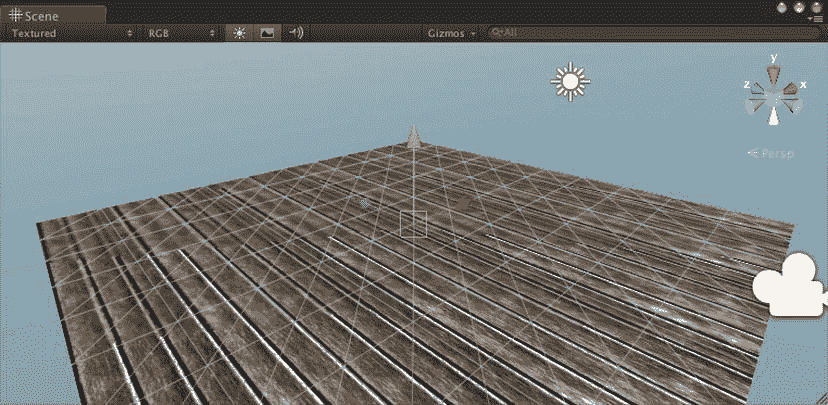

**图 6-10.** 平铺值设为 5 后的平面

和灯光一样，既然已经打开了检视视图，现在正好可以修改顶部文本字段中的名称，将平面重命名为“Floor”（地板），使其功能更加明确。

### 重置摄像机

主摄像机上的`MouseOrbit`脚本不适合保龄球游戏，所以你可以禁用该脚本。更好的做法是，直接从主摄像机上移除该脚本：在层级视图中选中主摄像机，然后在检视视图中，右键点击`MouseOrbit`组件并选择“移除组件”（图 6-11）。

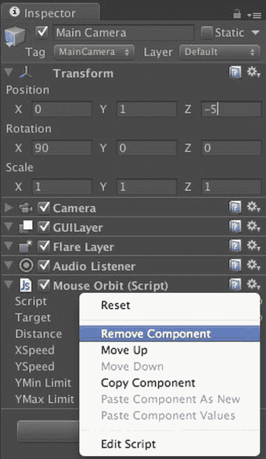

**图 6-11.** 从主摄像机上移除`MouseOrbit`脚本

趁此机会，将主摄像机的位置设为(0,1,-5)，旋转设为(0,0,0)。现在你应该能看到一个漂亮的地板和天空，没有太多其他东西了（图 6-12）。

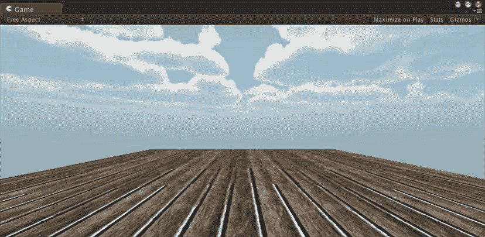

**图 6-12.** 固定主摄像机后的游戏视图

### 制作一个球

现在场景中有了天空盒、灯光、光晕和地板，以及一个固定视角的主摄像机。是时候添加保龄球了。

#### 创建一个球体

到目前为止，本书使用了两种基本游戏对象：平面和立方体。对于球体，还有一个完美的基本体：球体（Sphere）。与平面和立方体一样，可以从菜单栏“GameObject”菜单的“Create”子菜单中选择球体，但也可以通过层级视图左上角的“Create”按钮来实例化球体（图 6-13）。

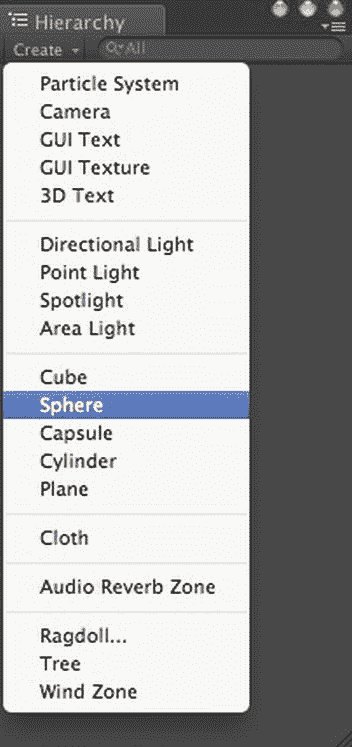

**图 6-13.** 创建球体

从“Create”菜单中选择“Sphere”后，层级视图中会出现一个名为“Sphere”的新游戏对象。在层级视图中选中球体游戏对象，以便在检视视图中查看它（图 6-14）。

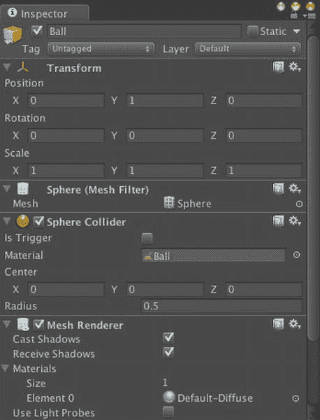

**图 6-14.** 球的检视视图

与立方体和平面基本体一样，球体游戏对象包含一个`MeshFilter`组件、一个`MeshRenderer`组件，以及一个与基本体形状相同的碰撞器组件（这里是一个`SphereCollider`）。首先，本着精心命名游戏对象的精神，将“Sphere”的名称改为“Ball”（球），以明确这个游戏对象是保龄球。然后将球的位置设为(0,1,0)，这会将球的中心置于地板上方 1 米处。由于球的半径是 0.5 米（图 6-14 中显示的`SphereCollider Radius`是一个很好的提示），这会让球和地板之间留出一些间隙。当你点击播放时，球会悬浮在地板上方（图 6-15）。

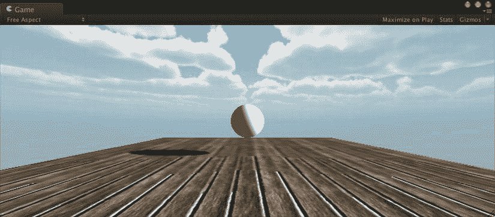

**图 6-15.** 悬浮在空中的球

当然，这是符合预期的。就像之前创建的所有其他东西——地板、立方体，甚至舞蹈角色——球会移动到或被放置在指定的位置。

#### 让它落下

为了让球因重力而下落并响应其他力，必须赋予球物理属性。通过添加一个`Rigidbody`组件，可以使游戏对象具有物理特性。

**注意**   大多数游戏物理被称为*刚体模拟*，这大致如其字面意思——模拟形状不变的坚硬物体如何对作用力和碰撞做出反应。保龄球非常适合刚体模拟。而一团木薯布丁则不然。


要添加刚体（`Rigidbody`）组件到球体（`Ball`）上，请在层级视图中选择球体，然后在菜单栏的**组件**菜单中，选择**物理**子菜单，再选择`Rigidbody`（图 6-16）。你也可以点击检视面板底部的**添加组件**按钮来添加`Rigidbody`组件。

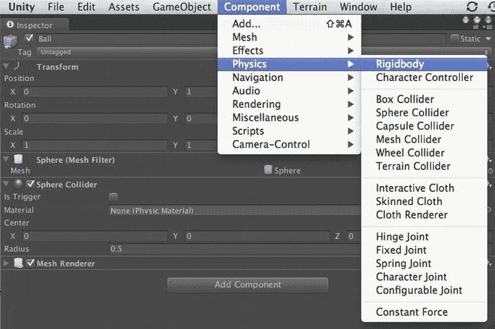

图 6-16. 为球体添加`Rigidbody`组件

现在，检视面板会显示一个附加到球体上的`Rigidbody`组件（图 6-17）。

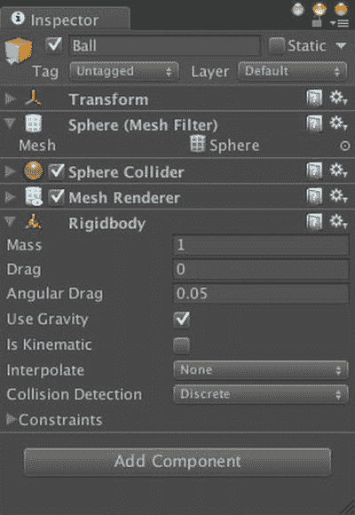

图 6-17. 带有`Rigidbody`组件的球体的检视面板

大多数`Rigidbody`属性可以使用其默认值，但对于一个保龄球来说，1 千克的质量稍微轻了点。让我们将其设置为 5，因为 5 千克大致接近保龄球的重量范围。

**阻力**（空气阻力）和**角阻力**（旋转时受到的阻力）的最小值可以接受。没有理由增加阻力，除非你是在水下打保龄球。

使用**使用重力**属性指定球体会响应重力。如果该复选框未选中，那么球体的行为将如同在零重力环境中一样（太空保龄球！）。

**运动学**属性用于移动和碰撞但不响应力的游戏对象（例如，电梯平台）。任何带有碰撞器组件并会移动的游戏对象也应该附加`Rigidbody`组件。如果移动并非来自物理引擎，而是来自脚本或动画，那么它应该是一个运动学刚体。

**注意**   不应通过直接更改其变换组件来移动运动学刚体，这会导致糟糕的性能。相反，应通过在游戏对象的`Rigidbody`组件上调用`Rigidbody.MovePosition`和`Rigidbody.MoveRotation`函数来移动它。

**插值**属性允许平滑游戏对象的运动（这会消耗计算资源）。

同样，**碰撞检测**属性可提供改进的碰撞检测，特别是对于快速移动的游戏对象（同样会消耗计算资源）。

**约束**属性可以限制游戏对象在响应力时的移动方式。例如，可以将游戏对象限制为仅沿一个平面或仅沿一个方向移动。

适当设置`Rigidbody`组件属性后，再次点击**播放**。现在球体会下落，更棒的是，它会落在地板上！（图 6-18）。

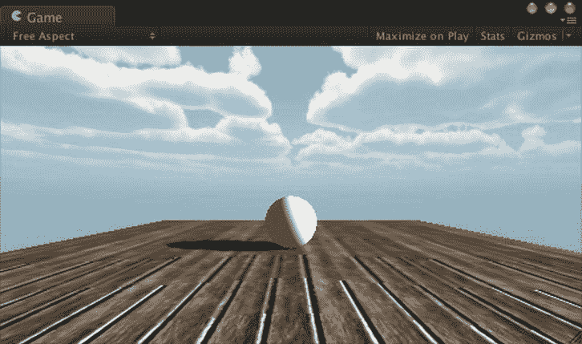

图 6-18. 球体落在地板上的游戏视图

顺便说一下，默认的重力是标准地球重力，大约为 9.8 米/秒²。这可以在`PhysicsManager`中进行自定义（图 6-19），通过**编辑**菜单下的**项目设置**子菜单即可找到。

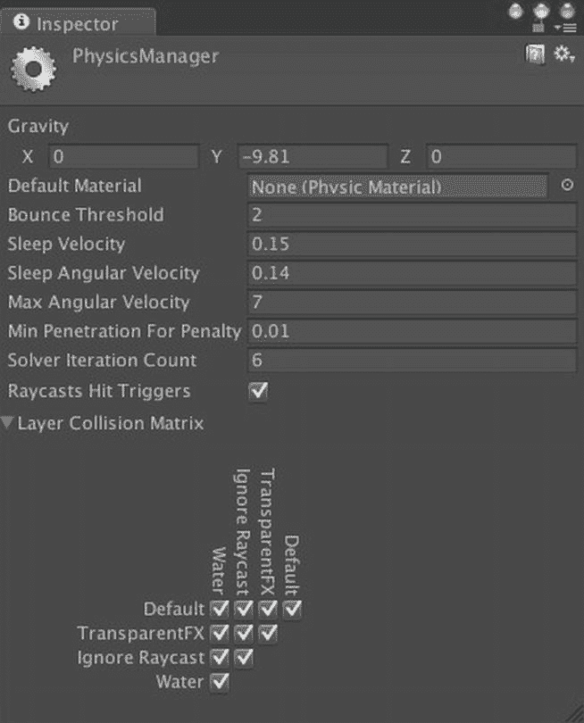

图 6-19. `PhysicsManager`

`PhysicsManager`的**重力**属性是一个向量（具体来说，如果你从脚本中访问`PhysicsManager`，它是一个`Vector3`），其唯一的非零值在 y 方向上（且为负值，因此力是向下的）。因此，你不仅可以改变重力，例如设置为月球重力，甚至可以改变其方向！如果将 y 值从-9.81 改为 9.81，球体将向上掉落；如果将重力向量从(0,-9.81,0)改为(1,0,0)，球体将以 1 米/秒²的速度侧向掉落。如果你想要失重状态，设置重力为(0,0,0)即可。

### 自定义碰撞

碰撞器组件为游戏对象提供碰撞形状。如果你在检视面板中检查球体和地板，你会发现每个对象都自动附加了一个形状与其网格匹配的碰撞器组件。地板带有一个`MeshCollider`组件，它始终与游戏对象的网格匹配；而球体带有一个`SphereCollider`组件，它始终是球形的。当你选择球体或地板时，场景视图不仅会高亮显示游戏对象的网格，还会高亮显示其碰撞器组件的形状。你可以使用场景视图中的**Gizmos**菜单来切换碰撞器 gizmo 的显示。

在基本游戏对象和基本碰撞器之间几乎存在一对一的关系（这里“基本”指的是内置在 Unity 中，并且形状简单，这对性能有好处）。不过也有例外。例如，你可以从游戏对象菜单创建一个基本的圆柱体游戏对象，但没有可用的圆柱体形状的碰撞器。相反，如果你创建一个圆柱体，它会自动使用`CapsuleCollider`组件。

`MeshCollider`是一个特殊情况。自动跟随关联网格的形状听起来不错，但这仅适用于静态（即非移动）游戏对象。任何正在移动或可能移动的对象都应使用基本碰撞器或基本碰撞器的集合（更多内容见下一章）。`MeshCollider`如果要与其他网格碰撞器碰撞，还必须启用其**凸起**属性（复选框）。

#### 物理材质

碰撞器组件决定了两个游戏对象在何时发生碰撞，但检测到碰撞后实际会发生什么？一个游戏对象会从另一个上弹开吗？如果是，弹开多少？球体会在地板上滑动、滚动还是粘住？这就是碰撞器组件的**材质**属性发挥作用的地方。这个属性名有点误导，因为碰撞器组件的材质与网格渲染器组件用来确定网格表面外观的材质不同。相反，碰撞器组件使用物理材质来确定碰撞表面的碰撞属性。拼写有点奇怪，但你可以将物理材质理解为*物理材料*或*物理材质*。

**注意**   与程序化材质不同，`PhysicMaterial`类不是`Material`的子类。

碰撞器组件的**材质**属性默认为`PhysicsManager`中的**默认材质**属性（图 6-19），该属性为无。要自定义其碰撞行为，碰撞器组件必须分配一个物理材质。

#### 标准物理材质

你可以从头开始在项目视图的**创建**菜单中创建新的物理材质，但 Unity 在其标准资源中方便地提供了各种物理材质的包。从菜单栏的**资源**菜单中选择**导入包**，然后选择**物理材质**（图 6-20）。

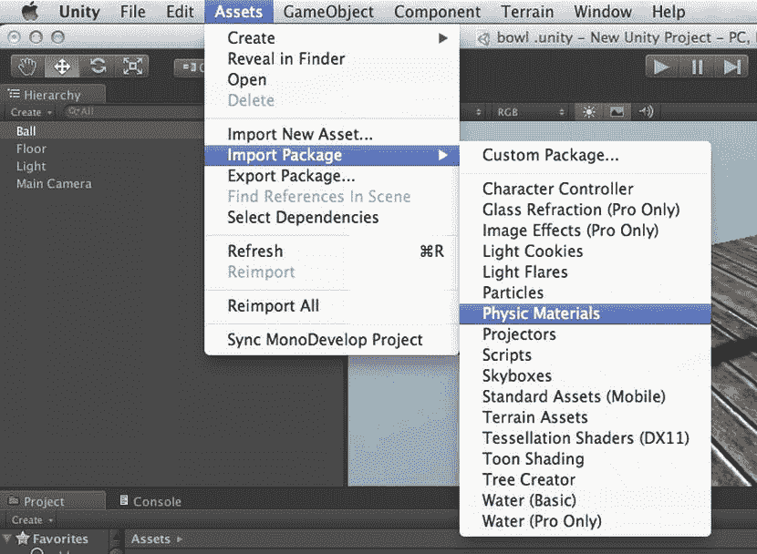

图 6-20. 从标准资产中导入物理材质

在项目视图中，新的物理材质将出现在一个名为**物理材质**的标准资产子文件夹中（图 6-21）。

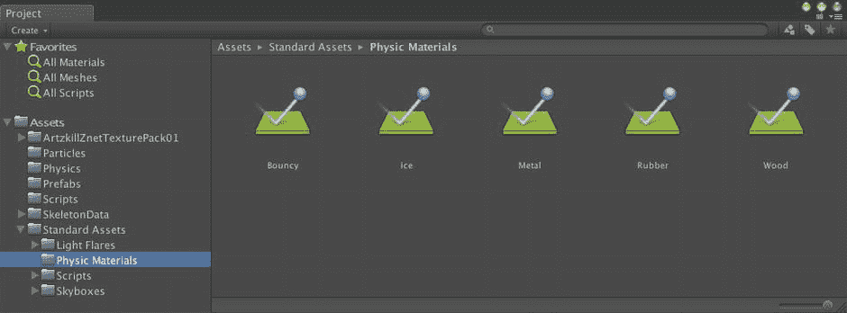

图 6-21. 来自标准资产的物理材质的项目视图

#### 物理材质的剖析

选择各种物理材质并在检视面板中比较它们的值。例如，查看**弹球**和**冰**物理材质之间的差异（图 6-22）。

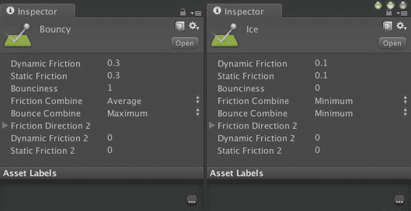

图 6-22. 弹球和冰物理材质的比较


请注意，`Ice`的摩擦力值特别低。`动态摩擦力`是一个物体在另一个物体上滑动时产生的摩擦力。`静摩擦力`则是物体静止在另一个物体上所受到的摩擦力。摩擦力的范围是 0-1，其中 0 表示无摩擦，1 表示完全无法滑动。`Ice`的`弹性`值也为 0，这很合理，因为冰本身不会弹跳。而`弹性物理材质`则具有最大的`弹性`值，即 1。

当两个带有不同`物理材质`的`游戏对象`发生碰撞时会发生什么？它们的`摩擦力`和`弹性`值会分别根据`摩擦力组合`和`弹力组合`的值进行合并。`Bouncy`的`摩擦力组合`值表明：当它与另一个`物理材质`碰撞或滑动时，所使用的摩擦力是两个摩擦材质数值的平均值。而`Bouncy`的`弹力组合`值则指定：将会使用这两个`物理材质`中最大的弹力值（由于`Bouncy`本身已有最大弹力值 1，因此结果始终会是这个值）。

你可能会想，如果两个`物理材质`的组合值不同（例如`Bouncy`和`Ice`），会使用哪一个呢？嗯，截至撰写本文时，这其实并没有官方的正式文档说明，但优先级顺序从低到高似乎是：`平均`、`相乘`、`最小值`和`最大值`。因此，如果`Bouncy`和`Ice`发生碰撞，结果将是`最小值`摩擦力，即`Ice`的`0.1`摩擦力，以及`最大值`弹力，即`Bouncy`的`1`弹力。这正是我们所预期的结果！

在`物理材质`的`检视面板`中显示的最后三个属性支持各向异性摩擦力，这意味着在不同方向上具有不同的摩擦力值。如果`摩擦力方向`属性被填充了一个非零向量，那么次级的静态和动态摩擦力将在该方向上生效。对于木质纹理的`地板`，你可以指定一个沿着木材纹理方向的次级摩擦力方向，并沿着该方向设置较低的静态和动态摩擦力值。

## 应用`物理材质`

你可以将任意标准`物理材质`拖放到`地板`和`球体`的`碰撞器`的`材质`字段中，或者点击`碰撞器`的`材质`字段右侧的小圆圈，从弹出窗口中选择（见图 6-23）。你也可以将`物理材质`从`项目视图`拖放到`检视面板`中的`游戏对象`上，这样`物理材质`就会出现在正确的位置，即`碰撞器`组件的`材质`字段中。

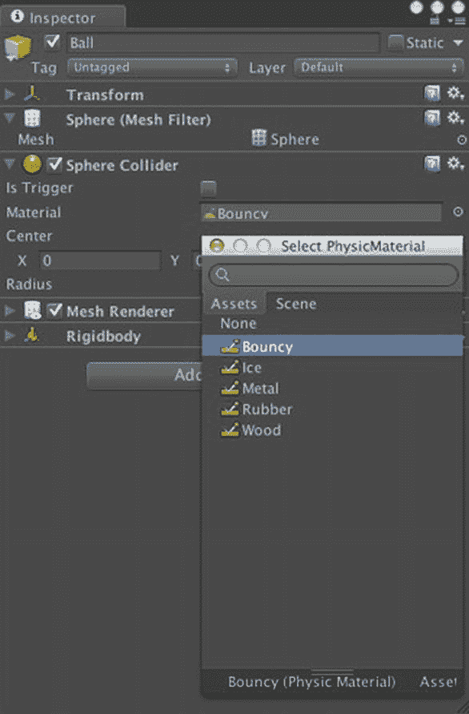

图 6-23. 为`球体`添加`弹性物理材质`

现在，请尝试在`地板`和`球体`上使用不同的`物理材质`。为`球体`选择`弹性物理材质`，为`地板`选择`金属`材质。然后点击`播放`，观看`球体`弹跳、弹跳再弹跳；接着将`球体`的材质切换为`Ice`，观看`球体`砰的一声落地。

除了在`碰撞器`组件中来回切换不同的`物理材质`，你也可以直接调整`物理材质`本身。例如，你可以在`项目视图`中选中`弹性物理材质`，然后在`检视面板`中编辑其属性。但由于这些`物理材质`属于`标准资源`包，如果你重新导入该包（无论是意外还是因升级而有意为之），它们可能会被替换。此外，如果一个`物理材质`被多个`游戏对象`使用，更改其属性将会影响到所有这些`游戏对象`。

这里一个干净且安全的解决方案是，为每一个需要`物理材质`的`游戏对象`创建一个新的。从概念上讲，当某个对象需要一个独特的`材质`时，你同样会期望它有一个独特的`物理材质`。或者换句话说，一个独特的表面应该拥有它自己的`材质`和`物理材质`。例如，`球体`和`地板`应各自拥有自己的`物理材质`，而所有的保龄球瓶（将在下一章中创建）则应共享同一个`物理材质`。

## 创建新的`物理材质`

在创建新的`物理材质`之前，出于组织目的，你应该创建一个文件夹来存放它们。在`项目视图`的左侧面板中选择顶层`Assets`文件夹，然后使用`项目视图`中的`创建`菜单，创建一个新文件夹并将其命名为“Physics”（这个名字比“PhysicMaterials”更短，拼写也更不奇怪）。

你可以使用`项目视图`中的`创建`菜单创建一个全新的`物理材质`，然后在`检视面板`中填充新`物理材质`的所有属性。但是，你可以通过从`标准资源`中复制一个`物理材质`来节省一些工作量，最好复制一个与你想要的效果接近的材质。鉴于`地板`采用的是木质`材质`，从`标准资源`中的`木材物理材质`入手会比较方便。在`项目视图`中选中`木材物理材质`，然后从`编辑`菜单中调用`复制`命令（或使用键盘快捷键`Command+D`）来复制一份。

将复制的`木材物理材质`拖放到`项目视图`中新创建的`Physics`文件夹中，并将其重命名为“Floor”，因为你将把它应用于你的`地板`游戏对象。然后，再复制一份`Floor 物理材质`，并将其命名为`Ball`（图 6-24），因为你将把它应用于你的`球体`游戏对象。

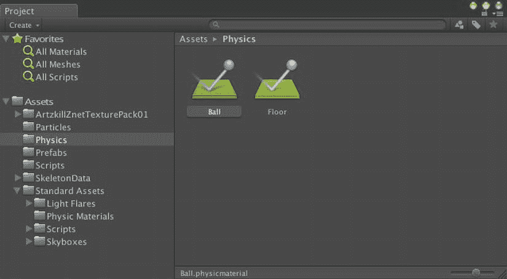

图 6-24. 自定义`物理材质`

现在，`地板`和`球体`各有了一份`物理材质`。要将这些`物理材质`用于它们对应的`游戏对象`，请将`Floor 物理材质`拖放到`层级视图`中的`地板`游戏对象上，并将`Ball 物理材质`拖放到`球体`游戏对象上（你可能需要检查`检视面板`中两个`游戏对象`，以确认`物理材质`已出现在`碰撞器`的`材质`字段中）。现在，你可以开始调整`物理材质`的属性了。

正如预期的那样，`木材物理材质`的值已经适合木地板，所以你可以保持原样。但你想调整`球体物理材质`，因此选中`Ball 物理材质`，并按照图 6-25 所示设置其值。

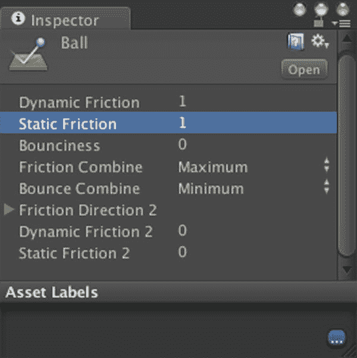

图 6-25. `球体物理材质`的调整后数值

`球体`不应该在`地板`上弹跳（或者在你后续添加保龄球瓶时，也不应弹离它们），所以将`弹性`值设置为 0，并将`弹力组合`设置为`最小值`，这将确保`球体`无论与什么碰撞都完全不会弹跳。然后，将`动态摩擦力`和`静摩擦力`值设置为 1，并将`摩擦力组合`设置为`最大值`，这样`球体`在静止或滚动时始终具有最大摩擦力。最大的摩擦力值确保了`球体`滚动而非滑动。

现在，当你点击`播放`时，`球体`应该会直接落在`地板`上，然后停止，不再弹跳。

### 让它滚动起来

为了让球滚动起来，你需要为游戏添加一些控制（实际上，这样它才能成为一款游戏）。原版街机游戏`HyperBowl`是由一个真实保龄球控制的，该球充当一个大轨迹球。旋转这个球会使得游戏中的球产生旋转（这导致在尝试在旧金山的山坡上打保龄球时，玩家的身体会产生滑稽的动作）。


当然，建立一个空气支撑的保龄球外设超出了本书的范围，但 PC 版的`HyperBowl`提供了基于鼠标的控制方式：推动鼠标会向该方向给球施加一个旋转力。只需一个脚本就能相当直接地实现这种控制。

创建脚本

在项目视图中选择`Scripts`文件夹，使用项目视图左上角的创建按钮新建一个 JavaScript 脚本，并将其命名为`FuguForce`，因为您将用它向球施加一个力（我很想为了寿司的寓意把它命名为`FuguRoll`，但我不希望名字暗示我们正在施加一个力矩，即旋转力而非线性力）。然后将`FuguForce`脚本拖拽到层级视图中的球（`Ball`）上，这样一旦您向脚本中添加一些代码，就可以准备测试了。

更新：收集输入

试图通过计算旋转和平移（位置变化）来模拟球的滚动会非常复杂，这涉及到与地板和球瓶的碰撞检测及响应，还要考虑重力、摩擦力和反弹……所有物理引擎已经完成的计算。不让 Unity 物理系统来处理这方面的工作将是一种浪费。

因为球已经有一个刚体组件（`Rigidbody Component`），它已经是一个受重力等力影响、并会响应碰撞（包括与地板的碰撞）的物理对象。所以，滚动球所需要的就是一个推力。推力的大小取决于输入，在我们的设计中，输入就是鼠标的移动。

**注意**  原始的、非 Unity 版本的`HyperBowl`向保龄球施加了一个力矩（旋转力），使其旋转。Unity 确实有一个用于向刚体施加力矩的脚本函数`Rigidbody.AddTorque`，但我发现，在 Unity 中通过使用`Rigidbody.AddForce`施加线性力来滚动球效果更好。

鼠标移动以及一般的输入，可以在每一帧进行检查，因此输入收集代码和相应推力的计算应该放在脚本的`Update`回调函数中，如列表 6-1 所示。将该列表中的代码复制到`FuguForce`脚本中。

列表 6-1.`FuguForce.js`中的`Update`回调函数

```
#pragma strict
var mousepowerx:float = 1.0;
var mousepowery:float = 1.0;

private var forcex:float=0.0;
private var forcey:float=0.0;

function Update() {
        forcex = mousepowerx*Input.GetAxis("Mouse X")/Time.deltaTime;
        forcey = mousepowery*Input.GetAxis("Mouse Y")/Time.deltaTime;
}
```

脚本以变量`mousepowerx`和`mousepowery`开始，用于缩放施加到球上的力。`mousepowerx`影响左右移动鼠标所产生的力，而`mousepowery`影响前后移动鼠标所产生的力。这些变量是公开的，因此可以在检查器视图（`Inspector View`）中调整它们。

最终计算出的力存储在私有变量`forcex`和`forcey`中，它们也分别对应于左右和前后方向的鼠标移动。

**提示**  始终在变量声明中指定初始值是一个好习惯。这会使代码的含义更清晰，并避免因对初始值的错误假设而导致错误（C 和 C++程序员尤其知道要警惕未初始化变量带来的神秘错误）。

`Update`回调函数就是根据`mousepowerx`、`mousepowery`和鼠标移动来计算`forcex`和`forcey`的地方。在 Unity 中，使用`Input`类来查询输入。例如，可以通过检查静态变量`Input.mousePosition`来获取鼠标位置，因此鼠标移动可以通过在每次`Update`调用中保存鼠标位置，并将当前位置与上一帧保存的位置进行比较来确定。

但是，更高级的`Input.GetAxis`函数已经完成了这项工作。`Input.GetAxis`根据传递给函数的参数，为鼠标、摇杆或键盘的左右或前后移动返回一个从-1 到 1 的值。

在`Update`回调函数中，调用了`Input.GetAxis("Mouse X")`来获取上一帧发生的左右鼠标移动，并调用了`Input.GetAxis("Mouse Y")`来获取前后移动。在考虑了帧期间经过的时间（我们的老朋友`Time.deltaTime`）并乘以缩放因子`mousepowerx`和`mousepowery`之后，结果分别赋值给了变量`forcex`和`forcey`。

将这段代码放入`FuguForce`脚本后，您可以在球的检查器视图中看到公开的`mousepower`变量（图 6-26）。

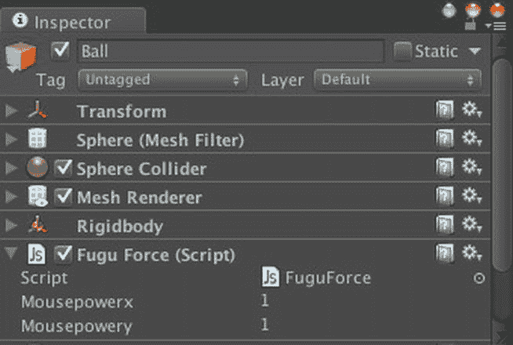

图 6-26. 带有`FuguForce.js`脚本的球

当您点击播放时，您仍然无法控制球，因为您还没有添加实际的推球代码。但是，如果您在检查器视图菜单中选择调试选项，私有变量`forcex`和`forcey`将会显示出来，并且当您移动鼠标时，您可以看到它们的变化。

`FixedUpdate`：使用力

影响物理的函数，包括`Rigidbody.AddForce`，应该在`FixedUpdate`回调函数中调用。与每一帧调用一次且可能花费任意时间的`Update`回调函数不同，`FixedUpdate`回调函数在每个固定的时间步长过去后执行。为了获得良好效果，物理模拟需要以固定间隔运行，通常比`Update`更频繁。物理计算之间的可变间隔会导致行为变化以及物理更新之间的长时间延迟。在 Unity 中，这个时间步长在时间管理器（`TimeManager`）中设置（图 6-27），该管理器位于编辑菜单的项目设置子菜单中。

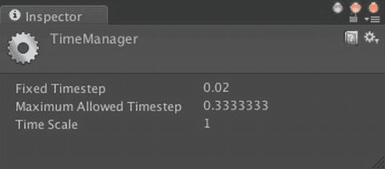

图 6-27. 时间管理器

`FixedUpdate`回调函数在这些物理更新间隔被调用（我把`FixedUpdate`视为`PhysicsUpdate`，把固定时间步长视为物理时间步长），因此这是任何对物理模拟的更改（特别是对刚体的任何操作）应该发生的地方。

由于推动球的力已经在`Update`回调函数中计算好了，`FixedUpdate`回调函数只需要在球的刚体组件上调用`Rigidbody.AddForce`来应用这些值即可（列表 6-2）。

列表 6-2.`FuguForce.js`中的`FixedUpdate`回调函数

```
function FixedUpdate() {
        rigidbody.AddForce(forcex,0,forcey);
}
```

在变量`rigidbody`上调用了刚体函数`AddForce`，`rigidbody`是一个组件变量，它始终引用此游戏对象的刚体组件。`GameObject`类也有一个`rigidbody`变量，因此引用`gameObject.rigidbody`是等效的。

传递给`RigidBody.AddForce`的三个值分别是力的 x、y 和 z 分量，因为力有方向和大小，所以它是一个向量。力的方向是世界空间中的，从本游戏主摄像机的视角来看，x 是左右方向，z 是前后方向。因此，`forcex`被传递给 x 参数，`forcey`被传递给 z 参数。这些控制不会上下推动球，只会向前和侧向推动，所以 y 参数传递了 0。


**注意**  请务必查阅`RigidBody.AddForce`的脚本参考页面。这是一个重载函数，其中一种变体将力作为`Vector3`接收，而非三个独立的数字。此外，这两种变体都接受一个可选参数，可以指定应用于`Rigidbody`的值是除力以外的量——可以是加速度、冲量或速度的瞬时变化。

现在，当你点击“播放”并移动鼠标时，球会朝该方向滚动。尝试在“检查器视图”中更改`mousepowerx`和`mousepowery`的值，以获得你想要的滚动响应速度。

### 它在滚动吗？

你可能会注意到，如果在球下落时移动鼠标，实际上可以在球还在空中时就推动它，这看起来不太对劲。移动鼠标只应在球处于某个表面上时才能使其滚动。

幸运的是，Unity 提供了回调函数，每个都以`OnCollision`为前缀，这些函数在`GameObject`与另一个`GameObject`发生碰撞以及接触停止时被调用。每个回调函数都接受一个参数，即一个`Collision`对象，其中包含有关碰撞的信息，例如对涉及到的另一个`GameObject`的引用。

`FuguForce`脚本可以通过检查碰撞的`GameObject`的名称是否为“Floor”（使用`GameObject name`变量）来判断它是否是地板。但通常来说，更好的做法是，通过标签来查找和识别`GameObject`（使用`GameObject tag`变量），这样效率更高。如果你选择地板`GameObject`并在“检查器视图”中检查它，可以在左上角看到它带有默认标签“Untagged”。要将`GameObject`的标签更改为“Floor”，首先必须通过从`GameObject`的标签菜单中选择“添加标签”来创建“Floor”标签（图 6-28）。

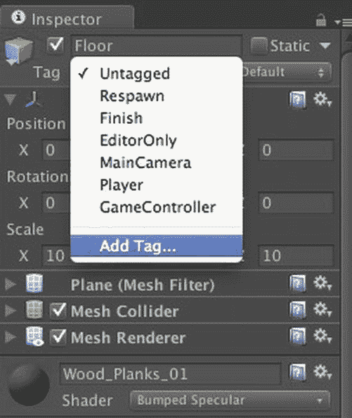

图 6-28. 添加新标签

这会调出“检查器视图”中的标签管理器。标签管理器用于管理标签和层。标签用于标识`GameObject`，因此你几乎可以创建无限数量的标签。而层用于标记`GameObject`组，最多可以定义 32 个层，因为它们被实现为 32 位数字中的位。这使得指定层的组合变得方便，例如在摄像机和灯光的剔除遮罩属性中。

要创建一个名为“Floor”的新标签，只需在标签管理器的第一个空标签字段中输入“Floor”（图 6-29）。然后再次在“层级视图”中选择“Floor”`GameObject`，再次点击“检查器视图”中的“Tag”菜单，新的“Floor”标签即可供选择。

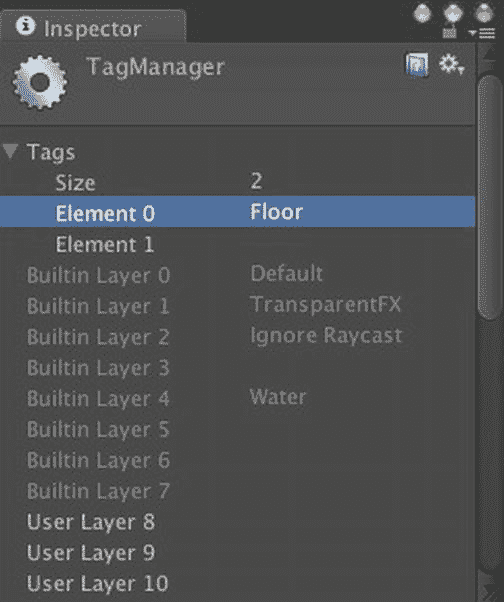

图 6-29. 标签管理器

现在，可以在`FuguForce`脚本中添加碰撞回调，以检查球是否在地板上（清单 6-3）。

清单 6-3.  FuguForce.js 中的碰撞回调

```
private var isRolling:boolean=false;
private var floorTag:String = "Floor";

function OnCollisionEnter(collider:Collision) {
        if (collider.gameObject.tag == floorTag) {
                isRolling = true;
        }
}

function OnCollisionStay(collider:Collision) {
        if (collider.gameObject.tag == floorTag) {
                isRolling = true;
        }
}

function OnCollisionExit(collider:Collision) {
        if (collider.gameObject.tag == floorTag) {
                isRolling = false;
        }
}
```

添加了两个私有变量。第一个变量`isRolling`在球位于地板上时为 true。第二个变量`floorTag`是分配给地板的标签。

**提示**  为标签定义一个变量可以避免在多个位置拼写该标签（并避免难以调试的拼写错误），并且如果稍后更改了标签名称，只需更新该变量即可。三个碰撞回调中的每一个都会通过检查碰撞`GameObject`的标签来判断球与之碰撞的`GameObject`是否是地板。如果该`GameObject`不是地板，则碰撞回调不执行任何操作。

当球与另一个`GameObject`碰撞时，Unity 会调用`OnCollisionEnter`回调，因此该函数将`isRolling`设置为 true。相反，当球与`GameObject`之间的接触停止时，Unity 会调用`OnCollisionExit`，在这种情况下，`isRolling`被设置为 false。

同时，当球与`GameObject`保持接触时，会调用`OnCollisionStay`，因此它也能确保`isRolling`保持为 true。现在，在向球施加推力之前，`FixedUpdate`回调可以检查`isRolling`是否为 true，这表明球在地板上（清单 6-4）。

清单 6-4.  在 FuguForce.js 的 `FixedUpdate` 中添加滚动检查

```
function FixedUpdate() {
        if (isRolling) {
                rigidbody.AddForce(forcex,0,forcey);
        }
}
```

### 限制速度

最后，作为一点优化，球控制脚本可以在推动球之前检查球的速度，避免由于现有速度、帧率和输入值的某种异常组合而导致球最终滚动得远比预期快得多的情况（清单 6-5）。

清单 6-5.  在 FuguForce.js 的 `FixedUpdate` 中添加速度检查

```
var maxVelocitySquared:float=400.0;

function FixedUpdate() {
        if (isRolling && rigidbody.velocity.sqrMagnitude<maxVelocitySquared) {
                rigidbody.AddForce(forcex,0,forcey);
        }
}
```

这是一个非常简单的更改，只需要添加一个变量`maxVelocitySquared`来保存我们的最大速度值，实际上是最大速度值的平方。然后`FixedUpdate`除了检查球是否在地板上之外，还会检查球速度的平方大小是否低于`maxVelocitySquared`。换句话说，`FixedUpdate`检查的是球速度的平方。

`Rigidbody`的`velocity`变量是一个`Vector3`，它又有一个`magnitude`变量，可以给出`Vector3`的长度。但是求`Vector3`的长度涉及平方根运算（还记得高中数学中的勾股定理吗？），而平方根需要更多的计算。因此，无论何时需要比较两个`Vector3`的长度，都应该比较它们长度的平方。

### 完整脚本

清单 6-6 展示了到目前为止编写的球控制器脚本`FuguForce.js`的完整清单，可在`http://learnunity4.com/`上的第 6 章项目中找到。

清单 6-6.  FuguForce.js 的完整清单

```
#pragma strict

var mousepowerx:float = 1.0;
var mousepowery:float = 1.0;

var maxvelocity:float=400.0;

private var forcey:float=0.0;
private var forcex:float=0.0;

private var isRolling:boolean=false;
private var floorTag:String = "Floor";

var maxVelocitySquared:float=400.0;

function Update() {
        forcex = mousepowerx*Input.GetAxis("Mouse X")/Time.deltaTime;
        forcey = mousepowery*Input.GetAxis("Mouse Y")/Time.deltaTime;
}

function FixedUpdate() {
        if (isRolling && rigidbody.velocity.sqrMagnitude<maxVelocitySquared) {
                rigidbody.AddForce(forcex,0,forcey);
        }
}
function OnCollisionEnter(collider:Collision) {
        if (collider.gameObject.tag == floorTag) {
                isRolling = true;
        }
}
```


```
function OnCollisionStay(collider:Collision) {  
    if (collider.gameObject.tag == floorTag) {  
        isRolling = true;  
    }  
}  

function OnCollisionExit(collider:Collision) {  
    if (collider.gameObject.tag == floorTag) {  
        isRolling = false;  
    }  
}  
```

