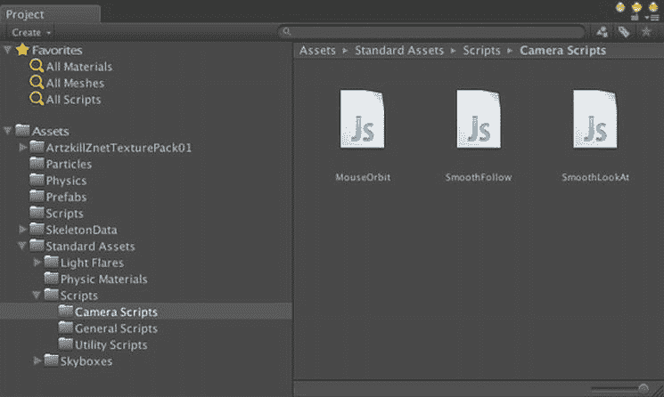
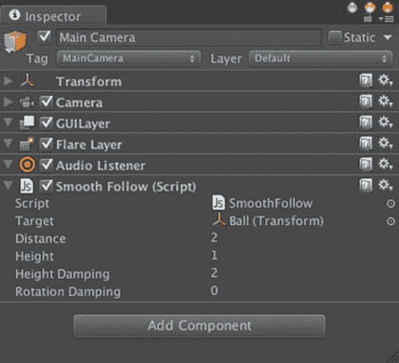

# 成为球

球的控制效果目前相当不错，但当球滚向远方时，主摄像机却静止不动。这是一个明显的缺陷，因为任何像样的 3D 游戏都需要某种形式的摄像机移动。在《超级保龄球》中，主摄像机在你滚动时会跟随球，但始终朝向同一方向（朝向球瓶）。实际上，Unity 在标准资源中已经提供了摄像机跟随脚本。该脚本包已在第 3 章中从标准资源导入，以获取 `MouseOrbit` 脚本。跟随脚本也位于脚本包的 Camera Scripts 文件夹中，名为 `SmoothFollow`（图 6-30）。

图 6-30. 标准资源中的摄像机脚本

将 `SmoothFollow` 脚本从项目视图拖拽到层级视图中的主摄像机上。然后在层级视图中选择主摄像机，这样你就可以在检视视图中编辑 `SmoothFollow` 脚本的属性（图 6-31）。

图 6-31. 带有 SmoothFollow 脚本的主摄像机检视视图

主摄像机应跟随球，所以将层级视图中的 Ball 游戏对象拖拽到检视视图中 `SmoothFollow` 脚本的 Target 字段。

至于其他 `SmoothFollow` 属性，设置 Distance 为 2，这将使主摄像机保持在球后方 2 米处跟随；设置 Height 为 1，使摄像机保持在球上方 1 米处，而不是紧跟在它后面。Height Damping 设置为 2，允许主摄像机在跟随球的高度时有轻微的上下弹动；Rotation Damping 设置为 0，确保主摄像机始终保持在球的后方，不会左右摆动。

现在点击播放，当你滚动时，你就在滚动并跟随着！

