# 这项附加功能需要新建几个脚本，你可以在 `http://learnunity4.com/` 上找到本章对应的 Unity 项目。不过，用于保龄球瓶的球瓶模型、球瓶碰撞音效和球滚动音效均从资源商店免费获取，并未包含在在线项目中。

### 加长球道

在向保龄球场景（该场景应已在 Unity 编辑器中打开，保持上一章的状态）添加保龄球瓶之前，我们需要更大的滚动空间。在层级视图中选择 `Floor`，然后在检视面板（图 7-1）中将 X、Y、Z 的 `Scale` 均设为 10。

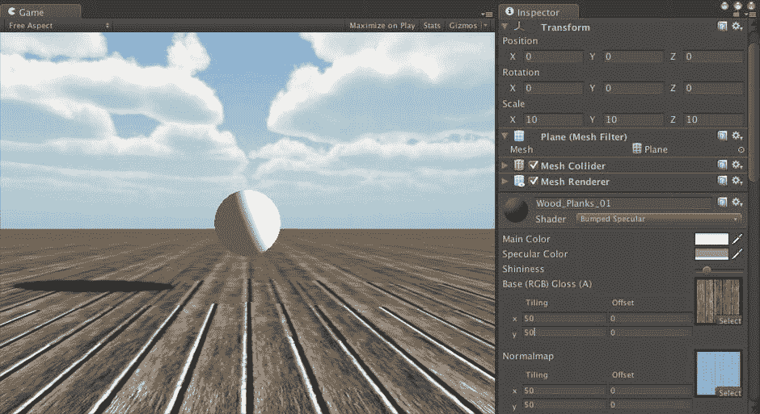

图 7-1. 放大后的 `Floor` 游戏对象，缩放系数为 10

**提示** 出于性能考虑，最好避免在变换组件中直接修改缩放（对于导入的模型，应在导入设置中修改缩放）。如果必须修改缩放，请确保沿三个轴均匀缩放。

现在 `Floor` 变大了十倍（高度除外，因为平面本身没有高度）。但 `Floor` 上的纹理也被拉伸了，导致木板显得特别宽。为抵消这一效果，你需要将 `Floor` 的主纹理和法线纹理的平铺系数也乘以 10，这样每个方向的新平铺系数变为 50，木板纹理就能恢复原状。

### 制作保龄球瓶

现在有了滚动空间，可以添加球瓶了。在没有现成保龄球瓶模型的情况下，你可以用胶囊体基本几何体制作一个简化版的球瓶。

从层级视图的创建菜单中选择胶囊体（图 7-2）。胶囊体与其他基本几何体一样，也可以通过菜单栏的 GameObject 菜单创建。

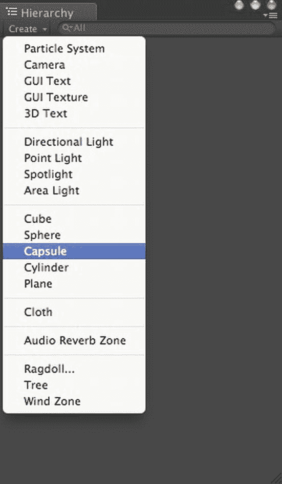

图 7-2. 创建胶囊体

将生成的游戏对象命名为 `Pin`。要创建十个球瓶，你可以将 `Pin` 复制九次，但就像在立方体场景中克隆立方体那样，更好的做法是先制作一个预制件。这样，对单个球瓶所做的任何修改都可以应用到全部十个球瓶上。

现在，将 `Pin` 拖拽到项目视图的预制件文件夹中，以创建预制件（图 7-3）。

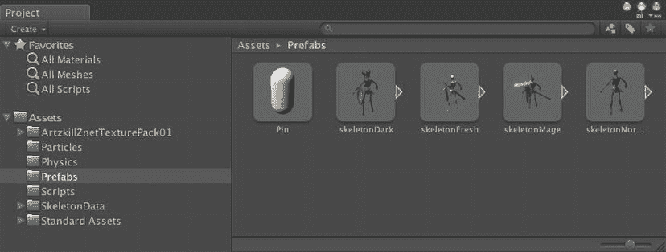

图 7-3. 项目视图中的 `Pin` 预制件

但如果将九个预制件副本拖入场景并手动放置，会既繁琐又容易出错。这种任务非常适合用脚本来实现！因此，我们计划使用脚本和 `Pin` 预制件在游戏中生成所有球瓶。这种情况下，场景中的 `Pin` 游戏对象就是多余的，所以请将其删除（在层级视图中选择该游戏对象，然后通过编辑菜单的删除命令或快捷键 Command+Delete 执行删除）。

### 制作游戏控制器

除了生成球瓶，保龄球游戏肯定还需要更多脚本来实现游戏规则和游戏流程。事实上，任何不太简单的游戏都可以从单一的游戏控制器脚本中受益，该脚本负责实现游戏的整体流程。因此，我们计划将球瓶创建作为保龄球游戏控制器的第一个动作。

### 创建脚本

在项目视图中新建一个 JavaScript，将其放入 Scripts 文件夹，并命名为 `FuguBowl`（我们将遵循惯例：用游戏本身的名字来命名游戏控制器脚本）。然后添加代码清单 7-1 中的代码，其中包含几个变量、一个 `CreatePins` 函数，以及一个调用 `CreatePins` 函数的 `Awake` 回调。

代码清单 7-1 FuguBowl.js 中的球瓶实例化代码

```
#pragma strict

var pin:GameObject; // 要实例化的球瓶预制件
var pinPos:Vector3 = Vector3(0,1,20); // 球瓶架的位置

var pinDistance = 1.5; // 球瓶之间的初始距离
var pinRows = 4; // 球排行数

private var pins:Array;

function Awake () {
        CreatePins();
}

function CreatePins() {
        pins = new Array();
        var offset = Vector3.zero;
        for (var row=0; row<pinRows; ++row) {
                offset.z+=pinDistance;
                offset.x=-pinDistance*row/2;
                for (var n=0; n<=row; ++n) {
                         pins.push(Instantiate(pin, pinPos+offset, Quaternion.identity));
                         offset.x+=pinDistance;
                }

}
}
```

`CreatePins` 函数首先创建一个 `Array`，它类似于用方括号表示的内置数组，但大小可调，因此可以随着元素的添加而增长，随着元素的移除而收缩。然后函数循环遍历指定的行数，并在每一行中实例化数量递增的球瓶：第一行有一个，第二行有两个，依此类推。因此，当有四行时，最终你会得到如图所示的十个球瓶三角形排列！

#### 实例化球瓶

`Instantiate` 函数接收一个对象、位置和旋转作为参数，在指定的位置和旋转（在世界空间中，而非局部空间）创建一个相同的对象。`Instantiate` 会复制整个对象层级，因此如果对象是一个带有子游戏对象的游戏对象，那么整个层级都会被复制。如果对象是一个组件，那么该组件的游戏对象以及该游戏对象的所有子对象都会被复制。

如果原始游戏对象已在场景中，则调用 `Instantiate` 类似于选择原始游戏对象并通过编辑菜单的重复命令（或 Command+D）进行复制。如果原始对象是预制件（就像本例这样），则调用 `Instantiate` 类似于将预制件拖入场景以创建新的游戏对象。

位置是一个 `Vector3`，旋转则以 `Quaternion`（四元数）而非欧拉角的形式传入。四元数并不是一种直观的旋转表示方式（四元数是具有三个虚部的复数），但它们比欧拉角有一些优势（例如更自然的插值），因此 Unity 在内部使用它们。在本例中，传入静态变量 `Quaternion.identity` 表示不进行任何旋转（相当于欧拉角旋转为 0,0,0）。

**注意** 四元数也有 x、y、z 值（还有一个 w 值），因此要小心不要将其与欧拉角混淆。特别要注意，`Transform` 组件中的 `rotation` 和 `localRotation` 变量是 `Quaternion` 类型的值。欧拉角则存储在 `eulerAngles` 和 `localEulerAngles` 变量中。

`Instantiate` 是 `Object` 类的静态函数。脚本中对 `Instantiate` 的调用等同于调用 `this.Instantiate`，其中 `this` 是脚本组件。而 `Component` 是 `Object` 的子类，因此编译器知道你在调用 `Object.Instantiate`。`Instantiate` 也是一个重载函数，其中一种变体只接受一个参数：要克隆的对象。新实例化的对象将出现在与原始对象相同的位置并具有相同的旋转。

#### 命名空间

通常，我更倾向于显式调用 `Object.Instantiate`，以表明 `Instantiate` 是 `Object` 类中的静态函数，不需要在 `Object` 的实际实例上调用（如果那样做，它将被称作*实例函数*）。然而，在脚本中写出 `Object.Instantiate` 会导致控制台视图报错：*“Instantiate”不是“Object”的成员*（图 7-4）。

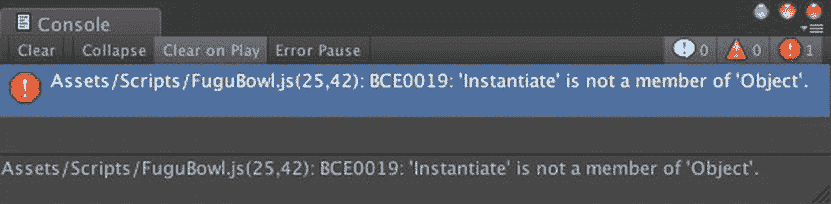

图 7-4. 引用（错误）`Object` 类的编译器错误


问题在于 Mono 中定义了另一个 `Object` 类。该类作为其他 Mono 类的超类，就像 Unity 的 `Object` 类是最多 Unity 类的超类（至少是那些可以存在于场景中的类）。编译器认为你引用的是 Mono 的 `Object` 类，而不是 Unity 的类。这正是我们一直试图通过使用（希望是）唯一前缀来命名类来避免的问题。诸如 `Object` 和 `Button` 这样的有用类名很可能被许多不同的开发者使用。

但是，Unity 和 Mono 版本的 `Object` 如何共存？答案是命名空间。Unity 定义的每个类都在 `UnityEngine` 命名空间中，而 Mono 版本的 `Object` 定义在 `System` 命名空间中。每个类的完全限定名称是类名前加上命名空间名称，因此 Unity 的 `Object` 类实际上是 `UnityEngine.Object`，而 Mono 的 `Object` 是 `System.Object`。对 Unity 类的引用很少包含 `UnityEngine` 前缀，因为 JavaScript 会隐式导入该命名空间（相当于在脚本顶部添加“`import UnityEngine`”）。这意味着编译器在尝试确定类定义位置时，会在 `UnityEngine` 命名空间中查找。不幸的是，JavaScript 也会隐式导入 `System` 命名空间，并且 `Object` 首先解析为 `System.Object`。因此，对 `Object.Instantiate` 的调用会产生与对 `System.Object.Instantiate` 调用相同的错误，因为 `System.Object` 类没有定义 `Instantiate` 函数。但是，对 `UnityEngine.Object.Instantiate` 的调用则完全正常。所以要记住，任何时候对 `Instantiate` 的调用实际上都是对 `UnityEngine.Object.Instantiate` 的调用！

顺便说一句，在 C# 脚本中，`Object` 类不会出现这种混淆，因为它们不会自动导入 `System` 命名空间。而且，虽然 JavaScript 目前还不允许声明新的命名空间，但 C# 从 Unity 4 开始就支持这一功能。

### `Awake`

`Awake` 函数是一个与 `Start` 非常相似的脚本回调。与 `Start` 一样，`Awake` 仅在 GameObject 首次激活时调用一次。与 `Start` 不同，无论脚本是否启用，都会调用 `Awake`。并且 `Awake` 总是在 `Start` 之前调用。

**注意** 最初，`Awake` 在 GameObject 被加载到场景或创建后立即调用，无论 GameObject 是否激活。这种行为与预制件配合不佳，因此才有了当前的行为，即 `Awake` 类似于早期的 `Start` 回调。在这种情况下，你可以使用 `Awake` 或 `Start`，但我喜欢用 `Awake` 进行初始化，用 `Start` 来主动启动脚本的行为。

#### 创建 GameObject

要让游戏控制器脚本运行，它必须附加到场景中的 GameObject 上。虽然 `FuguBowl.js` 可以附加到现有的 GameObject（如主摄像机），但创建一个新的 GameObject 更为干净。这个 GameObject 可以以一种明确指示游戏控制器脚本已附加的方式来命名，并且你不必担心该 GameObject 在用于其他目的时会被停用。按照这个策略，在层级视图中创建一个新的 GameObject，将其命名为 `FuguBowl`（与它将持有的脚本同名），然后将 `FuguBowl` 脚本拖到 FuguBowl GameObject 上（图 7-5）。

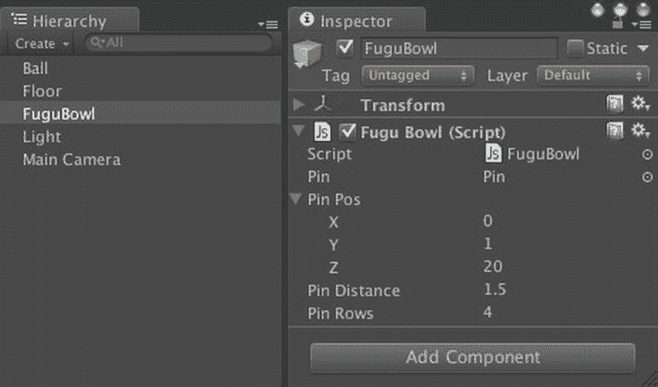

图 7-5. 附加了 `FuguBowl.js` 的游戏控制器 GameObject

`FuguBowl` 脚本的大多数属性可以保留默认值，但你需要将项目视图中的 Pin 预制件拖到 `FuguBowl` 脚本的 Pin 字段中。现在点击播放，所有十个保龄球瓶就会出现（图 7-6）。

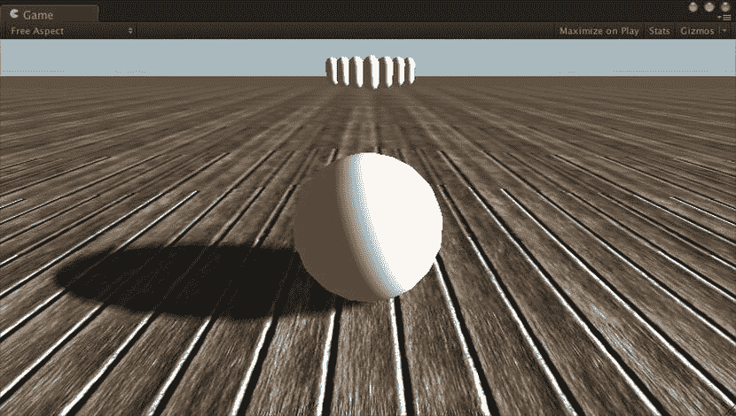

图 7-6. 放置了瓶子的保龄球场景

但是，当你将球投向球瓶时，球只会从它们身上弹开，因为这些球瓶虽然有碰撞器组件，但却是静态的 GameObject。与球一样，每个球瓶也必须拥有刚体组件才能对作用力做出反应。可以通过组件菜单将刚体组件添加到 Pin 预制件上，但这次让我们尝试另一种方法。在项目视图中选择 Pin 预制件，然后在检查器视图中单击“添加组件”按钮。在弹出的菜单中，在“物理”下选择“刚体”（或者你可以在弹出菜单的搜索字段中输入“rigidbody”来找到该选项）。无论你选择哪种方式，现在 Pin 预制件上应该有一个刚体组件（图 7-7）。

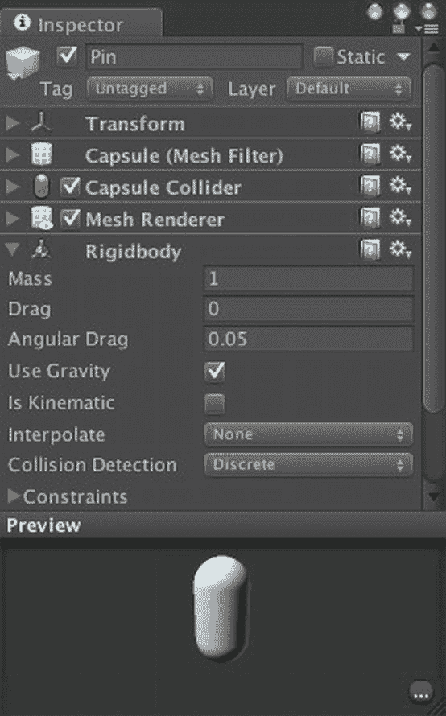

图 7-7. 带有刚体的保龄球瓶预制件

与地板和球的碰撞器组件一样，Pin 预制件应该有自己的物理材质。创建合适物理材质的一个快速方法是复制用于球的物理材质，因此在项目视图中选择“物理”文件夹中的 Ball 物理材质，使用“编辑”菜单或 Command+D 进行复制，并将新的物理材质命名为 `Pin`（图 7-8）。

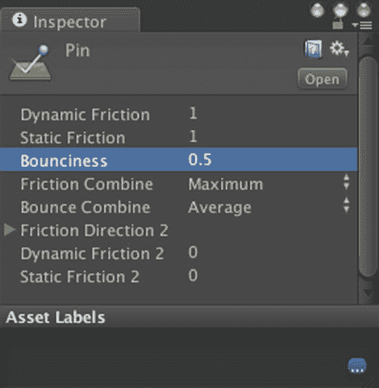

图 7-8. 用于 Pin 预制件的物理材质

由于保龄球瓶应该像球一样滚动良好，将“动态摩擦力”和“静态摩擦力”值保留为 1（以避免滚动时打滑），并将“摩擦力组合”值保留为“最大值”。然而，与球不同的是，保龄球瓶应该具有相当的弹性，因此将“弹性”设置为 0.5，并将“弹性组合”值设置为“平均值”（考虑到它所碰撞对象的弹性）。最后，将 Pin 物理材质分配给 Pin 预制件。在项目视图中选择 Pin 预制件，然后在检查器视图中，单击碰撞器组件“物理材质”字段右侧的圆圈，然后从弹出选择器中选择 Pin 物理材质（图 7-9）。

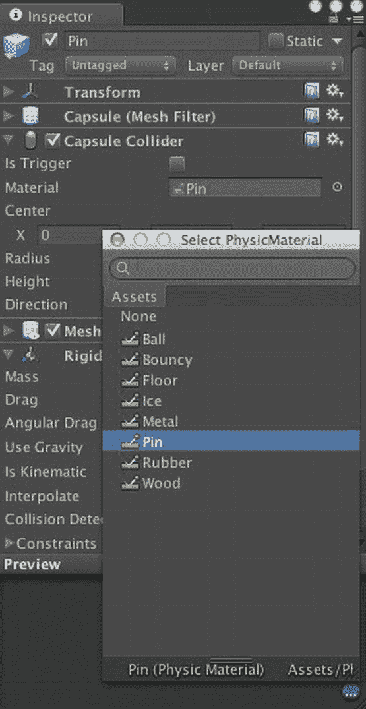

图 7-9. 将 Pin 物理材质分配给 Pin 预制件

现在，当你点击播放并将球滚向球瓶时，它们会被撞倒并四处弹跳滚动，如图 7-10 所示。

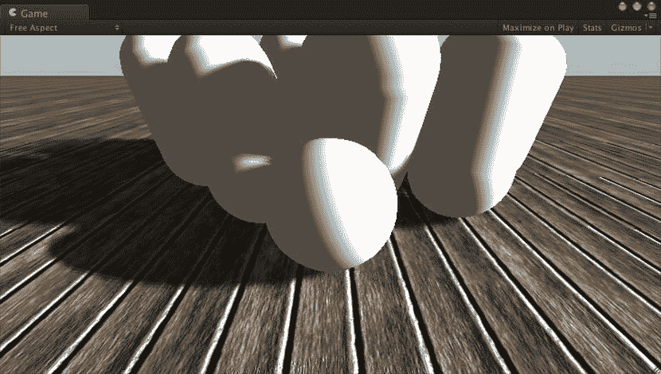

图 7-10. 与每个都带有刚体的球瓶发生碰撞

#### 继续游戏

每次测试滚动都必须停止游戏并再次点击播放，这相当繁琐。而且，当球滚出地板时，你只能眼睁睁看着球无限下落。因此，让我们让球、主摄像机和球瓶在球滚出地板边缘时重置。

##### 使其可重置

首先，你需要一个能将 GameObject 恢复到其初始位置和旋转的脚本（不能忘记旋转——如果一个球瓶被击倒，你需要将其重置为初始直立方向）。创建一个新的 JavaScript，命名为 `FuguReset`，内容如 列表 7-2 所示。

列表 7-2.  在 `FuguReset.js` 中恢复 GameObject 位置

```
#pragma strict

private var startPos:Vector3;
private var startRot:Vector3;

function Awake() {
        // 保存此 GameObject 的初始位置和旋转
        startPos = transform.localPosition;
        startRot = transform.localEulerAngles;
}
```


```csharp
function ResetPosition() {
        // 回到初始位置
        transform.localPosition = startPos;
        transform.localEulerAngles = startRot;
        // 确保停止所有物理运动
        if (rigidbody != null) {
                rigidbody.velocity = Vector3.zero;
                rigidbody.angularVelocity = Vector3.zero;
        }
}
```

`Awake` 函数会将游戏对象的位置和旋转保存到几个变量中，而 `ResetPosition` 函数则会将游戏对象恢复到这些设置。`ResetPosition` 还会检查游戏对象是否拥有 `Rigidbody`。如果有，该函数将阻止其移动或旋转。

`FuguReset` 脚本应附加到每个在重新开始游戏时需要重置位置（可能还有旋转）的游戏对象上。此列表包括球、球瓶和主摄像机。首先，将 `FuguReset` 脚本拖拽到层级视图中的主摄像机和球游戏对象上。然后，在项目视图中选择 Pin 预设体，在检查器视图中点击“添加组件”按钮，添加 `FuguReset` 脚本（图 7-11）。

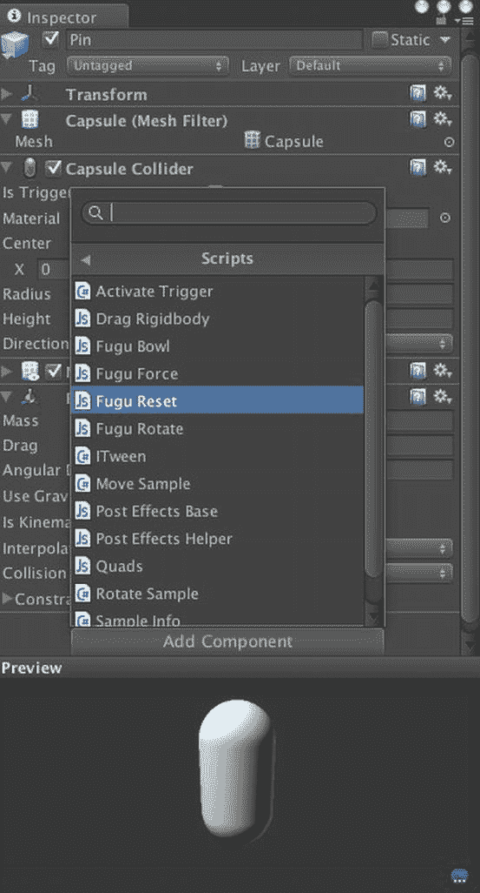

图 7-11。将 FuguReset 脚本附加到 Pin 预设体

现在，球、球瓶和主摄像机在游戏开始时记录其初始位置和旋转，并且你已经准备好了一个 `ResetPosition` 函数，可以调用它来将它们恢复到这些初始位置和旋转。

### 发送消息

通常，从一个游戏对象上附加的脚本调用另一个游戏对象上附加脚本中的函数会有些棘手。这需要在一个游戏对象上调用 `GetComponent` 来获取脚本，然后引用该脚本来调用函数。

但在简单情况下（例如，当你不关心函数的返回值时），Unity 允许你通过使用 `GameObject` 类中的 `SendMessage` 或 `BroadcastMessage` 函数向游戏对象发送消息来调用函数。接收消息（包含要调用的函数名称）的游戏对象会将消息传递给任何可能拥有该函数的附加脚本。

让我们在游戏控制器脚本中添加一些函数，用于发送 `ResetPosition` 消息（清单 7-3）。

清单 7-3. FuguBowl.js 中发送 ResetPosition 消息的函数

```csharp
var ball:GameObject; // 保龄球

function ResetBall() {
        ball.SendMessage("ResetPosition");
}

function ResetPins() {
        for (var pin:GameObject in pins) {
                pin.BroadcastMessage("ResetPosition");
        }
}

function ResetCamera() {
        Camera.main.SendMessage("ResetPosition");
}

function ResetEverything() {
        ResetBall();
        ResetPins();
        ResetCamera();
}
```

附加代码以一个指向球的公共变量开始。脚本已经拥有了一个引用所有保龄球的 `pin` 数组，而主摄像机总是可以通过静态变量 `Camera.main` 引用，因此脚本现在可以访问所有需要重置的游戏对象。`ResetCamera` 和 `ResetBall` 函数调用 `SendMessage` 来向各自的目标游戏对象发送 `ResetPosition` 消息。在这些游戏对象附加的脚本中定义的每个 `ResetPosition` 函数都会被调用。具体来说，由于主摄像机和球附加了 `FuguReset` 脚本，该脚本中的 `ResetPosition` 函数将响应此消息。

`ResetPins` 函数略有不同，它调用 `BroadcastMessage` 来发送 `ResetPosition` 消息。`BroadcastMessage` 的行为与 `SendMessage` 相同，不同之处在于该消息还会传播到原始接收对象的任何子游戏对象。在本章稍后部分，当我们替换一些将其 Rigidbody 附加到子游戏对象的球瓶时，这将非常有用。

`ResetPins` 会在控制台中生成一条关于 *Implicit downcast from ‘Object’ to ‘UnityEngine.GameObject’* 的警告（图 7-12）。

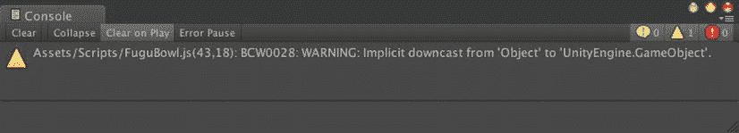

图 7-12。隐式向下转换警告的控制台视图

出现该警告是因为 `Array` 被定义为包含 `Object` 类型元素，但每个元素都被视为 `GameObject`。这看似合理，因为 `GameObject` 是 `Object` 的子类，但就编译器所知，这不一定成立。你可以通过向脚本添加 `#pragma downcast` 来消除此警告，这基本上告诉编译器：“相信我。”

### 检查落沟球

当球滚落地板的边缘时，这基本上是一个落沟球，因为此时已经没有希望到达球瓶了。因此，当这种情况发生时，肯定需要重置游戏。可以通过在每一帧检查球的 y 位置是否低于某个水平高度来实现落沟球检测。这可以通过在 `FuguBowl` 脚本中添加清单 7-4 中的公共变量 `sunkHeight` 和 `Update` 回调来实现。

清单 7-4. FuguBowl.js 中用于检测落沟球的 Update 回调

```csharp
var sunkHeight:float = -10.0; // 我们称之为落沟球的全局 y 位置

function Update() {
        if (ball.transform.position.y<sunkHeight) {
                ResetEverything();
        }
}
```

变量 `sunkHeight` 指定球必须下降到的 y 位置，以触发重置一切。某些情况下 `sunkHeight` 的默认值是低于零的一段距离，这样玩家可以在重置前有时间看到球下落。`Update` 回调在每一帧检查球的 y 位置是否低于 `sunkHeight`。如果是，则会调用 `ResetEverything`，向球、主摄像机和球瓶发送所有 `ResetPosition` 消息。在点击“播放”进行测试之前，你需要通过将层级视图中的球游戏对象拖拽到 `FuguBowl` 脚本的 Ball 字段中来分配脚本中的 `ball` 公共变量（图 7-13）。

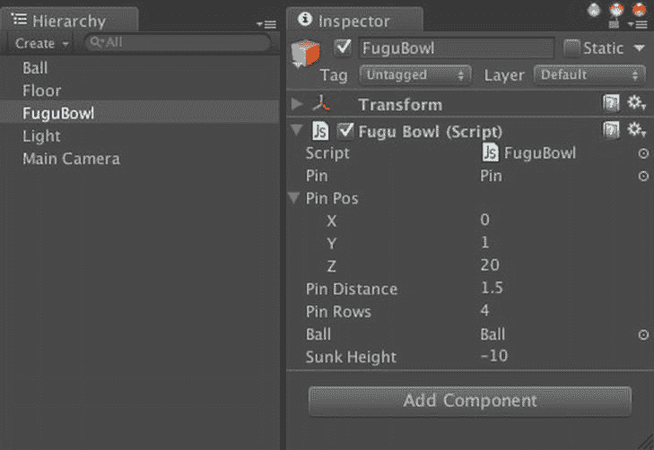

图 7-13。FuguBowl.js 中支持重置球的游戏控制器属性

现在，当球滚落地板边缘时，球、主摄像机和球瓶应该会立即弹回到它们的起始位置。实现连续游戏！

### 完整清单

完整的游戏控制器脚本见清单 7-5。

清单 7-5. FuguBowl.js 的完整清单

```csharp
#pragma strict
#pragma downcast

var pin:GameObject;                   // 要实例化的球瓶预设体
var pinPos:Vector3 = Vector3(0,1,20); // 放置球瓶架的位置
var pinDistance = 1.5;                // 球瓶之间的初始距离
var pinRows = 4;                      // 球排行数

var ball:GameObject;                  // 保龄球
var sunkHeight:float = -10.0;

private var pins:Array;

function Awake () {
        CreatePins();
}
```


### 桶式保龄球

`Capsules`（胶囊体）无论是在外观还是碰撞形状上，都只能充当非常简陋的保龄球瓶。真正的保龄球瓶模型会好得多，但遗憾的是，在资源商店里搜索保龄球瓶一无所获（尽管如果某个供应商决定填补这个空白，情况随时可能改变）。不过，资源商店里还有很多其他模型，只要我们灵活变通，就能找到替代保龄球瓶的方案。事实证明，那里有好几套桶模型资源包，所以我们就用桶来作为备选方案中的保龄球瓶。

#### 挑选桶

在资源商店里搜索"barrel"，会发现几套免费的桶模型资源包（图 7-14）。

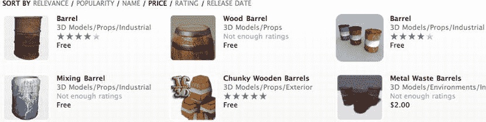

图 7-14。资源商店中的免费桶模型

任何免费资源包都能用，但来自 Universal Image 的 Barrel 资源包（其资源商店图标中显示三个桶）已经预设了预制件，所以我们就下载这个包。从资源商店的描述以及导入包后的项目视图中可以看到，Barrel 资源包组织得井井有条，包含一个名为 Barrel 的文件夹，里面装有 Barrel 预制件和 Barrel 模型（图 7-15）。

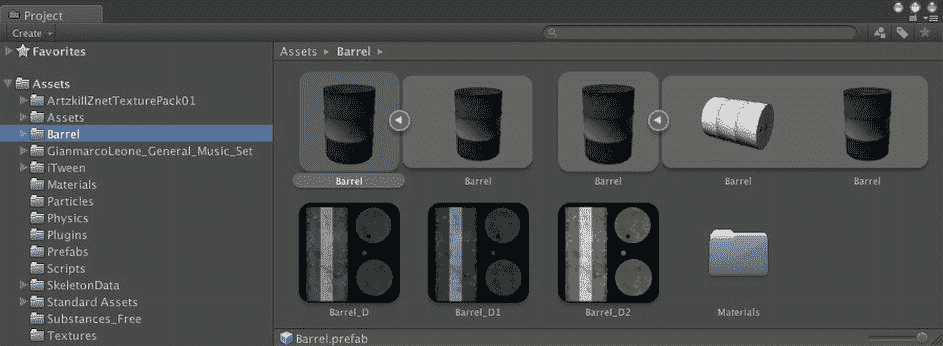

图 7-15。Barrel 资源包的项目视图

这两个资源在项目视图中看起来很相似，但点击预制件时，项目视图底部会显示完整文件名`Barrel.prefab`；而点击 Barrel 模型时，则显示`Barrel.FBX`，表明它是一个导入的 FBX 文件（Autodesk 使用的 3D 格式）。

#### 制作预制件

我们需要一个 Barrel 预制件来替换简单的 Pin 预制件，但应避免修改原始 Barrel 预制件（再次导入 Barrel 资源包会覆盖我们的更改）。要制作自己的 Barrel 预制件副本，选中该预制件，按 Command+D（或从 Edit 菜单中选择 Duplicate），然后将副本拖入 Prefabs 文件夹。接着将其重命名为`BarrelPin`，因为它是一个桶，我们要把它当作保龄球瓶来用（图 7-16）。

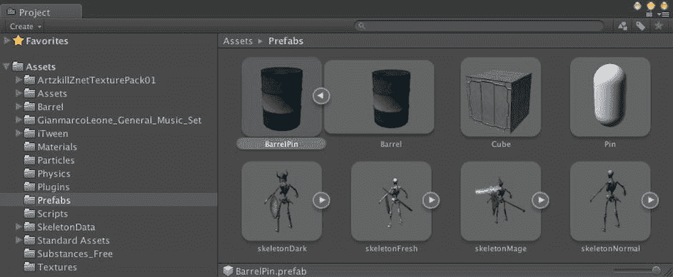

图 7-16。Barrel 预制件的副本

选中`BarrelPin`预制件的子`GameObject`，使其显示在检视视图中。目前存在`MeshFilter`组件和`MeshRenderer`组件，但要将此预制件用作保龄球瓶，它还需要一个`Collider`组件和一个`Rigidbody`组件，这样保龄球瓶（桶）才会受重力影响，并能相互碰撞，以及与球和地板碰撞。该预制件还需要附加一个`FuguReset`脚本，用于处理游戏控制器发送的`ResetPosition`消息。

目前，我们先处理`Rigidbody`组件和`FuguReset`脚本，暂缓添加`Collider`组件，因为匹配桶的形状会有些复杂。选中预制件后，可以从菜单栏的 Component 菜单中选择 Rigidbody，或者点击检视视图底部的 Add Component 按钮，从出现的菜单中选择 Rigidbody（图 7-17）。

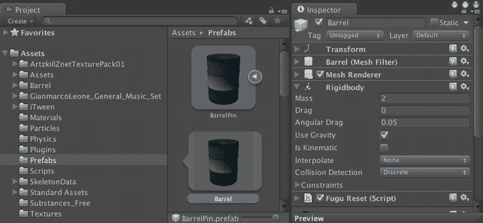

图 7-17。向 Barrel 预制件添加 Rigidbody 和`FuguReset`脚本

在新附加的`Rigidbody`组件中，将 Mass（质量）设置为 2（千克）。对于一个金属桶来说，这相当轻，但如果球不能不太费力地击倒作为保龄球瓶的桶，游戏就不好玩了。在游戏中，趣味性比真实感更重要！

可以通过将`FuguReset`脚本拖入检视视图，或者使用 AddComponent 按钮将其添加到预制件中。

#### 使用预制件

要用`BarrelPin`预制件替换简单的胶囊体型 Pin，在层级视图中选中`FuguBowl` GameObject，使其组件显示在检视视图中，然后将`BarrelPin`预制件拖入`FuguBowl`脚本的 Pin 字段，替换掉最初使用的 Pin 预制件（图 7-18）。现在点击 Play，会出现十个桶，而不是十个胶囊体。但它们会立刻掉穿地板，因为保龄球瓶还没有 Collider 组件！

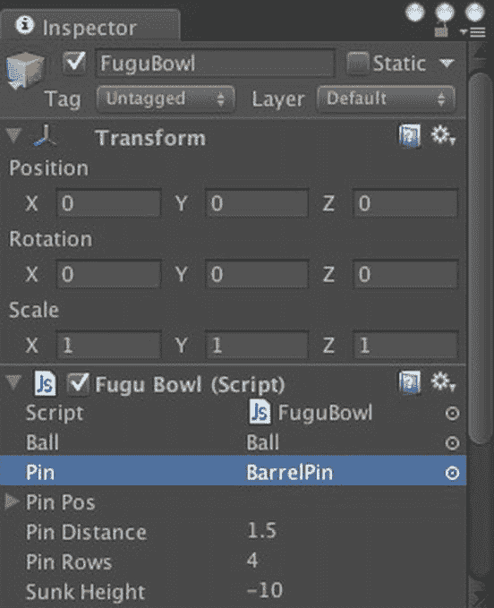

图 7-18。使用`BarrelPin`预制件作为保龄球瓶

#### 添加碰撞体

我们不能再回避了。是时候处理`BarrelPin`的碰撞问题了。为了能在场景视图中直观地看到`BarrelPin`及其碰撞形状，先将`BarrelPin`预制件拖入层级视图，临时将其放置在场景中。放置后，展开`BarrelPin` GameObject 并选中子`Barrel` GameObject，使其显示在检视视图中，按 F 键调用 Frame Selected（框架选中），将`Barrel`居中显示在场景视图中。同时，将查看选项（场景视图左上角的下拉菜单）从 Textured（纹理）切换为 Wireframe（线框），以便更容易看到网格和碰撞体组件的形状。

遗憾的是，Component 菜单中没有列出桶形的原始碰撞体（`CylinderCollider`（圆柱碰撞体）会很完美，但它并不存在）。虽然`MeshCollider`（网格碰撞体）可以贴合桶的形状，但由于性能问题，`MeshCollider`不适用于物理 GameObject。Component 菜单中最接近的形状是`CapsuleCollider`（胶囊碰撞体）。所以，我们先在`Barrel` GameObject 上添加一个 Capsule Collider，看看贴合度如何。

虽然 Unity 在添加`Collider`组件时会尝试将其大小调整为适配 GameObject 的网格，但本例中贴合度并不理想，这主要是因为，从 Transform 组件中的旋转参数可以看出，这个 GameObject 绕其 x 轴旋转了 90 度。如果没有这个旋转，桶会是侧躺的，但这个旋转也影响了 Collider 组件的朝向。为了调整旋转，将 Capsule Collider 的轴切换为 z 轴。之后，将半径设为 2，高度设为 6，就能使`CapsuleCollider`与桶更加匹配（图 7-19）。

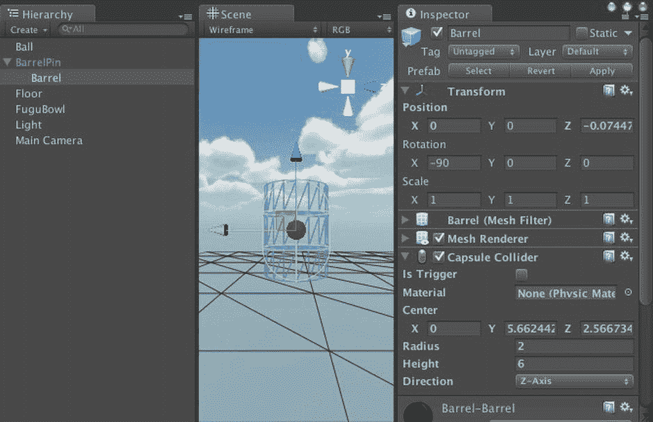

图 7-19。向 Barrel 添加`CapsuleCollider`

胶囊体在侧面与桶的形状匹配得相当好，但在顶部和底部则不然，这些部位应该是平面，而不仅仅是胶囊体的端点。对于平面，`BoxColliders`（盒型碰撞体）显然是更好的选择。因此，在这种情况下，需要将多个碰撞体组件组合成一个*复合碰撞体*。

```js
function CreatePins() {
        pins = new Array();
        var offset = Vector3.zero;
        for (var row=0; row<pinRows; ++row) {
                offset.z+=pinDistance;
                offset.x=-pinDistance*row/2;
                for (var n=0; n<=row; ++n) {
                         pins.push(Instantiate(pin, pinPos+offset, Quaternion.identity));
                         offset.x+=pinDistance;
                }

}
}

function Update() {
        if (ball.transform.position.y<sunkHeight) {
                ResetEverything();
        }
}

function ResetBall() {
        ball.SendMessage("ResetPosition");
}

function ResetPins() {
        for (var pin:GameObject in pins) {
                pin.BroadcastMessage("ResetPosition");
        }
}

function ResetCamera() {
        Camera.main.SendMessage("ResetPosition");
}

function ResetEverything() {
        ResetBall();
        ResetPins();
        ResetCamera();
}
```


### 添加复合碰撞体

Unity 允许一个 `GameObject` 上存在多个 `Collider` 组件，但这些 `Collider` 必须是不同类型的。例如，不能将两个 `BoxCollider` 组件附加到同一个 `GameObject` 上。然而，可以通过将每个原始类型的 `Collider` 组件附加到其自己的 `GameObject` 上，并将所有这些 `GameObject` 设为 `Rigidbody` 的 `GameObject` 的子级，从而将它们组合成一个复合碰撞体。这就是我们为“桶”（Barrel）组合一个 `CapsuleCollider` 组件和一个 `BoxCollider` 组件所采用的方法。为了容纳这两个 `Collider` 组件，在层级视图中为 `Barrel` 创建两个子 `GameObject`，并根据其形状分别命名为 `box` 和 `capsule`（图 7-20）。

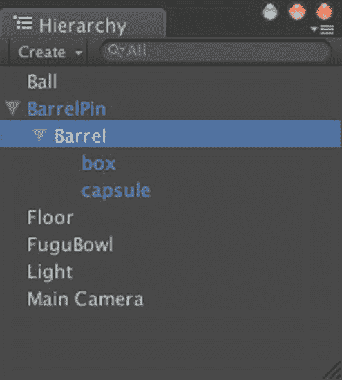

图 7-20。用于复合碰撞体的子 GameObject

与其从头创建一个新的 `CapsuleCollider` 组件，不如利用 `Barrel` GameObject 上已经正确定向和调整大小的现有 `CapsuleCollider` 组件，通过复制该组件来实现。选择 `Barrel` GameObject，在检查器视图中，右键点击 `CapsuleCollider` 组件并选择 `Copy Component`（图 7-21）。

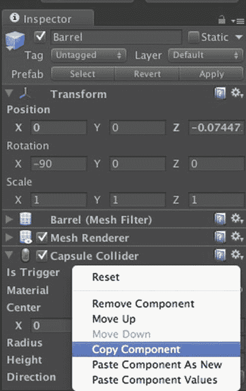

图 7-21。复制一个组件

然后再次选择 `capsule` GameObject，在检查器视图中右键点击其变换（Transform）组件，在弹出菜单中选择 `Paste Component As New`（图 7-22）。现在，`capsule` GameObject 拥有一个与之前为 `Barrel` GameObject 创建的完全相同的 `CapsuleCollider` 组件，因此我们不再需要原来的那个了。选择 `Barrel` GameObject，右键点击刚刚复制过的 `CapsuleCollider` 组件，在弹出菜单中选择 `Remove Component` 来移除该 `CapsuleCollider` 组件。现在，`Barrel` 的层级结构中应该只有一个 `CapsuleCollider` 组件了。

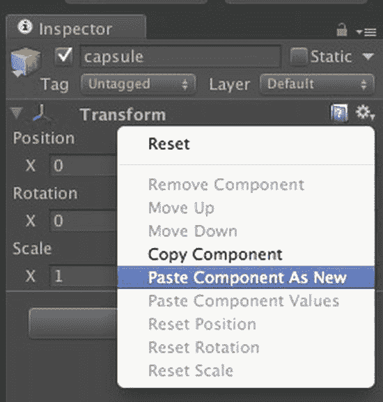

图 7-22。粘贴一个组件

现在将注意力转向 `BoxCollider` 组件。你可以使用组件菜单将其直接添加到 `box` GameObject 上，但如果你将 `BoxCollider` 组件添加到 `Barrel` GameObject 上，Unity 会自动为你将 `BoxCollider` 适配网格（Mesh）的大小。因此，让我们重复之前处理 `CapsuleCollider` 组件的过程，只不过这次换成 `BoxCollider`。选中 `Barrel` GameObject，使用组件菜单或 `AddComponent` 按钮添加一个 `BoxCollider` 组件。在场景视图中，你可以看到 `BoxCollider` 包裹住了 `Barrel`（图 7-23）。

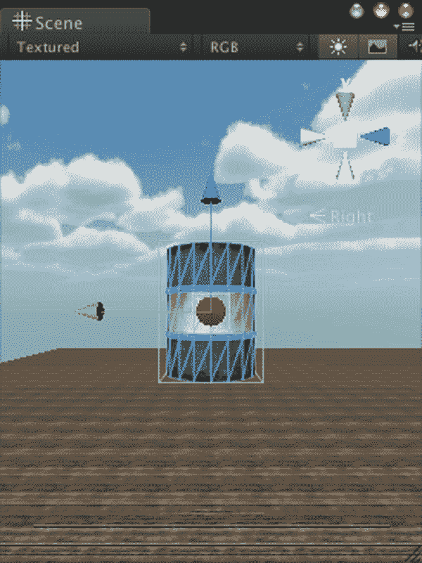

图 7-23。一个围绕 Barrel 自动调整大小的 BoxCollider

`BoxCollider` 从网格的顶部延伸到底部是可以接受的，因为这样可以在两端获得两个平坦的碰撞表面。但 `BoxCollider` 延伸到 Barrel 的弯曲部分之外就不太好了。通过在检查器视图中将其 `Size` 的 `x` 和 `y` 值降低到 `2.5`（请记住，Barrel 是旋转过的）来减小 `BoxCollider` 的宽度。从场景视图的俯视图视角（点击场景万向节（Scene Gizmo）的 `y` 轴），你可以看到 `BoxCollider` 现在正好位于桶的内部（图 7-24）。

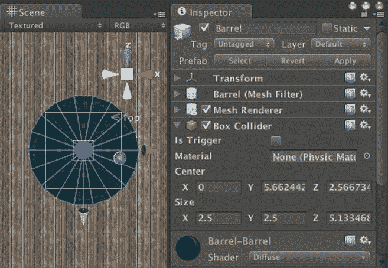

图 7-24。BoxCollider 适配在 Barrel 内部的俯视图

既然已经将 `BoxCollider` 调整到理想大小，重复处理 `CapsuleCollider` 的过程——在检查器视图中右键点击 `BoxCollider`，选择 `Copy Component`，选择 `box` GameObject，在检查器视图中右键点击其变换组件，选择 `Paste Component As New`。并且不要忘记返回 `Barrel` 上的 `BoxCollider` 组件，右键点击它并选择 `Remove Component`。选中 `Barrel`，你应该能在场景视图中看到两个 `Collider` 组件同时显示，它们比单独使用任何一个 `Collider` 组件都能更好地近似 Barrel 的形状（图 7-25）。

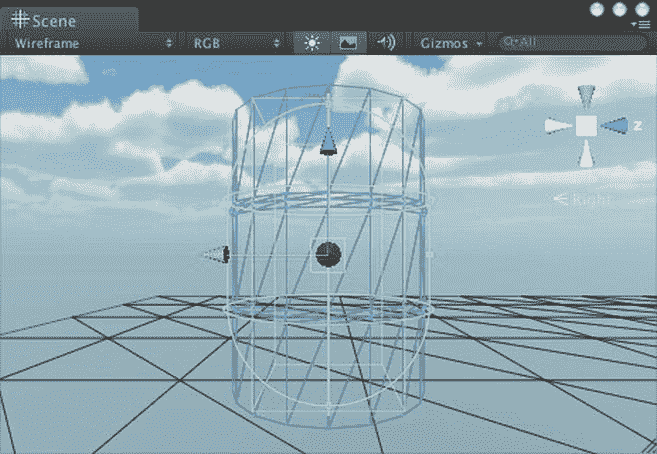

图 7-25。显示的复合碰撞体中的两个碰撞体

#### 更新预制件

最后，既然 Barrel 已经准备就绪，在游戏对象菜单中，选择 `Apply Changes To Prefab`（图 7-26）。

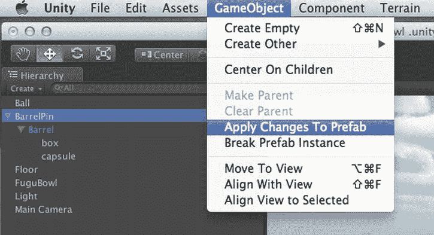

图 7-26。将更改应用到 `BarrelPin` 预制件

**提示** 建议执行 `Save Project` 或 `Save Scene`（这会隐式地执行 `Save Project`），以确保预制件的更改被真正保存。项目更改会在 Unity 正常退出时保存，但如果异常退出，则一切皆有可能。

预制件更新后，场景中不再需要 `Barrel` GameObject，可以将其移除（`Command+Delete` 或从编辑（Edit）菜单中选择 `Delete`）。现在当你点击 `Play` 时，桶不再会从地板掉下去，而且，如图 7-27 所示，当你滚向它们时，它们会被撞倒！

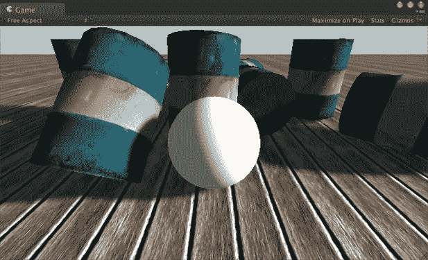

图 7-27。撞击到桶上

#### 复杂碰撞体（HyperBowl）

为 `BarrelPin` 预制件创建的复合碰撞体仍相对简单，仅由两个原始 `Collider` 组件组成。根据所需近似的形状，复合碰撞体可以复杂得多。作为更真实的保龄球瓶的例子，可以看看 HyperBowl（图 7-28）。

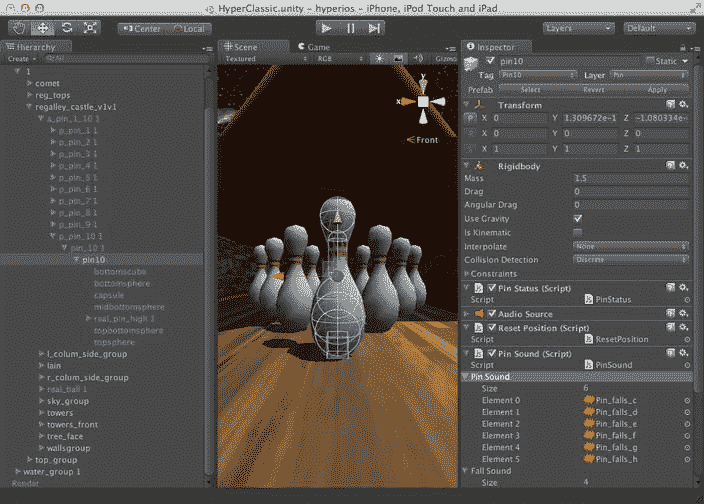

图 7-28。HyperBowl 保龄球瓶的复合碰撞体

HyperBowl 中保龄球瓶的复合碰撞体由六个原始碰撞体组成：一个 `BoxCollider` 用于提供底部平面，一个 `CapsuleCollider` 用于瓶颈，以及四个大小不一的 `SphereCollider` 用于填充瓶身和瓶顶。

### 添加音效

我们的保龄球游戏看起来不错了，但非常安静！你可以添加背景音乐或环境音效，例如舞蹈场景中的循环音乐。但保龄球游戏确实需要基于碰撞的音效，例如球的滚动声和每个球瓶的碰撞声。

#### 获取音效

首先，我们需要找到一些声音文件。再次访问资源商店（Asset Store），导航到声音（Sound）类别，然后进入音效（Sound Effects (FX)）子类别（图 7-29）。

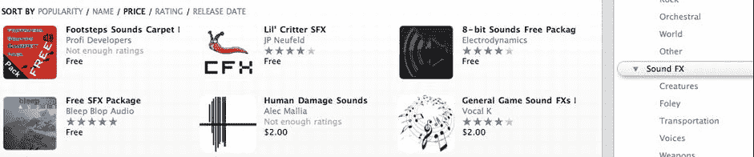

图 7-29。资源商店中免费音效的搜索结果

Bleep Blop Audio 的 Free SFX Package 提供了多种多样的音频剪辑，让我们下载这个资源包。这些文件会出现在项目视图（Project View）中名为 `Assets` 的文件夹里，该文件夹位于你的 `Assets` 文件夹内（向资源商店提交资源包有点复杂，所以这种文件组织方式可能不是故意的）。

#### 添加滚动音效

可以随意选择并播放各种声音，方法是在检查器视图中选中它们并点击 `Play` 按钮。但现在，我们将使用 `Sci-Fi Ambiences` 声音作为球的滚动音效。这个声音作为球滚动音效并不完美，但它在这个资源包中是唯一适合循环播放的 `AudioClip`（图 7-30）。


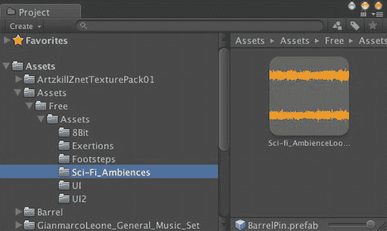

图 7-30. 用于球滚动声音的 `AudioClip`

将 `AudioClip` 拖拽到层级视图中的球 `GameObject` 上，并选中球。检查器视图应显示一个自动创建的新 `AudioSource` 组件，该组件引用了 `AudioClip`（图 7-31）。

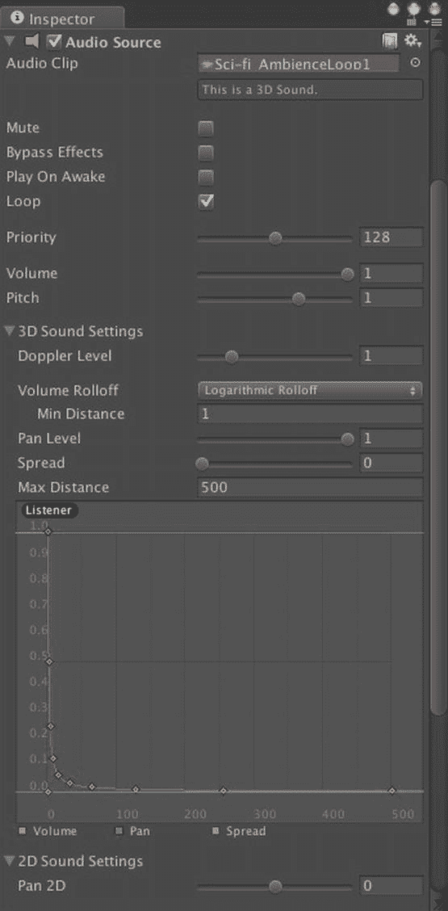

图 7-31. 带有 `AudioSource` 的球的检查器视图

滚动声音将由脚本控制，不会自动播放，因此请确保取消选中 **Play on Awake** 复选框。但是，当滚动声音播放时，它应持续播放直到被告知停止，因此应选中 **Loop** 复选框。

`AudioClip` 是一个 3D 声音，如 `AudioSource` 组件中 `AudioClip` 名称下方所示。这意味着声音会随着 `AudioSource` 组件和 `AudioListener` 组件（附加在主摄像机上）之间的距离而衰减。衰减由 `AudioSource` 组件底部显示的图形指定。您可以通过选择 **Volume Rolloff** 选项并指定 **Min Distance** 来调整衰减，**Min Distance** 指定了衰减开始的距离。如果 `AudioListener` 与 `AudioSource` 的距离小于 **Min Distance**，则声音完全不会衰减。或者，您也可以通过拖动曲线上的手柄来直接操纵衰减曲线。

**提示** 如果您在听到`AudioSource`声音时遇到问题，请尝试从一个较高的 **Min Distance** 开始，以确保你能听到其最大音量，然后根据需要调整 **Min Distance** 和衰减曲线。

播放滚动声音的脚本将附加到球上。创建一个新的 JavaScript 文件，将其放置在 Scripts 文件夹中，并命名为 `FuguBallSound`。然后将清单 7-6 的内容添加到脚本中。

清单 7-6. 用于球滚动声音的 `FuguBallSound.js` 脚本

```
#pragma strict

var minSpeed:float = 1.0;
private var sqrMinSpeed:float = 0;

function Awake() {
        sqrMinSpeed = minSpeed*minSpeed;
}

function OnCollisionStay(collider:Collision) {
        if (collider.gameObject.tag == "Floor") {
                if (rigidbody.velocity.sqrMagnitude>sqrMinSpeed) {
                         if (!audio.isPlaying) {
                                 audio.Play();
                         }
                }  else {
                         if (audio.isPlaying) {
                                 audio.Stop();
                         }
                }
        }
}

function OnCollisionExit(collider:Collision) {
        if (collider.gameObject.tag == "Floor") {
                if (audio.isPlaying) {
                         audio.Stop();
                }
        }
}
```

该脚本与 `FuguForce` 脚本有一些相似之处，因为两个脚本都使用碰撞回调来跟踪球的滚动状态，并通过检查碰撞 `GameObject` 的标签来判断是否为地板。`FuguBallSound` 只使用了 `OnCollision` 回调中的两个：`OnCollisionStay` 和 `OnCollisionExit`。没有实现 `OnCollisionEnter`，因为那会与 `OnCollisionStay` 重复（`FuguForce` 脚本其实也不需要 `OnCollisionEnter`）。脚本的两个碰撞回调都引用了此组件的 `audio` 变量，这等同于此组件所属 `GameObject` 的 `audio` 变量，并引用了附加的 `AudioSource`。

当球在地板上时，`OnCollisionStay` 会检查球是否以高于最低速度的速度移动，该最低速度在公共变量 `minSpeed` 中指定，以便在检查器视图中进行调整。脚本实际上比较的是球速的平方与 `minSpeed` 的平方，以避免平方根计算的计算开销。如果球在地板上且移动得足够快，并且球的 `AudioSource` 尚未播放其 `AudioClip`，则脚本会开始播放 `AudioClip`。如果球的速度降得足够低，滚动声音将停止。

`OnCollisionExit` 的工作更简单，它只需要检查音频是否正在播放，如果是，则停止播放音频。换句话说，如果球因弹起或滚落而失去与地板的接触，则滚动声音停止。

将脚本拖拽到层级视图中的球上（图 7-32），然后单击“播放”进行测试。当球滚动时，滚动声音应该变得可闻，而当球静止时，声音应该停止。

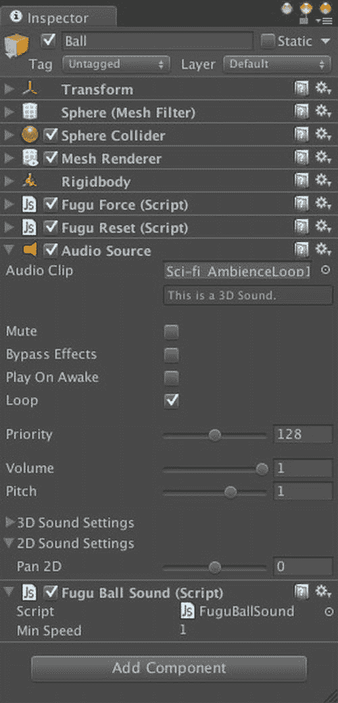

图 7-32. 附加到球 `GameObject` 上的 `FuguBallSound` 脚本

### 添加保龄球瓶碰撞声音

现在准备好处理保龄球瓶的声音了。这里我们使用来自 Free SFX Pack 的 Coin_Pick_Up_03 声音来代替真实的保龄球瓶撞击声（图 7-33）。

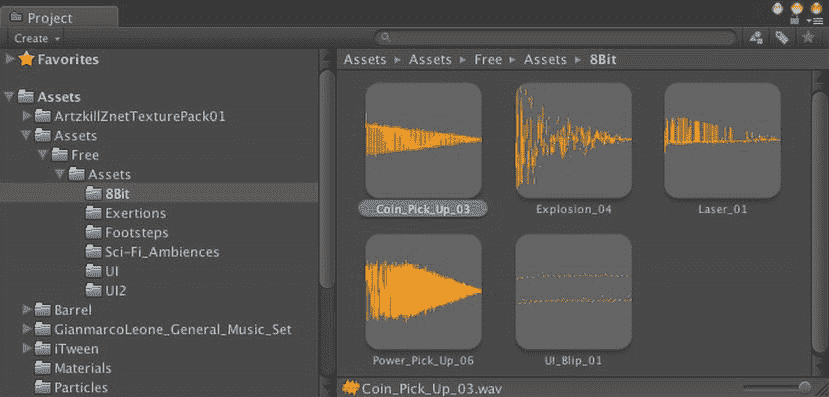

图 7-33. 用于保龄球瓶碰撞声音的 `AudioClip`

在项目视图中选择保龄球瓶预制件，并使用检查器视图底部的 **Add Component** 按钮添加一个 `AudioSource` 组件。然后点击 `AudioSource` 组件中 `AudioClip` 字段右侧，选择 Coin_Pick_Up_03 `AudioClip`。同样，取消选中 **Play on Awake** 复选框，否则每次游戏开始时你都会听到那个声音播放。

类似于球的滚动声音由附加到球上的脚本播放，保龄球瓶的碰撞声音将由附加到每个保龄球瓶上的脚本播放。创建一个新的 JavaScript 文件，将其放置在 Scripts 文件夹中，并命名为 `FuguPinSound`。将清单 7-7 中的代码添加到脚本中。

清单 7-7. 在 `FuguPinSound.js` 中生成保龄球瓶碰撞声音

```
#pragma strict

var minSpeed = 0.01; // 实际上是 minSpeed 的平方

function OnCollisionEnter(collider:Collision) {
        if (collider.relativeVelocity.sqrMagnitude > minSpeed) {
                if (collider.gameObject.tag != "Pin") {
                         audio.Play(); // 碰到了除另一个保龄球瓶以外的任何物体，播放声音
                }  else {
                         // 否则，ID 较低的保龄球瓶负责播放
                         if (gameObject.GetInstanceID() < collider.gameObject.GetInstanceID()) {
                                 audio.Play();
                         }
                }
        }
}
```

这个脚本与 `FuguBallSound` 的不同之处在于，它使用了 `OnCollisionEnter` 回调，而不是 `OnCollisionStay` 或 `OnCollisionExit` 回调。同样，有一个 `minSpeed` 变量与速度的平方值进行比较。但这次的速度是碰撞中的 `relativeVelocity` 变量，因为保龄球瓶和与之碰撞的物体（球或另一个保龄球瓶）可能都在移动。


