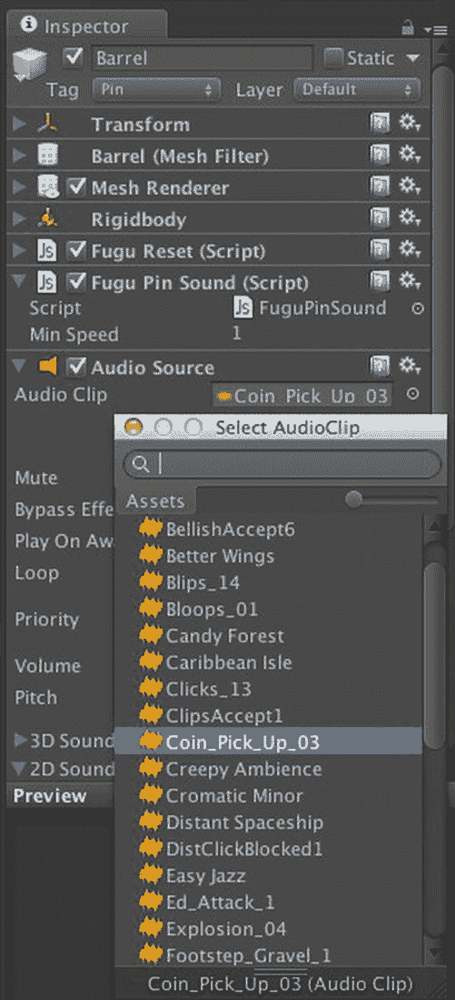

# 这里假设每个`Pin`都有一个名为`Pin`的标签，因此你可以检测`Pin`是否与另一个`Pin`发生碰撞。如果`Pin`没有与其他`Pin`碰撞，那么它一定是被`Ball`击中或者掉落在`Floor`上，此时脚本会播放碰撞音效。如果`Pin`被另一个`Pin`击中，则需要决定哪个`Pin`来播放碰撞音效，否则它们会同时播放声音。这里使用了一个简单的技巧来进行仲裁。Unity 中的每个`Object`都有一个唯一的 ID 编号，可以通过`Object`函数`GetInstanceID`获取。脚本中使用的规则是：ID 编号较低的`Pin`获胜，并播放碰撞音效。

要将`FuguPinSound`脚本附加到`Pin`预制体上，请在项目视图中选中该预制体，然后在检查器视图中使用“添加组件”按钮选择脚本。当你在检查器视图中选中`Pin`预制体时，请将其标签设置为`Pin`，这与`FuguPinSound`脚本的预期一致。与创建`Floor`标签并分配给`Floor`游戏对象的方式相同，在标签菜单中选择“添加标签”，在标签管理器中添加一个名为`Pin`的标签（确保你创建的是一个新标签，而不是新层级），然后再次选中`Pin`预制体，以便通过标签菜单选择新的`Pin`标签。顺便提一下，这是一个如何用标签识别一组元素（而非像对`Floor`那样进行唯一命名）的示例。

现在，我们`BarrelPin`预制体中的`Barrel`游戏对象在检查器视图中应该如图 7-34 所示。

图 7-34. 附加到`BarrelPin`预制体上的`AudioSource`和`FuguPinSound`脚本

现在，当你点击“播放”并让球滚向桶时，随着桶的弹跳，会有悦耳的硬币音效响起！

## 进一步探索

此时，保龄球游戏已经开始有点保龄球的样子了（而在上一章结束时，我们最多只能称之为一个滚球游戏）。但是，尽管玩家可以让球滚动并击倒保龄球瓶，我们仍然没有游戏规则。敬请期待下一章，届时脚本编写将变得更加深入。事实上，本章是一个转折点，趋势是脚本内容越来越多，而新组件的介绍越来越少。因此从现在起，你应将大部分时间花在 Unity 文档的“脚本参考”部分。

#### 脚本参考

`Object`类中的`Instantiate`函数被引入，用于在运行时创建保龄球瓶。这个函数通常用于从预制体生成游戏对象。在其他游戏中，你可能会使用`Instantiate`来生成任何东西，从可拾取物品到 NPC。该函数在“脚本概述”中有描述，但“运行时类”中的相关页面提供了更详细的信息。

一个新的回调函数`Awake`被引入，作为`Start`回调的替代方案。`MonoBehaviour`的碰撞回调函数`OnCollisionEnter`、`OnCollisionStay`和`OnCollisionExit`在上一章中介绍过，但本章再次用于滚动和碰撞音效。`Collision`类用于获取碰撞信息：相对速度、被碰撞的游戏对象。其他数据，如实际接触点，也可用。

`Rigidbody`类的页面值得完整阅读。它的变量大致对应于检查器视图中可用的属性，除了你用来推动球的`AddForce`函数外，还有许多相关函数：`AddRelativeForce`、`AddTorque`、`AddRelativeTorque`、`AddExplosionForce`、`AddForceAtPosition`。

`Transform`类再次被使用，这次是通过检查`Transform.position`来确定球是否滚出了 Floor。由于提到了四元数，请查看`Transform`中的`rotation`和`localRotation`变量，并将其与`eulerAngles`和`localEulerAngles`变量进行比较。在`GameObject`类中，`SendMessage`和`BroadcastMessage`函数被用于调用其他游戏对象中的`ResetPosition`函数。还有一个`SendMessageUpward`函数，其工作方式类似于`BroadcastMessage`，只是消息是向游戏对象的层级结构上层发送，而不是向下层发送。这些消息函数也在`Component`类中定义。

`AudioSource`函数被用于播放和停止音频剪辑。如果你想优化声音代码，其他函数也很有用。例如，HyperBowl 的滚动声音代码会根据球的速度改变声音的音量（使用`AudioSource.volume`变量），这不仅提供了更好的滚动声音，而且在停止时能实现更柔和的音效切断。

#### 资源

我们看到资源商店提供了丰富的免费桶模型和声音库。如果不局限于免费资源，还有更多选择。

尽管资源商店还没有保龄球瓶模型，但在 3D 模型市场上，如`http://Turbosquid.com/`，不难找到一些。包括保龄球音效在内的免费音频，可以在知识共享许可的`http://freesound.org/`上找到。

## 第 8 章：开始游戏！编写游戏脚本

经过前几章的塑造，我们的保龄球游戏已经开始看起来像一个真正的保龄球游戏了！它有了保龄球、保龄球瓶（或者说是上一章添加的桶）、游戏控制和游戏物理。但它仍然更像一个玩具而非游戏，因为它缺少游戏规则和计分系统。这些问题将在本章通过大量的脚本编写来解决。大部分工作将在游戏控制器脚本`FuguBowl.js`中完成，该脚本将包含一个以有限状态机（FSM）状态形式布局的完整保龄球游戏逻辑。仅计分规则就足够复杂，因此这些规则将被封装在一个名为`FuguBowlPlayer.js`的脚本中。

好消息是，除了`FuguBowlPlayer`脚本之外，本章这次没有增加额外的资源。坏消息是，需要输入大量新代码，尤其是在游戏控制器脚本中。虽然你可能很想直接从本章项目的在线版本中复制`FuguBowl`脚本（网址为`http://learnunity4.com/`），但如果你从头开始，逐块（或者以 FSM 的情况，逐个状态地）构建它，将更容易掌握为未来项目实现游戏逻辑的要领。新的`FuguBowlPlayer`脚本也是如此。

### 游戏规则

首先，让我们快速回顾一下保龄球的规则。一局游戏由十轮组成。在每一轮中，你有两次投球机会来击倒全部十个球瓶。如果第一次投球就击倒了所有十个球瓶，这被称为“全中”，你将进入下一轮。如果通过两次投球击倒了全部十个球瓶，则被称为“补中”。在第十轮，如果你获得了补中或全中，你将获得一个额外的第三次（也是最后一次）投球机会。

最终的游戏得分是每一轮得分之和。一轮的得分是该轮击倒的球瓶数，除非是全中或补中。如果是补中，则得分为击倒的球瓶数（十个）加上下一次投球击倒的球瓶数。如果是全中，同样得分为十，但要加上接下来两次投球击倒的球瓶数。因此，一场“完美”比赛，即连续 12 个全中，总分为 300 分（我把这个计算留作读者的练习）。

### 游戏计分

