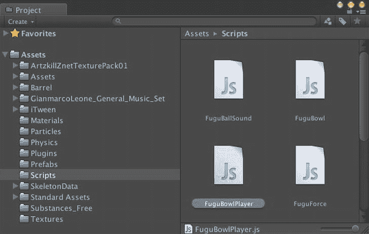
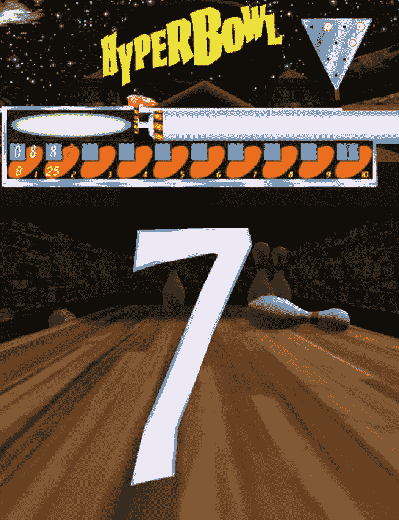
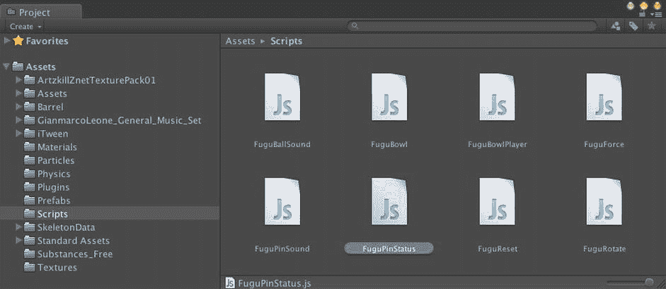
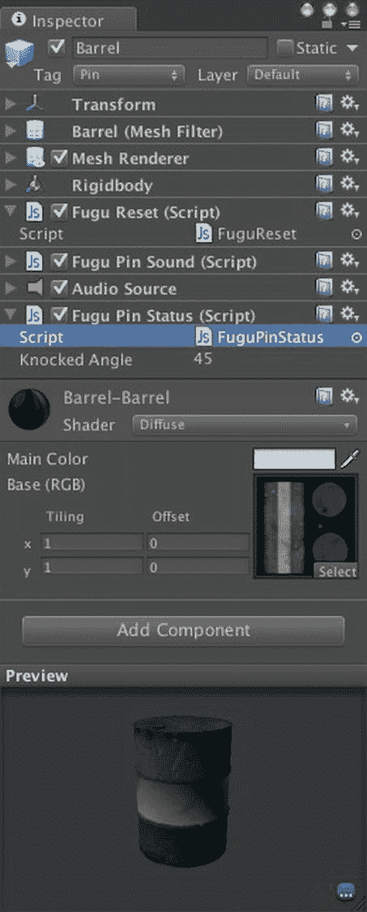
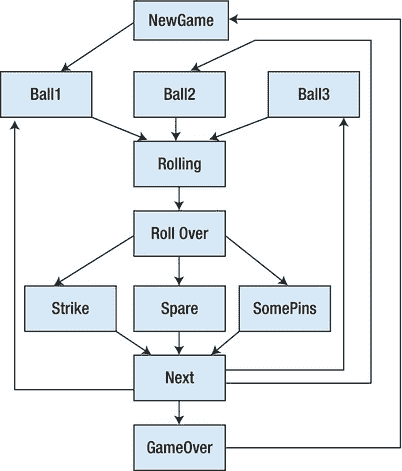
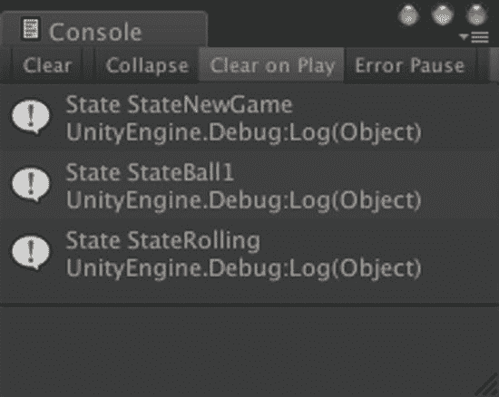

# `FuguBowl` 中的玩家与帧分数

`FuguBowl`脚本已经定义了一个代表我们游戏的类，但将有风度分数的代码封装在一个玩家类中是合理的，因为从概念上讲存在一个玩家（并且可能有多个玩家，尽管在这个特定游戏中并非如此），而分数与玩家相关联。

此外，保龄球的计分规则并不简单。将保龄球分数计算的代码放在一个单独的脚本中，不仅使游戏控制器脚本更小、更易读，而且还可以使分数代码在其他保龄球游戏中重用。

首先，创建一个新的 JavaScript，将其命名为`FuguBowlPlayer`，并放置在`Scripts`文件夹中（图 8-1）。



图 8-1 创建`FuguBowlPlayer`脚本

#### 帧分数（Frame Score）

在`FuguBowlPlayer`脚本中，在实现`FuguBowlPlayer`类之前，让我们从一个名为`FuguBowlScore`的支持类开始，该类表示单个保龄球帧的分数（清单 8-1）。它足够小，并且本身不是一个`MonoBehaviour`（例如，没有`Start`或`Update`回调），因此将其添加到`FuguBowlPlayer`脚本中就可以了。

清单 8-1 `FuguBowlPlayer.js`中的`FuguBowlScore`类

```
class FuguBowlScore {
       var ball1:int; // 第一次投球击倒的球瓶数
       var ball2:int; // 第二次投球击倒的球瓶数
       var ball3:int; // 第三次投球击倒的球瓶数
       var total:int; // 该帧的总分（可能包含后续投球）

function Clear() {
               ball1 = -1;
               ball2 = -1;
               ball3 = -1;
               total = -1;
       }

function IsSpare():boolean {
               // 不处理第三次投球时的补中
               return !IsStrike() &&
                      (ball1 + ball2 == 10);
       }

function IsStrike():boolean {
              return ball1 == 10;
       }
}
```

`FuguBowlScore`类非常简单，不继承自任何其他类（它可以被定义为结构体而不是类，只是 JavaScript 不支持定义新的结构体）。该类包含实例变量，分别代表第一次投球、第二次投球以及（仅在第 10 帧中相关的）奖励球的分数。`FuguBowlScore`还有一个变量用于保存该帧的总分，如果当前帧是补中或全中，则该总分可能取决于后续投球的结果。

每个变量都需要一种方法来指示其分数尚未计算。`ball1`、`ball2`和`ball3`的分数在该次投球完成之前是不可用的。总分在该帧的投球完成之前是不可用的，即使已完成，如果结果是补中或全中，分数仍然需要等到下一球或下两球投出后才能计算。

将分数值保留为零是行不通的，因为当玩家没有击倒任何球瓶时，零是一个有效的分数。但投球不可能出现负数分数，因此使用`-1`作为分数尚未计算的指示符是可行的。`FuguBowlScore`中的`Clear`函数通过将所有变量设置为这个数字来初始化该帧。

除了`Clear`函数之外，`FuguBowlScore`类还有另外两个成员函数。`IsStrike`如果该帧中投出了全中则返回`true`。这可以通过检查第一次投球击倒的球瓶数是否为十来轻松测试。`IsSpare`函数稍微复杂一些；如果第一次和第二次投球击倒的球瓶数之和为十，但仅当该帧中没有全中时（换句话说，不是第一次投球击倒十瓶且第二次投球击倒零瓶的情况），它才返回`true`。

注意：在两个函数声明中添加了`:boolean`。这清楚地表明每个函数返回一个`boolean`值，尽管编译器可以从代码中推断出返回类型。

#### 玩家分数（Player Score）

定义了`FuguBowlScore`类之后，我们现在可以添加`FuguBowlPlayer`类，它将聚合所有帧的分数以得到游戏总分（清单 8-2）。与`FuguBowlScore`一样，`FuguBowlPlayer`类被显式声明，即使它与脚本文件同名，并且它不继承自`MonoBehaviour`（否则类声明会包含`extends MonoBehaviour`）。除了没有 Unity 回调函数之外，这意味着`FuguBowlPlayer`类不是`Component`的子类，因此该脚本不能附加到`GameObject`上。换句话说，`FuguBowlPlayer`脚本充当一个代码库，包含其他脚本使用的类。

清单 8-2 `FuguBowlPlayer.js`中`FuguBowlPlayer`类的开始部分

```
class FuguBowlPlayer {
       var scores:FuguBowlScore[]; // 游戏的全部 10 帧

// 构造函数
       function FuguBowlPlayer() {
              scores = new FuguBowlScore[10];
              for (var i:int=0; i<scores.length; ++i) {
                      scores[i] = new FuguBowlScore();
              }
              ClearScore();
       }

function ClearScore() {
              for (var score:FuguBowlScore in scores) {
                      score.Clear();
              }
       }

function IsSpare(frame:int):boolean {
              return scores[frame].IsSpare();
       }

function IsStrike(frame:int):boolean {
              return scores[frame].IsStrike();
       }
}
```

`FuguBowlPlayer`类自然包含关于玩家的信息，例如，可以有一个`String`变量用于存储玩家的名字。然而，就本书的目的而言，我们将仅限于跟踪玩家的保龄球得分。因此，该类只有一个实例变量`scores`，它是一个由`FuguBowlScore`对象组成的内置数组。数组中的每个`FuguBowlScore`元素代表保龄球游戏一帧的分数。

**注意**：内置数组通过索引访问，就像`Array`类的实例一样（用于`FuguBowl.js`中的`pins`变量）。内置数组的访问速度比`Array`实例快得多，并且当声明为公共变量时，可以在 Inspector 视图中编辑。但是，与`Array`实例不同，内置数组在运行时无法调整大小。

类定义中的函数`FuguBowlPlayer`与类同名，这意味着它是一个*构造函数（constructor）*，一个在创建该类的实例时调用的特殊函数。显式定义的构造函数并非总是必需的（`FuguBowlScore`就没有），甚至在`MonoBehaviour`中是禁止的。但在这种情况下，构造函数是必要的，因为每个新创建的`FuguBowlPlayer`都需要创建其`scores`数组。因此，`FuguBowlPlayer`构造函数创建一个包含十个条目的内置数组，声明为`FuguBowlScore`类型，并用新创建的`FuguBowlScore`实例填充该数组。

构造函数还调用了一个函数`ClearScore`，该函数依次调用每个`FuguBowlScore`对象上的`Clear`，确保它们都从指示未登记任何分数的状态开始。`FuguBowlPlayer`类还有`IsSpare`和`IsStrike`函数，它们对指定的`FuguBowlScore`对象调用同名的函数，该对象通过传入的参数在`scores`数组中进行索引。由于数组索引从零开始，游戏的十帧由索引 0-9 表示。


**注意** 在某种意义上，`FuguBowlPlayer`类充当了`FuguBowlScore`类的包装器，这样其他脚本只需了解`FuguBowlPlayer`类即可。作为一种精雕细琢的练习，你可以提供更多的抽象，让`IsSpare`和`IsStrike`接受范围为 1-10 的帧索引，然后在将其用作数组索引之前先减 1。

#### 设置分数

随着游戏的进行，每次掷球后都需要更新分数。我们计划在`FuguBowlPlayer`类中添加名为`SetBall1Score`、`SetBall2Score`和`SetBall3Score`（用于第十帧）的函数。与该类中的`IsSpare`和`IsStrike`函数类似，这些新增函数将帧索引作为参数。

每次掷球的分数可能会更新前一帧的总分（如果前一帧是补中或全中）。因此，首先我们需要在`FuguBowlPlayer`类中编写函数来执行这些更新，函数名为`SetSpareScore`（清单 8-3）和`SetStrikeScore`（清单 8-4）。

清单 8-3 `FuguBowlPlayer`类中的`SetSpareScore`函数

```
function SetSpareScore(frame:int) {
       var framescore:FuguBowlScore = scores[frame];
       framescore.total = framescore.ball1+framescore.ball2+scores[frame+1].ball1;
}
```

清单 8-4 `FuguBowlPlayer`类中的`SetStrikeScore`函数

```
function SetStrikeScore(frame:int) {
       var framescore:FuguBowlScore = scores[frame];
       framescore.total = framescore.ball1;
       framescore.total+=scores[frame+1].ball1;
       if (frame < 8 && IsStrike(frame+1)) {
              framescore.total+=scores[frame+2].ball1;
       }  else {
              framescore.total+=scores[frame+1].ball2;
       }
}
```

`SetSpareScore`函数将总分设置为第一球和第二球得分之和（通常为 10 分），再加上下一次掷球的得分，即下一帧的第一球得分。

`SetStrikeScore`函数稍微复杂一些。它将总分设置为第一球得分（通常为 10 分）加上接下来两次掷球的得分，正常情况下，这包括下一帧的第一球和第二球得分。但如果下一帧也是全中，那么接下来的两次掷球则是下一帧的第一球以及下一帧之后那帧的第一球。

`SetSpareScore`和`SetStrikeScore`的使用在`SetBall1Score`的定义中进行了说明（清单 8-5）。第一行将当前帧的`ball1`变量设置为击倒的瓶数，该瓶数作为函数的第二个参数传入。然后，如果当前帧不是第一帧，`SetBall1Score`会检查前一帧是否出现了补中。如果是这种情况，则前一帧正在等待本次掷球的结果来计算该帧的总分，因此会调用前一帧的`SetSpareScore`来执行最终计算。

清单 8-5 `FuguBowlPlayer`类中的`SetBall1Score`函数

```
function SetBall1Score(frame:int,pinsDown:int) {
       scores[frame].ball1=pinsDown;
       if (frame>0 && IsSpare(frame-1)) {
              SetSpareScore(frame-1);
       }
       if (frame>1 && IsStrike(frame-1) && IsStrike(frame-2)) {
              SetStrikeScore(frame-2);
       }
}
```

如果当前帧不是第一帧或第二帧，`SetBall1Score`会检查前两帧是否都是全中。如果是这种情况，那么这两帧中的第一帧正在等待本次掷球的结果来更新其总分，因此会调用该帧的`SetStrikeScore`。

请注意，`SetBall1Score`并未设置当前帧的总分。如果当前掷球不是全中，则该帧尚未结束；而如果当前掷球是全中，则需要在两次掷球之后才能更新该帧的总分（当然，是通过`SetStrikeScore`！）。

`SetBall2Score`函数（清单 8-6）更为复杂，因为它需要处理更多情况。传递给函数的第二个参数是当前帧中到目前为止击倒的瓶数，因此`ball2`变量被设置为总击倒数减去第一球已经击倒的瓶数，但有一个特殊情况：第一球是全中时。

清单 8-6 `FuguBowlPlayer`类中的`SetBall2Score`函数

```
function SetBall2Score(frame:int,pinsDown:int) {
       var framescore:FuguBowlScore = scores[frame];
       if (IsStrike(frame)) { // we must be in the final frame
              framescore.ball2=pinsDown;
       }  else {
              framescore.ball2=pinsDown-framescore.ball1;
       }
       if (!IsSpare(frame) && !IsStrike(frame)) {
              framescore.total= pinsDown;
       }
       if (frame>0 && IsStrike(frame-1)) {
              SetStrikeScore(frame-1);
       }
}
```

通常情况下，如果第一球是全中，则跳过第二球，甚至不会调用`SetBall2Score`。但是，如果在第十帧的第一球出现全中，则会获得第二球的机会，并且`ball2`被设置为击倒的总瓶数，因为第一球全中后球瓶被重置了。

该帧的总分被设置为第一球和第二球的总和，除非是补中或全中的情况，在这两种情况下，需要分别等待一次或两次未来的掷球后才能确定总分。

考虑到这是当前帧的第二球，并且补中只将下一帧的第一球加入其分数，因此本次掷球不可能对前一帧的补中分数产生影响。但是，如果前一帧是全中，则应该对那一帧调用`SetStrikeScore`，因为该帧一直在等待当前帧的第一球和第二球来完成其总分计算。

`SetBall3Score`函数（清单 8-7）是一个特殊情况，因为第三球只可能发生在第十帧，而且只有第一球或第二球是全中，或者前两球是补中时才会出现。当调用`SetBall3Score`时，如果`ball2`是全中或完成了补中（这两种情况下，球瓶会在第三球前重置），则该函数将`ball3`变量设置为击倒的瓶数。否则，必须是第一球是全中而第二球不是全中的情况，因此`ball3`被设置为击倒的总瓶数减去第二球击倒的瓶数。

清单 8-7 `FuguBowlPlayer`类中的`SetBall3Score`函数

```
function SetBall3Score(frame:int,pinsDown:int) {
       var framescore:FuguBowlScore = scores[frame];
       if (IsStrike(frame) && framescore.ball2 <10) {
              framescore.ball3 = pinsDown - framescore.ball2;
       }  else {
              framescore.ball3 = pinsDown; // spare or two strikes
       }
       framescore.total = framescore.ball1+framescore.ball2+framescore.ball3;}
```

#### 获取分数


```markdown

虽然用户界面的实现将在下一章进行，但我们应该确保`FuguBowlPlayer`类支持分数显示。在现实生活或电脑游戏中，典型的保龄球记分板会显示每一帧中每次投球的分数，这与`FuguBowlScore`类中的`ball1`、`ball2`和`ball3`变量完美匹配。此外，保龄球记分板通常会有特殊标记来表示每一帧中的补中或全中，`FuguBowlPlayer`类中的`IsSpare`和`IsStrike`函数可以满足这一需求。

然而，虽然`FuguBowlScore`有一个表示该帧总分的`total`变量，但保龄球记分板通常显示的是该帧的*比赛总分*，即截止到该帧（含该帧）的累积总分。例如，图 8-2 展示了在投完两帧后，HyperBowl 记分板的显示效果。



图 8-2. HyperBowl 记分板

第一帧显示第一次和第二次投球的分数以及所得总分。第二帧显示其第一次投球的分数以及第二次投球补中的标记。第二帧显示的比赛总分是来自第一帧的比赛总分加上第二帧的额外帧总分。

这个例子为实现一个返回某帧比赛总分的函数提供了思路。清单 8-8 展示了添加到`FuguBowlPlayer`类中的这样一个函数`GetScore`的代码。如果指定的帧是游戏的第一帧，`GetScore`返回该帧的总分。如果该帧的总分为`-1`（表示尚不可用），那么`GetScore`返回`-1`以表示该帧的比赛总分尚不可用。

清单 8-8. FuguBowlPlayer 类中的 GetScore 函数

```
function GetScore(frame:int):int {
       if (frame==0 || scores[frame].total==-1) {
              return scores[frame].total;
       }  else {
              var prev:int = GetScore(frame-1);
              if (prev==-1) {
                      return -1;
              }  else {
                      return scores[frame].total+prev;
              }
       }
}
```

但如果帧总分可用且该帧不是第一帧，则将该帧总分与来自前一帧的比赛总分相加，除非前一帧的比赛总分尚不可用。如果前一帧的比赛总分不可用，则同样返回`-1`。

前一帧的比赛总分是通过对该帧调用`GetScore`获得的，而该调用又会对其前一帧调用`GetScore`，直到到达第一帧。`GetScore`是一个*递归函数*的例子，即调用自身的函数。无限递归被避免，因为最终`GetScore`会到达其*基准情况*，即总是会返回的第一帧。

### 完整清单

`FuguBowlScore`脚本的完整清单过于冗长，不便在此展示（长达四页），但其所有内容均已在本书此部分展示。整个脚本`FuguBowlScore.js`可在`http://learnunity4.com/`上本章的项目中获取。

如果你想用`http://learnunity4.com/`上的版本替换脚本，请在访达中执行替换操作（即，将文件拖放或粘贴到此项目的 Scripts 文件夹中）。通常，能够简单地将文件从访达拖放到项目视图中非常方便，但在这种情况下，Unity 会重命名新文件以避免覆盖原始文件。

如果你的意图是替换原始脚本，请勿自行重命名，因为场景中的任何引用仍会引用该新名称下的脚本。相反，如果你想保留一份副本，请复制原始脚本（在访达中或使用 Unity 编辑器“编辑”菜单中的“复制”命令）。

### 创建 FuguBowlPlayer

`FuguBowlPlayer`类现已准备就绪，可以投入使用。由于该脚本未附加到任何 GameObject（也不能附加，因为`FuguBowlPlayer`不是`MonoBehaviour`），因此必须在运行时实例化`FuguBowlPlayer`。自然的位置是在`FuguBowl`脚本的`Awake`回调中进行，该回调已在实例化保龄球瓶（清单 8-9）。

清单 8-9. 在 FuguBowl.js 中创建 FuguBowlPlayer

```
static var player:FuguBowlPlayer = null;

function Awake() {
       player = new FuguBowlPlayer();
       CreatePins();
}
```

增强后的`Awake`回调会创建一个新的`FuguBowlPlayer`实例，并将其赋值给变量`player`，该变量被声明为静态变量，以便从`FuguBowl`脚本外部轻松访问（为下一章记分板实现做准备）。

为了支持多名玩家，`player`变量可能改为一个`FuguBowlPlayer`数组（一个可调整大小的`Array`，而非内置数组，以适应不同数量的玩家），并且可能存在一些封装函数，如`GetPlayer`和`GetNumberOfPlayers`。但就本书而言，我们将保持简洁，专注于单人游戏。

### 球瓶状态

现在，`FuguBowl`脚本除了保龄球瓶和球之外，还有一个对`FuguBowlPlayer`的引用。但要调用`FuguBowlPlayer`的分数函数，`FuguBowl`必须传入已击倒的球瓶数量。与其在`FuguBowl`中添加代码来判断球瓶是否倒下，更简洁的做法是在附加到每个球瓶的脚本中编写该代码。这样，`FuguBowl`只需询问每个球瓶是否倒下，而无需了解球瓶的内部工作原理。

对于这个新的球瓶脚本，创建一个新的 JavaScript，命名为`FuguPinStatus`，并将其放在 Scripts 文件夹中（图 8-3）。



图 8-3. 创建 FuguPinStatus.js 脚本

接下来，将清单 8-10 的内容添加到该脚本中。

清单 8-10. FuguPinStatus.js 的清单

```
#pragma strict

var knockedAngle:float = 45.0;

private var initialAngles:Vector3;

function Awake () {
       initialAngles = transform.localEulerAngles;
}

function IsKnockedOver() {
       return Mathf.Abs(transform.localEulerAngles.x-initialAngles.x)>knockedAngle ||
       Mathf.Abs(transform.localEulerAngles.y-initialAngles.y)>knockedAngle ||
               Mathf.Abs(transform.localEulerAngles.z-initialAngles.z)>knockedAngle;
}
```

脚本中的`Awake`回调将 GameObject 的初始旋转保存在私有变量`initialAngles`中，以供后续比较。函数`IsKnockedOver`根据球瓶绕任何轴的旋转角度是否超过`knockedAngle`变量中指定的度数来返回`true`或`false`。

在项目视图中，选择 BarrelPin 预制件中的 Barrel GameObject，并使用检查器视图中的“添加组件”按钮来附加 FuguPinStatus 脚本（图 8-4）。



图 8-4. 附加到 Barrel 球瓶预制件上的 FuguPinStatus 脚本

```


在查询每个球瓶是否被击倒之前，`FuguBowl`脚本需要先找到这些球瓶。如果`Array`中填充的是基于胶囊体的`Pin`预制体，那么遍历`pins`变量中的每个`GameObject`即可；但当`Array`中包含的是`BarrelPin`的`GameObject`时，作为真实球瓶的`Barrel`游戏对象是这些`BarrelPin`游戏对象的子对象。

幸运的是，在第 7 章中，我们为所有“真实”球瓶（即实际移动的、带有`Rigidbody`和`Mesh`的`GameObject`）添加了`Pin`标签。这使我们能够使用静态函数`GameObject.FindGameObjectsWithTag`来获取所有真实球瓶的数组。该操作应在`FuguBowl`脚本的`CreatePins`函数末尾执行，即所有球瓶实例化完成之后（见清单 8-11）。这些被打上标签的球瓶被赋值给一个私有变量`pinBodies`。

清单 8-11.  在`FuguBowl.js`中声明并设置`pinBodies`变量

```
private var pinBodies:GameObject[]; // the real physical pins

function CreatePins() {
       pins = new Array();
       var offset = Vector3.zero;
       for (var row=0; row<pinRows; ++row) {
              offset.z+=pinDistance;
              offset.x=-pinDistance*row/2;
              for (var n=0; n<=row; ++n) {
                      pins.push(Instantiate(pin, pinPos+offset, Quaternion.identity));
                      offset.x+=pinDistance;
              }
       }
       pinBodies = GameObject.FindGameObjectsWithTag("Pin");
}
```

被击倒的球瓶数量由`GetPinsDown`函数计算（见清单 8-12）。该函数遍历`pinObjects`数组，对每个`IsKnockedOver`函数返回`true`的球瓶，递增局部变量`pinsDown`。循环结束后，返回`pinsDown`计数器的值。

清单 8-12.  `FuguBowl.js`中的`GetPinsDown`函数

```
function GetPinsDown():int {
       var pinsDown:int = 0;
       for (var pin:GameObject in pinBodies) {
              if (pin.GetComponent(FuguPinStatus).IsKnockedOver()) {
                      ++pinsDown;
              }
       }
       return pinsDown;
}
```

除了统计被击倒的球瓶，我们还可以移除它们——就像真实保龄球馆中被击倒的球瓶会被清走一样。`RemoveDownedPins`函数（见清单 8-13）遍历`pinBodies`列表，并对每个`IsKnockedDown`返回`true`的球瓶调用`SetActive(false)`。调用`SetActive(false)`等同于在检视面板中取消选中`GameObject`左上角的复选框。每个被击倒的球瓶虽未完全从场景中移除，但会变为不可见且不参与碰撞。

清单 8-13.  `FuguBowl.js`中的`RemovePins`函数

```
function RemoveDownedPins() {
       for (var pin:GameObject in pinBodies) {
              if (pin.GetComponent(FuguPinStatus).IsKnockedOver()) {
                      pin.SetActive(false);
              }
       }
}
```

当然，被停用的球瓶需要在某个时刻重新激活。现有的`ResetPins`函数（见清单 8-14）是一个合适的位置，因为当为新的一局准备将球瓶复位到初始位置时，会调用`ResetPins`。

清单 8-14.  `FuguBowl.js`中的`ResetPins`函数

```
function ResetPins() {
       for (var pin:GameObject in pinBodies) {
              pin.SetActive(true);
              pin.SendMessage("ResetPosition");
       }
}
```

实际上，现在遍历`pins`数组的循环可以被替换为遍历`pinBodies`。在循环内部，对每个球瓶调用`SetActive(true)`（以防它之前被停用），并且可以用`SendMessage`替代`BroadcastMessage`，因为`pinBodies`中的每个球瓶都已知挂载了`FuguReset`脚本。

### 游戏逻辑

我强烈建议在尝试编写游戏逻辑之前，先以有限状态机（FSM）的形式勾勒出游戏框架。有限状态机将程序表示为一系列有限的状态。FSM 在任何时刻都处于一个状态，并在状态之间进行转换。

> **注意**：术语“状态机”通常指代 FSM，但从技术上讲，状态机的范围很广，从最简单、能力最弱的自动机类别 FSM，一直到具有无限内存和潜在无限状态数量的图灵机。

一旦你将游戏可视化表示为 FSM，你就能确信可以将其编码实现。反之，如果你无法将游戏流程可视化为 FSM，那你可能只是有一个模糊的想法，还没有准备好去实现它！

### 设计 FSM

要勾勒出 FSM，请思考游戏将经历的所有状态。所有 FSM 都有一个初始状态，在本例中是新游戏的开始。玩家从第一局的第一球开始，滚动球，当滚动结束时，会得到一次全中、一次补中或一个常规分数。然后玩家进入同一局的第二球，或进入新一局的第一球，并重复此过程。如果玩家在第二球，流程与上述相同，只是转换条件变为：要么回到新一局的第一球，要么（在第十局且玩家投出全中或补中时）可能进入第三球。所有十局完成后，FSM 转换到`GameOver`状态，该状态可能循环回到新游戏。

图 8-5 展示了上述状态机可能的样子。



图 8-5. 保龄球游戏的状态机

第一次就完全画对并不重要。通常，当你勾勒出程序流程并开始编写脚本时，你会意识到遗漏了什么或发现了更好的方法，然后回头调整最初的设计。这就像我的一位教授关于构造证明所说的那样——完成一个证明的过程是混乱的，但之后你会回头去清理它，并假装从一开始就是这么计划的！

严格来说，FSM 没有记忆，因此一个真正完整的保龄球状态机将包含大量重复的状态（针对三个球和所有十局）。但包含数百个状态的状态机很难理解，这在很大程度上违背了其目的。我们不必对此过于教条，所以假设存在一些变量来追踪当前正在进行的局数和玩家正在投掷的球数。

#### 追踪游戏状态

在`FuguBowl`脚本中定义的用于追踪当前局数和当前球的变量如清单 8-15 所示。

清单 8-15.  `FuguBowl.js`中追踪当前局数和球的变量

```
private var frame:int; // current frame, ranges for 0-9 (representing 1-10)
private var roll:Roll; // the current roll in the current frame

enum Roll {
       Ball1,
       Ball2,
       Ball3
}
```

变量`frame`使用`int`类型追踪当前局数，取值范围是 0 到 9（代表第 1 到第 10 局），因为该数字将作为数组索引传递给`FuguBowlPlayer`函数。


变量`roll`用来记录球的当前轮次，原本也可以声明为`int`类型，并采用 0-2 或 1-3 的数字来表示一局中的三种可能球况。但使用`enum`（*枚举*的缩写）更为清晰，它本质上允许你定义一个新类型，其值取自一组命名值中的一个。因此`roll`被声明为`Roll`类型，这是一个包含`Ball1`、`Ball2`或`Ball3`的枚举。

顺便提一下，至此我们已经遇到了几种不同类型的类别：基本类型如`int`和`boolean`、包含其他类型的内置数组、像`Roll`这样的枚举、像`Vector3`这样的结构体，以及像`GameObject`、`Component`和`FuguBowlPlayer`这样的类。在这些类别中，类和数组是*引用类型*，这意味着不同变量可以引用同一类型的同一个实例，并且对该实例的修改将通过每个引用该实例的变量可见。

### 启动状态机

好了，现在你已经勾勒出状态机的草图，接下来该如何编写代码呢？FSM（有限状态机）非常有用，以至于一些游戏引擎（包括 CryEngine、虚幻引擎和 Second Life）都在其脚本中内置了对它的支持。不幸的是，Unity 并不支持，但既然这是软件问题，总有很多方法可以自行实现 FSM 支持。

一种方法是在`Update`函数中放置一个大的条件语句，根据当前所处的状态执行不同的操作（我们可能会使用一个枚举来定义这些不同的状态）。然而，这种方法往往会导致`Update`函数变得臃肿不堪。事实上，由于第 7 章中添加到`FuguBowl`脚本的`Update`回调将被我们即将添加的状态机所取代，你现在就应该从`FuguBowl`脚本中删除该回调。

另一种创建 FSM 的方法（我曾尝试过一段时间）是用一个挂载了多个脚本的`GameObject`来表示状态机，其中每个脚本代表一个状态。每当当前状态退出时，该脚本会禁用自身并启用下一个脚本或状态。这种方法很有吸引力，因为每个脚本或状态都有自己的`Update`函数和其他回调。但我发现，如果整个 FSM 包含在单个脚本中，我的状态机更容易理解和处理。

因此，我最终决定使用*协程*来实现状态机。协程是一种函数，可以通过调用`yield`（该函数即使在尚未执行完毕时，也会*暂时*交出控制权）来在某一帧或多帧中暂停自身。你可以将每个状态实现为一个协程，当状态退出时该协程返回。在状态中，协程执行该状态下应发生的任何操作，但会反复进行`yield`，以免阻塞 Unity 的其余部分（包括渲染器和物理系统）运行。在返回之前，协程会指定它将转换到的下一个状态。

并非所有回调都能用作协程。例如，`Awake`不能用作协程，`Update`也不能，但`Start`可以`yield`，因此它可以充当 FSM 控制器（清单 8-16）。

清单 8-16.  `FuguBowl.js`中运行状态机的`Start`回调

```
private var state:String;

function Start() {
       state="StateNewGame";
       while (true) {
              Debug.Log("State "+state);
              yield StartCoroutine(state);
              yield;
       }
}
```

当前状态的名称（即实现该状态的协程的名称）以`String`类型保存在名为`state`的私有变量中。`Start`回调无限循环，反复使用`state`的值调用`StartCoroutine`来调用协程。`Start`在对`StartCoroutine`的调用上执行`yield`，以便它一直等待，直到状态协程执行完毕，然后再启动一个具有下一个`state`值的协程。

无法保证被调用的协程一定会`yield`，因此`Start`在循环中额外添加了一个`yield`以确保万无一失，这样在状态之间至少发生一次`yield`，从而给游戏引擎的其余部分提供运行机会。

作为调试辅助手段，`Start`在执行每个状态协程之前都会调用`Debug.Log`（图 8-6）。这是在测试游戏时跟踪状态机进度的一种便捷方式。



图 8-6。状态机调试跟踪的控制台视图

### 各状态

按照惯例，我们将在所有状态协程的名称前加上前缀`State`，以表明这些函数是状态机中的状态。

#### StateNewGame

保龄球状态机的初始状态是`StateNewGame`（清单 8-17），它通过清除玩家的分数并将当前局索引设置为 0 来开始一局新游戏，指明玩家正在进行游戏的第一局。

清单 8-17.  `FuguBowl.js`中的`StateNewGame`

```
function StateNewGame() {
       player.ClearScore();
       frame = 0;
       state="StateBall1";
}
```

在返回（实际上是退出状态）之前，`StateNewGame`指定下一个状态为`StateBall1`，即玩家开始滚动该局第一球的状态。

#### StateBall1

`StateBall1`（清单 8-18）采取的第一个动作是重置球瓶、球以及主摄像机的位置。这在第一次进入该状态时（即游戏开始时）并非必要，但当玩家完成一局投球并转换回此状态时，所有物体都需要放置到其起始位置和旋转角度（可能被击倒的球瓶其旋转角度会发生变化）。

清单 8-18.  `FuguBowl.js`中开始滚动第一球的状态

```
function StateBall1() {
       ResetEverything(); // 重置球瓶、摄像机和球
       roll = Roll.Ball1;
       state="StateRolling";
}
```

执行重置后，此状态将`roll`变量设置为`Roll.Ball1`，表示玩家正在滚动该局的第一球。最后，此状态转换到`StateRolling`，即球正在向球瓶滚去时所处的状态。

#### StateBall2

与`StateBall1`类似，`StateBall2`（清单 8-19）首先重置球和主摄像机。

清单 8-19.  `FuguBowl.js`中开始滚动第二球的状态

```
function StateBall2() {
       ResetBall();
       ResetCamera();
       if (GetPinsDown()==10) {
              ResetPins();
       }  else {
              RemoveDownedPins();
       }
       roll = Roll.Ball2;
       state="StateRolling";
}
```

如果玩家到达此点，通常意味着该局的第一球没有形成全倒，现在是时候尝试击倒剩余的球瓶了，但在清理上一轮击倒的球瓶之后。但如果所有球瓶都已倒下，那一定是第十局中的特殊情况：一次全倒之后再进行两次投球，此时需要重置球瓶。

在退出该状态之前，`roll`被设置为`Roll.Ball2`，并且与`StateBall1`一样，下一个状态设置为`StateRolling`。

#### StateBall3


说话间就来到了第十帧，这是唯一出现`StateBall3`（代码清单 8-20）的情况，因为这是玩家唯一能投三次的一帧。

代码清单 8-20  FuguBowl.js 中开始投掷第三球的 State

```javascript
function StateBall3() {
       ResetBall();
       ResetCamera();
       if (GetPinsDown()==10) {
              ResetPins();
       }  else {
              RemoveDownedPins();
       }
       roll = Roll.Ball3;
       state="StateRolling";
}
```

`StateBall3`与`StateBall2`一样，会重置球；如果在这一帧的前两次投球中击倒了十个瓶（即补中或连续两次全中），它还会重置所有球瓶。否则，就清除前一次投球击倒的球瓶。同样，此状态将投球变量设置为`Roll.Ball3`，并转换到`StateRolling`状态。

**StateRolling**

`StateRolling`（代码清单 8-21）或多或少实现了前一章创建但本章开头已被弃用的`Update`函数的功能。该状态每帧都会暂停，不做任何事，只等待球控制应该停止的时刻。

代码清单 8-21  FuguBowl.js 中投球状态的代码

```javascript
function StateRolling() {
       while (true) {
              if (ball.transform.position.z>pinPos.z) {
                      state = "StateRolledPast";
                      return;
              }
              if (ball.transform.position.y<sunkHeight) {
                      state = "StateGutterBall";
                      return;
              }
              yield;
       }
}
```

有两种情况表明投球确实结束了。一种是球滚出了地板的边缘，这基本上与正常保龄球比赛中的洗沟球情况相同；另一种是球已经滚到了球瓶附近（如果不放弃控制，游戏会变得太简单；你可以像巨型卡车一样在球瓶间来回穿梭！）。

检测洗沟球很容易。与现已删除的`Update`回调中一样，此状态会检查球的 y 位置是否低于`sunkHeight`变量指定的值。如果是，则转换到洗沟球状态。另一种情况也几乎同样简单，即检查球的 z 位置是否超过了第一个球瓶的 z 位置。本质上，该状态是在检查球是否到达了从左到右横跨地板、放置着球瓶的“球瓶线”。如果到达了，则转换到`StateRolledPast`状态。

实际上，我们在绘制有限状态机时并没有考虑加入`StateGutterBall`和`StateRolledPast`，但这没什么大不了的。现在，你可以直接插入这些状态，替换掉之前从`StateRolling`到`StateRollOver`的直接转换。

**StateRolledPast**

当球滚得足够远并到达球瓶时，会进入`StateRolledPast`状态（代码清单 8-22）。该状态通过禁用球和主摄像机的控制来“放开”球。

代码清单 8-22  FuguBowl.js 中球到达球瓶时进入的状态

```javascript
function StateRolledPast() {
       var follow:Behaviour = Camera.main.GetComponent("SmoothFollow");
       if (follow != null) {
              follow.enabled = false;
       }
       ball.GetComponent(FuguForce).enabled = false;
       yield WaitForSeconds(5);
       state = "StateRollOver";
}
```

为了禁用主摄像机的`SmoothFollow`脚本，该状态通过`Camera`类中的静态变量`main`访问主摄像机，并在该`GameObject`上调用`GetComponent`，传入`SmoothFollow`作为要获取的组件的类名。这将返回附加到主摄像机上的`SmoothFollow`脚本。然后，该脚本被赋值给一个名为`follow`的局部变量。

`follow`变量被声明为`Behaviour`类型，它是`Component`的直接子类。`Behaviour`可以通过设置其`enabled`变量来启用或禁用。`follow`本可以声明为更具体的类，比如`MonoBehaviour`（`Behaviour`的子类，也是任何可附加到`GameObject`的脚本的父类）甚至`SmoothFollow`（`SmoothFollow`脚本的最具体类），因为所有这些类都从`Behaviour`继承了`enabled`变量。但是，选择最适合的最通用类可以提供最大的灵活性。例如，如果你将`follow`声明为`SmoothFollow`类型，而后又决定使用不同的摄像机控制脚本，你就必须调整`follow`的类型声明。

**提示**   对于类型声明，请使用实现了你所需函数和变量的最通用类。

不将`follow`声明为`SmoothFollow`类型的另一个原因是，在`http://learnunity4.com/`上可用的本项目版本不包含任何资源商店或标准资源包，包括`SmoothFollow`脚本。在项目中引用不存在的`SmoothFollow`类会导致编译器错误。

这就是为什么将`"SmoothFollow"`作为字符串传递给`GetComponent`的原因，这样直到运行时调用`GetComponent`时才用它来查找类，此时`GetComponent`会返回`null`。试图访问`null`上的`enabled`变量会导致错误，因此该状态首先检查`follow`是否为`null`，然后再尝试禁用它。附加在球上的`FuguForce`脚本以类似的方式禁用，通过在球上调用`GetComponent`来获取`FuguForce`脚本，然后将其`enabled`变量设置为`false`。但是，与主摄像机和`SmoothFollow`脚本不同，因为我们确信球上附加了`FuguForce`脚本，所以在禁用该脚本之前无需进行空值检查测试。

此外，`GetComponent`是一个重载函数，一个版本接受`String`参数，另一个版本直接接受类。因此，不是将`"FuguForce"`传递给`GetComponent`，而是直接传递类`FuguForce`。这样，如果类名拼写错误（例如`GetComponent(FuguFource)`），就会产生编译器错误。

传入拼写错误的类名`String`（例如`GetComponent("FuguFource")`），在编译时不会导致错误，这乍听起来是件好事，但最好能尽早发现问题。在运行时，对`GetComponent`的调用会返回`null`，如果代码期望非`null`结果，则可能导致崩溃；或者只会产生令人恼火的调试过程，因为你不知道为什么那个脚本没有按预期被禁用。

**提示**   尽可能让编译器帮你做错误检查。

在某个时刻，`SmoothFollow`和`FuguForce`脚本必须重新启用。自然的位置是在`ResetCamera`和`ResetBall`函数（代码清单 8-23）中，因为当一轮投球结束，主摄像机和球分别被重置以开始下一轮投球时，会调用这些函数。

代码清单 8-23  FuguBowl.js 中的 ResetBall 和 ResetCamera 函数

```javascript
function ResetBall() {
       ball.GetComponent(FuguForce).enabled = true;
       ball.SendMessage("ResetPosition");
}
function ResetCamera() {
       var follow:Behaviour = Camera.main.GetComponent("SmoothFollow");
       if (follow != null) {
              follow.enabled = true;
       }
       Camera.main.SendMessage("ResetPosition");
}
```

在`ResetBall`和`ResetCamera`函数中，启用脚本组件的代码与禁用脚本的代码相同，只是将`enabled`变量设置为`true`。


