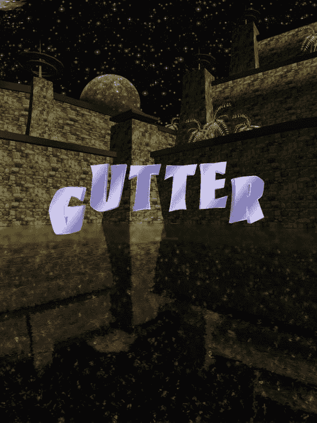

# 禁用 `FuguForce` 和 `SmoothFollow` 脚本后

`StateRolledPast` 会等待五秒钟，然后转换到下一个状态 `StateRollOver`，以便让球有时间滚入球瓶（或滚过球瓶）。用一个调用 `yield` 的 `while` 循环，通过检查 `Time.time` 来等待所需时间过去，可以实现这一效果，但更方便的做法是在函数 `WaitForSeconds` 上调用 `yield`，该函数以秒数作为参数（在 `StateRolledPast` 中，秒数被硬编码为 5，但可以轻松改为公共变量以实现自定义）。因此，协程 `StateRolledPast` 实际上会暂停（不会阻塞 Unity 其他部分的执行），直到指定的时间过去。

## `StateGutterBall`

洗沟球状态比 `StateRolledPast` 简单得多。它直接转换到 `StateRollOver`（清单 8-24）。

清单 8-24.  FuguBowl.js 中洗沟球的状态

```
function StateGutterBall() {
       state = "StateRollOver";
}
```

尽管看似 `StateRolling` 可以直接转换到 `StateRollOver` 而不是经过 `StateGutterBall`，但包含 `StateGutterBall` 为 `StateRolledPast` 提供了一定的对称性。在一个完善的保龄球游戏中，您很可能会实现某种反馈，告诉玩家滚出了洗沟球。例如，在 HyperBowl 中，动画字母拼出“Gutter”飞过屏幕（图 8-7），这个动画就在 `StateGutterBall` 中发生。



图 8-7.  HyperBowl 中洗沟球的动画文本

顺便提一下，这些字母是用 iTween 制作动画的。您也不仅限于视觉反馈。在我上架 App Store 的 Fugu Bowl 应用中，`StateGutterBall` 会播放孩子们的嘘声！

## `StateRollOver`

当球的滚动被认为结束时（球滚离地板形成洗沟，或到达球瓶线），FSM 进入 `StateRollOver`（清单 8-25），通过计算得分来结束当前这一投。

清单 8-25.  FuguBowl.js 中一投结束的状态

```
function StateRollOver() {
       var pinsDown:int = GetPinsDown();
       switch (roll) {
              case Roll.Ball1: player.SetBall1Score(frame,pinsDown); break;
              case Roll.Ball2: player.SetBall2Score(frame,pinsDown); break;
              case Roll.Ball3: player.SetBall3Score(frame,pinsDown); break;
       }
       if (roll == Roll.Ball1 && player.IsStrike(frame)) {
              state = "StateStrike";
              return;
       }
       if (roll == Roll.Ball2 && player.IsSpare(frame)) {
              state = "StateSpare";
              return;
       }
       state = "StateKnockedSomeDown";
}
```

这个状态首先通过调用 `GetPinsDown` 函数确定有多少球瓶倒下。然后根据这是第一次、第二次还是第三次投球，将该数字传递给相应的 `FuguBowlPlayer` 计分函数，以记录此投的得分。下一个状态取决于投球结果：是全中（只能发生在第一次投球）、补中（只能发生在第二次投球），还是其他结果（`StateKnockedSomeDown` 这个名字不算完美，考虑到可能一球未中，但我认为它比 `StateNotSpareOrStrike` 更好）。

## `StateSpare`、`StateStrike` 和 `StateKnockedSomeDown`

与洗沟球状态类似，全中、补中以及其他结果的状态除了转换到下一个状态外，没有其他动作（清单 8-26）。

清单 8-26.  FuguBowl.js 中的 `StateSpare`、`StateStrike` 和 `StateKnockedSomeDown`

```
function StateSpare() {
       state="StateNextBall";
}

function StateStrike() {
       state = "StateNextBall";
}

function StateKnockedSomeDown() {
       state="StateNextBall";
}
```

这三个状态都转换到 `StateNextBall`，因此很容易让人觉得这些状态多余，可以完全移除。但对于一个完整的保龄球游戏，您可能会在每个状态中触发某种反馈，比如全中时的祝贺音效和图形。我提到过，App Store 上的 Fugu Bowl 在洗沟球时会发出嘘声。同一个应用在全中时会发出欢呼声，这发生在 `StateStrike` 中。而 HyperBowl 则在 `StateSpare` 和 `StateStrike` 中分别显示动画文本“SPARE”和“STRIKE”。

## `StateNextBall`

`StateNextBall` 是目前为止最复杂的状态（清单 8-27），因为大多数保龄球规则都在这里生效。在这里，您必须决定是在当前格继续投下一球，还是前进到下一格。

清单 8-27.  FuguBowl.js 中转换到下一投的状态

```
function StateNextBall() {
       if (frame == 9) { // 最后一格
              switch (roll) {
                      case Roll.Ball1: // 始终有第二次投球
                       state = "StateBall2";
                       break;
                      case Roll.Ball2: // 如果补中或全中，则有奖励投球
                              if (player.IsSpare(frame) || player.IsStrike(frame)) {
                                     state = "StateBall3";
                              }  else {
                                     state = "StateGameOver";
                              }
                              break;
                      case Roll.Ball3:
                              state = "StateGameOver";
                              break;
              }
              // 所有其他格
       }  else if (roll == Roll.Ball1 && !player.IsStrike(frame)) {
                              state = "StateBall2";
                      }  else {
                              ++frame;
                              state = "StateBall1";
                      }
       }
```

特别是第十格很复杂，因为您需要检查游戏是否结束，并且可能有三投。所以让我们先看代码的底部部分，它适用于前九格。如果您刚完成 `Ball1` 的投球且没有全中，那么下一个状态是 `StateBall2`。否则，您一定投了 `Ball2` 或得了全中，因此无论哪种情况，下一个状态都是 `StateBall1`，并且增加格索引。在第十格中，您至少会投两次，所以如果您刚投了 `Ball1`，则将下一个状态设为 `StateBall2`。如果您刚投了 `Ball2`，并且结果是补中或全中，则将下一个状态设为 `StateBall3`，否则进入游戏结束状态。当然，如果您刚投了 `Ball3`，那是最后一投，您进入游戏结束状态。

## `StateGameOver`

最后，您到达了游戏结束状态 `StateGameOver`（清单 8-28）。

清单 8-28.  FuguBowl.js 中的游戏结束状态

```
function StateGameOver() {
       Debug.Log("Final Score: "+player.GetScore(9));
       state="StateNewGame";
}
```

代替花哨的用户界面（UnityGUI 系统将在下一章介绍），让我们借此机会使用函数 `Debug.Log` 在控制台视图中打印出最终得分。最终得分通过调用 `FuguBowlPlayer` 函数 `GetScore` 并传入数组索引 9 来获取，这表示您想要第十格中计算的总分。


