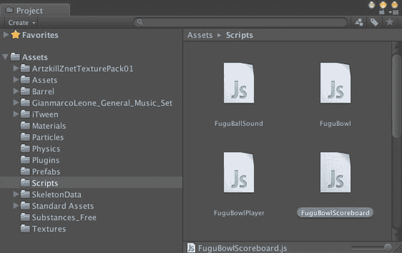

# 第 9 章

## 游戏图形界面

在过去的几章里，我们已经构建了一个相当完整的保龄球游戏，包含了 3D 图形、物理引擎、音效、玩家控制和自动摄像机移动。这款游戏几乎涵盖了 3D 游戏所预期的所有功能类别，唯独缺少一项：图形用户界面（GUI）。具体来说，保龄球游戏应该有一个计分板，而且游戏通常还应该有一个在游戏开始和暂停时显示的菜单。

**提示**   我曾有一款 iOS 游戏因为缺少暂停菜单而被苹果公司拒绝，所以，即便只是为了应付审核，我也建议你加入一个。

在本章中，我们将使用 Unity 内置的 GUI 系统（称为 UnityGUI）来实现计分板和开始/暂停菜单。你可以通过名称的酷炫程度来判断一个 Unity 功能的历史长短——较新的功能有诸如 Shuriken、Mecanim 和 Beast 这样的名字。

本章项目的计分板和暂停菜单脚本可在 `http://learnunity4.com/` 上找到，但再次不厌其烦地重申，一行一行、一个函数一个函数地亲自输入代码才能提供最佳的学习体验！

### 计分板

在完整的保龄球游戏中，这里会展示“游戏结束”信息、将分数提交到排行榜，以及执行游戏结束时其他合适的操作（在 HyperBowl 中，会调用 `Application.LoadLevel` 函数切换到显示分数的场景并展示一个奖杯）。但就目前而言，我们只需跳转回 `StateNewGame` 状态并开始一场新游戏即可。

#### 完整代码清单

改造后的 `FuguBowl` 脚本甚至比 `FuguBowlPlayer` 脚本还要大得多，因此这里不展示 `FuguBowl.js` 的完整代码。完整的脚本可以在 `http://learnunity4.com/` 上找到，其所有内容都已在本节中逐一（或者更准确地说，是逐个状态）介绍过了。

### 进一步探索

本章的节奏有所变化，主要专注于脚本编写。大部分脚本是以状态机的形式添加到游戏控制器脚本 `FuguBowl.js` 中的，而计分代码则整合到了一个名为 `FuguBowlPlayer.js` 的新脚本中。

如果你已经厌倦了编写大段代码，并怀念我们开始时那些短小的脚本片段，那么你只需再忍耐一下，在下一章中编写另一个关于用户界面的较大脚本。并且，作为本章添加的计分代码的对应部分，下一章将包含一个额外的小型脚本来显示计分板。

#### Unity 手册

状态机不仅可用于游戏控制逻辑，还可用于任何可以表示为经历不同状态的事物（简单例子：灯是开或关、武器已上膛、门是开或关）。状态机对于动画（行走、奔跑、投掷）尤其有用，这就是为什么新的 Mecanim 动画系统拥有自己的有限状态机能力。这在 Unity 手册的“Mecanim 动画系统”部分的“动画状态机”中有描述。

#### 脚本参考

本章引入的主要脚本技术是协程的使用，具体来说是用于在 `FuguBowl` 脚本中实现一个有限状态机。脚本参考的“脚本概述”部分有一个关于“协程与 Yield”的页面，提供了基本解释和一些示例。

与协程相关的类包括 `Coroutine` 和 `WaitForSeconds`（两者都继承自 `YieldInstruction`）。我们使用的唯一函数是 `MonoBehaviour` 的 `StartCoroutine` 函数。每个 `MonoBehaviour` 回调的文档页面都指明了该回调是否可以用作协程（正如我们所看到的，`Start` 可以，但 `Awake`、`Update` 和 `FixedUpdate` 不行）。

`FuguBowl` 脚本中添加的代码也频繁需要访问组件，因此关于“访问组件”的页面是相关的。该页面列出了可用于访问常用附加组件的 `Component` 和 `GameObject` 变量，并提供了关于如何调用 `GetComponent` 函数（可以在 `Component` 或 `GameObject` 上调用）来访问组件（包括脚本）的示例。

#### 资源商店

资源商店上有几个更复杂的有限状态机框架。在资源商店窗口中搜索“fsm”会出现几个，其中包括一个由 Huton Games 开发的流行可视化编程包 Playmaker，网址是 `http://hutongames.com/`。

##### 网上资源

维基百科（`http://wikipedia.org/`）对保龄球及其计分规则有详细的描述。只需在网站上搜索“bowling”即可。如果你搜索“state machine”，你会找到一篇文章，它所解释的内容可能比你想要了解的关于有限状态机的知识还要多！

我提到过一些游戏引擎在其脚本系统中内置了有限状态机。比较它们并了解有限状态机在这些系统中是如何实现的是很有趣的。例如，CryEngine 在其 Lua 脚本中内置了一种状态切换机制。访问 CryEngine 3 免费 SDK 网站（`http://freesdk.dev.net/`）并搜索“state”即可找到一篇关于“实体状态”的文章。

我曾参与开发了一个基于 CryEngine 的虚拟世界，名为 Blue Mars，它大量利用了那种有限状态机支持。访问 Blue Mars 维基（`http://create.bluemars.com/`）并搜索“entity script”以查看入门示例（实际上，我是在五年前开始编写那个维基条目的！）

甚至是最著名的虚拟世界 Second Life 也支持有限状态机。在 Second Life 维基（`http://wiki.secondlife.com`）上搜索“state”，以了解如何使用林登脚本语言定义状态。

### 计分板

我们从计分板开始，因为它比菜单更简单。计分板只需要显示内容，无需交互。如前一章所述，一个典型的保龄球计分板会显示每一局的结果（即，第一球和第二球，以及在第十局中可能的第三球），以及截止到该局的总分。我们在这里不做什么花哨的东西，只是通过将计分板绘制为一系列标签来显示分数，每个标签以文本形式显示该局的分数。

### 创建脚本

让我们开始创建一个附加了计分板脚本的 `GameObject`（现在这应该是一个熟悉的流程了）。在项目视图中，在 Scripts 文件夹中创建一个新的 JavaScript 文件，并将其命名为 `FuguBowlScoreboard`（图 9-1）。



图 9-1. 创建 FuguBowlScoreboard 脚本

接下来，在层级视图中创建一个新的 `GameObject`，命名为 Scoreboard，并将 `FuguBowlScoreboard` 脚本附加到它上面。

现在你已准备好向 `FuguBowlScoreboard` 脚本添加 UnityGUI 代码了。如果你曾使用过其他 GUI 系统开发用户界面，你可能会觉得 UnityGUI 有点不寻常。UnityGUI 控件不是在 `OnGUI` 回调函数外部创建和放置并使其具有响应按钮点击等事件的回调，而是在 `OnGUI` 回调函数内部创建的，该函数每帧都会被调用（实际上每帧会调用几次）。为了快速演示 UnityGUI 的工作原理，请将代码清单 9-1 的内容放入 `FuguBowlScoreboard` 脚本中。

代码清单 9-1. 在 FuguBowlScoreboard.js 中测试一个简单的 UnityGUI 标签

```
#pragma strict

function OnGUI() {
    GUI.Label(Rect(5,100,200,20),"This is a label");
}
```


