# 排版后的文本

所有 UnityGUI 控件都是通过调用`GUI`类（以及`GUILayout`类，但将在下一节中介绍）中的静态函数来创建的。`OnGUI`回调在列表 9-1 中调用`GUI.Label`来绘制一个标签，传入一个`Rect`（矩形），指定标签绘制在 x,y 坐标为 5,100 的位置（UnityGUI 的坐标系中，0,0 位于屏幕左上角），宽度和高度分别为 200 和 20 像素。第二个参数是要在标签中显示的文本。点击 Play，您应该会看到“This is a label”显示在屏幕上。

如果用户界面很复杂，将用户界面代码放在单个脚本回调中可能会很繁琐。但就这个简单的用户界面而言，`OnGUI`回调很方便，我们可以在此基础上构建一个极简的纯文本保龄球记分牌。让我们用列表 9-2 的内容替换`FuguBowlScoreboard`中的单标签示例。

列表 9-2. 保龄球记分牌

```
#pragma strict

var style:GUIStyle; // customize the appearance

function OnGUI() {
       for (var f:int=0; f<10; f++) {
               var score:String="";
               var roll1:int = FuguBowl.player.scores[f].ball1;
               var roll2:int = FuguBowl.player.scores[f].ball2;
               var roll3:int = FuguBowl.player.scores[f].ball3;
               switch (roll1) {
                      case -1: score += " "; break;
                      case 10: score +="X"; break;
                      default: score += roll1;
               }
               score+="/";
               if (FuguBowl.player.IsSpare(f)) {
                      score +="I";
               } else {
                      switch (roll2) {
                              case -1: score += " "; break;
                              case 10: score +="X"; break;
                              default: score += roll2;
                      }
               }
               if (f==9) {
                      score+="/";
                      if (10==roll2+roll3) {
                              score +="I";
                      } else {
                              switch (roll3) {
                                     case -1: score += " "; break;
                                     case 10: score +="X"; break;
                                     default: score += roll3;
                              }
                      }
               }
               GUI.Label(Rect(f*30+5,5,50,20),score,style);
               var total:int=FuguBowl.player.GetScore(f);
               if (total != -1) {
                      GUI.Label(Rect(f*30+5,20,50,20)," "+total,style);
               }
       }
}
```

新的`OnGUI`回调遍历所有十个回合，查询`FuguBowlPlayer`以获取代表每个回合的`FuguBowlScore`。在循环的底部，会执行一次或两次对`GUI.Label`的调用。第一个`GUI.Label`显示该回合每球的得分，第二个`GUI.Label`绘制在第一个下方，如果可用则显示该回合的游戏总分。

循环中的大部分代码用于确定每个回合的每个球要显示什么。对于`ball1`，如果尚未投掷，则要显示的`String`只是一个空格。如果投掷了全中，则显示字母“X”。否则，显示数字分数（1-9）。

`ball2`与`ball1`类似，不同之处在于它还显示字母“I”来表示补中。通常，我会使用斜杠字符“/”来表示补中，但这里用它来分隔`ball1`、`ball2`和`ball3`的分数。

只有当回合是第十回合（索引 9）时，才会构建`ball3`的`String`。`ball3`与`ball2`相同，区别在于它检查的是`ball2`和`ball3`的补中组合，而不是`ball1`和`ball2`。

通过调用`FuguBowlPlayer`函数`GetScore`来检索回合总分，只要分数可用（即不为-1）就显示。每个`GUI.Label`的`Rect`基于其显示的回合在屏幕上从左上角开始递增偏移（图 9-2）。

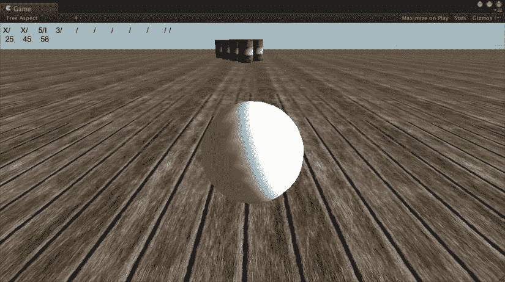

图 9-2. 由 `FuguBowlScoreboard.js` 显示的保龄球记分牌

图 9-2 展示了一个进行到第四回合第二球的游戏。第一球击倒了三个球瓶。前两个回合投出了全中，第三回合投出了补中（第一次投掷击倒五个球瓶，第二次投掷击倒五个）。第一回合的游戏总分为：全中的 10 分，加上接下来两球击倒的球瓶数（第二回合全中的 10 分，再加上第三回合第一球的 5 分），共计 25 分。

第二回合也是全中，因此它的得分是：全中的 10 分，加上第三回合第一球的 5 分以及该回合第二球的 5 分，共计 20 分。将其加到第一回合的 25 分上，游戏总分为 45 分。

第三回合是补中，所以同样得到 10 分，但仅加上下一球（即 3 分），共计 13 分，将其加入前一个回合的游戏总分，总计 58 分。因此，我们的计分代码和记分牌代码运行正常！

### 设置 GUI 样式

GUI 控件的外观可以通过`GUIStyle`进行自定义，它是一个影响控件显示的属性集合。从概念上讲，这类似于级联样式表（CSS）用于格式化网页内容的方式。

每个创建 GUI 控件的 GUI 函数都是一个重载函数，有两种形式：一种使用默认的`GUIStyle`，另一种接受一个`GUIStyle`参数。最初的单标签示例仅使用了默认的`GUIStyle`，但记分牌使用了接受`GUIStyle`参数的`GUI.Label`版本，这提供了一种自定义记分牌外观的方法。

传递给`GUI.Label`的`GUIStyle`绑定到一个名为`style`的公共变量，这允许在 Inspector 视图中自定义`GUIStyle`。例如，由于记分牌完全是文本，您可以点击样式 Normal 子部分中的 Text Color 字段（相当于在脚本中访问`style.onNormal.textColor`）来打开颜色选择器并更改记分牌的颜色（图 9-3）。

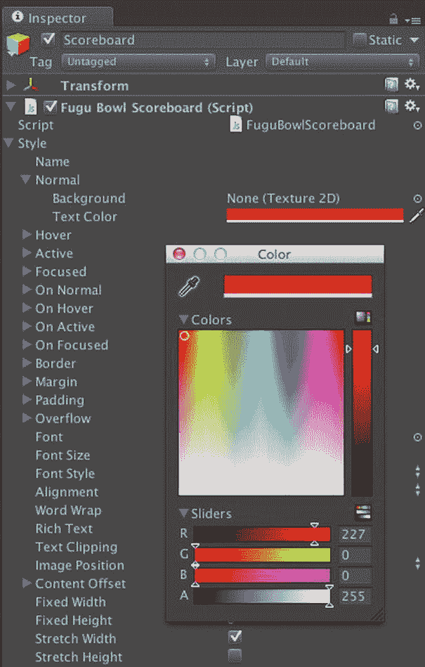

图 9-3. `GUIStyle` 选项

在众多其他`GUIStyle`属性中，有几个会影响 GUI 字体，默认使用 Unity 的内置字体 Arial。您可以通过将字体资源从 Project 视图拖到`GUIStyle`的 Font 字段（在脚本中，对应变量`style.font`）来更改字体。任何 TrueType、OpenType 或 dfont 格式的字体都可以导入到 Unity 中。

其他`GUIStyle`属性控制字体大小和样式（对于作为动态字体导入的字体资源）、文本对齐和自动换行。

富文本格式特别有趣，因为它为标签文本提供了类似 HTML 的标记。所以实际上，尽管脚本很简单，但您的样式自定义选项非常丰富！

### 暂停菜单

与记分牌相比，开始/暂停菜单将需要更多的脚本编写，因此，首先需要进行设计。让我们创建一个主菜单和两个子菜单：一个用于游戏选项，一个用于显示游戏制作人员。选项菜单将有独立的音频、图形、系统和统计面板。逻辑虽然没有保龄球游戏控制器那么复杂，但这是另一个应该首先将设计草图绘制成状态图的示例（图 9-4）。

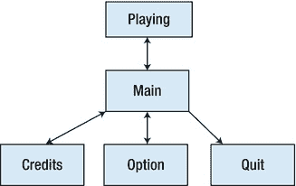


好的，作为高级文档工程师和翻译员，我将根据您提供的注意事项和示例，将给定的英文文本翻译成中文。


图 9-4. 暂停菜单的状态图

该图显示，玩家可以从游戏进行状态（或等效地，菜单不可见状态）进入主暂停菜单，并从那里进入制作人员屏幕、选项菜单或退出游戏。选项菜单又可以显示音频、图形、系统或统计面板，每一个都可以被列为状态，但为了简单起见，我们目前只将每个顶级菜单屏幕视为一个状态。

除了“退出”（可将其视为退出状态）之外，所有状态都可以转换回最初转换到它们的状态，这就是为什么每个转换箭头都是双向绘制的。这意味着玩家可以从主菜单进入选项菜单，再返回主菜单，然后从那里可以返回到正常的游戏模式。但是，例如，不会有从选项菜单直接返回到游戏的快捷方式。

### 创建脚本

让我们通过在“项目”视图的“脚本”文件夹中创建一个新的 JavaScript 并将其命名为`FuguPause`来开始暂停菜单的实现（图 9-5）。

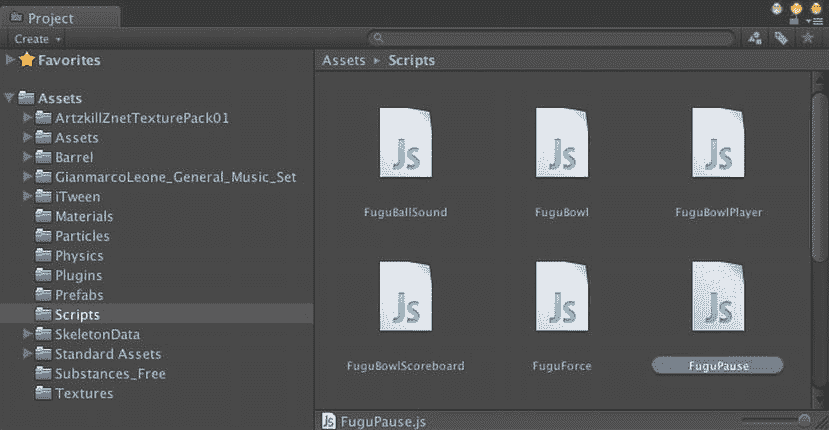

图 9-5. 创建`FuguPause.js`脚本

现在，要将脚本添加到场景中，请在“层级”视图中创建一个新的 GameObject，将其命名为 PauseMenu，并将`FuguPause`脚本附加到 PauseMenu 游戏对象上。

### 跟踪当前菜单页面

在`FuguBowl`脚本中使用的使用协程实现状态机的技术不适用于 UnityGUI，因为所有 UnityGUI 函数都必须在`OnGUI`回调中调用。但状态图作为实现的基础仍然有用。对于初学者，我们可以专注于表示不同菜单屏幕的状态。让我们将它们称为“页面”，以区别于更通用的术语“屏幕”。这些菜单状态可以通过字符串或整数来区分，但当你有几个相关但不同的值时，枚举类型就很合适了。因此，让我们为菜单页面状态定义一个名为`Page`的`enum`，并定义一个名为`currentPage`的变量来跟踪当前正在显示的页面（列表 9-3）。

列表 9-3.  菜单页面的枚举

```
enum Page {
       None, Main, Options, Credits
}

private var currentPage:Page;
```

根据状态图，`enum`列出了无菜单（游戏正在运行）、主菜单页面、选项页面和制作人员页面的状态。由于变量`currentPage`是`Page`类型，因此只能为`Page.None`、`Page.Main`、`Page.Options`或`Page.Credits`这四个值之一赋值给该变量。

### 暂停游戏

制作暂停菜单涉及解决两个问题：制作菜单和暂停游戏。我们将从暂停游戏开始。静态变量`Time.timeScale`指定模拟游戏时间的流逝速度，默认为 1。将`Time.timeScale`设置为 0 会有效地暂停游戏，暂停物理、动画以及任何依赖于`Time.time`进展的其他内容。因此，让我们创建一个将`Time.timeScale`设置为 0 的`PauseGame`函数（列表 9-4）。

列表 9-4.  在`FuguPause.js`中暂停游戏的函数

```
private var savedTimeScale:float;       // 暂停前的 Time.timeScale

function PauseGame() {
       savedTimeScale = Time.timeScale; // 保存正常的时间缩放值
       Time.timeScale = 0;              // 暂停时间
       AudioListener.pause = true;      // 暂停音乐
       currentPage = Page.Main;         // 从主菜单页面开始
}
```

`PauseGame`首先将当前的`Time.timeScale`保存到变量`savedTimeScale`中，以便我们可以在游戏恢复时恢复`Time.timeScale`（我们不应该假设游戏暂停时`Time.timeScale`为 1）。

`PauseGame`还将`AudioListener.pause`设置为 true，这会暂停任何正在播放的声音（如果你打算在菜单中播放声音，则不应这样做）。

最后，将`currentPage`变量设置为`Page.Main`，表示应该显示主暂停屏幕。

通过反转所有这些操作来恢复游戏（列表 9-5）。

列表 9-5.  在`FuguPause.js`中恢复游戏的函数

```
function UnPauseGame() {
       Time.timeScale = savedTimeScale;
       AudioListener.pause = false;
       currentPage = Page.None;
}
```

`UnPauseGame`将`Time.timeScale`恢复为由`PauseGame`保存在变量`savedTimeScale`中的值，并将`AudioListener.pause`设置为 false 以重新启用音频。

要查看游戏是否暂停，您可以检查`Time.timeScale`是否为 0。列表 9-6 显示了一个用于此目的的便捷函数。注意它是一个静态函数，因此任何脚本都可以通过`FuguPause.IsGamePaused()`调用它。

列表 9-6.  在`FuguPause.js`中检查游戏是否暂停

```
static function IsGamePaused() {
       return Time.timeScale==0;
}
```

如果游戏要一开始就暂停，`Start`回调应该调用`PauseGame`（列表 9-7）。添加一个公共的`boolean`变量`startPaused`并在调用`PauseGame`之前检查它，可以使初始暂停变为可选。

列表 9-7.  在`FuguPause.js`的`Start`回调中暂停游戏

```
var startPaused:boolean = true; // 游戏开始时弹出菜单

function Start() {
       if (startPaused) {
               PauseGame();
       }
}
```

由于`startPaused`的默认值是 true，如果你点击“播放”，游戏会立即暂停，显示球悬浮在空中。然后你会卡住，因为没有菜单。也没有办法取消暂停然后再暂停，所以让我们让 Escape 键（大多数键盘左上角标有 ESC 的键）来切换暂停状态。输入处理通常在`Update`回调中执行，这里也不例外（列表 9-8）。

列表 9-8.  在`FuguPause.js`的`Update`回调中处理 Escape 键

```
function Update() {
       if (Input.GetKeyDown("escape"))	{
               switch (currentPage) {
                      case Page.None: PauseGame(); break;   // 如果未暂停，则暂停
                      case Page.Main: UnPauseGame(); break; // 如果已暂停，则取消暂停
                      default: currentPage = Page.Main;     // 任何子页面都返回到主页面
               }
       }
}
```

第一行检查 ESC 键是否被按下。如果被按下，则调用`PauseGame`，除非暂停菜单已经显示。该函数还将 ESC 视为返回键，从子页面切换到主页面，或从主页面切换到未暂停状态。

## 检查`Time.DeltaTime`

将`Time.timeScale`设置为 0 会停止`Time.time`的推进，因此`Time.deltaTime`始终为 0。这对于将多个值乘以`Time.deltaTime`的`Update`函数来说效果很好，但在时间冻结时除以`Time.deltaTime`会导致除以零的错误。`FuguForce`脚本的`Update`回调中就有这样一种情况，因此在继续处理暂停菜单之前，必须解决这个问题（列表 9-9）。

列表 9-9.  在`FuguForce.js`中避免除以零

```
function Update() {
       forcex = 0;
       forcey = 0;
       if (Time.deltaTime > 0) {
               CalcForce();
       }
}

function CalcForce() {
       var deltaTime:float = Time.deltaTime;
       forcex = mousepowerx*Input.GetAxis("Mouse X")/deltaTime;
       forcey = mousepowery*Input.GetAxis("Mouse Y")/deltaTime;
}
```


不再直接将滚动力的值除以 `Time.deltaTime`，现在的 `Update` 回调会在进行力计算之前先检查 `Time.deltaTime` 是否不为 0，而力计算现已被移入 `CalcForce` 函数。`Update` 函数始终将力的值初始化为 0，以确保游戏暂停时不会对保龄球施加任何残留的力。

### 显示菜单

与上一节中的记分板类似，暂停菜单的实际显示必须在 `OnGUI` 回调函数中进行。具体来说，`OnGUI` 需要检查游戏是否暂停，如果暂停，则显示当前菜单页面（代码清单 9-10）。

代码清单 9-10。`FuguPause.js` 中的 `OnGUI` 回调

```
function OnGUI () {
       if (IsGamePaused()) {
               switch (currentPage) {
                      case Page.Main: ShowPauseMenu(); break;
                      case Page.Options: ShowOptions(); break;
                      case Page.Credits: ShowCredits(); break;
               }
       }
}

function ShowPauseMenu() { Debug.Log("Main Pause"); }
function ShowOptions() { Debug.Log("Options"); }
function ShowCredits() { Debug.Log("Credits"); }
```

目前，每个页面显示函数都只是占位符，这使得脚本在你逐个填充每个显示函数时，始终处于可运行状态（即没有编译错误）。一个很好的做法是在这些存根函数内放置 `Debug.Log` 语句，以验证它们是否在预期的时间被调用。例如，如果你点击播放，每次暂停游戏时，都应该在控制台视图中看到“`Main Pause`”出现。

### 自动布局

对于垂直堆叠并居中显示在屏幕上的菜单按钮，你可以利用 `GUILayout` 函数，从而避免计算每个本应传递给 `GUI.Button` 的 `Rect`。在 `GUILayout.BeginArea` 和 `GUILayout.EndArea` 的调用之间，你可以使用 GUI 函数的 `GUILayout` 版本来创建 GUI 控件，而无需为每个控件传递 `Rect`。这些控件将自动在传递给 `GUILayout.BeginArea` 的 `Rect` 内进行放置和调整大小。由于所有暂停菜单页面都会以相同方式显示，让我们创建一些包装 `GUILayout` 函数的便捷函数（代码清单 9-11）。

代码清单 9-11。`FuguPause.js` 中用于页面定位的 `GUILayout` 函数

```
var menutop:int=25; // 菜单顶部 y 坐标

function BeginPage(width:int,height:int) {
        GUILayout.BeginArea(Rect((Screen.width-width)/2,menutop,width,height));
}

function EndPage() {
       if (currentPage != Page.Main && GUILayout.Button("返回")) {
               currentPage = Page.Main;
       }
       GUILayout.EndArea();
}
```

`BeginPage` 函数调用 `GUILayout.BeginArea`，该区域由作为参数传入的宽度和高度指定，在屏幕上水平居中，其顶部边缘与屏幕顶部的距离由公共变量 `menutop` 指定。

`EndPage` 函数调用 `GUILayout.EndArea`，但在此之前，如果当前页面不是主页面，则显示一个返回按钮。如果该按钮被点击，则当前页面被设置为主页面。

### 主页面

现在我们已经拥有了在屏幕上显示菜单所需的所有部分。代码清单 9-12 展示了一个功能完备的 `ShowPauseMenu` 函数。

代码清单 9-12。`FuguPause.js` 中显示暂停菜单的函数

```
function ShowPauseMenu() {
       BeginPage(150,300);
       if (GUILayout.Button ("继续")) {
               UnPauseGame();
       }
       if (GUILayout.Button ("选项")) {
               currentPage = Page.Options;
       }
       if (GUILayout.Button ("制作人员")) {
               currentPage = Page.Credits;
       }
#if !UNITY_WEBPLAYER && !UNITY_EDITOR
       if (GUILayout.Button ("退出")) {
               Application.Quit();
       }
#endif
       EndPage();
}
```

位于 `BeginPage` 和 `EndPage` 之间的所有 GUI 代码实际上都是在 `GUILayout.BeginArea` 和 `GUILayout.EndArea` 之间执行的，因此你可以使用 GUI 调用的 `GUILayout` 版本来创建元素，而无需传递 `Rect`。例如，你可以调用 `GUILayout.Button` 而不是 `GUI.Button`。除了缺少 `Rect` 参数外，这些函数在其他方面看起来完全相同。

`GUILayout.Button` 与 `GUILayout.Label` 的不同之处在于，它会根据按钮是否被按下来返回 true 或 false。因此，每次对 `GUILayout.Button` 的调用都位于一个 `if` 测试内部，如果按钮确实被按下，则执行相应的语句。

当你点击播放时，现在会看到主菜单，并且菜单中的“继续”按钮应该解除游戏的暂停状态（图 9-6）。`Application.Quit` 在 Unity 网页播放器或编辑器中没有任何功能，因此该代码段被包围在对相应预处理器定义 `UNITY_WEBPLAYER` 和 `UNITY_EDITOR` 的测试中，以查看构建目标是网页播放器还是你正在编辑器中运行。这些定义在编译之前就会被评估（因此称为“预处理器”），所以如果 `UNITY_WEBPLAYER` 为 false 且 `UNITY_EDITOR` 也为 false，则包含的代码会被编译。否则，就好像这段代码从未存在过一样。

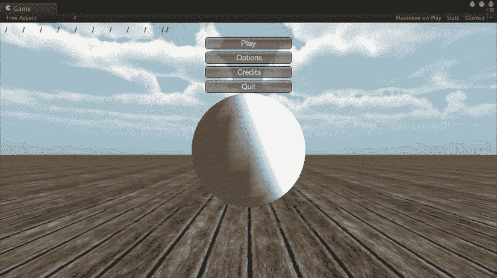

图 9-6。主菜单

“制作人员”和“选项”按钮暂时还不会有任何反应，因为 `ShowCredits` 和 `ShowOptions` 函数仍然是空壳。制作人员页面更简单，所以我们先从这个开始。

### 制作人员页面

多条制作人员条目可以存储在一个 `String` 数组中。为此定义了一个变量 `credits`，以及一个用于显示制作人员信息的 `ShowCredits` 函数，如代码清单 9-13 所示。

代码清单 9-13。`FuguPause.js` 中显示制作人员页面的函数

```
var credits:String[]=[
       "河豚游戏工作室出品",
       "版权所有 (c) 2012 Technicat, LLC。保留所有权利。",
       "更多信息请访问 http://fugugames.com/"] ;

function ShowCredits() {
       BeginPage(300,300);
       for (var credit in credits) {
               GUILayout.Label(credit);
       }
       EndPage();
}
```

由于变量 `credits` 是公共的，你可以在检视面板中编辑每一条制作人员信息，并可以向数组中添加或从中移除条目。

`ShowCredits` 函数遍历制作人员数组，并在 UnityGUI 标签中显示每一条（图 9-7）。请注意，有一种简单的方法可以使用 `in` 来遍历数组，而不是通常的遍历一系列数组索引的习惯用法。在这种特殊情况下，你不需要为其他任何用途使用索引，所以让我们采用更简单的方法。

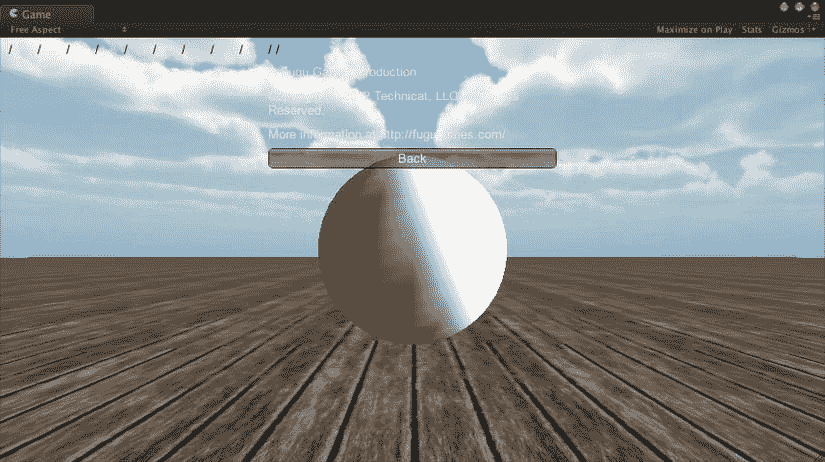

图 9-7。制作人员页面

和主菜单一样，你以调用 `BeginPage` 开始，以 `EndPage` 结束，因此你在一个 `GUILayout` 区域（这次是 300 × 300）内操作，并且可以使用 `GUILayout.Label` 代替 `GUI.Label`。`EndPage` 确保自动有一个返回按钮。并且请记住，`Update` 回调也会将 ESC 键视为点击返回按钮。

### 选项页面


### 选项页面

`选项`页面比`积分`页面要复杂得多，因为它包含一个通过四个选项卡实现的工具栏：`音频`、`图形`、`统计`和`系统`。代码清单 9-14 展示了完善后的`ShowToolbar`函数及其相关变量和函数。

代码清单 9-14. `FuguPause.js`中的选项页面

```
private var toolbarIndex:int=0; // 当前工具栏选择
private var toolbarStrings: String[]= ["Audio","Graphics","System"]; // 选项卡

function ShowOptions() {
       BeginPage(300,300);
       toolbarIndex = GUILayout.Toolbar (toolbarIndex, toolbarStrings);
       switch (toolbarInt) {
               case 0: ShowAudio(); break;
               case 1: ShowGraphics(); break;
               case 2: ShowSystem(); break;
       }
       EndPage();
}

function ShowAudio() { Debug.Log("ShowAudio"); }
function ShowGraphics() { Debug.Log("ShowGraphics"); }
function ShowSystem() { Debug.Log("ShowSystem"); }
```

再次强调，`ShowOptions`函数中的所有代码都包裹在`BeginPage`和`EndPage`函数调用之间。第一行调用`GUILayout.Toolbar`，通过一个`String`数组创建了一个工具栏——即一行按钮，充当选项卡或单选按钮——其中每个`String`都是按钮的标签。该函数还接收一个整数，对应字符串数组中的位置。该整数用于指定当前在工具栏上处于激活状态的按钮。但如果仅写：

```
GUILayout.Toolbar (toolbarIndex, toolbarStrings);
```

那么`toolbarIndex`将永远不会改变其初始值（`0`），即使你点击了其他按钮，下次调用该函数时（在`OnGUI`的下一次调用中），激活的按钮仍会被重置为该初始值。

但`GUILayoutToolbar`会返回一个代表当前激活按钮的整数，因此你可以将该返回值赋回给传入的变量`toolbarIndex`。

```
toolbarIndex = GUILayout.Toolbar (toolbarIndex, toolbarStrings);
```

因此，`toolbarIndex`初始为`0`，但如果你点击`Graphics`，它会变为`1`；如果点击`Controls`，它会变为`2`，以此类推。接着是一个`switch`语句，它检查`toolbarIndex`并调用与所选按钮对应的显示函数。与主菜单类似，我们从存根函数开始，然后逐个实现。你可以尝试点击各个按钮，应该能看到对应的函数名称显示在控制台视图中，因为目前你只编写了这些功能！

#### 音频面板

当选中音频选项卡时，它会显示一个用于音量控制的滑块（图 9-8）。

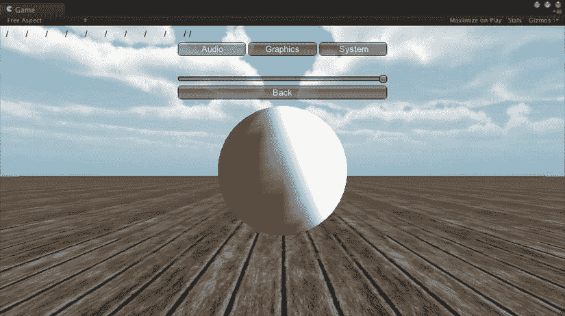

图 9-8. 暂停菜单中的音频面板

在`ShowAudio`函数中添加该滑块实际上非常简单，只需一行代码。嗯，严格来说是两行，因为不带标签的滑块会显得过于神秘（代码清单 9-15）。

代码清单 9-15. `FuguPause.js`中的音频面板

```
function ShowAudio() {
       GUILayout.Label("音量");
       AudioListener.volume = GUILayout.HorizontalSlider(AudioListener.volume,0.0,1.0);
}
```

第一行调用了`GUILayout.Label`，现在你应该已经很熟悉了。第二行调用了`GUILayout.HorizontalSlider`，它接收滑块代表的最小值、最大值以及代表当前设置的值作为参数。

该滑块反映的是`AudioListener.volume`的值，而这个值掌管着 Unity 中所有声音的总音量。因此，`AudioListener.volume`被作为滑块的当前值传入；又因为`AudioListener.volume`的取值范围是`0`到`1`，所以这两个值分别被用作最小值和最大值。并且，为了记录滑块的值，`GUILayout.Slider`的返回值被重新赋给了`AudioListener.volume`。否则，`AudioListener.volume`的值将永远不会改变，滑块也就无法移动。


#### 图形面板

图形面板将显示与 Unity 编辑器质量设置（图 9-9）相同的部分图形质量信息。

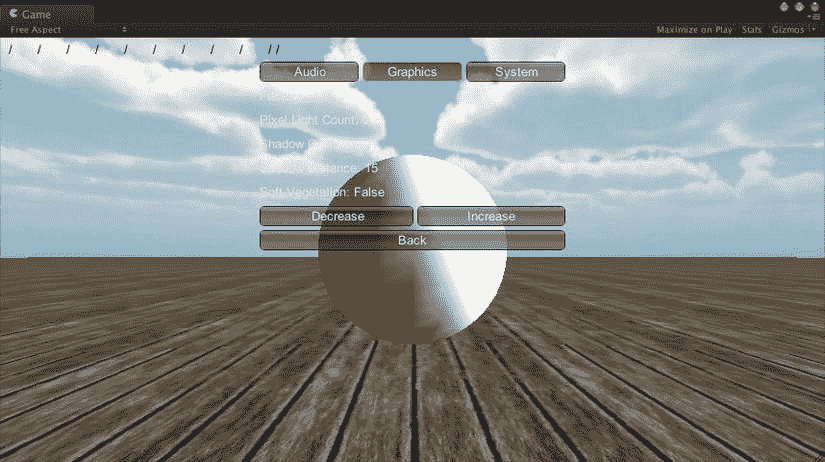

图 9-9. 暂停菜单中的图形选项

面板底部的两个按钮用于提高和降低质量设置级别。该面板无需新的 UnityGUI 控件即可实现，但需要访问 `QualitySettings` 类（清单 9-16）。

清单 9-16. 显示质量设置的函数

```
function ShowGraphics() {
       GUILayout.Label(QualitySettings.names[QualitySettings.GetQualityLevel()]);
       GUILayout.Label("Pixel Light Count: "+QualitySettings.pixelLightCount);
       GUILayout.Label("Shadow Cascades: "+QualitySettings.shadowCascades);
       GUILayout.Label("Shadow Distance: "+QualitySettings.shadowDistance);
       GUILayout.Label("Soft Vegetation: "+QualitySettings.softVegetation);
       GUILayout.BeginHorizontal();
       if (GUILayout.Button("Decrease")) {
               QualitySettings.DecreaseLevel();
       }
       if (GUILayout.Button("Increase")) {
               QualitySettings.IncreaseLevel();
       }
       GUILayout.EndHorizontal();
}
```

`ShowGraphics` 函数相当直观。它通过调用 `QualitySettings.GetQualityLevel` 获取当前质量设置级别（以整数表示），然后将该整数作为索引，从 `QualitySettings.names` 数组中检索该质量设置的名称。该名称及若干质量设置属性会显示在标签中，底部放置了两个按钮：一个调用 `QualitySettings.DecreaseLevel`，另一个调用 `QualitySettings.IncreaseLevel`。

这两个按钮允许你在现有级别范围内提高或降低质量设置级别。你不仅会看到显示的质量设置信息发生变化，还可能会亲眼目睹场景的图形质量改变——因为即使游戏时间暂停，场景仍在每帧渲染。

#### 系统面板

系统面板显示硬件平台的相关信息（图 9-10）。

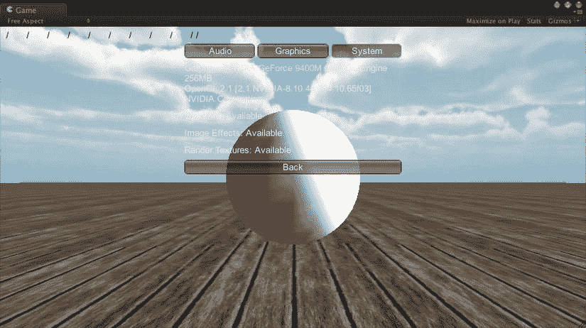

图 9-10. 暂停菜单中的系统面板

与图形页面类似，信息通过标签显示，但图形页面访问的是 `QualitySettings` 类，而系统面板访问的是 `SystemInfo` 类（清单 9-17）。

清单 9-17. `FuguPause.js` 中的系统面板

```
function ShowSystem() {
       GUILayout.Label("Graphics: "+SystemInfo.graphicsDeviceName+" "+
       SystemInfo.graphicsMemorySize+"MB\n"+
       SystemInfo.graphicsDeviceVersion+"\n"+
       SystemInfo.graphicsDeviceVendor);
       GUILayout.Label("Shadows: "+ Available(SystemInfo.supportsShadows));
       GUILayout.Label("Image Effects: "+Available(SystemInfo.supportsImageEffects));
       GUILayout.Label("Render Textures: "+Available(SystemInfo.supportsRenderTextures));
}
```

`SystemInfo` 类提供图形硬件及其功能的信息，包括一些识别信息，如设备名称、供应商名称、图形内存大小，以及硬件是否支持某些更高级的功能（例如动态阴影、渲染到纹理或图像效果，后者需要渲染到纹理）。

### 自定义 GUI 颜色

你可能注意到暂停菜单中的白色文本有时难以阅读。一种解决方法是更改静态变量 `GUI.color`，它能用 `color` 值为整个 GUI 着色（清单 9-18）。

清单 9-18. `FuguPause.js` 中的 GUI 颜色自定义

```
var hudColor:Color = Color.white;

function OnGUI () {
       if (IsGamePaused()) {
               GUI.color = hudColor;
               switch (currentPage) {
                      case Page.Main: ShowPauseMenu(); break;
                      case Page.Options: ShowOptions(); break;
                      case Page.Credits: ShowCredits(); break;
               }
       }
}
```

我们在 `FuguPause` 脚本中添加了一个公共变量 `hudColor`，以便在检视面板中选择 `color`。所有 UnityGUI 操作（包括设置 `GUI.Color` 等变量）都必须在 `OnGUI` 回调中进行，因此对 `GUI.color` 的赋值放置在 `OnGUI` 回调内，在所有 GUI 控件创建之前（但在调用 `IsGamePaused` 之后，因为如果没有 GUI 渲染，则无需设置 `GUI.Color`）。请注意，你可以在 `OnGUI` 中多次设置 `GUI.color`，以便在渲染 GUI 的不同部分之前更改颜色。

现在你可以在检视面板中选择颜色（图 9-11），并看到由此产生的 GUI 色调（图 9-12）。

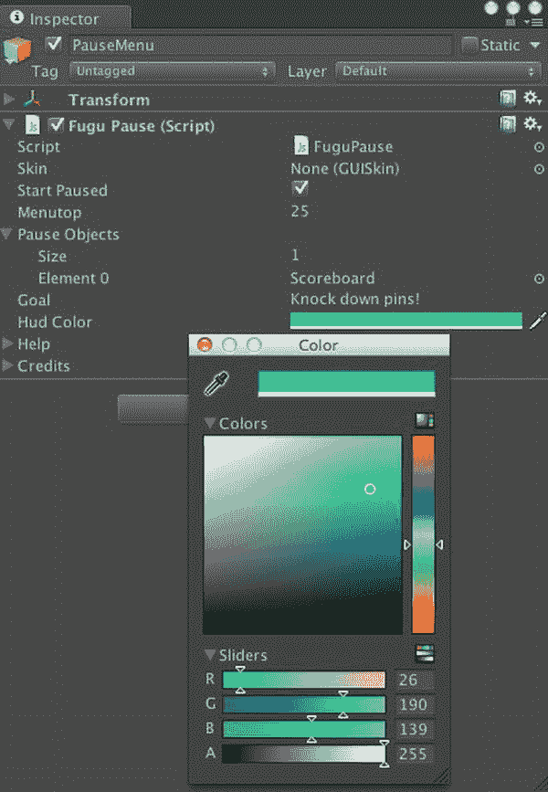

图 9-11. 暂停菜单的颜色选择


图 9-12. 使用自定义颜色的暂停菜单

### 自定义皮肤

默认的 UnityGUI 皮肤相当中性，且文本难以阅读，正如上一节暂停菜单所示。对于记分板，你可以通过调整传递给 `GUI.Label` 的样式来更改文本颜色，但如果 GUI 元素较多，这会很麻烦。

这正是 UnityGUI 皮肤的用武之地。*皮肤*是分配给各种 GUI 元素的样式集合。应用皮肤很简单——只需声明一个 `GUISkin` 类型的公共变量，并在 `OnGUI` 回调中将该皮肤赋值给变量 `GUI.skin`，类似于赋值 `GUI.Color`（清单 9-19）。

清单 9-19. 为暂停菜单添加 `GUISkin`

```
var skin:GUISkin;

function OnGUI () {
       if (IsGamePaused()) {
               if (skin != null) {
                      GUI.skin = skin;
               } else {
                      GUI.color = hudColor;
               }
               switch (currentPage) {
                      case Page.Main: ShowPauseMenu(); break;
                      case Page.Options: ShowOptions(); break;
                      case Page.Credits: ShowCredits(); break;
               }
       }
}
```

你可以使用资源商店中一款名为 Necromancer GUI 的炫酷免费 UnityGUI 皮肤来测试此皮肤支持（图 9-13）。

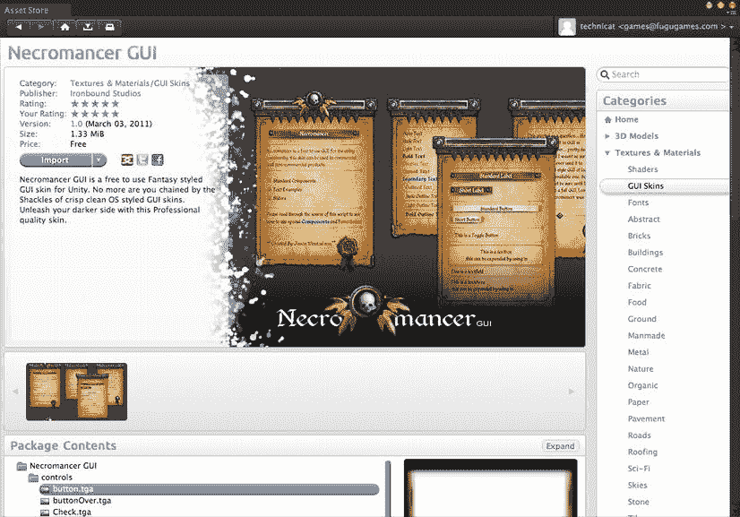

图 9-13. 资源商店中的 Necromancer GUI

下载并导入 Necromancer GUI，然后将它的皮肤文件（名为 Necromancer GUI）拖拽到检视面板中新增的 Skin 属性中（图 9-14）。

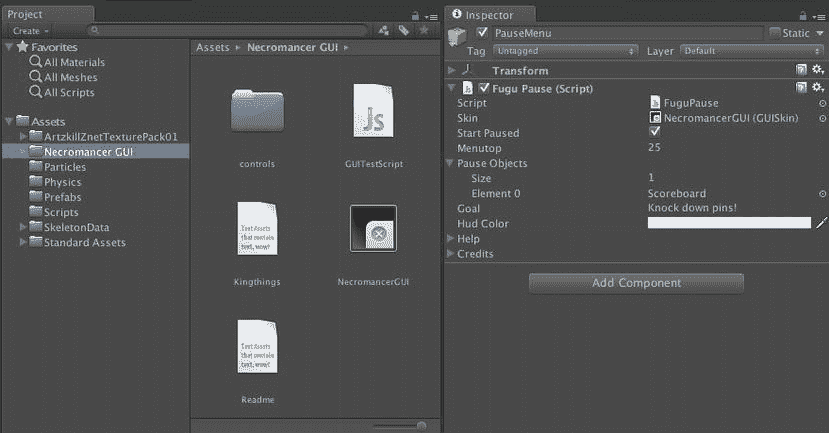

图 9-14. Necromancer GUI

然后点击播放，你将看到一个更加华丽的暂停菜单。图 9-15 展示了使用 Necromancer GUI 时暂停菜单图形面板的外观。看看那些漂亮的按钮！

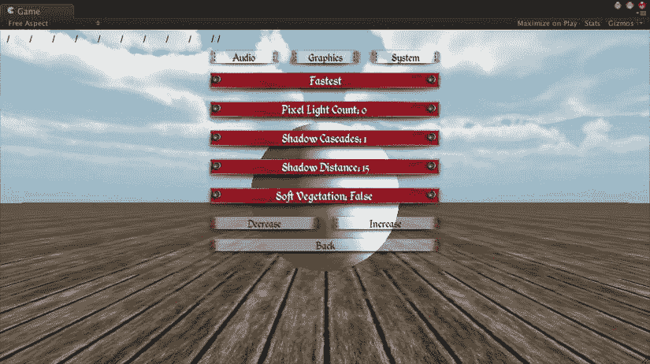

图 9-15. 实际应用中的 Necromancer GUI 皮肤

### 完整脚本


