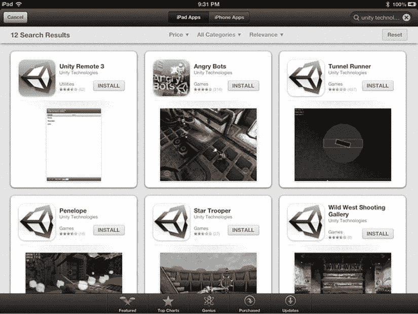

# 第 10 章 使用 Unity iOS

恭喜！你现在已经拥有了一款保龄球游戏，它包含了通常构成 3D 游戏的基本功能：3D 图形（当然）、物理效果、音效、玩家控制（保龄球）、摄像机运动以及图形用户界面。

默认的构建目标显示在编辑器窗口的标题栏上，为 PC、Mac 和 Linux 独立平台。如果现在对保龄球项目进行 OS X 构建，游戏的运行效果将与在编辑器中基本相同。同样适用于 Linux、Windows，甚至是网络播放器（不过网络播放器构建需要你先切换构建目标）。

针对 iOS 则是另一回事。你现在可以将保龄球游戏的构建目标更改为 iOS，并进行构建而不会出现任何编译器错误。但`FuguForce.js`中的保龄球控制是为鼠标输入设计的，因此需要更改。除了重新实现输入处理之外，将桌面 PC 游戏适配到移动设备（这个过程称为*移植*）通常还需要对设备显示进行调整，并做出妥协以达到足够的性能。

此外，与桌面独立平台和网络播放器目标相比，构建 iOS 应用涉及更多的外部流程。由于 Apple 要求所有 iOS 应用都必须使用 Xcode 编译，Unity iOS 通过首先生成一个 Xcode 项目来构建应用，然后由 Xcode 编译该项目以创建最终应用。而要在测试设备上实际运行应用并将应用提交到 App Store，则需要一系列相当复杂的流程，以及加入 Apple 的 iOS 开发者计划。

现在，让我们回到起点，暂时回归到本书开始时使用的 Angry Bots 演示项目。方便的是，Angry Bots 无需修改即可在 iOS 上运行。如果你有 iOS 设备，请从 App Store 下载 Angry Bots。在 App Store 搜索框中输入“unity technologies”可以快速找到 Angry Bots 应用，它将与 Unity Technologies 的其他应用一起出现（图 10-1）。

图 10-1 App Store 上 Unity Technologies 的示例应用

除了 Angry Bots，你还应该下载 Unity Remote 应用，它作为远程控制工具，用于在编辑器中测试 Unity iOS 游戏。顺便，你应该下载并尝试 Unity Technologies 的所有示例应用。其中许多应用已经很长时间没有更新，但它们确实提供了一些关于可以用 Unity 创建什么类型游戏的思路。

