# 在 Unity 中使用 iOS 构建目标

当你从 App Store 将`Angry Bots`安装到 iOS 设备并开始游戏后，请注意游戏中为玩家移动和射击设计了虚拟摇杆（如图 10-2 所示），这个功能此前在`Angry Bots`中并未出现。

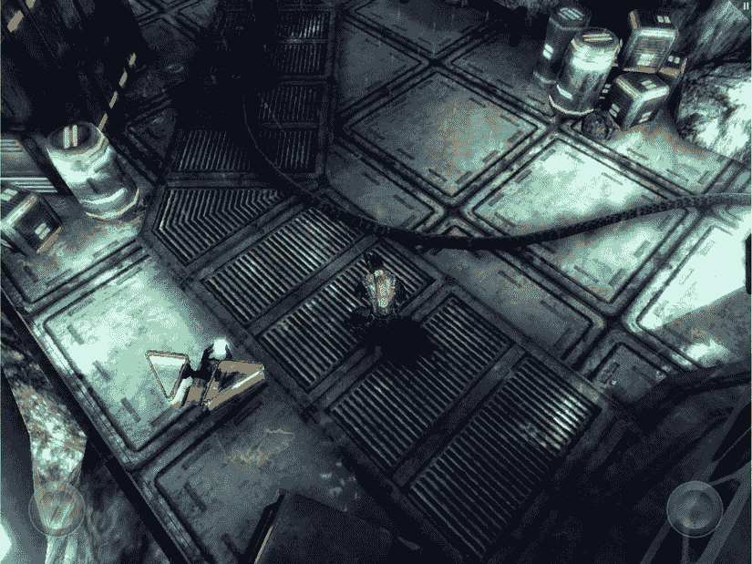

*图 10-2. 带有虚拟摇杆的 iOS 版 Angry Bots*

虽然`Angry Bots`的 iOS 版本采用了不同的控制方式，但它与 Unity 内置安装的`Angry Bots`版本基于相同的源代码。因此，我们将暂缓保龄球游戏的 iOS 移植工作，在未来几章中重新熟悉`Angry Bots`，以便专注于 Unity iOS 构建与测试流程。本章你将学习如何使用 Unity Remote 和 Xcode 中的 iOS 模拟器测试`Angry Bots`的 Unity iOS 版本。

### 重新打开 Angry Bots

返回`Angry Bots`项目，从`File`菜单中选择`Open Project`，`Angry Bots`应会出现在最近项目列表中（如图 10-3 所示）。

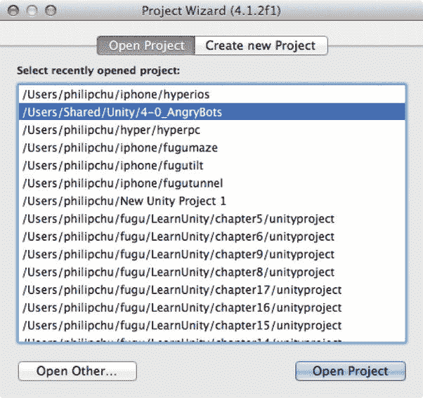

*图 10-3. Angry Bots 出现在最近项目列表中*

如果`Angry Bots`未在列表中，请点击`Open Other`按钮，在 Unity 示例文件夹中查找`Angry Bots`，路径为：`Users`  `Shared`  `Unity`（如图 10-4 所示）。

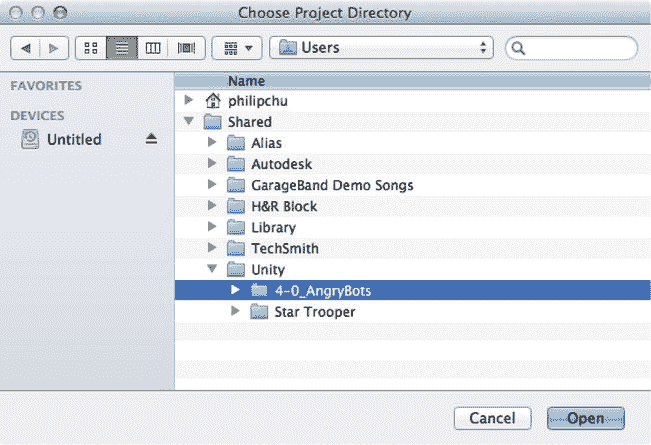

*图 10-4. 打开 Angry Bots 项目*

现在回到`Angry Bots`，让我们将构建目标切换为 iOS。通过`File`菜单中的`Build Settings`命令打开`Build Settings`窗口。左侧`Platforms`列表显示可用的构建目标，Unity 图标标记当前构建目标，目前应为`PC, Mac & Linux Standalone`（如图 10-5 所示）。

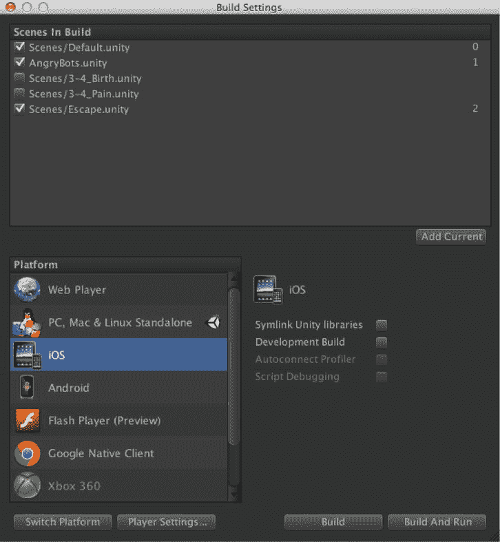

*图 10-5. 默认目标平台的构建设置*

要为 iOS 构建游戏，请在`Platform`列表中选择`iOS`，然后点击左下角的`Switch Platform`按钮，以 iOS 需要的格式重新导入项目资源。重新导入过程中将显示进度对话框（如图 10-6 所示）。

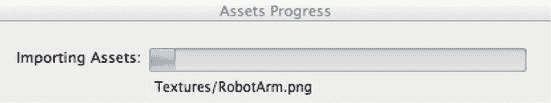

*图 10-6. 切换构建目标时重新导入资源的进度条*

包含大量资源的项目可能需要较长时间重新导入，在此期间编辑器将无响应。但一旦资源转换完成，`Build Settings`窗口的`Platform`列表中`iOS`旁将显示 Unity 图标，表明 iOS 已成为当前构建目标（如图 10-7 所示）。

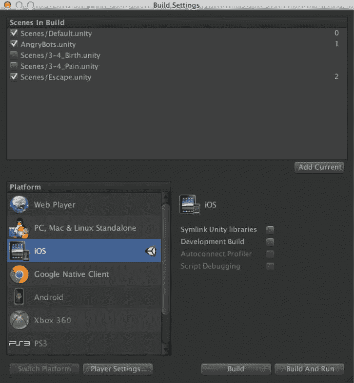

*图 10-7. 以 iOS 为构建目标的构建设置*

另外请注意，当选择`iOS`时，`Switch Platform`按钮变为灰色，表示资源转换已完成。

> **提示：** 如果你选择了`iOS`但忘记点击`Switch Platform`按钮，首次执行构建时项目资源仍会自动转换。不过最好立即转换项目资源，以便在编辑器内检查和测试游戏，尽早发现平台相关问题。

另一个表明构建目标变为 iOS 的标志是：编辑器窗口标题栏原来显示`PC, Mac & Linux Standalone`，现在则显示`iPhone, iPod Touch and iPad`（如图 10-8 所示）。

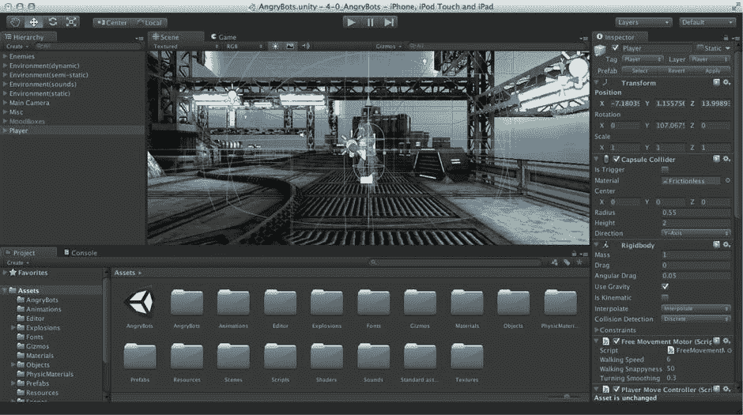

*图 10-8. 以 iOS 为构建目标的 Unity 编辑器窗口*

现在`Angry Bots`已配置为 iOS 项目，让我们打开`AngryBots`场景——如果它尚未打开的话（很可能未打开，因为你刚从保龄球项目切换到`Angry Bots`项目）。

> **注意：** 从一个项目切换到另一个项目时，Unity 会尝试打开与前一个项目中打开场景同名的场景。如果不存在这样的场景，编辑器将打开一个新场景，就像你在`File`菜单中选择了`New Scene`一样。

`AngryBots`场景文件位于`Assets`文件夹的顶层（如图 10-9 所示），你可以双击`Project View`中的该文件打开场景，也可以使用`File`菜单中的`Open Scene`命令。

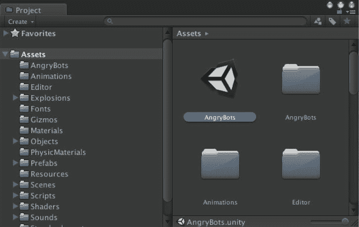

*图 10-9. AngryBots 场景文件的 Project 视图*

另一个表明当前构建目标为 iOS 的线索是：`Game View`左上角的屏幕尺寸菜单现在列出了 iOS 设备分辨率（如图 10-10 所示）。

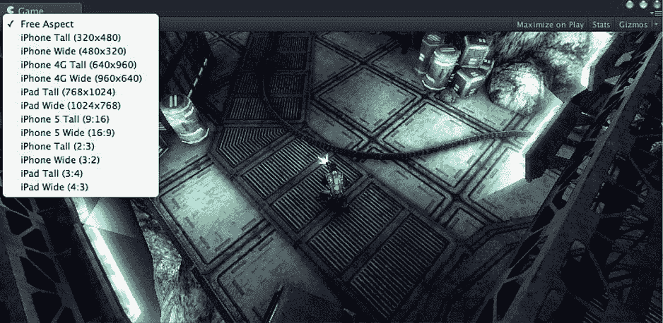

*图 10-10. Game View 中的 iOS 屏幕分辨率*

此外，当点击`Play`时，App Store 版本中的虚拟摇杆现在可见（如图 10-11 所示）。

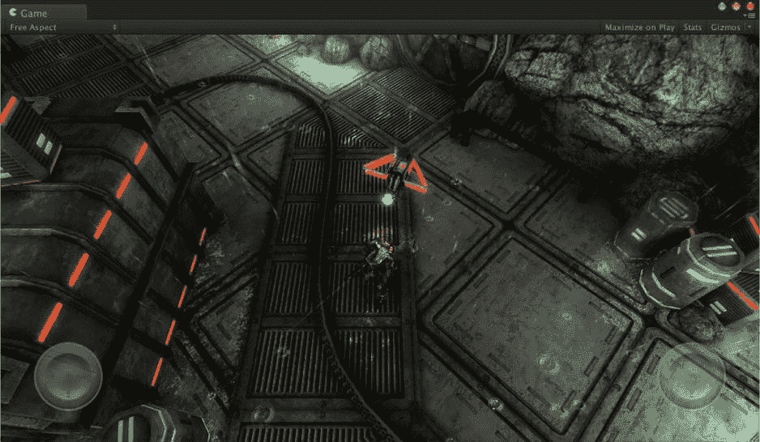

*图 10-11. 在编辑器中运行带有虚拟摇杆的 Angry Bots*

遗憾的是，虽然你可以看到`Angry Bots`中的机器人移动，但实际无法操作游戏——因为鼠标和键盘控制已被禁用，代码正在等待触屏输入来操控虚拟摇杆。不过别担心，这里有一种方法可以在编辑器测试中提供触屏输入！

### 使用 Unity Remote 进行测试

Unity 提供了一种非常酷的解决方案来在编辑器内测试 Unity iOS 项目，那就是`Unity Remote`应用。它运行在 iOS 设备上，通过 Wi-Fi 将触屏和加速度计数据从设备转发到 Unity 编辑器。如果你没有 iOS 设备，可以跳过本节，使用下一节介绍的 iOS 模拟器进行测试。

`Unity Remote`可以在 App Store 中找到，方式与`Angry Bots`应用相同：在 App Store 搜索框中输入`"unity technologies"`（如图 10-1 所示）。输入`"unity remote"`同样有效（如图 10-12 所示）。

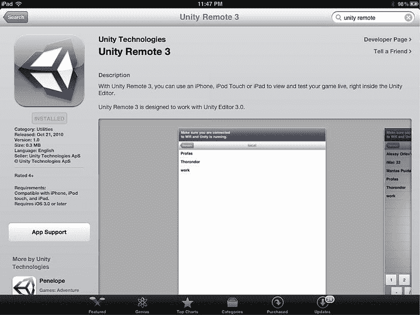

*图 10-12. App Store 中的 Unity Remote 应用*

将`Unity Remote`安装到 iOS 设备后，请确保该设备与运行 Unity 的 Mac 处于同一 Wi-Fi 网络。启动`Unity Remote`后，屏幕应显示该 Mac 的名称（如图 10-13 所示）。选择该计算机，如果 Unity 未处于`Play`模式，`Unity Remote`屏幕将保持等待状态，并显示提示让你在 Unity 编辑器中点击`Play`。

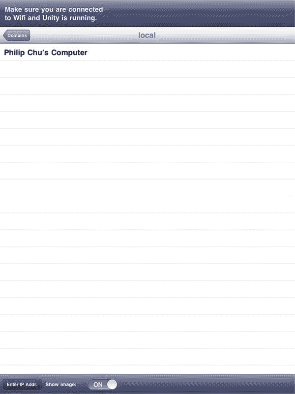

*图 10-13. Unity Remote 应用中的计算机选择*

当 Unity 编辑器处于`Play`模式时，`Game View`中的画面也会出现在`Unity Remote`中，你可以用设备的触屏来玩游戏！画面可能略显粗糙，因为 Unity 通过 Wi-Fi 向设备发送游戏画面的副本。你可以通过降低 Unity 编辑器中`Game View`的分辨率来改善性能（如图 10-14 所示）。

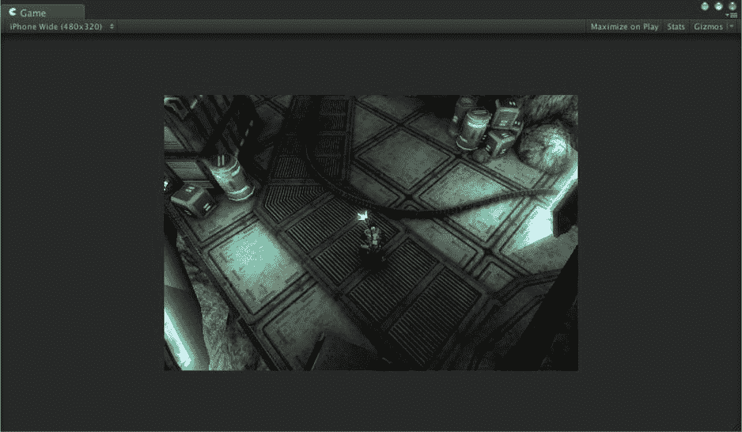

*图 10-14. Game View 中最小化的设备分辨率*


无论图形质量如何，你现在都可以在 iOS 设备上玩《愤怒的机器人》了，尽管你实际上仍然是在编辑器中进行游戏，只是将设备用作控制器。触摸屏输入通过 Wi-Fi 发送回 Unity 编辑器，并由在播放模式下运行的游戏接收，因此在测试运行期间，你仍然可以使用 Unity 编辑器的所有调试功能。真是两全其美！

### 安装 Xcode

在某些时候，你必须离开 Unity 编辑器的舒适区，真正开始为 iOS 进行构建。所有 iOS 应用都必须通过苹果官方 iOS 开发工具（同时也是其官方 OS X 开发工具）Xcode 进行构建，这就是为什么 Unity iOS 构建会首先生成一个 Xcode 项目，然后由 Xcode 构建该项目以创建应用。Xcode 可从苹果开发者网站免费获取，但更方便的是，它也可以在 Mac App Store 上找到。在 Mac App Store 中搜索 `xcode`，然后点击“免费”按钮进行下载（图 10-15）。

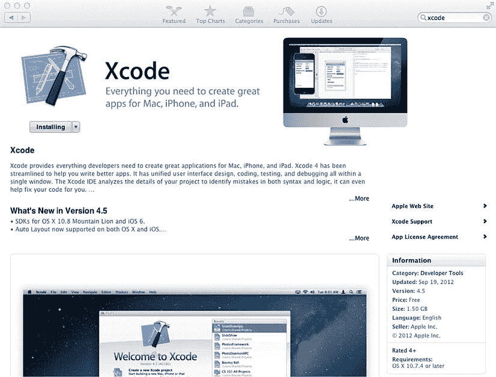

图 10-15. Mac App Store 中的 Xcode

安装完成后，你应该能在“应用程序”文件夹中看到 Xcode 应用。现在，你已经准备好从 Unity 开始执行 iOS 构建了！

### 自定义玩家设置

Unity iOS 构建总是需要自定义 Unity 编辑器中的玩家设置（Unity 播放器，相对于 Unity 编辑器，是 Unity 引擎的部署版本）。在 `Edit` 菜单下选择 `Player Settings`，或点击 Build 窗口中的 `Player Settings` 按钮，`Player Settings` 将显示在 Inspector 视图中（图 10-16）。

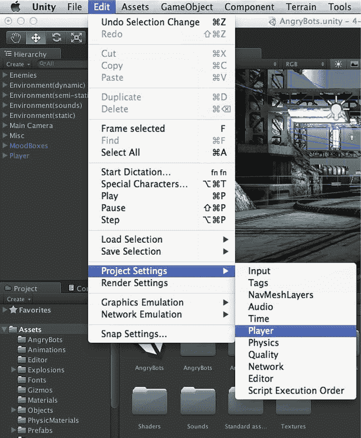

图 10-16. 选择玩家设置

`Player Settings` 分为顶部的跨平台设置和底部的各平台设置。影响 iOS 构建的跨平台设置只有两个：产品名称和默认图标，它们分别提供显示在设备上的应用名称和图标。

公司名称、默认光标和光标热点属性仅用于桌面和网页播放器构建，不过你也可以填写合适的公司名称或你的名字，以便在项目中留存。如果你想知道为什么跨平台设置并非完全跨平台，请记住 Unity 最初只支持网页和桌面平台，iOS 支持是几年后才加入的（而安卓支持则更晚）。

由于我们现在只关心 iOS 玩家设置，请点击看起来有点像 iPhone 的“各平台设置”标签，以查看 iOS 的设置（图 10-17）。

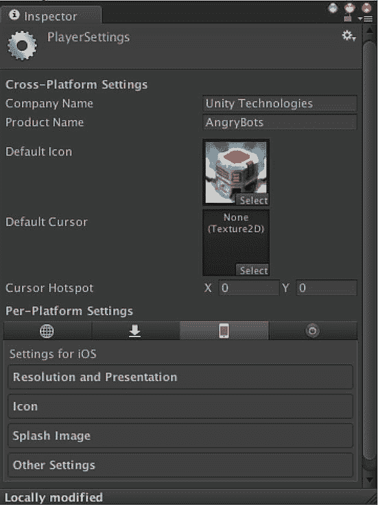

图 10-17. iOS 的玩家设置

`Player Settings` 内容丰富，因此被组织成几个可折叠部分：分辨率与呈现、图标、启动画面，以及包罗万象的其他设置。第 12 章专门讨论了呈现问题，包括图标和启动画面设置，因此现在我们主要关注分辨率与呈现以及其他设置。

#### 分辨率与呈现

大多数分辨率和呈现设置都有合理的默认值（图 10-18），但我建议始终将默认方向从“左向横屏”改为“自动旋转”，因为苹果要求 iPad 应用支持自动旋转，这意味着显示器会自动旋转以保持竖直。其他默认方向选项包括“右向横屏”、“竖屏”或“倒置竖屏”。

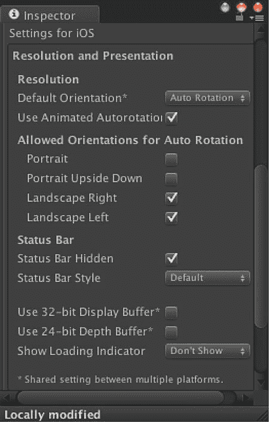

图 10-18. iOS 玩家设置中的分辨率与呈现

如果选择了“自动旋转”，则会显示“自动旋转允许的方向”。由于《愤怒的机器人》仅设计为在横屏模式下运行，请选择“左向横屏”和“右向横屏”。这样一来，当设备转动时，《愤怒的机器人》将在左向横屏和右向横屏之间切换，但绝不会进入竖屏模式。

“使用动画自动旋转”选项指定显示器是进行可视旋转还是立即切换。我始终选择动画旋转，因为它看起来很酷。状态栏选项指定应用启动时 iOS 状态栏是否可见，以及如果可见，采用何种样式。32 位显示缓冲区决定了颜色分辨率。如果未选择此选项，则使用 16 位颜色。

**注意**   32 位显示缓冲区选项标有星号。任何标有星号的设置都会与其他移动平台（即安卓）共享。

“显示加载指示器”控制应用启动时是否显示 iOS 活动指示器（屏幕中央的小旋转图形）。此设置也在第 12 章中的呈现选项中有所涉及。

#### 其他设置

许多重要设置恰好都集中在标题通用的“其他设置”下（图 10-19）。渲染设置下的静态和动态批处理选项实际上是优化选项，影响是否以及何时自动合并网格以提高性能。这将在第 16 章的优化技术中讨论。

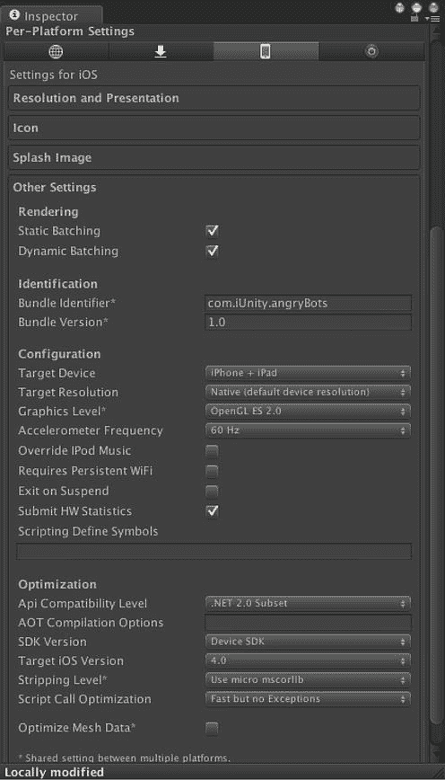

图 10-19. iOS 玩家设置中的其他设置

标识部分有两个设置：包标识符和包版本。它们对于在 iOS 模拟器中运行并不重要，但当需要提交应用时，这些设置必须与 iTunesConnect 中指定的应用对应信息相匹配（这将在下一章的应用提交流程中介绍）。

包 ID 是应用唯一标识符，通常以反转 URL 的形式表示。例如，我所有应用的包 ID 都是 `com.technicat.<appname>` 这种形式，所以我会将 `com.unity.angryBots` 改为 `com.technicat.angryBots`。

包版本与应用商店中显示的应用版本号相同。它通常格式化为两个数字 `<major>.<minor>`，或者有时是三个数字 `<major>.<minor>.<revision>`。每当你在应用商店提交应用更新时，这个数字都必须递增。

在配置下，大多数设置都有合理的默认值，但你确实需要通过选择目标设备来决定你的应用是运行在 iPhone、iPad 还是两者都支持。大多数 3D 应用通常在各种屏幕宽高比上都能良好运行，至少比 2D 应用要好，但 iPhone 和 iPod Touch 的屏幕比 iPad 更窄。有时，出于业务原因，你可能只想为 iPad 或仅为 iPhone 发布应用。

对于目标分辨率，通常选择“原生”即可（图 10-20）。它等同于“最佳质量”，而“最佳性能”则指定较低屏幕分辨率（在 iPhone 3GS 及其对应的 iPod touch 上不可用，因为它们拥有最低分辨率的屏幕）。其余选项是固定的仅限 iPhone 和仅限 iPad 的分辨率。

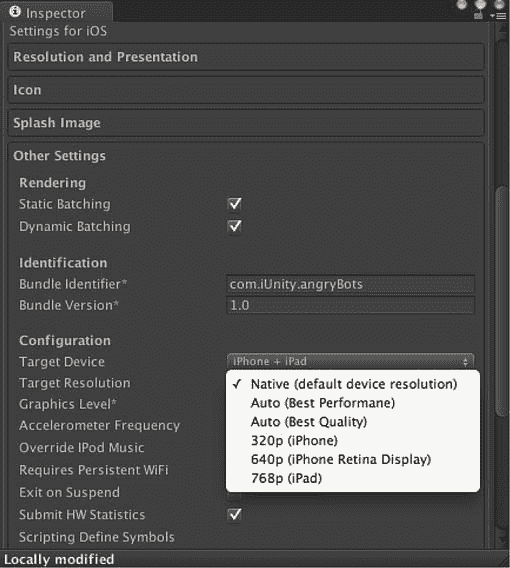

图 10-20. iOS 玩家设置中的目标分辨率选项


##### 脚本定义符号

`Scripting Define Symbols` 允许你定义自己的预处理器定义，就像上一章 `FuguPause` 脚本中引用的 `UNITY_EDITOR` 和 `UNITY_WEBPLAYER` 定义一样。例如，如果你有一些代码调用了仅适用于 Unity Pro 的某些函数，那么你可以将这些代码包裹在 `#if UNITY_PRO ... #endif` 中，然后在运行 Unity Pro 的项目的 `Scripting Define Symbols` 中添加 `UNITY_PRO`。

可以使用分号作为分隔符来添加多个定义。如果你还有一个 `USE_ADS` 预处理器定义来控制广告是否显示，你可以在 `Scripting Define Symbols` 字段中写入 `USE_ADS;UNITY_PRO`。

### 优化设置

一些 `Optimization`（优化）设置实际上与优化无关。`Api Compatibility Level`（不用在意 API 奇怪的字母大小写）指定了您所需的 `.NET` API 的版本和范围。通常你不需要更改它。

`AOT Compilation Options` 指的是在 Unity iOS 构建期间发生的提前编译（ahead-of-time compilation），这与即时（JIT）编译相对。这就是为什么 Unity iOS 脚本中需要 `#pragma strict` 的原因。它为 AOT 编译器提供了足够的信息来完成其工作。

#### SDK 版本

`SDK Version` 有两个选项：`Device SDK`（设备 SDK）和 `Simulator SDK`（模拟器 SDK）。在下一章中会提到的，为测试设备或应用提交进行构建时，默认值 `Device SDK` 是正确的选择，但在本章中，应选择 `Simulator SDK` 以便在 iOS 模拟器中运行我们的游戏。

> **注意** `SDK Version` 这个属性名称用于区分模拟器和硬件构建，这有点奇怪，但它是旧版 Unity iOS 的遗留用法，当时需要指定随 Xcode 安装的 iOS SDK。

#### 目标 iOS 版本

`Target iOS Version` 指定了应用可运行的最低 iOS 版本。保留其默认和最低值 iOS 4.0，可以最大化兼容设备的数量，从而增加潜在用户。然而，如果目标 iOS SDK 版本低于 iOS 4.3，Unity 将会发出可能导致应用商店审核被拒的警告（图 10-21）。

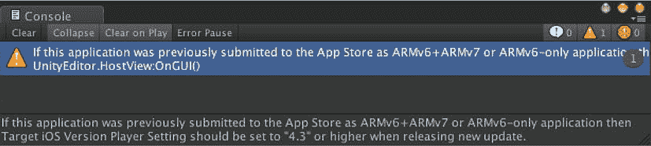

图 10-21. 提交时目标 SDK 版本低于 4.3 的警告

这只是一个潜在的苹果拒绝问题，仅当你碰巧要更新一个已在 App Store 上架、并支持 ARMv6 处理器的应用时才会出现，因为 Unity 4 已放弃 ARMv6 支持，仅支持更新的 ARMv7 系列。正如 Unity 警告所建议的，将目标版本设为 iOS 4.3 或更高是安全的，因为苹果也从 iOS 4.3 开始放弃了 ARMv6 支持（这意味着他们也放弃了对早于 iPhone 3GS 的设备的支持）。

> **提示** 当我第一次尝试向 App Store 提交仅支持 ARMv7 的更新时（2012 年），应用被拒了，最后，将目标版本设为 iOS 4.3 或更高版本才避免了这个问题。此外，一旦仅支持 ARMv7 的更新在 App Store 上获得批准，我就能够再次将目标版本设为更早的 iOS 版本，因为我不再需要更新一个支持 ARMv6 的应用了！

#### 剥离级别、脚本调用优化和优化网格数据

最后，`Stripping Level`（剥离级别）、`Script Call Optimization`（脚本调用优化）和 `Optimize Mesh Data`（优化网格数据）确实是优化设置，这些将在第 16 章与其他优化技术一同介绍。不过，简要地说，`Stripping Level` 是 Unity iOS Pro 的一个选项，用于移除未使用的代码（如果不走运，也可能移除正在使用的代码，这也是为什么它是可选的），`Script Call Optimization` 通过消除异常处理（异常本质上是可被调用代码捕获的错误或“异常”情况）来加速脚本执行，而 `Optimize Mesh Data` 则移除未使用的网格数据（例如，使用无光照材质时不需要法线）。

#### 玩家设置总结

如你所见，`Player Settings` 中有许多选项会影响 Unity iOS 构建的外观和性能。更改 `Player Settings` 后，最好通过 `File` 菜单中的 `Save Project` 或 `Save Scene`（此操作也会隐式执行 `Save Project`）来保存这些更改。虽然 `Player Settings` 中的许多（如果不是大部分）设置在某些时候都很重要，但要让 Angry Bots 在 iOS 模拟器上运行，你唯一需要做的更改就是将 `Device SDK` 设置为 `Simulator SDK`。

### 使用 iOS 模拟器测试

现在你已经安装了 Xcode，并将 `Device SDK` 设置为 `Simulator SDK`，你就可以在 iOS 模拟器上构建并运行 Angry Bots 了。`File` 菜单中的 `Build and Run` 命令和 `Build Settings` 窗口中的 `Build and Run` 按钮都会执行 `Build` 阶段，生成一个 Xcode 项目，然后执行 `Run` 阶段，在 Xcode 项目中调用构建和运行操作。通常情况下，这非常方便，但在使用 iOS 模拟器时，如果你手动在 Xcode 中执行构建和运行，你将能更好地控制 iOS 模拟器。那么，让我们再次打开 `Build Settings` 窗口（从 `File` 菜单），然后点击 `Build` 按钮。

> **提示** 在执行构建之前，请在 `Build Settings` 窗口中检查是否包含了正确的场景集合。

Unity 会弹出一个 `Save As` 窗口，提示你选择即将构建的 Xcode 项目的位置和文件名（图 10-22）。

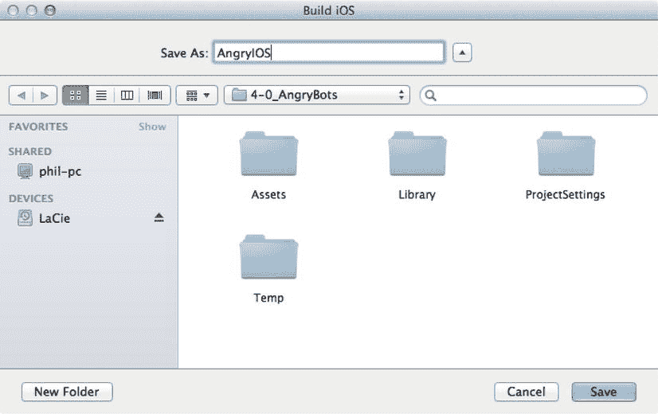

图 10-22. 构建提示：选择 Xcode 项目的位置和名称

它通常默认指向 Unity 项目文件夹的顶层。让我们将这个 Xcode 项目命名为 `AngryIOS`。

> **警告** 注意不要选择 `Assets` 文件夹内的构建目标位置，否则 Unity 会尝试将整个 Xcode 项目作为项目资源导入。

如果这不是你第一次在此位置构建此项目，Unity 将检测到已存在同名 Xcode 项目，并询问你是要完全替换该项目还是追加项目更改（图 10-23）。

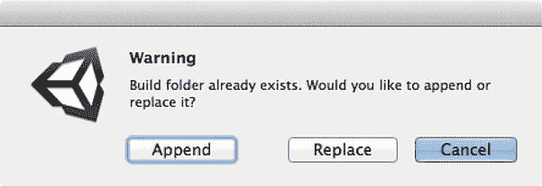

图 10-23. 构建追加或替换对话框

追加速度更快，但有时你需要一个全新的 Xcode 项目。例如，如果你更改了 `Player Settings` 中的 bundle ID，或者（绝对需要如此）升级了 Unity 或 Xcode，你应该构建一个新的 Xcode 项目。

> **提示** `File` 菜单中的 `Build and Run` 与 `Build Settings` 中的 `Build and Run` 按钮并不完全相同。`File` 菜单中的命令会假定你要追加构建文件夹（如果已存在），并且不会询问你是追加还是替换它。我更喜欢坚持使用 `Build Settings` 窗口执行构建，这样我总能知道发生了什么。我之前就遇到过这种情况：我复制了一个项目，然后从 `File` 菜单调用 `Build and Run`，结果它仍然构建到了原始位置！

### 执行构建

无论如何，点击 `Build` 后，构建过程中会显示一个进度条（图 10-24）。与资源重新导入一样，对于大型项目，这可能需要一些时间，并且在构建期间编辑器将无响应。

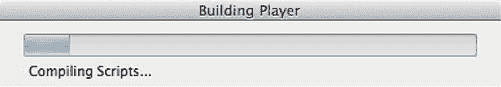

图 10-24. 构建过程中的进度指示器

构建完成后，一个 Xcode 项目文件夹将出现在你指定的位置（图 10-25）。

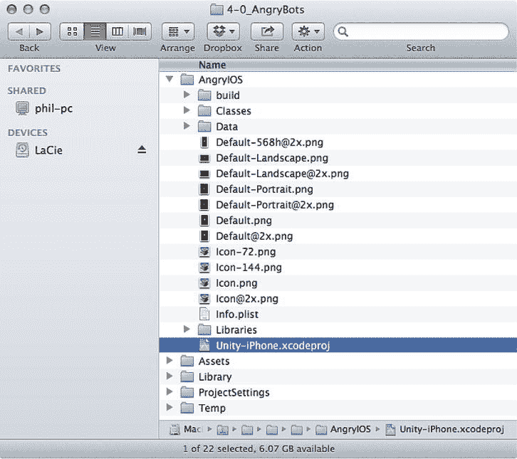

图 10-25. Unity iOS 构建生成的 Xcode 项目文件夹

Xcode 项目文件名为 `Unity-iPhone.xcodeproj`，位于 Xcode 项目文件夹中。双击该文件可在 Xcode 中打开该项目（图 10-26）。


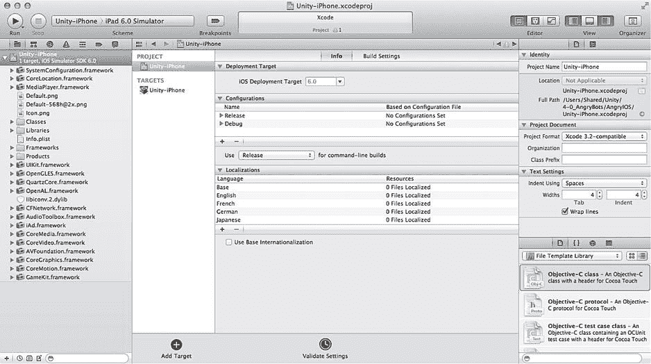

图 10-26. 启动 Unity iOS 项目后的 Xcode

请注意，`iPad 6.0 Simulator` 显示在 Xcode 窗口的左上角。这是一个用于选择 Xcode 方案（即 Xcode 中构建规则的集合）的菜单。另一个可用的方案是 `iPhone 6.0 Simulator`（图 10-27）。

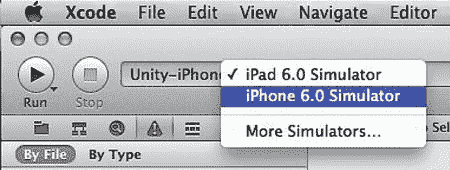

图 10-27. 选择 iPad 或 iPhone 模拟器

从 Unity 中执行“生成并运行”操作会自动启动 iOS 模拟器，而不会先给你选择 iPad 或 iPhone 模拟器的机会。现在，让我们继续使用 iPad 模拟器，并点击 Xcode 窗口左上角的 `Run` 按钮。`Run` 按钮实际上是一个“生成并运行”按钮，因为它会在尝试运行项目之前先编译项目（如果需要）。如果成功，将出现一个匹配 iPad 屏幕尺寸的 iOS 模拟器窗口，并运行 Angry Bots（图 10-28）。

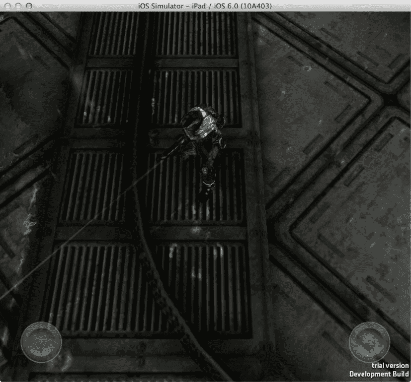

图 10-28. 在 iOS 模拟器中运行 Angry Bots

iOS 模拟器会将鼠标输入解释为触摸屏事件，因此你可以点击并拖动虚拟操纵杆来进行游戏。此外，iOS 模拟器的“硬件”菜单还可模拟其他设备事件（图 10-29）。

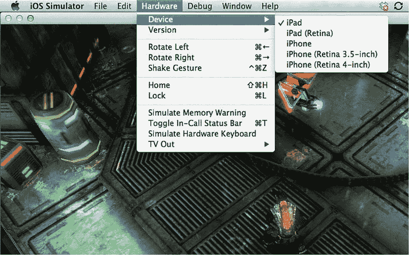

图 10-29. iOS 模拟器选项

例如，`Rotate Left` 和 `Rotate Right` 命令可模拟旋转设备方向（试一下，看看自动旋转的效果），而调用 `Home` 等同于按下设备的 `Home` 按钮，这会使应用程序挂起或退出，并显示设备的主屏幕。应用程序图标应该会出现在那里，可以点击（模拟点击）以重新启动应用程序。“硬件”菜单还允许你选择不同的设备和 iOS 版本来进行模拟。

除了测试之外，iOS 模拟器还可用于截图，通过“工具”菜单中的 `Save Screen Shot` 命令即可（图 10-30）。调用该命令会立即将截图保存到桌面。App Store 要求提供应用程序所支持设备的截图，因此，例如，如果你需要 iPad 截图但没有 iPad 设备，iOS 模拟器就是获取该截图的便捷工具。

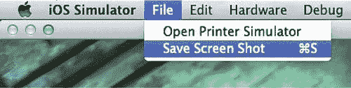

图 10-30. iOS 模拟器中的 `Save Screen Shot` 命令

iOS 模拟器窗口没有可操作的关闭按钮，但可以通过“iOS 模拟器”菜单中的 `Quit iOS Simulator` 命令或其键盘快捷键 `Command+Q` 来退出模拟器（图 10-31）。

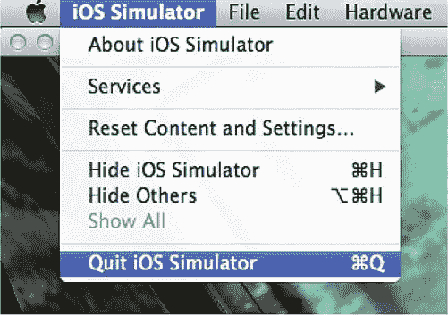

图 10-31. 退出 iOS 模拟器

iOS 模拟器在模拟 iOS 功能方面相当完整，包括 iAd 和 Game Center。所以，即使你没有可用于测试的 iOS 设备，仅使用 iOS 模拟器，你也仍然可以完成本书剩余的大部分内容。

## 进一步探索

你可能会有似曾相识的感觉，因为我们最初使用 Angry Bots 演示作为第一个项目，现在又回到了这里。区别当然在于，现在我们是在为 iOS 构建项目。我们已经迈出了最初的几步：将构建目标更改为 iOS，在 Unity 编辑器中配合 Unity Remote 进行测试，然后使用 Xcode 进行构建以在 iOS 模拟器中运行。下一步，构建项目以在真实的 iOS 设备上运行，将在下一章中进行，之后我们将回到我们的常规编程——保龄球游戏。到那时，希望你能够熟悉构建流程，并专注于将游戏打造成一款 iOS 游戏！

#### Unity 手册

由于讨论又回到了 Angry Bots，因此 Unity 手册中第一个相关的部分自然是“Unity 基础”部分，特别是关于“发布构建”的页面。

Unity 手册还包含几个专门关于 Unity iOS 的部分，尽管你可能需要点击手册顶部的 iPhone 图标才能使这些内容可见。“iOS 开发入门”部分在撰写本文时可能有些过时，但其关于“Unity Remote”的页面对于解释如何设置和操作该应用程序仍然很有用。

关于 Unity iOS 的更多近期文档列在 Unity 手册的“高级”部分，包括关于“Unity Xcode 项目结构”的页面。熟悉生成的 Xcode 项目中的文件是个好主意，但除了在第 16 章中启用内置性能分析器之外，你无需修改 Unity 生成的 Xcode 文件。

#### 参考手册

让 Angry Bots 能够成功构建的大部分工作在于，在“播放器设置”中填写适当的值。本章提供了 iOS 特定设置的简要概述，并且只有“默认方向”和“设备 SDK”设置对于在 iOS 模拟器中运行至关重要，但“参考手册”中的“播放器设置”页面详述了各个跨平台和 iOS 特定的播放器设置，以及其他平台的设置。

#### iOS 开发者库

Xcode 的下载链接和文档可在 Apple 开发者网站的 Xcode 页面（`http://developer.apple.com/xcode`）上找到。使用 Unity 进行 iOS 开发的一大优势是，你可以避免需要了解很多关于 Xcode 和 Objective-C 的知识。尽管如此，熟悉 Xcode 的操作并理解 Objective-C 代码仍然会有所帮助。

除了在其“帮助”菜单中可以找到的 Xcode 文档外，Xcode 网站 `http://developer.apple.com/xcode` 也提供了指向开发者文档的链接。在 Xcode 主题下还有许多其他文章，其中许多也可以在 Xcode 的“帮助”菜单中找到，包括 Xcode 用户指南和 Xcode 基础帮助。

iOS 开发者库将 Xcode 列在“主题”下，Xcode 主题中大部分相关的“IDE”部分都可以在 iOS 模拟器用户指南中找到。该指南内容详尽，包含多个章节，扩展了本书中关于 iOS 模拟器的介绍，解释了如何从 Xcode 启动模拟器、如何操作模拟器以及如何调用模拟的设备输入。

尽管 Unity 做了大量工作让你无需在 Xcode 中操作，并且在本章中你实际上只需点击 Xcode 中的 `Run` 按钮即可运行 iOS 模拟器，但还是建议你提前阅读一下该工具的相关资料，为下一章做好准备。在下一章中，你将学习如何构建并运行应用程序以进行测试，以及如何构建以提交到 App Store。

## 第 11 章

为真实设备构建：设备测试与应用程序提交

运行 Angry Bots 的 iOS 版本竟然出奇地简单。只需将构建目标切换为 iOS，然后立即在编辑器中使用 Unity Remote 应用程序作为输入设备来玩游戏；或者，要在 iOS 模拟器中运行该游戏，只需在“播放器设置”中将目标 SDK 设置为模拟器 SDK 并进行构建即可。


这看起来可能太简单了，以至于让人觉得不可能仅此而已，但事实确实如此。接下来的步骤才是令人头疼的部分：构建 Unity 项目，使其能够安装并在真实的 iOS 硬件上运行。本流程中 Unity 的部分很简单，几乎与构建一个在 iOS 模拟器上运行的项目完全相同。但是，要将应用程序安装到测试设备上，需要使用移动设备预置描述文件来构建应用，该描述文件也必须安装在 Xcode 和测试设备中。在此之前，必须使用与测试设备及应用包标识符相关联的开发证书，在苹果的预置门户中创建该描述文件。因此，在此之前，测试设备和包标识符必须在预置门户中注册，并且在创建证书签名请求之后生成开发证书。

而这一切还仅仅是为了测试。在构建用于提交到 App Store 的应用时，也需要类似的流程，但使用的是独立的发布预置描述文件和相应的证书。此外，向 App Store 提交应用还需要将应用添加到 iTunes Connect，这是一个用于在 App Store 上管理应用的独立网站。

如果处理预置描述文件听起来很麻烦，你可能会想跳过本章，稍后再回来看。事实上，我们保龄球游戏在接下来几章中的 iOS 适配，可以使用 Unity Remote（用于第 13 章的输入代码）和 iOS 模拟器（第 12 章中设置的图标、启动画面和屏幕尺寸）进行测试，就像我们在上一章中对 Angry Bots 所做的那样。此外，访问预置门户和 iTunes Connect 以及相关的非公开文档，需要成为 iOS 开发者计划的成员，所以如果你还没有获得该资格，那么无论如何你都得等待。

但是，你需要 iOS 开发者会员资格才能设置 Game Center 排行榜和成就（我将在第 14 章中介绍），以及 iAd 横幅广告和插页式广告（我将在第 15 章中介绍），而性能测量（我在第 16 章中介绍）如果不能在实际硬件上运行，也会变得索然无味。所以，至少，最好尽快开始 iOS 开发者注册流程！

### 注册成为 iOS 开发者

正如你所料，苹果开发者网站 (`http://developer.apple.com/`) 是查找大多数官方苹果开发者资源（iTunes Connect 是个例外）的地方，包括所有苹果开发者计划——Mac 开发者计划、Safari 开发者计划，以及我们感兴趣的 iOS 开发者计划。你可以以个人或公司身份注册 iOS 开发者计划。只要你有一张信用卡并准备好支付每年 99 美元的费用，以个人身份注册就相当直接。以公司身份注册也需要这些，但它还需要一个实际的法律公司实体以及关于公司的支持信息，包括一个 DUNS（数据通用编号系统）号码，这是一个由邓白氏公司分配给公司的唯一标识符。个人和公司账户都必须经过苹果公司批准，但公司账户的批准时间可能比个人账户长（我的公司 Technicat, LLC 的批准花了三个月）。

公司账户唯一额外的功能是账户管理员可以添加团队成员，因此在本书中，我们将假设我们使用的是个人账户，或者等效地，作为公司账户的管理员。

一旦你被批准成为 iOS 开发者，你就可以使用你的 Apple ID 登录访问苹果开发者网站以及 iTunes Connect (`http://itunesconnect.apple.com/`)。iTunes Connect 是管理你在 App Store 上或准备上架的所有应用的网站。

但在 iTunes Connect 中工作之前，我们将登录苹果开发者网站，并在预置门户中工作，以创建开发和发布预置描述文件，这些文件分别用于测试和发布构建。

### 预置门户

假设你拥有 iOS 开发者会员资格（如果没有，你可以跳过本章，稍后再回来），登录 `http://developer.apple.com/` 并进入预置门户。

**注意** 苹果开发者网站有几个你可以登录的区域——会员中心、iOS 开发中心和开发者论坛——你可以从会员中心或 iOS 开发中心进入预置门户（目前，这种组织方式有点令人困惑）。

一旦你登录，网站上会有详细的文档（预置门户是苹果没有太多公开的屏幕截图式文档的地方之一），但我会简要概述涉及的步骤以及你需要提供的信息。

#### 注册测试设备

开发预置描述文件仅对指定的测试设备集有效，因此首先要做的是在预置门户中注册你想要用于测试的 iOS 设备。你需要提供每台设备的唯一设备标识符（UDID）。设备的 UDID 可以通过 iTunes 或 Xcode 找到。在 iTunes 中，当 iOS 设备连接到你的 Mac 时，可以通过点击设备的序列号来找到 UDID，点击会将序列号显示切换为 UDID 显示。但该显示无法复制粘贴，因此更好的选择是从 Xcode 中获取该号码。

当 iOS 设备连接到你的 Mac 时，UDID 会显示在 Xcode 管理器窗口中。要调出 Xcode 的管理器窗口，如果 Xcode 尚未运行，请启动它，然后从窗口菜单中选择管理器（图 11-1）。

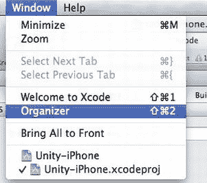

图 11-1. 从 Xcode 窗口菜单调出管理器

管理器窗口弹出后，所有已连接的 iOS 设备都应列在左侧面板中。选择你想要注册用于测试的设备，设备信息（包括 UDID，列为标识符）将显示出来（图 11-2）。

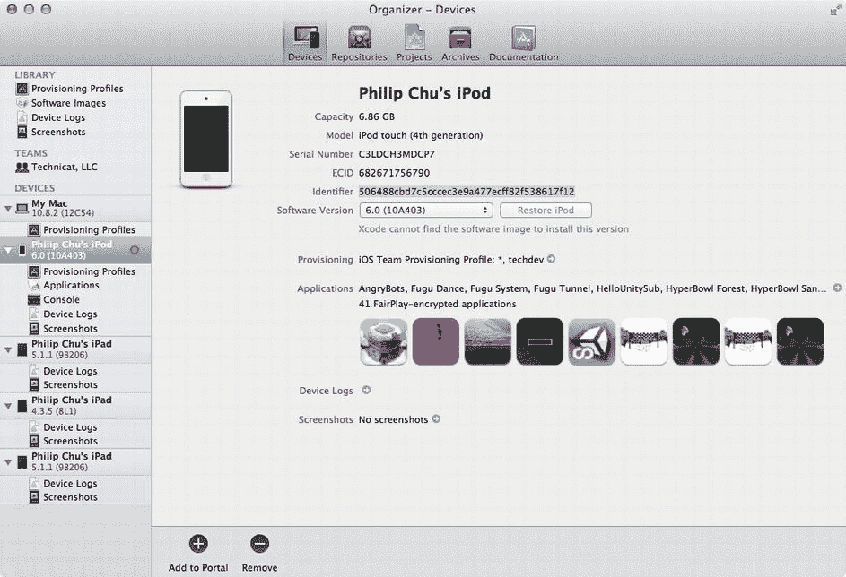

图 11-2. 从 Xcode 管理器获取设备 ID

然后，你可以将 UDID 复制并粘贴到预置门户中，以注册你的测试设备。

#### 注册应用标识符

注册完测试设备后，你需要注册应用标识符，因为每个预置描述文件仅对一个应用 ID 有效。应用 ID 对应一个包标识符（与你在 Unity 播放器设置中为应用指定的标识符相同），或者当它以星号结尾时匹配许多包标识符（这时它被称为通配符应用 ID）。例如，我注册了一个应用 ID `com.technicat.*`，我可以在一个预置描述文件中将其用于我所有的应用，例如 `com.technicat.fugubowl` 和 `com.technicat.hyperbowl`。

**提示** 创建一个匹配你全部或大部分包标识符的通配符应用 ID，这样你就不必为每个包标识符都创建一个新的应用 ID。

#### 开发预置描述文件

要创建开发预置描述文件，你需要生成一个与该描述文件关联的开发证书。预置门户中有关于如何生成和上传证书签名请求的说明，这将最终生成一个新的开发证书。然后，你可以创建一个与该证书关联的开发预置描述文件。


#### 开发预置描述文件

实际上，一旦你生成了开发证书，预置门户会自动为你生成一个团队预置描述文件，该文件使用星号 `*` 作为应用 ID，因此可以匹配你的任何 Bundle ID，这确实非常方便。但你也可以使用相同的证书和你指定的应用 ID 来生成任意数量的其他开发预置描述文件。

#### 分发预置描述文件

创建分发预置描述文件与创建开发预置描述文件类似。你需要先创建一个分发证书，然后创建一个与该证书关联的分发预置描述文件。

**提示** 重复使用同一个证书请求文件来创建开发证书和分发证书，可以节省一点时间。

### Xcode 管理器

当你的开发预置描述文件可用时，你可以将它们下载到 Xcode 中。打开 Xcode 管理器窗口（从 Xcode 的“窗口”菜单），在侧边栏中选择“预置描述文件”，然后点击描述文件列表右下角的“刷新”按钮。在提示输入你的 Apple 开发者登录信息后，管理器将检索并显示你在预置门户中创建的所有预置描述文件。

图 11-3 显示了我的全部四个预置描述文件。注意所有应用 ID 都以数字为前缀。这是由预置门户生成的，称为*捆绑种子 ID*。就我们这里的目的而言，你可以忽略它。

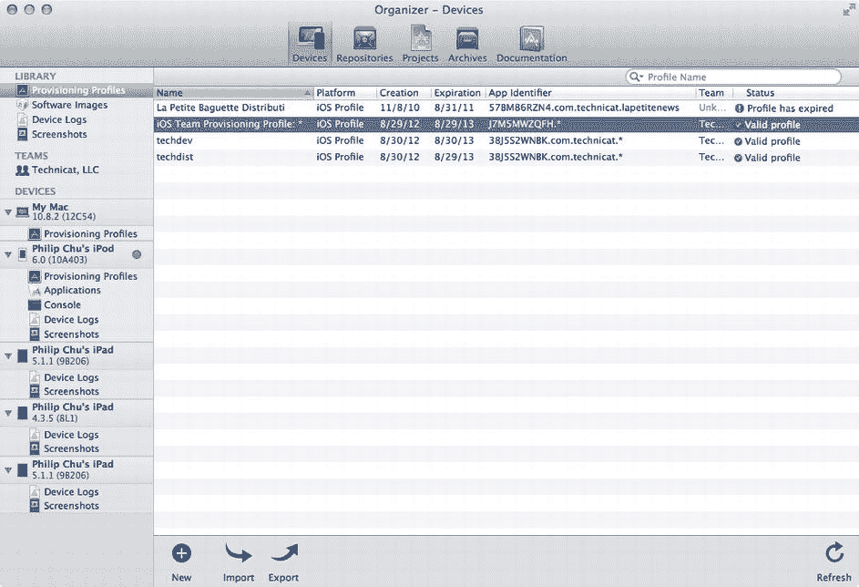

图 11-3. Xcode 管理器中列出的预置描述文件

第一个预置描述文件，名为 La Petite Baguette Distribution，是一个分发预置描述文件，它仅匹配一个名为 La Petite Baguette（一个餐厅应用）的应用。注意应用 ID 是完全指定的，与 La Petite Baguette 应用的 Bundle ID 精确匹配。还要注意该预置描述文件已过期。

第二个描述文件，iOS Team Provisioning Profile，是由预置门户自动创建的开发预置描述文件。它匹配任何应用的 Bundle ID。

第三个描述文件，名为 techdev，是我创建的一个开发预置描述文件，它将适用于我的任何应用，因为它能匹配任何以 `com.technicat` 开头的 Bundle ID。

第四个描述文件是我唯一的分发预置描述文件。它也匹配任何 Bundle ID 以 `com.technicat` 开头的应用。

仅仅将开发预置描述文件放在 Xcode 中还不够；它还必须安装到你的测试设备上。将测试设备连接到你的 Mac 并使其出现在 Xcode 管理器的侧边栏中后，只需将描述文件从“预置描述文件”列表拖放到设备上即可。要验证描述文件是否已安装到设备上，请启动设备的“设置”应用，选择“通用”类别，然后在其中选择“描述文件”，查看该描述文件是否列在其中（图 11-4）。

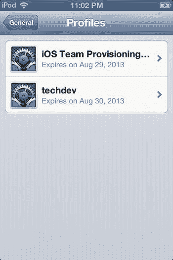

图 11-4. 测试设备上的预置描述文件

注意过期日期。证书及其关联的预置描述文件会在一年后过期，届时你必须用使用新证书创建的新描述文件替换已过期的描述文件。

你也可以在 Xcode 管理器中创建新的预置描述文件：点击左下角的 + 按钮，然后在提示输入预置门户登录信息后，填写如图 11-5 所示的信息。

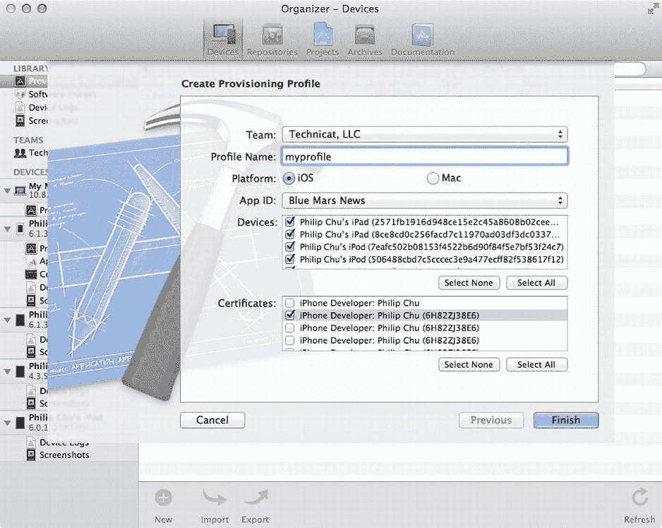

图 11-5. 从 Xcode 管理器创建预置描述文件

这些信息与在预置门户中创建开发预置描述文件时提供的信息相同。一旦你提供了足够的信息（别忘了输入一个名称！），“完成”按钮将被启用，点击“完成”后，新的预置描述文件将出现在你所有预置描述文件的列表中（图 11-6）。

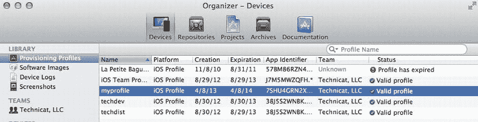

图 11-6. Xcode 管理器中一个新创建的预置描述文件

如果你恰好在 Xcode 中工作并需要创建一个开发预置描述文件，这是一个便捷的选项。但我更倾向于直接在预置门户中创建我的预置描述文件，因为请求证书、注册测试设备和创建分发预置描述文件都必须在那里进行。并且直接在预置门户中操作可以避免我在管理器中管理预置描述文件时偶尔遇到的一些不稳定问题。

### 构建并运行

现在你已经准备好开始在你的设备上测试了。这个过程与为 iOS 模拟器构建和运行完全相同，只是你首先需要进入 Unity 的游戏播放器设置，将 SDK 版本设置为 Device SDK 而不是 Simulator SDK（图 11-7）。

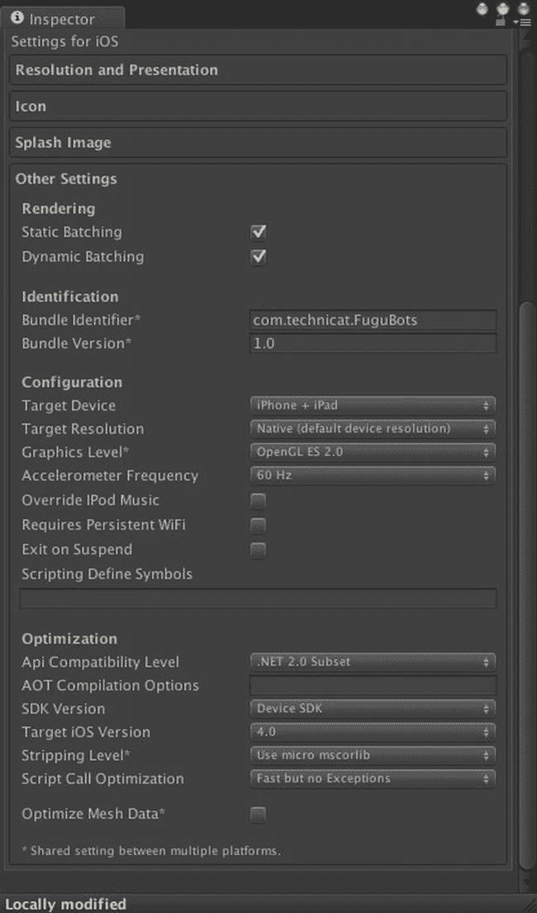

图 11-7. 设备构建的播放器设置

在开始构建之前，因为你是为真实硬件进行构建，你应该确保目标 iOS 版本与你的测试设备兼容（反之亦然），这意味着目标 iOS 版本至少应与你的测试设备运行的 iOS 版本相同或更早。但实际上，这也是一个部署决策。支持较旧版本的 iOS 可以增加潜在用户数量，但可能会增加你的支持负担，并阻止使用仅在较新版本 iOS 中可用的功能。事实证明，Unity 在 `http://stats.unity3d.com/` 收集了关于当前运行基于 Unity 应用的 iOS 硬件和版本的数据。只要你创建的 Unity 应用在播放器设置中选择了“提交硬件统计信息”选项，这些应用都将为此数据做出贡献。

你可以执行“构建并运行”，这相当于先执行“构建”，然后通过双击项目文件手动打开生成的 Xcode 项目（图 11-8），再点击 Xcode 中的“运行”按钮。

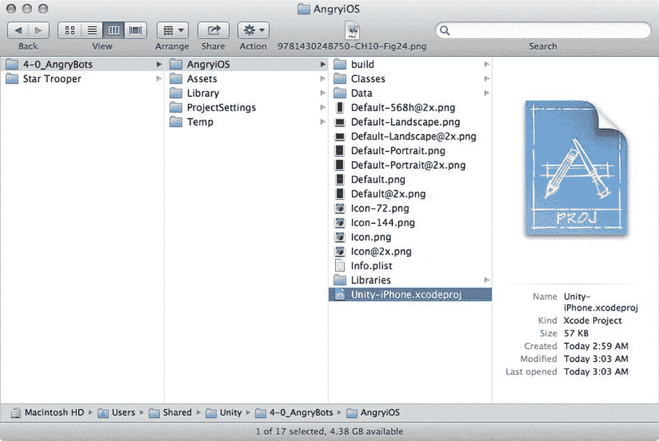

图 11-8. 由 Unity iOS 构建生成的 Xcode 项目

无论哪种方式，Xcode 都不会在 iOS 模拟器中构建和运行，而是在连接的测试设备上构建、安装和运行。

**提示** 使用设备进行测试时，最好完全禁用屏幕锁定。如果连接的设备锁屏，从 Xcode 启动运行将会失败。

与 iOS 模拟器一样，任何 Unity 调试文本都会显示在 Xcode 调试区域（图 11-9）中，而不是像 Unity 编辑器中那样显示在控制台视图中。

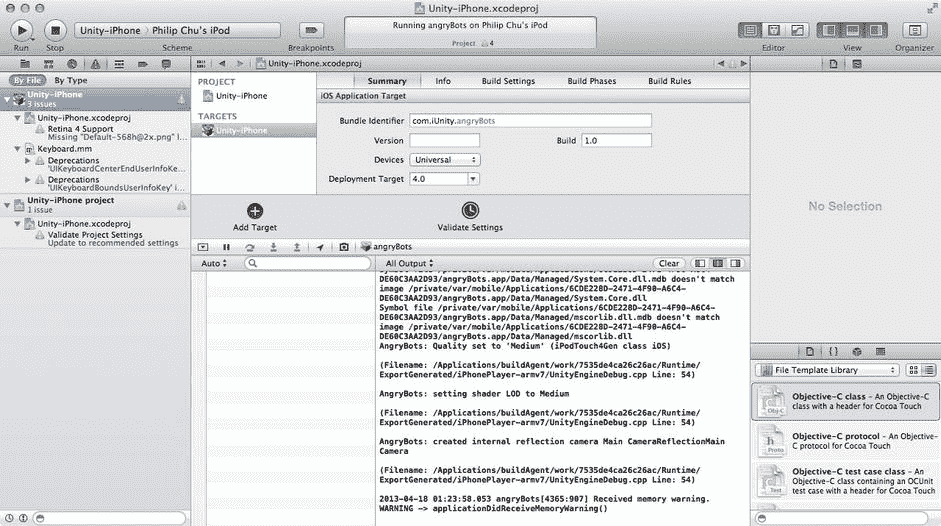

图 11-9. Xcode 在测试设备上运行应用

**注意** Xcode 中与 Unity 编辑器视图等效的部分称为*区域*。与视图不同，Xcode 区域名称使用小写字母拼写，例如，导航区域、编辑器区域和调试区域。

你也可以使用 MonoDevelop 调试器，尽管调试一个 iOS 应用比调试 Unity 编辑器中运行的游戏需要进行更多的设置。要启用应用以使用 MonoDevelop 进行远程调试，请在构建设置窗口中选择“开发构建”选项（图 11-10）。启用“开发构建”选项后，“脚本调试”选项变为可用，你也应该选择它。


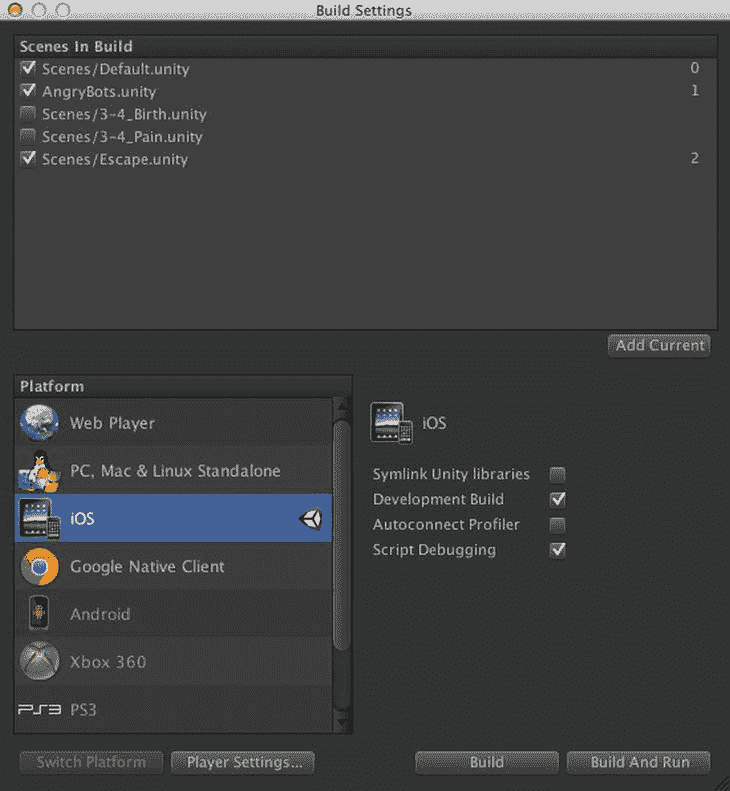

图 11-10. 创建启用脚本调试的开发构建

远程调试在与 Xcode 交互时存在问题，包括断点后无法恢复运行，因此请先执行“构建并运行”将应用程序安装到测试设备上。在 Xcode 中单击“停止”以终止测试运行，然后手动在设备上重新启动应用程序（即像平常启动应用一样点击应用图标）。最后，在 MonoDevelop 中执行“附加到进程”，但不要附加到 Unity 编辑器，而是附加到测试设备（图 11-11）。

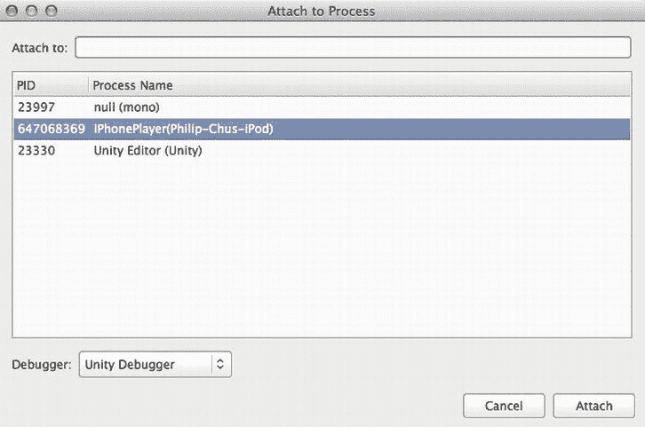

图 11-11. 将 MonoDevelop 调试器附加到 iOS 播放器

当您对设备测试感到满意后，就可以将应用提交到 App Store 了。这不需要在 Unity 中进行任何更改；只需在 Xcode 中使用分发配置文件（而非开发配置文件）重新构建应用即可。但首先，您需要在 iTunes Connect 中为应用创建一个 App Store 条目。在创建 iTunes Connect 条目之前，您需要准备好一些 App Store 用图。

### 准备 App Store 用图

您需要为 App Store 准备两种图形：应用图标和一组针对您所支持的所有设备的截图。iTunes Connect 在闲置一段时间后容易自动登出并丢失所有更改，因此不建议在登录状态下折腾创建图标和截图。

#### 创建图标

iTunes Connect 会要求提供一个 1024 × 1024 像素的应用图标（`.png` 或 `.jpeg` 格式），该图标将随 App Store 中的应用描述一起显示。如果您在创建应用图标时早有规划，那直接使用即可。否则，您需要在进入 iTunes Connect 之前创建好它。

理想情况下，您应该请专业图标设计师来创建图标，但如果资金和美术技能都不足，可以像我在紧急情况下所做的那样——从 Unity 编辑器的游戏视图中截取一张大图，并将其缩放到 1024 × 1024。从大图缩小效果更好。将较小的现有图标放大通常效果不佳，Apple 也不鼓励这样做，尽管这种情况可能很常见，因为在不久之前，应用提交时上传的还是 512 × 512 的图标。

**注意** 如果 App Store 图标与设备上显示的任何应用图标不匹配，Apple 可能会拒绝该应用。因此，如果您为 App Store 创建了一个全新的 1024 × 1024 图标，应在 Unity 的 Player Settings 中将其设置为默认图标。

#### 截取屏幕截图

iTunes Connect 还会要求您提供三种尺寸的截图：适配 iPhone 4（640 × 960 或 960 × 640）、iPhone 5（640 × 1136 或 1136 × 640）和 iPad（768 × 1024 或 1024 × 768，新 iPad 则为以上尺寸的两倍）。前提是您在 Unity 的 Player Settings 中选择了 iPhone + iPad 作为支持的硬件。如果只选择了 iPhone，则无需提供 iPad 截图；如果只选择了 iPad，则只需提供 iPad 截图。

截图有三种相当便捷的方法：使用 iOS 模拟器、通过 Xcode Organizer 窗口从设备截取，以及在设备上按按钮截取。

使用 iOS 模拟器截图很简单。使用“编辑”菜单中的“截图”命令，截图将保存到桌面上。如果您的游戏在 iOS 模拟器受限的输入方式下运行不佳，使用模拟器可能不方便。但如果您没有 iPhone 4、iPhone 5 系列以及 iPad，这是获取截图的一种方法。

使用 Xcode 截图几乎同样简单。将设备连接到 Mac 后，在 Xcode Organizer 窗口中选择设备的“截图”面板（所有已连接设备都会显示绿色圆点）。

然后在测试设备上运行游戏时，当看到喜欢的画面，点击右下角的“新建截图”按钮。截图将显示在“截图”面板中（图 11-12），您可以将任意截图从该处（左侧的小预览图或右侧的大图）拖到桌面上，以便轻松访问。

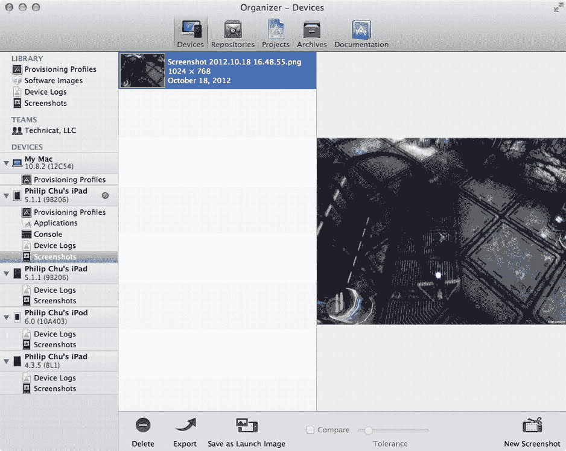

图 11-12. 在 Xcode Organizer 中截取设备截图

另外，如果您需要在 Finder 中访问这些截图，它们位于“资源库”“应用程序支持”“开发者”“共享”“截图”文件夹中。

**提示** OS X 通常隐藏“资源库”文件夹。您可以通过打开“终端”应用程序并输入 `chflags nohidden ~/Library` 来取消隐藏。

我最喜欢的截图方式是直接在设备上同时按下“主屏幕”按钮和“电源”按钮。截图会保存到设备的“照片”中，之后可以同步到 Mac 上的 iPhoto，并可在 Finder 中访问。这种方法可以让我在任何地方（比如沙发上）悠闲地截图，而无需一直连接着 Mac。而且，在关键时刻快速截图，比试图抓住鼠标并迅速点击 Xcode Organizer 中的“新建截图”按钮要容易得多。

### 在 iTunes Connect 中添加应用

现在您已经准备好了图标和截图，可以开始在 iTunes Connect 中添加应用信息了。登录 `http://itunesconnect.apple.com/`，您会看到主菜单，如图 11-13 所示。

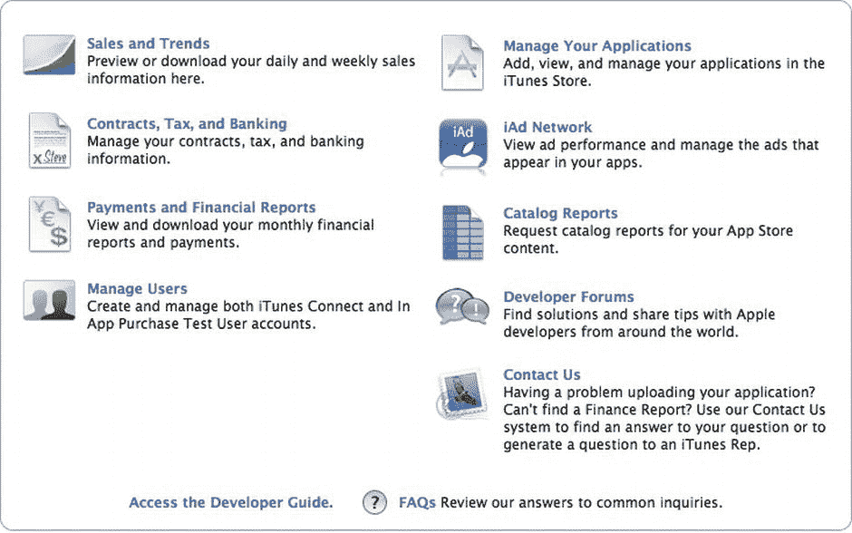

图 11-13. iTunes Connect 主菜单

点击“管理您的应用”开始操作。现在您会看到已添加的应用列表以及一个“添加新应用”按钮。图 11-14 显示了我的 iTunes Connect 账户中的这个页面，列出了我的一些应用，每个应用都带有版本号和一个根据应用状态颜色编码的圆点。

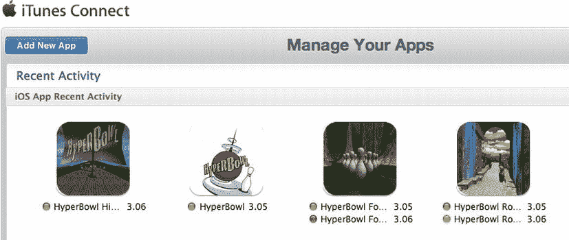

图 11-14. 在 iTunes Connect 中添加或管理应用

绿色圆点表示应用已在 App Store 上线，红色表示被拒绝。黄色有多种含义，但通常表示应用尚未上传。对于已上线且有更新已提交或正在进行中的应用，会同时列出两种状态。当然，如果这是您的第一个应用，则不会列出任何应用。

#### 选择应用类型

点击“添加新应用”后，下一页（图 11-15）会要求您选择应用类型：适用于 App Store 的 iOS 应用或适用于 Mac App Store 的 Mac OS X 应用。

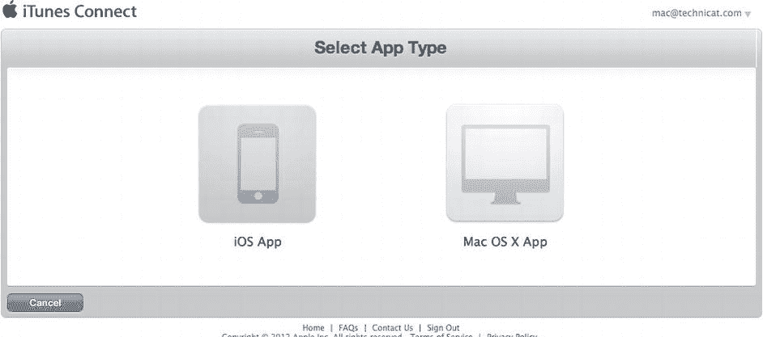

图 11-15. 在 iTunes Connect 中选择新应用类型

点击“iOS 应用”将弹出一系列网页，每个页面都有一个表格需要填写，单击“继续”按钮可进入下一页或下一个表格。

#### 应用信息

选择 iOS 作为应用类型后，您将看到一个用于输入应用名称和 Bundle ID 的页面。这些应与 Unity 编辑器 Player Settings 中指定的产品名称和 Bundle ID 匹配。Bundle ID 列表取自您在 Provisioning Portal 中添加的应用 ID 列表。如果您添加了通配符应用 ID，可以选择该 ID，然后输入您所添加应用的特定 Bundle ID 的后缀。


例如，在图 11-16 中，我列出了修改后的 Angry Bots 项目（已更名为 Fugu Bots）的信息。通配符 ID `com.technicat.*` 和后缀 `FuguBot` 与我在 Unity Player Settings 中设置的捆绑包 ID `com.technicat.FuguBot` 相匹配。

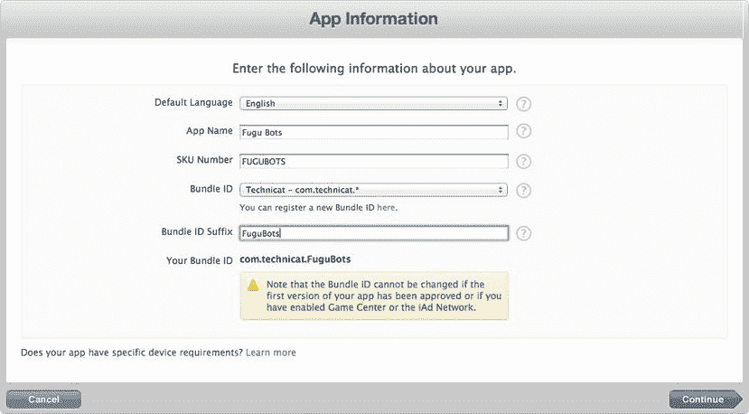

图 11-16. 在 iTunes Connect 上指定应用名称和捆绑包 ID

默认语言表示你为此应用提交的所有资源和描述将使用的主要语言。

`SKU Number` 可以是任何你想要的字符串，但它必须在你所有的应用中保持唯一，并且当你在报告中看到它时，应能轻松识别出对应的应用。

### 上架时间与价格

从“App Information”页面继续后，iTunes Connect 会要求你指定应用的价格以及你希望应用在 App Store 上架的时间（图 11-17）。

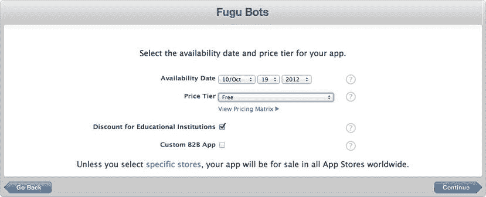

图 11-17. 在 iTunes Connect 上设置应用上架时间与价格

上架时间取决于苹果审核应用的进度。因此，如果你指定的上架日期是提交应用后的一周，而审核花费了两周，那么应用将在审核通过之日上架。如果你希望应用尽快上架，只需使用默认日期，即你输入此信息的当天。

价格选项包括免费、$0.99、$1.99、$2.99 等。无需过分担心定价是否恰当，因为以后随时可以更改。

接下来的页面是此流程中信息最为集中的环节。大部分应用信息都在此添加，幸运的是，这个庞大的表单被分成了若干部分。

### 版本、类别与版权

第一部分是版本号、版权和分类信息（图 11-18）。

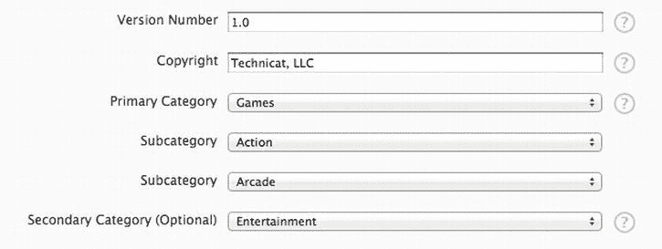

图 11-18. 在 iTunes Connect 上设置应用版本、类别与版权信息

版本号必须与 Unity Player Settings 中指定的版本号一致。

版权字段应填写版权持有者的名称，通常是你个人或你的公司。请勿添加任何多余的“Copyright”字样；这些内容会在 App Store 中自动生成。

请选择恰当的类别和子类别。你也可以选择一个次要类别来增加应用的曝光度。

### 应用评级

“Rating”部分非常直接明了（图 11-19）。填写即可，所有选项都是必填项。

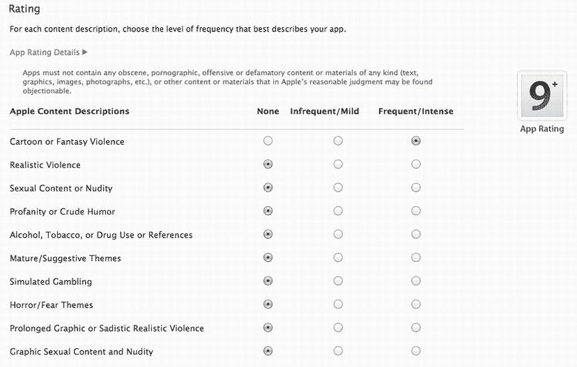

图 11-19. 在 iTunes Connect 中设置应用内容评级

如果评级与内容不匹配，至少在苹果看来如此，应用可能会被拒绝。例如，我曾尝试提交一个 Angry Bots 的版本，但被拒绝了，因为游戏包含射击元素（即使目标是一些愤怒的自动机器人），而根据苹果的规定，这属于“真实暴力”，应标记为“频繁/强烈”。

### 元数据

对于营销推广而言，“Metadata”部分最为重要（图 11-20）。

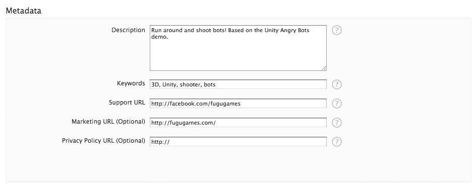

图 11-20. 在 iTunes Connect 中设置应用的产品描述

此部分包括应用在 App Store 中显示时的描述，以及有助于应用在 App Store 搜索中被发现的**关键字**。

### 上传图标与截图

最后，你需要在此上传之前准备好的图标和截图（图 11-21）。图标尺寸必须为 1024 × 1024 像素，并且应与你构建在应用内的图标一致，否则应用可能会被苹果拒绝。


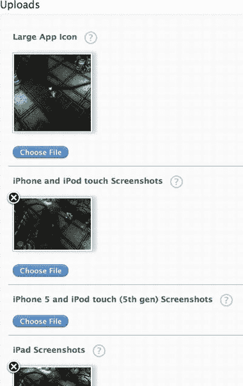

图 11-21. 在 iTunes Connect 中上传应用图标和截图

`iTunes Connect` 要求必须上传图标和至少一张截图，否则无法继续操作，尽管我们实际上需要为应用支持的每种屏幕类型（宽高比）都上传截图。如果一款 Unity iOS 应用同时为 iPhone 和 iPad 构建，那么就需要为所有三类设备上传截图，大致对应 iPhone 4、iPhone 5 和 iPad。

> **警告**   `iTunes Connect` 的超时时间很短。如果在此页面完成之前超时，整个应用描述会消失，你将不得不从头开始。这就是我们提前准备好图标和截图的原因。

### 为上传做准备

填完上一节的数据，进入下一页后，我们几乎就完成了。此时应用的当前状态是**准备上传**（图 11-22）。

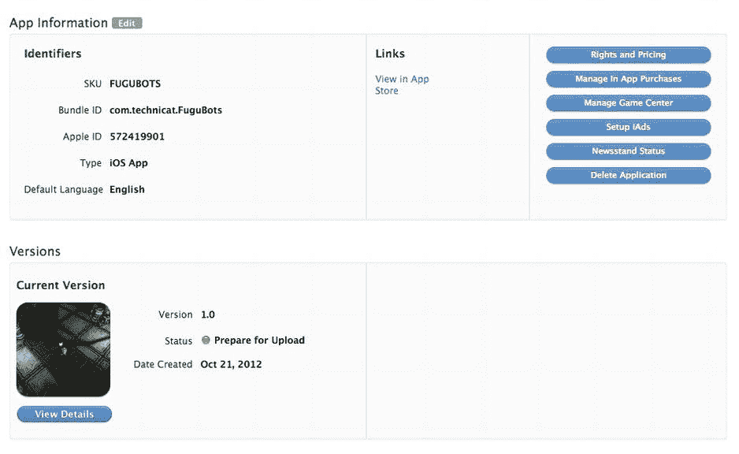

图 11-22. 处于**准备上传**状态的应用

在提交应用之前，必须先点击 **查看详情** 按钮，返回到版本信息页面（图 11-23）。

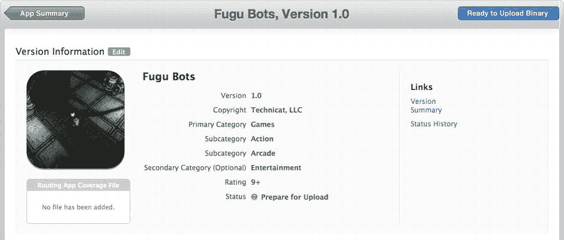

图 11-23. iTunes Connect 中的 **准备上传二进制文件** 按钮

该页面右上角现在出现了一个 **准备上传二进制文件** 按钮。点击它，`iTunes Connect` 会询问应用是否使用加密技术，这是出于出口法规的考虑（图 11-24）。

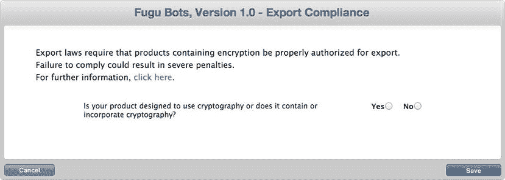

图 11-24. 在 iTunes Connect 中检查应用是否包含加密功能

最后，`iTunes Connect` 会显示一条消息，提示你可以使用名为 `Application Loader` 的程序上传应用。忽略它——你可以在 `Xcode` 中直接上传（而且这条消息本身也已过时）。之后，你会回到应用页面，此时应用状态显示为 **等待上传**（图 11-25）。

> **警告**   **准备上传** 和 **等待上传** 的状态颜色难以区分，因此很容易忘记完成 **准备上传** 步骤。

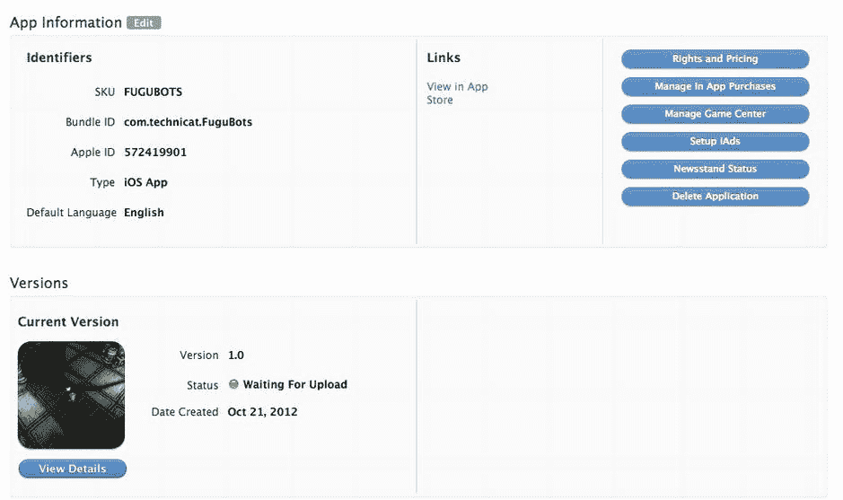

图 11-25. iTunes Connect 中处于 **等待上传** 状态的应用

### 提交应用

现在你已准备好提交应用。返回 `Xcode`，选择你的项目和构建目标。在 **构建设置** 中，向下滚动并选择 **分发配置文件**（图 11-26）。

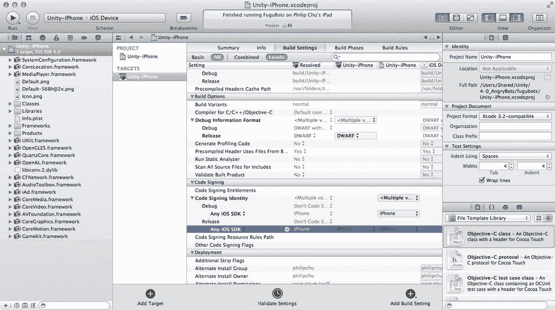

图 11-26. 在 Xcode 中为 Release 构建选择分发配置文件

从菜单栏的 **项目** 菜单中选择 **清理**，这将确保你用 **分发配置文件** 重新构建所有内容（图 11-27）。

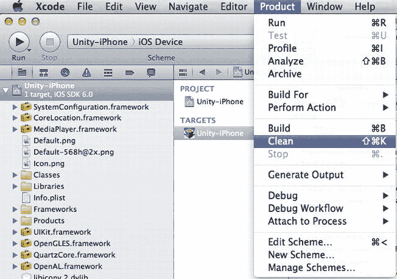

图 11-27. 在 Xcode 中归档前先清理构建

接着选择 **归档**，这将为应用构建一个分发版本（图 11-28）。

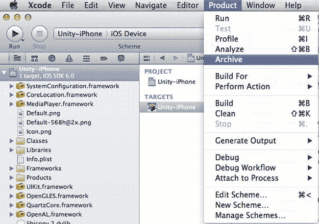

图 11-28. 在 Xcode 中归档构建以备分发

构建完成后，**管理器** 窗口会弹出，显示应用并带有 **验证** 和 **分发** 按钮（图 11-29）。

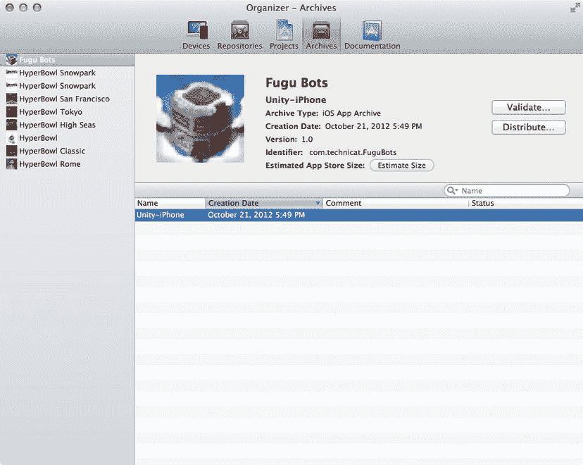

图 11-29. Xcode 管理器窗口中的归档分发构建


这里有一个`Estimate Size`按钮。你的应用在 App Store 上架前会经过 Apple 处理，这会增加应用体积。点击此按钮能让你预估应用的最终大小。

点击`Validate`按钮将检查应用是否会因各种构建或打包问题（例如，应用是使用开发描述文件而非分发描述文件构建的）而被立即拒绝。

**提示** 我发现使用`Validate`按钮并不能节省时间，因为`Validate`报告的任何错误都会在应用提交过程中被迅速报告。总体而言，直接提交应用效率更高。

点击`Distribution`按钮将启动应用提交流程，该流程由一系列弹出窗口组成（Figure 11-30）。

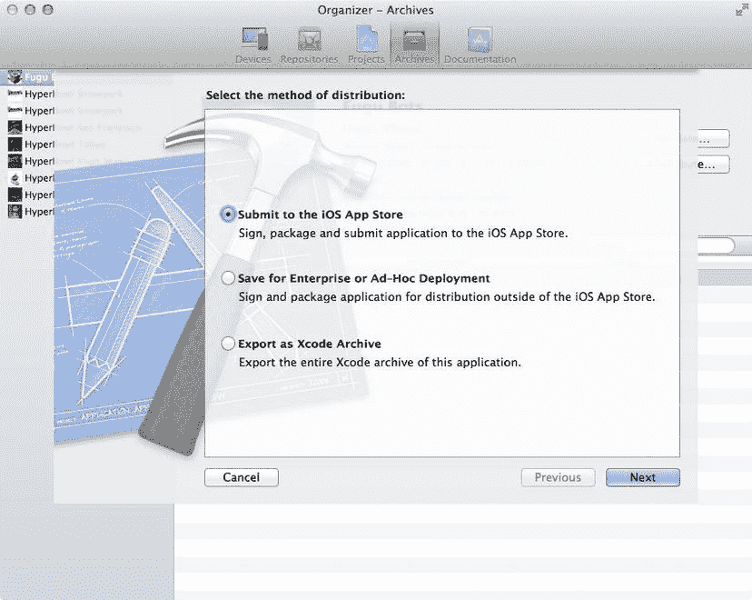

Figure 11-30. 在 Xcode Organizer 中向 App Store 提交应用时的第一个弹出窗口

第一个弹窗主要询问你希望对应用执行什么操作。默认选项`Submit to the iOS App Store`就是你需要的，所以直接点击`Next`，这将带你进入另一个弹窗，询问你要提交哪个应用以及你为该应用使用了哪个分发描述文件（Figure 11-31）。

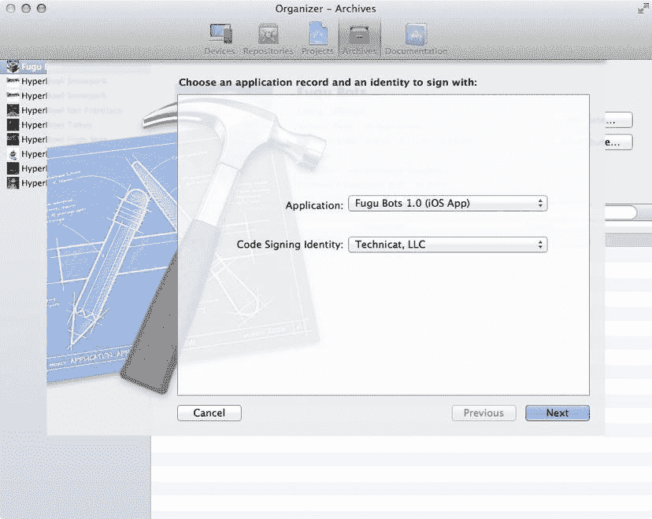

Figure 11-31. 在 Xcode Organizer 中为应用提交选择应用和描述文件

应用下拉列表包含了你在 iTunes Connect 上状态为`Waiting for Upload`的所有应用。选择你要提交的应用（如果它不在列表中，你可能忘记在 iTunes Connect 中为该应用点击`Ready to Upload`按钮）。

在选择匹配的应用和分发描述文件并点击`Next`后，应用将被上传到 Apple 进行提交。如果一切顺利，最终屏幕将显示你的应用已提交到 App Store（Figure 11-32）。

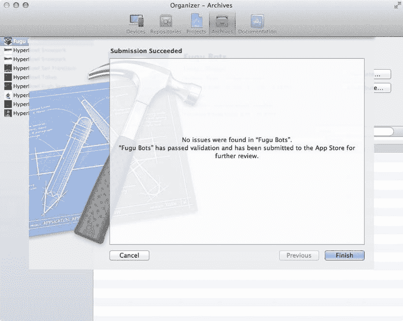

Figure 11-32. 在 Xcode Organizer 中成功提交应用

然后就是等待 Apple 批准或拒绝应用。

**提示** 提交后重新登录 iTunes Connect 并验证应用状态是否为`Waiting for Review`是一个好主意。即使应用二进制文件有效，审核也可能因例如缺少截图而被搁置。

你最终会收到一封电子邮件，通知你应用已在 App Store 上可用、已被拒绝，或者 Apple 需要更多时间来审核。此回复通常会在提交后几周内到达，但我曾有过应用在 24 小时内被接受，或在两个月后被拒绝的经历。当审核期延长时，Apple 通常会发送一封电子邮件，说明他们需要更多时间来审核你的应用。

### 为拒绝做好准备

如果应用被拒绝，电子邮件将告知你返回 iTunes Connect 中的应用，点击`Resolution Center`按钮查看并选择性地回应拒绝原因，这些原因可能包括技术问题、崩溃 Bug 或违反 Apple 的 App Store 审核指南（在注册成为 iOS 开发者后，你可以在 Apple 开发者网站上阅读该指南）。

如果你选择修改应用，你必须在再次上传前点击`Reject Binary`和`Ready for Upload`。如果你认为拒绝不合理，`Resolution Center`也允许你向 App Review Board 提出申诉。

如果被接受，并且你在 iTunes Connect 中选择了自动发布选项，应用将很快出现在 App Store 上。否则，应用将处于`Pending Developer Release`状态，直到你登录 iTunes Connect，点击应用的`View Details`，然后点击`Release this Version`按钮。

### 更新应用

应用被批准后，你可以随时返回 iTunes Connect 中的应用页面，点击`View Details`来编辑应用描述，修改后的文本将在几小时内显示在 App Store 上。iTunes Connect 页面还会显示一个`Add New Version`按钮。点击此按钮将引导你完成原始提交流程的简化版本，以提交应用更新。除了包 ID（bundle ID）外，你可以更改几乎所有详细信息，但唯一需要更改的是增加包版本（bundle version）。

**提示** 更新应用时，请记住同时增加 iTunes Connect 和 Unity Player Settings 中的包版本。

请注意，包 ID 中以句点分隔的组成部分被视为数字而不是字符串，因此将版本`247`更新为`2.049`是（令人惊讶地）可以的，因为它比较的是数字`47`和`49`（Figure 11-33）。

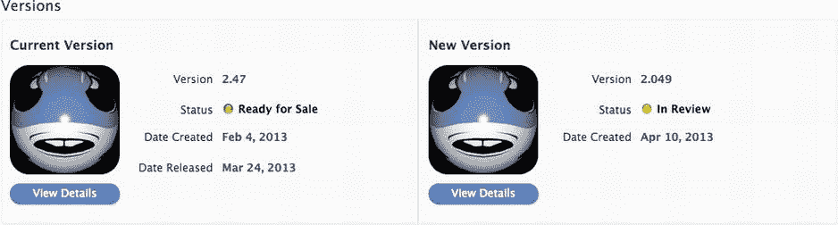

Figure 11-33. 在 iTunes Connect 中成功将应用版本号从`2.47`升级到`2.049`

但是，将版本`1.65`更新为`1.7`会比较数字`65`和`7`，这会导致提交错误消息（Figure 11-34）。

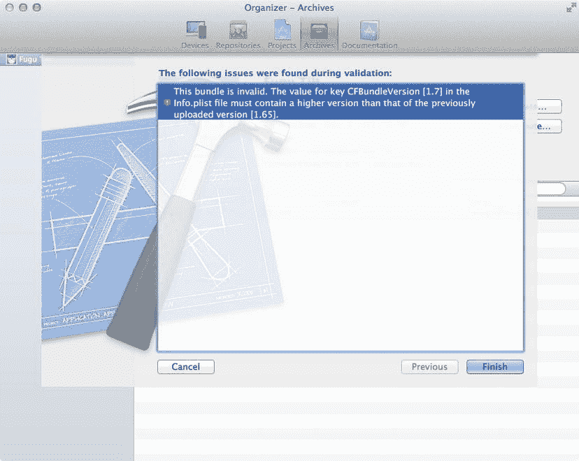

Figure 11-34. 在 Xcode Organizer 中未能成功将应用版本号从`1.65`更新为`1.7`

### 跟踪销售情况

应用的第一版本在 App Store 上架后，你可以通过登录 iTunes Connect 并点击`Payments and Financial Reports`链接来跟踪其下载量和收入（如果是付费应用）。结果页面会显示基于时间的销售图表、按国家/地区划分的销售明细以及生成报告的选项（Figure 11-35）。

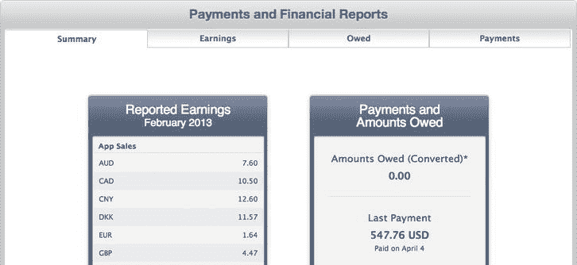

Figure 11-35. iTunes Connect 中的`Payment and Financial Reports`页面

### 发放促销代码

对于应用的每个版本，Apple 会提供 50 个促销代码，可用于在 App Store 免费下载应用（即使是免费应用也提供促销代码，尽管在这种情况下使用它们意义不大）。要获取应用的促销代码，请在 iTunes Connect 中点击该版本应用的`View Details`，然后点击右上角的`Promo Codes`按钮（Figure 11-36）。

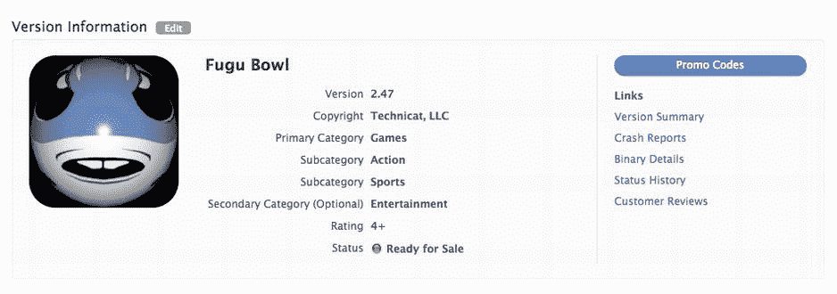

Figure 11-36. 在 iTunes Connect 中点击已上线应用的`View Details`

在同意一项协议后，你将看到一个下载按钮和一个用于指定要下载代码数量的字段（Figure 11-37）。

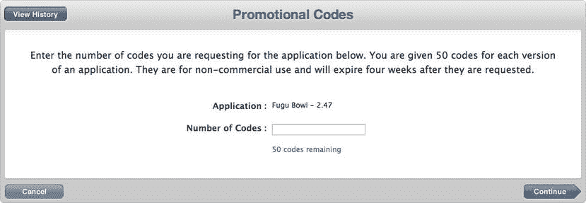

Figure 11-37. 用于输入要下载的促销代码数量的表单

点击`Continue`后，你将看到一份管理代码使用的`App Store Volume Custom Code Agreement`，然后是一个用于下载代码的按钮。点击此按钮将下载一个包含你请求数量的文本文件（Listing 11-1 显示了一些示例促销代码），并且它将通过电子邮件向你发送一份你刚同意的协议副本（如果这听起来很别扭，它类似于 Apple 在确认复选框旁的措辞“同意该协议”）。

**Listing 11-1.** 包含五个促销代码的促销代码文件

```
XY9LJRKMN7JM
TANFXAHR9EM9
XP6TMAFFHFLT
TXJ44ELTHETL
F9W3WEK7JL4Y
```

下载后，代码有效期 28 天，即使在此期间应用进行了更新。

**提示** 由于代码的过期日期基于其下载日期，你可以根据需要从 iTunes Connect 下载代码来节省使用量，而不是一次性下载全部 50 个。


